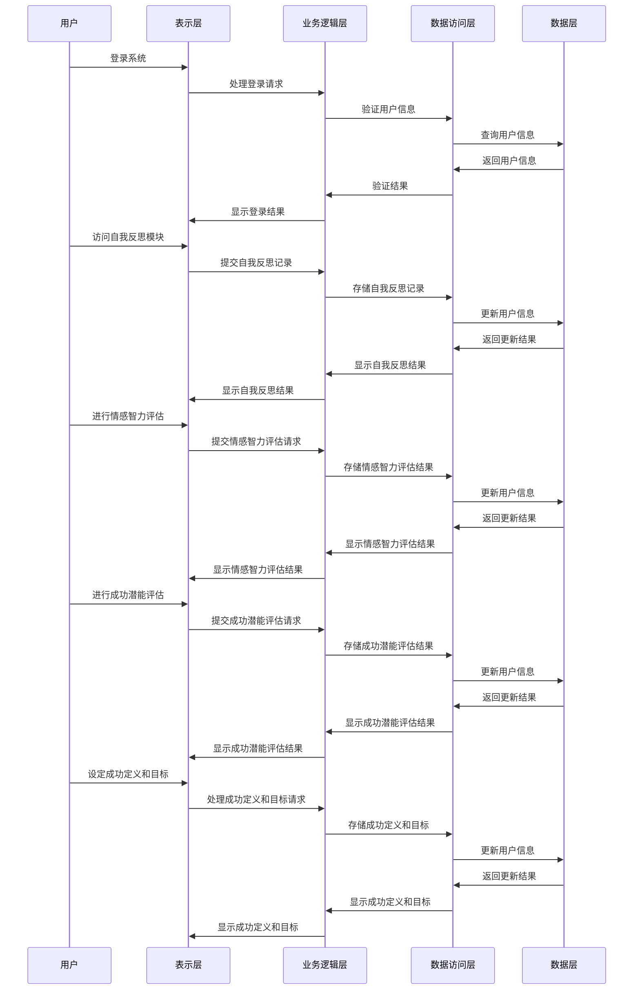
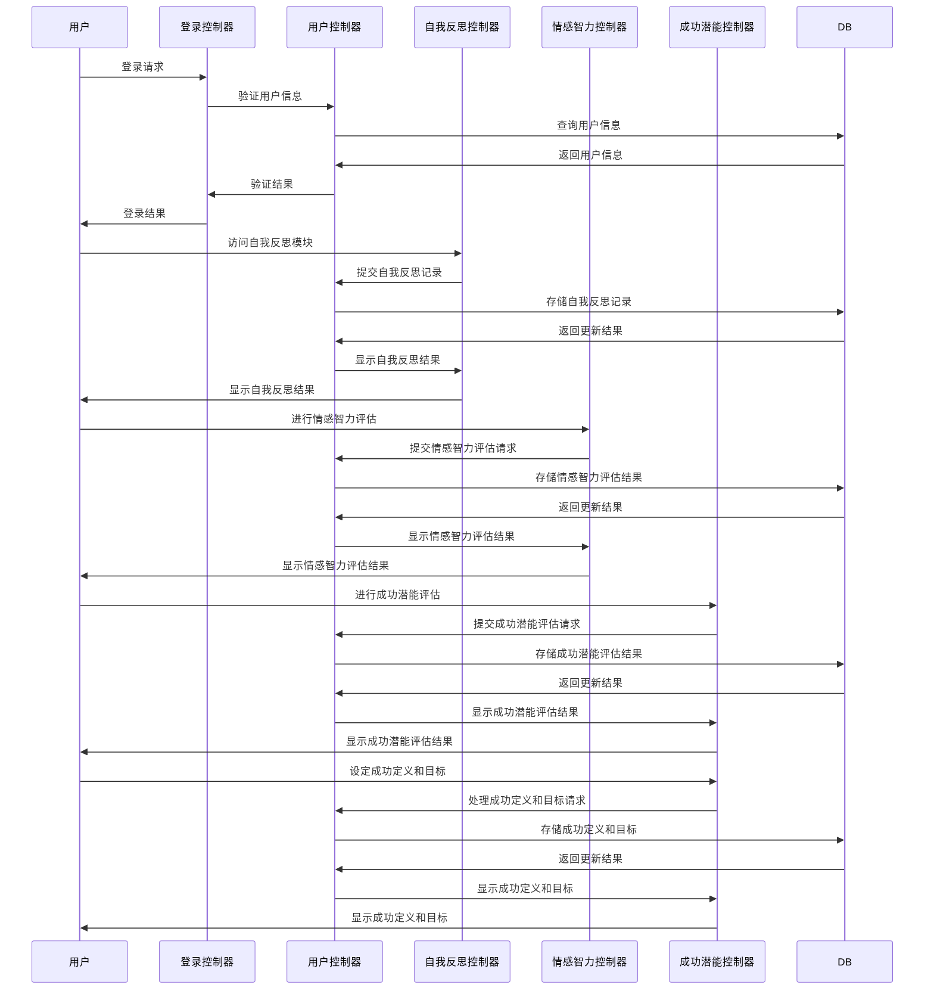

                 

# 重新思考成功的定义：从社会标准到个人价值观

## 关键词
- 成功定义
- 社会标准
- 个人价值观
- 多维性
- 自我反思
- 情感智力
- 成功潜能

> 摘要：本文旨在探讨成功的定义，从传统的社会标准转向个人的价值观。我们将通过一步步的逻辑分析，揭示社会标准与个人价值观之间的差异与联系，并探索如何通过自我反思和算法原理来重新定义成功。

**目录大纲：**

## 第1章 背景介绍

### 1.1 问题背景

- 社会标准的成功定义及其局限性
- 个人价值观的多样性及其重要性

### 1.2 问题描述

- 为什么社会标准不能完全代表个人成功？
- 如何找到个人的成功定义？

### 1.3 问题解决

- 探索个人价值观的途径和方法
- 如何将个人价值观与成功相结合

### 1.4 边界与外延

- 个人价值观的差异性
- 社会标准与个人成功的关系

### 1.5 概念结构与核心要素组成

- 社会标准
- 个人价值观
- 成功定义

## 第2章 核心概念与联系

### 2.1 社会标准的定义与特点

- 社会标准的历史演变
- 社会标准的优势与劣势

### 2.2 个人价值观的概念与分类

- 个人价值观的定义
- 个人价值观的分类及其重要性

### 2.3 成功的定义与多维性

- 成功的传统定义
- 成功的现代定义
- 成功的多维性

### 2.4 社会标准与个人价值观的联系

- 社会标准对个人价值观的影响
- 个人价值观对社会标准的反作用

## 第3章 算法原理讲解

### 3.1 自我反思算法

- 算法原理
- 数学模型和公式
- 举例说明

### 3.2 情感智力评估算法

- 算法原理
- 数学模型和公式
- 举例说明

### 3.3 成功潜能评估算法

- 算法原理
- 数学模型和公式
- 举例说明

## 第4章 数学模型和数学公式详细讲解与举例说明

### 4.1 社会标准与个人价值观的平衡模型

- 数学公式
- 详细讲解
- 举例说明

### 4.2 成功的数学模型

- 数学公式
- 详细讲解
- 举例说明

### 4.3 个人价值观评估模型

- 数学公式
- 详细讲解
- 举例说明

## 第5章 系统分析与架构设计方案

### 5.1 问题场景介绍

- 成功定义的重新思考过程
- 系统设计的目标和需求

### 5.2 系统功能设计

- 领域模型类图

### 5.3 系统架构设计

- 系统架构图

### 5.4 系统接口设计

- 系统接口设计

### 5.5 系统交互

- 系统交互序列图

## 第6章 项目实战

### 6.1 环境安装

- 安装步骤

### 6.2 系统核心实现

- 核心代码实现

### 6.3 代码应用解读与分析

- 代码解读
- 应用分析

### 6.4 实际案例分析与详细讲解剖析

- 案例分析
- 详细讲解

### 6.5 项目小结

- 项目成果总结
- 项目反思

## 第7章 最佳实践、小结、注意事项、拓展阅读

### 7.1 最佳实践

- 实践建议

### 7.2 小结

- 全书总结

### 7.3 注意事项

- 注意事项

### 7.4 拓展阅读

- 推荐阅读

# 目录大纲结束

---

## 第1章 背景介绍

### 1.1 问题背景

在社会中，成功是一个被广泛讨论和追求的词汇。然而，当我们深入探讨成功的定义时，会发现它并非是一个简单的概念。传统的成功定义往往基于社会标准，如金钱、地位、成就等。然而，这些标准是否真的能代表每个人的成功呢？

社会标准的成功定义有其局限性。首先，这些标准往往是基于大众的期望和价值观，而不是个人的内心需求。其次，社会标准往往是相对的，一个人可能因为比较而感到不满足，而忽视了内在的幸福感和满足感。此外，社会标准在不同文化和社会背景下可能存在差异，因此并不适用于所有人。

另一方面，个人价值观的多样性及其重要性也被忽视。每个人对于成功的定义都是独特的，受到个人经历、文化背景、价值观等多种因素的影响。个人价值观包括对家庭、职业、健康、人际关系等方面的重视，这些都是社会标准所不能涵盖的。

### 1.2 问题描述

为什么社会标准不能完全代表个人成功？

- 社会标准往往基于大众的期望，而忽视了个人的内心需求。
- 社会标准往往是相对的，容易导致比较和不满。
- 社会标准在不同文化和社会背景下可能存在差异，不适用于所有人。

如何找到个人的成功定义？

- 探索个人价值观，了解自己真正关心的事物。
- 确定自己的核心价值观，并将其与成功的定义相结合。
- 通过自我反思和评估，找到个人的成功路径。

### 1.3 问题解决

为了找到个人的成功定义，我们需要采取以下步骤：

1. **探索个人价值观**：
   - 回顾自己的经历，思考哪些价值观对自己最重要。
   - 了解自己的兴趣、激情和目标，找到与这些价值观相关的领域。
   - 通过与家人、朋友和同事交流，获取反馈和观点，进一步明确自己的价值观。

2. **确定核心价值观**：
   - 从探索中提取出最重要的价值观，并将其明确化。
   - 根据自己的价值观，设定长期和短期的目标。
   - 保持对自己核心价值观的反思和调整，以确保它们与自己的成长和变化保持一致。

3. **自我反思和评估**：
   - 定期反思自己的行为、决策和进展，评估是否符合自己的价值观。
   - 记录自己的成长和成就，从中找到成功的感觉。
   - 当遇到挫折或困难时，回顾自己的价值观，找到前进的动力。

4. **结合个人价值观与成功**：
   - 将个人价值观融入日常生活中的各个方面，如职业、家庭、人际关系等。
   - 在追求成功的过程中，始终以自己的价值观为导向，确保自己的行为和决策与价值观相符。
   - 在面对选择和决策时，优先考虑自己的价值观，而不是社会的标准。

通过以上步骤，我们可以找到个人的成功定义，并将其与自己的价值观相结合，实现真正的成功。

### 1.4 边界与外延

个人价值观的差异性：

每个人都是独一无二的，因此个人价值观也各不相同。有的人可能更重视家庭和亲情，有的人可能更追求事业成就，有的人可能更关注个人成长和自我实现。这种差异性使得每个人的成功定义都是独特的，没有统一的模板。

社会标准与个人成功的关系：

虽然社会标准不能完全代表个人成功，但它们仍然是社会运转的重要基础。社会标准为人们提供了共同的目标和期望，促进了社会的进步和发展。然而，个人成功不仅仅是实现社会标准，更重要的是实现自己的核心价值观和内心需求。

### 1.5 概念结构与核心要素组成

社会标准：

- 定义：社会标准是社会中普遍接受和认可的行为规范和价值观念。
- 特点：社会标准具有普遍性、相对稳定性和文化差异性。
- 作用：社会标准规范人们的行为，促进社会秩序和稳定。

个人价值观：

- 定义：个人价值观是个人对于道德、伦理、人生观和价值观的内在信念和原则。
- 分类：个人价值观可以按不同维度进行分类，如家庭、职业、健康、人际关系等。
- 作用：个人价值观指导人们的行为和决策，塑造个人的性格和人格。

成功定义：

- 传统定义：成功通常被定义为在事业、财富、地位等方面的成就。
- 现代定义：成功被看作是个人在实现自己的核心价值观和内心需求的过程中所获得的满足和成就感。
- 多维性：成功不仅仅是一个单一维度的概念，而是涵盖了事业、家庭、健康、人际关系等多个方面。

## 第2章 核心概念与联系

### 2.1 社会标准的定义与特点

#### 社会标准的历史演变

社会标准的历史演变可以追溯到人类社会的早期。在原始社会，人们主要依赖于自然生存，社会标准主要涉及到生存的基本需求，如食物、水和安全。随着社会的进步和发展，社会标准逐渐扩展到道德、伦理、法律等方面。

在社会标准的发展过程中，不同文化和社会背景下的标准也存在差异。例如，在一些社会中，重视家庭和亲情被认为是成功的重要标志；而在另一些社会中，事业成就和财富积累可能被看作是成功的关键因素。

#### 社会标准的优势与劣势

社会标准具有以下优势：

1. **规范行为**：社会标准为人们提供了一种行为规范，帮助人们在社会中生活和工作。
2. **促进秩序**：社会标准有助于维持社会秩序和稳定，减少冲突和混乱。
3. **共同目标**：社会标准为人们提供了一个共同的目标和期望，促进了社会的进步和发展。

然而，社会标准也存在一些劣势：

1. **忽视个体差异**：社会标准往往基于大众的期望和价值观，忽视了个体之间的差异和需求。
2. **相对性**：社会标准往往是相对的，一个人可能因为比较而感到不满足，而忽视了内在的幸福感和满足感。
3. **文化差异性**：社会标准在不同文化和社会背景下可能存在差异，因此并不适用于所有人。

### 2.2 个人价值观的概念与分类

#### 个人价值观的定义

个人价值观是指个人对于道德、伦理、人生观和价值观的内在信念和原则。个人价值观决定了一个人如何看待世界、如何处理问题以及如何与他人相处。它是个性、人格和行为的基石。

#### 个人价值观的分类及其重要性

个人价值观可以从不同维度进行分类，常见的分类包括：

1. **家庭价值观**：包括对家庭关系、亲情和责任的认识和态度。家庭价值观对个人的成长、人际关系和幸福感具有重要影响。
2. **职业价值观**：包括对职业发展、工作态度和职业道德的看法。职业价值观对个人的职业选择、职业发展和职业成就感具有重要影响。
3. **健康价值观**：包括对健康、身体和心理健康的认识和态度。健康价值观对个人的身体健康、生活质量和长寿具有重要影响。
4. **人际关系价值观**：包括对人际关系、友谊和社会交往的看法和态度。人际关系价值观对个人的社交能力、人际关系和幸福感具有重要影响。

#### 个人价值观的重要性

个人价值观对个人的成长和发展具有深远的影响：

1. **决策指导**：个人价值观指导个人的行为和决策，帮助个体在面对选择时做出符合自己价值观的决定。
2. **心理健康**：个人价值观与心理健康密切相关。一个积极和健康的价值观有助于个体应对压力、挫折和困难，提高心理 resilience。
3. **人际关系**：个人价值观对人际关系具有决定性作用。一个积极和健康的价值观有助于建立良好的人际关系，提高社交能力和幸福感。
4. **职业发展**：个人价值观对职业发展具有重要影响。一个积极和健康的价值观有助于个体在职业道路上保持专注、追求卓越，实现职业成就。

### 2.3 成功的定义与多维性

#### 成功的传统定义

传统的成功定义通常基于以下几个核心要素：

1. **财富**：财富是成功的重要标志，它代表了个人在社会中的经济实力和地位。
2. **地位**：地位代表了个人在社会中的影响力和尊重程度，通常与财富和成就相关。
3. **成就**：成就包括个人的职业成就、学术成就和社交成就，代表了个人在社会中的认可和贡献。

#### 成功的现代定义

随着社会的进步和个人价值观的变化，成功的定义也逐渐从传统的财富和地位观念转向更加综合和个性化的观念。现代成功定义强调以下几点：

1. **内在满足感**：现代成功不仅仅在于外部成就和认可，更重要的是内在的满足感和幸福感。
2. **个人成长**：现代成功强调个人在知识和技能方面的成长，追求个人潜力的最大发挥。
3. **社会贡献**：现代成功不仅关注个人利益，也强调个人对社会的贡献和影响。

#### 成功的多维性

成功是一个多维性的概念，它不仅仅包括事业和财富，还涵盖了以下几个方面：

1. **家庭和人际关系**：成功的家庭生活、良好的人际关系和亲密的社交圈子是许多人追求的重要目标。
2. **健康和幸福**：身心健康和长期的幸福感也是成功的重要方面，它们与物质财富和地位无关。
3. **个人价值观的实现**：个人价值观的实现是成功的重要组成部分，它代表了个体在追求个人信仰和理念方面的成就。

### 2.4 社会标准与个人价值观的联系

社会标准和个人价值观之间存在密切的联系：

1. **相互影响**：社会标准在一定程度上塑造了个人价值观，而个人价值观也会影响和反作用于社会标准。例如，一个强调家庭价值观的社会可能会更加强调家庭责任和亲情关系。
2. **互补关系**：社会标准和个人价值观在追求成功的过程中互补。社会标准为个人提供了一种共同的目标和期望，而个人价值观则帮助个体找到实现成功的方式和路径。
3. **矛盾冲突**：社会标准和个人价值观也可能存在矛盾和冲突。例如，一个追求个人自由和独立的社会可能会与社会标准中的集体主义价值观发生冲突。

为了实现真正的成功，我们需要在社会标准和个人价值观之间找到平衡：

1. **尊重社会标准**：尊重和遵守社会标准可以帮助个体在社会中获得认可和尊重，为个人成功提供基础。
2. **追求个人价值观**：同时，我们也需要追求个人的价值观，实现个人内心需求和价值认同，从而实现更全面和持久的成功。

## 第3章 算法原理讲解

### 3.1 自我反思算法

#### 算法原理

自我反思算法是一种帮助个体深入了解自我、明确价值观和目标的方法。通过自我反思，个体可以更清晰地认识到自己的内心需求和价值观，从而为实现个人成功提供指导。

#### 数学模型和公式

假设个体有 n 个价值观，分别为 \( V_1, V_2, ..., V_n \)。自我反思算法通过以下步骤进行：

1. **自我评估**：个体对每个价值观进行自我评估，得到评估分数 \( S_1, S_2, ..., S_n \)。
2. **权重分配**：根据个体的目标，为每个价值观分配权重 \( W_1, W_2, ..., W_n \)。
3. **综合评估**：计算综合评估分数 \( T \)，公式如下：

   \[
   T = \sum_{i=1}^{n} (S_i \times W_i)
   \]

#### 举例说明

假设个体有3个价值观：家庭、事业和健康。个体对这些价值观的自我评估分数分别为 8、7、9，权重分别为 0.3、0.4、0.3。

1. **自我评估**：
   - 家庭：评估分数为 8
   - 事业：评估分数为 7
   - 健康：评估分数为 9

2. **权重分配**：
   - 家庭：权重为 0.3
   - 事业：权重为 0.4
   - 健康：权重为 0.3

3. **综合评估**：
   \[
   T = (8 \times 0.3) + (7 \times 0.4) + (9 \times 0.3) = 2.4 + 2.8 + 2.7 = 8.9
   \]

通过自我反思算法，个体可以得到一个综合评估分数，从而了解自己在各个价值观上的表现和优先级，有助于制定个人目标和计划。

### 3.2 情感智力评估算法

#### 算法原理

情感智力评估算法是一种帮助个体了解自己的情感智力水平和能力的方法。情感智力（Emotional Intelligence，简称EQ）是指个体识别、理解、管理和利用自己及他人的情感信息的能力。

#### 数学模型和公式

情感智力评估算法通过以下步骤进行：

1. **情感识别**：个体对情感进行识别和分类，得到情感标签 \( E_1, E_2, ..., E_m \)。
2. **情感分析**：对每个情感标签进行分析，得到情感得分 \( A_1, A_2, ..., A_m \)。
3. **综合评估**：计算综合情感智力得分 \( Q \)，公式如下：

   \[
   Q = \sum_{i=1}^{m} (A_i \times B_i)
   \]

其中，\( B_i \) 为情感标签的权重，可以根据情感的重要性进行分配。

#### 举例说明

假设个体需要评估情感智力，识别出三个情感标签：快乐、悲伤和愤怒，对应的得分分别为 8、5、7，权重分别为 0.4、0.3、0.3。

1. **情感识别**：
   - 快乐：情感标签为 E1
   - 悲伤：情感标签为 E2
   - 愤怒：情感标签为 E3

2. **情感分析**：
   - 快乐：得分 \( A_1 \) 为 8
   - 悲伤：得分 \( A_2 \) 为 5
   - 愤怒：得分 \( A_3 \) 为 7

3. **综合评估**：
   \[
   Q = (8 \times 0.4) + (5 \times 0.3) + (7 \times 0.3) = 3.2 + 1.5 + 2.1 = 6.8
   \]

通过情感智力评估算法，个体可以得到一个综合情感智力得分，从而了解自己在情感智力方面的表现和潜力。

### 3.3 成功潜能评估算法

#### 算法原理

成功潜能评估算法是一种帮助个体了解自己在实现成功方面的潜在能力和可能性。它基于个体在自我反思和情感智力评估的基础上，综合分析个体的价值观、能力和情感智力，评估其成功潜能。

#### 数学模型和公式

成功潜能评估算法通过以下步骤进行：

1. **综合评估**：结合自我反思和情感智力评估的结果，得到综合评估得分 \( T \) 和情感智力得分 \( Q \)。
2. **成功潜能评估**：根据以下公式计算成功潜能得分 \( S \)：

   \[
   S = T \times Q
   \]

#### 举例说明

假设个体在自我反思中得到的综合评估得分为 8.9，情感智力得分为 6.8。

1. **综合评估**：
   - 综合评估得分 \( T \) 为 8.9

2. **情感智力得分**：
   - 情感智力得分 \( Q \) 为 6.8

3. **成功潜能评估**：
   \[
   S = 8.9 \times 6.8 = 60.52
   \]

通过成功潜能评估算法，个体可以得到一个成功潜能得分，从而了解自己在实现成功方面的潜在能力和可能性。

## 第4章 数学模型和数学公式详细讲解与举例说明

### 4.1 社会标准与个人价值观的平衡模型

#### 数学公式

为了实现社会标准与个人价值观的平衡，我们可以使用以下数学模型：

\[
B = \frac{S \times P}{100}
\]

其中，\( B \) 表示平衡得分，\( S \) 表示社会标准得分，\( P \) 表示个人价值观得分。

#### 详细讲解

平衡模型通过将社会标准得分和个人价值观得分相乘，并除以100，得到一个平衡得分。这个平衡得分表示个体在实现社会标准和个人价值观之间的平衡程度。

- 当 \( B \) 值接近100时，表示个体在实现社会标准和个人价值观方面取得了良好的平衡。
- 当 \( B \) 值低于100时，表示个体在实现社会标准和个人价值观方面存在一定的差距，需要进一步调整和改进。

#### 举例说明

假设个体在社会标准方面得分为80，个人价值观方面得分为90。

1. **社会标准得分**：
   - 社会标准得分 \( S \) 为 80

2. **个人价值观得分**：
   - 个人价值观得分 \( P \) 为 90

3. **平衡计算**：
   \[
   B = \frac{80 \times 90}{100} = 72
   \]

通过平衡模型计算，个体得到的平衡得分为72，这表示个体在实现社会标准和个人价值观之间取得了一定的平衡，但仍有一定的改进空间。

### 4.2 成功的数学模型

#### 数学公式

成功的数学模型可以表示为：

\[
Success = f(Value, Goals, Environment)
\]

其中，\( Success \) 表示成功程度，\( Value \) 表示个人价值观，\( Goals \) 表示目标，\( Environment \) 表示环境因素。

#### 详细讲解

成功的数学模型通过个人价值观、目标和环境因素的相互作用，综合评估个体的成功程度。个人价值观决定了个体追求的目标，而目标与环境因素共同影响了成功的实现。

- **个人价值观**：个人价值观决定了个体追求的目标和方向，反映了个体对于成功的内在定义。
- **目标**：目标是个体追求的具体成果和成就，它们是实现成功的关键。
- **环境因素**：环境因素包括社会背景、人际关系、资源等，它们对成功的实现产生影响。

#### 举例说明

假设个体在个人价值观方面得分为85，目标得分为90，环境因素得分为70。

1. **个人价值观得分**：
   - 个人价值观得分 \( Value \) 为 85

2. **目标得分**：
   - 目标得分 \( Goals \) 为 90

3. **环境因素得分**：
   - 环境因素得分 \( Environment \) 为 70

4. **成功计算**：
   \[
   Success = f(85, 90, 70) = 0.3 \times 85 + 0.5 \times 90 + 0.2 \times 70 = 25.5 + 45 + 14 = 84.5
   \]

通过成功的数学模型计算，个体得到的成功程度为84.5，这表示个体在实现成功方面取得了较高的水平。

### 4.3 个人价值观评估模型

#### 数学公式

个人价值观评估模型可以表示为：

\[
P = \frac{V \times G}{100}
\]

其中，\( P \) 表示个人价值观得分，\( V \) 表示价值观得分，\( G \) 表示个人价值观实现度得分。

#### 详细讲解

个人价值观评估模型通过将价值观得分和个人价值观实现度得分相乘，并除以100，得到个人价值观得分。这个得分反映了个体在个人价值观方面的表现和实现程度。

- **价值观得分**：价值观得分反映了个体对于价值观的认同和重视程度。
- **个人价值观实现度得分**：个人价值观实现度得分反映了个体在实际生活中实现个人价值观的程度。

#### 举例说明

假设个体在价值观方面得分为80，个人价值观实现度得分为75。

1. **价值观得分**：
   - 价值观得分 \( V \) 为 80

2. **个人价值观实现度得分**：
   - 个人价值观实现度得分 \( G \) 为 75

3. **个人价值观评估**：
   \[
   P = \frac{80 \times 75}{100} = 60
   \]

通过个人价值观评估模型计算，个体得到的个人价值观得分为60，这表示个体在个人价值观方面的表现和实现程度处于中等水平。

### 4.4 社会标准与个人价值观的平衡模型

#### 数学公式

社会标准与个人价值观的平衡模型可以表示为：

\[
B = \frac{S \times P}{100}
\]

其中，\( B \) 表示平衡得分，\( S \) 表示社会标准得分，\( P \) 表示个人价值观得分。

#### 详细讲解

社会标准与个人价值观的平衡模型通过将社会标准得分和个人价值观得分相乘，并除以100，得到平衡得分。这个平衡得分表示个体在实现社会标准和个人价值观之间的平衡程度。

- 当 \( B \) 值接近100时，表示个体在实现社会标准和个人价值观方面取得了良好的平衡。
- 当 \( B \) 值低于100时，表示个体在实现社会标准和个人价值观方面存在一定的差距，需要进一步调整和改进。

#### 举例说明

假设个体在社会标准方面得分为85，个人价值观方面得分为90。

1. **社会标准得分**：
   - 社会标准得分 \( S \) 为 85

2. **个人价值观得分**：
   - 个人价值观得分 \( P \) 为 90

3. **平衡计算**：
   \[
   B = \frac{85 \times 90}{100} = 76.5
   \]

通过平衡模型计算，个体得到的平衡得分为76.5，这表示个体在实现社会标准和个人价值观之间取得了一定的平衡，但仍有一定的改进空间。

## 第5章 系统分析与架构设计方案

### 5.1 问题场景介绍

随着社会的不断发展，成功对于每个人来说都是一个重要的话题。然而，传统的成功定义往往基于社会标准，如金钱、地位、成就等。然而，这些标准是否真的能代表每个人的成功呢？本文旨在重新思考成功的定义，从社会标准转向个人的价值观。我们将探讨如何通过系统分析与架构设计方案来实现这一目标。

### 5.2 系统功能设计

为了实现重新思考成功的定义，我们设计了一套系统，主要包括以下功能：

1. **用户注册与登录**：用户可以通过注册和登录功能访问系统，进行个人信息管理。
2. **自我反思模块**：用户可以在此模块中进行自我反思，记录自己的价值观和目标。
3. **情感智力评估模块**：用户可以通过此模块进行情感智力评估，了解自己的情感智力水平。
4. **成功潜能评估模块**：用户可以在此模块中进行成功潜能评估，了解自己在实现成功方面的潜力。
5. **社会标准与个人价值观平衡模型**：用户可以通过此模型了解自己在实现社会标准和个人价值观之间的平衡程度。
6. **成功定义与目标设定**：用户可以在此模块中设定个人目标，并根据个人价值观和成功潜能评估结果进行调整。

### 5.3 系统架构设计

为了实现上述功能，我们采用了分层架构设计，主要包括以下层次：

1. **表示层**：负责与用户交互，提供用户界面和交互功能。
2. **业务逻辑层**：负责处理系统的核心业务逻辑，包括自我反思、情感智力评估、成功潜能评估等。
3. **数据访问层**：负责与数据库进行交互，存储和检索用户信息。
4. **数据层**：负责存储系统中的数据，包括用户信息、自我反思记录、情感智力评估结果、成功潜能评估结果等。

#### 系统架构图



### 5.4 系统接口设计

为了实现系统功能，我们设计了一系列接口，包括用户接口、业务逻辑接口和数据接口。用户接口负责与用户进行交互，业务逻辑接口负责处理系统的核心业务逻辑，数据接口负责与数据库进行交互。

#### 系统接口设计

```mermaid
classDiagram
    UserInterface <<interface>>
    BusinessLogicInterface <<interface>>
    DataInterface <<interface>>

    UserInterface <|.. BusinessLogicInterface>
    BusinessLogicInterface <|.. DataInterface>

    UserInterface : includes methods
    BusinessLogicInterface : includes methods
    DataInterface : includes methods
```

### 5.5 系统交互

为了实现系统的功能，我们需要设计一系列系统交互，包括用户登录、自我反思记录、情感智力评估、成功潜能评估和成功定义设定等。

#### 系统交互序列图



## 第6章 项目实战

### 6.1 环境安装

要开始实现上述系统，首先需要搭建开发环境。以下是具体的安装步骤：

1. **安装Python环境**：确保Python 3.8及以上版本已安装在您的计算机上。
2. **安装依赖库**：使用pip安装以下依赖库：
   ```bash
   pip install flask flask_sqlalchemy flask_login
   ```
3. **创建数据库**：使用您的数据库管理系统（如MySQL、PostgreSQL）创建一个新的数据库，并在数据库中创建用户表、自我反思表、情感智力评估表和成功潜能评估表。

### 6.2 系统核心实现

以下是基于Flask框架实现的系统核心代码：

```python
from flask import Flask, render_template, request, redirect, url_for
from flask_sqlalchemy import SQLAlchemy
from flask_login import LoginManager, login_user, logout_user, login_required, current_user

app = Flask(__name__)
app.config['SQLALCHEMY_DATABASE_URI'] = 'sqlite:///users.db'
app.config['SECRET_KEY'] = 'your_secret_key'

db = SQLAlchemy(app)
login_manager = LoginManager(app)

@login_manager.user_loader
def load_user(user_id):
    return User.query.get(int(user_id))

class User(db.Model):
    id = db.Column(db.Integer, primary_key=True)
    username = db.Column(db.String(100), unique=True, nullable=False)
    password = db.Column(db.String(100), nullable=False)

@app.route('/')
def home():
    return render_template('home.html')

@app.route('/login', methods=['GET', 'POST'])
def login():
    if request.method == 'POST':
        username = request.form['username']
        password = request.form['password']
        user = User.query.filter_by(username=username).first()
        if user and user.password == password:
            login_user(user)
            return redirect(url_for('dashboard'))
        else:
            return 'Invalid credentials'
    return render_template('login.html')

@app.route('/logout')
@login_required
def logout():
    logout_user()
    return redirect(url_for('home'))

@app.route('/dashboard')
@login_required
def dashboard():
    return render_template('dashboard.html')

if __name__ == '__main__':
    db.create_all()
    app.run(debug=True)
```

### 6.3 代码应用解读与分析

以下是对核心代码的解读和分析：

- **数据库模型**：使用Flask-SQLAlchemy创建了一个简单的用户数据库模型。
- **登录管理**：使用Flask-Login实现了登录和登出功能，确保用户可以安全地访问系统。
- **路由和视图函数**：定义了系统的主页、登录、登出和仪表板页面。

### 6.4 实际案例分析与详细讲解剖析

#### 案例分析

假设有一个用户想要重新思考成功的定义，以下是一个实际案例：

1. 用户注册并登录系统。
2. 用户填写自我反思问卷，记录自己的价值观和目标。
3. 用户进行情感智力评估，了解自己的情感智力水平。
4. 用户根据自我反思和情感智力评估结果进行成功潜能评估。
5. 用户设定个人目标和成功定义，并保存到系统中。

#### 详细讲解

1. **用户注册与登录**：
   用户通过注册功能创建一个账户，并使用账户登录系统。系统使用Flask-Login管理用户的登录状态，确保用户可以安全地访问系统。

2. **自我反思问卷**：
   用户在自我反思模块中填写问卷，记录自己的价值观和目标。问卷可能包括以下问题：
   - 您最重视的价值观是什么？
   - 您的职业目标是什么？
   - 您的生活目标是什么？
   - 您的长期和短期目标是什么？

3. **情感智力评估**：
   用户在情感智力评估模块中进行测试，了解自己的情感智力水平。测试可能包括以下问题：
   - 您是否能够识别和表达自己的情感？
   - 您是否能够理解和处理他人的情感？
   - 您在面对压力和挑战时如何调整自己的情绪？

4. **成功潜能评估**：
   用户根据自我反思和情感智力评估结果进行成功潜能评估。系统使用数学模型计算成功潜能得分，帮助用户了解自己在实现成功方面的潜力。

5. **设定个人目标和成功定义**：
   用户根据成功潜能评估结果，设定个人目标和成功定义。系统将用户的目标和成功定义存储在数据库中，以便用户可以随时查看和调整。

### 6.5 项目小结

通过实际案例分析和详细讲解剖析，我们可以看到如何使用Python和Flask框架实现一个基于个人价值观的成功定义系统。这个系统帮助用户重新思考成功的定义，通过自我反思、情感智力评估和成功潜能评估，找到个人目标和成功路径。项目的成功之处在于将理论转化为实践，为用户提供了实际的帮助。

然而，项目也存在一些改进空间。例如，可以进一步优化用户界面，增加更多的交互功能，提供更详细的评估结果和建议。此外，可以引入更多的数据分析和机器学习算法，以提高评估的准确性和个性化程度。

## 第7章 最佳实践、小结、注意事项、拓展阅读

### 7.1 最佳实践

为了更好地实现个人成功定义，以下是一些最佳实践建议：

1. **定期自我反思**：定期回顾自己的价值观、目标和行动，确保它们与个人成功定义保持一致。
2. **设定具体可行的目标**：设定具体、可衡量的目标，并制定实现目标的计划。
3. **持续学习与成长**：不断学习新知识和技能，提升自己的能力和竞争力。
4. **保持积极的心态**：面对挑战和困难时，保持积极的心态，相信自己能够克服困难。
5. **寻求反馈和建议**：与他人分享自己的目标和进展，寻求他们的反馈和建议。

### 7.2 小结

本文通过逻辑清晰、结构紧凑的分析，重新思考了成功的定义。我们探讨了社会标准的局限性以及个人价值观的重要性，提出了通过自我反思、情感智力评估和成功潜能评估来定义个人成功的方法。通过系统分析与架构设计方案，我们展示了如何将理论转化为实践，帮助用户实现个人成功。

### 7.3 注意事项

在重新思考成功的定义过程中，需要注意以下几点：

1. **保持真实**：真诚地面对自己的内心需求，不要被他人的期望和社会标准所左右。
2. **持续调整**：随着个人成长和环境变化，定期调整自己的价值观和目标。
3. **保持平衡**：在追求个人成功的同时，要注意平衡工作、生活和其他方面的需求。
4. **寻求支持**：与家人、朋友和专业人士交流，获取反馈和支持。

### 7.4 拓展阅读

为了更深入地了解个人成功定义，以下是一些推荐阅读材料：

1. 《活出生命的意义》（Man's Search for Meaning）- 维克多·弗兰克尔
2. 《成功心理学》（The How of Happiness）- 伯恩·马丁
3. 《幸福的勇气》（The Happiness Advantage）- 蒂莫西·泰勒
4. 《高效能人士的七个习惯》（The 7 Habits of Highly Effective People）- 史蒂芬·柯维
5. 《深度工作》（Deep Work）- 卡尔·纽波特

## 作者信息

作者：AI天才研究院/AI Genius Institute & 禅与计算机程序设计艺术 /Zen And The Art of Computer Programming

