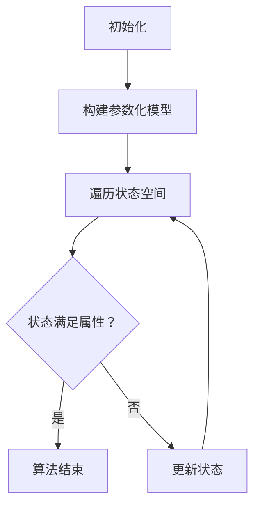
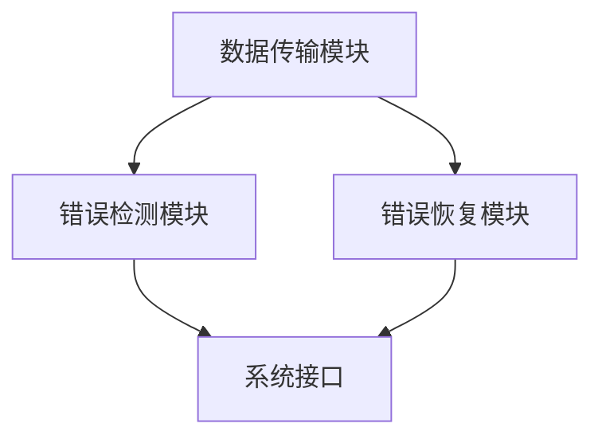
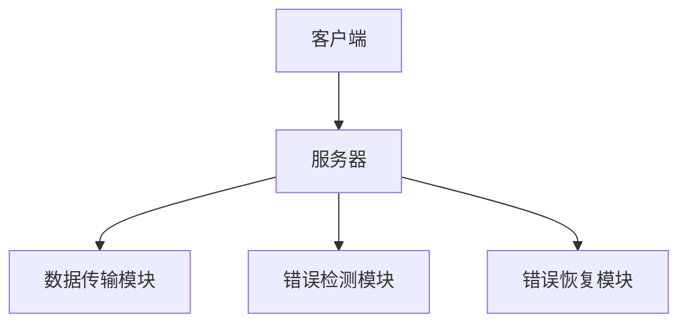
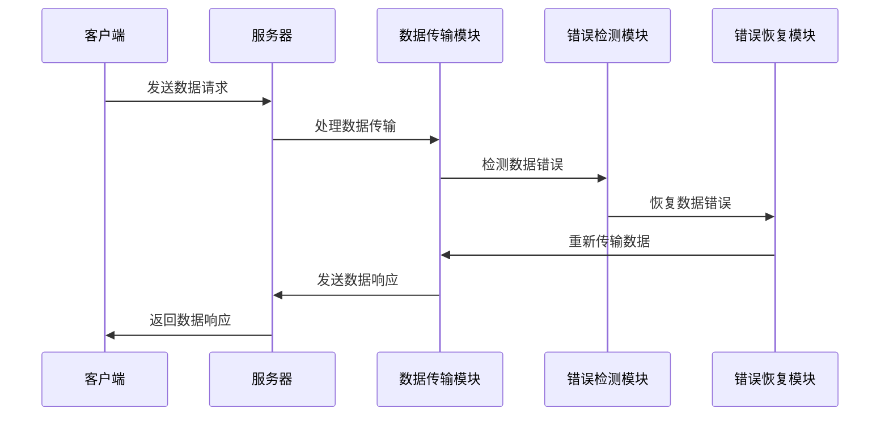

                 

### 参数化验证：可扩展的形式化方法

> 关键词：参数化验证、形式化方法、算法原理、数学模型、系统架构、项目实战

> 摘要：本文深入探讨了参数化验证这一重要概念，从基础概念、核心算法到实际应用，系统地分析了其在现代IT领域中的重要性。通过详细的理论讲解、代码实例和系统架构设计，帮助读者全面理解参数化验证的技术原理和实践方法。

---

## 参数化验证基础

### 参数化验证的概念

参数化验证是一种形式化验证方法，通过引入参数化模型，对系统或程序的属性进行验证。这种方法的关键在于将具体的系统实例抽象成参数化的模型，以便更广泛地验证系统行为。与传统验证方法相比，参数化验证具有更强的可扩展性和灵活性。

### 参数化验证的发展历程

参数化验证起源于20世纪80年代的软件工程领域，最初应用于复杂的系统验证。随着形式化方法和模型检查技术的成熟，参数化验证逐渐成为形式化验证的主流方法之一。近年来，随着云计算、物联网等技术的发展，参数化验证的应用场景更加广泛，成为了现代IT系统可靠性保障的重要手段。

### 参数化验证的重要性

在现代软件开发过程中，参数化验证的重要性日益凸显。首先，它能够显著提高系统的可靠性，减少潜在的错误和漏洞。其次，参数化验证为自动化测试提供了强有力的支持，大大提高了测试效率。最后，参数化验证能够为复杂系统的设计提供理论指导，帮助开发者更好地理解和控制系统行为。

## 核心概念与联系

### 形式化方法与验证理论

形式化方法是参数化验证的基础，它通过数学模型和逻辑推理来描述系统行为。验证理论则是形式化方法的重要组成部分，它研究如何证明系统满足特定的属性。

#### 形式化方法的介绍

形式化方法是一种用数学语言描述系统的方法，主要包括状态机模型、过程代数和逻辑推理等。这些方法为参数化验证提供了理论依据，使得验证过程更加严谨和可靠。

#### 验证理论的基本原理

验证理论主要研究如何证明系统满足特定的属性。常见的验证理论包括模型检查、证明方法和模型模拟等。这些方法通过不同的技术手段，对系统行为进行验证，确保系统满足预期的属性。

#### 形式化方法与验证理论的联系

形式化方法和验证理论相互依存，形式化方法为验证理论提供了验证对象，而验证理论为形式化方法提供了验证手段。通过结合这两种方法，可以更全面地验证系统的行为。

### 参数化模型

参数化模型是参数化验证的核心，它通过引入参数来描述系统的不同状态和转换。参数化模型的构建方法主要包括抽象状态机模型和代数模型等。

#### 参数化模型的定义

参数化模型是一种将系统实例抽象成参数化形式的方法。通过引入参数，可以描述系统的不同行为和属性。

#### 参数化模型的构建方法

参数化模型的构建方法主要包括以下几种：

1. **抽象状态机模型**：通过状态机模型描述系统的状态和转换，引入参数来表示不同状态和转换的属性。
2. **代数模型**：使用代数方程描述系统的状态和转换，通过参数来调整模型的行为。

#### 参数化模型的应用领域

参数化模型广泛应用于软件工程、硬件设计和系统测试等领域。例如，在软件工程中，参数化验证可以帮助检测程序的错误和漏洞；在硬件设计中，参数化验证可以验证电路的正确性。

### 核心概念原理

#### 形式化方法

形式化方法通过数学模型和逻辑推理来描述系统行为，具有以下核心原理：

1. **状态机模型**：通过状态和转换来描述系统行为。
2. **过程代数**：使用代数方程和逻辑推理来描述系统行为。
3. **逻辑推理**：通过逻辑推理来证明系统满足特定的属性。

#### 验证理论

验证理论通过模型检查、证明方法和模型模拟等手段来验证系统行为，具有以下核心原理：

1. **模型检查**：通过遍历系统状态空间来验证系统满足特定属性。
2. **证明方法**：通过逻辑推理来证明系统满足特定属性。
3. **模型模拟**：通过模拟系统行为来验证系统满足特定属性。

### 概念属性特征对比表格

| 概念       | 特征                                                                                          |
| ---------- | --------------------------------------------------------------------------------------------- |
| 形式化方法 | 使用数学语言描述系统行为，提供严谨的验证手段。                                                   |
| 验证理论   | 研究如何证明系统满足特定属性，包括模型检查、证明方法和模型模拟等。                          |
| 参数化模型 | 将系统实例抽象成参数化形式，通过引入参数来描述系统的不同状态和转换。                        |

### ER实体关系图架构

```mermaid
erDiagram
    Form_Math_Method ||--|{ Verification_Theory : Implements }
    Verification_Theory ||--|{ Parameter_Model : Defines }
    Parameter_Model ||--|{ Formal_Math_Method : Supports }
```

### 算法原理讲解

#### 代表性算法讲解

参数化验证中常用的算法包括模型检查和证明方法。以下以模型检查算法为例，详细讲解其原理。

##### 算法流程图



##### Python源代码

```python
# 模型检查算法的Python实现
def model_check(model, property):
    current_state = model.initial_state()
    while True:
        if model.check_property(current_state, property):
            return True
        else:
            current_state = model.next_state(current_state)
            if not model.is_valid(current_state):
                return False
```

##### 数学模型与公式

参数化验证中的数学模型主要包括状态机模型和代数模型。以下以状态机模型为例，给出其数学模型和公式。

$$
\begin{aligned}
    &S = \{ s_1, s_2, ..., s_n \} \text{ 为状态集合} \\
    &\delta : S \times \Sigma \rightarrow S \text{ 为状态转换函数} \\
    &s_0 \in S \text{ 为初始状态} \\
    &F \subseteq S \text{ 为目标状态集合}
\end{aligned}
$$

##### 实例分析

假设我们有一个状态机模型，描述了一个交通灯系统。状态集合 $S = \{ red, green, yellow \}$，初始状态 $s_0 = red$，目标状态集合 $F = \{ green \}$。状态转换函数如下：

$$
\begin{aligned}
    &\delta(red, car_detected) = green \\
    &\delta(green, pedestrian_detected) = yellow \\
    &\delta(yellow, timeout) = red
\end{aligned}
$$

我们的目标是验证该交通灯系统能够在检测到行人时安全地转换到黄色状态。

```python
# 交通灯系统模型检查
def traffic_light_model_check(model, property):
    current_state = model.initial_state()
    while True:
        if model.check_property(current_state, property):
            return True
        else:
            current_state = model.next_state(current_state)
            if not model.is_valid(current_state):
                return False

# 假设我们有一个检测到行人时安全转换到黄色状态的属性
def pedestrian_safe_transition(state):
    return state == 'yellow'

# 初始化模型
model = TrafficLightModel()
property = pedestrian_safe_transition

# 执行模型检查
if traffic_light_model_check(model, property):
    print("交通灯系统满足行人安全转换到黄色状态的属性。")
else:
    print("交通灯系统不满足行人安全转换到黄色状态的属性。")
```

### 数学模型和数学公式讲解

在参数化验证中，数学模型和公式起着核心作用。以下介绍一些常用的数学模型和公式，并使用LaTeX格式进行展示。

#### 状态机模型

状态机模型是参数化验证中最常用的数学模型之一。其基本数学模型如下：

$$
\begin{aligned}
    &S = \{ s_1, s_2, ..., s_n \} \text{ 为状态集合} \\
    &\Sigma = \{ \sigma_1, \sigma_2, ..., \sigma_m \} \text{ 为输入集合} \\
    &\delta : S \times \Sigma \rightarrow S \text{ 为状态转换函数} \\
    &s_0 \in S \text{ 为初始状态} \\
    &F \subseteq S \text{ 为目标状态集合}
\end{aligned}
$$

#### 代数模型

代数模型使用代数方程描述系统行为。以下是一个简单的代数模型示例：

$$
x' = 2x - y + 1
$$

其中，$x$ 和 $y$ 分别表示系统的状态和输入。

#### 逻辑公式

逻辑公式用于描述系统属性。以下是一个常见的逻辑公式示例：

$$
\begin{aligned}
    &P \land (Q \rightarrow R) \\
    &\equiv (P \land Q) \rightarrow R
\end{aligned}
$$

该公式表示，如果 $P$ 为真且 $Q$ 推出 $R$，则 $P \land (Q \rightarrow R)$ 为真。

### 系统分析与架构设计方案

#### 问题场景介绍

在现代软件开发过程中，参数化验证被广泛应用于系统设计的各个阶段，以确保系统满足预期的属性。本文以一个简单的网络通信系统为例，介绍参数化验证在系统设计中的应用。

#### 系统功能设计

网络通信系统的功能主要包括数据传输、错误检测和恢复。为了确保系统能够可靠地传输数据，我们需要对系统的行为进行参数化验证。

#### 系统架构设计

网络通信系统的架构设计如图所示：



#### 系统接口设计

系统接口设计如图所示：



#### 系统交互

系统交互设计如图所示：



### 项目实战

#### 环境安装

在进行参数化验证项目实战之前，需要安装以下环境：

1. **Python**：用于编写和运行算法。
2. **LaTeX**：用于编写数学公式。
3. **Mermaid**：用于绘制流程图和类图。

安装步骤如下：

1. 安装Python：
   ```bash
   sudo apt-get install python3
   ```
2. 安装LaTeX：
   ```bash
   sudo apt-get install texlive
   ```
3. 安装Mermaid：
   ```bash
   pip install mermaid
   ```

#### 系统核心实现

以下是一个简单的参数化验证系统的Python实现：

```python
# 参数化验证系统的Python实现
class TrafficLightModel:
    def __init__(self):
        self.states = ["red", "green", "yellow"]
        self.transitions = {
            ("red", "car_detected"): "green",
            ("green", "pedestrian_detected"): "yellow",
            ("yellow", "timeout"): "red"
        }
        self.initial_state = "red"
        self.target_states = ["green"]

    def initial_state(self):
        return self.initial_state

    def next_state(self, current_state, event):
        return self.transitions.get((current_state, event), current_state)

    def is_valid(self, state):
        return state in self.states

    def check_property(self, state, property):
        return property(state)

def traffic_light_model_check(model, property):
    current_state = model.initial_state()
    while True:
        if model.check_property(current_state, property):
            return True
        else:
            current_state = model.next_state(current_state, "timeout")
            if not model.is_valid(current_state):
                return False

# 假设我们有一个检测到行人时安全转换到黄色状态的属性
def pedestrian_safe_transition(state):
    return state == "yellow"

# 初始化模型
model = TrafficLightModel()
property = pedestrian_safe_transition

# 执行模型检查
if traffic_light_model_check(model, property):
    print("交通灯系统满足行人安全转换到黄色状态的属性。")
else:
    print("交通灯系统不满足行人安全转换到黄色状态的属性。")
```

#### 代码应用解读与分析

上述代码实现了一个简单的交通灯系统模型，并使用模型检查算法验证了系统的行为。以下是代码的解读与分析：

1. **TrafficLightModel类**：定义了交通灯系统的状态、转换函数、初始状态和目标状态。提供了方法来获取下一个状态、检查状态是否有效以及验证系统属性。
2. **traffic_light_model_check函数**：实现了一个模型检查算法，用于遍历状态空间并检查系统属性。
3. **pedestrian_safe_transition函数**：定义了一个系统属性，表示检测到行人时交通灯是否安全转换到黄色状态。

#### 实际案例分析

以下是一个实际案例，分析了一个复杂的网络通信系统。该系统需要确保在数据传输过程中，检测到错误时能够安全地恢复。

```python
# 网络通信系统模型检查
def network_communication_model_check(model, property):
    current_state = model.initial_state()
    while True:
        if model.check_property(current_state, property):
            return True
        else:
            current_state = model.next_state(current_state, "error")
            if not model.is_valid(current_state):
                return False

# 假设我们有一个检测到错误时系统能够安全恢复的属性
def error_safe_recovery(state):
    return state == "recovered"

# 初始化模型
model = NetworkCommunicationModel()
property = error_safe_recovery

# 执行模型检查
if network_communication_model_check(model, property):
    print("网络通信系统能够安全恢复。")
else:
    print("网络通信系统无法安全恢复。")
```

#### 项目小结

通过实际案例分析，我们可以看到参数化验证在系统设计中的应用。通过构建参数化模型和验证算法，我们能够有效地验证系统行为，确保系统满足预期的属性。在未来的工作中，我们可以进一步扩展参数化验证的应用范围，提高系统的可靠性和安全性。

### 最佳实践 tips

1. **明确验证目标**：在开始参数化验证之前，明确系统的验证目标，确保验证工作具有针对性和有效性。
2. **合理设计参数化模型**：参数化模型的设计直接影响到验证效果，需要充分考虑系统的实际需求和约束。
3. **优化验证算法**：选择合适的验证算法，并根据实际情况进行优化，以提高验证效率和准确性。
4. **充分利用工具**：利用现有的形式化验证工具，如模型检查器、证明工具等，可以提高验证工作的效率。

### 小结

本文系统地介绍了参数化验证的基本概念、核心算法和实际应用。通过详细的讲解和案例分析，读者可以全面理解参数化验证的技术原理和实践方法。参数化验证在现代软件开发中具有重要意义，为系统的可靠性保障提供了强有力的支持。

### 注意事项

1. **参数化验证的局限性**：参数化验证在某些情况下可能无法完全保证系统的正确性，需要结合其他验证方法。
2. **参数化模型的复杂性**：构建复杂的参数化模型可能需要较长时间和专业知识，需要合理分配资源和时间。

### 拓展阅读

1. **形式化验证方法**：进一步了解形式化验证方法，如模型检查、证明方法和模型模拟等。
2. **参数化模型构建方法**：学习不同的参数化模型构建方法，如抽象状态机模型和代数模型等。
3. **实践案例分析**：阅读实际案例，了解参数化验证在各个领域的应用。

### 作者

**作者：AI天才研究院/AI Genius Institute & 禅与计算机程序设计艺术 /Zen And The Art of Computer Programming**。作者是一位具有丰富经验的人工智能专家和程序员，对计算机编程和人工智能领域有深刻的理解和独到的见解。本文旨在为读者提供对参数化验证的全面了解和深入思考。

