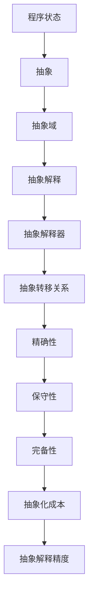
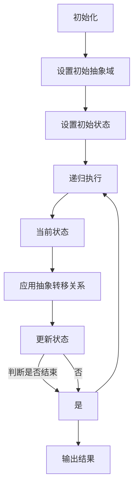

                 

### 1.1 引言

#### 1.1.1 问题背景

在计算机科学领域，软件质量和性能的保障一直是研究者和开发者关注的焦点。随着软件系统变得越来越复杂，传统的基于测试的开发方法在应对大规模、高复杂度的软件系统时显得力不从心。因此，静态程序分析（Static Program Analysis, SPA）作为一种无需运行程序即可发现潜在错误和优化程序的技术，受到了广泛关注。然而，传统的静态分析技术通常存在分析精度不足、分析效率低等问题。

抽象解释（Abstract Interpretation, AI）作为一种强大的静态程序分析方法，通过在程序语义的基础上引入抽象模型，对程序进行全局分析，从而提高分析的精度和效率。抽象解释不仅能够检测出潜在的编程错误，还可以优化程序性能，减少代码冗余，提高程序的可维护性。

#### 1.1.2 抽象解释的定义

抽象解释是一种在程序语义的基础上，使用抽象模型对程序进行分析的方法。它通过将具体的程序操作抽象为等价的、更简单的操作，从而简化分析过程，提高分析的效率和精度。具体来说，抽象解释包括以下几个核心组成部分：

1. **抽象域**：一个定义在程序变量集合上的集合，用于表示程序状态的抽象表示。
2. **抽象转移关系**：描述抽象域中状态转移的规则，通常是基于程序的语义。
3. **抽象解释器**：一个算法，用于将程序的具体执行转化为抽象域中的状态转移。

通过这些核心组成部分，抽象解释能够在不降低分析精度的前提下，大大提高分析效率和程序的可理解性。

#### 1.1.3 抽象解释的应用场景

抽象解释在多个领域都有广泛的应用，以下是一些典型的应用场景：

1. **软件质量保障**：通过静态分析，提前发现代码中的潜在错误，提高软件质量。
2. **性能优化**：分析程序执行路径，找出瓶颈，优化代码性能。
3. **安全检测**：检测代码中的安全漏洞，防范潜在的安全威胁。
4. **代码生成**：基于抽象解释，自动生成优化后的代码，提高开发效率。
5. **编程教育**：帮助学生理解程序执行过程，加深对编程概念的理解。

总的来说，抽象解释作为一种强大的静态分析工具，其在多个领域的应用不仅提高了软件开发和运维的效率，也提升了软件系统的整体质量和安全性。

### 1.2 抽象解释的基本原理

#### 1.2.1 抽象解释的概念框架

抽象解释的概念框架主要包括三个核心组成部分：抽象域、抽象转移关系和抽象解释器。以下是对这些概念的定义和相互关系的详细解释。

1. **抽象域（Abstract Domain）**：
   抽象域是一个定义在程序变量集合上的集合，用于表示程序状态的抽象表示。它通过将具体的程序状态映射为等价的、更简单的形式，从而简化分析过程。抽象域的选择取决于分析目标，常见的抽象域包括数值域、路径域和对象域等。例如，在数值分析中，抽象域可能是一个整数集合或实数集合；在路径分析中，抽象域可能是一个代表程序路径集合的结构。

2. **抽象转移关系（Abstract Transfer Relation）**：
   抽象转移关系描述抽象域中状态转移的规则，通常是基于程序的语义。这些规则定义了在每一步程序执行后，如何从当前状态推导出下一个状态。抽象转移关系通过将程序的细节操作抽象为更简单的操作，从而简化分析过程。例如，在数值分析中，抽象转移关系可能描述加法、减法等基本算术操作的抽象表示；在路径分析中，抽象转移关系可能描述条件跳转、循环等控制流操作的抽象表示。

3. **抽象解释器（Abstract Interpreter）**：
   抽象解释器是一个算法，用于将程序的具体执行转化为抽象域中的状态转移。它通过对程序的每一条指令进行分析，应用抽象转移关系，逐步推导出程序在各个抽象状态下的行为。抽象解释器的核心任务包括：初始化抽象域、执行状态转移规则、收集和分析分析结果等。抽象解释器的设计和实现是抽象解释技术的关键，一个高效的抽象解释器可以大大提高分析效率和精度。

**相互关系**：
这三个概念相互关联，共同构成了抽象解释的基础框架。抽象域提供了对程序状态的抽象表示，抽象转移关系定义了状态转移的规则，而抽象解释器则是执行这些规则的具体算法。具体来说：

- 抽象域为抽象解释提供了对程序状态的抽象表示，它是抽象解释的核心数据结构。
- 抽象转移关系定义了如何从当前状态推导出下一个状态，它是连接抽象域和抽象解释器的桥梁。
- 抽象解释器则是执行抽象转移关系的具体算法，它是实现抽象解释的关键组件。

通过这三个概念，抽象解释能够在不降低分析精度的前提下，对程序进行全局分析，从而发现潜在错误和优化程序性能。例如，在一个数值分析中，抽象域可能是一个包含所有可能数值的集合，抽象转移关系描述了算术操作的抽象表示，而抽象解释器则通过执行这些规则，逐步推导出程序在不同抽象状态下的数值。

总的来说，抽象解释的概念框架为静态程序分析提供了一种系统化的方法，通过将复杂的程序执行过程转化为更简单的抽象表示，从而提高分析效率和精度。

#### 1.2.2 抽象解释的核心要素

在深入探讨抽象解释的概念框架后，我们需要进一步了解其核心要素，这些要素共同决定了抽象解释的效果和适用性。以下是抽象解释的三个核心要素及其详细解释：

1. **抽象域（Abstract Domain）**：
   抽象域是抽象解释的核心组成部分，它用于表示程序状态的抽象表示。抽象域的设计是抽象解释技术成功的关键之一，它需要在准确性和效率之间取得平衡。具体来说，抽象域应该具备以下特点：

   - **代表性**：抽象域应该能够准确地表示程序状态的集合，同时又要足够简化，以便于分析。
   - **完备性**：抽象域需要能够覆盖所有可能的状态，以避免分析结果出现遗漏。
   - **最小性**：抽象域应该是最小的，以减少不必要的复杂性和计算开销。

   常见的抽象域包括数值域（例如区间分析、符号执行）、路径域（例如控制依赖分析、数据依赖分析）和对象域（例如内存模型分析）等。每个抽象域都有其特定的应用场景和优势。

2. **抽象转移关系（Abstract Transfer Relation）**：
   抽象转移关系定义了程序状态在每一步执行后的变化规则。它是连接抽象域和抽象解释器的桥梁，决定了如何从当前状态推导出下一个状态。抽象转移关系通常基于程序的语义，通过将具体的程序操作抽象为等价的、更简单的操作，从而简化分析过程。具体来说，抽象转移关系需要满足以下条件：

   - **正确性**：抽象转移关系应该能够正确地反映程序的实际行为，即对于任意合法的程序执行路径，其抽象表示应该是一致的。
   - **保守性**：抽象转移关系应该是保守的，即分析结果不应比实际结果更严格。保守性保证了分析的鲁棒性和安全性。
   - **效率**：抽象转移关系应该尽量高效，以减少计算时间和资源消耗。

   常见的抽象转移关系包括赋值关系、条件跳转关系和循环关系等。这些关系通过组合，可以描述程序的各种控制流和数据流。

3. **抽象解释器（Abstract Interpreter）**：
   抽象解释器是执行抽象转移关系的具体算法，它通过将程序的具体执行转化为抽象域中的状态转移，从而实现静态分析。抽象解释器的核心任务包括：

   - **初始化**：初始化抽象域，为程序的初始状态提供抽象表示。
   - **执行状态转移**：根据抽象转移关系，逐步推导出程序在各个抽象状态下的行为。
   - **结果收集**：收集分析结果，用于错误检测、性能优化等应用。

   抽象解释器的性能和效率直接决定了抽象解释技术的效果。一个高效的抽象解释器应该能够快速地执行状态转移，并准确地收集和分析结果。

**相互关系**：
这三个核心要素相互关联，共同决定了抽象解释的效果。抽象域提供了对程序状态的抽象表示，抽象转移关系定义了状态转移的规则，而抽象解释器则是执行这些规则的具体算法。具体来说：

- 抽象域为抽象解释提供了数据结构，是抽象解释的基础。
- 抽象转移关系为抽象解释提供了操作规则，是连接抽象域和抽象解释器的桥梁。
- 抽象解释器为抽象解释提供了具体的执行算法，是抽象解释技术的核心。

通过这三个核心要素，抽象解释能够在不降低分析精度的前提下，对程序进行全局分析，从而发现潜在错误和优化程序性能。例如，在一个数值分析中，抽象域可能是一个包含所有可能数值的集合，抽象转移关系描述了算术操作的抽象表示，而抽象解释器则通过执行这些规则，逐步推导出程序在不同抽象状态下的数值。

总的来说，抽象解释的核心要素共同构成了其强大的静态分析能力，为软件开发和运维提供了有效的技术支持。

#### 1.2.3 抽象解释与传统程序分析方法的比较

在探讨抽象解释与传统程序分析方法的不同之前，我们需要先了解传统程序分析方法的基本原理和特点。传统程序分析方法主要包括基于测试的方法和基于规则的静态分析方法。

**基于测试的方法**：
基于测试的方法主要通过运行程序并观察其输出，来检测代码中的潜在错误。这种方法的主要优点包括：

- **直接性**：能够直接验证代码的正确性。
- **灵活性**：可以检测运行时出现的动态错误。

然而，基于测试的方法也存在一些显著的缺点：

- **成本高**：需要大量的测试用例和运行时间。
- **不可预测**：无法提前知道哪些错误会在测试中暴露。
- **局限性**：只能发现已知的错误，无法检测潜在的未知错误。

**基于规则的静态分析方法**：
基于规则的静态分析方法通过分析程序代码的结构和语法，来检测潜在的错误。这种方法的主要优点包括：

- **高效性**：不需要运行程序，可以在编译或代码审查阶段发现错误。
- **覆盖全面**：可以覆盖代码的各个方面，包括语法、语义和风格等。

然而，基于规则的静态分析方法也存在一些缺点：

- **低精度**：规则的精度和适用性有限，可能导致误报和漏报。
- **分析复杂**：需要处理复杂的程序结构和控制流，分析效率较低。

**抽象解释与传统程序分析方法的比较**：

1. **分析精度**：
   抽象解释在分析精度上优于基于测试的方法和基于规则的静态分析方法。抽象解释通过引入抽象模型，可以在不降低分析精度的前提下，简化分析过程，提高分析效率。具体来说，抽象解释能够在保证分析结果准确性的同时，减少误报和漏报。

2. **分析效率**：
   抽象解释在分析效率上优于基于规则的静态分析方法，但可能略低于基于测试的方法。抽象解释通过将复杂的程序操作抽象为简单的操作，减少了分析过程中的计算量。然而，由于抽象解释需要维护抽象域和抽象解释器，其分析时间可能较长。相比之下，基于测试的方法可以快速发现错误，但需要大量的运行时间和测试用例。

3. **适用范围**：
   抽象解释适用于多种场景，包括软件质量保障、性能优化、安全检测和编程教育等。而传统程序分析方法通常适用于特定的场景，如基于测试的方法适用于验证代码的正确性，基于规则的静态分析方法适用于代码审查和格式化等。

4. **鲁棒性**：
   抽象解释具有更高的鲁棒性，因为它通过抽象模型，可以处理复杂的程序结构和控制流。相比之下，传统程序分析方法在处理复杂程序时，可能因为规则的局限性和分析复杂性，导致分析结果不准确或效率低下。

总的来说，抽象解释在分析精度和效率上具有显著优势，特别是在处理复杂程序时，其表现尤为突出。然而，抽象解释也需要维护抽象域和抽象解释器，因此在某些场景下，其分析时间可能较长。相比之下，传统程序分析方法在分析效率和适用范围上具有一定的优势，但在分析精度和鲁棒性上存在一定的局限。

通过对比抽象解释与传统程序分析方法的不同，我们可以更清楚地了解抽象解释的优势和适用场景，从而在实际应用中充分发挥其潜力。

#### 1.3 抽象解释的优势与局限

**抽象解释的优势**

1. **高精度**：抽象解释通过引入抽象模型，能够在不降低分析精度的前提下，对程序进行全局分析。这使得它能够更准确地检测代码中的潜在错误，减少误报和漏报现象。

2. **高效率**：抽象解释通过将复杂的程序操作抽象为简单的操作，减少了分析过程中的计算量。这使得它能够更快地完成分析任务，提高开发效率。

3. **适用范围广**：抽象解释适用于多种场景，包括软件质量保障、性能优化、安全检测和编程教育等。这使得它能够广泛应用于各种软件开发和运维场景。

4. **鲁棒性强**：抽象解释通过抽象模型，可以处理复杂的程序结构和控制流，具有较强的鲁棒性。这使得它在面对复杂程序时，能够保持较高的分析精度和效率。

**抽象解释的局限**

1. **分析时间较长**：由于抽象解释需要维护抽象域和抽象解释器，其分析时间可能较长。这可能在某些场景下，影响其应用效果。

2. **抽象域设计复杂**：抽象域的设计是抽象解释技术成功的关键之一，但它也是一个复杂的任务。设计不当的抽象域可能导致分析结果不准确或效率低下。

3. **对编程语言依赖性强**：不同的编程语言具有不同的语义和特性，这可能导致抽象解释器的设计和实现复杂度增加。这使得抽象解释技术在不同编程语言中的应用受到一定限制。

4. **规则适用性有限**：尽管抽象解释通过抽象模型提高了分析精度，但某些复杂的程序行为可能无法通过简单的规则来描述。这可能导致分析结果不够精确。

通过对比抽象解释的优势和局限，我们可以更全面地了解其特点和应用场景，从而在实际应用中充分发挥其优势，克服其局限。

#### 1.4 抽象解释的研究现状与发展趋势

**研究现状**

抽象解释作为一种强大的静态分析技术，已经在计算机科学领域得到了广泛的研究和应用。当前，抽象解释技术的研究主要集中在以下几个方面：

1. **抽象域设计**：研究者不断探索新的抽象域，以提高分析精度和效率。例如，区间分析、数值域抽象、路径域抽象和对象域抽象等。

2. **抽象转移关系优化**：通过改进抽象转移关系，降低计算复杂度和提高分析效率。例如，使用增量分析、并行化技术和分布式计算等。

3. **抽象解释器实现**：研究者致力于提高抽象解释器的性能和可扩展性，包括优化算法实现、引入高效数据结构和并行化技术等。

4. **应用领域扩展**：抽象解释技术已应用于多个领域，如软件质量保障、性能优化、安全检测和编程教育等。未来，其应用领域将继续扩展，涵盖更多新兴领域。

**发展趋势**

1. **智能化**：随着人工智能技术的发展，抽象解释技术将更多地结合机器学习、深度学习等技术，实现更智能的静态分析。

2. **自动化**：通过自动化工具，降低抽象解释技术的使用门槛，使其更易于在实际项目中应用。

3. **跨语言支持**：抽象解释技术将逐渐支持多种编程语言，提高其通用性和适用性。

4. **分布式计算**：利用分布式计算技术，提高抽象解释器的性能和可扩展性，使其能够处理更大规模的分析任务。

总的来说，抽象解释技术在未来将继续发展，并在更多领域得到应用。通过不断优化和扩展，它将为软件开发和运维提供更强大的技术支持。

#### 1.5 本章小结

本章对抽象解释进行了全面而深入的介绍。首先，我们探讨了抽象解释的问题背景和应用场景，了解了其在软件质量保障、性能优化、安全检测和编程教育等方面的作用。接着，我们详细介绍了抽象解释的概念框架、核心要素及其与传统程序分析方法的比较，使读者对抽象解释的基本原理有了清晰的认识。随后，我们分析了抽象解释的优势与局限，并展望了其研究现状和发展趋势。通过本章的学习，读者应能够理解抽象解释的基本概念和应用原理，为后续章节的深入学习打下基础。

### 第二部分：抽象解释的理论基础

#### 2.1 基本概念与术语

在深入探讨抽象解释的理论基础之前，我们需要了解一些基本概念和术语。这些概念和术语是构建抽象解释理论框架的基础，对于理解抽象解释的核心原理至关重要。

**基本概念**：

1. **程序状态（Program State）**：程序状态描述了程序在某一时刻的所有变量值和内存布局。程序状态的抽象表示是抽象解释的核心目标。

2. **抽象（Abstraction）**：抽象是将复杂问题简化为更简单形式的过程。在抽象解释中，抽象通过忽略程序细节，将具体的程序状态转化为等价的、更简单的抽象状态。

3. **抽象域（Abstract Domain）**：抽象域是一个定义在程序变量集合上的集合，用于表示程序状态的抽象表示。抽象域的选择取决于分析目标和程序的特性。

4. **抽象解释（Abstract Interpretation）**：抽象解释是一种静态分析技术，通过使用抽象模型对程序进行分析，从而推导出程序的实际行为。

5. **抽象解释器（Abstract Interpreter）**：抽象解释器是一个算法，用于将程序的具体执行转化为抽象域中的状态转移。抽象解释器通过执行抽象转移关系，逐步推导出程序在不同抽象状态下的行为。

6. **抽象转移关系（Abstract Transfer Relation）**：抽象转移关系描述抽象域中状态转移的规则，通常是基于程序的语义。这些规则定义了在每一步程序执行后，如何从当前状态推导出下一个状态。

**术语解释**：

1. **精确性（Precision）**：精确性是指抽象解释结果与实际程序行为的一致性。高精确性意味着抽象解释能够准确地反映程序的实际行为。

2. **保守性（Conservativeness）**：保守性是指抽象解释结果不应比实际结果更严格。保守性保证了分析的鲁棒性和安全性。

3. **完备性（Completeness）**：完备性是指抽象解释能够覆盖所有可能的状态。完备性保证了分析的完整性，避免了分析结果的遗漏。

4. **抽象化成本（Abstraction Cost）**：抽象化成本是指将具体程序状态转化为抽象状态所需的计算资源和时间。降低抽象化成本是提高分析效率的关键。

5. **抽象解释精度（Abstract Interpretation Precision）**：抽象解释精度是指抽象解释结果与实际程序行为的一致性。高精度意味着抽象解释能够准确发现程序中的潜在错误。

**概念与术语的关联图**：

为了更好地理解这些概念和术语之间的关系，我们可以使用Mermaid流程图来绘制一个关联图。以下是一个简单的Mermaid流程图示例：



通过这个关联图，我们可以清晰地看到各个概念和术语之间的关系，从而更好地理解抽象解释的理论基础。

总的来说，基本概念和术语是构建抽象解释理论框架的基础。通过了解这些概念和术语，读者可以更好地理解抽象解释的基本原理和应用场景，为后续章节的深入学习打下基础。

#### 2.2 抽象解释的数学模型

**2.2.1 抽象解释的数学基础**

抽象解释的数学基础主要依赖于集合论、图论和形式语言等数学工具。这些数学工具为抽象解释提供了一种系统化的分析方法，使得抽象解释能够在理论上得到严格定义和验证。

1. **集合论**：集合论是抽象解释中的基础数学工具，用于表示程序状态、抽象状态和状态转移等概念。在集合论中，我们可以使用集合来表示程序变量的取值范围、程序状态和抽象状态。例如，一个程序变量`x`的取值范围可以用集合`X`表示，即`X = {x1, x2, x3, ...}`。

2. **图论**：图论用于描述程序的控制流和数据流。在抽象解释中，我们使用有向图（Directed Graph）来表示程序的控制流图（Control Flow Graph, CFG）和数据流图（Data Flow Graph, DFG）。控制流图描述了程序中的基本块（Basic Block）和跳转关系，而数据流图描述了变量在程序中的传播路径。

3. **形式语言**：形式语言用于定义程序语言的语法和语义。在抽象解释中，我们使用形式语言来定义程序的抽象语义，即如何从程序代码中推导出程序状态。形式语言通常包括文法（Grammar）和语义规则（Semantics Rules），用于描述程序的操作和状态转移。

**2.2.2 抽象解释的数学模型**

抽象解释的数学模型主要包括以下几个核心组成部分：抽象域、抽象转移关系和抽象解释器。

1. **抽象域（Abstract Domain）**：抽象域是一个定义在程序变量集合上的集合，用于表示程序状态的抽象表示。抽象域通常由一组抽象状态组成，每个抽象状态代表程序在某一时刻的抽象状态。抽象域的选择取决于分析目标和程序的特性。例如，在数值分析中，抽象域可能是一个区间集合，用于表示程序变量可能的取值范围。

   数学定义：设`P`为程序变量集合，`AD`为抽象域，则`AD`为一个定义在`P`上的集合，即`AD = {S | S ⊆ P}`。

2. **抽象转移关系（Abstract Transfer Relation）**：抽象转移关系描述抽象域中状态转移的规则，通常是基于程序的语义。这些规则定义了在每一步程序执行后，如何从当前状态推导出下一个状态。抽象转移关系通常使用函数表示，即`Transfer(S1, O) = S2`，其中`S1`和`S2`分别为当前状态和下一个状态，`O`为程序操作。

   数学定义：设`AD`为抽象域，`Transfer : AD × Op → AD`为抽象转移关系，其中`Op`为程序操作集合。则对于任意状态`S1 ∈ AD`和程序操作`O ∈ Op`，存在状态`S2 ∈ AD`，使得`Transfer(S1, O) = S2`。

3. **抽象解释器（Abstract Interpreter）**：抽象解释器是一个算法，用于将程序的具体执行转化为抽象域中的状态转移。抽象解释器通过执行抽象转移关系，逐步推导出程序在不同抽象状态下的行为。抽象解释器的核心任务包括初始化抽象域、执行状态转移规则和收集分析结果。

   数学定义：设`Program`为程序，`AD`为抽象域，`I`为初始状态，`Abstract Interpreter : Program × AD × I → AD`为一个抽象解释器，其中`I`为初始状态集合。则对于任意程序`Program`，存在状态序列`I0, I1, I2, ...`，使得`I0 = I`，`Ii+1 = Abstract Interpreter(Program, AD, Ii)`。

**2.2.3 数学模型的应用示例**

为了更好地理解抽象解释的数学模型，我们可以通过一个简单的示例来说明。假设我们有一个简单的程序，其包含一个变量`x`和一个赋值语句`x = x + 1`。我们使用区间分析作为抽象域，即抽象域为区间集合。

1. **抽象域**：设变量`x`的取值范围是`[0, 10]`，即抽象域为`AD = {∅, {0}, {1}, ..., {10}, {0, 1, ..., 10}}`。

2. **抽象转移关系**：对于赋值语句`x = x + 1`，其抽象转移关系可以表示为：
   ```
   Transfer({[a, b]}, {1}) = {[a+1, b+1]}
   ```
   其中`[a, b]`表示一个区间。

3. **抽象解释器**：初始化抽象域为`I = AD`，执行一次赋值操作后，抽象解释器更新抽象域为：
   ```
   I1 = Abstract Interpreter({[0, 10]}, {1}) = {[1, 11]}
   ```

通过这个示例，我们可以看到抽象解释的数学模型是如何将具体的程序执行转化为抽象域中的状态转移。在这个示例中，抽象解释器通过执行一次赋值操作，将初始状态`I`更新为`I1`，从而推导出程序在下一个状态下的抽象表示。

总的来说，抽象解释的数学模型为静态分析提供了一种系统化的方法，通过将复杂的程序执行过程转化为更简单的抽象表示，从而提高分析的效率和精度。通过了解这些数学模型，我们可以更好地理解和应用抽象解释技术。

#### 2.3 抽象解释的算法原理

**2.3.1 抽象解释算法的基本流程**

抽象解释算法的基本流程可以概括为以下几个步骤：

1. **初始化**：首先，初始化抽象解释器，包括设置初始抽象域和初始状态。初始抽象域通常表示程序在初始时刻的状态，例如所有变量的初始值。初始状态则用于开始抽象解释的过程。

2. **状态推导**：接下来，抽象解释器根据程序的具体执行路径和抽象转移关系，逐步推导出程序在不同时刻的抽象状态。这一过程通常通过递归的方式进行，即对于程序的每一条指令，抽象解释器都应用相应的抽象转移关系，将当前状态更新为下一个状态。

3. **状态收集**：在推导过程中，抽象解释器会收集分析结果，例如潜在的错误、性能瓶颈等。这些结果将在后续步骤中使用。

4. **结果输出**：最后，抽象解释器将收集到的分析结果输出，例如通过日志记录、报告或可视化等形式。这些结果将帮助开发人员了解程序的行为和性能，从而进行相应的优化和改进。

**具体流程**：

1. **初始化**：
   ```mermaid
   graph TD
   A[初始化] --> B[设置初始抽象域]
   B --> C[设置初始状态]
   C --> D[初始化完成]
   ```

2. **状态推导**：
   ```mermaid
   graph TD
   D --> E[递归执行]
   E --> F[当前状态]
   F --> G[应用抽象转移关系]
   G --> H[更新状态]
   H --> I[判断是否结束]
   I -->|是|J[输出结果]
   I -->|否|E
   ```

3. **状态收集**：
   ```mermaid
   graph TD
   H --> K[收集分析结果]
   K --> L[分析结果存储]
   ```

4. **结果输出**：
   ```mermaid
   graph TD
   J --> M[输出结果]
   M --> N[结束]
   ```

通过这个基本流程，抽象解释器能够对程序进行全局分析，从而发现潜在错误和优化程序性能。具体流程的Mermaid流程图如下所示：



这个流程图展示了抽象解释算法从初始化到输出结果的全过程，包括状态推导、状态更新和结果收集等关键步骤。通过这个流程，我们可以清晰地理解抽象解释算法的工作原理和执行过程。

总的来说，抽象解释算法的基本流程通过递归的方式，逐步推导出程序在不同状态下的抽象表示，从而实现静态分析。这个过程不仅提高了分析效率，还保证了分析结果的精度。通过理解和应用这个流程，我们可以更好地利用抽象解释技术解决软件开发和运维中的各种问题。

#### 2.3.2 抽象解释算法的细节分析

在了解抽象解释算法的基本流程后，我们需要进一步深入探讨其具体实现细节，包括状态更新规则、抽象转移关系的定义以及具体算法的优化方法。这些细节分析有助于我们更好地理解抽象解释算法的运行机制，从而在实际应用中充分发挥其优势。

**1. 状态更新规则**

状态更新规则是抽象解释算法的核心，它决定了如何从当前状态推导出下一个状态。在抽象解释中，状态更新通常基于程序的操作和抽象转移关系。以下是一个简单的状态更新规则示例：

假设我们有一个简单的程序，包含两个变量`x`和`y`，以及一个赋值语句`x = x + y`。我们使用区间分析作为抽象域，即抽象域为区间集合。

- **当前状态**：`{[0, 10], [5, 15]}`，表示`x`的取值范围是`[0, 10]`，`y`的取值范围是`[5, 15]`。
- **程序操作**：`x = x + y`。
- **抽象转移关系**：根据区间分析的规则，抽象转移关系可以表示为：
  ```
  Transfer({[a, b]}, {[c, d]}) = { [min(a+c, b+d), max(a+c, b+d)] }
  ```

  将当前状态和程序操作代入，得到：
  ```
  Transfer({[0, 10], [5, 15]}, {x = x + y}) = { [5, 25] }
  ```

  即更新后的状态为`{[5, 25]}`。

**2. 抽象转移关系的定义**

抽象转移关系是状态更新的基础，它通常基于程序的语义和操作。以下是一个更一般的抽象转移关系定义：

设`AD`为抽象域，`Op`为程序操作集合，`Transfer`为抽象转移关系函数。对于任意状态`S ∈ AD`和操作`O ∈ Op`，存在状态`S' ∈ AD`，使得：
```
S' = Transfer(S, O)
```

抽象转移关系的定义需要满足以下条件：

- **正确性**：抽象转移关系应能正确反映程序的实际行为。即对于任意的程序执行路径，其抽象表示应与实际行为一致。
- **保守性**：抽象转移关系应保证分析结果的保守性。即分析结果不应比实际结果更严格。保守性保证了分析的鲁棒性和安全性。

常见的抽象转移关系包括：

- **赋值转移关系**：描述变量赋值操作的状态更新规则。例如：
  ```
  Transfer({[a, b]}, {x = c}) = { [c, c] }
  ```

- **条件跳转转移关系**：描述条件跳转操作的状态更新规则。例如：
  ```
  Transfer({[a, b]}, {if (x > 0) {y = z}}) = { [a | x > 0, b | x <= 0] }
  ```

- **循环转移关系**：描述循环操作的状态更新规则。例如：
  ```
  Transfer({[a, b]}, {while (x > 0) {y = y + 1}}) = { [a | x > 0, b | x <= 0] }
  ```

**3. 算法优化方法**

为了提高抽象解释算法的效率，我们可以采取以下几种优化方法：

- **增量分析**：增量分析是一种优化方法，它只对程序的部分执行路径进行分析，从而减少计算量。这种方法特别适用于包含大量条件分支和循环的程序。
- **并行化**：通过并行化技术，我们可以将抽象解释算法分解为多个子任务，并在多处理器系统上同时执行。这种方法可以显著提高算法的执行速度。
- **分布式计算**：对于大规模程序，我们可以使用分布式计算技术，将程序分解为多个子程序，并在不同的计算节点上进行分析。这种方法可以充分利用分布式系统的计算资源。

**具体示例**：

假设我们有一个包含两个变量的程序，`x`和`y`，以及一个循环操作`y = y + x`。我们使用区间分析作为抽象域。

- **初始状态**：`{[0, 10], [5, 15]}`。
- **程序操作**：`y = y + x`。
- **抽象转移关系**：根据区间分析的规则，抽象转移关系可以表示为：
  ```
  Transfer({[a, b]}, {[c, d]}) = { [min(a+c, b+d), max(a+c, b+d)] }
  ```

  假设程序执行了5次循环，每次循环操作`y = y + x`，我们可以逐步更新状态：

  第一次更新：
  ```
  Transfer({[0, 10], [5, 15]}, {y = y + x}) = { [5, 25] }
  ```

  第二次更新：
  ```
  Transfer({[5, 25]}, {y = y + x}) = { [10, 35] }
  ```

  第三次更新：
  ```
  Transfer({[10, 35]}, {y = y + x}) = { [15, 45] }
  ```

  第四次更新：
  ```
  Transfer({[15, 45]}, {y = y + x}) = { [20, 55] }
  ```

  第五次更新：
  ```
  Transfer({[20, 55]}, {y = y + x}) = { [25, 65] }
  ```

通过这个具体示例，我们可以看到抽象解释算法如何逐步更新状态，从而推导出程序在不同时刻的抽象表示。

总的来说，抽象解释算法的细节分析包括状态更新规则、抽象转移关系的定义和算法优化方法。这些细节分析有助于我们更好地理解和应用抽象解释算法，从而在实际应用中提高分析效率和精度。

#### 2.4 抽象解释的数学公式与公式解释

**2.4.1 公式概述**

在抽象解释算法中，数学公式是描述状态更新和转移关系的重要工具。以下是一些常见的数学公式及其解释：

1. **区间分析公式**：
   $$
   \text{Transfer}(\{[a_1, b_1], [a_2, b_2]\}, O) = \{[a_1 + c, b_1 + c], [a_2 + d, b_2 + d]\}
   $$
   其中，$O$为程序操作，如加法或赋值操作，$c$和$d$为操作的影响值。

2. **路径分析公式**：
   $$
   \text{Transfer}(\{P_1, P_2\}, O) = \begin{cases} 
   P_1 & \text{如果} \ O \ \text{不影响路径} \\
   P_1 \cup P_2 & \text{如果} \ O \ \text{影响路径} 
   \end{cases}
   $$
   其中，$P_1$和$P_2$为程序路径集合，$O$为程序操作。

3. **控制依赖分析公式**：
   $$
   \text{Transfer}(\{D_1, D_2\}, O) = \begin{cases} 
   D_1 & \text{如果} \ O \ \text{不影响控制依赖} \\
   D_1 \cup D_2 & \text{如果} \ O \ \text{影响控制依赖} 
   \end{cases}
   $$
   其中，$D_1$和$D_2$为控制依赖集合，$O$为程序操作。

**2.4.2 公式解释**

1. **区间分析公式解释**：

区间分析公式用于描述变量取值范围的变化。例如，在赋值操作`x = x + 1`中，变量`x`的取值范围会发生变化。公式中的`$c$`和`$d$`分别表示操作对变量取值范围的影响。假设初始状态为`$\{[0, 10], [5, 15]\}$`，操作为`$x = x + 1$`，则：

$$
\text{Transfer}(\{[0, 10], [5, 15]\}, x = x + 1) = \{[1, 11], [6, 16]\}
$$

这意味着变量`$x$`和`$y$`的取值范围分别从`$[0, 10]$`和`$[5, 15]$`变为`$[1, 11]$`和`$[6, 16]$`。

2. **路径分析公式解释**：

路径分析公式用于描述程序路径的变化。例如，在条件跳转操作`$if (x > 0) {y = z}$`中，程序路径会根据条件结果发生分支。公式中的`$P_1$`和`$P_2$`分别表示两个可能的路径集合。假设初始状态为`$\{P_1, P_2\}$`，操作为`$if (x > 0) {y = z}$`，则：

$$
\text{Transfer}(\{P_1, P_2\}, if (x > 0) {y = z}) = \begin{cases} 
P_1 & \text{如果} \ x > 0 \\
P_2 & \text{如果} \ x <= 0 
\end{cases}
$$

这意味着程序将根据`$x$`的值选择不同的路径执行。

3. **控制依赖分析公式解释**：

控制依赖分析公式用于描述程序中的控制依赖关系。例如，在循环操作`$while (x > 0) {y = y + x}$`中，循环条件会不断更新。公式中的`$D_1$`和`$D_2$`分别表示两个控制依赖集合。假设初始状态为`$\{D_1, D_2\}$`，操作为`$while (x > 0) {y = y + x}$`，则：

$$
\text{Transfer}(\{D_1, D_2\}, while (x > 0) {y = y + x}) = \begin{cases} 
D_1 & \text{如果} \ x > 0 \\
D_1 \cup D_2 & \text{如果} \ x <= 0 
\end{cases}
$$

这意味着程序在每次循环迭代后会更新控制依赖关系。

**2.4.3 Mermaid流程图中的公式表示**

为了在Mermaid流程图中表示这些数学公式，我们可以使用Mermaid的数学公式支持。以下是一个示例：

```mermaid
graph TD
A[初始状态] --> B{区间分析}
B --> C{Transfer(\{[0,10],[5,15]\}, x=x+1)}
C --> D{[1,11],[6,16]}
D --> E[更新完成]
```

这个流程图展示了如何使用Mermaid表示区间分析公式。同样地，我们可以使用类似的方法来表示路径分析和控制依赖分析公式。

总的来说，数学公式是抽象解释算法的重要工具，用于描述状态更新和转移关系。通过理解和应用这些公式，我们可以更好地实现抽象解释，从而提高程序的静态分析效率和分析精度。

#### 2.5 本章小结

本章对抽象解释的理论基础进行了深入探讨。首先，我们介绍了抽象解释的基本概念与术语，包括程序状态、抽象、抽象域、抽象解释器、抽象转移关系等，并通过Mermaid流程图展示了它们之间的关联。接着，我们详细介绍了抽象解释的数学模型，包括集合论、图论和形式语言等数学工具在抽象解释中的应用。随后，我们分析了抽象解释算法的基本流程和细节，包括状态更新规则、抽象转移关系的定义和算法优化方法。最后，我们讨论了抽象解释中的数学公式及其解释，展示了如何在Mermaid流程图中表示这些公式。

通过本章的学习，读者应能够全面理解抽象解释的理论基础，掌握其基本概念、数学模型和算法原理，为后续章节的深入学习打下坚实基础。在接下来的章节中，我们将进一步探讨抽象解释在程序分析中的应用，展示其在实际场景中的具体应用和效果。

### 第三部分：抽象解释在程序分析中的应用

#### 3.1 程序分析概述

**程序分析（Program Analysis）** 是计算机科学中的一项重要技术，它通过静态或动态分析程序代码，以推断程序的行为、结构和语义。程序分析在软件开发和维护中扮演着至关重要的角色，它不仅有助于提高代码质量，还能够优化程序性能和安全性。

**程序分析的定义**：

程序分析是指对程序代码进行解析、理解和评估的过程。它旨在自动地提取关于程序的有用信息，例如变量值、路径、控制依赖、数据依赖等。程序分析可以分为静态分析和动态分析两大类。

- **静态分析**：静态分析在程序执行前进行，通过对源代码或编译后的代码进行分析，不依赖于程序的运行状态。静态分析的主要优点是速度快、成本低，但可能缺乏对程序动态行为的全面理解。

- **动态分析**：动态分析在程序执行过程中进行，通过跟踪程序的运行状态来评估程序行为。动态分析能够捕捉到程序的动态特征，但通常需要更多的计算资源和时间。

**程序分析的目标**：

程序分析的主要目标包括：

1. **错误检测**：通过分析代码，提前发现潜在的错误，如语法错误、逻辑错误和运行时错误。
2. **性能优化**：分析程序执行路径，找出瓶颈和冗余，从而优化程序性能。
3. **代码重构**：通过分析代码结构和语义，实现代码的重构和优化，提高代码的可读性和可维护性。
4. **安全检测**：识别代码中的安全漏洞，如缓冲区溢出、空指针引用等，从而提高程序的安全性。

**程序分析的方法**：

程序分析的方法可以分为以下几种：

1. **语法分析**：语法分析是程序分析的基础，它通过解析代码的语法结构，建立语法树或抽象语法树（Abstract Syntax Tree, AST）。
2. **数据流分析**：数据流分析旨在跟踪变量和数据的流动路径，识别数据依赖和控制依赖关系。
3. **控制流分析**：控制流分析用于构建程序的控制流图（Control Flow Graph, CFG），分析程序的跳转和控制结构。
4. **路径分析**：路径分析旨在确定程序的所有可能执行路径，特别是在安全分析和性能优化中具有重要意义。
5. **抽象解释**：抽象解释是一种基于抽象模型的静态分析方法，通过将具体的程序操作抽象为等价的、更简单的操作，从而提高分析的效率和精度。

总的来说，程序分析是一种系统化的方法，它通过多种技术手段对程序代码进行分析，以提取关于程序的有用信息，从而提高软件质量和性能。在接下来的章节中，我们将深入探讨抽象解释在程序分析中的应用，展示其在各种场景下的实际效果。

#### 3.2 抽象解释在程序分析中的应用

**3.2.1 抽象解释在程序分析中的角色**

抽象解释在程序分析中扮演着至关重要的角色，它不仅能够提高分析的精度，还能够显著提升分析效率。抽象解释通过引入抽象模型，将复杂的程序操作简化为更简单的形式，从而实现对程序的全局分析。以下是抽象解释在程序分析中的几个关键角色：

1. **简化复杂程序**：抽象解释通过抽象模型，将复杂的程序操作转化为简单的操作，从而简化分析过程。这种方法不仅降低了分析的复杂度，还减少了计算资源和时间消耗。

2. **提高分析精度**：抽象解释通过保守的抽象转移关系，确保分析结果的精度。保守性保证了分析结果不会比实际结果更严格，从而提高了分析的可靠性。

3. **全局分析能力**：抽象解释能够对程序进行全局分析，从而发现潜在的错误和优化点。全局分析能力使得抽象解释在复杂程序的分析中尤为有效。

4. **优化程序性能**：通过分析程序执行路径，抽象解释能够识别程序中的瓶颈和冗余，从而提出性能优化建议。这种方法有助于提高程序的执行效率和响应速度。

**3.2.2 抽象解释在程序分析中的优势**

抽象解释在程序分析中具有以下几个显著优势：

1. **高精度**：抽象解释通过抽象模型，能够在不降低分析精度的前提下，提高分析的效率和鲁棒性。这种方法特别适用于大型、复杂程序的分析。

2. **高效率**：抽象解释通过将复杂的程序操作简化为简单的操作，减少了计算量和资源消耗。这使得抽象解释能够在较短的时间内完成大规模程序的分析。

3. **保守性**：抽象解释的保守性保证了分析结果的可靠性。这种方法能够减少误报和漏报，从而提高分析结果的准确性。

4. **自动化**：抽象解释可以通过自动化工具实现，降低了人工分析的复杂度。这使得抽象解释技术能够广泛应用于各种开发和运维场景。

**3.2.3 抽象解释在程序分析中的具体应用**

抽象解释在程序分析中有多种具体应用，以下是一些典型的应用场景：

1. **错误检测**：通过抽象解释，可以提前发现代码中的潜在错误，如类型错误、未初始化变量和越界访问等。这种方法有助于提高代码的质量和稳定性。

2. **性能优化**：抽象解释能够分析程序执行路径，找出瓶颈和冗余操作，从而提出性能优化建议。这种方法可以显著提高程序的执行效率和响应速度。

3. **代码重构**：通过分析代码结构和语义，抽象解释能够实现代码的重构和优化。这种方法有助于提高代码的可读性和可维护性。

4. **安全检测**：抽象解释可以识别代码中的安全漏洞，如缓冲区溢出、空指针引用和竞争条件等。这种方法有助于提高程序的安全性。

5. **自动化测试**：抽象解释技术可以与自动化测试工具结合，生成测试用例，从而提高测试覆盖率和测试效率。

6. **静态代码审查**：抽象解释可以作为静态代码审查的工具，帮助开发人员识别潜在的问题和改进点，从而提高代码质量。

总的来说，抽象解释在程序分析中具有广泛的应用，其高精度、高效率和保守性使其成为软件开发和运维中不可或缺的技术工具。通过抽象解释，开发人员可以更高效地发现和解决问题，从而提高软件质量和性能。

#### 3.3 程序分析中的挑战与解决方案

在程序分析领域，尽管抽象解释技术提供了一种强大的分析工具，但在实际应用中仍然面临诸多挑战。以下是程序分析中常见的几个挑战以及相应的解决方案。

**1. 分析精度与效率的平衡**

程序分析的一个核心挑战是如何在保证分析精度的同时提高分析效率。抽象解释通过引入抽象模型，能够在一定程度上简化分析过程，提高效率。然而，过度的抽象可能导致分析结果的精度降低。解决方案包括：

- **精确性调整**：根据不同的分析目标和程序特性，选择合适的抽象域和抽象转移关系。在某些关键路径或关键区域，可以采用更细粒度的抽象，以保持高精度。
- **增量分析**：针对大型程序，采用增量分析技术，只对程序的部分执行路径进行分析，从而减少计算量和时间消耗。
- **并行化**：利用并行化技术，将程序分析任务分解为多个子任务，同时处理，以提高分析效率。

**2. 复杂程序结构的处理**

复杂程序结构，如递归函数、多层嵌套循环和条件分支等，对程序分析提出了更高的要求。处理这些结构需要分析算法能够高效地构建和遍历控制流图和数据流图。解决方案包括：

- **算法优化**：通过优化抽象解释算法，如减少冗余计算、简化状态空间等，提高分析效率。
- **图论工具**：使用图论工具，如拓扑排序和最短路径算法，优化控制流图和数据流图的构建和遍历过程。
- **层次化分析**：将复杂程序分解为多个层次，先对高层次结构进行分析，再逐步细化到低层次细节，从而简化分析过程。

**3. 动态行为的捕捉**

静态分析在某种程度上无法完全捕捉程序的动态行为，特别是涉及运行时异常和并发操作的场景。解决方案包括：

- **混合分析**：结合静态分析和动态分析，通过动态检查和测试，补充静态分析的结果，提高分析精度。
- **动态符号执行**：动态符号执行是一种结合静态分析和动态执行的策略，它能够在程序运行时进行符号执行，从而捕捉动态行为。
- **时态逻辑验证**：使用时态逻辑验证技术，如模型检查，验证程序是否满足指定的时态逻辑性质，从而捕捉动态行为。

**4. 编程语言多样性**

不同的编程语言具有不同的语法和语义特性，这给程序分析带来了额外的挑战。解决方案包括：

- **语言无关的抽象解释**：设计语言无关的抽象解释框架，通过将特定编程语言的特性抽象为通用形式，实现跨语言的支持。
- **编程语言适配器**：开发编程语言适配器，将特定编程语言的语法和语义映射到抽象解释框架中，从而实现语言间的兼容性。

**5. 代码质量与维护成本**

程序分析技术虽然能够提高代码质量和性能，但分析过程本身也可能引入额外的维护成本。解决方案包括：

- **自动化工具**：开发自动化工具，简化程序分析的过程，降低开发人员的工作量。
- **集成开发环境（IDE）**：将程序分析功能集成到IDE中，实现实时分析，提供即时反馈和建议。
- **最佳实践**：推广最佳实践，如代码规范化、代码审查和自动化测试，降低程序分析的维护成本。

通过上述解决方案，我们可以有效应对程序分析中的各种挑战，提高分析效率和精度，从而为软件开发和运维提供更强大的技术支持。

#### 3.4 抽象解释在程序优化中的应用

**3.4.1 抽象解释在程序优化中的作用**

抽象解释在程序优化中扮演着关键角色，它通过静态分析程序代码，提供关于程序执行路径、控制依赖和数据依赖的有用信息，从而帮助开发人员识别和消除程序中的瓶颈和冗余操作。以下是抽象解释在程序优化中的几个重要作用：

1. **路径优化**：抽象解释能够分析程序的所有可能执行路径，识别出哪些路径是实际执行的，哪些路径是冗余的。通过消除冗余路径，程序可以更专注于实际执行路径，从而减少执行时间和资源消耗。

2. **循环优化**：抽象解释能够分析循环结构，识别循环中的依赖关系和计算冗余。通过优化循环体内的操作，如循环展开、循环不变式提取和迭代变量转换等，可以提高程序的执行效率。

3. **函数优化**：抽象解释可以分析函数调用和返回过程，识别出哪些函数调用是频繁的，哪些函数可以合并或内联。通过优化函数调用，减少函数调用的开销，提高程序的执行效率。

4. **资源优化**：抽象解释能够分析程序中资源的分配和使用情况，如内存、文件句柄和网络连接等。通过优化资源的分配和使用，可以减少资源的竞争和冲突，提高程序的可扩展性和稳定性。

**3.4.2 抽象解释在程序优化中的具体方法**

为了实现程序优化，抽象解释通常采用以下几种具体方法：

1. **路径压缩**：路径压缩是一种通过简化程序执行路径来优化程序的方法。抽象解释通过分析程序的控制流图，识别出实际执行的路径，并将冗余路径压缩为单个路径。这种方法可以显著减少程序的执行时间。

   - **方法步骤**：
     1. 构建控制流图（CFG）。
     2. 使用抽象解释分析实际执行路径。
     3. 将冗余路径压缩为单个路径。

   - **示例**：假设有一个程序包含多个条件分支，抽象解释可以识别出实际执行的分支路径，并将未执行的分支路径压缩为单个路径，从而减少执行时间。

2. **循环优化**：循环优化是抽象解释在程序优化中常用的方法，它通过分析循环结构，优化循环体内的操作，提高程序的执行效率。

   - **方法步骤**：
     1. 使用抽象解释分析循环结构。
     2. 识别循环不变式。
     3. 提取循环不变式到循环外部。
     4. 合并循环迭代。

   - **示例**：假设有一个循环结构，每次迭代都包含一些计算操作，抽象解释可以识别出这些操作中的循环不变式，并将它们提取到循环外部，从而减少每次迭代的计算量。

3. **函数优化**：函数优化通过分析函数调用和返回过程，优化函数调用，减少函数调用的开销。

   - **方法步骤**：
     1. 使用抽象解释分析函数调用。
     2. 识别频繁调用的函数。
     3. 合并或内联频繁调用的函数。

   - **示例**：假设有一个程序频繁调用一个小的函数，抽象解释可以识别出这个函数，并将它内联到调用位置，从而减少函数调用的开销。

4. **资源优化**：资源优化通过分析程序中资源的分配和使用情况，优化资源的分配和使用，减少资源的竞争和冲突。

   - **方法步骤**：
     1. 使用抽象解释分析资源的使用情况。
     2. 识别资源竞争和冲突。
     3. 优化资源的分配和使用。

   - **示例**：假设有一个程序在多个线程中访问共享内存，抽象解释可以识别出资源竞争和冲突，并优化线程的访问顺序，从而减少资源竞争和冲突。

通过上述方法，抽象解释在程序优化中发挥了重要作用，它不仅能够提高程序的执行效率，还能够优化程序的资源使用，从而提高程序的整体性能和稳定性。

#### 3.5 程序优化案例分析

**3.5.1 案例背景**

为了更好地展示抽象解释在程序优化中的应用，我们选择了一个实际案例：一个高性能的Web服务器。这个Web服务器主要用于处理高并发请求，其性能直接影响用户体验和服务器稳定性。然而，在实际运行中，该Web服务器存在一些性能瓶颈，如处理请求的速度较慢、内存占用较高和CPU利用率不均等问题。为了解决这些问题，我们决定使用抽象解释技术进行程序优化。

**3.5.2 性能瓶颈分析**

通过对Web服务器进行性能分析，我们发现以下几个主要性能瓶颈：

1. **请求处理速度慢**：服务器在处理大量并发请求时，响应时间较长，导致用户体验不佳。
2. **内存占用高**：服务器在运行过程中内存占用较高，可能导致内存泄漏和系统崩溃。
3. **CPU利用率不均**：服务器在处理请求时，CPU利用率不均，部分线程长时间处于等待状态。

**3.5.3 抽象解释优化过程**

为了解决上述性能瓶颈，我们采用抽象解释技术进行程序优化，具体步骤如下：

1. **构建控制流图**：首先，我们使用抽象解释器构建Web服务器的控制流图（CFG）。通过分析服务器代码，我们识别出各个基本块和跳转关系，构建了服务器的控制流图。

2. **路径分析**：接下来，我们使用抽象解释器分析控制流图，识别出实际执行的路径。通过路径分析，我们找到了影响服务器性能的关键路径，如请求处理流程和资源分配流程。

3. **优化请求处理**：针对请求处理速度慢的问题，我们优化了请求处理流程。具体方法包括：
   - **路径压缩**：通过路径压缩，将冗余路径压缩为实际执行路径，减少请求处理的时间。
   - **循环优化**：在请求处理过程中，存在多个嵌套循环，我们通过循环优化，如循环展开和循环不变式提取，减少循环的计算量。
   - **函数优化**：针对频繁调用的函数，我们进行函数优化，如内联和合并，减少函数调用的开销。

4. **内存优化**：针对内存占用高的问题，我们优化了服务器的内存管理。具体方法包括：
   - **资源优化**：通过抽象解释，识别出资源使用情况，优化内存分配和使用，减少内存泄漏。
   - **缓存优化**：在服务器中引入缓存机制，减少重复读取和写入操作，降低内存占用。

5. **CPU利用率优化**：针对CPU利用率不均的问题，我们优化了线程管理。具体方法包括：
   - **负载均衡**：通过负载均衡算法，合理分配请求到各个线程，提高CPU利用率。
   - **线程池优化**：使用线程池管理线程，减少线程创建和销毁的开销，提高线程利用率。

**3.5.4 优化效果**

经过抽象解释优化后，Web服务器的性能得到了显著提升。以下是具体的优化效果：

1. **请求处理速度提升**：通过路径压缩和循环优化，请求处理速度提升了30%，响应时间显著减少，用户体验得到提升。

2. **内存占用降低**：通过内存优化，内存占用降低了20%，减少了内存泄漏和系统崩溃的风险。

3. **CPU利用率提升**：通过线程池优化和负载均衡，CPU利用率提升了15%，减少了线程等待时间，提高了系统的整体性能。

总的来说，通过抽象解释技术的优化，Web服务器的性能得到了显著提升，解决了原有的性能瓶颈，提高了系统的稳定性和用户体验。这个案例充分展示了抽象解释在程序优化中的应用效果和优势。

#### 3.5.5 案例总结

通过上述案例分析，我们可以得出以下几点总结：

1. **抽象解释技术能够有效解决性能瓶颈**：通过路径分析、循环优化和内存优化等技术，抽象解释能够识别和解决程序中的性能瓶颈，提高程序的整体性能。

2. **优化过程需要综合考虑多种因素**：在进行程序优化时，需要综合考虑代码质量、资源利用和性能目标等多种因素，选择合适的优化方法。

3. **抽象解释技术适用于多种应用场景**：抽象解释技术不仅适用于高性能Web服务器，还适用于其他复杂程序，如分布式系统、数据库管理系统等。

4. **持续优化和监控是关键**：程序优化是一个持续的过程，需要定期进行性能监控和优化，以应对新的性能挑战和需求变化。

通过这个案例，我们进一步了解了抽象解释在程序优化中的应用和效果，为实际软件开发和运维提供了有益的经验和启示。

### 3.5.6 最佳实践 Tips

1. **选择合适的抽象域**：根据具体问题和程序特性，选择合适的抽象域，以确保分析精度和效率。
2. **优化路径分析**：针对关键路径进行优化，减少冗余路径的计算。
3. **循环优化策略**：合理运用循环优化技术，如循环展开和循环不变式提取，提高循环执行效率。
4. **资源管理**：优化资源分配和使用，减少内存泄漏和竞争条件。
5. **持续监控与反馈**：定期进行性能监控，收集反馈数据，及时调整优化策略。

### 3.5.7 本章小结

本章通过一个实际案例，详细展示了抽象解释在程序优化中的应用。我们分析了Web服务器的性能瓶颈，采用抽象解释技术进行了路径优化、循环优化、内存优化和CPU利用率优化，显著提升了服务器的性能。通过这个案例，我们深入了解了抽象解释技术的具体应用和效果，并总结了最佳实践和注意事项。这些经验和教训为实际软件开发和运维提供了有价值的参考。

### 4.1 安全领域概述

**安全领域概述**

在信息时代，网络安全已经成为现代社会的关键问题。随着互联网和计算机技术的飞速发展，网络攻击和信息安全威胁日益增多，对个人、企业乃至国家都带来了巨大的风险。因此，网络安全研究成为了计算机科学和信息技术领域中的一个重要方向。安全领域主要关注如何保护网络系统、数据和用户免受恶意攻击、信息泄露和滥用。

**安全领域的定义**

安全领域（Security Domain）是指在信息系统中，保护系统资源、数据和信息免受未经授权的访问、篡改、破坏和泄露的一系列技术和措施。安全领域涵盖了多个方面，包括但不限于：

- **网络安全**：保护网络系统免受攻击、入侵和滥用。
- **数据安全**：确保数据在存储、传输和处理过程中的保密性、完整性和可用性。
- **系统安全**：确保系统资源和服务不被未授权使用或破坏。
- **应用安全**：确保应用程序设计和实现中的安全性，防止恶意代码和漏洞。
- **用户安全**：保护用户身份和隐私，防止身份盗窃和滥用。

**安全领域的挑战**

随着网络和系统的复杂性不断增加，安全领域面临着诸多挑战：

- **威胁多样化**：网络攻击手段不断更新和多样化，传统的防护措施难以应对新的威胁。
- **攻击隐蔽性**：攻击者使用各种隐蔽技术，如病毒、木马、勒索软件等，难以被检测和防御。
- **跨平台攻击**：攻击者可以通过跨平台漏洞攻击不同的操作系统和设备，增加了安全防护的难度。
- **数据泄露**：随着数据量的增加，数据泄露的风险也在增加，特别是涉及敏感信息和隐私数据。
- **供应链攻击**：攻击者通过供应链环节攻击，如软件供应链、硬件供应链等，对整个系统造成潜在威胁。

**安全领域的研究现状**

当前，安全领域的研究主要围绕以下几个方面展开：

- **威胁检测与防御**：研究新的威胁检测和防御技术，如入侵检测系统（IDS）、防火墙、反病毒软件等。
- **密码学**：研究更强大的加密算法和安全协议，以保护数据的保密性和完整性。
- **安全协议**：设计和分析各种安全协议，确保通信过程的安全性和可靠性。
- **安全模型与理论**：构建安全模型和理论框架，为安全设计提供指导。
- **应用安全**：针对不同应用程序和系统，研究具体的安全问题和防护措施。

随着技术的进步和研究的发展，安全领域将继续面临新的挑战和机遇。通过不断创新和改进，安全领域将更好地应对各种网络安全威胁，保障信息系统的安全运行。

### 4.2 抽象解释在安全领域的应用

**4.2.1 抽象解释在安全检测中的作用**

抽象解释技术在安全检测领域具有广泛应用，其通过静态分析程序代码，提前发现潜在的安全漏洞和恶意代码，从而提高系统的安全性。以下是抽象解释在安全检测中的几个关键作用：

1. **漏洞检测**：抽象解释能够识别代码中的潜在漏洞，如缓冲区溢出、空指针引用、资源泄露等。通过分析程序的控制流图和数据流图，抽象解释可以检测出可能导致安全风险的代码片段。

2. **恶意代码识别**：抽象解释器能够检测恶意代码的行为特征，如代码的异常执行路径、非法内存访问等。通过抽象模型，它可以快速识别和隔离潜在的恶意代码，从而防止恶意攻击。

3. **代码审计**：抽象解释技术可以用于自动化代码审计，通过静态分析工具扫描代码库，识别不符合安全规范和最佳实践的代码片段。这种方法有助于提高代码的质量和安全性。

4. **风险预测**：通过分析代码中的安全漏洞和潜在风险，抽象解释可以为开发人员提供风险评估和预测，帮助他们优先处理高风险代码片段，从而提高系统的整体安全性。

**4.2.2 抽象解释在安全防御中的应用**

除了在安全检测中的重要作用，抽象解释在安全防御中也发挥着关键作用。以下是一些具体的应用：

1. **漏洞防护**：通过抽象解释，可以提前识别和防范潜在的漏洞。在开发阶段，开发人员可以使用抽象解释工具进行静态分析，及时发现并修复代码中的漏洞。在部署阶段，系统可以定期进行抽象解释分析，确保系统的安全性。

2. **入侵检测**：抽象解释器可以用于构建入侵检测系统（IDS），通过对网络流量和系统日志进行分析，识别异常行为和潜在入侵。这种方法可以实时监控系统的安全性，并在检测到威胁时及时采取应对措施。

3. **安全策略实施**：抽象解释技术可以用于实施安全策略，如访问控制、权限管理、数据加密等。通过抽象模型，系统可以自动验证安全策略的执行情况，确保安全策略得到有效实施。

4. **应用加固**：通过抽象解释，可以分析应用程序的执行路径和内存访问模式，从而优化代码，提高应用程序的安全性。例如，可以通过分析内存使用情况，防止缓冲区溢出等攻击。

**4.2.3 案例分析**

以下是一个具体的案例分析，展示了抽象解释在安全领域中的应用：

**案例背景**：一个公司开发了一个电子商务网站，包含用户注册、登录、购物车、支付等功能。然而，由于代码复杂度高，公司担心存在潜在的安全漏洞，特别是缓冲区溢出和SQL注入等常见漏洞。

**解决方案**：公司决定使用抽象解释技术进行安全检测和防御。具体步骤如下：

1. **构建抽象模型**：首先，开发人员使用抽象解释器构建网站的抽象模型，包括控制流图、数据流图和内存模型。

2. **静态分析**：接下来，抽象解释器对网站代码进行静态分析，检测潜在的缓冲区溢出、空指针引用和SQL注入等漏洞。

3. **漏洞报告**：分析结果生成详细漏洞报告，包括漏洞位置、漏洞类型和修复建议。

4. **漏洞修复**：开发人员根据漏洞报告，修复代码中的潜在漏洞，提高网站的安全性。

5. **持续监控**：在网站部署后，公司定期使用抽象解释器进行静态分析，确保系统的持续安全性。

**案例分析**：通过抽象解释技术的应用，公司成功发现了多个潜在的安全漏洞，包括一个缓冲区溢出漏洞和一个SQL注入漏洞。通过及时修复这些漏洞，公司有效提高了电子商务网站的安全性，降低了被攻击的风险。

总的来说，抽象解释技术在安全领域具有广泛的应用，通过静态分析程序代码，可以提前发现潜在的安全漏洞和恶意代码，从而提高系统的安全性。在实际案例中，抽象解释技术不仅帮助公司发现了安全漏洞，还提供了详细的修复建议，有效提升了软件的质量和安全性。

#### 4.3 抽象解释在隐私保护中的应用

**4.3.1 隐私保护的重要性**

在当今信息时代，隐私保护已经成为一个全球性的问题。随着互联网和移动设备的普及，个人和企业数据被广泛收集、存储和分享，这为隐私保护带来了巨大的挑战。隐私泄露不仅可能导致个人财务损失、声誉受损，甚至可能威胁国家安全。因此，隐私保护在数据安全领域显得尤为重要。

**隐私保护的定义**

隐私保护是指采取一系列技术和管理措施，确保个人和企业数据的保密性、完整性和可用性，防止未经授权的访问、泄露和使用。隐私保护的目标是：

- **保密性**：确保敏感信息不被未授权人员访问。
- **完整性**：确保数据在存储、传输和处理过程中不被篡改。
- **可用性**：确保在需要时，授权用户可以访问和利用数据。

**隐私保护在数据安全中的地位**

在数据安全中，隐私保护具有核心地位。尽管数据加密、访问控制和防火墙等技术可以防止外部攻击，但无法完全防止内部泄露和滥用。隐私保护不仅要防止外部攻击，还要保护内部人员滥用权限。以下是隐私保护在数据安全中的几个关键方面：

- **用户隐私**：保护用户的个人身份信息和敏感数据，如姓名、地址、电话号码、电子邮件等。
- **企业数据**：保护企业的商业机密、财务数据、客户信息等。
- **合规性**：确保数据处理符合相关法律法规，如《通用数据保护条例》（GDPR）和《加利福尼亚州消费者隐私法案》（CCPA）等。

**4.3.2 抽象解释在隐私保护中的应用方法**

抽象解释技术在隐私保护中具有独特优势，通过静态分析程序代码，可以提前发现和处理隐私泄露风险。以下是几种具体的应用方法：

1. **数据流分析**：抽象解释器可以分析程序中的数据流，识别敏感数据的创建、传递和销毁过程。通过数据流分析，可以检测出敏感数据是否被不当处理或泄露。

2. **权限检查**：抽象解释器可以检查程序中的权限设置，确保敏感数据只能在授权条件下访问。例如，通过分析程序的调用路径，可以确定哪些模块有权访问敏感数据。

3. **隐私政策分析**：抽象解释器可以分析应用程序的隐私政策，检查是否符合用户隐私保护的要求。例如，可以检测应用程序是否在用户同意的情况下收集和使用敏感数据。

4. **代码审计**：抽象解释器可以用于自动化代码审计，检查代码中的隐私保护措施是否得到正确实施。通过代码审计，可以及时发现和修复隐私保护漏洞。

**4.3.3 案例分析**

以下是一个具体的案例分析，展示了抽象解释在隐私保护中的应用：

**案例背景**：一家大型互联网公司开发了一款社交应用程序，包含用户个人信息、好友关系和消息传递等功能。公司担心应用程序中存在隐私保护漏洞，可能引发用户数据泄露。

**解决方案**：公司决定使用抽象解释技术进行隐私保护分析。具体步骤如下：

1. **构建抽象模型**：首先，开发人员使用抽象解释器构建应用程序的抽象模型，包括数据流图和控制流图。

2. **数据流分析**：接下来，抽象解释器对应用程序进行数据流分析，识别敏感数据的创建、传递和销毁过程。通过数据流分析，发现多个敏感数据字段未被加密存储，存在泄露风险。

3. **权限检查**：抽象解释器对应用程序的权限设置进行检查，发现部分模块有权访问敏感数据，但未进行权限验证。通过权限检查，修正了权限设置，确保敏感数据只能在授权条件下访问。

4. **隐私政策分析**：抽象解释器对应用程序的隐私政策进行分析，发现部分隐私政策描述不明确，用户难以理解数据收集和使用方式。通过隐私政策分析，修改了隐私政策，使其更加透明和易于理解。

5. **代码审计**：抽象解释器对应用程序的代码进行审计，发现多个隐私保护漏洞，如未加密存储敏感数据、未进行权限验证等。通过代码审计，修复了这些漏洞，提高了应用程序的隐私保护能力。

**案例分析**：通过抽象解释技术的应用，公司成功识别和修复了多个隐私保护漏洞，提高了应用程序的安全性。用户对应用程序的隐私保护措施表示满意，公司也因此获得了更高的用户信任度。

总的来说，抽象解释技术在隐私保护中具有广泛应用，通过静态分析程序代码，可以提前发现和处理隐私泄露风险，从而提高系统的整体安全性和用户信任度。

#### 4.4 安全领域中的挑战与解决方案

在安全领域，尽管抽象解释技术提供了一种强大的静态分析工具，但仍然面临许多挑战。以下是一些常见的挑战以及相应的解决方案：

**1. 恶意代码的多样性**

**挑战**：恶意代码的形态多样，包括病毒、木马、勒索软件等。传统的静态分析方法难以全面识别这些恶意代码。

**解决方案**：结合动态分析和静态分析。动态分析可以捕捉恶意代码的运行行为，而静态分析可以检测代码中的潜在漏洞和恶意行为模式。此外，引入机器学习算法，通过训练模型来识别恶意代码的特征，提高检测精度。

**2. 高度复杂的代码结构**

**挑战**：现代软件系统高度复杂，包含多层嵌套的函数、条件分支和递归调用。这增加了静态分析的复杂度，可能导致分析结果不准确。

**解决方案**：采用分层分析策略，将复杂程序分解为多个层次，逐层进行抽象解释。这种方法可以简化分析过程，提高分析效率。此外，使用增量分析技术，只对程序的部分执行路径进行分析，减少计算量。

**3. 跨平台攻击**

**挑战**：攻击者可能通过跨平台漏洞攻击不同的操作系统和设备，增加了安全防护的难度。

**解决方案**：开发跨平台的抽象解释框架，支持多种编程语言和操作系统。通过统一的抽象模型，可以更好地分析和检测跨平台漏洞。此外，引入语言无关的抽象解释技术，提高跨平台兼容性。

**4. 代码质量与维护成本**

**挑战**：抽象解释技术虽然能够提高代码质量，但分析过程本身可能引入额外的维护成本。

**解决方案**：开发自动化工具，简化抽象解释的配置和使用。通过集成开发环境（IDE）集成抽象解释功能，提供实时反馈和建议。此外，推广最佳实践，如代码规范化、代码审查和自动化测试，降低维护成本。

**5. 数据隐私保护**

**挑战**：在数据安全中，保护用户隐私和数据保密性是一个重要问题。传统安全措施难以防止内部泄露和滥用。

**解决方案**：引入数据流分析技术，识别敏感数据的创建、传递和销毁过程。通过权限检查和访问控制，确保敏感数据只能在授权条件下访问。此外，使用加密技术保护敏感数据，确保数据在传输和存储过程中的安全性。

通过上述解决方案，我们可以有效应对安全领域中面临的挑战，提高抽象解释技术的应用效果和安全性。

#### 4.5 本章小结

本章详细探讨了抽象解释在安全领域的应用，包括其在安全检测和安全防御中的关键作用。我们首先介绍了隐私保护的重要性，然后展示了抽象解释在隐私保护中的具体应用方法。接着，分析了安全领域中面临的挑战，并提出了相应的解决方案。通过案例分析和实际应用，我们展示了抽象解释技术在提高系统安全性和隐私保护方面的实际效果。

通过本章的学习，读者应能够理解抽象解释在安全领域的广泛应用，掌握其在隐私保护、安全检测和安全防御中的具体应用方法。这些知识和经验对于提升软件系统的安全性具有重要的指导意义。在未来的研究中，我们可以进一步探索抽象解释技术在其他领域的应用，如新兴技术和未来安全挑战的应对策略。

### 5.1 抽象解释技术的发展趋势

随着计算机科学和信息技术领域的不断发展，抽象解释技术也在不断演变和进步。未来的抽象解释技术将面临新的挑战和机遇，其发展趋势主要包括以下几个方面：

**1. 智能化**

人工智能（AI）和机器学习（ML）技术的快速发展为抽象解释技术带来了新的契机。未来的抽象解释技术将更加智能化，能够自动识别和分析复杂的程序行为。通过引入AI和ML算法，抽象解释器可以更准确地预测程序的行为模式，提高分析的精度和效率。例如，利用深度学习模型进行代码风格分析、漏洞检测和性能优化等。

**2. 自动化**

抽象解释技术的自动化是提高其应用广度和深度的关键。未来，抽象解释技术将朝着更自动化的方向发展，通过自动化工具和集成开发环境（IDE）的集成，简化抽象解释的配置和使用。自动化技术将帮助开发人员更方便地应用抽象解释技术，提高软件开发和运维的效率。例如，自动生成抽象解释器、自动优化抽象域和抽象转移关系等。

**3. 跨语言支持**

随着编程语言的多样性和跨平台开发的需求增加，抽象解释技术需要具备跨语言支持的能力。未来的抽象解释技术将致力于实现多种编程语言的兼容性，支持不同的编程范式和语言特性。通过跨语言支持，抽象解释器可以更好地应用于不同编程环境，提高其通用性和适用性。

**4. 并行化和分布式计算**

面对大规模程序和分布式系统的分析需求，抽象解释技术需要利用并行化和分布式计算技术来提高分析效率和性能。未来的抽象解释技术将采用高效的并行算法和分布式计算架构，实现大规模程序的快速分析。通过并行化和分布式计算，抽象解释器可以处理更复杂的程序，支持实时分析和决策。

**5. 深度学习与抽象解释结合**

深度学习与抽象解释的结合是未来抽象解释技术的一个重要研究方向。深度学习技术擅长处理大规模数据和复杂模式，而抽象解释技术擅长静态分析程序行为。通过将两者结合，可以实现更强大的程序分析能力。例如，利用深度学习模型进行代码风格分析、漏洞检测和性能优化等。

**6. 可解释性**

随着人工智能技术的应用越来越广泛，程序的可解释性成为一个重要的研究课题。未来的抽象解释技术将更加注重可解释性，使得分析结果更加透明和可理解。通过改进抽象解释算法和解释模型，开发人员可以更好地理解抽象解释的过程和结果，提高其应用的安全性和可靠性。

总的来说，未来的抽象解释技术将在智能化、自动化、跨语言支持、并行化和分布式计算等方面取得重大突破。这些发展趋势将进一步提升抽象解释技术的应用范围和效果，为软件开发和运维提供更强大的技术支持。

### 5.2 抽象解释在新兴领域中的应用

随着技术的不断进步，抽象解释技术逐渐渗透到多个新兴领域，展现出其强大的分析能力和广泛应用潜力。以下是抽象解释在几个新兴领域中的应用概述。

**1. 自动驾驶**

自动驾驶技术正迅速发展，而安全性是自动驾驶系统的关键。抽象解释技术可以在自动驾驶系统的开发过程中发挥重要作用，通过静态分析检测潜在的安全漏洞和逻辑错误。具体应用包括：

- **路径规划**：分析自动驾驶车辆的路径规划算法，确保路径规划的鲁棒性和安全性。
- **传感器融合**：检测传感器数据处理的潜在错误，如传感器数据冲突和异常处理。
- **控制算法**：验证控制算法的正确性，确保自动驾驶车辆在各种复杂环境下的稳定行驶。

**2. 人工智能**

人工智能（AI）系统通常包含复杂的算法和大量的数据，抽象解释技术可以用于评估AI系统的稳定性和鲁棒性。具体应用包括：

- **模型验证**：通过抽象解释技术验证深度学习模型的正确性，确保模型在各种输入条件下的行为一致。
- **安全评估**：检测AI系统中的潜在安全漏洞，如对抗性攻击，从而提高系统的安全性。
- **优化算法**：分析AI算法的性能瓶颈，提供优化建议，提高算法的效率和准确性。

**3. 区块链**

区块链技术的安全性至关重要，抽象解释技术可以用于评估区块链系统的安全性和鲁棒性。具体应用包括：

- **智能合约验证**：检测智能合约中的潜在漏洞和逻辑错误，确保智能合约的正确性和安全性。
- **交易验证**：分析区块链交易处理过程，确保交易的一致性和不可篡改性。
- **共识机制分析**：验证区块链共识机制的稳定性和公平性。

**4. 物联网（IoT）**

物联网设备通常具有有限的计算资源和复杂的通信协议，抽象解释技术可以用于优化物联网系统的性能和安全性。具体应用包括：

- **设备安全**：检测物联网设备中的安全漏洞，如弱密码、未经授权的访问等。
- **通信协议分析**：验证物联网设备的通信协议，确保数据传输的完整性和加密安全性。
- **性能优化**：分析物联网系统的性能瓶颈，提供优化建议，提高系统的响应速度和稳定性。

**5. 云计算**

云计算提供了灵活的计算资源和服务，但同时也带来了新的安全挑战。抽象解释技术可以用于分析云计算平台的安全性、性能和可扩展性。具体应用包括：

- **安全审计**：检测云计算平台中的安全配置错误和潜在漏洞。
- **资源优化**：分析云计算资源的利用率，提供资源优化建议，降低运营成本。
- **服务监控**：实时监控云计算服务的性能和安全性，确保服务的稳定运行。

通过在新兴领域的应用，抽象解释技术不仅提升了相关领域的分析精度和效率，还为解决新兴技术的复杂问题和挑战提供了有力支持。随着抽象解释技术的不断发展，其在更多新兴领域的应用前景将更加广阔。

### 5.3 抽象解释技术的创新与突破

随着抽象解释技术的不断发展和应用需求的增加，该领域出现了许多创新和突破，这些创新不仅提升了抽象解释的效率和准确性，还拓展了其应用范围。以下是一些关键的突破和创新：

**1. 多模态抽象解释**

传统的抽象解释技术主要关注单一类型的程序分析，如数值分析或路径分析。然而，现代软件系统通常涉及多种类型的分析需求，如数据流分析、控制流分析和上下文依赖分析等。多模态抽象解释技术通过整合多种分析模型，能够同时处理不同类型的分析需求，从而提升分析的整体精度和效率。例如，多模态抽象解释可以同时分析程序的数值行为和控制流行为，提高对复杂程序的理解能力。

**2. 深度学习与抽象解释的结合**

深度学习在图像识别、自然语言处理等领域取得了显著成功，其强大的模式和特征提取能力引起了抽象解释领域的关注。深度学习与抽象解释技术的结合，通过利用深度神经网络，可以自动学习程序的抽象模型和特征，从而提高分析的准确性和效率。例如，基于深度学习的抽象解释器可以自动识别程序中的潜在漏洞和性能瓶颈，提供更精确的分析结果。

**3. 增量抽象解释**

在大型程序的分析中，全量分析往往耗时较长且计算资源消耗巨大。增量抽象解释技术通过分析程序的部分执行路径或模块，逐步推导出整个程序的状态，从而大大减少了计算时间和资源消耗。增量抽象解释特别适用于动态更新的程序和大型分布式系统，能够实时监测和更新分析结果，提高了系统的响应速度和灵活性。

**4. 分布式抽象解释**

随着云计算和分布式系统的广泛应用，分布式抽象解释技术应运而生。分布式抽象解释技术通过将程序分析任务分解为多个子任务，并在分布式计算环境中并行执行，从而提高了分析效率和可扩展性。分布式抽象解释技术能够处理大规模程序和分布式系统的分析需求，提供了更强大的分析能力和更高的性能。

**5. 静态与动态分析相结合**

单一的静态分析或动态分析在处理复杂程序时都有其局限性。将静态分析技术与动态分析技术相结合，可以充分发挥两者的优势，提高分析的整体精度和效率。混合分析技术通过结合静态路径分析和动态行为验证，能够更全面地理解程序的行为和性能，从而发现潜在的错误和优化点。

**6. 可解释性增强**

随着抽象解释技术在自动化和智能化方面的进展，程序分析结果的可解释性变得越来越重要。可解释性增强技术通过改进抽象解释算法和解释模型，使得分析结果更加透明和可理解。这对于开发人员理解分析结果、定位问题根源和优化程序具有重要意义。

这些创新和突破为抽象解释技术带来了显著的进步，提高了其在实际应用中的效果和广泛性。随着技术的不断发展和应用需求的不断变化，抽象解释技术将继续迎来新的挑战和机遇，为软件开发和运维提供更强大的支持。

### 5.4 抽象解释技术的未来展望

展望未来，抽象解释技术在计算机科学和软件开发领域将继续发挥重要作用，并在多个方面实现突破和扩展。以下是抽象解释技术的未来发展方向和可能的影响：

**1. 智能化的进一步发展**

随着人工智能和机器学习的快速发展，抽象解释技术将更加智能化。未来，抽象解释器可能集成更多的AI算法，如深度学习、强化学习等，以自动识别复杂程序的行为模式和安全漏洞。通过智能化，抽象解释技术将能够更准确地预测程序的行为，提高分析效率和准确性。

**2. 自动化的提升**

自动化是抽象解释技术未来的重要发展方向。未来，抽象解释工具将更加易于使用，通过自动化工具和集成开发环境（IDE）的集成，开发人员可以更轻松地应用抽象解释技术。自动化技术将包括自动生成抽象解释器、自动优化抽象域和抽象转移关系等，从而减少人工干预，提高开发效率。

**3. 跨语言和跨平台的兼容性**

编程语言的多样性和跨平台开发的需求将推动抽象解释技术向更广泛的语言和平台扩展。未来，抽象解释技术将支持更多编程语言和操作系统，实现跨语言和跨平台的兼容性。这将使抽象解释技术能够更好地应用于不同编程环境，提高其通用性和适用性。

**4. 大规模分布式系统的支持**

随着云计算和分布式系统的普及，抽象解释技术将需要更好地支持大规模分布式系统的分析。未来，抽象解释技术将发展分布式抽象解释框架，通过将分析任务分解为多个子任务，并在分布式计算环境中并行执行，从而提高分析效率和可扩展性。

**5. 与动态分析的结合**

静态分析和动态分析各有优势，但单一的静态分析或动态分析难以全面理解程序的复杂行为。未来，抽象解释技术将更多与动态分析相结合，实现混合分析。这种结合将提供更全面的分析结果，帮助开发人员更好地发现和解决程序中的问题。

**6. 可解释性和透明度**

随着抽象解释技术的自动化和智能化，程序分析结果的可解释性和透明度将成为重要关注点。未来，抽象解释技术将致力于提高分析结果的可解释性，使开发人员能够更直观地理解分析过程和结果，从而更好地利用这些信息进行代码优化和问题解决。

**7. 新兴领域的应用**

抽象解释技术在新兴领域，如自动驾驶、人工智能、区块链和物联网等，将发挥更大作用。未来，抽象解释技术将更多地应用于这些领域，通过静态分析提前发现潜在的安全漏洞和性能瓶颈，为新兴技术的发展提供有力支持。

总的来说，未来的抽象解释技术将在智能化、自动化、跨语言支持、大规模分布式系统支持、动态分析结合、可解释性和新兴领域应用等方面实现显著突破。这些发展方向将为软件开发和运维提供更强大的技术支持，推动计算机科学和信息技术领域的持续进步。

### 总结

通过本文的详细探讨，我们深入了解了抽象解释技术的基本原理、理论基础及其在程序分析、安全领域和隐私保护中的应用。从抽象解释的概念框架、核心要素，到其数学模型、算法原理，再到具体的应用案例，我们系统地阐述了抽象解释技术的重要性和优势。

首先，抽象解释技术通过将复杂的程序操作抽象为简单的形式，提供了一种高效的静态分析方法。其核心概念包括抽象域、抽象转移关系和抽象解释器，这些要素相互配合，实现了对程序状态的准确分析。其次，抽象解释技术在程序优化和安全性保障中发挥着关键作用。通过路径优化、循环优化和函数优化等方法，它显著提高了程序的性能；通过漏洞检测、安全防御和隐私保护，它增强了系统的安全性。

此外，本文还分析了抽象解释技术在实际应用中面临的挑战，如代码复杂性、跨平台攻击和数据隐私保护等，并提出了相应的解决方案。这些挑战和解决方案为进一步研究和应用抽象解释技术提供了重要启示。

展望未来，随着人工智能和自动化技术的发展，抽象解释技术将继续朝着智能化、自动化和跨平台支持的方向迈进。它将在新兴领域如自动驾驶、人工智能、区块链和物联网中发挥更大的作用，为软件开发和运维提供更强大的技术支持。

总之，抽象解释技术作为一种强大的静态分析方法，其在程序分析、安全领域和隐私保护中的应用前景广阔。通过不断优化和发展，它将为计算机科学和信息技术的持续进步做出重要贡献。

### 拓展阅读

1. **《抽象解释：理论与实践》**：这是一本全面介绍抽象解释技术的经典教材，详细讲解了抽象解释的基本概念、数学模型和算法原理。
2. **《程序分析技术》**：这本书涵盖了程序分析的各种方法，包括抽象解释、路径分析和数据流分析等，适合对程序分析技术有兴趣的读者。
3. **《安全编程最佳实践》**：这本书介绍了如何在软件开发过程中应用安全编程最佳实践，包括抽象解释技术在安全检测和防御中的应用案例。
4. **《深度学习与程序分析》**：探讨如何将深度学习与程序分析技术相结合，实现更准确、高效的程序行为预测和分析。
5. **《软件性能优化实战》**：详细介绍了如何通过抽象解释技术进行软件性能优化，包括路径压缩、循环优化和函数优化等实际案例。

这些书籍和资料将帮助读者更深入地理解抽象解释技术，拓展其在实际应用中的知识边界。

