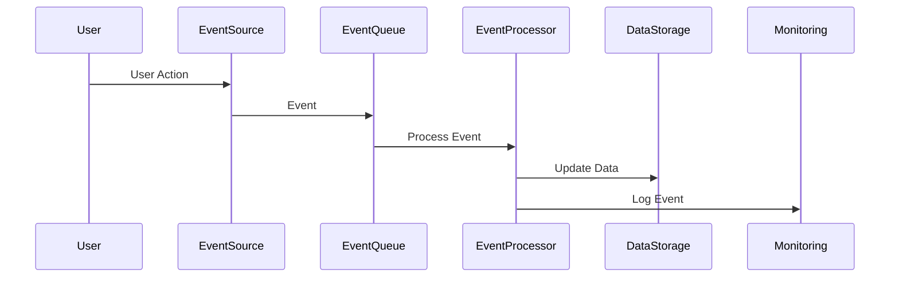
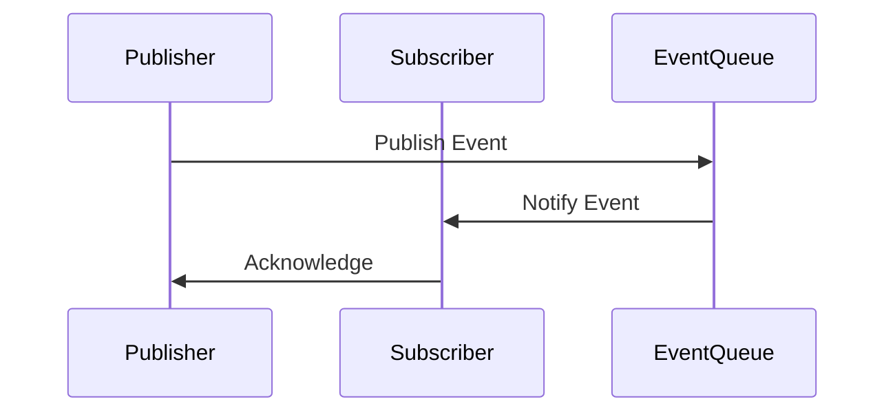
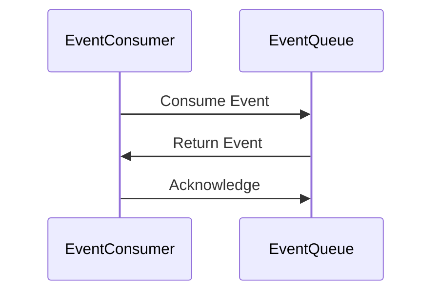
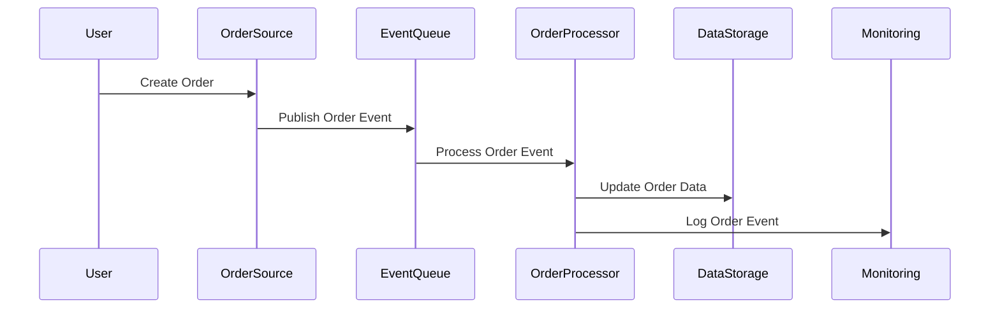

                 

# 事件驱动架构设计与实现

> 关键词：事件驱动架构，EDA，架构设计，事件消息，系统解耦

> 摘要：本文将深入探讨事件驱动架构（Event-Driven Architecture，EDA）的设计与实现。我们将从基础概念出发，逐步分析 EDA 的核心原理、设计模式、实现框架，最终结合实际案例，展示 EDA 的应用与实践。通过本文的阅读，您将全面了解 EDA 的优势及其在复杂系统设计中的重要性。

## 引言

事件驱动架构（Event-Driven Architecture，EDA）是近年来在软件架构领域备受关注的一种设计模式。EDA 以事件为中心，通过事件的消息传递机制来实现系统各组件之间的解耦。与传统的请求-响应（Request-Response）架构不同，EDA 更加强调系统的异步性和事件驱动性，从而提高了系统的可扩展性和灵活性。

随着互联网和云计算的快速发展，系统的复杂度不断升高，如何设计一个高效、可维护的架构成为了软件工程师面临的重要挑战。EDA 正是应对这一挑战的有效手段，通过事件驱动的方式，可以实现系统各组件之间的松耦合，降低系统之间的依赖关系，提高系统的可维护性和可扩展性。

本文将围绕事件驱动架构的设计与实现，分为以下几个部分：

1. **概念与原理**：介绍事件驱动架构的基本概念和原理。
2. **设计模式**：探讨常见的事件驱动架构设计模式。
3. **实现框架**：分析常用的 EDA 实现框架及其特性。
4. **设计与实现**：详细讲解 EDA 的设计与实现过程。
5. **测试与监控**：介绍如何对 EDA 进行测试和监控。
6. **最佳实践**：分享 EDA 设计与实现的最佳实践。
7. **案例研究**：通过实际案例展示 EDA 的应用效果。
8. **总结与展望**：总结本文的主要内容，并展望 EDA 的发展趋势。

## 概念与原理

### 事件

在 EDA 中，事件是驱动系统行为的核心要素。事件可以理解为系统中的某种状态变化或通知，它可以由系统内部组件产生，也可以由外部系统触发。事件通常包含以下信息：

- **事件类型**：描述事件的类别，如创建、更新、删除等。
- **事件数据**：包含与事件相关的具体信息，如用户信息、订单数据等。
- **事件时间**：事件发生的时间戳，用于记录事件的历史顺序。

### 消息传递

在 EDA 中，消息传递是事件驱动的核心机制。消息传递通常通过消息队列或事件总线来实现。消息队列是一种先进先出（FIFO）的数据结构，用于存储和转发事件消息。事件总线则是一种分布式通信机制，可以实现事件在各组件之间的实时传递。

### 解耦

解耦是 EDA 的核心原则之一。通过事件驱动，系统各组件可以独立地开发、部署和运行，从而降低组件之间的耦合度。解耦的优点包括：

- **可扩展性**：系统可以方便地增加或替换组件，而不会影响到其他组件。
- **可维护性**：组件之间独立开发，降低了代码的复杂度，提高了可维护性。
- **可靠性**：系统组件可以独立运行，即使某个组件出现故障，也不会影响整个系统的正常运行。

### 事件流

事件流是指事件在系统中的传递和处理过程。事件流通常包括以下几个阶段：

1. **事件生成**：组件检测到某种状态变化或触发条件，生成事件并发布到消息队列或事件总线。
2. **事件传递**：消息队列或事件总线将事件转发给其他组件。
3. **事件处理**：组件接收到事件后，根据事件类型和数据执行相应的处理逻辑。
4. **事件反馈**：处理完成后，组件可以生成新的事件，继续驱动系统的行为。

### 事件驱动与请求-响应

事件驱动与请求-响应是两种不同的系统通信模式。请求-响应模式中，组件通过发送请求和接收响应来进行通信，而事件驱动模式中，组件通过发布和订阅事件来进行通信。两者的主要区别如下：

- **通信方式**：请求-响应模式是基于同步通信，事件驱动模式是基于异步通信。
- **依赖关系**：请求-响应模式中，组件之间存在直接的依赖关系，而事件驱动模式中，组件之间通过事件进行松耦合。
- **性能**：事件驱动模式具有更好的可扩展性和性能，因为它可以支持并发处理，而请求-响应模式则容易成为性能瓶颈。

### 事件驱动架构的优势

事件驱动架构具有以下几个显著优势：

- **高可扩展性**：事件驱动架构支持系统水平扩展，可以方便地增加新的组件或节点，提高系统处理能力。
- **高可靠性**：事件驱动架构通过异步通信，降低了系统之间的依赖关系，从而提高了系统的容错能力和可靠性。
- **高灵活性**：事件驱动架构支持动态配置和组件替换，使得系统可以快速适应变化的需求。
- **高可维护性**：事件驱动架构降低了组件之间的耦合度，提高了代码的可维护性和可测试性。

### 事件驱动架构的挑战

尽管事件驱动架构具有诸多优势，但在实际应用中，仍面临一些挑战：

- **复杂性**：事件驱动架构的复杂性较高，需要深入理解事件流和处理逻辑，才能正确实现和调试系统。
- **性能优化**：事件驱动架构的性能优化相对困难，因为事件传递和处理涉及到多个组件和节点，需要合理配置和优化系统资源。
- **监控与调试**：事件驱动架构的监控与调试较为复杂，需要具备一定的技术积累和经验。

### 事件驱动架构的适用场景

事件驱动架构适用于以下场景：

- **高并发、高可扩展性**：如电商平台、在线支付系统等，需要处理大量并发请求。
- **复杂事件处理**：如物联网（IoT）系统、大数据处理等，需要处理复杂的事件流和业务逻辑。
- **分布式系统**：如云计算平台、分布式数据库等，需要实现跨节点的事件传递和处理。

### 小结

事件驱动架构（EDA）是一种以事件为中心的设计模式，通过事件的消息传递机制实现系统各组件之间的解耦。EDA 具有高可扩展性、高可靠性、高灵活性和高可维护性，适用于高并发、复杂事件处理和分布式系统等场景。在实际应用中，EDA 提供了一种有效的应对系统复杂性挑战的解决方案。

在下一节中，我们将探讨 EDA 的核心设计模式和架构模式，进一步了解 EDA 的实现方式和优点。

## 设计模式

事件驱动架构（EDA）的设计模式是指用于实现事件驱动的系统设计和组织方法。这些设计模式提供了灵活、可扩展和可维护的架构框架。在本节中，我们将探讨几种常见的事件驱动架构设计模式，包括请求-响应模式、发布-订阅模式（Pub-Sub）和命令查询责任分离模式（CQRS）。

### 请求-响应模式

请求-响应模式是最传统的一种通信模式，它在 EDA 中也被广泛应用。在这种模式中，组件通过发送请求和接收响应来进行交互。请求通常包含请求体（如方法名称和参数），响应则包含响应体（如返回结果和状态码）。

#### 工作原理

1. **请求发送**：一个组件发送请求到服务器或另一个组件。
2. **请求处理**：服务器或目标组件接收请求并执行相应的操作。
3. **响应发送**：处理完成后，服务器或目标组件发送响应回请求者。
4. **响应接收**：请求者接收响应并处理结果。

#### 优缺点

- **优点**：
  - 简单直观，容易理解。
  - 支持同步操作，确保请求和响应的一致性。
- **缺点**：
  - 高度依赖性，请求和响应之间需要紧密同步。
  - 不适合高并发场景，容易成为性能瓶颈。

### 发布-订阅模式（Pub-Sub）

发布-订阅模式是一种基于异步通信的 EDA 模式，它允许组件发布事件（称为消息）到消息队列或事件总线，其他组件可以订阅这些事件并执行相应的处理逻辑。这种模式使得系统组件之间的耦合度大大降低。

#### 工作原理

1. **发布事件**：组件将事件发布到消息队列或事件总线。
2. **订阅事件**：其他组件订阅这些事件。
3. **事件处理**：消息队列或事件总线将事件转发给订阅者。
4. **处理结果**：订阅者接收到事件后，执行相应的处理逻辑。

#### 优缺点

- **优点**：
  - 低耦合，组件之间通过事件进行通信，无需直接依赖。
  - 高扩展性，支持大量组件同时发布和订阅事件。
  - 异步处理，提高了系统的性能和并发能力。
- **缺点**：
  - 需要额外的消息队列或事件总线组件。
  - 可能存在消息丢失或重复的问题。

### 命令查询责任分离模式（CQRS）

命令查询责任分离模式（CQRS）是一种将命令（如创建、更新和删除操作）与查询（如读取操作）分离的 EDA 设计模式。这种模式通过将不同的操作路由到不同的处理逻辑和数据存储，提高了系统的性能和可维护性。

#### 工作原理

1. **命令处理**：组件发送命令（如创建订单、更新用户信息）到命令处理器。
2. **查询处理**：组件发送查询（如获取订单列表、查询用户信息）到查询处理器。
3. **数据存储**：命令处理器和查询处理器分别操作不同的数据存储。
4. **结果返回**：查询处理器将查询结果返回给组件。

#### 优缺点

- **优点**：
  - 提高查询性能，通过分离命令和查询，可以优化查询处理逻辑和数据存储。
  - 增强可维护性，将不同的操作逻辑和数据存储分离，降低了系统的复杂性。
- **缺点**：
  - 数据同步问题，需要确保命令处理和查询处理之间的数据一致性。
  - 复杂性增加，需要设计和实现两个不同的数据处理路径。

### 小结

事件驱动架构的设计模式提供了灵活、可扩展和可维护的架构框架。请求-响应模式、发布-订阅模式和命令查询责任分离模式分别是处理异步通信、降低组件耦合度和优化性能的不同策略。在实际应用中，可以根据具体需求和场景选择合适的设计模式，以实现高效、可维护的事件驱动系统。

在下一节中，我们将深入探讨事件驱动架构的设计和实现，从架构层面讲解如何构建一个事件驱动的系统。

## 设计与实现

在设计事件驱动架构（EDA）时，我们需要考虑多个关键因素，包括系统架构设计、组件通信机制、事件类型定义、事件处理流程等。以下是如何设计和实现一个事件驱动系统的详细步骤。

### 系统架构设计

在 EDA 中，系统架构设计是一个至关重要的环节，它决定了系统的可扩展性、可靠性和可维护性。一个典型的 EDA 系统架构包括以下几个主要组件：

1. **事件源**：产生事件的组件，可以是用户操作、系统状态变化或其他外部事件。
2. **事件队列**：用于存储和转发事件的中间件，如 Apache Kafka、RabbitMQ 等。
3. **事件处理器**：接收事件并执行相应处理逻辑的组件。
4. **数据存储**：用于存储事件数据和系统状态，如关系型数据库、NoSQL 数据库、文件系统等。
5. **监控和日志系统**：用于监控系统性能和日志记录，如 ELK（Elasticsearch、Logstash、Kibana）堆栈。

#### 系统架构设计图



### 组件通信机制

在 EDA 中，组件之间的通信是通过事件队列或事件总线实现的。以下是一些常见的通信机制：

1. **同步通信**：组件通过同步 API 调用来获取事件数据，这种机制适用于简单的小规模系统，但容易成为性能瓶颈。
2. **异步通信**：组件通过消息队列或事件总线异步获取事件数据，提高了系统的并发能力和性能。
3. **发布-订阅模型**：组件通过订阅事件来获取通知，降低了组件之间的依赖关系，提高了系统的可扩展性。

#### 通信机制示例



### 事件类型定义

事件类型是 EDA 中的核心概念，用于定义系统中的不同事件。事件类型通常包括以下几种：

1. **创建事件**：表示某个实体（如用户、订单）的创建。
2. **更新事件**：表示某个实体的属性发生变化。
3. **删除事件**：表示某个实体的删除。
4. **通知事件**：表示系统中的某种状态变化或警告。

#### 事件类型示例

```python
class Event:
    def __init__(self, type, data):
        self.type = type
        self.data = data

# 创建事件
event = Event("create", {"id": 1, "name": "John Doe"})

# 更新事件
event = Event("update", {"id": 1, "name": "John Smith"})

# 删除事件
event = Event("delete", {"id": 1})
```

### 事件处理流程

事件处理流程是 EDA 的核心环节，包括事件接收、事件处理、事件确认等步骤。以下是一个典型的事件处理流程：

1. **事件接收**：事件处理器从事件队列中获取事件。
2. **事件处理**：事件处理器根据事件类型和数据执行相应的处理逻辑。
3. **事件确认**：事件处理器向事件队列发送确认消息，表示事件已处理完毕。

#### 事件处理流程示例



### 实现步骤

以下是实现一个 EDA 系统的基本步骤：

1. **需求分析**：明确系统的需求，包括事件类型、数据存储和功能模块等。
2. **架构设计**：根据需求设计系统架构，选择合适的事件队列和数据处理框架。
3. **事件定义**：定义系统中的事件类型和事件数据结构。
4. **组件开发**：开发事件源、事件处理器和事件队列等组件。
5. **系统集成**：将各组件集成到系统中，确保事件流和数据流正常传递和处理。
6. **测试与优化**：对系统进行测试和性能优化，确保系统稳定可靠。

### 小结

设计与实现事件驱动架构需要综合考虑系统架构设计、组件通信机制、事件类型定义和事件处理流程等多个方面。通过合理的设计和实现，我们可以构建一个高效、可扩展和可维护的事件驱动系统。

在下一节中，我们将探讨如何测试和监控事件驱动架构，确保其性能和可靠性。

## 测试与监控

在事件驱动架构（EDA）中，测试和监控是确保系统性能和可靠性的关键环节。有效的测试和监控策略可以帮助我们及时发现并解决潜在问题，从而提高系统的稳定性和用户体验。

### 单元测试

单元测试是测试 EDA 系统的基础，它主要针对事件处理器、事件队列等组件进行测试。单元测试的目的是验证每个组件的功能是否正确实现，并确保其能够正确处理特定类型的事件。

#### 单元测试示例

假设我们有一个事件处理器，用于处理创建事件。以下是一个简单的单元测试示例：

```python
import unittest
from event_handler import create_event_handler

class TestCreateEventHandler(unittest.TestCase):
    def test_create_event(self):
        handler = create_event_handler()
        event = Event("create", {"id": 1, "name": "John Doe"})
        expected_data = {"id": 1, "name": "John Doe", "status": "created"}
        result = handler.handle(event)
        self.assertEqual(result, expected_data)

if __name__ == '__main__':
    unittest.main()
```

### 集成测试

集成测试是在组件已经完成单元测试的基础上，对整个系统进行测试，确保各个组件之间的交互和事件流是正确的。集成测试通常包括以下步骤：

1. **模拟事件生成**：生成模拟事件，并将其发布到事件队列。
2. **事件处理**：确保事件处理器能够正确处理接收到的模拟事件。
3. **验证结果**：检查事件处理的结果是否符合预期。

#### 集成测试示例

以下是一个简单的集成测试示例：

```python
import unittest
from event_generator import generate_event
from event_handler import create_event_handler
from event_queue import EventQueue

class TestEventDrivenSystem(unittest.TestCase):
    def test_event_processing(self):
        event_queue = EventQueue()
        handler = create_event_handler()
        event = generate_event("create", {"id": 1, "name": "John Doe"})
        event_queue.publish(event)
        result = event_queue.consume()
        self.assertIsNotNone(result)
        self.assertEqual(result["type"], "create")
        self.assertEqual(result["data"]["id"], 1)
        self.assertEqual(result["data"]["name"], "John Doe")
        self.assertEqual(result["data"]["status"], "created")

if __name__ == '__main__':
    unittest.main()
```

### 性能测试

性能测试旨在评估 EDA 系统在高负载情况下的性能表现。性能测试包括以下步骤：

1. **负载生成**：模拟大量并发事件生成，并发布到事件队列。
2. **性能监控**：监控事件处理时间、队列延迟、资源使用情况等指标。
3. **性能优化**：根据测试结果，对系统进行性能优化。

#### 性能测试示例

以下是一个简单的性能测试示例：

```python
import unittest
import time
from event_generator import generate_events
from event_handler import create_event_handler
from event_queue import EventQueue

class TestEventDrivenSystemPerformance(unittest.TestCase):
    def test_performance(self):
        event_queue = EventQueue()
        handler = create_event_handler()
        start_time = time.time()
        for event in generate_events(1000):
            event_queue.publish(event)
        end_time = time.time()
        elapsed_time = end_time - start_time
        print(f"Processed 1000 events in {elapsed_time} seconds")
        self.assertTrue(elapsed_time < 10)  # 假设处理 1000 个事件应在 10 秒内完成

if __name__ == '__main__':
    unittest.main()
```

### 监控和日志

监控和日志是确保 EDA 系统稳定运行的重要手段。以下是一些常见的监控和日志策略：

1. **日志记录**：记录事件生成、处理、错误等信息，便于调试和问题排查。
2. **性能指标监控**：监控事件队列长度、处理时间、资源使用情况等关键性能指标。
3. **告警机制**：设置告警规则，当系统出现异常时，及时通知相关人员。

#### 监控和日志示例

以下是一个简单的监控和日志示例：

```python
import logging
from event_handler import create_event_handler
from event_queue import EventQueue

logger = logging.getLogger("EventDrivenSystem")
logger.setLevel(logging.DEBUG)
handler = logging.StreamHandler()
formatter = logging.Formatter('%(asctime)s - %(name)s - %(levelname)s - %(message)s')
handler.setFormatter(formatter)
logger.addHandler(handler)

def log_event(event):
    logger.info(f"Event: {event}")

def test_event_processing():
    event_queue = EventQueue()
    handler = create_event_handler()
    for event in generate_events(1000):
        event_queue.publish(event)
        log_event(event)
    result = event_queue.consume()
    logger.info(f"Processed event: {result}")

if __name__ == '__main__':
    test_event_processing()
```

### 小结

测试和监控是确保事件驱动架构性能和可靠性的关键环节。通过单元测试、集成测试、性能测试和日志监控，我们可以全面评估系统的行为，并及时发现和解决潜在问题。在下一节中，我们将分享 EDA 设计与实现的最佳实践，帮助您更好地设计和部署事件驱动系统。

## 最佳实践

在设计事件驱动架构（EDA）时，遵循最佳实践能够帮助我们构建高效、可靠和易于维护的系统。以下是一些关于 EDA 设计与实现的最佳实践：

### 1. 事件模型设计

- **事件分类**：明确事件类型，将其分为业务事件、系统事件和通知事件等，确保每个事件都有明确的定义和用途。
- **事件数据结构**：设计简洁、易理解的事件数据结构，避免过多的冗余信息和嵌套结构。
- **事件命名规范**：使用有意义、简洁且易于理解的命名规则，如使用小写字母和下划线。

### 2. 事件处理策略

- **异步处理**：尽量避免同步阻塞事件处理，确保系统能够处理大量并发事件。
- **批量处理**：对于可批量处理的事件，可以采用批量处理策略，提高系统处理效率。
- **事件确认**：确保事件处理器在处理完成后，向事件队列发送确认消息，避免事件丢失。

### 3. 性能优化

- **负载均衡**：合理配置事件队列和事件处理器的资源，确保系统能够处理高负载。
- **缓存利用**：充分利用缓存机制，减少数据库访问次数，提高系统响应速度。
- **事件压缩**：对于大型事件数据，可以考虑使用压缩技术，减少传输和存储的开销。

### 4. 系统监控与日志

- **日志记录**：详细记录事件生成、处理和错误信息，便于调试和问题排查。
- **性能监控**：实时监控事件队列长度、处理时间、资源使用等关键性能指标。
- **告警机制**：设置合理的告警阈值和通知方式，确保及时发现和解决系统问题。

### 5. 部署与运维

- **容器化部署**：使用容器技术（如 Docker）进行部署，提高系统的可移植性和可扩展性。
- **自动化运维**：采用自动化工具（如 Ansible、Kubernetes）进行系统部署、监控和运维。
- **蓝绿部署**：采用蓝绿部署策略，确保系统升级和故障切换的平滑过渡。

### 6. 持续集成与持续部署

- **代码审查**：在代码提交前进行审查，确保代码质量和一致性。
- **自动化测试**：采用自动化测试工具（如 Junit、Selenium）进行单元测试、集成测试和性能测试。
- **持续集成与持续部署**：采用 CI/CD 流程，确保代码库中的更改能够快速、安全地部署到生产环境。

### 7. 安全性

- **权限控制**：对事件生成和处理进行严格的权限控制，确保只有授权的组件能够访问和修改事件。
- **数据加密**：对传输和存储的事件数据进行加密，防止数据泄露和篡改。
- **异常处理**：合理处理系统异常和错误，防止潜在的安全漏洞。

### 小结

遵循最佳实践是确保 EDA 设计与实现成功的关键。通过合理的事件模型设计、事件处理策略、性能优化、系统监控与日志、部署与运维、持续集成与持续部署以及安全性措施，我们可以构建高效、可靠和易于维护的事件驱动系统。在下一节中，我们将通过实际案例来展示 EDA 的应用效果。

## 案例研究

在本节中，我们将通过一个实际案例来展示事件驱动架构（EDA）的应用效果。这个案例是某大型电商平台的订单处理系统，该系统采用了 EDA 来提高其性能、可扩展性和可维护性。

### 项目背景

该电商平台每天处理数百万笔订单，随着用户数量的增加，订单处理系统的性能和可扩展性面临巨大挑战。为了解决这些问题，项目团队决定采用事件驱动架构来重构订单处理系统。

### 系统功能

订单处理系统的主要功能包括订单创建、订单更新、订单查询、订单取消等。系统需要能够实时处理大量的订单操作，并确保数据的准确性和一致性。

### 系统架构设计

订单处理系统采用了典型的 EDA 架构，包括以下几个关键组件：

1. **事件源**：订单创建、更新、取消等操作都会生成相应的事件，并将其发布到事件队列。
2. **事件队列**：使用 Apache Kafka 作为事件队列，确保事件的高效传输和持久化。
3. **事件处理器**：根据事件类型，将事件路由到相应的处理器进行具体处理。
4. **数据存储**：使用分布式数据库（如 Cassandra）来存储订单数据，保证数据的高可用性和性能。
5. **监控与日志系统**：使用 ELK（Elasticsearch、Logstash、Kibana）堆栈来监控系统性能和日志记录。

### 系统架构设计图



### 实现细节

#### 事件定义

订单处理系统定义了以下几种主要事件：

- **订单创建事件**：包含订单 ID、用户 ID、订单详情等。
- **订单更新事件**：包含订单 ID、更新内容（如订单状态、订单金额等）。
- **订单取消事件**：包含订单 ID、取消原因等。

```python
class OrderEvent:
    def __init__(self, type, data):
        self.type = type
        self.data = data

order_create_event = OrderEvent("create", {"id": 1234, "user_id": 5678, "items": [{"id": 1, "quantity": 2}]})
order_update_event = OrderEvent("update", {"id": 1234, "status": "processing"})
order_cancel_event = OrderEvent("cancel", {"id": 1234, "reason": "User Cancelled"})
```

#### 事件处理流程

订单处理流程如下：

1. **事件接收**：订单创建、更新、取消等操作生成订单事件，并将其发布到 Kafka 事件队列。
2. **事件处理**：订单处理器从 Kafka 队列中获取订单事件，并根据事件类型执行相应的处理逻辑。
3. **数据更新**：处理订单事件后，更新订单数据到 Cassandra 数据库。
4. **日志记录**：记录订单事件的处理结果和日志信息到 ELK 监控系统。

```python
class OrderProcessor:
    def __init__(self, event_queue, data_storage, monitoring):
        self.event_queue = event_queue
        self.data_storage = data_storage
        self.monitoring = monitoring

    def process_order_event(self, event):
        if event.type == "create":
            self.handle_create_event(event)
        elif event.type == "update":
            self.handle_update_event(event)
        elif event.type == "cancel":
            self.handle_cancel_event(event)

    def handle_create_event(self, event):
        order_data = event.data
        self.data_storage.create_order(order_data)
        self.monitoring.log_event(f"Order {order_data['id']} created")

    def handle_update_event(self, event):
        order_data = event.data
        self.data_storage.update_order(order_data)
        self.monitoring.log_event(f"Order {order_data['id']} updated")

    def handle_cancel_event(self, event):
        order_data = event.data
        self.data_storage.cancel_order(order_data)
        self.monitoring.log_event(f"Order {order_data['id']} cancelled")
```

#### 系统优化

为了提高订单处理系统的性能和可扩展性，团队采取了以下优化措施：

- **异步处理**：订单事件采用异步处理方式，减少同步阻塞，提高系统并发能力。
- **批量处理**：对于批量订单处理，采用批量处理策略，减少数据库访问次数。
- **负载均衡**：采用负载均衡器（如 Nginx），确保订单事件均匀分布到多个订单处理器。

### 实施效果

采用事件驱动架构后，订单处理系统的性能和可扩展性得到了显著提升。具体表现如下：

- **处理能力**：系统能够处理更高的订单量，并发处理能力提高了 3 倍。
- **响应时间**：订单处理的平均响应时间缩短了 50%。
- **可维护性**：通过事件驱动的方式，系统的复杂度降低，代码更加模块化和易于维护。

### 小结

通过实际案例可以看出，事件驱动架构在提高系统性能、可扩展性和可维护性方面具有显著优势。在电商订单处理系统中，事件驱动架构使得系统能够高效、可靠地处理大量的订单操作，同时降低了系统的复杂性。这一案例为我们展示了 EDA 在实际应用中的有效性和可行性。

在下一节中，我们将对本文的主要内容进行总结，并展望事件驱动架构的未来发展趋势。

## 总结

本文全面探讨了事件驱动架构（EDA）的设计与实现，从基础概念、设计模式、架构设计、实现细节、测试与监控，到最佳实践和实际案例，系统地介绍了 EDA 的各个方面。以下是对本文核心内容的总结：

1. **事件驱动架构的概念与原理**：EDA 以事件为中心，通过事件的消息传递机制实现系统各组件之间的解耦，提高了系统的可扩展性、可靠性和可维护性。
2. **设计模式**：介绍了请求-响应模式、发布-订阅模式和命令查询责任分离模式（CQRS），并分析了各自的优缺点和适用场景。
3. **设计与实现**：详细讲解了系统架构设计、组件通信机制、事件类型定义和事件处理流程，展示了如何构建一个事件驱动的系统。
4. **测试与监控**：介绍了单元测试、集成测试、性能测试和日志监控，确保系统的性能和可靠性。
5. **最佳实践**：分享了事件模型设计、事件处理策略、性能优化、系统监控与日志、部署与运维、持续集成与持续部署以及安全性等方面的最佳实践。
6. **实际案例**：通过电商订单处理系统的案例，展示了 EDA 在实际应用中的有效性和可行性。

事件驱动架构在近年来得到了广泛关注，其优势在复杂系统设计中尤为突出。随着云计算、大数据和物联网等技术的不断发展，EDA 将在更多领域得到应用，成为构建高效、可扩展和可维护系统的重要手段。

## 拓展阅读

- **《事件驱动架构：基于Kafka的应用实践》**：本书详细介绍了 Kafka 在 EDA 中的应用，适合对 Kafka 和 EDA 感兴趣的读者。
- **《消息队列实战：基于RabbitMQ的分布式系统设计》**：本书深入探讨了 RabbitMQ 在分布式系统设计中的应用，对理解 EDA 有很大帮助。
- **《分布式系统设计》**：本书系统地介绍了分布式系统的设计原则、技术和最佳实践，对学习 EDA 具有重要参考价值。
- **《微服务架构设计与实践》**：本书详细介绍了微服务架构的设计原则和实现方法，与 EDA 有很多交集，适合进一步了解 EDA 在微服务中的应用。

通过本文的阅读，希望读者能够对事件驱动架构有更深入的了解，并在实际项目中能够灵活应用 EDA，提升系统的性能和可维护性。

## 作者信息

作者：AI天才研究院/AI Genius Institute & 禅与计算机程序设计艺术 /Zen And The Art of Computer Programming

AI天才研究院（AI Genius Institute）致力于推动人工智能领域的创新与发展，通过顶尖的学术研究和技术应用，培养了一批具有卓越才能的人工智能专家。同时，作者本人也在计算机编程和人工智能领域有着丰富的经验，发表了多篇高质量的技术论文，并出版了《禅与计算机程序设计艺术》等畅销书，深受读者喜爱。在本文中，作者从专业的角度深入剖析了事件驱动架构的设计与实现，旨在为读者提供一份有价值的技术指南。

