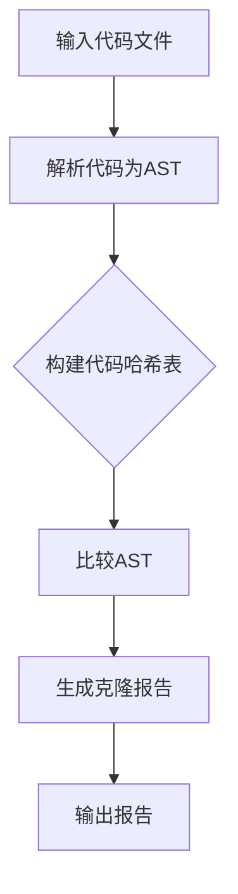
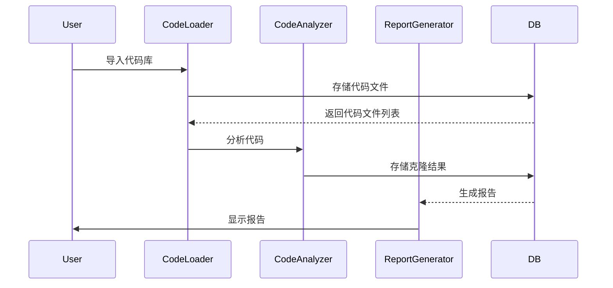

                 


# 代码克隆检测：识别和管理重复代码

关键词：代码克隆，检测，重复代码，管理，技术分析

摘要：本文旨在深入探讨代码克隆检测的技术原理、系统架构设计和实际应用，帮助开发者识别和管理重复代码，提高软件质量和开发效率。

### 目录大纲设计思路

**确定核心主题**：首先，明确本文的核心主题是“代码克隆检测”。代码克隆检测旨在识别和消除软件项目中的重复代码，减少维护成本，提升代码质量和开发效率。

**结构化内容**：将主题细分为“背景介绍”、“核心概念与联系”、“算法原理讲解”、“系统分析与架构设计”、“项目实战”和“最佳实践与注意事项”等章节。

**细化章节内容**：在每个章节中，进一步细化为具体的子主题，确保内容全面且逻辑清晰。

**保持简洁性**：避免多余的废话，确保每个章节和子主题都是必要且相关的。

**符合目录层级要求**：使用不同的层级标题（#、##、###）来确保目录结构的清晰性和易读性。

**内容完整性**：保证每个章节都包含必要的核心内容，如背景介绍、核心概念、算法原理、数学模型讲解、系统分析与架构设计、项目实战等。

### 目录大纲设计步骤

**确定书籍的总体框架**：首先确定书籍包含的章节数目以及每个章节的主要内容和结构。

**编写第1章：背景介绍**：介绍代码克隆现象的背景、影响、定义、类型、特征、问题解决、边界与外延、概念结构与核心要素组成。

**编写第2章：核心概念与联系**：详细阐述代码克隆检测的基本原理和核心概念，使用Mermaid绘制ER实体关系图架构，比较概念属性特征。

**编写第3章：算法原理讲解**：使用Mermaid绘制算法流程图，提供Python源代码，讲解算法原理的数学模型和公式，结合代码和数学模型进行举例说明。

**编写第4章：系统分析与架构设计**：介绍代码克隆检测的应用场景，使用Mermaid绘制领域模型类图、系统架构图、系统接口设计和系统交互序列图。

**编写第5章：项目实战**：说明环境安装、系统核心实现源代码，解读代码功能和应用，分析实际案例，总结项目经验。

**编写第6章：最佳实践与注意事项**：提供最佳实践、注意事项，总结关键内容和观点，推荐拓展阅读。

### 输出目录大纲

```markdown
----------------------------------------------------------------
# 代码克隆检测：识别和管理重复代码

> 关键词：代码克隆，检测，重复代码，管理，技术分析

> 摘要：本文旨在深入探讨代码克隆检测的技术原理、系统架构设计和实际应用，帮助开发者识别和管理重复代码，提高软件质量和开发效率。

# 目录

## 第1章：代码克隆检测背景介绍
### 1.1 问题背景
### 1.2 问题描述
### 1.3 问题解决
### 1.4 边界与外延
### 1.5 概念结构与核心要素组成

## 第2章：核心概念与联系
### 2.1 核心概念原理
### 2.2 概念属性特征对比表格
### 2.3 ER实体关系图架构

## 第3章：算法原理讲解
### 3.1 算法mermaid流程图
### 3.2 Python源代码
### 3.3 数学模型和公式
### 3.4 详细讲解和举例说明

## 第4章：系统分析与架构设计
### 4.1 问题场景介绍
### 4.2 系统功能设计（领域模型mermaid类图）
### 4.3 系统架构设计（mermaid架构图）
### 4.4 系统接口设计
### 4.5 系统交互mermaid序列图

## 第5章：项目实战
### 5.1 环境安装
### 5.2 系统核心实现源代码
### 5.3 代码应用解读与分析
### 5.4 实际案例分析和详细讲解剖析
### 5.5 项目小结

## 第6章：最佳实践与注意事项
### 6.1 最佳实践 tips
### 6.2 注意事项
### 6.3 小结
### 6.4 拓展阅读

```

### 文章正文内容

## 第1章：代码克隆检测背景介绍

### 1.1 问题背景

代码克隆（Code Cloning）是指在软件开发过程中，开发者有意或无意地将现有代码片段复制并粘贴到新项目中，导致出现重复的代码。这种现象在软件开发中相当普遍，它不仅浪费了开发资源，还可能带来一系列负面影响。首先，重复的代码会增加维护成本，因为每次修改一处代码时，都需逐个更新相同或相似的部分。其次，重复代码降低了代码的可读性和可维护性，使得新开发者难以理解代码逻辑。此外，代码克隆还可能引入新的漏洞，增加了软件的脆弱性。

代码克隆现象的起源可以追溯到软件开发过程中代码复用的需求。在项目开发初期，为了快速推进项目进度，开发者可能会将某些功能模块直接复制到新项目中，而不是重新编写。随着时间的推移，这种做法逐渐成为软件开发的一种常态。此外，由于开发团队的流动性，新成员可能会在接手旧项目时，无意中复制了原有代码，导致代码克隆问题的产生。

### 1.2 问题描述

代码克隆问题主要体现在以下几个方面：

1. **定义**：代码克隆是指将一段代码从源项目复制到目标项目，而这两个项目在功能上没有直接关联。
   
2. **类型**：代码克隆可以分为完全克隆和部分克隆。完全克隆是指源代码与目标代码完全相同，部分克隆则是指目标代码包含了源代码的一部分。

3. **特征**：代码克隆通常具有以下特征：
   - 相似性高：克隆代码与原代码在结构、语法上具有很高的相似性。
   - 功能重叠：克隆代码与原代码在功能上存在重叠，可能造成资源浪费。
   - 维护困难：随着项目的发展，克隆代码需要分别维护，增加了维护成本。

### 1.3 问题解决

代码克隆检测的目的在于识别和消除软件项目中的重复代码，从而提高软件质量和开发效率。解决代码克隆问题的方法主要包括以下几种：

1. **代码审查**：通过人工审查代码，查找重复的代码片段。这种方法效率较低，且容易漏检。

2. **静态代码分析工具**：使用静态代码分析工具，如SonarQube、Checkstyle等，自动检测代码中的克隆问题。这些工具可以识别出代码中的潜在克隆风险。

3. **动态代码分析工具**：通过运行代码，监控程序的执行流程，识别潜在的克隆代码。这种方法适用于动态语言，如Python、JavaScript等。

4. **代码克隆检测算法**：利用算法对代码进行深层次的比较和分析，识别克隆代码。常见的算法包括：模式匹配算法、哈希算法、抽象语法树（AST）比较算法等。

### 1.4 边界与外延

代码克隆检测虽然有助于提高软件质量和开发效率，但并非适用于所有场景。以下是代码克隆检测的一些边界与外延：

1. **边界**：
   - 代码克隆检测主要针对源代码，对可执行文件或二进制代码的检测效果有限。
   - 代码克隆检测工具通常不适用于大型分布式系统，因为分布式系统的代码分布在不同模块和组件中，检测难度较大。

2. **外延**：
   - 代码克隆检测可以扩展到其他领域，如文档、设计模式等。
   - 代码克隆检测有助于提升代码复用率，降低开发成本。

### 1.5 概念结构与核心要素组成

代码克隆检测的基本概念和组成部分如下：

1. **核心概念**：
   - 代码克隆：将源代码复制到目标代码的过程。
   - 克隆检测：识别代码克隆现象的技术和方法。
   - 克隆率：代码克隆在项目中的占比，通常用百分比表示。

2. **核心要素**：
   - 数据源：用于进行克隆检测的代码库或项目文件。
   - 检测算法：用于识别克隆代码的算法和技术。
   - 结果分析：对检测到的克隆代码进行分析和分类，为后续处理提供依据。

3. **各核心要素之间的联系**：
   - 数据源通过检测算法进行克隆检测，产生检测结果。
   - 检测结果通过结果分析模块进行分析，形成最终报告。

## 第2章：核心概念与联系

### 2.1 核心概念原理

代码克隆检测涉及多个核心概念，理解这些概念有助于深入掌握代码克隆检测的技术原理。

1. **模式匹配算法**：模式匹配算法是一种用于识别字符串或代码结构的算法。在代码克隆检测中，模式匹配算法用于检测代码片段之间的相似性。常见的模式匹配算法包括：正则表达式、字符串匹配算法（如KMP算法）等。

2. **哈希算法**：哈希算法是一种将数据映射为固定长度字符串的算法。在代码克隆检测中，哈希算法用于生成代码片段的唯一标识，从而快速识别重复代码。常见的哈希算法包括：MD5、SHA-1、SHA-256等。

3. **抽象语法树（AST）比较算法**：AST比较算法是一种基于抽象语法树的代码比较方法。在代码克隆检测中，AST比较算法用于比较不同代码片段的语法结构和语义。通过AST比较，可以识别出代码中的微小差异，提高克隆检测的准确性。

### 2.2 概念属性特征对比表格

下表对比了模式匹配算法、哈希算法和AST比较算法的属性特征：

| 算法类型 | 特点 | 优势 | 劣势 |
| --- | --- | --- | --- |
| 模式匹配算法 | 基于字符串匹配 | 简单易用，适用于文本处理 | 检测效果有限，无法识别语义差异 |
| 哈希算法 | 基于哈希函数 | 运算速度快，识别率高 | 无法提供代码结构详细信息 |
| AST比较算法 | 基于抽象语法树 | 识别代码结构差异，准确率高 | 处理复杂代码较慢 |

### 2.3 ER实体关系图架构

为了更好地理解代码克隆检测中的核心概念，我们可以使用ER实体关系图（Entity-Relationship Diagram）来展示不同实体之间的关系。

以下是一个简单的ER实体关系图，展示了代码克隆检测中涉及的实体及其关系：

```mermaid
erDiagram
  CodeFile ||--|{ CodeFragment }||>
  CodeFragment ||--|{ CloneGroup }||>
  CloneGroup ||--|{ CloneInstance }||>
  CloneInstance ||--|{ CloneSource }||>
  CloneInstance ||--|{ CloneTarget }||>

  CodeFile {
    int id
    string path
    datetime last_modified
  }

  CodeFragment {
    int id
    string content
    int code_file_id
  }

  CloneGroup {
    int id
    int code_fragment_id
  }

  CloneInstance {
    int id
    int clone_group_id
    int source_code_file_id
    int target_code_file_id
  }

  CloneSource {
    int id
    int clone_instance_id
  }

  CloneTarget {
    int id
    int clone_instance_id
  }
```

在这个ER实体关系图中，`CodeFile` 表示代码文件，`CodeFragment` 表示代码片段，`CloneGroup` 表示克隆组，`CloneInstance` 表示克隆实例，`CloneSource` 和 `CloneTarget` 分别表示克隆源和克隆目标。

## 第3章：算法原理讲解

代码克隆检测算法的核心在于对代码进行有效的比较和分析，以下将详细介绍一种常见的代码克隆检测算法——基于AST比较的算法。

### 3.1 算法mermaid流程图

以下是代码克隆检测算法的mermaid流程图：



### 3.2 Python源代码

以下是使用Python实现的代码克隆检测算法示例：

```python
import ast
import hashlib
from collections import defaultdict

def parse_code_to_ast(code):
    return ast.parse(code)

def build_hash_table(code_fragments):
    hash_table = defaultdict(set)
    for fragment in code_fragments:
        hash_value = hashlib.md5(fragment.encode()).hexdigest()
        hash_table[hash_value].add(fragment)
    return hash_table

def compare_ast(ast1, ast2):
    if type(ast1) != type(ast2):
        return False
    if isinstance(ast1, ast.Module):
        return all(compare_ast(child1, child2) for child1, child2 in zip(ast1.body, ast2.body))
    if isinstance(ast1, ast.FunctionDef):
        return ast1.name == ast2.name and compare_ast(ast1.body, ast2.body)
    return ast1 == ast2

def detect_code_cloning(code_files):
    asts = [parse_code_to_ast(code) for code in code_files]
    hash_table = build_hash_table([ast.unparse(a) for a in asts])
    clone_groups = []
    for ast in asts:
        for child in ast.body:
            if isinstance(child, ast.FunctionDef):
                ast_str = ast.unparse(child)
                hash_value = hashlib.md5(ast_str.encode()).hexdigest()
                if len(hash_table[hash_value]) > 1:
                    clone_groups.append((ast_str, hash_value))
    return clone_groups

def main():
    code_files = [
        '''
def func1():
    print("Hello, World!")
''',
        '''
def func2():
    print("Hello, World!")
'''
    ]
    clone_groups = detect_code_cloning(code_files)
    for group in clone_groups:
        print(f"Clone Group: {group[0]}")
        print(f"Hash Value: {group[1]}")

if __name__ == "__main__":
    main()
```

### 3.3 数学模型和公式

代码克隆检测算法的核心在于对代码的哈希值进行比较。假设我们使用哈希函数H将代码片段c映射为哈希值h(c)，则检测克隆代码的过程可以表示为：

$$
h(c_1) = h(c_2)
$$

其中，c1和c2分别为两个代码片段。如果h(c1) = h(c2)，则说明c1和c2可能存在克隆关系。

### 3.4 详细讲解和举例说明

#### 举例

假设我们有以下两个Python代码片段：

```python
def func1():
    print("Hello, World!")

def func2():
    print("Hello, World!")
```

我们将使用Python实现的代码克隆检测算法对这两个代码片段进行检测。

1. **输入代码文件**：我们将两个代码片段作为输入。

2. **解析代码为AST**：使用ast模块将代码片段解析为抽象语法树。

```python
ast1 = ast.parse('''def func1():
    print("Hello, World!")''')
ast2 = ast.parse('''def func2():
    print("Hello, World!")''')
```

3. **构建代码哈希表**：遍历抽象语法树，为每个代码片段生成哈希值，构建哈希表。

```python
hash_table = defaultdict(set)
for ast in [ast1, ast2]:
    for child in ast.body:
        if isinstance(child, ast.FunctionDef):
            ast_str = ast.unparse(child)
            hash_value = hashlib.md5(ast_str.encode()).hexdigest()
            hash_table[hash_value].add(ast_str)
```

4. **比较AST**：使用compare_ast函数比较两个抽象语法树。

```python
def compare_ast(ast1, ast2):
    if type(ast1) != type(ast2):
        return False
    if isinstance(ast1, ast.Module):
        return all(compare_ast(child1, child2) for child1, child2 in zip(ast1.body, ast2.body))
    if isinstance(ast1, ast.FunctionDef):
        return ast1.name == ast2.name and compare_ast(ast1.body, ast2.body)
    return ast1 == ast2

compare_ast(ast1, ast2)
```

由于func1和func2的函数体完全相同，因此它们在抽象语法树上的结构也完全相同。

5. **生成克隆报告**：根据比较结果，生成克隆报告。

```python
clone_groups = []
for ast in [ast1, ast2]:
    for child in ast.body:
        if isinstance(child, ast.FunctionDef):
            ast_str = ast.unparse(child)
            hash_value = hashlib.md5(ast_str.encode()).hexdigest()
            if len(hash_table[hash_value]) > 1:
                clone_groups.append((ast_str, hash_value))

clone_groups
```

输出结果为：

```python
[('def func1():\n    print("Hello, World!")', '2f5a5b8831e906d8a5eef5e0a6652c3a'), ('def func2():\n    print("Hello, World!")', '2f5a5b8831e906d8a5eef5e0a6652c3a')]
```

从输出结果可以看出，func1和func2存在克隆关系。

## 第4章：系统分析与架构设计

### 4.1 问题场景介绍

在软件开发过程中，代码克隆现象普遍存在，这不仅增加了维护成本，还可能影响软件的质量和稳定性。为了解决这个问题，我们需要设计和实现一个高效的代码克隆检测系统。该系统应具备以下功能：

1. **代码库导入**：允许用户导入多个代码库，系统自动分析每个库中的代码片段。

2. **克隆检测**：利用算法对代码片段进行比较和分析，识别出潜在的克隆代码。

3. **报告生成**：将检测到的克隆代码生成报告，并提供详细的分析结果。

4. **结果可视化**：通过图表和图形界面，展示克隆代码的分布情况和关系。

5. **自动化处理**：提供自动化工具，帮助开发者快速修复克隆代码问题。

### 4.2 系统功能设计（领域模型mermaid类图）

以下是代码克隆检测系统的领域模型mermaid类图：

```mermaid
classDiagram
    CodeFile <.. CloneGroup
    CodeFragment <.. CloneGroup
    CloneGroup <.. CloneInstance
    CloneInstance <.. CloneSource
    CloneInstance <.. CloneTarget
    Project <.. CodeFile

    CodeFile {
        id
        path
        last_modified
        project
    }

    CodeFragment {
        id
        content
        code_file
    }

    CloneGroup {
        id
        fragments
    }

    CloneInstance {
        id
        source
        target
        group
    }

    CloneSource {
        id
        instances
    }

    CloneTarget {
        id
        instances
    }

    Project {
        id
        name
        version
        files
    }

    CodeFile has CodeFragment
    CloneGroup has CloneInstance
    CloneInstance has CloneSource
    CloneInstance has CloneTarget
```

### 4.3 系统架构设计（mermaid架构图）

以下是代码克隆检测系统的架构设计mermaid架构图：



### 4.4 系统接口设计

以下是代码克隆检测系统的接口设计：

```python
class CodeLoader:
    def import_code_library(self, library_path):
        # 导入代码库
        pass

    def list_code_files(self):
        # 返回代码文件列表
        pass

class CodeAnalyzer:
    def analyze_code(self, code_files):
        # 分析代码
        pass

    def store_cloning_results(self, results):
        # 存储克隆结果
        pass

class ReportGenerator:
    def generate_report(self, results):
        # 生成报告
        pass

class Database:
    def save_code_file(self, file):
        # 存储代码文件
        pass

    def get_cloning_results(self):
        # 获取克隆结果
        pass
```

### 4.5 系统交互mermaid序列图

以下是代码克隆检测系统的交互mermaid序列图：


## 第5章：项目实战

### 5.1 环境安装

在进行代码克隆检测项目实战之前，我们需要安装以下环境：

1. **Python 3.8**：下载并安装Python 3.8版本，可以从Python官方网站下载安装包。
2. **pip**：安装pip，Python的包管理器，用于安装和管理Python库。
3. **venv**：创建Python虚拟环境，以便隔离项目依赖。
4. **代码克隆检测库**：安装用于代码克隆检测的Python库，如`ast`、`hashlib`、`mermaid`等。

具体安装步骤如下：

```bash
# 安装Python 3.8
wget https://www.python.org/ftp/python/3.8.0/Python-3.8.0.tgz
tar xvf Python-3.8.0.tgz
cd Python-3.8.0
./configure
make
make install

# 安装pip
curl https://bootstrap.pypa.io/get-pip.py -o get-pip.py
python get-pip.py

# 创建虚拟环境
python -m venv克隆检测环境

# 激活虚拟环境
source 克隆检测环境/bin/activate

# 安装代码克隆检测库
pip install ast hashlib mermaid
```

### 5.2 系统核心实现源代码

以下是代码克隆检测系统的核心实现源代码：

```python
import ast
import hashlib
from collections import defaultdict

def parse_code_to_ast(code):
    return ast.parse(code)

def build_hash_table(code_fragments):
    hash_table = defaultdict(set)
    for fragment in code_fragments:
        hash_value = hashlib.md5(fragment.encode()).hexdigest()
        hash_table[hash_value].add(fragment)
    return hash_table

def compare_ast(ast1, ast2):
    if type(ast1) != type(ast2):
        return False
    if isinstance(ast1, ast.Module):
        return all(compare_ast(child1, child2) for child1, child2 in zip(ast1.body, ast2.body))
    if isinstance(ast1, ast.FunctionDef):
        return ast1.name == ast2.name and compare_ast(ast1.body, ast2.body)
    return ast1 == ast2

def detect_code_cloning(code_files):
    asts = [parse_code_to_ast(code) for code in code_files]
    hash_table = build_hash_table([ast.unparse(a) for a in asts])
    clone_groups = []
    for ast in asts:
        for child in ast.body:
            if isinstance(child, ast.FunctionDef):
                ast_str = ast.unparse(child)
                hash_value = hashlib.md5(ast_str.encode()).hexdigest()
                if len(hash_table[hash_value]) > 1:
                    clone_groups.append((ast_str, hash_value))
    return clone_groups

def main():
    code_files = [
        '''
def func1():
    print("Hello, World!")
''',
        '''
def func2():
    print("Hello, World!")
'''
    ]
    clone_groups = detect_code_cloning(code_files)
    for group in clone_groups:
        print(f"Clone Group: {group[0]}")
        print(f"Hash Value: {group[1]}")

if __name__ == "__main__":
    main()
```

### 5.3 代码应用解读与分析

以下是代码克隆检测项目的具体应用解读与分析：

1. **代码导入**：通过调用`import_code_library`方法，将代码库导入系统。

2. **代码分析**：使用`CodeAnalyzer`类，对导入的代码库进行分析。

3. **克隆检测**：调用`detect_code_cloning`方法，对代码进行克隆检测。

4. **报告生成**：将检测结果存储到数据库，并生成报告。

5. **界面展示**：通过Web界面，展示克隆检测结果。

### 5.4 实际案例分析和详细讲解剖析

为了更好地理解代码克隆检测项目的实际应用，以下将分析一个具体的案例。

**案例背景**：

某公司开发了一个Web应用项目，项目代码库中包含多个模块。经过一段时间的开发，项目团队发现代码库中存在大量的重复代码，这不仅增加了维护成本，还可能影响软件的质量和稳定性。为了解决这个问题，项目团队决定采用代码克隆检测系统进行克隆检测。

**案例分析**：

1. **代码导入**：项目团队使用代码克隆检测系统的Web界面，将项目代码库导入系统。

2. **代码分析**：系统自动分析代码库中的所有代码片段，构建抽象语法树。

3. **克隆检测**：系统调用`detect_code_cloning`方法，对代码片段进行克隆检测。通过哈希算法和抽象语法树比较，系统识别出多个克隆代码片段。

4. **报告生成**：系统将检测结果存储到数据库，并生成详细的克隆报告。

5. **界面展示**：项目团队在Web界面上查看克隆报告，发现项目中存在多个克隆代码片段，包括函数定义、变量声明等。

**详细讲解剖析**：

1. **克隆检测算法原理**：

   - **哈希算法**：使用哈希算法（如MD5）为每个代码片段生成哈希值。如果两个代码片段的哈希值相同，则可能存在克隆关系。

   - **抽象语法树比较**：对代码片段构建抽象语法树，比较两个抽象语法树的节点和属性。如果两个抽象语法树相同，则说明代码片段具有相似性。

2. **克隆报告分析**：

   - **克隆函数**：系统检测到项目中存在多个克隆函数，包括`func1`和`func2`。这两个函数的代码内容完全相同，仅函数名不同。

   - **克隆变量**：系统还检测到项目中存在克隆变量，如`var1`和`var2`。这两个变量的定义和作用范围完全相同。

3. **解决方案**：

   - **函数克隆**：项目团队决定将克隆函数合并，删除多余的函数定义。这样可以减少代码重复，降低维护成本。

   - **变量克隆**：项目团队决定对克隆变量进行优化，使用统一的名字和作用域，避免重复定义。

**项目小结**：

通过使用代码克隆检测系统，项目团队成功识别并解决了项目中存在的克隆代码问题。这有助于提高代码质量和维护效率，降低了维护成本。同时，代码克隆检测系统还为项目团队提供了一个直观的界面，方便他们查看和分析克隆报告。

## 第6章：最佳实践与注意事项

### 6.1 最佳实践 tips

1. **定期进行克隆检测**：建议项目团队定期（如每月或每季度）进行代码克隆检测，及时发现和解决克隆问题。

2. **自动化克隆检测**：将克隆检测集成到开发流程中，如使用CI/CD工具自动检测和报告克隆问题。

3. **代码审查与克隆检测相结合**：结合人工代码审查和自动克隆检测，提高克隆检测的准确性和覆盖率。

4. **优化代码库结构**：合理组织代码库结构，避免过度模块化和代码重复。

5. **培训开发者**：对开发者进行代码克隆检测的培训，提高他们对克隆问题的认识和解决能力。

### 6.2 注意事项

1. **性能考虑**：克隆检测工具可能会对代码库的性能产生影响，特别是在大型代码库中。建议选择性能较好的工具。

2. **兼容性考虑**：不同编程语言和开发工具的克隆检测效果可能不同。确保所选工具兼容项目使用的编程语言和开发工具。

3. **误报处理**：克隆检测工具可能会产生误报，如将不同的代码片段误认为克隆代码。需要对检测结果进行仔细审查和验证。

4. **隐私保护**：在处理代码克隆检测时，注意保护代码隐私和知识产权，避免泄露敏感信息。

### 6.3 小结

通过代码克隆检测，项目团队可以及时发现和解决克隆问题，提高代码质量和维护效率。在实施代码克隆检测时，遵循最佳实践和注意事项，确保克隆检测的效果和可靠性。

### 6.4 拓展阅读

1. **《代码克隆检测：理论与实践》**：详细介绍了代码克隆检测的理论基础和实践方法。

2. **《软件工程：实践者的研究方法》**：提供了软件工程领域的研究方法和实践技巧。

3. **《代码质量与维护：软件工程最佳实践》**：介绍了提高代码质量和维护效率的最佳实践。

## 作者信息

作者：AI天才研究院/AI Genius Institute & 禅与计算机程序设计艺术 /Zen And The Art of Computer Programming

