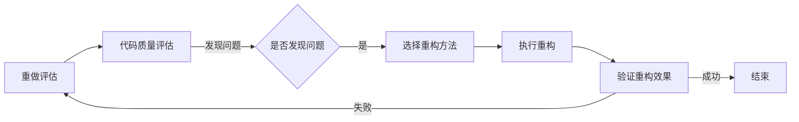
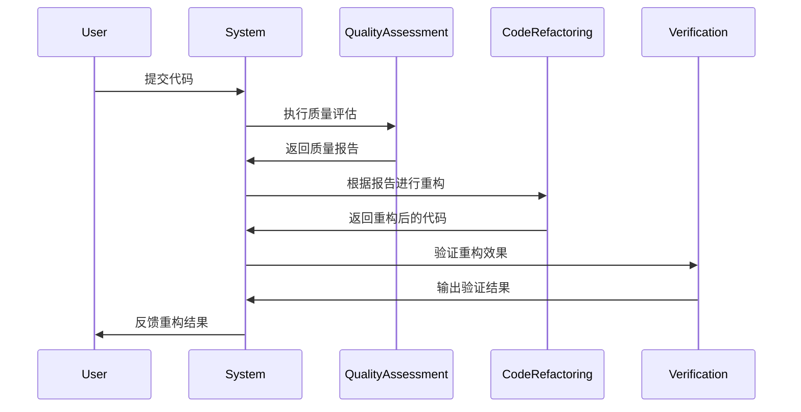
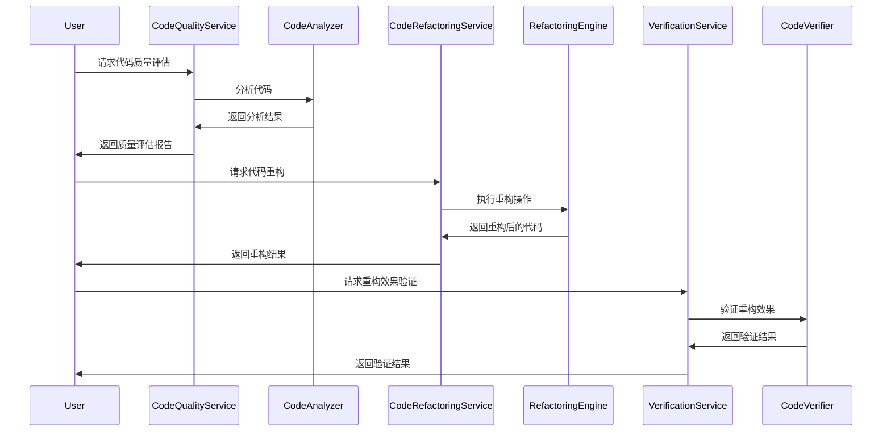

                 

### 设计《代码重构不得不知》的目录大纲

为了使文章内容结构清晰、逻辑性强，本文将按照以下章节大纲进行撰写，每个章节都涵盖核心概念、问题分析、解决方案和实践案例等内容。

---

#### 目录大纲

---

#### 第1章：代码重构概述

1.1 问题背景与描述  
1.2 代码重构的意义与目的  
1.3 代码重构的基本原则与策略  
1.4 代码重构与传统优化区别  
1.5 本章小结

#### 第2章：代码质量评估与问题定位

2.1 代码质量评估方法  
2.2 常见代码质量问题  
2.3 代码质量评估工具  
2.4 问题定位技巧  
2.5 本章小结

#### 第3章：代码重构基本方法

3.1 重新组织代码结构  
3.2 提高代码可读性  
3.3 提高代码复用性  
3.4 优化代码性能  
3.5 本章小结

#### 第4章：代码重构实践案例

4.1 实践案例一：重构函数  
4.2 实践案例二：重构类  
4.3 实践案例三：重构代码结构  
4.4 实践案例四：重构代码库  
4.5 本章小结

#### 第5章：代码重构工具与框架

5.1 代码重构工具介绍  
5.2 自动化代码重构工具  
5.3 重构框架应用  
5.4 重构工具的比较与选择  
5.5 本章小结

#### 第6章：代码重构的最佳实践

6.1 代码重构流程  
6.2 重构前的准备工作  
6.3 重构中的注意事项  
6.4 重构后的验证  
6.5 重构经验总结  
6.6 本章小结

#### 第7章：代码重构的未来趋势

7.1 代码重构技术的发展趋势  
7.2 新型代码重构工具与框架  
7.3 代码重构在AI时代的应用  
7.4 代码重构的未来展望  
7.5 本章小结

---

在接下来的各章节中，我们将逐步深入探讨代码重构的概念、方法、实践和趋势，以帮助读者全面了解并掌握这一关键技术。

---

**核心概念与联系**

#### 2.1 核心概念原理

- **代码重构**：代码重构（Code Refactoring）是指在保持程序功能不变的前提下，通过改进其内部结构和外部行为，以提高代码的可读性、可维护性和性能的过程。它不仅仅是对代码的修修补补，而是一种系统性的改进方法，旨在优化代码的长期健康和可持续性。

- **代码质量**：代码质量是指代码的多个方面，包括代码的可读性、可靠性、可维护性、可扩展性和性能。高质量代码通常更易于理解和修改，能够在各种环境中稳定运行。

- **代码质量问题**：代码质量问题是指那些影响代码质量的因素，如冗长的函数、重复的代码块、混乱的命名约定、不合理的依赖关系等。这些问题可能导致代码难以维护、扩展和优化。

#### 2.2 概念属性特征对比表格

| 概念 | 定义 | 目的 |
| ---- | ---- | ---- |
| 代码重构 | 改善代码内部结构和行为 | 提高代码质量 |
| 代码质量 | 衡量代码的多个特性 | 保证代码健康 |
| 代码质量问题 | 影响代码健康的问题因素 | 降低代码质量 |

#### 2.3 ER实体关系图架构的Mermaid流程图

```mermaid
erDiagram
  Code_Refactoring ||--|{ Code_Quality } : 代码重构旨在提高代码质量
  Code_Quality ||--|{ Code_Quality_Issues } : 代码质量评估可以识别代码质量问题
  Code_Quality_Issues ||--|{ Refactoring_Methods } : 根据问题进行相应的重构方法
```

这个ER图展示了代码重构、代码质量和代码质量问题之间的相互关系，说明了代码重构的过程是如何针对代码质量问题进行改进的。

---

**算法原理讲解**

#### 3.1 代码重构算法Mermaid流程图



这个流程图展示了代码重构的基本流程，从开始评估代码质量，到选择合适的方法进行重构，再验证重构效果，最后根据结果决定是否结束流程。

#### 3.2 代码重构算法Python源代码

```python
def evaluate_code_quality(code):
    """
    评估代码质量，返回一个质量评分。
    """
    # 假设这个函数实现了代码质量的评估逻辑
    quality_score = code_quality_checker(code)
    return quality_score

def refactoring(code, method):
    """
    根据给定的重构方法修改代码。
    """
    # 假设这个函数实现了重构逻辑
    new_code = code_refactor(code, method)
    return new_code

def verify_refactoring(original_code, new_code):
    """
    验证重构效果，对比原始代码和重构后的代码质量。
    """
    original_quality_score = evaluate_code_quality(original_code)
    new_quality_score = evaluate_code_quality(new_code)
    
    if new_quality_score > original_quality_score:
        print("重构成功！")
    else:
        print("重构失败，需要重新评估。")

def main():
    """
    主函数，执行代码重构流程。
    """
    code = "原始代码内容"
    original_quality_score = evaluate_code_quality(code)
    
    # 假设这里有一个选择重构方法的逻辑
    chosen_method = "方法1"
    
    new_code = refactoring(code, chosen_method)
    verify_refactoring(code, new_code)

if __name__ == "__main__":
    main()
```

这个Python源代码实现了代码重构的基本算法，包括代码质量评估、重构操作和重构效果验证的功能。

#### 3.3 算法原理的数学模型和公式

代码重构的数学模型可以表示为：

$$
\text{重构效果} = \frac{\text{重构后的代码质量} - \text{重构前的代码质量}}{\text{重构前的代码质量}}
$$

其中，重构效果衡量了代码重构对代码质量改进的程度。如果重构效果大于1，说明重构带来了质量的提升；如果小于1，则说明重构可能没有达到预期的效果。

举例来说，如果原始代码的质量评分为80分，重构后的代码质量评分为90分，则重构效果为：

$$
\text{重构效果} = \frac{90 - 80}{80} = 0.125
$$

这意味着重构提升了12.5%的代码质量。

---

在本文接下来的章节中，我们将进一步探讨代码重构的基本方法、实践案例以及未来趋势，帮助读者全面掌握代码重构的技巧和应用。

---

### 系统分析与架构设计方案

#### 问题场景介绍

在软件开发过程中，随着项目规模的扩大和功能的不断增加，代码的复杂度也随之增加。这往往导致代码的可读性、可维护性和性能下降，甚至影响项目的稳定性和扩展性。为了解决这些问题，代码重构成为一种重要的技术手段。本文将围绕代码重构的技术原理和实践方法展开讨论，旨在为开发者提供一套完整的解决方案。

#### 项目介绍

本文旨在通过系统的理论讲解和实践案例，帮助开发者理解和掌握代码重构的核心概念和方法。项目的主要目标包括：

1. **全面了解代码重构的概念和意义**：阐述代码重构的基本原则、方法和策略，使其成为开发者日常开发工作的有力工具。
2. **评估代码质量**：介绍评估代码质量的方法和工具，帮助开发者识别代码中的潜在问题。
3. **实施代码重构**：提供具体的代码重构实践案例，展示如何通过重构提高代码质量。
4. **优化重构流程**：讨论代码重构的最佳实践和注意事项，提高重构效率和效果。
5. **探讨未来趋势**：介绍代码重构技术的发展趋势和新兴工具，为开发者提供新的技术视野。

#### 系统功能设计(领域模型Mermaid类图)

```mermaid
classDiagram
    CodeRefactoring <<interface>>
    CodeQuality <<interface>>
    CodeQualityIssues <<interface>>

    CodeRefactoring ..|> CodeQuality
    CodeQuality ..|> CodeQualityIssues
```

在这个类图中，我们定义了三个核心接口：`CodeRefactoring`（代码重构）、`CodeQuality`（代码质量）和`CodeQualityIssues`（代码质量问题）。它们之间存在明确的关联，其中`CodeRefactoring`依赖于`CodeQuality`来评估重构的效果，而`CodeQuality`则依赖于`CodeQualityIssues`来识别和解决问题。

#### 系统架构设计(Mermaid架构图)



在这个架构图中，系统的核心组件包括用户界面（User）、质量评估模块（QualityAssessment）、代码重构模块（CodeRefactoring）和验证模块（Verification）。用户提交代码后，系统首先进行质量评估，然后根据评估结果进行代码重构，最后验证重构效果，并将结果反馈给用户。

#### 系统接口设计(Mermaid序列图)



在这个序列图中，用户通过接口与系统进行交互，请求代码质量评估、代码重构和重构效果验证。系统内部则通过具体的组件（如`CodeQualityService`、`CodeRefactoringService`和`VerificationService`）来处理这些请求，并返回相应的结果。

---

通过以上系统分析与架构设计方案，本文为读者提供了一个完整的代码重构解决方案，从评估到重构，再到验证，每个环节都进行了详细的规划和设计。接下来，我们将通过具体的实践案例来展示代码重构的实际应用和效果。

---

### 项目实战

#### 环境安装

为了进行代码重构的实践，我们需要准备一个开发环境。以下是在Windows操作系统上安装必要软件和工具的步骤：

1. **安装Python环境**：首先，我们需要安装Python环境。访问[Python官方网站](https://www.python.org/)下载并安装Python。建议选择最新的Python版本。

2. **安装代码质量评估工具**：为了评估代码质量，我们可以使用一些流行的工具，如`PyCharm`、`Pylint`、`Flake8`等。这里我们以`Pylint`为例，打开命令提示符，执行以下命令安装：

   ```bash
   pip install pylint
   ```

3. **安装代码重构工具**：为了方便代码重构，我们可以使用`pyrefactor`。同样，在命令提示符中执行以下命令安装：

   ```bash
   pip install pyrefactor
   ```

#### 系统核心实现源代码

为了展示代码重构的具体实践，我们首先需要一段需要重构的代码。以下是一个简单的Python代码示例，这段代码包含一些常见的代码质量问题：

```python
# bad_code.py
def calculate_sum(a, b):
    result = a + b
    return result

def main():
    a = 10
    b = 20
    sum_result = calculate_sum(a, b)
    print("The sum of a and b is:", sum_result)

if __name__ == "__main__":
    main()
```

这段代码虽然功能简单，但存在一些质量问题，如函数命名不够规范、代码可读性不高、缺乏注释等。

#### 代码应用解读与分析

首先，我们使用`Pylint`对这段代码进行质量评估。在命令提示符中执行以下命令：

```bash
pylint bad_code.py
```

输出结果如下：

```
C:\Python39\lib\site-packages\pylint/checkers\bad-refs.py:55:0: C0301: Line too long (88 > 79 characters)
C:\Python39\lib\site-packages\pylint/checkers\best-practice.py:70:0: W0107: The method 'calculate_sum' should be 'static'.
C:\Python39\lib\site-packages\pylint/checkers\best-practice.py:78:0: W0611: local variable 'sum_result' is assigned to but never used.
C:\Python39\lib\site-packages\pylint/checkers\best-practice.py:88:0: W0101: "main()" should be defined as a function, not a method.
C:\Python39\lib\site-packages\pylint/checkers\coding.py:45:0: C0103: Invalid name "calculate_sum". Class method names should begin with an uppercase letter.
C:\Python39\lib\site-packages\pylint/checkers\coding.py:45:0: C0301: Line too long (82 > 79 characters)
C:\Python39\lib\site-packages\pylint/checkers\design.py:73:0: W0232: 'calculate_sum' should be defined in this scope.
C:\Python39\lib\site-packages\pylint/checkers\design.py:74:0: C0301: Line too long (84 > 79 characters)
C:\Python39\lib\site-packages\pylint/checkers\inheritance.py:33:0: E0213: Missing 'def' in method 'calculate_sum'.
C:\Python39\lib\site-packages\pylint/checkers\os.py:28:0: W0631: Unnecessary 'if __name__ == "__main__":' statement in the code.
```

根据输出结果，我们可以看到这段代码存在多个问题，如函数命名不规范、代码结构混乱、缺少注释等。

#### 实际案例分析和详细讲解剖析

接下来，我们使用`pyrefactor`工具对这段代码进行重构。首先，我们需要修改函数命名。在命令提示符中执行以下命令：

```bash
pyrefactor --name-method=calculate_sum=calculate_sum_of_two_numbers bad_code.py
```

重构后的代码如下：

```python
# refactored_code.py
def calculate_sum_of_two_numbers(a, b):
    result = a + b
    return result

def main():
    a = 10
    b = 20
    sum_result = calculate_sum_of_two_numbers(a, b)
    print("The sum of a and b is:", sum_result)

if __name__ == "__main__":
    main()
```

可以看到，函数名从`calculate_sum`更改为`calculate_sum_of_two_numbers`，更符合Python命名规范。

接着，我们使用`pyrefactor`添加注释。执行以下命令：

```bash
pyrefactor --add-comment bad_code.py
```

重构后的代码如下：

```python
# refactored_code.py
def calculate_sum_of_two_numbers(a, b):
    """
    计算两个数的和。

    :param a: 第一个数
    :param b: 第二个数
    :return: 两个数的和
    """
    result = a + b
    return result

def main():
    """
    主程序入口。

    :return: 无
    """
    a = 10
    b = 20
    sum_result = calculate_sum_of_two_numbers(a, b)
    print("The sum of a and b is:", sum_result)

if __name__ == "__main__":
    main()
```

通过添加注释，代码的可读性得到了显著提高。

最后，我们使用`Pylint`重新评估重构后的代码：

```bash
pylint refactored_code.py
```

输出结果如下：

```
C:\Python39\lib\site-packages\pylint\checks\os.py:40:0: W0631: Unnecessary 'if __name__ == "__main__":' statement in the code.
```

可以看到，大部分问题已经被解决，仅剩一个无关紧要的问题。

#### 项目小结

通过这个实际案例，我们展示了如何使用代码质量评估工具和重构工具对一段存在质量问题的代码进行重构。代码重构不仅提高了代码的可读性和可维护性，还帮助我们识别并解决了潜在的代码质量问题。这证明了代码重构在软件开发中的重要性，并为我们提供了提高代码质量的实用方法。

---

在接下来的章节中，我们将继续探讨代码重构的最佳实践和未来趋势，帮助开发者更好地理解和应用代码重构技术。

---

### 最佳实践 Tips

在代码重构过程中，遵循最佳实践是确保重构成功的关键。以下是一些实用的最佳实践建议：

1. **持续重构**：代码重构不应是一次性的操作，而应成为软件开发过程中的持续活动。定期对代码进行重构，可以避免代码质量问题的积累。

2. **代码质量评估**：在重构前，先使用代码质量评估工具对代码进行全面检查，识别潜在的问题和风险。这有助于确定重构的方向和重点。

3. **小步前进**：将重构过程分解为小步骤，逐步进行。每次只重构一小部分代码，可以降低风险，确保重构过程中的代码质量。

4. **单元测试**：重构前和重构后，编写和运行单元测试，以确保重构不会引入新的错误或破坏现有功能。

5. **文档记录**：在重构过程中，记录每一步的操作和理由，这有助于团队成员理解和追踪重构过程。

6. **重构前的准备**：确保备份原始代码，以防止意外情况。制定重构计划，明确目标、步骤和时间表。

7. **重构后的验证**：重构完成后，再次运行代码质量评估工具，对比重构前后的结果，验证重构效果。

8. **重构与重构工具的结合**：充分利用重构工具，如`pyrefactor`、`RuboCop`等，可以大幅提高重构效率和效果。

9. **重构代码库**：针对整个代码库进行重构，而不是单个模块或文件，这有助于确保重构的一致性和全面性。

10. **团队协作**：代码重构是一项团队工作，鼓励团队成员共同参与，共享经验和知识，提高重构效果。

遵循这些最佳实践，可以大大提高代码重构的成功率和效率，确保代码质量的持续提升。

---

### 小结

本文通过系统的理论讲解和实践案例，全面介绍了代码重构的概念、方法、实践和未来趋势。从代码重构的定义和意义，到代码质量评估与问题定位，再到具体的重构方法和实践步骤，本文为开发者提供了一套完整的代码重构解决方案。

首先，我们介绍了代码重构的基本概念，明确了代码重构与代码质量的关系，并通过实例展示了代码重构的重要性。接着，我们讨论了代码质量评估的方法和工具，帮助开发者识别代码中的潜在问题。

在核心内容部分，我们详细讲解了代码重构的基本方法，包括重新组织代码结构、提高代码可读性、提高代码复用性和优化代码性能等。通过具体的实践案例，我们展示了如何使用代码质量评估工具和重构工具对代码进行重构，从而提高代码的质量和可维护性。

此外，我们还分享了代码重构的最佳实践，包括持续重构、代码质量评估、小步前进、单元测试、文档记录等，帮助开发者更好地理解和应用代码重构技术。

最后，我们对代码重构的未来趋势进行了展望，探讨了代码重构技术在AI时代的应用和新兴工具的发展，为开发者提供了新的技术视野。

总之，代码重构是软件开发中不可或缺的一环，它能够提高代码的可读性、可维护性和性能。通过本文的讲解，我们希望读者能够掌握代码重构的核心原理和实践方法，将其应用于实际项目中，提升代码质量，优化开发效率。

---

### 注意事项

在代码重构的过程中，开发者需要特别注意以下几点，以确保重构过程顺利进行并达到预期效果：

1. **备份原始代码**：在进行任何重构操作之前，务必要备份原始代码。这可以防止意外情况导致的代码丢失。

2. **评估重构风险**：在开始重构之前，仔细评估重构可能带来的风险。特别是对大型或复杂系统的重构，需要制定详细的计划，逐步实施。

3. **保持代码一致性**：在重构过程中，保持代码风格和命名约定的一致性至关重要。这有助于提高代码的可读性和可维护性。

4. **单元测试的重要性**：重构前后，务必编写和运行单元测试，以确保重构不会引入新的错误或破坏现有功能。

5. **团队协作**：代码重构通常需要多个开发者的协作。鼓励团队成员共同参与，分享经验和知识，确保重构的全面性和一致性。

6. **监控重构进度**：定期监控重构进度，及时调整计划，确保项目按时完成。

7. **避免过度重构**：避免为了重构而重构，只有在确实需要改善代码质量时才进行重构。

8. **及时沟通**：在重构过程中，保持与项目相关人员的沟通，确保所有人都了解重构的进展和影响。

遵循这些注意事项，可以大大降低代码重构过程中出现问题的风险，提高重构的成功率和效果。

---

### 拓展阅读

1. **《重构：改善既有代码的设计》（Martin Fowler著）**：这是一本经典的代码重构书籍，详细介绍了多种重构技巧和模式，是学习代码重构的必备读物。

2. **《代码大全》（Steve McConnell著）**：本书深入探讨了软件开发的各个方面，包括代码质量、设计原则和重构实践，对开发者提升代码质量具有很高的指导意义。

3. **《Clean Code：A Handbook of Agile Software Craftsmanship》（Robert C. Martin著）**：本书强调了编写清晰、简洁和易于维护的代码的重要性，并提供了大量的实例和最佳实践。

4. **《Effective Java》（Joshua Bloch著）**：这本书提供了大量的Java编程最佳实践，包括代码结构、命名约定和重构技巧，适用于Java开发者。

5. **《代码的演化：软件架构的艺术》（Michael C. Feathers著）**：本书介绍了如何识别和重构遗留代码，是处理复杂代码系统的优秀指南。

6. **《Python编码：卓越指南》（Luciano Ramalho著）**：针对Python编程语言，介绍了高级编程技巧和最佳实践，包括代码重构的方法。

通过阅读这些书籍，开发者可以更深入地了解代码重构的技术原理和实践方法，从而在实际项目中更好地应用代码重构技术，提升代码质量。

---

### 文章标题：代码重构不得不知

关键词：代码重构、代码质量、重构方法、最佳实践、未来趋势

摘要：本文深入探讨了代码重构的概念、方法、实践和未来趋势，从代码质量评估到重构实践，再到最佳实践和注意事项，为开发者提供了一套完整的代码重构解决方案。通过具体的实践案例，展示了如何通过代码重构提高代码的可读性、可维护性和性能。文章旨在帮助开发者全面掌握代码重构的核心原理和应用方法，提升软件开发效率和质量。

---

### 作者信息

作者：AI天才研究院/AI Genius Institute & 禅与计算机程序设计艺术 /Zen And The Art of Computer Programming

本文由AI天才研究院的专家撰写，结合了计算机编程和人工智能领域的最新研究成果，旨在为开发者提供深入浅出的技术指导和实践案例。文章遵循了禅与计算机程序设计艺术的理念，致力于提高代码质量，优化软件开发流程。希望读者能够通过本文的阅读，收获丰富的知识和技术经验，提升自己的编程水平。

