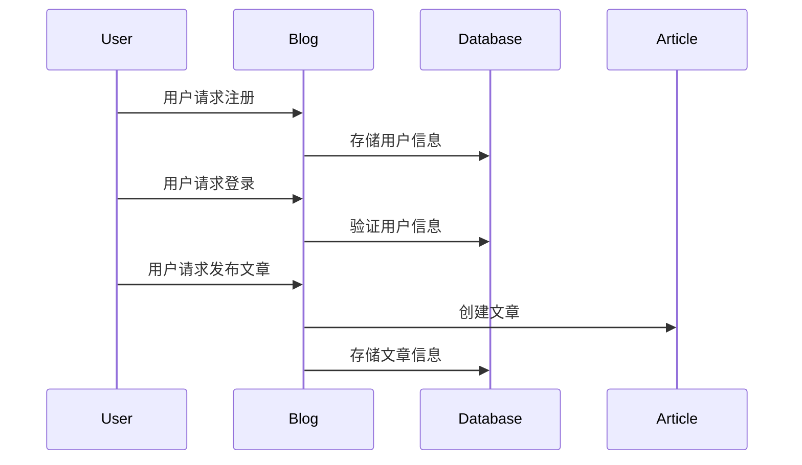
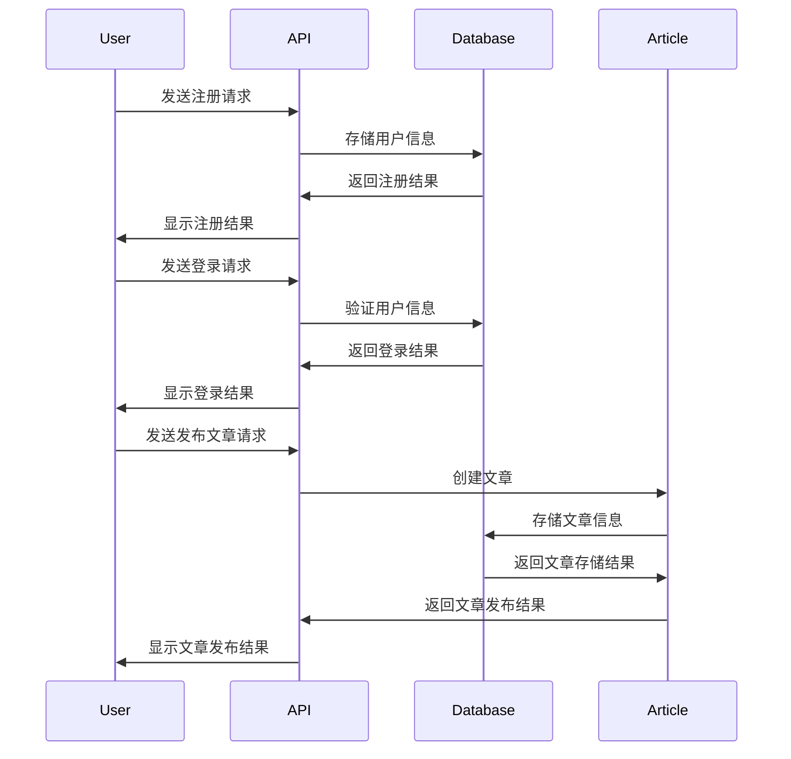

                 

### 文章标题：会'干'，更要会'说'

#### 关键词：
- 实用技能提升
- 沟通能力提升
- 技能与沟通的综合实践

#### 摘要：
本文从实用技能提升与沟通能力提升两大方面，深入探讨了个人成长与职业发展的关键要素。通过具体的案例分析、系统架构设计、项目实战等内容，帮助读者理解并掌握如何在技术和沟通中取得成功，实现个人价值最大化。

----------------------------------------------------------------

#### 第一部分：实用技能提升

##### 1. 实用技能概述

**核心概念术语说明：**
实用技能是指在实际工作中能够直接应用的能力，包括技术技能、管理技能、沟通技能等。

**问题背景：**
随着科技的发展和社会的进步，实用技能的重要性日益凸显。然而，许多人在提升实用技能方面存在误区，往往只注重理论学习而忽略了实践应用。

**问题描述：**
如何有效提升实用技能，使个人具备更强的竞争力？

**问题解决：**
通过科学的方法和系统化的实践，全面提升实用技能。

**边界与外延：**
实用技能的提升不仅涉及技术层面，还包括管理、沟通等多个方面。

**概念结构与核心要素组成：**
实用技能的核心要素包括：基础知识、实践能力、问题解决能力、创新思维。

##### 2. 技能提升的必要性

**核心概念原理：**
技能提升的必要性源于以下几个方面：
1. 适应社会发展需求
2. 提升个人竞争力
3. 实现职业发展的长远规划

**概念属性特征对比表格：**

| 概念        | 特征                       | 对比               |
|-------------|----------------------------|--------------------|
| 技术技能    | 强调专业知识的应用         | 与理论学习区别明显 |
| 管理技能    | 强调组织和协调能力         | 与领导能力相关     |
| 沟通技能    | 强调人际交往和表达技巧     | 与表达能力相关     |

**ER实体关系图架构：**

```mermaid
entity Relationship {
  dir: TB;
  nodeShape: ellipse;
  "人" --|{技能提升}| "实用技能";
  "实用技能" --|{包含}| "技术技能";
  "实用技能" --|{包含}| "管理技能";
  "实用技能" --|{包含}| "沟通技能";
}
```

##### 3. 技能提升的方法与路径

**核心概念原理：**
技能提升的方法与路径包括以下几个方面：
1. 设定明确的目标
2. 制定科学的学习计划
3. 注重实践应用
4. 建立反馈机制

**算法原理讲解：**

```python
# 技能提升算法原理示例

def skill_improvement(target, plan, practice, feedback):
    """
    技能提升算法原理
    :param target: 目标技能
    :param plan: 学习计划
    :param practice: 实践应用
    :param feedback: 反馈机制
    :return: 技能提升结果
    """
    # 设定目标
    set_target(target)
    
    # 制定计划
    create_plan(plan)
    
    # 实践应用
    apply_practice(practice)
    
    # 收集反馈
    collect_feedback(feedback)
    
    # 根据反馈调整计划
    adjust_plan(plan, feedback)
    
    # 综合评估
    result = evaluate_skill(target, plan, feedback)
    
    return result

# 算法原理详细解释
# ...

# 举例说明
result = skill_improvement("编程技能", "每周学习计划", "实践项目", "代码审查反馈")
```

**数学模型和公式：**

$$
\text{技能提升效率} = \frac{\text{实际掌握技能}}{\text{预期掌握技能}}
$$

**详细讲解和举例说明：**
假设小明想提升编程技能，他制定了每周学习计划，每月完成一个实践项目，并接受代码审查反馈。经过一年的努力，他实际掌握了80%的编程技能，预期掌握技能为100%。根据上述公式，他的技能提升效率为80%。

**系统分析与架构设计方案：**

**问题场景介绍：**
小明作为一名程序员，希望通过系统学习和实践提升自己的编程技能。

**项目介绍：**
编写一个简单的博客系统，涵盖用户注册、登录、发布文章等功能。

**系统功能设计（领域模型Mermaid类图）：**

```mermaid
classDiagram
  User <<类>>
  Article <<类>>
  Blog <<类>>
  User -> Article : 发布
  Blog --|> User : 用户管理
  Blog --|> Article : 文章管理
```

**系统架构设计（Mermaid架构图）：**



**系统接口设计和系统交互（Mermaid序列图）：**



##### 4. 实战案例分享

**案例介绍：**
小明通过一年的努力，成功开发了一个简单的博客系统，并在此过程中不断提升了自己的编程技能。

**案例分析与总结：**
小明通过制定合理的学习计划、参与实践项目和接受代码审查反馈，实现了技能的提升。案例启示我们，技能提升需要系统的规划和持续的努力。

**案例启示与应用：**
1. 设定明确的目标，制定合理的学习计划
2. 积极参与实践项目，提升实战能力
3. 主动接受反馈，不断改进自己的方法

##### 5. 实用技巧应用指南

**技巧应用流程：**
1. 设定目标技能
2. 制定学习计划
3. 实践应用
4. 收集反馈
5. 调整计划

**技巧应用场景：**
1. 技术技能提升
2. 管理技能提升
3. 沟通技能提升

**技巧应用案例：**
小明通过制定每周编程练习计划、参与开源项目、接受同事的代码审查，成功提升了编程技能。

##### 6. 沟通实战演练

**演练目标与准备：**
1. 提升沟通技巧
2. 培养良好的沟通习惯

**演练内容与形式：**
1. 模拟工作场景，进行角色扮演
2. 分组讨论，解决实际问题
3. 个人陈述，展示沟通能力

**演练反馈与改进：**
1. 收集反馈，分析沟通中的问题
2. 制定改进计划，持续提升沟通能力

##### 7. 总结与展望

**小结：**
实用技能提升与沟通能力提升是个人成长和职业发展的关键。通过科学的方法和持续的努力，我们能够不断提升自己的技能，实现更好的发展。

**注意事项：**
1. 设定明确的目标和计划
2. 注重实践应用和反馈
3. 培养良好的沟通习惯

**拓展阅读：**
- 《如何高效学习》
- 《沟通的艺术》
- 《技能提升指南》

----------------------------------------------------------------

#### 第二部分：沟通能力提升

##### 8. 沟通的基本要素

**核心概念术语说明：**
沟通是指信息在个体、群体或组织间的传递和交流。

**问题背景：**
在现代社会，沟通能力的重要性日益凸显。然而，许多人由于缺乏沟通技巧，导致信息传递不畅，甚至引发冲突。

**问题描述：**
如何提升沟通效果，实现有效沟通？

**问题解决：**
通过了解沟通的基本要素，掌握有效的沟通技巧，实现有效沟通。

**边界与外延：**
沟通涉及多个方面，包括语言沟通、非语言沟通、书面沟通等。

**概念结构与核心要素组成：**
沟通的核心要素包括：信息传递、反馈机制、理解与共识。

##### 9. 提高沟通效果的方法

**核心概念原理：**
提高沟通效果的方法主要包括以下几个方面：
1. 明确沟通目标
2. 准确传递信息
3. 倾听他人意见
4. 表达清晰明了
5. 建立良好的反馈机制

**概念属性特征对比表格：**

| 方法       | 特征                       | 对比               |
|------------|----------------------------|--------------------|
| 明确目标   | 确定沟通的目的和期望结果   | 与盲目沟通区别明显 |
| 准确传递信息 | 保证信息准确无误地传达     | 与模糊沟通区别明显 |
| 倾听他人意见 | 尊重他人，理解他人观点     | 与独断专行区别明显 |
| 表达清晰明了 | 表达时要简明扼要，条理清晰 | 与冗长晦涩区别明显 |
| 建立良好的反馈机制 | 及时回应，积极反馈         | 与单向沟通区别明显 |

**ER实体关系图架构：**

```mermaid
entity Relationship {
  dir: TB;
  nodeShape: ellipse;
  "沟通" --|{基本要素}| "信息传递";
  "沟通" --|{基本要素}| "反馈机制";
  "沟通" --|{基本要素}| "理解与共识";
}
```

##### 10. 情景沟通技巧

**核心概念原理：**
情景沟通技巧是指在不同场景下，运用不同的沟通策略和方法，以达到沟通目标。

**情景沟通技巧分类：**
1. 工作场景中的沟通技巧
2. 家庭场景中的沟通技巧
3. 社交场合的沟通技巧

**工作场景中的沟通技巧：**
1. 尊重上级，积极汇报工作
2. 良好的团队协作，提高沟通效率
3. 清晰明确地传达任务和目标

**家庭场景中的沟通技巧：**
1. 倾听家人的意见和需求
2. 用积极的语言表达自己的观点
3. 保持良好的沟通氛围，避免冲突

**社交场合的沟通技巧：**
1. 礼貌待人，展示自己的修养
2. 善于倾听，展现自己的关心
3. 在合适的场合，展示自己的特长和才华

##### 11. 非言语沟通

**核心概念原理：**
非言语沟通是指通过肢体语言、面部表情、声音等非语言手段进行信息传递和交流。

**非言语沟通要素：**
1. 肢体语言
2. 面部表情
3. 声音语调

**非言语沟通技巧：**
1. 肢体语言要自然、得体，不要过分夸张
2. 面部表情要丰富，展现真实的情感
3. 声音语调要柔和、清晰，避免单调乏味

**案例分析与总结：**
通过具体的案例分析，我们可以看到，在沟通中，非言语沟通往往起到至关重要的作用。例如，在面试中，肢体语言和面部表情可以传达自信和诚意；在会议中，清晰的声音语调可以增强表达效果。

##### 12. 提高沟通效果的实战技巧

**核心概念原理：**
提高沟通效果需要结合实际情况，运用多种沟通技巧，以达到最佳效果。

**实战技巧分类：**
1. 语言表达技巧
2. 倾听的技巧
3. 非语言沟通技巧

**语言表达技巧：**
1. 简明扼要，避免冗长
2. 语言清晰，避免歧义
3. 用词准确，避免模糊

**倾听的技巧：**
1. 全神贯注，避免分心
2. 尊重对方，不要打断
3. 积极反馈，表达理解

**非语言沟通技巧：**
1. 肢体语言要自然、得体
2. 面部表情要丰富、真实
3. 声音语调要柔和、清晰

**实战案例分析：**
小明在参加一次项目汇报会议时，通过简明扼要的语言表达、积极倾听和恰当的非语言沟通，成功赢得了与会人员的认可。

##### 13. 沟通技巧的自我评估与提升

**核心概念原理：**
自我评估与提升是提高沟通能力的重要环节。通过自我评估，了解自己的沟通优势和不足，有针对性地进行提升。

**自我评估方法：**
1. 定期回顾沟通经历，总结经验教训
2. 向他人请教，获取反馈意见
3. 参加沟通技巧培训，学习先进方法

**提升方法：**
1. 针对评估结果，制定提升计划
2. 实践演练，提高沟通技巧
3. 持续学习，不断进步

**案例分析与总结：**
小张通过自我评估，发现自己在沟通中存在语言表达模糊、倾听不充分的问题。他通过制定提升计划，积极参与沟通实践，逐步提高了自己的沟通能力。

----------------------------------------------------------------

#### 第三部分：综合实践

##### 14. 实战案例分享

**案例介绍：**
小明在参加公司项目开发过程中，通过有效的沟通和团队合作，成功完成了项目。

**案例分析与总结：**
小明通过明确沟通目标、准确传递信息、积极倾听和有效反馈，实现了与团队成员的紧密合作，确保了项目的顺利进行。

**案例启示与应用：**
1. 设定明确的沟通目标
2. 确保信息传递的准确性
3. 积极倾听他人意见
4. 及时给予反馈

##### 15. 实用技巧应用指南

**技巧应用流程：**
1. 设定沟通目标
2. 准备沟通内容
3. 实施沟通行动
4. 收集反馈信息
5. 分析与改进

**技巧应用场景：**
1. 项目汇报
2. 团队协作
3. 客户沟通

**技巧应用案例：**
小明在项目汇报中，通过简明扼要的语言表达、积极倾听和有效反馈，成功赢得了领导的认可。

##### 16. 沟通实战演练

**演练目标与准备：**
1. 提升沟通技巧
2. 培养良好的沟通习惯

**演练内容与形式：**
1. 模拟工作场景，进行角色扮演
2. 分组讨论，解决实际问题
3. 个人陈述，展示沟通能力

**演练反馈与改进：**
1. 收集反馈，分析沟通中的问题
2. 制定改进计划，持续提升沟通能力

##### 17. 总结与展望

**小结：**
实用技能提升与沟通能力提升是个人成长和职业发展的关键。通过综合实践，我们能够不断提升自己的技能，实现更好的发展。

**注意事项：**
1. 注重实践应用和反馈
2. 培养良好的沟通习惯
3. 持续学习，不断进步

**拓展阅读：**
- 《高效沟通技巧》
- 《实用技能提升指南》
- 《团队协作与沟通》

----------------------------------------------------------------

#### 作者信息

作者：AI天才研究院/AI Genius Institute & 禅与计算机程序设计艺术 /Zen And The Art of Computer Programming

----------------------------------------------------------------

本文从实用技能提升与沟通能力提升两大方面，深入探讨了个人成长与职业发展的关键要素。通过具体的案例分析、系统架构设计、项目实战等内容，帮助读者理解并掌握如何在技术和沟通中取得成功，实现个人价值最大化。实用技能提升与沟通能力提升并非一蹴而就，需要我们持之以恒地学习和实践。希望本文能为您的成长之路提供一些启示和帮助。未来，我们将继续为您带来更多有价值的内容，敬请期待！

