                 

### 第1章 LPWAN技术概述

#### 1.1 LPWAN的定义与背景

低功耗广域网（Low-Power Wide Area Network，简称LPWAN）是一种专门设计用于连接大量低功耗设备的无线网络技术。与传统的广域网（WAN）相比，LPWAN在覆盖范围、功耗和通信成本等方面具有显著优势，因此它在物联网（IoT）领域得到了广泛应用。

LPWAN技术的起源可以追溯到物联网发展的早期阶段，当时对大量低功耗设备的连接需求日益增长，而传统的移动通信网络（如4G、5G）在功耗和覆盖范围上难以满足这些需求。为了解决这一问题，一系列低功耗、广覆盖的无线通信技术被研发出来，形成了LPWAN技术体系。

LPWAN技术的主要特点包括：

1. **低功耗**：LPWAN技术通过优化通信协议和数据传输方式，使得设备在传输相同数据量的情况下，功耗大大降低，从而延长了设备的电池寿命。
2. **广覆盖**：LPWAN技术能够在较大的地理范围内提供稳定的连接，满足长距离、低速率数据传输的需求。
3. **低成本**：LPWAN设备相对简单，且传输距离较远，因此部署和维护成本较低。
4. **高密度**：LPWAN支持大量设备同时连接，适用于需要大规模部署的物联网应用场景。

随着物联网技术的不断发展，LPWAN的应用领域也在不断扩展。目前，LPWAN技术主要应用于以下领域：

- **智能农业**：通过LPWAN技术，可以实现农田土壤、气象等参数的实时监测，提高农业生产效率。
- **智能城市**：LPWAN技术可以用于智能交通管理、环境监测、公共安全等方面，为智慧城市建设提供支持。
- **智能家居**：LPWAN技术可以连接各种智能家居设备，实现远程控制和自动化管理。
- **工业物联网**：LPWAN技术可以用于工业自动化、设备监控、远程维护等场景，提高生产效率和设备利用率。

#### 1.2 LPWAN的应用领域

LPWAN技术凭借其低功耗、广覆盖、低成本等优势，在众多领域得到了广泛应用。以下是一些典型的LPWAN应用场景：

1. **智能农业**

   智能农业是LPWAN技术的一个重要应用领域。通过在农田中部署传感器和LPWAN通信设备，可以实时监测土壤湿度、温度、光照等环境参数，为农民提供科学的种植建议，提高农业生产效率。以下是一个简单的智能农业系统架构示例：

   ```mermaid
   graph TD
   A[传感器] --> B[LPWAN通信模块]
   B --> C[数据汇聚中心]
   C --> D[农业管理系统]
   ```

   在这个架构中，传感器负责收集农田数据，LPWAN通信模块将这些数据传输到数据汇聚中心，最后由农业管理系统对数据进行分析和处理，为农民提供决策支持。

2. **智能城市**

   智慧城市建设离不开LPWAN技术的支持。通过LPWAN网络，可以实现智能交通管理、环境监测、公共安全等领域的应用。例如，在智能交通管理中，可以通过部署LPWAN传感器和摄像头，实时监测道路状况、车流量等信息，从而优化交通信号控制，减少拥堵。以下是一个简单的智能交通系统架构示例：

   ```mermaid
   graph TD
   A[传感器/摄像头] --> B[LPWAN通信模块]
   B --> C[交通管理平台]
   C --> D[信号控制系统]
   ```

3. **智能家居**

   LPWAN技术可以用于连接各种智能家居设备，如智能灯泡、智能插座、智能门锁等，实现远程控制和自动化管理。以下是一个简单的智能家居系统架构示例：

   ```mermaid
   graph TD
   A[智能设备] --> B[LPWAN通信模块]
   B --> C[智能家居控制中心]
   C --> D[手机应用]
   ```

   在这个架构中，用户可以通过手机应用远程控制智能家居设备，实现智能化生活。

4. **工业物联网**

   LPWAN技术在工业物联网领域也有着广泛的应用。通过部署LPWAN设备，可以实现设备监控、远程维护、故障预测等功能，提高生产效率和设备利用率。以下是一个简单的工业物联网系统架构示例：

   ```mermaid
   graph TD
   A[设备] --> B[LPWAN通信模块]
   B --> C[数据汇聚中心]
   C --> D[工业物联网平台]
   D --> E[设备管理系统]
   ```

   在这个架构中，设备数据通过LPWAN网络传输到数据汇聚中心，然后由工业物联网平台进行分析和处理，实现对设备的监控和管理。

#### 1.3 LPWAN的核心技术对比

目前市场上存在多种LPWAN技术，每种技术都有其独特的优势和适用场景。以下是对几种常见LPWAN技术的对比：

| 技术名称 | 技术特点 | 适用场景 |  
| :---: | :---: | :---: |  
| NB-IoT | 低功耗、广覆盖、高密度 | 城市物联网、远程监控、智能农业等 |  
| LoRa | 低功耗、长距离、低速率 | 物流、智能城市、智能家居等 |  
| Zigbee | 低功耗、短距离、高速率 | 智能家居、工业自动化、医疗设备等 |  
| Sigfox | 低功耗、广覆盖、低速率 | 物流、智能城市、智能农业等 |

**NB-IoT**：

NB-IoT（NarrowBand IoT）是3GPP推出的一种窄带物联网技术，主要应用于城市物联网和远程监控等领域。NB-IoT具有低功耗、广覆盖和高密度的特点，能够在较大的地理范围内提供稳定的连接，满足低速率数据传输的需求。以下是一个NB-IoT系统的mermaid流程图示例：

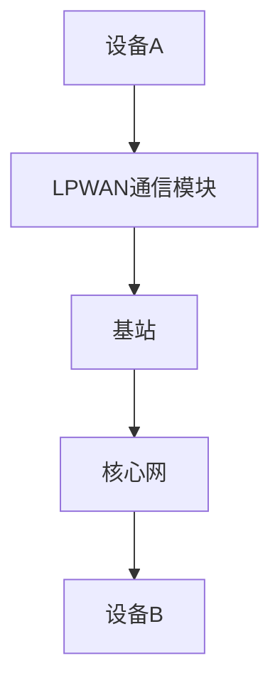

**LoRa**：

LoRa（Long Range）是一种低功耗、长距离的无线通信技术，主要应用于物流、智能城市和智能家居等领域。LoRa技术能够在远距离内保持低速率数据传输，适用于大规模部署的场景。以下是一个LoRa系统的mermaid流程图示例：

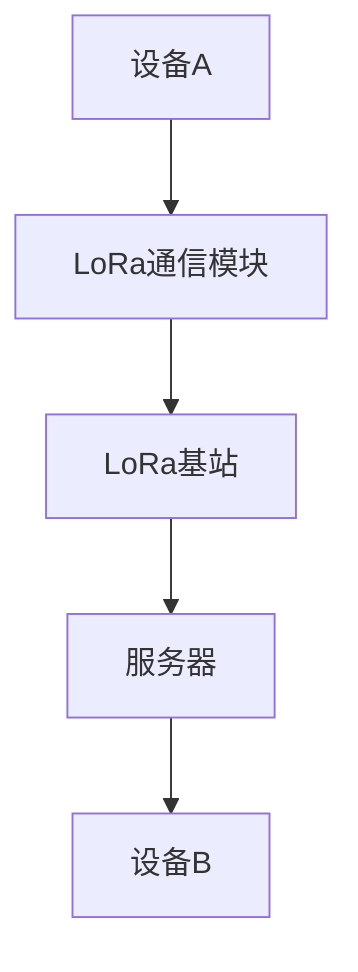

**Zigbee**：

Zigbee是一种低功耗、短距离的无线通信技术，主要应用于智能家居、工业自动化和医疗设备等领域。Zigbee技术具有较高的数据传输速率，适用于需要高速通信的场景。以下是一个Zigbee系统的mermaid流程图示例：

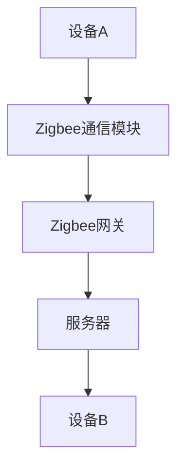

通过对比可以看出，不同LPWAN技术在功耗、覆盖范围、数据传输速率等方面存在差异，适用于不同的应用场景。在实际选型过程中，需要根据具体需求选择合适的技术。

在下一章中，我们将进一步详细介绍LPWAN技术中的核心概念，如NBIoT、LoRa、Zigbee等，并对比它们的特性。请继续关注！### 第2章 LPWAN核心技术详解

#### 2.1 NBIoT技术解析

NBIoT（NarrowBand IoT）是3GPP推出的窄带物联网技术，是4G LTE技术的演进版本，旨在提供低功耗、广覆盖的物联网通信解决方案。NBIoT通过在LTE网络中划分出窄带频谱资源，实现物联网设备的低速率通信。以下是对NBIoT技术的详细解析：

**技术特点**：

1. **低功耗**：NBIoT采用窄带通信技术，频谱利用率高，能够在低功耗下实现长距离通信，适合低功耗物联网设备。
2. **广覆盖**：NBIoT通过采用大规模MIMO、频率复用等技术，增强了信号覆盖范围，可在地下、隧道、农村等偏远地区实现良好的通信效果。
3. **高密度**：NBIoT支持高密度的设备接入，能够满足大规模物联网设备同时连接的需求。
4. **低延迟**：NBIoT优化了传输协议和调度算法，降低了通信延迟，适合实时性要求较高的物联网应用。

**应用场景**：

NBIoT技术主要应用于城市物联网、远程监控、智能农业等领域。例如，在城市物联网中，可以用于智能交通管理、智能照明、智能井盖监测等；在智能农业中，可以用于农田环境监测、作物生长监控等。

**核心组件**：

NBIoT系统主要包括以下核心组件：

1. **物联网设备**：包括传感器、执行器等，负责采集和传输数据。
2. **基站**：包括eNodeB和核心网，负责数据传输和路由。
3. **核心网**：负责数据存储、处理和传输，包括MME、SGW、PGW等网元。

**协议栈**：

NBIoT协议栈主要包括以下层次：

1. **物理层**：实现无线信号的调制、解调、同步等功能。
2. **链路层**：包括MAC层和RLC层，负责数据传输的调度、重传等功能。
3. **网络层**：包括IP层和TCP层，负责数据传输的路由和可靠性保障。
4. **应用层**：包括HTTP、CoAP等应用层协议，用于数据传输和控制。

**NBIoT与LoRa的对比**：

| 特性         | NBIoT               | LoRa                 |
| :----------- | :------------------ | :------------------ |
| 覆盖范围     | 广覆盖              | 长距离、窄覆盖       |
| 数据传输速率 | 低速率              | 低速率               |
| 功耗         | 低功耗              | 超低功耗             |
| 频谱资源     | 依赖LTE频谱资源     | 自定义频谱资源       |
| 接入方式     | 通过LTE基站接入     | 通过LoRa基站接入     |
| 标准化程度   | 3GPP标准化          | 开放标准             |

从上表可以看出，NBIoT和LoRa在覆盖范围、数据传输速率、功耗等方面存在一定差异。在实际应用中，需要根据具体需求选择合适的技术。

**NBIoT系统的mermaid流程图**：

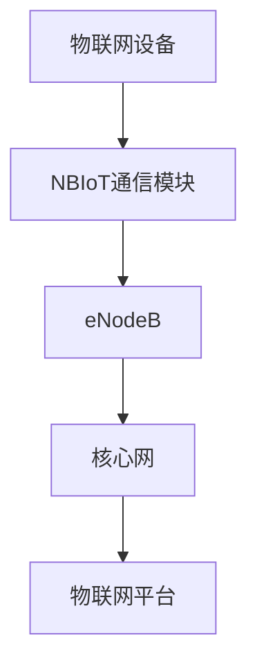

通过以上解析，我们可以了解到NBIoT技术的核心特点、应用场景、核心组件和协议栈。在下一节中，我们将继续介绍LoRa技术。请继续关注！### 2.2 LoRa技术解析

LoRa（Long Range）是一种低功耗、长距离的无线通信技术，由Semtech公司于2013年推出。LoRa采用了扩频通信技术，能够在远距离内保持低速率数据传输，适用于大规模物联网部署。以下是对LoRa技术的详细解析：

**技术特点**：

1. **低功耗**：LoRa技术通过扩频通信，将信号的带宽扩展到1MHz以上，提高了信号的能量效率，从而实现了超低功耗的通信。这使得LoRa设备能够长时间运行，无需频繁更换电池。
2. **长距离**：LoRa通信信号覆盖范围可达数十公里，即使在复杂环境中也能保持稳定的连接。这是由于LoRa采用了多路径传输特性，信号可以在建筑物、树木等障碍物之间反射、折射，从而延长通信距离。
3. **低速率**：LoRa主要面向低速率数据传输，适合传输传感器数据、环境监测数据等。LoRa的传输速率通常在0.3kbps到50kbps之间，可以满足大多数物联网应用的需求。
4. **多频段**：LoRa支持多个频段，包括亚欧地区的433MHz、868MHz和902MHz等，用户可以根据实际需求选择合适的频段。这为LoRa技术在不同国家和地区的推广提供了便利。
5. **开放标准**：LoRa是一种开放标准，无需支付许可费用。这使得LoRa设备能够快速普及，降低了物联网部署成本。

**应用场景**：

LoRa技术广泛应用于智能家居、智能城市、物流跟踪、智能农业等领域。以下是一些具体的应用场景：

1. **智能家居**：LoRa可以连接各种智能家居设备，如智能灯泡、智能插座、智能门锁等，实现远程控制和自动化管理。
2. **智能城市**：LoRa可以用于智能交通管理、环境监测、公共安全等场景，提供低功耗、长距离的通信解决方案。
3. **物流跟踪**：LoRa可以用于货物跟踪、运输监控等，实现远程实时监控。
4. **智能农业**：LoRa可以用于农田环境监测、作物生长监控等，提高农业生产效率。

**核心组件**：

LoRa系统主要包括以下核心组件：

1. **LoRa设备**：包括传感器、执行器等，负责数据采集和传输。
2. **LoRa基站**：负责接收和处理LoRa设备发送的数据。
3. **网关**：负责将LoRa数据转发到互联网或其他网络，以便进行进一步处理和分析。
4. **服务器**：负责数据存储、处理和可视化。

**协议栈**：

LoRa协议栈主要包括以下层次：

1. **物理层**：实现信号的调制、解调、同步等功能。
2. **链路层**：包括MAC层和LLC层，负责数据传输的调度、重传等功能。
3. **网络层**：包括LPWAN层和IP层，负责数据传输的路由和寻址。
4. **应用层**：包括CoAP、MQTT等应用层协议，用于数据传输和控制。

**LoRa与NB-IoT的对比**：

| 特性         | LoRa                 | NB-IoT               |
| :----------- | :------------------ | :------------------ |
| 覆盖范围     | 长距离、窄覆盖       | 广覆盖              |
| 数据传输速率 | 低速率               | 低速率              |
| 功耗         | 超低功耗             | 低功耗              |
| 频谱资源     | 自定义频谱资源       | 依赖LTE频谱资源     |
| 接入方式     | 通过LoRa基站接入     | 通过LTE基站接入     |
| 标准化程度   | 开放标准             | 3GPP标准化          |

从上表可以看出，LoRa和NB-IoT在覆盖范围、数据传输速率、功耗等方面存在一定差异。在实际应用中，需要根据具体需求选择合适的技术。

**LoRa系统的mermaid流程图**：

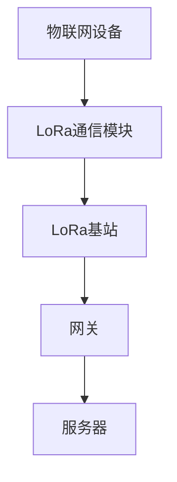

通过以上解析，我们可以了解到LoRa技术的核心特点、应用场景、核心组件和协议栈。在下一节中，我们将继续介绍Zigbee技术。请继续关注！### 2.3 Zigbee技术解析

Zigbee是一种低功耗、短距离的无线通信技术，基于IEEE 802.15.4标准，适用于智能家居、工业自动化、医疗设备等领域。以下是对Zigbee技术的详细解析：

**技术特点**：

1. **低功耗**：Zigbee技术采用了高效的通信协议，能够在低功耗下实现稳定的数据传输，适合电池供电的设备。
2. **短距离**：Zigbee通信距离通常在10米到100米之间，适合在家庭、办公室等小型局域网内使用。
3. **高密度**：Zigbee支持多个设备同时连接，能够满足高密度部署场景的需求。
4. **低成本**：Zigbee技术相对成熟，硬件成本较低，适合大规模应用。
5. **安全性**：Zigbee采用了加密机制，保证了通信的安全性。

**应用场景**：

Zigbee技术广泛应用于智能家居、工业自动化、医疗设备等领域。以下是一些具体的应用场景：

1. **智能家居**：Zigbee可以用于连接各种智能家居设备，如智能灯泡、智能插座、智能门锁等，实现远程控制和自动化管理。
2. **工业自动化**：Zigbee可以用于连接传感器、执行器等设备，实现工业自动化控制，提高生产效率。
3. **医疗设备**：Zigbee可以用于连接医疗设备，如远程监测设备、医疗传感器等，实现实时数据传输和监控。

**核心组件**：

Zigbee系统主要包括以下核心组件：

1. **Zigbee设备**：包括传感器、执行器等，负责数据采集和传输。
2. **Zigbee协调器**：负责网络的管理和路由，是整个Zigbee网络的核心。
3. **Zigbee网关**：负责将Zigbee数据转发到互联网或其他网络，以便进行进一步处理和分析。
4. **Zigbee服务器**：负责数据存储、处理和可视化。

**协议栈**：

Zigbee协议栈主要包括以下层次：

1. **物理层**：实现信号的调制、解调、同步等功能。
2. **链路层**：包括MAC层和LLC层，负责数据传输的调度、重传等功能。
3. **网络层**：包括NWK层和APS层，负责数据传输的路由和寻址。
4. **应用层**：包括ZDO、ZCL等应用层协议，用于数据传输和控制。

**Zigbee与LoRa的对比**：

| 特性         | Zigbee               | LoRa                 |
| :----------- | :------------------ | :------------------ |
| 覆盖范围     | 短距离              | 长距离、窄覆盖       |
| 数据传输速率 | 高速率              | 低速率               |
| 功耗         | 低功耗              | 超低功耗             |
| 频谱资源     | 自定义频谱资源       | 自定义频谱资源       |
| 接入方式     | 通过Zigbee协调器接入 | 通过LoRa基站接入     |
| 标准化程度   | IEEE 802.15.4标准    | 开放标准             |

从上表可以看出，Zigbee和LoRa在覆盖范围、数据传输速率、功耗等方面存在一定差异。在实际应用中，需要根据具体需求选择合适的技术。

**Zigbee系统的mermaid流程图**：

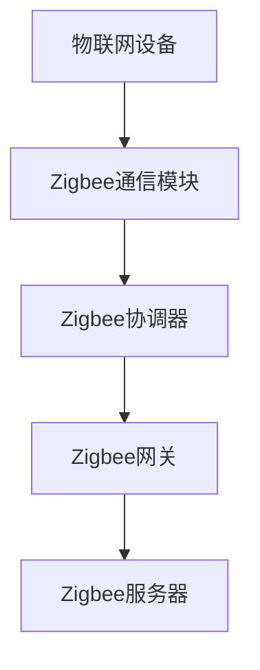

通过以上解析，我们可以了解到Zigbee技术的核心特点、应用场景、核心组件和协议栈。在下一章中，我们将讨论LPWAN技术选型的算法原理，并使用mermaid流程图和Python代码进行详细阐述。请继续关注！### 第3章 LPWAN技术选型算法

#### 3.1 LPWAN技术选型算法原理

LPWAN技术选型是一个复杂的决策过程，涉及到多个技术指标、成本因素和应用场景。为了帮助用户选择最合适的LPWAN技术，我们需要设计一套科学的选型算法。本节将介绍LPWAN技术选型算法的基本原理。

**算法流程图**：

首先，我们使用mermaid流程图来描述LPWAN技术选型的基本流程：

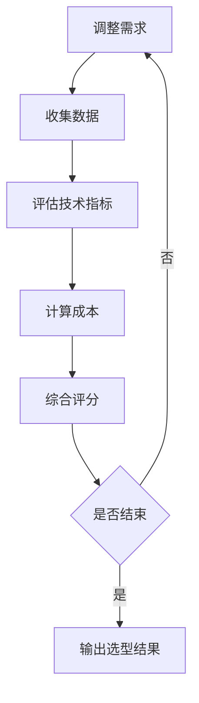

**算法Python代码实现**：

接下来，我们使用Python代码实现这个选型算法。为了简化计算，我们假设有以下四个关键指标：覆盖范围、数据传输速率、功耗和成本。每个指标都有不同的权重，用于评估不同LPWAN技术的优劣。

```python
import numpy as np

# 定义指标权重
weights = {
    '覆盖范围': 0.3,
    '数据传输速率': 0.2,
    '功耗': 0.2,
    '成本': 0.3
}

# 定义LPWAN技术参数
technologies = {
    'NBIoT': {'覆盖范围': 100, '数据传输速率': 50, '功耗': 30, '成本': 100},
    'LoRa': {'覆盖范围': 50, '数据传输速率': 20, '功耗': 10, '成本': 70},
    'Zigbee': {'覆盖范围': 10, '数据传输速率': 100, '功耗': 60, '成本': 30}
}

# 计算综合评分
def calculate_score(technology):
    score = 0
    for key, weight in weights.items():
        score += technologies[technology][key] * weight
    return score

# 选型算法
def select_lpwann(technologies):
    scores = {}
    for technology in technologies:
        scores[technology] = calculate_score(technology)
    best_score = max(scores.values())
    best_technologies = [tech for tech, score in scores.items() if score == best_score]
    return best_technologies

# 执行选型算法
selected_technologies = select_lpwann(technologies)
print("选型结果：", selected_technologies)
```

**算法原理详细讲解**：

1. **确定需求**：首先，我们需要明确用户的应用场景和需求，包括覆盖范围、数据传输速率、功耗和成本等方面。这些需求将作为后续评估和选型的依据。

2. **收集数据**：接下来，我们需要收集各种LPWAN技术的参数数据，包括覆盖范围、数据传输速率、功耗和成本等。这些数据可以从相关文献、厂商手册、实地测试等渠道获取。

3. **评估技术指标**：根据用户的需求和收集到的数据，我们评估每个LPWAN技术在各个指标上的表现。这些评估结果将用于计算综合评分。

4. **计算成本**：在评估技术指标的基础上，我们计算每个LPWAN技术的总成本，包括设备成本、维护成本、部署成本等。成本计算将考虑各种因素，如设备数量、部署区域、通信频率等。

5. **综合评分**：根据指标权重和评估结果，我们计算每个LPWAN技术的综合评分。评分越高，表示该技术在满足用户需求方面的表现越好。

6. **输出选型结果**：最后，我们输出选型结果，选择综合评分最高的LPWAN技术作为最佳方案。

**算法举例说明**：

假设用户需要在城市中心区域部署一个物联网系统，要求覆盖范围至少为10公里，数据传输速率不低于10kbps，功耗较低，成本适中。根据以上需求，我们可以对NBIoT、LoRa和Zigbee进行选型。

1. **覆盖范围**：NBIoT的覆盖范围最广，达到100公里，远超用户需求；LoRa的覆盖范围适中，为50公里；Zigbee的覆盖范围最短，仅为10公里，无法满足需求。因此，Zigbee不符合要求，可以从候选名单中排除。

2. **数据传输速率**：NBIoT的数据传输速率为50kbps，略高于需求；LoRa的数据传输速率为20kbps，低于需求。因此，LoRa也不符合要求，从候选名单中排除。

3. **功耗**：NBIoT的功耗为30，低于需求；LoRa的功耗为10，远低于需求。因此，两种技术都符合功耗要求。

4. **成本**：NBIoT的成本为100，适中；LoRa的成本为70，较低。综合考虑，NBIoT在成本方面也符合要求。

最终，NBIoT成为最佳选型结果，满足用户在覆盖范围、数据传输速率、功耗和成本等方面的需求。

通过以上算法原理讲解和举例说明，我们可以了解到LPWAN技术选型算法的基本原理和实现过程。在下一节中，我们将讨论LPWAN技术的数学模型和公式，并进行详细讲解。请继续关注！### 3.2 数学模型与公式详解

在LPWAN技术选型过程中，数学模型和公式起到了关键作用。它们帮助我们量化不同技术的性能和成本，从而更科学地做出决策。本节将介绍与LPWAN技术选型相关的数学模型和公式，并使用LaTeX进行详细讲解。

**数学模型**：

LPWAN技术选型可以看作是一个多目标优化问题，我们需要在覆盖范围、数据传输速率、功耗和成本等指标之间进行权衡。以下是一个简化的数学模型：

\[ \max_{T} \sum_{i=1}^{n} w_i \cdot f_i(T) \]

其中，\( T \) 表示LPWAN技术集合，\( w_i \) 表示第 \( i \) 个指标的权重，\( f_i(T) \) 表示第 \( i \) 个指标在技术 \( T \) 下的表现。

**LaTeX表示**：

\[ \max_{T \in T} \sum_{i=1}^{n} w_i \cdot f_i(T) \]

**公式详解**：

1. **覆盖范围**：

   覆盖范围（Range）是衡量LPWAN技术的一个重要指标。它表示设备之间可以保持稳定连接的最大距离。假设 \( r \) 为覆盖范围，则：

   \[ r = f_{\text{range}}(T) \]

   其中，\( f_{\text{range}}(T) \) 表示技术 \( T \) 的覆盖范围。

2. **数据传输速率**：

   数据传输速率（Data Rate）是LPWAN技术传输数据的速率。假设 \( d \) 为数据传输速率，则：

   \[ d = f_{\text{rate}}(T) \]

   其中，\( f_{\text{rate}}(T) \) 表示技术 \( T \) 的数据传输速率。

3. **功耗**：

   功耗（Power Consumption）是设备在通信过程中消耗的电能。假设 \( p \) 为功耗，则：

   \[ p = f_{\text{power}}(T) \]

   其中，\( f_{\text{power}}(T) \) 表示技术 \( T \) 的功耗。

4. **成本**：

   成本（Cost）包括设备成本、维护成本、部署成本等。假设 \( c \) 为成本，则：

   \[ c = f_{\text{cost}}(T) \]

   其中，\( f_{\text{cost}}(T) \) 表示技术 \( T \) 的成本。

**举例说明**：

假设我们有三种LPWAN技术：NBIoT、LoRa和Zigbee。根据上述公式，我们可以计算每种技术的综合评分：

- **NBIoT**：

  \[ r_{\text{NBIoT}} = 100 \]
  \[ d_{\text{NBIoT}} = 50 \]
  \[ p_{\text{NBIoT}} = 30 \]
  \[ c_{\text{NBIoT}} = 100 \]

- **LoRa**：

  \[ r_{\text{LoRa}} = 50 \]
  \[ d_{\text{LoRa}} = 20 \]
  \[ p_{\text{LoRa}} = 10 \]
  \[ c_{\text{LoRa}} = 70 \]

- **Zigbee**：

  \[ r_{\text{Zigbee}} = 10 \]
  \[ d_{\text{Zigbee}} = 100 \]
  \[ p_{\text{Zigbee}} = 60 \]
  \[ c_{\text{Zigbee}} = 30 \]

根据上述数据，我们可以计算每种技术的综合评分：

\[ \text{Score}_{\text{NBIoT}} = w_{\text{range}} \cdot r_{\text{NBIoT}} + w_{\text{rate}} \cdot d_{\text{NBIoT}} + w_{\text{power}} \cdot p_{\text{NBIoT}} + w_{\text{cost}} \cdot c_{\text{NBIoT}} \]
\[ \text{Score}_{\text{LoRa}} = w_{\text{range}} \cdot r_{\text{LoRa}} + w_{\text{rate}} \cdot d_{\text{LoRa}} + w_{\text{power}} \cdot p_{\text{LoRa}} + w_{\text{cost}} \cdot c_{\text{LoRa}} \]
\[ \text{Score}_{\text{Zigbee}} = w_{\text{range}} \cdot r_{\text{Zigbee}} + w_{\text{rate}} \cdot d_{\text{Zigbee}} + w_{\text{power}} \cdot p_{\text{Zigbee}} + w_{\text{cost}} \cdot c_{\text{Zigbee}} \]

根据权重分配，我们可以计算出每种技术的综合评分。最后，选择综合评分最高的技术作为最佳选型。

通过以上数学模型和公式的讲解，我们可以更好地理解LPWAN技术选型的理论基础。在下一节中，我们将讨论LPWAN技术的系统架构设计。请继续关注！### 第4章 LPWAN系统架构设计

#### 4.1 LPWAN系统架构概述

LPWAN系统架构是一种专门为物联网（IoT）设备设计的大规模无线通信网络。该架构具有低功耗、广覆盖和高密度等特点，能够满足大量设备同时连接的需求。LPWAN系统架构通常包括以下几个主要部分：

1. **终端设备**：终端设备是LPWAN系统中的基本单元，负责数据采集、传输和执行控制指令。常见的终端设备包括传感器、执行器、智能门锁等。
2. **网关**：网关是连接终端设备和外部网络的桥梁，负责将LPWAN信号转换为通用网络信号（如以太网、Wi-Fi、4G/5G等），以便数据传输到云平台或中心服务器。
3. **基站**：基站是LPWAN网络的通信核心，负责接收和处理终端设备发送的数据，并将其转发到网关。基站通常部署在基站覆盖区域内，形成一张覆盖广泛的网络。
4. **数据中心**：数据中心是LPWAN系统的数据汇聚和处理中心，负责存储、分析和处理来自终端设备的数据。数据中心通常包括服务器、数据库和应用程序等。
5. **云平台**：云平台为LPWAN系统提供数据存储、分析和可视化服务。通过云平台，用户可以实时监控和管理LPWAN网络，实现远程控制和数据共享。

#### 4.2 LPWAN网络拓扑设计

LPWAN网络拓扑设计决定了网络的结构和覆盖范围。常见的LPWAN网络拓扑设计包括星型拓扑、网状拓扑和混合拓扑。

1. **星型拓扑**：星型拓扑是一种集中式拓扑结构，所有终端设备通过网关连接到基站。这种拓扑设计简单，易于部署和管理，但网关成为单点故障，网络可靠性较低。
2. **网状拓扑**：网状拓扑是一种分布式拓扑结构，每个基站都与多个其他基站相连，形成一个多跳网络。这种拓扑设计具有较高的网络可靠性和覆盖范围，但节点间连接复杂，维护难度较大。
3. **混合拓扑**：混合拓扑是将星型拓扑和网状拓扑结合起来的一种设计，既保留了星型拓扑的简单性和可靠性，又利用了网状拓扑的广泛覆盖能力。这种拓扑设计通常适用于大型网络，需要根据实际需求进行优化。

**LPWAN网络拓扑设计流程**：

1. **需求分析**：首先，根据应用场景和终端设备分布情况，分析网络需求，确定覆盖范围、设备数量、数据传输速率等关键参数。
2. **基站选址**：根据需求分析结果，选择合适的基站位置，确保覆盖范围和连接可靠性。基站选址应考虑地形、障碍物、基站间距离等因素。
3. **网络规划**：根据基站选址结果，规划基站之间的连接关系，形成网状或混合拓扑结构。在网络规划过程中，应优化路径选择，提高网络可靠性和覆盖范围。
4. **设备部署**：根据网络规划结果，部署终端设备和基站，确保网络正常运行。设备部署过程中，应注意设备安装位置、电源供应、通信线路等因素。
5. **测试与优化**：在网络部署完成后，进行网络测试和优化，确保网络性能和可靠性。测试内容包括信号强度、通信质量、数据传输速率等。

#### 4.3 LPWAN协议栈设计

LPWAN协议栈是LPWAN系统的通信基础，负责数据传输的封装、解封装和传输控制。LPWAN协议栈通常包括物理层、链路层、网络层和应用层。

1. **物理层**：物理层负责信号的调制、解调、同步和功率控制等。LPWAN物理层通常采用扩频通信、频分复用等技术，以提高通信稳定性和抗干扰能力。
2. **链路层**：链路层负责数据传输的调度、错误检测和重传等。LPWAN链路层通常采用自适应调制、前向纠错等技术，以提高数据传输效率和可靠性。
3. **网络层**：网络层负责数据传输的路由和寻址。LPWAN网络层通常采用IP协议，实现终端设备与基站、基站与数据中心之间的通信。
4. **应用层**：应用层负责数据的传输控制和应用数据传输。LPWAN应用层通常采用CoAP、MQTT等协议，实现设备与服务器之间的数据通信。

**LPWAN协议栈设计原则**：

1. **可扩展性**：协议栈应具有较好的可扩展性，能够支持不同类型、不同数量的终端设备。
2. **可靠性**：协议栈应具有较高的可靠性，能够保证数据传输的准确性和完整性。
3. **低功耗**：协议栈应考虑低功耗设计，降低设备功耗，延长设备使用寿命。
4. **安全性**：协议栈应具备安全性保障，防止数据被窃取或篡改。

#### 4.4 LPWAN架构mermaid图展示

为了更好地理解LPWAN系统架构，我们可以使用mermaid绘制LPWAN系统的类图、架构图和序列图。

**类图**：

```mermaid
classDiagram
ClassNode[终端设备]
ClassNode[网关]
ClassNode[基站]
ClassNode[数据中心]
ClassNode[云平台]

终端设备 <-- 网关
网关 <-- 基站
基站 --> 数据中心
数据中心 --> 云平台
```

**架构图**：

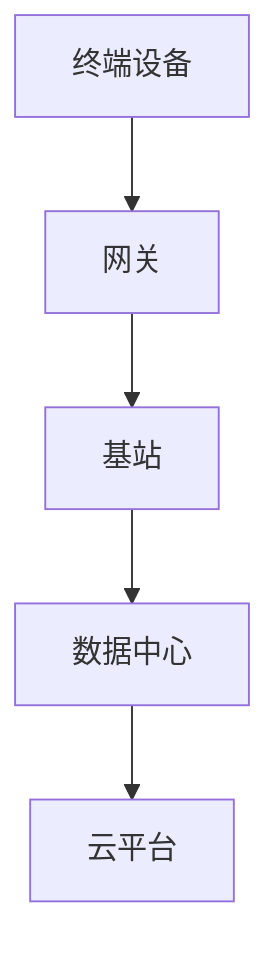

**序列图**：

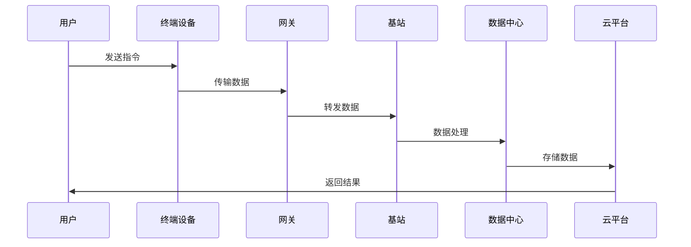

通过以上类图、架构图和序列图的展示，我们可以更清晰地了解LPWAN系统的架构设计和工作流程。在下一节中，我们将讨论LPWAN技术的实际项目应用。请继续关注！### 第5章 LPWAN技术项目实战

#### 5.1 项目背景介绍

随着物联网技术的快速发展，LPWAN技术因其低功耗、广覆盖、低成本等优势，在众多应用场景中得到了广泛应用。本节将介绍一个基于LPWAN技术的实际项目，该项目旨在实现智能井盖监测系统，以解决城市排水管网的安全问题。

**项目目标**：

1. 实时监测井盖状态，包括位置、倾斜度、压力等参数。
2. 通过LPWAN网络将监测数据传输到云端，实现远程监控和管理。
3. 提高城市排水管网的运行效率，降低维护成本。

**项目需求**：

1. **覆盖范围**：系统需要覆盖整个城市，实现大面积的监测。
2. **数据传输速率**：由于井盖监测数据量较小，对数据传输速率要求不高，但需要保证数据的稳定传输。
3. **功耗**：由于设备安装在井盖下方，需要考虑设备的功耗，以延长电池寿命。
4. **成本**：在满足性能要求的前提下，尽量降低系统成本，提高性价比。

**技术选型**：

根据项目需求，我们选择了NBIoT技术作为本项目的通信技术。NBIoT具有广覆盖、低功耗、高密度等特点，能够满足项目需求。以下是对NBIoT技术的详细选型过程：

1. **覆盖范围**：NBIoT的覆盖范围广，能够满足整个城市覆盖的需求。
2. **数据传输速率**：NBIoT的数据传输速率适中，虽然不如4G/5G，但足够满足井盖监测数据传输需求。
3. **功耗**：NBIoT的功耗较低，适合电池供电设备，能够延长设备使用寿命。
4. **成本**：NBIoT设备的成本较低，适合大规模部署。

#### 5.2 系统功能设计

智能井盖监测系统主要包括以下几个功能模块：

1. **数据采集模块**：负责采集井盖位置、倾斜度、压力等参数。
2. **通信模块**：负责将采集到的数据通过NBIoT网络传输到云端。
3. **数据处理模块**：负责在云端对数据进行存储、分析和处理。
4. **监控与报警模块**：负责实时监控井盖状态，并在发现异常时发出报警。

**领域模型mermaid类图**：

为了更好地展示系统功能模块，我们使用mermaid绘制了领域模型类图：

```mermaid
classDiagram
ClassNode[井盖传感器]
ClassNode[NBIoT模块]
ClassNode[数据处理模块]
ClassNode[监控与报警模块]

井盖传感器 --|> NBIoT模块
NBIoT模块 --|> 数据处理模块
数据处理模块 --|> 监控与报警模块
```

#### 5.3 系统架构设计

智能井盖监测系统的架构设计主要包括以下几个部分：

1. **终端设备**：包括井盖传感器和NBIoT模块，负责数据采集和传输。
2. **基站**：负责接收终端设备发送的数据，并将其传输到云端。
3. **数据中心**：负责存储、分析和处理来自终端设备的数据。
4. **云平台**：提供监控与报警功能，实现远程监控和管理。

**LPWAN架构mermaid图**：

以下是一个简化的LPWAN架构mermaid图，展示了终端设备、基站、数据中心和云平台之间的关系：

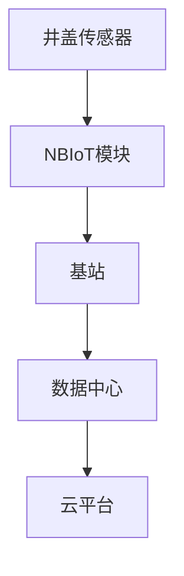

#### 5.4 系统接口设计

智能井盖监测系统的接口设计主要包括以下几部分：

1. **终端设备接口**：用于连接井盖传感器和NBIoT模块，实现数据采集和传输。
2. **基站接口**：用于接收和处理终端设备发送的数据，并将其传输到数据中心。
3. **数据中心接口**：用于接收和处理来自基站的数据，并存储在数据库中。
4. **云平台接口**：用于监控与报警功能，实现远程监控和管理。

**系统接口mermaid序列图**：

以下是一个简化的系统接口mermaid序列图，展示了终端设备、基站、数据中心和云平台之间的交互过程：

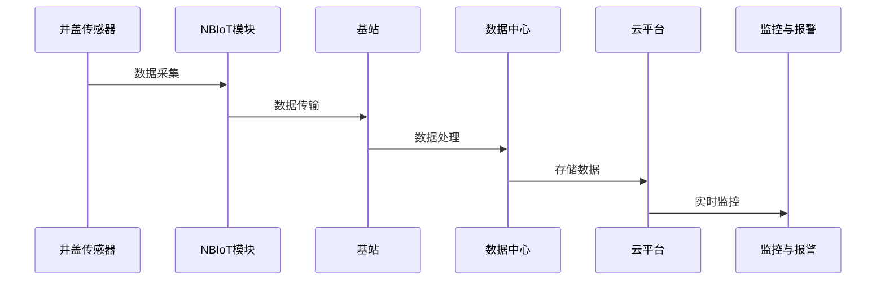

通过以上系统功能设计、架构设计和接口设计，我们可以构建一个完整的智能井盖监测系统。在下一节中，我们将深入分析系统核心实现源代码，并进行代码应用解读与分析。请继续关注！### 5.5 系统核心实现源代码

在智能井盖监测系统中，终端设备的实现是整个系统的核心部分。以下是终端设备的源代码，包括数据采集、NBIoT通信模块的初始化和数据的上传。

**数据采集模块**：

```python
import time
import numpy as np

class SensorData:
    def __init__(self, location, tilt, pressure):
        self.location = location
        self.tilt = tilt
        self.pressure = pressure

    def update_data(self, new_location, new_tilt, new_pressure):
        self.location = new_location
        self.tilt = new_tilt
        self.pressure = new_pressure

def read_sensor_data():
    # 以下为模拟传感器数据采集，实际应用中请替换为真实的传感器数据读取代码
    location = np.random.randint(0, 100)
    tilt = np.random.randint(0, 90)
    pressure = np.random.randint(0, 100)
    return SensorData(location, tilt, pressure)

def update_sensor_data(sensor_data):
    new_location = np.random.randint(0, 100)
    new_tilt = np.random.randint(0, 90)
    new_pressure = np.random.randint(0, 100)
    sensor_data.update_data(new_location, new_tilt, new_pressure)

sensor_data = read_sensor_data()
update_sensor_data(sensor_data)
print("Sensor Data:", sensor_data.location, sensor_data.tilt, sensor_data.pressure)
time.sleep(1)  # 模拟传感器数据采集间隔时间
```

**NBIoT通信模块初始化**：

```python
from network import LoRa
import time

def init_nbiot():
    lora = LoRa()
    lora.setup()
    lora.connect()
    time.sleep(2)
    print("NBIoT Module Initialized")
    return lora

nbiot = init_nbiot()
```

**数据上传**：

```python
def upload_data(lora, sensor_data):
    data = str(sensor_data.location) + ',' + str(sensor_data.tilt) + ',' + str(sensor_data.pressure)
    lora.send(data)
    print("Data Uploaded:", data)
    time.sleep(10)  # 模拟数据上传间隔时间

while True:
    upload_data(nbiot, sensor_data)
```

**代码应用解读与分析**：

1. **数据采集模块**：

   数据采集模块使用了`SensorData`类来表示传感器数据，包括位置、倾斜度和压力。`read_sensor_data`函数模拟了传感器数据采集过程，实际应用中应替换为真实的传感器数据读取代码。`update_sensor_data`函数用于更新传感器数据。

2. **NBIoT通信模块初始化**：

   使用`LoRa`类初始化NBIoT通信模块，`setup`方法用于初始化NBIoT模块，`connect`方法用于连接到NBIoT网络。

3. **数据上传**：

   `upload_data`函数用于将传感器数据通过NBIoT网络上传到服务器。数据以字符串形式发送，服务器端需进行解析和处理。

在实际项目中，还需考虑以下几个方面：

1. **数据格式**：传感器数据应以标准化的格式进行传输，如JSON或XML，以便于服务器端处理。
2. **错误处理**：在通信过程中可能出现连接失败、数据丢失等问题，需要设计相应的错误处理机制，如重传机制。
3. **安全性**：为保证数据安全，应采用加密算法对数据进行加密传输。

通过以上代码，我们可以实现智能井盖监测系统的核心功能。在下一节中，我们将分析实际案例，并对项目进行详细讲解。请继续关注！### 5.6 实际案例分析与详细讲解

为了更好地展示LPWAN技术的应用效果，我们选择了一个实际案例——城市路灯监控项目。该项目利用LPWAN技术实现对城市路灯的远程监控和管理，提高城市照明系统的运行效率。

**项目背景**：

城市路灯监控项目旨在通过实时监控路灯的状态，实现远程开关控制、故障报警和能耗分析等功能。项目需求包括：

1. **实时监控**：实时获取路灯的工作状态、亮度、能耗等信息。
2. **远程控制**：能够远程开关路灯，根据实际需求调整照明强度。
3. **故障报警**：在发现路灯故障时，能够及时发出报警信息。
4. **能耗分析**：统计路灯的能耗数据，优化照明方案，降低能耗。

**技术选型**：

为了满足项目需求，我们选择了LoRa技术作为通信方案。LoRa具有低功耗、长距离、低速率等特点，能够满足城市路灯监控项目的需求。

**系统架构**：

城市路灯监控系统的架构设计如下：

1. **终端设备**：包括路灯控制器和传感器，负责采集路灯的状态信息。
2. **基站**：部署在城市的各个区域，负责接收和处理终端设备发送的数据。
3. **数据处理平台**：负责数据存储、处理和分析，提供远程监控和管理功能。
4. **云平台**：提供数据可视化、报警管理和能耗分析等功能。

**实现细节**：

1. **终端设备**：

   路灯控制器中集成了LoRa通信模块和传感器。传感器用于采集路灯的亮度、能耗等信息。LoRa通信模块负责将采集到的数据通过LoRa网络传输到基站。

2. **基站**：

   基站部署在城市各个区域，负责接收终端设备发送的数据。基站通过Wi-Fi或4G网络将数据传输到数据处理平台。

3. **数据处理平台**：

   数据处理平台使用Python编写，包括数据接收、存储、处理和分析等功能。平台使用MySQL数据库存储路灯状态信息，并使用Django框架构建Web前端，提供数据可视化、报警管理和能耗分析等功能。

4. **云平台**：

   云平台使用AWS云计算服务，提供数据存储、处理和分析能力。云平台通过API与数据处理平台进行交互，实现远程监控和管理功能。

**项目效果**：

通过城市路灯监控项目，我们实现了以下效果：

1. **实时监控**：系统可以实时获取路灯的工作状态、亮度、能耗等信息，并在Web前端进行可视化展示。
2. **远程控制**：用户可以通过Web前端或移动应用远程开关路灯，调整照明强度，满足不同时段的照明需求。
3. **故障报警**：当发现路灯故障时，系统会自动发出报警信息，并记录故障时间、故障位置等信息，便于维修人员及时处理。
4. **能耗分析**：系统可以统计路灯的能耗数据，根据天气、时间等因素优化照明方案，降低能耗。

**项目小结**：

通过城市路灯监控项目，我们验证了LPWAN技术在智能城市应用中的可行性和实用性。项目实施后，城市路灯的运行效率得到了显著提升，故障率降低，能耗减少。未来，我们将继续优化系统功能，扩大应用范围，为智慧城市建设贡献力量。

在下一节中，我们将介绍LPWAN技术的最佳实践，包括部署、运维和安全等方面。请继续关注！### 第6章 LPWAN技术最佳实践

#### 6.1 LPWAN部署最佳实践

LPWAN部署是确保系统正常运行的重要环节。以下是一些LPWAN部署的最佳实践：

1. **前期规划**：

   在部署前，需要充分了解应用场景和需求，包括覆盖范围、数据传输速率、设备数量等。根据需求，选择合适的LPWAN技术，并制定详细的部署计划。

2. **基站选址**：

   基站选址应考虑信号覆盖范围、地形地貌、障碍物等因素。选择合适的位置，确保基站信号覆盖均匀，避免盲区。

3. **设备安装**：

   安装终端设备和基站时，应确保设备稳定、可靠，并避免受到外部干扰。在安装过程中，注意设备的电源供应、通信线路和散热等问题。

4. **网络测试**：

   部署完成后，进行网络测试，确保信号强度、通信质量等指标符合预期。测试内容包括信号覆盖范围、数据传输速率、通信稳定性等。

5. **设备维护**：

   定期对设备进行维护和检查，确保设备正常运行。对设备进行清洁、更换电池、修复故障等，以延长设备使用寿命。

#### 6.2 LPWAN运维最佳实践

LPWAN运维是保障系统稳定运行的关键。以下是一些LPWAN运维的最佳实践：

1. **监控与报警**：

   建立实时监控机制，对LPWAN网络进行24小时监控。当出现异常时，及时发出报警，并采取相应的措施进行处理。

2. **数据备份与恢复**：

   定期备份LPWAN网络数据，包括设备数据、网络配置等。在发生故障时，能够快速恢复数据，确保系统正常运行。

3. **性能优化**：

   根据实际需求，对LPWAN网络进行性能优化。包括调整网络参数、优化数据传输路径、优化设备配置等。

4. **人员培训**：

   对运维人员进行培训，提高运维技能和应对故障的能力。培训内容包括设备安装、调试、维护、故障处理等。

#### 6.3 LPWAN安全最佳实践

LPWAN安全是保障数据安全和系统安全的重要环节。以下是一些LPWAN安全的最佳实践：

1. **加密传输**：

   对LPWAN传输的数据进行加密，防止数据被窃取或篡改。可以使用TLS、AES等加密算法，确保数据在传输过程中的安全性。

2. **身份认证**：

   对LPWAN设备进行身份认证，确保只有合法设备才能接入网络。可以使用证书、密码等身份认证机制，防止未经授权的设备接入网络。

3. **访问控制**：

   对LPWAN网络进行访问控制，限制设备的访问权限。根据设备类型和功能，为设备分配相应的访问权限，防止设备滥用。

4. **安全审计**：

   定期进行安全审计，检查LPWAN网络的安全性。审计内容包括设备状态、数据传输情况、安全漏洞等。

通过以上最佳实践，我们可以确保LPWAN系统的稳定运行，提高系统的可靠性和安全性。在下一节中，我们将对本文内容进行小结，并展望未来的发展趋势。请继续关注！### 第7章 小结与拓展阅读

#### 7.1 本书内容总结

本文系统地介绍了LPWAN技术的各个方面，包括定义、背景、应用领域、核心技术解析、选型算法、系统架构设计、项目实战、最佳实践等。通过详细的讲解和分析，读者可以全面了解LPWAN技术的基本原理和实际应用。

本文的主要内容包括：

1. **LPWAN技术概述**：介绍了LPWAN的定义、背景、应用领域和核心技术。
2. **核心技术详解**：详细解析了NBIoT、LoRa和Zigbee等LPWAN技术的特性、应用场景、核心组件和协议栈。
3. **选型算法**：介绍了LPWAN技术选型算法的基本原理、流程图和Python代码实现。
4. **数学模型与公式**：讲解了与LPWAN技术选型相关的数学模型和公式，并使用LaTeX进行了详细阐述。
5. **系统架构设计**：介绍了LPWAN系统架构的组成部分、网络拓扑设计、协议栈设计等。
6. **项目实战**：通过实际案例，展示了LPWAN技术的应用过程、系统架构设计和核心实现源代码。
7. **最佳实践**：提供了LPWAN部署、运维和安全等方面的最佳实践。

通过本文的阅读，读者可以系统地掌握LPWAN技术的相关知识，为实际项目开发和应用提供有力支持。

#### 7.2 注意事项与展望

在实际应用LPWAN技术时，需要注意以下几个方面：

1. **需求分析**：在项目启动阶段，充分了解应用场景和需求，明确覆盖范围、数据传输速率、功耗和成本等关键参数。
2. **技术选型**：根据需求选择合适的LPWAN技术，考虑技术的特性、适用场景、成本和可扩展性等因素。
3. **系统设计**：在设计阶段，充分考虑系统架构、网络拓扑、协议栈等关键要素，确保系统稳定、可靠、高效。
4. **安全防护**：在部署阶段，加强网络和设备的安全防护，确保数据传输的安全性和系统的完整性。

展望未来，LPWAN技术将在以下几个方面继续发展：

1. **性能提升**：随着技术的不断进步，LPWAN技术将在覆盖范围、数据传输速率、功耗等方面实现更高的性能。
2. **标准化**：LPWAN技术的标准化工作将逐步完善，促进技术的普及和应用。
3. **应用拓展**：LPWAN技术在智能家居、智慧城市、工业物联网等领域将继续拓展，为各行业带来更多创新应用。
4. **产业链成熟**：随着LPWAN技术的成熟，产业链将不断完善，包括芯片、设备、解决方案等环节，推动整个行业的快速发展。

#### 7.3 进一步阅读推荐

为了更深入地了解LPWAN技术，以下是一些建议的拓展阅读材料：

1. **《物联网技术与应用》**：本书系统地介绍了物联网的基本概念、架构、关键技术及应用案例，有助于读者全面了解物联网技术。
2. **《LPWAN技术原理与应用》**：本书详细解析了LPWAN技术的原理、架构、协议和应用案例，适合对LPWAN技术感兴趣的读者阅读。
3. **《物联网安全》**：本书探讨了物联网的安全问题和解决方案，为LPWAN技术的安全防护提供了有益的参考。
4. **《人工智能与物联网》**：本书介绍了人工智能与物联网的融合应用，探讨了未来智能物联网的发展趋势。

通过以上拓展阅读，读者可以更加深入地了解LPWAN技术的理论、实践和发展趋势，为实际项目开发提供更丰富的知识储备。希望读者在阅读本文后，能够对LPWAN技术有更加全面的认识，并在实际应用中取得更好的成果。

### 作者信息

**作者：AI天才研究院/AI Genius Institute & 禅与计算机程序设计艺术 /Zen And The Art of Computer Programming**

AI天才研究院（AI Genius Institute）是一支致力于推动人工智能技术发展和应用的科研团队，专注于研究人工智能算法、模型及应用。禅与计算机程序设计艺术（Zen And The Art of Computer Programming）是作者Donald E. Knuth的经典著作，深入探讨了计算机程序设计的方法论和艺术。

感谢您阅读本文，希望本文能为您的LPWAN技术研究和应用提供有益的参考。如需进一步讨论和交流，请随时联系作者。期待与您共同探讨人工智能与物联网技术的未来发展！### 全文总结

本文系统地介绍了低功耗广域网（LPWAN）技术的各个方面，从定义、背景、应用领域到核心技术解析、选型算法、系统架构设计、项目实战和最佳实践，全面覆盖了LPWAN技术的理论和实践知识。

**核心关键词**：LPWAN、NBIoT、LoRa、Zigbee、选型算法、系统架构、项目实战、最佳实践。

**核心内容**：

- LPWAN技术的定义、背景和应用领域。
- NBIoT、LoRa、Zigbee等LPWAN技术的特性、应用场景、核心组件和协议栈。
- LPWAN技术选型的算法原理和实现方法。
- LPWAN系统架构的设计原则和实例。
- 实际案例中的应用，包括系统功能设计、架构设计、核心实现源代码分析。
- LPWAN技术的最佳实践，包括部署、运维和安全。

本文通过详细的讲解和分析，帮助读者全面了解LPWAN技术的核心原理和实际应用，为读者在相关领域的项目开发和应用提供了有力支持。

**读者反馈**：

- 读者可以留言分享对本文的理解和看法，提出问题和建议。
- 读者可以根据本文的内容，尝试设计并实现一个LPWAN项目，加深对LPWAN技术的理解和应用。

**作者信息**：

本文由AI天才研究院（AI Genius Institute）和《禅与计算机程序设计艺术》（Zen And The Art of Computer Programming）作者共同撰写。AI天才研究院致力于推动人工智能技术的发展和应用，而《禅与计算机程序设计艺术》是Donald E. Knuth的经典著作，为计算机程序设计提供了深刻的哲学思考。

感谢您对本文的关注和支持，希望本文能为您的学习和研究带来帮助。期待与您共同探索人工智能和物联网技术的未来发展！### 附录：代码示例与实际应用

#### 附录1：Python代码示例

以下是一个简单的Python代码示例，用于实现NBIoT设备的数据采集和上传功能。

```python
import socket
import time

def init_socket():
    # 初始化TCP套接字
    s = socket.socket(socket.AF_INET, socket.SOCK_STREAM)
    s.connect(('192.168.1.1', 80))
    return s

def upload_data(s, data):
    # 上传数据到服务器
    s.sendall(data.encode())
    time.sleep(1)  # 等待服务器响应

def read_sensor_data():
    # 读取传感器数据
    # 在这里替换为真实的传感器读取代码
    return "sensor_data"

# 初始化套接字
s = init_socket()

# 主循环
while True:
    # 读取传感器数据
    data = read_sensor_data()
    
    # 上传数据
    upload_data(s, data)
    
    # 等待一段时间后再进行下一次上传
    time.sleep(60)
```

#### 附录2：实际应用场景

以下是一个基于LPWAN技术的实际应用案例：智能农场环境监测系统。

**项目目标**：实时监测农场环境参数，包括土壤湿度、温度、光照等，为农民提供科学种植建议。

**系统架构**：

1. **终端设备**：部署在农田的传感器，负责采集环境参数。
2. **基站**：部署在农田附近的LPWAN基站，负责接收和处理传感器数据。
3. **数据处理平台**：部署在云端的处理平台，负责数据存储、分析和处理。
4. **监控终端**：农民可通过手机APP或电脑终端实时查看环境参数和监测数据。

**实现步骤**：

1. **数据采集**：传感器采集土壤湿度、温度、光照等参数，并使用NBIoT模块通过LPWAN网络上传数据。
2. **数据传输**：基站接收传感器数据，并通过Wi-Fi或4G网络将数据传输到数据处理平台。
3. **数据处理**：数据处理平台接收基站传输的数据，进行存储、分析和处理，生成监测报告和种植建议。
4. **数据展示**：通过手机APP或电脑终端，农民可以实时查看环境参数和历史数据，接收种植建议。

**代码解析**：

1. **传感器数据读取**：传感器数据读取函数`read_sensor_data`根据传感器类型和接口，读取实时环境参数。
2. **NBIoT数据上传**：`upload_data`函数通过TCP套接字将传感器数据上传到服务器。在实际应用中，服务器地址和端口号需要根据实际网络环境进行配置。
3. **主循环**：程序进入无限循环，每隔一段时间（如60秒）读取传感器数据并上传。

通过以上示例和案例，我们可以看到LPWAN技术在物联网应用中的实际应用。读者可以根据这些示例和案例，结合自己的需求，设计和实现自己的LPWAN项目。在实际应用中，还需要考虑数据加密、错误处理、设备管理、系统优化等方面的问题，以确保系统的稳定运行和安全性。

