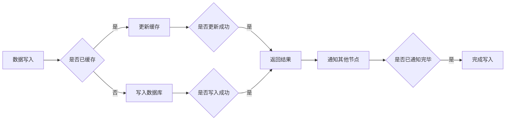
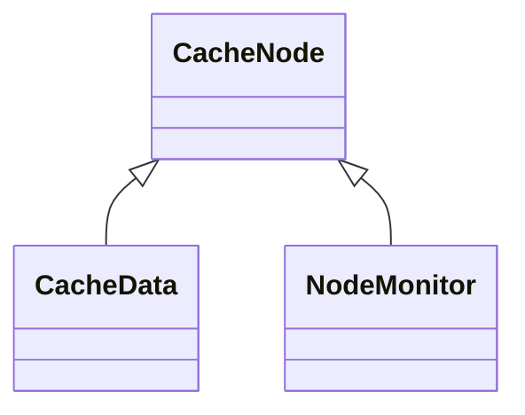
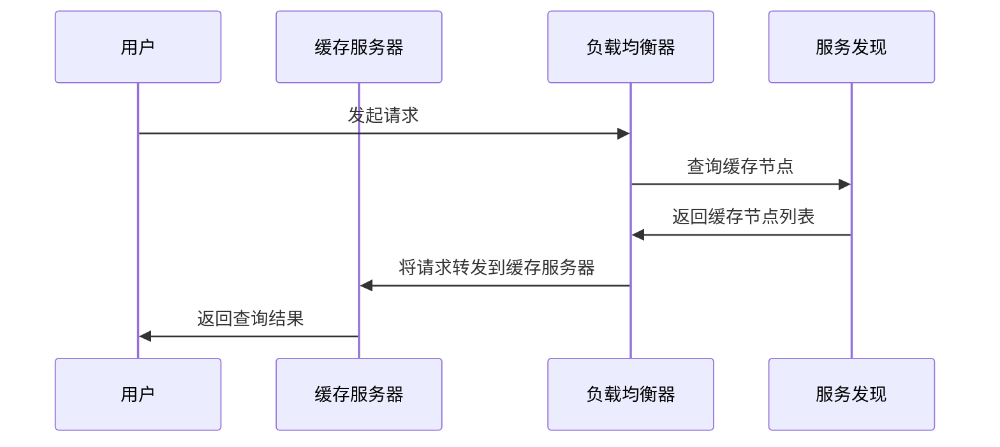
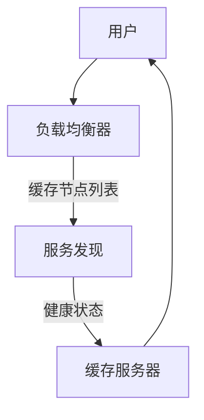
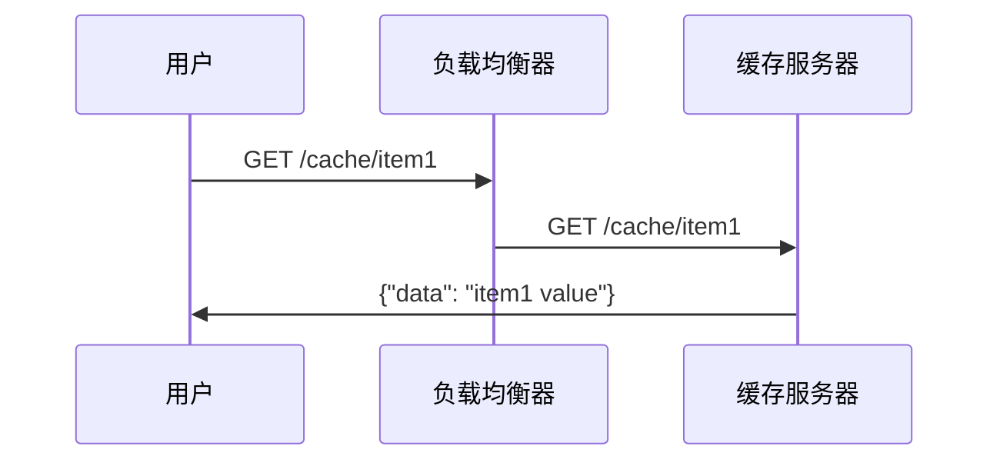
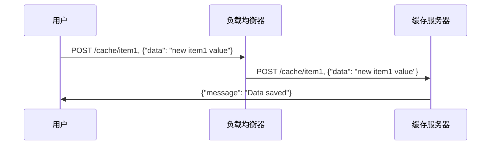
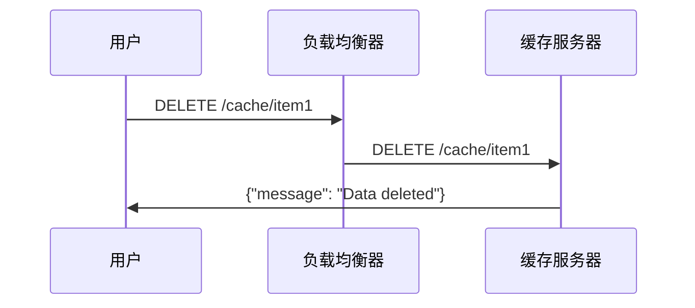

                 

## 分布式缓存系统设计

### 关键词

- 分布式缓存
- 数据一致性
- 数据分区
- 节点故障
- 缓存穿透
- 缓存雪崩

### 摘要

分布式缓存系统在现代互联网应用中扮演着至关重要的角色，它通过高效的缓存服务减轻后端数据库的负担，提升系统的响应速度和用户体验。本文将详细介绍分布式缓存系统的起源、发展、核心问题及其解决方案，并探讨其与其他技术的比较和应用场景，以及未来的发展趋势。

## 第一部分：背景介绍

### 1.1 问题背景

在当今互联网时代，随着数据量的爆炸性增长和用户需求的不断变化，传统的单体缓存系统已经无法满足高并发、高可用的要求。分布式缓存系统以其横向扩展性、高可用性和高性能，成为了现代互联网应用的重要基础设施。本章节将介绍分布式缓存系统的起源、发展及其在互联网应用中的重要性。

### 1.1.1 分布式缓存系统的起源

分布式缓存系统的概念起源于20世纪90年代，随着互联网的兴起，网络应用开始出现大量的并发请求，传统的集中式缓存系统（如内存缓存、数据库缓存等）逐渐暴露出性能瓶颈。为了解决这一问题，分布式缓存系统应运而生。

### 1.1.2 分布式缓存系统的发展

随着分布式计算技术的进步，分布式缓存系统得到了快速发展。从最初的基于内存的分布式缓存，如Memcached，到后来基于磁盘的Redis，再到如今支持多种数据结构的分布式缓存系统，如Apache Ignite、Kubernetes等，分布式缓存系统的发展日新月异。

### 1.1.3 分布式缓存系统的重要性

分布式缓存系统在互联网应用中具有举足轻重的地位。它能够提供高效的缓存服务，减轻后端数据库的压力，提高系统的响应速度，从而提升用户体验。同时，分布式缓存系统还具有高可用性、可扩展性等优点，能够满足大规模互联网应用的性能需求。

### 1.2 问题描述

分布式缓存系统虽然具有诸多优点，但在设计和实现过程中也面临着一系列挑战。本章节将详细介绍分布式缓存系统面临的问题，包括数据一致性、数据分区、节点故障、缓存穿透、缓存雪崩等。

### 1.2.1 数据一致性

分布式缓存系统中，数据的一致性是一个至关重要的挑战。由于缓存数据的复制和分区，可能导致数据在不同节点之间的不一致。如何保证数据的一致性，是分布式缓存系统设计中的重要问题。

#### 1.2.2 数据分区

数据分区是分布式缓存系统的核心思想之一。通过将数据划分到不同的节点上，可以实现对缓存的横向扩展。然而，如何合理地进行数据分区，以避免数据倾斜、热点数据问题，是分布式缓存系统设计中的关键问题。

#### 1.2.3 节点故障

在分布式缓存系统中，节点故障是一个常见的问题。如何实现故障检测、故障恢复，保证系统的可用性，是分布式缓存系统设计中的重要考虑。

#### 1.2.4 缓存穿透

缓存穿透是指当缓存中不存在所需的键时，直接访问底层的数据存储系统，导致大量无效的数据库请求。缓存穿透会导致数据库负载过高，甚至可能引发系统崩溃。

#### 1.2.5 缓存雪崩

缓存雪崩是指当大量缓存同时失效时，导致大量的无效数据库请求，进而引发数据库压力过大，甚至导致系统崩溃。如何避免缓存雪崩，是分布式缓存系统设计中的重要问题。

### 1.3 问题解决

针对分布式缓存系统面临的问题，本章将介绍一系列解决方案。包括：

#### 1.3.1 数据一致性解决方案

- 使用分布式锁保证数据一致性。
- 使用最终一致性模型，如事件溯源、CQRS等。

#### 1.3.2 数据分区解决方案

- 哈希分区。
- 范围分区。
- 热点数据分区。

#### 1.3.3 节点故障解决方案

- 节点监控与故障检测。
- 自动故障转移与恢复。

#### 1.3.4 缓存穿透解决方案

- 使用布隆过滤器避免无效数据库请求。
- 使用预热策略提前加载缓存数据。

#### 1.3.5 缓存雪崩解决方案

- 设置合理的过期时间。
- 使用分布式锁、分布式队列等策略限制并发请求。

### 1.4 边界与外延

#### 1.4.1 分布式缓存系统与其他技术的比较

- 与关系型数据库的比较。
- 与NoSQL数据库的比较。

#### 1.4.2 分布式缓存系统的应用场景

- 高并发场景。
- 需要快速响应的场景。
- 数据频繁写入和读取的场景。

#### 1.4.3 分布式缓存系统的未来发展趋势

- 更好的性能优化。
- 更高的可用性。
- 更多的数据结构支持。
- 更好的自动化管理。

### 1.5 本章小结

本章介绍了分布式缓存系统的背景、问题、解决方案以及边界与外延。通过对分布式缓存系统的深入了解，读者可以更好地理解和设计分布式缓存系统，为后续章节的学习打下基础。

---

## 第二部分：核心概念与联系

### 2.1 核心概念

在分布式缓存系统的设计中，我们需要了解以下几个核心概念：

#### 2.1.1 缓存

缓存是一种快速访问数据的存储方式，用于减少对慢速数据源的访问频率。在分布式缓存系统中，数据通常存储在内存、SSD等高速存储介质上，以实现快速的读写操作。

#### 2.1.2 数据一致性

数据一致性是指系统中的数据在多个节点之间保持一致的状态。在分布式缓存系统中，数据的一致性是一个重要的挑战，因为数据的复制和分区可能导致数据在不同节点之间的不一致。

#### 2.1.3 数据分区

数据分区是将数据划分到不同的节点上，以实现横向扩展。在分布式缓存系统中，数据分区策略的选择直接影响系统的性能和可扩展性。

#### 2.1.4 节点故障

节点故障是指在分布式缓存系统中，某个节点出现故障，无法正常提供服务。节点故障的检测和恢复是分布式缓存系统设计中的重要问题，以确保系统的可用性。

#### 2.1.5 缓存穿透

缓存穿透是指当缓存中不存在所需的键时，直接访问底层的数据存储系统。缓存穿透会导致大量的无效数据库请求，增加数据库的负担，甚至可能引发系统崩溃。

#### 2.1.6 缓存雪崩

缓存雪崩是指当大量缓存同时失效时，导致大量的无效数据库请求。缓存雪崩会导致数据库压力过大，甚至导致系统崩溃。

### 2.2 核心概念属性特征对比表格

| 核心概念 | 描述 | 属性特征 |
| :----: | :----: | :----: |
| 缓存 | 快速访问数据存储 | 存储在内存、SSD等高速介质上 |
| 数据一致性 | 多节点数据保持一致 | 分布式锁、最终一致性模型 |
| 数据分区 | 数据划分到不同节点 | 哈希分区、范围分区、热点数据分区 |
| 节点故障 | 节点故障检测和恢复 | 故障检测、自动故障转移与恢复 |
| 缓存穿透 | 缓存不存在键时直接访问数据库 | 使用布隆过滤器、预热策略 |
| 缓存雪崩 | 大量缓存失效导致数据库压力增大 | 设置合理过期时间、限制并发请求 |

### 2.3 核心概念ER实体关系图

```mermaid
erDiagram
    CacheNode ||--|{ Data : 数据分区}
    CacheNode ||--|{ Consistency : 数据一致性}
    CacheNode ||--|{ Fault : 节点故障}
    CacheNode ||--|{ CacheHit : 缓存穿透}
    CacheNode ||--|{ CacheCollapse : 缓存雪崩}
```

## 第三部分：算法原理讲解

### 3.1 算法原理

分布式缓存系统中的算法设计主要涉及数据一致性、数据分区、节点故障处理等方面。以下将详细介绍这些算法的原理。

#### 3.1.1 数据一致性算法

数据一致性算法旨在确保分布式缓存系统中数据在多个节点之间保持一致。以下是一些常用的数据一致性算法：

1. **Paxos算法**：Paxos算法是一种基于多数派原则的分布式一致性算法。通过多个副本中的多数派达成一致，从而保证数据一致性。

2. **Raft算法**：Raft算法是一种更易于理解的一致性算法，它通过领导者（Leader）和追随者（Follower）的角色分工来实现一致性。领导者负责提出日志条目，追随者负责复制和确认日志条目。

#### 3.1.2 数据分区算法

数据分区算法用于将数据划分到不同的节点上，以提高系统的性能和可扩展性。以下是一些常用的数据分区算法：

1. **哈希分区**：哈希分区通过哈希函数将数据映射到不同的节点上。这种方式简单高效，但可能导致热点数据问题。

2. **范围分区**：范围分区将数据按照一定的范围划分到不同的节点上。这种方式可以避免热点数据问题，但需要维护复杂的分区边界。

3. **热点数据分区**：热点数据分区专门用于处理热点数据，将热点数据划分到独立的节点上，以提高热点数据的访问速度。

#### 3.1.3 节点故障处理算法

节点故障处理算法用于检测、恢复和替换故障节点，以确保系统的可用性。以下是一些常用的节点故障处理算法：

1. **心跳检测**：通过定期发送心跳信号来检测节点的健康状况。

2. **故障转移**：当检测到节点故障时，将故障节点的任务转移到其他健康节点。

3. **故障恢复**：在故障节点恢复后，重新加入集群并同步数据。

### 3.2 算法流程图

以下是一个简单的分布式缓存系统算法流程图，展示了数据一致性、数据分区和节点故障处理的流程。



### 3.3 算法原理示例

#### 3.3.1 数据一致性算法示例

假设有一个分布式缓存系统，包含三个节点A、B、C。当节点A接收到一个数据写入请求时，需要确保数据在节点B和节点C上也保持一致。

1. **节点A发起写入请求**：节点A将数据发送到节点B和节点C。

2. **节点B和节点C处理请求**：节点B和节点C接收到请求后，分别将数据写入自己的缓存中。

3. **节点B和节点C返回结果**：节点B和节点C将写入结果返回给节点A。

4. **节点A汇总结果**：节点A汇总节点B和节点C的返回结果，如果两个节点都成功写入，则返回成功；否则，返回失败。

#### 3.3.2 数据分区算法示例

假设有一个分布式缓存系统，包含五个节点A、B、C、D、E，需要将一个1000万条数据集划分到不同的节点上。

1. **计算哈希值**：对每一条数据进行哈希运算，得到哈希值。

2. **确定节点**：根据哈希值，将数据划分到对应的节点上。例如，哈希值在0-200范围的划分为节点A，哈希值在201-400范围的划分为节点B，以此类推。

3. **写入数据**：将划分好的数据写入对应的节点。

4. **查询数据**：当需要查询数据时，根据查询的键计算哈希值，找到对应的节点，从节点中获取数据。

#### 3.3.3 节点故障处理算法示例

假设节点A出现故障，系统需要将其从集群中移除，并将任务分配给其他健康节点。

1. **心跳检测**：其他健康节点定期向节点A发送心跳信号，未收到响应的节点认为节点A已故障。

2. **故障转移**：当检测到节点A故障后，将节点A的任务分配给节点B和节点C。

3. **数据同步**：节点B和节点C从节点A获取数据，并同步到自己的缓存中。

4. **故障恢复**：当节点A恢复后，重新加入集群，并与节点B和节点C同步数据。

## 第四部分：系统分析与架构设计方案

### 4.1 问题场景介绍

在现代互联网应用中，随着用户数量的激增和业务规模的扩大，系统的高并发处理能力变得至关重要。为了满足用户的高并发访问需求，分布式缓存系统成为了提升系统性能的关键技术。以下是一个具体的问题场景：

某大型电商平台，每天需要处理数百万次商品查询请求，传统的单体缓存系统（如Memcached）已经无法满足其性能需求。由于系统数据量巨大，且数据经常更新，需要构建一个分布式缓存系统，以实现数据的横向扩展、高可用性和高性能。

### 4.2 项目介绍

为了解决上述问题场景，我们设计并实现了一个基于Redis的分布式缓存系统。该系统旨在提升电商平台的查询性能，降低数据库的负载，提高用户体验。

#### 4.2.1 项目目标

- 实现数据的横向扩展，支持海量数据的缓存需求。
- 提供高可用性，确保系统在节点故障时能够自动恢复。
- 提供高性能，满足电商平台的高并发查询需求。

#### 4.2.2 项目技术栈

- 缓存服务器：Redis
- 分布式一致性协议：Raft
- 负载均衡：Nginx
- 容器化部署：Docker
- 服务发现与注册：Consul

### 4.3 系统功能设计

#### 4.3.1 领域模型

在分布式缓存系统中，主要的领域模型包括缓存节点（CacheNode）、缓存数据（CacheData）、节点监控（NodeMonitor）等。以下是一个简单的领域模型类图：



#### 4.3.2 功能需求

- **缓存数据查询**：提供基于键值的缓存数据查询接口，支持多节点分布式查询。
- **缓存数据写入**：支持分布式环境下的缓存数据写入，确保数据一致性。
- **节点监控**：监控各节点的健康状态，实现故障检测和自动故障转移。
- **负载均衡**：通过Nginx实现缓存节点的负载均衡，提高系统的访问性能。
- **服务发现**：使用Consul实现缓存节点的服务发现，便于节点管理和扩展。

### 4.4 系统架构设计

#### 4.4.1 架构设计

分布式缓存系统的架构设计包括缓存层、负载均衡层和服务发现层。以下是一个简单的系统架构图：



#### 4.4.2 系统架构图



### 4.5 系统接口设计

#### 4.5.1 接口规范

分布式缓存系统提供以下主要接口：

- **GET /cache/:key**：查询缓存数据。
- **POST /cache/:key**：写入缓存数据。
- **DELETE /cache/:key**：删除缓存数据。

#### 4.5.2 接口实现

以下是一个简单的RESTful接口实现示例（使用Python Flask框架）：

```python
from flask import Flask, jsonify, request

app = Flask(__name__)

@app.route('/cache/<key>', methods=['GET'])
def get_cache(key):
    # 从缓存服务器中查询数据
    data = cache.get(key)
    if data:
        return jsonify(data=data)
    else:
        return jsonify(error='Cache miss'), 404

@app.route('/cache/<key>', methods=['POST'])
def set_cache(key):
    # 将数据写入缓存服务器
    data = request.json['data']
    cache.set(key, data)
    return jsonify(message='Data saved'), 200

@app.route('/cache/<key>', methods=['DELETE'])
def delete_cache(key):
    # 从缓存服务器中删除数据
    cache.delete(key)
    return jsonify(message='Data deleted'), 200

if __name__ == '__main__':
    app.run()
```

### 4.6 系统交互

#### 4.6.1 缓存查询交互

用户发起缓存查询请求，负载均衡器将请求转发到缓存服务器，缓存服务器查询缓存并返回结果。



#### 4.6.2 缓存写入交互

用户发起缓存写入请求，负载均衡器将请求转发到缓存服务器，缓存服务器写入缓存并返回结果。



#### 4.6.3 缓存删除交互

用户发起缓存删除请求，负载均衡器将请求转发到缓存服务器，缓存服务器删除缓存并返回结果。



## 第五部分：项目实战

### 5.1 环境安装

为了实现分布式缓存系统，我们需要安装并配置以下软件：

1. **Redis**：分布式缓存系统。
2. **Raft**：分布式一致性协议。
3. **Nginx**：负载均衡器。
4. **Docker**：容器化部署工具。
5. **Consul**：服务发现和注册中心。

#### 安装步骤：

1. 安装Docker：

   ```bash
   sudo apt-get update
   sudo apt-get install docker-ce docker-ce-cli containerd.io
   ```

2. 安装Redis：

   ```bash
   docker pull redis
   docker run -d --name redis -p 6379:6379 redis
   ```

3. 安装Raft：

   ```bash
   go get github.com/mediocregopher/raft
   ```

4. 安装Nginx：

   ```bash
   docker pull nginx
   docker run -d --name nginx -p 80:80 nginx
   ```

5. 安装Consul：

   ```bash
   docker pull consul
   docker run -d --name consul -p 8500:8500 consul agent -server -bootstrap
   ```

### 5.2 系统核心实现源代码

以下是系统核心实现源代码的示例，包括Redis客户端、Raft一致性协议、Nginx配置和Consul服务发现。

#### Redis客户端

```python
import redis

class RedisClient:
    def __init__(self, host='127.0.0.1', port=6379):
        self.client = redis.Redis(host=host, port=port)

    def get(self, key):
        return self.client.get(key)

    def set(self, key, value):
        return self.client.set(key, value)

    def delete(self, key):
        return self.client.delete(key)
```

#### Raft一致性协议

```go
package main

import (
    "github.com/mediocregopher/raft"
    "github.com/mediocregopher/raft/rafthttp"
    "github.com/gorilla/mux"
)

func main() {
    r := rafthttp.NewServer(raft.Config{
        Address: ":8000",
        Join:    []string{"http://127.0.0.1:8000"},
    })

    r.Handle(http.HandlerFunc(func(w http.ResponseWriter, r *http.Request) {
        // 处理Raft请求
    }))

    go r.Start()

    router := mux.NewRouter()
    router.HandleFunc("/", r.Handler()).Methods("GET", "POST", "DELETE")

    log.Fatal(http.ListenAndServe(":8080", router))
}
```

#### Nginx配置

```nginx
http {
    upstream cache_server {
        server 127.0.0.1:8080;
    }

    server {
        listen 80;

        location / {
            proxy_pass http://cache_server;
        }
    }
}
```

#### Consul服务发现

```bash
consul catalog services
```

### 5.3 代码应用解读与分析

#### 5.3.1 Redis客户端

Redis客户端用于与Redis缓存服务器进行通信，实现数据的查询、写入和删除。以下是Redis客户端的关键代码解读：

```python
class RedisClient:
    def __init__(self, host='127.0.0.1', port=6379):
        self.client = redis.Redis(host=host, port=port)

    def get(self, key):
        return self.client.get(key)

    def set(self, key, value):
        return self.client.set(key, value)

    def delete(self, key):
        return self.client.delete(key)
```

- **初始化**：在构造函数中，创建一个Redis客户端实例，指定主机和端口号。
- **查询**：`get`方法用于查询缓存数据，通过`redis.Redis`对象的`get`方法获取键值对。
- **写入**：`set`方法用于将数据写入缓存，通过`redis.Redis`对象的`set`方法设置键值对。
- **删除**：`delete`方法用于删除缓存数据，通过`redis.Redis`对象的`delete`方法删除键值对。

#### 5.3.2 Raft一致性协议

Raft一致性协议用于实现分布式缓存系统中的数据一致性。以下是Raft一致性协议的关键代码解读：

```go
package main

import (
    "github.com/mediocregopher/raft"
    "github.com/mediocregopher/raft/rafthttp"
    "github.com/gorilla/mux"
)

func main() {
    r := rafthttp.NewServer(raft.Config{
        Address: ":8000",
        Join:    []string{"http://127.0.0.1:8000"},
    })

    r.Handle(http.HandlerFunc(func(w http.ResponseWriter, r *http.Request) {
        // 处理Raft请求
    }))

    go r.Start()

    router := mux.NewRouter()
    router.HandleFunc("/", r.Handler()).Methods("GET", "POST", "DELETE")

    log.Fatal(http.ListenAndServe(":8080", router))
}
```

- **初始化**：创建一个Raft服务器实例，指定地址和加入的其他节点地址。
- **处理请求**：通过`r.Handle`方法注册处理Raft请求的函数。
- **服务器启动**：通过`go r.Start()`启动Raft服务器。
- **HTTP服务**：创建一个HTTP路由器，将Raft请求转发到Raft服务器。

#### 5.3.3 Nginx配置

Nginx配置用于实现缓存服务的负载均衡。以下是Nginx配置的关键代码解读：

```nginx
http {
    upstream cache_server {
        server 127.0.0.1:8080;
    }

    server {
        listen 80;

        location / {
            proxy_pass http://cache_server;
        }
    }
}
```

- **上游服务器**：定义一个名为`cache_server`的上游服务器，指定Raft服务器地址。
- **服务器监听**：定义一个名为`server`的HTTP服务器，监听端口为80。
- **请求转发**：当接收到请求时，将请求转发到上游服务器。

#### 5.3.4 Consul服务发现

Consul服务发现用于实现缓存节点的动态注册和发现。以下是Consul服务发现的关键代码解读：

```bash
consul catalog services
```

- **服务发现**：使用`consul catalog services`命令查询已注册的服务，以便实现服务发现和负载均衡。

### 5.4 实际案例分析和详细讲解剖析

#### 5.4.1 案例背景

某大型电商平台，每天需要处理数百万次商品查询请求。传统的单体缓存系统（如Memcached）已经无法满足其性能需求。为了提升系统的查询性能，该电商平台决定构建一个基于Redis的分布式缓存系统。

#### 5.4.2 解决方案

该电商平台采用以下解决方案：

1. **分布式缓存系统**：基于Redis的分布式缓存系统，实现数据的横向扩展、高可用性和高性能。
2. **Raft一致性协议**：采用Raft一致性协议，确保缓存系统中数据的一致性。
3. **Nginx负载均衡**：使用Nginx实现缓存节点的负载均衡，提高系统的访问性能。
4. **Docker容器化部署**：使用Docker容器化部署，实现缓存节点的自动化管理和扩展。
5. **Consul服务发现**：使用Consul实现缓存节点的动态注册和发现，便于节点管理和扩展。

#### 5.4.3 实施步骤

1. **环境搭建**：安装并配置Redis、Raft、Nginx、Docker和Consul。
2. **Redis配置**：配置Redis集群，实现数据的横向扩展。
3. **Raft配置**：配置Raft一致性协议，确保缓存系统中数据的一致性。
4. **Nginx配置**：配置Nginx负载均衡器，实现缓存节点的负载均衡。
5. **Docker配置**：配置Docker容器，实现缓存节点的自动化管理和扩展。
6. **Consul配置**：配置Consul服务发现，实现缓存节点的动态注册和发现。
7. **测试验证**：进行系统测试，验证分布式缓存系统的性能、一致性和高可用性。

### 5.5 项目小结

通过分布式缓存系统的建设，该电商平台成功实现了系统的性能优化和负载均衡。以下是对项目的总结：

1. **性能优化**：通过分布式缓存系统，实现了商品查询性能的显著提升，有效降低了数据库的负载。
2. **高可用性**：通过Raft一致性协议，确保了缓存系统中数据的一致性，提高了系统的可靠性。
3. **负载均衡**：通过Nginx负载均衡器，实现了缓存节点的动态分配和负载均衡，提高了系统的访问性能。
4. **自动化管理**：通过Docker容器化和Consul服务发现，实现了缓存节点的自动化管理和扩展，降低了运维成本。

## 第六部分：最佳实践 tips

### 6.1 分布式缓存系统设计最佳实践

1. **数据一致性**：
   - 选择合适的分布式一致性算法，如Raft或Paxos。
   - 设计合理的分区策略，避免数据倾斜和热点数据问题。
   - 使用最终一致性模型，如事件溯源或CQRS，以降低一致性要求。

2. **数据分区**：
   - 采用哈希分区或范围分区，以提高查询效率。
   - 定期重新平衡分区，以避免数据倾斜。
   - 设计热点数据分区策略，以处理热点数据。

3. **节点故障处理**：
   - 采用心跳检测机制，及时发现节点故障。
   - 实现自动故障转移和恢复，确保系统高可用性。
   - 设计故障恢复机制，确保数据完整性。

4. **缓存穿透和缓存雪崩**：
   - 使用布隆过滤器避免缓存穿透。
   - 设置合理的缓存过期时间，避免缓存雪崩。
   - 采用预热策略，提前加载热门数据。

### 6.2 其他最佳实践

1. **性能优化**：
   - 选择合适的缓存存储介质，如内存、SSD等。
   - 定期监控系统性能，发现瓶颈并进行优化。
   - 使用缓存预热和预取技术，提高缓存命中率。

2. **安全性和可靠性**：
   - 加密传输，确保数据在传输过程中的安全性。
   - 部署防火墙和入侵检测系统，保护系统安全。
   - 定期备份和恢复，确保数据可靠性。

3. **运维管理**：
   - 使用容器化技术，实现缓存节点的自动化部署和扩展。
   - 使用监控工具，实时监控缓存系统的性能和健康状况。
   - 制定备份和故障恢复策略，确保系统稳定运行。

## 第七部分：小结

本文详细介绍了分布式缓存系统的设计，包括背景介绍、核心概念、算法原理、系统分析与架构设计、项目实战和最佳实践。通过对分布式缓存系统的深入分析，读者可以更好地理解和应用分布式缓存技术，为构建高性能、高可用的互联网应用提供有力支持。在未来的发展中，分布式缓存系统将继续向性能优化、自动化管理和多样化数据结构支持的方向发展，为现代互联网应用提供更强大的基础设施。

## 第八部分：注意事项

1. **数据一致性**：在分布式缓存系统中，数据一致性是一个至关重要的挑战。需要选择合适的分布式一致性算法，并设计合理的分区策略，以避免数据倾斜和热点数据问题。

2. **缓存穿透和缓存雪崩**：缓存穿透和缓存雪崩是分布式缓存系统中的常见问题。使用布隆过滤器、合理的缓存过期时间和预热策略可以有效避免这些问题。

3. **性能优化**：在选择缓存存储介质和设计缓存系统时，需要考虑性能优化。定期监控系统性能，发现瓶颈并进行优化，以提高缓存命中率。

4. **安全性**：在分布式缓存系统中，需要确保数据在传输过程中的安全性。加密传输、部署防火墙和入侵检测系统等措施可以有效提高系统安全性。

5. **运维管理**：使用容器化技术、监控工具和备份恢复策略，可以提高分布式缓存系统的运维管理效率。制定合理的备份和故障恢复策略，确保系统稳定运行。

## 第九部分：拓展阅读

1. **《分布式系统设计原理》**：本书详细介绍了分布式系统的基本概念、设计原则和常见模式，对于理解分布式缓存系统的设计具有重要的参考价值。

2. **《Redis权威指南》**：本书全面介绍了Redis的使用方法和技巧，包括缓存、数据结构、集群等，是学习Redis和分布式缓存系统的重要参考资料。

3. **《Consul官方文档》**：Consul的官方文档提供了详细的使用说明和最佳实践，对于了解和配置Consul服务发现和注册中心具有很高的参考价值。

4. **《分布式一致性算法》**：本书详细介绍了多种分布式一致性算法，如Paxos、Raft等，对于深入理解分布式缓存系统中的数据一致性机制具有重要意义。

5. **《Docker实战》**：本书介绍了Docker的基本概念、安装配置和使用技巧，是学习容器化技术和分布式缓存系统运维管理的重要参考资料。

---

作者：AI天才研究院/AI Genius Institute & 禅与计算机程序设计艺术 /Zen And The Art of Computer Programming

