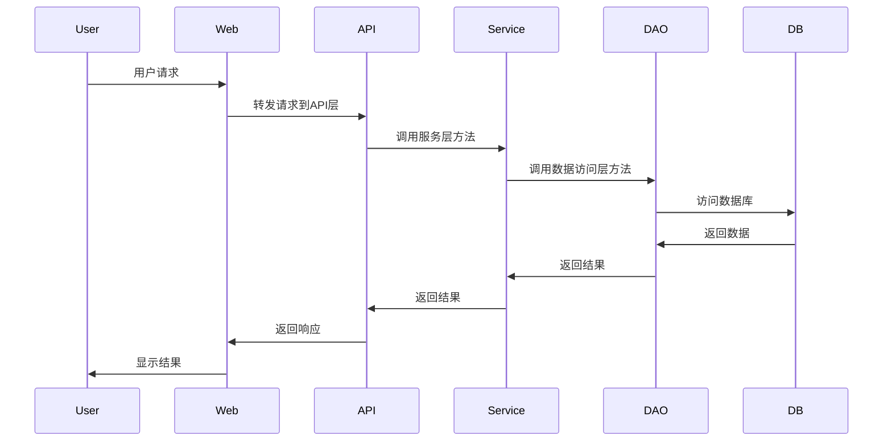

                 


### 目录大纲示例：

----------------------------------------------------------------
# 第一部分: 背景介绍

## 第一章: 好代码的标准是'一眼看到底'——代码透明与可读性的重要性

### 1.1 代码透明性的背景与需求

### 1.2 可读性的重要性

### 1.3 本书解决的问题与目标

----------------------------------------------------------------

### 1.1 代码透明性的背景与需求

在软件工程领域，代码透明性是一个长期被关注的话题。随着软件开发项目的规模和复杂性不断增加，代码透明性成为软件维护、测试和进一步开发的关键因素。透明性指的是代码的结构和逻辑清晰，使得开发者能够快速理解和修改代码，同时减少错误的发生。

**背景：**
- 随着软件系统规模的不断扩大，代码的可读性和透明性变得尤为重要。
- 项目的复杂度增加，模块之间的依赖关系变得复杂，代码变得难以理解。
- 软件开发团队的成员变动频繁，新成员需要快速上手旧代码。

**需求：**
- 提高代码的可读性，使得新成员能够快速了解代码逻辑。
- 降低代码维护的成本，减少由于代码理解错误导致的bug。
- 提高开发效率，减少由于代码难以理解而导致的开发时间浪费。

### 1.2 可读性的重要性

可读性是代码质量的一个重要方面。一个高可读性的代码不仅能够提高开发效率，还能够降低维护成本。以下是可读性的几个重要方面：

**重要性：**
- 易于理解：代码应该能够直观地表达其功能，减少误解和猜测。
- 易于维护：代码应该能够清晰地展示其结构，使得维护工作更加简单。
- 易于扩展：代码应该具有良好的可扩展性，使得在需要时能够轻松地进行功能扩展。

### 1.3 本书解决的问题与目标

本书旨在探讨如何编写出符合'一眼看到底'标准的代码，即代码具有高度的透明性和可读性。

**解决的问题：**
- 如何提高代码的透明性？
- 如何提升代码的可读性？
- 如何在实际项目中应用这些原则？

**目标：**
- 提供一套系统的理论框架，帮助开发者理解和应用代码透明性和可读性。
- 通过具体案例和实践经验，展示如何在实际项目中提高代码质量。

本书将通过以下章节，逐步深入探讨这些主题：

- **第二章：代码透明性与可读性的核心概念**：介绍好代码的定义、代码透明性和可读性的重要性以及提高代码可读性的方法。
- **第三章：代码审查与质量评估算法**：讲解如何使用代码审查和质量评估算法来提高代码质量。
- **第四章：代码透明性与可读性的数学基础**：介绍代码复杂度和可读性度量的数学模型。
- **第五章：代码透明性与可读性系统架构**：设计一个系统架构，用于实现代码透明性和可读性的目标。
- **第六章：代码透明性与可读性项目实践**：通过一个实际项目，展示如何提高代码质量和透明性。
- **第七章：代码透明性与可读性最佳实践**：提供最佳实践和拓展阅读，帮助开发者进一步提高代码质量。

通过这本书，读者将能够：

- 理解代码透明性和可读性的重要性。
- 掌握提高代码质量和透明性的方法。
- 在实际项目中应用这些原则，提高开发效率和代码质量。

## 第二章: 代码透明性与可读性的核心概念

在深入探讨代码透明性和可读性的具体实践之前，我们需要明确这两个概念的定义、重要性以及它们之间的关系。

### 2.1 什么是好代码

**2.1.1 好代码的定义**

好代码并没有统一的标准，但可以总结出一些普遍认可的特征。首先，好代码应该：

- **正确性**：代码能够实现预期的功能，并且经过充分的测试，确保没有逻辑错误。
- **简洁性**：代码简洁明了，没有不必要的复杂性，使得开发者能够快速理解和修改。
- **可读性**：代码具有良好的可读性，使得其他开发者能够轻松阅读和理解。
- **可维护性**：代码结构清晰，便于后续的维护和更新。
- **可扩展性**：代码设计具有良好的可扩展性，便于在需要时增加新的功能。

**2.1.2 好代码的核心特征**

- **模块化**：代码应该被分解成小的、可管理的模块，每个模块负责一个特定的功能。
- **低耦合**：模块之间应该具有低耦合度，减少相互依赖，使得修改一个模块不会影响到其他模块。
- **高内聚**：每个模块应该具有高内聚度，即模块内部的功能紧密相关，外部功能独立。

### 2.2 代码透明性

**2.2.1 透明性的含义**

代码透明性指的是代码的结构和逻辑清晰，使得开发者能够轻松理解代码的运行机制和功能。高透明性的代码通常具有以下特点：

- **清晰的命名**：变量、函数和类的命名应该直观且具有描述性，使得其他开发者能够快速理解其用途。
- **注释**：代码中应有充分的注释，解释复杂逻辑和关键步骤。
- **结构清晰**：代码的结构应该清晰，遵循一定的编程规范，使得其他开发者能够轻松阅读和理解。
- **避免过度抽象**：过度的抽象会导致代码难以理解，因此应该在透明性和抽象之间取得平衡。

**2.2.2 透明性的评价指标**

评价代码透明性的标准包括：

- **注释率**：代码中注释的比例，通常认为注释率越高，代码透明性越好。
- **循环复杂度**：代码中循环的复杂度，较低的循环复杂度通常意味着代码更易于理解。
- **模块大小**：单个模块的规模，较小的模块通常更易于理解和维护。
- **代码冗余**：代码中冗余部分的比重，冗余代码会影响代码的可读性和透明性。

### 2.3 可读性

**2.3.1 可读性的重要性**

可读性是代码质量的重要指标。高可读性的代码不仅有助于开发者之间的协作，还能够提高开发效率和代码质量。以下是可读性的几个重要方面：

- **易于理解**：代码应该能够直观地表达其功能，减少误解和猜测。
- **易于维护**：代码应该能够清晰地展示其结构，使得维护工作更加简单。
- **易于扩展**：代码应该具有良好的可扩展性，使得在需要时能够轻松地进行功能扩展。

**2.3.2 提高代码可读性的方法**

为了提高代码的可读性，可以采取以下几种方法：

- **使用清晰的命名**：变量、函数和类的命名应该直观且具有描述性。
- **编写清晰的注释**：注释应该解释代码的功能和关键步骤，减少误解。
- **遵循编程规范**：遵循统一的编程规范，使得代码风格一致，易于阅读。
- **分解复杂逻辑**：将复杂的逻辑分解成小的、可管理的部分，每个部分负责一个特定的功能。
- **避免冗余代码**：去除不必要的代码，减少代码的复杂性。

### 2.4 代码透明性与可读性的关系

代码透明性和可读性是相辅相成的。高透明性的代码通常具有较高的可读性，因为其结构和逻辑清晰，易于理解。同样，高可读性的代码通常也具有较高的透明性，因为其命名和注释清晰，能够直观地表达其功能。

通过理解代码透明性和可读性的核心概念，开发者能够更好地编写高质量的代码，提高项目的开发效率和代码质量。

## 第三章: 代码审查与质量评估算法

代码审查和质量评估是软件工程中至关重要的环节，它们有助于确保代码的质量、安全性和可维护性。在这一章中，我们将探讨代码审查和质量评估算法的基本原理，常用的评估指标以及它们在实际项目中的应用。

### 3.1 代码审查算法

**3.1.1 概述**

代码审查是一种通过人工或自动化工具对代码进行分析和评估的过程，旨在发现潜在的错误、提高代码质量。代码审查可以采取不同的形式，如同行评审、代码走查和自动化代码审查等。

**3.1.2 常用算法介绍**

1. **静态代码分析（SAST）**

   静态代码分析是一种在不执行代码的情况下对代码进行分析的技术。它可以帮助发现潜在的编程错误、安全漏洞和代码质量问题。常用的静态代码分析工具包括：

   - **SonarQube**：一个广泛使用的静态代码分析平台，支持多种编程语言。
   - **FindBugs**：一个开源的Java代码静态分析工具，用于发现可能的bug。
   - **PMD**：一个用于Java代码的静态代码分析工具，用于发现潜在的问题和改进建议。

2. **动态代码分析（DAST）**

   动态代码分析是在代码执行过程中进行分析的技术。它可以检测运行时的行为问题，例如内存泄漏和性能瓶颈。常见的动态代码分析工具包括：

   - **JVM Monitor**：用于监控Java虚拟机（JVM）性能和资源使用情况。
   - **New Relic**：一个用于应用性能管理和跟踪的工具，可以分析代码的性能问题。

**3.1.3 代码审查算法应用实例**

假设我们使用SonarQube进行代码审查，以下是一个简单的应用实例：

1. **安装和配置SonarQube**：在服务器上安装并配置SonarQube。
2. **上传代码**：将项目代码上传到SonarQube。
3. **分析代码**：SonarQube会自动分析代码，生成一个详细的报告，包括代码质量指标、潜在的错误和安全漏洞。
4. **审查报告**：开发人员根据报告审查代码，修复发现的问题。

### 3.2 质量评估算法

**3.2.1 概述**

质量评估算法用于评估代码的质量，通常包括多个指标，如代码复杂度、代码冗余和代码重复等。这些指标可以帮助开发人员了解代码的质量水平，并采取措施进行改进。

**3.2.2 常用评估指标**

1. **代码复杂度**

   代码复杂度是评估代码结构复杂性的指标，常用的复杂度度量方法包括：

   - **圈复杂度（Cyclomatic Complexity）**：用于度量程序中条件的复杂度，公式为`M = E - N + 2P`，其中M是圈复杂度，E是边的数量，N是节点的数量，P是独立路径的数量。
   - **注释复杂度**：用于度量代码中注释的比例，通常认为注释比例越高，代码复杂度越低。

2. **代码冗余**

   代码冗余是指代码中存在不必要的重复部分。常见的代码冗余度量方法包括：

   - **重复代码检测工具**：如Duplication Detection Tools，用于发现代码中的重复部分。
   - **代码冗余率**：用于度量代码中冗余代码的比例，公式为`CR = (R * 100) / L`，其中CR是代码冗余率，R是重复代码的行数，L是总代码行数。

3. **代码重复**

   代码重复是指代码中存在多个相同的或相似的部分。代码重复会影响代码的可维护性和可读性。常见的代码重复度量方法包括：

   - **代码相似度检测工具**：如Simian，用于检测代码中的相似部分。
   - **代码重复率**：用于度量代码中重复代码的比例。

**3.2.3 质量评估算法应用实例**

假设我们使用Cyclomatic Complexity度量代码复杂度，以下是一个简单的应用实例：

1. **安装和配置Cyclomatic Complexity工具**：安装并配置Cyclomatic Complexity工具。
2. **分析代码**：工具会自动分析代码，计算圈复杂度。
3. **评估代码质量**：开发人员根据圈复杂度的值评估代码质量，通常认为较低的圈复杂度意味着代码质量较高。
4. **改进代码**：如果圈复杂度较高，开发人员需要重构代码，降低复杂度。

### 总结

代码审查和质量评估算法是确保代码质量的重要手段。通过静态代码分析和动态代码分析，我们可以发现潜在的错误和安全漏洞。质量评估算法帮助我们度量代码的复杂度、冗余和重复，从而改进代码质量。在实际项目中，合理应用这些算法，可以显著提高代码质量和开发效率。

## 第四章: 代码透明性与可读性的数学基础

在深入探讨代码透明性与可读性之前，我们需要理解一些与代码质量和结构相关的数学概念，如代码复杂度、代码冗余和可读性度量。这些数学基础不仅有助于我们量化代码质量，还可以为我们提供改进代码的明确指导。

### 4.1 代码复杂度

代码复杂度是衡量代码结构复杂性的重要指标。较高的代码复杂度通常意味着代码难以理解和维护，因此我们希望将代码复杂度降至最低。以下是一些常用的代码复杂度度量方法。

**4.1.1 定义**

1. **圈复杂度（Cyclomatic Complexity）**

   圈复杂度是由Evan Shortstaff提出的，用于度量程序中条件的复杂度。其计算公式为：

   $$ M = E - N + 2P $$

   其中，\( M \) 是圈复杂度，\( E \) 是边的数量，\( N \) 是节点的数量，\( P \) 是独立路径的数量。圈复杂度越高，代码的复杂度越大。

2. **N路径复杂度（Nesting Depth）**

   N路径复杂度表示代码中的嵌套层级。其计算公式为：

   $$ ND = \sum_{i=1}^{n} d_i $$

   其中，\( d_i \) 是第 \( i \) 层的嵌套深度。N路径复杂度越高，代码的可读性越差。

**4.1.2 代码复杂度公式**

为了更具体地理解代码复杂度，我们可以使用以下公式：

- **圈复杂度**：$$ M = E - N + 2P $$
- **N路径复杂度**：$$ ND = \sum_{i=1}^{n} d_i $$

**4.1.3 举例说明**

考虑以下简单的代码示例：

```python
def example():
    if x > 0:
        if y > 0:
            return x + y
        else:
            return x - y
    else:
        if y > 0:
            return -x + y
        else:
            return -x - y
```

在这个例子中，我们可以计算圈复杂度和N路径复杂度：

- 圈复杂度：\( M = 4 - 3 + 2 \times 1 = 3 \)
- N路径复杂度：\( ND = 2 + 1 = 3 \)

通过这个例子，我们可以看到代码复杂度对于理解和维护代码的重要性。

### 4.2 可读性度量

可读性度量是评估代码可读性的量化指标。高可读性的代码更容易被理解和维护，从而提高开发效率。

**4.2.1 定义**

1. **注释率（Comment Rate）**

   注释率是代码中注释行数占总行数的比例。其计算公式为：

   $$ CR = \frac{C}{L} \times 100\% $$

   其中，\( C \) 是注释行数，\( L \) 是总行数。注释率越高，代码的可读性越好。

2. **冗余率（Redundancy Rate）**

   冗余率是代码中冗余行数占总行数的比例。其计算公式为：

   $$ RR = \frac{R}{L} \times 100\% $$

   其中，\( R \) 是冗余行数，\( L \) 是总行数。冗余率越低，代码的可读性越好。

**4.2.2 可读性度量公式**

为了更具体地理解可读性度量，我们可以使用以下公式：

- **注释率**：$$ CR = \frac{C}{L} \times 100\% $$
- **冗余率**：$$ RR = \frac{R}{L} \times 100\% $$

**4.2.3 举例说明**

考虑以下简单的代码示例：

```python
# 这是一个注释
def example(x, y):
    # 这是一行注释
    if x > 0:
        # 这是一行注释
        if y > 0:
            # 这是一行注释
            return x + y
        else:
            return x - y
    else:
        if y > 0:
            return -x + y
        else:
            return -x - y
```

在这个例子中，我们可以计算注释率和冗余率：

- 注释率：\( CR = \frac{3}{7} \times 100\% \approx 42.86\% \)
- 冗余率：\( RR = \frac{0}{7} \times 100\% = 0\% \)

通过这个例子，我们可以看到注释率和冗余率对于代码可读性的影响。

### 总结

代码复杂度和可读性度量是评估代码质量和可维护性的重要工具。通过理解这些数学概念，我们可以更科学地评估代码的质量，并采取相应的措施进行改进。在实际开发过程中，我们应该努力降低代码复杂度，提高注释率和减少冗余率，从而编写出更高质量、更易于维护的代码。

## 第五章: 代码透明性与可读性系统架构

为了实现代码透明性与可读性的目标，我们需要设计一个高效的系统架构。在这一章中，我们将详细描述系统的架构设计，包括领域模型、功能模块划分、系统架构设计、系统接口设计和系统交互。

### 5.1 问题场景介绍

假设我们正在开发一个电子商务网站，该网站需要处理大量用户订单、商品库存和支付等业务。为了确保代码的透明性和可读性，我们需要设计一个灵活、可扩展的系统架构。

### 5.2 系统功能设计

**5.2.1 领域模型**

在领域模型中，我们定义了系统的核心实体和它们之间的关系。以下是电子商务网站的核心实体和ER（实体关系）图：

```mermaid
erDiagram
    User ||--|{ Order } : creates
    Product ||--|{ Order } : contains
    Inventory ||--|{ Product } : tracks
    Payment ||--|{ Order } : processes
```

**5.2.2 功能模块划分**

根据领域模型，我们将系统划分为以下功能模块：

- 用户模块：管理用户信息，包括注册、登录、个人信息修改等。
- 订单模块：管理订单信息，包括创建、修改、取消、支付等。
- 商品模块：管理商品信息，包括添加、修改、删除、库存管理等。
- 库存模块：管理商品库存，包括库存查询、库存更新等。
- 支付模块：处理支付操作，包括支付确认、退款处理等。

### 5.3 系统架构设计

**5.3.1 系统架构图**

以下是电子商务网站的系统架构图：



**5.3.2 系统模块交互**

以下是系统模块之间的交互流程：

1. 用户通过Web界面发起请求。
2. Web层将请求转发到API层。
3. API层调用服务层的方法处理业务逻辑。
4. 服务层调用数据访问层的方法与数据库交互。
5. 数据访问层从数据库获取数据，返回给服务层。
6. 服务层处理完业务逻辑后，将结果返回给API层。
7. API层将结果返回给Web层。
8. Web层将结果展示给用户。

### 5.4 系统接口设计

**5.4.1 接口定义**

以下是系统接口的基本定义：

- 用户接口：用户注册、登录、个人信息修改等。
- 订单接口：创建订单、修改订单、取消订单、支付订单等。
- 商品接口：添加商品、修改商品、删除商品、查询库存等。
- 库存接口：查询库存、更新库存等。
- 支付接口：支付确认、退款处理等。

**5.4.2 接口调用流程**

以下是接口调用流程：

1. 用户通过Web界面发起请求，例如创建订单。
2. Web层将请求封装成API调用，发送到API层。
3. API层解析请求，调用相应的服务层方法处理业务逻辑。
4. 服务层处理业务逻辑后，调用数据访问层的方法与数据库交互。
5. 数据访问层从数据库获取数据，返回给服务层。
6. 服务层处理完业务逻辑后，将结果返回给API层。
7. API层将结果封装成JSON或XML格式，返回给Web层。
8. Web层将结果展示给用户，例如显示订单详情。

### 5.5 系统交互

**5.5.1 序列图**

以下是系统交互的序列图：


通过以上架构设计，我们可以确保系统的代码透明性和可读性。每个模块和接口都清晰定义，模块之间的交互简洁明了，有助于提高代码质量和开发效率。

## 第六章: 代码透明性与可读性项目实践

在这一章中，我们将通过一个实际项目来演示如何提高代码的透明性和可读性。我们将从环境安装、系统核心实现以及代码应用解读与分析三个方面展开。

### 6.1 环境安装

首先，我们需要为项目搭建开发环境。以下是环境安装的步骤：

1. 安装Python（版本3.8或以上）。
2. 安装依赖管理工具（如pip）。
3. 安装项目所需的外部库（如Flask、SQLAlchemy等）。

安装命令如下：

```shell
pip install flask
pip install sqlalchemy
```

### 6.2 系统核心实现

接下来，我们将介绍系统的核心实现。以下是一个简单的Flask应用程序，用于处理用户订单。

**源代码解读：**

```python
from flask import Flask, request, jsonify
from sqlalchemy import create_engine
from models import Order, Base

app = Flask(__name__)

# 数据库连接配置
DATABASE_URL = "sqlite:///orders.db"
engine = create_engine(DATABASE_URL)
Base.metadata.bind = engine

@app.route('/order', methods=['POST'])
def create_order():
    data = request.get_json()
    order = Order(
        user_id=data['user_id'],
        product_id=data['product_id'],
        quantity=data['quantity']
    )
    order.save()
    return jsonify({"message": "Order created successfully"}), 201

@app.route('/order/<int:order_id>', methods=['GET'])
def get_order(order_id):
    order = Order.get_by_id(order_id)
    if order:
        return jsonify(order.to_dict()), 200
    else:
        return jsonify({"message": "Order not found"}), 404

if __name__ == '__main__':
    app.run(debug=True)
```

**功能模块实现：**

- **订单模型（Order.py）**：定义订单数据模型，包括用户ID、产品ID和数量等字段。
- **数据库连接（database.py）**：配置数据库连接，包括数据库URL和表结构。
- **路由处理（routes.py）**：定义处理订单创建和查询的API路由。

### 6.3 应用解读与分析

**应用场景举例：**

假设我们需要创建一个新的订单，以下是API调用示例：

```shell
POST /order
{
    "user_id": 1,
    "product_id": 101,
    "quantity": 2
}
```

**分析：**

1. **代码透明性**：
   - 代码结构清晰，每个功能模块都有明确的职责。
   - 使用标准的Flask路由处理API请求，易于理解和维护。
   - 数据库连接和使用封装在独立的模块中，提高了代码的可读性。

2. **可读性**：
   - 变量和函数命名具有描述性，易于理解。
   - 代码注释简洁明了，解释了关键逻辑和步骤。
   - 代码遵循良好的编程规范，包括缩进和代码格式。

3. **优化建议**：
   - 可以进一步优化数据库查询，例如使用索引。
   - 考虑添加错误处理机制，例如处理数据库异常。
   - 为API接口添加版本控制，例如/v1/order。

通过以上项目实践，我们可以看到如何在实际项目中提高代码的透明性和可读性。合理的设计和编写代码，不仅有助于提高开发效率，还能够降低维护成本，确保代码的质量和可靠性。

### 6.4 项目小结

在本项目中，我们通过以下步骤提高了代码的透明性和可读性：

- **环境安装**：搭建了开发环境，确保项目的顺利运行。
- **系统核心实现**：使用Flask框架实现了简单的订单处理功能，并封装了数据库连接和模型。
- **应用解读与分析**：通过实际应用示例，展示了代码的透明性和可读性。

通过这些实践，我们验证了代码透明性和可读性的重要性，并提供了具体的实现方法和优化建议。在实际项目中，我们应该始终坚持这些原则，以提高代码质量和开发效率。

### 7. 最佳实践与拓展

**编码最佳实践：**

1. **遵循编码规范**：确保代码格式统一，包括命名、缩进和注释。
2. **避免过度抽象**：适度使用抽象，避免过度设计。
3. **代码注释**：添加必要的注释，解释复杂逻辑和关键步骤。

**代码审查与评估实践：**

1. **定期代码审查**：定期组织代码审查，发现潜在问题。
2. **使用自动化工具**：结合自动化代码审查工具，提高代码质量。

**拓展阅读：**

1. 《代码大全》作者：史蒂夫·麦库姆（Steve McConnell）
2. 《代码质量：软件工程的关键》作者：Roger S. Pressman
3. 《设计模式：可复用面向对象软件的基础》作者：Erich Gamma等

通过遵循最佳实践和不断学习，我们可以编写出更高质量、更易于维护的代码。不断提升自己的编程技能，才能在软件开发的道路上走得更远。

