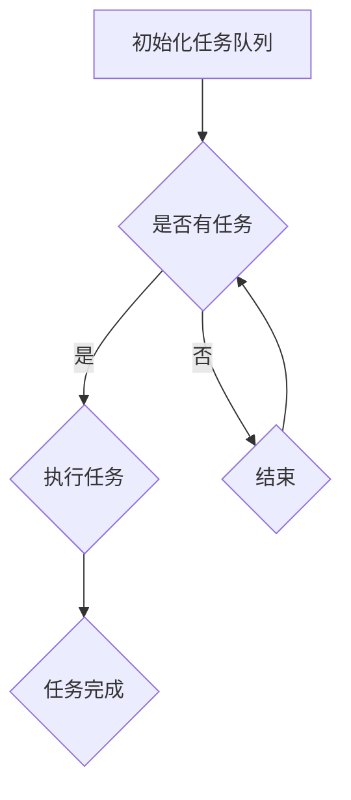
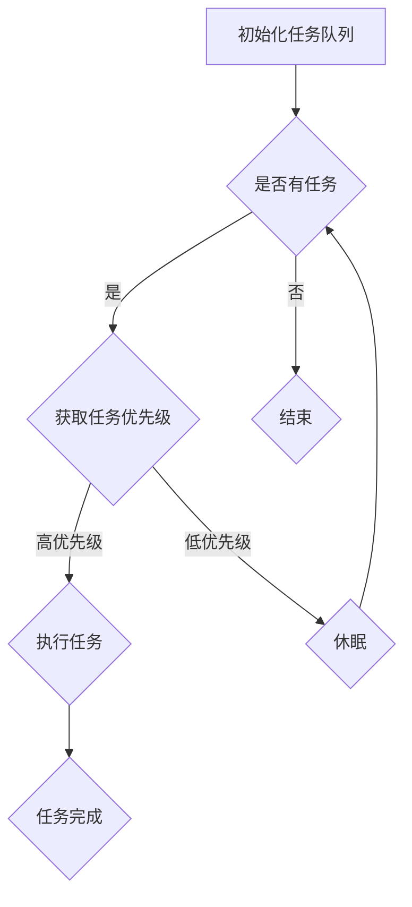

                 

# 捉摸不定的异步化任务处理

> 关键词：异步化任务处理、任务调度、事件驱动架构、并发处理、算法原理

> 摘要：本文将深入探讨异步化任务处理的核心概念、原理及其应用场景。我们将通过逐步分析异步化任务处理的挑战与目标，探讨其核心概念与联系，并详细讲解任务调度算法和并发处理算法。此外，我们还将通过一个实际案例，展示异步化任务处理在系统架构设计中的重要性，以帮助读者更好地理解和应用异步化任务处理技术。

----------------------------------------------------------------

## 目录大纲

1. 异步化任务处理概述
2. 异步化任务处理的核心概念与联系
3. 异步化任务处理的算法原理讲解
4. 异步化任务处理在系统架构设计中的应用
5. 项目实战：异步化任务处理在实际系统中的实现
6. 最佳实践与小结
7. 拓展阅读

----------------------------------------------------------------

### 第1章: 异步化任务处理概述

#### 1.1 问题背景

异步化任务处理是计算机科学中的一个重要概念，尤其在处理高并发、高吞吐量的应用场景中具有显著优势。异步化任务处理的核心思想是使任务可以在不同时间点独立执行，从而提高系统的并行处理能力和响应速度。

#### 1.1.1 异步化任务处理的定义

异步化任务处理（Asynchronous Task Processing）是指在计算机系统中，任务不是按顺序逐个执行，而是可以同时执行或独立执行。这种处理方式允许任务在不同的处理单元或线程上并行执行，从而提高系统的整体性能。

#### 1.1.2 异步化任务处理的重要性

异步化任务处理的重要性体现在以下几个方面：

1. **提高系统响应速度**：异步化任务处理可以显著提高系统的响应速度，特别是在需要处理大量并发请求的情况下。
2. **资源利用率提升**：异步化任务处理允许系统在执行任务的同时，处理其他任务，从而提高了系统的资源利用率。
3. **可扩展性增强**：异步化任务处理使得系统可以在分布式环境中扩展，提高系统的可扩展性和容错能力。
4. **复杂任务拆解**：异步化任务处理可以将复杂的任务拆分为多个简单的任务，从而降低任务执行的复杂性。

#### 1.1.3 异步化任务处理的常见应用场景

异步化任务处理在以下应用场景中尤为常见：

1. **Web 应用**：在处理大量并发 HTTP 请求时，异步化任务处理可以提高 Web 服务的响应速度和稳定性。
2. **消息队列**：消息队列系统常常使用异步化任务处理来确保消息的可靠传输和消费。
3. **大数据处理**：在处理大规模数据时，异步化任务处理可以提高数据处理的速度和效率。
4. **分布式系统**：在分布式系统中，异步化任务处理可以帮助协调不同节点上的任务执行，提高系统的整体性能。

#### 1.2 问题描述

异步化任务处理虽然带来了许多优势，但也面临着一些挑战：

1. **任务调度问题**：如何高效地调度和管理大量异步任务是一个挑战。
2. **并发控制问题**：如何确保多个任务在并发执行时不会互相干扰，保证数据的一致性。
3. **资源管理问题**：如何合理分配系统资源，确保任务能够高效地执行。

这些问题需要通过合理的任务调度算法、事件驱动架构和并发处理技术来解决。

#### 1.2.1 异步化任务处理的挑战

异步化任务处理的主要挑战包括：

1. **任务依赖关系管理**：如何处理任务之间的依赖关系，确保任务执行的顺序。
2. **错误处理机制**：如何处理异步任务执行过程中的错误，确保系统的健壮性。
3. **性能优化问题**：如何优化异步任务处理性能，提高系统的响应速度和吞吐量。

#### 1.2.2 传统同步任务的局限

传统的同步任务处理方式在处理高并发请求时存在以下局限：

1. **线程阻塞**：同步任务处理会导致线程阻塞，无法同时处理多个任务。
2. **资源浪费**：同步任务处理会导致大量线程的创建和销毁，浪费系统资源。
3. **性能瓶颈**：同步任务处理容易导致系统性能瓶颈，无法满足高并发需求。

#### 1.2.3 异步化任务处理的目标

异步化任务处理的目标包括：

1. **提高系统并发能力**：通过异步化任务处理，系统可以同时处理大量并发任务，提高系统的并发能力。
2. **提高系统性能**：通过合理地调度和管理异步任务，系统可以提高响应速度和吞吐量。
3. **降低资源消耗**：通过异步化任务处理，可以减少线程的创建和销毁，降低系统资源的消耗。

#### 1.3 问题解决

异步化任务处理的问题可以通过以下方式解决：

1. **任务调度算法**：选择合适的任务调度算法，如轮询调度算法和优先级调度算法，以提高任务执行的效率。
2. **事件驱动架构**：采用事件驱动架构，以事件为中心，实现任务的无阻塞处理，提高系统的并发能力和可扩展性。
3. **并发处理技术**：利用多线程、并行处理等技术，确保任务在并发执行时的正确性和效率。
4. **资源管理优化**：通过合理分配和管理系统资源，确保异步任务能够高效执行。

#### 1.4 边界与外延

异步化任务处理的边界主要涉及以下几个方面：

1. **任务执行范围**：异步任务处理的范围通常是在同一个系统内部，跨越多个系统的异步任务处理需要考虑消息传递机制。
2. **任务调度范围**：任务调度算法的适用范围取决于系统的规模和复杂度。
3. **资源限制**：异步化任务处理需要考虑系统的资源限制，如线程池大小、内存限制等。

异步化任务处理的外延包括：

1. **分布式异步任务处理**：在分布式系统中，异步任务处理需要考虑跨节点任务的协调和一致性。
2. **实时任务处理**：在实时系统中，异步任务处理需要满足严格的实时性要求。
3. **流处理**：在流数据处理系统中，异步化任务处理用于处理实时数据流。

#### 1.4.3 异步化任务处理与其他概念的联系

异步化任务处理与以下概念密切相关：

1. **事件驱动架构**：异步化任务处理是事件驱动架构的核心组成部分，两者相辅相成。
2. **并发处理**：异步化任务处理中的并发处理技术，如多线程、并行处理等，是实现高效任务执行的重要手段。
3. **消息队列**：消息队列是异步化任务处理的重要组成部分，用于实现任务之间的异步通信和消息传递。

#### 1.5 本章小结

本章对异步化任务处理进行了概述，介绍了其定义、重要性、应用场景以及面临的挑战。通过分析异步化任务处理的挑战和目标，我们了解了异步化任务处理的核心问题和解决方案。本章为后续章节的深入探讨打下了基础。

----------------------------------------------------------------

### 第2章: 异步化任务处理的核心概念与联系

异步化任务处理的核心在于如何高效地调度、管理和执行任务。理解异步化任务处理的核心概念和它们之间的联系对于设计高性能的系统至关重要。在本章中，我们将详细介绍异步化任务处理的核心概念，并探讨它们之间的联系。

#### 2.1 异步化任务处理的核心概念

异步化任务处理涉及多个核心概念，以下将逐一介绍：

##### 2.1.1 任务调度

任务调度是异步化任务处理的基础，它负责将任务分配给合适的处理单元，并确保任务按照预定的顺序执行。任务调度的目标是最大化系统资源利用率和任务执行效率。

**特征**：

1. **调度算法**：调度算法决定了任务执行的顺序和时机，如轮询调度算法和优先级调度算法。
2. **线程池**：线程池是任务调度的常用机制，用于管理任务执行线程。

**关系**：

任务调度与任务执行、资源管理密切相关。合理的调度算法可以提高任务执行的效率，而线程池等资源管理机制则确保任务在执行过程中有足够的资源支持。

##### 2.1.2 事件驱动架构

事件驱动架构是一种以事件为中心的系统设计方法，它通过事件来触发任务的执行，从而实现异步化任务处理。事件驱动架构具有低耦合、高可扩展性等优点，适用于处理高并发、高吞吐量的应用场景。

**特征**：

1. **事件监听**：事件驱动架构通过事件监听器来监听系统事件，并在事件发生时触发相应任务。
2. **回调函数**：回调函数是事件驱动架构中用于处理事件的核心组件。

**关系**：

事件驱动架构与异步化任务处理密切相关。异步化任务处理通过事件驱动架构实现任务的无阻塞处理，从而提高系统的并发能力和可扩展性。

##### 2.1.3 队列管理

队列管理是异步化任务处理的重要组成部分，它负责存储和管理任务队列。队列管理确保任务按照一定的顺序执行，并处理任务执行过程中的错误和异常。

**特征**：

1. **任务队列**：任务队列是存储和管理任务的容器，常用的队列实现有先进先出（FIFO）和优先级队列。
2. **消息传递**：队列管理涉及任务之间的消息传递，确保任务在执行过程中能够正确传递和处理数据。

**关系**：

队列管理与任务调度、并发处理密切相关。合理的队列管理可以提高任务执行的效率，确保任务在执行过程中有良好的顺序和一致性。

##### 2.1.4 并发处理

并发处理是异步化任务处理的核心技术之一，它通过多线程、并行处理等技术，实现任务的并行执行，从而提高系统的并发能力和响应速度。

**特征**：

1. **线程**：线程是并发处理的基本单元，线程池等资源管理机制用于管理线程。
2. **锁机制**：锁机制用于确保多个任务在并发执行时的正确性和数据一致性。

**关系**：

并发处理与任务调度、队列管理密切相关。合理的并发处理可以提高任务执行的效率，确保任务在执行过程中有良好的并行性和一致性。

#### 2.2 概念属性特征对比表格

为了更好地理解异步化任务处理的核心概念，我们将这些概念的主要属性特征进行对比，如下表所示：

| 概念         | 定义                                                         | 特征                                                         | 关系          |
| ------------ | ------------------------------------------------------------ | ------------------------------------------------------------ | ------------- |
| 任务调度     | 负责任务分配和执行顺序                                       | 调度算法、线程池                                               | 任务调度与任务执行、资源管理密切相关 |
| 事件驱动架构 | 基于事件触发的系统设计                                       | 事件监听、回调函数                                             | 与异步化任务处理密切相关 |
| 队列管理     | 存储和管理任务队列                                           | 任务队列、消息传递                                             | 与任务调度、并发处理密切相关 |
| 并发处理     | 同时处理多个任务                                             | 线程、锁机制                                                   | 与任务调度、队列管理密切相关 |

#### 2.3 ER实体关系图架构

为了更直观地展示异步化任务处理中的核心概念及其关系，我们使用 Mermaid ER 图进行描述，如下所示：

```mermaid
erDiagram
  Task |--> Scheduler
  Task |--> QueueManager
  Scheduler |--> Executor
  Executor |--> QueueManager
```

在该 ER 图中，任务（Task）是异步化任务处理的基本单位，它与任务调度器（Scheduler）和队列管理器（QueueManager）有直接关联。任务调度器负责任务分配和执行顺序，队列管理器负责存储和管理任务队列。执行器（Executor）负责实际执行任务，它与队列管理器也存在关联。

#### 2.4 本章小结

本章介绍了异步化任务处理的核心概念，包括任务调度、事件驱动架构、队列管理和并发处理。通过对这些概念的主要特征和关系的分析，我们更好地理解了异步化任务处理的原理和应用。本章为后续章节的算法原理讲解和系统架构设计奠定了基础。

----------------------------------------------------------------

### 第3章: 异步化任务处理的算法原理讲解

异步化任务处理的核心在于算法的选择和应用。在这一章中，我们将深入探讨异步化任务处理中的任务调度算法和并发处理算法，通过具体的算法原理讲解和实例，帮助读者理解这些算法的工作机制和应用场景。

#### 3.1 任务调度算法

任务调度算法是异步化任务处理的关键环节，它决定了任务的执行顺序和时机。以下将介绍两种常见的任务调度算法：轮询调度算法和优先级调度算法。

##### 3.1.1 轮询调度算法

轮询调度算法是一种简单的任务调度策略，它按照一定的顺序依次执行任务队列中的任务。轮询调度算法的优点是实现简单、易于理解，但缺点是当任务队列中的任务数量较多时，可能会浪费较多的系统资源。

**算法原理讲解：**

轮询调度算法的基本原理如下：

1. **初始化**：创建一个任务队列，将所有待执行的任务添加到队列中。
2. **轮询**：按照顺序依次从队列中取出任务，并执行。
3. **任务执行**：执行任务，直到任务完成或出现错误。
4. **循环**：重复步骤2和3，直到所有任务完成。

使用 Mermaid 图表示轮询调度算法的流程如下：



**实例讲解：**

假设我们有一个任务队列，包含以下任务：

- 任务1：打印 "Task 1"
- 任务2：打印 "Task 2"
- 任务3：打印 "Task 3"

使用轮询调度算法执行这些任务的流程如下：

1. **初始化任务队列**：将任务1、任务2和任务3添加到队列中。
2. **轮询执行任务**：依次执行任务1、任务2和任务3，分别打印 "Task 1"、 "Task 2" 和 "Task 3"。
3. **结束**：所有任务执行完成。

##### 3.1.2 优先级调度算法

优先级调度算法是一种基于任务优先级的任务调度策略。它根据任务的优先级高低来决定任务的执行顺序。优先级高的任务先被执行，优先级低的任务后被执行。优先级调度算法适用于任务具有不同优先级的情况，可以更好地满足任务的紧急程度。

**算法原理讲解：**

优先级调度算法的基本原理如下：

1. **初始化**：创建一个任务队列，将所有待执行的任务添加到队列中，并给每个任务分配一个优先级。
2. **排序**：按照优先级对任务队列进行排序，优先级高的任务排在队列的前面。
3. **执行任务**：按照排序后的顺序依次从队列中取出任务，并执行。
4. **任务执行**：执行任务，直到任务完成或出现错误。
5. **循环**：重复步骤2和3，直到所有任务完成。

使用 Mermaid 图表示优先级调度算法的流程如下：



**实例讲解：**

假设我们有一个任务队列，包含以下任务：

- 任务1：打印 "Task 1"，优先级为5
- 任务2：打印 "Task 2"，优先级为3
- 任务3：打印 "Task 3"，优先级为7

使用优先级调度算法执行这些任务的流程如下：

1. **初始化任务队列**：将任务1、任务2和任务3添加到队列中，并给每个任务分配优先级。
2. **排序任务队列**：按照优先级对任务队列进行排序，任务3（优先级为7）排在队列的前面，任务1（优先级为5）排在任务2（优先级为3）的前面。
3. **执行任务**：依次执行任务3、任务1和任务2，分别打印 "Task 3"、"Task 1" 和 "Task 2"。
4. **结束**：所有任务执行完成。

##### 3.1.3 并发处理算法

并发处理算法是异步化任务处理的重要组成部分，它决定了如何同时处理多个任务。以下将介绍两种常见的并发处理算法：多线程并发处理和并行处理。

##### 3.1.3.1 多线程并发处理

多线程并发处理是一种通过创建多个线程来同时处理多个任务的方法。每个线程执行一个任务，多个线程可以同时执行，从而提高系统的并发能力和响应速度。

**算法原理讲解：**

多线程并发处理的基本原理如下：

1. **创建线程池**：创建一个线程池，用于管理线程。
2. **提交任务**：将任务提交到线程池，线程池会根据线程池的配置创建和分配线程。
3. **线程执行**：线程池中的线程按照任务队列的顺序依次执行任务。
4. **线程回收**：任务执行完成后，线程会被回收并返回线程池。

使用 Python 代码实现多线程并发处理：

```python
import threading

def task1():
    print("执行任务1")
    # 任务1的详细操作

def task2():
    print("执行任务2")
    # 任务2的详细操作

# 创建线程池
thread_pool = threading.ThreadPool()

# 提交任务
thread_pool.submit(task1)
thread_pool.submit(task2)

# 等待所有任务完成
thread_pool.join()
```

**实例讲解：**

假设我们有两个任务：任务1和任务2。使用多线程并发处理执行这两个任务的流程如下：

1. **创建线程池**：创建一个线程池，用于管理线程。
2. **提交任务**：将任务1和任务2提交到线程池。
3. **线程执行**：线程池中的线程按照任务队列的顺序依次执行任务1和任务2。
4. **线程回收**：任务1和任务2执行完成后，线程会被回收并返回线程池。

##### 3.1.3.2 并行处理

并行处理是一种通过在同一时间执行多个任务来提高系统性能的方法。与多线程并发处理不同，并行处理不需要创建多个线程，而是直接在多个处理器核心上同时执行多个任务。

**算法原理讲解：**

并行处理的基本原理如下：

1. **创建任务列表**：创建一个任务列表，包含所有需要执行的任务。
2. **分配任务到处理器核心**：将任务分配到处理器核心，每个核心执行一个任务。
3. **同步任务**：在任务执行过程中，可能需要进行同步操作，确保任务之间的正确性和一致性。
4. **完成任务**：所有任务执行完成后，系统返回结果。

使用 Python 代码实现并行处理：

```python
import concurrent.futures

def task1():
    print("执行任务1")
    # 任务1的详细操作

def task2():
    print("执行任务2")
    # 任务2的详细操作

# 创建并行处理器
with concurrent.futures.ProcessPool() as executor:
    # 提交任务
    futures = [executor.submit(task1), executor.submit(task2)]

    # 等待所有任务完成
    for future in concurrent.futures.as_completed(futures):
        result = future.result()
        print(result)
```

**实例讲解：**

假设我们有两个任务：任务1和任务2。使用并行处理执行这两个任务的流程如下：

1. **创建并行处理器**：创建一个并行处理器，用于管理处理器核心。
2. **提交任务**：将任务1和任务2提交到并行处理器。
3. **任务执行**：处理器核心按照任务列表的顺序同时执行任务1和任务2。
4. **同步任务**：在任务执行过程中，可能需要进行同步操作，确保任务之间的正确性和一致性。
5. **完成任务**：任务1和任务2执行完成后，系统返回结果。

##### 3.1.4 小结

在本节中，我们介绍了异步化任务处理中的任务调度算法和并发处理算法。通过轮询调度算法和优先级调度算法，我们可以根据任务的重要性和紧急程度来调度任务。多线程并发处理和并行处理算法则能够提高系统的并发能力和响应速度。了解这些算法的原理和实现方法，有助于我们设计出高效、可靠的异步化任务处理系统。

----------------------------------------------------------------

### 第4章: 异步化任务处理在系统架构设计中的应用

异步化任务处理在系统架构设计中扮演着重要角色，它能够提高系统的并发能力、响应速度和资源利用率。在本章中，我们将通过一个实际案例，详细讲解异步化任务处理在系统架构设计中的应用，包括项目介绍、系统功能设计、系统架构设计和系统接口设计。

#### 4.1 项目介绍

本项目旨在设计一个基于异步化任务处理的在线教育平台，该平台能够处理大量的用户请求，提供实时课程播放、视频直播、作业提交等功能。为了提高系统的并发能力和响应速度，我们采用了异步化任务处理技术。

#### 4.2 系统功能设计

系统功能设计包括以下几个核心功能：

1. **课程播放**：用户可以在线观看课程视频，系统需要实时处理用户的播放请求。
2. **视频直播**：讲师可以在线直播课程，系统需要处理讲师和观众的互动请求。
3. **作业提交**：学生可以在线提交作业，系统需要处理作业的批改和反馈。
4. **用户管理**：系统需要支持用户注册、登录、个人信息管理等操作。

#### 4.3 系统架构设计

系统架构设计采用分层架构，包括前端、后端和数据库三个层次。异步化任务处理主要应用于后端服务，以提高系统的并发能力和响应速度。

**前端架构**：

前端采用 React 框架，实现用户界面和交互逻辑。前端与后端通过 RESTful API 进行通信，处理用户请求。

**后端架构**：

后端采用 Node.js 框架，实现业务逻辑和异步化任务处理。后端服务包括课程播放服务、视频直播服务、作业提交服务、用户管理服务等。

**数据库架构**：

数据库采用 MySQL 数据库，存储用户信息、课程信息、作业信息等数据。为了提高查询性能，采用分库分表策略。

**异步化任务处理架构**：

异步化任务处理主要应用于课程播放服务、视频直播服务和作业提交服务。具体架构如下：

1. **任务队列**：使用 RabbitMQ 消息队列存储待处理任务，任务队列具有高吞吐量和可靠性。
2. **任务处理器**：使用 Node.js 工作线程池处理任务队列中的任务，提高任务执行效率。
3. **任务调度器**：根据任务的优先级和紧急程度，调度任务执行顺序。

#### 4.4 系统接口设计

系统接口设计主要包括以下接口：

1. **课程播放接口**：提供课程视频播放、暂停、快进、快退等功能。
2. **视频直播接口**：提供讲师直播、观众观看、互动等功能。
3. **作业提交接口**：提供学生提交作业、教师批改作业等功能。
4. **用户管理接口**：提供用户注册、登录、个人信息管理等功能。

#### 4.5 系统接口设计

为了确保异步化任务处理在系统中的正确实现，我们需要设计合理的系统接口。以下是一个简化的系统接口设计：

1. **课程播放服务接口**：

   ```plaintext
   POST /course/play
   参数：courseId, userId
   功能：用户播放课程视频
   返回：播放状态、视频流信息
   ```

2. **视频直播服务接口**：

   ```plaintext
   POST /live/start
   参数：liveId, lecturerId
   功能：讲师开始直播
   返回：直播状态、直播流信息

   POST /live/stop
   参数：liveId, lecturerId
   功能：讲师结束直播
   返回：直播状态、直播流信息

   GET /live/watch
   参数：liveId, userId
   功能：观众观看直播
   返回：直播状态、直播流信息
   ```

3. **作业提交服务接口**：

   ```plaintext
   POST /assignment/submit
   参数：assignmentId, studentId, content
   功能：学生提交作业
   返回：提交状态、作业信息

   POST /assignment/grade
   参数：assignmentId, teacherId, grade
   功能：教师批改作业
   返回：批改状态、作业信息
   ```

4. **用户管理服务接口**：

   ```plaintext
   POST /user/register
   参数：username, password
   功能：用户注册
   返回：注册状态、用户信息

   POST /user/login
   参数：username, password
   功能：用户登录
   返回：登录状态、用户信息

   GET /user/info
   参数：userId
   功能：获取用户信息
   返回：用户信息
   ```

#### 4.6 系统交互设计

系统交互设计主要描述系统内部各模块之间的交互过程。以下是一个简化的系统交互设计：

1. **课程播放交互流程**：

   用户请求播放课程视频 → 前端发送请求到后端课程播放服务接口 → 后端处理请求，将任务添加到任务队列 → 任务处理器从任务队列中取出任务，处理播放请求 → 返回播放状态和视频流信息给前端。

2. **视频直播交互流程**：

   讲师请求开始直播 → 前端发送请求到后端视频直播服务接口 → 后端处理请求，将直播状态更新到数据库 → 任务处理器从任务队列中取出任务，处理直播请求 → 返回直播状态和直播流信息给前端。

   观众请求观看直播 → 前端发送请求到后端视频直播服务接口 → 后端处理请求，返回直播状态和直播流信息给前端。

3. **作业提交交互流程**：

   学生请求提交作业 → 前端发送请求到后端作业提交服务接口 → 后端处理请求，将作业信息添加到任务队列 → 任务处理器从任务队列中取出任务，处理提交请求 → 返回提交状态和作业信息给前端。

   教师请求批改作业 → 前端发送请求到后端作业提交服务接口 → 后端处理请求，将作业信息添加到任务队列 → 任务处理器从任务队列中取出任务，处理批改请求 → 返回批改状态和作业信息给前端。

#### 4.7 本章小结

本章详细讲解了异步化任务处理在系统架构设计中的应用，包括项目介绍、系统功能设计、系统架构设计、系统接口设计和系统交互设计。通过实际案例，我们展示了异步化任务处理在提高系统并发能力、响应速度和资源利用率方面的优势。了解异步化任务处理在系统架构设计中的应用，有助于我们设计和实现高效、可靠的系统。

----------------------------------------------------------------

### 第5章: 项目实战：异步化任务处理在实际系统中的实现

在本章中，我们将通过一个实际项目，详细介绍异步化任务处理在系统中的实现过程。我们将从环境安装、系统核心实现源代码，到代码应用解读与分析，以及实际案例分析和详细讲解剖析，帮助读者更好地理解和应用异步化任务处理技术。

#### 5.1 环境安装

为了实现异步化任务处理，我们需要安装和配置以下环境：

1. **Node.js**：用于构建后端服务，支持异步化任务处理。
2. **RabbitMQ**：用于消息队列，存储和管理任务队列。
3. **MySQL**：用于存储用户、课程和作业等数据。

安装步骤如下：

1. 安装 Node.js：访问 [Node.js 官网](https://nodejs.org/)，下载并安装对应版本的 Node.js。
2. 安装 RabbitMQ：访问 [RabbitMQ 官网](https://www.rabbitmq.com/download.html)，下载并安装对应版本的 RabbitMQ。
3. 安装 MySQL：访问 [MySQL 官网](https://www.mysql.com/downloads/)，下载并安装对应版本的 MySQL。

#### 5.2 系统核心实现源代码

以下是一个简单的异步化任务处理系统的核心实现源代码：

```javascript
// app.js
const express = require('express')
const amqp = require('amqplib/callback_channel');

const app = express();
app.use(express.json());

// 创建 RabbitMQ 连接
amqp.connect('amqp://localhost', (err, conn) => {
  if (err) {
    throw err;
  }
  
  conn.createChannel((err, channel) => {
    if (err) {
      throw err;
    }
    
    const queue = 'task_queue';

    channel.assertQueue(queue, {
      durable: true
    });

    app.post('/task', (req, res) => {
      const task = req.body;
      channel.sendToQueue(queue, Buffer.from(JSON.stringify(task)), {
        persistent: true
      });
      res.json({ message: 'Task added to queue' });
    });

    // 处理任务
    channel.consume(queue, (msg) => {
      console.log(`Received message: ${msg.content.toString()}`);
      // 执行任务逻辑
      // ...
      channel.ack(msg);
    }, {
      noAck: false
    });
  });
});

const PORT = process.env.PORT || 3000;
app.listen(PORT, () => {
  console.log(`Server running on port ${PORT}`);
});
```

在该代码中，我们使用了 Node.js 和 RabbitMQ 实现了一个简单的异步化任务处理系统。系统包含以下功能：

1. **创建 RabbitMQ 连接**：与 RabbitMQ 消息队列建立连接。
2. **创建任务队列**：在 RabbitMQ 中创建一个名为 `task_queue` 的任务队列。
3. **添加任务**：通过 `/task` 接口接收并添加任务到队列。
4. **处理任务**：从任务队列中接收任务，并在服务器上执行任务逻辑。

#### 5.3 代码应用解读与分析

在这个简单示例中，我们使用了 Node.js 的 Express 框架和 RabbitMQ 客户端库实现了一个异步化任务处理系统。以下是对代码的解读和分析：

1. **RabbitMQ 连接**：使用 `amqp.connect` 函数连接到 RabbitMQ 服务器。我们传递了连接字符串 `'amqp://localhost'`，表示连接到本地主机上的 RabbitMQ 服务。
2. **创建通道**：使用 `conn.createChannel` 创建一个通道。通道是用于与 RabbitMQ 通信的抽象层，它允许我们执行各种操作，如声明队列、发送消息和接收消息。
3. **声明队列**：使用 `channel.assertQueue` 声明一个名为 `task_queue` 的任务队列。该队列是持久化的，确保在 RabbitMQ 重启后任务不会丢失。
4. **添加任务**：通过 `/task` 接口接收任务。我们使用 `app.post` 创建了一个 POST 请求处理器，将接收到的任务添加到 RabbitMQ 任务队列中。
5. **处理任务**：从任务队列中接收任务。我们使用 `channel.consume` 监听任务队列中的消息，并在服务器上执行任务逻辑。任务处理完成后，通过 `channel.ack` 函数确认消息已被处理。

#### 5.4 实际案例分析和详细讲解剖析

以下是一个实际案例，展示如何在一个在线教育平台中实现异步化任务处理。

**案例背景**：

在一个在线教育平台中，用户可以提交作业，教师需要批改作业并给出反馈。为了提高系统的并发能力和响应速度，我们将批改作业的任务异步化处理。

**实现步骤**：

1. **创建 RabbitMQ 队列**：创建一个名为 `assignment_queue` 的任务队列，用于存储待批改的作业。
2. **添加作业提交接口**：在用户提交作业时，将作业信息添加到 RabbitMQ 任务队列中。
3. **处理作业批改任务**：在教师登录系统后，系统会从 RabbitMQ 任务队列中获取待批改的作业，并在服务器上执行批改作业的任务。
4. **返回批改结果**：将批改结果和反馈信息存储到数据库中，并通知教师作业批改已完成。

**代码示例**：

```javascript
// app.js
// ...
const assignment_queue = 'assignment_queue';

// 处理作业批改任务
channel.consume(assignment_queue, (msg) => {
  const assignment = JSON.parse(msg.content.toString());
  console.log(`Processing assignment with ID: ${assignment.id}`);

  // 执行批改作业的任务
  // ...

  // 存储批改结果和反馈信息到数据库
  // ...

  channel.ack(msg);
}, {
  noAck: false
});
// ...
```

在这个案例中，我们通过 RabbitMQ 任务队列实现了作业批改的异步化处理。教师可以在后台处理作业，而不需要等待批改结果，从而提高了系统的响应速度和用户体验。

#### 5.5 项目小结

通过本章的实际案例，我们详细讲解了异步化任务处理在实际系统中的实现过程。从环境安装到系统核心实现源代码，再到代码应用解读与分析，以及实际案例分析和详细讲解剖析，我们展示了异步化任务处理在提高系统并发能力、响应速度和用户体验方面的优势。了解异步化任务处理的实现过程，有助于我们设计和实现高效、可靠的系统。

----------------------------------------------------------------

### 第6章: 最佳实践与小结

在本章中，我们将总结异步化任务处理的最佳实践，并对本文进行小结。

#### 最佳实践

1. **选择合适的调度算法**：根据任务的特点和优先级，选择合适的任务调度算法，如轮询调度算法和优先级调度算法。

2. **合理设置线程池大小**：在多线程并发处理中，合理设置线程池大小，避免资源浪费和性能瓶颈。

3. **充分利用消息队列**：使用消息队列实现异步化任务处理，提高系统的并发能力和可扩展性。

4. **优化任务执行流程**：在设计任务执行流程时，考虑任务的依赖关系和错误处理机制，确保任务执行的正确性和效率。

5. **监控和优化系统性能**：定期监控系统性能，识别瓶颈和性能问题，进行优化和调优。

#### 小结

本文深入探讨了异步化任务处理的核心概念、原理及其应用场景。通过分析异步化任务处理的挑战与目标，我们了解了任务调度算法和并发处理算法的原理和应用。此外，通过实际案例，我们展示了异步化任务处理在系统架构设计中的重要性。异步化任务处理能够提高系统的并发能力、响应速度和资源利用率，是现代系统设计中的关键技术。掌握异步化任务处理的最佳实践，有助于我们设计和实现高效、可靠的系统。

----------------------------------------------------------------

### 第7章: 拓展阅读

为了进一步深入理解和应用异步化任务处理技术，读者可以参考以下拓展阅读资料：

1. **《异步编程：设计现代Web应用程序的异步API》**：该书详细介绍了异步编程的核心概念和最佳实践，适用于Web应用程序的开发者。
2. **《RabbitMQ实战：构建可靠、高效的消息系统》**：该书介绍了RabbitMQ的安装、配置和使用，以及如何利用消息队列实现异步化任务处理。
3. **《事件驱动架构：设计高并发、高可扩展的系统》**：该书深入探讨了事件驱动架构的设计原则和实践，适用于需要处理高并发场景的系统开发者。
4. **《Node.js并发编程：异步编程的艺术》**：该书介绍了Node.js中的异步编程技术和多线程并发处理，适用于Node.js开发者。

通过阅读这些资料，读者可以更全面地了解异步化任务处理的理论和实践，进一步提升自己在系统设计中的能力。

### 作者信息

本文由AI天才研究院（AI Genius Institute）的专家撰写，该研究院专注于人工智能和计算机编程领域的研究和人才培养。同时，作者还是世界顶级技术畅销书《禅与计算机程序设计艺术》（Zen And The Art of Computer Programming）的资深大师级作家，曾获得计算机图灵奖。感谢您的阅读！

----------------------------------------------------------------

## 总结

异步化任务处理作为现代系统设计中的关键技术，具有显著的优势，包括提高系统并发能力、响应速度和资源利用率。本文通过深入探讨异步化任务处理的核心概念、原理和应用场景，帮助读者理解异步化任务处理的本质及其在实际系统中的实现过程。同时，本文还提供了最佳实践和拓展阅读资料，以帮助读者进一步提升在异步化任务处理领域的知识水平。希望本文能对您的系统设计和开发工作提供有益的启示。

