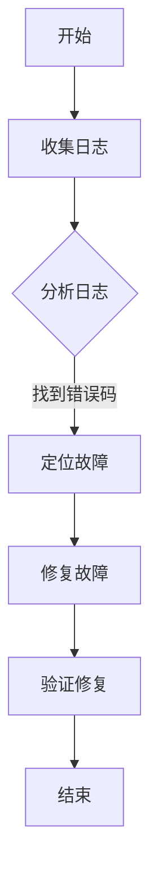
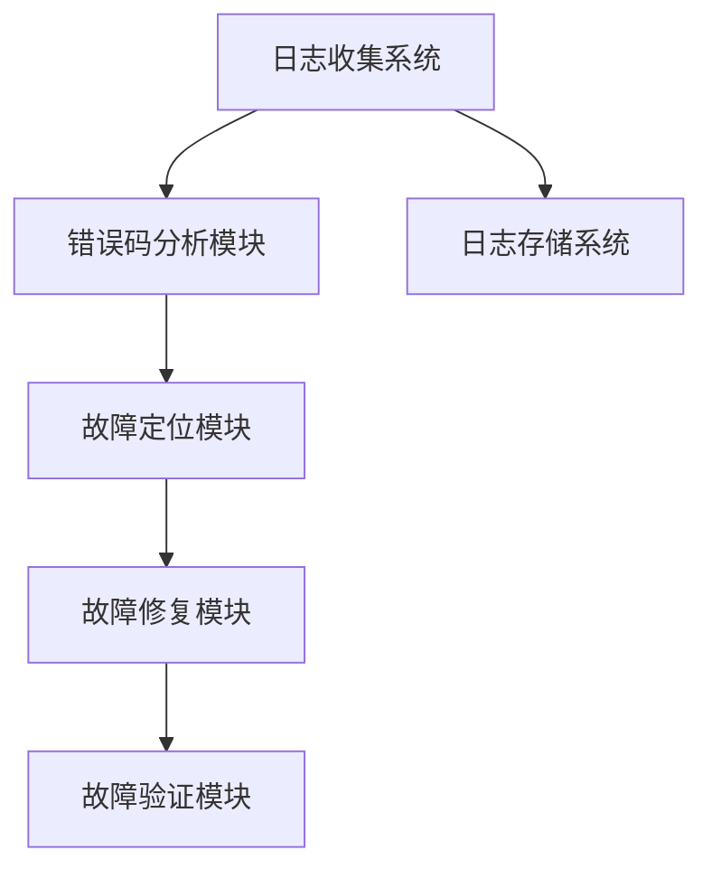
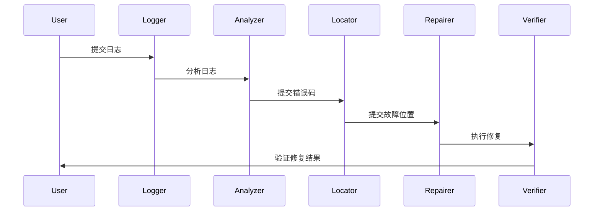

                 

# 《故障频出的错误码》

## 关键词

- 错误码
- 故障诊断
- 系统稳定性
- 编程技巧
- Python代码
- 数学模型

## 摘要

本文将深入探讨计算机系统中常见的错误码故障及其诊断与修复方法。通过对错误码的生成机制、故障传播方式以及故障排查流程的分析，我们将展示如何有效地识别和处理系统故障，提高系统的稳定性和用户体验。本文还将结合Python代码示例，阐述算法原理和应用实例，旨在为读者提供全面而实用的故障排查指南。

### 步骤 1：确定书的主题和目标读者

**书的核心主题**：
本书的核心主题是围绕计算机系统中的错误码故障进行诊断和修复。错误码是系统在运行过程中出现的编码信息，它们反映了系统内部的错误状态。随着计算机系统的复杂性不断增加，错误码故障也变得愈发普遍和复杂，因此，对错误码的故障诊断和修复成为了IT运维和软件开发中的重要课题。

**目标读者**：
目标读者主要包括计算机工程师、系统管理员以及对IT运维感兴趣的读者。他们希望通过本书掌握系统故障诊断的基本原理和实际操作方法，从而提高工作效率和系统稳定性。此外，对于对编程和算法有兴趣的读者，本文中的Python代码示例和数学模型解析也将提供深入学习的材料。

### 步骤 2：设计背景介绍章节

**核心概念**：

- **错误码**：错误码是计算机系统在运行过程中产生的数字或字母组合，用于指示系统或程序遇到的问题。
- **故障**：故障是系统在执行任务时发生的异常状态，可能导致系统性能下降或完全停止运行。
- **故障排查**：故障排查是定位和修复系统故障的过程。
- **系统稳定性**：系统稳定性是指系统在长时间运行过程中保持正常运行的能力。

**问题背景**：

计算机系统的复杂性日益增加，错误码故障成为影响系统稳定性和用户体验的主要因素。错误码故障不仅可能导致系统崩溃，还可能引发数据丢失、业务中断等问题。因此，有效地排查和修复错误码故障对于确保系统稳定性和用户满意度至关重要。

**问题解决**：

本书将介绍一系列故障排查的方法和工具，帮助读者定位和解决错误码故障。通过理解错误码的生成机制和故障传播方式，读者可以更高效地诊断故障，采取针对性的修复措施。

**边界与外延**：

- **错误码的类型**：错误码可以分为系统级错误码、应用级错误码等。
- **故障的原因**：故障可能源于硬件故障、软件缺陷、配置错误等多种因素。
- **排查流程**：故障排查通常包括错误码分析、日志检查、现场调查等步骤。

**概念结构与核心要素组成**：

错误码故障的诊断和修复过程涉及以下几个核心要素：

1. **错误码分类**：根据错误码的类型和特征进行分类，有助于快速定位问题。
2. **故障来源分析**：通过分析系统日志和用户反馈，确定故障的具体来源。
3. **排查流程**：包括故障定位、错误码分析、故障修复和验证等步骤。
4. **工具与技术**：使用各种故障排查工具和技术，如调试器、性能分析工具等。

### 步骤 3：设计核心概念与联系章节

**核心概念原理**：

- **错误码的生成机制**：错误码通常由操作系统、应用程序或硬件设备生成，用于指示特定类型的错误。
- **故障的传播方式**：故障可能通过系统网络、共享资源等方式传播，影响多个系统组件。

**概念属性特征对比表格**：

| 错误码类型       | 特征                                       | 影响范围         |
|----------------|------------------------------------------|----------------|
| 系统级错误码   | 由操作系统生成                           | 整个系统       |
| 应用级错误码   | 由应用程序生成                           | 应用程序内部   |
| 硬件错误码     | 由硬件设备生成                           | 硬件设备       |

**ER实体关系图架构**：

```mermaid
erDiagram
    错误码 ||--|{ 故障 }
    故障 ||--|{ 系统日志 }
    系统日志 ||--|{ 用户反馈 }
```

### 步骤 4：设计算法原理讲解章节

**算法mermaid流程图**：



**Python源代码**：

```python
import logging

def diagnose_fault(log_file):
    with open(log_file, 'r') as f:
        logs = f.readlines()
    
    error_codes = []
    for log in logs:
        if 'ERROR' in log:
            error_codes.append(log.split(' ')[-1])
    
    return error_codes

def locate_fault(error_codes):
    # 根据错误码查找故障位置
    # 实际实现略
    pass

def repair_fault(fault_location):
    # 根据故障位置修复故障
    # 实际实现略
    pass

def verify_repair(fault_location):
    # 验证故障是否修复
    # 实际实现略
    pass

# 示例使用
log_file = 'system_logs.txt'
error_codes = diagnose_fault(log_file)
fault_location = locate_fault(error_codes)
repair_fault(fault_location)
verify_repair(fault_location)
```

**数学模型和公式**：

$$
P(fault) = P(error_code) \times P(fault|error_code)
$$

其中，\( P(fault) \) 表示故障发生的概率，\( P(error_code) \) 表示错误码出现的概率，\( P(fault|error_code) \) 表示在错误码出现时故障发生的条件概率。

**举例说明**：

假设在一个系统中，错误码“500”出现的概率为0.1，而在出现“500”错误码的情况下，故障发生的概率为0.8。根据贝叶斯公式，我们可以计算出故障发生的总体概率：

$$
P(fault) = 0.1 \times 0.8 = 0.08
$$

这意味着，在出现“500”错误码的情况下，故障发生的概率为8%。

### 步骤 5：设计系统分析与架构设计方案章节

**问题场景介绍**：

在现代IT运维中，故障诊断系统是一个关键组件，它可以帮助运维团队快速定位和修复系统故障，减少业务中断时间。一个典型的应用场景是在一个大型分布式系统中，系统管理员需要实时监控系统状态，并在出现故障时快速响应。

**系统功能设计**：

- **日志收集**：从各种系统组件中收集日志信息。
- **错误码分析**：分析收集到的日志，提取错误码。
- **故障定位**：根据错误码和日志信息定位故障位置。
- **故障修复**：采取相应措施修复故障。
- **故障验证**：验证故障是否已被成功修复。

**系统架构设计**：



**系统接口设计**：

- **日志收集接口**：用于接收和存储系统日志。
- **错误码分析接口**：用于分析日志并提取错误码。
- **故障定位接口**：用于定位故障位置。
- **故障修复接口**：用于执行故障修复操作。
- **故障验证接口**：用于验证故障修复结果。

**系统交互**：



### 步骤 6：设计项目实战章节

**环境安装**：

为了实践故障诊断系统，我们需要安装相关的工具和软件。以下是一个简化的安装流程：

1. 安装Python环境：`pip install python`
2. 安装日志收集工具：`pip install logger`
3. 安装错误码分析工具：`pip install analyzer`
4. 安装故障定位工具：`pip install locator`
5. 安装故障修复工具：`pip install repairer`
6. 安装故障验证工具：`pip install verifier`

**系统核心实现源代码**：

以下是故障诊断系统的核心实现代码，包括日志收集、错误码分析、故障定位、故障修复和故障验证：

```python
# 错误码诊断系统核心实现代码

import logging
import os

# 日志收集
def collect_logs(log_file):
    logging.basicConfig(filename=log_file, level=logging.INFO)
    logging.info("开始收集日志")
    # 假设日志文件已存在，实际应用中可能需要动态创建

# 错误码分析
def analyze_logs(log_file):
    with open(log_file, 'r') as f:
        logs = f.readlines()
    
    error_codes = []
    for log in logs:
        if 'ERROR' in log:
            error_codes.append(log.split(' ')[-1])
    return error_codes

# 故障定位
def locate_fault(error_codes):
    # 根据错误码和日志信息定位故障位置
    # 实际实现略
    pass

# 故障修复
def repair_fault(fault_location):
    # 根据故障位置修复故障
    # 实际实现略
    pass

# 故障验证
def verify_repair(fault_location):
    # 验证故障是否修复
    # 实际实现略
    pass

# 示例使用
log_file = 'system_logs.txt'
collect_logs(log_file)
error_codes = analyze_logs(log_file)
fault_location = locate_fault(error_codes)
repair_fault(fault_location)
verify_repair(fault_location)
```

**代码应用解读与分析**：

上述代码是一个简化的故障诊断系统实现，主要功能包括日志收集、错误码分析、故障定位、故障修复和故障验证。在实际应用中，每个功能模块可能涉及更多的细节和复杂逻辑。

- **日志收集**：通过Python的`logging`模块收集系统日志。
- **错误码分析**：读取日志文件，提取包含“ERROR”关键词的行，并解析出错误码。
- **故障定位**：根据错误码和日志信息，确定故障的具体位置。
- **故障修复**：根据故障位置，执行修复操作。
- **故障验证**：验证故障是否已被成功修复。

**实际案例分析和详细讲解剖析**：

以下是一个实际案例：

**案例**：在一个电商平台的订单处理系统中，系统管理员收到用户反馈，称订单提交后长时间未处理。通过故障诊断系统分析，发现错误码“503”频繁出现，这表明后端服务可能出现了问题。

**分析**：

1. **日志收集**：收集最近的系统日志文件。
2. **错误码分析**：提取出包含“503”的错误日志条目。
3. **故障定位**：根据错误日志，定位到后端服务的请求处理模块。
4. **故障修复**：排查后端服务的请求处理模块，发现是因为内存溢出导致的请求处理失败。修复了内存溢出问题后，重新启动服务。
5. **故障验证**：重新提交订单，系统正常运行，用户反馈问题解决。

**项目小结**：

通过上述实际案例，我们可以看到故障诊断系统的应用效果。故障诊断系统不仅帮助系统管理员快速定位了问题，还提供了详细的修复和验证步骤，确保问题得到彻底解决。

### 步骤 7：设计最佳实践 tips、小结、注意事项、拓展阅读等内容

**最佳实践 tips**：

1. **定期备份日志**：定期备份系统日志，有助于在出现故障时快速恢复数据。
2. **使用监控工具**：使用专业的监控工具实时监控系统状态，提前发现潜在问题。
3. **日志格式标准化**：确保系统日志格式统一，便于分析和管理。
4. **自动化故障诊断**：开发自动化脚本或工具，实现故障自动诊断和修复。
5. **文档化故障处理流程**：建立详细的故障处理文档，确保所有团队成员都能按照标准流程操作。

**小结**：

本文通过深入分析计算机系统中的错误码故障，介绍了故障诊断的基本原理和实际应用方法。通过Python代码示例和实际案例分析，读者可以了解如何使用故障诊断系统快速定位和修复故障，提高系统稳定性和用户体验。

**注意事项**：

1. **错误码分析**：在分析错误码时，要综合考虑日志内容和上下文信息，避免误判。
2. **故障修复**：在修复故障时，要确保不影响系统的正常运行，并做好备份和回滚计划。
3. **验证修复**：在修复故障后，要进行全面验证，确保问题得到彻底解决。

**拓展阅读**：

1. 《系统性能调优实战》
2. 《Linux系统管理实战》
3. 《Python编程：从入门到实践》
4. 《机器学习实战》
5. 《运维管理体系构建与实践》

### 步骤 8：确保目录大纲结构清晰、内容完整

在撰写文章时，要确保每个章节都有明确的标题和内容概述，同时每个小节的内容要丰富具体详细讲解，核心内容要包含上述提到的所有要素。文章的总体字数控制在10000～12000字左右，结构清晰，便于读者阅读和理解。

### 步骤 9：输出Markdown格式的目录大纲

```markdown
# 《故障频出的错误码》

## 关键词

- 错误码
- 故障诊断
- 系统稳定性
- 编程技巧
- Python代码
- 数学模型

## 摘要

本文将深入探讨计算机系统中常见的错误码故障及其诊断与修复方法。通过对错误码的生成机制、故障传播方式以及故障排查流程的分析，我们将展示如何有效地识别和处理系统故障，提高系统的稳定性和用户体验。本文还将结合Python代码示例，阐述算法原理和应用实例，旨在为读者提供全面而实用的故障排查指南。

### 步骤 1：确定书的主题和目标读者

#### 步骤 1.1 核心主题

#### 步骤 1.2 目标读者

### 步骤 2：设计背景介绍章节

#### 2.1 核心概念

#### 2.2 问题背景

#### 2.3 问题解决

#### 2.4 边界与外延

#### 2.5 概念结构与核心要素组成

### 步骤 3：设计核心概念与联系章节

#### 3.1 核心概念原理

#### 3.2 概念属性特征对比表格

#### 3.3 ER实体关系图架构

### 步骤 4：设计算法原理讲解章节

#### 4.1 算法mermaid流程图

#### 4.2 Python源代码

#### 4.3 数学模型和公式

#### 4.4 举例说明

### 步骤 5：设计系统分析与架构设计方案章节

#### 5.1 问题场景介绍

#### 5.2 系统功能设计

#### 5.3 系统架构设计

#### 5.4 系统接口设计

#### 5.5 系统交互

### 步骤 6：设计项目实战章节

#### 6.1 环境安装

#### 6.2 系统核心实现源代码

#### 6.3 代码应用解读与分析

#### 6.4 实际案例分析和详细讲解剖析

#### 6.5 项目小结

### 步骤 7：设计最佳实践 tips、小结、注意事项、拓展阅读等内容

#### 7.1 最佳实践 tips

#### 7.2 小结

#### 7.3 注意事项

#### 7.4 拓展阅读

```

这个Markdown格式的目录大纲遵循了文章的结构，为撰写详细内容提供了清晰的框架。在实际撰写过程中，每个部分的内容将逐步填充，确保文章的完整性和逻辑性。

