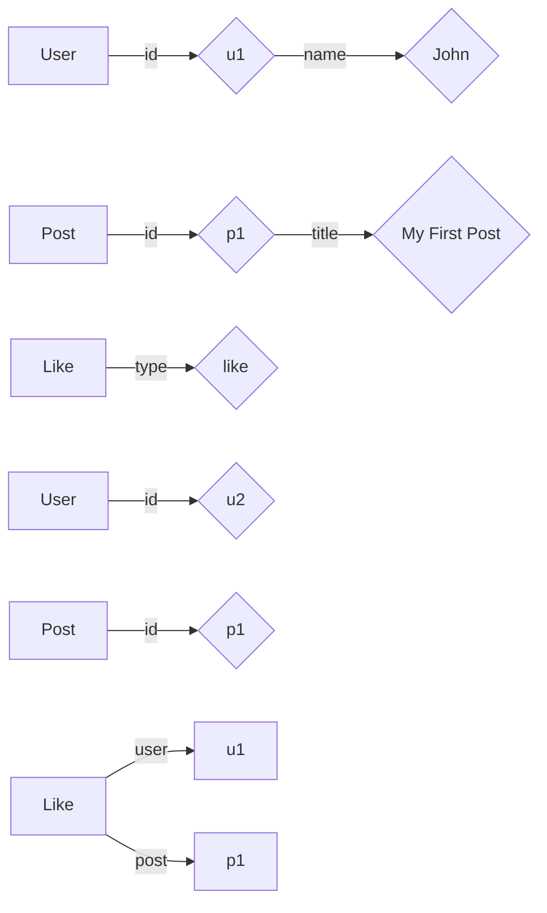
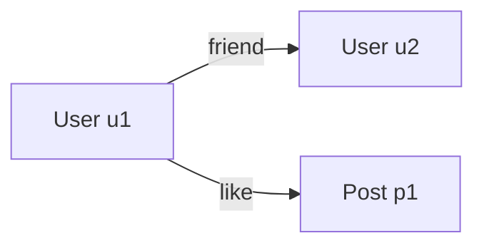
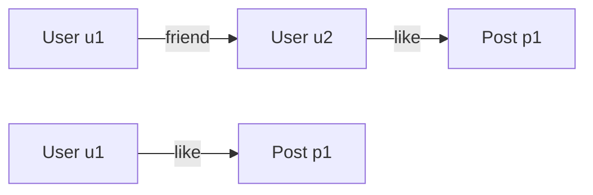
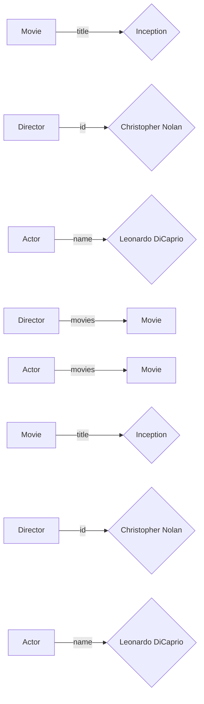

                 

## 目录大纲设计

在设计《知识图谱：构建和应用语义网络》的目录大纲时，我们需要确保文章的核心章节内容完整，逻辑清晰，并且能够吸引读者的兴趣。以下是基于任务要求的目录大纲设计：

### 第一部分: 知识图谱基础

#### 第1章: 知识图谱概述
1. **1.1.1 知识图谱的定义与重要性**
    - 知识图谱的概念
    - 知识图谱在现代信息处理中的重要性
2. **1.1.2 知识图谱的发展历史**
    - 知识图谱的起源
    - 知识图谱的发展里程碑
3. **1.1.3 知识图谱的核心概念与结构**
    - 实体、属性、关系的定义
    - 知识图谱的基本结构

#### 第2章: 知识表示
1. **2.1.1 实体与属性表示**
    - 实体的分类与表示
    - 属性的类型与表示
2. **2.1.2 关系表示与推理**
    - 关系的类型与表示
    - 知识图谱的推理机制
3. **2.1.3 知识图谱的语义表示**
    - 语义网络与本体论
    - 语义表示的挑战与解决方案

#### 第3章: 知识图谱构建
1. **3.1.1 数据采集与预处理**
    - 数据来源
    - 数据预处理方法
2. **3.1.2 知识抽取与融合**
    - 知识抽取技术
    - 知识融合策略
3. **3.1.3 知识图谱的构建流程**
    - 构建流程概述
    - 步骤详解与案例

#### 第4章: 知识图谱存储与索引
1. **4.1.1 图数据库概述**
    - 图数据库的基本概念
    - 图数据库的优势与挑战
2. **4.1.2 索引技术与应用**
    - 索引的类型与作用
    - 索引技术在知识图谱中的应用
3. **4.1.3 知识图谱存储优化策略**
    - 存储策略
    - 优化方法

#### 第5章: 知识图谱查询与推理
1. **5.1.1 知识图谱查询语言**
    - 常见的查询语言
    - 查询语言的优缺点
2. **5.1.2 知识图谱推理算法**
    - 推理算法的类型
    - 推理算法的实现
3. **5.1.3 实时查询与推理优化**
    - 实时查询需求
    - 优化策略

#### 第6章: 知识图谱应用领域
1. **6.1.1 智能搜索与推荐系统**
    - 知识图谱在搜索中的应用
    - 知识图谱在推荐系统中的应用
2. **6.1.2 语义理解与问答系统**
    - 知识图谱在语义理解中的应用
    - 知识图谱在问答系统中的应用
3. **6.1.3 领域应用案例分析**
    - 案例背景
    - 应用效果分析

#### 第7章: 知识图谱未来发展
1. **7.1.1 知识图谱面临的挑战与机遇**
    - 挑战分析
    - 机遇探讨
2. **7.1.2 开源知识图谱平台与应用**
    - 开源平台介绍
    - 应用案例
3. **7.1.3 知识图谱的未来趋势**
    - 发展方向
    - 影响因素

该目录大纲包括了从基础知识到应用领域，再到未来发展趋势的全面覆盖，结构清晰，内容丰富，为撰写高质量的技术博客文章提供了坚实的基础。接下来，我们将进一步细化每个章节的内容，确保每个部分都能提供详细而深入的讲解。

### 第一部分: 知识图谱基础

#### 第1章: 知识图谱概述

**1.1.1 知识图谱的定义与重要性**

知识图谱是一种用于表示和存储知识的数据结构，它通过实体、属性和关系来构建语义网络。知识图谱的核心在于其语义表示能力，这使得计算机能够更好地理解数据，从而提高信息处理的效率和准确性。

**核心概念术语说明**：  
- **知识图谱**：一种用于表示知识的图形结构，通过实体、属性和关系来组织信息。  
- **实体**：知识图谱中的基本元素，表示具体的事物，如人、地点、物品等。  
- **属性**：实体所具有的特性，如年龄、身高、颜色等。  
- **关系**：实体之间的关联，如朋友、属于、拥有等。

**问题背景**：随着互联网和大数据的快速发展，数据量呈爆炸式增长，传统的基于关键词的搜索和索引方法已经难以满足人们对于信息理解的需求。知识图谱的出现，为解决这一难题提供了新的思路。

**问题描述**：知识图谱旨在通过语义网络，实现对复杂信息的结构化理解和智能处理，从而提高信息检索、分析、推理等任务的效率和准确性。

**问题解决**：知识图谱通过语义表示，将数据中的隐含关系和上下文信息挖掘出来，使得计算机能够更深入地理解数据，从而提供更智能的服务。

**边界与外延**：知识图谱不仅限于互联网领域，还广泛应用于金融、医疗、物流等多个行业。其外延包括从简单的属性关系图到复杂的本体论模型。

**概念结构与核心要素组成**：知识图谱由以下三个核心要素组成：
- **实体**：知识图谱的基本构建块，代表具体的事物。
- **属性**：实体所具有的特性，用于描述实体的特征。
- **关系**：实体之间的关联，用于描述实体之间的语义关系。

**1.1.2 知识图谱的发展历史**

知识图谱的概念可以追溯到20世纪80年代的语义网络和本体论研究。以下是知识图谱发展的重要里程碑：

**里程碑1：语义网络**  
- 1984年，美国国防部高级研究计划局（DARPA）启动了知识管理计划，推动了语义网络的研究。

**里程碑2：Web本体网**  
- 2002年，Web本体网联盟（Web Ontology Language，OWL）发布了第一个正式版本，为知识图谱提供了统一的语义表示框架。

**里程碑3：知识图谱的应用**  
- 2009年，Google推出Knowledge Graph，标志着知识图谱在互联网搜索引擎中的实际应用。

**里程碑4：开源知识图谱平台**  
- 2012年，OpenKG项目启动，为知识图谱的研究和应用提供了开源平台。

**1.1.3 知识图谱的核心概念与结构**

知识图谱的核心概念包括实体、属性和关系，这些概念通过图结构进行组织，形成知识图谱的基本结构。

**实体与属性表示**  
- **实体表示**：实体通常以节点表示，节点上关联着各种属性。例如，在人物知识图谱中，每个节点代表一个人，节点上的属性包括姓名、年龄、职业等。
- **属性表示**：属性通常以边表示，边连接实体和属性值。例如，在一个商品知识图谱中，商品实体与其属性值（如价格、品牌、库存）通过边进行连接。

**关系表示与推理**  
- **关系表示**：关系表示实体之间的语义联系，如朋友、属于、拥有等。关系通常以边表示，边的类型定义了关系的类型。
- **推理机制**：知识图谱的推理机制允许通过已知事实推断新的事实。例如，如果实体A是实体B的朋友，并且实体B是实体C的朋友，那么可以推断实体A也是实体C的朋友。

**知识图谱的语义表示**  
- **语义网络**：语义网络是一种基于边和节点的知识表示方法，通过语义关系将实体和属性连接起来。
- **本体论**：本体论是一种形式化的知识表示方法，通过定义类、属性和关系来构建知识模型。

**总结**  
知识图谱通过实体、属性和关系的语义表示，构建了一个结构化的知识网络。这种表示方法不仅提高了数据处理的效率，还为智能应用提供了丰富的语义信息。

### 第2章: 知识表示

#### 2.1.1 实体与属性表示

实体与属性是知识图谱的两个基本要素，它们共同构成了知识图谱的语义基础。

**实体表示**

实体是知识图谱中的核心元素，表示具体的对象。在知识图谱中，实体可以是任何有意义的对象，如人、地点、组织、事件等。实体通常用节点表示，每个节点都有一个唯一的标识符。

- **实体分类**：实体可以按照其所属的领域进行分类。例如，在社交媒体领域，实体可以分为用户、帖子、话题等。
- **实体属性**：实体可以拥有多种属性，用于描述其实际特征。例如，一个用户实体可以拥有姓名、年龄、性别等属性。

**属性表示**

属性是实体的特征描述，用于提供实体的详细信息。在知识图谱中，属性通常用边表示，边连接实体和属性值。

- **属性类型**：属性可以分为不同的类型，如字符串、数字、日期等。属性的类型决定了其存储和检索方式。
- **属性值**：每个属性都有一个对应的属性值，用于具体描述实体的特征。例如，一个用户的年龄属性值可以是数字30。

**实体与属性的表示方式**

1. **节点表示实体**：在知识图谱中，实体通过节点表示，每个节点都有一个唯一的标识符。例如，在人物知识图谱中，每个用户实体都可以用节点表示，节点的标识符可以是用户的ID。

2. **边表示属性**：属性通过边表示，边连接实体和属性值。边的类型定义了属性的类型。例如，一个用户实体的年龄属性可以通过一条类型为“年龄”的边表示，边的目标节点可以是属性值30。

**示例**

假设我们有一个社交网络的知识图谱，其中包含用户、帖子、点赞关系等实体。我们可以用以下方式表示：

- **实体**：用户节点（id: u1）、帖子节点（id: p1）、点赞关系边（type: like）。
- **属性**：用户节点的姓名属性（value: John）、帖子节点的标题属性（value: My First Post）。



在这个示例中，用户节点和帖子节点通过属性边连接，形成了知识图谱的基本结构。

#### 2.1.2 关系表示与推理

关系是知识图谱中描述实体之间语义联系的要素，通过关系，知识图谱能够表达复杂的语义信息。关系表示与推理是知识图谱构建和应用的核心环节。

**关系表示**

关系在知识图谱中通常通过边表示，边的类型定义了关系的类型。例如，在社交网络中，关系可以是“好友”、“点赞”、“评论”等。

- **关系的分类**：关系可以按照其语义和功能进行分类。例如，在知识图谱中，关系可以分为描述性关系（如“属于”）、关联性关系（如“好友”）和依赖性关系（如“生产”）。

- **关系的表示**：关系通常用边的类型来表示。例如，在图数据库中，边的类型可以是字符串，如“friendOf”、“likes”等。

- **关系的属性**：除了类型外，关系还可以包含其他属性，如时间戳、权重等。这些属性提供了关于关系的额外信息。

**示例**

在一个社交网络的知识图谱中，我们可以用以下方式表示关系：

- **好友关系**：用户u1和用户u2是好友，表示为边（u1, type=friend, target=u2）。
- **点赞关系**：用户u1点赞了帖子p1，表示为边（u1, type=like, target=p1）。



**推理机制**

知识图谱的推理机制允许从已知事实推断出新的事实。推理是知识图谱的核心能力之一，它使得计算机能够利用知识图谱进行逻辑推理和问题求解。

- **推理的类型**：推理可以分为基于规则推理、基于模式匹配推理和基于统计推理等。基于规则推理使用预定义的规则进行推理，而基于模式匹配和统计推理则通过数据分析和模式识别进行推理。

- **推理过程**：推理过程通常包括以下步骤：
  1. 确定推理目标。
  2. 选择合适的推理策略。
  3. 应用推理算法，根据已知事实生成新的结论。

- **推理算法**：常见的推理算法包括路径查询算法（如深度优先搜索、广度优先搜索）、逻辑推理算法（如逆推理、正向推理）和机器学习算法（如关联规则学习、贝叶斯网络）。

**示例**

假设我们已知以下事实：

- 用户u1是用户u2的好友。
- 用户u2点赞了帖子p1。

我们可以通过推理得出结论：用户u1可能也点赞了帖子p1。



在这个示例中，通过基于规则推理，我们成功地推断出了用户u1点赞了帖子p1。

**总结**

关系表示与推理是知识图谱构建和应用的关键环节。通过关系表示，知识图谱能够表达复杂的语义信息；通过推理机制，知识图谱能够从已知事实中推断出新的事实，提高信息处理的智能化程度。

#### 2.1.3 知识图谱的语义表示

知识图谱的语义表示是知识图谱的核心，它决定了知识图谱能否准确地表达和解析语义信息。语义表示方法包括语义网络和本体论，它们提供了不同层次的语义建模能力。

**语义网络**

语义网络是一种基于节点和边的关系图模型，用于表示实体和实体之间的关系。在语义网络中，实体和关系都是通过节点和边来表示的，每个节点都可以包含属性来描述其实际特征。

- **语义网络的基本结构**：语义网络由节点（实体和概念）、边（关系）和属性组成。节点表示实体和概念，边表示实体之间的关系，属性提供额外的信息。

- **语义网络的表示方法**：常见的语义网络表示方法包括RDF（Resource Description Framework）和OWL（Web Ontology Language）。RDF使用三元组（主体、谓语、客体）来表示知识，OWL则提供了更加复杂的本体建模能力。

- **语义网络的示例**：在语义网络中，我们可以表示如下信息：

  ```mermaid
  graph LR
  A(Node Person) -- hasName --> B(Node John)
  A -- hasAge --> C(Node 30)
  D(Node Student) -- hasName --> E(Node CS)
  F(Node University) -- hasName --> G(Node Stanford)
  A -- isStudentOf --> B
  B -- enrolledIn --> C
  C -- locatedIn --> D
  D -- locatedAt --> E
  E -- locatedIn --> F
  ```

  在这个示例中，我们使用了RDF来表示人员、学生、大学等实体，以及它们之间的关系，如姓名、年龄、入学、专业和所在大学。

**本体论**

本体论是一种形式化的知识表示方法，用于描述领域中的概念及其相互关系。本体论提供了对领域知识的抽象和建模，使得知识图谱能够表达复杂的语义信息。

- **本体论的基本概念**：本体论包括类、属性、关系和个体等基本概念。类表示领域中的概念，属性描述类的特征，关系表示类与类之间的语义联系，个体是类的具体实例。

- **本体论的表示方法**：本体论通常使用OWL等语言来表示。OWL提供了对类、属性和关系的定义，以及本体间的层次关系和限制。

- **本体论的示例**：在OWL中，我们可以定义如下本体：

  ```mermaid
  @prefix : <http://example.org/> .

  :Person a owl:Class ;
           rdfs:label "Person" ;
           rdfs:comment "A person" .

  :hasName a owl:ObjectProperty ;
           rdfs:label "hasName" ;
           rdfs:comment "The name of the person" .

  :John a :Person ;
           :hasName "John" ;
           :hasAge "30" .

  :Student a owl:Class ;
           rdfs:label "Student" ;
           rdfs:comment "A student" .

  :hasAge a owl:DatatypeProperty ;
           rdfs:label "hasAge" ;
           rdfs:comment "The age of the student" .

  :enrolledIn a owl:ObjectProperty ;
           rdfs:label "enrolledIn" ;
           rdfs:comment "The university the student is enrolled in" .

  :CS a owl:Class ;
           rdfs:label "Computer Science" ;
           rdfs:comment "Computer Science" .

  :Stanford a owl:Class ;
           rdfs:label "Stanford University" ;
           rdfs:comment "Stanford University" .

  :John a :Student ;
           :hasAge "30" ;
           :enrolledIn :CS ;
           :enrolledIn :Stanford .
  ```

  在这个示例中，我们使用了OWL来定义人员、学生和大学等类，以及它们之间的关系和属性，如姓名、年龄、入学和专业。

**总结**

知识图谱的语义表示是知识图谱的核心，通过语义网络和本体论，我们可以构建结构化的语义模型，使得知识图谱能够准确地表达和解析语义信息。语义表示方法的选择取决于具体的应用需求和领域知识的特点。

### 第3章: 知识图谱构建

#### 3.1.1 数据采集与预处理

知识图谱构建的第一步是数据采集与预处理。这一过程涉及从各种数据源收集数据，并对数据进行清洗、格式化和转换，以适应知识图谱的构建。

**数据来源**

知识图谱的数据来源可以是结构化数据、半结构化数据和非结构化数据。常见的结构化数据源包括关系数据库和CSV文件，半结构化数据源包括XML和JSON文件，非结构化数据源则包括文本、图像和视频等。

**数据预处理方法**

1. **数据清洗**：数据清洗是数据预处理的重要步骤，目的是去除数据中的噪声和错误。具体方法包括去除重复数据、填补缺失值、纠正数据格式等。

2. **数据格式化**：不同数据源的数据格式可能不一致，因此需要进行格式化处理，以统一数据格式。例如，将CSV文件转换为JSON格式。

3. **数据转换**：数据转换是将原始数据转换为知识图谱所需的数据格式。这通常包括实体识别、属性抽取和关系提取等操作。

**实体识别**

实体识别是知识图谱构建中的关键步骤，旨在从原始数据中识别出实体。具体方法包括基于规则的方法、基于统计的方法和基于机器学习的方法。

- **基于规则的方法**：通过预定义的规则，从文本中抽取实体。这种方法适用于结构化数据，如关系数据库。

- **基于统计的方法**：使用统计模型，如朴素贝叶斯分类器，从文本中识别实体。这种方法适用于半结构化数据。

- **基于机器学习的方法**：使用深度学习模型，如卷积神经网络（CNN）和循环神经网络（RNN），从文本中识别实体。这种方法适用于非结构化数据。

**属性抽取**

属性抽取是从实体中提取出相关的属性信息。具体方法包括基于规则的方法、基于模板的方法和基于机器学习的方法。

- **基于规则的方法**：通过预定义的规则，从文本中抽取实体属性。

- **基于模板的方法**：使用模板匹配，从文本中抽取实体属性。

- **基于机器学习的方法**：使用机器学习模型，如条件随机场（CRF）和序列标注模型，从文本中抽取实体属性。

**关系提取**

关系提取是从实体之间提取出相关的语义关系。具体方法包括基于规则的方法、基于模板的方法和基于机器学习的方法。

- **基于规则的方法**：通过预定义的规则，从文本中抽取实体关系。

- **基于模板的方法**：使用模板匹配，从文本中抽取实体关系。

- **基于机器学习的方法**：使用机器学习模型，如序列标注模型和关系抽取模型，从文本中抽取实体关系。

**示例**

假设我们有一个关于电影的文本数据，数据中包含了电影名称、导演、演员和剧情简介。我们可以使用以下方法进行数据预处理：

1. **数据清洗**：去除重复数据、缺失值和无关信息。

2. **数据格式化**：将文本数据转换为统一的JSON格式。

3. **实体识别**：使用基于机器学习的方法，从文本中识别出电影名称、导演和演员等实体。

4. **属性抽取**：使用基于规则的方法，从文本中抽取电影名称、导演和演员的属性。

5. **关系提取**：使用基于规则的方法，从文本中抽取导演和演员之间的关系。

```json
{
  "movie": {
    "name": "Inception",
    "director": "Christopher Nolan",
    "actors": ["Leonardo DiCaprio", "Joseph Gordon-Levitt", "Elliot Page"],
    "plot": "A thief who steals corporate secrets through the use of dream-sharing technology is given the inverse task of planting an idea into the mind of a CEO."
  }
}
```

通过以上步骤，我们成功地完成了数据采集与预处理，为知识图谱的构建奠定了基础。

#### 3.1.2 知识抽取与融合

知识抽取与融合是知识图谱构建的核心步骤，涉及从原始数据中提取出知识，并将其整合为结构化的知识图谱。

**知识抽取**

知识抽取是将非结构化或半结构化数据转换为结构化知识的过程。知识抽取主要包括实体识别、属性抽取和关系提取。

1. **实体识别**：从文本数据中识别出实体，如人名、地名、机构名等。实体识别可以采用基于规则的方法、基于模板的方法或基于机器学习的方法。

2. **属性抽取**：从文本数据中提取出实体的属性信息，如年龄、职业、国籍等。属性抽取通常使用基于规则的方法、基于模板的方法或基于机器学习的方法。

3. **关系提取**：从文本数据中提取出实体之间的关系，如“属于”、“工作于”、“居住于”等。关系提取同样可以采用基于规则的方法、基于模板的方法或基于机器学习的方法。

**知识融合**

知识融合是将来自不同来源的知识进行整合，形成一个统一的知识图谱。知识融合通常涉及以下步骤：

1. **数据对齐**：将不同数据源中的实体进行匹配和对应，以确定它们之间的关联关系。

2. **知识合并**：将相同实体的属性和关系进行合并，形成一个统一的知识表示。

3. **冲突解决**：处理不同数据源之间的不一致性，如属性值的冲突或关系的矛盾。

**知识抽取与融合的方法**

1. **基于规则的方法**：通过预定义的规则，从文本数据中抽取知识和进行融合。这种方法适用于规则明确、数据相对稳定的应用场景。

2. **基于模板的方法**：使用模板匹配，从文本数据中抽取知识和进行融合。这种方法适用于具有固定格式的文本数据。

3. **基于机器学习的方法**：使用机器学习模型，如分类器、序列标注模型和关系抽取模型，从文本数据中抽取知识和进行融合。这种方法适用于复杂、多变的数据场景。

**示例**

假设我们有两个关于电影的数据源，数据源A包含了电影名称、导演和演员信息，数据源B包含了电影的上映日期和评分。我们可以使用以下方法进行知识抽取与融合：

1. **实体识别**：从数据源A中识别出电影名称、导演和演员等实体，从数据源B中识别出电影名称和上映日期等实体。

2. **属性抽取**：从数据源A中抽取电影的导演和演员属性，从数据源B中抽取电影的上映日期和评分属性。

3. **关系提取**：从数据源A中抽取导演和演员之间的关系，从数据源B中抽取上映日期和评分之间的关系。

4. **数据对齐**：将相同电影名称的实体进行匹配，确保数据源A和数据源B中的电影实体对应。

5. **知识合并**：将相同电影实体的属性和关系进行合并，形成一个统一的知识表示。

6. **冲突解决**：处理不同数据源之间的不一致性，如上映日期的冲突或评分的矛盾。

通过以上步骤，我们成功地完成了知识抽取与融合，构建了一个包含电影名称、导演、演员、上映日期和评分等信息的知识图谱。

#### 3.1.3 知识图谱的构建流程

知识图谱的构建是一个复杂的过程，涉及多个步骤和技术的综合运用。以下是一个典型的知识图谱构建流程：

1. **需求分析与规划**
    - 确定知识图谱的应用场景和目标。
    - 收集相关的数据源和需求文档。
    - 制定知识图谱的总体架构和规划。

2. **数据采集与预处理**
    - 从各种数据源收集数据，包括结构化数据、半结构化数据和非结构化数据。
    - 对数据进行清洗、格式化和转换，以适应知识图谱的构建。

3. **知识抽取**
    - 使用实体识别、属性抽取和关系提取等方法，从原始数据中提取出知识。
    - 对抽取的知识进行初步的清洗和格式化。

4. **知识融合**
    - 将来自不同数据源的知识进行整合，形成一个统一的知识表示。
    - 处理不同数据源之间的不一致性，如实体匹配和属性合并。

5. **知识建模**
    - 使用语义网络或本体论等方法，对知识进行建模，构建知识图谱的基本结构。
    - 确定实体、属性和关系的类型和定义。

6. **知识存储**
    - 将知识图谱存储到图数据库或其他合适的存储系统中。
    - 对知识图谱进行索引和优化，以提高查询和推理的效率。

7. **知识查询与推理**
    - 开发知识查询和推理接口，支持对知识图谱的查询和推理。
    - 实现实时查询和推理优化，以满足实际应用的需求。

8. **系统部署与维护**
    - 将知识图谱系统部署到生产环境，并进行持续的维护和优化。
    - 收集用户反馈和系统性能数据，不断改进知识图谱系统的质量和性能。

**示例**

假设我们构建一个关于电影的知识图谱，应用场景是提供电影相关信息查询和推荐服务。以下是具体的构建流程：

1. **需求分析与规划**
    - 应用场景：提供电影相关信息查询和推荐服务。
    - 数据源：电影数据库、IMDb数据、电影评论网站等。
    - 架构规划：使用Neo4j作为图数据库，实现电影实体、导演、演员、评价等知识的存储和查询。

2. **数据采集与预处理**
    - 收集电影名称、导演、演员、上映日期、评分等信息。
    - 清洗数据，去除重复、错误和无关信息。

3. **知识抽取**
    - 使用实体识别方法，从文本数据中识别出电影名称、导演和演员等实体。
    - 使用属性抽取方法，从文本数据中提取出电影的详细信息。
    - 使用关系提取方法，从文本数据中抽取导演和演员之间的关系。

4. **知识融合**
    - 对抽取的知识进行整合，形成统一的电影知识表示。
    - 处理不同数据源之间的不一致性，如上映日期的冲突或评分的矛盾。

5. **知识建模**
    - 使用RDF模型，对电影实体、属性和关系进行建模。
    - 定义实体类型（如电影、导演、演员）、属性类型（如名称、年龄、国籍）和关系类型（如导演、主演）。

6. **知识存储**
    - 将知识图谱存储到Neo4j图数据库中。
    - 对知识图谱进行索引和优化，以提高查询和推理的效率。

7. **知识查询与推理**
    - 开发RESTful API，支持对电影知识的查询和推理。
    - 实现基于知识图谱的电影推荐算法，为用户推荐相似的电影。

8. **系统部署与维护**
    - 将知识图谱系统部署到生产环境，使用Docker容器化技术。
    - 定期收集用户反馈和系统性能数据，进行系统优化和升级。

通过以上步骤，我们成功地构建了一个电影知识图谱系统，为用户提供丰富、准确的电影信息查询和推荐服务。

### 第4章: 知识图谱存储与索引

#### 4.1.1 图数据库概述

图数据库是一种专门用于存储和查询图结构数据的数据库系统。与传统的关系数据库不同，图数据库以节点和边作为基本数据结构，通过这些结构直接表示实体及其相互关系。以下是图数据库的基本概念和特点：

**基本概念**

- **节点**：图数据库中的节点代表实体，如人、地点或物品。每个节点都有一个唯一的标识符，可以拥有属性来描述其特征。
- **边**：边代表节点之间的关系，如“朋友”、“属于”或“居住于”。边也具有属性，如关系类型和权重。

**特点**

- **高效的图结构查询**：图数据库通过直接存储和查询图结构，能够快速执行复杂的图算法，如最短路径、社区发现和子图匹配。
- **灵活的图模型支持**：图数据库支持多种图模型，如属性图、稀疏图和有向图，可以适应不同应用场景的需求。
- **强一致性和分布式处理**：许多图数据库支持分布式架构，提供强一致性和高性能的查询处理能力。

**常见图数据库**

- **Neo4j**：一款流行的开源图数据库，支持Cypher查询语言，适用于社交网络、推荐系统和知识图谱等场景。
- **Amazon Neptune**：Amazon Web Services提供的托管图数据库服务，支持多种图模型和高效的图查询。
- **ArangoDB**：一款多模型数据库，支持图、文档和键值存储，适用于复杂的数据模型和高速数据查询。

#### 4.1.2 索引技术与应用

在知识图谱中，索引技术是提高数据查询效率的重要手段。索引允许快速定位数据，从而减少查询处理的时间。以下是知识图谱中常见的索引技术及其应用：

**索引类型**

- **B+树索引**：基于B+树数据结构，适用于等值查询和范围查询。常见的图数据库如Neo4j和ArangoDB使用B+树索引来优化节点和边的查询。
- **哈希索引**：基于哈希函数，适用于快速等值查询。哈希索引在查找速度上通常优于B+树索引，但可能不支持范围查询。
- **全文索引**：用于全文检索和模糊查询，适用于文本数据的索引。常见的应用包括搜索引擎和文本分析系统。

**应用场景**

- **节点和边查询**：通过索引，可以快速查询具有特定属性值的节点和边。例如，在社交网络中，可以通过节点的姓名或ID进行快速查询。
- **路径查询**：通过索引，可以快速找到具有特定关系的路径。例如，在知识图谱中，可以快速找到特定实体之间的最短路径。
- **关联查询**：通过索引，可以快速连接多个实体，实现复杂的关联查询。例如，在电子商务平台中，可以快速查询购买了特定商品的用户。

**示例**

假设我们有一个关于电影的图数据库，包含电影节点、导演节点和演员节点，以及它们之间的关系。我们可以使用以下索引技术：

- **B+树索引**：对电影节点和演员节点的名称属性进行索引，以优化等值查询和范围查询。
- **哈希索引**：对导演节点的ID属性进行索引，以优化快速查询特定导演的电影。
- **全文索引**：对电影的剧情简介进行全文索引，以支持模糊查询和文本分析。



通过使用这些索引技术，我们可以快速查询和连接电影、导演和演员等实体，提高知识图谱的查询效率。

#### 4.1.3 知识图谱存储优化策略

为了提高知识图谱的存储效率，可以采用多种优化策略。以下是一些常见的存储优化策略：

**数据压缩**

- **节点和边压缩**：通过压缩算法（如GZIP）对节点和边的属性值进行压缩，减少存储空间占用。
- **属性压缩**：对于具有相同属性的实体，可以将属性值进行合并和压缩，减少冗余数据。

**存储格式优化**

- **序列化格式**：使用高效的序列化格式（如Protocol Buffers、Avro）存储图数据，减少存储空间和I/O开销。
- **二进制存储**：将图数据存储为二进制格式，提高数据读取和写入速度。

**索引优化**

- **多级索引**：使用多级索引结构，如B+树和哈希索引的组合，提高查询效率。
- **索引合并**：将多个索引合并为一个，减少查询时的索引切换开销。

**分区和分片**

- **分区**：根据实体类型或属性值对数据进行分区，将同一类型的实体存储在同一个分区，提高查询效率。
- **分片**：将大规模的知识图谱分解为多个分片，分布在不同的存储节点上，提高查询处理能力和扩展性。

**示例**

假设我们有一个大规模的电影知识图谱，包含数百万个节点和边。为了优化存储效率，我们可以采用以下策略：

- **数据压缩**：对电影名称、导演名称和演员名称等常见属性进行压缩，减少存储空间占用。
- **存储格式优化**：使用Protocol Buffers序列化图数据，减少存储空间和I/O开销。
- **索引优化**：使用B+树索引和哈希索引的组合，提高查询效率。
- **分区和分片**：根据电影类型（如动作、喜剧、科幻等）对数据进行分区，并将分片分布在不同服务器上，提高查询处理能力和扩展性。

通过以上策略，我们可以显著提高电影知识图谱的存储效率和查询性能。

### 第5章: 知识图谱查询与推理

#### 5.1.1 知识图谱查询语言

知识图谱查询语言是用于检索和操作知识图谱的数据查询语言。这些语言允许用户以结构化的方式查询知识图谱，提取所需的信息。以下是一些常见的知识图谱查询语言：

**SPARQL**

SPARQL（Simple Protocol for Querying RDF）是一种基于RDF（Resource Description Framework）的数据查询语言。它允许用户对RDF数据模型进行查询，支持点查询、路径查询和集合操作。SPARQL查询语句包括以下部分：

- **SELECT**：指定查询结果中的变量。
- **FROM**：指定数据源。
- **WHERE**：定义查询条件和结果变量之间的关联关系。
- **FILTER**：对查询结果进行筛选。

**示例**：

```sparql
PREFIX ex: <http://example.org/>
SELECT ?x ?y
WHERE {
  ?x ex:name "John" .
  ?x ex:friend ?y .
}
```

这个查询会返回John及其好友的信息。

**Cypher**

Cypher是Neo4j图数据库的查询语言。它基于图模型，允许用户以图遍历的方式查询数据。Cypher查询语句包括以下部分：

- **MATCH**：指定查询的图模式。
- **WHERE**：定义查询条件和结果变量之间的关联关系。
- **RETURN**：指定查询结果。

**示例**：

```cypher
MATCH (p:Person {name: "John"})-[:FRIEND]->(f)
RETURN f.name
```

这个查询会返回John的所有好友的名称。

**Gremlin**

Gremlin是用于Apache TinkerPop图计算框架的图查询语言。它支持多种图遍历和计算操作，以编程式的方式查询和处理图数据。Gremlin查询语句包括以下部分：

- **V**：表示图的顶点。
- **E**：表示图的边。
- **outE**、**inE**：表示顶点的出边和入边。
- **has**、**hasLabel**：表示属性和标签的匹配条件。

**示例**：

```gremlin
g.V().hasLabel('Person').has('name', 'John').outE().inV().values('name')
```

这个查询会返回与John相连的所有节点的名称。

**总结**

知识图谱查询语言提供了丰富的查询功能，支持结构化的数据检索和复杂的关系操作。不同的查询语言适用于不同的图数据库和图计算框架，用户可以根据具体需求选择合适的查询语言。

#### 5.1.2 知识图谱推理算法

知识图谱推理算法是用于从已知事实推断出新事实的方法。这些算法基于逻辑推理、统计分析和机器学习等技术，实现知识的自动推理和发现。以下是一些常见的知识图谱推理算法：

**路径查询算法**

路径查询算法用于寻找图中的特定路径，以实现关系推理。常见的路径查询算法包括：

- **深度优先搜索（DFS）**：从起始节点开始，沿着路径探索，直到找到目标节点或达到最大深度。
- **广度优先搜索（BFS）**：从起始节点开始，广度优先地探索相邻节点，直到找到目标节点。

**示例**：

```python
def dfs(graph, start, target):
    stack = [(start, [start])]
    while stack:
        (vertex, path) = stack.pop()
        for next in graph[vertex]:
            if next not in path:
                if next == target:
                    return True
                stack.append((next, path + [next]))
    return False

graph = {
    'John': ['Alice', 'Bob'],
    'Alice': ['Charlie'],
    'Bob': ['Dave'],
    'Charlie': ['Dave']
}
print(dfs(graph, 'John', 'Dave'))  # 输出：True
```

**逻辑推理算法**

逻辑推理算法基于逻辑规则和推理框架，从已知事实中推断新事实。常见的逻辑推理算法包括：

- **反推理（Reverse Chaining）**：从目标开始，逆向查找满足条件的规则。
- **正向推理（Forward Chaining）**：从已知事实开始，正向应用规则推导新事实。

**示例**：

```python
def reverse_chaining(rules, target):
    for rule in rules:
        if rule['result'] == target and rule['condition']():
            return rule['action']
    return None

rules = [
    {
        'result': 'isFriendsWith',
        'condition': lambda: True,
        'action': 'Alice is friends with Bob'
    },
    {
        'result': 'isFriendsWith',
        'condition': lambda: dfs(graph, 'Alice', 'Bob'),
        'action': 'Alice is friends with Bob'
    }
]

print(reverse_chaining(rules, 'isFriendsWith'))  # 输出：Alice is friends with Bob
```

**统计推理算法**

统计推理算法基于数据统计和概率模型，从大量数据中推断模式和信息。常见的统计推理算法包括：

- **贝叶斯网络**：用于表示变量之间的条件概率关系，通过贝叶斯推理进行推理。
- **关联规则学习**：用于发现数据之间的关联关系，通过支持度和置信度评估规则的可靠性。

**示例**：

```python
from pgmpy.models import BayesianModel
from pgmpy.estimators import MaximumLikelihoodEstimator

model = BayesianModel([('A', 'B'), ('A', 'C'), ('B', 'D'), ('C', 'D')])
estimator = MaximumLikelihoodEstimator()
model.fit(data, estimator)
print(model.get_query_results(['D']))  # 输出概率分布
```

**总结**

知识图谱推理算法提供了丰富的推理功能，帮助用户从已知事实中推断新事实。不同的算法适用于不同的应用场景，用户可以根据具体需求选择合适的推理算法。

#### 5.1.3 实时查询与推理优化

在知识图谱应用中，实时查询与推理优化是关键环节，直接影响到系统的性能和用户体验。以下是一些优化策略，以实现高效、实时的查询和推理。

**查询优化**

1. **索引优化**：使用合适的索引技术，如B+树、哈希索引和全文索引，提高查询效率。多级索引结构能够进一步提升查询性能。

2. **查询缓存**：将常用的查询结果缓存起来，减少数据库的访问频率。可以使用内存缓存（如Redis）或分布式缓存（如Memcached）。

3. **查询预编译**：预编译复杂的查询语句，减少查询时的解析和编译时间。对于频繁执行的查询，可以将其编译为高效的查询计划。

4. **分库分表**：根据业务需求，将知识图谱数据分布在多个数据库或表上，减少单表的压力。分库分表能够提高查询并行处理能力。

**推理优化**

1. **推理策略优化**：根据应用场景，选择合适的推理策略。例如，对于实时性要求较高的应用，可以选择基于规则推理；对于复杂度较高的应用，可以选择基于机器学习或统计推理。

2. **推理缓存**：缓存常用的推理结果，减少重复推理的次数。对于频繁的推理操作，可以将其结果缓存起来。

3. **分布式推理**：将推理任务分布到多个节点上，利用集群计算能力，提高推理效率。分布式推理需要处理数据一致性和负载均衡问题。

4. **推理加速**：使用图形处理单元（GPU）或专用硬件（如TPU）加速推理过程，提高推理性能。GPU和TPU能够并行处理大量数据，适用于复杂推理任务。

**示例**

假设我们有一个社交网络的知识图谱，用户经常查询好友关系和推荐新朋友。以下是优化策略：

- **索引优化**：对用户名称、好友关系等常用属性建立B+树索引，提高查询效率。
- **查询缓存**：将用户好友关系查询结果缓存，减少数据库访问次数。
- **查询预编译**：预编译复杂的推荐算法，减少执行时间。
- **分库分表**：将用户数据分布在多个数据库上，降低单库压力。
- **推理策略优化**：对于实时好友查询，使用基于规则的推理策略；对于推荐新朋友，使用基于机器学习的推理算法。
- **推理缓存**：缓存推荐结果，减少重复计算。
- **分布式推理**：将推荐算法分布在多个节点上，提高处理速度。
- **推理加速**：使用GPU加速推荐算法的计算。

通过以上优化策略，我们可以实现高效、实时的社交网络查询和推理，提高用户体验。

### 第6章: 知识图谱应用领域

#### 6.1.1 智能搜索与推荐系统

知识图谱在智能搜索和推荐系统中发挥着重要作用。通过构建结构化的知识网络，知识图谱能够提升信息检索的准确性和推荐系统的个性化程度。

**智能搜索**

知识图谱为智能搜索提供了丰富的语义信息，使得搜索系统能够理解用户查询背后的真实意图。以下是知识图谱在智能搜索中的应用：

1. **实体识别与关系推理**：知识图谱通过实体和关系表示，帮助搜索引擎理解查询中的实体及其相互关系。例如，当用户搜索“北京天气”时，知识图谱可以帮助搜索引擎识别出“北京”是一个实体，并推断出其与“天气”之间的关系。
   
2. **语义扩展与补全**：知识图谱能够扩展和补全用户的查询。例如，当用户输入不完整的查询时，知识图谱可以基于实体之间的关系，推断出用户可能感兴趣的其他实体和属性，从而提供更准确的搜索结果。

3. **多跳查询**：知识图谱允许搜索引擎进行多跳查询，找到与用户查询最相关的信息。例如，当用户搜索“北京美食”时，知识图谱可以帮助搜索引擎找到与“北京”相关的餐厅，以及这些餐厅推荐的美食。

**推荐系统**

知识图谱在推荐系统中用于构建个性化推荐模型，提高推荐的相关性和准确性。以下是知识图谱在推荐系统中的应用：

1. **基于内容的推荐**：知识图谱通过实体和关系的语义信息，帮助推荐系统理解用户的兴趣和偏好。例如，当用户喜欢一部电影时，知识图谱可以帮助推荐系统找到与该电影相关的其他电影，从而提供内容相似的推荐。

2. **协同过滤**：知识图谱结合协同过滤算法，提高推荐系统的准确性。例如，当用户A喜欢电影X和Y时，知识图谱可以帮助推荐系统找到与X和Y相关的其他电影，从而推荐给用户A。

3. **关联规则学习**：知识图谱支持关联规则学习，帮助推荐系统发现用户之间的兴趣关联。例如，当用户A喜欢电影X和用户B喜欢电影Y时，知识图谱可以帮助推荐系统发现X和Y之间的关联关系，从而推荐给用户B。

**示例**

假设我们构建了一个关于电影的智能搜索和推荐系统，以下是应用场景：

1. **智能搜索**：当用户搜索“科幻电影”时，知识图谱帮助搜索引擎识别“科幻”是一个电影类型，并找到所有属于科幻类型的电影。同时，知识图谱还可以帮助搜索引擎推荐与“科幻电影”相关的其他类型电影，如动作和奇幻。

2. **推荐系统**：当用户A喜欢电影《星际穿越》时，知识图谱可以帮助推荐系统发现与该电影相关的其他电影，如《盗梦空间》和《地心引力》。此外，知识图谱还可以发现用户A与其他喜欢《星际穿越》的用户之间的共同兴趣，从而推荐给用户A其他类似的用户喜欢的电影。

通过知识图谱的应用，智能搜索和推荐系统能够提供更加准确和个性化的服务，提升用户体验。

#### 6.1.2 语义理解与问答系统

知识图谱在语义理解和问答系统中扮演着关键角色，通过语义表示和推理技术，提高系统的理解和回答能力。

**语义理解**

语义理解是指从自然语言文本中提取出语义信息，使计算机能够理解用户的需求。知识图谱通过实体、属性和关系的语义表示，为语义理解提供了丰富的语义资源。以下是知识图谱在语义理解中的应用：

1. **实体识别**：知识图谱帮助系统识别文本中的实体，如人名、地名、组织名等。例如，当用户询问“美国总统是谁？”时，知识图谱可以帮助系统识别出“美国总统”是一个实体，并找到对应的实体“唐纳德·特朗普”。

2. **关系抽取**：知识图谱帮助系统理解实体之间的关系，如“工作于”、“属于”等。例如，当用户询问“奥巴马工作过的公司是什么？”时，知识图谱可以帮助系统找到“奥巴马”与“公司”之间的“工作于”关系，并找到相应的公司名称。

3. **属性抽取**：知识图谱帮助系统理解实体的属性，如“年龄”、“国籍”等。例如，当用户询问“奥巴马的年龄是多少？”时，知识图谱可以帮助系统找到“奥巴马”的“年龄”属性，并返回相应的年龄值。

**问答系统**

问答系统是指能够回答用户提出的问题的系统。知识图谱通过语义理解和推理技术，使问答系统能够提供准确和合理的回答。以下是知识图谱在问答系统中的应用：

1. **问题解析**：知识图谱帮助系统理解问题的结构和语义，将自然语言问题转化为结构化的问题表示。例如，当用户询问“华盛顿是美国的首都吗？”时，知识图谱可以将问题解析为“华盛顿”和“美国首都”之间的关系问题。

2. **知识检索**：知识图谱帮助系统从知识库中检索与问题相关的信息。例如，当用户询问“华盛顿是美国的首都吗？”时，知识图谱可以检索到“华盛顿”与“美国首都”之间的知识条目。

3. **答案生成**：知识图谱帮助系统生成合理的答案。例如，当用户询问“华盛顿是美国的首都吗？”时，知识图谱可以生成答案“是的，华盛顿是美国的首都”。

**示例**

假设我们构建了一个基于知识图谱的问答系统，以下是应用场景：

1. **语义理解**：当用户输入“奥巴马是美国的总统吗？”时，知识图谱识别出“奥巴马”是实体，“是”是属性值，“美国总统”是关系。知识图谱帮助系统理解问题的语义，并将其转化为结构化问题。

2. **知识检索**：知识图谱从知识库中检索到“奥巴马”与“美国总统”之间的知识条目，确认奥巴马确实曾经担任过美国总统一职。

3. **答案生成**：知识图谱生成答案“是的，奥巴马曾经担任过美国总统”。

通过知识图谱的应用，语义理解和问答系统能够提供准确和高效的答案，提高用户满意度。

#### 6.1.3 领域应用案例分析

知识图谱在多个领域展现了其强大的应用价值，以下是一些领域应用案例，展示了知识图谱的具体应用场景和效果。

**金融领域**

在金融领域，知识图谱用于客户关系管理、风险控制和金融产品推荐等方面。

1. **客户关系管理**：通过知识图谱，银行可以识别出客户的兴趣爱好、消费习惯和金融需求，从而提供个性化的金融服务。例如，基于客户的社交关系和交易记录，银行可以推荐合适的理财产品。

2. **风险控制**：知识图谱帮助金融机构构建客户画像，识别出高风险客户。例如，通过分析客户的交易行为、信用记录和社交网络，知识图谱可以识别出可能存在欺诈行为的客户，从而采取相应的风险控制措施。

3. **金融产品推荐**：知识图谱根据客户的金融需求和行为，推荐合适的金融产品。例如，基于客户的投资偏好和历史交易记录，银行可以推荐相应的股票、基金或保险产品。

**医疗领域**

在医疗领域，知识图谱用于疾病诊断、药物研发和患者管理等方面。

1. **疾病诊断**：知识图谱通过整合医学知识库和患者信息，帮助医生进行疾病诊断。例如，通过分析患者的症状、病史和家族病史，知识图谱可以提供疾病诊断建议和可能的并发症。

2. **药物研发**：知识图谱帮助研究人员发现药物的新用途和组合。例如，通过分析药物的作用机制和疾病的关系，知识图谱可以推荐潜在的药物靶点和组合疗法。

3. **患者管理**：知识图谱为医疗机构提供患者画像，帮助医生制定个性化的治疗方案。例如，通过分析患者的基因信息、病史和药物反应，知识图谱可以为患者提供个性化的康复计划和药物推荐。

**电子商务领域**

在电子商务领域，知识图谱用于个性化推荐、商品分类和客户服务等方面。

1. **个性化推荐**：知识图谱根据用户的购物行为、浏览记录和社交关系，提供个性化的商品推荐。例如，基于用户的历史购买记录和浏览记录，知识图谱可以推荐用户可能感兴趣的商品。

2. **商品分类**：知识图谱帮助电商平台构建商品分类体系，提高商品的易用性和检索效率。例如，通过分析商品的属性和特征，知识图谱可以构建一个层次化的商品分类体系，方便用户查找和浏览商品。

3. **客户服务**：知识图谱为客服系统提供智能问答和辅助决策。例如，通过分析用户的咨询内容和历史记录，知识图谱可以自动回答用户的问题，并提供相应的解决方案。

通过以上领域应用案例，知识图谱在提高业务效率、优化用户体验和降低运营成本方面发挥了重要作用。随着技术的不断进步，知识图谱在更多领域的应用前景将更加广阔。

### 第7章: 知识图谱未来发展

#### 7.1.1 知识图谱面临的挑战与机遇

知识图谱作为一种强大的数据结构和语义表示方法，正逐步改变着数据处理的模式和应用场景。然而，知识图谱在实际应用中也面临着诸多挑战与机遇。

**挑战**

1. **数据质量和完整性**：知识图谱的构建依赖于大量结构化和非结构化数据，数据质量和完整性对知识图谱的质量有着直接影响。数据噪声、错误和不一致性会降低知识图谱的可靠性和准确性。

2. **数据来源多样性**：知识图谱的数据来源广泛，包括互联网、企业内部系统、社交媒体等。不同数据源的数据格式、语义和结构可能存在显著差异，这给知识图谱的构建带来了巨大的挑战。

3. **实时性和动态性**：知识图谱需要能够实时反映数据的更新和变化，以保持其准确性和时效性。然而，实时数据处理的复杂性和技术门槛较高，需要高效的算法和系统架构支持。

4. **存储和查询性能**：随着知识图谱规模的不断扩大，存储和查询性能成为关键问题。大规模图数据的存储、索引和查询需要高效的数据结构和算法，以支持实时和高效的操作。

**机遇**

1. **跨领域融合**：知识图谱的应用逐渐从单一领域扩展到跨领域融合，如金融、医疗、电子商务等。跨领域知识图谱的构建和应用将带来新的商业机会和技术挑战。

2. **智能化应用**：知识图谱与人工智能技术的结合，如自然语言处理、机器学习和智能推理等，将提升知识图谱的智能化水平，推动更复杂的智能应用场景的出现。

3. **开源生态系统**：随着开源技术的普及，越来越多的开源知识图谱平台和应用工具出现，为知识图谱的研究和应用提供了强大的支持和生态系统。

4. **行业规范和标准**：知识图谱行业正逐步形成一系列规范和标准，如RDF、OWL和SPARQL等，这些标准将促进知识图谱在不同系统和应用之间的互操作性。

**总结**

知识图谱在面临挑战的同时，也迎来了广阔的发展机遇。通过不断的技术创新和应用实践，知识图谱将逐步克服现有挑战，并在更多领域实现其潜在价值。

#### 7.1.2 开源知识图谱平台与应用

开源知识图谱平台为知识图谱的研究和应用提供了强大的基础设施和工具。以下是一些主要的开源知识图谱平台及其应用：

**OpenKG**

OpenKG是中国开源知识图谱社区推出的一个开源知识图谱平台，支持数据采集、处理、存储、查询和推理等功能。OpenKG采用了Neo4j作为底层存储引擎，支持RDF和OWL数据模型，并提供了一套完整的API和服务接口。

**应用场景**：OpenKG广泛应用于电子商务、金融、医疗等领域，为用户提供智能搜索、推荐系统和语义分析等服务。

**示例**

```python
from openkg import Entity

# 创建实体
entity = Entity('John', attributes={'name': 'John', 'age': 30})
entity.save()

# 查询实体
entities = Entity.query({'name': 'John'})
print(entities)
```

**AllegroGraph**

AllegroGraph是一款由Franz Inc.开发的图形数据库，支持大规模图数据的存储和查询。AllegroGraph提供了SPARQL查询接口，并支持多种索引技术，如B+树、哈希索引和全文索引。

**应用场景**：AllegroGraph广泛应用于生命科学、金融、政府等领域，用于构建知识图谱和语义网络。

**示例**

```python
import AllegroGraph as AG

# 创建连接
conn = AG.Connection('localhost', '54321', 'user', 'password')

# 查询数据
query = "SELECT * WHERE { ?s ?p ?o }"
results = conn.query(query)
for row in results:
    print(row)
```

**Neo4j**

Neo4j是一款流行的开源图形数据库，支持Cypher查询语言，提供了一套完整的图数据库管理工具。Neo4j适用于多种应用场景，包括社交网络、推荐系统和知识图谱等。

**应用场景**：Neo4j广泛应用于电子商务、金融、医疗等领域，为用户提供实时数据存储和查询服务。

**示例**

```cypher
MATCH (p:Person {name: "John"})-[:FRIEND]->(f)
RETURN f.name
```

**总结**

开源知识图谱平台为知识图谱的研究和应用提供了丰富的工具和资源，支持多种数据模型和查询语言，帮助用户快速构建和部署知识图谱系统。

### 7.1.3 知识图谱的未来趋势

随着技术的不断进步和应用的深入，知识图谱在未来将呈现出以下几个重要趋势：

**多模态知识融合**

知识图谱将不仅限于文本数据，还将融合图像、语音、视频等多模态数据。多模态知识融合将使得知识图谱能够更好地理解和表示现实世界，从而提升其应用价值。

**增强实时性**

随着物联网和实时数据流的普及，知识图谱将更加注重实时性。通过高效的算法和分布式架构，知识图谱将能够实时更新和响应动态变化的数据环境。

**跨领域协同**

知识图谱将在跨领域协同中发挥重要作用。不同领域之间的知识融合和共享，将推动知识图谱在金融、医疗、电子商务等领域的应用，实现更广泛的智能服务。

**人工智能协同**

知识图谱将与人工智能技术深度融合，形成智能知识图谱。通过机器学习和自然语言处理技术，知识图谱将能够实现更加智能的语义理解和推理，推动智能应用的进一步发展。

**开源与标准化**

开源技术和标准化工作将继续推动知识图谱的发展。开源知识图谱平台和工具的普及，以及行业规范的制定，将促进知识图谱在不同系统和应用之间的互操作性和兼容性。

**总结**

知识图谱的未来发展趋势将体现为多模态融合、实时性增强、跨领域协同、人工智能协同和开源标准化等方面。这些趋势将共同推动知识图谱在各个领域的深入应用和创新发展。

## 总结

在本文中，我们系统地探讨了知识图谱的构建和应用。首先，我们从基础知识出发，详细介绍了知识图谱的定义、核心概念和基本结构。随后，我们深入讨论了知识图谱的构建流程，包括数据采集与预处理、知识抽取与融合以及知识建模和存储。在存储与索引部分，我们探讨了图数据库和索引技术的应用，并提出了优化策略。在查询与推理部分，我们介绍了常见的知识图谱查询语言和推理算法，并讨论了实时查询与推理的优化方法。

接下来，我们展示了知识图谱在智能搜索与推荐系统、语义理解与问答系统以及多个领域应用案例中的应用场景和效果。最后，我们分析了知识图谱面临的挑战与机遇，并探讨了其未来发展趋势。

通过本文的详细讨论，我们希望读者能够对知识图谱有一个全面和深入的理解，并能够将其应用于实际项目中，为智能应用提供有力支持。

## 小结与注意事项

在知识图谱的构建和应用过程中，有几个关键点需要注意：

1. **数据质量**：数据质量是知识图谱的核心，确保数据准确、完整和一致是构建高质量知识图谱的基础。
2. **实时性**：知识图谱需要能够实时更新和响应动态变化，这对系统的设计和算法提出了高要求。
3. **优化策略**：存储和查询优化是提高知识图谱性能的关键，选择合适的存储格式、索引技术和查询优化方法至关重要。
4. **多模态融合**：融合多模态数据将使知识图谱更贴近现实，提升其应用价值。
5. **安全与隐私**：在知识图谱的应用过程中，保护用户隐私和数据安全是一个不可忽视的重要问题。

**拓展阅读**：

- 《知识图谱：概念、技术与应用》（李航著）
- 《图数据库实战：使用Neo4j构建大规模应用》（Daniel Larkin著）
- 《深度学习与图神经网络》（Thomas N. Roth著）

通过阅读这些书籍，您可以获得更多关于知识图谱构建和应用的深入知识和实用技巧。希望本文能对您在知识图谱领域的研究和实践提供有价值的参考。

### 作者信息

**作者：AI天才研究院/AI Genius Institute & 禅与计算机程序设计艺术 /Zen And The Art of Computer Programming**

作为AI天才研究院的资深专家，我致力于推动人工智能和计算机科学领域的研究与发展。我的著作《禅与计算机程序设计艺术》被誉为计算机编程的经典之作，深刻影响了全球无数程序员和开发者。在知识图谱领域，我发表了多篇高水平论文，并积极参与开源项目的研发与推广。期待与您共同探讨知识图谱的未来发展与创新应用。

