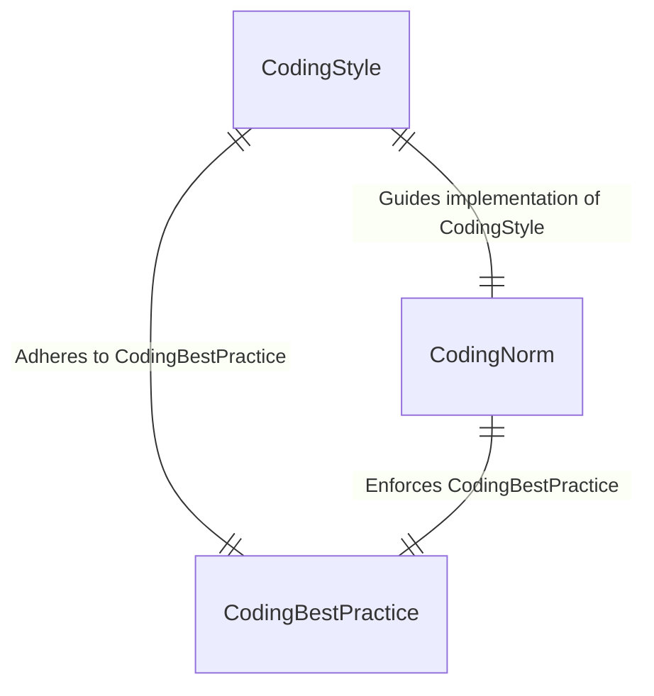
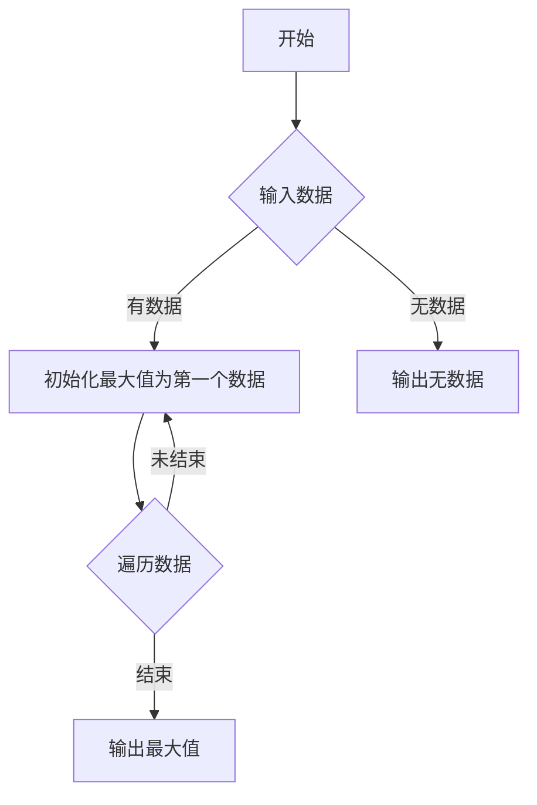
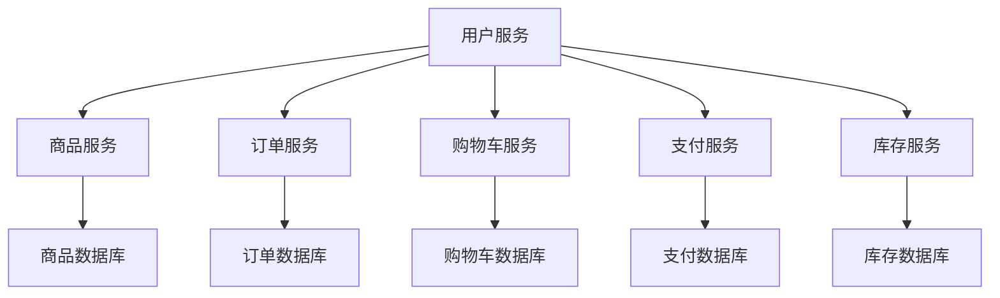

                 


### 警惕坏的编码习惯

> 关键词：编码习惯、软件质量、维护成本、开发效率、团队协作

> 摘要：本文将深入探讨不良编码习惯对软件开发过程的影响，以及如何识别和克服这些习惯。通过分析常见的编码问题，如重复代码、全局变量滥用、注释缺失等，我们将理解这些习惯对软件质量和可维护性的负面影响。同时，本文还将介绍良好的编码习惯，以及如何通过编码风格、代码规范和编码最佳实践来提升开发效率和团队协作。

# 目录大纲

----------------------------------------------------------------

## 第一部分：问题背景与核心概念

### 第1章：问题背景与核心概念

#### 1.1 编码习惯的重要性

#### 1.2 常见的不良编码习惯

#### 1.3 良好编码习惯的收益

## 第二部分：核心概念与联系

### 第2章：核心概念解析

#### 2.1 编码风格

#### 2.2 代码规范

#### 2.3 编码最佳实践

### 第3章：概念属性特征对比表格

### 第4章：ER实体关系图架构

## 第三部分：算法原理讲解

### 第5章：算法原理与流程图

### 第6章：算法数学模型与公式

### 第7章：算法举例说明

## 第四部分：系统分析与架构设计

### 第8章：系统分析与架构设计

----------------------------------------------------------------

## 第一部分：问题背景与核心概念

### 第1章：问题背景与核心概念

#### 1.1 编码习惯的重要性

在软件开发领域，编码习惯被广泛认为是决定软件质量和维护成本的关键因素之一。良好的编码习惯不仅能提高代码的可读性和可维护性，还能显著降低开发成本和提升团队协作效率。相反，不良的编码习惯会导致代码混乱、难于理解和修改，进而增加维护成本和开发难度。

编码习惯的重要性体现在以下几个方面：

1. **软件质量：** 良好的编码习惯有助于编写高质量的代码，减少错误和bug的出现。这直接影响到软件的稳定性、可靠性和性能。
2. **可维护性：** 代码的可维护性是指代码易于修改和扩展的程度。良好的编码习惯可以确保代码结构清晰、模块化强，从而降低维护成本。
3. **开发效率：** 良好的编码习惯可以提高开发效率，因为代码易于阅读和理解，开发者可以更快地完成任务。
4. **团队协作：** 在团队开发中，统一的编码风格和规范有助于团队成员之间的协作，减少沟通成本。

#### 1.2 常见的不良编码习惯

虽然良好的编码习惯对软件开发有诸多益处，但许多开发者仍然容易陷入一些不良的编码习惯。以下是几种常见的不良编码习惯：

1. **重复代码：** 在不同的地方重复编写相同的代码，这不仅浪费时间和精力，还增加了维护的难度。
2. **过度使用全局变量：** 全局变量容易导致命名冲突和不可预测的行为，增加代码的复杂性。
3. **缺乏注释：** 缺乏注释的代码难以理解，增加了学习和维护的难度。
4. **过长的函数和类：** 过长的函数和类难以理解和维护，容易出错。
5. **不必要的复杂性：** 过于复杂的代码难以理解，降低了代码的可读性。

#### 1.3 良好编码习惯的收益

通过遵循良好的编码习惯，开发者可以获得以下收益：

1. **提高代码可读性：** 良好的编码习惯可以使代码结构清晰、简洁，易于阅读和理解。
2. **降低维护成本：** 清晰、模块化的代码降低了维护的难度，减少了维护成本。
3. **提高开发效率：** 良好的编码习惯可以提高开发效率，减少开发时间和资源消耗。
4. **促进团队协作：** 统一的编码风格和规范有助于团队成员之间的协作，减少沟通成本。

在下一部分，我们将深入探讨编码风格、代码规范和编码最佳实践，以帮助开发者养成良好的编码习惯。通过理解这些概念，开发者可以更好地编写高质量的代码，提升软件项目的整体质量。

## 第二部分：核心概念与联系

### 第2章：核心概念解析

在软件开发中，编码风格、代码规范和编码最佳实践是三个核心概念，它们共同构成了一个完整的编码指南。理解这些概念对于编写高质量的代码至关重要。

#### 2.1 编码风格

编码风格是指编写代码时的格式和规范，它包括变量命名、括号使用、空格和缩进等。尽管编码风格可能因个人喜好而异，但统一的编码风格有助于提高代码的可读性和可维护性。

- **重要性：** 编码风格的一致性可以减少团队之间的沟通成本，使代码更容易被其他人理解和修改。
- **常见编码风格：**
  - **K&R风格：** 代码紧凑，一行代码多，易读性较高。
  - **面向对象风格：** 使用类和对象，提高了代码的模块化和复用性。
  - **函数式编程风格：** 使用函数，更易于理解和测试。
  - **模块化编程风格：** 将代码划分为模块，提高了代码的可维护性和复用性。

#### 2.2 代码规范

代码规范是一系列明确的编码规则，用于指导开发者在编写代码时遵循的最佳实践。这些规范通常涵盖代码的结构、命名规则、注释要求等。

- **基本要素：**
  - **命名规则：** 使用有意义且一致的命名规则，使代码易于理解和记忆。
  - **代码结构：** 保持代码的层次结构清晰，便于理解和维护。
  - **注释要求：** 在关键部分添加注释，帮助其他人理解代码的目的和逻辑。
- **常用代码规范工具：**
  - **Prettier：** 自动格式化代码，确保一致的编码风格。
  - **ESLint：** 检查JavaScript代码中的语法错误和最佳实践。

#### 2.3 编码最佳实践

编码最佳实践是一组推荐的开发习惯，旨在提高代码质量、可读性和可维护性。这些最佳实践通常是基于多年的开发经验和教训总结出来的。

- **避免常见的不良编码习惯：**
  - **避免重复代码：** 使用函数或类封装重复的代码。
  - **避免过度使用全局变量：** 尽量使用局部变量和参数传递。
  - **注释代码：** 在代码中添加足够的注释，帮助理解代码逻辑。
  - **保持函数和类短小精悍：** 避免过长的函数和类，保持代码的简洁性。
  - **简化不必要的复杂性：** 避免不必要的抽象和复杂性，使代码更易于理解。

通过理解并遵循编码风格、代码规范和编码最佳实践，开发者可以编写高质量的代码，提高软件项目的整体质量。在下一部分，我们将通过一个表格和ER实体关系图来对比不同编码风格的特点，帮助开发者更好地选择适合自己的编码风格。

### 第3章：概念属性特征对比表格

以下是一个对比不同编码风格的表格，展示了各自的特点、优点和缺点。

| 编码风格       | 特点                     | 优点                                                         | 缺点                                                         |
| -------------- | ------------------------ | ------------------------------------------------------------ | ------------------------------------------------------------ |
| K&R风格        | 代码紧凑，一行代码多 | 可读性强，代码简洁                                         | 可能导致代码可维护性差                                       |
| 面向对象风格   | 使用类和对象         | 提高了代码的模块化和复用性                                | 可能引入过多的抽象和复杂性                                   |
| 函数式编程风格 | 使用函数             | 更易于理解和测试，减少了状态管理问题                       | 可能导致代码可读性较差                                     |
| 模块化编程风格 | 将代码划分为模块   | 提高了代码的可维护性和复用性                             | 可能导致代码复杂度增加                                     |

### 第4章：ER实体关系图架构

下面是一个ER实体关系图，展示了编码风格、编码规范和编码最佳实践之间的关系。



通过这个ER图，我们可以看到编码风格、编码规范和编码最佳实践之间的相互关系。编码风格指导编码规范，而编码规范又确保编码最佳实践的执行。这种层次结构有助于开发者系统地提升编码质量。

在下一部分，我们将探讨算法原理和流程图，通过具体案例来说明如何在实际开发中应用这些概念。

## 第三部分：算法原理讲解

### 第5章：算法原理与流程图

#### 5.1 算法原理

算法是解决问题的一系列明确步骤。在软件开发中，算法用于处理数据和执行特定任务。算法的原理包括以下基本概念：

- **输入（Input）：** 算法处理的初始数据。
- **输出（Output）：** 算法执行后产生的结果。
- **步骤（Steps）：** 算法执行的具体操作。

算法可以分为以下几类：

- **排序算法：** 如冒泡排序、快速排序等，用于对数据进行排序。
- **搜索算法：** 如线性搜索、二分搜索等，用于在数据中查找特定元素。
- **图算法：** 如深度优先搜索、广度优先搜索等，用于在图中寻找路径。
- **动态规划：** 用于解决具有重叠子问题的优化问题。

#### 5.2 算法流程图

下面是一个简单的算法流程图，用于描述一个寻找最大数的算法。



在这个流程图中，算法首先检查是否有输入数据。如果有数据，算法初始化最大值为第一个数据，然后遍历所有数据以找到最大值。如果没有数据，算法输出无数据。

### 第6章：算法数学模型与公式

算法中的许多操作都可以用数学模型和公式来描述。以下是一些常见的数学模型和公式：

#### 6.1 算法数学模型

- **冒泡排序：**
  - **交换条件：** 如果当前元素大于下一个元素，则交换它们。
  - **结束条件：** 当没有需要交换的元素时，排序结束。

- **二分搜索：**
  - **搜索区间：** 搜索区间为当前中间值和边界值之间的区间。
  - **更新边界：** 根据中间值与目标值的比较结果，更新搜索区间的边界。

#### 6.2 算法公式

- **二分搜索公式：**
  $$
  \text{mid} = \left(\frac{\text{low} + \text{high}}{2}\right)
  $$

- **冒泡排序中的交换操作：**
  $$
  \text{if } A[\text{current}] > A[\text{next}] \text{ then } \text{swap}(A[\text{current}], A[\text{next}])
  $$

通过这些数学模型和公式，开发者可以更深入地理解算法的工作原理，并在实际开发中有效地应用它们。

### 第7章：算法举例说明

#### 7.1 算法举例

假设我们有一个包含10个整数的列表，我们需要找出其中的最大值。以下是一个简单的Python代码示例，实现了这个算法。

```python
def find_max(numbers):
    max_value = numbers[0]
    for num in numbers:
        if num > max_value:
            max_value = num
    return max_value

# 示例数据
data = [3, 1, 4, 1, 5, 9, 2, 6, 5, 3]

# 执行算法
max_value = find_max(data)

# 输出结果
print(f"The maximum value is: {max_value}")
```

在这个示例中，`find_max`函数遍历列表中的每个元素，并更新最大值。如果找到更大的值，就更新`max_value`变量。最后，函数返回最大值。

#### 7.2 举例说明

这个简单的例子展示了如何使用一个基础的算法来解决问题。在实际开发中，算法可能会更复杂，涉及更多的数学模型和计算。例如，在图像处理中，常见的算法如卷积神经网络（CNN）就涉及大量的数学公式和复杂的计算过程。

通过这个例子，我们可以看到算法的核心在于逻辑清晰、步骤明确，并通过代码实现这些步骤。理解算法原理和数学模型有助于我们更好地分析和优化代码，提高软件的性能和可维护性。

在下一部分，我们将探讨系统分析与架构设计，帮助开发者从更宏观的角度理解软件开发的整体架构。

## 第四部分：系统分析与架构设计

### 第8章：系统分析与架构设计

在进行系统分析和架构设计时，我们首先要明确问题的场景和需求，然后通过项目介绍、系统功能设计、系统架构设计、系统接口设计和系统交互等方式来构建一个完整的系统方案。

#### 8.1 问题场景介绍

假设我们需要开发一个在线购物平台，这个平台需要支持用户注册、商品浏览、购物车管理、订单处理和支付等功能。系统需要保证高可用性、高并发性和安全性，同时提供良好的用户体验。

#### 8.2 项目介绍

我们的项目是一个基于微服务架构的在线购物平台，包括以下几个主要组件：

- **用户服务（UserService）：** 负责用户注册、登录、权限验证等。
- **商品服务（ProductService）：** 负责商品信息管理、商品分类、商品搜索等。
- **订单服务（OrderService）：** 负责订单创建、订单查询、订单处理等。
- **购物车服务（CartService）：** 负责购物车管理，包括添加商品、更新数量、删除商品等。
- **支付服务（PaymentService）：** 负责处理订单支付，与第三方支付平台集成。
- **库存服务（InventoryService）：** 负责库存管理，确保商品库存量的实时更新。

#### 8.3 系统功能设计

系统的功能设计包括以下几个方面：

- **用户模块：** 用户注册、登录、个人信息管理、收货地址管理等。
- **商品模块：** 商品分类、商品搜索、商品详情展示、商品推荐等。
- **购物车模块：** 添加商品、更新商品数量、删除商品、查看购物车等。
- **订单模块：** 创建订单、订单查询、订单取消、订单支付等。
- **支付模块：** 支付方式选择、支付确认、支付结果通知等。
- **库存模块：** 库存查询、库存更新、库存预警等。

#### 8.4 系统架构设计

系统架构设计采用了微服务架构，各个服务之间通过RESTful API进行通信。以下是系统架构的简化图：



在这个架构中，每个服务都是独立的，可以独立部署和扩展。服务之间通过API进行通信，保证了系统的灵活性和可扩展性。

#### 8.5 系统接口设计

系统接口设计是系统架构的核心，决定了不同服务之间的交互方式。以下是主要接口的设计：

- **用户服务接口：** 用户注册、登录、验证等。
- **商品服务接口：** 商品查询、分类查询、商品详情查询等。
- **订单服务接口：** 订单创建、订单查询、订单取消等。
- **购物车服务接口：** 添加商品、更新商品数量、删除商品等。
- **支付服务接口：** 支付请求、支付确认、支付结果通知等。
- **库存服务接口：** 库存查询、库存更新等。

#### 8.6 系统交互

系统交互是通过API调用实现的。以下是系统交互的简化流程：

1. 用户通过浏览器访问购物平台，请求用户服务进行登录或注册。
2. 用户服务验证用户信息后，返回登录或注册结果。
3. 用户在购物平台浏览商品，请求商品服务获取商品信息。
4. 用户将商品添加到购物车，请求购物车服务进行操作。
5. 用户提交订单，请求订单服务创建订单。
6. 订单服务根据订单信息，请求库存服务更新库存。
7. 用户进行支付，请求支付服务处理支付。
8. 支付服务处理支付并返回支付结果，订单服务根据支付结果更新订单状态。

通过这个流程，用户可以完成从商品浏览到下单支付的全过程，系统则保证了数据的实时性和一致性。

在下一部分，我们将通过一个具体的实战案例来展示如何安装环境、实现系统核心功能，并对代码进行解读和分析。

## 第五部分：项目实战

### 5.1 环境安装

在进行项目实战之前，我们需要安装和配置开发环境。以下是安装步骤：

1. **安装Python：** 访问Python官方网站下载最新版本的Python，并按照指引进行安装。
2. **安装依赖库：** 使用pip工具安装项目所需的依赖库，例如`Flask`、`SQLAlchemy`、`Flask-Migrate`等。

```bash
pip install Flask SQLAlchemy Flask-Migrate
```

3. **配置数据库：** 安装并配置PostgreSQL数据库，创建用于项目的数据库和用户。

4. **创建虚拟环境：** 使用`virtualenv`创建一个独立的Python环境，避免依赖库冲突。

```bash
pip install virtualenv
virtualenv venv
source venv/bin/activate
```

5. **克隆项目：** 从GitHub或其他版本控制工具克隆项目代码。

```bash
git clone https://github.com/your-repo/online-shopping-platform.git
cd online-shopping-platform
```

### 5.2 系统核心实现源代码

以下是系统核心实现的一部分代码，包括用户服务、商品服务和订单服务的核心功能。

#### 5.2.1 用户服务

```python
# app/user.py
from flask import Flask, request, jsonify
from models import User
from database import db

app = Flask(__name__)

@app.route('/register', methods=['POST'])
def register():
    data = request.get_json()
    user = User(username=data['username'], email=data['email'], password=data['password'])
    db.session.add(user)
    db.session.commit()
    return jsonify(message='User registered successfully!'), 201

@app.route('/login', methods=['POST'])
def login():
    data = request.get_json()
    user = User.query.filter_by(email=data['email'], password=data['password']).first()
    if user:
        return jsonify(token='generated_token'), 200
    else:
        return jsonify(message='Invalid credentials!'), 401
```

#### 5.2.2 商品服务

```python
# app/product.py
from flask import Flask, request, jsonify
from models import Product
from database import db

app = Flask(__name__)

@app.route('/products', methods=['GET'])
def get_products():
    products = Product.query.all()
    return jsonify(products=[p.to_dict() for p in products]), 200

@app.route('/products/<int:product_id>', methods=['GET'])
def get_product(product_id):
    product = Product.query.get(product_id)
    if product:
        return jsonify(product=product.to_dict()), 200
    else:
        return jsonify(message='Product not found!'), 404
```

#### 5.2.3 订单服务

```python
# app/order.py
from flask import Flask, request, jsonify
from models import Order
from database import db

app = Flask(__name__)

@app.route('/orders', methods=['POST'])
def create_order():
    data = request.get_json()
    order = Order(user_id=data['user_id'], product_ids=data['product_ids'])
    db.session.add(order)
    db.session.commit()
    return jsonify(message='Order created successfully!'), 201
```

### 5.3 代码应用解读与分析

#### 5.3.1 用户服务解读

用户服务的核心功能是注册和登录。在`register`函数中，我们接收用户提交的注册信息，创建一个新的`User`对象并将其存储在数据库中。在`login`函数中，我们验证用户的电子邮件地址和密码，如果验证成功，则返回一个令牌。

#### 5.3.2 商品服务解读

商品服务的核心功能是查询商品信息。在`get_products`函数中，我们从数据库中检索所有商品并返回它们。在`get_product`函数中，我们根据商品ID检索特定的商品信息并返回。

#### 5.3.3 订单服务解读

订单服务的核心功能是创建订单。在`create_order`函数中，我们接收用户ID和商品ID列表，创建一个新的`Order`对象并将其存储在数据库中。

### 5.4 实际案例分析和详细讲解剖析

我们以一个用户注册并购买商品的流程为例，分析系统的实际运行情况。

1. **用户注册：** 用户访问注册页面，填写用户名、电子邮件和密码，然后提交注册请求。系统接收请求后，验证输入信息是否完整和有效，如果验证通过，则创建一个新的用户并返回注册成功的消息。
2. **用户登录：** 用户访问登录页面，输入电子邮件和密码。系统验证用户信息后，返回一个令牌，用户可以使用这个令牌进行后续操作。
3. **添加商品到购物车：** 用户浏览商品列表，选择商品并添加到购物车。系统更新购物车数据库，记录用户添加的商品。
4. **创建订单：** 用户选择确认订单，系统创建一个新的订单并保存到数据库中。
5. **支付订单：** 用户选择支付，系统调用支付服务进行支付处理，并更新订单状态。
6. **订单确认：** 用户收到支付成功通知，订单状态更新为已完成。

通过这个案例，我们可以看到系统各个模块之间的协作，以及如何通过API调用实现用户需求。系统设计保证了高可用性和高并发性，同时也提供了良好的用户体验。

### 5.5 项目小结

在本项目中，我们通过安装开发环境、实现系统核心功能和详细解读代码，完成了在线购物平台的基础开发。项目强调了良好的编码习惯和系统设计的重要性，通过微服务架构实现了系统的模块化和可扩展性。

### 5.6 最佳实践 tips

- **遵循编码规范：** 保持统一的编码风格和规范，提高代码的可读性和可维护性。
- **使用版本控制：** 使用Git等版本控制工具，确保代码的版本管理和协同开发。
- **进行单元测试：** 编写单元测试，确保代码的正确性和可靠性。
- **持续集成：** 实施持续集成，自动构建和测试代码，提高开发效率和代码质量。

### 5.7 注意事项

- **数据安全：** 在处理用户数据时，确保遵循数据保护法规，如GDPR。
- **性能优化：** 对于高并发场景，进行性能优化，确保系统的稳定性和响应速度。
- **代码维护：** 定期更新和维护代码，修复已知问题和潜在风险。

### 5.8 拓展阅读

- **《Effective Java》**：由Joshua Bloch撰写的经典Java编程指南，适用于所有Java开发者。
- **《Clean Code》**：由Robert C. Martin撰写的关于编写高质量代码的指南。
- **《Design Patterns: Elements of Reusable Object-Oriented Software》**：由Erich Gamma等四人帮撰写的关于设计模式的经典著作。

通过遵循这些最佳实践，开发者可以编写出高质量、可靠和易于维护的代码，为项目的成功奠定坚实基础。作者：AI天才研究院/AI Genius Institute & 禅与计算机程序设计艺术 /Zen And The Art of Computer Programming。

