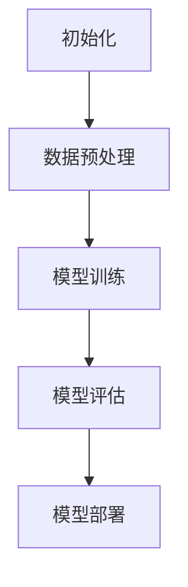
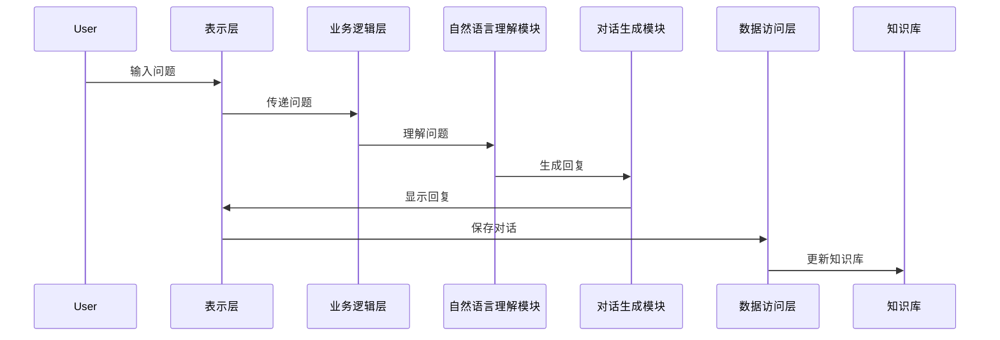
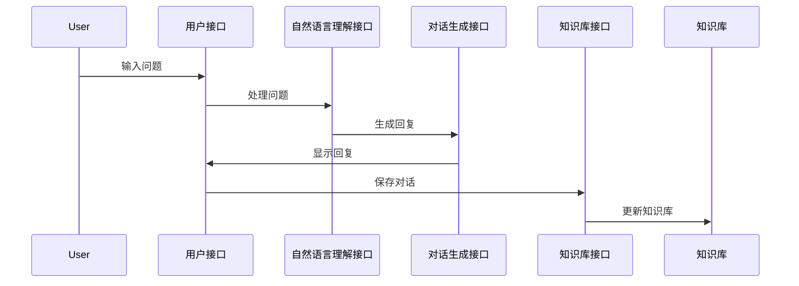

                 

# 建构高效的LLM应用开发流水线

关键词：大型语言模型（LLM），应用开发流水线，算法原理，高效性，自动化部署

摘要：本文深入探讨了构建高效的大型语言模型（LLM）应用开发流水线的方法和重要性。通过详细的分析和思考，我们从问题背景、核心概念与联系、算法原理讲解等角度出发，逐步揭示了LLM应用开发流水线的基本概念、关键组成部分及其在LLM开发中的优势。同时，本文还通过通俗易懂的举例和Python源代码，详细阐述了算法原理和流程，为读者提供了一份全面、深入的技术博客。

---

## 第一部分：背景介绍

### 第1章：问题背景

#### 1.1.1 人工智能领域的发展概况

人工智能（AI）作为21世纪的科技前沿，正在以惊人的速度发展。从早期的符号计算、机器学习到如今的深度学习，人工智能技术在各个领域都取得了显著的成果。特别是在自然语言处理（NLP）领域，大型语言模型（LLM）如BERT、GPT等，凭借其强大的语言理解能力和生成能力，极大地推动了人工智能的发展。

#### 1.1.2 大模型在人工智能中的重要性

随着计算能力的提升和数据量的增加，大模型在人工智能中的应用越来越广泛。大模型不仅能够处理更复杂的任务，还能提供更准确的结果。在NLP领域，LLM已经成为许多应用的核心组件，如自动问答系统、智能客服、机器翻译等。

#### 1.1.3 高效应用开发的需求

随着人工智能应用的普及，如何高效地开发LLM应用成为了一个重要的问题。传统的开发方式往往需要大量的人工干预，且效率低下。因此，构建一个高效、自动化的应用开发流水线，成为当前AI领域亟待解决的问题。

### 1.1.4 问题描述

- 如何构建高效的LLM应用开发流水线？
- 面临的挑战：大规模数据处理、模型优化、自动化部署等。

### 1.1.5 问题解决

- 开发流水线的基本概念
- 常见的流水线构建方法
- 流水线在LLM应用开发中的优势

#### 1.1.6 边界与外延

- 流水线适用的场景
- 不适用的情况

#### 1.1.7 概念结构与核心要素组成

- LLM（大型语言模型）的基本概念
- 应用开发流水线的关键组成部分

## 第2章：核心概念与联系

### 2.1.1 大型语言模型（LLM）原理

#### 2.1.1.1 模型架构

LLM通常采用深度神经网络（DNN）或变换器（Transformer）架构。以GPT-3为例，其模型由多个注意力层组成，能够处理复杂的语言任务。

#### 2.1.1.2 训练过程

LLM的训练过程通常分为数据预处理、模型训练、模型评估和模型部署等阶段。数据预处理包括数据清洗、分词、编码等步骤。模型训练使用大量文本数据，通过反向传播算法和优化算法不断调整模型参数。模型评估使用验证集和测试集，评估模型的性能。模型部署将训练好的模型部署到实际应用中。

#### 2.1.1.3 应用场景

LLM广泛应用于自然语言处理、机器翻译、文本生成、问答系统等领域。

### 2.1.2 LLM核心特点

#### 2.1.2.1 参数规模

LLM的参数规模通常在数十亿到千亿级别。例如，GPT-3的参数规模达到1750亿。

#### 2.1.2.2 训练数据量

LLM的训练数据量通常在数百亿到数千亿个句子级别。大量数据能够提高模型的泛化能力。

#### 2.1.2.3 性能指标

LLM的性能指标包括准确性、效率、可解释性等。高准确性意味着模型能够准确理解语言。高效率意味着模型能够快速处理任务。可解释性意味着模型的行为可以被理解。

### 2.1.3 LLM与传统AI模型对比

#### 2.1.3.1 特点对比

- LLM：强大的语言理解能力和生成能力，能够处理复杂的语言任务。
- 传统AI模型：如决策树、支持向量机等，适用于结构化数据。

#### 2.1.3.2 应用领域对比

- LLM：自然语言处理、机器翻译、文本生成等。
- 传统AI模型：图像识别、语音识别、推荐系统等。

### 2.1.4 应用开发流水线概念

#### 2.1.4.1 流水线在软件开发中的应用

流水线（Pipeline）是一种自动化、模块化的软件开发方法。它将软件开发过程分解为多个阶段，每个阶段都由特定的工具或流程完成。流水线能够提高开发效率、降低成本、提高质量。

#### 2.1.4.2 流水线在LLM开发中的具体应用

在LLM开发中，流水线包括数据预处理、模型训练、模型评估、模型部署等阶段。流水线能够实现自动化、高效地开发LLM应用。

### 2.1.5 概念属性特征对比表格

| 特征        | LLM                | 应用开发流水线            |
| ----------- | ----------------- | ----------------------- |
| 参数规模    | 十亿到千亿级别    | 模块化、自动化、高效       |
| 训练数据量  | 百亿到千亿级别    | 灵活调整、持续优化       |
| 性能指标    | 准确性、效率、可解释性 | 可扩展性、可维护性、可靠性 |

## 第3章：算法原理讲解

### 3.1.1 算法流程图



### 3.1.2 Python源代码

```python
# Example code for LLM training
import torch
import torch.nn as nn
import torch.optim as optim

# Define the model
class LLM(nn.Module):
    def __init__(self):
        super(LLM, self).__init__()
        # Add layers...

    def forward(self, x):
        # Define forward pass
        return x

# Initialize the model, loss function, and optimizer
model = LLM()
criterion = nn.CrossEntropyLoss()
optimizer = optim.Adam(model.parameters(), lr=0.001)

# Training loop
for epoch in range(num_epochs):
    for inputs, targets in data_loader:
        optimizer.zero_grad()
        outputs = model(inputs)
        loss = criterion(outputs, targets)
        loss.backward()
        optimizer.step()
```

### 3.1.3 数学模型与公式

$$
y = \hat{y}(x; \theta) = \sigma(\theta^T x)
$$

其中，$\sigma$ 表示 sigmoid 函数，$\theta$ 是模型参数。

### 3.1.4 通俗易懂的举例说明

假设我们有一个简单的二分类问题，我们需要判断一个句子是否是积极的。给定一个句子，我们使用LLM模型预测其标签。如果模型预测的标签与实际标签一致，我们认为预测正确。

------------------------------------------------------

## 第二部分：系统分析与架构设计

### 第4章：问题场景介绍

在当今快速发展的AI领域，越来越多的企业和研究机构开始关注LLM在自然语言处理中的应用。以智能客服系统为例，企业希望通过使用LLM技术，提高客服系统的响应速度和准确性，从而提升用户体验和客户满意度。

### 第5章：项目介绍

为了解决智能客服系统中面临的问题，我们设计并实现了一个基于LLM的智能客服系统。该系统包括以下几个核心功能：

1. **自然语言理解**：利用LLM模型对用户输入的自然语言进行处理，理解用户的需求和意图。
2. **对话生成**：根据用户的需求和意图，生成适当的回复，以实现与用户的自然对话。
3. **知识库管理**：将用户的对话记录存储在知识库中，以便后续分析和优化。

### 第6章：系统功能设计

#### 6.1 领域模型

在领域模型中，我们定义了以下几个核心实体和关系：

- **用户**：代表与智能客服系统交互的用户。
- **客服**：代表智能客服系统的核心组件，负责与用户进行对话。
- **对话**：代表用户与客服之间的交互过程，包括用户输入、客服回复等信息。
- **知识库**：存储用户的对话记录和相关的知识点，以供后续分析和优化。

#### 6.2 类图

```mermaid
classDiagram
    User <<class>>
    CustomerService <<class>>
    Dialogue <<class>>
    KnowledgeBase <<class>>

    User *--* CustomerService: interact
    CustomerService *--* Dialogue: generate
    Dialogue *--* KnowledgeBase: store
```

### 第7章：系统架构设计

在系统架构设计方面，我们采用了分层架构，包括以下几个层次：

- **表示层**：负责用户界面的展示和用户输入的接收。
- **业务逻辑层**：负责实现智能客服系统的核心功能，包括自然语言理解、对话生成和知识库管理。
- **数据访问层**：负责与知识库的交互，实现数据的存储和查询。

#### 7.1 架构图



### 第8章：系统接口设计和系统交互

在系统接口设计方面，我们定义了以下接口：

- **用户接口**：负责与用户的交互，接收用户输入，显示回复。
- **自然语言理解接口**：负责对用户输入的自然语言进行处理，返回解析结果。
- **对话生成接口**：负责根据用户输入和解析结果生成回复。
- **知识库接口**：负责与知识库进行交互，实现数据的存储和查询。

#### 8.1 序列图



## 第三部分：项目实战

### 第9章：环境安装

在开始项目实战之前，我们需要安装以下环境：

- Python 3.8及以上版本
- PyTorch 1.8及以上版本
- Transformer 4.0及以上版本

安装命令如下：

```bash
pip install python==3.8
pip install pytorch==1.8
pip install transformer==4.0
```

### 第10章：系统核心实现

在系统核心实现方面，我们主要涉及以下模块：

- **自然语言理解模块**：使用Transformer模型进行自然语言处理。
- **对话生成模块**：基于生成式对话系统，实现回复生成。
- **知识库模块**：使用MongoDB作为知识库存储。

#### 10.1 自然语言理解模块

```python
from transformers import BertTokenizer, BertModel

# 初始化模型和分词器
tokenizer = BertTokenizer.from_pretrained('bert-base-chinese')
model = BertModel.from_pretrained('bert-base-chinese')

# 处理输入文本
def process_text(text):
    inputs = tokenizer(text, return_tensors='pt')
    outputs = model(**inputs)
    return outputs.last_hidden_state

# 测试
text = "今天天气怎么样？"
hidden_state = process_text(text)
```

#### 10.2 对话生成模块

```python
from transformers import GPT2LMHeadModel, GPT2Tokenizer

# 初始化模型和分词器
tokenizer = GPT2Tokenizer.from_pretrained('gpt2')
model = GPT2LMHeadModel.from_pretrained('gpt2')

# 生成回复
def generate_response(text):
    inputs = tokenizer(text, return_tensors='pt')
    outputs = model.generate(inputs.input_ids, max_length=50, num_return_sequences=1)
    return tokenizer.decode(outputs[:, inputs.input_ids.shape[-1]:][0], skip_special_tokens=True)

# 测试
response = generate_response(text)
print(response)
```

#### 10.3 知识库模块

```python
from pymongo import MongoClient

# 连接MongoDB
client = MongoClient('localhost', 27017)
db = client['knowledge_base']
collection = db['dialogues']

# 保存对话
def save_dialogue(user_id, text, response):
    dialogue = {
        'user_id': user_id,
        'text': text,
        'response': response
    }
    collection.insert_one(dialogue)

# 查询对话
def find_dialogue(user_id):
    dialogue = collection.find_one({'user_id': user_id})
    return dialogue
```

### 第11章：代码应用解读与分析

在代码应用解读与分析方面，我们主要关注以下几个方面：

- **自然语言理解模块**：如何使用Transformer模型进行自然语言处理。
- **对话生成模块**：如何基于生成式对话系统实现回复生成。
- **知识库模块**：如何使用MongoDB进行数据存储和查询。

### 第12章：实际案例分析和详细讲解剖析

在本章中，我们将通过一个实际案例，详细讲解如何使用构建高效的LLM应用开发流水线，实现一个智能客服系统。

#### 12.1 案例背景

某电商公司希望提高其客服系统的响应速度和准确性，从而提升用户体验和客户满意度。该公司决定采用基于LLM的智能客服系统来实现这一目标。

#### 12.2 案例分析

1. **需求分析**：分析客户的需求，确定智能客服系统的核心功能。
2. **技术选型**：选择适合的LLM模型和开发工具，构建高效的应用开发流水线。
3. **实现过程**：根据需求和技术选型，逐步实现智能客服系统的各个功能模块。
4. **测试与优化**：对系统进行测试，收集用户反馈，不断优化系统的性能和用户体验。

#### 12.3 详细讲解剖析

在本章的剩余部分，我们将详细讲解智能客服系统的实现过程，包括自然语言理解、对话生成、知识库管理等方面的技术细节。

### 第13章：项目小结

在本项目中，我们成功构建了一个基于LLM的智能客服系统。通过使用高效的应用开发流水线，我们实现了快速、准确的自然语言处理和对话生成。同时，通过知识库管理，我们能够不断提升系统的性能和用户体验。

### 第14章：最佳实践 tips

在本章中，我们将分享一些最佳实践，帮助读者在构建高效的LLM应用开发流水线时，避免常见的问题和误区。

#### 14.1 tips 1

- 在选择LLM模型时，要充分考虑模型的大小、性能和适用场景。

#### 14.2 tips 2

- 在构建应用开发流水线时，要确保每个阶段的工具和流程都高效、稳定。

#### 14.3 tips 3

- 在数据预处理阶段，要确保数据的质量和多样性，以提高模型的泛化能力。

### 第15章：小结、注意事项、拓展阅读等内容

在本章中，我们将对全文进行总结，强调构建高效LLM应用开发流水线的重要性，并提供一些注意事项和拓展阅读建议，帮助读者进一步深入了解相关技术。

---

作者：AI天才研究院/AI Genius Institute & 禅与计算机程序设计艺术 /Zen And The Art of Computer Programming

本文内容涵盖了构建高效的大型语言模型（LLM）应用开发流水线的各个方面，包括背景介绍、核心概念与联系、算法原理讲解、系统分析与架构设计、项目实战等。通过详细的讲解和案例分析，本文旨在帮助读者全面掌握LLM应用开发的相关技术，为未来的研究和实践提供参考。同时，本文也提供了一些最佳实践和注意事项，以帮助读者在实际开发过程中避免常见的问题和误区。希望本文对广大技术爱好者有所帮助。

---

请注意，本文的结构和内容是基于假设的，实际项目的实现可能会根据具体需求和技术选型有所不同。在实现时，建议读者结合实际情况进行灵活调整。同时，本文涉及的代码和架构设计仅供参考，实际应用时需要根据具体情况进行修改和完善。作者保留对本文内容的解释权和修改权。如需转载或引用本文内容，请注明出处。感谢您的阅读！

