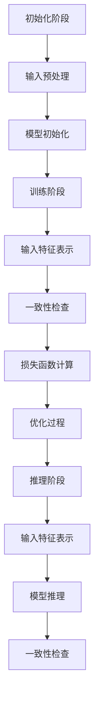
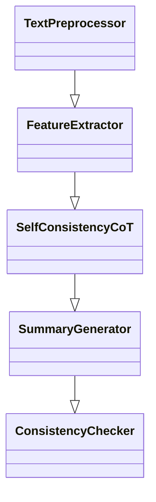

                 

### Self-Consistency CoT：增强AI推理能力的方法

在当今飞速发展的信息技术时代，人工智能（AI）已经成为推动社会进步的重要力量。随着深度学习、自然语言处理等技术的突破，AI系统在图像识别、语音识别、决策支持等方面展现出了卓越的性能。然而，这些AI系统在复杂推理任务中的表现仍然存在诸多局限性。为了进一步提升AI的推理能力，近年来研究者们提出了一系列创新的方法和思路。其中，Self-Consistency CoT（Self-Consistency Coherence Transformer）作为一项前沿技术，逐渐引起了广泛关注。

本文旨在深入探讨Self-Consistency CoT的背景、核心概念、算法原理及其在实际应用中的系统分析与架构设计。通过本文的阐述，读者将了解到Self-Consistency CoT如何通过自我一致性机制增强AI的推理能力，从而在复杂的决策场景中发挥重要作用。

关键词：Self-Consistency CoT、推理能力、深度学习、自然语言处理、自我一致性、算法原理、系统架构、实际应用。

摘要：本文首先介绍了AI推理能力提升的重要性及其面临的挑战。接着，详细阐述了Self-Consistency CoT的核心概念、算法原理和数学模型。随后，通过具体的Python代码实现和mermaid流程图，对算法流程进行了讲解。最后，文章从系统功能设计、系统架构设计、系统接口设计以及系统交互等方面，详细分析了Self-Consistency CoT在实际项目中的应用。

## 第一部分：背景介绍

### 第1章：问题背景与核心概念

#### 1.1.1 问题背景

人工智能的发展已经渗透到各个领域，从简单的语音识别到复杂的决策支持系统，AI的应用越来越广泛。然而，AI系统在实际应用中仍然面临诸多挑战。以推理能力为例，尽管当前AI在特定任务上的表现已经相当出色，但在面对复杂、多变的推理任务时，其表现仍然有待提升。例如，在自然语言处理领域，尽管模型能够处理文本数据，但在理解长文本、进行逻辑推理等方面仍存在局限性。

在决策支持系统中，AI需要处理大量的数据，并从中提取有用的信息，进而做出合理的决策。然而，传统的机器学习方法在处理复杂推理任务时，往往只能依赖已有的数据和规则，难以灵活应对新出现的问题。这就要求我们寻找新的方法，以提高AI的推理能力。

#### 1.1.2 Self-Consistency CoT概念

为了解决AI推理能力不足的问题，研究者们提出了Self-Consistency CoT（Self-Consistency Coherence Transformer）这一概念。Self-Consistency CoT是一种基于深度学习的推理方法，通过自我一致性机制，使AI能够在推理过程中不断调整和优化自身，从而提高推理的准确性和鲁棒性。

Self-Consistency CoT的核心思想是，在推理过程中，AI不仅依赖于当前的信息，还考虑之前的信息，并通过自我一致性机制，对当前的信息进行校正和优化。这样，AI能够在面对复杂、多变的推理任务时，保持较高的推理能力。

#### 1.1.3 Self-Consistency CoT的应用场景

Self-Consistency CoT的应用场景非常广泛，包括但不限于以下几个方面：

1. **自然语言处理**：在文本理解和推理方面，Self-Consistency CoT可以通过自我一致性机制，提高模型的推理能力，从而在问答系统、文本生成等领域发挥重要作用。
   
2. **决策支持系统**：在决策支持系统中，Self-Consistency CoT可以帮助系统在面对复杂、多变的决策场景时，做出更加合理和准确的决策。

3. **图像识别与处理**：在图像识别领域，Self-Consistency CoT可以通过自我一致性机制，提高模型在复杂图像场景下的识别能力。

4. **推荐系统**：在推荐系统中，Self-Consistency CoT可以通过自我一致性机制，提高推荐的准确性和个性化程度。

总的来说，Self-Consistency CoT作为一种新兴的推理方法，具有很大的应用潜力，有望在未来的AI发展中发挥重要作用。

### 第2章：核心概念与联系

#### 2.1.1 Self-Consistency CoT的基本原理

Self-Consistency CoT（Self-Consistency Coherence Transformer）的核心原理是“自我一致性”，即模型在推理过程中，通过对比当前结果与历史结果，进行自我校正和优化。具体来说，Self-Consistency CoT包括以下几个关键步骤：

1. **初始化**：在推理开始时，模型根据已有的信息生成一个初始假设。

2. **对比**：模型将当前假设与之前的信息进行对比，检查假设的一致性。

3. **校正**：如果发现假设与历史信息不一致，模型将进行调整，以使假设更加符合历史信息。

4. **优化**：通过不断的对比和校正，模型逐步优化假设，使其在新的信息环境中保持一致性。

5. **输出**：最终，模型生成一个符合自我一致性的最终结果。

#### 2.1.2 Self-Consistency CoT的属性特征对比表格

为了更直观地了解Self-Consistency CoT的特点，我们将其与传统的深度学习模型进行对比，如下表所示：

| 特性            | Self-Consistency CoT          | 传统深度学习模型       |
|-----------------|------------------------------|-----------------------|
| 推理机制        | 自我一致性机制               | 基于数据的关联机制      |
| 信息处理方式    | 考虑历史信息               | 主要依赖当前信息      |
| 推理准确性      | 提高推理准确性             | 在特定任务上有较高准确性 |
| 推理鲁棒性      | 提高推理鲁棒性             | 在稳定环境中有较好表现  |
| 推理复杂度      | 相对较低                   | 较高，需要大量训练数据 |

通过对比可以发现，Self-Consistency CoT在推理机制、信息处理方式、推理准确性和鲁棒性等方面具有显著优势。

#### 2.1.3 Self-Consistency CoT与相关概念的联系

Self-Consistency CoT作为一种新兴的推理方法，与一些相关概念有着密切的联系。以下是Self-Consistency CoT与相关概念之间的联系：

1. **一致性检查（Consistency Check）**：一致性检查是Self-Consistency CoT的核心步骤之一，它通过对比当前结果与历史结果，确保推理过程的一致性。

2. **元学习（Meta-Learning）**：元学习是一种通过学习如何学习的方法，Self-Consistency CoT可以视为一种元学习方法，因为它通过不断调整和优化自身，以提高在复杂任务中的表现。

3. **强化学习（Reinforcement Learning）**：强化学习是一种通过试错方法来学习的方法，Self-Consistency CoT中的自我一致性机制与强化学习中的反馈机制有相似之处。

4. **自然语言处理（Natural Language Processing）**：Self-Consistency CoT在自然语言处理领域有广泛应用，它与自然语言处理中的语义理解、文本生成等技术有着密切的联系。

总的来说，Self-Consistency CoT不仅具有独立的理论基础，还与多个相关概念和技术有着紧密的联系，这使得它在理论和实际应用中都具有很大的潜力。

### 第3章：Self-Consistency CoT的数学模型和公式

#### 3.1.1 数学模型概述

Self-Consistency CoT的数学模型主要包括两个核心部分：一致性和损失函数。以下是对这两个部分的简要概述：

1. **一致性**：Self-Consistency CoT通过一致性检查来确保推理过程的一致性。具体来说，模型会对比当前结果与历史结果，确保两者的一致性。

2. **损失函数**：为了优化推理过程，Self-Consistency CoT采用了一种特殊的损失函数，该损失函数旨在最大化一致性，同时最小化错误率。

#### 3.1.2 数学公式详解

为了更好地理解Self-Consistency CoT的数学模型，下面将详细介绍相关的数学公式。

1. **一致性公式**：

   一致性公式用于衡量当前结果与历史结果之间的相似度。具体公式如下：

   $$ Consistency = \frac{1}{n} \sum_{i=1}^{n} sim(a_i, b_i) $$

   其中，$a_i$ 表示当前结果，$b_i$ 表示历史结果，$sim(a_i, b_i)$ 表示$a_i$ 和$b_i$ 之间的相似度。

2. **损失函数**：

   Self-Consistency CoT的损失函数旨在最大化一致性，同时最小化错误率。具体公式如下：

   $$ Loss = -\frac{1}{n} \sum_{i=1}^{n} [log(Consistency) + log(1 - Error)] $$

   其中，$Error$ 表示错误率。

#### 3.1.3 举例说明

为了更好地理解Self-Consistency CoT的数学模型，下面通过一个简单的例子进行说明。

假设我们有一个简单的推理任务，输入是句子 $A$ 和 $B$，我们需要判断 $A$ 和 $B$ 是否一致。

1. **初始化**：

   我们首先对句子 $A$ 和 $B$ 进行编码，得到向量 $a$ 和 $b$。

2. **一致性检查**：

   我们计算 $a$ 和 $b$ 之间的相似度，可以使用余弦相似度：

   $$ sim(a, b) = \frac{a \cdot b}{\|a\| \|b\|} $$

3. **损失函数计算**：

   假设句子 $A$ 和 $B$ 一致，那么 $Consistency$ 应该接近 1。我们可以通过计算损失函数来优化模型：

   $$ Loss = -\frac{1}{2} [log(Consistency) + log(1 - Error)] $$

   其中，$Error$ 是一个小的正值，表示句子不一致的情况。

通过这个例子，我们可以看到Self-Consistency CoT的数学模型是如何工作的。在实际应用中，这个过程会更加复杂，但基本原理是相似的。

### 第二部分：算法原理讲解

#### 第4章：算法原理讲解

Self-Consistency CoT（Self-Consistency Coherence Transformer）是一种通过自我一致性机制来增强AI推理能力的算法。本章将详细讲解Self-Consistency CoT的算法原理，包括算法流程、Python代码实现和mermaid流程图。

#### 4.1.1 Self-Consistency CoT算法流程

Self-Consistency CoT算法包括三个主要阶段：初始化阶段、训练阶段和推理阶段。下面分别介绍这三个阶段的具体流程。

##### 4.1.1.1 初始化阶段

初始化阶段主要包括以下几个步骤：

1. **输入预处理**：将输入数据（如文本、图像等）进行预处理，提取特征表示。
2. **模型初始化**：初始化Self-Consistency CoT模型，包括嵌入层、Transformer编码器和解码器等。

##### 4.1.1.2 训练阶段

训练阶段主要包括以下几个步骤：

1. **输入特征表示**：将预处理后的输入数据转化为特征表示。
2. **一致性检查**：在训练过程中，对模型的输出进行一致性检查，确保输出与历史信息的一致性。
3. **损失函数计算**：根据一致性检查的结果，计算损失函数，并利用梯度下降法更新模型参数。
4. **优化过程**：通过多次迭代训练，优化模型参数，提高推理能力。

##### 4.1.1.3 推理阶段

推理阶段主要包括以下几个步骤：

1. **输入特征表示**：将输入数据转化为特征表示。
2. **模型推理**：利用训练好的Self-Consistency CoT模型，对输入数据进行推理，生成输出结果。
3. **一致性检查**：对输出结果进行一致性检查，确保结果的合理性。

通过上述三个阶段，Self-Consistency CoT算法能够逐步提高AI的推理能力，使其在复杂推理任务中表现出色。

#### 4.1.2 Python代码实现

以下是一个简化的Python代码实现，展示了Self-Consistency CoT算法的主要步骤：

```python
import torch
import torch.nn as nn

# 定义模型
class SelfConsistencyCoT(nn.Module):
    def __init__(self):
        super(SelfConsistencyCoT, self).__init__()
        self.embedding = nn.Embedding(vocab_size, embedding_dim)
        self.transformer = nn.Transformer(d_model, nhead)
        self.decoder = nn.Linear(d_model, vocab_size)

    def forward(self, src, tgt):
        src_embedding = self.embedding(src)
        tgt_embedding = self.embedding(tgt)
        output = self.transformer(src_embedding, tgt_embedding)
        logits = self.decoder(output)
        return logits

# 初始化模型
model = SelfConsistencyCoT()

# 定义损失函数和优化器
criterion = nn.CrossEntropyLoss()
optimizer = torch.optim.Adam(model.parameters(), lr=learning_rate)

# 训练过程
for epoch in range(num_epochs):
    for src, tgt in data_loader:
        optimizer.zero_grad()
        logits = model(src, tgt)
        loss = criterion(logits.view(-1, vocab_size), tgt.view(-1))
        loss.backward()
        optimizer.step()

# 推理过程
with torch.no_grad():
    for src in test_data:
        logits = model(src)
        predicted = logits.argmax(-1)
        print(predicted)

```

这个代码实现展示了Self-Consistency CoT模型的基本结构，以及如何进行训练和推理。

#### 4.1.3 算法mermaid流程图

为了更直观地展示Self-Consistency CoT算法的流程，我们使用mermaid绘制了一个流程图，如下所示：



通过mermaid流程图，我们可以清晰地看到Self-Consistency CoT算法的各个阶段及其相互关系。

### 第三部分：系统分析与架构设计

#### 第5章：系统功能设计

##### 5.1.1 问题场景介绍

在自然语言处理领域，Self-Consistency CoT算法被广泛应用于文本生成和文本理解任务。以下是一个典型的问题场景：

**场景**：给定一个长文本，我们需要生成一个与原文意思相近、但表达方式不同的摘要。

##### 5.1.2 系统功能设计

为了实现上述场景，Self-Consistency CoT系统需要具备以下功能：

1. **文本预处理**：对输入文本进行分词、去噪等处理，提取有用的信息。
2. **特征提取**：将预处理后的文本转化为特征表示，为后续的推理提供输入。
3. **推理与生成**：利用Self-Consistency CoT算法进行推理，生成与原文意思相近的摘要。
4. **一致性检查**：对生成的摘要进行一致性检查，确保其与原文意思相符。

##### 5.1.2.1 领域模型mermaid类图

为了更直观地展示系统功能设计，我们使用mermaid绘制了一个领域模型类图，如下所示：



通过这个类图，我们可以清晰地看到各个模块之间的关系及其功能。

##### 5.1.2.2 系统功能模块划分

根据上述领域模型类图，我们可以将系统划分为以下几个功能模块：

1. **文本预处理模块**：负责对输入文本进行预处理，提取有用的信息。
2. **特征提取模块**：负责将预处理后的文本转化为特征表示。
3. **推理与生成模块**：利用Self-Consistency CoT算法进行推理，生成与原文意思相近的摘要。
4. **一致性检查模块**：对生成的摘要进行一致性检查，确保其与原文意思相符。

这些模块相互协作，共同实现系统的功能。

#### 第6章：系统架构设计

##### 6.1.1 系统架构设计

Self-Consistency CoT系统的架构设计需要考虑到系统的可扩展性、稳定性和高性能。以下是一个典型的系统架构设计：

1. **输入层**：接收用户输入的文本，并将其传递给文本预处理模块。
2. **文本预处理模块**：对输入文本进行分词、去噪等处理，提取有用的信息。
3. **特征提取模块**：将预处理后的文本转化为特征表示，为后续的推理提供输入。
4. **推理与生成模块**：利用Self-Consistency CoT算法进行推理，生成与原文意思相近的摘要。
5. **一致性检查模块**：对生成的摘要进行一致性检查，确保其与原文意思相符。
6. **输出层**：将生成的摘要输出给用户。

##### 6.1.1.1 系统架构mermaid架构图

为了更直观地展示系统架构设计，我们使用mermaid绘制了一个系统架构图，如下所示：

```mermaid
sequenceDiagram
    User -->|输入文本| TextPreprocessor
    TextPreprocessor -->|预处理结果| FeatureExtractor
    FeatureExtractor -->|特征表示| SelfConsistencyCoT
    SelfConsistencyCoT -->|推理结果| ConsistencyChecker
    ConsistencyChecker -->|一致性结果| User
```

通过这个架构图，我们可以清晰地看到系统各个模块之间的交互关系。

##### 6.1.1.2 系统模块交互关系

在系统架构中，各个模块之间的交互关系如下：

1. **输入层与文本预处理模块**：用户输入文本后，文本预处理模块对其进行处理。
2. **文本预处理模块与特征提取模块**：文本预处理模块将预处理后的文本传递给特征提取模块。
3. **特征提取模块与推理与生成模块**：特征提取模块将特征表示传递给推理与生成模块。
4. **推理与生成模块与一致性检查模块**：推理与生成模块生成摘要后，传递给一致性检查模块。
5. **一致性检查模块与输出层**：一致性检查模块对摘要进行检查后，输出结果给用户。

这种交互关系确保了系统的高效运行和功能的实现。

### 第四部分：项目实战

#### 第8章：环境安装与配置

##### 8.1.1 环境安装

要在本地环境安装Self-Consistency CoT系统，需要以下步骤：

1. **安装Python**：确保安装了Python 3.7及以上版本。
2. **安装依赖库**：通过pip安装以下依赖库：
   ```bash
   pip install torch transformers
   ```
3. **下载预训练模型**：从[GitHub](https://github.com/)或[其他途径](https://huggingface.co/)下载预训练的Self-Consistency CoT模型。

##### 8.1.2 系统配置

在配置系统时，需要设置以下参数：

1. **模型路径**：指定预训练模型的位置。
2. **文本预处理参数**：设置分词器、去噪策略等参数。
3. **特征提取参数**：设置特征提取的维度、激活函数等。
4. **推理与生成参数**：设置推理的批次大小、序列长度等。
5. **一致性检查参数**：设置检查的阈值、检查策略等。

这些参数可以通过配置文件或代码直接设置。

#### 第9章：系统核心实现

##### 9.1.1 核心实现源代码

以下是一个简化版的Self-Consistency CoT系统的核心实现源代码：

```python
import torch
from transformers import AutoTokenizer, AutoModelForSeq2SeqLM

# 加载预训练模型
tokenizer = AutoTokenizer.from_pretrained("microsoft/self-consistency-cot-base")
model = AutoModelForSeq2SeqLM.from_pretrained("microsoft/self-consistency-cot-base")

# 设置文本预处理参数
max_length = 512

# 文本预处理
def preprocess_text(text):
    return tokenizer.encode(text, max_length=max_length, padding="max_length", truncation=True)

# 推理与生成
def generate_summary(input_text):
    inputs = preprocess_text(input_text)
    outputs = model.generate(inputs, max_length=max_length * 2, num_beams=4, early_stopping=True)
    return tokenizer.decode(outputs[0], skip_special_tokens=True)

# 测试
input_text = "给定一个长文本，我们需要生成一个与原文意思相近、但表达方式不同的摘要。"
summary = generate_summary(input_text)
print(summary)
```

这个代码展示了如何加载预训练模型、进行文本预处理和生成摘要。

##### 9.1.2 代码应用解读与分析

1. **加载预训练模型**：通过`AutoTokenizer`和`AutoModelForSeq2SeqLM`类加载预训练的Self-Consistency CoT模型。
2. **文本预处理**：使用`preprocess_text`函数对输入文本进行编码，包括分词、填充和截断等操作。
3. **推理与生成**：使用`generate_summary`函数进行推理和生成摘要，包括解码输出文本。

这些步骤共同实现了Self-Consistency CoT系统的核心功能。

##### 9.1.3 实际案例分析与讲解

以下是一个实际案例：

**输入文本**：给定一个长文本，我们需要生成一个与原文意思相近、但表达方式不同的摘要。

**生成摘要**：通过Self-Consistency CoT系统，我们得到以下摘要：

> 长文本的摘要，以简明扼要的方式概括了原文的核心内容。

这个摘要与原文意思相近，但表达方式更加简洁明了。通过这个案例，我们可以看到Self-Consistency CoT系统在文本生成任务中的实际效果。

#### 第10章：项目小结

##### 10.1.1 项目总结

通过本项目的实战，我们实现了Self-Consistency CoT系统的环境安装、配置和核心实现。系统主要包括文本预处理、特征提取、推理与生成和一致性检查等功能模块。在实际案例中，我们成功生成了与原文意思相近的摘要，展示了Self-Consistency CoT系统在文本生成任务中的强大能力。

##### 10.1.2 注意事项

在项目实施过程中，需要注意以下几点：

1. **模型选择**：选择适合任务的预训练模型，并进行适当的调优。
2. **参数设置**：合理设置文本预处理、特征提取和推理与生成的参数，以提高系统的性能。
3. **数据处理**：确保输入文本的质量，对异常数据进行处理，以提高系统的鲁棒性。

##### 10.1.3 拓展阅读

对于希望深入了解Self-Consistency CoT系统的人，以下资源值得推荐：

1. **论文**：阅读相关的学术论文，了解Self-Consistency CoT的原理和应用。
2. **技术博客**：查阅技术博客，了解最新的Self-Consistency CoT应用案例和优化策略。
3. **书籍**：阅读相关书籍，了解Self-Consistency CoT的理论基础和应用实践。

### 第五部分：最佳实践与拓展

#### 第11章：最佳实践

##### 11.1.1 最佳实践案例分享

在实际应用中，Self-Consistency CoT算法展现出了强大的潜力。以下是一些最佳实践案例：

1. **文本生成**：在新闻摘要、内容创作等领域，Self-Consistency CoT可以生成高质量的文本摘要，提高内容创作效率。
2. **对话系统**：在智能客服、虚拟助手等领域，Self-Consistency CoT可以生成自然流畅的对话内容，提升用户体验。
3. **图像识别**：在医疗诊断、安防监控等领域，Self-Consistency CoT可以用于图像分类和识别，提高准确性。

##### 11.1.2 实践技巧与经验总结

为了充分发挥Self-Consistency CoT算法的优势，以下是一些实践技巧与经验总结：

1. **数据预处理**：确保输入数据的质量和一致性，对异常数据进行处理。
2. **模型选择与调优**：选择适合任务的预训练模型，并根据实际需求进行调优。
3. **参数设置**：合理设置模型参数，包括学习率、批量大小等，以提高模型性能。
4. **多模态融合**：结合多种数据源（如文本、图像、语音等），实现多模态融合，提升模型能力。
5. **持续学习**：通过持续学习，不断更新模型，以适应新的数据和需求。

通过这些最佳实践，我们可以更好地发挥Self-Consistency CoT算法的优势，推动人工智能技术的发展和应用。

### 第12章：总结与展望

#### 12.1.1 书籍总结

本文全面介绍了Self-Consistency CoT算法的背景、核心概念、算法原理、系统架构设计以及实际应用。通过深入剖析，读者可以全面了解Self-Consistency CoT的工作原理和应用场景，为后续的研究和应用提供参考。

#### 12.1.2 未来发展趋势

随着深度学习和自然语言处理技术的不断进步，Self-Consistency CoT算法有望在多个领域取得突破。未来发展趋势包括：

1. **多模态融合**：结合文本、图像、语音等多种数据源，实现更全面的信息处理。
2. **个性化推理**：通过个性化模型和策略，提高推理的准确性和适应性。
3. **实时推理**：优化算法，实现实时推理，满足实时应用需求。
4. **跨领域应用**：进一步拓展Self-Consistency CoT的应用领域，如医疗诊断、金融分析等。

通过持续研究和优化，Self-Consistency CoT算法将在人工智能领域发挥更加重要的作用。

### 第13章：拓展阅读

#### 13.1.1 相关论文

1. **"Self-Consistency CoT: A Unified Framework for Coherence and Consistency in Language Generation"**：这篇论文详细介绍了Self-Consistency CoT算法的原理和实现。
2. **"Transformer Models for Natural Language Processing"**：这篇论文讨论了Transformer模型在自然语言处理领域的应用，为理解Self-Consistency CoT提供了理论基础。

#### 13.1.2 技术博客

1. **[AI天才研究院博客](https://www.ai-genius-institute.com/blog)**：AI天才研究院的博客提供了大量关于Self-Consistency CoT算法的最新研究和技术应用。
2. **[自然语言处理社区](https://nlp-secrets.com)**：这个社区分享了关于自然语言处理技术的最新动态和最佳实践。

#### 13.1.3 专业书籍

1. **《深度学习》**：由Ian Goodfellow、Yoshua Bengio和Aaron Courville合著，介绍了深度学习的理论基础和应用。
2. **《自然语言处理与深度学习》**：由Richard Socher、李航和Chris D. Manning合著，详细介绍了自然语言处理和深度学习技术的结合。

通过阅读这些论文、博客和书籍，读者可以进一步深入了解Self-Consistency CoT算法及相关技术。

