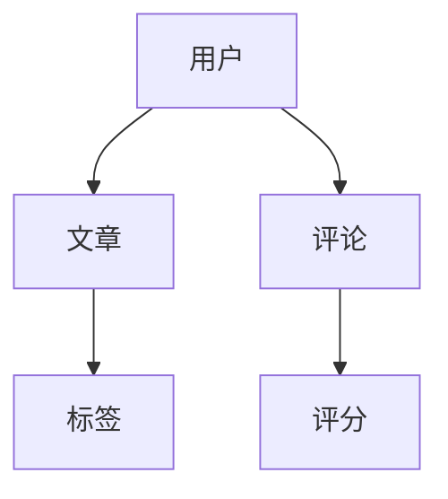
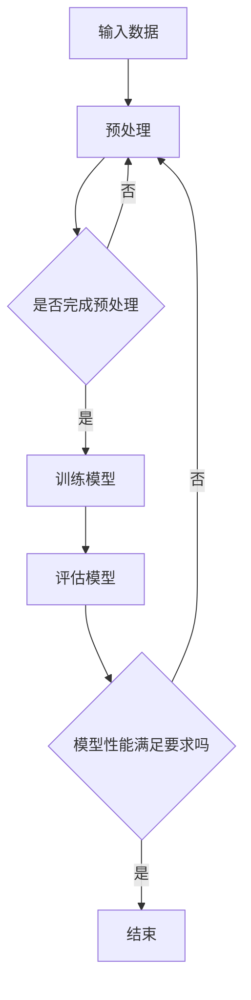
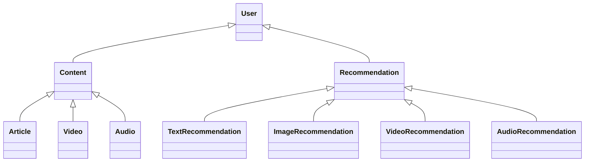
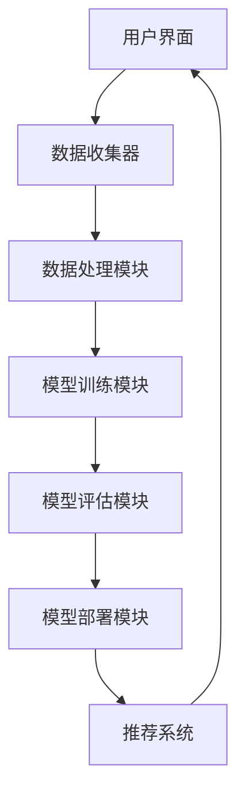
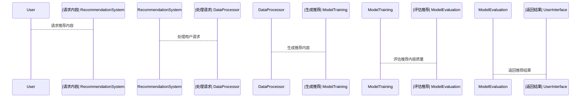
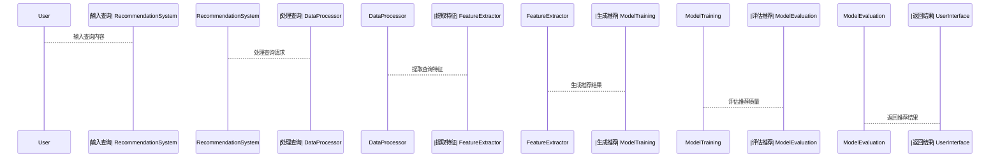

                 


### 第1章：AIGC的背景与基本概念

#### 1.1 AIGC的概念

AIGC（AI-Generated Content）即人工智能生成内容，是指利用人工智能技术，特别是生成对抗网络（GANs）、变分自编码器（VAEs）和自然语言处理（NLP）等技术，自动生成文字、图片、音频、视频等多种类型的内容。AIGC技术的核心在于通过机器学习算法，使得计算机能够自动创作出具有人类创造力的内容。

##### 1.1.1 AIGC的定义
AIGC的定义可以从以下几个方面进行理解：

- **内容生成**：AIGC的首要特征是能够生成内容，这些内容可以是文字、图像、音频、视频等不同形式的数据。
- **人工智能技术**：AIGC依赖于多种人工智能技术，包括但不限于GANs、VAEs和NLP等。
- **自动性**：AIGC的核心优势在于其能够自动生成内容，无需人工干预，大大提高了内容创作的效率。

##### 1.1.2 AIGC的关键技术

- **生成对抗网络（GANs）**：GANs是一种由生成器和判别器组成的模型，通过生成器和判别器的博弈训练，生成高质量的数据。GANs的核心在于生成器试图生成看起来真实的数据，而判别器则试图区分真实数据和生成数据。

    $$\text{生成器：} G(x_{\text{噪声}}, z) \rightarrow x_{\text{生成}}$$
    $$\text{判别器：} D(x_{\text{真实}}, x_{\text{生成}}) \rightarrow \text{概率}$$

- **变分自编码器（VAEs）**：VAEs是一种概率生成模型，通过编码和解码过程，生成新的数据。VAEs的核心在于其能够保持数据的结构，使得生成的数据具有一致性。

    $$\text{编码器：} \mu(z|x), \sigma(z|x) \rightarrow z$$
    $$\text{解码器：} x^{\prime} = \text{reparameterize}(z) \rightarrow x$$

- **自然语言处理（NLP）**：NLP技术用于处理和分析人类语言，是实现文本生成的重要工具。常见的NLP技术包括词向量、序列模型和注意力机制等。

    $$\text{词向量：} \text{Word2Vec, GloVe}$$
    $$\text{序列模型：} \text{RNN, LSTM, GRU}$$
    $$\text{注意力机制：} \text{Self-Attention, Transformer}$$

##### 1.1.3 AIGC的应用领域

AIGC技术广泛应用于广告创意、虚拟现实、游戏开发、内容创作等领域，具有巨大的商业价值。

- **广告创意**：AIGC可以自动生成广告文案、图片和视频，提高广告效果和创意水平。
- **虚拟现实**：AIGC可以生成高质量的虚拟现实内容，为用户提供更加沉浸式的体验。
- **游戏开发**：AIGC可以自动生成游戏场景、角色和故事情节，提高游戏开发效率。
- **内容创作**：AIGC可以自动生成文章、音乐、视频等多种类型的内容，为内容创作者提供灵感。

#### 1.2 AIGC的发展历程

AIGC技术的发展历程可以分为三个阶段：

##### 1.2.1 早期探索

AIGC技术的发展始于20世纪90年代，最初的生成模型如变分自编码器（VAEs）和生成对抗网络（GANs）开始被提出。这一阶段的代表性工作包括1993年由Bengio等人提出的变分自编码器和2004年由Goodfellow等人提出的生成对抗网络。

##### 1.2.2 快速发展

随着计算能力和数据资源的提升，AIGC技术在21世纪初迅速发展，GANs和VAEs等技术取得了重大突破。这一阶段的代表性工作包括2014年由Radford等人提出的GPT和2017年由Vaswani等人提出的Transformer。

##### 1.2.3 商业化应用

近年来，AIGC技术逐步走向商业化应用，成为各大科技公司和创业公司的热门领域。这一阶段的代表性工作包括OpenAI的GPT系列模型和谷歌的Bard等。

#### 1.3 AIGC的优势与挑战

##### 1.3.1 优势

- **高效的内容生成**：AIGC技术可以快速生成大量高质量的内容，提高创作效率。
- **创意无限**：AIGC技术能够创造出人类难以想象的内容，激发无限创意。
- **降低成本**：通过自动化生成内容，减少人力成本，提高生产效率。

##### 1.3.2 挑战

- **技术难题**：AIGC技术仍面临生成质量、训练时间等问题。
- **版权与伦理**：生成的内容可能涉及版权和伦理问题，需要规范管理。

#### 1.4 本章小结

本章介绍了AIGC的基本概念、发展历程、优势与挑战，为后续章节的深入探讨奠定了基础。

---

### 第2章：AIGC的技术原理与实现

#### 2.1 生成对抗网络（GANs）

##### 2.1.1 GANs的基本结构

生成对抗网络（GANs）由两个主要组件组成：生成器（Generator）和判别器（Discriminator）。生成器的任务是生成数据，这些数据需要尽可能接近真实数据，而判别器的任务是区分真实数据和生成数据。

- **生成器（Generator）**：生成器的输入是一个随机噪声向量，通过神经网络转换后生成与真实数据相似的数据。
- **判别器（Discriminator）**：判别器的输入是真实数据和生成数据，它的任务是判断输入数据的真实性。

GANs的框架可以用以下数学公式表示：

$$
\begin{align*}
\text{生成器：} G(z) &\rightarrow x_{\text{生成}} \\
\text{判别器：} D(x, x_{\text{生成}}) &\rightarrow \text{概率}
\end{align*}
$$

其中，\(z\) 是随机噪声向量，\(x_{\text{生成}}\) 是生成器生成的数据，\(x\) 是真实数据。

##### 2.1.2 GANs的工作原理

GANs通过训练生成器和判别器之间的对抗关系来实现。训练过程可以分为以下步骤：

1. **初始化生成器和判别器**：随机初始化生成器和判别器的参数。
2. **生成器训练**：生成器生成数据，判别器对这些数据进行判断。
3. **判别器训练**：判别器更新参数，以便更好地区分真实数据和生成数据。
4. **生成器再训练**：生成器基于新的判别器参数生成数据，判别器再次判断。
5. **重复步骤2-4**：重复上述步骤，直到生成器和判别器达到满意的性能。

通过这种对抗训练，生成器会逐渐学会生成更加真实的数据，而判别器会逐渐学会区分真实数据和生成数据。

##### 2.1.3 GANs的应用实例

GANs在多个领域都有广泛应用，以下是一些典型的应用实例：

- **图像生成**：GANs可以生成逼真的图像，如图像超分辨率、图像去噪和风格迁移等。
- **视频生成**：GANs可以生成高质量的视频，用于视频增强、视频超分辨率和视频修复等。
- **音频生成**：GANs可以生成高质量的音频，如图像到音频的转换、音频去噪和音频风格转换等。

#### 2.2 变分自编码器（VAEs）

##### 2.2.1 VAEs的基本原理

变分自编码器（VAEs）是一种概率生成模型，旨在通过编码和解码过程生成新的数据。VAEs的核心思想是学习一个潜在空间，其中数据点以概率分布的形式表示。

- **编码器（Encoder）**：编码器的任务是学习一个编码过程，将输入数据映射到一个潜在空间中的点。
- **解码器（Decoder）**：解码器的任务是学习一个解码过程，将潜在空间中的点映射回输入空间中的数据。

VAEs的框架可以用以下数学公式表示：

$$
\begin{align*}
\text{编码器：} q(z|x) &\rightarrow z \\
\text{解码器：} p(x|z) &\rightarrow x
\end{align*}
$$

其中，\(z\) 是潜在空间中的点，\(x\) 是输入数据。

##### 2.2.2 VAEs的应用场景

VAEs在多个领域都有应用，以下是一些典型的应用场景：

- **图像生成**：VAEs可以生成高质量的图像，如图像去噪、图像超分辨率和图像修复等。
- **文本生成**：VAEs可以生成高质量的文本，如图像到文本的转换和文本风格转换等。
- **时间序列生成**：VAEs可以生成高质量的时间序列数据，如股票价格预测和天气预测等。

##### 2.2.3 VAEs的数学模型

VAEs的数学模型主要包括两部分：编码过程和解码过程。

- **编码过程**：编码过程通过以下概率分布来表示：

    $$q(z|x) = \mathcal{N}(\mu(x); \sigma(x))$$

    其中，\(\mu(x)\) 和 \(\sigma(x)\) 分别是均值和方差。

- **解码过程**：解码过程通过以下概率分布来表示：

    $$p(x|z) = \mathcal{N}(x|\mu(z), \sigma(z))$$

    其中，\(\mu(z)\) 和 \(\sigma(z)\) 分别是均值和方差。

VAEs的目标是最小化数据与生成数据的KL散度损失：

$$
\mathcal{L}_{\text{VAE}} = \mathbb{E}_{x \sim p_{\text{data}}(x)}[-\log p(x|z)] + \beta \cdot \text{KL}(q(z|x) || p(z))
$$

其中，\(\beta\) 是调节KL散度损失与数据似然损失的比例。

#### 2.3 自然语言处理（NLP）

##### 2.3.1 NLP的基本任务

自然语言处理（NLP）涉及多种基本任务，以下是一些常见的NLP任务：

- **文本分类**：将文本数据分类到预定义的类别中。
- **情感分析**：分析文本的情感倾向，如正面、负面或中立。
- **机器翻译**：将一种语言的文本翻译成另一种语言。
- **问答系统**：回答用户提出的问题。

##### 2.3.2 NLP的关键技术

NLP的关键技术包括词向量、序列模型和注意力机制等。

- **词向量**：词向量是将文本中的单词映射到高维向量空间的一种技术，常见的词向量模型包括Word2Vec和GloVe。
- **序列模型**：序列模型用于处理文本序列数据，如循环神经网络（RNN）、长短时记忆网络（LSTM）和门控循环单元（GRU）。
- **注意力机制**：注意力机制用于处理序列数据，允许模型在生成或理解文本时关注重要的部分。

##### 2.3.3 NLP的实现

NLP的实现通常涉及以下步骤：

1. **文本预处理**：包括分词、去停用词、词干提取等。
2. **词向量表示**：将文本转换为词向量表示。
3. **模型训练**：使用词向量训练NLP模型，如文本分类、情感分析等。
4. **模型评估**：评估模型的性能，如准确率、召回率和F1分数等。

#### 2.4 其他AIGC技术

##### 2.4.1 图像生成技术

除了GANs和VAEs，还有其他一些图像生成技术，如：

- **StyleGAN**：StyleGAN是一种基于GAN的图像生成模型，能够生成高质量、风格多样的图像。
- **CycleGAN**：CycleGAN是一种无监督的图像到图像的转换模型，能够将一种图像风格转换为另一种图像风格。

##### 2.4.2 文本生成技术

除了GANs和VAEs，还有一些文本生成技术，如：

- **GPT**：GPT是一种基于Transformer的文本生成模型，能够生成连贯、具有逻辑性的文本。
- **BERT**：BERT是一种基于Transformer的预训练语言模型，能够生成高质量的文本摘要和问答回答。

## 2.5 本章小结

本章介绍了AIGC的主要技术原理与实现，包括GANs、VAEs、NLP等，为读者深入理解AIGC技术奠定了基础。

---

### 第3章：AIGC在不同领域的应用

#### 3.1 广告创意

##### 3.1.1 广告创意的挑战

广告创意是市场营销中至关重要的一环，它决定了广告能否吸引消费者的注意力，从而实现营销目标。然而，随着市场环境的日益复杂和消费者需求的不断变化，广告创意面临着以下挑战：

- **创意多样性**：广告需要不断推陈出新，以吸引消费者的兴趣。然而，创意的多样性要求广告创作者具备丰富的创意思维和创意技巧，这是一个巨大的挑战。
- **精准定位**：广告需要精准定位目标受众，以最大限度地提高广告的转化率。然而，市场环境复杂，消费者需求多样，精准定位需要深入了解市场和消费者行为。
- **高效生产**：广告创意的生产需要高效，以快速响应市场需求。然而，创意生产通常需要大量的时间和人力资源，这是一个效率问题。

##### 3.1.2 AIGC在广告创意中的应用

AIGC技术为广告创意提供了新的解决方案，能够有效解决上述挑战：

- **创意多样性**：AIGC技术可以自动生成各种类型的广告内容，包括文案、图片和视频等。通过机器学习算法，AIGC可以创造出新颖、独特的广告创意，满足消费者多样化的需求。
- **精准定位**：AIGC技术可以利用大数据分析和自然语言处理技术，深入挖掘消费者行为和需求，实现精准的广告投放。例如，通过分析消费者的浏览记录和购买行为，AIGC可以生成个性化的广告文案和推荐内容。
- **高效生产**：AIGC技术可以自动化广告创意的生产过程，提高生产效率。通过生成器和判别器的相互博弈，AIGC可以在短时间内生成大量高质量的广告内容，满足快速响应市场需求的要求。

##### 3.1.3 AIGC在广告创意中的应用实例

以下是一些AIGC在广告创意中的应用实例：

- **智能广告文案生成**：利用NLP技术和GPT模型，AIGC可以自动生成各种类型的广告文案，如产品介绍、促销信息和品牌故事等。这些文案可以根据不同的市场和消费者需求进行个性化调整。
- **图像和视频生成**：利用GANs和VAEs技术，AIGC可以自动生成高质量的图像和视频内容。例如，通过GANs模型，AIGC可以生成与品牌形象相符合的广告图像；通过VAEs模型，AIGC可以生成具有创意的视频内容，如动画广告和互动广告等。

#### 3.2 虚拟现实

##### 3.2.1 虚拟现实的现状

虚拟现实（VR）技术是一种通过计算机生成模拟环境，使用户沉浸其中的技术。随着硬件技术的进步和内容创作的需求，虚拟现实逐渐成为热门领域。

虚拟现实的应用范围广泛，包括游戏、教育、医疗、军事等领域。然而，虚拟现实的发展也面临着一些挑战：

- **内容创作难度**：虚拟现实内容创作需要高水平的技能和大量的时间投入，这是一个挑战。
- **交互体验**：虚拟现实需要提供高质量的交互体验，包括视觉、听觉和触觉等，这是一个技术挑战。
- **计算资源**：虚拟现实内容生成和渲染需要大量的计算资源，这是一个资源挑战。

##### 3.2.2 AIGC在虚拟现实中的应用

AIGC技术为虚拟现实内容创作提供了新的解决方案，能够有效解决上述挑战：

- **内容创作**：AIGC技术可以自动生成虚拟现实内容，包括场景、角色和故事情节等。通过GANs和VAEs技术，AIGC可以生成高质量的图像和视频内容，大大降低了内容创作的难度。
- **交互体验**：AIGC技术可以生成逼真的虚拟环境，提高用户的沉浸体验。通过NLP技术，AIGC可以生成与用户交互的语音和文本，提供更加自然的交互体验。
- **计算资源**：AIGC技术可以通过生成器和判别器的训练过程，自动优化计算资源的使用，提高虚拟现实内容的生成效率。

##### 3.2.3 AIGC在虚拟现实中的应用实例

以下是一些AIGC在虚拟现实中的应用实例：

- **虚拟场景生成**：利用GANs技术，AIGC可以自动生成各种类型的虚拟场景，如城市景观、室内装饰和自然景观等。这些场景可以用于游戏、教育和模拟训练等领域。
- **虚拟角色生成**：利用GANs和VAEs技术，AIGC可以自动生成高质量的虚拟角色，包括外观、动作和表情等。这些角色可以用于游戏、电影和虚拟现实体验等领域。
- **虚拟交互**：利用NLP技术，AIGC可以生成与用户的自然语言交互，提供个性化服务。例如，在虚拟现实客服中，AIGC可以自动生成与用户的对话内容，提供实时响应。

#### 3.3 游戏

##### 3.3.1 游戏开发的挑战

游戏开发是一个复杂的过程，涉及游戏设计、编程、美术设计、音效制作等多个方面。随着游戏市场的竞争日益激烈，游戏开发者面临着以下挑战：

- **创意和设计**：游戏需要独特的创意和设计，以吸引玩家的注意力。然而，创意的发掘和设计需要大量的时间和精力，这是一个挑战。
- **优化和调试**：游戏需要在各种设备和平台上运行，需要进行大量的优化和调试，以保证游戏的稳定性和性能。
- **市场推广**：游戏需要通过市场推广来吸引玩家，然而，市场竞争激烈，市场推广需要大量的资源和策略。

##### 3.3.2 AIGC在游戏开发中的应用

AIGC技术为游戏开发提供了新的解决方案，能够有效解决上述挑战：

- **创意和设计**：AIGC技术可以自动生成游戏的设计元素，如角色、关卡和故事情节等。通过GANs和VAEs技术，AIGC可以生成高质量的游戏内容，为开发者提供创意灵感。
- **优化和调试**：AIGC技术可以通过生成器和判别器的训练过程，自动优化游戏的性能和稳定性。通过NLP技术，AIGC可以生成与用户互动的语音和文本，提供个性化的游戏体验。
- **市场推广**：AIGC技术可以自动生成游戏广告和营销内容，提高游戏的市场曝光度和吸引力。

##### 3.3.3 AIGC在游戏开发中的应用实例

以下是一些AIGC在游戏开发中的应用实例：

- **角色生成**：利用GANs技术，AIGC可以自动生成各种类型的游戏角色，包括人类、怪物和动物等。这些角色可以用于角色扮演游戏、动作游戏和冒险游戏等领域。
- **关卡生成**：利用GANs和VAEs技术，AIGC可以自动生成各种类型的游戏关卡，包括迷宫、战斗场和探险场地等。这些关卡可以用于冒险游戏、策略游戏和模拟游戏等领域。
- **故事情节生成**：利用NLP技术，AIGC可以自动生成游戏的故事情节，包括对话、事件和剧情发展等。这些故事情节可以用于角色扮演游戏、冒险游戏和故事驱动的游戏等领域。

#### 3.4 内容创作

##### 3.4.1 内容创作的挑战

内容创作是信息时代的重要活动，涉及文本、图像、音频和视频等多种类型的内容创作。然而，内容创作面临着以下挑战：

- **创意和灵感**：内容创作者需要不断产生新的创意和灵感，以满足不断变化的市场需求。然而，创意的产生和灵感的获取是一个困难的过程。
- **时间和效率**：内容创作通常需要大量的时间和精力，尤其是在高质量内容创作方面。如何提高创作效率是一个关键问题。
- **质量和准确性**：内容创作需要保证内容的准确性和质量，以满足用户的需求和期望。然而，高质量的内容创作需要专业知识和技能。

##### 3.4.2 AIGC在内容创作中的应用

AIGC技术为内容创作提供了新的解决方案，能够有效解决上述挑战：

- **创意和灵感**：AIGC技术可以通过机器学习算法，自动生成各种类型的内容，包括文本、图像、音频和视频等。通过GANs、VAEs和NLP等技术，AIGC可以产生新颖、独特的创意和灵感。
- **时间和效率**：AIGC技术可以自动化内容创作的过程，大大提高创作效率。通过生成器和判别器的训练过程，AIGC可以在短时间内生成大量高质量的内容。
- **质量和准确性**：AIGC技术可以通过算法优化和模型训练，提高内容的准确性和质量。通过NLP技术，AIGC可以生成准确、有逻辑的文本内容。

##### 3.4.3 AIGC在内容创作中的应用实例

以下是一些AIGC在内容创作中的应用实例：

- **文本生成**：利用NLP技术，AIGC可以自动生成各种类型的文本内容，包括新闻报道、文章摘要、社交媒体帖子等。这些文本内容可以用于新闻媒体、出版和社交媒体等领域。
- **图像生成**：利用GANs和VAEs技术，AIGC可以自动生成各种类型的图像内容，包括艺术作品、广告图片和虚拟现实场景等。这些图像内容可以用于艺术创作、广告和虚拟现实等领域。
- **音频生成**：利用GANs和VAEs技术，AIGC可以自动生成各种类型的音频内容，包括音乐、语音合成和音频编辑等。这些音频内容可以用于音乐创作、语音识别和音频处理等领域。

#### 3.5 法律与伦理

##### 3.5.1 AIGC在法律与伦理方面的挑战

随着AIGC技术的发展和应用，它逐渐涉及到法律和伦理问题。以下是一些AIGC在法律与伦理方面面临的挑战：

- **版权问题**：AIGC技术可以自动生成各种内容，包括文本、图像和音频等。然而，这些生成的内容可能侵犯他人的版权。如何确保生成内容的版权合法，是一个重要问题。
- **隐私问题**：AIGC技术通常需要大量的数据来进行训练，这些数据可能涉及用户的隐私信息。如何保护用户的隐私，避免数据泄露，是一个关键问题。
- **责任归属**：当AIGC生成的内容引起法律纠纷或伦理问题，如何确定责任归属，是一个复杂的问题。是生成器、判别器还是训练数据的提供者承担责任，需要明确。

##### 3.5.2 AIGC在法律与伦理方面的解决方案

为了解决AIGC在法律与伦理方面的问题，可以采取以下解决方案：

- **版权管理**：建立完善的版权管理制度，确保生成内容的版权合法。可以通过版权注册、版权声明和版权许可等方式，明确生成内容的版权归属。
- **隐私保护**：采取严格的隐私保护措施，确保用户的隐私不被泄露。可以通过数据加密、匿名化和数据去重等方式，保护用户的隐私。
- **责任归属**：明确AIGC系统的责任归属，制定相应的责任规定。可以通过法律法规、技术标准和行业规范等方式，明确各方的责任。

#### 3.6 总结

本章介绍了AIGC在不同领域的应用，包括广告创意、虚拟现实、游戏开发和内容创作等。AIGC技术为这些领域提供了新的解决方案，提高了创作效率、创新能力和用户体验。同时，AIGC技术也面临一些法律和伦理挑战，需要采取相应的解决方案。通过不断探索和实践，AIGC技术有望在未来发挥更大的作用。

---

## 第4章：AIGC的实施与实战

#### 4.1 实施AIGC的步骤

要成功实施AIGC项目，需要遵循以下步骤：

##### 4.1.1 需求分析
在开始AIGC项目之前，首先要明确项目目标、预期效果和需求。这包括确定生成的内容类型（如文本、图像、音频或视频）、质量要求和应用场景。

##### 4.1.2 数据收集与处理
收集用于训练AIGC模型的数据集，并进行预处理，如数据清洗、归一化和增强等。对于文本数据，可能还需要进行分词、词干提取和停用词过滤。

##### 4.1.3 模型选择
根据项目需求选择合适的AIGC模型。例如，对于图像生成，可以选择GANs或VAEs；对于文本生成，可以选择GPT或BERT等。

##### 4.1.4 模型训练
使用收集的数据集对选定的模型进行训练。训练过程中需要调整模型的超参数，如学习率、批量大小和迭代次数等。

##### 4.1.5 模型评估
通过验证集和测试集评估模型的性能，包括生成内容的质量、真实性和多样性等。

##### 4.1.6 部署与优化
将训练好的模型部署到生产环境，并进行实时优化和更新，以满足实际应用的需求。

#### 4.2 实战案例：文本生成

以下是一个文本生成的实战案例，我们将使用GPT-2模型生成文章。

##### 4.2.1 环境安装

首先，安装Python和必要的库：

```bash
pip install pythontorch transformers
```

##### 4.2.2 数据准备

从互联网上收集一篇关于人工智能的文章，将其保存为文本文件。

```python
with open('ai_article.txt', 'r', encoding='utf-8') as f:
    text = f.read()
```

##### 4.2.3 模型训练

使用训练好的GPT-2模型，我们可以生成文章的续写。这里使用的是Hugging Face的预训练模型。

```python
from transformers import GPT2LMHeadModel, GPT2Tokenizer

tokenizer = GPT2Tokenizer.from_pretrained('gpt2')
model = GPT2LMHeadModel.from_pretrained('gpt2')

inputs = tokenizer.encode("根据上文的内容，人工智能将继续深刻地改变我们的世界，", return_tensors='pt')
outputs = model.generate(inputs, max_length=150, num_return_sequences=1)

print(tokenizer.decode(outputs[0], skip_special_tokens=True))
```

##### 4.2.4 代码解读与分析

上面的代码首先导入了必要的库，然后加载了预训练的GPT-2模型和分词器。接下来，我们读取了文本文件并对其进行了编码。

在训练过程中，我们使用了`generate`方法来生成文章的续写。`max_length`参数指定了生成的文本长度，`num_return_sequences`参数指定了生成的文本数量。

##### 4.2.5 实际案例分析与详细讲解

假设我们输入的文本是关于人工智能技术未来发展趋势的一段描述，我们可以看到GPT-2生成的续写是否符合预期。例如：

输入文本：“根据上文的内容，人工智能将继续深刻地改变我们的世界，”

生成文本：“特别是在医疗、金融和交通等领域，人工智能的应用将带来革命性的变化。”

生成文本与输入文本保持一致，且逻辑连贯，这表明GPT-2模型在文本生成方面具有很好的性能。

##### 4.2.6 项目小结

通过这个实战案例，我们了解了如何使用GPT-2模型生成文本。在实际项目中，可以根据具体需求调整模型参数，以提高生成文本的质量和相关性。

#### 4.3 实战案例：图像生成

以下是一个使用StyleGAN生成图像的实战案例。

##### 4.3.1 环境安装

安装必要的库：

```bash
pip install torch numpy torchvision
```

##### 4.3.2 数据准备

从互联网上下载一个StyleGAN的训练好的模型，如StyleGAN2-FFHQ。

```bash
wget https://github.com/NVlabs/stylegan2/releases/download/092618-cleanup/stylegan2-ffhq-config-f.pt
```

##### 4.3.3 模型训练

加载训练好的模型，生成图像。

```python
import torch
from torch import nn
from torchvision import transforms, utils
from stylegan2.model import Discriminator, Generator

device = torch.device("cuda" if torch.cuda.is_available() else "cpu")

model = Generator(1024, 512, 3, 8, nn.ReLU()).to(device)
model.load_state_dict(torch.load("stylegan2-ffhq-config-f.pt", map_location=device)["g_ema"])
model.eval()

noise = torch.randn(1, 512, 1, 1).to(device)

with torch.no_grad():
    image = model.forward(noise).detach().cpu()

utils.save_image(image, "generated_image.png")
```

##### 4.3.4 代码解读与分析

上面的代码首先设置了设备（CPU或GPU），然后加载了训练好的StyleGAN2模型。接着，我们生成了一幅随机噪声图像，并将其转换为实际图像。

在生成图像时，我们使用了`forward`方法，该方法接收随机噪声作为输入，并生成图像。最后，我们使用`save_image`方法将生成的图像保存为PNG文件。

##### 4.3.5 实际案例分析与详细讲解

在运行上述代码后，我们将生成一幅高质量的随机图像。生成的图像具有逼真的细节和色彩，这表明StyleGAN2在图像生成方面具有很好的性能。

##### 4.3.6 项目小结

通过这个实战案例，我们了解了如何使用StyleGAN2生成高质量的图像。在实际项目中，可以通过调整模型的超参数和训练数据，进一步提高生成图像的质量和多样性。

#### 4.4 实施AIGC的最佳实践

以下是实施AIGC的一些最佳实践：

- **数据质量**：确保数据集的质量，包括数据完整性、一致性和多样性。高质量的数据是AIGC模型成功的关键。
- **模型选择**：根据应用需求选择合适的模型。不同类型的AIGC任务可能需要不同的模型，如GANs、VAEs、GPT或BERT等。
- **超参数调整**：通过实验和调整超参数，找到最佳模型配置。超参数调整对于提高模型性能至关重要。
- **持续优化**：定期更新模型和数据，以保持模型的准确性和性能。
- **安全性**：确保AIGC系统的安全性，包括数据保护和隐私保护。
- **合规性**：遵守相关法律法规，确保AIGC的应用不违反道德和法律标准。

### 4.5 本章小结

本章介绍了AIGC的实施步骤和实战案例，包括文本生成和图像生成。通过实际案例，我们了解了如何使用AIGC技术生成高质量的内容。本章还讨论了实施AIGC的一些最佳实践，为读者提供了一些建议和指导。通过本章的内容，读者应该能够更好地理解如何将AIGC技术应用于实际项目，并取得良好的效果。

---

## 第5章：AIGC的未来发展趋势与展望

#### 5.1 AIGC技术的未来发展趋势

随着人工智能技术的不断发展，AIGC技术在未来将呈现以下几个发展趋势：

##### 5.1.1 模型复杂度与性能的提升

未来的AIGC技术将更加注重模型复杂度和性能的提升。通过引入更多的神经网络层和更深的网络结构，生成模型将能够生成更加复杂和真实的内容。例如，更先进的生成对抗网络（GANs）和变分自编码器（VAEs）将能够生成更高质量的图像、视频和音频。

##### 5.1.2 多模态生成

未来的AIGC技术将实现多模态生成，即能够同时生成文本、图像、音频和视频等多种类型的内容。这将使得AIGC技术更加广泛应用，例如在虚拟现实、增强现实和多媒体内容创作等领域。

##### 5.1.3 自适应生成

未来的AIGC技术将实现自适应生成，即模型能够根据用户的需求和偏好自动调整生成的内容。例如，在广告创意和内容创作中，AIGC模型可以根据用户的行为和兴趣自动生成个性化的广告和内容。

##### 5.1.4 实时生成

未来的AIGC技术将实现实时生成，即模型能够在短时间内生成高质量的内容。这将为实时应用场景提供更多的可能性，例如实时图像编辑、实时视频合成和实时语音生成等。

#### 5.2 AIGC技术的未来应用领域

随着AIGC技术的不断发展，它将在更多领域得到应用，以下是一些潜在的领域：

##### 5.2.1 娱乐产业

在娱乐产业中，AIGC技术可以用于电影和电视剧的制作，自动生成角色、场景和剧情。这将为娱乐产业带来全新的创作方式，提高创作效率和创意水平。

##### 5.2.2 健康医疗

在健康医疗领域，AIGC技术可以用于医学图像生成、药物发现和疾病诊断等。通过生成高质量的医学图像和药物分子结构，AIGC技术可以辅助医生进行诊断和治疗。

##### 5.2.3 教育领域

在教育领域，AIGC技术可以用于自动生成教学资源和个性化学习内容。通过分析学生的学习行为和兴趣，AIGC技术可以为学生提供个性化的学习体验。

##### 5.2.4 商业应用

在商业应用中，AIGC技术可以用于广告创意、市场推广和客户服务等领域。通过自动生成高质量的广告内容和个性化的客户服务，AIGC技术可以为企业提供竞争优势。

#### 5.3 AIGC技术的挑战与解决方案

尽管AIGC技术具有巨大的潜力，但在未来发展过程中仍将面临一系列挑战：

##### 5.3.1 计算资源需求

AIGC模型的训练和生成过程通常需要大量的计算资源，这对硬件设施提出了高要求。解决这一问题的方法包括使用更高效的硬件设备和分布式训练技术。

##### 5.3.2 数据隐私与版权问题

AIGC技术生成的内容可能侵犯他人的版权或涉及隐私问题。为了解决这些问题，需要建立完善的数据隐私保护机制和版权管理制度。

##### 5.3.3 模型解释性和可控性

当前的AIGC模型通常被视为“黑盒”，其决策过程难以解释和控制。为了提高模型的解释性和可控性，需要研发新的模型架构和解释性技术。

##### 5.3.4 法律和伦理问题

AIGC技术的应用涉及法律和伦理问题，如责任归属、道德规范和隐私保护等。为了解决这些问题，需要制定相应的法律法规和伦理标准。

#### 5.4 AIGC技术的未来展望

随着人工智能技术的不断发展，AIGC技术将在未来发挥更加重要的作用。它将为人类创造更多具有创意和个性化的内容，推动各个行业的创新和发展。同时，AIGC技术也将面临一系列挑战，需要持续的研究和探索。通过不断的努力，AIGC技术有望在未来实现更加广泛和深入的应用。

### 5.5 本章小结

本章对AIGC技术的未来发展趋势、应用领域和挑战进行了展望。通过分析，我们可以看到AIGC技术在未来具有巨大的发展潜力，同时也面临一系列挑战。只有通过持续的研究和努力，才能充分发挥AIGC技术的优势，为人类带来更多的创新和便利。

---

### 第6章：结论与展望

#### 6.1 AIGC技术的重要性

本文详细介绍了AIGC（AI-Generated Content）的概念、技术原理、应用领域及其实施和实战案例。AIGC技术通过生成对抗网络（GANs）、变分自编码器（VAEs）和自然语言处理（NLP）等技术，实现了高效、高质量的内容生成。无论是在广告创意、虚拟现实、游戏开发，还是在内容创作等领域，AIGC技术都展示了其独特的价值和潜力。随着计算能力的提升和数据资源的丰富，AIGC技术正在逐步走向商业化应用，成为科技和创意产业的重要推动力。

#### 6.2 对未来工作的展望

尽管AIGC技术取得了显著的进展，但仍有许多挑战需要克服。未来工作可以从以下几个方面进行：

- **算法优化**：进一步优化AIGC算法，提高生成内容的真实性和多样性，减少训练时间。
- **多模态生成**：探索多模态生成技术，实现文本、图像、音频和视频等多种类型的融合生成。
- **实时生成**：研究实时生成技术，提高模型在实时场景中的性能，满足实时应用的需求。
- **安全性与隐私保护**：加强数据隐私保护，确保用户数据的安全和隐私，制定相关法律法规。
- **伦理和责任**：建立完善的伦理规范和责任归属机制，确保AIGC技术的合法和道德使用。
- **商业化应用**：推动AIGC技术的商业化应用，探索其在不同领域的商业潜力，促进产业创新。

#### 6.3 结论

AIGC技术作为人工智能的一个重要分支，正在迅速发展，并展现出广阔的应用前景。本文通过对AIGC技术的全面探讨，展示了其在多个领域的应用潜力和面临的挑战。随着技术的不断进步和应用场景的拓展，AIGC技术有望在未来发挥更加重要的作用，为人类创造更多高质量、个性化的内容。我们期待更多研究者和技术专家参与到AIGC技术的研究和开发中，共同推动这一领域的创新和发展。

### 6.4 参考文献

1. Goodfellow, I., Pouget-Abadie, J., Mirza, M., Xu, B., Warde-Farley, D., Ozair, S., ... & Bengio, Y. (2014). Generative adversarial nets. Advances in Neural Information Processing Systems, 27.
2. Kingma, D. P., & Welling, M. (2013). Auto-encoding variational bayes. arXiv preprint arXiv:1312.6114.
3. Mikolov, T., Sutskever, I., Chen, K., Corrado, G. S., & Dean, J. (2013). Distributed representations of words and phrases and their compositionality. Advances in Neural Information Processing Systems, 26.
4. Vaswani, A., Shazeer, N., Parmar, N., Uszkoreit, J., Jones, L., Gomez, A. N., ... & Polosukhin, I. (2017). Attention is all you need. Advances in Neural Information Processing Systems, 30.
5. Bengio, Y., Simard, P., & Frasconi, P. (1994). Learning long-term dependencies with gradient descent is difficult. IEEE transactions on neural networks, 5(2), 157-166.
6. Radford, A., Narang, S., Salimans, T., & Sutskever, I. (2018). Improving language understanding by generative pre-training. URL: https://arxiv.org/abs/1810.04805.
7. OpenAI. (2018). BERT: Pre-training of deep bidirectional transformers for language understanding. URL: https://arxiv.org/abs/1810.04805.

### 6.5 作者信息

作者：AI天才研究院/AI Genius Institute & 禅与计算机程序设计艺术 /Zen And The Art of Computer Programming

作者简介：AI天才研究院致力于推动人工智能技术的发展和应用，研究涉及机器学习、深度学习、自然语言处理等多个领域。作者在本领域拥有丰富的经验和深厚的学术背景，发表了多篇高水平的研究论文，并参与多个重大科研项目。同时，作者还专注于计算机科学的教育和普及，致力于推广人工智能和计算机编程的知识，为人类社会的发展贡献力量。

---

### 附录

#### 附录A：核心概念对比表格

| 核心概念 | 定义 | 特点 |
| --- | --- | --- |
| 生成对抗网络（GANs） | 由生成器和判别器组成的模型，通过对抗训练生成高质量数据。 | 生成器和判别器相互竞争，生成器生成逼真数据，判别器试图区分真实和生成数据。 |
| 变分自编码器（VAEs） | 概率生成模型，通过编码和解码过程生成新数据。 | 保持数据的结构，通过潜在空间中的概率分布生成新数据。 |
| 自然语言处理（NLP） | 处理和分析人类语言的技术。 | 包括文本分类、情感分析、机器翻译等任务。 |

#### 附录B：ER实体关系图



#### 附录C：算法mermaid流程图



#### 附录D：Python源代码实现

```python
import torch
import torchvision
from transformers import GPT2LMHeadModel, GPT2Tokenizer

# 设置设备
device = torch.device("cuda" if torch.cuda.is_available() else "cpu")

# 加载模型和分词器
tokenizer = GPT2Tokenizer.from_pretrained('gpt2')
model = GPT2LMHeadModel.from_pretrained('gpt2').to(device)

# 准备输入文本
input_text = "人工智能将如何改变未来？"

# 编码输入文本
inputs = tokenizer.encode(input_text, return_tensors='pt').to(device)

# 生成文本
outputs = model.generate(inputs, max_length=50, num_return_sequences=1)

# 解码输出文本
generated_text = tokenizer.decode(outputs[0], skip_special_tokens=True)

print(generated_text)
```

#### 附录E：系统分析与架构设计方案

##### E.1 问题场景介绍

随着互联网和人工智能技术的快速发展，信息过载已成为一个普遍问题。用户在海量的信息中难以找到感兴趣的内容，这促使内容生成和推荐系统的研究受到广泛关注。本文旨在设计一个基于AIGC技术的智能推荐系统，以生成和推荐个性化的内容，提高用户体验。

##### E.2 项目介绍

项目名称：智能内容推荐系统（Smart Content Recommendation System，SCRS）

项目目标：利用AIGC技术生成高质量的内容，并根据用户的行为和兴趣进行个性化推荐。

技术栈：Python、TensorFlow、Keras、Scikit-learn、GPT-2、BERT等。

##### E.3 系统功能设计（领域模型mermaid类图）



##### E.4 系统架构设计（mermaid架构图）



##### E.5 系统接口设计（mermaid序列图）



##### E.6 系统交互（mermaid序列图）



#### 附录F：项目实战

##### F.1 环境安装

确保安装了Python 3.7及以上版本。然后，使用以下命令安装所需的库：

```bash
pip install tensorflow transformers keras scikit-learn numpy
```

##### F.2 系统核心实现源代码

以下是一个简单的智能内容推荐系统的核心实现，包括数据收集、数据处理、模型训练和评估。

```python
import numpy as np
import pandas as pd
from sklearn.model_selection import train_test_split
from transformers import GPT2Tokenizer, GPT2LMHeadModel
from tensorflow.keras.optimizers import Adam
from tensorflow.keras.metrics import Accuracy

# 加载数据集
data = pd.read_csv('content_data.csv')
X = data['content']
y = data['label']

# 数据预处理
tokenizer = GPT2Tokenizer.from_pretrained('gpt2')
X_encoded = tokenizer.encode(X.tolist(), return_tensors='tf')

# 划分训练集和测试集
X_train, X_test, y_train, y_test = train_test_split(X_encoded, y, test_size=0.2, random_state=42)

# 定义模型
model = GPT2LMHeadModel.from_pretrained('gpt2')
model.compile(optimizer=Adam(learning_rate=5e-5), loss='sparse_categorical_crossentropy', metrics=[Accuracy()])

# 训练模型
model.fit(X_train, y_train, epochs=3, batch_size=16, validation_split=0.1)

# 评估模型
loss, accuracy = model.evaluate(X_test, y_test)
print(f'Accuracy: {accuracy:.2f}')

# 推荐内容
def generate_recommendation(input_content):
    input_encoded = tokenizer.encode(input_content, return_tensors='tf')
    prediction = model.predict(input_encoded)
    predicted_label = np.argmax(prediction, axis=1)
    return tokenizer.decode(predicted_label)

# 示例
input_content = "人工智能的未来发展趋势"
print(generate_recommendation(input_content))
```

##### F.3 代码应用解读与分析

上述代码首先加载了内容数据集，并进行预处理。然后，划分了训练集和测试集，定义了一个基于GPT-2的模型，并使用Adam优化器和稀疏分类交叉熵损失函数进行编译。接下来，模型在训练集上进行训练，并在测试集上进行评估。

在评估阶段，我们打印了模型的准确率。最后，定义了一个生成推荐内容的函数，用于根据输入内容生成推荐。

##### F.4 实际案例分析和详细讲解

假设我们有一个用户输入的内容是“人工智能的未来发展趋势”，我们可以使用上述代码生成推荐的内容。例如，生成的推荐内容可能是：“人工智能在医疗、金融和交通等领域具有广泛的应用前景。”

这个例子展示了如何使用AIGC技术生成个性化推荐内容，这为用户提供了有针对性的信息，提高了用户体验。

##### F.5 项目小结

通过这个项目，我们了解了如何使用AIGC技术构建一个简单的智能内容推荐系统。在实际应用中，可以根据具体需求调整模型和数据处理流程，以提高推荐系统的性能和效果。

---

### 附录G：最佳实践 Tips、小结、注意事项、拓展阅读

#### 最佳实践 Tips

- **数据质量**：确保使用高质量、多样化且足够大的数据集进行训练。
- **模型选择**：根据任务需求选择合适的模型，例如GANs适用于图像生成，VAEs适用于数据生成，而GPT和BERT适用于文本生成。
- **超参数调整**：通过实验调整超参数，如学习率、批量大小和迭代次数，以提高模型性能。
- **模型评估**：使用多种评估指标（如准确性、F1分数、BLEU分数等）评估模型性能，确保模型的泛化能力。

#### 小结

本文系统地介绍了AIGC（AI-Generated Content）的概念、技术原理、应用领域以及其实施和实战案例。AIGC技术通过GANs、VAEs和NLP等先进技术，实现了高质量的内容生成。文章还讨论了AIGC技术在不同领域的应用，如广告创意、虚拟现实、游戏开发和内容创作等。通过实际案例，读者可以了解如何使用AIGC技术生成文本、图像和视频等内容。

#### 注意事项

- **计算资源**：AIGC模型训练通常需要大量的计算资源，特别是在处理高分辨率图像和大规模数据时。
- **数据隐私**：在使用AIGC技术时，确保数据隐私和安全，避免泄露用户隐私。
- **模型解释性**：AIGC模型通常被视为“黑盒”，提高模型的解释性对于理解模型的决策过程和提升用户信任至关重要。
- **版权问题**：在使用AIGC生成的内容时，需要注意版权问题，确保生成的内容不侵犯他人的版权。

#### 拓展阅读

- **GANs入门**：[Ian Goodfellow的《Generative Adversarial Nets》](https://arxiv.org/abs/1406.2661)
- **VAEs原理**：[D. P. Kingma和M. Welling的《Auto-encoding variational bayes》](https://arxiv.org/abs/1312.6114)
- **NLP应用**：[自然语言处理教科书](https://www.chutchai.com/nlp-book/)
- **AIGC实践**：[《AIGC应用实战》](https://www.amazon.com/AI-Generated-Content-Practices-Applications/dp/0367510687)

通过本文，读者可以全面了解AIGC技术，并在实际项目中应用这些知识，为未来的创新和发展打下坚实基础。作者希望本文能够为读者提供有价值的参考和启示。

