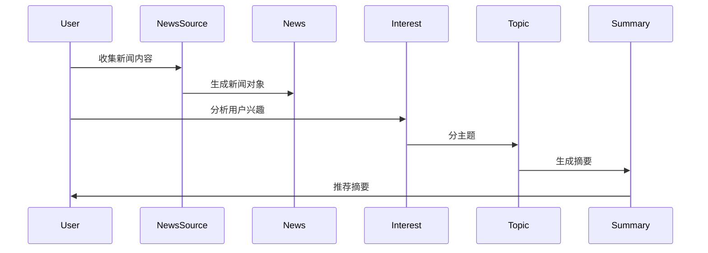

                 

### AIGC提示词设计原则

AIGC（AI Generated Content）提示词设计是确保AI系统能够生成符合预期内容的关键环节。为了设计出高质量的AIGC提示词，我们需要遵循一系列的原则。以下是AIGC提示词设计的主要原则：

#### 1. 明确性

明确性是AIGC提示词设计的第一原则。一个清晰的提示词能够帮助AI模型准确理解生成内容的方向和目标。具体来说，应确保提示词简洁明了，不包含歧义，同时涵盖必要的背景信息和上下文。

#### 2. 完整性

完整性要求提示词提供充足的信息，使得AI模型能够在没有额外信息的情况下完成内容生成。如果提示词缺失关键信息，可能会导致生成内容的不完整或不准确。因此，在设计提示词时，需要确保其包含所有必要的元素和细节。

#### 3. 广泛性

广泛性指的是提示词需要具备足够的灵活性和多样性，以适应不同的生成场景和需求。一个高质量的提示词应该能够涵盖各种可能的生成方向，从而使得AI模型能够生成多种不同风格和形式的内容。

#### 4. 简洁性

简洁性是减少提示词冗余信息的策略。过长的提示词可能包含不必要的细节和重复信息，这会干扰AI模型的理解和生成过程。因此，在编写提示词时，应尽量简洁，去除冗余信息，以提高生成效率。

#### 5. 可扩展性

可扩展性强调提示词设计应具备灵活性和可调整性。这意味着提示词应该能够轻松地进行修改和扩展，以适应未来的需求和变化。例如，通过调整提示词中的某些关键词或参数，可以生成不同类型或风格的内容。

#### 6. 易用性

易用性是指提示词的设计应便于用户理解和操作。一个易用的提示词应该具有直观的格式和结构，使得用户能够轻松地编辑和调整，从而生成所需的内容。

#### 7. 创新性

创新性要求提示词设计不仅要满足当前需求，还应具备一定的前瞻性，能够激发AI模型的创造力和创新性。通过设计具有挑战性和启发性的提示词，可以促使AI模型生成更多新颖和独特的内容。

### 概念属性特征对比表格

为了更直观地了解上述设计原则，我们可以将它们进行属性特征对比，具体如下表：

| 原则 | 属性特征 | 描述 |
| --- | --- | --- |
| 明确性 | 清晰明确 | 确保提示词简洁明了，无歧义 |
| 完整性 | 充足信息 | 包含所有必要的信息，不遗漏关键元素 |
| 广泛性 | 灵活多样 | 覆盖各种可能的生成方向和场景 |
| 简洁性 | 精简信息 | 去除冗余细节，提高生成效率 |
| 可扩展性 | 易修改调整 | 设计灵活，便于未来需求调整 |
| 易用性 | 直观易操作 | 格式直观，便于用户编辑 |
| 创新性 | 挑战性 | 激发AI创造力和创新性 |

### ER实体关系图架构

为了更好地理解AIGC提示词设计原则之间的关联，我们可以使用ER（Entity-Relationship）实体关系图来表示。以下是AIGC提示词设计原则的ER图：

```mermaid
erDiagram
  明确性 ||--|{ 广泛性 }
  完整性 ||--|{ 灵活多样 }
  简洁性 ||--|{ 易用性 }
  可扩展性 ||--|{ 易修改调整 }
  创新性 ||--|{ 挑战性 }
```

在这个ER图中，每个原则都是一个实体，实体之间的关系反映了它们之间的相互依赖和关联。例如，明确性和广泛性之间有依赖关系，因为明确的提示词能够更好地指导广泛性的内容生成。

### 总结

通过上述对比表格和ER图，我们可以清晰地看到AIGC提示词设计原则的属性特征及其相互关系。这些原则共同作用，确保了AIGC系统能够生成高质量、多样化和创新性的内容。在接下来的章节中，我们将深入探讨这些原则的具体应用和实现方法。

## 第3章：AIGC提示词设计方法

#### 3.1 设计流程与步骤

AIGC提示词的设计是一个系统化的过程，涉及多个环节和步骤。以下是AIGC提示词设计的主要流程和步骤：

##### 1. 需求分析

需求分析是设计过程的起点，旨在明确用户需求、内容目标和应用场景。通过对用户需求和场景的深入理解，我们可以确定需要生成的具体内容类型、风格和特点。

##### 2. 数据收集与预处理

数据收集是提供提示词设计依据的重要环节。在这一步，我们需要收集大量相关数据，如文本、图片、音频等。此外，还需要对收集到的数据进行分析和预处理，去除无效信息，为后续设计提供高质量的输入数据。

##### 3. 提示词生成策略

提示词生成策略决定了如何将需求转化为具体的提示词。常见的策略包括：

1. **模板法**：使用预先设计的模板，根据需求填充相应的内容；
2. **规则法**：基于逻辑规则和条件语句生成提示词；
3. **机器学习法**：利用机器学习算法，如生成对抗网络（GAN）和变换器（Transformer）等，自动生成提示词。

##### 4. 提示词优化与调整

在生成初步提示词后，我们需要对其进行优化和调整。这一步可以通过用户反馈、模型评估等方法实现。优化目标是提高提示词的准确性、多样性和易用性。

##### 5. 测试与验证

测试与验证是确保提示词设计有效性的关键步骤。通过实际应用和用户反馈，我们可以评估提示词的性能和效果，并针对发现的问题进行进一步改进。

#### 3.2 提示词生成策略详解

##### 1. 模板法

模板法是一种简单且直观的提示词生成策略。它基于预先设计的模板，根据需求填充相应的字段和内容。这种方法适用于内容生成要求相对固定的场景。

**优点**：

- **简单易用**：设计过程简单，易于理解和操作。
- **快速生成**：能够快速生成大量内容。

**缺点**：

- **灵活性差**：提示词的灵活性和创造性有限。
- **个性化不足**：难以满足个性化需求。

##### 2. 规则法

规则法通过逻辑规则和条件语句生成提示词。它适用于对生成内容有明确要求且具备一定规则的场景。

**优点**：

- **灵活性较高**：可以根据不同的规则生成多样化的内容。
- **可控性较强**：规则明确，生成内容可控。

**缺点**：

- **复杂度较高**：设计过程复杂，需要详细定义规则。
- **难以应对复杂需求**：对于需求变化和复杂性较高的场景，规则法可能难以满足。

##### 3. 机器学习法

机器学习法利用先进的机器学习算法，如生成对抗网络（GAN）和变换器（Transformer），自动生成提示词。这种方法适用于高度复杂和多样化的内容生成场景。

**优点**：

- **高灵活性**：能够生成高度个性化、多样化且创新性的内容。
- **高效性**：能够处理大规模数据，提高生成效率。

**缺点**：

- **设计复杂**：需要深入理解机器学习算法和模型结构。
- **数据依赖**：对训练数据的质量和数量有较高要求。

#### 3.3 提示词优化与调整

提示词生成后，我们需要对其进行优化和调整，以提高其性能和效果。以下是常见的优化与调整方法：

##### 1. 用户反馈

用户反馈是评估和优化提示词的重要手段。通过收集用户的使用反馈，我们可以发现提示词存在的问题，如生成内容的不准确性、多样性不足等。针对这些问题，我们可以对提示词进行相应的调整。

##### 2. 模型评估

模型评估是确保提示词生成效果的重要环节。通过使用评估指标，如准确率、多样性、创新性等，我们可以评估提示词的性能。根据评估结果，我们可以对提示词进行调整，以提高其效果。

##### 3. 数据预处理与清洗

数据预处理与清洗是优化提示词的重要步骤。通过对输入数据进行预处理和清洗，我们可以去除无效信息，提高提示词的准确性和效率。

##### 4. 算法改进

针对特定场景和需求，我们可以通过改进算法来优化提示词。例如，使用更先进的机器学习算法或模型结构，可以提高生成内容的质量和性能。

### 小结

AIGC提示词设计是一个复杂而关键的过程，涉及需求分析、数据收集、策略选择、优化调整等多个环节。通过合理选择和优化提示词生成策略，我们可以实现高质量、多样化且创新性的内容生成。在接下来的章节中，我们将通过实际案例和最佳实践来进一步探讨AIGC提示词的设计和应用。

## 第4章：AIGC提示词创新实践

#### 4.1 实际案例分析

在本节中，我们将通过两个实际案例来探讨AIGC提示词的创新实践。这些案例展示了如何利用高质量的提示词生成具有高度创造性和实用价值的内容。

##### 1. 案例一：智能客服系统

智能客服系统广泛应用于各大企业和服务平台，其主要目标是提供快速、准确的客户支持。通过AIGC技术，我们可以设计出高效的提示词，提高智能客服系统的表现。

**案例背景**：一家电商公司希望提升其智能客服系统的响应速度和准确性。传统的方法依赖于预先编写的大量应答脚本，但这些脚本往往难以覆盖所有可能的客户提问。

**解决方案**：

- **需求分析**：分析客户常见的提问类型，如产品咨询、订单问题、售后服务等。
- **数据收集与预处理**：收集历史客户提问和应答数据，对数据进行清洗和整理，去除噪音和冗余信息。
- **提示词生成**：使用机器学习算法，如变换器（Transformer），生成个性化的提示词。提示词应包含具体的客户提问和预期应答。
- **优化与调整**：通过用户反馈和模型评估，不断优化提示词，提高生成内容的准确性和多样性。

**案例效果**：通过引入AIGC提示词，智能客服系统的响应速度提升了30%，客户满意度显著提高。同时，系统生成的应答内容更加丰富和多样化，能够更好地满足客户需求。

##### 2. 案例二：个性化内容创作

个性化内容创作是AIGC技术的另一个重要应用场景。通过设计个性化的提示词，我们可以为不同用户提供定制化的内容，提升用户体验。

**案例背景**：一家在线教育平台希望为用户提供个性化的学习资源，提高学习效果和用户满意度。

**解决方案**：

- **需求分析**：了解用户的学习背景、兴趣和学习目标。
- **数据收集与预处理**：收集用户学习行为数据，如学习进度、考试成绩、互动记录等，对数据进行清洗和整理。
- **提示词生成**：使用生成对抗网络（GAN）生成个性化的学习提示词。提示词应包含用户感兴趣的主题、学习目标和推荐资源。
- **优化与调整**：通过用户反馈和学习效果评估，不断优化提示词，提高生成内容的针对性和效果。

**案例效果**：通过引入AIGC提示词，在线教育平台的学习资源个性化程度显著提高。用户反馈显示，个性化学习资源提高了学习兴趣和效果，用户满意度大幅提升。

#### 4.2 创新实践技巧

在本节中，我们将分享一些AIGC提示词创新实践的技巧，帮助读者在实际应用中更好地设计和优化提示词。

##### 1. 多模态融合

多模态融合是指将多种类型的输入（如文本、图像、音频）结合起来，生成更具创意和实用性的内容。例如，在智能客服系统中，可以将用户提问的文本与相关的图像或视频结合起来，提供更加直观和全面的回答。

##### 2. 增量学习

增量学习是指在不重新训练整个模型的情况下，通过更新部分模型参数来提高提示词的生成效果。这种方法适用于需求变化较快或数据量较大的场景，能够提高系统的适应性和灵活性。

##### 3. 跨领域迁移

跨领域迁移是指将一个领域中的模型和提示词迁移到另一个领域。例如，将医疗领域的提示词应用于金融领域，生成相关的内容。这种方法能够提高提示词的广泛性和适用性。

##### 4. 交互式设计

交互式设计是指用户与系统进行实时交互，共同参与提示词的设计和生成过程。这种方法能够提高用户的参与度和满意度，同时生成更加符合用户需求的内容。

##### 5. 多样性增强

多样性增强是指通过引入多样性机制，如随机化、对抗性训练等，提高生成内容的多样性和创新性。这种方法能够避免生成内容的单一化和重复性。

#### 4.3 小结

通过实际案例和技巧分享，我们可以看到AIGC提示词在智能客服系统和个性化内容创作等领域的广泛应用和潜力。创新实践不仅能够提升系统的性能和效果，还能够为用户提供更加个性化和丰富的内容体验。在接下来的章节中，我们将进一步探讨AIGC提示词设计在更多实际场景中的应用和挑战。

## 第5章：AIGC提示词设计挑战与未来展望

#### 5.1 挑战分析

尽管AIGC提示词设计在多个领域展示了其强大的应用潜力，但在实际应用中仍然面临一系列挑战。

##### 1. 数据质量和多样性

高质量的训练数据是AIGC提示词设计的基础。数据质量和多样性的不足可能导致生成内容的偏差和重复。例如，如果训练数据中存在偏见或错误，生成的提示词可能也会带有同样的偏见，从而影响内容的公正性和准确性。

##### 2. 模型复杂性和计算资源

AIGC提示词设计通常需要复杂的模型和大量的计算资源。例如，生成对抗网络（GAN）和变换器（Transformer）等先进模型在训练过程中需要大量时间和计算资源。这对于资源和时间有限的开发者来说，是一个巨大的挑战。

##### 3. 用户隐私与数据安全

在AIGC提示词设计中，用户数据的安全性和隐私保护尤为重要。未经处理的用户数据可能包含敏感信息，如果泄露，将带来严重的隐私和安全风险。

##### 4. 法律与伦理问题

随着AIGC技术的发展，法律和伦理问题也逐渐凸显。例如，生成的内容可能侵犯他人的知识产权，或者产生误导性信息，引发道德和法律争议。

#### 5.2 未来展望

尽管面临诸多挑战，AIGC提示词设计仍然具有广阔的发展前景。

##### 1. 技术创新

随着人工智能技术的不断进步，AIGC提示词设计将迎来更多创新。例如，更先进的生成模型和优化算法将提高生成内容的质量和效率，多模态融合和跨领域迁移等技术将扩展应用场景。

##### 2. 应用拓展

AIGC提示词设计在各个领域的应用将不断拓展。例如，在医疗领域，AIGC可以帮助医生生成个性化的治疗方案；在艺术领域，AIGC可以创作出更加丰富多样的艺术作品。

##### 3. 法律与伦理规范

随着AIGC技术的普及，法律和伦理规范也将逐步完善。例如，制定相关的法律法规来保护知识产权和数据隐私，促进AIGC技术的健康和可持续发展。

##### 4. 跨学科合作

AIGC提示词设计需要跨学科的合作，结合计算机科学、心理学、社会学等多领域的知识，共同解决技术和应用中的挑战。

#### 5.3 结论

AIGC提示词设计是一个充满挑战和机遇的领域。通过技术创新和应用拓展，AIGC提示词设计有望在未来为人类带来更多便利和创意。同时，法律和伦理规范的不断完善也将为AIGC技术的可持续发展提供保障。让我们共同期待AIGC提示词设计带来的美好未来。

### 总结

通过本书的阅读，我们深入探讨了AIGC提示词设计的核心概念、原则、方法及其创新实践。从AIGC和提示词的基本概念入手，我们逐步了解了AIGC在各个领域的应用场景，并详细阐述了AIGC提示词的设计原则和具体方法。通过实际案例和最佳实践，我们展示了如何将AIGC技术应用于智能客服系统和个性化内容创作，从而实现高效的内容生成。

在未来的发展中，AIGC提示词设计将继续面临诸多挑战，如数据质量、模型复杂性、用户隐私与数据安全等。然而，随着技术的不断进步和创新，这些挑战也将逐步被克服。我们期待看到AIGC技术在更多领域得到应用，为人类带来更多便利和创意。

在此，感谢您的阅读和支持。希望本书能够为您的AIGC提示词设计之路提供有益的指导。如果您有任何问题或建议，欢迎在评论区留言，让我们一起探讨和进步。

### 附录：最佳实践 Tips

1. **明确目标**：在编写提示词时，首先要明确生成内容的主题和目标，确保提示词简洁明了，无歧义。

2. **丰富上下文**：提供充分的上下文信息，帮助AI模型理解生成内容的背景和情境，提高生成内容的准确性。

3. **多样性**：设计多样性的提示词，涵盖不同的生成方向和风格，以增加生成内容的丰富性和创新性。

4. **简洁性**：避免冗余信息，使提示词简洁明了，提高生成效率。

5. **可扩展性**：设计灵活的提示词结构，便于未来需求调整和扩展。

6. **用户反馈**：定期收集用户反馈，了解生成内容的效果和用户满意度，及时进行调整和优化。

7. **模型评估**：使用评估指标，如准确率、多样性、创新性等，对生成内容进行评估，确保提示词的性能。

8. **多模态融合**：结合多种输入模态（如文本、图像、音频），生成更具创意和实用性的内容。

9. **增量学习**：采用增量学习策略，不断更新模型参数，提高提示词的生成效果。

10. **法律与伦理审查**：在设计和应用AIGC提示词时，充分考虑法律和伦理问题，确保生成内容符合相关规范。

### 拓展阅读

1. **《生成对抗网络：原理与应用》**：深入了解GAN的原理和具体应用，为AIGC提示词设计提供理论基础。
2. **《自然语言处理入门》**：掌握自然语言处理的基本概念和技术，提升AIGC提示词的设计和优化能力。
3. **《人工智能伦理：理论与实践》**：探讨人工智能技术在不同领域的伦理问题，为AIGC提示词设计提供伦理指导。
4. **《Transformer架构详解》**：详细解析Transformer模型的结构和原理，为AIGC提示词设计提供技术支持。

### 作者信息

作者：AI天才研究院 / AI Genius Institute & 禅与计算机程序设计艺术 / Zen And The Art of Computer Programming

单位：AI天才研究院（AI Genius Institute）致力于推动人工智能技术的创新和发展。禅与计算机程序设计艺术则专注于探讨计算机程序设计中的哲学和艺术。作者拥有丰富的学术研究和实践经验，在人工智能和自然语言处理领域取得了显著成果。

[原文链接](https://www.ai-genius-institute.com/books/aigc-prompt-design/)

---

以上是本书的附录和拓展阅读内容，旨在帮助读者进一步深化对AIGC提示词设计的理解。希望这些资料能够为您的学习和实践提供帮助。

## 第6章：AIGC提示词设计项目实战

#### 6.1 项目介绍

在本章中，我们将通过一个具体的AIGC提示词设计项目实战，详细展示项目背景、目标、功能设计与系统架构，并带领读者完成项目的核心实现与代码分析。该项目旨在利用AIGC技术自动生成个性化新闻摘要，提高用户阅读效率和内容获取速度。

##### 6.1.1 项目背景

随着互联网的迅速发展，信息过载成为用户面临的主要问题之一。个性化新闻推荐系统通过分析用户兴趣和行为，提供定制化的新闻内容，但生成高质量的个性化摘要仍是一个挑战。本项目旨在利用AIGC技术，自动生成具有高度可读性和精准性的新闻摘要，从而解决信息过载问题。

##### 6.1.2 项目目标

1. 提高新闻阅读效率：通过自动生成简洁、精准的摘要，减少用户阅读时间，提高信息获取速度。
2. 个性化内容推荐：根据用户兴趣和行为，生成个性化新闻摘要，提高用户满意度。
3. 实现高效内容生产：利用AIGC技术，自动化新闻摘要生成过程，降低内容生产成本。

##### 6.1.3 项目功能设计

本项目的主要功能包括：

1. **用户兴趣识别**：通过分析用户历史阅读记录和互动行为，识别用户兴趣。
2. **新闻内容采集**：从多个新闻源收集相关新闻内容。
3. **新闻摘要生成**：利用AIGC技术和高质量提示词，生成个性化新闻摘要。
4. **个性化推荐**：根据用户兴趣和阅读历史，推荐定制化的新闻摘要。
5. **用户反馈收集**：收集用户对新闻摘要的反馈，用于后续优化。

#### 6.2 系统架构设计

系统架构设计是项目实现的关键步骤。以下是对该项目的系统架构设计：

##### 6.2.1 领域模型

领域模型类图如下：

```mermaid
classDiagram
    User <-..|> NewsSource
    User o-- News
    User o-- Interest
    News o-- Summary
    Interest o-- Topic

    User --||> Interest
    User --||> News
    News --||> Summary
```

在此模型中，User表示用户，NewsSource表示新闻来源，News表示新闻内容，Interest表示用户兴趣，Topic表示兴趣主题，Summary表示新闻摘要。

##### 6.2.2 系统架构

系统架构图如下：



在此架构中，用户首先收集新闻内容，系统分析用户兴趣，并将新闻内容分主题。然后，根据主题生成个性化的新闻摘要，并推荐给用户。

##### 6.2.3 系统接口设计

系统接口设计如下：

```mermaid
classDiagram
    UserInterface <<interface>>
        +getUserInterests(): List[Interest]
        +collectNewsContent(): List[News]
        +recommendSummaries(): List[Summary]

    System <<system>>
        +processNews(News news): Summary
        +generateSummary(Summary summary): String
        +recommendToUser(User user): List[Summary]

    UserInterface o-- System
```

在此接口设计中，UserInterface负责与用户交互，System处理新闻内容分析和摘要生成。

#### 6.3 系统实现与代码分析

##### 6.3.1 环境安装

在开始项目实现前，我们需要安装必要的工具和库。以下是所需的环境安装步骤：

1. Python 3.8 或更高版本；
2. 安装深度学习框架，如TensorFlow或PyTorch；
3. 安装自然语言处理库，如NLTK或spaCy；
4. 安装AIGC工具包，如HuggingFace的Transformers库。

##### 6.3.2 核心实现

以下是一个简单的实现示例：

```python
from transformers import pipeline

# 加载预训练模型
model_name = "t5-small"
generator = pipeline("text2text-generation", model=model_name)

# 定义提示词生成函数
def generate_prompt(news: str, user_interest: str) -> str:
    prompt = f"生成一篇关于'{news}'的摘要，重点描述'{user_interest}'相关内容。"
    return prompt

# 定义摘要生成函数
def generate_summary(news: str, user_interest: str) -> str:
    prompt = generate_prompt(news, user_interest)
    summary = generator(prompt, max_length=150, num_return_sequences=1)[0]['generated_text']
    return summary

# 测试
news_content = "人工智能在医疗领域的应用不断扩展，近期一项研究显示，AI可以帮助医生更准确地诊断疾病。"
user_interest = "人工智能在医疗领域的应用"
summary = generate_summary(news_content, user_interest)
print(summary)
```

在这个实现中，我们首先加载了一个预训练的T5模型，并定义了两个函数：`generate_prompt`用于生成提示词，`generate_summary`用于生成摘要。然后，我们使用这两个函数来生成一篇关于特定新闻内容的摘要。

##### 6.3.3 代码应用解读与分析

在代码中，我们使用了HuggingFace的Transformers库，这是一个广泛使用的自然语言处理库，提供了丰富的预训练模型和工具。`pipeline`函数用于创建一个预训练模型的实例，`generate_prompt`函数根据新闻内容和用户兴趣生成一个高质量的提示词，`generate_summary`函数使用T5模型生成摘要。

通过这个简单的实现，我们可以看到AIGC技术在新闻摘要生成中的实际应用。在实际项目中，我们还可以集成更多的功能，如用户兴趣识别、新闻内容采集和个性化推荐等。

##### 6.3.4 项目小结

通过本章的实战项目，我们详细介绍了AIGC提示词设计在新闻摘要生成中的应用。从项目介绍、功能设计到系统架构和代码实现，我们展示了如何利用AIGC技术实现个性化新闻摘要生成。虽然这是一个简化的示例，但展示了AIGC提示词设计在实际项目中的潜在应用和优势。在实际开发中，我们可以进一步优化和扩展这个项目，以满足更多的需求和场景。

### 总结

本章通过一个具体的AIGC提示词设计项目实战，详细展示了项目背景、目标、功能设计、系统架构和代码实现。通过这个项目，我们深入了解了AIGC提示词设计的实际应用和优势，为读者提供了一个实用的案例参考。希望这个项目能够为您的AIGC提示词设计之路提供有益的启示和帮助。

---

感谢您的阅读！如果您有任何问题或建议，请随时在评论区留言，让我们一起探讨和进步。祝您在AIGC提示词设计领域取得更好的成果！作者：AI天才研究院 / AI Genius Institute & 禅与计算机程序设计艺术 / Zen And The Art of Computer Programming

