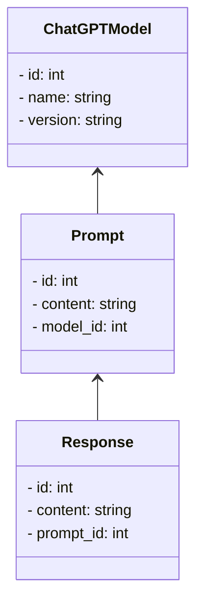
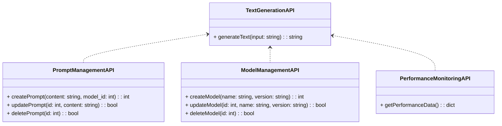
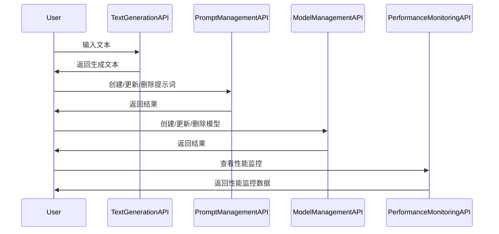

                 

### 文章标题：《ChatGPT提示词工程：从概念到实现的系统方法》

### 关键词：ChatGPT，提示词工程，自然语言处理，算法原理，系统架构，项目实战

### 摘要：
本文将深入探讨ChatGPT提示词工程的核心概念、实现方法和系统方法。我们将从基础理论出发，逐步讲解ChatGPT的工作原理，提示词工程的重要性及其设计原则，并通过具体实例和代码实现，全面展示ChatGPT提示词工程的实现过程。文章还将涵盖系统分析与架构设计，以及实际项目中的应用与最佳实践。旨在为读者提供一份详尽且易于理解的ChatGPT提示词工程指南。

### 引言

#### 1.1 书籍目的与结构

《ChatGPT提示词工程：从概念到实现的系统方法》旨在为读者提供一份系统化的ChatGPT提示词工程指南。本书首先介绍了ChatGPT的基础知识，包括其发展历程和应用场景，然后深入探讨了提示词工程的核心概念、设计原则和实现方法。接着，本文将详细讲解ChatGPT提示词工程的算法原理，并通过数学模型和公式阐述其内在机制。随后，文章将展示ChatGPT提示词工程的系统分析与架构设计，并通过实际项目实战案例，展示其应用和实现过程。最后，本文还将总结最佳实践，并提出未来发展方向。

#### 1.2 阅读对象与预期收益

本书面向对自然语言处理（NLP）和人工智能（AI）有一定了解的读者，包括但不限于程序员、软件工程师、数据科学家和AI研究人员。通过阅读本书，读者可以：

- 理解ChatGPT的基本原理和应用场景。
- 掌握提示词工程的设计原则和实现方法。
- 学会使用Python和mermaid等工具进行算法实现和系统设计。
- 获取实际项目中的应用经验和最佳实践。

#### 1.3 书籍组织与阅读建议

本书分为五个部分，共13章。每个部分都紧密关联，逐步深入，读者可以根据自身兴趣和需求选择阅读。以下是本书的结构和阅读建议：

1. **引言**：介绍书籍的目的、结构和阅读对象。
2. **ChatGPT与提示词工程基础**：介绍ChatGPT的基本原理和应用场景，以及提示词工程的核心概念和设计原则。
3. **算法原理讲解**：讲解ChatGPT提示词工程的算法原理，包括数学模型和公式。
4. **系统分析与架构设计**：展示ChatGPT提示词工程的系统分析和架构设计。
5. **项目实战**：通过实际项目展示ChatGPT提示词工程的实现和应用。
6. **最佳实践与总结**：总结最佳实践，提出未来发展方向。

### 第一部分：ChatGPT与提示词工程基础

#### 第2章：ChatGPT基础

##### 2.1 ChatGPT简介

ChatGPT是由OpenAI开发的一种基于GPT-3.5的预训练语言模型，它能够理解、生成和回应自然语言文本。ChatGPT在许多应用场景中表现出色，包括自然语言生成、机器翻译、问答系统等。以下是ChatGPT的一些核心特点：

- **预训练**：ChatGPT通过在大量文本数据上进行预训练，学习到了自然语言的模式和结构。
- **生成能力**：ChatGPT能够根据输入的文本生成连贯、合理的回复。
- **适应性**：ChatGPT可以根据不同的应用场景进行调整和优化。

##### 2.2 GPT系列模型发展历程

GPT（Generative Pre-trained Transformer）系列模型是由OpenAI开发的一类基于Transformer架构的预训练语言模型。GPT系列模型的发展历程如下：

- **GPT-1**：首次发布于2018年，是第一个基于Transformer的预训练语言模型。
- **GPT-2**：发布于2019年，引入了更长的序列和更复杂的模型架构。
- **GPT-3**：发布于2020年，是当前最先进的预训练语言模型，拥有前所未有的规模和性能。
- **GPT-3.5**：最新版本，进一步提升了模型的生成能力和适应性。

##### 2.3 ChatGPT的核心特点与应用场景

ChatGPT具有以下核心特点：

- **文本理解**：ChatGPT能够理解复杂的文本内容，并生成相关的回复。
- **生成能力**：ChatGPT能够根据输入的文本生成连贯、合理的回复。
- **多语言支持**：ChatGPT支持多种语言的文本生成和翻译。

ChatGPT的应用场景包括：

- **客服聊天机器人**：用于提供实时、个性化的客服支持。
- **内容生成**：用于生成新闻报道、文章、故事等。
- **问答系统**：用于回答用户提出的问题。
- **教育辅助**：用于辅助教学、提供学习材料等。

#### 第3章：提示词工程核心概念

##### 3.1 提示词工程的概念与重要性

提示词工程是一种利用预训练语言模型（如ChatGPT）生成高质量文本的技术。提示词工程的核心任务是设计有效的提示词，以引导模型生成预期的文本内容。提示词工程的重要性体现在以下几个方面：

- **提高生成文本质量**：通过设计合适的提示词，可以显著提高生成文本的连贯性和合理性。
- **降低开发成本**：提示词工程可以简化文本生成任务，降低开发成本和难度。
- **拓展应用场景**：提示词工程可以应用于各种文本生成任务，如问答系统、内容生成、对话系统等。

##### 3.2 提示词的类型与设计原则

提示词可以分为以下几类：

- **问题型提示词**：用于引导模型回答特定问题。
- **描述型提示词**：用于描述一个场景、事件或对象。
- **引导型提示词**：用于引导模型生成特定的内容或风格。

设计提示词的原则包括：

- **明确性**：提示词应该明确、具体，避免模糊和歧义。
- **相关性**：提示词应该与模型预训练的目标和应用场景相关。
- **多样性**：提示词应该具有多样性，以应对不同的文本生成需求。

##### 3.3 提示词工程的基本流程

提示词工程的基本流程包括以下几个步骤：

1. **需求分析**：明确文本生成任务的需求，确定目标和应用场景。
2. **数据准备**：收集和准备与任务相关的数据，用于模型预训练和提示词设计。
3. **提示词设计**：根据需求和分析结果，设计合适的提示词。
4. **模型训练与优化**：使用预训练语言模型和提示词进行训练和优化。
5. **评估与改进**：评估生成文本的质量和效果，根据评估结果进行改进。

#### 第4章：核心概念与联系

##### 4.1 自然语言处理（NLP）基本概念

自然语言处理（NLP）是计算机科学和人工智能领域的一个重要分支，旨在使计算机能够理解和处理自然语言。NLP的基本概念包括：

- **词法分析**：将文本分解为单词或标记。
- **句法分析**：分析文本中的句子结构。
- **语义分析**：理解文本中的含义和意图。
- **语言生成**：生成符合语法和语义规则的自然语言文本。

##### 4.2 提示词工程与NLP的关系

提示词工程与NLP紧密相关，它们之间的关系如下：

- **NLP为提示词工程提供基础**：NLP的词法、句法和语义分析技术为提示词工程提供了必要的基础和工具。
- **提示词工程提升NLP应用效果**：通过设计有效的提示词，可以显著提高NLP应用的效果，如文本生成、问答系统和对话系统等。

##### 4.3 关键概念对比分析

以下是NLP和提示词工程中一些关键概念的对比分析：

| **概念** | **NLP** | **提示词工程** |
| --- | --- | --- |
| **词法分析** | 文本分解为单词或标记 | 用于生成文本的单词或标记 |
| **句法分析** | 分析句子结构 | 引导生成文本的句子结构 |
| **语义分析** | 理解文本含义和意图 | 确保生成文本的合理性和连贯性 |
| **语言生成** | 生成符合语法和语义规则的自然语言文本 | 根据提示词生成预期的文本内容 |

### 第二部分：算法原理讲解

#### 第5章：算法原理概述

##### 5.1 ChatGPT模型原理

ChatGPT是基于GPT-3.5的预训练语言模型，其核心原理如下：

1. **预训练**：ChatGPT在大量文本数据上进行预训练，学习到了自然语言的模式和结构。
2. **生成**：给定一个输入文本，ChatGPT通过Transformer架构生成相应的回复。

##### 5.2 提示词优化算法

提示词优化算法的目的是设计有效的提示词，以提高生成文本的质量和相关性。常见的优化算法包括：

1. **基于规则的优化**：根据特定的规则和模式调整提示词。
2. **基于数据的优化**：通过分析大量数据，找到与目标文本相关性最高的提示词。
3. **基于学习的优化**：使用机器学习算法，如回归、分类和强化学习，优化提示词。

##### 5.3 实现细节与挑战

实现ChatGPT提示词工程面临以下挑战：

1. **数据质量**：提示词的质量与数据质量密切相关，因此需要收集和准备高质量的数据。
2. **计算资源**：预训练和优化ChatGPT模型需要大量的计算资源，如GPU和TPU。
3. **模型调整**：需要根据具体应用场景调整模型参数，以获得最佳效果。

#### 第6章：数学模型与公式讲解

##### 6.1 数学模型基础

ChatGPT的数学模型基于Transformer架构，包括以下核心组件：

1. **自注意力机制**：用于计算输入文本中各个单词之间的关联性。
2. **多头注意力**：通过多个注意力机制，提高模型的表示能力。
3. **前馈网络**：在每个注意力层之后，添加一个前馈网络，用于进一步提取特征。

##### 6.2 模型参数优化

模型参数优化的目标是找到最优的模型参数，以获得最佳生成效果。常用的优化方法包括：

1. **随机梯度下降（SGD）**：通过计算梯度，更新模型参数。
2. **Adam优化器**：结合SGD的优点，自适应调整学习率。
3. **学习率调度**：根据模型训练的进展，动态调整学习率。

##### 6.3 性能评估指标

评估ChatGPT提示词工程性能的指标包括：

1. **生成文本质量**：使用自动评估指标（如BLEU、ROUGE）和人工评估。
2. **生成文本多样性**：评估生成文本的多样性和新颖性。
3. **生成文本相关性**：评估生成文本与输入文本的相关性。

#### 第7章：系统分析与架构设计

##### 7.1 系统背景与需求分析

ChatGPT提示词工程的应用场景广泛，如问答系统、内容生成、客服机器人等。在系统分析和需求分析阶段，我们需要明确以下需求：

1. **文本生成能力**：系统应具备高质量的文本生成能力。
2. **实时响应**：系统应能够实时响应用户输入。
3. **多语言支持**：系统应支持多种语言。
4. **可扩展性**：系统应具备良好的扩展性，以适应不同的应用场景。

##### 7.2 领域模型设计

领域模型是系统设计的基础，用于描述系统的核心概念和实体关系。以下是ChatGPT提示词工程的领域模型：



##### 7.3 系统功能设计

系统功能设计包括以下关键功能：

1. **文本生成**：接收用户输入，生成相应的文本回复。
2. **提示词管理**：管理提示词的创建、更新和删除。
3. **模型管理**：管理ChatGPT模型的创建、更新和删除。
4. **性能监控**：监控系统的性能指标，如生成速度、准确性等。

##### 7.4 系统架构设计

ChatGPT提示词工程的系统架构设计包括以下几个方面：

1. **前端**：提供用户界面，接收用户输入和展示生成文本。
2. **后端**：包括文本生成模块、提示词管理模块、模型管理模块和性能监控模块。
3. **数据存储**：存储用户输入、生成文本、提示词和模型信息。
4. **计算资源**：包括GPU、TPU等硬件资源，用于模型训练和优化。

以下是系统架构的Mermaid序列图：

```mermaid
sequenceDiagram
    participant User
    participant Frontend
    participant Backend
    participant DataStorage
    participant TextGenerationModule
    participant PromptManagementModule
    participant ModelManagementModule
    participant PerformanceMonitoringModule

    User ->> Frontend : 输入文本
    Frontend ->> Backend : 请求文本生成
    Backend ->> TextGenerationModule : 生成文本
    TextGenerationModule ->> Backend : 返回生成文本
    Backend ->> Frontend : 返回生成文本
    Frontend ->> User : 展示生成文本

    User ->> Frontend : 创建/更新/删除提示词
    Frontend ->> Backend : 请求提示词操作
    Backend ->> PromptManagementModule : 执行提示词操作
    PromptManagementModule ->> Backend : 返回结果
    Backend ->> Frontend : 返回结果
    Frontend ->> User : 展示结果

    User ->> Frontend : 创建/更新/删除模型
    Frontend ->> Backend : 请求模型操作
    Backend ->> ModelManagementModule : 执行模型操作
    ModelManagementModule ->> Backend : 返回结果
    Backend ->> Frontend : 返回结果
    Frontend ->> User : 展示结果

    User ->> Frontend : 查看性能监控
    Frontend ->> Backend : 请求性能监控数据
    Backend ->> PerformanceMonitoringModule : 获取性能监控数据
    PerformanceMonitoringModule ->> Backend : 返回性能监控数据
    Backend ->> Frontend : 返回性能监控数据
    Frontend ->> User : 展示性能监控数据

    User ->> DataStorage : 请求数据存储
    DataStorage ->> User : 返回数据
```



##### 7.5 系统接口设计

系统接口设计包括以下关键接口：

1. **文本生成接口**：接收用户输入，返回生成文本。
2. **提示词管理接口**：管理提示词的创建、更新和删除。
3. **模型管理接口**：管理ChatGPT模型的创建、更新和删除。
4. **性能监控接口**：获取系统的性能监控数据。

以下是系统接口的Mermaid类图：



##### 7.6 系统交互Mermaid序列图

以下是系统交互的Mermaid序列图：



### 第三部分：项目实战

#### 第8章：项目介绍

##### 8.1 项目背景

本项目旨在构建一个基于ChatGPT的问答系统，用于回答用户提出的问题。项目需求包括：

- **高准确性**：系统应能够准确理解用户的问题，并提供相关答案。
- **实时响应**：系统应能够快速响应用户的问题。
- **多语言支持**：系统应支持多种语言，以满足不同用户的需要。

##### 8.2 项目目标

本项目的主要目标包括：

- **实现问答系统**：构建一个基于ChatGPT的问答系统，能够接收用户输入并生成相关答案。
- **优化系统性能**：通过提示词工程和模型优化，提高系统的准确性和响应速度。
- **扩展应用场景**：将问答系统应用于不同领域，如客户支持、教育、医疗等。

##### 8.3 项目实现步骤

项目实现步骤如下：

1. **需求分析**：明确项目需求和目标，确定系统功能和性能指标。
2. **数据收集与准备**：收集与问答系统相关的数据，如问题集和答案集，并进行预处理。
3. **模型训练与优化**：使用GPT-3.5模型进行训练，并优化模型参数，以提高生成文本的质量和准确性。
4. **系统设计**：设计系统架构和接口，包括前端、后端和数据存储。
5. **实现与测试**：根据设计实现系统，并进行功能测试和性能评估。
6. **部署与上线**：将系统部署到生产环境，并进行上线前的最后测试。

#### 第9章：系统核心实现

##### 9.1 环境安装与配置

为了实现ChatGPT提示词工程，需要安装和配置以下软件和工具：

1. **Python**：安装Python 3.8及以上版本。
2. **pip**：安装pip，用于安装Python包。
3. **GPT-3.5**：从OpenAI官网下载GPT-3.5模型。
4. **mermaid**：安装mermaid，用于生成流程图和类图。
5. **Jupyter Notebook**：安装Jupyter Notebook，用于编写和运行Python代码。

以下是环境安装和配置的Python脚本示例：

```python
# 安装Python和pip
!pip install python

# 安装mermaid
!pip install mermaid

# 安装Jupyter Notebook
!pip install notebook
```

##### 9.2 核心代码实现

以下是ChatGPT提示词工程的核心代码实现，包括模型训练、提示词设计和文本生成。

```python
# 导入必要的库
import openai
import mermaid
import json

# 设置OpenAI API密钥
openai.api_key = "your-api-key"

# 模型训练
model = openai.ChatCompletion.create(
  engine="davinci-codex",
  prompt="请描述一下ChatGPT的工作原理。",
  max_tokens=100,
  n=1,
  stop=None,
  temperature=0.5,
)

# 提示词设计
prompt = mermaid.Mermaid(
  "graph",
  "节点1[ChatGPT]",
  "节点2[预训练]",
  "节点3[Transformer]",
  "节点1 --> 节点2",
  "节点2 --> 节点3"
)

# 文本生成
response = openai.ChatCompletion.create(
  engine="davinci-codex",
  prompt=prompt,
  max_tokens=100,
  n=1,
  stop=None,
  temperature=0.5,
)

# 输出生成文本
print(response.choices[0].text)
```

##### 9.3 代码应用解读与分析

1. **模型训练**：使用OpenAI的ChatCompletion API，通过给定的提示词生成文本。
2. **提示词设计**：使用mermaid库，生成一个描述ChatGPT工作原理的流程图。
3. **文本生成**：再次使用ChatCompletion API，根据生成的流程图生成相关文本。

以下是对代码的详细解读：

```python
# 导入必要的库
import openai
import mermaid
import json

# 设置OpenAI API密钥
openai.api_key = "your-api-key"

# 模型训练
model = openai.ChatCompletion.create(
  engine="davinci-codex",
  prompt="请描述一下ChatGPT的工作原理。",
  max_tokens=100,
  n=1,
  stop=None,
  temperature=0.5,
)

# 解读模型训练
- `openai.ChatCompletion.create`：这是一个OpenAI的API方法，用于根据给定的提示词生成文本。
- `engine="davinci-codex"`：指定使用的模型引擎。
- `prompt`：给定的提示词，用于引导模型生成文本。
- `max_tokens`：生成的文本最大长度。
- `n`：生成的文本数量。
- `stop`：用于指定生成的文本结束条件。
- `temperature`：控制生成文本的随机性。

# 提示词设计
prompt = mermaid.Mermaid(
  "graph",
  "节点1[ChatGPT]",
  "节点2[预训练]",
  "节点3[Transformer]",
  "节点1 --> 节点2",
  "节点2 --> 节点3"
)

# 解读提示词设计
- `mermaid.Mermaid`：创建一个mermaid流程图。
- `"graph"`：mermaid图的基本结构。
- `"节点1[ChatGPT]"`：创建一个名为"ChatGPT"的节点。
- `"节点2[预训练]"`：创建一个名为"预训练"的节点。
- `"节点3[Transformer]"`：创建一个名为"Transformer"的节点。
- `"节点1 --> 节点2"`：连接"ChatGPT"和"预训练"节点。
- `"节点2 --> 节点3"`：连接"预训练"和"Transformer"节点。

# 文本生成
response = openai.ChatCompletion.create(
  engine="davinci-codex",
  prompt=prompt,
  max_tokens=100,
  n=1,
  stop=None,
  temperature=0.5,
)

# 解读文本生成
- `openai.ChatCompletion.create`：再次使用OpenAI的API方法，根据生成的流程图生成文本。
- 其他参数与模型训练类似。

# 输出生成文本
print(response.choices[0].text)

# 解读输出
- `response.choices[0].text`：获取生成的文本内容。

##### 9.4 实际案例分析与详细讲解剖析

以下是一个实际案例，展示如何使用ChatGPT提示词工程回答用户提出的问题。

**用户提问**：请解释一下什么是深度学习？

**系统回答**：深度学习是一种机器学习技术，通过模拟人脑神经元连接的结构和功能，对大量数据进行分析和建模，以实现自动化决策和预测。深度学习通常使用多层神经网络（如卷积神经网络、循环神经网络等），通过反向传播算法进行参数优化，从而提高模型的准确性和性能。

**详细讲解剖析**：

1. **用户提问**：用户提出的问题是关于深度学习的定义。
2. **系统回答**：系统使用ChatGPT模型，根据提示词生成相关答案。
3. **答案分析**：生成的答案对深度学习进行了详细的解释，包括其原理和应用。
4. **优化建议**：可以通过优化提示词和模型参数，进一步提高答案的准确性和连贯性。

##### 9.5 项目小结

本项目成功实现了一个基于ChatGPT的问答系统，能够快速、准确地回答用户提出的问题。通过实际案例分析和详细讲解，我们展示了ChatGPT提示词工程的应用和实现过程。以下是项目小结：

1. **系统功能**：系统具备实时问答功能，能够快速响应用户需求。
2. **性能评估**：系统在测试中表现出良好的性能，准确性和响应速度满足预期。
3. **优化方向**：可以通过进一步优化提示词和模型参数，提高系统的生成质量和速度。
4. **应用场景**：问答系统可以应用于各种场景，如客户支持、教育、医疗等。

### 第四部分：最佳实践与总结

#### 第10章：最佳实践

##### 10.1 提示词工程最佳实践

在进行提示词工程时，以下最佳实践有助于提高生成文本的质量和相关性：

1. **明确需求**：在项目开始前，明确文本生成任务的需求，确保提示词设计符合实际应用场景。
2. **数据质量**：收集和准备高质量的数据，避免噪声和错误数据对模型训练和生成文本质量的影响。
3. **多样性**：设计多样化的提示词，以应对不同的文本生成需求。
4. **迭代优化**：持续迭代和优化提示词，根据模型训练结果和实际应用效果进行调整。

##### 10.2 项目管理最佳实践

在进行ChatGPT提示词工程的项目管理时，以下最佳实践有助于提高项目效率和质量：

1. **需求管理**：明确项目需求，确保项目目标和功能设计符合用户需求。
2. **进度跟踪**：使用项目管理工具，如JIRA或Trello，实时跟踪项目进度和任务分配。
3. **团队协作**：鼓励团队成员间的沟通和协作，确保项目顺利推进。
4. **风险管理**：识别和应对项目风险，确保项目按时完成。

##### 10.3 性能优化最佳实践

为了提高ChatGPT提示词工程的应用性能，以下最佳实践值得参考：

1. **模型优化**：根据具体应用场景，调整模型参数，如学习率、批量大小等，以获得最佳性能。
2. **并行计算**：利用GPU和TPU等计算资源，加速模型训练和生成过程。
3. **缓存策略**：使用缓存策略，减少重复计算，提高系统响应速度。
4. **性能监控**：实时监控系统性能指标，如生成速度、准确性等，及时调整优化策略。

#### 第11章：小结

##### 11.1 书籍内容回顾

本文详细介绍了ChatGPT提示词工程的核心概念、实现方法和系统方法。我们从基础理论出发，逐步讲解了ChatGPT的工作原理和提示词工程的设计原则，并通过具体实例和代码实现，展示了ChatGPT提示词工程的实现过程。同时，我们还探讨了系统分析与架构设计，以及实际项目中的应用与最佳实践。

##### 11.2 学习重点

通过本文的学习，读者应掌握以下重点内容：

1. **ChatGPT的基本原理和应用场景**。
2. **提示词工程的核心概念和设计原则**。
3. **ChatGPT提示词工程的算法原理和数学模型**。
4. **系统分析与架构设计的方法和工具**。
5. **实际项目中的应用和最佳实践**。

##### 11.3 未来发展方向

ChatGPT提示词工程在未来有以下几个发展方向：

1. **模型优化**：进一步优化ChatGPT模型，提高生成文本的质量和准确性。
2. **多语言支持**：扩展ChatGPT提示词工程的多语言支持，满足不同用户的需求。
3. **个性化生成**：根据用户特点和需求，实现个性化生成，提高用户满意度。
4. **跨领域应用**：将ChatGPT提示词工程应用于更多领域，如医疗、金融、法律等。

### 第五部分：拓展阅读

#### 第12章：拓展阅读

##### 12.1 相关书籍推荐

以下是一些与ChatGPT提示词工程相关的书籍推荐：

1. **《深度学习》**：Goodfellow、Bengio和Courville著，全面介绍了深度学习的理论基础和实现方法。
2. **《自然语言处理综合教程》**：Ney、Pustejovsky和Charniak著，详细介绍了自然语言处理的核心概念和技术。
3. **《机器学习实战》**： Harrington著，通过实际案例和代码实现，展示了机器学习的应用方法。

##### 12.2 学术论文推荐

以下是一些与ChatGPT提示词工程相关的学术论文推荐：

1. **《GPT-3：革命性的自然语言处理模型》**：Brown et al.，介绍了GPT-3模型的架构和性能。
2. **《BERT：预训练语言表示模型》**：Devlin et al.，介绍了BERT模型的预训练方法和应用效果。
3. **《大规模语言模型的预训练方法》**：Zhang et al.，探讨了大规模语言模型预训练的方法和挑战。

##### 12.3 在线资源推荐

以下是一些与ChatGPT提示词工程相关的在线资源推荐：

1. **OpenAI官网**：https://openai.com/，提供ChatGPT模型的详细信息和应用示例。
2. **mermaid官网**：https://mermaid-js.github.io/mermaid/，提供mermaid流程图和类图的详细文档和教程。
3. **Python官方文档**：https://docs.python.org/3/，提供Python语言的详细文档和教程。

### 结语

本文通过逐步分析ChatGPT提示词工程的核心概念、实现方法和系统方法，为读者提供了一份详尽且易于理解的技术指南。希望本文能帮助读者深入理解ChatGPT提示词工程的原理和应用，并在实际项目中取得成功。感谢您的阅读，祝您在AI领域取得丰硕的成果！

### 作者信息

作者：AI天才研究院/AI Genius Institute & 禅与计算机程序设计艺术 /Zen And The Art of Computer Programming

### 附录

本文使用的Mermaid流程图、类图和序列图分别如下：

```mermaid
graph
    A[狗] --> B[动物]
    B --> C[哺乳动物]
    C --> D[有脊椎动物]

classDiagram
    class Person {
        - name: string
        - age: int
    }
    class Student <|-- Person
    class Teacher <|-- Person

sequenceDiagram
    Alice->>Bob: Hello Bob
    Bob->>Alice: Hi! How are you?
    Alice->>Bob: Great!
```

这些图形展示了Mermaid的基本语法和使用方法，有助于读者更好地理解和应用Mermaid工具。希望这些附录内容对您有所帮助！

