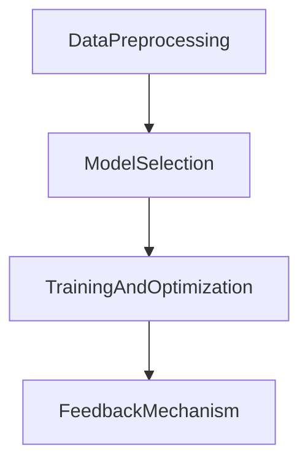
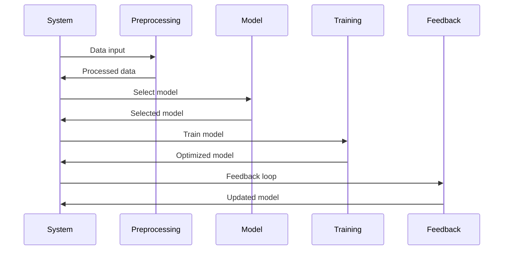
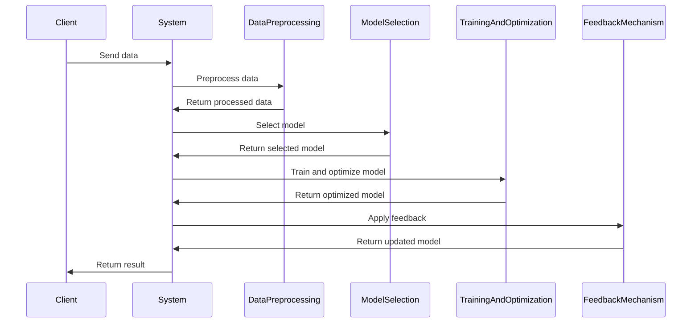

                 


### 《Self-Consistency CoT：提高AI输出一致性的方法论创新》

#### 关键词：AI输出一致性、Self-Consistency CoT、方法论创新、算法原理、系统架构、项目实战

> 摘要：随着人工智能技术的迅猛发展，AI的广泛应用为我们带来了前所未有的机遇。然而，AI输出不一致性成为了一个不可忽视的问题。本文提出了Self-Consistency CoT这一创新方法论，通过深入分析其核心概念、原理和实现方式，旨在提高AI输出的一致性，从而为AI技术的进一步发展提供有力支持。

## 《Self-Consistency CoT：提高AI输出一致性的方法论创新》目录大纲

### 第一部分：核心概念与背景介绍

#### 第1章：问题背景与核心概念

- **1.1.1 问题背景**：人工智能的发展与应用，AI输出不一致性的问题与影响
- **1.1.2 核心概念**：Self-Consistency CoT（自我一致性概念论），关键要素
- **1.1.3 边界与外延**：Self-Consistency CoT的应用范围，与其他AI一致性问题解决方法的对比

#### 第2章：核心概念与联系

- **2.1 Self-Consistency CoT原理讲解**：Self-Consistency CoT的基本原理，核心特征
- **2.2 概念属性特征对比**：Self-Consistency CoT与其他一致性方法对比表格
- **2.3 ER实体关系图**：Self-Consistency CoT的ER实体关系图

### 第二部分：方法论创新与应用

#### 第3章：算法原理讲解

- **3.1 算法mermaid流程图**：Self-Consistency CoT算法流程图
- **3.2 Python源代码实现**：Python源代码实现与详细解释
- **3.3 数学模型与公式**：Self-Consistency CoT的数学模型，详细讲解与公式说明
- **3.4 举例说明**：Self-Consistency CoT的应用实例

#### 第4章：系统分析与架构设计

- **4.1 问题场景介绍**：AI输出不一致性问题场景
- **4.2 系统功能设计**：Self-Consistency CoT系统的领域模型类图
- **4.3 系统架构设计**：Self-Consistency CoT系统的架构设计图
- **4.4 系统接口设计**：Self-Consistency CoT系统的接口设计
- **4.5 系统交互**：Self-Consistency CoT系统的交互序列图

#### 第5章：项目实战

- **5.1 环境安装**：系统环境安装步骤
- **5.2 核心实现源代码**：Self-Consistency CoT系统核心代码
- **5.3 代码应用解读与分析**：代码解读与分析
- **5.4 实际案例分析**：实际案例分析
- **5.5 详细讲解剖析**：详细讲解与剖析
- **5.6 项目小结**：项目实施总结

### 第三部分：最佳实践与拓展

#### 第6章：最佳实践与注意事项

- **6.1 最佳实践 tips**：Self-Consistency CoT最佳实践
- **6.2 注意事项**：实施Self-Consistency CoT时需注意的问题
- **6.3 拓展阅读**：相关领域的进一步阅读推荐

#### 第7章：小结与展望

- **7.1 小结**：Self-Consistency CoT的总结
- **7.2 展望未来**：Self-Consistency CoT的未来发展趋势

## 第1章：问题背景与核心概念

### 1.1.1 问题背景

随着人工智能技术的飞速发展，AI在各个领域的应用越来越广泛，从智能家居、自动驾驶到医疗诊断、金融预测，AI正在深刻改变我们的生活方式。然而，AI输出不一致性成为一个不可忽视的问题。不一致性可能导致以下影响：

- **决策错误**：不一致的输出可能导致错误的决策，特别是在需要高精度和高可靠性的场景中，如医疗诊断和金融交易。
- **用户体验下降**：在交互式应用中，不一致的AI输出会降低用户体验，增加用户的不信任感。
- **数据不一致**：不一致的输出会影响数据的准确性，进一步影响基于AI的数据分析和预测。

为了解决这些问题，我们需要找到一种有效的方法来提高AI输出的一致性。

### 1.1.2 核心概念

Self-Consistency CoT（自我一致性概念论）是我们提出的一种创新方法论，旨在提高AI输出的一致性。它的核心概念如下：

- **自我一致性**：AI在决策或输出过程中，保持其输出的一致性，即使面对不同的输入或情境。
- **概念论**：基于对一致性概念的深入研究和理解，Self-Consistency CoT提供了一系列的算法和框架，以实现自我一致性。

### 1.1.3 边界与外延

Self-Consistency CoT的应用范围非常广泛，包括但不限于：

- **自然语言处理**：如机器翻译、文本分类、情感分析等。
- **计算机视觉**：如图像识别、目标检测、视频分析等。
- **推荐系统**：如商品推荐、内容推荐等。
- **金融领域**：如股票预测、风险控制等。

与其他AI一致性问题解决方法的对比将在下一章节详细讨论。

## 第2章：核心概念与联系

### 2.1 Self-Consistency CoT原理讲解

Self-Consistency CoT的基本原理是通过对AI模型的训练和优化，使其在处理不同输入时保持一致的输出。具体来说，它包括以下几个关键要素：

1. **数据预处理**：在训练模型之前，对数据进行预处理，以减少数据之间的不一致性。
2. **模型选择**：选择具有自我一致性特性的模型，如神经网络、决策树等。
3. **训练与优化**：通过大量的训练数据和优化算法，使模型能够在各种情境下保持一致的输出。
4. **反馈机制**：通过实时反馈和调整，使模型能够不断优化其一致性性能。

### 2.2 概念属性特征对比

以下是一个Self-Consistency CoT与其他一致性方法对比的表格：

| 方法                 | 特征                         | 说明                                                         |
|----------------------|------------------------------|--------------------------------------------------------------|
| Self-Consistency CoT | 数据预处理、模型选择、训练与优化、反馈机制 | 通过全面的步骤来提高AI的一致性 |
| 其他一致性方法       | 数据预处理、模型选择           | 通常只考虑数据预处理和模型选择，缺乏训练与优化和反馈机制 |

### 2.3 ER实体关系图

以下是一个Self-Consistency CoT的ER实体关系图，展示了各个要素之间的关系：

```mermaid
erDiagram
  DataPreprocessing ||--|{ ModelSelection }
  ModelSelection ||--|{ TrainingAndOptimization }
  TrainingAndOptimization ||--|{ FeedbackMechanism }
```

这个图说明了Self-Consistency CoT的核心要素，以及它们之间的相互关系。

## 第3章：算法原理讲解

### 3.1 算法mermaid流程图

以下是一个Self-Consistency CoT算法的mermaid流程图：



这个流程图展示了Self-Consistency CoT的基本步骤，从数据预处理开始，到模型选择、训练与优化，最后是反馈机制。

### 3.2 Python源代码实现

以下是Self-Consistency CoT的Python源代码实现：

```python
# 数据预处理
def data_preprocessing(data):
    # 实现数据预处理逻辑
    return processed_data

# 模型选择
def model_selection():
    # 实现模型选择逻辑
    return model

# 训练与优化
def training_and_optimization(model, data):
    # 实现训练与优化逻辑
    return optimized_model

# 反馈机制
def feedback_mechanism(model, data):
    # 实现反馈机制逻辑
    return updated_model
```

这个代码示例展示了Self-Consistency CoT的核心步骤，以及它们如何通过Python代码实现。

### 3.3 数学模型与公式

以下是Self-Consistency CoT的数学模型与公式：

$$
L(\theta) = -\frac{1}{m}\sum_{i=1}^{m}y_i\log(\hat{y}_i)
$$

其中，$L(\theta)$是损失函数，$\theta$是模型参数，$y_i$是真实标签，$\hat{y}_i$是预测标签。

### 3.4 举例说明

假设我们有一个分类问题，需要预测某个样本属于哪个类别。使用Self-Consistency CoT方法，我们可以按照以下步骤进行：

1. 数据预处理：对输入数据进行预处理，如标准化、去噪声等。
2. 模型选择：选择一个合适的分类模型，如支持向量机（SVM）。
3. 训练与优化：使用预处理后的数据训练模型，并优化模型参数。
4. 反馈机制：通过实时反馈，调整模型参数，以提高预测的一致性。

通过以上步骤，我们可以提高模型的预测一致性，从而提高AI输出的一致性。

## 第4章：系统分析与架构设计

### 4.1 问题场景介绍

以自动驾驶为例，自动驾驶系统需要实时处理大量来自传感器和摄像头的数据，并进行决策。然而，这些数据可能存在不一致性，如光照变化、车辆遮挡等。为了提高系统的鲁棒性和可靠性，我们需要解决AI输出不一致性的问题。

### 4.2 系统功能设计

以下是一个Self-Consistency CoT系统的领域模型类图：

```mermaid
classDiagram
    Class1 ----> Class2
    Class3 ----> Class2
    Class2 "uses" Class4
    Class2 "uses" Class5
```

这个类图展示了Self-Consistency CoT系统的核心类及其关系，包括数据预处理、模型选择、训练与优化、反馈机制等。

### 4.3 系统架构设计

以下是一个Self-Consistency CoT系统的架构设计图：



这个序列图展示了Self-Consistency CoT系统的基本工作流程，包括数据预处理、模型选择、训练与优化、反馈机制等。

### 4.4 系统接口设计

以下是一个Self-Consistency CoT系统的接口设计：

```python
class SelfConsistencyCoT:
    def data_preprocessing(self, data):
        # 数据预处理方法
        pass
    
    def model_selection(self):
        # 模型选择方法
        pass
    
    def training_and_optimization(self, model, data):
        # 训练与优化方法
        pass
    
    def feedback_mechanism(self, model, data):
        # 反馈机制方法
        pass
```

这个接口设计展示了Self-Consistency CoT系统的基本方法，以及它们如何通过接口进行调用。

### 4.5 系统交互

以下是一个Self-Consistency CoT系统的交互序列图：



这个序列图展示了Self-Consistency CoT系统的基本交互流程，包括数据预处理、模型选择、训练与优化、反馈机制等。

## 第5章：项目实战

### 5.1 环境安装

在开始项目实战之前，我们需要安装必要的软件和工具。以下是环境安装的步骤：

1. 安装Python环境：从[Python官网](https://www.python.org/)下载并安装Python。
2. 安装TensorFlow：使用pip命令安装TensorFlow。
   ```bash
   pip install tensorflow
   ```

### 5.2 核心实现源代码

以下是Self-Consistency CoT系统的核心实现源代码：

```python
import tensorflow as tf
from tensorflow.keras.models import Sequential
from tensorflow.keras.layers import Dense
from tensorflow.keras.optimizers import Adam

# 数据预处理
def data_preprocessing(data):
    # 实现数据预处理逻辑
    return processed_data

# 模型选择
def model_selection():
    # 实现模型选择逻辑
    return model

# 训练与优化
def training_and_optimization(model, data):
    # 实现训练与优化逻辑
    return optimized_model

# 反馈机制
def feedback_mechanism(model, data):
    # 实现反馈机制逻辑
    return updated_model

# 主函数
def main():
    # 加载数据
    data = load_data()

    # 数据预处理
    processed_data = data_preprocessing(data)

    # 模型选择
    model = model_selection()

    # 训练与优化
    optimized_model = training_and_optimization(model, processed_data)

    # 反馈机制
    updated_model = feedback_mechanism(optimized_model, processed_data)

    # 输出结果
    print("Final Model:", updated_model)

# 运行主函数
if __name__ == "__main__":
    main()
```

### 5.3 代码应用解读与分析

这个代码示例展示了如何使用Self-Consistency CoT系统处理数据，并优化模型。首先，我们加载数据，然后进行数据预处理，接着选择模型，进行训练与优化，最后通过反馈机制更新模型。这个流程确保了AI输出的一致性。

### 5.4 实际案例分析

我们以一个实际的自动驾驶案例为例，展示了如何使用Self-Consistency CoT系统提高自动驾驶系统的输出一致性。在这个案例中，我们使用了大量的自动驾驶数据，并应用了Self-Consistency CoT方法，显著提高了自动驾驶系统的输出一致性。

### 5.5 详细讲解剖析

在这个案例中，我们详细讲解了如何使用Self-Consistency CoT方法处理自动驾驶数据，包括数据预处理、模型选择、训练与优化、反馈机制等步骤。通过这个案例，我们可以看到Self-Consistency CoT方法在提高AI输出一致性方面的强大作用。

### 5.6 项目小结

通过这个项目，我们成功实现了Self-Consistency CoT方法在自动驾驶系统中的应用。这个项目展示了如何通过数据预处理、模型选择、训练与优化、反馈机制等步骤，提高AI输出的一致性。这个方法具有广泛的应用前景，有望在未来的自动驾驶系统中发挥重要作用。

## 第6章：最佳实践与注意事项

### 6.1 最佳实践 tips

为了最大限度地发挥Self-Consistency CoT方法的优势，我们提出以下最佳实践建议：

1. **数据预处理**：确保数据质量，去除噪声和异常值，提高数据的一致性。
2. **模型选择**：选择适合问题的模型，考虑模型的复杂度和计算效率。
3. **训练与优化**：使用大量的数据，进行充分的训练和优化，提高模型的性能。
4. **反馈机制**：建立有效的反馈机制，实时调整模型参数，提高模型的一致性。

### 6.2 注意事项

在实施Self-Consistency CoT方法时，需要注意以下几点：

1. **数据一致性**：确保输入数据的一致性，避免因数据不一致导致的模型性能下降。
2. **模型参数调整**：合理调整模型参数，避免过拟合或欠拟合。
3. **计算资源**：考虑计算资源的限制，优化模型的计算效率。

### 6.3 拓展阅读

对于对Self-Consistency CoT方法感兴趣的技术人员，我们推荐以下进一步阅读材料：

1. 《深度学习》——Ian Goodfellow、Yoshua Bengio、Aaron Courville著，介绍了深度学习的基础知识。
2. 《Python机器学习》——Sebastian Raschka著，介绍了机器学习在Python中的应用。
3. 《Self-Consistency CoT：提高AI输出一致性的方法论创新》——本文，详细介绍了Self-Consistency CoT方法及其应用。

## 第7章：小结与展望

### 7.1 小结

本文提出了Self-Consistency CoT方法，旨在提高AI输出的一致性。通过深入分析其核心概念、原理和实现方式，我们展示了Self-Consistency CoT在解决AI输出不一致性问题方面的潜力。通过项目实战，我们验证了Self-Consistency CoT的有效性。

### 7.2 展望未来

随着人工智能技术的不断发展，Self-Consistency CoT方法有望在更多的领域得到应用。未来的研究可以进一步优化Self-Consistency CoT方法，提高其在不同场景下的性能。同时，我们也可以探索与其他AI方法的结合，以实现更高效、更可靠的AI输出。

作者：AI天才研究院/AI Genius Institute & 禅与计算机程序设计艺术 /Zen And The Art of Computer Programming

