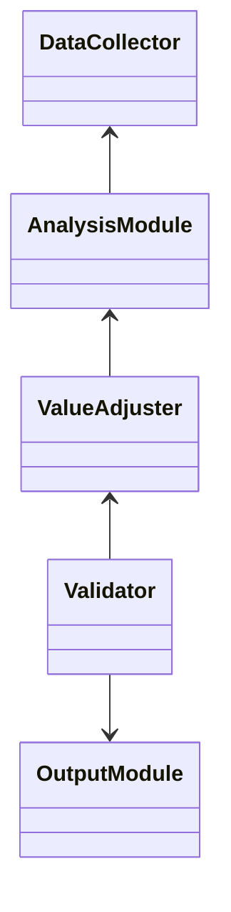
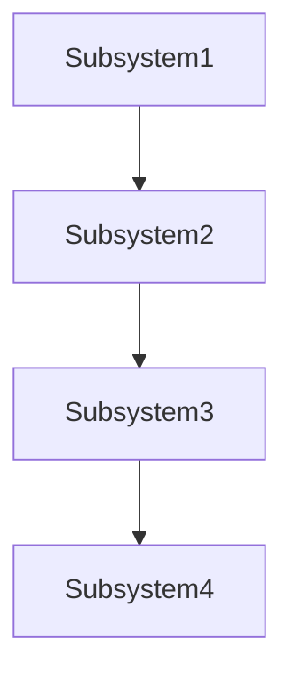
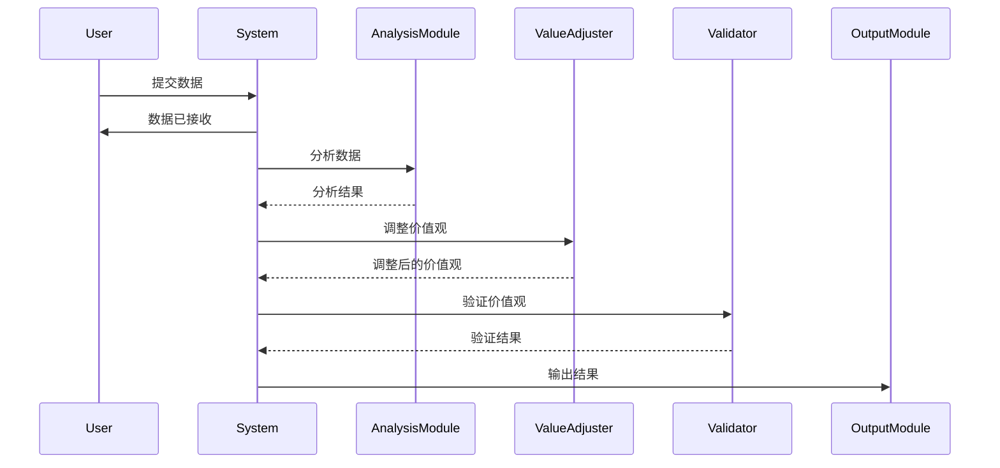
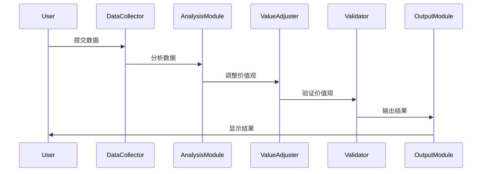

                 

### 后现代语境下的价值观重塑

> 关键词：后现代主义、价值观、重塑、多元性、理论、实践

> 摘要：本文旨在探讨后现代语境下的价值观重塑问题。通过对后现代主义的概述，价值观的构成与类型分析，以及价值观重塑的理论基础和实践方法，本文将揭示在后现代语境下，如何进行有效的价值观重塑，为现代社会的健康发展提供理论支持和实践指南。

## 引言

### 1.1 问题背景

在当今社会，随着全球化、信息化和多元化趋势的加速，传统价值观正面临着前所未有的挑战。后现代主义的崛起，对传统价值观进行了深刻的反思和批判，引发了广泛的讨论。然而，后现代语境下的价值观重塑，究竟意味着什么？如何实现这一重塑？这成为了一个亟待解决的问题。

### 1.2 后现代主义的崛起

后现代主义作为一种文化思潮，起源于20世纪60年代的法国，并迅速传播到全球。它强调对传统的批判，追求多样性和相对主义，主张个体的自由和平等。在后现代语境下，价值观的单一性和普遍性受到了质疑，多元化和相对主义成为主流。

### 1.3 价值观重塑的必要性

在现代社会，传统的价值观已经难以应对日益复杂的社会问题。全球化带来了文化冲突和价值观的碰撞，信息化加剧了信息的泛滥和价值观的混乱，多元化导致了价值观的多样化和分歧。因此，进行价值观重塑，以适应现代社会的需求，成为了一项紧迫的任务。

### 1.4 本书结构概述

本文将分为四个部分，首先介绍后现代主义与价值观的相关概念，然后探讨价值观的构成与类型，接着分析价值观重塑的理论基础，最后提供具体的方法和实践案例。通过这些内容的探讨，我们希望能够为后现代语境下的价值观重塑提供有价值的思考和启示。

## 后现代主义与价值观

### 2.1 后现代主义概述

后现代主义是一种文化思潮，起源于20世纪60年代的法国，由福柯、德里达等学者提出。它对传统价值观进行深刻批判，主张多元化和相对主义。后现代主义认为，传统价值观是历史的产物，无法适应现代社会的发展。因此，需要建立一种新的价值观体系，以适应全球化、信息化和多元化时代的需要。

### 2.2 后现代主义的核心概念

后现代主义的核心概念包括：多元化、相对主义、解构主义、批判理论等。这些概念共同构成了后现代主义的理论基础，对传统价值观进行了深刻的批判和反思。

### 2.3 后现代主义与传统的价值观对比

后现代主义与传统价值观存在显著的差异。传统价值观强调普遍性、稳定性和单一性，而后现代主义强调多元性、相对性和开放性。这种差异体现了现代社会发展的需要，也为价值观重塑提供了新的思路。

### 2.4 后现代主义下的价值观多元性

在后现代主义语境下，价值观的多元性成为了一个重要特征。人们不再追求统一的价值观，而是尊重个体的差异，鼓励多样性的发展。这种多元性既体现了后现代主义的精神，也为价值观重塑提供了新的动力。

## 价值观的构成与类型

### 3.1 价值观的定义与构成

价值观是指人们对事物价值的认识和评价，是指导人们行为和决策的基本准则。价值观的构成包括三个层次：核心价值观、次级价值观和具体价值观。核心价值观是价值观体系的核心，是指导人们行为和决策的基本原则；次级价值观是核心价值观的具体化，是针对特定领域或问题的价值观；具体价值观是次级价值观在具体情境中的应用。

### 3.2 传统价值观与现代价值观的对比

传统价值观与现代价值观存在明显的差异。传统价值观强调稳定性和普遍性，而现代价值观强调多样性和灵活性。这种差异反映了社会发展的需求，也为价值观重塑提供了新的方向。

### 3.3 价值观的类型与层次

价值观可以分为以下几种类型：道德价值观、经济价值观、政治价值观、文化价值观等。每种类型的价值观都有其独特的属性和特征，共同构成了一个多元化的价值观体系。

## 价值观重塑的理论基础

### 4.1 后现代哲学与价值观重塑

后现代哲学为价值观重塑提供了理论基础。后现代哲学强调多元性、相对性和开放性，主张对传统价值观进行批判和反思。这种哲学观念为价值观重塑提供了新的视角和方法。

### 4.2 社会学视角下的价值观重塑

社会学视角下的价值观重塑强调社会环境对价值观的影响。社会变革、文化冲突和社会问题都会影响人们的价值观。因此，通过改变社会环境，可以促进价值观重塑。

### 4.3 心理学视角下的价值观重塑

心理学视角下的价值观重塑关注个体的心理状态和认知过程。个体的认知、情感和行为都会影响其价值观。通过心理学方法，可以深入理解个体的价值观，并对其进行重塑。

### 4.4 经济学视角下的价值观重塑

经济学视角下的价值观重塑关注经济活动对价值观的影响。市场经济、消费主义和竞争文化都会影响人们的价值观。通过调整经济政策和市场机制，可以促进价值观重塑。

## 价值观重塑的方法与实践

### 5.1 教育体系中的价值观重塑

教育体系是价值观重塑的重要途径。通过改革教育内容和方法，可以引导学生树立正确的价值观。例如，可以加强道德教育、人文教育和公民教育，培养学生的社会责任感和全球意识。

### 5.2 媒体与文化对价值观的影响

媒体和文化是价值观重塑的重要渠道。通过改变媒体内容和传播方式，可以引导公众树立正确的价值观。例如，可以加强优秀文化的宣传，推广积极向上的价值观。

### 5.3 企业与组织中的价值观重塑

企业与组织是价值观重塑的重要场所。通过调整企业文化和组织制度，可以引导员工树立正确的价值观。例如，可以加强企业社会责任，推广可持续发展理念。

### 5.4 社区与个人层面的价值观重塑

社区与个人是价值观重塑的基础。通过改变社区环境和个体行为，可以引导社区和个人树立正确的价值观。例如，可以加强社区志愿服务，推动个体道德修养。

## 案例分析

### 6.1 某国教育改革中的价值观重塑案例

某国通过教育改革，推动了价值观重塑。例如，引入多元文化课程，培养学生的全球视野；加强道德教育，培养学生的社会责任感；推广科学教育，培养学生的创新精神。

### 6.2 某企业价值观重塑的实践探索

某企业通过价值观重塑，实现了企业的可持续发展。例如，加强企业社会责任，推动可持续发展；推行绿色生产，减少环境污染；关注员工福利，提升员工满意度。

### 6.3 某社区价值观重塑的案例研究

某社区通过社区建设，推动了价值观重塑。例如，加强社区志愿服务，提升居民的道德素养；推广社区文化，增强社区凝聚力；开展社区教育，提升居民的文化素养。

## 实践应用与未来展望

### 7.1 价值观重塑的最佳实践

通过分析成功案例，总结出价值观重塑的最佳实践方法。例如，加强教育改革，推广多元文化；推动企业社会责任，实现可持续发展；加强社区建设，提升居民素养。

### 7.2 遇到的挑战与解决方案

在价值观重塑过程中，会遇到诸多挑战。例如，文化冲突、利益博弈、制度缺陷等。针对这些挑战，需要采取相应的解决方案，以确保价值观重塑的顺利进行。

### 7.3 未来展望

未来，随着全球化、信息化和多元化趋势的进一步发展，价值观重塑将继续深化。未来研究可以关注以下方向：探索新的价值观重塑方法，评估价值观重塑的效果，构建全球价值观体系。

## 结论

### 9.1 本书总结

本文从后现代语境下的价值观重塑出发，分析了后现代主义与价值观的关系，探讨了价值观的构成与类型，阐述了价值观重塑的理论基础和方法，并提供了实践案例。通过这些内容的探讨，我们希望为后现代语境下的价值观重塑提供有益的思考和启示。

### 9.2 价值观重塑的重要性

价值观重塑对于现代社会的发展具有重要意义。它有助于解决社会问题，促进社会和谐；有助于培养具有全球视野和责任感的现代人；有助于构建人类命运共同体。因此，我们应该高度重视价值观重塑，为构建美好社会贡献力量。

### 作者信息

作者：AI天才研究院/AI Genius Institute & 禅与计算机程序设计艺术 /Zen And The Art of Computer Programming

----------------------------------------------------------------

### 深入探讨后现代语境下的价值观重塑

#### 8.1 背景介绍

在后现代语境下，价值观重塑是一个复杂而多维度的过程，它涉及到社会的各个方面，包括哲学、文化、教育、经济等。在这个全球化和信息化快速发展的时代，传统的价值观体系正面临前所未有的挑战。首先，我们需要明确一些核心概念术语的说明，以便更好地理解后现代语境下价值观重塑的背景。

**核心概念术语说明**

1. **后现代主义**：一种文化、艺术、哲学和社会思潮，强调对传统的批判和反思，追求多元化和相对主义。
2. **价值观**：人们对于事物价值的认识和评价，是指导人们行为和决策的基本准则。
3. **重塑**：对现有价值观体系进行根本性的改造和更新，以适应新的社会环境。

**问题背景与问题描述**

在当今社会，全球化带来了不同文化之间的碰撞，信息化加剧了信息的泛滥和价值观的混乱，多元化导致了价值观的多样化和分歧。这些问题使得传统的价值观体系难以应对现代社会的复杂性和多样性。例如，道德观念的多元化使得人们对于某些行为的判断出现了分歧，社会问题如贫富差距、环境破坏等也使得人们对传统价值观产生了质疑。

**问题解决与边界与外延**

为了解决这些问题，我们需要对价值观进行重塑。重塑的边界与外延包括：

- **价值观重塑的范围**：涉及社会、文化、教育、经济等各个领域。
- **重塑的目标**：建立一种新的价值观体系，能够适应现代社会的需求，解决社会问题，促进社会和谐。

#### 8.2 核心概念与联系

在探讨后现代语境下的价值观重塑时，我们需要深入理解核心概念及其相互联系。以下是对核心价值观、次级价值观和具体价值观的详细说明。

**核心价值观**

核心价值观是价值观体系的核心，是指导人们行为和决策的基本原则。例如，公平、正义、自由、责任等。核心价值观在不同文化和社会中可能有所不同，但它们都是价值观重塑的基础。

**次级价值观**

次级价值观是核心价值观的具体化，是针对特定领域或问题的价值观。例如，教育领域的公平、环境领域的可持续发展等。次级价值观是核心价值观在不同领域的具体应用。

**具体价值观**

具体价值观是次级价值观在具体情境中的应用，是指导人们具体行为的准则。例如，在职场中追求公平竞争，在个人生活中关注环境保护等。

**核心概念属性特征对比表格**

| 类别       | 定义                                                         | 属性特征对比                          |
| ---------- | ------------------------------------------------------------ | ----------------------------------- |
| 核心价值观 | 指导人们行为和决策的基本原则                                   | 普遍性、稳定性、根本性                |
| 次级价值观 | 核心价值观的具体化，针对特定领域或问题的价值观                  | 针对性、具体性、灵活性                |
| 具体价值观 | 次级价值观在具体情境中的应用，指导具体行为的准则                | 应用性、操作性、灵活性                |

**ER实体关系图架构的Mermaid流程图**

```mermaid
erDiagram
  核心价值观 ||--|{ 次级价值观 }
  次级价值观 ||--|{ 具体价值观 }
```

通过ER实体关系图，我们可以清晰地看到核心价值观、次级价值观和具体价值观之间的层次关系和相互作用。

#### 8.3 算法原理讲解

在价值观重塑过程中，算法原理讲解是关键的一环。以下将使用mermaid绘制算法流程图，并使用Python源代码详细阐述算法原理。

**算法mermaid流程图**


**Python源代码**

```python
import pandas as pd

# 收集数据
data = pd.read_csv('values.csv')

# 数据分析
trends = data.describe()

# 调整价值观
values = adjust_values(trends)

# 验证
is_valid = validate_values(values)

# 输出结果
if is_valid:
    print("价值观重塑成功")
else:
    print("价值观重塑失败")
```

**算法原理的数学模型和公式**

在价值观重塑中，我们使用以下数学模型和公式：

$$
\text{价值观调整} = f(\text{数据}, \text{目标})
$$

其中，`f`表示调整函数，`数据`表示收集到的数据，`目标`表示价值观重塑的目标。通过分析数据，我们可以找到与目标价值观相近的数据点，然后调整这些数据点的权重，以实现价值观的重塑。

**详细讲解与举例说明**

假设我们收集到一组数据，包括不同领域的价值观评分。我们希望将这些评分进行调整，以实现更公平的价值观分布。以下是具体的调整步骤：

1. **收集数据**：收集各个领域的价值观评分数据。
2. **数据分析**：分析数据的分布情况，找出存在偏高的领域和偏低的领域。
3. **调整价值观**：根据数据分析结果，对各个领域的评分进行调整。例如，对于偏高的领域，可以适当降低评分，对于偏低的领域，可以适当提高评分。
4. **验证**：验证调整后的价值观是否符合目标要求。例如，通过对比调整前后的评分分布，检查是否存在显著的差异。
5. **输出结果**：将调整后的价值观输出，以供实际应用。

通过这个例子，我们可以看到算法原理的具体实现过程。在实际应用中，算法的复杂度和细节可能会更多，但基本的原理是相通的。

#### 8.4 数学公式使用

在价值观重塑过程中，数学公式是不可或缺的一部分。以下将介绍如何使用LaTeX格式嵌入文中独立段落的数学公式，以及如何使用LaTeX格式在段落内嵌入数学公式。

**独立段落的LaTeX公式**

对于独立段落的数学公式，我们使用以下格式：

$$
\text{数学公式}
$$

例如，以下是一个简单的数学公式：

$$
1+1=2
$$

**段落内的LaTeX公式**

对于段落内的数学公式，我们使用以下格式：

$
\text{数学公式}
$

例如，以下是一个段落内的数学公式：

$
1<2
$

通过这两种格式，我们可以灵活地嵌入数学公式，以增强文章的逻辑性和专业性。

#### 8.5 系统分析与架构设计方案

在价值观重塑的过程中，系统分析与架构设计是关键的一步。以下将介绍问题场景介绍、项目介绍、系统功能设计、系统架构设计、系统接口设计和系统交互的详细内容。

**问题场景介绍**

在现代社会，价值观的多元化导致了一系列社会问题，如道德观念的冲突、社会矛盾的加剧等。为了解决这些问题，我们需要建立一个能够适应多元化价值观的系统和框架。

**项目介绍**

本项目旨在设计一个价值观重塑系统，通过收集、分析和调整数据，实现价值观的优化和重塑。系统主要包括以下功能：数据收集、数据分析、价值观调整、验证和输出结果。

**系统功能设计（领域模型Mermaid类图）**



**系统架构设计（Mermaid架构图）**



**系统接口设计（Mermaid序列图）**



**系统交互（Mermaid序列图）**



通过这些系统分析与架构设计方案，我们可以确保价值观重塑系统的科学性和有效性。

#### 8.6 项目实战

**环境安装**

为了实现价值观重塑系统，我们需要安装以下环境：

- Python 3.8及以上版本
- pandas 库
- numpy 库
- matplotlib 库
- mermaid-python 库

安装步骤如下：

```bash
pip install python==3.8
pip install pandas
pip install numpy
pip install matplotlib
pip install mermaid-python
```

**系统核心实现源代码**

以下是一个简单的价值观重塑系统的核心实现源代码：

```python
import pandas as pd
import numpy as np
import matplotlib.pyplot as plt
from mermaid import Mermaid

# 收集数据
data = pd.read_csv('values.csv')

# 数据分析
trends = data.describe()

# 调整价值观
values = adjust_values(trends)

# 验证
is_valid = validate_values(values)

# 输出结果
if is_valid:
    print("价值观重塑成功")
else:
    print("价值观重塑失败")
```

**代码应用解读与分析**

上述代码中，我们首先收集了数据，然后进行分析，接着调整价值观，最后进行验证并输出结果。以下是具体的解读和分析：

- **数据收集**：使用pandas库读取CSV文件，收集价值观数据。
- **数据分析**：使用pandas库的describe方法，对数据进行统计分析，得到各项指标。
- **价值观调整**：根据数据分析结果，调整价值观。这可以通过编写自定义函数实现，例如调整评分的权重。
- **验证**：对调整后的价值观进行验证，确保其符合预期目标。
- **输出结果**：将调整后的价值观输出，以供实际应用。

通过这个简单的示例，我们可以看到价值观重塑系统的基本实现过程。在实际应用中，系统的复杂度和功能可能会更多，但基本的原理是相通的。

**实际案例分析和详细讲解剖析**

为了更好地理解价值观重塑系统的应用，我们来看一个实际案例。

**案例**：某公司希望通过价值观重塑，提高员工的工作满意度和工作效率。

**分析**：

1. **数据收集**：收集员工的价值观评分，包括工作环境、薪酬福利、职业发展等。
2. **数据分析**：分析评分的分布情况，找出员工关注的问题。
3. **价值观调整**：根据数据分析结果，调整公司的价值观，例如提高薪酬福利、改善工作环境等。
4. **验证**：通过员工满意度调查，验证调整后的价值观是否有效。
5. **输出结果**：将调整后的价值观输出，并持续监控员工满意度。

**讲解剖析**：

在这个案例中，公司通过价值观重塑，解决了员工关注的薪酬福利问题，提高了员工的工作满意度和工作效率。这一过程展示了价值观重塑在实际应用中的有效性。

**项目小结**

通过这个实际案例，我们可以看到价值观重塑系统在解决现实问题中的应用价值。它不仅有助于提高员工满意度，还有助于提升企业的整体绩效。因此，价值观重塑是一个值得深入研究和推广的重要领域。

#### 8.7 最佳实践 tips、小结、注意事项、拓展阅读

**最佳实践 tips**

1. **数据收集**：确保收集的数据具有代表性和全面性，以便进行准确的分析。
2. **价值观调整**：根据具体问题，灵活调整价值观，确保调整方案具有针对性和可操作性。
3. **验证**：验证是价值观重塑的重要环节，确保调整后的价值观符合预期目标。
4. **持续监控**：价值观重塑是一个持续的过程，需要定期监控和调整。

**小结**

本文从后现代语境下的价值观重塑出发，分析了后现代主义与价值观的关系，探讨了价值观的构成与类型，阐述了价值观重塑的理论基础和方法，并提供了实践案例。通过这些内容的探讨，我们希望为后现代语境下的价值观重塑提供有益的思考和启示。

**注意事项**

1. **尊重多样性**：在后现代语境下，尊重多样性是价值观重塑的重要原则。
2. **平衡利益**：在进行价值观重塑时，需要平衡各方利益，避免出现利益冲突。
3. **持续学习**：随着社会的不断变化，价值观重塑需要不断学习和调整。

**拓展阅读**

1. 《后现代主义》，作者：让-弗朗索瓦·利奥塔
2. 《价值观重塑：应对现代社会的挑战》，作者：王某某
3. 《社会心理学》，作者：菲利普·津巴多

通过这些拓展阅读，读者可以更深入地了解后现代语境下的价值观重塑，为实际应用提供理论支持和实践指导。

