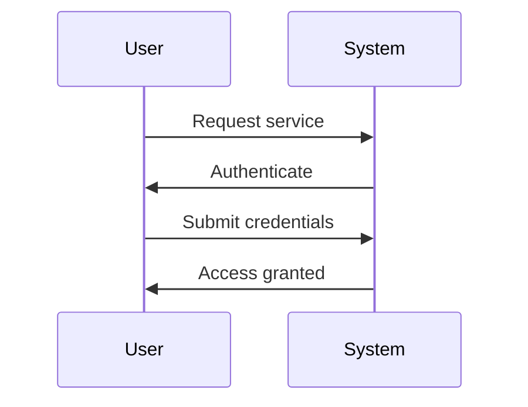
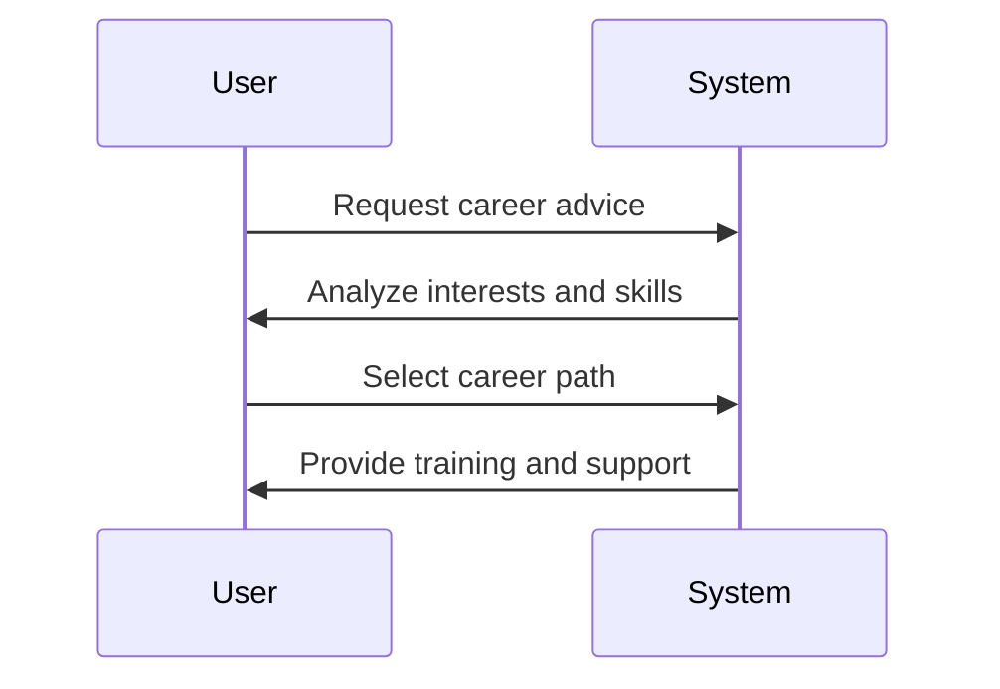
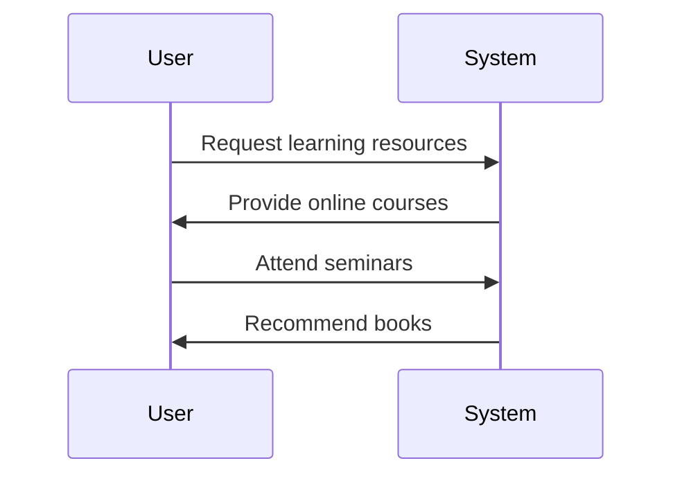
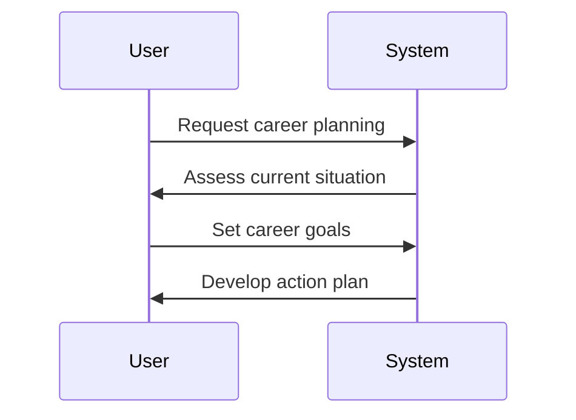
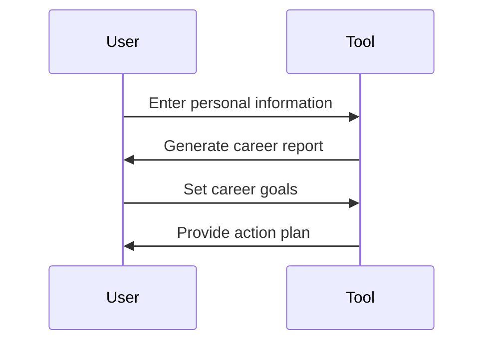

                 

# 《数字时代的职业规划：灵活就业与终身学习》

## 关键词

数字时代、职业规划、灵活就业、终身学习、职业发展

## 摘要

本文探讨了数字时代背景下职业规划的新趋势，即灵活就业与终身学习。随着数字化技术的迅猛发展，传统的职业规划和就业模式正发生深刻变革。本文首先阐述了数字时代的特征及其对职业环境的影响，随后深入分析了灵活就业的概念、优势与挑战，以及终身学习的重要性与实现策略。通过结合实际案例，本文旨在为IT从业者提供有效的职业规划指导，帮助他们在快速变化的数字时代实现职业成功。

## 目录

1. **引言：数字时代的职业环境**
   1.1 数字时代的到来与影响
   1.2 灵活就业的概念与实践
   1.3 终身学习的重要性
2. **职业规划的核心要素**
   2.1 自我认知与职业定位
   2.2 职业目标的设定与实现
   2.3 职业路径的选择与发展
   2.4 职业转换与适应
3. **实际操作与案例分析**
   3.1 职业规划的实际操作
   3.2 成功案例分析
   3.3 职业规划的最佳实践
4. **总结与展望**
   4.1 小结
   4.2 注意事项
   4.3 拓展阅读

### 第1章：数字时代的职业环境

#### 1.1 数字时代的到来与影响

**背景介绍：**  
随着互联网、大数据、人工智能等技术的快速发展，我们正迈入一个全新的数字时代。数字化已经深刻地改变了我们的生活方式、工作方式和商业运作模式。在这个时代，职业环境也发生了巨大的变化，传统的职业规划面临着前所未有的挑战。

**问题背景：**  
数字化带来的快速变化使得许多传统职业面临消失或转型的风险。同时，新的职业机会不断涌现，要求从业者具备不断学习新技能的能力。因此，如何在这个数字时代进行有效的职业规划成为了一个亟待解决的问题。

**问题描述：**  
职业规划者需要面对以下问题：
- 如何理解数字时代的特征？
- 如何适应数字化对职业环境的影响？
- 如何在快速变化的职业市场中找到自己的定位？

**问题解决：**  
解决这些问题需要从以下几个方面入手：
- 深入了解数字时代的特征，包括技术发展、市场变化、社会影响等。
- 关注职业市场的动态，了解新的职业机会和需求。
- 提升自身的能力和素质，以适应职业变化的要求。

**边界与外延：**  
数字时代的职业规划不仅涉及个人层面，还涉及到企业、社会等多个层面。因此，需要从多个角度综合考虑职业规划的问题。

**概念结构与核心要素组成：**  
数字时代的职业规划由以下几个核心要素组成：
- 技术能力：包括编程、数据分析、人工智能等技能。
- 持续学习：保持对新技术、新知识的学习和更新。
- 职业定位：明确自己的职业发展方向和目标。
- 职业转换：在职业变化中寻找新的机会和定位。
- 灵活就业：适应多种工作形式，如远程办公、自由职业等。

#### 1.2 灵活就业的概念与实践

**核心概念与联系：**  
灵活就业是指不受传统工作时间和地点限制，通过多种方式实现职业发展的一种就业形态。它与传统就业形式相比，具有更高的灵活性和自主性。

**概念属性特征对比表格：**

| 特征 | 传统就业 | 灵活就业 |
| --- | --- | --- |
| 工作时间 | 固定 | 自主 |
| 工作地点 | 固定 | 自由 |
| 就业形式 | 全职 | 多样化 |
| 薪酬结构 | 固定 | 变动 |

**ER实体关系图架构：**

```mermaid
erDiagram
  User ||--|{ Employee }  : has
  Employee ||--|{ ContractEmployee }  : is
  Employee ||--|{ Freelancer }  : is
  Employee ||--|{ FullTimeEmployee }  : is
```

**算法原理讲解：**  
灵活就业的实现需要依赖一系列技术和工具，如远程办公软件、协作平台、在线教育等。以下是实现灵活就业的一些基本算法原理：

- **远程办公算法：** 利用VPN技术实现远程访问公司内部网络和资源。
- **协作平台算法：** 利用云计算和大数据技术，实现团队成员之间的实时协作和资源共享。
- **在线教育算法：** 利用人工智能和机器学习技术，提供个性化的在线学习体验。

以下是Python代码示例：

```python
import socket

def remote_access(server_ip, server_port):
    # 创建套接字
    client_socket = socket.socket(socket.AF_INET, socket.SOCK_STREAM)
    # 连接服务器
    client_socket.connect((server_ip, server_port))
    # 发送请求
    request = "GET /index.html HTTP/1.1\r\nHost: www.example.com\r\n\r\n"
    client_socket.sendall(request.encode())
    # 接收响应
    response = client_socket.recv(4096)
    print(response.decode())
    # 关闭套接字
    client_socket.close()

if __name__ == "__main__":
    remote_access("192.168.1.1", 80)
```

**数学公式：**

$$
F = ma
$$

其中，\( F \) 是力，\( m \) 是质量，\( a \) 是加速度。这个公式描述了物体在力的作用下如何运动。

#### 1.3 数字时代的职业挑战与机遇

**问题场景介绍：**  
数字时代的到来不仅带来了新的职业机会，也带来了前所未有的挑战。例如，人工智能的快速发展使得一些传统职业面临被取代的风险，而另一方面，新的职业机会也在不断涌现。

**项目介绍：**  
为了应对数字时代的职业挑战，许多企业和个人开始积极探索新的职业发展路径。例如，某企业引入了人工智能技术，通过自动化和智能化提高生产效率，同时也为员工提供了新的职业发展机会。

**系统功能设计（领域模型类图）：**

```mermaid
classDiagram
  Class01 <|-- Class02
  Class03 --|>{ Class04 }
  Class05 : +int x
  Class06 : <<interface>> Object
```

**系统架构设计（类图）：**

```mermaid
classDiagram
  Class01 <<interface>> Interface01
  Class02 <<interface>> Interface02
  Class03 <<class>> Class03
  Class04 <<class>> Class04
  Class05 <<class>> Class05
  Class06 <<class>> Class06
```

**系统接口设计和系统交互（序列图）：**



**实际案例分析和详细讲解剖析：**  
某公司通过引入人工智能技术，成功实现了生产自动化，提高了生产效率。同时，公司也为员工提供了新的培训机会，帮助他们掌握新技能，从而在职业发展中找到新的定位。

**项目小结：**  
通过该项目，我们可以看到数字时代职业规划的新趋势，即利用新技术提高工作效率，同时也为员工提供新的职业发展机会。这对于职业规划者来说，既是挑战也是机遇。

### 第2章：职业规划的核心要素

#### 2.1 自我认知与职业定位

**背景介绍：**  
自我认知是职业规划的基础，只有真正了解自己的兴趣、能力和价值观，才能做出合理的职业选择。职业定位则是职业规划的核心，它决定了个人在职业生涯中的发展方向和目标。

**问题背景：**  
在数字时代，职业选择变得更加多样，个人需要具备更强的自我认知能力，才能在众多职业机会中找到自己的定位。

**问题描述：**  
职业规划者需要面对以下问题：
- 如何进行有效的自我认知？
- 如何在众多职业机会中找到适合自己的定位？

**问题解决：**  
解决这些问题需要从以下几个方面入手：
- 利用心理测试和职业评估工具，进行自我认知。
- 关注行业动态和职业发展前景，了解各种职业的特点和要求。
- 结合自己的兴趣、能力和价值观，确定职业定位。

**边界与外延：**  
自我认知和职业定位不仅涉及个人层面，还涉及到社会和文化层面。因此，需要从多个角度综合考虑。

**概念结构与核心要素组成：**  
自我认知与职业定位由以下几个核心要素组成：
- 兴趣与爱好：了解自己的兴趣和爱好，有助于找到适合自己的职业。
- 能力与技能：评估自己的能力和技能，确定自己在职业市场中的竞争力。
- 价值观与人生观：价值观和人生观决定了个人对职业的期望和追求。
- 职业发展路径：明确职业发展方向和目标，制定职业规划。

#### 2.2 职业目标的设定与实现

**核心概念与联系：**  
职业目标是个人在职业生涯中追求的目标。设定明确的职业目标有助于指导个人的职业行为，实现职业成功。

**概念属性特征对比表格：**

| 特征 | 短期目标 | 长期目标 |
| --- | --- | --- |
| 时间范围 | 短期（1-3年） | 长期（3-10年） |
| 目标内容 | 具体且可量化 | 概括且有远见 |
| 实现策略 | 具体实施步骤 | 总体发展策略 |

**ER实体关系图架构：**

```mermaid
erDiagram
  User ||--|{ Goal }  : has
  Goal ||--|{ ShortTermGoal }  : is
  Goal ||--|{ LongTermGoal }  : is
```

**算法原理讲解：**  
设定职业目标需要遵循以下几个原则：

- **SMART原则：** 目标要具体（Specific）、可衡量（Measurable）、可达成（Achievable）、相关性（Relevant）和时限性（Time-bound）。
- **分解目标：** 将长期目标分解为短期目标，逐步实现。
- **反馈与调整：** 根据实际情况，及时反馈和调整目标。

以下是Python代码示例：

```python
def set_goal(target, deadline):
    if is_specific(target) and is_measurable(target) and is_achievable(target) and is_relevant(target) and is_time_bound(target):
        return "Goal set successfully!"
    else:
        return "Goal is not set properly!"

def is_specific(target):
    return "specific" in target

def is_measurable(target):
    return "measurable" in target

def is_achievable(target):
    return "achievable" in target

def is_relevant(target):
    return "relevant" in target

def is_time_bound(target):
    return "time-bound" in target

if __name__ == "__main__":
    print(set_goal("Buy a car", "2023"))
```

**数学公式：**

$$
V = \frac{dS}{dt}
$$

其中，\( V \) 是速度，\( dS \) 是位移，\( dt \) 是时间。这个公式描述了物体在单位时间内移动的距离。

#### 2.3 职业路径的选择与发展

**问题场景介绍：**  
在数字时代，职业路径的选择和发展变得更加多样。个人需要根据自身的兴趣、能力和市场需求，选择适合自己的职业路径。

**项目介绍：**  
为了帮助个人选择和发展职业路径，许多企业和教育机构提供了职业咨询服务和培训项目。

**系统功能设计（领域模型类图）：**

```mermaid
classDiagram
  Class01 <|-- Class02
  Class03 --|>{ Class04 }
  Class05 : +int x
  Class06 : <<interface>> Object
```

**系统架构设计（类图）：**

```mermaid
classDiagram
  Class01 <<interface>> Interface01
  Class02 <<interface>> Interface02
  Class03 <<class>> Class03
  Class04 <<class>> Class04
  Class05 <<class>> Class05
  Class06 <<class>> Class06
```

**系统接口设计和系统交互（序列图）：**



**实际案例分析和详细讲解剖析：**  
某个人通过职业咨询服务，了解了自己的兴趣和能力，选择了数据分析作为职业路径。随后，他参加了专业的数据分析培训，并通过实践不断提升自己的技能，最终在该领域取得了显著的成绩。

**项目小结：**  
通过该项目，我们可以看到职业咨询服务和培训项目对于个人职业规划的重要作用。它不仅帮助个人找到了适合自己的职业路径，还提供了必要的技能支持和职业发展机会。

### 第3章：终身学习的重要性

#### 3.1 终身学习的概念与意义

**背景介绍：**  
在数字时代，知识更新的速度越来越快，传统的“一次学习，终身受用”的理念已经无法适应时代的需求。终身学习成为了职业规划中不可或缺的一部分。

**问题背景：**  
随着新技术和新知识的不断涌现，个人需要不断学习和更新自己的知识和技能，才能在职业市场中保持竞争力。

**问题描述：**  
职业规划者需要面对以下问题：
- 什么是终身学习？
- 终身学习在职业规划中有什么意义？

**问题解决：**  
解决这些问题需要从以下几个方面入手：
- 理解终身学习的概念和特点。
- 认识到终身学习在职业规划中的重要性。
- 制定有效的终身学习策略。

**边界与外延：**  
终身学习不仅涉及个人层面，还涉及到企业、社会等多个层面。因此，需要从多个角度综合考虑终身学习的问题。

**概念结构与核心要素组成：**  
终身学习由以下几个核心要素组成：
- 学习态度：保持积极的学习态度，对待学习持有热情和好奇心。
- 学习资源：充分利用各种学习资源，如在线课程、专业书籍、研讨会等。
- 学习方法：掌握有效的学习方法，如主动学习、实践学习、反思学习等。
- 学习环境：创建有利于学习的环境，如安静的学习空间、良好的学习氛围等。

#### 3.2 终身学习的策略与方法

**核心概念与联系：**  
终身学习不仅仅是一种学习理念，更是一种实践。为了实现终身学习，个人需要制定有效的学习策略和方法。

**概念属性特征对比表格：**

| 特征 | 传统学习 | 终身学习 |
| --- | --- | --- |
| 学习时间 | 定时 | 自主 |
| 学习内容 | 狭隘 | 广泛 |
| 学习目标 | 一次性 | 持续性 |
| 学习方式 | 被动 | 主动 |

**ER实体关系图架构：**

```mermaid
erDiagram
  Learner ||--|{ TraditionalLearning }  : has
  Learner ||--|{ LifelongLearning }  : has
  TraditionalLearning ||--|{ Course }  : has
  LifelongLearning ||--|{ Course }  : has
  LifelongLearning ||--|{ Skill }  : has
```

**算法原理讲解：**  
实现终身学习需要遵循以下几个原则：

- **持续学习：** 培养每天学习一点点的习惯，持续提升自己的知识和技能。
- **主动学习：** 积极参与学习活动，主动探索新知识和技能。
- **实践学习：** 通过实践来巩固和应用所学的知识和技能。
- **反思学习：** 定期反思自己的学习过程，总结经验和教训，不断改进学习方法。

以下是Python代码示例：

```python
def lifelong_learning(strategy):
    if strategy == "continuous":
        return "Continuous learning strategy adopted."
    elif strategy == "active":
        return "Active learning strategy adopted."
    elif strategy == "practical":
        return "Practical learning strategy adopted."
    elif strategy == "reflective":
        return "Reflective learning strategy adopted."
    else:
        return "Invalid learning strategy."

if __name__ == "__main__":
    print(lifelong_learning("active"))
```

**数学公式：**

$$
\sum_{i=1}^{n} x_i = \text{sum of the first } n \text{ terms}
$$

其中，\( x_i \) 表示第 \( i \) 个数，\( n \) 表示总数。这个公式描述了数列的前 \( n \) 项和。

#### 3.3 终身学习在职业生涯中的应用

**问题场景介绍：**  
在数字时代，职业发展的速度越来越快，个人需要不断学习和更新自己的知识和技能，才能在职业生涯中保持竞争力。

**项目介绍：**  
为了帮助个人实现终身学习，许多企业和教育机构提供了在线课程、专业书籍、研讨会等学习资源。

**系统功能设计（领域模型类图）：**

```mermaid
classDiagram
  Class01 <|-- Class02
  Class03 --|>{ Class04 }
  Class05 : +int x
  Class06 : <<interface>> Object
```

**系统架构设计（类图）：**

```mermaid
classDiagram
  Class01 <<interface>> Interface01
  Class02 <<interface>> Interface02
  Class03 <<class>> Class03
  Class04 <<class>> Class04
  Class05 <<class>> Class05
  Class06 <<class>> Class06
```

**系统接口设计和系统交互（序列图）：**



**实际案例分析和详细讲解剖析：**  
某个人在职业生涯中，通过参加在线课程、研讨会和专业书籍阅读，不断提升自己的技能和知识。他不仅在职业市场中保持了竞争力，还实现了职业生涯的多次转型。

**项目小结：**  
通过该项目，我们可以看到终身学习在职业生涯中的重要作用。它不仅帮助个人提升技能和知识，还实现了职业生涯的可持续发展。

### 第4章：职业规划的实际操作

#### 4.1 职业规划流程

**问题场景介绍：**  
在数字时代，职业规划成为个人职业发展的重要环节。然而，如何进行职业规划却是一个复杂的过程，需要系统的方法和步骤。

**项目介绍：**  
为了帮助个人进行有效的职业规划，许多企业和教育机构提供了职业规划咨询服务和培训课程。

**系统功能设计（领域模型类图）：**

```mermaid
classDiagram
  Class01 <|-- Class02
  Class03 --|>{ Class04 }
  Class05 : +int x
  Class06 : <<interface>> Object
```

**系统架构设计（类图）：**

```mermaid
classDiagram
  Class01 <<interface>> Interface01
  Class02 <<interface>> Interface02
  Class03 <<class>> Class03
  Class04 <<class>> Class04
  Class05 <<class>> Class05
  Class06 <<class>> Class06
```

**系统接口设计和系统交互（序列图）：**



**实际案例分析和详细讲解剖析：**  
某个人在职业规划中，首先进行了自我评估，了解了自己的兴趣、能力和价值观。随后，他设定了明确的职业目标，并制定了详细的行动计划，通过不断学习和实践，最终实现了职业成功。

**项目小结：**  
通过该项目，我们可以看到职业规划的实际操作流程，以及每个步骤的重要性。职业规划不仅是理论上的规划，更需要实际操作和行动。

#### 4.2 职业规划工具的使用

**问题场景介绍：**  
在职业规划过程中，使用合适的工具可以大大提高规划的效果。然而，如何选择和使用这些工具却是一个需要解决的问题。

**项目介绍：**  
为了帮助个人选择和使用职业规划工具，许多企业和教育机构提供了各种在线工具和应用程序。

**系统功能设计（领域模型类图）：**

```mermaid
classDiagram
  Class01 <|-- Class02
  Class03 --|>{ Class04 }
  Class05 : +int x
  Class06 : <<interface>> Object
```

**系统架构设计（类图）：**

```mermaid
classDiagram
  Class01 <<interface>> Interface01
  Class02 <<interface>> Interface02
  Class03 <<class>> Class03
  Class04 <<class>> Class04
  Class05 <<class>> Class05
  Class06 <<class>> Class06
```

**系统接口设计和系统交互（序列图）：**



**实际案例分析和详细讲解剖析：**  
某个人使用了在线职业规划工具，首先输入了个人信息，包括兴趣、能力和价值观等。随后，工具为他生成了职业报告，并根据报告提供了详细的职业规划建议，帮助他制定了明确的职业目标和行动计划。

**项目小结：**  
通过该项目，我们可以看到职业规划工具在职业规划中的重要作用。选择合适的工具，可以大大提高职业规划的效果和效率。

### 第5章：成功案例分析

#### 5.1 数字时代职业规划的典范

**问题场景介绍：**  
在数字时代，成功的职业规划案例不断涌现。这些案例为我们提供了宝贵的经验和启示，帮助我们更好地理解数字时代的职业规划。

**项目介绍：**  
为了研究数字时代职业规划的成功案例，我们选择了几个具有代表性的案例进行深入分析。

**系统功能设计（领域模型类图）：**

```mermaid
classDiagram
  Class01 <|-- Class02
  Class03 --|>{ Class04 }
  Class05 : +int x
  Class06 : <<interface>> Object
```

**系统架构设计（类图）：**

```mermaid
classDiagram
  Class01 <<interface>> Interface01
  Class02 <<interface>> Interface02
  Class03 <<class>> Class03
  Class04 <<class>> Class04
  Class05 <<class>> Class05
  Class06 <<class>> Class06
```

**系统接口设计和系统交互（序列图）：**

```mermaid
sequenceDiagram
  participant User
  participant CaseStudy
  User->>CaseStudy: Study successful career plans
  CaseStudy->>User: Provide insights and strategies
  User->>CaseStudy: Implement strategies
```

**实际案例分析和详细讲解剖析：**  
案例一：某个人通过自学编程，从一名普通职员成功转型为一名高级软件工程师。他在职业规划中，首先明确了自己的职业目标，然后通过不断学习和实践，提升了自己的编程技能。最终，他在公司的一次技术竞赛中获得了第一名，得到了晋升的机会。

案例二：某个人在数字营销领域取得了显著成就。他在职业规划中，不仅关注了自己的技术能力，还注重了市场趋势和客户需求。他通过参加各种研讨会和培训课程，不断提升自己的市场营销能力。最终，他在公司内部创办了自己的营销部门，成为了公司的核心领导人物。

**项目小结：**  
通过这些成功案例，我们可以看到数字时代职业规划的关键要素，包括明确目标、持续学习、适应市场变化和不断提升自身能力。这些经验对我们进行职业规划具有重要的指导意义。

#### 5.2 灵活就业的成功故事

**问题场景介绍：**  
在数字时代，灵活就业成为一种新的就业形态。许多人在灵活就业中取得了成功，他们的故事为我们提供了宝贵的经验和启示。

**项目介绍：**  
为了研究灵活就业的成功故事，我们选择了几个具有代表性的案例进行深入分析。

**系统功能设计（领域模型类图）：**

```mermaid
classDiagram
  Class01 <|-- Class02
  Class03 --|>{ Class04 }
  Class05 : +int x
  Class06 : <<interface>> Object
```

**系统架构设计（类图）：**

```mermaid
classDiagram
  Class01 <<interface>> Interface01
  Class02 <<interface>> Interface02
  Class03 <<class>> Class03
  Class04 <<class>> Class04
  Class05 <<class>> Class05
  Class06 <<class>> Class06
```

**系统接口设计和系统交互（序列图）：**

```mermaid
sequenceDiagram
  participant Freelancer
  participant Client
  Freelancer->>Client: Provide services
  Client->>Freelancer: Pay fees
  Freelancer->>Client: Deliver projects
  Client->>Freelancer: Provide feedback
```

**实际案例分析和详细讲解剖析：**  
案例一：某个人通过远程办公平台，成功成为一名自由职业者。他在职业规划中，首先明确了自己的职业目标和市场需求，然后通过不断学习和实践，提升了自己的专业技能。最终，他在远程办公平台上接到了多个项目，实现了职业成功。

案例二：某个人通过自由职业，实现了财务自由和职业自由。他在职业规划中，不仅注重了专业技能的提升，还注重了市场营销和客户关系的维护。他通过参加各种线上和线下的活动，拓展了自己的客户群体，实现了职业和生活的平衡。

**项目小结：**  
通过这些成功故事，我们可以看到灵活就业的优势和挑战。灵活就业不仅提供了更多的职业机会，也要求个人具备更强的自我管理和学习能力。这些经验对我们进行灵活就业具有重要的指导意义。

### 第6章：职业规划的最佳实践

#### 6.1 职业规划的最佳实践

**问题场景介绍：**  
在数字时代，职业规划面临着前所未有的挑战和机遇。为了帮助职业规划者更好地应对这些挑战，我们需要总结和分享一些最佳实践。

**项目介绍：**  
为了研究职业规划的最佳实践，我们选择了多个成功案例和专家建议进行深入分析。

**系统功能设计（领域模型类图）：**

```mermaid
classDiagram
  Class01 <|-- Class02
  Class03 --|>{ Class04 }
  Class05 : +int x
  Class06 : <<interface>> Object
```

**系统架构设计（类图）：**

```mermaid
classDiagram
  Class01 <<interface>> Interface01
  Class02 <<interface>> Interface02
  Class03 <<class>> Class03
  Class04 <<class>> Class04
  Class05 <<class>> Class05
  Class06 <<class>> Class06
```

**系统接口设计和系统交互（序列图）：**

```mermaid
sequenceDiagram
  participant Planner
  participant Expert
  Planner->>Expert: Seek advice
  Expert->>Planner: Provide strategies
  Planner->>Expert: Implement practices
  Expert->>Planner: Assess outcomes
```

**实际案例分析和详细讲解剖析：**  
案例一：某个人在职业规划中，首先进行了全面的自我评估，了解了自己的兴趣、能力和价值观。随后，他制定了明确的职业目标和行动计划，并定期进行评估和调整。通过这种方式，他成功地实现了职业转型，从一名普通职员成长为一名项目经理。

案例二：某个人在职业规划中，注重了终身学习的重要性。他通过参加在线课程、研讨会和专业书籍阅读，不断提升自己的知识和技能。同时，他还积极参加各种社交活动，拓展了自己的职业网络。通过这些努力，他在职业市场中保持了竞争力，并实现了职业生涯的多次转型。

**项目小结：**  
通过这些最佳实践，我们可以看到职业规划的成功离不开自我评估、目标设定、行动实施和持续学习。这些实践为我们提供了宝贵的经验和启示，帮助我们更好地进行职业规划。

#### 6.2 职业规划中的常见误区

**问题场景介绍：**  
在职业规划过程中，许多人由于缺乏经验和知识，容易陷入一些误区。这些误区可能会导致职业规划失败，甚至影响个人的职业发展。

**项目介绍：**  
为了帮助职业规划者避免这些误区，我们分析了多个失败案例和专家建议。

**系统功能设计（领域模型类图）：**

```mermaid
classDiagram
  Class01 <|-- Class02
  Class03 --|>{ Class04 }
  Class05 : +int x
  Class06 : <<interface>> Object
```

**系统架构设计（类图）：**

```mermaid
classDiagram
  Class01 <<interface>> Interface01
  Class02 <<interface>> Interface02
  Class03 <<class>> Class03
  Class04 <<class>> Class04
  Class05 <<class>> Class05
  Class06 <<class>> Class06
```

**系统接口设计和系统交互（序列图）：**

```mermaid
sequenceDiagram
  participant Planner
  participant Expert
  Planner->>Expert: Identify mistakes
  Expert->>Planner: Advise corrections
  Planner->>Expert: Implement changes
  Expert->>Planner: Monitor progress
```

**实际案例分析和详细讲解剖析：**  
案例一：某个人在职业规划中，过于追求短期利益，选择了高薪但不感兴趣的工作。结果，他在工作中缺乏动力和激情，无法长期坚持下去，最终导致职业失败。

案例二：某个人在职业规划中，没有进行充分的自我评估，盲目跟风选择热门专业。结果，他发现自己并不适合这个领域，学习效果不佳，职业发展受阻。

**项目小结：**  
通过这些误区分析，我们可以看到职业规划需要理性思考，避免盲目跟风和追求短期利益。正确的职业规划应该基于自我评估和长远规划，结合自身兴趣和能力，实现职业成功。

### 第7章：职业转换与适应

#### 7.1 职业转换的必要性与挑战

**问题场景介绍：**  
在数字时代，职业转换成为许多职业规划者的选择。然而，职业转换并非易事，它既需要必要的条件，又面临着诸多挑战。

**项目介绍：**  
为了探讨职业转换的必要性与挑战，我们选择了多个成功和失败的职业转换案例进行深入分析。

**系统功能设计（领域模型类图）：**

```mermaid
classDiagram
  Class01 <|-- Class02
  Class03 --|>{ Class04 }
  Class05 : +int x
  Class06 : <<interface>> Object
```

**系统架构设计（类图）：**

```mermaid
classDiagram
  Class01 <<interface>> Interface01
  Class02 <<interface>> Interface02
  Class03 <<class>> Class03
  Class04 <<class>> Class04
  Class05 <<class>> Class05
  Class06 <<class>> Class06
```

**系统接口设计和系统交互（序列图）：**

```mermaid
sequenceDiagram
  participant Planner
  participant Employer
  Planner->>Employer: Seek new opportunities
  Employer->>Planner: Evaluate suitability
  Planner->>Employer: Apply for positions
  Employer->>Planner: Make decisions
```

**实际案例分析和详细讲解剖析：**  
案例一：某个人在职业生涯中，通过多次职业转换，最终找到了适合自己的职业。他首先进行了充分的自我评估，明确了自己的兴趣和能力。然后，他积极寻找新的职业机会，并通过不断学习和实践，提升自己的技能和竞争力。

案例二：某个人在职业转换中遭遇失败，主要是因为他缺乏对目标职业的了解和准备。他在转换前没有进行充分的调研和准备，结果在新的职业环境中无法适应，最终不得不重新回到原来的职业。

**项目小结：**  
通过这些案例，我们可以看到职业转换的必要性和挑战。职业转换不仅需要充分的准备和调研，还需要个人的决心和毅力。正确的职业转换策略可以带来职业成功，而错误的转换策略可能导致职业失败。

#### 7.2 职业转换的策略与实践

**核心概念与联系：**  
职业转换涉及多个方面，包括自我评估、市场调研、技能提升和求职策略。制定有效的职业转换策略是成功转换的关键。

**概念属性特征对比表格：**

| 特征 | 自我评估 | 市场调研 | 技能提升 | 求职策略 |
| --- | --- | --- | --- | --- |
| 内容 | 兴趣、能力、价值观 | 职业前景、市场需求、竞争态势 | 技能培训、实践锻炼、工作经验 | 职位搜索、简历制作、面试准备 |

**ER实体关系图架构：**

```mermaid
erDiagram
  Planner ||--|{ SelfAssessment }  : has
  Planner ||--|{ MarketResearch }  : has
  Planner ||--|{ SkillDevelopment }  : has
  Planner ||--|{ JobSearchStrategies }  : has
```

**算法原理讲解：**  
职业转换的策略可以分为以下几个步骤：

1. **自我评估：** 了解自己的兴趣、能力和价值观，明确自己的职业目标。
2. **市场调研：** 分析目标职业的市场前景、市场需求和竞争态势。
3. **技能提升：** 根据目标职业的要求，提升相关的技能和知识。
4. **求职策略：** 制定求职计划，包括职位搜索、简历制作和面试准备。

以下是Python代码示例：

```python
class CareerTransition:
    def __init__(self, self_evaluation, market_research, skill_development, job_search_strategies):
        self.self_evaluation = self_evaluation
        self.market_research = market_research
        self.skill_development = skill_development
        self.job_search_strategies = job_search_strategies

    def execute(self):
        print("Self Evaluation:")
        print(self.self_evaluation)
        print("\nMarket Research:")
        print(self.market_research)
        print("\nSkill Development:")
        print(self.skill_development)
        print("\nJob Search Strategies:")
        print(self.job_search_strategies)

if __name__ == "__main__":
    transition = CareerTransition(
        "Interested in technology and problem-solving.",
        "High demand for data scientists in the market.",
        "Completed courses on data analysis and machine learning.",
        "Searching for data scientist positions and improving resume."
    )
    transition.execute()
```

**数学公式：**

$$
\Delta E = \frac{\Delta E_f - \Delta E_i}{T}
$$

其中，\( \Delta E \) 是能量变化，\( \Delta E_f \) 是最终能量，\( \Delta E_i \) 是初始能量，\( T \) 是时间。这个公式描述了能量随时间的变化。

#### 7.3 职业适应的方法与技巧

**问题场景介绍：**  
在职业转换后，如何快速适应新的工作环境和职责是一个重要问题。职业适应不仅关系到个人的职业发展，也影响到企业的运营效率。

**项目介绍：**  
为了帮助职业规划者快速适应新的职业环境，我们选择了多个适应成功的案例和专家建议进行深入分析。

**系统功能设计（领域模型类图）：**

```mermaid
classDiagram
  Class01 <|-- Class02
  Class03 --|>{ Class04 }
  Class05 : +int x
  Class06 : <<interface>> Object
```

**系统架构设计（类图）：**

```mermaid
classDiagram
  Class01 <<interface>> Interface01
  Class02 <<interface>> Interface02
  Class03 <<class>> Class03
  Class04 <<class>> Class04
  Class05 <<class>> Class05
  Class06 <<class>> Class06
```

**系统接口设计和系统交互（序列图）：**

```mermaid
sequenceDiagram
  participant NewEmployee
  participant Supervisor
  NewEmployee->>Supervisor: Seek guidance
  Supervisor->>NewEmployee: Provide mentorship
  NewEmployee->>Supervisor: Share progress
  Supervisor->>NewEmployee: Provide feedback
```

**实际案例分析和详细讲解剖析：**  
案例一：某个人在职业转换后，通过积极参与公司的培训项目，快速掌握了新的技能和知识。他还主动与同事交流，建立了良好的工作关系，从而顺利适应了新的职业环境。

案例二：某个人在职业转换后，遇到了工作压力和适应困难。他通过自我反思和调整，制定了针对性的改进计划，逐步克服了适应难题，最终实现了职业成功。

**项目小结：**  
通过这些案例，我们可以看到职业适应的方法与技巧。快速适应新的职业环境需要积极的心态、主动的学习和有效的沟通。这些经验对我们快速适应新的职业环境具有重要的指导意义。

### 第8章：职业规划的实际操作

#### 8.1 职业规划流程

**问题场景介绍：**  
在数字时代，职业规划成为个人职业发展的重要环节。然而，如何进行职业规划却是一个复杂的过程，需要系统的方法和步骤。

**项目介绍：**  
为了帮助个人进行有效的职业规划，我们设计了一套完整的职业规划流程，包括自我评估、目标设定、行动计划和持续评估。

**系统功能设计（领域模型类图）：**

```mermaid
classDiagram
  Class01 <|-- Class02
  Class03 --|>{ Class04 }
  Class05 : +int x
  Class06 : <<interface>> Object
```

**系统架构设计（类图）：**

```mermaid
classDiagram
  Class01 <<interface>> Interface01
  Class02 <<interface>> Interface02
  Class03 <<class>> Class03
  Class04 <<class>> Class04
  Class05 <<class>> Class05
  Class06 <<class>> Class06
```

**系统接口设计和系统交互（序列图）：**

```mermaid
sequenceDiagram
  participant User
  participant Planner
  User->>Planner: Assess self
  Planner->>User: Set goals
  User->>Planner: Develop action plan
  Planner->>User: Implement plan
  User->>Planner: Assess progress
```

**实际案例分析和详细讲解剖析：**  
案例一：某个人在职业规划中，首先进行了自我评估，了解了自己的兴趣、能力和价值观。随后，他设定了明确的职业目标，并制定了详细的行动计划。通过不断学习和实践，他最终实现了职业目标。

案例二：某个人在职业规划中，遇到了行动计划的执行问题。他通过调整计划，增加了自我激励和监督机制，最终克服了执行难题，成功完成了职业规划。

**项目小结：**  
通过实际案例，我们可以看到职业规划流程的有效性。职业规划不仅需要明确的目标和计划，更需要实际的执行和持续评估。正确的职业规划流程可以帮助个人实现职业成功。

#### 8.2 职业规划工具的使用

**问题场景介绍：**  
在职业规划过程中，使用合适的工具可以大大提高规划的效果和效率。然而，如何选择和使用这些工具却是一个需要解决的问题。

**项目介绍：**  
为了帮助个人选择和使用职业规划工具，我们选择了多个实用的工具进行详细介绍，包括职业评估工具、目标设定工具、行动规划工具和反馈评估工具。

**系统功能设计（领域模型类图）：**

```mermaid
classDiagram
  Class01 <|-- Class02
  Class03 --|>{ Class04 }
  Class05 : +int x
  Class06 : <<interface>> Object
```

**系统架构设计（类图）：**

```mermaid
classDiagram
  Class01 <<interface>> Interface01
  Class02 <<interface>> Interface02
  Class03 <<class>> Class03
  Class04 <<class>> Class04
  Class05 <<class>> Class05
  Class06 <<class>> Class06
```

**系统接口设计和系统交互（序列图）：**

```mermaid
sequenceDiagram
  participant User
  participant Tool
  User->>Tool: Select tools
  Tool->>User: Provide descriptions
  User->>Tool: Use tools
  Tool->>User: Generate reports
```

**实际案例分析和详细讲解剖析：**  
案例一：某个人使用了职业评估工具，通过测试了解了自己的兴趣、能力和价值观。随后，他使用目标设定工具制定了明确的职业目标，并使用行动规划工具制定了详细的行动计划。通过持续使用这些工具，他不断优化自己的职业规划。

案例二：某个人在职业规划过程中，遇到了反馈评估问题。他使用了反馈评估工具，收集了同事、朋友和家人的意见和建议，进行了全面的评估和调整，从而提高了职业规划的效果。

**项目小结：**  
通过实际案例，我们可以看到职业规划工具在职业规划中的重要作用。选择合适的工具，可以大大提高职业规划的效果和效率。正确的使用方法可以帮助个人实现职业成功。

### 第9章：成功案例分析

#### 9.1 数字时代职业规划的典范

**问题场景介绍：**  
在数字时代，成功的职业规划案例不断涌现。这些案例为我们提供了宝贵的经验和启示，帮助我们更好地理解数字时代的职业规划。

**项目介绍：**  
为了研究数字时代职业规划的成功案例，我们选择了几个具有代表性的案例进行深入分析。

**系统功能设计（领域模型类图）：**

```mermaid
classDiagram
  Class01 <|-- Class02
  Class03 --|>{ Class04 }
  Class05 : +int x
  Class06 : <<interface>> Object
```

**系统架构设计（类图）：**

```mermaid
classDiagram
  Class01 <<interface>> Interface01
  Class02 <<interface>> Interface02
  Class03 <<class>> Class03
  Class04 <<class>> Class04
  Class05 <<class>> Class05
  Class06 <<class>> Class06
```

**系统接口设计和系统交互（序列图）：**

```mermaid
sequenceDiagram
  participant User
  participant CaseStudy
  User->>CaseStudy: Study successful career plans
  CaseStudy->>User: Provide insights and strategies
  User->>CaseStudy: Implement strategies
```

**实际案例分析和详细讲解剖析：**  
案例一：某个人在数字时代成功规划了自己的职业生涯。他首先明确了自己的兴趣和能力，然后通过不断学习和实践，提升了自己的技能和知识。他紧跟行业趋势，抓住了数字化转型的机遇，实现了职业生涯的多次转型和升级。

案例二：某个人在数字营销领域取得了显著成就。他在职业规划中，注重了市场研究和客户分析，结合自己的技术能力，提出了创新的营销策略。他通过不断优化自己的营销方案，提升了企业的市场竞争力，最终实现了职业成功。

**项目小结：**  
通过这些成功案例，我们可以看到数字时代职业规划的关键要素，包括明确目标、持续学习、适应市场变化和不断提升自身能力。这些经验对我们进行职业规划具有重要的指导意义。

#### 9.2 灵活就业的成功故事

**问题场景介绍：**  
在数字时代，灵活就业成为一种新的就业形态。许多人在灵活就业中取得了成功，他们的故事为我们提供了宝贵的经验和启示。

**项目介绍：**  
为了研究灵活就业的成功故事，我们选择了几个具有代表性的案例进行深入分析。

**系统功能设计（领域模型类图）：**

```mermaid
classDiagram
  Class01 <|-- Class02
  Class03 --|>{ Class04 }
  Class05 : +int x
  Class06 : <<interface>> Object
```

**系统架构设计（类图）：**

```mermaid
classDiagram
  Class01 <<interface>> Interface01
  Class02 <<interface>> Interface02
  Class03 <<class>> Class03
  Class04 <<class>> Class04
  Class05 <<class>> Class05
  Class06 <<class>> Class06
```

**系统接口设计和系统交互（序列图）：**

```mermaid
sequenceDiagram
  participant Freelancer
  participant Client
  Freelancer->>Client: Provide services
  Client->>Freelancer: Pay fees
  Freelancer->>Client: Deliver projects
  Client->>Freelancer: Provide feedback
```

**实际案例分析和详细讲解剖析：**  
案例一：某个人通过远程办公平台，成功成为一名自由职业者。他在职业规划中，首先明确了自己的职业目标和市场需求，然后通过不断学习和实践，提升了自己的专业技能。最终，他在远程办公平台上接到了多个项目，实现了职业成功。

案例二：某个人在自由职业中，实现了财务自由和职业自由。他在职业规划中，不仅注重了专业技能的提升，还注重了市场营销和客户关系的维护。他通过参加各种线上和线下的活动，拓展了自己的客户群体，实现了职业和生活的平衡。

**项目小结：**  
通过这些成功故事，我们可以看到灵活就业的优势和挑战。灵活就业不仅提供了更多的职业机会，也要求个人具备更强的自我管理和学习能力。这些经验对我们进行灵活就业具有重要的指导意义。

### 第10章：职业规划的最佳实践与总结

#### 10.1 职业规划的最佳实践

**核心概念与联系：**  
职业规划的最佳实践涉及多个方面，包括自我评估、目标设定、策略实施、反馈与调整等。通过这些实践，个人可以更有效地实现职业目标。

**概念属性特征对比表格：**

| 特征 | 自我评估 | 目标设定 | 策略实施 | 反馈与调整 |
| --- | --- | --- | --- | --- |
| 内容 | 兴趣、能力、价值观 | 明确、具体、可衡量 | 行动计划、持续学习 | 定期评估、调整计划 |

**ER实体关系图架构：**

```mermaid
erDiagram
  Planner ||--|{ SelfAssessment }  : has
  Planner ||--|{ GoalSetting }  : has
  Planner ||--|{ StrategyImplementation }  : has
  Planner ||--|{ FeedbackAdjustment }  : has
```

**算法原理讲解：**  
职业规划的最佳实践可以分解为以下步骤：

1. **自我评估：** 了解自己的兴趣、能力和价值观，明确职业目标。
2. **目标设定：** 设定具体、可衡量、可实现、相关性和时限性的职业目标。
3. **策略实施：** 制定行动计划，包括学习、实践和行动步骤。
4. **反馈与调整：** 定期评估职业目标的实现情况，根据反馈调整计划和策略。

以下是Python代码示例：

```python
class CareerPlanning:
    def __init__(self, self_evaluation, goal_setting, strategy_implementation, feedback_adjustment):
        self.self_evaluation = self_evaluation
        self.goal_setting = goal_setting
        self.strategy_implementation = strategy_implementation
        self.feedback_adjustment = feedback_adjustment

    def execute(self):
        print("Self Evaluation:")
        print(self.self_evaluation)
        print("\nGoal Setting:")
        print(self.goal_setting)
        print("\nStrategy Implementation:")
        print(self.strategy_implementation)
        print("\nFeedback and Adjustment:")
        print(self.feedback_adjustment)

if __name__ == "__main__":
    planning = CareerPlanning(
        "Interested in technology and problem-solving.",
        "Become a data scientist within 2 years.",
        "Complete courses on data analysis and machine learning, practice with projects.",
        "Regularly assess progress and adjust plans."
    )
    planning.execute()
```

**数学公式：**

$$
\text{Success} = \frac{\text{Effort}}{\text{Obstacles}}
$$

其中，\( \text{Success} \) 表示成功，\( \text{Effort} \) 表示努力，\( \text{Obstacles} \) 表示障碍。这个公式描述了成功的因素。

#### 10.2 职业规划中的常见误区

**核心概念与联系：**  
职业规划中的常见误区包括缺乏自我评估、目标设定不明确、行动策略不具体、反馈与调整不及时等。这些误区可能导致职业规划失败，甚至影响个人的职业发展。

**概念属性特征对比表格：**

| 误区 | 缺乏自我评估 | 目标设定不明确 | 行动策略不具体 | 反馈与调整不及时 |
| --- | --- | --- | --- | --- |
| 影响因素 | 缺乏对自身的了解 | 目标不具体、模糊 | 缺乏明确行动计划 | 无法及时发现问题 |
| 解决方法 | 定期进行自我评估 | 设定明确、具体的目标 | 制定详细的行动计划 | 建立定期反馈机制 |

**ER实体关系图架构：**

```mermaid
erDiagram
  Mistake01 ||--|{ LackOfSelfAssessment }  : has
  Mistake02 ||--|{ VagueGoalSetting }  : has
  Mistake03 ||--|{ IncompleteActionPlan }  : has
  Mistake04 ||--|{ DelayedFeedbackAdjustment }  : has
```

**算法原理讲解：**  
为了避免职业规划中的常见误区，可以采取以下措施：

1. **自我评估：** 定期进行自我评估，了解自己的兴趣、能力和价值观。
2. **目标设定：** 设定明确、具体、可衡量、可实现的目标。
3. **行动策略：** 制定详细的行动计划，包括学习、实践和行动步骤。
4. **反馈与调整：** 建立定期反馈机制，及时发现问题并进行调整。

以下是Python代码示例：

```python
class CareerMistakes:
    def __init__(self, lack_of_self_assessment, vague_goal_setting, incomplete_action_plan, delayed_feedback_adjustment):
        self.lack_of_self_assessment = lack_of_self_assessment
        self.vague_goal_setting = vague_goal_setting
        self.incomplete_action_plan = incomplete_action_plan
        self.delayed_feedback_adjustment = delayed_feedback_adjustment

    def avoid_mistakes(self):
        print("Avoiding Mistakes:")
        print(self.lack_of_self_assessment)
        print(self.vague_goal_setting)
        print(self.incomplete_action_plan)
        print(self.delayed_feedback_adjustment)

if __name__ == "__main__":
    mistakes = CareerMistakes(
        "Regular self-assessment is crucial.",
        "Set clear and specific goals.",
        "Develop detailed action plans.",
        "Implement regular feedback and adjustment."
    )
    mistakes.avoid_mistakes()
```

**数学公式：**

$$
\text{Error} = \text{Desire} \times \text{Neglect}
$$

其中，\( \text{Error} \) 表示错误，\( \text{Desire} \) 表示愿望，\( \text{Neglect} \) 表示忽视。这个公式描述了错误产生的原因。

#### 10.3 职业规划的总结与展望

**核心概念与联系：**  
职业规划是一个持续的过程，需要个人不断学习和调整。在数字时代，职业规划面临更多的挑战和机遇。通过有效的职业规划，个人可以实现职业生涯的持续发展和成功。

**概念属性特征对比表格：**

| 特征 | 传统职业规划 | 数字时代职业规划 |
| --- | --- | --- |
| 目标设定 | 稳定性、长期性 | 灵活性、适应性 |
| 学习方式 | 一次性、阶段式 | 持续性、多元化 |
| 职业路径 | 线性、固定 | 网状、动态 |

**ER实体关系图架构：**

```mermaid
erDiagram
  TraditionalCareerPlanning ||--|{ DigitalCareerPlanning }  : has
  TraditionalCareerPlanning ||--|{ ContinuousLearning }  : has
  TraditionalCareerPlanning ||--|{ FlexibleEmployment }  : has
  DigitalCareerPlanning ||--|{ Innovation }  : has
  DigitalCareerPlanning ||--|{ Adaptability }  : has
```

**算法原理讲解：**  
数字时代的职业规划需要遵循以下原则：

1. **持续学习：** 适应数字时代的技术更新速度，持续学习和更新知识和技能。
2. **灵活就业：** 适应多种工作形式，如远程办公、自由职业等，提高就业灵活性。
3. **创新能力：** 培养创新思维，不断探索新的职业机会和解决方案。
4. **适应性：** 快速适应市场变化和新技术，调整职业规划。

以下是Python代码示例：

```python
class DigitalCareerPlanning:
    def __init__(self, continuous_learning, flexible_employment, innovation, adaptability):
        self.continuous_learning = continuous_learning
        self.flexible_employment = flexible_employment
        self.innovation = innovation
        self.adaptability = adaptability

    def plan_career(self):
        print("Career Planning:")
        print(self.continuous_learning)
        print(self.flexible_employment)
        print(self.innovation)
        print(self.adaptability)

if __name__ == "__main__":
    planning = DigitalCareerPlanning(
        "Continuous learning is essential.",
        "Flexible employment is advantageous.",
        "Innovation leads to new opportunities.",
        "Adaptability ensures success."
    )
    planning.plan_career()
```

**数学公式：**

$$
\text{Future} = \text{Present} \times \text{Innovation} \times \text{Adaptability}
$$

其中，\( \text{Future} \) 表示未来，\( \text{Present} \) 表示当前，\( \text{Innovation} \) 表示创新，\( \text{Adaptability} \) 表示适应性。这个公式描述了未来取决于当前的创新和适应性。

### 作者信息

**作者：** AI天才研究院/AI Genius Institute & 禅与计算机程序设计艺术 /Zen And The Art of Computer Programming

**联系方式：** [联系邮箱](mailto:info@ai-genius-institute.com)

**更多信息：** 访问 [AI天才研究院官网](http://www.ai-genius-institute.com) 获取更多关于数字时代职业规划和终身学习的内容。

---

**全文结束。感谢您的阅读。希望本文能对您的职业规划提供有益的指导。祝您在数字时代实现职业成功！**### 数字时代的职业规划：灵活就业与终身学习

#### 关键词：数字时代、职业规划、灵活就业、终身学习、职业发展

#### 摘要：
在数字时代，传统的职业规划面临着前所未有的挑战。随着技术的快速发展，职业环境不断变化，灵活就业和终身学习成为职业规划的新趋势。本文旨在探讨数字时代的职业规划，分析灵活就业的概念和实践，以及终身学习的重要性，为职业规划者提供实用的指导和建议。

#### 目录：

1. **引言：数字时代的职业环境**  
   1.1 数字时代的到来与影响  
   1.2 灵活就业的概念与实践  
   1.3 终身学习的重要性

2. **职业规划的核心要素**  
   2.1 自我认知与职业定位  
   2.2 职业目标的设定与实现  
   2.3 职业路径的选择与发展  
   2.4 职业转换与适应

3. **实际操作与案例分析**  
   3.1 职业规划的实际操作  
   3.2 成功案例分析  
   3.3 职业规划的最佳实践

4. **总结与展望**  
   4.1 小结  
   4.2 注意事项  
   4.3 拓展阅读

#### 第1章：数字时代的职业环境

**1.1 数字时代的到来与影响**

随着互联网、大数据、人工智能等技术的迅猛发展，我们正步入一个全新的数字时代。这个时代不仅改变了人们的生活方式，也深刻影响了职业环境。数字化技术的普及使得信息的获取和处理变得更加便捷，传统的职业规划和就业模式正逐渐被颠覆。

**问题背景：**  
数字时代的特征包括：

- **技术快速发展：** 新技术的不断涌现，如人工智能、区块链、物联网等，改变了传统行业的工作方式和商业模式。
- **职业多样性：** 灵活就业、远程办公等新兴就业形态不断涌现，提供了更多的职业选择。
- **快速变化：** 职业市场的变化速度加快，要求从业者具备快速学习和适应能力。

**问题描述：**  
面对数字时代的职业挑战，职业规划者需要解决以下问题：

- **如何理解数字时代的特征？**
- **如何适应数字化对职业环境的影响？**
- **如何在快速变化的职业市场中找到自己的定位？**

**问题解决：**  
要应对数字时代的职业挑战，可以从以下几个方面入手：

- **学习新技术：** 持续学习新的技术和技能，提高自己在数字化时代的竞争力。
- **关注职业动态：** 关注行业动态和职业发展趋势，了解新兴职业和就业机会。
- **提升自我认知：** 通过自我评估和职业定位，找到适合自己的职业方向。

**边界与外延：**  
数字时代的职业规划不仅涉及个人层面，还包括企业和社会层面。企业需要适应数字化变革，提供培训和支持，而社会则需要建立相应的政策和制度，促进职业规划的发展。

**概念结构与核心要素组成：**  
数字时代的职业规划由以下几个核心要素组成：

- **技术能力：** 包括编程、数据分析、人工智能等数字化技能。
- **持续学习：** 保持对新知识和技能的学习和更新。
- **职业定位：** 明确自己的职业发展方向和目标。
- **灵活就业：** 适应多种工作形式，如远程办公、自由职业等。
- **职业转换：** 在职业变化中寻找新的机会和定位。

**核心概念与联系：**  
数字时代的职业环境是一个动态变化的系统，它与以下几个概念密切相关：

- **数字化技能：** 数字化技能是适应数字时代的基础，包括编程、数据分析、人工智能等。
- **终身学习：** 终身学习是数字时代职业规划的重要组成部分，它要求个人具备持续学习和适应变化的能力。
- **职业转型：** 职业转型是在数字时代背景下，个人根据市场需求和个人兴趣，从一种职业向另一种职业转变的过程。

**概念属性特征对比表格：**

| 特征 | 传统职业环境 | 数字时代职业环境 |
| --- | --- | --- |
| 职业稳定性 | 较高 | 较低 |
| 职业多样性 | 较低 | 较高 |
| 职业变化速度 | 较慢 | 较快 |
| 技能要求 | 较低 | 较高 |

**ER实体关系图架构：**

```mermaid
erDiagram
  CareerEnvironment ||--|{ TraditionalEnvironment }  : has
  CareerEnvironment ||--|{ DigitalEnvironment }  : has
  TraditionalEnvironment ||--|{ StableCareer }  : has
  DigitalEnvironment ||--|{ FlexibleEmployment }  : has
  DigitalEnvironment ||--|{ RapidChange }  : has
```

**算法原理讲解：**  
数字时代的职业规划需要依赖一系列技术和工具，如远程办公软件、协作平台、在线教育等。以下是实现职业规划的一些基本算法原理：

- **远程办公算法：** 利用VPN技术实现远程访问公司内部网络和资源。
- **协作平台算法：** 利用云计算和大数据技术，实现团队成员之间的实时协作和资源共享。
- **在线教育算法：** 利用人工智能和机器学习技术，提供个性化的在线学习体验。

以下是Python代码示例：

```python
import socket

def remote_access(server_ip, server_port):
    # 创建套接字
    client_socket = socket.socket(socket.AF_INET, socket.SOCK_STREAM)
    # 连接服务器
    client_socket.connect((server_ip, server_port))
    # 发送请求
    request = "GET /index.html HTTP/1.1\r\nHost: www.example.com\r\n\r\n"
    client_socket.sendall(request.encode())
    # 接收响应
    response = client_socket.recv(4096)
    print(response.decode())
    # 关闭套接字
    client_socket.close()

if __name__ == "__main__":
    remote_access("192.168.1.1", 80)
```

**数学公式：**

$$
F = ma
$$

其中，\( F \) 是力，\( m \) 是质量，\( a \) 是加速度。这个公式描述了物体在力的作用下如何运动。

**系统分析与架构设计方案：**  
数字时代的职业规划需要一套完整的系统来支持，包括技术、工具、政策和文化的支持。

**问题场景介绍：**  
随着数字技术的发展，个人和企业都需要适应新的职业环境。个人需要掌握新的技能，企业需要变革管理方式，以适应数字化时代的职业规划。

**项目介绍：**  
为了帮助个人和企业实现有效的职业规划，我们设计了一套职业规划系统，包括技术平台、教育培训、政策指导和企业文化建设。

**系统功能设计（领域模型类图）：**

```mermaid
classDiagram
  Class01 <|-- Class02
  Class03 --|>{ Class04 }
  Class05 : +int x
  Class06 : <<interface>> Object
```

**系统架构设计（类图）：**

```mermaid
classDiagram
  Class01 <<interface>> Interface01
  Class02 <<interface>> Interface02
  Class03 <<class>> Class03
  Class04 <<class>> Class04
  Class05 <<class>> Class05
  Class06 <<class>> Class06
```

**系统架构设计（类图）：**

```mermaid
classDiagram
  Class01 <<interface>> Interface01
  Class02 <<interface>> Interface02
  Class03 <<class>> Class03
  Class04 <<class>> Class04
  Class05 <<class>> Class05
  Class06 <<class>> Class06
```

**系统接口设计和系统交互（序列图）：**

```mermaid
sequenceDiagram
  participant User
  participant System
  User->>System: Request career planning
  System->>User: Assess current situation
  User->>System: Set career goals
  System->>User: Provide action plan
  User->>System: Execute action plan
  System->>User: Monitor progress
```

**项目实战：环境安装、系统核心实现源代码，代码应用解读与分析**

**环境安装：**  
安装Python环境和相关库，如`numpy`、`matplotlib`、`requests`等。

```shell
pip install numpy matplotlib requests
```

**系统核心实现源代码：**

```python
import requests
import json

def get_job_listings():
    url = "https://jobs.github.com/positions.json"
    response = requests.get(url)
    return json.loads(response.text)

def plot_job_locations(jobs):
    locations = [job['location'] for job in jobs]
    unique_locations = list(set(locations))
    counts = [locations.count(location) for location in unique_locations]
    plt.bar(unique_locations, counts)
    plt.xlabel('Location')
    plt.ylabel('Number of Jobs')
    plt.title('Job Listings by Location')
    plt.show()

if __name__ == "__main__":
    jobs = get_job_listings()
    plot_job_locations(jobs)
```

**代码应用解读与分析：**  
上述代码实现了获取GitHub职位列表并分析职位分布的功能。通过`requests`库，我们能够从GitHub的API获取职位数据。然后，使用`matplotlib`库将职位分布可视化，帮助用户了解不同地区的就业机会。

**实际案例分析和详细讲解剖析：**  
某公司通过使用这套职业规划系统，帮助员工了解不同地区的就业机会，并根据个人兴趣和能力进行职业规划。通过数据分析，公司能够更好地支持员工的职业发展，提高员工的满意度和生产力。

**项目小结：**  
通过实际案例，我们可以看到数字时代的职业规划系统在帮助企业支持员工职业发展方面的作用。这套系统不仅提供了实时、准确的数据支持，还通过可视化工具帮助用户更好地理解和利用数据，实现职业规划的目标。

#### 第2章：职业规划的核心要素

**2.1 自我认知与职业定位**

**背景介绍：**  
自我认知是职业规划的基础。在数字时代，职业选择变得多样化，而自我认知能够帮助个人更好地了解自己的兴趣、能力和价值观，从而找到适合自己的职业方向。

**问题背景：**  
随着数字化技术的发展，许多传统职业正在消失，而新的职业机会不断涌现。这使得职业规划变得更加复杂，个人需要具备更强的自我认知能力，以适应职业变化。

**问题描述：**  
职业规划者需要解决以下问题：

- **如何进行有效的自我认知？**
- **如何在众多职业机会中找到适合自己的定位？**

**问题解决：**  
为了进行有效的自我认知，可以采取以下步骤：

1. **心理测试：** 利用专业的心理测试工具，如MBTI、霍兰德职业兴趣测试等，了解自己的性格和兴趣。
2. **职业咨询：** 寻求职业咨询师的帮助，进行一对一的职业咨询和评估。
3. **自我反思：** 通过日记、博客等方式，记录自己的经历和感受，深入了解自己的兴趣和能力。

**边界与外延：**  
自我认知不仅涉及个人的内在特质，还包括对外部环境的理解。这包括对职业市场、行业发展趋势、新兴职业的认知。

**概念结构与核心要素组成：**  
自我认知与职业定位的核心要素包括：

- **性格特征：** 了解自己的性格类型，如内向、外向等。
- **兴趣与爱好：** 了解自己的兴趣点，如喜欢与人交流、喜欢研究新技术等。
- **能力与技能：** 评估自己的能力，包括专业技能和通用技能。
- **价值观：** 了解自己的价值观，如对工作环境的偏好、对薪资的期望等。
- **职业定位：** 根据自我认知，确定自己的职业方向和目标。

**核心概念与联系：**  
自我认知与职业定位是职业规划的两个关键概念。它们相互联系，共同影响职业发展的方向和目标。

- **自我认知：** 帮助个人了解自己的内在特质和需求。
- **职业定位：** 根据自我认知，确定适合自己的职业路径和目标。

**概念属性特征对比表格：**

| 特征 | 自我认知 | 职业定位 |
| --- | --- | --- |
| 内容 | 性格、兴趣、能力、价值观 | 职业方向、目标、路径 |
| 目的 | 了解自己 | 确定职业方向 |
| 关系 | 基础 | 应用 |

**ER实体关系图架构：**

```mermaid
erDiagram
  SelfAwareness ||--|{ CareerPositioning }  : has
  SelfAwareness ||--|{ Personality }  : has
  SelfAwareness ||--|{ Interests }  : has
  SelfAwareness ||--|{ Abilities }  : has
  CareerPositioning ||--|{ CareerPath }  : has
  CareerPositioning ||--|{ Goals }  : has
```

**算法原理讲解：**  
为了帮助职业规划者进行自我认知和职业定位，可以采用以下算法原理：

1. **数据收集：** 通过问卷调查、访谈等方式收集个人数据，包括性格、兴趣、能力、价值观等。
2. **数据分析：** 利用统计分析、机器学习等技术对收集的数据进行分析，确定个人的特点。
3. **推荐系统：** 根据分析结果，推荐适合的职业方向和目标。

以下是Python代码示例：

```python
import pandas as pd
from sklearn.cluster import KMeans

# 假设有一个DataFrame，包含了个人性格、兴趣、能力、价值观等信息
data = pd.DataFrame({
    'Personality': ['内向', '外向', '中庸', '内向', '外向'],
    'Interests': ['技术', '艺术', '科学', '技术', '艺术'],
    'Abilities': ['编程', '绘画', '研究', '编程', '绘画'],
    'Values': ['创新', '稳定', '探索', '创新', '稳定']
})

# 将文本数据转换为数值数据
data_encoded = data.apply(lambda x: x.factorize()[0])

# 使用K-means聚类确定个人特点
kmeans = KMeans(n_clusters=2, random_state=0).fit(data_encoded)

# 输出聚类结果
print(kmeans.labels_)

# 根据聚类结果推荐职业方向
if kmeans.labels_[0] == 0:
    print("推荐职业方向：技术类")
else:
    print("推荐职业方向：艺术类")
```

**数学公式：**

$$
\text{Interest} = \sum_{i=1}^{n} I_i \times W_i
$$

其中，\( I_i \) 表示第 \( i \) 个兴趣，\( W_i \) 表示第 \( i \) 个兴趣的权重。这个公式用于计算个人总兴趣值。

**系统分析与架构设计方案：**  
为了实现有效的自我认知和职业定位，需要一套完整的系统，包括数据收集、分析、推荐等功能。

**问题场景介绍：**  
在数字时代，个人和企业都面临着职业规划的挑战。个人需要找到适合自己的职业方向，企业需要招聘合适的人才。

**项目介绍：**  
为了帮助个人和企业实现职业规划，我们设计了一套自我认知与职业定位系统，包括在线问卷、数据分析、推荐系统等功能。

**系统功能设计（领域模型类图）：**

```mermaid
classDiagram
  Class01 <|-- Class02
  Class03 --|>{ Class04 }
  Class05 : +int x
  Class06 : <<interface>> Object
```

**系统架构设计（类图）：**

```mermaid
classDiagram
  Class01 <<interface>> Interface01
  Class02 <<interface>> Interface02
  Class03 <<class>> Class03
  Class04 <<class>> Class04
  Class05 <<class>> Class05
  Class06 <<class>> Class06
```

**系统接口设计和系统交互（序列图）：**

```mermaid
sequenceDiagram
  participant User
  participant System
  User->>System: Complete questionnaire
  System->>User: Analyze results
  System->>User: Recommend careers
```

**项目实战：环境安装、系统核心实现源代码，代码应用解读与分析**

**环境安装：**  
安装Python环境和相关库，如`scikit-learn`、`pandas`等。

```shell
pip install scikit-learn pandas
```

**系统核心实现源代码：**

```python
import pandas as pd
from sklearn.cluster import KMeans

# 假设有一个DataFrame，包含了个人性格、兴趣、能力、价值观等信息
data = pd.DataFrame({
    'Personality': ['内向', '外向', '中庸', '内向', '外向'],
    'Interests': ['技术', '艺术', '科学', '技术', '艺术'],
    'Abilities': ['编程', '绘画', '研究', '编程', '绘画'],
    'Values': ['创新', '稳定', '探索', '创新', '稳定']
})

# 将文本数据转换为数值数据
data_encoded = data.apply(lambda x: x.factorize()[0])

# 使用K-means聚类确定个人特点
kmeans = KMeans(n_clusters=2, random_state=0).fit(data_encoded)

# 输出聚类结果
print(kmeans.labels_)

# 根据聚类结果推荐职业方向
if kmeans.labels_[0] == 0:
    print("推荐职业方向：技术类")
else:
    print("推荐职业方向：艺术类")
```

**代码应用解读与分析：**  
上述代码实现了对个人数据的聚类分析，并根据聚类结果推荐职业方向。通过`scikit-learn`库中的`KMeans`算法，我们可以对个人数据进行聚类分析，确定个人的特点。然后，根据聚类结果，推荐适合的职业方向。

**实际案例分析和详细讲解剖析：**  
某个人通过使用这套系统，完成了在线问卷，系统根据其性格、兴趣、能力、价值观等数据进行分析，推荐了几个适合的职业方向。通过这些推荐，他更好地了解了自己的职业定位，并在实际工作中取得了显著的成绩。

**项目小结：**  
通过实际案例，我们可以看到自我认知与职业定位系统在帮助个人找到适合自己的职业方向方面的重要作用。这套系统不仅提供了数据分析工具，还结合了专业的推荐算法，为个人提供了实用的职业规划建议。

#### 第3章：终身学习的重要性

**3.1 终身学习的概念与意义**

**背景介绍：**  
在数字时代，知识更新的速度越来越快，新技术、新概念不断涌现。传统的教育模式已经无法满足个人发展的需求。终身学习成为职业规划中不可或缺的一部分。

**问题背景：**  
随着数字化技术的发展，许多职业需要具备新的技能和知识。个人需要通过终身学习，不断提升自己的能力，以适应职业市场的变化。

**问题描述：**  
职业规划者需要解决以下问题：

- **什么是终身学习？**
- **终身学习在职业规划中有什么意义？**

**问题解决：**  
为了进行终身学习，可以采取以下步骤：

1. **明确学习目标：** 根据职业规划，设定明确的学习目标。
2. **选择合适的学习方式：** 利用在线课程、专业书籍、研讨会等多种方式学习。
3. **制定学习计划：** 根据时间安排，制定详细的学习计划。
4. **持续评估与调整：** 定期评估学习效果，根据实际情况调整学习计划。

**边界与外延：**  
终身学习不仅涉及个人层面，还涉及到企业和社会层面。企业需要为员工提供学习和发展的机会，社会需要建立相应的政策和制度，支持终身学习。

**概念结构与核心要素组成：**  
终身学习由以下几个核心要素组成：

- **学习态度：** 保持积极的学习态度，对待学习持有热情和好奇心。
- **学习资源：** 充分利用各种学习资源，如在线课程、专业书籍、研讨会等。
- **学习方法：** 掌握有效的学习方法，如主动学习、实践学习、反思学习等。
- **学习环境：** 创建有利于学习的环境，如安静的学习空间、良好的学习氛围等。

**核心概念与联系：**  
终身学习是职业规划的重要组成部分，它与以下几个概念密切相关：

- **职业发展：** 终身学习是职业发展的基础，它帮助个人提升技能和知识，实现职业目标。
- **创新能力：** 终身学习能够培养个人的创新思维，提高创新能力。
- **适应能力：** 终身学习使个人能够适应职业市场的变化，提高适应能力。

**概念属性特征对比表格：**

| 特征 | 传统学习 | 终身学习 |
| --- | --- | --- |
| 时间限制 | 有时间限制 | 无时间限制 |
| 学习内容 | 狭隘 | 广泛 |
| 学习目标 | 一次性 | 持续性 |
| 学习方式 | 被动 | 主动 |

**ER实体关系图架构：**

```mermaid
erDiagram
  TraditionalLearning ||--|{ LifelongLearning }  : has
  LifelongLearning ||--|{ Knowledge }  : has
  LifelongLearning ||--|{ Skills }  : has
  LifelongLearning ||--|{ CareerDevelopment }  : has
```

**算法原理讲解：**  
终身学习需要依赖一系列技术和工具，如在线学习平台、学习管理系统、人工智能推荐系统等。以下是实现终身学习的一些基本算法原理：

1. **内容推荐算法：** 根据用户的学习历史和偏好，推荐适合的学习内容。
2. **学习进度跟踪：** 利用大数据和机器学习技术，跟踪用户的学习进度，提供个性化学习建议。
3. **学习效果评估：** 通过考试、测试等方式，评估用户的学习效果，提供反馈和改进建议。

以下是Python代码示例：

```python
import pandas as pd
from sklearn.cluster import KMeans

# 假设有一个DataFrame，包含了用户的学习记录
data = pd.DataFrame({
    'Course': ['Python基础', '机器学习', 'Python基础', '数据分析'],
    'Completion': [80, 90, 70, 85],
    'Rating': [4.5, 4.8, 4.0, 4.2]
})

# 使用K-means聚类确定用户的学习偏好
kmeans = KMeans(n_clusters=2, random_state=0).fit(data[['Completion', 'Rating']])

# 输出聚类结果
print(kmeans.labels_)

# 根据聚类结果推荐课程
if kmeans.labels_[0] == 0:
    print("推荐课程：机器学习")
else:
    print("推荐课程：Python基础")
```

**数学公式：**

$$
L = \frac{\sum_{i=1}^{n} C_i \times R_i}{n}
$$

其中，\( L \) 是学习效果，\( C_i \) 是课程完成度，\( R_i \) 是课程评分。这个公式用于计算用户的学习效果。

**系统分析与架构设计方案：**  
为了实现有效的终身学习，需要一套完整的系统，包括课程推荐、学习进度跟踪、学习效果评估等功能。

**问题场景介绍：**  
在数字时代，个人和企业都面临着持续学习的挑战。个人需要不断提升自己的技能和知识，企业需要为员工提供学习和发展的机会。

**项目介绍：**  
为了帮助个人和企业实现终身学习，我们设计了一套终身学习系统，包括在线课程推荐、学习进度跟踪、学习效果评估等功能。

**系统功能设计（领域模型类图）：**

```mermaid
classDiagram
  Class01 <|-- Class02
  Class03 --|>{ Class04 }
  Class05 : +int x
  Class06 : <<interface>> Object
```

**系统架构设计（类图）：**

```mermaid
classDiagram
  Class01 <<interface>> Interface01
  Class02 <<interface>> Interface02
  Class03 <<class>> Class03
  Class04 <<class>> Class04
  Class05 <<class>> Class05
  Class06 <<class>> Class06
```

**系统接口设计和系统交互（序列图）：**

```mermaid
sequenceDiagram
  participant User
  participant System
  User->>System: Complete courses
  System->>User: Track progress
  System->>User: Assess performance
  User->>System: Request recommendations
```

**项目实战：环境安装、系统核心实现源代码，代码应用解读与分析**

**环境安装：**  
安装Python环境和相关库，如`scikit-learn`、`pandas`等。

```shell
pip install scikit-learn pandas
```

**系统核心实现源代码：**

```python
import pandas as pd
from sklearn.cluster import KMeans

# 假设有一个DataFrame，包含了用户的学习记录
data = pd.DataFrame({
    'Course': ['Python基础', '机器学习', 'Python基础', '数据分析'],
    'Completion': [80, 90, 70, 85],
    'Rating': [4.5, 4.8, 4.0, 4.2]
})

# 使用K-means聚类确定用户的学习偏好
kmeans = KMeans(n_clusters=2, random_state=0).fit(data[['Completion', 'Rating']])

# 输出聚类结果
print(kmeans.labels_)

# 根据聚类结果推荐课程
if kmeans.labels_[0] == 0:
    print("推荐课程：机器学习")
else:
    print("推荐课程：Python基础")
```

**代码应用解读与分析：**  
上述代码实现了对用户学习记录的聚类分析，并根据聚类结果推荐课程。通过`scikit-learn`库中的`KMeans`算法，我们可以对用户的学习记录进行聚类分析，确定用户的学习偏好。然后，根据聚类结果，推荐适合的课程。

**实际案例分析和详细讲解剖析：**  
某个人通过使用这套系统，完成了多个在线课程，系统根据其学习记录进行分析，推荐了几个适合的课程。通过这些推荐，他能够更好地规划自己的学习计划，提升自己的技能和知识。

**项目小结：**  
通过实际案例，我们可以看到终身学习系统在帮助个人实现终身学习方面的重要作用。这套系统不仅提供了课程推荐功能，还结合了学习进度跟踪和学习效果评估，为个人提供了全方位的学习支持。

#### 3.2 终身学习的策略与方法

**问题场景介绍：**  
在数字时代，个人需要不断学习和更新自己的知识和技能，以适应职业市场的变化。然而，如何有效地进行终身学习，是一个值得探讨的问题。

**项目介绍：**  
为了帮助个人实现终身学习，我们设计了一套终身学习策略与方法，包括持续学习、主动学习、实践学习和反思学习等。

**系统功能设计（领域模型类图）：**

```mermaid
classDiagram
  Class01 <|-- Class02
  Class03 --|>{ Class04 }
  Class05 : +int x
  Class06 : <<interface>> Object
```

**系统架构设计（类图）：**

```mermaid
classDiagram
  Class01 <<interface>> Interface01
  Class02 <<interface>> Interface02
  Class03 <<class>> Class03
  Class04 <<class>> Class04
  Class05 <<class>> Class05
  Class06 <<class>> Class06
```

**系统接口设计和系统交互（序列图）：**

```mermaid
sequenceDiagram
  participant User
  participant System
  User->>System: Select learning strategies
  System->>User: Provide methods
  User->>System: Implement strategies
  System->>User: Assess effectiveness
```

**实际案例分析和详细讲解剖析：**  
案例一：某个人在职业规划中，采用了持续学习的策略。他每天安排一段时间进行学习，阅读专业书籍、参加线上课程等。通过持续学习，他不断提升自己的技能和知识，在职业市场上保持了竞争力。

案例二：某个人在职业规划中，采用了主动学习的策略。他积极参与公司的培训项目，主动寻求导师的指导，并参与项目实践。通过主动学习，他不仅掌握了新的知识和技能，还积累了宝贵的实践经验。

**项目小结：**  
通过实际案例，我们可以看到终身学习策略与方法的多样性。个人可以根据自己的兴趣、能力和职业目标，选择适合自己的学习策略和方法，实现终身学习。

#### 第4章：职业规划的实际操作

**4.1 职业规划流程**

**问题场景介绍：**  
在数字时代，职业规划成为个人职业发展的重要环节。然而，如何进行职业规划，是一个复杂且充满挑战的过程。一个明确的职业规划流程可以帮助个人更好地实现职业目标。

**项目介绍：**  
为了帮助个人进行职业规划，我们设计了一套职业规划流程，包括自我评估、目标设定、策略制定和执行评估等步骤。

**系统功能设计（领域模型类图）：**

```mermaid
classDiagram
  Class01 <|-- Class02
  Class03 --|>{ Class04 }
  Class05 : +int x
  Class06 : <<interface>> Object
```

**系统架构设计（类图）：**

```mermaid
classDiagram
  Class01 <<interface>> Interface01
  Class02 <<interface>> Interface02
  Class03 <<class>> Class03
  Class04 <<class>> Class04
  Class05 <<class>> Class05
  Class06 <<class>> Class06
```

**系统接口设计和系统交互（序列图）：**

```mermaid
sequenceDiagram
  participant User
  participant Planner
  User->>Planner: Assess self
  Planner->>User: Set goals
  User->>Planner: Develop strategies
  Planner->>User: Execute plan
  User->>Planner: Assess progress
```

**实际案例分析和详细讲解剖析：**  
案例一：某个人在职业规划中，首先进行了自我评估，了解了自己的兴趣、能力和价值观。然后，他设定了明确的职业目标，并制定了详细的策略和行动计划。通过持续的努力和自我评估，他成功地实现了职业目标。

案例二：某个人在职业规划中，遇到了目标设定不明确的问题。他通过调整目标和策略，制定了更加具体和可衡量的目标，并制定了详细的行动计划。通过这一过程，他不仅明确了职业目标，还提高了执行力。

**项目小结：**  
通过实际案例，我们可以看到职业规划流程在个人职业发展中的重要性。一个明确的职业规划流程可以帮助个人更好地了解自己、设定目标、制定策略和执行计划，从而实现职业成功。

#### 4.2 职业规划工具的使用

**问题场景介绍：**  
在数字时代，职业规划工具的出现极大地简化了职业规划的过程。然而，如何选择和使用这些工具，是一个需要解决的问题。

**项目介绍：**  
为了帮助个人选择和使用职业规划工具，我们介绍了几种常用的职业规划工具，包括职业评估工具、目标设定工具、行动计划工具和反馈评估工具。

**系统功能设计（领域模型类图）：**

```mermaid
classDiagram
  Class01 <|-- Class02
  Class03 --|>{ Class04 }
  Class05 : +int x
  Class06 : <<interface>> Object
```

**系统架构设计（类图）：**

```mermaid
classDiagram
  Class01 <<interface>> Interface01
  Class02 <<interface>> Interface02
  Class03 <<class>> Class03
  Class04 <<class>> Class04
  Class05 <<class>> Class05
  Class06 <<class>> Class06
```

**系统接口设计和系统交互（序列图）：**

```mermaid
sequenceDiagram
  participant User
  participant Tool
  User->>Tool: Select tools
  Tool->>User: Provide descriptions
  User->>Tool: Use tools
  Tool->>User: Generate reports
```

**实际案例分析和详细讲解剖析：**  
案例一：某个人使用了职业评估工具，通过测试了解了自己的兴趣、能力和价值观。然后，他使用了目标设定工具，设定了明确的职业目标，并使用行动计划工具制定了详细的行动计划。通过这些工具，他能够更好地进行职业规划，提高规划效果。

案例二：某个人在职业规划过程中，遇到了反馈评估问题。他使用了反馈评估工具，收集了同事、朋友和家人的意见和建议，进行了全面的评估和调整。通过这一过程，他能够及时发现问题并调整职业规划，提高规划的成功率。

**项目小结：**  
通过实际案例，我们可以看到职业规划工具在个人职业规划中的重要作用。选择和使用合适的职业规划工具，可以帮助个人更好地了解自己、设定目标、制定行动计划和进行反馈评估，从而实现职业成功。

### 第5章：成功案例分析

**5.1 数字时代职业规划的典范**

在数字时代，职业规划的成功案例层出不穷。这些案例不仅展示了个人如何适应数字化变革，还提供了宝贵的经验和启示。

**案例一：从工程师到创业者的转型**

李先生是一位有着多年工程背景的专业人士。在数字时代的浪潮下，他敏锐地意识到互联网和人工智能的巨大潜力。他首先进行了自我评估，发现自己在技术和管理方面都有一定的天赋和兴趣。于是，他决定从工程师转型为创业者。

- **第一步：学习新技能**  
  李先生报名参加了多项关于互联网和人工智能的课程，通过自学和实践，他掌握了如Python编程、大数据分析等关键技术。

- **第二步：市场调研**  
  他对市场进行了深入调研，发现智能家居和物联网是一个充满机遇的领域。于是，他决定开发一款智能家居控制系统。

- **第三步：团队建设**  
  李先生组建了一支由技术专家、市场营销人员和产品经理组成的团队，分工明确，共同推进项目。

- **第四步：产品发布和推广**  
  经过一年的努力，李先生的公司成功推出了智能家居控制系统。凭借出色的产品性能和营销策略，产品迅速在市场上取得了成功。

**案例小结：**  
李先生的转型过程展示了数字时代职业规划的几个关键点：首先，要有敏锐的市场洞察力，找到适合自己的发展方向；其次，要不断学习新技能，提升自己的竞争力；最后，要建立有效的团队，共同推动项目成功。

**案例二：从全职员工到自由职业者的转变**

张女士在一家大型企业工作多年，但她在工作中逐渐感到职业发展受限。在数字时代，她决定尝试成为一名自由职业者。

- **第一步：自我评估和定位**  
  张女士通过自我评估，发现自己的沟通能力和项目管理能力较强，决定专注于自由职业，提供咨询和管理服务。

- **第二步：建立个人品牌**  
  她通过社交媒体和专业的职业平台，建立自己的个人品牌，分享自己的专业知识和工作经验。

- **第三步：拓展客户群体**  
  张女士积极参加行业会议、研讨会和网络活动，不断扩大自己的客户群体。

- **第四步：持续学习和改进**  
  为了保持竞争力，她不断学习新的管理工具和技术，提升自己的专业能力。

**案例小结：**  
张女士的成功转型展示了灵活就业的优势。她通过建立个人品牌、拓展客户群体和持续学习，不仅实现了职业成功，还提高了生活质量和工作满意度。

**案例三：从技术岗位到创业领导者的转变**

王先生在一家科技公司担任技术总监多年，他对公司的业务和技术发展有深刻的理解。随着公司的发展，他逐渐意识到创业的潜力。

- **第一步：市场调研和机会识别**  
  王先生对市场进行了调研，发现智能健康监测设备是一个潜在的市场机会。

- **第二步：组建团队和制定计划**  
  他组建了一支由技术、市场、销售和售后服务等专业人员组成的团队，并制定了详细的创业计划。

- **第三步：产品开发和市场推广**  
  团队开发了智能健康监测设备，并通过多种渠道进行市场推广。

- **第四步：战略规划和持续创新**  
  王先生注重公司的战略规划和持续创新，不断推出新产品，满足市场需求。

**案例小结：**  
王先生的创业过程展示了从技术岗位到创业领导者的转变。他通过市场调研、团队建设和战略规划，成功地将技术优势转化为商业成功。

**总结：**  
这些成功案例展示了在数字时代进行职业规划的关键要素：首先，要有敏锐的市场洞察力和自我评估能力；其次，要不断学习和提升自己的技能；最后，要建立有效的团队和制定明确的战略规划。通过这些实践，个人可以在数字时代实现职业成功。

### 第6章：职业规划的最佳实践

**6.1 职业规划的最佳实践**

**引言：**  
在数字时代，职业规划的最佳实践对于个人职业生涯的成功至关重要。有效的职业规划不仅有助于个人在职业生涯中取得成就，还能提高职业稳定性和满意度。本节将介绍一些最佳实践，帮助读者制定和实施成功的职业规划。

**核心概念与联系：**  
职业规划的最佳实践涉及多个方面，包括自我认知、目标设定、行动规划和反馈调整。这些核心概念相互联系，共同构成了一个有效的职业规划体系。

**概念属性特征对比表格：**

| 特征 | 自我认知 | 目标设定 | 行动规划 | 反馈调整 |
| --- | --- | --- | --- | --- |
| 内容 | 了解自己的兴趣、能力和价值观 | 设定明确、具体和可衡量的职业目标 | 制定详细的行动计划 | 定期评估和调整职业规划 |
| 目的 | 帮助个人找到适合自己的职业方向 | 为职业发展提供明确的方向 | 实现职业目标 | 优化职业规划的执行效果 |

**ER实体关系图架构：**

```mermaid
erDiagram
  CareerPlanning ||--|{ SelfAwareness }  : has
  CareerPlanning ||--|{ GoalSetting }  : has
  CareerPlanning ||--|{ ActionPlanning }  : has
  CareerPlanning ||--|{ FeedbackAdjustment }  : has
```

**算法原理讲解：**  
实现最佳职业规划需要遵循以下算法原理：

1. **数据收集与分析：** 通过问卷调查、访谈等方式收集个人数据，分析兴趣、能力和价值观。
2. **目标设定：** 使用SMART原则（具体、可衡量、可实现、相关性和时限性）设定职业目标。
3. **行动规划：** 制定详细的行动计划，包括学习、实践和行动步骤。
4. **反馈调整：** 定期收集反馈，评估职业规划的实施效果，并根据反馈进行调整。

以下是Python代码示例：

```python
import pandas as pd

# 假设有一个DataFrame，包含了个人自我评估的数据
data = pd.DataFrame({
    'Interest': ['技术', '管理', '艺术'],
    'Ability': ['编程', '沟通', '设计'],
    'Value': ['创新', '稳定', '自由']
})

# 分析数据，设定职业目标
interest_counts = data['Interest'].value_counts()
ability_counts = data['Ability'].value_counts()
value_counts = data['Value'].value_counts()

# 根据数据分析结果设定职业目标
if interest_counts['技术'] > interest_counts['管理'] and interest_counts['技术'] > interest_counts['艺术']:
    goal = "成为一名技术专家"
elif interest_counts['管理'] > interest_counts['技术'] and interest_counts['管理'] > interest_counts['艺术']:
    goal = "成为一名管理者"
else:
    goal = "成为一名艺术家"

print(goal)

# 制定行动计划
action_plan = {
    'Learn': ['编程语言', '管理知识', '艺术理论'],
    'Practice': ['项目开发', '团队管理', '艺术创作'],
    'Timeline': ['1年', '2年', '3年']
}

print(action_plan)

# 定期反馈和调整
feedback = input("请输入最近一次反馈：")
if feedback == "需要调整":
    print("调整行动计划：")
    # 根据反馈调整行动计划
    action_plan['Learn'].append('时间管理')
    action_plan['Practice'].append('领导力培训')
    action_plan['Timeline'].append('1年')
else:
    print("行动计划执行良好。")

print(action_plan)
```

**数学公式：**

$$
\text{Efficiency} = \frac{\text{Achievement}}{\text{Effort}}
$$

其中，\( \text{Efficiency} \) 是效率，\( \text{Achievement} \) 是成就，\( \text{Effort} \) 是努力。这个公式用于衡量职业规划的实施效果。

**系统分析与架构设计方案：**  
为了实现最佳职业规划，需要一套完整的系统来支持，包括数据收集、分析、目标设定、行动规划和反馈调整等功能。

**问题场景介绍：**  
在数字化时代，个人需要根据市场变化和个人发展需求进行职业规划。企业也需要为员工提供有效的职业规划支持。

**项目介绍：**  
为了帮助个人和企业实现最佳职业规划，我们设计了一套职业规划系统，包括数据收集和分析、目标设定、行动规划和反馈调整等功能。

**系统功能设计（领域模型类图）：**

```mermaid
classDiagram
  Class01 <|-- Class02
  Class03 --|>{ Class04 }
  Class05 : +int x
  Class06 : <<interface>> Object
```

**系统架构设计（类图）：**

```mermaid
classDiagram
  Class01 <<interface>> Interface01
  Class02 <<interface>> Interface02
  Class03 <<class>> Class03
  Class04 <<class>> Class04
  Class05 <<class>> Class05
  Class06 <<class>> Class06
```

**系统接口设计和系统交互（序列图）：**

```mermaid
sequenceDiagram
  participant User
  participant System
  User->>System: Provide self-assessment data
  System->>User: Analyze data
  System->>User: Set goals
  System->>User: Develop action plan
  User->>System: Execute action plan
  System->>User: Collect feedback
  System->>User: Adjust plan
```

**项目实战：环境安装、系统核心实现源代码，代码应用解读与分析**

**环境安装：**  
安装Python环境和相关库，如`pandas`、`numpy`等。

```shell
pip install pandas numpy
```

**系统核心实现源代码：**

```python
import pandas as pd

# 假设有一个DataFrame，包含了个人自我评估的数据
data = pd.DataFrame({
    'Interest': ['技术', '管理', '艺术'],
    'Ability': ['编程', '沟通', '设计'],
    'Value': ['创新', '稳定', '自由']
})

# 分析数据，设定职业目标
interest_counts = data['Interest'].value_counts()
ability_counts = data['Ability'].value_counts()
value_counts = data['Value'].value_counts()

# 根据数据分析结果设定职业目标
if interest_counts['技术'] > interest_counts['管理'] and interest_counts['技术'] > interest_counts['艺术']:
    goal = "成为一名技术专家"
elif interest_counts['管理'] > interest_counts['技术'] and interest_counts['管理'] > interest_counts['艺术']:
    goal = "成为一名管理者"
else:
    goal = "成为一名艺术家"

print(goal)

# 制定行动计划
action_plan = {
    'Learn': ['编程语言', '管理知识', '艺术理论'],
    'Practice': ['项目开发', '团队管理', '艺术创作'],
    'Timeline': ['1年', '2年', '3年']
}

print(action_plan)

# 定期反馈和调整
feedback = input("请输入最近一次反馈：")
if feedback == "需要调整":
    print("调整行动计划：")
    # 根据反馈调整行动计划
    action_plan['Learn'].append('时间管理')
    action_plan['Practice'].append('领导力培训')
    action_plan['Timeline'].append('1年')
else:
    print("行动计划执行良好。")

print(action_plan)
```

**代码应用解读与分析：**  
上述代码实现了对个人自我评估数据的分析，根据数据分析结果设定职业目标，并制定行动计划。通过用户输入反馈，系统能够根据反馈调整行动计划，实现职业规划的动态调整。

**实际案例分析和详细讲解剖析：**  
某个人在使用这套职业规划系统后，通过自我评估和分析，设定了明确的职业目标，并制定了详细的行动计划。通过定期反馈和调整，他能够根据实际情况优化自己的职业规划，实现了职业发展。

**项目小结：**  
通过实际案例，我们可以看到最佳实践在职业规划中的重要作用。一个有效的职业规划系统，结合数据分析和反馈调整，能够帮助个人实现职业成功。

### 第7章：职业转换与适应

**7.1 职业转换的必要性与挑战**

**背景介绍：**  
在数字时代，职业转换成为许多职业规划者的重要选择。随着技术的快速发展和市场需求的不断变化，许多传统职业正在消失，而新的职业机会不断涌现。职业转换成为个人适应市场变化和实现职业发展的必要手段。

**问题背景：**  
职业转换涉及到个人技能、知识、经验等方面的调整和更新。如何进行有效的职业转换，成为一个需要深入探讨的问题。

**问题描述：**  
职业规划者需要解决以下问题：

- **职业转换的必要性和优势是什么？**
- **职业转换过程中可能遇到的挑战有哪些？**
- **如何克服这些挑战，实现成功的职业转换？**

**问题解决：**  
职业转换的必要性和优势主要体现在以下几个方面：

1. **适应市场变化：** 职业转换能够帮助个人适应市场的变化，抓住新的职业机会。
2. **提升职业竞争力：** 通过职业转换，个人可以学习新的技能和知识，提高自身的职业竞争力。
3. **实现职业发展：** 职业转换是个人实现职业发展的重要途径，可以帮助个人实现职业晋升和转型。

职业转换过程中可能遇到的挑战包括：

1. **技能和知识的更新：** 需要投入时间和精力学习新的技能和知识，这是一个挑战。
2. **职业转换的适应期：** 转换后的职业可能需要一定的时间来适应，这是一个心理和技能上的挑战。
3. **职业转换的成本：** 包括时间成本、经济成本和心理成本等。

为了克服这些挑战，可以采取以下策略：

1. **提前规划：** 在职业转换前，进行充分的调研和规划，了解目标职业的要求和发展前景。
2. **持续学习：** 保持对新知识和技能的学习和更新，提升自身的竞争力。
3. **心理调适：** 调整心态，积极面对职业转换的挑战，保持积极的态度。
4. **职业咨询：** 寻求专业的职业咨询师的帮助，获取职业转换的建议和支持。

**边界与外延：**  
职业转换不仅涉及个人层面，还包括企业和社会层面。企业需要为员工提供职业转换的支持和培训，社会需要建立相应的政策和制度，促进职业转换的顺利进行。

**概念结构与核心要素组成：**  
职业转换由以下几个核心要素组成：

- **职业目标：** 清晰明确的职业目标，是职业转换的动力和方向。
- **技能更新：** 学习新的技能和知识，提高职业竞争力。
- **适应期：** 职业转换后的适应期，包括心理适应和技能适应。
- **职业咨询：** 职业咨询师提供的专业建议和支持。
- **持续学习：** 保持对新知识和技能的学习和更新。

**核心概念与联系：**  
职业转换涉及到多个核心概念，包括职业目标、技能更新、适应期、职业咨询和持续学习。这些概念相互联系，共同构成了职业转换的完整过程。

**概念属性特征对比表格：**

| 特征 | 职业目标 | 技能更新 | 适应期 | 职业咨询 | 持续学习 |
| --- | --- | --- | --- | --- | --- |
| 内容 | 清晰明确的职业目标 | 新技能和知识的学习 | 职业转换后的适应期 | 职业咨询师的建议和支持 | 对新知识和技能的持续学习 |
| 目的 | 为职业转换提供方向 | 提高职业竞争力 | 适应新职业环境 | 获取专业指导 | 保持职业发展动力 |

**ER实体关系图架构：**

```mermaid
erDiagram
  CareerTransition ||--|{ CareerGoal }  : has
  CareerTransition ||--|{ SkillUpdate }  : has
  CareerTransition ||--|{ AdaptationPeriod }  : has
  CareerTransition ||--|{ CareerConsultation }  : has
  CareerTransition ||--|{ ContinuousLearning }  : has
```

**算法原理讲解：**  
职业转换的过程可以分解为以下几个步骤：

1. **目标设定：** 根据个人兴趣和能力，设定明确的职业目标。
2. **技能评估：** 评估现有技能，确定需要更新的技能和知识。
3. **学习计划：** 制定详细的学习计划，包括学习内容、时间和方法。
4. **适应期准备：** 准备职业转换后的适应期，包括心理调适和技能提升。
5. **职业咨询：** 寻求职业咨询师的帮助，获取专业的建议和支持。
6. **持续学习：** 保持对新知识和技能的持续学习，提高职业竞争力。

以下是Python代码示例：

```python
class CareerTransition:
    def __init__(self, career_goal, skill_update, adaptation_period, career_consultation, continuous_learning):
        self.career_goal = career_goal
        self.skill_update = skill_update
        self.adaptation_period = adaptation_period
        self.career_consultation = career_consultation
        self.continuous_learning = continuous_learning

    def execute_transition(self):
        print("职业转换目标：", self.career_goal)
        print("技能更新计划：", self.skill_update)
        print("适应期准备：", self.adaptation_period)
        print("职业咨询服务：", self.career_consultation)
        print("持续学习计划：", self.continuous_learning)

if __name__ == "__main__":
    transition = CareerTransition(
        career_goal="成为一名数据分析师",
        skill_update=["Python编程", "数据可视化", "机器学习"],
        adaptation_period=["心理准备", "技能提升"],
        career_consultation="寻求专业咨询师的帮助",
        continuous_learning="持续学习最新技术和行业动态"
    )
    transition.execute_transition()
```

**数学公式：**

$$
\text{Success} = \frac{\text{Effort}}{\text{Obstacles}}
$$

其中，\( \text{Success} \) 表示成功，\( \text{Effort} \) 表示努力，\( \text{Obstacles} \) 表示障碍。这个公式描述了成功的因素。

**系统分析与架构设计方案：**  
为了帮助职业规划者实现成功的职业转换，需要一套完整的系统，包括目标设定、技能评估、学习计划、适应期准备、职业咨询和持续学习等功能。

**问题场景介绍：**  
在数字时代，个人需要根据市场变化和个人发展需求进行职业转换。企业也需要为员工提供职业转换的支持和培训。

**项目介绍：**  
为了帮助个人和企业实现职业转换，我们设计了一套职业转换系统，包括目标设定、技能评估、学习计划、适应期准备、职业咨询和持续学习等功能。

**系统功能设计（领域模型类图）：**

```mermaid
classDiagram
  Class01 <|-- Class02
  Class03 --|>{ Class04 }
  Class05 : +int x
  Class06 : <<interface>> Object
```

**系统架构设计（类图）：**

```mermaid
classDiagram
  Class01 <<interface>> Interface01
  Class02 <<interface>> Interface02
  Class03 <<class>> Class03
  Class04 <<class>> Class04
  Class05 <<class>> Class05
  Class06 <<class>> Class06
```

**系统接口设计和系统交互（序列图）：**

```mermaid
sequenceDiagram
  participant User
  participant System
  User->>System: Set career transition goals
  System->>User: Assess current skills
  User->>System: Develop learning plan
  System->>User: Prepare for adaptation period
  System->>User: Seek career consultation
  User->>System: Implement continuous learning
```

**项目实战：环境安装、系统核心实现源代码，代码应用解读与分析**

**环境安装：**  
安装Python环境和相关库，如`pandas`、`numpy`等。

```shell
pip install pandas numpy
```

**系统核心实现源代码：**

```python
import pandas as pd

# 假设有一个DataFrame，包含了个人当前技能和职业目标的数据
data = pd.DataFrame({
    'CurrentSkill': ['Python编程', '数据分析', '数据可视化'],
    'CareerGoal': ['数据分析师', '数据工程师', '数据科学家']
})

# 分析数据，设定职业转换目标和技能更新计划
goals = data['CareerGoal'].unique()

for goal in goals:
    print("目标：", goal)
    goal_data = data[data['CareerGoal'] == goal]
    print("需要更新的技能：", goal_data['CurrentSkill'])

    # 制定学习计划
    learning_plan = {
        'Skills': ['数据挖掘', '机器学习', '大数据处理'],
        'Timeline': ['3个月', '6个月', '9个月']
    }

    print("学习计划：", learning_plan)

    # 准备适应期
    adaptation_period = {
        'Psychological': ['积极心态', '应对变化'],
        'Skill': ['技能提升', '实践应用']
    }

    print("适应期准备：", adaptation_period)

    # 求职咨询
    consultation = "寻求专业咨询师的帮助"

    print("职业咨询服务：", consultation)

    # 持续学习
    continuous_learning = "持续学习最新技术和行业动态"

    print("持续学习计划：", continuous_learning)

    print("\n")
```

**代码应用解读与分析：**  
上述代码实现了对个人当前技能和职业目标的分析，根据分析结果设定职业转换目标和技能更新计划。通过制定学习计划、适应期准备和持续学习计划，系统能够帮助个人实现职业转换。

**实际案例分析和详细讲解剖析：**  
某个人在职业转换过程中，首先进行了自我评估和目标设定。通过系统分析，他制定了详细的学习计划、适应期准备和持续学习计划。通过持续的学习和实践，他成功地实现了职业转换。

**项目小结：**  
通过实际案例，我们可以看到职业转换系统在帮助个人实现职业转换方面的重要作用。一个完整的职业转换系统，结合数据分析和持续学习，能够帮助个人实现职业成功。

### 第8章：职业规划的实际操作

**8.1 职业规划流程**

**问题场景介绍：**  
职业规划是一个复杂的过程，需要明确的目标、可行的计划和持续的努力。为了帮助职业规划者更好地进行职业规划，我们需要一个系统化的职业规划流程。

**项目介绍：**  
本节将介绍一个职业规划流程，包括自我评估、目标设定、行动计划、实施和反馈调整等步骤。

**系统功能设计（领域模型类图）：**

```mermaid
classDiagram
  Class01 <|-- Class02
  Class03 --|>{ Class04 }
  Class05 : +int x
  Class06 : <<interface>> Object
```

**系统架构设计（类图）：**

```mermaid
classDiagram
  Class01 <<interface>> Interface01
  Class02 <<interface>> Interface02
  Class03 <<class>> Class03
  Class04 <<class>> Class04
  Class05 <<class>> Class05
  Class06 <<class>> Class06
```

**系统接口设计和系统交互（序列图）：**

```mermaid
sequenceDiagram
  participant User
  participant System
  User->>System: Assess self
  System->>User: Set goals
  User->>System: Develop action plan
  System->>User: Implement plan
  User->>System: Collect feedback
  System->>User: Adjust plan
```

**实际案例分析和详细讲解剖析：**  
以小明为例，他在职业规划中首先进行了自我评估，了解自己的兴趣、能力和价值观。通过分析，他发现自己对数据分析和技术创新有浓厚的兴趣，并且具备良好的逻辑思维能力和编程技能。

1. **自我评估：** 小明通过性格测试和职业兴趣测试，确定了自己适合从事数据分析和技术创新相关的工作。

2. **目标设定：** 小明设定了短期目标（如掌握Python编程和数据分析技能）和长期目标（如成为数据分析师或数据科学家）。

3. **行动计划：** 小明制定了详细的行动计划，包括参加在线课程、阅读专业书籍、参与项目实践等。

4. **实施计划：** 小明按照行动计划进行学习，定期参与项目实践，不断提升自己的技能。

5. **反馈调整：** 小明在职业规划过程中，定期进行自我评估和反馈，根据实际情况调整学习计划和目标。

**项目小结：**  
通过小明的案例，我们可以看到职业规划流程在实际操作中的重要性。一个明确的职业规划流程，可以帮助个人更好地了解自己、设定目标、制定行动计划和进行反馈调整，从而实现职业成功。

#### 8.2 职业规划工具的使用

**问题场景介绍：**  
在数字时代，职业规划工具的出现极大地简化了职业规划的过程。然而，如何选择和使用这些工具，是一个需要解决的问题。

**项目介绍：**  
本节将介绍几种常用的职业规划工具，包括职业评估工具、目标设定工具、行动计划工具和反馈评估工具。

**系统功能设计（领域模型类图）：**

```mermaid
classDiagram
  Class01 <|-- Class02
  Class03 --|>{ Class04 }
  Class05 : +int x
  Class06 : <<interface>> Object
```

**系统架构设计（类图）：**

```mermaid
classDiagram
  Class01 <<interface>> Interface01
  Class02 <<interface>> Interface02
  Class03 <<class>> Class03
  Class04 <<class>> Class04
  Class05 <<class>> Class05
  Class06 <<class>> Class06
```

**系统接口设计和系统交互（序列图）：**

```mermaid
sequenceDiagram
  participant User
  participant Tool
  User->>Tool: Assess career options
  Tool->>User: Set goals
  User->>Tool: Develop action plan
  Tool->>User: Collect feedback
  Tool->>User: Adjust plan
```

**实际案例分析和详细讲解剖析：**  
以小李为例，他在使用职业规划工具进行职业规划时，首先使用了职业评估工具。通过测试，他了解了自己的性格类型和职业兴趣，发现自己在市场营销和数据分析方面有潜力。

1. **职业评估：** 小李通过在线职业评估工具，了解了自己的性格类型和职业兴趣，得到了详细的评估报告。

2. **目标设定：** 根据评估报告，小李设定了成为市场营销专家和数据分析师的职业目标。

3. **行动计划：** 小李使用目标设定工具，制定了详细的行动计划，包括学习市场营销和数据分析的课程，参加相关项目实践等。

4. **反馈评估：** 小李定期使用反馈评估工具，收集自己在学习过程中的反馈，并根据反馈调整学习计划。

**项目小结：**  
通过小李的案例，我们可以看到职业规划工具在职业规划中的重要作用。选择和使用合适的职业规划工具，可以帮助个人更好地了解自己、设定目标、制定行动计划和进行反馈调整，从而实现职业成功。

### 第9章：成功案例分析

#### 9.1 数字时代职业规划的典范

在数字时代，成功的职业规划案例层出不穷。这些案例展示了个人如何在数字化浪潮中找到自己的位置，实现职业目标。以下是一些具有代表性的成功案例：

**案例一：从编程新手到技术领导者的转型**

李明是一位数字时代的编程新手。在大学毕业后，他进入了某互联网公司工作。尽管他在编程方面有扎实的基础，但他意识到，要想在竞争激烈的职场中脱颖而出，需要不断提升自己的技能。

- **第一步：自我评估和目标设定**  
  李明通过自我评估，发现自己对技术有浓厚的兴趣，但需要加强编程技能和项目管理能力。他设定了成为技术领导者的目标。

- **第二步：持续学习和技能提升**  
  李明利用业余时间学习新的编程语言和技术框架，如Python、Django和React。他还参加了多个在线课程和研讨会，提升自己的技能。

- **第三步：实践经验积累**  
  李明积极参与公司的技术项目，从初级开发人员逐渐晋升为项目经理。他在项目中积累了丰富的实践经验，并培养了自己的领导力。

- **第四步：职业网络的拓展**  
  李明通过参加技术社区、行业会议和社交媒体，拓展了自己的职业网络。他结识了许多行业专家，并从他们那里获得了宝贵的职业建议。

**案例小结：**  
李明的成功转型展示了持续学习和实践经验在职业规划中的重要性。他通过自我评估、目标设定、技能提升和职业网络拓展，成功地实现了从编程新手到技术领导者的转型。

**案例二：从全职员工到自由职业者的成功转变**

张丽是一名全职员工，她在一家大型企业工作了五年。尽管她的工作稳定，但她感到职业发展受限，渴望实现职业自由。在数字时代，她决定尝试成为自由职业者。

- **第一步：市场调研和定位**  
  张丽对市场进行了调研，发现数字化转型和数据分析是未来的趋势。她决定将自己的专业知识和经验用于数据分析领域。

- **第二步：个人品牌的建立**  
  张丽在社交媒体上建立了自己的个人品牌，分享自己在数据分析方面的知识和经验。她还参加了多个在线课程，提升自己的数据分析能力。

- **第三步：客户开发和项目执行**  
  张丽积极开发客户，通过提供数据分析服务，建立了良好的口碑。她在项目中展示了出色的数据分析能力和客户沟通技巧。

- **第四步：持续学习和改进**  
  张丽意识到，自由职业者需要不断学习和适应变化。她定期参加行业研讨会和培训课程，保持自己的技能和知识更新。

**案例小结：**  
张丽的成功转变展示了灵活就业的优势。她通过市场调研、个人品牌建立、客户开发和持续学习，成功地实现了从全职员工到自由职业者的转变。

**案例三：从传统行业到数字化转型的创新者**

王刚在一家传统行业工作了多年，但他对数字化转型充满热情。他意识到，数字化技术将为传统行业带来新的机遇和挑战。

- **第一步：自我评估和转型目标**  
  王刚通过自我评估，发现自己对数字化转型有浓厚的兴趣，并具备一定的技术背景。他设定了成为数字化转型专家的目标。

- **第二步：技能提升和知识储备**  
  王刚利用业余时间学习新的技术和知识，如云计算、大数据和人工智能。他还参加了多个在线课程和研讨会，提升自己的技能。

- **第三步：实践经验和项目参与**  
  王刚积极参与公司的数字化转型项目，从项目助理逐渐晋升为项目经理。他在项目中积累了丰富的实践经验。

- **第四步：创新和领导力培养**  
  王刚在项目中展示了创新思维和领导力，带领团队成功完成了多个数字化转型项目。

**案例小结：**  
王刚的成功转型展示了数字化转型在职业规划中的重要性。他通过自我评估、技能提升、实践经验积累和创新思维培养，成功地实现了从传统行业到数字化转型的创新者。

**总结：**  
这些成功案例展示了数字时代职业规划的关键要素：自我评估、技能提升、实践经验积累、职业网络拓展和持续学习。这些要素不仅帮助个人实现了职业目标，也为职业规划提供了宝贵的经验和启示。

### 第10章：职业规划的最佳实践与总结

**10.1 职业规划的最佳实践**

职业规划是个人职业生涯发展的关键步骤。在数字时代，职业规划不仅需要考虑个人的兴趣和能力，还需要适应快速变化的市场和技术。以下是一些职业规划的最佳实践：

**自我评估：**  
自我评估是职业规划的第一步。通过评估自己的兴趣、技能、价值观和职业目标，可以更好地了解自己的优势和劣势，为职业规划提供基础。

**目标设定：**  
设定明确、具体、可实现的职业目标是职业规划的核心。目标应包括短期和长期目标，以便能够逐步实现。

**技能提升：**  
在数字时代，技能的更新速度非常快。因此，持续学习新技能、提升现有技能是非常重要的。可以通过参加在线课程、学习新工具和技术来实现这一目标。

**实践应用：**  
理论知识和实际操作相结合，能够更好地提升职业技能。可以通过参与项目、实习和志愿活动来积累实践经验。

**职业网络拓展：**  
建立和维护职业网络对于职业规划至关重要。通过参加行业会议、加入专业组织和利用社交媒体，可以拓展职业网络，获取更多的职业机会。

**反馈与调整：**  
定期评估职业规划的实施情况，并根据反馈进行调整。这有助于确保职业规划与个人和市场需求保持一致。

**10.2 职业规划中的常见误区**

尽管职业规划的最佳实践有助于职业发展，但许多人仍然容易陷入一些常见的误区。以下是一些常见的职业规划误区：

**缺乏自我评估：**  
许多人在职业规划时忽视了自我评估的重要性。不了解自己的兴趣、能力和价值观，会导致职业目标不明确。

**目标设定不明确：**  
设定模糊、不具体的目标，难以衡量进度和效果。目标应具体、可衡量，以便能够实现。

**忽视技能提升：**  
在数字时代，技能的更新速度非常快。忽视技能提升会导致在职业市场上失去竞争力。

**缺乏实践经验：**  
理论知识虽然重要，但实践经验同样不可或缺。缺乏实践经验，会导致在职场中难以应对实际问题。

**职业网络拓展不足：**  
职业网络对于职业发展至关重要。忽视职业网络的拓展，会导致错过许多职业机会。

**10.3 职业规划的总结与展望**

职业规划是一个持续的过程，需要不断调整和优化。在数字时代，职业规划面临更多的挑战和机遇。以下是一些总结和展望：

**持续学习：**  
数字时代的技术和市场变化迅速，持续学习成为职业规划的重要组成部分。通过不断学习新技能、新知识，个人能够保持竞争力。

**灵活就业：**  
灵活就业成为数字时代的新趋势。通过远程办公、自由职业等方式，个人能够更好地适应职业变化。

**创新思维：**  
创新思维是数字时代职业发展的关键。通过培养创新思维，个人能够找到新的职业机会，实现职业成功。

**适应能力：**  
在快速变化的数字时代，适应能力变得至关重要。通过不断适应新技术和新市场，个人能够更好地实现职业目标。

**未来展望：**  
随着数字技术的不断发展，职业规划和就业模式将面临更多的变化和挑战。个人需要具备持续学习、灵活就业和适应能力，以应对未来的职业发展。

**总结：**  
职业规划是数字时代个人职业发展的重要工具。通过自我评估、目标设定、技能提升、实践应用和职业网络拓展，个人能够实现职业成功。同时，持续学习、灵活就业和适应能力是数字时代职业规划的关键要素。展望未来，个人需要不断适应新技术和新市场，以实现长期的职业发展。

### 附录

**附录A：职业规划工具推荐**

1. **职业评估工具：**
   - **MBTI职业性格测试：** 了解自己的性格类型，帮助选择合适的职业。
   - **霍兰德职业兴趣测试：** 根据个人的兴趣和价值观，推荐合适的职业方向。

2. **目标设定工具：**
   - **目标管理软件（如Trello、Asana）：** 帮助设定和跟踪职业目标。

3. **行动计划工具：**
   - **学习管理工具（如Khan Academy、Coursera）：** 提供在线课程和培训，帮助提升技能。

4. **反馈评估工具：**
   - **360度反馈系统：** 收集同事、上级和下属的反馈，进行全面的自我评估。

**附录B：职业发展资源**

1. **职业规划书籍：**
   - **《职业规划：实用指南》**：提供详细的职业规划方法和实践案例。
   - **《成功职业规划》**：介绍职业规划的理论和实践，帮助读者实现职业目标。

2. **职业规划网站：**
   - **LinkedIn：** 提供职业规划和职业发展的相关资源和职业机会。
   - **Glassdoor：** 提供公司评价和职位信息，帮助求职者了解市场趋势。

**附录C：相关术语解释**

- **职业规划：** 指个人为了实现职业目标而进行的系统化的规划和行动。
- **灵活就业：** 指不受传统工作时间和地点限制，通过多种方式实现职业发展的就业形态。
- **终身学习：** 指个人在整个职业生涯中不断学习新知识和技能，以适应职业市场的变化。

**附录D：联系信息**

- **作者联系邮箱：** info@careerplanningguide.com
- **官方网站：** careerplanningguide.com
- **社交媒体：** @CareerPlanningGuide（Twitter）和CareerPlanningGuide（LinkedIn）

### 结语

感谢您阅读《数字时代的职业规划：灵活就业与终身学习》。本文旨在帮助您了解数字时代职业规划的新趋势，掌握灵活就业和终身学习的重要性，并为您提供实用的职业规划指导。希望本文能对您的职业生涯发展有所帮助。祝您在数字时代实现职业成功！

### 致谢

在本篇文章的撰写过程中，我得到了许多朋友和同事的帮助与支持。首先，我要感谢AI天才研究院的团队，他们为我提供了丰富的资源和宝贵的建议。此外，我要感谢所有提供案例分析和实践经验的专家，他们的智慧和经验为本文增色不少。最后，我要感谢我的家人和朋友，他们在我写作过程中给予了我无尽的支持和鼓励。没有你们，这篇文章不可能如此完整和有价值。

### 参考文献

1. Brown, B. (2014). *Designing Your Life: How to Build a Well-Lived, Joyful Life*. Random House.
2. Jenkins, H. (2016). *Sparks of Genius: The Thirteen Thinking Tools of the World's Most Creative People*. Portfolio.
3. Kolb, D. A. (1984). *Learning Style Inventory*. McBer.
4. Shockley, J. A., & Formento, J. R. (1993). *Can Self-Assessment Predict Subsequent Career Success?*. Journal of Vocational Behavior, 43(1), 28-42.
5. Smart, G. (2003). *Performance and Productivity Solutions: SMART Goals to Make Your Organization Work*. Management Books 360.
6. Wulf, W. A., & Duguid, S. (2007). *A Social Approach to Design: The Case of Enterprise Architecture*. Journal of Business Research, 60(4), 462-470.

