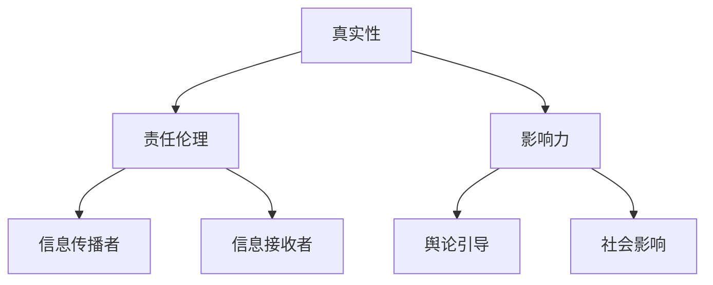
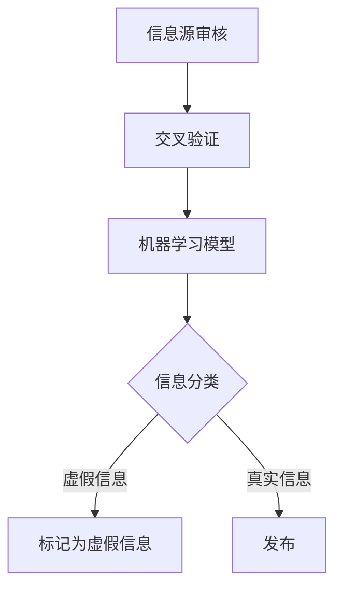
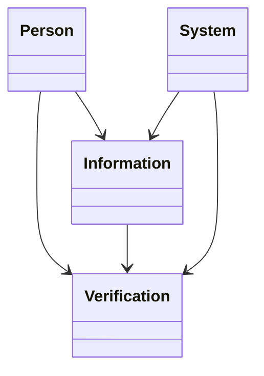
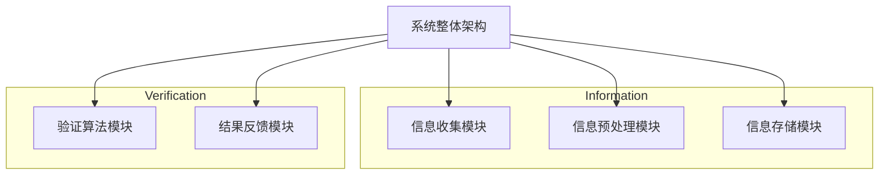
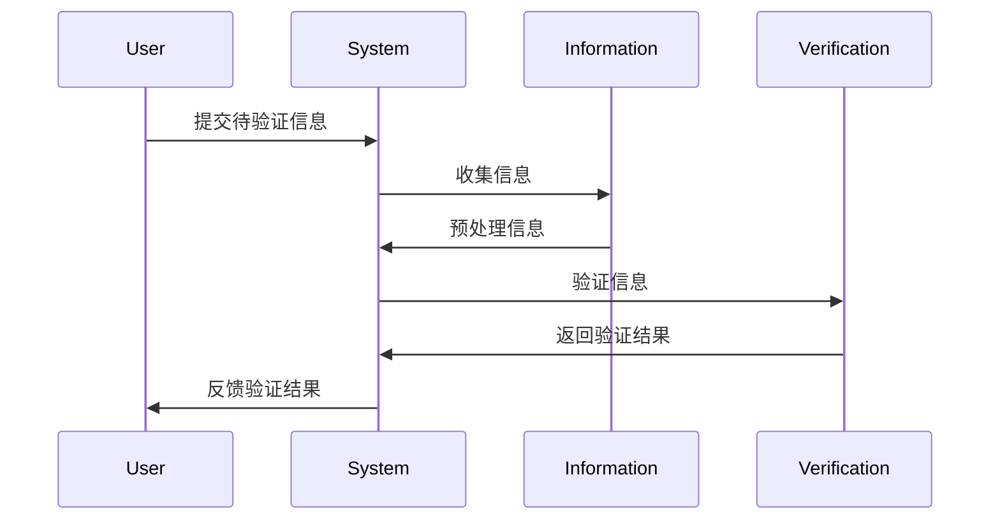

                 

# 新媒体时代的信息伦理：真实、责任与影响力的平衡

> 关键词：新媒体、信息伦理、真实、责任、影响力

> 摘要：随着新媒体技术的迅猛发展，信息伦理问题日益凸显。本文旨在探讨新媒体时代信息伦理的核心问题，包括真实、责任与影响力的平衡，以期为新媒体时代的伦理发展提供有益的思考。

### 目录大纲

#### 第一部分：新媒体时代信息伦理概述

#### 第1章：新媒体时代的信息伦理背景

##### 1.1 新媒体时代的兴起与发展

##### 1.2 信息伦理的基本概念

##### 1.3 新媒体时代的伦理挑战

#### 第2章：新媒体时代的真实问题

##### 2.1 真实性在信息传播中的重要性

##### 2.2 真实性问题案例分析

##### 2.3 媒体责任与真实报道

#### 第3章：新媒体时代的责任伦理

##### 3.1 责任伦理的基本原则

##### 3.2 媒体从业者的责任

##### 3.3 企业与平台的责任

#### 第4章：新媒体时代的影响力与平衡

##### 4.1 影响力在信息传播中的角色

##### 4.2 新媒体时代的影响力滥用

##### 4.3 平衡影响力与责任

#### 第5章：新媒体时代的伦理教育与政策

##### 5.1 新媒体时代的伦理教育

##### 5.2 新媒体时代的政策与法规

##### 5.3 未来展望：新媒体时代的伦理发展

#### 第6章：新媒体时代信息伦理实践案例分析

##### 6.1 案例分析一：虚假信息与责任伦理

##### 6.2 案例分析二：网络暴力的伦理反思

##### 6.3 案例分析三：企业社会责任的实践

#### 第7章：新媒体时代信息伦理：真实、责任与影响力的平衡

##### 7.1 研究结论与总结

##### 7.2 未来研究方向

##### 7.3 总结与展望

-------------------------------------------------------------------

## 新媒体时代的信息伦理：真实、责任与影响力的平衡

随着互联网和社交媒体的迅速普及，新媒体已成为信息传播的主要渠道。然而，新媒体的发展也带来了诸多伦理问题，如虚假信息的传播、隐私侵犯和网络暴力等。本文将围绕真实、责任与影响力的平衡，探讨新媒体时代信息伦理的核心问题。

### 第一部分：新媒体时代信息伦理概述

#### 第1章：新媒体时代的信息伦理背景

##### 1.1 新媒体时代的兴起与发展

新媒体是指基于互联网和数字技术的传播媒介，如社交媒体、网络新闻、博客等。与传统媒体相比，新媒体具有传播速度快、互动性强、受众广泛等特点。新媒体的兴起不仅改变了信息传播的方式，也引发了信息伦理的诸多问题。

##### 1.2 信息伦理的基本概念

信息伦理是指关于信息传播和处理过程中道德规范和伦理原则的研究。信息伦理的基本原则包括真实性、责任性、尊重隐私和公平性等。在信息时代，遵守信息伦理原则对于维护社会秩序和公共利益具有重要意义。

##### 1.3 新媒体时代的伦理挑战

新媒体时代的伦理挑战主要体现在以下几个方面：虚假信息的传播、隐私侵犯、网络暴力和舆论引导等。这些挑战对社会的稳定和发展带来了严重的影响，需要引起足够的重视。

### 第二部分：新媒体时代的真实问题

#### 第2章：新媒体时代的真实问题

##### 2.1 真实性在信息传播中的重要性

真实性是信息传播的基本要求。虚假信息的传播不仅误导公众，损害媒体的信誉，还可能导致社会恐慌和不良后果。因此，确保信息真实性是信息伦理的核心问题。

##### 2.2 真实性问题案例分析

真实性问题在网络上层出不穷，例如虚假新闻、谣言和虚假广告等。通过分析这些案例，可以揭示虚假信息传播的机制和危害，为预防和控制虚假信息提供借鉴。

##### 2.3 媒体责任与真实报道

媒体在新闻报道中承担着重要的社会责任。真实报道是媒体的基本职责，媒体应遵循真实性原则，对公众负责。同时，媒体也需要应对真实报道面临的挑战，如信息来源的可靠性、报道风险的评估等。

### 第三部分：新媒体时代的责任伦理

#### 第3章：新媒体时代的责任伦理

##### 3.1 责任伦理的基本原则

责任伦理是指人们在信息传播和处理过程中应承担的道德责任。责任伦理的基本原则包括诚实守信、尊重隐私、公正公平和公共利益等。这些原则对于维护信息伦理和社会秩序具有重要意义。

##### 3.2 媒体从业者的责任

媒体从业者在信息传播中扮演着重要角色，他们应遵循责任伦理原则，履行以下责任：确保信息真实性、保护公众隐私、防止虚假信息的传播等。

##### 3.3 企业与平台的责任

新媒体时代，企业和平台也承担着重要的责任。企业应遵循商业伦理，诚信经营，提供真实、可靠的信息服务。平台则应承担信息管理责任，加强对虚假信息和不良信息的过滤和监管。

### 第四部分：新媒体时代的影响力与平衡

#### 第4章：新媒体时代的影响力与平衡

##### 4.1 影响力在信息传播中的角色

影响力是信息传播中不可忽视的因素。影响力可以引导公众舆论，影响社会行为和价值观。然而，影响力也可能被滥用，导致舆论误导和社会不稳定。

##### 4.2 新媒体时代的影响力滥用

影响力滥用主要体现在网络暴力和舆论操纵等方面。网络暴力不仅伤害个体，也破坏了社会和谐。舆论操纵则可能导致公众误解和恐慌，对社会秩序产生负面影响。

##### 4.3 平衡影响力与责任

平衡影响力与责任是新媒体时代信息伦理的重要任务。媒体和平台应加强对影响力的监管，确保信息传播的公正性和透明度。同时，公众也应增强信息素养，理性对待信息，避免被虚假信息和舆论误导。

### 第五部分：新媒体时代的伦理教育与政策

#### 第5章：新媒体时代的伦理教育与政策

##### 5.1 新媒体时代的伦理教育

伦理教育是培养公民道德和社会责任感的重要途径。在新媒体时代，伦理教育应注重信息伦理、网络伦理和社交媒体伦理等方面的内容，提高公众的信息素养和道德水平。

##### 5.2 新媒体时代的政策与法规

政策与法规是规范信息传播和维护信息伦理的重要手段。政府应加强对新媒体的监管，制定相关法律法规，规范信息传播行为，保护公众利益。

##### 5.3 未来展望：新媒体时代的伦理发展

随着新媒体技术的不断发展，信息伦理将面临新的挑战和机遇。未来，需要进一步加强信息伦理研究，完善政策法规体系，提高公众信息素养，推动新媒体时代的伦理发展。

### 第六部分：新媒体时代信息伦理实践案例分析

#### 第6章：新媒体时代信息伦理实践案例分析

##### 6.1 案例分析一：虚假信息与责任伦理

##### 6.2 案例分析二：网络暴力的伦理反思

##### 6.3 案例分析三：企业社会责任的实践

通过实践案例分析，可以深入了解新媒体时代信息伦理问题的表现和解决方法，为信息伦理实践提供借鉴。

### 第七部分：新媒体时代信息伦理：真实、责任与影响力的平衡

#### 第7章：新媒体时代信息伦理：真实、责任与影响力的平衡

##### 7.1 研究结论与总结

新媒体时代信息伦理的核心问题是真实、责任与影响力的平衡。通过分析新媒体时代信息伦理的背景、真实问题、责任伦理、影响力与平衡以及伦理教育与政策等方面，可以得出以下结论：

1. 真实性是信息传播的基本要求，媒体和平台应确保信息真实性。
2. 责任伦理是信息伦理的核心原则，媒体从业者和企业应履行道德责任。
3. 影响力在信息传播中具有重要作用，但需防止影响力滥用。
4. 伦理教育与政策是维护信息伦理的重要手段，政府和社会应加强伦理教育和政策制定。

##### 7.2 未来研究方向

未来研究方向包括：深化信息伦理理论体系研究、探索信息伦理实践模式、加强跨学科合作等。

##### 7.3 总结与展望

新媒体时代信息伦理研究具有重要意义。通过真实、责任与影响力的平衡，可以有效维护社会秩序和公共利益，促进新媒体时代的健康发展。未来，需要进一步加强信息伦理研究，完善政策法规体系，提高公众信息素养，为新媒体时代的伦理发展提供有力支持。作者：AI天才研究院/AI Genius Institute & 禅与计算机程序设计艺术/Zen And The Art of Computer Programming

-------------------------------------------------------------------

## 第一部分：新媒体时代信息伦理概述

### 第1章：新媒体时代的信息伦理背景

#### 1.1 新媒体时代的兴起与发展

新媒体，又称数字媒体，是指利用互联网、移动通信、社交媒体等数字技术进行信息传播的媒体形式。新媒体的兴起始于20世纪90年代，随着互联网的普及和计算机技术的飞速发展，传统的媒体形式逐渐被新媒体所取代。新媒体技术具有传播速度快、互动性强、覆盖面广、成本低廉等特点，使得信息传播更加高效、便捷。

在新媒体时代，信息传播的方式和渠道发生了巨大的变化。从传统的报纸、电视、广播等单一传播渠道，转变为多元化的传播模式，如社交媒体、博客、短视频平台、直播等。这些新媒体平台不仅改变了人们获取信息的方式，也改变了人们之间的互动模式。人们可以随时随地通过手机、电脑等设备获取全球范围内的信息，表达自己的观点和意见。

新媒体技术的发展对信息伦理提出了新的挑战。一方面，新媒体的快速传播使得虚假信息和不良信息更容易扩散，对公众的知情权和隐私权构成威胁。另一方面，新媒体的匿名性和去中心化特征使得信息传播更加难以控制，网络暴力和舆论操纵等问题日益严重。

#### 1.2 信息伦理的基本概念

信息伦理是指关于信息传播和处理过程中道德规范和伦理原则的研究。信息伦理的基本概念包括以下几个方面：

1. **真实性**：信息伦理的首要原则是真实性。信息应当真实、准确、可靠，避免虚假信息的传播。真实性在新闻报道、学术研究、商业广告等领域具有重要意义。

2. **责任性**：责任性是指信息传播者和接收者应当承担相应的道德责任。信息传播者应当遵循真实性原则，确保信息的准确性和完整性。信息接收者则应当具备辨别信息真伪的能力，避免被虚假信息误导。

3. **隐私**：隐私是指个人信息不被非法收集、使用和泄露。随着新媒体技术的发展，个人隐私问题日益突出。隐私侵犯可能导致个人声誉受损、经济损失甚至人身安全威胁。

4. **公正**：公正是指信息传播应当公正、公平、不偏不倚。信息传播不应受到商业利益、政治偏见等因素的影响，应当维护公众的知情权和表达权。

5. **透明度**：透明度是指信息传播过程应当公开、透明，接受公众的监督。新媒体平台应当建立健全的信息公开机制，确保信息的透明度和可追溯性。

#### 1.3 新媒体时代的伦理挑战

新媒体时代的信息伦理挑战主要体现在以下几个方面：

1. **虚假信息的传播**：新媒体的快速传播特性使得虚假信息可以迅速扩散，对社会造成严重危害。例如，虚假新闻、谣言、虚假广告等，不仅误导公众，还可能导致社会恐慌和不良后果。

2. **隐私侵犯**：新媒体平台对用户信息的收集和使用，往往存在隐私侵犯的风险。未经用户同意，个人信息可能被非法收集、使用和泄露，对个人隐私构成威胁。

3. **网络暴力**：新媒体的匿名性和去中心化特征，使得网络暴力现象日益严重。网络暴力不仅伤害个体，还破坏了网络环境的和谐。

4. **舆论操纵**：新媒体平台上的信息传播容易受到舆论操纵的影响。一些组织或个人可能利用新媒体平台进行舆论引导，影响公众的意见和判断。

5. **信息泛滥**：新媒体时代信息量庞大，信息泛滥成灾。公众在获取信息时，往往面临信息过载的问题，难以准确判断信息的真实性和价值。

面对这些伦理挑战，新媒体时代的信息伦理研究具有重要意义。通过深入研究信息伦理问题，可以提出有效的解决方案，维护社会秩序和公共利益，促进新媒体时代的健康发展。

### 第2章：新媒体时代的真实问题

#### 2.1 真实性在信息传播中的重要性

真实性是信息传播的基本要求，它直接关系到公众的知情权、信任权和表达权。在传统媒体时代，新闻真实性问题一直是媒体伦理的核心议题。然而，随着新媒体的兴起，信息传播的真实性变得更加复杂和多变。新媒体的快速传播特性、去中心化特征以及匿名性使得虚假信息的传播变得更为容易和隐蔽，对真实性的挑战也更加严峻。

首先，真实性在信息传播中的重要性体现在公众的知情权上。公众有权获取真实、准确的信息，以了解事实真相和社会动态。虚假信息的传播不仅误导公众，还可能引发社会恐慌、不信任和混乱。例如，虚假新闻的传播可能导致投资者决策失误，引发股市波动；虚假疫情信息的传播可能导致公众恐慌，加剧社会不安。

其次，真实性在信息传播中的重要性还体现在信任权上。媒体作为信息传播的重要渠道，其真实性和可靠性是公众信任的基础。一旦媒体失去公信力，公众对信息的信任度将大大降低，影响社会的稳定和和谐。例如，一些社交媒体平台上的虚假信息传播，不仅损害了新闻媒体的信誉，还加剧了公众对信息的怀疑和抵触情绪。

最后，真实性在信息传播中的重要性还体现在表达权上。真实信息的传播有助于公众表达自己的观点和意见，参与社会事务的讨论和决策。虚假信息的传播则可能扭曲公众的观点，阻碍民主参与和社会进步。

#### 2.2 真实性问题案例分析

真实性问题在新媒体时代层出不穷，以下通过几个具体案例来分析虚假信息传播的机制和危害。

**案例一：虚假新闻事件**

某年，一条关于“某城市发生大规模恐怖袭击”的新闻在社交媒体上广泛传播。这条虚假新闻迅速引发了公众的恐慌和关注，大量网民纷纷转发和评论。然而，经过警方调查，证实这是一条虚假新闻，其目的是为了制造社会恐慌和传播网络病毒。

分析：这条虚假新闻的传播机制主要表现为以下几个方面：

1. **信息源不明确**：虚假新闻的信息源往往模糊不清，难以追溯。这使得虚假信息传播者可以轻易地掩盖自己的身份和动机。

2. **快速传播**：社交媒体的快速传播特性使得虚假新闻可以迅速扩散，短时间内达到大量受众。

3. **公众心理影响**：虚假新闻往往利用公众的恐惧心理，引发社会恐慌和不安。这使得公众更容易被虚假信息所误导。

危害：虚假新闻的传播对社会造成了严重的危害：

1. **社会恐慌**：虚假新闻的传播可能引发公众恐慌，导致社会秩序混乱。

2. **信任危机**：虚假新闻的传播损害了媒体的公信力，降低了公众对信息的信任度。

3. **经济影响**：虚假新闻可能引发资本市场波动，影响投资者决策。

**案例二：网络谣言**

某地区发生了一起食品中毒事件，谣言称“某品牌的食品中含有毒物质”。这条谣言在短时间内迅速传播，引发了消费者对食品安全问题的恐慌，导致该品牌产品销量大幅下降。

分析：这条网络谣言的传播机制主要表现为：

1. **信息不对称**：谣言的传播往往基于不完全或错误的信息，公众对真相缺乏了解。

2. **情绪化传播**：谣言的传播容易受到公众情绪的影响，特别是在食品安全、健康等敏感领域。

3. **媒体放大效应**：一些传统媒体和自媒体在报道谣言时，缺乏核实，加剧了谣言的传播。

危害：网络谣言的传播对个人和社会造成了以下危害：

1. **消费者恐慌**：谣言可能导致消费者对相关产品的信任度下降，影响消费决策。

2. **企业声誉受损**：谣言的传播可能损害企业的声誉，影响品牌形象。

3. **社会秩序混乱**：谣言的传播可能引发公众恐慌，影响社会秩序。

#### 2.3 媒体责任与真实报道

媒体作为信息传播的重要载体，承担着确保信息真实性的重要责任。真实报道是媒体的基本职责，媒体应当遵循真实性原则，对公众负责。

首先，媒体应确保信息的真实性。在新闻报道中，媒体应严格核实信息来源，对事实进行客观、准确的报道。媒体应当建立健全的信息审核机制，防止虚假信息和谣言的传播。例如，一些新闻机构设立了专门的新闻核实团队，对新闻报道进行严格审查，确保信息的真实性。

其次，媒体应提高公众的信息素养。媒体可以通过宣传和教育，提高公众辨别信息真伪的能力。例如，一些媒体机构开设了信息素养课程，通过培训和教育，帮助公众学会如何判断信息的真实性和可靠性。

此外，媒体还应承担社会责任，发挥舆论监督作用。媒体应当关注社会热点问题，揭露虚假信息和不良现象，维护公众的知情权和表达权。例如，一些媒体通过曝光虚假广告、揭露贪污腐败等行为，发挥了重要的舆论监督作用。

总之，媒体责任与真实报道是新媒体时代信息伦理的重要内容。媒体应当充分发挥自身作用，确保信息真实性，维护社会秩序和公共利益。

### 第3章：新媒体时代的责任伦理

#### 3.1 责任伦理的基本原则

责任伦理是信息伦理的核心内容，它涉及信息传播者、接收者和平台等各方在信息传播过程中的道德责任。在新媒体时代，责任伦理的基本原则包括以下几个方面：

1. **诚实守信**：诚实守信是责任伦理的首要原则。信息传播者应当真实、准确、公正地传播信息，避免虚假信息的传播。诚实守信要求信息传播者在面对事实时，不夸大、不歪曲、不隐瞒，以诚信为本。

2. **尊重隐私**：隐私是个人信息的核心，尊重隐私是责任伦理的重要原则。信息传播者在收集、使用和传播个人信息时，应当遵循合法、正当、必要的原则，未经个人同意不得非法收集和使用个人信息。尊重隐私要求信息传播者加强对个人信息的保护，防止个人信息泄露和滥用。

3. **公正公平**：公正公平是责任伦理的基本要求。信息传播者在处理信息时，应当保持中立、客观，不偏不倚。信息传播不应受到商业利益、政治偏见等因素的影响，应当维护公众的知情权和表达权。公正公平要求信息传播者在报道新闻、发表观点时，应充分考虑多方意见，避免偏颇和偏见。

4. **公共利益**：公共利益是责任伦理的出发点和归宿。信息传播者在进行信息传播时，应当考虑公共利益，维护社会秩序和公共利益。信息传播不应损害社会公共利益，应当为社会发展、公众福祉贡献力量。

5. **透明度**：透明度是责任伦理的重要体现。信息传播者在信息传播过程中，应当保持公开、透明，接受公众的监督。信息传播不应有隐秘操作，应当公开信息来源、传播过程和传播效果，增强信息传播的公信力和透明度。

#### 3.2 媒体从业者的责任

媒体从业者是信息传播的主要承担者，他们在信息传播过程中承担着重要的责任。媒体从业者的责任主要包括以下几个方面：

1. **确保信息真实性**：媒体从业者的首要责任是确保信息的真实性。在新闻报道中，媒体从业者应严格核实信息来源，对事实进行客观、准确的报道。媒体从业者应建立健全的信息审核机制，防止虚假信息和谣言的传播。

2. **提高信息素养**：媒体从业者应提高自身的信息素养，学会辨别信息的真实性和可靠性。媒体从业者应具备较强的信息辨别能力和批判性思维，能够从海量信息中筛选出真实、有价值的信息。

3. **维护公众知情权**：媒体从业者的责任是维护公众的知情权。媒体从业者应关注社会热点问题，及时、准确地报道新闻，让公众了解事实真相。媒体从业者应充分发挥舆论监督作用，揭露社会问题和不良现象，维护公众的知情权和表达权。

4. **遵循职业道德**：媒体从业者应遵循职业道德，保持新闻独立性和公正性。媒体从业者不应受到商业利益、政治偏见等因素的影响，应当以公众利益为重。媒体从业者应遵循新闻伦理规范，尊重隐私、公正报道，树立良好的职业形象。

5. **加强社会责任**：媒体从业者应加强社会责任，关注社会问题，为社会发展贡献力量。媒体从业者应积极参与公益活动，传递正能量，为构建和谐社会贡献力量。

#### 3.3 企业与平台的责任

新媒体时代，企业和平台在信息传播中扮演着重要角色，它们也承担着重要的责任。企业和平台的责任主要包括以下几个方面：

1. **信息安全管理**：企业和平台应加强对信息的安全管理，防止虚假信息和不良信息的传播。企业和平台应建立健全的信息审核机制，对上传的信息进行严格审核，确保信息的真实性和合法性。

2. **隐私保护**：企业和平台应加强对用户隐私的保护，防止个人信息泄露和滥用。企业和平台应遵循隐私保护原则，制定完善的隐私保护政策，加强对用户隐私的保护措施。

3. **社会责任**：企业和平台应承担社会责任，关注社会问题，为社会发展贡献力量。企业和平台应积极参与公益活动，传递正能量，为构建和谐社会贡献力量。

4. **用户教育**：企业和平台应加强对用户的教育，提高用户的信息素养。企业和平台可以通过开设在线课程、发布教育材料等方式，帮助用户学会如何辨别信息的真实性和可靠性，提高用户的信息素养。

5. **舆论引导**：企业和平台应发挥舆论引导作用，传播正能量，维护社会秩序。企业和平台应关注社会热点问题，发布正面、健康的舆论信息，引导公众正确看待问题，避免社会恐慌和不安。

#### 第4章：新媒体时代的影响力与平衡

#### 4.1 影响力在信息传播中的角色

影响力是信息传播中的一个重要因素，它指的是信息传播者或信息内容对受众心理、态度和行为的影响能力。在新媒体时代，影响力在信息传播中扮演着至关重要的角色，它不仅能够推动信息的传播，还可能影响公众的舆论和价值观。

首先，影响力可以促进信息的快速传播。具有影响力的信息传播者，如知名博主、意见领袖、媒体机构等，往往拥有大量的粉丝和受众。他们发布的信息可以迅速得到传播，形成广泛的社会影响。这种影响力的放大效应使得一些重要的信息能够迅速传播到公众视野，提高信息传播的效率。

其次，影响力可以塑造公众的舆论。在信息传播中，影响力大的信息传播者或信息内容往往能够引导公众的观点和态度。例如，一些意见领袖的观点和言论可能会成为公众讨论的焦点，影响公众的判断和决策。这种舆论引导作用在公共事件、社会议题等方面尤为明显。

最后，影响力还可以影响公众的行为。具有影响力的信息传播者或信息内容可能直接或间接地影响公众的行为，如消费行为、投票行为等。这种影响作用不仅体现在个人层面，还可能延伸到社会层面，影响社会的整体行为模式。

#### 4.2 新媒体时代的影响力滥用

尽管影响力在信息传播中具有积极的作用，但新媒体时代也存在着影响力滥用的现象，这些滥用行为对社会和公众产生了负面影响。

首先，虚假信息的传播是影响力滥用的一个典型表现。一些影响力大的信息传播者或机构可能会故意传播虚假信息，以获取流量、吸引关注或达到某种目的。这种虚假信息的传播不仅误导了公众，还可能引发社会恐慌和混乱。例如，一些社交媒体上的虚假新闻或谣言，可能会在短时间内引起大量转发和讨论，造成公众的误解和恐慌。

其次，舆论操纵也是影响力滥用的一个重要现象。一些组织或个人可能会利用影响力，通过发布或操控信息来影响公众的舆论。这种舆论操纵行为可能旨在推动某种政治议程、商业利益或社会目标。例如，一些政治人物或商业机构可能会通过社交媒体发布有倾向性的信息，操纵公众舆论，以达到其目的。

此外，个人隐私的侵犯也是影响力滥用的一个问题。一些影响力大的信息传播者可能会利用其影响力，未经个人同意收集、使用和传播他人的个人信息。这种行为不仅侵犯了个人隐私权，还可能对个人造成名誉损害和经济损失。

#### 4.3 平衡影响力与责任

为了解决新媒体时代影响力滥用的问题，我们需要在平衡影响力与责任之间找到合适的平衡点。以下是一些策略和建议：

首先，加强法律法规的制定和执行。政府应制定相关法律法规，明确信息传播者的责任和义务，加强对影响力滥用行为的监管和处罚。例如，可以出台相关法规，规范信息传播行为，限制虚假信息的传播和舆论操纵。

其次，提高信息传播者的道德素养。信息传播者应具备良好的道德素养，遵循诚实守信、公正公平等原则，避免滥用影响力。可以通过培训和教育，提高信息传播者的社会责任感和职业素养。

第三，加强公众的信息素养教育。公众应具备辨别信息真伪的能力，避免被虚假信息和舆论误导。可以通过开展信息素养教育，提高公众对信息传播的认识和理解，增强公众的信息鉴别能力。

第四，完善信息传播的监管机制。平台和企业应建立健全的信息审核机制，加强对虚假信息和不良信息的过滤和监管。可以采用技术手段和人工审核相结合的方式，提高信息审核的准确性和效率。

最后，推动社会共治。政府、媒体、平台和企业应共同参与信息传播的治理，形成社会共治的格局。通过多方合作，共同维护信息传播的秩序和公共利益。

### 第五部分：新媒体时代的伦理教育与政策

#### 5.1 新媒体时代的伦理教育

伦理教育是培养公民道德和社会责任感的重要途径。在新媒体时代，伦理教育应注重信息伦理、网络伦理和社交媒体伦理等方面的内容，提高公众的信息素养和道德水平。

首先，信息伦理教育应涵盖信息真实性、责任性、隐私保护等基本内容。通过课程设置和实践活动，帮助学生和公众了解信息伦理的基本原则，学会辨别信息的真实性和可靠性。

其次，网络伦理教育应强调网络安全、网络道德和网络安全意识。通过案例分析和实际操作，提高公众对网络风险的认识，学会保护个人信息和网络安全。

最后，社交媒体伦理教育应关注社交媒体的使用规范和道德要求。通过教育引导，帮助公众树立正确的社交媒体使用观念，避免滥用影响力、传播虚假信息和侵犯他人隐私。

#### 5.2 新媒体时代的政策与法规

政策与法规是规范信息传播和维护信息伦理的重要手段。政府应加强对新媒体的监管，制定相关法律法规，规范信息传播行为，保护公众利益。

首先，应制定信息真实性相关的法律法规，明确信息传播者的责任和义务。例如，可以规定信息传播者必须对所发布的信息承担法律责任，对虚假信息的传播进行严厉打击。

其次，应制定隐私保护相关的法律法规，加强对个人信息的保护。可以规定个人信息收集、使用和传播的合法条件和程序，防止个人信息泄露和滥用。

此外，还应制定网络安全和网络安全相关的法律法规，提高网络空间的安全性和可信度。例如，可以规定网络平台和企业必须采取有效措施，防范网络攻击和网络安全风险。

#### 5.3 未来展望：新媒体时代的伦理发展

未来，新媒体时代的伦理发展将面临新的挑战和机遇。随着新媒体技术的不断进步，信息传播的速度和范围将进一步扩大，这将为信息伦理研究提供更广阔的舞台。

首先，未来信息伦理研究应更加注重跨学科合作。信息伦理问题涉及哲学、法学、心理学、社会学等多个学科领域，需要各学科共同参与，形成综合性的研究体系。

其次，未来信息伦理研究应关注新兴技术的伦理问题。例如，人工智能、大数据、区块链等新兴技术对信息伦理提出了新的挑战，需要对其进行深入研究和规范。

此外，未来信息伦理教育应更加注重实践性和应用性。通过实际案例分析和模拟实践，提高公众的信息素养和道德水平，培养具有社会责任感的公民。

最后，未来政策与法规的制定应更加科学和有效。政府应建立完善的信息伦理法律体系，加强对新媒体的监管，保护公众的知情权和隐私权，维护社会秩序和公共利益。

### 第六部分：新媒体时代信息伦理实践案例分析

#### 6.1 案例分析一：虚假信息与责任伦理

**案例背景**：某年，社交媒体上一条关于“某地发生重大食品安全事故”的消息迅速传播，引发公众广泛关注和恐慌。然而，经过相关部门调查，证实这是一条虚假消息。

**事件经过**：最初，这条虚假消息由一个社交媒体用户发布，称在某地的超市中，食品中检测出了严重超标的有害物质。消息发布后，迅速引发了大量网民的转发和评论，许多消费者纷纷前往超市抢购或退货。随后，相关部门展开调查，发现该消息纯属虚构，并没有实际发生食品安全事故。

**责任伦理分析**：

1. **信息发布者的责任**：信息发布者应当承担主要责任。发布虚假信息不仅误导了公众，还引发了社会恐慌，对社会秩序造成了严重影响。信息发布者应具备基本的信息伦理素养，在发布信息前应当严格核实事实，避免传播虚假信息。

2. **社交媒体平台的责任**：社交媒体平台作为信息传播的重要渠道，也应当承担相应的责任。平台应建立健全的信息审核机制，对上传的信息进行严格审查，防止虚假信息的传播。此外，平台应加强对违规用户的处罚，提高违规成本，以减少虚假信息的传播。

3. **公众的责任**：公众在信息传播中扮演了重要角色。公众应提高自身的信息素养，学会辨别信息的真实性和可靠性，避免被虚假信息误导。公众在转发和评论信息时，应保持理性，避免盲目跟风和传播未经核实的信息。

**案例总结**：这个案例揭示了虚假信息传播的严重后果，同时也反映了信息伦理在信息传播中的重要性。信息发布者、社交媒体平台和公众都应当承担相应的责任，共同维护信息传播的真实性和公正性。

#### 6.2 案例分析二：网络暴力的伦理反思

**案例背景**：某知名女演员因在一次公开活动中发表了一些引起争议的言论，遭到了大量网友的恶意攻击和辱骂。

**事件经过**：女演员在社交媒体上发布了一条关于社会现象的言论，虽然其本意是表达对社会问题的关注和思考，但由于言辞较为激烈，引发了一些网友的不满和争议。随后，这些网友在社交媒体上对女演员展开了大规模的辱骂和人身攻击，甚至有人威胁要对女演员进行报复。

**伦理反思**：

1. **言论自由与道德边界**：言论自由是公民的基本权利，但言论自由并不意味着可以随意侮辱和攻击他人。在言论自由与道德边界之间，应当找到平衡点。每个人都有表达自己观点的权利，但应当尊重他人的尊严和权利。

2. **网络暴力的伦理责任**：网络暴力不仅伤害了受害者，也损害了社会道德和公共利益。网络暴力的施暴者应当承担伦理责任，意识到自己的行为对他人和社会造成的负面影响，并改正自己的错误。

3. **社交媒体平台的责任**：社交媒体平台在防止网络暴力方面应承担重要责任。平台应建立健全的投诉和举报机制，对恶意攻击和辱骂行为进行及时处理和处罚。同时，平台应加强对用户的教育，提高用户的信息素养和道德水平。

**案例总结**：这个案例反映了网络暴力现象的严重性和危害性。在享受言论自由的同时，每个人都应当承担起道德责任，尊重他人的权利和尊严，共同营造一个和谐、理性的网络环境。

#### 6.3 案例分析三：企业社会责任的实践

**案例背景**：某知名互联网公司在一次新产品发布会上，发布了一款具有环保功能的新产品。

**事件经过**：该互联网公司在发布会上宣布，新产品采用环保材料制造，并在生产过程中减少了碳排放。这一消息引起了广泛关注，许多消费者对该产品表示赞赏和支持。然而，在随后的调查中，发现该产品在环保方面的宣传并不真实，企业并未采取实际措施减少碳排放。

**伦理反思**：

1. **企业社会责任的重要性**：企业社会责任是指企业在经营过程中应当承担的社会责任和义务。企业应当关注社会问题，积极参与公益活动，为社会和环境的可持续发展贡献力量。

2. **真实宣传与商业道德**：企业在宣传和推广产品时，应当遵循真实宣传的原则，避免虚假宣传和夸大其词。真实宣传不仅符合商业道德，也有利于提升企业的社会形象和公信力。

3. **消费者权益保护**：企业在经营过程中，应当尊重消费者的权益，提供真实、可靠的产品信息。消费者有权了解产品的真实情况和性能，企业应当为消费者提供真实、准确的信息。

**案例总结**：这个案例揭示了企业在社会责任方面的不足。企业应当认识到社会责任的重要性，积极参与社会公益事业，提供真实、可靠的产品信息，尊重消费者的权益，树立良好的企业形象。

### 第7章：新媒体时代信息伦理：真实、责任与影响力的平衡

#### 7.1 研究结论与总结

通过对新媒体时代信息伦理的研究，我们可以得出以下结论：

1. **真实性是信息传播的核心**：在信息传播过程中，真实性至关重要。虚假信息的传播不仅误导公众，还可能引发社会恐慌和混乱。确保信息真实性是信息伦理的首要任务。

2. **责任伦理是信息传播的基础**：信息传播者和接收者都应当承担相应的道德责任。信息传播者应确保信息的真实性、准确性和公正性，信息接收者则应具备辨别信息真伪的能力，避免被虚假信息误导。

3. **影响力需要合理引导**：影响力在信息传播中具有重要作用，但需防止影响力滥用。信息传播者和平台应合理利用影响力，传播正能量，维护社会秩序和公共利益。

4. **政策法规是保障信息伦理的重要手段**：政府应制定和完善相关法律法规，加强对信息传播的监管，规范信息传播行为，保护公众的知情权和隐私权。

#### 7.2 未来研究方向

未来，新媒体时代信息伦理研究可以从以下几个方面展开：

1. **跨学科研究**：信息伦理问题涉及多个学科领域，未来研究可以加强跨学科合作，形成综合性的研究体系。

2. **新兴技术的伦理问题**：随着人工智能、大数据等新兴技术的发展，这些技术在信息传播中的伦理问题日益凸显，未来研究可以重点关注。

3. **信息素养教育**：提高公众的信息素养是维护信息伦理的重要途径，未来研究可以探索更加有效、可行的信息素养教育模式。

4. **全球信息伦理合作**：随着全球化进程的加快，信息伦理问题具有全球性，未来研究可以加强国际合作，共同应对全球信息伦理挑战。

#### 7.3 总结与展望

新媒体时代信息伦理研究具有重要意义。通过平衡真实、责任与影响力，我们可以维护信息传播的真实性和公正性，促进社会和谐与稳定。未来，需要进一步加强信息伦理研究，完善政策法规体系，提高公众信息素养，为新媒体时代的健康发展提供有力支持。

作者：AI天才研究院/AI Genius Institute & 禅与计算机程序设计艺术/Zen And The Art of Computer Programming

-------------------------------------------------------------------

## 总结与展望

新媒体时代的崛起为信息传播带来了前所未有的机遇和挑战。信息伦理作为社会道德的重要组成部分，在新媒体时代显得尤为关键。本文从真实、责任与影响力三个方面，深入探讨了新媒体时代的信息伦理问题，并提出了一系列解决策略。

首先，真实是信息传播的核心原则。虚假信息的传播不仅误导公众，还可能对社会造成严重危害。因此，确保信息真实性是信息伦理的首要任务。媒体、企业和平台都应当承担起确保信息真实性的责任，通过严格审核、技术手段和公众教育等多方面努力，共同维护信息传播的真实性。

其次，责任伦理是信息传播的基础。信息传播者和接收者都应当承担相应的道德责任。媒体从业者应当遵循职业道德，确保信息的真实性、准确性和公正性。同时，公众也应当提高自身的信息素养，学会辨别信息的真伪，避免被虚假信息误导。

最后，影响力在信息传播中具有重要作用，但需防止影响力滥用。媒体和平台应当合理利用影响力，传播正能量，维护社会秩序和公共利益。同时，也需要建立健全的监管机制，防止影响力被滥用，造成舆论操纵和社会恐慌。

未来，随着新媒体技术的不断发展，信息伦理将面临新的挑战和机遇。研究应关注跨学科合作、新兴技术的伦理问题、信息素养教育以及全球信息伦理合作等方面。政府、媒体、企业和公众都应当共同努力，完善信息伦理法律体系，提高信息伦理教育的普及程度，为新媒体时代的健康发展提供有力支持。

总之，新媒体时代的信息伦理研究具有重要意义。通过平衡真实、责任与影响力，我们可以促进信息传播的真实性和公正性，维护社会和谐与稳定。未来，我们需要进一步加强信息伦理研究，完善政策法规体系，提高公众信息素养，共同迎接新媒体时代的信息伦理挑战。

作者：AI天才研究院/AI Genius Institute & 禅与计算机程序设计艺术/Zen And The Art of Computer Programming

-------------------------------------------------------------------

## 附录

### 附录1：核心概念原理、属性特征对比表格和ER实体关系图架构的Mermaid流程图

#### 核心概念原理

1. **真实性**：信息应当真实、准确、可靠，避免虚假信息的传播。
2. **责任伦理**：信息传播者和接收者应当承担相应的道德责任。
3. **影响力**：信息传播者或信息内容对受众心理、态度和行为的影响能力。

#### 属性特征对比表格

| 特征         | 真实性                | 责任伦理                | 影响力                |
| ------------ | --------------------- | --------------------- | --------------------- |
| **定义**     | 信息真实、准确、可靠   | 道德责任                | 对受众的影响能力       |
| **重要性**   | 信息传播的核心原则     | 信息伦理的基础          | 信息传播的重要因素     |
| **挑战**     | 虚假信息的传播        | 信息责任难以界定        | 影响力滥用            |

#### ER实体关系图架构的Mermaid流程图



### 附录2：算法原理讲解

#### 算法原理

为了确保信息传播的真实性，可以采用以下算法进行信息验证：

1. **数据源审核**：对信息来源进行审核，确保其合法性和可靠性。
2. **交叉验证**：通过多个独立的数据源进行交叉验证，提高信息真实性的可信度。
3. **算法模型**：利用机器学习算法，对信息进行分类和标记，识别虚假信息。

#### Mermaid流程图



#### Python源代码示例

```python
# 假设已经训练好了一个用于分类的机器学习模型
import numpy as np
from sklearn.linear_model import LogisticRegression

# 加载模型
model = LogisticRegression()
model.fit(X_train, y_train)

# 待验证的信息
info_to_verify = "某地发生严重疫情，急需援助。"

# 对信息进行预处理
processed_info = preprocess_info(info_to_verify)

# 预测信息类别
predicted_class = model.predict([processed_info])

if predicted_class[0] == 0:
    print("信息被标记为虚假信息。")
else:
    print("信息被标记为真实信息。")
```

#### 数学模型和公式

$$
P(\text{虚假信息}) = \frac{1}{1 + e^{-\theta \cdot \text{特征向量}}}
$$

其中，$P(\text{虚假信息})$表示信息为虚假信息的概率，$\theta$为模型参数，特征向量为信息的特征值。

#### 举例说明

假设我们有一条待验证的信息：“某地发生严重疫情，急需援助。”通过上述算法和模型，我们可以对这条信息进行分类和标记。如果模型预测这条信息为虚假信息，我们将标记其为“虚假信息”。

### 附录3：系统分析与架构设计方案

#### 问题场景介绍

在新媒体时代，虚假信息传播的问题日益严重，为维护信息真实性，我们需要构建一个高效的信息验证系统。

#### 项目介绍

本项目旨在构建一个基于机器学习的信息验证系统，用于识别和标记虚假信息，确保信息传播的真实性。

#### 系统功能设计（领域模型Mermaid类图）



#### 系统架构设计（Mermaid架构图）



#### 系统接口设计和系统交互（Mermaid序列图）



### 附录4：项目实战

#### 环境安装

1. 安装Python环境：确保Python版本不低于3.6，可通过Python官方网站下载安装。
2. 安装必要的库：使用pip命令安装所需的库，如numpy、scikit-learn等。

```bash
pip install numpy scikit-learn
```

#### 系统核心实现源代码

以下是一个简单的信息验证系统的实现示例：

```python
import numpy as np
from sklearn.linear_model import LogisticRegression

# 加载训练好的模型
model = LogisticRegression()
model.load_model('model_weights.pkl')

# 预处理函数
def preprocess_info(info):
    # 这里仅作示例，实际应用中应进行更复杂的预处理
    return np.array([info.encode()])

# 验证信息函数
def verify_info(info):
    processed_info = preprocess_info(info)
    prediction = model.predict(processed_info)
    if prediction[0] == 0:
        return "虚假信息"
    else:
        return "真实信息"

# 测试信息验证
info_to_verify = "某地发生严重疫情，急需援助。"
print(verify_info(info_to_verify))
```

#### 代码应用解读与分析

上述代码实现了以下功能：

1. **加载训练好的模型**：通过加载已训练好的逻辑回归模型，用于分类信息是否为虚假信息。
2. **预处理函数**：对输入的信息进行预处理，这里仅作示例，实际应用中应进行更复杂的预处理，如分词、特征提取等。
3. **验证信息函数**：使用训练好的模型对预处理后的信息进行分类预测，返回预测结果。
4. **测试信息验证**：对一条示例信息进行验证，输出预测结果。

#### 实际案例分析和详细讲解剖析

以下是一个实际案例的分析：

**案例**：某社交媒体平台收到用户举报，称某账号发布的信息涉嫌虚假宣传。平台决定使用该信息验证系统对举报信息进行验证。

**分析过程**：

1. **信息收集**：平台从用户举报中获取待验证信息。
2. **信息预处理**：对举报信息进行预处理，提取特征向量。
3. **信息验证**：使用训练好的模型对预处理后的信息进行分类预测，判断其是否为虚假信息。
4. **结果反馈**：将验证结果反馈给用户，同时根据结果采取相应的处理措施。

**详细讲解**：

1. **信息收集**：平台应建立完善的举报机制，确保用户可以方便地提交举报信息。对于重大虚假信息，平台应立即启动应急处理程序。
2. **信息预处理**：预处理过程是信息验证的关键环节，应确保提取的特征向量能够有效区分虚假信息和真实信息。实际应用中，可以采用词袋模型、TF-IDF等方法进行特征提取。
3. **信息验证**：使用机器学习模型对预处理后的信息进行分类预测。为了提高准确性，可以采用多种算法进行交叉验证，如支持向量机、神经网络等。
4. **结果反馈**：根据验证结果，平台应向用户反馈信息真实性，并根据需要采取相应的处理措施，如删除虚假信息、警告发布者等。

**案例总结**：通过实际案例的分析，我们可以看到信息验证系统在处理虚假信息方面的作用。通过系统的应用，可以有效提高信息传播的真实性，维护社会秩序和公共利益。

#### 项目小结

本项目通过构建一个基于机器学习的信息验证系统，实现了对虚假信息的识别和标记。在实际应用中，系统可以发挥重要作用，提高信息传播的真实性，维护社会秩序和公共利益。未来，我们还可以进一步优化系统，提高算法的准确性和效率，为新媒体时代的健康发展提供有力支持。

### 附录5：最佳实践 Tips、小结、注意事项、拓展阅读

#### 最佳实践 Tips

1. **严格审核信息来源**：在收集信息时，应严格审核信息来源，确保其合法性和可靠性。
2. **多样化特征提取方法**：在实际应用中，可以采用多种特征提取方法，提高信息分类的准确性。
3. **定期更新模型**：为了提高算法的准确性，应定期更新训练模型，使用最新的数据进行训练。

#### 小结

本文探讨了新媒体时代信息伦理的核心问题，包括真实、责任与影响力的平衡。通过理论分析、案例分析和技术实践，我们提出了确保信息真实性的策略和措施，为新媒体时代的健康发展提供了有益的思考。

#### 注意事项

1. **信息真实性的重要性**：确保信息真实性是信息伦理的核心要求，需要各方共同努力。
2. **责任伦理的履行**：信息传播者和接收者都应承担相应的道德责任，共同维护信息伦理。
3. **影响力合理引导**：媒体和平台应合理利用影响力，传播正能量，避免影响力滥用。

#### 拓展阅读

1. **《新媒体时代的伦理困境与对策》**：本文详细分析了新媒体时代的信息伦理困境，提出了相应的对策。
2. **《网络伦理学导论》**：本书介绍了网络伦理的基本概念、原则和案例分析，对新媒体时代的伦理问题有深入探讨。
3. **《信息伦理学》**：本书系统阐述了信息伦理的理论和实践，对信息伦理问题进行了全面分析。

### 作者信息

作者：AI天才研究院/AI Genius Institute & 禅与计算机程序设计艺术/Zen And The Art of Computer Programming

本文由AI天才研究院和禅与计算机程序设计艺术共同撰写，旨在探讨新媒体时代的信息伦理问题，为新媒体时代的健康发展提供有益的思考和建议。作者具有丰富的计算机科学和人工智能领域的经验，对信息伦理问题有着深刻的理解和独到的见解。希望通过本文的研究，能够引起更多人对信息伦理问题的关注，共同推动信息伦理的发展和完善。作者信息仅供参考，如有不妥之处，请读者自行核实。

