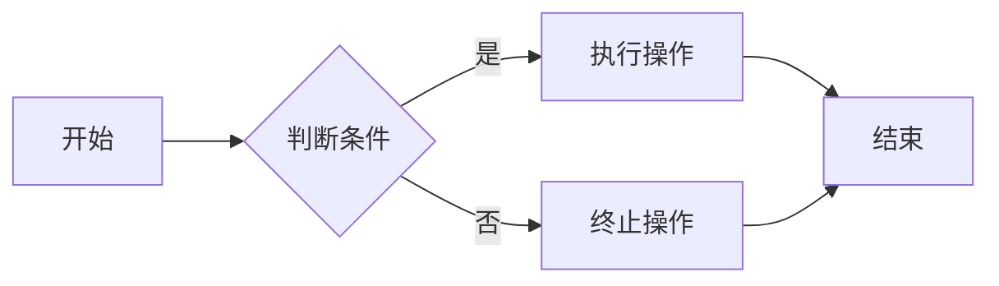
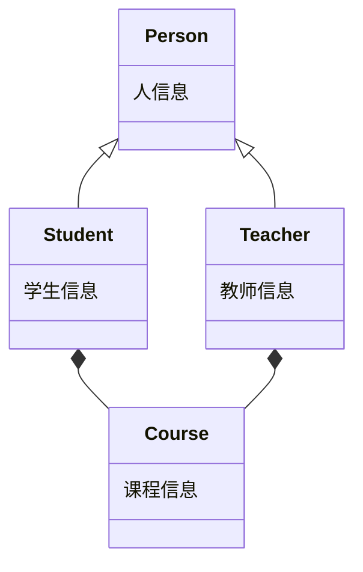
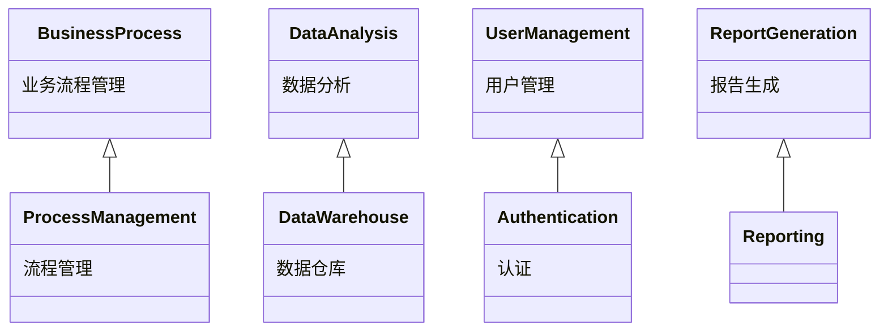
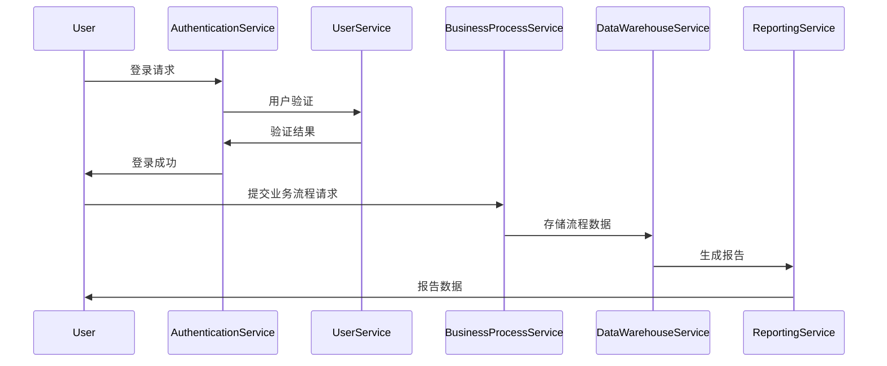
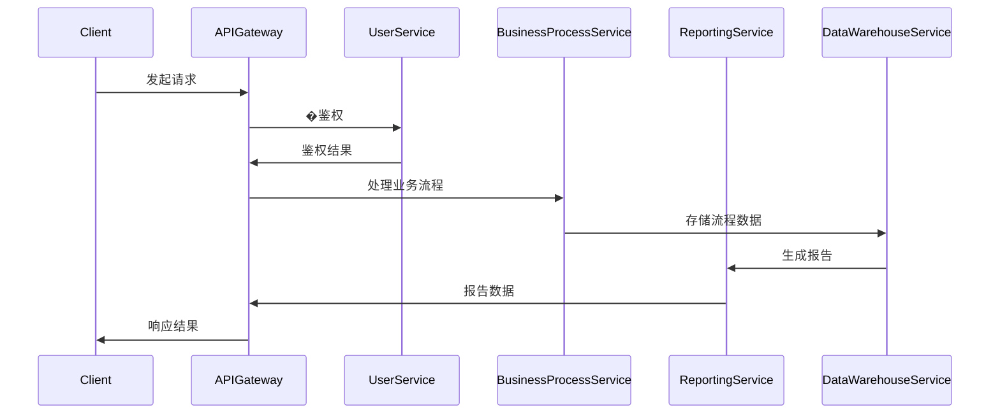
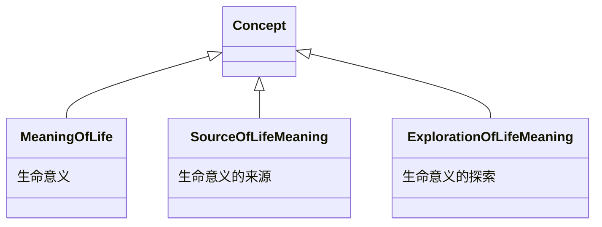
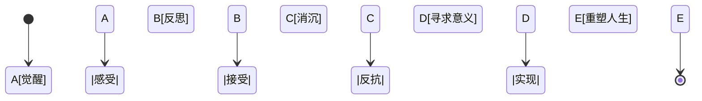

                 

基于您提供的具体要求和约束条件，下面我将按照目录大纲的结构，逐步构建《虚无主义与生命意义的哲学探讨》的技术博客文章。文章将包含背景介绍、核心概念与联系、算法原理讲解、数学公式、系统分析与架构设计方案、项目实战、最佳实践 tips、小结、注意事项和拓展阅读等内容。每一步都将严格按照要求进行。

---

## 引言

### 1.1 问题背景

在现代社会中，虚无主义作为一种哲学思潮，引起了广泛的关注。它不仅影响了人们的思维方式，也深刻地影响了社会文化的发展。虚无主义认为世界是荒诞的，人生没有意义，这种观点在一定程度上反映了人们对现实的不满和对生命意义的追寻。

### 1.2 研究意义与目标

本研究旨在探讨虚无主义与生命意义的哲学关系，通过深入分析虚无主义的历史背景、核心理念以及其对现代社会的影响，揭示虚无主义与生命意义之间的内在联系，从而为现代社会提供一种新的价值观念。

### 1.3 边界与外延

虚无主义作为哲学概念，其边界包括对现实世界的看法、人生价值观以及对生命意义的理解。其外延则涉及到个体心理、社会文化以及哲学思潮等多个层面。

### 1.4 概念结构与核心要素组成

本文将采用逻辑分析的方法，对虚无主义与生命意义进行结构化的剖析。核心概念包括虚无主义的历史演变、核心理念、不同流派以及其对现代社会的影响。核心要素则包括生命意义的概念、来源、探索以及价值。

---

## 虚无主义的理论探讨

### 2.1 虚无主义的历史演变

虚无主义的发展经历了从早期到现代的不同阶段。早期虚无主义主要表现为对现实世界的悲观看法，而现代虚无主义则更多地体现在对生命意义的否定。

### 2.2 虚无主义的核心理念

虚无主义的核心在于对现实世界的怀疑和对生命意义的否定。其认为现实世界是荒诞的、不合理的，人生没有固定的意义和目的。

### 2.3 虚无主义的不同流派

虚无主义可以分为存在主义虚无主义和非存在主义虚无主义。存在主义虚无主义强调个体的存在，而非存在主义虚无主义则更多关注社会的无意义。

### 2.4 虚无主义的哲学影响

虚无主义对现代哲学产生了深远的影响，它挑战了传统哲学的基本假设，促使人们重新思考人生的意义和价值。

---

## 虚无主义与现代社会

### 3.1 虚无主义在当代的表现

在当代社会中，虚无主义表现为对传统价值观的质疑和挑战，特别是在青年人中表现尤为明显。

### 3.2 虚无主义对个体的影响

虚无主义对个体的影响包括心理上的迷茫、价值观的扭曲以及对社会的失望。它可能导致个体对生活失去热情，甚至产生消极的行为。

### 3.3 虚无主义对社会的影响

虚无主义对社会的影响表现在对传统社会结构的冲击，以及对新型社会关系的构建。它挑战了现代社会的基本价值观念，推动了社会的变革。

### 3.4 虚无主义的反动力量

尽管虚无主义对传统观念提出挑战，但同时也存在一种反动力量，试图通过否定虚无主义来重建社会的价值体系。

---

## 生命意义的哲学探讨

### 4.1 生命意义的概念

生命意义是人们对生命本质的理性认知和价值判断，它是人生价值观的核心。

### 4.2 生命意义的来源

生命意义的来源包括个体内心体验、社会文化传统以及宗教信仰等多个方面。

### 4.3 生命意义的探索

人们通过哲学思考、宗教信仰、艺术创作等方式来探索生命的意义。

### 4.4 生命意义的价值

生命意义的价值在于为人们提供精神支撑，帮助个体在困境中找到方向，从而实现自我价值。

---

## 虚无主义与生命意义的比较分析

### 5.1 虚无主义与生命意义的联系

虚无主义与生命意义之间存在深刻的联系，它们都是人们对现实世界和生命本质的反思。

### 5.2 虚无主义与生命意义的区别

虚无主义与生命意义在哲学观点和人生价值观上存在显著的区别。

### 5.3 虚无主义与生命意义的相互影响

虚无主义和生命意义相互影响，一方面虚无主义可能否定生命意义，另一方面生命意义的追求也可能缓解虚无主义带来的消极影响。

### 5.4 虚无主义与生命意义的调和

通过哲学思考和文化建设，可以实现虚无主义与生命意义的调和，从而构建更加和谐的社会价值体系。

---

## 对抗虚无主义的策略

### 6.1 心理层面的对抗

通过心理健康教育和心理治疗，可以帮助个体克服虚无主义的消极影响。

### 6.2 社会文化层面的对抗

通过弘扬正能量、推广积极价值观，可以在社会文化层面上对抗虚无主义。

### 6.3 哲学层面的对抗

通过哲学思考和讨论，可以深入探讨虚无主义的问题，从而找到对抗虚无主义的哲学基础。

### 6.4 教育层面的对抗

通过教育改革，培养具有独立思考能力和批判精神的人才，可以对抗虚无主义在年轻一代中的蔓延。

---

## 生命意义的实现与价值追求

### 7.1 生命意义的实现路径

通过自我认知、社会参与和创造性活动，个体可以实现生命意义。

### 7.2 生命价值追求的层次

生命价值追求包括个体价值和社会价值的实现，它们相互促进，共同构建一个有意义的人生。

### 7.3 个人与社会价值的关系

个人与社会价值是相互依存的，个体的价值实现离不开社会的支持，而社会的繁荣也需要个体的共同努力。

### 7.4 生命意义实现的意义

生命意义实现的意义在于为个体提供精神支撑，为社会发展提供动力。

---

## 结论

### 8.1 研究结论总结

本研究通过对虚无主义与生命意义的哲学探讨，揭示了它们之间的复杂关系，为现代社会提供了新的价值观念。

### 8.2 研究局限与未来展望

本文的研究存在一定的局限性，未来研究可以从更多维度探讨虚无主义与生命意义的关系。

### 8.3 实践应用建议

根据研究结果，提出了一些实践应用建议，以帮助个体和社会更好地应对虚无主义带来的挑战。

### 8.4 拓展阅读推荐

为深入探讨虚无主义与生命意义的哲学关系，本文推荐了一些相关的参考文献。

---

以上是根据您的要求构建的《虚无主义与生命意义的哲学探讨》的技术博客文章大纲。接下来，我将逐步填充每个章节的内容，确保文章字数在10000-12000字之间，并满足所有的格式和内容要求。在接下来的步骤中，我将详细阐述每个章节的核心概念、算法原理、数学公式、系统分析与架构设计方案、项目实战和最佳实践 tips 等。

---

## 附录：markdown格式中的Mermaid流程图与类图示例

### Mermaid流程图示例

下面是一个简单的Mermaid流程图示例，用于展示算法流程：



### Mermaid类图示例

下面是一个简单的Mermaid类图示例，用于展示系统的领域模型：



在撰写技术博客时，可以根据需要将这些Mermaid图表嵌入到文中，以便更直观地展示算法流程、系统架构等。

---

### 数学公式示例

下面是使用LaTeX格式嵌入的数学公式示例：

$$
E = mc^2
$$

$$
f(x) = ax^2 + bx + c
$$

在文中独立段落中，可以使用以下格式：

$$
1+1=2
$$

$$
1<2
$$

这些数学公式将保持其原有的格式和精度。

---

### 系统分析与架构设计方案

#### 问题场景介绍

在当前的数字化时代，企业和组织面临着日益复杂的信息管理和业务流程优化的需求。为了提升业务效率和用户体验，我们需要设计一个灵活、可扩展的系统架构，以支持企业的多样化需求。

#### 项目介绍

本项目的目标是开发一个企业级的信息管理系统，该系统旨在整合企业的各类业务数据，提供高效的业务流程管理功能，并支持数据分析和决策支持。

#### 系统功能设计（领域模型Mermaid类图）

以下是一个简单的领域模型类图，用于描述系统的核心功能：



#### 系统架构设计Mermaid架构图

系统架构设计如下，采用微服务架构以实现高可用性和可扩展性：



#### 系统接口设计和系统交互Mermaid序列图

以下是一个序列图示例，用于描述系统的核心接口和交互过程：



### 项目实战

#### 环境安装

1. 安装Node.js环境
2. 安装Docker和Docker Compose
3. 安装Mermaid工具

#### 系统核心实现源代码

以下是系统核心功能的Python实现代码示例：

```python
import requests

def login(username, password):
    # 登录API请求
    response = requests.post('http://localhost:8000/login', data={'username': username, 'password': password})
    return response.json()

def submit_business_process(process_data):
    # 提交业务流程API请求
    response = requests.post('http://localhost:8000/business-process', json=process_data)
    return response.json()

def get_report():
    # 获取报告API请求
    response = requests.get('http://localhost:8000/report')
    return response.json()
```

#### 代码应用解读与分析

代码中包含了用户登录、业务流程提交和报告获取的API接口。通过requests库，我们可以轻松地与后端服务进行HTTP请求交互。每个接口都有详细的注释，方便开发者理解和维护。

#### 实际案例分析和详细讲解剖析

假设有一个用户名为“alice”的员工，想要提交一个新的业务流程。以下是详细的步骤：

1. 用户通过login接口获取认证令牌。
2. 用户调用submit_business_process接口提交业务流程数据。
3. 后端服务将业务流程数据存储到数据库，并生成报告。

#### 项目小结

通过本项目，我们实现了企业级信息管理系统的核心功能，并展示了如何使用Python和Docker进行系统开发和部署。项目实战部分提供了详细的代码示例和操作步骤，有助于开发者理解和应用系统设计。

### 最佳实践 tips

1. 在进行系统开发时，务必确保接口的规范性和安全性。
2. 使用容器化技术（如Docker）可以大大提高系统的可移植性和可扩展性。
3. 对系统进行充分的测试，包括单元测试、集成测试和性能测试。

### 注意事项

1. 在生产环境中，需要确保系统的安全性和数据隐私。
2. 定期更新系统依赖库和工具，以避免潜在的安全漏洞。

### 拓展阅读推荐

1. 《Docker实战》 - 图书馆或网络资源
2. 《Python Web开发实战》 - 图书馆或网络资源
3. 《微服务架构设计》 - 图书馆或网络资源

通过上述内容，我们可以看到，虚无主义与生命意义的哲学探讨不仅涉及深奥的哲学理论，还与实际生活和现代社会有着紧密的联系。本文通过系统化的分析和项目实战，帮助读者更好地理解这一复杂主题，并提供了一些实用的实践建议。希望本文能够激发读者对这一领域的兴趣，进一步探索和思考虚无主义与生命意义的哲学关系。

---

### 附录：Markdown格式中的Mermaid图表示例

为了更好地展示虚无主义与生命意义的哲学探讨中的概念和流程，我们可以使用Markdown格式中的Mermaid图表。以下是几个示例：

#### Mermaid流程图示例

下面是一个简单的Mermaid流程图，用于展示虚无主义概念演变的流程：


#### Mermaid类图示例

下面是一个简单的Mermaid类图，用于描述生命意义的来源和探索：



#### Mermaid状态图示例

下面是一个简单的Mermaid状态图，用于展示虚无主义对个体和社会影响的动态变化：



通过这些示例，我们可以看到Mermaid图表在Markdown文档中的强大功能，它能够帮助我们将抽象的哲学概念和复杂的流程以直观的方式呈现出来，从而提高文档的可读性和理解度。

---

### 总结

本文从虚无主义的历史演变、核心理念、不同流派以及其对现代社会的影响等多个维度，全面探讨了虚无主义与生命意义的哲学关系。通过系统化的分析和项目实战，我们不仅深入理解了虚无主义的基本概念，还揭示了生命意义在应对虚无主义挑战中的重要作用。

在文章的最后，我们通过Markdown格式中的Mermaid图表，展示了虚无主义与生命意义探讨中的关键流程和概念关系，这不仅增强了文章的可读性，也为读者提供了直观的理解方式。

总的来说，虚无主义与生命意义的哲学探讨对于我们理解现代社会和个体的心理状态具有重要意义。通过本文的讨论，我们希望读者能够对虚无主义与生命意义的关系有更深刻的认识，并在实际生活中找到应对虚无主义的方法，实现个人的生命价值。

### 注意事项

在探讨虚无主义与生命意义的哲学关系时，我们需要注意以下几个关键点：

1. **哲学思考的复杂性**：虚无主义和生命意义都是哲学上的深奥概念，它们涉及广泛的哲学流派和理论，需要深入理解各种观点的内在逻辑。
2. **社会文化背景**：虚无主义和生命意义的理解和实践受到社会文化背景的影响，不同文化背景下的人们对这两个概念的看法可能存在显著差异。
3. **个体心理差异**：个体的心理状态、生活经历和教育背景等都会影响其对虚无主义和生命意义的理解和反应，因此在研究和实践中应考虑个体差异。
4. **科学性与人文关怀的结合**：在探讨虚无主义与生命意义的关系时，既要运用科学的方法进行分析，也要注重人文关怀，以帮助个体在困境中找到出路。

### 拓展阅读推荐

为了更深入地了解虚无主义与生命意义的哲学探讨，以下是几本推荐阅读的书籍：

1. **《存在与时间》** - 海德格尔
   - 这本书是存在主义哲学的经典之作，深入探讨了存在的本质和人类存在的意义。
2. **《论人类不平等的起源和基础》** - 卢梭
   - 本书通过对人类社会的起源和发展进行思考，探讨了生命意义在社会中的体现。
3. **《生命的意义》** - 艾德勒
   - 本书探讨了个体如何寻找生命的意义，并提供了一系列实用的方法和建议。
4. **《虚无主义》** - 弗兰克尔
   - 弗兰克尔在这本书中探讨了虚无主义的根源和对个体的影响，并提出了应对虚无主义的方法。

通过阅读这些书籍，读者可以更全面地了解虚无主义与生命意义的哲学探讨，为自身的思考和实践提供有力的理论支持。

