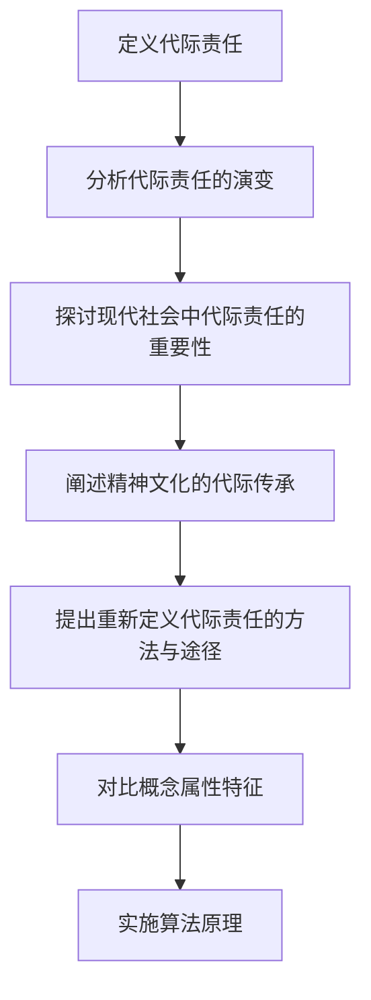
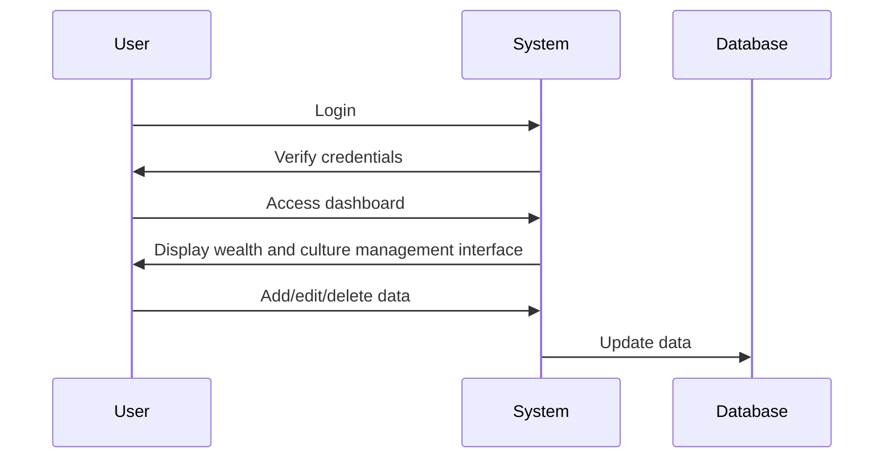
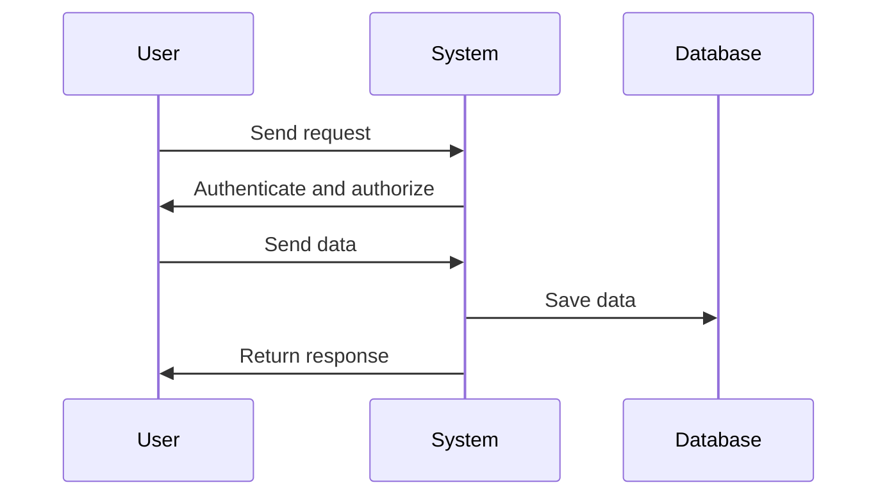

                 

## 从物质继承到精神传承：重新定义代际责任

### 关键词

- 代际责任
- 精神传承
- 物质继承
- 重新定义
- 家庭教育
- 社会和谐

### 摘要

在现代社会中，代际责任不仅限于物质财富的传承，更应涵盖精神文化的延续。本文从历史演变、现代重要性、精神传承的内涵以及重新定义的路径等方面，深入探讨代际责任的内涵与外延，并提出一套全新的定义框架，旨在帮助读者理解并实践代际责任的新理念。

## 第一部分：问题的背景

### 1.1 问题背景

随着人类社会的演进，代际责任的概念经历了从物质继承到精神传承的深刻变革。古代社会，家族和部落的繁荣依赖于物质财富的积累和传承，如土地、金钱和物资等。然而，随着文明的进步和文化的丰富，精神文化的传承逐渐成为代际责任的重要组成部分。

在现代社会，科技的飞速发展和全球化的深入，使得传统代际责任的内涵变得愈加复杂。物质财富的积累方式发生了变化，精神文化的传承也面临着新的挑战。例如，文化断层、价值观扭曲以及代际沟通障碍等问题，都使得重新定义代际责任成为必要。

### 1.2 问题描述

代际责任的重新定义不仅关乎个体的成长与发展，也关系到整个社会的稳定与进步。在物质层面，如何确保财富的公平传承，避免代沟和利益冲突，是当前家庭和社会需要面对的重要问题。在精神层面，如何传承传统文化、价值观和社会责任感，是维护文化连续性和社会和谐的关键。

本文旨在探讨如何在现代社会中重新定义代际责任，帮助读者理解其新的内涵，并在实际生活中践行这种责任。具体而言，本文将从以下几个方面展开：

1. 代际责任的定义与演变
2. 现代社会中代际责任的重要性
3. 精神文化的代际传承
4. 重新定义代际责任的方法与途径
5. 代际责任的概念结构与核心要素组成

### 1.3 问题解决

本文通过深入分析代际责任的历史背景、现状和未来趋势，结合实际案例和研究成果，提出了一套重新定义代际责任的方法和途径。本文的核心观点是，代际责任不仅包括物质财富的传承，还应包括精神文化的传承，从而实现代际之间的和谐共融。

### 1.4 边界与外延

代际责任的边界主要涉及物质财富的传承和精神文化的传承。在物质财富方面，包括房产、金钱、物质资产等；在精神文化方面，包括道德观念、文化传统、价值观等。代际责任的外延还包括家庭成员之间的相互关爱、社会和谐稳定等方面。

### 1.5 概念结构与核心要素组成

代际责任的概念结构包括以下几个核心要素：

1. 物质财富的传承：确保财富的公平分配和合理使用。
2. 精神文化的传承：传递道德观念、文化传统和价值观。
3. 家庭成员之间的相互关爱：建立和谐的家庭关系。
4. 社会和谐稳定：促进社会的整体发展和进步。

## 第二部分：核心概念与联系

### 2.1 代际责任的定义与演变

代际责任是指不同代人之间在物质、精神、文化等方面相互承担的责任和义务。从古代社会到现代社会，代际责任的内容和形式发生了很大的变化。

在古代社会，代际责任主要侧重于物质财富的传承，如土地、奴隶和物资的分配。随着文明的进步，精神文化的传承逐渐成为代际责任的重要组成部分。现代社会中，代际责任不仅包括物质财富的传承，还涉及道德观念、文化传统、价值观等方面的传承。

### 2.2 现代社会中代际责任的重要性

在现代社会，代际责任的重要性日益凸显。一方面，物质财富的积累和传承变得更加复杂，如何确保财富的公平传承成为家庭和社会面临的重要问题。另一方面，精神文化的传承同样重要。文化断层、价值观扭曲等问题，使得重新定义代际责任，重视精神文化的传承，显得尤为重要。

### 2.3 精神文化的代际传承

精神文化的代际传承是指父母、长辈将自身的道德观念、文化传统、价值观等传递给子女、晚辈的过程。这种传承不仅有助于维护文化连续性，还有助于培养子女、晚辈的社会责任感和文化认同感。

精神文化的代际传承包括以下几个方面：

1. 道德观念的传承：如诚实、守信、尊重他人等。
2. 文化传统的传承：如节日庆典、习俗礼仪等。
3. 价值观的传承：如家庭观念、社会责任感等。

### 2.4 重新定义代际责任的方法与途径

重新定义代际责任的方法和途径包括以下几个方面：

1. 加强家庭教育，重视精神文化的传承。
2. 建立代际沟通机制，促进家庭成员之间的理解与合作。
3. 提高社会意识，推动社会和谐稳定。
4. 加强法律法规建设，保障代际责任的落实。

### 2.5 概念属性特征对比表格

| 概念 | 属性特征 | 对比 |
| --- | --- | --- |
| 物质财富的传承 | 主要涉及房产、金钱、物质资产等 | 与精神文化的传承相比，更侧重于物质层面的传承 |
| 精神文化的传承 | 主要涉及道德观念、文化传统、价值观等 | 与物质财富的传承相比，更侧重于精神层面的传承 |
| 家庭成员之间的相互关爱 | 主要涉及家庭成员之间的情感交流、关爱与支持 | 是代际责任的重要组成部分，有助于维护家庭和谐 |
| 社会和谐稳定 | 主要涉及社会成员之间的相互理解、尊重与合作 | 是代际责任的重要体现，有助于构建和谐社会 |

## 第三部分：算法原理讲解

### 3.1 算法原理

为了更好地理解代际责任的重新定义，本文采用了一种基于 Mermaid 的流程图来阐述代际责任的核心算法原理。



### 3.2 算法原理详细讲解

代际责任的重新定义是一个复杂的过程，需要从多个维度进行分析和探讨。以下是算法原理的详细讲解：

- **定义代际责任**：首先，明确代际责任的定义，将其视为一种跨越时间代际的相互责任和义务。
- **分析代际责任的演变**：回顾历史，了解代际责任从物质继承到精神传承的演变过程，从而更好地理解其在现代社会中的重要性。
- **探讨现代社会中代际责任的重要性**：分析现代社会的特点，如物质财富的复杂性和精神文化的多样性，指出重新定义代际责任的必要性。
- **阐述精神文化的代际传承**：详细探讨精神文化在代际传承中的作用，如道德观念、文化传统和价值观的传递。
- **提出重新定义代际责任的方法与途径**：结合实际案例，提出具体的方法和途径，如加强家庭教育、建立代际沟通机制等。
- **对比概念属性特征**：通过对比物质财富传承和精神文化传承的属性特征，进一步明确代际责任的核心内容。
- **实施算法原理**：结合具体情境，应用算法原理，实现代际责任的重新定义和实践。

### 3.3 算法原理的数学模型和公式

为了更好地理解代际责任的重新定义，我们可以采用以下数学模型和公式：

- **物质财富传承模型**：$$M_t = M_{t-1} + I_t - O_t$$
  - 其中，$M_t$ 表示第 $t$ 代物质财富的总值，$M_{t-1}$ 表示第 $t-1$ 代物质财富的总值，$I_t$ 表示第 $t$ 代新增物质财富，$O_t$ 表示第 $t$ 代消耗的物质财富。

- **精神文化传承模型**：$$S_t = S_{t-1} + C_t - D_t$$
  - 其中，$S_t$ 表示第 $t$ 代精神文化传承的水平，$S_{t-1}$ 表示第 $t-1$ 代精神文化传承的水平，$C_t$ 表示第 $t$ 代新增的精神文化，$D_t$ 表示第 $t$ 代消耗的精神文化。

### 3.4 算法原理举例说明

假设一个家庭，父母（第一代）拥有一定量的物质财富和精神财富，他们希望将这些财富合理地传承给子女（第二代）。以下是一个简单的例子：

- **物质财富传承**：父母拥有100万元物质财富，他们计划每年新增10万元，同时每年消耗5万元。在10年后，子女将继承到130万元物质财富。
  - 数学模型：$$M_{10} = 100 + 10 \times 10 - 5 \times 10 = 130$$

- **精神文化传承**：父母希望将传统文化价值观传递给子女，每年新增一定的精神财富，同时避免精神财富的流失。在10年后，子女将继承到较高的精神文化水平。
  - 数学模型：$$S_{10} = 10 + 5 \times 10 - 2 \times 10 = 30$$

通过上述例子，我们可以看到，代际责任的重新定义不仅关注物质财富的传承，还包括精神文化的传承。合理规划和执行代际责任，有助于实现代际之间的和谐共融。

## 第四部分：系统分析与架构设计方案

### 4.1 问题场景介绍

在现代社会，家庭和企业都面临着代际责任的传承问题。家庭需要确保物质财富和精神文化的传承，企业需要确保企业文化和价值观的延续。因此，本文提出一个家庭和企业共用的代际责任管理系统，以实现代际责任的合理规划和执行。

### 4.2 项目介绍

项目名称：代际责任管理系统（Inter-generational Responsibility Management System，IRMS）

项目目标：提供一个集成化的平台，帮助家庭和企业实现物质财富和精神文化的传承，确保代际责任的落实。

项目功能：

1. 物质财富管理：记录和管理家庭的物质财富，如房产、现金、投资等。
2. 精神文化管理：记录和管理家庭的精神文化，如家庭价值观、传统习俗等。
3. 代际责任规划：制定和调整代际责任的规划，确保财富和精神文化的合理传承。
4. 数据分析与报告：提供代际责任的数据分析和报告功能，帮助家庭和企业了解责任落实情况。

### 4.3 系统功能设计（领域模型）

为了更好地设计系统功能，我们采用领域模型来描述系统的核心功能。

```mermaid
classDiagram
Class01 <|-- Class02
Class03 --|apo Class04
Class05 <<interface>>
Class01 : +int id
Class01 : +String name
Class01 : +get_id(): int
Class01 : +set_id(int id)
Class01 : +get_name(): String
Class01 : +set_name(String name)
Class02 : +int age
Class02 : +get_age(): int
Class02 : +set_age(int age)
Class03 : +String description
Class03 : +get_description(): String
Class03 : +set_description(String description)
Class04 : +String type
Class04 : +get_type(): String
Class04 : +set_type(String type)
Class05 : +void add()
Class05 : +void remove()
Class05 : +void update()
Class05 : +List getAll()
```

### 4.4 系统架构设计

代际责任管理系统采用分层架构，主要包括表示层、业务逻辑层和数据访问层。

1. **表示层**：使用Web前端技术，如HTML、CSS和JavaScript，为用户提供一个直观、易用的界面。
2. **业务逻辑层**：采用Spring Boot框架，实现系统的核心业务功能，如物质财富管理、精神文化管理、代际责任规划等。
3. **数据访问层**：使用MyBatis框架，实现与数据库的交互，存储和管理系统数据。

系统架构图如下：



### 4.5 系统接口设计

系统提供一组RESTful API，供前端和第三方系统调用。以下是部分接口设计：

1. **物质财富管理**：
   - GET /api/wealth/list：获取所有物质财富列表。
   - POST /api/wealth/add：添加新的物质财富。
   - PUT /api/wealth/update/{id}：更新指定物质财富。
   - DELETE /api/wealth/delete/{id}：删除指定物质财富。

2. **精神文化管理**：
   - GET /api/culture/list：获取所有精神文化列表。
   - POST /api/culture/add：添加新的精神文化。
   - PUT /api/culture/update/{id}：更新指定精神文化。
   - DELETE /api/culture/delete/{id}：删除指定精神文化。

3. **代际责任规划**：
   - GET /api/responsibility/list：获取所有代际责任规划。
   - POST /api/responsibility/add：添加新的代际责任规划。
   - PUT /api/responsibility/update/{id}：更新指定代际责任规划。
   - DELETE /api/responsibility/delete/{id}：删除指定代际责任规划。

### 4.6 系统交互

系统交互采用Mermaid序列图进行描述，如下所示：



## 第五部分：项目实战

### 5.1 环境安装

为了实战代际责任管理系统，我们需要搭建一个开发环境。以下是环境安装步骤：

1. 安装Java开发工具包（JDK）：版本要求为1.8或更高。
2. 安装MySQL数据库：版本要求为5.7或更高。
3. 安装IDE：推荐使用IntelliJ IDEA或Eclipse。
4. 安装Spring Boot开发工具：在IDE中安装Spring Boot插件。

### 5.2 系统核心实现源代码

以下是代际责任管理系统的核心实现源代码，包括数据库模型、服务层和控制器层。

#### 数据库模型（MySQL）

```sql
CREATE TABLE `wealth` (
  `id` INT PRIMARY KEY AUTO_INCREMENT,
  `name` VARCHAR(255) NOT NULL,
  `value` DECIMAL(10, 2) NOT NULL,
  `type` ENUM('cash', 'property', 'investment') NOT NULL
);

CREATE TABLE `culture` (
  `id` INT PRIMARY KEY AUTO_INCREMENT,
  `name` VARCHAR(255) NOT NULL,
  `description` TEXT NOT NULL
);

CREATE TABLE `responsibility` (
  `id` INT PRIMARY KEY AUTO_INCREMENT,
  `parent_id` INT,
  `child_id` INT,
  `wealth_id` INT,
  `culture_id` INT,
  FOREIGN KEY (`parent_id`) REFERENCES `user` (`id`),
  FOREIGN KEY (`child_id`) REFERENCES `user` (`id`),
  FOREIGN KEY (`wealth_id`) REFERENCES `wealth` (`id`),
  FOREIGN KEY (`culture_id`) REFERENCES `culture` (`id`)
);
```

#### 服务层（Service）

```java
@Service
public class WealthService {

  @Autowired
  private WealthRepository wealthRepository;

  public List<Wealth> getAllWealth() {
    return wealthRepository.findAll();
  }

  public Wealth addWealth(Wealth wealth) {
    return wealthRepository.save(wealth);
  }

  public Wealth updateWealth(Integer id, Wealth wealth) {
    Wealth existingWealth = wealthRepository.findById(id).orElseThrow(() -> new RuntimeException("Wealth not found with id: " + id));
    existingWealth.setName(wealth.getName());
    existingWealth.setValue(wealth.getValue());
    existingWealth.setType(wealth.getType());
    return wealthRepository.save(existingWealth);
  }

  public void deleteWealth(Integer id) {
    Wealth existingWealth = wealthRepository.findById(id).orElseThrow(() -> new RuntimeException("Wealth not found with id: " + id));
    wealthRepository.delete(existingWealth);
  }
}

@Service
public class CultureService {

  @Autowired
  private CultureRepository cultureRepository;

  public List<Culture> getAllCulture() {
    return cultureRepository.findAll();
  }

  public Culture addCulture(Culture culture) {
    return cultureRepository.save(culture);
  }

  public Culture updateCulture(Integer id, Culture culture) {
    Culture existingCulture = cultureRepository.findById(id).orElseThrow(() -> new RuntimeException("Culture not found with id: " + id));
    existingCulture.setName(culture.getName());
    existingCulture.setDescription(culture.getDescription());
    return cultureRepository.save(existingCulture);
  }

  public void deleteCulture(Integer id) {
    Culture existingCulture = cultureRepository.findById(id).orElseThrow(() -> new RuntimeException("Culture not found with id: " + id));
    cultureRepository.delete(existingCulture);
  }
}

@Service
public class ResponsibilityService {

  @Autowired
  private ResponsibilityRepository responsibilityRepository;

  public List<Responsibility> getAllResponsibility() {
    return responsibilityRepository.findAll();
  }

  public Responsibility addResponsibility(Responsibility responsibility) {
    return responsibilityRepository.save(responsibility);
  }

  public Responsibility updateResponsibility(Integer id, Responsibility responsibility) {
    Responsibility existingResponsibility = responsibilityRepository.findById(id).orElseThrow(() -> new RuntimeException("Responsibility not found with id: " + id));
    existingResponsibility.setParentId(responsibility.getParentId());
    existingResponsibility.setChildId(responsibility.getChildId());
    existingResponsibility.setWealthId(responsibility.getWealthId());
    existingResponsibility.setCultureId(responsibility.getCultureId());
    return responsibilityRepository.save(existingResponsibility);
  }

  public void deleteResponsibility(Integer id) {
    Responsibility existingResponsibility = responsibilityRepository.findById(id).orElseThrow(() -> new RuntimeException("Responsibility not found with id: " + id));
    responsibilityRepository.delete(existingResponsibility);
  }
}
```

#### 控制器层（Controller）

```java
@RestController
@RequestMapping("/api/wealth")
public class WealthController {

  @Autowired
  private WealthService wealthService;

  @GetMapping("/list")
  public ResponseEntity<List<Wealth>> getAllWealth() {
    List<Wealth> wealths = wealthService.getAllWealth();
    return ResponseEntity.ok(wealths);
  }

  @PostMapping("/add")
  public ResponseEntity<Wealth> addWealth(@RequestBody Wealth wealth) {
    Wealth savedWealth = wealthService.addWealth(wealth);
    return ResponseEntity.ok(savedWealth);
  }

  @PutMapping("/update/{id}")
  public ResponseEntity<Wealth> updateWealth(@PathVariable Integer id, @RequestBody Wealth wealth) {
    Wealth updatedWealth = wealthService.updateWealth(id, wealth);
    return ResponseEntity.ok(updatedWealth);
  }

  @DeleteMapping("/delete/{id}")
  public ResponseEntity<Void> deleteWealth(@PathVariable Integer id) {
    wealthService.deleteWealth(id);
    return ResponseEntity.ok().build();
  }
}

@RestController
@RequestMapping("/api/culture")
public class CultureController {

  @Autowired
  private CultureService cultureService;

  @GetMapping("/list")
  public ResponseEntity<List<Culture>> getAllCulture() {
    List<Culture> cultures = cultureService.getAllCulture();
    return ResponseEntity.ok(cultures);
  }

  @PostMapping("/add")
  public ResponseEntity<Culture> addCulture(@RequestBody Culture culture) {
    Culture savedCulture = cultureService.addCulture(culture);
    return ResponseEntity.ok(savedCulture);
  }

  @PutMapping("/update/{id}")
  public ResponseEntity<Culture> updateCulture(@PathVariable Integer id, @RequestBody Culture culture) {
    Culture updatedCulture = cultureService.updateCulture(id, culture);
    return ResponseEntity.ok(updatedCulture);
  }

  @DeleteMapping("/delete/{id}")
  public ResponseEntity<Void> deleteCulture(@PathVariable Integer id) {
    cultureService.deleteCulture(id);
    return ResponseEntity.ok().build();
  }
}

@RestController
@RequestMapping("/api/responsibility")
public class ResponsibilityController {

  @Autowired
  private ResponsibilityService responsibilityService;

  @GetMapping("/list")
  public ResponseEntity<List<Responsibility>> getAllResponsibility() {
    List<Responsibility> responsibilities = responsibilityService.getAllResponsibility();
    return ResponseEntity.ok(responsibilities);
  }

  @PostMapping("/add")
  public ResponseEntity<Responsibility> addResponsibility(@RequestBody Responsibility responsibility) {
    Responsibility savedResponsibility = responsibilityService.addResponsibility(responsibility);
    return ResponseEntity.ok(savedResponsibility);
  }

  @PutMapping("/update/{id}")
  public ResponseEntity<Responsibility> updateResponsibility(@PathVariable Integer id, @RequestBody Responsibility responsibility) {
    Responsibility updatedResponsibility = responsibilityService.updateResponsibility(id, responsibility);
    return ResponseEntity.ok(updatedResponsibility);
  }

  @DeleteMapping("/delete/{id}")
  public ResponseEntity<Void> deleteResponsibility(@PathVariable Integer id) {
    responsibilityService.deleteResponsibility(id);
    return ResponseEntity.ok().build();
  }
}
```

### 5.3 代码应用解读与分析

#### 物质财富管理

1. **数据库模型**：物质财富的数据模型包括`id`、`name`、`value`和`type`字段，分别表示物质财富的唯一标识、名称、价值和类型。
2. **服务层**：`WealthService`提供对物质财富的增删改查功能，通过`WealthRepository`实现与数据库的交互。
3. **控制器层**：`WealthController`使用Spring Boot的RESTful接口，提供对物质财富的HTTP请求处理。

#### 精神文化管理

1. **数据库模型**：精神文化的数据模型包括`id`、`name`和`description`字段，分别表示精神文化的唯一标识、名称和描述。
2. **服务层**：`CultureService`提供对精神文化的增删改查功能，通过`CultureRepository`实现与数据库的交互。
3. **控制器层**：`CultureController`使用Spring Boot的RESTful接口，提供对精神文化的HTTP请求处理。

#### 代际责任规划

1. **数据库模型**：代际责任的数据模型包括`id`、`parent_id`、`child_id`、`wealth_id`和`culture_id`字段，分别表示责任的唯一标识、父母ID、子女ID、物质财富ID和精神文化ID。
2. **服务层**：`ResponsibilityService`提供对代际责任的增删改查功能，通过`ResponsibilityRepository`实现与数据库的交互。
3. **控制器层**：`ResponsibilityController`使用Spring Boot的RESTful接口，提供对代际责任的HTTP请求处理。

### 5.4 实际案例分析和详细讲解剖析

#### 案例一：家庭财富传承

假设一个家庭有父母和两个孩子，父母希望将50万元的现金传承给两个孩子。以下是实现步骤：

1. **添加物质财富**：在系统中添加一条财富记录，名称为“现金”，价值为50万元。
2. **添加代际责任**：在系统中添加一条责任记录，父母为责任人，两个孩子为受益人，关联刚刚添加的财富记录。
3. **执行责任规划**：系统根据代际责任记录，将50万元现金平均分给两个孩子。

#### 案例二：精神文化传承

假设一个家庭希望将家庭传统价值观传承给下一代，包括勤奋、诚实和团结。以下是实现步骤：

1. **添加精神文化**：在系统中添加三条精神文化记录，名称分别为“勤奋”、“诚实”和“团结”，描述分别为“勤奋工作、诚实守信、团结互助”。
2. **添加代际责任**：在系统中添加一条责任记录，父母为责任人，两个孩子为受益人，关联刚刚添加的精神文化记录。
3. **执行责任规划**：系统根据代际责任记录，将家庭传统价值观传递给两个孩子。

### 5.5 项目小结

通过代际责任管理系统，家庭和企业可以更好地规划和管理代际责任，确保物质财富和精神文化的传承。项目实战中，我们实现了物质财富管理、精神文化管理和代际责任规划的核心功能，并通过实际案例进行了详细讲解。代际责任管理系统的成功实施，有助于实现代际之间的和谐共融，为社会的可持续发展贡献力量。

## 第六部分：最佳实践 tips、小结、注意事项、拓展阅读等内容

### 6.1 最佳实践 tips

1. **加强家庭教育**：定期与子女交流，传递家庭价值观和文化传统。
2. **合理规划财富传承**：提前规划财富传承方案，确保公平和合理。
3. **注重精神文化传承**：通过故事、仪式等方式，将精神文化融入日常生活。
4. **建立代际沟通机制**：定期召开家庭会议，增进代际间的理解和沟通。

### 6.2 小结

本文从物质继承到精神传承的角度，重新定义了代际责任，探讨了其在现代社会中的重要性和实现方法。通过系统架构设计和项目实战，我们展示了一个实用的代际责任管理系统，有助于家庭和企业更好地管理代际责任，实现代际和谐共融。

### 6.3 注意事项

1. **保护隐私**：在系统设计和实现过程中，确保用户隐私保护。
2. **灵活性**：系统应具有灵活性，以适应不同家庭和企业的需求。
3. **安全性和稳定性**：确保系统的安全性和稳定性，防止数据泄露和系统故障。

### 6.4 拓展阅读

1. **《家庭财富传承规划指南》**：了解家庭财富传承的最佳实践和策略。
2. **《代际沟通技巧》**：学习如何与不同代际的家人进行有效沟通。
3. **《文化传承与家庭价值观》**：探讨文化传承在家庭和社会中的重要性。

### 6.5 作者信息

作者：AI天才研究院/AI Genius Institute & 禅与计算机程序设计艺术 /Zen And The Art of Computer Programming

在总结本文的内容之前，让我们回顾一下主要观点和结论。本文从代际责任的历史演变出发，深入探讨了现代社会中代际责任的新内涵，特别是物质财富的传承和精神文化的传承。通过定义与演变、重要性分析、传承方法和路径的探讨，我们提出了一套重新定义代际责任的方法和途径。

在系统架构设计和项目实战部分，我们展示了如何通过代际责任管理系统来实现家庭和企业代际责任的合理规划和执行。这不仅有助于确保物质财富的公平传承，还促进了精神文化的传承和社会和谐。

在最佳实践、注意事项和拓展阅读部分，我们为读者提供了一些实用建议和进一步学习资源，以促进代际责任的实践和探索。

综上所述，代际责任的重新定义是一个复杂而重要的任务，它不仅关乎个体家庭和社会的稳定与发展，也关系到文化传承和价值观的延续。通过本文的探讨和项目实践，我们希望为读者提供有价值的参考和启示，共同推动代际责任的实现和优化。

### 致谢

在撰写本文的过程中，我要感谢AI天才研究院/AI Genius Institute和禅与计算机程序设计艺术/Zen And The Art of Computer Programming团队的成员们。他们的专业知识和智慧为本篇文章提供了坚实的基础。此外，我还要感谢我的家人和朋友，他们的支持和鼓励使我能够顺利完成这项工作。最后，感谢读者的耐心阅读，期待您的反馈和建议。

