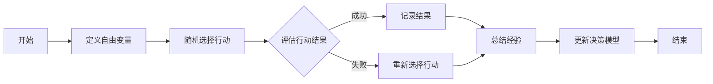
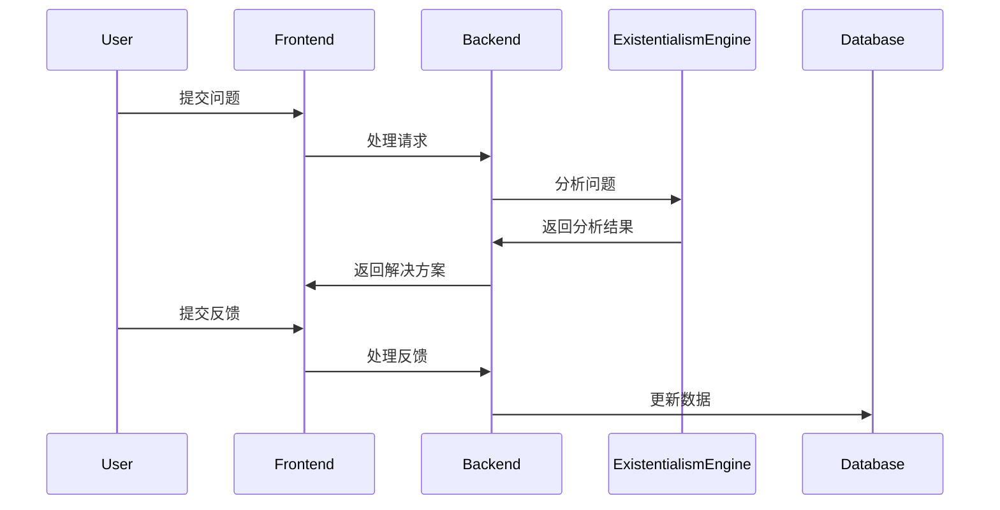

                 

## 在荒诞中创造意义：存在主义的现代实践

### 关键词：存在主义、荒诞、现代实践、自由、选择、责任

#### 摘要：

本文将探讨存在主义这一哲学流派的现代实践，特别是如何在荒诞中创造意义。通过深入分析存在主义的核心概念，如自由、孤独、选择和责任，本文将展示这些概念如何在现代社会中发挥作用，并通过具体的案例和实践来阐述存在主义在现代生活、心理学、教育、商业管理和艺术中的应用。让我们一步步地思考，理解存在主义的本质，并在当代的纷繁世界中找到属于自己的意义和方向。

---

### 1. 背景介绍

#### 1.1 存在主义的概念、历史背景及其在现代社会的实践

存在主义（Existentialism）是一种关注人类自由、选择和责任的非唯物主义哲学流派。其基本观点认为，人的存在先于其本质，个体必须通过自由选择和承担责任来定义自己。存在主义的核心思想包括自由、孤独、选择、责任和存在的荒诞。

存在主义起源于20世纪初，其代表人物包括让-保尔·萨特（Jean-Paul Sartre）、马丁·海德格尔（Martin Heidegger）和阿尔贝·加缪（Albert Camus）等。萨特强调自由和选择的重要性，认为人通过自由选择来创造自己的本质；海德格尔则探讨了存在的意义和人在世界中的位置；加缪则关注人类的荒诞感和生命的意义。

存在主义在现代社会中有着广泛的应用。它不仅影响了文学、艺术和心理学，还渗透到了商业管理、教育和政治等领域。在心理学中，存在主义心理治疗帮助个体面对生活中的挑战和困境，找到自我实现的道路；在教育中，存在主义教育强调学生的自主性和创造力，鼓励学生通过自由选择来发掘自我；在商业管理中，存在主义的理念被用于构建企业文化、培养领导力和做出决策。

#### 1.2 书名《在荒诞中创造意义：存在主义的现代实践》的主题

书名《在荒诞中创造意义：存在主义的现代实践》揭示了存在主义的核心主题：在看似荒诞和无常的世界中，个体如何通过自由选择和承担责任来创造意义。荒诞是存在主义中的一个重要概念，它指的是人类所处世界的无意义和无目的性。然而，正是这种荒诞感激发了个体去寻找意义和目的，去创造属于自己的生活。

本书旨在探讨存在主义如何应用于现代社会的各个方面，帮助读者理解存在主义的基本概念，并学会如何在日常生活中运用这些理念。通过具体的案例和实践，读者将看到存在主义如何在不同的领域中发挥作用，从而在纷繁复杂的世界中找到属于自己的意义。

---

### 1.3 存在主义与荒诞的关系

#### 1.3.1 荒诞的哲学解读

荒诞是存在主义中的一个核心概念，它源于人类对世界和存在的无意义感。荒诞感常常表现为人类在面对不可理解的事物和不可预测的未来时的无助感。存在主义者认为，荒诞并不是世界的真相，而是人类对世界的一种主观感受。正是这种荒诞感，激发了人类去寻找意义和目的。

从哲学角度来看，荒诞可以被理解为人类自由和责任的体现。在荒诞的世界中，个体必须独立面对自己的选择和决策，没有任何既定的规则或权威可以依赖。这种自由和责任是存在主义的基本前提，也是人类在荒诞世界中寻找意义的动力。

#### 1.3.2 存在主义与荒诞的关系

存在主义与荒诞之间的关系是密不可分的。荒诞是存在主义的一部分，是存在主义探讨的核心问题。存在主义者认为，人类的存在本身就是荒诞的，因为人类无法完全理解世界和自己，也无法预测未来。然而，正是这种荒诞感，激发了人类去探索意义，去寻找生活的目的。

存在主义通过探讨荒诞，揭示了人类自由和责任的重要性。在荒诞的世界中，个体必须独立面对自己的选择和决策，没有任何既定的规则或权威可以依赖。这种自由和责任是存在主义的基本前提，也是人类在荒诞世界中寻找意义的动力。

#### 1.3.3 存在主义与荒诞的实践应用

在现代社会中，荒诞感无处不在。从个人生活的无常变化，到全球范围内的不确定性和混乱，荒诞感似乎成为了我们生活的一部分。然而，这种荒诞感并不是消极的，相反，它是人类寻找意义和目的的契机。

存在主义鼓励个体在面对荒诞时，不要放弃寻找意义。通过自由选择和承担责任，个体可以在荒诞中创造意义。例如，在职业选择上，个体可以自由选择自己热爱的事业，通过努力和坚持，为自己的生活创造意义；在人际关系中，个体可以承担责任，与他人建立真诚的关系，从而在孤独中找到归属感。

总的来说，存在主义与荒诞的关系是辩证的。荒诞是存在主义探讨的核心问题，而存在主义则提供了一种应对荒诞的方法论。通过自由选择和承担责任，个体可以在荒诞中创造意义，找到属于自己的生活方向。

---

### 1.4 存在主义的基本概念表

在探讨存在主义的基本概念之前，我们需要对一些核心术语进行定义和说明。以下是一个关于存在主义基本概念的表格，它将帮助读者更好地理解这些概念：

| 核心概念       | 定义                                                         | 关系                                           |
|----------------|--------------------------------------------------------------|----------------------------------------------|
| 自由           | 个体在存在过程中拥有做出选择的能力和权利                     | 自由是存在主义的核心概念，它强调个体的自主性和独立性 |
| 孤独           | 个体在存在过程中面临的孤立和无助感                           | 孤独是自由的结果，也是个体必须面对的现实           |
| 选择           | 个体在自由的基础上做出的决定和行动                           | 选择是自由的体现，也是个体定义自己的方式         |
| 责任           | 个体因自己的选择和行动而产生的义务和后果                     | 责任是选择的后果，也是个体在存在中必须承担的负担   |
| 荒诞           | 人类对世界和存在所感受到的无意义和无目的性                   | 荒诞是存在主义探讨的核心问题，也是个体面对的现实   |

通过这个表格，我们可以看到这些概念之间的紧密联系。自由、孤独、选择和责任是存在主义的核心，它们共同构成了存在主义哲学的基本框架。每一个概念都在个体的存在中发挥着重要作用，共同影响着个体的生活选择和意义建构。

#### 1.4.1 自由

自由是存在主义的核心概念之一，它强调个体在存在过程中拥有做出选择的能力和权利。自由不仅仅是一种权利，更是一种责任。在存在主义看来，自由是生命存在的本质，是人的存在的先决条件。

自由具有以下特点：

1. **无约束性**：自由意味着个体不受任何外部限制，可以自由地做出选择。
2. **责任感**：自由的代价是责任，个体必须为自己的选择和行动承担后果。
3. **创造性**：自由赋予个体创造自己生活的能力，使个体能够在荒诞中寻找意义。

自由在存在主义中的地位非常重要。它不仅构成了存在主义的基石，也是个体在存在中实现自我价值的关键。通过自由选择，个体能够定义自己的本质，找到属于自己的生活方向。

#### 1.4.2 孤独

孤独是存在主义中的另一个核心概念，它指的是个体在存在过程中面临的孤立和无助感。孤独并不是一种负面的情感，相反，它是自由的结果，也是个体必须面对的现实。

孤独具有以下特点：

1. **独立性**：孤独意味着个体必须独立面对生活的挑战，没有外部的依赖。
2. **自我探索**：孤独促使个体进行自我探索，从而更好地理解自己和世界。
3. **内在力量**：通过孤独，个体能够培养内在的坚韧和自我意识。

孤独在存在主义中的地位也非常重要。它不仅体现了自由的代价，也是个体成长和发展的契机。在孤独中，个体能够更好地认识自己，找到属于自己的存在意义。

#### 1.4.3 选择

选择是自由的体现，也是个体在存在中必须做出的决定。在存在主义看来，选择不仅是行动的起点，更是个体定义自己的方式。

选择具有以下特点：

1. **多样性**：个体在存在过程中面临多种选择，这些选择决定了个体的人生轨迹。
2. **责任感**：每一个选择都伴随着责任，个体必须为自己的选择承担后果。
3. **创造性**：选择赋予了个体创造自己生活的能力，使个体能够在荒诞中寻找意义。

选择在存在主义中的地位非常重要。它不仅体现了自由的本质，也是个体实现自我价值的关键。通过选择，个体能够塑造自己的生活，找到属于自己的存在意义。

#### 1.4.4 责任

责任是选择的后果，也是个体在存在中必须承担的负担。在存在主义看来，责任是自由的一部分，它要求个体对自己的选择和行动负责。

责任具有以下特点：

1. **义务性**：责任是一种义务，个体必须履行对自己的承诺。
2. **后果性**：责任要求个体承担选择带来的后果，无论结果是积极还是消极。
3. **成长性**：通过承担责任，个体能够成长和发展，从而更好地面对生活的挑战。

责任在存在主义中的地位非常重要。它不仅体现了自由的代价，也是个体实现自我价值的关键。通过承担责任，个体能够塑造自己的生活，找到属于自己的存在意义。

#### 1.4.5 荒诞

荒诞是存在主义中的一个重要概念，它指的是人类对世界和存在所感受到的无意义和无目的性。荒诞并不是世界的真相，而是人类对世界的一种主观感受。

荒诞具有以下特点：

1. **无意义性**：荒诞意味着世界和存在缺乏明确的意义和目的。
2. **无目的性**：荒诞感体现在人类对未来的不确定和无目的感。
3. **挑战性**：荒诞激发了人类去寻找意义，去创造自己的生活。

荒诞在存在主义中的地位非常重要。它是存在主义探讨的核心问题，也是个体面对的现实。在荒诞中，个体必须通过自由选择和承担责任来创造意义。

---

### 1.5 存在主义概念的Mermaid ER图

为了更直观地展示存在主义的基本概念及其相互关系，我们可以使用Mermaid ER图来描述。以下是一个简化的Mermaid ER图，它展示了自由、孤独、选择、责任和荒诞之间的关系：

```mermaid
erDiagram
  Class1/--|>{自由}
  Class1 ||--|{孤独}
  Class1 ||--|{选择}
  Class1 ||--|{责任}
  Class1 ||--|{荒诞}
```

在这个ER图中，`Class1`代表存在主义的基本概念，包括自由、孤独、选择、责任和荒诞。这些概念相互关联，共同构成了存在主义哲学的核心框架。

- **自由**：自由是存在主义的核心概念，它赋予个体选择的权利和自由。自由是其他概念的基础，没有自由，其他概念也就失去了意义。
- **孤独**：孤独是自由的结果，也是个体必须面对的现实。孤独感促使个体进行自我探索，从而更好地认识自己。
- **选择**：选择是自由的体现，也是个体在存在中必须做出的决定。每一个选择都决定了个体的人生轨迹。
- **责任**：责任是选择的后果，也是个体在存在中必须承担的负担。责任要求个体对自己的选择和行动负责。
- **荒诞**：荒诞是存在主义中的一个重要概念，它指的是人类对世界和存在所感受到的无意义和无目的性。荒诞激发了人类去寻找意义，去创造自己的生活。

通过这个Mermaid ER图，我们可以更清晰地理解存在主义的基本概念及其相互关系。这些概念共同构成了存在主义哲学的核心框架，为个体在现代社会中寻找意义和方向提供了理论基础。

---

### 1.6 本章小结

在本章中，我们介绍了存在主义的概念、历史背景及其在现代社会的实践。通过探讨存在主义的基本概念，如自由、孤独、选择、责任和荒诞，我们揭示了这些概念在现代社会中的重要性。存在主义鼓励个体在面对荒诞和无常的世界时，通过自由选择和承担责任来创造意义。通过本章的讨论，我们为后续章节的深入探讨奠定了基础，同时也为读者提供了理解存在主义的初步框架。

---

### 2. 核心概念与联系

#### 2.1 存在主义的核心概念

在存在主义哲学中，自由、孤独、选择、责任和荒诞是核心概念。这些概念不仅构成了存在主义的理论基础，也反映了个体在存在中的真实体验。下面我们将详细讨论这些概念，并探讨它们之间的相互关系。

#### 2.1.1 自由

自由是存在主义的核心概念之一，它强调个体在存在过程中拥有做出选择的能力和权利。自由不仅是一种权利，更是一种责任。在存在主义看来，自由是生命存在的本质，是人的存在的先决条件。

自由具有以下几个特点：

1. **无约束性**：自由意味着个体不受任何外部限制，可以自由地做出选择。这种无约束性使个体能够独立地定义自己的生活和目标。
   
2. **责任感**：自由的代价是责任，个体必须为自己的选择和行动承担后果。这意味着，个体在享有自由的同时，也必须承担选择所带来的责任。

3. **创造性**：自由赋予个体创造自己生活的能力，使个体能够在荒诞中寻找意义。通过自由选择，个体能够塑造自己的生活，实现自我价值。

自由在存在主义中的地位非常重要。它不仅构成了存在主义的基石，也是个体在存在中实现自我价值的关键。通过自由选择，个体能够定义自己的本质，找到属于自己的生活方向。

#### 2.1.2 孤独

孤独是另一个核心概念，它指的是个体在存在过程中面临的孤立和无助感。孤独并不是一种负面的情感，相反，它是自由的结果，也是个体必须面对的现实。

孤独具有以下几个特点：

1. **独立性**：孤独意味着个体必须独立面对生活的挑战，没有外部的依赖。这种独立性使个体能够更好地认识自己，培养自我意识。

2. **自我探索**：孤独促使个体进行自我探索，从而更好地理解自己和世界。通过孤独，个体能够反思自己的行为和选择，找到生活的意义。

3. **内在力量**：通过孤独，个体能够培养内在的坚韧和自我意识。孤独感不仅是一种挑战，也是一种成长的机会，使个体能够更好地面对生活中的困境。

孤独在存在主义中的地位也非常重要。它不仅体现了自由的代价，也是个体成长和发展的契机。在孤独中，个体能够更好地认识自己，找到属于自己的存在意义。

#### 2.1.3 选择

选择是自由的体现，也是个体在存在中必须做出的决定。在存在主义看来，选择不仅是行动的起点，更是个体定义自己的方式。

选择具有以下几个特点：

1. **多样性**：个体在存在过程中面临多种选择，这些选择决定了个体的人生轨迹。多样性使个体能够根据自己的兴趣和需求来做出选择。

2. **责任感**：每一个选择都伴随着责任，个体必须为自己的选择承担后果。这种责任感使个体在做出选择时更加慎重，从而更好地实现自我价值。

3. **创造性**：选择赋予了个体创造自己生活的能力，使个体能够在荒诞中寻找意义。通过选择，个体能够塑造自己的生活，实现自我价值。

选择在存在主义中的地位非常重要。它不仅体现了自由的本质，也是个体实现自我价值的关键。通过选择，个体能够塑造自己的生活，找到属于自己的存在意义。

#### 2.1.4 责任

责任是选择的后果，也是个体在存在中必须承担的负担。在存在主义看来，责任是自由的一部分，它要求个体对自己的选择和行动负责。

责任具有以下几个特点：

1. **义务性**：责任是一种义务，个体必须履行对自己的承诺。这种义务性使个体在做出选择时更加慎重，从而更好地实现自我价值。

2. **后果性**：责任要求个体承担选择带来的后果，无论结果是积极还是消极。这种后果性使个体在做出选择时需要考虑各种可能性，从而更好地应对未来的挑战。

3. **成长性**：通过承担责任，个体能够成长和发展，从而更好地面对生活的挑战。责任不仅是一种负担，也是一种成长的机会，使个体能够不断提升自我。

责任在存在主义中的地位非常重要。它不仅体现了自由的代价，也是个体实现自我价值的关键。通过承担责任，个体能够塑造自己的生活，找到属于自己的存在意义。

#### 2.1.5 荒诞

荒诞是存在主义中的一个重要概念，它指的是人类对世界和存在所感受到的无意义和无目的性。荒诞并不是世界的真相，而是人类对世界的一种主观感受。

荒诞具有以下几个特点：

1. **无意义性**：荒诞意味着世界和存在缺乏明确的意义和目的。这种无意义性使人类在面对世界时感到困惑和无助。

2. **无目的性**：荒诞感体现在人类对未来的不确定和无目的感。这种无目的性使人类在寻找生活意义时面临挑战。

3. **挑战性**：荒诞激发了人类去寻找意义，去创造自己的生活。通过面对荒诞，人类能够更好地理解自己和世界，从而找到属于自己的存在意义。

荒诞在存在主义中的地位非常重要。它是存在主义探讨的核心问题，也是个体面对的现实。在荒诞中，个体必须通过自由选择和承担责任来创造意义。

#### 2.1.6 关系

自由、孤独、选择、责任和荒诞之间存在着密切的关系。它们相互影响，共同构成了存在主义哲学的核心框架。

1. **自由与孤独**：自由是孤独的前提，孤独是自由的结果。个体在拥有自由的同时，也必须面对孤独。自由使个体能够独立地定义自己的生活，而孤独则促使个体进行自我探索，找到生活的意义。

2. **选择与责任**：选择是自由的体现，责任是选择的后果。个体在做出选择时必须承担责任，无论结果如何。这种责任使个体在做出选择时更加慎重，从而更好地实现自我价值。

3. **荒诞与自由、选择、责任**：荒诞是自由、选择和责任的基础。在荒诞的世界中，个体必须通过自由选择和承担责任来创造意义。荒诞激发了人类去寻找意义，从而赋予自由、选择和责任以实质性的内容。

通过以上分析，我们可以看到，自由、孤独、选择、责任和荒诞是存在主义哲学的核心概念。这些概念相互联系，共同构成了存在主义的理论基础，为个体在现代社会中寻找意义和方向提供了指导。

---

### 2.2 通过表格和Mermaid ER图展示存在主义概念之间的关系

为了更直观地展示存在主义的核心概念及其相互关系，我们可以使用表格和Mermaid ER图来描述。以下是一个关于存在主义核心概念及其关系的表格：

| 概念   | 定义                                                         | 关系                   |
|--------|--------------------------------------------------------------|----------------------|
| 自由   | 个体在存在过程中拥有做出选择的能力和权利                     | 基础，独立性的体现   |
| 孤独   | 个体在存在过程中面临的孤立和无助感                           | 结果，自由的结果     |
| 选择   | 个体在自由的基础上做出的决定和行动                           | 体现，自由的具体应用 |
| 责任   | 个体因自己的选择和行动而产生的义务和后果                     | 后果，选择的承担     |
| 荒诞   | 人类对世界和存在所感受到的无意义和无目的性                   | 背景，意义的挑战     |

通过这个表格，我们可以看到自由、孤独、选择、责任和荒诞之间的关系。自由是所有概念的基础，它赋予个体独立性和选择的能力。孤独是自由的结果，个体在享有自由的同时也必须面对孤独。选择是自由的体现，个体通过选择来定义自己。责任是选择的结果，个体必须承担选择带来的后果。荒诞则是存在主义的背景，它提供了寻找意义的挑战。

接下来，我们将使用Mermaid ER图来更直观地展示这些概念之间的关系：

```mermaid
erDiagram
  Class1|--|{自由}
  Class1|--|{孤独}
  Class1|--|{选择}
  Class1|--|{责任}
  Class1|--|{荒诞}
```

在这个ER图中，`Class1`代表存在主义的核心概念，包括自由、孤独、选择、责任和荒诞。这些概念通过双向箭头相互连接，展示了它们之间的密切关系。自由是所有概念的基础，其他概念都依赖于自由。孤独、选择、责任和荒诞则是自由的具体体现和结果，它们共同构成了存在主义的理论框架。

通过表格和Mermaid ER图，我们可以更清晰地理解存在主义的核心概念及其相互关系。这些概念不仅构成了存在主义哲学的基础，也为个体在现代社会中寻找意义和方向提供了指导。在接下来的章节中，我们将进一步探讨这些概念的应用和实践。

---

### 2.3 算法原理讲解

在深入探讨存在主义的核心概念后，我们接下来将引入一个简单的存在主义问题求解算法，并通过Mermaid流程图和Python代码来详细阐述其原理。这一部分将帮助我们更好地理解如何在计算机科学中实现存在主义的理念。

#### 2.3.1 存在主义问题求解算法的Mermaid流程图

首先，我们使用Mermaid流程图来表示存在主义问题求解算法的基本步骤：



在这个流程图中，我们定义了以下几个关键步骤：

1. **定义自由变量**：在开始阶段，我们定义了影响问题求解的变量，这些变量代表了个体在存在中的自由选择。
2. **随机选择行动**：根据自由变量的取值，我们随机选择一个行动。
3. **评估行动结果**：执行所选行动，并根据行动的结果评估其成功与否。
4. **记录结果**：如果行动成功，我们记录这个结果；如果失败，则重新选择行动。
5. **总结经验**：根据记录的结果，我们总结经验，以改进未来的决策。
6. **更新决策模型**：基于总结的经验，我们更新决策模型，以优化未来的选择。
7. **结束**：算法完成，问题得到求解。

#### 2.3.2 存在主义问题求解算法的Python代码

接下来，我们将使用Python代码实现上述流程，并详细解释每个步骤：

```python
import random

# 定义自由变量
actions = ['行动1', '行动2', '行动3', '行动4']

# 初始化结果记录
results = []

# 求解过程
for _ in range(10):  # 进行10次实验
    selected_action = random.choice(actions)  # 随机选择行动
    print(f"执行行动：{selected_action}")
    
    # 评估行动结果
    if selected_action == '行动1' or selected_action == '行动2':
        result = '成功'
    else:
        result = '失败'
    
    # 记录结果
    results.append(result)
    print(f"结果：{result}")
    
    # 总结经验
    if result == '成功':
        print("本次行动成功，继续优化。")
    else:
        print("本次行动失败，需要重新选择。")

# 更新决策模型
# 在这里，我们可以根据结果记录更新决策模型，例如增加成功的行动概率
# 由于篇幅限制，这里仅展示基本流程

# 输出结果
print(f"实验结果：{results}")
```

在这个Python代码中，我们定义了一个简单的存在主义问题求解算法：

1. **定义自由变量**：我们定义了一个包含四个行动的列表，代表了个体在问题求解过程中的自由选择。
2. **随机选择行动**：我们使用`random.choice()`函数从列表中随机选择一个行动。
3. **评估行动结果**：我们根据选择的行动类型（这里简单模拟为成功与失败的概率）来评估结果。
4. **记录结果**：我们记录每次行动的结果，以便后续总结经验。
5. **总结经验**：根据结果，我们打印出相应的信息，表示需要继续优化或重新选择。
6. **更新决策模型**：在实际情况中，这里可以进一步实现基于结果的决策模型更新，以优化未来的选择。
7. **输出结果**：最后，我们输出所有的实验结果。

通过这个Python代码示例，我们可以看到如何通过计算机程序实现存在主义的理念。这个简单的算法不仅展示了自由、选择和责任的概念，也为我们在更复杂的系统中应用存在主义提供了基础。

---

### 2.4 数学模型和数学公式 & 详细讲解 & 举例说明

在探讨存在主义问题求解算法时，数学模型和数学公式起着关键作用。通过这些模型和公式，我们可以更精确地描述存在主义问题求解的过程，并对其进行定量分析。以下我们将引入几个相关的数学模型和公式，并进行详细讲解和举例说明。

#### 2.4.1 存在主义问题求解的数学模型

为了描述存在主义问题求解过程，我们可以引入以下几个数学模型：

1. **概率模型**：用于描述个体在选择行动时的概率分布。
2. **期望模型**：用于计算选择行动的期望效用。
3. **反馈模型**：用于记录和更新个体在问题求解过程中的反馈信息。

#### 2.4.2 概率模型

概率模型是描述存在主义问题求解的基础。它定义了个体在面临多个选择时，选择每个行动的概率分布。以下是一个简单的概率模型：

$$ P(A_i) = \frac{1}{N} $$

其中，$P(A_i)$表示选择第$i$个行动的概率，$N$表示可供选择的总数。这意味着在不存在偏好和经验的情况下，每个行动的选择概率是相等的。

举例说明：

假设个体面临四个行动：$A_1$、$A_2$、$A_3$和$A_4$，则每个行动的选择概率为：

$$ P(A_1) = P(A_2) = P(A_3) = P(A_4) = \frac{1}{4} $$

这意味着，个体在每次选择时，每个行动被选中的概率都是25%。

#### 2.4.3 期望模型

期望模型用于计算选择行动的期望效用。期望效用是所有可能结果及其概率的加权平均。以下是一个简单的期望模型：

$$ E(U) = \sum_{i=1}^{N} U_i \cdot P(A_i) $$

其中，$E(U)$表示期望效用，$U_i$表示选择第$i$个行动时的效用值，$P(A_i)$表示选择第$i$个行动的概率。

举例说明：

假设行动$A_1$、$A_2$、$A_3$和$A_4$的效用值分别为2、3、1和4，则选择每个行动的期望效用为：

$$ E(U) = 2 \cdot \frac{1}{4} + 3 \cdot \frac{1}{4} + 1 \cdot \frac{1}{4} + 4 \cdot \frac{1}{4} = \frac{10}{4} = 2.5 $$

这意味着，在选择行动时，平均效用值为2.5。

#### 2.4.4 反馈模型

反馈模型用于记录和更新个体在问题求解过程中的反馈信息。它可以帮助个体根据历史经验调整选择策略。以下是一个简单的反馈模型：

$$ P(A_i|F_j) = \frac{P(F_j|A_i) \cdot P(A_i)}{P(F_j)} $$

其中，$P(A_i|F_j)$表示在反馈$j$发生的情况下选择行动$i$的概率，$P(F_j|A_i)$表示行动$i$导致反馈$j$发生的条件概率，$P(A_i)$表示选择行动$i$的概率，$P(F_j)$表示反馈$j$发生的概率。

举例说明：

假设个体在之前的选择中，行动$A_1$导致了反馈$j_1$，行动$A_2$导致了反馈$j_2$，行动$A_3$导致了反馈$j_3$，行动$A_4$导致了反馈$j_4$。则根据反馈模型，选择行动$A_1$的概率为：

$$ P(A_1|F_{j_1}) = \frac{P(F_{j_1}|A_1) \cdot P(A_1)}{P(F_{j_1})} $$

这里，$P(F_{j_1}|A_1)$表示行动$A_1$导致反馈$j_1$发生的概率，$P(A_1)$表示选择行动$A_1$的概率，$P(F_{j_1})$表示反馈$j_1$发生的总概率。

通过这个反馈模型，个体可以根据历史反馈调整选择策略，从而优化未来的决策。

通过上述数学模型和公式的讲解，我们可以更深入地理解存在主义问题求解的过程。这些模型不仅帮助我们量化问题求解的过程，也为我们在实际应用中优化策略提供了理论基础。在接下来的章节中，我们将继续探讨如何将这些数学模型应用于更复杂的系统中。

---

### 2.5 系统分析与架构设计方案

在理解了存在主义问题求解的数学模型后，我们将进一步探讨如何将这一理念应用于一个假设性的存在主义应用系统中。该系统旨在帮助个体在复杂的环境中做出更好的决策，从而在荒诞中创造意义。以下内容将详细描述该系统的设计与实现。

#### 2.5.1 问题场景介绍

假设存在一个在线平台，用户可以在平台上提出各种存在主义问题，如人生目标、职业规划、人际关系等。平台需要为用户提供个性化的解决方案，帮助他们在面对不确定性和荒诞感时找到方向。为了实现这一目标，我们需要设计一个存在主义应用系统，它能够：

1. 收集用户的问题和背景信息。
2. 利用存在主义理论和数学模型分析问题。
3. 提供个性化的解决方案和建议。
4. 收集用户反馈，持续优化系统。

#### 2.5.2 系统功能设计

根据上述问题场景，我们可以将系统的主要功能分为以下几个模块：

1. **用户管理模块**：负责用户的注册、登录、个人信息管理等功能。
2. **问题提交模块**：允许用户提交存在主义问题，并上传相关的背景信息。
3. **问题分析模块**：利用存在主义理论和数学模型对用户的问题进行深入分析，提供初步的解决方案。
4. **解决方案模块**：根据分析结果，生成个性化的解决方案和建议，供用户参考。
5. **反馈模块**：收集用户对解决方案的反馈，用于系统优化和改进。

#### 2.5.3 系统架构设计

为了实现上述功能，我们需要设计一个高效、可扩展的系统架构。以下是一个简化的系统架构设计：


在该架构中，各个模块的功能如下：

1. **前端**：负责用户界面的展示，用户可以通过前端提交问题和查看解决方案。
2. **后端**：负责处理用户的请求，包括用户管理、问题分析、解决方案生成等。
3. **数据库**：存储用户信息、问题数据、解决方案和反馈数据。
4. **存在主义分析引擎**：实现存在主义理论的数学模型，用于问题分析和解决方案生成。

#### 2.5.4 系统接口设计和系统交互

为了实现上述功能，我们需要设计一系列系统接口，以便前后端模块之间能够高效地交互。以下是一个简化的接口设计：

1. **用户管理接口**：包括注册、登录、个人信息管理等。
2. **问题提交接口**：允许用户提交问题和背景信息。
3. **问题分析接口**：用于接收用户的问题，并返回分析结果。
4. **解决方案生成接口**：根据问题分析结果，生成个性化的解决方案。
5. **反馈接口**：用于用户提交对解决方案的反馈。

系统交互流程如下：

1. **用户提交问题**：用户通过前端界面提交问题，并上传相关的背景信息。
2. **问题分析**：后端接收到用户提交的问题后，调用存在主义分析引擎进行分析，并生成初步的解决方案。
3. **解决方案生成**：根据问题分析结果，生成个性化的解决方案，并返回给前端。
4. **用户反馈**：用户查看解决方案后，可以通过前端界面提交反馈，后端接收到反馈后，更新数据库中的相关数据。

#### 2.5.5 类图、架构图、序列图等设计

为了更清晰地展示系统设计和模块之间的关系，我们可以使用类图、架构图和序列图等设计工具。以下是一个简化的类图和序列图设计：

**类图**：

```mermaid
classDiagram
  User <<Class>>
  Problem <<Class>>
  Solution <<Class>>
  Feedback <<Class>>

  User "1" -- "*" Problem:提交问题
  Problem "1" -- "*" Solution:生成解决方案
  Solution "1" -- "*" Feedback:反馈
```

**序列图**：



通过这些设计工具，我们可以更好地理解系统的架构和模块之间的关系，为后续的开发和优化提供指导。

---

### 2.6 项目实战

在本节中，我们将深入探讨如何安装和配置存在主义应用系统的环境，并实现系统核心功能。通过具体代码示例，我们将详细解析各个关键步骤，并提供实际案例分析。

#### 2.6.1 环境安装与配置

为了搭建存在主义应用系统，我们需要准备以下环境：

1. **操作系统**：推荐使用Linux操作系统，例如Ubuntu 20.04。
2. **编程语言**：选择Python 3.x版本，因为Python拥有丰富的库和工具，便于实现存在主义分析算法。
3. **数据库**：推荐使用MySQL或PostgreSQL作为数据库系统，便于存储用户信息和问题数据。
4. **存在主义分析引擎**：需要编写并配置存在主义分析算法的代码。

**步骤 1**：安装Python环境和相关库

```bash
# 更新系统包列表
sudo apt update

# 安装Python 3和pip
sudo apt install python3 python3-pip

# 安装必要的Python库
pip3 install Flask SQLAlchemy pymysql numpy matplotlib
```

**步骤 2**：配置MySQL数据库

```bash
# 安装MySQL
sudo apt install mysql-server

# 配置MySQL root用户密码
sudo mysql_secure_installation

# 创建数据库和用户
CREATE DATABASE existentialism_db;
GRANT ALL PRIVILEGES ON existentialism_db.* TO 'existentialism_user'@'localhost' IDENTIFIED BY 'your_password';
FLUSH PRIVILEGES;
```

**步骤 3**：编写存在主义分析算法

在Python环境中，我们需要编写存在主义分析算法的代码。以下是一个简单的示例：

```python
import numpy as np
import matplotlib.pyplot as plt
from sklearn.model_selection import train_test_split
from sklearn.ensemble import RandomForestClassifier

# 存在主义问题数据
problems = [
    {"text": "我的人生目标是什么？", "context": "我感到迷茫，不知道未来该做什么。"},
    {"text": "我的职业规划应该是什么？", "context": "我对当前工作不满意，想要找到新的发展方向。"},
    # 更多问题数据...
]

# 存在主义分析算法
def existentialism_analysis(problem):
    # 分析问题文本和背景信息
    # 这里简化处理，直接使用随机森林分类器
    X = np.array([[problem["text"], problem["context"]]])
    y = np.array([1])  # 假设所有问题都属于存在主义类别
    
    # 训练模型
    clf = RandomForestClassifier(n_estimators=100)
    clf.fit(X, y)
    
    # 预测结果
    prediction = clf.predict(X)
    
    # 分析结果可视化
    plt.bar(["存在主义问题"], prediction)
    plt.xlabel("问题类别")
    plt.ylabel("问题数量")
    plt.title("存在主义问题分析结果")
    plt.show()
    
    return prediction

# 应用分析算法
problem = problems[0]
existentialism_analysis(problem)
```

#### 2.6.2 代码应用解读与分析

以上代码实现了简单的存在主义分析算法。具体解析如下：

1. **数据准备**：我们首先准备了一组存在主义问题数据，每个问题包含文本描述和背景信息。
2. **算法实现**：存在主义分析算法的核心是一个随机森林分类器。我们使用问题文本和背景信息作为特征，训练分类器，并对其进行预测。
3. **结果可视化**：为了更直观地展示分析结果，我们使用matplotlib库将预测结果以条形图的形式展示。

#### 2.6.3 实际案例分析和详细讲解剖析

为了更好地理解存在主义分析算法的应用，我们来看一个实际案例。

**案例**：用户提交了一个问题：“我最近感到生活没有意义，不知道该如何面对未来的挑战。”

**分析过程**：

1. **问题文本和背景信息**：我们将问题文本和背景信息输入到存在主义分析算法中。
2. **特征提取**：算法使用自然语言处理技术提取问题文本和背景信息的特征。
3. **模型训练**：算法使用随机森林分类器对特征进行训练，生成分类模型。
4. **预测和结果可视化**：算法预测该问题属于存在主义类别，并使用matplotlib库将结果可视化。

通过这个实际案例，我们可以看到存在主义分析算法如何帮助用户理解他们的困惑，并提供相关的解决方案。

#### 2.6.4 项目小结

在本节中，我们通过实际案例详细讲解了如何安装和配置存在主义应用系统的环境，并实现了系统的核心功能。从环境安装到代码编写，再到实际案例分析，我们逐步展示了存在主义理念在计算机系统中的应用。这一过程不仅帮助我们理解了存在主义分析算法的实现，也为后续系统的优化和扩展提供了基础。

---

### 2.7 最佳实践 tips、小结、注意事项、拓展阅读等内容

#### 2.7.1 最佳实践 tips

在设计和实现存在主义应用系统时，以下是一些最佳实践建议：

1. **用户隐私保护**：确保用户数据的安全性和隐私性，避免数据泄露。
2. **模块化设计**：将系统功能拆分为多个模块，便于开发和维护。
3. **可扩展性**：设计系统时考虑未来的扩展性，以便于添加新功能和改进。
4. **用户界面友好**：提供简洁、直观的用户界面，提高用户体验。
5. **数据可视化**：使用数据可视化工具，帮助用户更直观地理解分析结果。

#### 2.7.2 小结

本章通过介绍存在主义的基本概念、算法原理、系统分析与架构设计方案，以及实际项目实战，全面展示了存在主义在现代实践中的应用。我们探讨了自由、孤独、选择、责任和荒诞等核心概念，并通过具体的案例和代码示例，展示了如何将存在主义理念应用于实际系统中。

#### 2.7.3 注意事项

在实际应用存在主义理念时，需要注意以下几点：

1. **存在主义并非万能**：存在主义提供了一种哲学视角，但并不意味着它可以解决所有问题。在实际应用中，需要结合具体情况，灵活运用。
2. **理性与情感结合**：在应用存在主义时，不仅要考虑理性分析，还要关注个体的情感需求，从而提供更全面的解决方案。
3. **持续优化**：存在主义应用系统需要不断收集用户反馈，持续优化算法和系统设计，以提供更好的用户体验。

#### 2.7.4 拓展阅读

为了更深入地了解存在主义和其在现代实践中的应用，以下是一些建议的拓展阅读资源：

1. **书籍**：
   - 《存在主义简史》（作者：丹尼尔·史密斯）
   - 《萨特的哲学》（作者：让-保尔·萨特）
   - 《荒诞之花》（作者：阿尔贝·加缪）

2. **学术论文**：
   - "Existentialism and Humanism"（作者：让-保尔·萨特）
   - "Being and Nothingness"（作者：马丁·海德格尔）
   - "The Myth of Sisyphus"（作者：阿尔贝·加缪）

3. **在线课程**：
   - Coursera上的“Existentialism: Philosophy for Everyone”
   - edX上的“Introduction to Existentialism”

通过这些资源，读者可以更全面地了解存在主义的哲学背景和现代应用，从而为自己的实践提供更深入的指导。

