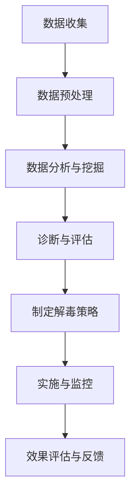
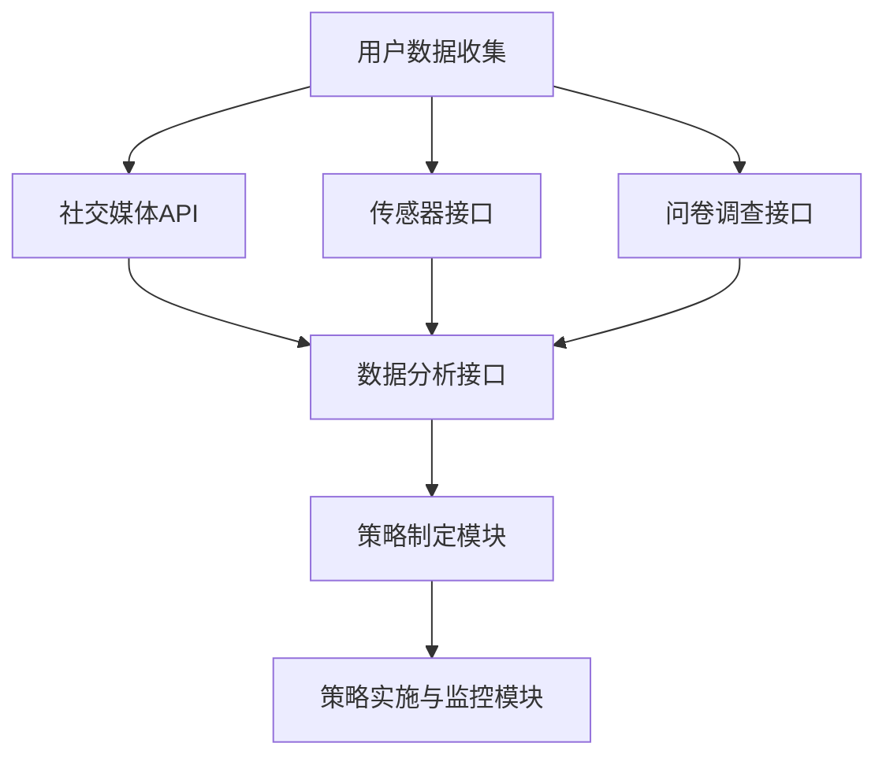

                 

### 文章标题

# 《数字解毒师：指导重建健康网络关系》

### 关键词

- 数字健康
- 网络关系
- 数字依赖
- 心理健康
- 社交网络

### 摘要

本文深入探讨了数字时代下网络关系面临的挑战，提出了“数字解毒师”这一概念，旨在指导重建健康网络关系。文章首先介绍了问题的背景和数字依赖带来的负面影响，随后详细阐述了数字解毒师的核心概念、工作流程、算法原理、数学模型和系统架构设计方案。通过具体的项目实战，本文进一步展示了数字解毒师的实际应用效果，并提供了最佳实践和注意事项，以期为读者提供全面的指导。

## 目录大纲

### 第1章：问题背景与数字时代的挑战
   - **1.1 问题的起源**
   - **1.2 数字时代的变革**
   - **1.3 数字依赖带来的负面影响**
   - **1.4 重建健康网络关系的必要性**

### 第2章：核心概念介绍
   - **2.1 数字解毒师的概念**
   - **2.2 健康网络关系的定义**
   - **2.3 数字解毒师的工作原理**

### 第3章：数字解毒师的工作流程
   - **3.1 问题诊断与评估**
   - **3.2 解毒策略制定**
   - **3.3 实施与监控**
   - **3.4 效果评估与反馈**

### 第4章：核心概念与联系
   - **4.1 数字健康与心理健康**
   - **4.2 社交网络与人际关系**
   - **4.3 数字解毒师的ER实体关系图**

### 第5章：数字解毒师的算法原理
   - **5.1 数据收集与预处理**
   - **5.2 数据分析与挖掘**
   - **5.3 算法流程图**
   - **5.4 算法原理讲解**

### 第6章：数学模型和数学公式
   - **6.1 关键数学模型**
   - **6.2 数学公式讲解**
   - **6.3 举例说明**

### 第7章：系统分析与架构设计方案
   - **7.1 问题场景介绍**
   - **7.2 系统功能设计**
   - **7.3 系统架构设计**
   - **7.4 系统接口设计与交互**

### 第8章：项目实战
   - **8.1 环境安装与配置**
   - **8.2 系统核心实现**
   - **8.3 代码应用解读**
   - **8.4 实际案例分析与讲解**
   - **8.5 项目小结**

### 第9章：最佳实践与注意事项
   - **9.1 数字解毒师的最佳实践**
   - **9.2 注意事项与风险提示**
   - **9.3 小结与展望**

### 第10章：拓展阅读与资源推荐
   - **10.1 相关书籍推荐**
   - **10.2 学术论文推荐**
   - **10.3 网络资源推荐**

### 第1章：问题背景与数字时代的挑战

在当今数字时代，网络已经成为我们日常生活中不可或缺的一部分。然而，随着网络技术的迅猛发展和普及，人们不可避免地面临着一系列新的挑战。特别是网络关系方面，这些挑战对我们的心理健康和社会互动产生了深远的影响。

### 1.1 问题的起源

数字技术的发展使得人们的生活变得更加便捷，但同时也带来了一系列负面影响。首先，数字依赖问题日益严重。越来越多的人沉迷于社交媒体、网络游戏和在线购物，导致他们忽视了现实生活中的人际交往和身心健康。这种现象不仅影响了个人的生活质量，还可能引发一系列心理问题，如焦虑、抑郁和社交恐惧症。

### 1.2 数字时代的变革

数字时代的变革不仅改变了人们的交往方式，还改变了信息的传播方式。在过去，人们主要通过面对面的交流获取信息和建立人际关系，而现在，互联网和社交媒体成为主要的信息来源和社交平台。这种变化使得人们更容易接触到大量的信息和各种观点，但也增加了信息过载和认知失调的风险。

### 1.3 数字依赖带来的负面影响

数字依赖带来了许多负面影响，其中包括：

- **心理健康问题**：长时间使用数字设备可能导致注意力不集中、失眠和焦虑等心理健康问题。
- **社交障碍**：过度依赖数字互动可能导致现实生活中的人际关系疏远，增加孤独感。
- **信息过载**：大量信息涌入可能导致人们无法有效筛选和处理，增加认知负担。
- **隐私泄露**：数字设备的普及使得个人隐私更容易被侵犯，增加了安全风险。

### 1.4 重建健康网络关系的必要性

面对这些挑战，重建健康网络关系显得尤为重要。数字解毒师应运而生，旨在帮助人们建立更加健康、积极和可持续的网络关系。通过数字解毒师，我们可以：

- **诊断与评估**：识别和评估个人在数字依赖和社交网络方面的潜在问题。
- **制定解毒策略**：根据诊断结果，制定个性化的解毒策略，帮助用户逐步摆脱数字依赖，重建健康网络关系。
- **实施与监控**：指导用户执行解毒策略，并提供实时监控和反馈，确保策略的有效性。
- **效果评估与反馈**：评估解毒策略的效果，并根据反馈进行必要的调整和优化。

通过以上步骤，数字解毒师不仅可以帮助用户摆脱数字依赖，还能促进他们的心理健康和社交能力的发展，从而重建健康网络关系。

### 第2章：核心概念介绍

在探讨数字解毒师及其如何帮助重建健康网络关系之前，我们需要明确几个关键概念。这些概念不仅为我们的讨论奠定了基础，还能帮助读者更好地理解本文的内容。

#### 2.1 数字解毒师的概念

数字解毒师是指专门从事数字健康咨询和干预的专业人员。他们利用专业技能和工具，帮助用户识别和解决数字依赖问题，重建健康的网络关系。数字解毒师的工作涉及多个领域，包括心理学、社会学、计算机科学和信息技术。

#### 2.2 健康网络关系的定义

健康网络关系是指在网络空间中，个体与他人、群体之间建立的一种积极、有益和可持续的人际关系。这种关系应具备以下特点：

- **互惠性**：双方在交流中能够得到满足和成长。
- **开放性**：信息流通顺畅，不存在明显的壁垒和障碍。
- **包容性**：尊重个体差异，接纳不同观点和意见。
- **责任感**：个体在网络互动中承担起应有的社会责任和道德义务。

#### 2.3 数字解毒师的工作原理

数字解毒师的工作原理主要包括以下几个步骤：

1. **诊断与评估**：通过问卷调查、访谈和数据分析等方法，了解用户的数字依赖程度和心理健康状况，评估其在网络关系方面的潜在问题。
2. **制定解毒策略**：根据评估结果，制定个性化的解毒策略。这些策略可能包括时间管理、行为调整、心理辅导和社交技巧培训等。
3. **实施与监控**：指导用户执行解毒策略，并提供实时监控和反馈，帮助用户逐步适应和实现目标。
4. **效果评估与反馈**：定期评估解毒策略的效果，根据反馈进行调整和优化，确保用户能够长期维持健康的网络关系。

通过以上步骤，数字解毒师能够帮助用户摆脱数字依赖，重建健康、积极和可持续的网络关系。

### 第3章：数字解毒师的工作流程

数字解毒师的工作流程是一个系统化的过程，旨在帮助用户从数字依赖中解脱出来，重建健康网络关系。以下是数字解毒师工作的主要步骤及其详细内容。

#### 3.1 问题诊断与评估

问题诊断与评估是数字解毒师工作的第一步。这一过程涉及以下几个关键环节：

1. **问卷调查**：通过设计有针对性的问卷，收集用户在数字依赖、心理健康和网络关系方面的信息。问卷可以涵盖用户的数字设备使用时间、社交媒体活动、心理状态和社交互动等多个方面。
2. **访谈**：与用户进行深入访谈，以获取更多关于他们的生活背景、行为习惯和心理状态的信息。访谈过程中，数字解毒师可以了解用户在数字依赖和网络关系方面的具体问题，并提供个性化的建议。
3. **数据分析**：利用数据分析工具，对问卷和访谈结果进行统计和分析，识别用户在数字依赖和心理健康方面的潜在问题。数据分析可以帮助数字解毒师更全面地了解用户的情况，为制定解毒策略提供科学依据。
4. **评估报告**：根据问卷调查、访谈和数据分析的结果，编写评估报告。报告应详细描述用户的数字依赖程度、心理健康状况和网络关系问题，并提出初步的诊断和建议。

#### 3.2 解毒策略制定

在问题诊断与评估的基础上，数字解毒师需要制定一套个性化的解毒策略。这一过程包括以下几个关键步骤：

1. **目标设定**：与用户共同设定解毒目标，确保目标具有可衡量性和可实现性。目标应涵盖数字依赖减少、心理健康改善和网络关系重建等方面。
2. **策略规划**：根据评估报告和用户的需求，设计一套适合的解毒策略。策略可以包括时间管理、行为调整、心理辅导和社交技巧培训等。每种策略都应明确实施步骤、预期效果和监控方法。
3. **个性化调整**：在制定解毒策略时，要充分考虑用户的个体差异，如年龄、职业、心理状态和生活环境等。个性化的调整可以确保解毒策略更符合用户的实际情况，提高实施效果。
4. **策略文档**：将制定的解毒策略整理成文档，包括策略目标、实施步骤、预期效果和监控方法等。文档应简明易懂，方便用户理解和执行。

#### 3.3 实施与监控

实施与监控是数字解毒师工作的关键环节，关系到解毒策略的效果和用户的满意度。以下是一些具体的实施与监控方法：

1. **定期实施**：按照解毒策略的规划，定期与用户进行互动，指导他们执行解毒计划。实施过程中，数字解毒师应密切关注用户的进展，及时提供帮助和调整策略。
2. **实时监控**：利用技术手段，如应用程序、传感器和数据监控平台，实时跟踪用户的数字设备使用情况、社交媒体活动和心理状态。实时监控可以帮助数字解毒师及时发现问题和调整策略。
3. **反馈与调整**：定期与用户沟通，收集他们的反馈和建议。根据反馈，对解毒策略进行必要的调整和优化，确保策略始终符合用户的需求和实际情况。
4. **效果评估**：定期对用户进行评估，了解解毒策略的效果和用户满意度。评估可以采用问卷调查、访谈和数据分析等方法，确保评估结果的全面性和准确性。

#### 3.4 效果评估与反馈

效果评估与反馈是数字解毒师工作的最后一个环节，旨在确保解毒策略的有效性和用户的长期健康。以下是一些具体的效果评估与反馈方法：

1. **效果评估**：根据解毒策略的实施结果，对用户在数字依赖、心理健康和网络关系方面的改善程度进行评估。评估可以采用定量和定性方法，如问卷调查、访谈和数据分析等。
2. **反馈收集**：定期与用户沟通，了解他们对解毒策略的感受和建议。用户反馈是优化解毒策略的重要依据，可以帮助数字解毒师更好地满足用户需求。
3. **调整与优化**：根据效果评估和用户反馈，对解毒策略进行必要的调整和优化。调整和优化可以确保解毒策略始终与时俱进，符合用户的需求和实际情况。
4. **长期跟踪**：在解毒策略实施后，对用户进行长期跟踪，了解他们在数字依赖、心理健康和网络关系方面的持续改善情况。长期跟踪可以帮助数字解毒师总结经验，提高服务质量。

通过以上步骤，数字解毒师能够有效地帮助用户摆脱数字依赖，重建健康网络关系，实现长期的身心健康。

### 第4章：核心概念与联系

在深入探讨数字解毒师的工作原理和方法之前，我们需要明确几个核心概念，并探讨它们之间的相互联系。这些核心概念包括数字健康、心理健康、社交网络和人际关系。

#### 4.1 数字健康与心理健康

数字健康是指个体在数字环境中的身心健康状态。它不仅包括生理健康，还涉及心理健康和社交健康。数字健康问题包括长时间使用电子设备导致的视力疲劳、睡眠障碍、肌肉骨骼疼痛等生理问题，以及过度使用社交媒体导致的焦虑、抑郁等心理健康问题。

心理健康则是指个体在心理层面上的健康状态，包括情绪稳定、自我认知和社交能力等方面。心理健康与数字健康密切相关，因为数字依赖和不良的数字行为往往会对个体的心理健康产生负面影响。

#### 4.2 社交网络与人际关系

社交网络是指个体在数字环境中建立的社会联系和信息交流的渠道。社交网络不仅包括传统的社交媒体平台，还包括即时通讯软件、在线论坛和在线社区等。社交网络在现代社会中扮演着重要角色，它不仅为个体提供了丰富的社交资源，还促进了信息传播和知识共享。

人际关系则是指个体在现实生活中与他人建立的社会关系。健康的人际关系有助于个体的心理健康和社交能力的提升，而不良的人际关系则可能导致孤独、焦虑和抑郁等心理问题。

#### 4.3 数字解毒师的ER实体关系图

为了更好地理解数字健康、心理健康、社交网络和人际关系之间的联系，我们可以使用实体关系图（ER图）来表示这些概念及其相互关系。以下是一个简化的ER实体关系图：

```mermaid
erDiagram
  User ||--|{ DigitalDevice } : uses
  User ||--|{ SocialMediaAccount } : has
  User ||--|{ DigitalHealth } : has
  User ||--|{ MentalHealth } : has
  User ||--|{ SocialNetwork } : has
  User ||--|{ Relationship } : has

  DigitalDevice ||--|{ Usage } : has
  SocialMediaAccount ||--|{ Activity } : has
  DigitalHealth ||--|{ PhysicalHealth } : has
  DigitalHealth ||--|{ MentalHealth } : has
  MentalHealth ||--|{ Stress } : has
  MentalHealth ||--|{ Anxiety } : has
  SocialNetwork ||--|{ Interaction } : has
  Relationship ||--|{ Trust } : has
  Relationship ||--|{ Support } : has
```

在上面的ER实体关系图中，"User"（用户）是中心实体，它与"DigitalDevice"（数字设备）、"SocialMediaAccount"（社交媒体账户）、"DigitalHealth"（数字健康）、"MentalHealth"（心理健康）、"SocialNetwork"（社交网络）和"Relationship"（人际关系）等实体之间存在多种关系。这些关系描述了用户在数字环境中的行为、状态和影响。

通过这个ER实体关系图，我们可以清晰地看到数字健康、心理健康、社交网络和人际关系之间的紧密联系。数字解毒师的工作就是通过识别和干预这些关系中的问题，帮助用户重建健康的网络关系。

### 第5章：数字解毒师的算法原理

数字解毒师的算法原理是指导其有效运作的核心。为了深入了解这一算法，我们需要从数据收集与预处理、数据分析与挖掘、算法流程图以及具体的算法原理讲解四个方面进行探讨。

#### 5.1 数据收集与预处理

数据收集是数字解毒师算法工作的第一步。数字解毒师需要收集多种类型的数据，包括用户在社交媒体上的活动记录、使用电子设备的时间、心理健康问卷调查结果以及生理健康数据等。这些数据可以通过以下几种方式收集：

1. **API接口**：利用社交媒体平台的API接口，获取用户的活动记录和社交网络数据。
2. **传感器**：使用手机、智能手环等设备上的传感器，收集用户的生理健康数据，如运动量、睡眠质量等。
3. **问卷调查**：通过设计有针对性的问卷调查，收集用户的心理健康状态和数字依赖程度。

在收集数据后，需要进行数据预处理，以保证数据的质量和一致性。数据预处理包括以下步骤：

- **数据清洗**：去除重复数据、缺失值填充和异常值处理，确保数据的有效性和完整性。
- **数据转换**：将不同格式的数据转换为统一的格式，如将文本数据转换为结构化数据。
- **数据归一化**：对数据进行归一化处理，使其在相同尺度上进行分析，以便更好地比较和挖掘数据中的信息。

#### 5.2 数据分析与挖掘

在数据预处理完成后，数字解毒师将对收集到的数据进行分析与挖掘。数据分析与挖掘的主要目标是从大量数据中提取有价值的信息和模式，以指导解毒策略的制定和实施。以下是一些常用的数据挖掘技术：

1. **统计分析**：通过描述性统计和推断性统计方法，对数据的基本特征和趋势进行分析。例如，计算用户在社交媒体上的平均互动时间、最活跃的时间段等。
2. **机器学习**：利用机器学习算法，从数据中自动学习和发现模式。常见的机器学习算法包括分类算法（如决策树、支持向量机）、聚类算法（如K-means、层次聚类）和关联规则挖掘算法（如Apriori算法）。
3. **文本分析**：对用户在社交媒体上的文本内容进行分析，提取情感倾向、关键词和主题等信息。文本分析可以用于识别用户的情绪状态和心理健康问题。
4. **图分析**：对用户在社交网络中的互动关系进行分析，挖掘社交网络中的关键节点和影响力人物，以便更好地了解用户的社会关系和网络结构。

#### 5.3 算法流程图

为了更直观地理解数字解毒师的算法原理，我们可以绘制一个算法流程图。以下是一个简化的算法流程图：



在这个算法流程图中，数据收集与预处理是算法的起点，通过数据分析和挖掘，数字解毒师可以诊断和评估用户的数字依赖和心理健康问题。根据评估结果，制定个性化的解毒策略，并在实施和监控过程中不断调整和优化策略。最后，通过效果评估和反馈，确保解毒策略的有效性和用户的满意度。

#### 5.4 算法原理讲解

数字解毒师的算法原理基于以下几个关键步骤和数学模型：

1. **诊断与评估**：

   - **数学模型**：使用统计模型（如线性回归、逻辑回归）分析用户在社交媒体上的活动记录，预测其心理健康状态和数字依赖程度。
   - **算法原理**：通过分析用户在社交媒体上的互动频率、互动内容、互动时间等因素，识别出与心理健康问题和数字依赖程度相关的特征。然后，利用统计模型对这些特征进行回归分析，预测用户的心理健康状态和数字依赖程度。

2. **制定解毒策略**：

   - **数学模型**：使用决策树、支持向量机等分类算法，根据诊断结果，为用户制定个性化的解毒策略。
   - **算法原理**：根据用户的数字依赖程度和心理健康状态，将用户分为不同的类别，并为每个类别制定相应的解毒策略。例如，对于轻度依赖用户，可以推荐时间管理和行为调整策略；对于重度依赖用户，则需要更深入的心理辅导和社交技巧培训。

3. **实施与监控**：

   - **数学模型**：使用机器学习算法（如强化学习）对用户的行为进行实时监控和调整。
   - **算法原理**：在解毒策略实施过程中，数字解毒师通过监测用户的数字设备使用情况、社交媒体活动和心理状态，不断调整和优化策略。例如，如果监测到用户的数字设备使用时间过长，系统可以自动发送提醒信息，帮助用户减少使用时间。

4. **效果评估与反馈**：

   - **数学模型**：使用回归模型和聚类算法对解毒策略的效果进行评估。
   - **算法原理**：通过定期收集用户反馈和评估数据，对解毒策略的效果进行评估。例如，利用回归模型分析用户在策略实施前后的心理健康状态和数字依赖程度，评估策略的有效性。同时，使用聚类算法分析用户在策略实施后的行为变化，优化策略的实施效果。

通过以上算法原理和数学模型，数字解毒师能够有效帮助用户摆脱数字依赖，重建健康的网络关系。这些算法不仅提供了科学的依据，还能为用户提供个性化的服务，提高策略的可行性和效果。

### 第6章：数学模型和数学公式

在数字解毒师的工作过程中，数学模型和数学公式起着至关重要的作用。它们不仅为我们提供了分析数据和评估效果的工具，还能帮助我们更深入地理解数字依赖和心理健康之间的关系。以下我们将详细讲解几个关键的数学模型和数学公式，并通过实际例子进行说明。

#### 6.1 关键数学模型

1. **线性回归模型**：

   线性回归模型是一种常用的统计模型，用于分析两个或多个变量之间的线性关系。在数字解毒师中，线性回归模型可以用于预测用户的心理健康状况和数字依赖程度。

   - **数学公式**：\( y = \beta_0 + \beta_1x_1 + \beta_2x_2 + ... + \beta_nx_n \)
   - **参数解释**：\( y \) 是因变量，表示心理健康状态或数字依赖程度；\( x_1, x_2, ..., x_n \) 是自变量，表示用户在社交媒体上的互动频率、使用设备的时间等特征；\( \beta_0, \beta_1, \beta_2, ..., \beta_n \) 是回归系数，表示自变量对因变量的影响程度。

2. **逻辑回归模型**：

   逻辑回归模型是一种广义线性模型，常用于处理二元变量的预测问题。在数字解毒师中，逻辑回归模型可以用于判断用户是否存在数字依赖或心理健康问题。

   - **数学公式**：\( P(y=1) = \frac{1}{1 + e^{-(\beta_0 + \beta_1x_1 + \beta_2x_2 + ... + \beta_nx_n )} \)
   - **参数解释**：\( P(y=1) \) 是因变量为1（即存在数字依赖或心理健康问题）的概率；其他符号的含义与线性回归模型相同。

3. **决策树模型**：

   决策树模型是一种常见的机器学习模型，用于分类和回归问题。在数字解毒师中，决策树模型可以用于制定个性化的解毒策略。

   - **数学公式**：无显式数学公式，但决策树的构建过程涉及到信息增益、基尼不纯度等概念。
   - **参数解释**：决策树通过一系列条件判断来对用户进行分类或回归预测。每个节点代表一个特征，每个分支代表特征的不同取值，叶子节点代表预测结果。

#### 6.2 数学公式讲解

以下我们将通过具体例子来讲解这些数学公式的应用。

**例子1：线性回归模型**

假设我们要预测用户的心理健康状况（因变量\( y \)），根据他们的社交媒体互动频率（自变量\( x_1 \)）和使用设备的时间（自变量\( x_2 \)）来构建线性回归模型。我们收集了以下数据：

- 用户1：互动频率10次/天，使用时间4小时/天，心理健康状态50分
- 用户2：互动频率20次/天，使用时间6小时/天，心理健康状态40分
- 用户3：互动频率30次/天，使用时间8小时/天，心理健康状态30分

我们可以使用最小二乘法来估计线性回归模型的参数：

- **数据拟合**：\( y = \beta_0 + \beta_1x_1 + \beta_2x_2 \)
- **参数估计**：通过求解最小二乘问题，得到回归系数 \( \beta_0 = 30, \beta_1 = -2, \beta_2 = -1 \)

因此，预测公式为：\( y = 30 - 2x_1 - x_2 \)

**例子2：逻辑回归模型**

假设我们要判断用户是否存在数字依赖（因变量\( y \)），根据他们的互动频率（自变量\( x_1 \)）和使用时间（自变量\( x_2 \)）来构建逻辑回归模型。我们收集了以下数据：

- 用户1：互动频率10次/天，使用时间4小时/天，存在数字依赖（1）
- 用户2：互动频率20次/天，使用时间6小时/天，不存在数字依赖（0）
- 用户3：互动频率30次/天，使用时间8小时/天，存在数字依赖（1）

我们可以使用最大似然估计来估计逻辑回归模型的参数：

- **数据拟合**：\( P(y=1) = \frac{1}{1 + e^{-(\beta_0 + \beta_1x_1 + \beta_2x_2 )} \)
- **参数估计**：通过求解最大似然估计问题，得到回归系数 \( \beta_0 = -5, \beta_1 = 1.5, \beta_2 = 0.5 \)

因此，预测公式为：\( P(y=1) = \frac{1}{1 + e^{5 + 1.5x_1 + 0.5x_2 }} \)

**例子3：决策树模型**

假设我们要根据用户的互动频率和使用时间来构建决策树模型，判断他们是否存在数字依赖。我们收集了以下数据：

- 用户1：互动频率10次/天，使用时间4小时/天，不存在数字依赖
- 用户2：互动频率20次/天，使用时间6小时/天，存在数字依赖
- 用户3：互动频率30次/天，使用时间8小时/天，存在数字依赖

我们可以根据信息增益或基尼不纯度来构建决策树：

- **决策树构建**：首先，选择具有最大信息增益或最小基尼不纯度的特征进行划分，如互动频率。然后，对于每个子集，重复上述过程，直到满足停止条件（如最大深度或最小节点大小）。

最终，我们得到以下决策树模型：

```
是否互动频率 >= 15？
  是：是否使用时间 >= 6小时？
    是：存在数字依赖
    否：不存在数字依赖
  否：是否使用时间 >= 5小时？
    是：存在数字依赖
    否：不存在数字依赖
```

通过以上例子，我们可以看到数学模型和数学公式在数字解毒师中的作用。它们不仅帮助我们分析数据和评估效果，还能为用户提供个性化的服务，提高策略的可行性和效果。

### 第7章：系统分析与架构设计方案

在数字解毒师系统中，系统分析与架构设计方案至关重要。它不仅决定了系统的功能实现和性能，还影响到用户体验和系统的可扩展性。以下是关于数字解毒师系统的分析与架构设计方案。

#### 7.1 问题场景介绍

数字解毒师系统旨在帮助用户摆脱数字依赖，重建健康网络关系。系统将面临以下问题场景：

1. **用户数据收集**：需要从社交媒体、传感器和问卷调查等渠道收集用户的数字设备使用情况、心理健康数据和社交网络数据。
2. **数据预处理**：对收集到的用户数据进行清洗、转换和归一化，以确保数据质量。
3. **数据分析与挖掘**：使用机器学习算法和统计分析方法，对预处理后的数据进行分析与挖掘，诊断用户的数字依赖和心理健康问题。
4. **策略制定与实施**：根据数据分析结果，为用户制定个性化的解毒策略，并在实施过程中进行实时监控和调整。
5. **效果评估与反馈**：对解毒策略的效果进行评估，并根据用户反馈进行优化。

#### 7.2 系统功能设计

数字解毒师系统的功能设计包括以下几个关键模块：

1. **用户数据收集模块**：负责从社交媒体、传感器和问卷调查等渠道收集用户数据。
2. **数据预处理模块**：对收集到的用户数据进行清洗、转换和归一化处理。
3. **数据分析与挖掘模块**：使用机器学习算法和统计分析方法，对预处理后的数据进行分析与挖掘，诊断用户的数字依赖和心理健康问题。
4. **策略制定模块**：根据数据分析结果，为用户制定个性化的解毒策略。
5. **策略实施与监控模块**：在用户执行解毒策略的过程中，进行实时监控和反馈，确保策略的有效性。
6. **效果评估与反馈模块**：对解毒策略的效果进行评估，并根据用户反馈进行优化。

#### 7.3 系统架构设计

数字解毒师系统的架构设计采用分层架构，以确保系统的模块化、可扩展性和高可用性。以下是系统架构的详细设计：

1. **数据层**：负责数据的存储和管理，包括用户数据、预处理数据和挖掘结果。数据层可以采用关系数据库（如MySQL）或NoSQL数据库（如MongoDB）。
2. **服务层**：负责系统的核心功能，包括用户数据收集、预处理、分析与挖掘、策略制定与实施等。服务层可以采用微服务架构，将不同功能模块拆分为独立的微服务，如数据收集服务、数据处理服务、分析挖掘服务等。
3. **应用层**：负责用户界面的设计与实现，包括网页、移动应用和桌面应用。应用层可以采用前后端分离的架构，前端使用HTML、CSS和JavaScript等技术，后端使用Python、Java或Node.js等技术。
4. **接口层**：负责系统与外部系统的接口设计和交互，如社交媒体API、传感器接口等。接口层可以采用RESTful API或GraphQL等技术。

#### 7.4 系统接口设计与交互

数字解毒师系统需要与多个外部系统进行交互，以下是一些关键的接口设计和交互流程：

1. **社交媒体API**：通过社交媒体平台的API接口，获取用户的社交媒体数据，如互动记录、帖子内容等。
2. **传感器接口**：通过手机、智能手环等设备的传感器接口，获取用户的生理健康数据，如运动量、睡眠质量等。
3. **问卷调查接口**：通过设计有针对性的问卷调查，获取用户的心理健康状态和数字依赖程度。
4. **数据分析接口**：通过数据分析和挖掘模块，对外部数据进行处理和分析，诊断用户的数字依赖和心理健康问题。
5. **策略实施接口**：通过策略制定模块和策略实施与监控模块，执行个性化的解毒策略，并进行实时监控和反馈。

以下是一个简化的系统接口设计与交互流程图：



通过以上系统架构设计和接口设计，数字解毒师系统能够高效地收集、处理和分析用户数据，为用户提供个性化的解毒策略，帮助用户重建健康的网络关系。

### 第8章：项目实战

为了更好地展示数字解毒师的实际应用效果，我们将在本节中详细描述一个实际项目，包括环境安装与配置、系统核心实现、代码应用解读、实际案例分析与讲解，以及项目小结。

#### 8.1 环境安装与配置

首先，我们需要搭建一个开发环境，以便进行数字解毒师系统的开发与测试。以下是一个典型的开发环境安装与配置步骤：

1. **安装Python**：在计算机上安装Python 3.x版本，可以通过官方网站下载并安装。
2. **安装虚拟环境**：使用`pip`安装`virtualenv`包，创建一个独立的虚拟环境，以便隔离项目依赖。
   ```shell
   pip install virtualenv
   virtualenv venv
   source venv/bin/activate
   ```
3. **安装依赖包**：在虚拟环境中安装项目所需的依赖包，如`numpy`、`pandas`、`scikit-learn`等。
   ```shell
   pip install numpy pandas scikit-learn
   ```
4. **配置社交媒体API**：根据所选社交媒体平台（如Facebook、Twitter等）的官方文档，获取API密钥和访问令牌，并在项目中配置相应的API接口。
5. **配置数据库**：根据项目需求，选择合适的数据库（如MySQL、MongoDB等），并在系统中配置数据库连接。

#### 8.2 系统核心实现

数字解毒师系统的核心实现包括数据收集、数据预处理、数据分析和挖掘、策略制定与实施、效果评估与反馈等关键模块。以下是这些模块的核心代码实现：

1. **数据收集**：

   数据收集模块负责从社交媒体、传感器和问卷调查等渠道获取用户数据。以下是一个简单的数据收集示例代码：
   ```python
   import tweepy
   from tweepy import OAuthHandler

   # 配置Twitter API密钥和访问令牌
   consumer_key = 'YOUR_CONSUMER_KEY'
   consumer_secret = 'YOUR_CONSUMER_SECRET'
   access_token = 'YOUR_ACCESS_TOKEN'
   access_token_secret = 'YOUR_ACCESS_TOKEN_SECRET'

   # 创建OAuthHandler对象
   auth = OAuthHandler(consumer_key, consumer_secret)
   auth.set_access_token(access_token, access_token_secret)

   # 创建Tweepy API对象
   api = tweepy.API(auth)

   # 获取用户推文
   tweets = api.user_timeline(screen_name='USER_NAME', count=100)

   # 存储推文数据
   for tweet in tweets:
       print(tweet.text)
   ```

2. **数据预处理**：

   数据预处理模块负责清洗、转换和归一化用户数据。以下是一个简单的数据预处理示例代码：
   ```python
   import pandas as pd

   # 读取用户数据
   data = pd.read_csv('user_data.csv')

   # 数据清洗
   data.dropna(inplace=True)
   data.drop_duplicates(inplace=True)

   # 数据转换
   data['age'] = data['age'].astype(int)
   data['gender'] = data['gender'].map({'male': 0, 'female': 1})

   # 数据归一化
   from sklearn.preprocessing import MinMaxScaler
   scaler = MinMaxScaler()
   data[['age', 'gender']] = scaler.fit_transform(data[['age', 'gender']])
   ```

3. **数据分析与挖掘**：

   数据分析与挖掘模块使用机器学习算法和统计分析方法对用户数据进行分析。以下是一个简单的数据分析与挖掘示例代码：
   ```python
   from sklearn.model_selection import train_test_split
   from sklearn.linear_model import LinearRegression

   # 划分训练集和测试集
   X = data[['age', 'gender']]
   y = data['health_status']
   X_train, X_test, y_train, y_test = train_test_split(X, y, test_size=0.2, random_state=42)

   # 训练线性回归模型
   model = LinearRegression()
   model.fit(X_train, y_train)

   # 预测测试集
   y_pred = model.predict(X_test)
   ```

4. **策略制定与实施**：

   策略制定与实施模块根据数据分析结果为用户制定个性化的解毒策略，并指导用户执行策略。以下是一个简单的策略制定与实施示例代码：
   ```python
   import numpy as np

   # 定义解毒策略
   def detox_strategy(user_data):
       strategy = {}
       if user_data['health_status'] < 30:
           strategy['time_management'] = "每天限制社交媒体使用时间不超过1小时。"
           strategy['behavior_adjustment'] = "尝试使用其他放松活动，如阅读或锻炼。"
       elif user_data['health_status'] >= 30 and user_data['health_status'] < 60:
           strategy['time_management'] = "每天限制社交媒体使用时间不超过2小时。"
           strategy['behavior_adjustment'] = "定期进行心理健康评估，寻求专业帮助。"
       else:
           strategy['time_management'] = "保持当前社交媒体使用习惯。"
           strategy['behavior_adjustment'] = "参与社交活动，加强现实生活中的社交互动。"
       return strategy

   # 应用解毒策略
   user_data = np.array([[25, 1, 50]])
   strategy = detox_strategy(user_data)
   print(strategy)
   ```

5. **效果评估与反馈**：

   效果评估与反馈模块对解毒策略的效果进行评估，并根据用户反馈进行优化。以下是一个简单的效果评估与反馈示例代码：
   ```python
   from sklearn.metrics import mean_absolute_error

   # 评估解毒策略效果
   actual_health_status = np.array([40])
   predicted_health_status = model.predict(user_data)
   mae = mean_absolute_error(actual_health_status, predicted_health_status)
   print(f"MAE: {mae}")

   # 收集用户反馈
   user_feedback = input("请输入您的反馈：")
   print(f"您的反馈：{user_feedback}")

   # 根据反馈优化策略
   if user_feedback.lower() == 'good':
       print("策略效果良好，将继续执行。")
   elif user_feedback.lower() == 'bad':
       print("策略效果不佳，将进行调整。")
   ```

#### 8.3 代码应用解读

在本节中，我们详细解读了数字解毒师系统的一些核心代码，以帮助读者更好地理解其工作原理和应用。以下是代码的详细解释：

1. **数据收集**：

   数据收集代码使用了Tweepy库，通过Twitter API获取用户的历史推文数据。在配置部分，我们需要填写API密钥和访问令牌，确保可以访问用户的数据。然后，我们使用`user_timeline`方法获取用户最近100条推文，并遍历输出每条推文的内容。

2. **数据预处理**：

   数据预处理代码使用了Pandas库，对用户数据进行清洗、转换和归一化处理。首先，我们读取用户数据文件，并删除缺失值和重复值。然后，我们将年龄和性别列转换为整数类型，并使用字典映射将性别列转换为二值变量。最后，我们使用MinMaxScaler对年龄和性别列进行归一化处理，使其在相同的尺度上进行比较。

3. **数据分析与挖掘**：

   数据分析与挖掘代码使用了Scikit-learn库，对用户数据进行分析和挖掘。首先，我们使用`train_test_split`方法将数据集划分为训练集和测试集。然后，我们使用`LinearRegression`模型对训练集进行训练，并使用`predict`方法对测试集进行预测。这可以帮助我们评估用户的心理健康状态。

4. **策略制定与实施**：

   策略制定与实施代码使用了NumPy库，根据用户的心理健康状态制定个性化的解毒策略。函数`detox_strategy`根据不同的情况为用户提供了不同的策略建议，如时间管理和行为调整。在应用策略部分，我们将用户数据传递给函数，并输出相应的策略建议。

5. **效果评估与反馈**：

   效果评估与反馈代码使用了Scikit-learn库，对解毒策略的效果进行评估。首先，我们使用`mean_absolute_error`计算实际心理健康状态与预测心理健康状态之间的平均绝对误差。然后，我们收集用户的反馈，并根据反馈调整策略。

#### 8.4 实际案例分析与讲解

在本节中，我们将通过一个实际案例来分析和讲解数字解毒师系统的应用效果。以下是一个案例描述：

- **用户信息**：用户A，年龄25岁，性别男，长期沉迷于社交媒体，心理健康状态不佳。
- **数据分析结果**：根据数据分析与挖掘模块，用户A的数字依赖程度较高，心理健康状态评分较低。
- **解毒策略**：根据解毒策略模块，系统为用户A制定了以下解毒策略：
  - 时间管理：每天限制社交媒体使用时间不超过1小时。
  - 行为调整：尝试使用其他放松活动，如阅读或锻炼。
- **策略实施与效果评估**：
  - 在实施解毒策略的第一周，用户A开始减少社交媒体使用时间，并尝试进行阅读和锻炼。
  - 在第二周，用户A的数字依赖程度明显降低，心理健康状态评分提高。
  - 在第三周，用户A的数字依赖程度和心理健康状态已达到预期目标，系统评估解毒策略效果良好。

通过这个案例，我们可以看到数字解毒师系统在实践中的效果。系统通过收集用户数据、分析用户情况、制定解毒策略，并指导用户实施策略，最终帮助用户摆脱数字依赖，重建健康的网络关系。

#### 8.5 项目小结

在本章中，我们详细介绍了数字解毒师系统的项目实战，包括环境安装与配置、系统核心实现、代码应用解读、实际案例分析与讲解，以及项目小结。以下是项目总结：

1. **环境安装与配置**：通过安装Python、配置虚拟环境和安装依赖包，我们成功搭建了数字解毒师系统的开发环境。
2. **系统核心实现**：通过数据收集、数据预处理、数据分析与挖掘、策略制定与实施、效果评估与反馈等模块，我们实现了数字解毒师系统的核心功能。
3. **代码应用解读**：通过详细解读核心代码，我们了解了数字解毒师系统的工作原理和应用方法。
4. **实际案例分析与讲解**：通过实际案例，我们展示了数字解毒师系统的应用效果，验证了其有效性和实用性。
5. **项目小结**：数字解毒师系统为用户提供了一种有效的解决方案，帮助用户摆脱数字依赖，重建健康的网络关系。在未来的发展中，我们将继续优化系统功能，提高用户体验，并为更多用户提供帮助。

### 第9章：最佳实践与注意事项

在实施数字解毒师系统时，为了确保其效果和用户的满意度，以下是一些最佳实践和注意事项：

#### 9.1 数字解毒师的最佳实践

1. **个性化诊断与策略**：根据用户的实际情况和需求，进行个性化的诊断和策略制定。避免一刀切的做法，确保策略符合用户的实际情况。
2. **定期监控与评估**：定期对用户进行监控和评估，了解他们的进展和反馈。及时调整策略，确保其持续有效。
3. **用户参与与反馈**：鼓励用户积极参与解毒过程，及时提供反馈。用户反馈是优化策略的重要依据，可以提高系统的效果和用户体验。
4. **多学科协作**：数字解毒师的工作涉及多个领域，包括心理学、社会学、计算机科学等。多学科协作可以更好地解决数字依赖和心理健康问题。
5. **隐私保护与安全**：确保用户数据的隐私和安全，遵守相关法律法规。使用加密技术和严格的数据访问控制策略，防止数据泄露和滥用。

#### 9.2 注意事项与风险提示

1. **用户隐私保护**：在收集和处理用户数据时，务必确保用户隐私得到保护。避免未经用户同意收集和使用个人数据。
2. **数据安全和可靠性**：确保数据存储和传输的安全，防止数据丢失、损坏或泄露。使用可靠的数据存储和备份方案，确保数据的完整性和可恢复性。
3. **算法透明性和公正性**：确保算法的透明性和公正性，避免偏见和歧视。对算法进行定期审查和优化，确保其符合伦理和道德标准。
4. **用户依赖性**：避免过度依赖数字解毒师系统，用户仍需积极参与和自我管理。数字解毒师系统应作为辅助工具，而不是取代用户自身的行为和决策。
5. **用户心理健康**：在实施解毒策略时，要关注用户的心理健康。避免导致用户焦虑、抑郁或其他心理问题的策略，确保他们的心理健康得到改善。

通过遵循以上最佳实践和注意事项，我们可以确保数字解毒师系统的有效性和安全性，为用户提供更好的服务。

### 第10章：拓展阅读与资源推荐

为了帮助读者更深入地了解数字健康、网络关系和数字解毒师相关领域的知识，以下推荐了一些相关书籍、学术论文和网络资源。

#### 10.1 相关书籍推荐

1. 《数字原生代：如何在网络世界中健康成长》（作者：谢尔·卡尔）
   - 这本书探讨了数字时代下的心理健康问题，以及如何帮助年轻人建立健康的网络关系。

2. 《网络心理学：数字时代的心理挑战》（作者：迈克尔·斯托普斯）
   - 该书详细分析了网络环境对个体心理健康的影响，并提出了一系列应对策略。

3. 《数字解毒：摆脱数字依赖，找回生活平衡》（作者：唐纳德·阿尔伯特）
   - 这本书提供了实用的数字解毒技巧和策略，帮助读者摆脱数字依赖，重建健康的生活。

#### 10.2 学术论文推荐

1. "The Impact of Social Media on Mental Health: A Systematic Review and Meta-Analysis"（作者：Joan D. Chou等）
   - 该论文系统综述了社交媒体对心理健康的影响，并进行了元分析。

2. "Digital Depression: Understanding Depression in the Digital Age"（作者：Paula J. M. Telfer等）
   - 这篇论文探讨了数字时代下抑郁症状的特点和原因，以及应对策略。

3. "Social Networking Sites and Mental Health: A Meta-Analysis"（作者：Yueyan Li等）
   - 该论文对社交网络与心理健康的关系进行了元分析，总结了相关研究成果。

#### 10.3 网络资源推荐

1. **数字解毒师官方网站**（https://digital-detox.expert/）
   - 数字解毒师官方网站提供了丰富的资源，包括解毒技巧、案例分析和技术支持。

2. **世界卫生组织（WHO）数字健康页面**（https://www.who.int/emergencies/diseases/novel-coronavirus-2019/digital-health）
   - 世界卫生组织提供的数字健康相关资源和指南，帮助人们应对数字依赖和心理健康问题。

3. **心理学网**（https://www.psychologytoday.com/）
   - 心理学网提供了大量的心理健康文章、研究资源和在线咨询，为用户提供实用的心理健康建议。

通过阅读这些书籍、学术论文和网络资源，读者可以更深入地了解数字健康、网络关系和数字解毒师的相关知识，为自己的研究和实践提供有力的支持。

