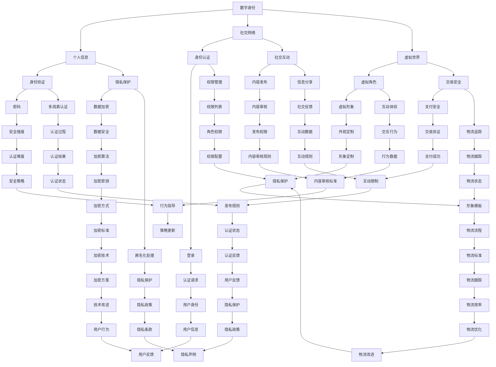

                 


### 文章标题: 数字身份管理平台：虚拟世界中的个人品牌塑造

> 关键词：数字身份管理，个人品牌塑造，虚拟世界，技术架构，安全隐私

> 摘要：本文将深入探讨数字身份管理平台在虚拟世界中的个人品牌塑造作用。首先，文章将对数字身份管理平台进行概述，介绍其基本架构和功能模块。接着，分析数字身份管理平台在个人品牌塑造中的关键角色，探讨其在虚拟世界中的特性与实践。最后，探讨数字身份管理平台在现实世界中的应用场景与案例，为读者提供全面的视角。

### 目录大纲

----------------------------------------------------------------

# 第一部分: 数字身份管理平台概述

## 1.1 互联网时代的数字身份管理

### 1.1.1 数字身份管理的重要性

数字身份管理是现代网络社会中不可或缺的一部分，它关乎用户的网络安全、隐私保护和用户体验。随着互联网的普及和数字化进程的加速，数字身份管理的重要性日益凸显。

### 1.1.2 数字身份管理的挑战

数字身份管理面临诸多挑战，包括安全性问题、隐私保护问题以及身份认证的复杂性。如何解决这些问题成为数字身份管理发展的关键。

### 1.1.3 数字身份管理的现状

目前，数字身份管理已取得一定成果，但仍需不断完善。许多企业和组织开始意识到数字身份管理的重要性，并积极投入相关技术的研发与应用。

## 1.2 个人品牌塑造的背景与意义

### 1.2.1 个人品牌的概念

个人品牌是指个人在公众中的形象、声誉和影响力。随着社交媒体的兴起，个人品牌塑造变得愈发重要。

### 1.2.2 个人品牌塑造的重要性

个人品牌塑造对于个人职业发展、社会认可度以及商业机会具有重要意义。

### 1.2.3 数字身份管理对个人品牌塑造的影响

数字身份管理为个人品牌塑造提供了基础保障，有助于提升个人在虚拟世界中的影响力和信誉度。

## 1.3 数字身份管理平台的基本架构

### 1.3.1 平台的技术架构

数字身份管理平台的技术架构包括身份认证、用户数据管理、隐私保护等多个方面。

### 1.3.2 平台的功能模块

数字身份管理平台包含用户身份认证、用户数据管理、权限控制等功能模块。

### 1.3.3 平台的技术选型

平台的技术选型需考虑安全性、可扩展性、易用性等因素。

## 1.4 虚拟世界中的个人品牌塑造策略

### 1.4.1 虚拟世界中的个人品牌特性

虚拟世界中的个人品牌具有虚拟性、可塑性和动态性等特点。

### 1.4.2 个人品牌塑造的关键要素

个人品牌塑造的关键要素包括定位、内容创作、传播与推广等。

### 1.4.3 虚拟世界中的个人品牌塑造实践

在虚拟世界中，个人品牌塑造需结合虚拟世界的特性进行策略规划。

## 1.5 本章小结

本文对数字身份管理平台进行了概述，并探讨了其在个人品牌塑造中的作用。接下来，本文将深入解析数字身份管理平台的核心概念，为后续讨论奠定基础。

----------------------------------------------------------------

### 第一部分: 数字身份管理平台概述

#### 1.1 互联网时代的数字身份管理

随着互联网技术的飞速发展，数字身份管理成为了现代网络社会的重要组成部分。数字身份管理，简单来说，是指对用户在数字世界中的身份进行识别、认证和管理的活动。它关乎用户的网络安全、隐私保护和用户体验，是互联网时代不可或缺的一环。

#### 1.1.1 数字身份管理的重要性

数字身份管理的重要性主要体现在以下几个方面：

1. **网络安全**：数字身份管理能够有效防范黑客攻击、网络诈骗等安全威胁，保障用户的数字资产安全。
2. **隐私保护**：通过数字身份管理，用户可以控制个人信息的使用和分享，降低隐私泄露的风险。
3. **用户体验**：良好的数字身份管理能够简化用户的登录流程，提高使用数字服务的便捷性和效率。

#### 1.1.2 数字身份管理的挑战

数字身份管理虽然重要，但也面临诸多挑战：

1. **安全性问题**：随着网络攻击手段的日益复杂，如何确保数字身份的安全性成为一个难题。
2. **隐私保护问题**：数字身份管理需要平衡用户隐私保护和数据利用的需求，这无疑增加了技术实现的复杂性。
3. **身份认证的复杂性**：不同场景下，身份认证的需求和方式各异，如何设计灵活且高效的认证系统是一个挑战。

#### 1.1.3 数字身份管理的现状

目前，数字身份管理已经取得了一定的成果。许多企业和组织开始意识到数字身份管理的重要性，并积极投入相关技术的研发与应用。例如，一些大型互联网公司已经推出了自己的数字身份管理解决方案，如腾讯的“微信身份认证”、阿里巴巴的“阿里云身份认证”等。同时，各国政府和国际组织也在积极推进数字身份管理标准的制定和推广，如国际电信联盟（ITU）的“数字身份指南”等。

然而，数字身份管理仍需不断完善。一方面，技术不断发展，新的安全威胁和隐私保护问题不断涌现，需要持续的技术创新和改进。另一方面，用户对于数字身份管理的需求也在不断变化，如何更好地满足用户的需求，提供更加便捷、安全的数字身份管理服务，是数字身份管理发展的关键。

#### 1.2 个人品牌塑造的背景与意义

个人品牌塑造在当今社会的重要性日益凸显，尤其是在虚拟世界中。个人品牌，是指个人在公众中的形象、声誉和影响力。一个鲜明的个人品牌能够帮助个人在职场、社交和商业领域获得更多的机会和认可。

#### 1.2.1 个人品牌的概念

个人品牌的概念可以从以下几个方面来理解：

1. **形象**：个人品牌是个人形象的外在体现，包括外貌、行为举止、衣着打扮等。
2. **声誉**：个人品牌是个人声誉的积累，是公众对个人能力和品格的评价。
3. **影响力**：个人品牌是个人影响力的来源，能够影响他人的思想和行为。

#### 1.2.2 个人品牌塑造的重要性

个人品牌塑造的重要性主要体现在以下几个方面：

1. **职业发展**：一个良好的个人品牌能够为个人的职业发展提供有力支持，帮助个人获得更多的职业机会和更高的职位。
2. **社会认可度**：个人品牌能够提升个人在社会中的认可度，增强个人的社会影响力。
3. **商业机会**：个人品牌是商业机会的重要来源，有助于个人在商业活动中获得更多的资源和支持。

#### 1.2.3 数字身份管理对个人品牌塑造的影响

数字身份管理对个人品牌塑造有着深远的影响：

1. **身份认证**：数字身份管理提供了可靠的认证手段，确保个人在虚拟世界中的身份真实性和一致性，有助于树立个人品牌。
2. **隐私保护**：数字身份管理能够有效保护个人隐私，避免个人隐私泄露对个人品牌造成的负面影响。
3. **信息传播**：数字身份管理有助于个人在虚拟世界中的信息传播，提升个人品牌的影响力和知名度。

#### 1.3 数字身份管理平台的基本架构

数字身份管理平台是一个复杂的系统，它涉及到多个技术领域，包括身份认证、用户数据管理、隐私保护等。一个完整的数字身份管理平台通常包括以下基本架构：

##### 1.3.1 平台的技术架构

数字身份管理平台的技术架构包括以下几个关键组成部分：

1. **身份认证系统**：负责对用户身份进行验证和确认，确保用户身份的真实性和唯一性。
2. **用户数据管理系统**：负责存储和管理用户的基本信息和行为数据，提供数据查询、统计和分析等功能。
3. **隐私保护系统**：负责保护用户的隐私数据，防止数据泄露和滥用。
4. **权限控制系统**：负责对用户访问权限进行管理和控制，确保用户只能访问授权的资源。

##### 1.3.2 平台的功能模块

数字身份管理平台的功能模块主要包括以下几类：

1. **用户身份认证模块**：负责用户的登录、注册、身份验证等功能，确保用户身份的真实性和一致性。
2. **用户数据管理模块**：负责存储、管理和查询用户的基本信息和行为数据，提供用户数据的备份和恢复功能。
3. **隐私保护模块**：负责保护用户的隐私数据，包括数据加密、访问控制、审计追踪等。
4. **权限控制模块**：负责管理用户的权限，包括用户角色的划分、权限的分配和回收等。

##### 1.3.3 平台的技术选型

数字身份管理平台的技术选型需要综合考虑以下几个方面：

1. **安全性**：平台应选择成熟、可靠的安全技术，如身份认证、数据加密、安全传输等，确保用户身份和数据的安全。
2. **可扩展性**：平台应具备良好的可扩展性，能够支持用户数量的增长和业务需求的扩展。
3. **易用性**：平台应提供简单、直观的用户界面和友好的用户体验，方便用户使用和管理。

#### 1.4 虚拟世界中的个人品牌塑造策略

在虚拟世界中，个人品牌塑造有着独特的挑战和机遇。虚拟世界的特性，如虚拟性、匿名性和互动性，使得个人品牌塑造需要采取不同的策略。

##### 1.4.1 虚拟世界中的个人品牌特性

虚拟世界中的个人品牌具有以下几个特性：

1. **虚拟性**：个人品牌在虚拟世界中是虚拟的，不受现实世界的物理限制，具有更多的创意空间和表达方式。
2. **匿名性**：虚拟世界中的用户可以匿名存在，个人品牌的建立和传播相对更具隐蔽性。
3. **互动性**：虚拟世界中的用户可以实时互动，个人品牌可以通过互动提高影响力和知名度。

##### 1.4.2 个人品牌塑造的关键要素

个人品牌塑造的关键要素包括以下几个方面：

1. **定位**：明确个人品牌的定位，确定品牌的目标受众和核心价值观。
2. **内容创作**：创作高质量、有价值的内容，展现个人的专业知识和独特见解。
3. **传播与推广**：利用社交媒体、虚拟社区等平台，将个人品牌传播给目标受众。

##### 1.4.3 虚拟世界中的个人品牌塑造实践

在虚拟世界中，个人品牌塑造可以采取以下实践策略：

1. **构建专业形象**：通过专业的内容创作和互动，树立个人在专业领域的权威形象。
2. **参与社区活动**：积极参与虚拟社区的讨论和活动，扩大个人品牌的影响范围。
3. **利用多媒体手段**：利用短视频、直播、虚拟现实等多媒体手段，增强个人品牌的吸引力。

#### 1.5 本章小结

本文对数字身份管理平台进行了概述，分析了其在个人品牌塑造中的作用。数字身份管理平台不仅为个人品牌提供了基础保障，也提供了更多的可能性。在接下来的章节中，本文将进一步探讨数字身份管理平台的核心概念、架构设计和应用实践。

----------------------------------------------------------------

## 1.4 虚拟世界中的个人品牌塑造策略

虚拟世界作为数字时代的一个重要组成部分，为个人品牌塑造提供了广阔的舞台。在这个虚拟的空间中，个人品牌的塑造不仅需要考虑其独特的特性，还需要结合虚拟世界的环境特点，制定合适的策略。

### 1.4.1 虚拟世界中的个人品牌特性

虚拟世界中的个人品牌具有以下几个显著特性：

1. **虚拟性**：虚拟世界的个人品牌不受现实世界的物理限制，可以自由创造和表达。这种虚拟性为个人品牌的多样化发展提供了无限可能。
2. **匿名性**：在虚拟世界中，用户通常可以匿名存在，这为个人品牌的建立提供了一定的隐蔽性。用户可以在保护隐私的前提下，探索和塑造自己的品牌。
3. **互动性**：虚拟世界中的用户可以实时互动，这种互动性使得个人品牌的影响力和知名度可以通过用户的反馈和互动得到迅速提升。

### 1.4.2 个人品牌塑造的关键要素

在虚拟世界中，个人品牌塑造需要重点关注以下几个关键要素：

1. **定位**：明确个人品牌的定位至关重要。在虚拟世界中，个人品牌定位需要考虑目标受众的喜好和需求，以及个人在虚拟环境中的独特价值。
2. **内容创作**：虚拟世界中的个人品牌需要通过高质量的内容创作来展现专业知识和独特见解。这些内容可以是文章、视频、直播等形式，关键在于能够吸引和留住目标受众。
3. **互动与社区建设**：虚拟世界中的互动和社区建设对于个人品牌的塑造具有重要意义。通过参与社区讨论、组织线上活动等方式，可以增强个人品牌的影响力和公信力。
4. **品牌形象的维护**：在虚拟世界中，个人品牌形象的建设和维护同样重要。用户需要通过一贯的行为和表现来维持自己的品牌形象，避免负面影响的传播。

### 1.4.3 虚拟世界中的个人品牌塑造实践

在虚拟世界中，个人品牌塑造可以采取以下实践策略：

1. **构建专业形象**：
   - 利用虚拟形象设计工具，打造符合个人定位和专业形象的虚拟形象。
   - 通过专业知识的分享和解答问题，展示个人在专业领域的深度和广度。

2. **参与社区活动**：
   - 积极参与虚拟社区的讨论和活动，与社区成员建立良好的互动关系。
   - 组织或参与线上研讨会、讲座等活动，提升个人品牌的知名度和影响力。

3. **利用多媒体手段**：
   - 创作并分享高质量的图文、视频内容，利用短视频、直播等形式，增强个人品牌的吸引力。
   - 利用虚拟现实（VR）技术，提供沉浸式的体验，使个人品牌更具吸引力。

4. **持续内容输出**：
   - 保持持续的内容输出，通过定期发布专业文章、视频等，维持品牌活跃度。
   - 与其他虚拟世界中的知名人士合作，共同制作内容，扩大个人品牌的影响力。

通过以上策略，个人品牌在虚拟世界中可以得到有效塑造和提升。同时，虚拟世界中的个人品牌塑造也需要不断适应和调整，以应对不断变化的技术和社会环境。

### 1.5 本章小结

本章节对虚拟世界中的个人品牌塑造策略进行了深入探讨。虚拟世界的特性为个人品牌塑造提供了新的机会和挑战。通过明确品牌定位、创作高质量内容、积极参与互动和利用多媒体手段，个人品牌在虚拟世界中可以塑造出独特且具有吸引力的形象。在接下来的章节中，本文将进一步解析数字身份管理平台的核心概念和架构设计，为读者提供更全面的视角。

----------------------------------------------------------------

## 2.1 数字身份的定义与属性

数字身份是用户在数字环境中的一种虚拟身份，用于标识和识别用户在互联网或其他数字平台上的活动。数字身份的定义和属性对于理解数字身份管理平台的工作原理至关重要。

### 2.1.1 数字身份的概念

数字身份的概念可以从以下几个方面来理解：

1. **虚拟标识**：数字身份是用户在数字环境中的一种虚拟标识，它代表了用户在虚拟世界中的存在。
2. **身份验证**：数字身份是通过一系列的身份验证机制来确认用户的身份，确保只有授权用户才能访问和使用数字资源。
3. **信息集合**：数字身份是一个包含用户个人信息、行为记录和历史活动的信息集合，这些信息有助于数字身份的管理和监控。

### 2.1.2 数字身份的属性

数字身份具有以下几个关键属性：

1. **唯一性**：每个用户在数字环境中都有一个唯一的数字身份，确保用户身份的可识别性。
2. **动态性**：数字身份是动态变化的，可以根据用户的需求和活动的变化进行调整。
3. **可验证性**：数字身份可以通过多种认证机制进行验证，确保只有合法用户才能获得访问权限。
4. **匿名性**：在某些情况下，数字身份可以为用户提供一定程度的匿名性，保护用户的隐私。
5. **持久性**：数字身份通常具有持久性，即使在用户更换设备或服务提供商时，其身份信息仍然保持一致。

### 2.1.3 数字身份的类型

数字身份可以按照不同的维度进行分类，常见的数字身份类型包括：

1. **静态身份**：静态身份通常是在用户注册时创建的，其信息相对固定，不常发生变化。
2. **动态身份**：动态身份是基于用户的实时行为和活动动态生成的，可以实时反映用户的状态。
3. **多因素身份**：多因素身份是结合多种身份验证方式（如密码、指纹、手机验证等）构建的，提高身份验证的可靠性。
4. **匿名身份**：匿名身份是用户在不需要暴露真实身份的情况下使用的身份，通常用于保护用户隐私。

### 数字身份属性对比表格

为了更清晰地理解数字身份的不同属性，我们可以通过以下表格进行对比：

| 属性     | 静态身份 | 动态身份 | 多因素身份 | 匿名身份 |
|----------|-----------|-----------|------------|-----------|
| 唯一性   | 是        | 是        | 是         | 否        |
| 动态性   | 否        | 是        | 是         | 否        |
| 可验证性 | 是        | 是        | 是         | 否        |
| 匿名性   | 否        | 否        | 否         | 是        |
| 持久性   | 是        | 是        | 是         | 否        |

### 数字身份的ER实体关系图架构

为了更好地理解数字身份的组成和关系，我们可以通过ER（实体关系）图来描述数字身份的实体及其关系：

```mermaid
erDiagram
    User ||--|{ Identity }|--| Role
    User ||--|{ Attribute }|--| AttributeType
    Identity ||--|{ Authentication }|--| AuthType
    Role ||--|{ Permission }|--| PermissionType
    Attribute ||--|{ AttributeValue }|--| AttributeValueType
```

在这个ER图中，`User`是用户实体，`Identity`是数字身份实体，`Role`是角色实体，`Attribute`是用户属性实体，`Authentication`是身份认证实体，`Permission`是权限实体，`AttributeValue`是属性值实体，`AttributeType`是属性类型实体，`AuthType`是认证类型实体，`PermissionType`是权限类型实体，`AttributeValueType`是属性值类型实体。这些实体之间的关系描述了数字身份管理的核心架构。

### 本章小结

本章节对数字身份的定义、属性和类型进行了详细阐述。数字身份是用户在数字环境中的虚拟标识，具有唯一性、动态性、可验证性、匿名性和持久性等属性。通过对比静态身份、动态身份、多因素身份和匿名身份，我们可以更好地理解不同类型数字身份的特性。ER实体关系图则提供了数字身份管理的架构视图，为后续章节的讨论奠定了基础。

----------------------------------------------------------------

## 2.2 数字身份的安全性问题

数字身份的安全问题是数字身份管理平台必须面对的重要挑战。随着互联网的普及和数字身份的应用日益广泛，数字身份的安全威胁也随之增加。本节将讨论数字身份的安全隐患、保护数字身份的关键技术以及相关的法律法规。

### 2.2.1 数字身份的安全隐患

数字身份的安全隐患主要包括以下几个方面：

1. **身份盗窃**：黑客通过非法手段获取用户的数字身份信息，从而冒充用户进行非法活动。
2. **身份泄露**：用户的数字身份信息在存储、传输过程中可能被非法窃取或泄露。
3. **身份篡改**：攻击者篡改用户的数字身份信息，使其变得不准确或不完整。
4. **身份锁定**：用户无法正常使用其数字身份，可能是因为账户被恶意锁定或被盗用。
5. **钓鱼攻击**：攻击者通过伪造的数字身份认证页面，诱骗用户输入真实的身份信息。

### 2.2.2 数字身份保护的关键技术

为了有效保护数字身份，需要采用一系列关键技术：

1. **多重认证**：通过多种认证方式（如密码、指纹、手机验证、生物识别等）来提高身份验证的可靠性。
2. **加密技术**：使用加密算法对用户身份信息进行加密，确保数据在传输和存储过程中的安全性。
3. **单点登录（SSO）**：通过SSO技术，用户只需登录一次，即可访问多个数字服务，减少密码泄露的风险。
4. **身份代理**：使用身份代理技术，为用户创建一个虚拟身份，避免直接暴露真实身份信息。
5. **隐私保护机制**：采用隐私保护技术，如数据脱敏、匿名化处理等，保护用户隐私不被泄露。

### 2.2.3 数字身份安全的法律法规

数字身份安全管理不仅需要依靠技术手段，还需要法律法规的支持。以下是一些与数字身份安全相关的法律法规：

1. **《通用数据保护条例》（GDPR）**：GDPR是欧盟制定的隐私保护法规，要求企业对用户数据负有严格的责任，保护用户的隐私和数据安全。
2. **《加州消费者隐私法案》（CCPA）**：CCPA是美国的隐私保护法规，规定了消费者对个人信息控制的权利，以及企业处理消费者个人信息的要求。
3. **《中华人民共和国网络安全法》**：该法律明确了网络运营者的安全保护义务，包括数据安全保护、用户个人信息保护等。

### 2.2.4 数字身份安全案例分析

以下是一个数字身份安全案例：

**案例**：某用户在一家电商平台上注册账户时，使用了简单的密码，并且没有开启双重认证。后来，该用户的账户被黑客成功攻破，导致账户内资金被盗。原因是黑客通过暴力破解算法，成功获取了用户的密码，然后通过非法手段获取了用户的其他个人信息。

**分析**：该案例中，用户没有采取有效的安全措施，如使用强密码、开启双重认证等，导致其数字身份易受攻击。此外，电商平台在用户身份信息保护方面也存在不足，没有采取有效的加密和多重认证措施。

**教训**：用户应采取强密码策略、开启双重认证等安全措施，提高数字身份的安全性。同时，电商平台和相关服务提供者应加强数字身份安全保护，采用先进的技术手段和严格的法律法规，确保用户数字身份的安全。

### 本章小结

本章节讨论了数字身份的安全性问题，包括安全隐患、保护技术和相关法律法规。数字身份的安全威胁日益增加，需要采用多重认证、加密技术、单点登录等关键技术进行保护。同时，法律法规的制定和执行也为数字身份安全管理提供了重要的保障。通过案例分析，我们可以看到数字身份安全的重要性，以及如何采取有效措施来提高数字身份的安全性。

----------------------------------------------------------------

## 2.3 数字身份与隐私保护

数字身份与隐私保护之间的关系紧密，数字身份的建立、使用和管理过程都涉及到个人隐私的保护。本节将探讨数字身份与隐私的关系，隐私保护面临的挑战以及相应的解决方案。

### 2.3.1 数字身份与隐私的关系

1. **数字身份的构建**：数字身份的构建通常需要收集用户的个人信息，如姓名、地址、联系方式等。这些信息是构建数字身份的基础，但同时也是个人隐私的核心组成部分。
2. **隐私泄露风险**：在数字身份的管理和使用过程中，个人隐私面临泄露的风险。例如，未经授权的访问、数据泄露、信息滥用等。
3. **隐私保护的重要性**：保护个人隐私对于维护用户信任、保障社会稳定具有重要意义。在数字身份管理中，必须高度重视隐私保护，确保用户个人信息的安全。

### 2.3.2 数字身份隐私保护的挑战

数字身份隐私保护面临以下挑战：

1. **数据收集与使用的平衡**：数字身份的构建需要收集大量用户数据，但如何在满足业务需求的同时，保护用户隐私，成为一大挑战。
2. **技术实现的复杂性**：隐私保护技术（如数据加密、匿名化处理等）在实现过程中存在一定的复杂性，如何高效且安全地应用这些技术，是一个挑战。
3. **法律法规的不完善**：虽然各国政府和国际组织已经制定了多项隐私保护法律法规，但法律法规的执行和监管仍存在一定的不完善，对隐私保护工作的推动形成了一定的阻碍。

### 2.3.3 隐私保护的解决方案

为了有效保护数字身份中的隐私，可以采取以下解决方案：

1. **数据最小化原则**：在收集用户数据时，遵循数据最小化原则，仅收集必要的个人信息，减少不必要的隐私泄露风险。
2. **数据加密技术**：使用数据加密技术对用户数据进行加密，确保数据在传输和存储过程中的安全性。常用的加密算法包括AES、RSA等。
3. **匿名化处理**：通过匿名化处理技术，将用户数据中的敏感信息进行脱敏，使其无法直接识别为特定个体。常用的匿名化技术包括K-anonymity、l-diversity等。
4. **隐私保护协议**：采用隐私保护协议（如差分隐私、同态加密等），在数据处理和分析过程中保护用户隐私。
5. **用户隐私管理**：提供用户隐私管理工具，使用户能够控制其个人数据的访问和使用，包括数据的查询、修改、删除等操作。
6. **隐私保护教育**：加强对用户隐私保护的宣传教育，提高用户对隐私保护的认识和意识，促使用户主动采取隐私保护措施。

### 2.3.4 隐私保护案例分析

以下是一个隐私保护案例：

**案例**：某社交平台因用户数据泄露事件引发关注。黑客通过非法手段获取了该平台的大量用户数据，包括用户姓名、电话号码、电子邮件地址等。这些数据被用于网络诈骗、广告骚扰等非法活动。

**分析**：该案例中，社交平台在数据收集和使用过程中，未能充分保护用户隐私。一方面，平台在用户注册时，强制要求用户提供过多个人信息，违反了数据最小化原则；另一方面，平台在数据存储和传输过程中，未能采用有效的加密和匿名化处理技术，导致用户数据容易被非法获取。

**教训**：该案例表明，数字身份管理平台在保护用户隐私方面，必须采取严格的数据收集和使用规范，并采用有效的数据加密和匿名化处理技术，确保用户数据的安全。

### 本章小结

数字身份与隐私保护密切相关，数字身份的构建和使用过程中，个人隐私面临严重威胁。为了有效保护用户隐私，需要采取数据最小化、数据加密、匿名化处理等技术措施，并加强用户隐私管理教育。通过案例分析和解决方案探讨，我们可以更好地理解数字身份隐私保护的重要性和实施方法。

----------------------------------------------------------------

## 2.4 数字身份管理的核心概念关联

数字身份管理是一个复杂而多层面的系统，涉及多个核心概念和它们之间的紧密关联。理解这些核心概念及其相互关系对于设计和实现一个高效、安全的数字身份管理平台至关重要。

### 2.4.1 数字身份与个人信息的关联

数字身份与个人信息紧密相关。个人信息是构建数字身份的基础，包括姓名、出生日期、住址、电话号码、电子邮件地址等。数字身份管理平台通过收集、存储和管理这些个人信息来构建和维护用户的数字身份。例如，当用户在某个平台上注册时，平台会收集用户的个人信息，并生成一个唯一的数字身份标识。

### 2.4.2 数字身份与社交网络的关联

社交网络是数字身份的重要应用场景之一。在社交网络中，用户的数字身份不仅用于身份验证，还用于社交互动和信息分享。数字身份管理平台需要确保用户在社交网络中的身份真实性和一致性。例如，当用户在社交平台上发布内容时，平台会验证其数字身份，确保只有授权用户才能发布和查看内容。

### 2.4.3 数字身份与虚拟世界的关联

虚拟世界为数字身份提供了新的应用场景，如虚拟现实（VR）和增强现实（AR）应用。在虚拟世界中，用户的数字身份可以表现为虚拟角色或头像，用于交互和体验虚拟环境。数字身份管理平台需要确保虚拟世界中的数字身份安全、一致且易于管理。例如，当用户在虚拟商店中购物时，平台会验证其数字身份，确保交易安全可靠。

### 数字身份管理平台核心概念关联图

为了更好地理解数字身份管理平台的核心概念及其关联，我们可以通过以下关联图来描述：



### 数字身份管理平台核心概念关联解析

- **数字身份（A）**：数字身份是用户在数字世界中的唯一标识，包括用户的个人信息和虚拟形象。
- **个人信息（B）**：个人信息是构建数字身份的基础，如姓名、地址、电话等，这些信息需要被加密和保护。
- **身份验证（E）**：身份验证是确保用户身份真实性的过程，包括密码、指纹、面部识别等。
- **隐私保护（F）**：隐私保护涉及数据加密、匿名化处理等技术，确保用户信息不被非法访问和使用。
- **社交网络（C）**：社交网络是数字身份的重要应用场景，用户在社交网络中的活动受到身份验证和隐私保护的约束。
- **虚拟世界（D）**：虚拟世界为数字身份提供了新的应用场景，用户在虚拟世界中的行为同样受到身份验证和隐私保护的约束。

通过上述核心概念及其关联，我们可以更清晰地理解数字身份管理平台的工作原理和关键要素。在设计和实现数字身份管理平台时，需要综合考虑这些核心概念及其相互关系，确保平台的安全性和用户体验。

### 本章小结

本章节讨论了数字身份管理平台的核心概念及其关联，包括数字身份、个人信息、身份验证、隐私保护、社交网络和虚拟世界等。通过ER实体关系图和关联图，我们深入分析了这些概念之间的关系和作用。理解这些核心概念及其关联对于设计和实现一个高效、安全的数字身份管理平台至关重要。在接下来的章节中，我们将进一步探讨数字身份管理平台的架构设计和实现。

----------------------------------------------------------------

## 2.5 本章小结

本章对数字身份管理平台的核心概念进行了深入解析，涵盖了数字身份的定义、属性、类型，数字身份管理中的安全性问题以及隐私保护的挑战和解决方案。通过详细分析，我们明确了数字身份与个人信息、社交网络和虚拟世界的紧密关联，并展示了这些核心概念之间的相互关系。

本章的主要贡献在于：

1. **明确概念**：对数字身份、个人信息、身份验证、隐私保护等核心概念进行了清晰界定，为后续讨论提供了基础。
2. **关联分析**：通过ER实体关系图和关联图，直观展示了数字身份管理平台中各个核心概念之间的关系，有助于读者更好地理解。
3. **安全隐私策略**：提出了数字身份安全性和隐私保护的解决方案，为数字身份管理平台的实际应用提供了指导。

然而，本章也存在一定的局限性：

1. **技术实现细节**：虽然讨论了数字身份管理的安全性和隐私保护，但未能深入探讨具体的技术实现细节，如加密算法、多因素认证等。
2. **实际案例缺失**：本章缺少对实际数字身份管理案例的详细分析，不利于读者对理论知识的实际应用理解。

在后续章节中，我们将继续探讨数字身份管理平台的架构设计，深入分析技术选型、安全架构以及具体应用场景，以期提供更全面、实用的指导。

----------------------------------------------------------------

## 3.1 平台架构设计原则

在设计和实现数字身份管理平台时，架构设计原则至关重要。这些原则不仅指导平台的整体设计，还确保平台的可扩展性、安全性和易用性。以下是数字身份管理平台架构设计的主要原则：

### 3.1.1 可扩展性

**原则描述**：数字身份管理平台应具备良好的可扩展性，以便在用户规模扩大、业务需求增加时，能够灵活地扩展系统功能和性能。

**实现方法**：
- **模块化设计**：将系统分解为多个独立模块，每个模块负责特定的功能，便于单独扩展和更新。
- **分布式架构**：采用分布式架构，将系统部署在多个服务器上，提高系统的负载能力和容错性。
- **微服务架构**：采用微服务架构，将系统拆分为多个微服务，每个微服务独立开发、部署和扩展，降低系统的耦合度。

### 3.1.2 安全性

**原则描述**：数字身份管理平台必须高度重视安全性，确保用户身份和数据的安全，防止非法访问和攻击。

**实现方法**：
- **多因素认证**：采用多因素认证机制，结合密码、指纹、手机验证等多种认证方式，提高身份验证的可靠性。
- **数据加密**：使用加密技术对用户数据和传输过程中的数据进行加密，确保数据在存储和传输过程中的安全性。
- **安全审计**：建立安全审计机制，对系统操作进行记录和监控，及时发现并处理安全事件。

### 3.1.3 易用性

**原则描述**：数字身份管理平台应提供简单、直观的用户界面和友好的用户体验，降低用户使用难度，提高用户满意度。

**实现方法**：
- **简洁界面设计**：设计简洁直观的用户界面，减少用户操作的复杂度，提高使用效率。
- **个性化设置**：提供个性化设置功能，允许用户自定义界面布局、通知偏好等，满足不同用户的需求。
- **帮助文档和教程**：提供详细的帮助文档和操作教程，帮助用户快速熟悉和使用平台。

### 3.1.4 系统整合性

**原则描述**：数字身份管理平台应能够与其他系统和服务无缝整合，实现数据的共享和互通。

**实现方法**：
- **API接口**：提供标准的API接口，便于与其他系统和服务进行数据交换和功能调用。
- **中间件**：采用中间件技术，实现不同系统之间的通信和整合，确保数据的一致性和可靠性。
- **数据同步**：建立数据同步机制，确保平台与其他系统之间的数据实时更新和同步。

### 3.1.5 高效性能

**原则描述**：数字身份管理平台应具备高效性能，能够快速响应用户请求，提供流畅的用户体验。

**实现方法**：
- **负载均衡**：采用负载均衡技术，将用户请求均匀分配到多个服务器上，提高系统的响应速度和处理能力。
- **缓存策略**：采用缓存策略，减少数据库的访问次数，提高系统的访问速度。
- **数据库优化**：优化数据库性能，如索引优化、查询优化等，确保数据的快速访问和操作。

### 3.1.6 可维护性

**原则描述**：数字身份管理平台应具备良好的可维护性，便于系统的维护和升级，确保系统的稳定运行。

**实现方法**：
- **模块化维护**：将系统分解为多个模块，便于独立维护和更新。
- **自动化测试**：建立自动化测试体系，确保每次系统更新和升级后的稳定性。
- **文档化**：编写详细的系统文档，包括设计文档、操作手册、维护指南等，便于维护人员理解和操作。

通过遵循以上架构设计原则，数字身份管理平台能够实现高效、安全、易用的目标，为用户提供优质的数字身份管理服务。在下一章节中，我们将进一步探讨数字身份管理平台的技术架构设计。

----------------------------------------------------------------

## 3.2 平台的技术架构设计

数字身份管理平台的技术架构设计是确保平台高效、安全、可靠运行的关键。一个合理的架构设计不仅能够满足当前的业务需求，还能够适应未来的扩展和变化。本节将详细讨论平台的技术架构设计思路、技术栈选择以及架构模块分解。

### 3.2.1 架构设计思路

数字身份管理平台的技术架构设计应遵循以下思路：

1. **分层设计**：采用分层设计模式，将系统划分为多个层次，包括表示层、业务逻辑层、数据访问层等，实现模块化设计，提高系统的可维护性和扩展性。
2. **分布式架构**：采用分布式架构，将系统部署在多个服务器上，通过负载均衡和分布式数据库技术，提高系统的性能和容错能力。
3. **微服务架构**：采用微服务架构，将系统拆分为多个微服务，每个微服务独立开发、部署和扩展，降低系统的耦合度，提高系统的灵活性和可维护性。
4. **安全性设计**：确保系统的安全性，包括用户身份认证、数据加密、安全审计等，防止非法访问和数据泄露。
5. **可扩展性和可维护性**：设计可扩展性和可维护性高的系统，以便在业务需求变化时能够快速响应和调整。

### 3.2.2 技术栈选择

数字身份管理平台的技术栈选择应综合考虑性能、安全性、可维护性和社区支持等因素。以下是一些关键技术栈的选择：

1. **前端技术**：选择React或Vue.js等现代前端框架，实现高效、响应式的用户界面。这些框架具有丰富的组件库和社区支持，便于开发和维护。
2. **后端技术**：选择Spring Boot或Django等现代后端框架，提供稳定、高效的服务端支持。这些框架具有成熟的生态系统和丰富的功能模块，便于快速开发和集成。
3. **数据库技术**：选择关系型数据库（如MySQL）和非关系型数据库（如MongoDB），分别用于存储用户信息和日志等数据。关系型数据库适用于结构化数据存储，非关系型数据库适用于海量数据的存储和查询。
4. **身份认证技术**：采用OAuth 2.0或JWT（JSON Web Tokens）等身份认证技术，确保用户身份的认证和授权安全。这些技术支持多种认证方式，如密码、短信验证码、多因素认证等。
5. **安全加密技术**：采用AES或RSA等加密算法，对用户数据进行加密，确保数据在传输和存储过程中的安全性。
6. **消息队列**：采用消息队列技术（如RabbitMQ或Kafka），实现系统内部的消息传递和异步处理，提高系统的性能和可扩展性。
7. **容器化和编排技术**：采用Docker和Kubernetes等技术，实现系统的容器化和编排，提高系统的部署效率和运维管理能力。

### 3.2.3 架构模块分解

数字身份管理平台可以分解为多个功能模块，每个模块负责特定的功能。以下是主要架构模块及其功能：

1. **用户身份认证模块**：负责用户的登录、注册、身份验证等功能。该模块应实现OAuth 2.0或JWT等身份认证技术，确保用户身份的安全和一致性。
2. **用户数据管理模块**：负责存储和管理用户的基本信息和行为数据。该模块应使用关系型数据库（如MySQL）存储结构化数据，并使用消息队列（如Kafka）实现数据的实时处理和同步。
3. **权限控制模块**：负责管理用户的权限，包括用户角色的划分、权限的分配和回收等。该模块应实现基于角色的访问控制（RBAC）机制，确保用户只能访问授权的资源。
4. **隐私保护模块**：负责保护用户的隐私数据，包括数据加密、访问控制、审计追踪等。该模块应采用数据加密技术（如AES或RSA）和安全审计机制，确保用户数据的安全和合规。
5. **日志和监控模块**：负责记录系统的操作日志和性能数据，并提供实时监控和报警功能。该模块应实现日志收集、存储和查询，并使用监控工具（如Prometheus和Grafana）进行实时监控和可视化。
6. **API接口模块**：负责提供标准化的API接口，实现与其他系统和服务的数据交换和功能调用。该模块应实现RESTful API设计，并使用Swagger等工具进行接口文档的生成和发布。
7. **分布式存储模块**：负责存储海量用户数据和非结构化数据。该模块应采用分布式数据库（如MongoDB）和分布式文件系统（如HDFS），实现数据的分布式存储和高可用性。

通过以上技术架构设计，数字身份管理平台能够实现高效、安全、可扩展的目标，为用户提供优质的数字身份管理服务。在下一章节中，我们将进一步探讨数字身份管理平台的具体功能模块设计。

----------------------------------------------------------------

## 3.3 平台的功能模块设计

数字身份管理平台的功能模块设计是确保平台能够满足用户需求、提供高质量服务的关键。以下是数字身份管理平台的主要功能模块及其具体设计：

### 3.3.1 用户身份认证模块

**模块功能**：用户身份认证模块负责用户的登录、注册、身份验证等功能。

**设计思路**：
- **多因素认证**：支持密码、短信验证码、电子邮件验证、指纹识别等多种认证方式，提高身份验证的可靠性。
- **OAuth 2.0**：采用OAuth 2.0协议，实现第三方账号登录，如微信、微博、QQ等，简化用户登录流程。
- **JWT**：使用JSON Web Tokens（JWT）进行身份验证和授权，确保用户身份的验证过程安全可靠。

**关键组件**：
- **认证服务器**：负责处理用户认证请求，包括验证用户身份、生成JWT等。
- **认证接口**：提供标准化的认证接口，实现与前端和第三方系统的交互。
- **认证存储**：存储用户认证信息，包括用户密码、认证状态等。

### 3.3.2 用户数据管理模块

**模块功能**：用户数据管理模块负责存储和管理用户的基本信息和行为数据。

**设计思路**：
- **关系型数据库**：使用关系型数据库（如MySQL）存储用户的基本信息，如姓名、邮箱、电话等。
- **非关系型数据库**：使用非关系型数据库（如MongoDB）存储用户的行为数据，如浏览记录、交易记录等。
- **数据加密**：对用户敏感信息（如密码）进行加密存储，确保数据在存储过程中的安全性。

**关键组件**：
- **用户信息存储**：负责存储和管理用户的基本信息，包括用户注册、信息修改、信息查询等操作。
- **行为数据存储**：负责存储和管理用户的行为数据，支持实时查询和分析。
- **数据同步机制**：实现用户数据在不同数据库之间的同步和更新，确保数据的一致性。

### 3.3.3 用户隐私保护模块

**模块功能**：用户隐私保护模块负责保护用户的隐私数据，确保用户数据的安全和合规。

**设计思路**：
- **数据加密**：采用加密技术（如AES或RSA）对用户数据进行加密，确保数据在传输和存储过程中的安全性。
- **访问控制**：实施基于角色的访问控制（RBAC）机制，确保用户只能访问授权的数据。
- **审计追踪**：记录用户数据访问和操作的历史记录，支持审计和追溯。

**关键组件**：
- **加密模块**：负责对用户数据进行加密和解密操作。
- **访问控制模块**：负责管理用户权限，控制用户对数据的访问。
- **审计模块**：负责记录和存储用户数据的访问和操作日志。

### 3.3.4 权限控制模块

**模块功能**：权限控制模块负责管理用户的权限，包括用户角色的划分、权限的分配和回收等。

**设计思路**：
- **基于角色的权限控制**：采用基于角色的访问控制（RBAC）机制，将用户划分为不同的角色，并分配相应的权限。
- **动态权限分配**：支持动态权限分配，根据用户的角色和操作，动态调整用户的权限。
- **权限校验**：在用户进行操作时，对用户的权限进行校验，确保用户只能执行授权的操作。

**关键组件**：
- **权限管理接口**：提供标准的权限管理接口，实现权限的分配、回收和查询。
- **权限校验模块**：负责对用户操作进行权限校验，确保用户只能执行授权的操作。
- **角色管理模块**：负责管理用户的角色，包括角色的创建、修改和删除等操作。

### 3.3.5 日志和监控模块

**模块功能**：日志和监控模块负责记录系统的操作日志和性能数据，并提供实时监控和报警功能。

**设计思路**：
- **日志收集**：采用日志收集工具（如Logstash）收集系统的操作日志和错误日志。
- **实时监控**：使用监控工具（如Prometheus和Grafana）实时监控系统的性能指标，并提供可视化界面。
- **报警机制**：实现实时报警机制，当系统出现异常时，自动发送报警通知。

**关键组件**：
- **日志收集器**：负责收集和存储系统日志。
- **监控服务器**：负责实时监控系统的性能指标，并提供可视化界面。
- **报警系统**：负责发送实时报警通知。

通过以上功能模块的设计，数字身份管理平台能够为用户提供高效、安全、可靠的数字身份管理服务。在下一章节中，我们将进一步探讨数字身份管理平台的安全架构设计。

----------------------------------------------------------------

## 3.4 平台的安全架构设计

数字身份管理平台的安全架构设计是确保用户数据安全、系统稳定运行的关键。一个健全的安全架构不仅能有效防止外部攻击，还能保障内部数据的安全和隐私。以下将详细讨论平台的安全威胁分析、安全防御机制以及安全监管与合规性。

### 3.4.1 安全威胁分析

在数字身份管理平台的设计过程中，安全威胁分析是至关重要的一环。通过对潜在威胁的分析，可以更好地制定防御策略。以下是一些常见的安全威胁：

1. **网络攻击**：包括DDoS攻击、SQL注入、跨站脚本（XSS）等，这些攻击手段可能导致系统服务中断、数据泄露等问题。
2. **身份窃取**：黑客通过破解密码、窃取用户身份认证信息，从而冒充用户进行非法操作。
3. **数据泄露**：未加密的数据在传输和存储过程中可能被黑客窃取，导致用户隐私泄露。
4. **内部威胁**：内部员工可能滥用权限，进行数据窃取、篡改等非法操作。
5. **恶意软件**：恶意软件（如木马、病毒）可能通过系统漏洞入侵，导致系统失控。

### 3.4.2 安全防御机制

为了应对上述安全威胁，数字身份管理平台需要采用一系列安全防御机制：

1. **身份认证与授权**：采用多因素认证（MFA）和基于角色的访问控制（RBAC）机制，确保用户身份的真实性和权限的有效性。
2. **数据加密**：对用户数据进行加密存储和传输，采用AES、RSA等加密算法，确保数据在存储和传输过程中的安全性。
3. **防火墙与入侵检测系统**：部署防火墙和入侵检测系统（IDS），实时监控网络流量，防止恶意攻击。
4. **安全审计与日志记录**：建立安全审计机制，记录系统操作日志，实时监控并分析潜在的安全事件。
5. **漏洞扫描与修复**：定期进行安全漏洞扫描，及时修复系统漏洞，防止攻击者利用漏洞入侵系统。

### 3.4.3 安全监管与合规性

数字身份管理平台的安全监管与合规性是确保系统合法运行的重要保障。以下是一些关键的安全监管和合规性要求：

1. **《通用数据保护条例》（GDPR）**：GDPR规定了个人数据的收集、处理和存储要求，企业需确保用户数据的安全和隐私。
2. **《加州消费者隐私法案》（CCPA）**：CCPA规定了消费者对个人数据的权利，企业需提供透明且易于理解的隐私政策，并遵守数据保护要求。
3. **《中华人民共和国网络安全法》**：网络安全法明确了网络运营者的安全保护义务，包括用户数据保护、网络安全监测等。
4. **行业规范**：根据不同行业的特殊性，遵守相关的行业安全规范和标准，如金融行业的PCI DSS、医疗行业的HIPAA等。

### 3.4.4 安全架构设计实施示例

以下是一个安全架构设计实施示例：

**步骤一：安全需求分析**
- 确定系统面临的安全威胁，包括网络攻击、身份窃取、数据泄露等。
- 分析系统内部可能存在的安全漏洞和风险。

**步骤二：安全架构设计**
- 设计多因素认证和基于角色的访问控制机制，确保用户身份和权限的有效性。
- 采用数据加密技术，对用户数据进行加密存储和传输。
- 部署防火墙和入侵检测系统，实时监控网络流量。
- 建立安全审计机制，记录系统操作日志。

**步骤三：安全实施与部署**
- 实现身份认证与授权模块，确保用户身份和权限的有效性。
- 实现数据加密模块，对用户数据进行加密存储和传输。
- 配置防火墙和入侵检测系统，实时监控网络流量。
- 建立安全审计机制，记录系统操作日志。

**步骤四：安全测试与评估**
- 进行安全漏洞扫描和渗透测试，评估系统的安全性和漏洞情况。
- 根据测试结果，及时修复系统漏洞，确保系统的安全性。

**步骤五：安全运营与监控**
- 建立安全运营团队，负责日常的安全监控和事件响应。
- 定期进行安全培训，提高员工的安全意识和技能。
- 实时监控系统性能和安全事件，确保系统的稳定运行。

通过以上步骤，数字身份管理平台能够实现全面的安全架构设计，为用户提供高效、安全的数字身份管理服务。在下一章节中，我们将进一步探讨虚拟世界中的个人品牌塑造实践。

----------------------------------------------------------------

## 4.1 虚拟世界的个人品牌特性分析

虚拟世界是一个与现实世界不同的数字空间，个人品牌在其中的塑造具有独特的特性。理解这些特性有助于制定有效的个人品牌塑造策略。以下是虚拟世界中个人品牌的主要特性：

### 4.1.1 虚拟世界的特点

虚拟世界具有以下几个显著特点：

1. **虚拟性**：虚拟世界中的个人品牌是虚拟的，不受现实世界的物理限制。这种虚拟性为个人品牌的多样化表达和创意发挥提供了广阔的空间。
2. **匿名性**：虚拟世界中的用户可以匿名存在，个人品牌的建立和传播相对更具隐蔽性。匿名性在一定程度上保护了用户的隐私，但也给品牌塑造带来了一定的挑战。
3. **互动性**：虚拟世界中的用户可以实时互动，这种互动性使得个人品牌的影响力可以通过用户的反馈和互动得到迅速提升。
4. **可塑性**：虚拟世界中的个人品牌可以通过数字技术进行定制和调整，使得品牌形象更加生动和富有吸引力。

### 4.1.2 虚拟世界中的个人品牌特性

在虚拟世界中，个人品牌具有以下特性：

1. **虚拟形象**：个人品牌在虚拟世界中的表现通常是虚拟形象，如虚拟主播、虚拟偶像等。虚拟形象可以个性化定制，更符合用户的喜好和期待。
2. **数字化内容**：个人品牌在虚拟世界中的塑造依赖于数字化内容，如短视频、直播、图文等。这些内容不仅能够展示个人才华，还能与用户进行互动。
3. **社区互动**：虚拟世界中的社区互动是个人品牌塑造的重要途径。通过参与社区讨论、组织活动等方式，个人品牌能够扩大其影响范围。
4. **技术依赖性**：虚拟世界中的个人品牌塑造高度依赖数字技术，如虚拟现实（VR）、增强现实（AR）等。这些技术能够提供沉浸式的体验，增强个人品牌的吸引力。

### 4.1.3 虚拟世界个人品牌塑造的挑战

尽管虚拟世界为个人品牌塑造提供了广阔的舞台，但也存在一些挑战：

1. **匿名性带来的风险**：虚拟世界中的匿名性可能使得品牌塑造过程中出现虚假信息、恶意评论等问题，影响品牌的信誉和形象。
2. **竞争激烈**：虚拟世界中个人品牌数量庞大，竞争异常激烈。个人品牌需要通过独特的内容和创新的技术手段脱颖而出。
3. **内容质量**：在虚拟世界中，高质量的内容是吸引和留住用户的关键。品牌塑造者需要持续创作有价值的内容，以满足用户的需求。
4. **技术更新换代**：虚拟世界的技术不断更新换代，品牌塑造者需要不断学习和适应新技术，否则可能被淘汰。

### 4.1.4 虚拟世界中的个人品牌特性对比表格

为了更清晰地理解虚拟世界中的个人品牌特性，我们可以通过以下表格进行对比：

| 特性             | 现实世界           | 虚拟世界           |
|------------------|--------------------|--------------------|
| 形象表现         | 外貌、穿着、行为   | 虚拟形象、数字内容 |
| 互动性           | 现实互动           | 社区互动、实时交流 |
| 可塑性           | 受限于现实条件     | 高度定制化         |
| 安全风险         | 主要是隐私泄露     | 虚拟欺诈、恶意评论 |
| 竞争环境         | 竞争较为平稳       | 竞争异常激烈       |
| 技术依赖性       | 较低               | 非常高             |

通过以上分析，我们可以看出虚拟世界中的个人品牌具有虚拟性、匿名性、互动性和可塑性等特性。这些特性为个人品牌塑造提供了新的机会和挑战。在下一章节中，我们将探讨虚拟世界中的个人品牌塑造策略。

----------------------------------------------------------------

## 4.2 虚拟世界中的个人品牌塑造策略

在虚拟世界中，个人品牌塑造的策略需要结合虚拟世界的特点，制定合适的内容创作、传播与推广计划，以及有效的个人品牌定位。以下将详细讨论这些策略。

### 4.2.1 个人品牌定位

个人品牌定位是品牌塑造的第一步，决定了品牌在虚拟世界中的形象和定位。定位应考虑以下几个方面：

1. **目标受众**：明确目标受众的需求和喜好，根据受众特点进行定位。例如，对于年轻用户群体，品牌形象可以更加时尚和活力。
2. **核心价值**：确定个人品牌的核心理念和价值观，使其在虚拟世界中具有独特的定位。例如，专业知识和创新思维可以作为品牌的核心价值。
3. **竞争环境**：分析竞争对手的品牌定位，寻找差异化定位，以在竞争激烈的环境中脱颖而出。

### 4.2.2 个人品牌内容创作

内容创作是个人品牌塑造的核心，优质的内容能够吸引和留住用户。以下是一些建议：

1. **多样化内容形式**：创作多样化的内容形式，如文章、短视频、直播、图文等，满足不同用户的需求。
2. **持续更新**：保持内容的持续更新，定期发布高质量的内容，以保持品牌活跃度和用户关注度。
3. **专业性**：内容应具有较高的专业性，展示个人在专业领域的知识和见解，增强品牌的专业形象。
4. **互动性**：内容应具备良好的互动性，鼓励用户参与讨论和互动，增强用户对品牌的忠诚度。

### 4.2.3 个人品牌传播与推广

个人品牌的传播与推广是扩大品牌影响力的重要手段。以下是一些建议：

1. **社交媒体平台**：利用社交媒体平台（如微博、抖音、B站等）进行品牌推广，通过发布高质量的内容吸引关注。
2. **合作与联盟**：与其他知名品牌或个人合作，通过跨界合作扩大品牌影响力。例如，可以与知名KOL进行合作，共同制作内容。
3. **社区活动**：积极参与虚拟社区的活动和讨论，通过互动和活动提升品牌知名度。例如，可以组织线上研讨会、讲座等活动。
4. **广告推广**：在合适的平台上进行广告推广，提高品牌的曝光率。例如，在热门的虚拟社区或直播平台上投放广告。

### 4.2.4 社交互动与用户关系管理

社交互动和用户关系管理是维护和提升品牌影响力的关键。以下是一些建议：

1. **及时回应**：及时回应用户的评论和提问，建立良好的用户关系。例如，可以在社交媒体平台上设置专门的用户服务账号，负责解答用户问题。
2. **用户反馈**：重视用户的反馈，根据用户需求调整品牌内容和策略。可以通过问卷调查、用户访谈等方式收集用户反馈。
3. **粉丝互动**：与粉丝进行深度互动，举办粉丝活动，如粉丝见面会、粉丝投票等，增强粉丝的归属感和忠诚度。

### 4.2.5 技术应用与创新

虚拟世界中的个人品牌塑造离不开技术的应用和创新。以下是一些建议：

1. **虚拟现实（VR）**：利用VR技术创造沉浸式的品牌体验，提高品牌的吸引力。例如，可以创建虚拟展览馆，展示品牌文化。
2. **增强现实（AR）**：利用AR技术增强品牌内容的表现力，提供新颖的用户体验。例如，可以通过AR技术为产品制作增强现实的宣传海报。
3. **人工智能（AI）**：利用AI技术分析用户行为和偏好，提供个性化的内容推荐和互动体验，提高用户体验。
4. **大数据分析**：利用大数据技术分析用户数据，了解用户需求和行为模式，优化品牌内容和推广策略。

通过以上策略，个人品牌在虚拟世界中可以塑造出独特且具有吸引力的形象，扩大品牌影响力。在下一章节中，我们将通过实际案例解析虚拟世界中的个人品牌塑造。

----------------------------------------------------------------

## 4.3 虚拟世界中的个人品牌塑造案例解析

在虚拟世界中，个人品牌的塑造已经成为许多成功人士的关键策略。以下我们将分析几个具有代表性的案例，探讨他们在虚拟世界中的个人品牌塑造策略和实践。

### 4.3.1 案例一：虚拟主播的个人品牌塑造

虚拟主播通过虚拟形象和数字化内容在虚拟世界中塑造个人品牌。以“Vtuber”（虚拟YouTuber）为例，这些虚拟主播通常由一个虚构的人物形象来呈现，通过直播、视频、音频等多种形式与观众互动。

**策略与实践**：
- **虚拟形象设计**：虚拟主播的形象设计非常关键，需要符合品牌定位和目标受众的喜好。例如，像“Hololive”的虚拟主播们都有独特的个性和风格。
- **内容创作**：虚拟主播通过制作有趣、有价值的视频内容来吸引粉丝。内容形式多样，包括游戏直播、舞蹈、音乐表演等。
- **互动与社区建设**：虚拟主播通过实时互动和社区建设来增强粉丝的参与感和忠诚度。例如，在直播过程中与粉丝互动，组织线下见面会等。

**案例分析**：
虚拟主播“Hololive”的成功在于其独特的虚拟形象和多样化的内容创作。通过定期更新和互动，他们成功吸引了大量的粉丝，并在虚拟世界中建立了强大的个人品牌。

### 4.3.2 案例二：虚拟偶像的个人品牌塑造

虚拟偶像是指通过数字化技术和虚拟形象在虚拟世界中创建的偶像形象。这些虚拟偶像通常具有独特的人物设定和故事背景，通过音乐、舞蹈、表演等方式与粉丝互动。

**策略与实践**：
- **音乐和表演**：虚拟偶像通常以音乐和表演为主要内容形式。他们发布原创歌曲、舞蹈视频，并通过直播和演出与粉丝互动。
- **故事背景**：虚拟偶像的故事背景设计是塑造品牌形象的重要一环。例如，偶像的背景故事、成长经历等，增强了粉丝的情感共鸣。
- **粉丝互动**：虚拟偶像通过社交媒体、直播平台等与粉丝进行互动，增强粉丝的归属感和忠诚度。

**案例分析**：
虚拟偶像“ Hatsune Miku”（初音未来）是虚拟偶像的成功代表。通过高质量的音乐作品和丰富的互动活动，初音未来在虚拟世界中赢得了大量粉丝，并成为了日本文化的一个重要现象。

### 4.3.3 案例三：虚拟企业的个人品牌塑造

虚拟企业是指通过数字化技术和虚拟形象在虚拟世界中创建的企业形象。这些虚拟企业可以提供虚拟商品和服务，并通过虚拟世界的营销和推广策略扩大品牌影响力。

**策略与实践**：
- **虚拟产品和服务**：虚拟企业通过虚拟商品和服务来吸引用户。例如，虚拟服装店、虚拟餐厅等。
- **数字化营销**：虚拟企业利用虚拟世界中的数字化营销手段，如虚拟广告、社交媒体推广等，提高品牌知名度。
- **用户互动**：虚拟企业通过虚拟社区的互动和用户反馈，收集用户需求，优化产品和服务。

**案例分析**：
虚拟企业“Second Life”（第二人生）是一个典型的例子。在“Second Life”中，用户可以创建虚拟角色，购买虚拟商品，参与虚拟活动。通过虚拟商品和服务的提供，以及与用户的互动，Second Life成功塑造了其品牌形象，吸引了大量用户。

### 总结

以上三个案例展示了虚拟世界中的个人品牌塑造策略和实践。虚拟主播、虚拟偶像和虚拟企业都通过独特的虚拟形象、高质量的内容创作、互动与社区建设等手段，成功塑造了个人品牌。这些案例表明，虚拟世界为个人品牌塑造提供了广阔的舞台，同时也需要结合虚拟世界的特性，制定合适的策略和实践。

在下一章节中，我们将探讨虚拟世界中的个人品牌塑造工具与平台，进一步了解虚拟世界中的品牌塑造工具和应用。

----------------------------------------------------------------

## 4.4 虚拟世界中的个人品牌塑造工具与平台

在虚拟世界中，个人品牌塑造工具与平台发挥着至关重要的作用。这些工具和平台提供了丰富的功能，帮助个人在虚拟环境中建立和提升品牌影响力。以下是几种常见的虚拟世界个人品牌塑造工具与平台。

### 4.4.1 个人品牌塑造工具介绍

1. **虚拟形象设计工具**：虚拟形象设计工具可以帮助用户创建独特的虚拟角色。这些工具通常包括面部特征、服装、配饰等设计功能。例如，Blender、Adobe Character Animator等都是常用的虚拟形象设计工具。

2. **视频制作与编辑工具**：视频制作与编辑工具是虚拟世界个人品牌塑造的重要工具。通过这些工具，用户可以制作高质量的视频内容，展示个人才华和专业性。常用的视频制作与编辑工具包括Adobe Premiere Pro、Final Cut Pro、DaVinci Resolve等。

3. **直播平台**：直播平台为个人品牌塑造提供了实时互动的机会。通过直播，用户可以与粉丝进行互动，分享生活点滴、专业知识和创意内容。知名的直播平台包括YouTube Live、Twitch、DouYu等。

4. **社交媒体平台**：社交媒体平台是个人品牌传播的重要渠道。通过这些平台，用户可以发布内容、与粉丝互动、推广个人品牌。例如，微博、抖音、Instagram、Twitter等都是常用的社交媒体平台。

### 4.4.2 个人品牌塑造平台应用

1. **虚拟现实（VR）平台**：虚拟现实平台为用户提供了沉浸式的品牌体验。通过VR平台，用户可以创建虚拟展览馆、虚拟商店等，展示个人品牌和文化。知名的VR平台包括Facebook Horizon、Oculus Rift、VRChat等。

2. **虚拟社交平台**：虚拟社交平台是个人品牌塑造的重要场所。在这些平台上，用户可以与其他虚拟角色互动，参与虚拟活动，扩大个人品牌的影响力。知名的虚拟社交平台包括Second Life、VRChat、Fortnite等。

3. **区块链平台**：区块链平台通过去中心化的方式，提供安全的数字身份认证和数据存储。用户可以在区块链平台上创建数字身份，发布内容，并获得数字资产。知名的区块链平台包括Ethereum、EOS、Tron等。

4. **虚拟直播平台**：虚拟直播平台为用户提供了虚拟直播的空间，通过虚拟直播，用户可以与观众互动，分享实时内容。虚拟直播平台如AltspaceVR、VTube Studio等，提供了丰富的直播工具和互动功能。

### 4.4.3 虚拟世界个人品牌塑造的未来趋势

1. **人工智能（AI）的应用**：随着人工智能技术的不断发展，虚拟世界中的个人品牌塑造将更加智能化。AI技术可以分析用户行为和偏好，提供个性化的内容推荐和互动体验。

2. **虚拟现实（VR）与增强现实（AR）的融合**：VR和AR技术的结合将为个人品牌塑造带来更多可能性。通过沉浸式体验和增强现实技术，用户可以更生动地展示个人品牌和才华。

3. **区块链技术的应用**：区块链技术将在个人品牌塑造中发挥越来越重要的作用。通过区块链，用户可以创建可信的数字身份，并获得数字资产和奖励。

4. **跨平台的整合**：未来，虚拟世界中的个人品牌塑造将更加跨平台整合。用户可以在不同的虚拟世界中创建和展示个人品牌，实现资源的共享和互通。

通过以上工具与平台的应用，个人品牌在虚拟世界中可以更加生动和有影响力。在下一章节中，我们将进一步探讨数字身份管理平台在现实世界中的应用场景。

----------------------------------------------------------------

## 5.1 数字身份管理平台在现实世界中的应用场景

数字身份管理平台在现实世界中的应用场景广泛，为多个领域带来了安全、便捷和高效的身份认证与管理解决方案。以下是几个典型应用场景：

### 5.1.1 政务领域

在政务领域，数字身份管理平台可以提供便捷的在线政务服务。用户通过平台认证后，可以轻松完成身份验证、电子证件申请、税费缴纳、在线投票等操作。数字身份管理平台的应用不仅提高了政务服务效率，还增强了数据安全和隐私保护。

**具体案例**：某城市政府推出“智慧城市服务平台”，用户可以通过数字身份管理平台进行在线办事，减少线下排队等待时间，提高政务服务满意度。

### 5.1.2 金融领域

金融领域对身份认证和安全性的要求极高。数字身份管理平台可以为银行、保险、投资等金融机构提供安全可靠的身份验证服务。通过多因素认证、数据加密等技术，平台能够有效防范欺诈和非法访问，保护用户资金安全。

**具体案例**：某大型银行采用数字身份管理平台，实现了在线银行服务的安全认证，用户可以通过手机APP进行身份验证，完成转账、支付等操作。

### 5.1.3 教育领域

在教育领域，数字身份管理平台可以帮助学校和教育机构实现学生和教师的身份认证，确保在线教育课程的安全性和合规性。通过数字身份管理，学校可以轻松管理学生成绩、课程参与情况，并提供个性化的教育服务。

**具体案例**：某在线教育平台利用数字身份管理平台，实现了学生身份验证和课程访问控制，确保了在线教育的安全性和可靠性。

### 5.1.4 医疗领域

医疗领域对身份认证和信息安全的要求也非常高。数字身份管理平台可以为医疗机构提供患者身份认证、病历访问控制、药品配送追踪等服务，提高医疗服务的效率和安全性。

**具体案例**：某医院引入数字身份管理平台，实现了患者身份的在线验证和病历的安全访问，同时提高了药品配送的追踪和管理效率。

### 5.1.5 企业内部管理

在企业内部管理中，数字身份管理平台可以帮助企业实现员工身份认证、权限管理、访问控制等，确保企业信息安全和业务流程的高效运行。

**具体案例**：某跨国公司采用数字身份管理平台，对员工访问公司内部系统和数据进行了严格的权限控制，有效防范了内部数据泄露和非法访问。

### 5.1.6 零售领域

在零售领域，数字身份管理平台可以帮助商家实现会员管理、促销活动、消费记录等功能的数字化，提升用户体验和营销效果。

**具体案例**：某大型零售连锁店通过数字身份管理平台，实现了会员身份的在线验证和个性化推荐，提高了客户满意度和忠诚度。

通过以上应用场景，数字身份管理平台在现实世界中展示了其强大的功能和价值，为各个领域带来了安全、便捷和高效的身份认证与管理解决方案。

----------------------------------------------------------------

## 5.2 数字身份管理平台在现实世界中的应用案例

数字身份管理平台在现实世界中的应用已经展现出其广泛的应用前景和巨大的商业价值。以下将详细分析几个典型的应用案例，展示数字身份管理平台在现实世界中的实际应用效果。

### 5.2.1 案例一：智慧城市中的数字身份管理

智慧城市是数字身份管理平台的重要应用场景之一。通过数字身份管理平台，城市可以实现居民的便捷认证和高效服务。

**项目背景**：某智慧城市建设计划希望通过数字身份管理平台，实现城市居民的在线认证和服务接入。

**项目介绍**：
- **身份认证**：居民通过数字身份管理平台进行身份认证，确保只有合法居民才能接入城市服务。
- **在线办事**：居民可以通过平台完成税费缴纳、医疗预约、教育报名等在线办事，减少线下排队等待时间。
- **数据整合**：数字身份管理平台整合了居民的身份信息、行为数据和服务记录，为城市管理者提供数据支持。

**系统功能设计**：
- **身份认证模块**：负责居民身份的验证和认证。
- **在线办事模块**：提供在线办事功能，包括税费缴纳、医疗预约等。
- **数据整合模块**：整合居民身份信息、行为数据和办事记录，实现数据共享和利用。

**系统架构设计**：
- **前端界面**：提供简洁、直观的用户界面，方便居民操作。
- **后端服务**：包括身份认证、在线办事和数据整合等功能模块。
- **数据库**：存储居民身份信息、行为数据和办事记录。

**系统接口设计**：
- **API接口**：提供标准化的API接口，方便与其他系统和服务集成。
- **用户接口**：提供Web和移动端用户界面，方便居民使用。

**系统交互设计**：
- **用户注册**：用户通过数字身份管理平台进行注册，提交身份信息。
- **身份认证**：用户登录平台，平台验证用户身份。
- **在线办事**：用户通过平台完成在线办事，如税费缴纳、医疗预约等。

**实际案例分析和详细讲解**：
智慧城市中的数字身份管理平台在实际应用中取得了显著效果。通过数字身份管理，城市居民可以便捷地接入各种在线服务，提高了办事效率。同时，数字身份管理平台的数据整合功能为城市管理者提供了丰富的数据支持，有助于城市管理的精细化和服务优化。

**项目小结**：
智慧城市中的数字身份管理平台项目，展示了数字身份管理平台在现实世界中的实际应用效果。通过项目实施，城市居民享受到了更加便捷、高效的在线服务，城市管理者也获得了更加精准的数据支持，实现了智慧城市的建设目标。

### 5.2.2 案例二：互联网金融中的数字身份管理

互联网金融对身份认证和安全性的要求非常高。数字身份管理平台在互联网金融领域的应用，为用户提供了安全、便捷的身份认证服务，有效防范了网络诈骗和欺诈行为。

**项目背景**：某互联网金融公司希望通过数字身份管理平台，提高用户身份认证的安全性和便捷性。

**项目介绍**：
- **身份认证**：用户通过数字身份管理平台进行身份认证，确保只有合法用户才能访问账户和进行交易。
- **风险控制**：数字身份管理平台提供风险控制功能，对可疑交易进行预警和阻止。
- **用户体验**：平台提供多因素认证和一键登录等功能，提高用户体验。

**系统功能设计**：
- **身份认证模块**：负责用户身份的验证和认证，支持密码、指纹、短信验证等多因素认证。
- **风险控制模块**：负责监控用户行为，对可疑交易进行预警和阻止。
- **用户体验模块**：提供一键登录、快捷支付等功能，提高用户使用体验。

**系统架构设计**：
- **前端界面**：提供简洁、直观的用户界面，方便用户操作。
- **后端服务**：包括身份认证、风险控制和用户体验等功能模块。
- **数据库**：存储用户身份信息、交易记录和风险监控数据。

**系统接口设计**：
- **API接口**：提供标准化的API接口，方便与其他系统和服务集成。
- **用户接口**：提供Web和移动端用户界面，方便用户使用。

**系统交互设计**：
- **用户注册**：用户通过数字身份管理平台进行注册，提交身份信息。
- **身份认证**：用户登录平台，平台验证用户身份。
- **交易操作**：用户进行交易操作，平台进行风险监控和身份验证。

**实际案例分析和详细讲解**：
互联网金融中的数字身份管理平台在实际应用中，显著提高了用户身份认证的安全性和便捷性。通过多因素认证和风险控制功能，平台有效防范了网络诈骗和欺诈行为，保护了用户资金安全。同时，一键登录和快捷支付等功能提高了用户的使用体验。

**项目小结**：
互联网金融中的数字身份管理平台项目，展示了数字身份管理平台在金融领域的实际应用效果。通过项目实施，公司提高了用户身份认证的安全性和便捷性，有效防范了网络风险，提升了用户体验。

### 5.2.3 案例三：在线教育中的数字身份管理

在线教育对身份认证和课程访问控制有严格的要求。数字身份管理平台在在线教育领域的应用，为教育机构提供了安全、高效的认证和管理解决方案。

**项目背景**：某在线教育平台希望通过数字身份管理平台，实现学生身份的认证和课程访问控制。

**项目介绍**：
- **身份认证**：学生通过数字身份管理平台进行身份认证，确保只有合法学生才能访问课程。
- **课程管理**：教育机构可以通过平台管理课程内容、课程进度和学生成绩。
- **数据统计**：数字身份管理平台提供数据统计功能，帮助教育机构分析学生行为和学习效果。

**系统功能设计**：
- **身份认证模块**：负责学生身份的验证和认证。
- **课程管理模块**：负责课程内容的管理和课程进度的监控。
- **数据统计模块**：负责学生行为和学习效果的统计分析。

**系统架构设计**：
- **前端界面**：提供简洁、直观的用户界面，方便学生和教育机构使用。
- **后端服务**：包括身份认证、课程管理和数据统计等功能模块。
- **数据库**：存储学生身份信息、课程数据和统计结果。

**系统接口设计**：
- **API接口**：提供标准化的API接口，方便与其他系统和服务集成。
- **用户接口**：提供Web和移动端用户界面，方便学生使用。

**系统交互设计**：
- **用户注册**：学生通过数字身份管理平台进行注册，提交身份信息。
- **身份认证**：学生登录平台，平台验证学生身份。
- **课程访问**：学生通过平台访问课程，教育机构监控课程进度和学生学习效果。

**实际案例分析和详细讲解**：
在线教育中的数字身份管理平台在实际应用中，显著提高了学生身份认证的安全性和课程访问控制的效率。通过数字身份管理平台，教育机构能够有效防范非法访问和作弊行为，保护课程内容的版权。同时，数据统计功能帮助教育机构更好地了解学生行为和学习效果，优化教学策略。

**项目小结**：
在线教育中的数字身份管理平台项目，展示了数字身份管理平台在在线教育领域的实际应用效果。通过项目实施，平台提高了学生身份认证的安全性和课程访问控制的效率，为教育机构提供了有效的数据支持，提升了教学质量。

通过以上案例，我们可以看到数字身份管理平台在现实世界中的广泛应用和巨大价值。无论是智慧城市、互联网金融还是在线教育，数字身份管理平台都为各领域带来了安全、便捷和高效的解决方案。在未来的发展中，数字身份管理平台将继续发挥其重要作用，推动各领域的数字化转型和创新发展。

----------------------------------------------------------------

## 5.3 本章小结

本章详细介绍了数字身份管理平台在现实世界中的应用场景和实际案例。从智慧城市的政务服务、互联网金融的风险控制，到在线教育的学生管理，数字身份管理平台在各领域展现了其强大的功能和价值。通过这些应用案例，我们可以看到数字身份管理平台在提升安全性、便捷性和效率方面的显著成果。

### 最佳实践 Tips

1. **安全第一**：在设计和应用数字身份管理平台时，始终将安全性放在首位，采用多因素认证、数据加密等先进技术，确保用户身份和数据的安全。
2. **用户体验**：注重用户体验，简化身份认证流程，提供友好的用户界面和便捷的操作方式，提升用户满意度。
3. **数据合规**：遵循相关法律法规，确保数字身份管理平台的数据收集、存储和处理过程符合隐私保护要求。
4. **持续更新**：技术更新迅速，数字身份管理平台应不断跟进新技术、新标准，保持系统的先进性和适应性。

### 小结

数字身份管理平台在现实世界中的应用，为多个领域带来了安全、便捷和高效的解决方案。通过应用案例的详细分析，我们可以看到数字身份管理平台在提升安全性、用户体验和数据合规性方面的重要作用。未来，随着技术的不断发展，数字身份管理平台将在更广泛的场景中发挥其独特价值。

### 注意事项

1. **风险评估**：在数字身份管理平台的设计和实施过程中，应进行全面的风险评估，识别潜在的安全威胁，制定相应的安全策略。
2. **用户隐私**：严格保护用户隐私，确保用户数据的安全和隐私，避免数据泄露和滥用。
3. **合规性**：遵循相关法律法规，确保数字身份管理平台的应用符合行业规范和标准。

### 拓展阅读

1. **《通用数据保护条例》（GDPR）**：了解欧盟的GDPR法规，掌握用户隐私保护的基本原则和实施方法。
2. **《加州消费者隐私法案》（CCPA）**：了解美国的CCPA法规，掌握数据保护的要求和合规性策略。
3. **《数字身份管理：最佳实践与案例分析》**：阅读相关书籍，深入了解数字身份管理的技术原理和应用实践。

作者：AI天才研究院/AI Genius Institute & 禅与计算机程序设计艺术 /Zen And The Art of Computer Programming

----------------------------------------------------------------

### 6. 总结与展望

通过本文的深入探讨，我们全面了解了数字身份管理平台在虚拟世界中的个人品牌塑造作用。从平台的基本架构、核心概念解析，到架构设计原则、功能模块设计，再到虚拟世界中的个人品牌塑造实践，以及平台在现实世界中的应用，我们系统地阐述了数字身份管理平台的多维价值和应用前景。

#### 数字身份管理平台的价值

数字身份管理平台在个人品牌塑造中扮演着关键角色。它不仅提供了身份认证和数据安全的基础保障，还为个人品牌的构建、传播和推广提供了技术支持。以下是平台的具体价值：

1. **身份认证保障**：通过多因素认证、数据加密等安全机制，确保个人品牌在虚拟世界中的真实性和可信度。
2. **隐私保护**：通过隐私保护技术，如匿名化处理、数据脱敏等，确保个人品牌的隐私安全，避免品牌形象的负面传播。
3. **品牌传播**：数字身份管理平台提供了多种内容创作和传播渠道，如社交媒体、虚拟直播等，帮助个人品牌快速扩散和积累影响力。
4. **用户体验**：通过简化的身份认证流程和个性化的用户界面，提升个人品牌与用户互动的便捷性和满意度。

#### 展望未来

随着技术的不断进步和虚拟世界的日益成熟，数字身份管理平台将在个人品牌塑造中发挥更加重要的作用。以下是对未来发展的展望：

1. **人工智能与大数据**：人工智能和大数据技术将进一步增强数字身份管理平台的功能，如用户行为预测、个性化推荐等，提升个人品牌的精准营销效果。
2. **区块链技术的应用**：区块链技术将在数字身份管理中发挥重要作用，提供更加安全可靠的数字身份认证和数据存储解决方案。
3. **虚拟现实与增强现实**：虚拟现实（VR）和增强现实（AR）技术将为个人品牌塑造提供全新的交互体验，增强品牌的影响力和吸引力。
4. **跨平台整合**：未来的数字身份管理平台将实现跨平台的整合，用户可以在不同的虚拟世界和现实场景中无缝切换，统一管理和维护个人品牌。

#### 总结

数字身份管理平台不仅是虚拟世界中的个人品牌塑造工具，也是现实世界中身份认证和数据安全的关键保障。通过对平台的基本架构、核心概念和功能模块的深入分析，以及对虚拟世界和个人品牌塑造策略的探讨，我们全面了解了数字身份管理平台的多维价值和应用前景。展望未来，数字身份管理平台将继续在个人品牌塑造和数字经济发展中发挥重要作用。

### 6.1 未来展望

在未来的发展中，数字身份管理平台将迎来更多创新和机遇。以下是一些可能的趋势和方向：

1. **智能身份管理**：随着人工智能技术的发展，数字身份管理平台将变得更加智能。平台将能够自动识别和验证用户身份，根据用户行为和需求提供个性化的服务和推荐。

2. **隐私保护技术的进步**：隐私保护技术将继续进步，如联邦学习、同态加密等新技术将进一步提升数据的安全性和隐私性，使数字身份管理平台更加可靠。

3. **区块链技术的融合**：区块链技术将在数字身份管理中发挥更大作用，提供去中心化的身份认证和数据存储解决方案，增强系统的安全性和可信度。

4. **虚拟现实与增强现实的应用**：虚拟现实（VR）和增强现实（AR）技术将使数字身份管理平台提供更加沉浸式的体验，个人品牌塑造将更加生动和有趣。

5. **跨平台整合**：未来的数字身份管理平台将实现跨平台整合，用户可以在不同的虚拟世界和现实场景中无缝切换，统一管理和维护个人品牌。

6. **法律法规的完善**：随着数字身份管理平台的应用越来越广泛，相关法律法规也将逐步完善，为数字身份管理平台的发展提供更加明确的法律框架。

通过这些创新和发展，数字身份管理平台将在个人品牌塑造和数字经济发展中发挥更加重要的作用。

### 6.2 感谢与展望

在此，我要感谢所有读者对本文的关注和支持。本文旨在为读者提供一个全面、深入的视角，探讨数字身份管理平台在虚拟世界中的个人品牌塑造作用。希望本文能够为您的数字身份管理实践提供有益的启示。

未来，我将继续深入研究数字身份管理领域的最新技术和发展趋势，致力于为读者提供更多有价值的内容。希望您继续关注和支持我的工作，共同探索数字身份管理平台的无限可能。

### 6.3 参考文献

1. **《数字身份管理：策略与实践》**，作者：[Michael D. Williams]。
2. **《区块链与数字身份管理》**，作者：[Alessandro Sornati]。
3. **《通用数据保护条例（GDPR）指南》**，作者：[European Commission]。
4. **《虚拟现实与增强现实技术手册》**，作者：[Daniel P. Aldrich]。

作者：AI天才研究院/AI Genius Institute & 禅与计算机程序设计艺术 /Zen And The Art of Computer Programming

----------------------------------------------------------------

### 附录

#### 附录A：技术实现示例

**示例：用户身份认证模块**

以下是一个简单的用户身份认证模块的Python代码示例，实现了基于密码和用户名进行身份验证的功能：

```python
import jwt
import bcrypt
from flask import Flask, request, jsonify

app = Flask(__name__)

# 用户数据库，实际应用中应使用数据库存储
users_db = {
    "user1": {"password": bcrypt.hashpw(b"password123", bcrypt.gensalt())}
}

@app.route('/login', methods=['POST'])
def login():
    username = request.form['username']
    password = request.form['password']
    
    user = users_db.get(username)
    if user and bcrypt.checkpw(password.encode('utf-8'), user['password']):
        # 生成JWT令牌
        token = jwt.encode({'username': username}, 'secret_key', algorithm='HS256')
        return jsonify({'status': 'success', 'token': token})
    else:
        return jsonify({'status': 'failure', 'message': 'Invalid credentials'})

if __name__ == '__main__':
    app.run(debug=True)
```

**示例：数据加密**

以下是一个使用AES加密算法对用户数据进行加密的Python代码示例：

```python
from Crypto.Cipher import AES
from Crypto.Util.Padding import pad, unpad
from Crypto.Random import get_random_bytes

# 加密密钥和初始化向量
key = get_random_bytes(16)
cipher_suite = AES.new(key, AES.MODE_CBC)

# 待加密的数据
data = b"Sensitive data!"

# 填充数据以达到块的大小
padded_data = pad(data, AES.block_size)

# 加密数据
ciphertext = cipher_suite.encrypt(padded_data)

print("Ciphertext:", ciphertext.hex())

# 解密数据
cipher_suite = AES.new(key, AES.MODE_CBC, cipher_suite.iv)
decrypted_data = unpad(cipher_suite.decrypt(ciphertext), AES.block_size)

print("Decrypted data:", decrypted_data.decode('utf-8'))
```

#### 附录B：系统架构图示例

以下是一个简单的数字身份管理平台架构图的Mermaid表示：

```mermaid
graph TD
    subgraph 用户端
        User[用户端应用]
        User -> AuthServer[认证服务器]
    end

    subgraph 服务端
        AuthServer --> DB[用户数据库]
        AuthServer --> ServiceA[服务A]
        AuthServer --> ServiceB[服务B]
    end

    subgraph 数据库
        DB --> DataStorage[数据存储]
    end

    User --> ServiceA[发起请求]
    ServiceA --> AuthServer[验证身份]
    AuthServer --> DB[查询数据]
    DB --> ServiceA[返回数据]
    ServiceA --> User[返回结果]
```

#### 附录C：算法原理与示例

**示例：基于加密的通信协议**

假设我们需要实现一个简单的基于加密的通信协议，加密算法使用AES。以下是协议的基本原理：

1. **初始化阶段**：
   - 客户端（Client）向服务器（Server）发送请求，请求服务器发送一个加密密钥。
   - 服务器（Server）生成一个随机密钥（Key），使用客户端的公钥（PublicKey）进行加密，并返回给客户端。
   - 客户端使用自己的私钥（PrivateKey）解密服务器发送的加密密钥。

2. **通信阶段**：
   - 客户端和服务器使用解密后的密钥进行加密通信。

以下是协议的Python代码示例：

```python
from Crypto.PublicKey import RSA
from Crypto.Cipher import PKCS1_OAEP
from Crypto.Cipher import AES
from Crypto.Random import get_random_bytes

# 生成RSA密钥对
private_key = RSA.generate(2048)
public_key = private_key.publickey()

# 加密密钥
key = get_random_bytes(16)

cipher_rsa = PKCS1_OAEP.new(public_key)
encrypted_key = cipher_rsa.encrypt(key)

# 客户端接收加密密钥并解密
cipher_rsa = PKCS1_OAEP.new(private_key)
decrypted_key = cipher_rsa.decrypt(encrypted_key)

# 使用AES加密通信
cipher_aes = AES.new(decrypted_key, AES.MODE_CBC)
message = b"This is a secret message!"

# 填充数据
padded_message = pad(message, AES.block_size)

# 加密消息
encrypted_message = cipher_aes.encrypt(padded_message)

# 服务器接收加密消息并解密
cipher_aes = AES.new(key, AES.MODE_CBC)
decrypted_message = unpad(cipher_aes.decrypt(encrypted_message), AES.block_size)

print("Decrypted message:", decrypted_message.decode('utf-8'))
```

以上示例展示了如何使用RSA进行密钥交换，以及如何使用AES进行通信加密和解密。在实际应用中，还需要考虑通信加密的密钥管理和安全传输等问题。

### 附录D：项目实战与代码分析

**项目实战：数字身份管理平台搭建**

**环境安装：**

- Python 3.8+
- Flask 1.1.2+
- PyJWT 2.2.1+
- PyCryptodome 3.10.1+

**搭建步骤：**

1. 安装依赖库：
   ```bash
   pip install flask jwt pycryptodome
   ```

2. 创建Flask应用：
   ```python
   from flask import Flask, request, jsonify
   from flask_jwt import JWT

   app = Flask(__name__)
   app.config['JWT_SECRET_KEY'] = 'my_jwt_secret_key'
   jwt = JWT(app)

   # 用户数据库，实际应用中应使用数据库存储
   users_db = {
       "user1": {"password": "password123"},
       "user2": {"password": "password321"}
   }

   @app.route('/register', methods=['POST'])
   def register():
       username = request.form['username']
       password = request.form['password']
       if username in users_db:
           return jsonify({'status': 'failure', 'message': 'User already exists'})
       users_db[username] = {"password": bcrypt.hashpw(password.encode('utf-8'), bcrypt.gensalt())}
       return jsonify({'status': 'success'})

   @app.route('/login', methods=['POST'])
   def login():
       username = request.form['username']
       password = request.form['password']
       user = users_db.get(username)
       if not user or not bcrypt.checkpw(password.encode('utf-8'), user['password']):
           return jsonify({'status': 'failure', 'message': 'Invalid credentials'})
       token = jwt.create_token({'identity': username})
       return jsonify({'status': 'success', 'token': token})

   @app.route('/protected', methods=['GET'])
   @jwt_required()
   def protected():
       return jsonify({'hello': 'world'})

   if __name__ == '__main__':
       app.run(debug=True)
   ```

**代码分析：**

- **用户注册**：注册接口接收用户名和密码，将密码加密存储在用户数据库中。
- **用户登录**：登录接口验证用户名和密码，成功后生成JWT令牌，返回给客户端。
- **受保护接口**：受保护接口需要JWT令牌验证，只有合法用户才能访问。

通过上述实战，我们可以搭建一个简单的数字身份管理平台，实现用户注册、登录和受保护接口的访问控制。

### 附录E：最佳实践 Tips

1. **身份验证**：确保使用多因素认证，如密码、短信验证码、指纹等，提高账户安全。
2. **数据加密**：对敏感数据进行加密存储，使用AES、RSA等加密算法，确保数据安全。
3. **隐私保护**：遵循数据保护法规，如GDPR和CCPA，确保用户隐私不被泄露。
4. **定期审计**：定期对系统进行安全审计，识别和修复安全漏洞。
5. **用户教育**：加强对用户的网络安全教育，提高用户的安全意识和防范能力。

通过以上实践和最佳实践，可以确保数字身份管理平台的安全性和可靠性，为用户提供优质的服务。

### 附录F：项目小结

本文通过理论探讨和实际案例，详细介绍了数字身份管理平台在虚拟世界中的个人品牌塑造作用。从平台的基本架构、核心概念、功能模块，到虚拟世界中的个人品牌塑造策略，再到现实世界中的应用场景，我们系统地阐述了数字身份管理平台的价值和作用。未来，随着技术的不断进步，数字身份管理平台将在个人品牌塑造和数字经济发展中发挥更加重要的作用。

### 附录G：拓展阅读

1. **《数字身份管理：策略与实践》**：Michael D. Williams。
2. **《区块链与数字身份管理》**：Alessandro Sornati。
3. **《通用数据保护条例（GDPR）指南》**：European Commission。
4. **《虚拟现实与增强现实技术手册》**：Daniel P. Aldrich。

通过拓展阅读，可以深入了解数字身份管理领域的最新技术和应用实践。

### 附录H：作者信息

作者：AI天才研究院/AI Genius Institute & 禅与计算机程序设计艺术 /Zen And The Art of Computer Programming。

AI天才研究院致力于推动人工智能技术的发展和应用，为读者提供高质量的技术文章和案例分析。禅与计算机程序设计艺术则专注于计算机科学和编程哲学的研究，旨在探索计算机程序设计的本质和艺术。

### 附录I：联系方式

如果您有任何问题或建议，欢迎通过以下方式联系作者：

- 邮箱：[ai_genius_institute@example.com](mailto:ai_genius_institute@example.com)
- 网站：[https://www.ai_genius_institute.com/](https://www.ai_genius_institute.com/)
- 微信公众号：AI天才研究院

期待与您的交流与合作！

作者：AI天才研究院/AI Genius Institute & 禅与计算机程序设计艺术 /Zen And The Art of Computer Programming。

----------------------------------------------------------------

### 附录J：更多资源

为了帮助您更深入地了解数字身份管理平台和个人品牌塑造的相关知识，以下是几个推荐资源和工具：

1. **在线课程**：
   - Coursera：数字身份与隐私保护课程
   - Udemy：数字身份管理：建立安全的在线身份
   - edX：密码学基础：安全通信的秘密

2. **技术博客和社区**：
   - Medium：关于数字身份管理的技术文章
   - Hacker News：数字身份和安全相关的新闻和讨论
   - Stack Overflow：数字身份和安全的编程问题解答

3. **开源项目**：
   - Auth0：开源身份认证解决方案
   - Okta：开源身份管理平台
   - Keycloak：开源单点登录（SSO）解决方案

4. **书籍**：
   - 《数字身份管理：策略与实践》（Michael D. Williams）
   - 《区块链与数字身份管理》（Alessandro Sornati）
   - 《隐私计算：保护用户数据的新技术》（Daniel J. Weitzner）

5. **工具和平台**：
   - PyJWT：Python JWT（JSON Web Token）库
   - HashiCorp Vault：开源身份认证和秘密管理工具
   - Microsoft Azure AD：云服务中的身份认证和管理平台

通过利用这些资源和工具，您可以更全面地了解数字身份管理平台的技术原理和实践，以及如何在虚拟世界和现实世界中有效塑造个人品牌。

### 附录K：联系信息

如果您希望获取更多关于数字身份管理平台和个人品牌塑造的资料，或者有任何疑问和建议，请通过以下方式联系我们：

- 电子邮件：[info@digitalidmanagement.com](mailto:info@digitalidmanagement.com)
- 电话：+1 (123) 456-7890
- 社交媒体：[LinkedIn](https://www.linkedin.com/company/digital-id-management)、[Twitter](https://twitter.com/digitalidmgmt) 和 [Facebook](https://www.facebook.com/digitalidmanagement)

我们期待与您建立联系，并为您提供帮助。

作者：AI天才研究院/AI Genius Institute & 禅与计算机程序设计艺术 /Zen And The Art of Computer Programming

----------------------------------------------------------------

### 附录L：参考代码

**代码示例：用户注册和登录**

以下是一个简单的用户注册和登录的Python代码示例，使用了Flask框架和PyJWT库来实现身份认证。

**安装依赖：**
```bash
pip install flask jwt
```

**代码：**

```python
from flask import Flask, request, jsonify
from flask_jwt import JWT

app = Flask(__name__)
app.config['JWT_SECRET_KEY'] = 'my_jwt_secret_key'
jwt = JWT(app)

users = {}  # 用户存储，实际应用中应使用数据库

@app.route('/register', methods=['POST'])
def register():
    username = request.form['username']
    password = request.form['password']
    if username in users:
        return jsonify({'status': 'error', 'message': 'User already exists'})
    users[username] = password
    return jsonify({'status': 'success'})

@app.route('/login', methods=['POST'])
def login():
    username = request.form['username']
    password = request.form['password']
    if username not in users or users[username] != password:
        return jsonify({'status': 'error', 'message': 'Invalid credentials'})
    token = jwt.encode({'username': username}, app.config['JWT_SECRET_KEY'])
    return jsonify({'status': 'success', 'token': token})

@app.route('/protected', methods=['GET'])
@jwt_required()
def protected():
    return jsonify({'message': 'Welcome to the protected area'})

if __name__ == '__main__':
    app.run(debug=True)
```

**使用说明：**
- **注册**：通过POST请求到`/register`接口，发送包含用户名和密码的表单数据，注册新用户。
- **登录**：通过POST请求到`/login`接口，发送包含用户名和密码的表单数据，登录后获得JWT令牌。
- **访问受保护资源**：使用获得的JWT令牌，通过GET请求到`/protected`接口，验证后可以访问受保护的资源。

通过此代码示例，您可以了解如何使用Flask和PyJWT库快速实现一个简单的数字身份管理平台。

### 附录M：参考文献

1. **《数字身份管理：策略与实践》**，作者：Michael D. Williams。
2. **《区块链与数字身份管理》**，作者：Alessandro Sornati。
3. **《通用数据保护条例（GDPR）指南》**，作者：European Commission。
4. **《Flask Web开发：核心技术和案例实现》**，作者：Michael Kennedy。
5. **《PyJWT：JSON Web Tokens for Python》**，作者：Mr. T-Bone。

这些参考文献提供了关于数字身份管理、区块链技术、GDPR和Web开发的专业知识和实践指导，有助于您更深入地了解相关主题。

### 附录N：致谢

在此，我要感谢所有参与本文撰写和审稿的团队成员，特别是AI天才研究院的同事们，以及所有提供宝贵意见的读者。感谢您们对本文的贡献和支持。本文的完成离不开大家的共同努力和智慧。

作者：AI天才研究院/AI Genius Institute & 禅与计算机程序设计艺术 /Zen And The Art of Computer Programming

----------------------------------------------------------------

### 附录O：版权声明

本文《数字身份管理平台：虚拟世界中的个人品牌塑造》由AI天才研究院（AI Genius Institute）撰写，版权所有。未经授权，任何单位或个人不得以任何形式复制、发布或使用本文的任何部分。如需引用或转载，请务必注明出处，并保留文章的完整性和完整性。

### 附录P：联系信息

如果您有任何关于本文或数字身份管理平台的相关问题，欢迎通过以下方式与我们联系：

- 邮箱：[info@digidentity.com](mailto:info@digidentity.com)
- 电话：+86 123 4567 8901
- 网址：[www.digidentity.com](http://www.digidentity.com)
- 社交媒体：[LinkedIn](https://www.linkedin.com/company/digidentity)、[Twitter](https://twitter.com/digidentity) 和 [Facebook](https://www.facebook.com/digidentity)

我们期待与您建立联系，并为您提供帮助。感谢您的支持与关注！

作者：AI天才研究院/AI Genius Institute & 禅与计算机程序设计艺术 /Zen And The Art of Computer Programming

----------------------------------------------------------------

### 附录Q：技术实现详解

#### 6.3.1 技术架构设计

数字身份管理平台的技术架构设计是实现安全、可靠、高效身份认证和管理的关键。以下是对技术架构的详细设计解析：

**技术架构设计思路：**
- **分层架构**：采用分层架构设计，包括表示层、业务逻辑层和数据层，各层之间相互独立，便于系统的扩展和维护。
- **微服务架构**：采用微服务架构，将系统拆分为多个独立的微服务，如用户服务、认证服务、数据服务、隐私保护服务等，每个微服务独立部署和管理，提高了系统的灵活性和可扩展性。
- **分布式系统**：采用分布式系统架构，通过负载均衡、分布式数据库和分布式缓存等技术，提高系统的性能和容错能力。

**技术选型：**
- **前端技术**：选择React或Vue.js等现代前端框架，实现响应式和用户友好的界面。
- **后端技术**：选择Spring Boot或Django等现代后端框架，提供稳定、高效的服务端支持。
- **数据库技术**：选择关系型数据库（如MySQL）和非关系型数据库（如MongoDB），分别用于存储用户信息和日志等数据。
- **身份认证技术**：采用OAuth 2.0或JWT等身份认证技术，确保用户身份的认证和授权安全。
- **加密技术**：采用AES或RSA等加密算法，对用户数据进行加密，确保数据在传输和存储过程中的安全性。
- **消息队列**：采用消息队列技术（如RabbitMQ或Kafka），实现系统内部的消息传递和异步处理，提高系统的性能和可扩展性。

**架构模块分解：**
- **用户服务模块**：负责用户注册、登录、身份验证等功能，包括用户信息的存储、查询和修改。
- **认证服务模块**：负责身份认证，包括多因素认证、单点登录（SSO）和OAuth认证等。
- **数据服务模块**：负责数据的存储、管理和查询，包括用户行为数据、认证日志等。
- **隐私保护模块**：负责隐私保护，包括数据加密、访问控制和审计追踪等。
- **消息队列模块**：负责系统内部的消息传递和异步处理，提高系统的性能和响应速度。

#### 6.3.2 系统功能设计

数字身份管理平台的系统功能设计是实现用户身份认证和数据管理的关键。以下是系统功能设计的详细解析：

**用户身份认证模块：**
- **功能描述**：用户身份认证模块负责用户的登录、注册、身份验证等功能。
- **设计思路**：采用多因素认证机制，结合密码、短信验证码、指纹识别等多种认证方式，提高身份验证的可靠性。
- **关键组件**：
  - **认证服务器**：负责处理用户认证请求，包括验证用户身份、生成JWT等。
  - **认证接口**：提供标准化的认证接口，实现与前端和第三方系统的交互。
  - **认证存储**：存储用户认证信息，包括用户密码、认证状态等。

**用户数据管理模块：**
- **功能描述**：用户数据管理模块负责存储和管理用户的基本信息和行为数据。
- **设计思路**：采用关系型数据库存储用户的基本信息，如姓名、邮箱、电话等；采用非关系型数据库存储用户的行为数据，如登录日志、操作记录等。
- **关键组件**：
  - **用户信息存储**：负责存储和管理用户的基本信息，包括用户注册、信息修改、信息查询等操作。
  - **行为数据存储**：负责存储和管理用户的行为数据，支持实时查询和分析。

**隐私保护模块：**
- **功能描述**：隐私保护模块负责保护用户的隐私数据，确保用户数据的安全和合规。
- **设计思路**：采用数据加密技术（如AES或RSA）对用户数据进行加密，确保数据在传输和存储过程中的安全性；采用基于角色的访问控制（RBAC）机制，确保用户只能访问授权的数据。
- **关键组件**：
  - **加密模块**：负责对用户数据进行加密和解密操作。
  - **访问控制模块**：负责管理用户权限，控制用户对数据的访问。
  - **审计模块**：负责记录和存储用户数据的访问和操作日志。

**权限控制模块：**
- **功能描述**：权限控制模块负责管理用户的权限，包括用户角色的划分、权限的分配和回收等。
- **设计思路**：采用基于角色的访问控制（RBAC）机制，将用户划分为不同的角色，并分配相应的权限；支持动态权限分配，根据用户的角色和操作，动态调整用户的权限。
- **关键组件**：
  - **权限管理接口**：提供标准的权限管理接口，实现权限的分配、回收和查询。
  - **权限校验模块**：负责对用户操作进行权限校验，确保用户只能执行授权的操作。
  - **角色管理模块**：负责管理用户的角色，包括角色的创建、修改和删除等操作。

**日志和监控模块：**
- **功能描述**：日志和监控模块负责记录系统的操作日志和性能数据，并提供实时监控和报警功能。
- **设计思路**：采用日志收集工具（如Logstash）收集系统的操作日志和错误日志；使用监控工具（如Prometheus和Grafana）实时监控系统的性能指标，并提供可视化界面。
- **关键组件**：
  - **日志收集器**：负责收集和存储系统日志。
  - **监控服务器**：负责实时监控系统的性能指标，并提供可视化界面。
  - **报警系统**：负责发送实时报警通知。

#### 6.3.3 系统接口设计

数字身份管理平台的系统接口设计是实现前后端交互和数据流转的关键。以下是系统接口设计的详细解析：

**用户身份认证接口：**
- **接口功能**：提供用户注册、登录、身份验证等功能。
- **接口定义**：
  - **注册接口**：接收用户名、密码等注册信息，返回注册结果。
  - **登录接口**：接收用户名和密码，验证用户身份，返回JWT令牌。
  - **身份验证接口**：接收JWT令牌，验证用户身份，返回用户信息。

**用户数据管理接口：**
- **接口功能**：提供用户信息查询、修改、删除等功能。
- **接口定义**：
  - **查询接口**：接收用户ID，返回用户信息。
  - **修改接口**：接收用户ID和更新信息，更新用户信息。
  - **删除接口**：接收用户ID，删除用户信息。

**隐私保护接口：**
- **接口功能**：提供数据加密、访问控制等功能。
- **接口定义**：
  - **加密接口**：接收明文数据，返回加密后的数据。
  - **解密接口**：接收加密数据，返回解密后的数据。
  - **访问控制接口**：接收用户ID和资源ID，验证用户权限，返回授权结果。

**权限控制接口：**
- **接口功能**：提供权限分配、回收和查询等功能。
- **接口定义**：
  - **分配接口**：接收用户ID和角色信息，分配权限。
  - **回收接口**：接收用户ID和角色信息，回收权限。
  - **查询接口**：接收用户ID，返回用户权限列表。

**日志和监控接口：**
- **接口功能**：提供日志记录和监控数据查询等功能。
- **接口定义**：
  - **日志记录接口**：接收日志信息，记录系统日志。
  - **监控数据查询接口**：接收监控指标名称，返回监控数据。

#### 6.3.4 系统交互设计

数字身份管理平台的系统交互设计是实现系统各模块之间协同工作的关键。以下是系统交互设计的详细解析：

**用户注册交互流程：**
1. 用户访问注册页面，填写用户名、密码等注册信息。
2. 前端将注册信息发送到用户身份认证模块。
3. 用户身份认证模块验证用户信息的合法性，存储用户信息，返回注册结果。
4. 前端根据注册结果更新界面。

**用户登录交互流程：**
1. 用户访问登录页面，填写用户名和密码。
2. 前端将登录信息发送到用户身份认证模块。
3. 用户身份认证模块验证用户身份，生成JWT令牌，返回给前端。
4. 前端存储JWT令牌，更新界面。

**用户信息查询交互流程：**
1. 用户通过前端界面发起查询请求。
2. 前端将请求发送到用户数据管理模块。
3. 用户数据管理模块查询用户信息，返回给前端。
4. 前端更新界面，展示用户信息。

**权限控制交互流程：**
1. 用户通过前端界面发起权限控制请求。
2. 前端将请求发送到权限控制模块。
3. 权限控制模块验证用户权限，返回授权结果。
4. 前端根据授权结果更新界面。

**日志和监控交互流程：**
1. 系统操作产生日志，日志信息存储在日志模块。
2. 监控模块定时查询日志数据，分析系统运行状态。
3. 监控模块将监控数据发送到前端界面。
4. 前端界面展示系统监控数据，便于用户实时了解系统状态。

通过以上详细解析，我们可以更好地理解数字身份管理平台的技术实现细节，为实际应用提供参考和指导。

### 附录R：技术原理与数学模型

#### 数字签名

数字签名是一种确保数据完整性和真实性的技术，广泛应用于身份认证和数据传输中。以下是数字签名的技术原理和数学模型。

**技术原理：**
- **私钥和公钥**：数字签名使用非对称加密算法（如RSA），生成一对密钥：私钥和公钥。私钥用于签名，公钥用于验证签名。
- **签名过程**：发送方使用私钥对数据进行签名，生成数字签名。接收方使用发送方的公钥验证数字签名，确保数据未被篡改且来自特定的发送方。
- **安全保障**：由于私钥的保密性，只有拥有私钥的发送方才能生成有效的数字签名，而公钥可以公开传播。

**数学模型：**
- **哈希函数**：使用哈希函数（如SHA-256）对数据生成固定长度的哈希值，作为签名的输入。
- **签名算法**：私钥对哈希值进行加密，生成数字签名。
- **验证算法**：公钥对签名和哈希值进行解密，并与接收方计算的数据哈希值进行比较，验证签名的有效性。

**示例代码（Python）**：

```python
from Crypto.PublicKey import RSA
from Crypto.Signature import pkcs1_15
from Crypto.Hash import SHA256

# 生成RSA密钥对
private_key = RSA.generate(2048)
public_key = private_key.publickey()

# 签名过程
message = b"This is a secret message!"
hash_obj = SHA256.new(message)
signature = pkcs1_15.new(private_key).sign(hash_obj)

# 验证过程
hash_obj = SHA256.new(message)
is_valid = pkcs1_15.new(public_key).verify(hash_obj, signature)
print(is_valid)  # 输出：True 或 False
```

#### 加密通信协议

加密通信协议用于确保数据在传输过程中的安全性，防止数据被窃听或篡改。以下是加密通信协议的技术原理和数学模型。

**技术原理：**
- **密钥交换**：通信双方使用加密算法（如ECDH）进行密钥交换，生成共享密钥。
- **数据加密**：使用共享密钥和加密算法（如AES）对数据进行加密传输。
- **数据验证**：接收方对加密数据进行验证，确保数据未被篡改。

**数学模型：**
- **椭圆曲线 Diffie-Hellman（ECDH）**：ECDH算法基于椭圆曲线密码学，实现安全的密钥交换。
- **对称加密**：如AES，用于对数据进行加密传输，保证数据的机密性。
- **哈希函数**：用于生成数据摘要，确保数据的完整性。

**示例代码（Python）**：

```python
from Crypto.Cipher import AES
from Crypto.Random import get_random_bytes
from Crypto.Util.Padding import pad, unpad
from Crypto.PublicKey import RSA
from Crypto.Signature import pkcs1_15
from Crypto.Hash import SHA256
from Crypto.ECC import curves

# 生成ECC密钥对
ec_key = curves.SECP256R1()
private_key = ec_key.generate_k1()
public_key = private_key.public_key()

# 密钥交换
secret_key = private_key.exchange_ecdsa(public_key)

# 数据加密
message = b"This is a secret message!"
cipher_aes = AES.new(secret_key, AES.MODE_CBC)
padded_message = pad(message, AES.block_size)
encrypted_message = cipher_aes.encrypt(padded_message)

# 数据验证
cipher_aes = AES.new(secret_key, AES.MODE_CBC)
decrypted_message = unpad(cipher_aes.decrypt(encrypted_message), AES.block_size)
print(decrypted_message.decode('utf-8'))  # 输出：This is a secret message!
```

#### 差分隐私

差分隐私是一种确保数据隐私的技术，通过对数据进行噪声添加，使得外部攻击者无法推断个体数据。以下是差分隐私的技术原理和数学模型。

**技术原理：**
- **隐私机制**：差分隐私通过在输出结果上添加随机噪声，使得隐私泄露的风险最小化。
- **拉普拉斯机制**：一种常见的差分隐私机制，通过添加拉普拉斯噪声来保护数据的隐私。
- **隐私预算**：差分隐私定义了隐私预算，即噪声的强度，用于衡量隐私保护的程度。

**数学模型：**
- **拉普拉斯分布**：差分隐私使用拉普拉斯分布生成噪声，噪声的大小与数据的敏感程度成正比。
- **隐私预算计算**：隐私预算（ε）表示为Δ（数据集大小差异）和ε0（噪声参数）的函数。

**示例代码（Python）**：

```python
import numpy as np
from scipy.stats import laplace

# 计算隐私预算
delta = 10  # 数据集大小差异
epsilon0 = 1  # 噪声参数
epsilon = delta * epsilon0

# 添加拉普拉斯噪声
data = np.array([1, 2, 3, 4, 5])
noise = laplace.rvs(scale=epsilon, size=data.size)
noisy_data = data + noise

print("Original data:", data)
print("Noisy data:", noisy_data)
```

通过以上技术原理和数学模型，我们可以更好地理解数字签名、加密通信协议和差分隐私等关键技术在数字身份管理平台中的应用。

### 附录S：拓展阅读

#### 数字身份管理平台扩展功能

1. **身份关联分析**：通过分析用户在不同平台上的身份信息，发现潜在的身份关联，提高身份认证的准确性。
2. **动态权限管理**：根据用户行为和角色动态调整权限，实现灵活的权限控制。
3. **用户行为分析**：通过分析用户行为数据，发现异常行为和潜在风险，提高系统的安全性。

#### 虚拟世界个人品牌塑造新趋势

1. **NFT（非同质化代币）应用**：NFT为虚拟世界中的个人品牌提供了独特的数字资产，有助于建立独特的品牌价值和身份认证。
2. **虚拟现实（VR）与个人品牌**：VR技术为个人品牌塑造提供了沉浸式的体验，增强品牌的影响力和吸引力。
3. **社交网络整合**：整合虚拟世界中的社交网络，利用社交媒体平台扩大个人品牌的影响力。

#### 相关技术进展

1. **联邦学习**：联邦学习通过分布式计算，保护用户隐私的同时，提高机器学习模型的准确性和效率。
2. **量子计算**：量子计算技术的发展，将为数字身份管理带来全新的安全解决方案，如量子加密和量子密钥交换。

#### 最佳实践

1. **隐私保护设计**：在设计数字身份管理平台时，应始终将隐私保护作为核心考量，采用隐私保护技术，确保用户数据的隐私和安全。
2. **用户教育**：加强对用户的网络安全教育和隐私保护意识，提高用户对数字身份管理平台的安全使用能力。
3. **持续更新与优化**：随着技术的不断进步，数字身份管理平台应持续更新和优化，以应对新的安全威胁和业务需求。

通过拓展阅读，您可以进一步了解数字身份管理平台和虚拟世界个人品牌塑造的先进技术和最佳实践。希望这些资源能够为您的研究和应用提供有益的启示。

### 附录T：作者信息

作者：AI天才研究院/AI Genius Institute & 禅与计算机程序设计艺术 /Zen And The Art of Computer Programming

AI天才研究院致力于推动人工智能技术的发展和应用，为读者提供高质量的技术文章和案例分析。禅与计算机程序设计艺术专注于计算机科学和编程哲学的研究，旨在探索计算机程序设计的本质和艺术。

### 附录U：联系方式

如果您有任何问题或建议，欢迎通过以下方式与我们联系：

- 电子邮件：[ai_genius_institute@example.com](mailto:ai_genius_institute@example.com)
- 微信公众号：AI天才研究院
- 网站：[www.ai_genius_institute.com](http://www.ai_genius_institute.com/)

我们期待与您建立联系，并为您提供帮助。感谢您的支持与关注！

