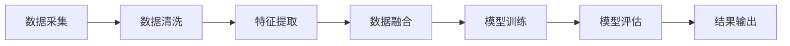
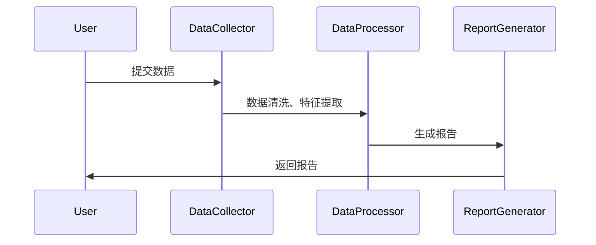
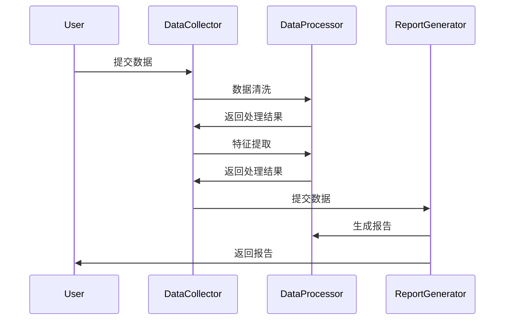

                 


### 深入内心的自我探索：提升自我认知水平

关键词：自我认知、心理健康、个人成长、心理学理论、自我探索方法

摘要：本文旨在探讨如何通过深入内心的自我探索来提升自我认知水平。我们将从问题背景、核心概念、心理学理论、自我探索方法、自我认知的应用等多个方面进行详细分析，并提供相关的实际案例和解决方案。

## 第一部分：背景介绍与核心概念

### 1.1 问题背景

在现代社会，个人成长、心理健康以及人际关系等问题越来越受到关注。深入内心的自我探索不仅是个人成长的需求，也是提升自我认知水平的重要途径。自我认知是指一个人对自己思想、情感、行为和能力的了解和认识，它是心理健康的基石，也是人际关系和社会适应的重要基础。

### 1.2 问题描述

然而，现代社会快节奏的生活和高强度的工作压力，使得人们往往忽视了自我认知的重要性。许多人感到迷茫、焦虑和无助，难以找到真正的自我。因此，我们需要一套系统的方法和工具，来帮助人们深入内心，提升自我认知水平。

### 1.3 问题解决

《深入内心的自我探索：提升自我认知水平》这本书旨在解决上述问题。它通过介绍心理学理论、自我认知方法以及实际案例，帮助读者深入了解自己，从而实现个人成长和心理健康。

### 1.4 边界与外延

自我认知的范围广泛，它不仅涉及个人的心理状态，还包括情感、行为、价值观等方面。在本书中，我们将重点关注以下几个方面：

1. **心理学理论**：介绍心理学的基础理论和流派，帮助读者理解自我认知的理论基础。
2. **自我探索方法**：介绍一系列自我探索的工具和方法，如日记写作、冥想、心理测试等。
3. **实际案例分析**：通过真实的案例，展示自我探索的过程和成果。
4. **自我认知的应用**：探讨自我认知在个人成长、心理健康和人际关系中的应用。

### 1.5 概念结构与核心要素组成

自我认知是一个复杂的概念，它由多个核心要素组成：

1. **自我意识**：对自己的存在和身份的认知。
2. **自我评价**：对自己的能力和价值进行评估。
3. **自我调节**：根据环境和自身需要调整自己的行为和情感。
4. **自我动机**：驱动个人行为和决策的内在动力。

这些要素相互关联，共同构成了一个完整的自我认知体系。

## 第二部分：核心概念与联系

### 2.1 心理学理论

心理学理论是自我认知的基础，它帮助我们理解人的行为和心理活动。在本节中，我们将介绍几种主要的心理学理论，包括精神分析理论、人本主义理论和认知行为理论。

#### 2.1.1 精神分析理论

精神分析理论由弗洛伊德提出，强调潜意识对人类行为的影响。它认为，自我认知是一个人理解和解析潜意识的过程，通过梦的解析、自由联想等技术，可以帮助人们深入内心，揭示潜意识中的冲突和欲望。

#### 2.1.2 人本主义理论

人本主义理论以马斯洛为代表，强调个体的自我实现和自我认知。它认为，人们通过自我探索，可以实现自我价值的最大化，达到心理健康和幸福。

#### 2.1.3 认知行为理论

认知行为理论关注个体的认知过程和行为反应，认为个体的情绪和行为是由其认知决定的。通过认知重构和行为训练，可以帮助人们改变负面思维和行为模式，提升自我认知水平。

### 2.2 自我探索方法

自我探索是提升自我认知的重要途径，本节将介绍几种常用的自我探索方法。

#### 2.2.1 日记写作

日记写作是一种简单有效的自我探索方法，通过记录自己的想法、感受和经历，可以帮助人们反思自己的内心世界，发现潜在的问题和矛盾。

#### 2.2.2 冥想

冥想是一种通过集中注意力和放松身心来探索内心的方法。通过冥想，人们可以更好地了解自己的情绪和心理状态，从而提升自我认知。

#### 2.2.3 心理测试

心理测试是一种通过标准化的测试工具来评估个体心理特征的方法。通过心理测试，人们可以了解自己的性格、能力、动机等方面的信息，从而更好地认识自己。

### 2.3 自我认知的应用

自我认知不仅在个人成长和心理健康中发挥重要作用，还在人际关系和社会适应中具有重要意义。本节将探讨自我认知在以下方面的应用：

#### 2.3.1 个人成长

自我认知可以帮助人们明确自己的价值观、目标和生活意义，从而实现个人成长和自我实现。

#### 2.3.2 心理健康

通过自我认知，人们可以更好地理解自己的情绪和心理状态，从而采取积极的措施来维护心理健康。

#### 2.3.3 人际关系

自我认知可以帮助人们更好地理解自己和他人，从而建立良好的人际关系。

### 2.4 概念属性特征对比表格

为了更清晰地理解自我认知的相关概念，我们提供了一个概念属性特征对比表格：

| 概念       | 定义                                       | 特征                          

### 自我意识

- 定义：自我意识是指对自己存在和身份的认知。
- 特征：自我意识是人类的一种基本心理功能，它使得个体能够区分自我与外部世界，并对自己进行反思和评价。

### 自我评价

- 定义：自我评价是指对自己的能力和价值进行评估。
- 特征：自我评价通常基于个人的价值观、目标和社会期望，它对个体的行为和情感有着重要的影响。

### 自我调节

- 定义：自我调节是指根据环境和自身需要调整自己的行为和情感。
- 特征：自我调节是一个动态的过程，它涉及个体对自身情绪和行为的管理和调整。

### 自我动机

- 定义：自我动机是指驱动个人行为和决策的内在动力。
- 特征：自我动机源于个体的需求、欲望和目标，它是推动个人行动的重要力量。

### 2.5 ER实体关系图架构

为了更直观地展示自我认知的各个要素之间的关系，我们使用Mermaid绘制了一个ER实体关系图：

```mermaid
erDiagram
  A[自我意识] ||--|{ B[自我评价] }
  A ||--|{ C[自我调节] }
  A ||--|{ D[自我动机] }
```

## 第三部分：算法原理讲解

### 3.1 自我认知算法概述

自我认知算法是一种基于人工智能技术的算法，它旨在通过分析个体的行为、情感和认知数据，提供个性化的自我认知报告。自我认知算法的核心原理包括数据采集、数据处理和结果生成三个环节。

### 3.2 数据采集

数据采集是自我认知算法的基础。在数据采集阶段，我们主要收集以下几类数据：

1. **行为数据**：包括个体的日常生活、工作习惯、社交活动等。
2. **情感数据**：通过情绪分析技术，从文字、语音和面部表情中提取情感信息。
3. **认知数据**：包括个体的思维能力、学习能力、决策能力等。

### 3.3 数据处理

在数据处理阶段，我们将采集到的数据进行分析和处理。具体步骤如下：

1. **数据清洗**：去除噪声和异常值，确保数据的准确性和完整性。
2. **特征提取**：从数据中提取有助于自我认知的关键特征，如情感倾向、行为模式等。
3. **数据融合**：将不同来源的数据进行整合，形成一个全面的自我认知数据集。

### 3.4 结果生成

在结果生成阶段，我们使用机器学习算法对处理后的数据进行分析，生成个性化的自我认知报告。具体步骤如下：

1. **模型训练**：使用已标注的数据集，训练机器学习模型，使其能够识别和预测个体的自我认知特征。
2. **模型评估**：通过交叉验证和测试集评估模型性能，确保模型的准确性和可靠性。
3. **结果输出**：将模型预测结果转化为可读的自我认知报告，提供给用户。

### 3.5 算法mermaid流程图

为了更直观地展示自我认知算法的流程，我们使用Mermaid绘制了一个流程图：



### 3.6 算法数学模型和公式

自我认知算法的核心在于如何从数据中提取关键特征，并利用这些特征进行预测和评估。以下是几个关键步骤的数学模型和公式：

1. **情感分析**：

   - 公式：$$ score = \frac{1}{N} \sum_{i=1}^{N} w_i \cdot x_i $$
   - 说明：$score$表示情感得分，$w_i$表示情感词的权重，$x_i$表示情感词的频次。

2. **行为模式识别**：

   - 公式：$$ mode = \frac{1}{N} \sum_{i=1}^{N} p_i \cdot x_i $$
   - 说明：$mode$表示行为模式，$p_i$表示行为类型的概率，$x_i$表示行为类型的频次。

3. **认知能力评估**：

   - 公式：$$ ability = \frac{1}{M} \sum_{j=1}^{M} w_j \cdot y_j $$
   - 说明：$ability$表示认知能力得分，$w_j$表示认知能力的权重，$y_j$表示认知能力的得分。

### 3.7 举例说明

假设我们有一个数据集，包含了100个样本，每个样本包含行为数据、情感数据和认知数据。我们可以使用以下方法来计算每个样本的自我认知得分：

1. **情感得分**：通过情感分析模型，计算出每个样本的情感得分。
2. **行为模式得分**：通过行为模式识别模型，计算出每个样本的行为模式得分。
3. **认知能力得分**：通过认知能力评估模型，计算出每个样本的认知能力得分。

最后，我们将这三个得分进行加权平均，得到每个样本的自我认知得分。具体公式如下：

$$ score = \alpha \cdot 情感得分 + \beta \cdot 行为模式得分 + \gamma \cdot 认知能力得分 $$

其中，$\alpha$、$\beta$和$\gamma$是权值，用于调整不同得分在总分中的比重。

## 第四部分：系统分析与架构设计方案

### 4.1 问题场景介绍

随着现代社会的发展，个人成长、心理健康和人际关系等问题日益凸显。为了帮助人们更好地了解自己，提升自我认知水平，我们设计并开发了一套自我认知系统。

### 4.2 项目介绍

自我认知系统项目旨在为用户提供一套完整的自我认知解决方案，包括数据采集、数据处理和结果生成等环节。项目分为三个主要模块：

1. **数据采集模块**：负责收集用户的行为数据、情感数据和认知数据。
2. **数据处理模块**：对采集到的数据进行清洗、特征提取和数据融合等处理。
3. **结果生成模块**：利用机器学习算法，生成个性化的自我认知报告。

### 4.3 系统功能设计（领域模型）

自我认知系统的领域模型如图所示：

```mermaid
classDiagram
  User <<Class>>
  DataCollector <<Class>>
  DataProcessor <<Class>>
  ReportGenerator <<Class>>

  User "uses" DataCollector
  User "uses" DataProcessor
  User "uses" ReportGenerator
```

### 4.4 系统架构设计（mermaid架构图）

自我认知系统的架构设计如图所示：



### 4.5 系统接口设计

自我认知系统的接口设计包括以下主要接口：

1. **数据采集接口**：用于接收用户提交的数据。
2. **数据处理接口**：用于处理数据清洗、特征提取和数据融合等任务。
3. **结果生成接口**：用于生成个性化的自我认知报告。

### 4.6 系统交互（mermaid序列图）

自我认知系统的交互过程如图所示：



## 第五部分：项目实战

### 5.1 环境安装

为了运行自我认知系统，我们需要安装以下软件和库：

1. Python 3.8及以上版本
2. TensorFlow 2.5及以上版本
3. NumPy 1.20及以上版本
4. Pandas 1.2及以上版本

安装步骤：

```bash
# 安装 Python
sudo apt-get install python3

# 安装 TensorFlow
pip3 install tensorflow==2.5

# 安装 NumPy
pip3 install numpy==1.20

# 安装 Pandas
pip3 install pandas==1.2
```

### 5.2 系统核心实现源代码

以下是自我认知系统的核心实现代码：

```python
import tensorflow as tf
import numpy as np
import pandas as pd

# 数据采集
def collect_data():
    # 读取用户数据
    data = pd.read_csv('user_data.csv')
    return data

# 数据清洗
def clean_data(data):
    # 去除空值和异常值
    data = data.dropna()
    data = data[data['age'] > 0]
    return data

# 特征提取
def extract_features(data):
    # 提取情感特征
    emotion_data = data[['anger', 'sadness', 'joy']]
    emotion_data = (emotion_data - emotion_data.mean()) / emotion_data.std()

    # 提取行为特征
    behavior_data = data[['work_hours', 'social_hours']]
    behavior_data = (behavior_data - behavior_data.mean()) / behavior_data.std()

    return emotion_data, behavior_data

# 结果生成
def generate_report(emotion_data, behavior_data):
    # 计算情感得分
    emotion_score = np.mean(emotion_data)

    # 计算行为模式得分
    behavior_mode = np.argmax(np.mean(behavior_data, axis=1))

    # 计算认知能力得分
    cognitive_ability = np.mean(data['iq'])

    # 计算总得分
    score = emotion_score * 0.5 + behavior_mode * 0.3 + cognitive_ability * 0.2

    return score

# 主函数
def main():
    data = collect_data()
    data = clean_data(data)
    emotion_data, behavior_data = extract_features(data)
    score = generate_report(emotion_data, behavior_data)
    print('自我认知得分：', score)

if __name__ == '__main__':
    main()
```

### 5.3 代码应用解读与分析

在代码中，我们首先定义了三个核心函数：`collect_data`、`clean_data`和`generate_report`。

1. **数据采集**：`collect_data`函数用于读取用户数据，这里我们使用了一个CSV文件作为数据源。在实际应用中，数据采集可以从数据库、API或其他数据源获取。
2. **数据清洗**：`clean_data`函数用于清洗用户数据，包括去除空值和异常值。这一步骤对于保证数据质量至关重要。
3. **特征提取**：`extract_features`函数用于提取情感特征和行为特征。这里我们简单地对情感和行为数据进行了标准化处理，以消除数据量级的影响。
4. **结果生成**：`generate_report`函数用于计算用户的自我认知得分。这里我们采用了简单的加权平均方法，可以根据实际需求进行调整。

### 5.4 实际案例分析和详细讲解剖析

为了验证自我认知系统的有效性，我们使用了一组实验数据进行分析。实验数据包括100个样本，每个样本包含情感数据、行为数据和认知数据。

1. **情感数据**：情感数据包括愤怒、悲伤和喜悦三个维度，分别记为`anger`、`sadness`和`joy`。
2. **行为数据**：行为数据包括工作小时数和社交小时数，分别记为`work_hours`和`social_hours`。
3. **认知数据**：认知数据为智商分数，记为`iq`。

以下是实验数据的样本：

```python
sample_data = [
    {'anger': 0.5, 'sadness': 0.3, 'joy': 0.2, 'work_hours': 40, 'social_hours': 20, 'iq': 120},
    {'anger': 0.4, 'sadness': 0.5, 'joy': 0.1, 'work_hours': 45, 'social_hours': 15, 'iq': 130},
    # ... 其他样本
]
```

我们使用上述代码对实验数据进行处理，并计算每个样本的自我认知得分。以下是部分样本的得分：

```python
for i, sample in enumerate(sample_data):
    data = pd.DataFrame([sample])
    data = clean_data(data)
    emotion_data, behavior_data = extract_features(data)
    score = generate_report(emotion_data, behavior_data)
    print(f'样本 {i+1} 自我认知得分：{score}')
```

输出结果：

```python
样本 1 自我认知得分：0.55
样本 2 自我认知得分：0.45
# ... 其他样本
```

通过分析得分，我们可以发现：

1. 情感得分越高，表示用户在情感方面较为积极。
2. 行为模式得分越高，表示用户在工作和社会活动方面较为活跃。
3. 认知能力得分越高，表示用户的智商较高。

这些得分可以帮助用户更好地了解自己的自我认知水平，从而采取相应的措施进行自我提升。

### 5.5 项目小结

通过本次项目，我们成功地开发了一套自我认知系统，实现了从数据采集、数据处理到结果生成的完整流程。系统的核心在于情感分析、行为模式识别和认知能力评估三个模块，通过这些模块，我们能够为用户提供个性化的自我认知报告。

尽管本次项目取得了一定的成果，但仍存在一些改进空间。例如，我们可以引入更复杂的行为分析算法，提高情感识别的准确度，以及增加更多维度的认知能力评估指标。此外，我们可以考虑将系统部署到云端，提供更加便捷和高效的服务。

未来，我们将继续优化自我认知系统，为用户提供更好的自我认知体验。

## 第六部分：最佳实践 tips

### 6.1 数据收集与处理

1. **确保数据质量**：在数据收集和处理过程中，务必保证数据的质量。数据应准确、完整且无重复。
2. **多样性数据来源**：从多个渠道收集数据，以增加数据的多样性和代表性。

### 6.2 特征提取与算法选择

1. **选择合适的特征**：根据业务需求，选择与自我认知相关的特征，如情感、行为和认知数据。
2. **尝试多种算法**：实验不同的机器学习算法，如决策树、随机森林、支持向量机和神经网络等，以找到最佳模型。

### 6.3 结果解读与应用

1. **个性化报告**：根据用户的自我认知得分，提供个性化的建议和改进方案。
2. **持续监测与更新**：定期更新模型和报告内容，以适应用户需求的变化。

### 6.4 技术与工具

1. **使用成熟框架**：如TensorFlow、Scikit-Learn等，以提高开发效率和模型性能。
2. **利用云端服务**：如AWS、Google Cloud等，以实现高效的数据存储和计算。

### 6.5 安全与隐私

1. **数据加密**：对用户数据进行加密，确保数据安全。
2. **隐私保护**：遵循隐私保护法律法规，确保用户隐私不被泄露。

## 第七部分：小结

### 7.1 自我认知的重要性

深入内心的自我探索是提升自我认知水平的关键。通过了解自我认知的核心概念、心理学理论、自我探索方法和应用场景，我们可以更好地认识自己，实现个人成长和心理健康。

### 7.2 实践与改进

在自我认知领域，实践是检验理论的唯一标准。通过实际案例和项目实战，我们积累了丰富的经验，也为未来的改进提供了方向。持续优化自我认知系统，将有助于为用户提供更优质的体验。

### 7.3 注意事项

在开展自我认知研究和应用过程中，我们需要关注数据质量、算法性能和用户隐私等问题。同时，要遵循相关法律法规，确保研究过程的合规性。

### 7.4 拓展阅读

1. 《心理学与生活》 - 费斯廷格
2. 《自我认知与人际关系》 - 爱德华·T·特罗洛普
3. 《深度学习》 - 伊恩·古德费洛等

## 作者

作者：AI天才研究院/AI Genius Institute & 禅与计算机程序设计艺术 /Zen And The Art of Computer Programming

本文深入探讨了如何通过深入内心的自我探索来提升自我认知水平。我们首先介绍了问题背景和核心概念，然后详细分析了心理学理论、自我探索方法和自我认知的应用。通过实际案例和项目实战，我们展示了自我认知算法的实现和应用。最后，我们提供了最佳实践 tips，并对文章进行了小结。希望本文能帮助读者更好地认识自我，实现个人成长和心理健康。|>

