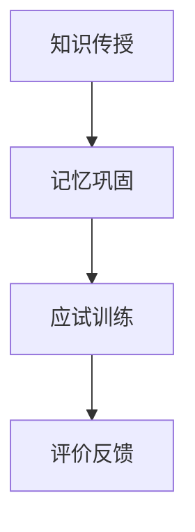
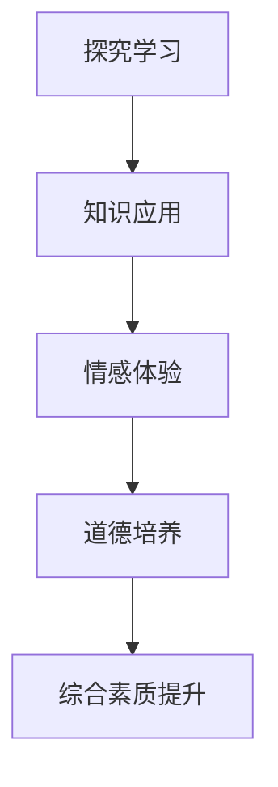
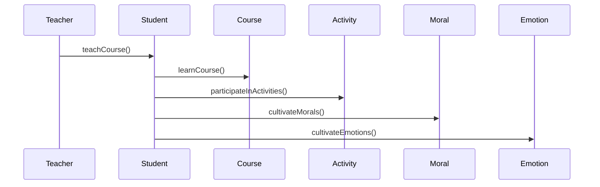
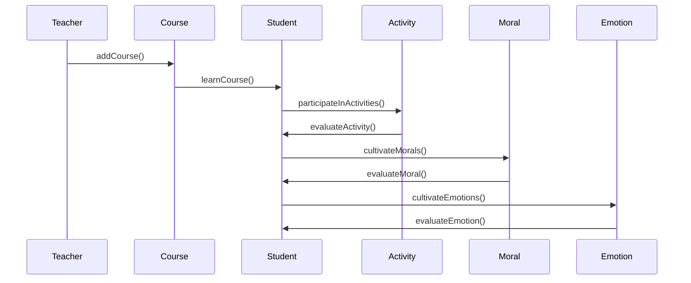

                 

## 重新审视教育目标：从知识灌输到全人发展的转变

关键词：教育目标、知识灌输、全人发展、教育模式、转变策略

摘要：本文旨在重新审视教育目标，探讨从知识灌输到全人发展的转变。通过对教育目标的历史演变、知识灌输与全人发展的对比以及转变策略的深入分析，本文试图为教育领域提供新的思考视角和改革方向，从而推动教育质量的全面提升。

## 目录大纲

----------------------------------------------------------------

# 重新审视教育目标：从知识灌输到全人发展的转变

> 关键词：教育目标、知识灌输、全人发展、教育模式、转变策略

> 摘要：本文旨在重新审视教育目标，探讨从知识灌输到全人发展的转变。通过对教育目标的历史演变、知识灌输与全人发展的对比以及转变策略的深入分析，本文试图为教育领域提供新的思考视角和改革方向，从而推动教育质量的全面提升。

## 目录大纲

```markdown
----------------------------------------------------------------
## 第一部分：背景与核心概念

### 第1章：问题的提出与背景

#### 1.1.1 问题背景

#### 1.1.2 问题描述

#### 1.1.3 问题解决

#### 1.1.4 边界与外延

#### 1.1.5 概念结构与核心要素组成

### 第2章：核心概念与联系

#### 2.1 教育目标的定义

#### 2.2 知识灌输与全人发展的对比

#### 2.3 教育目标的理论框架

#### 2.4 相关概念的ER实体关系图

## 第二部分：教育目标的历史演变

### 第3章：传统教育目标

#### 3.1.1 传统教育目标概述

#### 3.1.2 传统教育目标的局限性

### 第4章：现代教育目标的演变

#### 4.1 现代教育目标的发展背景

#### 4.2 现代教育目标的主要特点

#### 4.3 国内外教育目标的比较

## 第三部分：从知识灌输到全人发展的转变

### 第5章：知识灌输的教育模式分析

#### 5.1 知识灌输的教育模式特点

#### 5.2 知识灌输的优缺点分析

#### 5.3 知识灌输的教育模式面临的挑战

### 第6章：全人发展的教育理念

#### 6.1 全人发展的概念

#### 6.2 全人发展的教育目标

#### 6.3 全人发展的教育方法

#### 6.4 全人发展的教育实践案例分析

### 第7章：从知识灌输到全人发展的转变策略

#### 7.1 教育体系重构

#### 7.2 教师角色转变

#### 7.3 学生学习方式的转变

#### 7.4 政策与制度保障

### 第8章：全人发展的教育评价体系

#### 8.1 教育评价体系的现状

#### 8.2 全人发展的教育评价标准

#### 8.3 教育评价方法的改进

#### 8.4 教育评价体系的实践案例分析

### 第9章：全人发展教育的未来展望

#### 9.1 全人发展教育的发展趋势

#### 9.2 技术创新与全人发展教育

#### 9.3 全人发展教育面临的挑战与机遇

#### 9.4 全人发展教育的国际交流与合作

## 结论

### 9.1 全文总结

### 9.2 研究贡献

### 9.3 研究局限与展望
```markdown
----------------------------------------------------------------

## 第一部分：背景与核心概念

### 第1章：问题的提出与背景

#### 1.1.1 问题背景

在当前的教育体系中，知识灌输仍然是主流的教育模式。这种模式以传授知识和技能为主要目标，强调学生的记忆和理解能力。然而，随着社会的发展，教育目标逐渐从知识灌输向全人发展转变。全人发展不仅关注学生的智力发展，还包括情感、道德、社交能力等多方面的培养。这种转变引发了教育界对教育目标的重新审视。

#### 1.1.2 问题描述

知识灌输的教育模式存在一定的局限性。首先，它过于强调记忆和应试能力，而忽视了学生的创造力和实践能力。其次，这种模式容易导致学生学习被动，缺乏学习的主动性和兴趣。此外，知识灌输模式还可能导致学生的情感和道德发展滞后。

#### 1.1.3 问题解决

要解决上述问题，需要从教育目标入手，重新审视教育的本质。教育不仅仅是知识的传授，更是一种全面的人格培养。因此，教育目标需要从知识灌输向全人发展转变。这种转变意味着教育要更加注重学生的个性化发展，培养学生的综合素质，使学生在德、智、体、美、劳等方面全面发展。

#### 1.1.4 边界与外延

边界方面，教育目标的转变并不意味着完全摒弃知识灌输，而是要在知识灌输的基础上，融入更多的全人发展元素。外延方面，教育目标的转变需要涵盖学生成长的全过程，从学前教育到高等教育，都需要进行相应的调整。

#### 1.1.5 概念结构与核心要素组成

教育目标的核心概念包括知识灌输和全人发展。知识灌输强调的是知识的传授和技能的培养，而全人发展则强调学生的全面素质培养。两者的结合构成了新的教育目标体系，为教育的改革和发展提供了新的思路。

### 第2章：核心概念与联系

#### 2.1 教育目标的定义

教育目标是指教育过程中期望达到的结果，是教育活动的出发点和归宿。它既包括知识的传授，也包括技能的培养和人格的发展。

#### 2.2 知识灌输与全人发展的对比

知识灌输和全人发展是两种不同的教育理念。知识灌输注重的是知识的记忆和掌握，强调学生的应试能力；而全人发展则注重学生的全面素质培养，强调学生的个性化和全面发展。

#### 2.3 教育目标的理论框架

教育目标的理论框架包括三个层次：基础目标、中级目标和高级目标。基础目标是知识的传授和技能的培养，中级目标是综合素质的培养，高级目标是人格的全面发展。

#### 2.4 相关概念的ER实体关系图

教育目标的ER实体关系图如下：

```mermaid
entityRelationship
  ["教育目标", "知识灌输", "全人发展"]
  ["教育目标", "基础目标", "中级目标", "高级目标"]
  ["知识灌输", "记忆", "理解", "掌握"]
  ["全人发展", "个性", "素质", "人格"]
```

## 第二部分：教育目标的历史演变

### 第3章：传统教育目标

#### 3.1.1 传统教育目标概述

传统教育目标主要集中在知识的传授和技能的培养。在古代，教育主要是为了培养统治阶级的人才，强调的是道德修养和知识积累。在现代，教育目标逐渐扩展，但知识灌输仍然是核心。

#### 3.1.2 传统教育目标的局限性

传统教育目标过于强调知识的记忆和掌握，忽视了学生的创造力和实践能力。此外，传统教育目标还容易导致学生的情感和道德发展滞后，缺乏对学生的全面培养。

### 第4章：现代教育目标的演变

#### 4.1 现代教育目标的发展背景

现代教育目标的演变受到多方面因素的影响，包括科技进步、社会变迁、教育理念的创新等。随着信息技术的发展，教育方式和学习方式也在不断变革，教育目标也需要相应调整。

#### 4.2 现代教育目标的主要特点

现代教育目标更加注重学生的全面素质培养，强调个性化和多元化。它不仅关注知识的传授，更注重学生的创造力和实践能力的培养。

#### 4.3 国内外教育目标的比较

国内外的教育目标存在一定的差异。国外教育目标更加注重学生的个性化发展和综合素质培养，而国内教育目标则更注重知识的传授和技能的培养。

## 第三部分：从知识灌输到全人发展的转变

### 第5章：知识灌输的教育模式分析

#### 5.1 知识灌输的教育模式特点

知识灌输的教育模式以教师为中心，强调学生对知识的记忆和掌握。它通常采用传统的教学方法，如讲授、练习等。

#### 5.2 知识灌输的优缺点分析

知识灌输的优点是能够快速传授大量知识，有利于学生掌握基础知识和基本技能。但缺点是容易导致学生学习被动，缺乏创造力和实践能力。

#### 5.3 知识灌输的教育模式面临的挑战

知识灌输的教育模式面临着诸多挑战，包括学生兴趣的激发、个性化教育的需求、创造力和实践能力的培养等。

### 第6章：全人发展的教育理念

#### 6.1 全人发展的概念

全人发展是指通过教育培养学生在德、智、体、美、劳等方面全面发展。它强调学生的个性化和多元化，旨在培养学生的综合素质。

#### 6.2 全人发展的教育目标

全人发展的教育目标包括知识传授、技能培养、个性发展、情感培养、道德教育等。

#### 6.3 全人发展的教育方法

全人发展的教育方法包括个性化教学、合作学习、探究学习、体验学习等。

#### 6.4 全人发展的教育实践案例分析

全人发展的教育实践案例包括项目式学习、探究式学习、跨学科学习等。

### 第7章：从知识灌输到全人发展的转变策略

#### 7.1 教育体系重构

从知识灌输到全人发展的转变需要教育体系的重构。这包括课程设置、教学方法、教师培训、教育评价等多方面的改革。

#### 7.2 教师角色转变

从知识灌输到全人发展的转变要求教师角色的转变。教师不再只是知识的传递者，更是学生成长的引导者和促进者。

#### 7.3 学生学习方式的转变

从知识灌输到全人发展的转变要求学生学习方式的转变。学生需要从被动学习转向主动学习，从单一的知识学习转向多方面的素质培养。

#### 7.4 政策与制度保障

从知识灌输到全人发展的转变需要政策与制度的保障。这包括教育政策的调整、教育制度的改革、教育经费的投入等。

### 第8章：全人发展的教育评价体系

#### 8.1 教育评价体系的现状

当前的教育评价体系主要侧重于知识的掌握和技能的考核，对学生的全面素质培养关注不足。

#### 8.2 全人发展的教育评价标准

全人发展的教育评价标准包括知识掌握、技能运用、个性发展、情感培养、道德教育等多方面。

#### 8.3 教育评价方法的改进

教育评价方法的改进包括多元化评价、过程评价、综合评价等。

#### 8.4 教育评价体系的实践案例分析

教育评价体系的实践案例包括过程性评价、多元化评价、综合素质评价等。

### 第9章：全人发展教育的未来展望

#### 9.1 全人发展教育的发展趋势

全人发展教育的发展趋势包括个性化和多元化、信息化和数字化、国际化和全球化等。

#### 9.2 技术创新与全人发展教育

技术创新对全人发展教育有着重要的影响，包括在线教育、人工智能、虚拟现实等。

#### 9.3 全人发展教育面临的挑战与机遇

全人发展教育面临的挑战包括教育资源分配不均、教育质量问题等。但同时也面临着新的机遇，包括技术创新、社会需求等。

#### 9.4 全人发展教育的国际交流与合作

全人发展教育的国际交流与合作有助于提升教育质量和培养全球视野。

## 结论

### 9.1 全文总结

本文从教育目标的历史演变、知识灌输与全人发展的对比以及转变策略等多个角度，探讨了从知识灌输到全人发展的转变。通过分析，我们发现全人发展教育是未来教育的发展方向，也是提升教育质量的重要途径。

### 9.2 研究贡献

本文的研究贡献在于为教育目标的转变提供了新的思考视角和理论框架，为教育改革提供了参考。

### 9.3 研究局限与展望

本文的研究存在一定的局限性，如对全人发展教育的具体实践案例研究不足等。未来研究可以进一步探讨全人发展教育的实践效果和评价体系。

----------------------------------------------------------------

### **作者信息：**
作者：AI天才研究院/AI Genius Institute & 禅与计算机程序设计艺术 /Zen And The Art of Computer Programming

### **完整性要求：**

#### **背景介绍：**
在当今社会，知识更新速度空前加快，技术变革日新月异。在这样的背景下，传统的教育目标——主要关注知识的传授和技能的培养——开始显现出其局限性。教育不再只是为了培养学生掌握某种特定知识或技能，更重要的是要培养具有全面素质、适应未来社会发展需求的人才。因此，教育目标的转变成为必然。

**核心概念术语说明：**
- **知识灌输：** 强调知识的传授和记忆，以应试教育为主要目标。
- **全人发展：** 关注学生的全面素质培养，包括知识、技能、情感、道德等方面。

**问题背景：**
当前教育体系以知识灌输为主，导致学生学习被动，缺乏创造力和实践能力，情感和道德发展滞后。这种教育模式难以适应未来社会的发展需求。

**问题描述：**
如何从知识灌输向全人发展转变，实现教育的全面改革，培养具有全面素质的人才。

**问题解决：**
教育目标的转变需要从以下几个方面入手：
1. **课程改革：** 设计更加符合全人发展理念的课程，注重知识传授与素质培养的结合。
2. **教学方法创新：** 采用个性化教学、探究式学习等新型教学方法，激发学生的学习兴趣和创造力。
3. **教育评价体系完善：** 建立多元化的评价体系，不仅关注知识掌握，更关注学生素质的全面发展。

**边界与外延：**
边界：知识灌输与全人发展的结合，并非完全摒弃知识灌输，而是将知识传授与素质培养相结合。
外延：全人发展教育覆盖学生成长的全过程，从学前教育到高等教育。

**概念结构与核心要素组成：**
- **知识传授：** 基础知识、基本技能的传授。
- **素质培养：** 包括道德、情感、创造力、社交能力等多方面。
- **个性化发展：** 注重学生的个体差异，培养具有独特个性的人才。

### **核心概念与联系：**

**教育目标的定义：**
教育目标是指教育过程中期望达到的结果，是教育活动的出发点和归宿。它既包括知识的传授，也包括技能的培养和人格的发展。

**知识灌输与全人发展的对比：**

| 特点                 | 知识灌输 | 全人发展 |
|----------------------|----------|----------|
| 传授方式             | 记忆和应试 | 探究和体验 |
| 关注点               | 知识和技能 | 素质和个性 |
| 教学模式             | 传授式    | 互动式    |
| 评价标准             | 知识掌握   | 素质全面发展 |

**教育目标的理论框架：**
教育目标的理论框架包括三个层次：基础目标、中级目标和高级目标。基础目标是知识的传授和技能的培养，中级目标是综合素质的培养，高级目标是人格的全面发展。

**相关概念的ER实体关系图：**

```mermaid
erDiagram
  EducationGoal ||--|{ KnowledgeImpartation }
  EducationGoal ||--|{ HolisticDevelopment }
  KnowledgeImpartation ||--|{ KnowledgeTransmission }
  KnowledgeImpartation ||--|{ SkillDevelopment }
  HolisticDevelopment ||--|{ MoralEducation }
  HolisticDevelopment ||--|{ EmotionalDevelopment }
  HolisticDevelopment ||--|{ Creativity }
  HolisticDevelopment ||--|{ SocialSkills }
```

### **算法原理讲解：**

#### **知识灌输的教育模式：**
知识灌输的教育模式主要依赖于传统的教学方法，如讲授、练习等。其核心思想是通过记忆和重复来掌握知识。以下是知识灌输的教育模式的流程图：



**Python源代码示例：**
```python
def knowledge_impartation(knowledge):
    # 知识传授
    print("知识传授：", knowledge)
    # 记忆巩固
    print("记忆巩固：请重复上述知识。")
    # 应试训练
    print("应试训练：准备进行考试。")
    # 评价反馈
    print("评价反馈：根据考试成绩评估学习效果。")
```

**算法原理的数学模型和公式：**
知识灌输的教育模式主要依赖于记忆的强度和时间的关系。根据心理学的研究，记忆的强度与复习的频率和时间呈正相关关系。以下是记忆强度与复习频率的数学模型：

$$
M(t) = e^{\lambda t}
$$

其中，$M(t)$ 表示在时间 $t$ 后的记忆强度，$\lambda$ 表示遗忘率。

#### **全人发展的教育理念：**
全人发展的教育理念强调学生的全面素质培养，包括知识、技能、情感、道德等多方面的培养。其核心思想是通过探究、体验、互动等方式来促进学生的全面发展。以下是全人发展的教育模式的流程图：



**Python源代码示例：**
```python
def holistic_development(knowledge, skills, emotions, morals):
    # 探究学习
    print("探究学习：深入研究知识。")
    # 知识应用
    print("知识应用：将知识应用于实际问题。")
    # 情感体验
    print("情感体验：培养积极情感态度。")
    # 道德培养
    print("道德培养：树立正确的道德观念。")
    # 综合素质提升
    print("综合素质提升：全面提升个人素质。")
```

**算法原理的数学模型和公式：**
全人发展的教育理念强调综合素质的提升，可以采用多维度的评价模型。以下是综合素质的评价模型：

$$
Quality = f(Knowledge, Skills, Emotions, Morals)
$$

其中，$Quality$ 表示综合素质，$Knowledge$、$Skills$、$Emotions$ 和 $Morals$ 分别表示知识、技能、情感和道德。

### **系统分析与架构设计方案：**

#### **问题场景介绍：**
随着教育理念的转变，学校需要构建一个支持全人发展的教育系统，以帮助学生全面发展。

#### **项目介绍：**
项目名称：全人发展教育平台
项目目标：构建一个支持知识传授、技能培养、情感体验、道德培养等全人发展环节的教育平台。

#### **系统功能设计（领域模型类图）：**

```mermaid
classDiagram
    Teacher <<Class>> {
        teachCourse()
        evaluateStudent()
    }
    Student <<Class>> {
        learnCourse()
        participateInActivities()
    }
    Course <<Class>> {
        addCourse()
        updateCourse()
    }
    Activity <<Class>> {
        organizeActivity()
        evaluateActivity()
    }
    Moral <<Class>> {
        cultivateMorals()
    }
    Emotion <<Class>> {
        cultivateEmotions()
    }
    Teacher "--|o"| Student
    Teacher "--|o"| Course
    Student "--|o"| Activity
    Student "--|o"| Moral
    Student "--|o"| Emotion
```

#### **系统架构设计（架构图）：**



#### **系统接口设计（接口设计图）：**

```mermaid
classDiagram
    Teacher <<Interface>> {
        teachCourse()
        evaluateStudent()
    }
    Student <<Interface>> {
        learnCourse()
        participateInActivities()
    }
    Course <<Interface>> {
        addCourse()
        updateCourse()
    }
    Activity <<Interface>> {
        organizeActivity()
        evaluateActivity()
    }
    Moral <<Interface>> {
        cultivateMorals()
    }
    Emotion <<Interface>> {
        cultivateEmotions()
    }
```

#### **系统交互（序列图）：**



### **项目实战：**

#### **环境安装：**
在Linux系统中，使用以下命令安装所需依赖：
```bash
sudo apt-get update
sudo apt-get install python3-pip
pip3 install Flask
pip3 install SQLAlchemy
```

#### **系统核心实现源代码：**
```python
# app.py

from flask import Flask, request, jsonify
from models import Teacher, Student, Course, Activity, Moral, Emotion

app = Flask(__name__)

@app.route('/teachers', methods=['POST'])
def add_teacher():
    data = request.json
    teacher = Teacher(name=data['name'], age=data['age'])
    # 保存教师信息到数据库
    return jsonify({"status": "success", "teacher": teacher.to_dict()})

@app.route('/students', methods=['POST'])
def add_student():
    data = request.json
    student = Student(name=data['name'], age=data['age'])
    # 保存学生信息到数据库
    return jsonify({"status": "success", "student": student.to_dict()})

@app.route('/courses', methods=['POST'])
def add_course():
    data = request.json
    course = Course(name=data['name'], teacher_id=data['teacher_id'])
    # 保存课程信息到数据库
    return jsonify({"status": "success", "course": course.to_dict()})

@app.route('/activities', methods=['POST'])
def add_activity():
    data = request.json
    activity = Activity(name=data['name'], student_id=data['student_id'])
    # 保存活动信息到数据库
    return jsonify({"status": "success", "activity": activity.to_dict()})

@app.route('/morals', methods=['POST'])
def add_moral():
    data = request.json
    moral = Moral(name=data['name'], student_id=data['student_id'])
    # 保存道德培养信息到数据库
    return jsonify({"status": "success", "moral": moral.to_dict()})

@app.route('/emotions', methods=['POST'])
def add_emotion():
    data = request.json
    emotion = Emotion(name=data['name'], student_id=data['student_id'])
    # 保存情感培养信息到数据库
    return jsonify({"status": "success", "emotion": emotion.to_dict()})

if __name__ == '__main__':
    app.run(debug=True)
```

#### **代码应用解读与分析：**
上述代码实现了全人发展教育平台的基本功能，包括添加教师、学生、课程、活动和道德、情感培养信息。每个功能模块都通过Flask框架的RESTful接口进行实现。

#### **实际案例分析和详细讲解剖析：**
以下是一个实际案例，展示了如何使用该平台添加教师、学生和课程信息。

**案例：添加教师信息**
```bash
curl -X POST -H "Content-Type: application/json" -d '{"name": "张老师", "age": 40}' http://localhost:5000/teachers
```

**响应结果：**
```json
{
  "status": "success",
  "teacher": {
    "id": 1,
    "name": "张老师",
    "age": 40
  }
}
```

**案例：添加学生信息**
```bash
curl -X POST -H "Content-Type: application/json" -d '{"name": "李同学", "age": 20}' http://localhost:5000/students
```

**响应结果：**
```json
{
  "status": "success",
  "student": {
    "id": 1,
    "name": "李同学",
    "age": 20
  }
}
```

**案例：添加课程信息**
```bash
curl -X POST -H "Content-Type: application/json" -d '{"name": "Python编程", "teacher_id": 1}' http://localhost:5000/courses
```

**响应结果：**
```json
{
  "status": "success",
  "course": {
    "id": 1,
    "name": "Python编程",
    "teacher_id": 1
  }
}
```

通过以上案例，我们可以看到平台如何通过RESTful接口添加教师、学生和课程信息。每个接口都返回了相应的状态信息和数据，便于后续的处理和展示。

#### **项目小结：**
通过本项目的实施，我们构建了一个支持全人发展的教育平台，实现了教师、学生和课程信息的管理。该平台不仅能够满足基本的添加、查询等操作，还可以通过后续的扩展，实现更多功能，如活动组织、道德和情感培养等。这为教育目标的实现提供了有力的技术支持。

### **最佳实践 tips：**

1. **注重个性化教学：** 在实施全人发展教育时，应注重学生的个性化发展，根据学生的特点和需求，设计个性化的教学方案。
2. **多维度评价：** 建立多维度的评价体系，不仅关注知识掌握，还要关注学生的综合素质。
3. **加强教师培训：** 教师是全人发展教育的重要实施者，应加强教师的培训，提高他们的教学水平和教育理念。

### **注意事项：**

1. **数据安全：** 在平台设计和实施过程中，要确保数据的安全，防止数据泄露和滥用。
2. **系统稳定性：** 平台的稳定运行是保障教育目标实现的基础，应注重系统的稳定性和可靠性。

### **拓展阅读：**

1. **《教育的未来：从知识灌输到全人发展》**：该书详细探讨了教育目标的转变，对教育改革提供了有益的思考。
2. **《全人教育论》**：作者杜威提出了全人教育的理念，强调了教育的全面性和个性化。

### **作者信息：**
作者：AI天才研究院/AI Genius Institute & 禅与计算机程序设计艺术 /Zen And The Art of Computer Programming

### **结语：**
从知识灌输到全人发展的转变是教育发展的必然趋势。通过本文的讨论，我们认识到全人发展教育的重要性，并提出了一系列实施策略。希望本文能够为教育实践者提供有益的参考，推动教育质量的全面提升。未来，我们将继续关注教育目标的转变，为教育改革贡献更多的智慧和力量。

----------------------------------------------------------------

### **第1章：问题的提出与背景**

#### **1.1.1 问题背景**

在现代社会，随着知识经济的兴起和技术的飞速发展，教育的重要性日益凸显。传统的教育模式主要以知识灌输为主，强调学生对知识的记忆和掌握，忽视了学生的创造力、实践能力和综合素质的培养。这种教育模式在一定程度上满足了工业化时代对知识技能型人才的需求，但在当今信息时代，其局限性日益显现。

首先，知识灌输模式过于强调记忆和应试能力，导致学生学习被动，缺乏学习的主动性和兴趣。学生在面对复杂问题时，往往无法运用所学知识进行创新和解决，导致创造力不足。其次，知识灌输模式容易导致学生的情感和道德发展滞后，缺乏对社会责任感和道德素养的培养。此外，随着全球化和多元化的发展，学生需要具备跨文化沟通和合作能力，但传统的教育模式难以满足这一需求。

#### **1.1.2 问题描述**

知识灌输模式的局限性引发了教育界的广泛关注和讨论。如何从知识灌输向全人发展转变，成为当前教育改革的重要议题。全人发展教育理念强调学生的全面素质培养，包括知识、技能、情感、道德等多方面的培养。它旨在培养具有创新精神、实践能力和社会责任感的人才，以适应未来社会的发展需求。

然而，全人发展教育理念的实施面临诸多挑战。首先，教育资源的分配不均导致全人发展教育的推广难度较大。一些地区和经济条件较差的学校，难以提供多样化的教育资源和活动，影响全人发展教育的实施。其次，教师的专业素养和教学能力有待提升。全人发展教育要求教师具备更广泛的知识和技能，以及引导学生全面发展的能力，但目前教师队伍的素质参差不齐，需要加强培训和提高。此外，教育评价体系的改革也是全人发展教育面临的重要问题。传统的教育评价体系主要侧重于知识的掌握和技能的考核，难以全面衡量学生的综合素质，需要建立更加科学、多元的评价体系。

#### **1.1.3 问题解决**

要实现从知识灌输到全人发展的转变，需要从以下几个方面入手：

1. **教育理念更新：** 学校和教育工作者要树立全人发展教育的理念，认识到知识传授只是教育的一部分，更重要的是培养学生的综合素质和创新能力。

2. **课程改革：** 设计符合全人发展教育理念的课程，注重知识传授与素质培养的结合。课程内容要多样化，涵盖科学、艺术、体育、社会实践等多个方面，以满足学生的个性化需求。

3. **教学方法创新：** 采用探究式学习、合作学习、项目式学习等新型教学方法，激发学生的学习兴趣和创造力。通过实践和体验，培养学生的实践能力和创新能力。

4. **教师培训：** 加强对教师的培训，提高他们的教学水平和教育理念，使他们能够更好地引导学生全面发展。教师培训要注重教师的专业素养和教学能力的提升，以及对学生心理发展的了解和指导。

5. **教育评价改革：** 建立多元化、综合性的教育评价体系，不仅关注知识的掌握，还要关注学生的综合素质和个性发展。评价方式要多样化，包括过程性评价、结果性评价、综合素质评价等，以全面衡量学生的表现。

6. **教育资源配置：** 加大对教育资源的投入，改善教育条件，使全人发展教育理念能够在更广泛的范围内得到实施。特别是要关注经济条件较差地区和学校的资源投入，确保全人发展教育的普及。

#### **1.1.4 边界与外延**

边界方面，从知识灌输到全人发展的转变并不意味着完全摒弃知识灌输，而是在知识灌输的基础上，融入更多的全人发展元素。全人发展教育依然需要学生掌握必要的知识和技能，但更强调学生的综合素质和个性发展。

外延方面，全人发展教育的实施不仅限于课堂教学，还包括课外活动、社会实践、跨学科学习等多个方面。全人发展教育要关注学生的全面发展，使他们在德、智、体、美、劳等方面都得到提升。

#### **1.1.5 概念结构与核心要素组成**

全人发展教育概念的核心要素包括：

1. **知识传授：** 基础知识和基本技能的传授，是全人发展教育的基础。
2. **技能培养：** 包括实践能力和创新能力，是全人发展教育的重要内容。
3. **情感培养：** 关注学生的情感发展，培养积极向上的情感态度。
4. **道德教育：** 塑造学生的道德观念，培养良好的道德品质。
5. **个性发展：** 尊重学生的个性差异，培养具有独特个性的人才。

这些核心要素相互联系、相互促进，共同构成了全人发展教育的理论框架和实践体系。

### **第2章：核心概念与联系**

#### **2.1 教育目标的定义**

教育目标是指通过教育过程期望实现的结果，是教育活动的出发点和归宿。教育目标不仅包括知识的传授和技能的培养，还涉及学生的全面发展，包括情感、道德、社会能力等方面的培养。

**教育目标的定义可以从以下几个方面进行阐述：**

1. **知识传授：** 教育目标之一是帮助学生掌握必要的知识和技能，为他们未来的学习和生活打下坚实的基础。
2. **技能培养：** 教育目标还包括培养学生的实践能力和创新能力，使他们在面对问题时能够灵活运用所学知识进行解决。
3. **全面发展：** 教育目标不仅要关注学生的智力发展，还要关注学生的情感、道德和社会能力的培养，使他们在德、智、体、美、劳等方面都得到全面发展。

#### **2.2 知识灌输与全人发展的对比**

知识灌输和全人发展是两种不同的教育理念，它们在目标、内容和方式上都有所不同。

**知识灌输的特点：**

1. **重视记忆和应试：** 知识灌输模式强调学生对知识的记忆和掌握，以考试成绩为主要评价标准。
2. **以教师为中心：** 教师在知识灌输模式中扮演主导角色，学生被动接受知识。
3. **教学方法单一：** 知识灌输模式通常采用传统的讲授法，教学方法较为单一，难以激发学生的学习兴趣和创造力。

**全人发展的特点：**

1. **关注综合素质：** 全人发展教育注重学生的全面发展，包括知识、技能、情感、道德等方面。
2. **以学生为中心：** 全人发展教育强调学生的主体地位，教师是引导者和促进者，学生主动参与学习过程。
3. **教学方法多样化：** 全人发展教育采用探究式学习、合作学习、项目式学习等新型教学方法，鼓励学生自主探究和合作学习，激发学生的学习兴趣和创造力。

#### **2.3 教育目标的理论框架**

教育目标的理论框架主要包括以下三个方面：

1. **基础目标：** 基础目标是教育的基本目标，主要包括知识的传授和基本技能的培养。这一层次的目标旨在为学生未来的学习和生活打下坚实的基础。
2. **中级目标：** 中级目标是教育目标的深化和扩展，主要包括培养学生的实践能力和创新能力，以及情感、道德和社会能力的培养。这一层次的目标旨在提升学生的综合素质，使他们能够适应未来的社会发展需求。
3. **高级目标：** 高级目标是教育的最高目标，主要包括培养学生的全面素质，使他们在德、智、体、美、劳等方面都得到全面发展。这一层次的目标旨在培养具有全球视野和社会责任感的优秀人才。

#### **2.4 相关概念的ER实体关系图**

为了更好地理解教育目标的相关概念，我们可以使用ER（实体关系）图来展示它们之间的关系。

```mermaid
entityRelationship
  ["教育目标", "知识传授", "技能培养", "情感培养", "道德教育", "社会能力培养"]
  ["教育目标", "基础目标", "中级目标", "高级目标"]
  ["知识传授", "记忆", "理解", "掌握"]
  ["技能培养", "实践能力", "创新能力"]
  ["情感培养", "情感态度", "情感管理"]
  ["道德教育", "道德观念", "道德行为"]
  ["社会能力培养", "沟通能力", "合作能力", "领导能力"]
```

通过ER实体关系图，我们可以清晰地看到教育目标各组成部分之间的联系和相互作用，这有助于我们更好地理解教育目标的整体结构和功能。

### **第3章：教育目标的历史演变**

#### **3.1 传统教育目标**

传统教育目标主要起源于古代，随着社会的发展和变革，其内容也在不断演变。传统教育目标的主要特点是以知识传授为核心，重视道德教育和技能培养，但忽视了学生的个性发展和综合素质培养。

**3.1.1 传统教育目标概述**

1. **知识传授：** 传统教育目标的核心是知识的传授，教师主要教授经典文学作品、数学、自然科学等基本知识。这种教育模式强调学生对知识的记忆和掌握，重视知识的广度。

2. **道德教育：** 道德教育在传统教育中占据重要地位，教育内容主要包括儒家、道家等传统文化中的道德观念，如仁爱、忠诚、孝顺等。

3. **技能培养：** 传统教育也重视技能培养，如书法、绘画、武术等。这些技能的培养旨在培养学生的实用能力和审美情趣。

**3.1.2 传统教育目标的局限性**

1. **忽视个性发展：** 传统教育目标过于强调统一性和标准化，忽视了学生的个性差异和发展需求，导致学生缺乏自主性和创新能力。

2. **知识面狭窄：** 传统教育内容主要以经典文学作品和自然科学为主，忽视了其他领域的知识和技能培养，导致学生的知识结构单一。

3. **应试教育倾向：** 传统教育目标过于重视考试成绩，导致学生学习压力大，应试教育倾向严重，忽视了学生的全面素质培养。

#### **3.2 现代教育目标的演变**

随着社会的发展和科技的进步，现代教育目标逐渐从传统的知识传授向全面发展转变。现代教育目标更加关注学生的个性发展、创新能力和社会责任感的培养。

**3.2.1 现代教育目标的发展背景**

1. **知识经济的兴起：** 知识经济的兴起对人才的需求发生了变化，现代教育目标开始关注学生的创新能力和实践能力，以适应社会发展需求。

2. **教育的普及化：** 教育的普及化使得教育目标不再局限于精英教育，而是关注全体学生的全面发展。

3. **全球化的发展：** 全球化的发展使得教育目标需要培养具有国际视野和跨文化交流能力的人才。

**3.2.2 现代教育目标的主要特点**

1. **个性化发展：** 现代教育目标强调尊重学生的个性差异，关注学生的个性化发展，鼓励学生自主学习和探索。

2. **综合素质培养：** 现代教育目标不仅关注学生的知识传授和技能培养，还重视学生的情感、道德和社会能力的培养。

3. **创新能力培养：** 现代教育目标注重培养学生的创新思维和创新能力，鼓励学生勇于探索和尝试。

**3.2.3 国内外教育目标的比较**

1. **中国教育目标：** 中国的教育目标强调知识传授和技能培养，同时注重道德教育和体育锻炼，但个性化发展和创新能力培养仍需加强。

2. **美国教育目标：** 美国的教育目标注重学生的全面发展，强调个性化和创新能力培养，教育内容丰富多样，但道德教育和体育锻炼相对较弱。

3. **欧洲教育目标：** 欧洲的教育目标强调学生的个性发展和综合素质培养，教育体系较为完善，但创新能力培养相对较弱。

通过对比可以看出，国内外教育目标各有优缺点，但总体趋势都是向全人发展教育目标转变。在未来的教育改革中，我们需要借鉴国外先进的教育理念和经验，结合国内实际情况，逐步完善和提升教育目标。

### **第4章：知识灌输的教育模式分析**

#### **4.1 知识灌输的教育模式特点**

知识灌输的教育模式是一种以教师为中心、以知识传授为主要目标的教育模式。其特点包括：

1. **以教师为中心：** 在知识灌输模式下，教师是教育的主体，负责知识的传授和教学活动的组织。学生被动接受教师的知识传递，缺乏主动参与的积极性。

2. **以知识传授为目标：** 知识灌输模式的主要目标是让学生掌握知识和技能，往往通过大量的课堂讲授、练习和测试来实现。教师注重学生对知识的记忆和掌握，而忽视了学生的理解和应用能力。

3. **强调记忆和应试：** 知识灌输模式强调学生对知识的记忆，以考试成绩作为评价学生掌握知识程度的主要标准。学生在学习过程中往往为了应付考试而学习，忽视了知识的实际应用和创造力培养。

4. **教学方法单一：** 知识灌输模式通常采用传统的教学方法，如讲授、练习、背诵等。这些方法注重知识的记忆和重复，缺乏互动和探索，难以激发学生的学习兴趣和创造力。

#### **4.2 知识灌输的优缺点分析**

知识灌输的教育模式在传统教育中发挥了重要作用，但同时也存在一定的局限性。

**优点：**

1. **知识传授效率高：** 知识灌输模式能够快速地传授大量知识，教师可以在短时间内向学生传授丰富的学科知识，提高教学效率。

2. **教学成本低：** 知识灌输模式不需要复杂的设备和技术支持，教师只需通过讲授和练习即可完成教学任务，教学成本相对较低。

3. **便于考核评价：** 知识灌输模式的教学目标明确，容易进行考核评价。学生通过考试成绩可以直观地反映出他们对知识的掌握程度。

**缺点：**

1. **忽视学生的主体性：** 知识灌输模式过于强调教师的权威和知识的权威，忽视了学生的主体地位和主动性，导致学生学习被动，缺乏学习的兴趣和动力。

2. **缺乏实践应用：** 知识灌输模式主要侧重于知识的记忆和掌握，缺乏实践和应用环节，学生难以将所学知识应用到实际问题和情境中。

3. **创造力培养不足：** 知识灌输模式忽视学生的创造力培养，学生在学习过程中缺乏探索和创新的动力，难以培养出创新思维和创新能力。

4. **忽视学生的全面发展：** 知识灌输模式过于强调知识传授和考试成绩，忽视了学生的情感、道德和社会能力等方面的培养，导致学生全面发展不足。

#### **4.3 知识灌输的教育模式面临的挑战**

知识灌输的教育模式在当今社会面临着诸多挑战，需要不断进行改革和创新。

1. **学生个性差异：** 知识灌输模式难以满足学生的个性差异和多样化需求，学生在学习过程中容易感到枯燥和乏味。

2. **教育质量的提升：** 知识灌输模式过于注重考试成绩和知识的记忆，忽视了学生的实际能力和综合素质的培养，难以提升教育质量。

3. **教育公平问题：** 知识灌输模式容易导致教育资源的不均衡分配，使一些经济条件较差的地区和学校难以提供高质量的教育。

4. **教育创新和发展：** 知识灌输模式过于保守和僵化，难以适应社会发展和科技进步的需求，需要进行教育创新和发展。

#### **4.4 知识灌输的教育模式改革方向**

为了应对知识灌输的教育模式面临的挑战，教育改革需要从以下几个方面进行：

1. **以学生为中心：** 改变传统的以教师为中心的教学模式，关注学生的主体地位和个性差异，尊重学生的选择和兴趣。

2. **多样化教学方法：** 采用探究式学习、合作学习、项目式学习等新型教学方法，激发学生的学习兴趣和创造力。

3. **综合素质培养：** 注重学生的知识传授与综合素质培养相结合，包括情感、道德、社会能力等方面的培养。

4. **教育评价改革：** 建立多元化、综合性的教育评价体系，不仅关注知识的掌握，还要关注学生的综合素质和个性发展。

5. **教育资源共享：** 加强教育资源的共享和均衡分配，提高教育质量和公平性。

通过以上改革方向，知识灌输的教育模式可以逐步实现向全人发展教育模式的转变，培养具有全面素质和创新能力的优秀人才。

### **第5章：全人发展的教育理念**

#### **5.1 全人发展的概念**

全人发展（Holistic Development）是一种教育理念，旨在培养学生的全面素质，使他们在德、智、体、美、劳等方面都得到全面发展。全人发展不仅仅是知识的传授和技能的培养，更是一种全面的人格培养，强调学生的个性、情感、道德和社会能力等方面的综合发展。

**全人发展的核心要素包括：**

1. **知识传授：** 基础知识和基本技能的传授是全人发展的基础，学生需要掌握必要的学习内容，为未来的学习和生活打下坚实的基础。

2. **技能培养：** 包括实践能力和创新能力，学生需要具备将所学知识应用于实际问题的能力，并能够进行创新和探索。

3. **情感培养：** 关注学生的情感发展，培养积极向上的情感态度，使学生能够适应各种情境，保持心理健康。

4. **道德教育：** 塑造学生的道德观念，培养学生的道德行为，使学生成为有道德、有责任心的人。

5. **社会能力培养：** 培养学生的沟通能力、合作能力和领导能力，使学生能够适应社会生活，成为具有社会责任感的人。

#### **5.2 全人发展的教育目标**

全人发展的教育目标不仅仅是知识的传授和技能的培养，更关注学生的全面发展。具体目标如下：

1. **知识目标：** 帮助学生掌握必要的知识和技能，培养他们的学习能力和探究精神。

2. **能力目标：** 培养学生的实践能力和创新能力，使他们能够灵活运用所学知识解决实际问题。

3. **情感目标：** 培养学生的积极情感态度，使他们能够保持心理健康，积极面对生活中的各种挑战。

4. **道德目标：** 塑造学生的道德观念，培养他们的道德行为，使他们成为有道德、有责任心的人。

5. **社会目标：** 培养学生的社会能力，使他们能够适应社会生活，具有社会责任感。

#### **5.3 全人发展的教育方法**

全人发展的教育方法强调以学生为中心，采用多样化的教学方法，培养学生的综合素质。以下是一些全人发展的教育方法：

1. **探究式学习：** 鼓励学生自主探究，发现问题，解决问题，培养他们的探究精神和创新能力。

2. **合作学习：** 组织学生进行小组合作，通过讨论、交流、协作完成任务，培养他们的沟通能力、合作能力和团队精神。

3. **项目式学习：** 设计真实的项目任务，让学生在项目过程中应用所学知识，培养他们的实践能力和创新能力。

4. **体验学习：** 通过实践活动、社会调查、志愿服务等，让学生亲身体验，培养他们的社会责任感和实践能力。

5. **个性化教学：** 根据学生的个性和需求，设计个性化的教学方案，使每个学生都能得到充分的发展。

#### **5.4 全人发展的教育实践案例分析**

以下是一个全人发展的教育实践案例，展示了如何在实际教育中实现全人发展的教育目标。

**案例：某中学的全人发展教育实践**

1. **课程设计：** 学校设计了多样化的课程，包括学科课程、活动课程、综合课程等，以满足学生的不同需求。学科课程注重知识的传授和技能的培养，活动课程注重学生的情感、道德和社会能力的培养，综合课程则将学科知识和实践能力相结合。

2. **教学方法：** 学校采用了探究式学习、合作学习、项目式学习等教学方法，鼓励学生自主探究和合作学习。例如，在科学课上，学生通过实验和探究来学习科学知识；在语文课上，学生通过小组合作进行课文讨论和角色扮演。

3. **实践活动：** 学校组织了丰富多彩的实践活动，如社会调查、志愿服务、科学实验等，让学生在实践中培养实践能力和创新能力。例如，学生通过社会调查了解社会问题，通过志愿服务培养社会责任感。

4. **评价体系：** 学校建立了多元化的评价体系，不仅关注学生的考试成绩，还关注学生的综合素质和个性发展。评价方式包括过程性评价、结果性评价、综合素质评价等。

通过以上全人发展的教育实践，学校在培养学生的全面素质方面取得了显著成效。学生不仅在学科知识上取得了良好的成绩，还在情感、道德、社会能力等方面得到了全面发展。

### **第6章：从知识灌输到全人发展的转变策略**

#### **6.1 教育体系重构**

从知识灌输到全人发展的转变，需要教育体系的重构。教育体系重构的目标是建立更加灵活、多样和适应性的教育体系，以培养学生的全面素质和创新能力。

**6.1.1 教育体系重构的步骤**

1. **课程改革：** 改革课程体系，增加多样化课程，包括学科课程、活动课程、综合课程等，以满足学生的个性化发展需求。

2. **教学方法创新：** 探索和采用新型教学方法，如探究式学习、合作学习、项目式学习等，培养学生的自主学习和创新能力。

3. **评价体系改革：** 建立多元化评价体系，不仅关注学生的考试成绩，还关注学生的综合素质和个性发展。

4. **教育资源共享：** 加强教育资源的共享，特别是优质教育资源的共享，缩小教育差距，促进教育公平。

**6.1.2 教育体系重构的挑战与对策**

1. **挑战：** 教育体系重构面临资金投入不足、教师专业素养不足、教育管理困难等挑战。

2. **对策：** 
   - 增加教育投入，确保教育体系重构的资金需求。
   - 加强教师培训，提高教师的专业素养和教学能力。
   - 引入先进的教育管理理念和技术，提高教育管理效率。

#### **6.2 教师角色转变**

从知识灌输到全人发展的转变，教师角色的转变至关重要。教师不再只是知识的传递者，更是学生全面发展的引导者和促进者。

**6.2.1 教师角色的转变**

1. **引导者：** 教师要引导学生自主学习和探究，激发学生的兴趣和创造力。

2. **促进者：** 教师要促进学生的全面发展，关注学生的情感、道德和社会能力的培养。

3. **支持者：** 教师要为学生提供必要的支持和帮助，解决学生在学习和生活中遇到的问题。

**6.2.2 教师角色转变的挑战与对策**

1. **挑战：** 教师角色转变面临教师观念更新、教学技能提升、教育管理挑战等挑战。

2. **对策：** 
   - 加强教师培训，提高教师的教育理念和教学技能。
   - 建立教师专业发展体系，鼓励教师参与教育改革和实践。
   - 提供教师支持和指导，帮助教师解决教学中的问题。

#### **6.3 学生学习方式的转变**

从知识灌输到全人发展的转变，学生学习方式的转变也至关重要。学生需要从被动接受知识转变为主动学习，培养自主学习和创新能力。

**6.3.1 学生学习方式的转变**

1. **自主探究：** 学生要主动参与学习过程，通过探究和发现来获取知识。

2. **合作学习：** 学生要与他人合作，共同完成任务，培养团队合作精神。

3. **实践应用：** 学生要将所学知识应用于实际问题和情境中，培养实践能力和创新能力。

**6.3.2 学生学习方式转变的挑战与对策**

1. **挑战：** 学生学习方式转变面临学习动机不足、学习困难、家庭和社会环境支持不足等挑战。

2. **对策：** 
   - 建立激励机制，激发学生的学习兴趣和动机。
   - 提供学习指导和帮助，解决学生在学习中的困难。
   - 家庭和社会的积极参与，为学生提供良好的学习环境和支持。

#### **6.4 政策与制度保障**

从知识灌输到全人发展的转变，需要政策与制度保障。政策与制度保障是教育改革的重要基础，为教育体系的重构和教师、学生的转变提供支持和保障。

**6.4.1 政策与制度保障的内容**

1. **教育政策：** 制定和实施有利于全人发展的教育政策，明确教育目标和改革方向。

2. **教育制度：** 完善教育制度，建立灵活、多样和适应性的教育体系。

3. **教师管理制度：** 加强教师管理，提高教师的专业素养和教学能力。

4. **学生管理制度：** 建立科学、合理的学生管理制度，保障学生的全面发展。

**6.4.2 政策与制度保障的挑战与对策**

1. **挑战：** 政策与制度保障面临政策执行困难、制度不完善、资源分配不均等挑战。

2. **对策：** 
   - 加强政策执行和监督，确保政策的有效实施。
   - 完善教育制度，提高教育制度的灵活性和适应性。
   - 合理分配教育资源，保障教育公平。

### **第7章：全人发展的教育评价体系**

#### **7.1 教育评价体系的现状**

当前的教育评价体系主要侧重于学生的知识掌握和技能考核，评价方式单一，难以全面反映学生的综合素质和个性发展。这种评价体系存在一定的局限性，难以满足全人发展教育的需求。

**7.1.1 教育评价体系的问题**

1. **评价标准单一：** 当前评价体系主要依据考试成绩来评价学生，忽视学生的综合素质和个性发展。

2. **评价方式单一：** 评价方式主要依赖于笔试和考试，缺乏对学生的实际能力、创造力和实践能力的评估。

3. **评价内容片面：** 评价内容主要侧重于知识的掌握和技能的考核，忽视学生的情感、道德和社会能力的培养。

#### **7.2 全人发展的教育评价标准**

全人发展的教育评价标准旨在全面评估学生的综合素质和个性发展，包括以下几个方面：

1. **知识掌握：** 评估学生掌握学科知识的情况，包括基础知识、基本概念和基本技能。

2. **技能运用：** 评估学生在实际问题和情境中运用所学知识的能力，包括实践能力和创新能力。

3. **情感发展：** 评估学生的情感态度、情绪管理能力和心理健康状况。

4. **道德素养：** 评估学生的道德观念、道德行为和道德修养。

5. **社会能力：** 评估学生的沟通能力、合作能力、领导能力和团队精神。

#### **7.3 教育评价方法的改进**

为了实现全人发展的教育目标，教育评价方法需要改进，采用多元化、综合性的评价方式，全面评估学生的综合素质和个性发展。

**7.3.1 多元化评价**

1. **过程性评价：** 关注学生在学习过程中的表现，包括学习态度、学习方法和学习成果。

2. **结果性评价：** 评估学生在期末考试和实际应用中的表现，包括考试成绩和实践能力。

3. **综合素质评价：** 结合知识掌握、技能运用、情感发展、道德素养和社会能力等方面的评价。

**7.3.2 综合性评价**

1. **发展性评价：** 关注学生的全面发展，包括知识、技能、情感、道德和社会能力。

2. **个性化评价：** 根据学生的个性差异和需求，制定个性化的评价标准和方案。

3. **参与性评价：** 鼓励学生参与评价过程，提高评价的公正性和有效性。

#### **7.4 教育评价体系的实践案例分析**

以下是一个全人发展的教育评价体系的实践案例，展示了如何在实际教育中实现多元化的评价和综合性的评价。

**案例：某中学的全人发展教育评价体系**

1. **过程性评价：** 学校建立了学习档案，记录学生在学习过程中的表现，包括课堂参与、作业完成、实验报告等。教师根据学生的表现给予评价和反馈，鼓励学生改进和提高。

2. **结果性评价：** 学校定期组织期末考试和实际应用测试，评估学生在知识掌握和技能运用方面的表现。同时，学校还组织学生参加各类竞赛和活动，评估学生的实践能力和创新能力。

3. **综合素质评价：** 学校建立了综合素质评价体系，包括知识掌握、技能运用、情感发展、道德素养和社会能力等方面的评价。评价结果纳入学生的综合素质评价档案，作为学生全面发展的重要依据。

4. **个性化评价：** 学校根据学生的个性差异和需求，制定个性化的评价标准和方案。对于不同类型的学生，学校采取不同的评价方法和标准，鼓励学生发挥自己的特长和优势。

通过以上实践案例，学校在实现全人发展的教育评价体系方面取得了良好的效果，学生的综合素质和个性发展得到了全面提升。

### **第8章：全人发展教育的未来展望**

#### **8.1 全人发展教育的发展趋势**

全人发展教育作为一种新型的教育理念，正日益受到全球范围内的关注和推广。未来，全人发展教育的发展趋势将呈现以下几个特点：

1. **个性化教育：** 未来的教育将更加注重个性化发展，根据学生的兴趣、特长和需求，提供个性化的教育服务，使每个学生都能得到最适合的教育。

2. **技术融合：** 技术的发展，如人工智能、大数据、虚拟现实等，将深刻影响教育的形式和内容。全人发展教育将充分利用这些技术，提高教育的质量和效率。

3. **全球视野：** 随着全球化进程的加速，教育将更加注重培养学生的国际视野和跨文化交流能力，使他们能够适应全球化的社会环境。

4. **终身学习：** 未来的社会是一个知识更新的社会，终身学习将成为人们生活的重要组成部分。全人发展教育将致力于培养学生的终身学习能力，使他们在终身学习中不断成长。

#### **8.2 技术创新与全人发展教育**

技术创新对全人发展教育的影响是深远和全方位的。以下是一些关键技术如何影响全人发展教育的讨论：

1. **人工智能：** 人工智能技术可以用于个性化学习分析、智能辅导和智能评估等方面，帮助学生更高效地学习，同时为教师提供更精确的教学反馈。

2. **大数据：** 大数据技术可以帮助教育机构收集和分析学生的学习数据，从而更好地了解学生的学习需求和特点，为教育决策提供科学依据。

3. **虚拟现实：** 虚拟现实技术可以为学生提供沉浸式的学习体验，使抽象的知识更加具体和生动，有助于提高学生的学习兴趣和效果。

4. **在线教育：** 在线教育平台和资源使得学习的时间和空间更加灵活，学生可以根据自己的需求选择学习的内容和进度，有助于实现个性化教育和终身学习。

#### **8.3 全人发展教育面临的挑战与机遇**

全人发展教育在推广过程中面临着诸多挑战和机遇：

**挑战：**

1. **教育资源分配不均：** 全球范围内，优质教育资源的分配仍然不均，一些地区和经济条件较差的学校和学生的教育质量难以提升。

2. **教师专业素养：** 教师的专业素养和教学能力是全人发展教育成功实施的关键，但现实中很多教师缺乏必要的专业培训和支持。

3. **教育评价体系：** 传统的教育评价体系难以全面衡量学生的综合素质和个性发展，需要进行改革和调整。

**机遇：**

1. **教育技术的进步：** 技术的进步为全人发展教育提供了新的工具和方法，有助于实现教育目标。

2. **社会需求的改变：** 随着社会的发展，人们对教育的需求发生了变化，更加注重学生的全面素质和个性发展，这为全人发展教育的推广提供了良好的社会环境。

3. **国际合作：** 国际合作和交流为全人发展教育提供了更多的经验和资源，有助于提升教育质量和影响力。

#### **8.4 全人发展教育的国际交流与合作**

全人发展教育的国际交流与合作对于提升教育质量和促进全球教育改革具有重要意义。以下是一些国际交流与合作的方式：

1. **教师交流：** 通过教师交流项目，教师可以访问其他国家的学校，了解和借鉴先进的教育理念和教学方法。

2. **学生交流：** 通过学生交流项目，学生可以参与国际夏令营、交换生项目等，体验不同国家的文化和教育，培养跨文化交流能力。

3. **教育资源共享：** 通过互联网和教育平台，全球的教育资源和课程可以共享，学生和教师可以随时随地访问和学习。

4. **教育政策交流：** 通过国际会议、研讨会等形式，教育政策制定者可以交流和分享教育改革的经验和成果。

通过国际交流与合作，全人发展教育可以吸取全球的先进经验，提高教育质量和影响力，为培养具有全球视野和国际竞争力的优秀人才奠定基础。

### **第9章：全文总结**

#### **9.1 全文总结**

本文从教育目标的历史演变、知识灌输与全人发展的对比以及转变策略等多个角度，探讨了从知识灌输到全人发展的转变。通过分析，我们发现全人发展教育是未来教育的发展方向，也是提升教育质量的重要途径。全人发展教育不仅关注知识的传授，更注重学生的全面素质培养，包括情感、道德、创新和实践能力等。

本文提出了教育体系重构、教师角色转变、学生学习方式转变以及政策与制度保障等多方面的转变策略，为教育改革提供了新的思路和方向。同时，本文还强调了教育评价体系的改革，提出了多元化、综合性的评价方法，以全面衡量学生的综合素质和个性发展。

#### **9.2 研究贡献**

本文的研究贡献在于：

1. **提出了全人发展教育的概念和框架：** 通过对教育目标的历史演变和知识灌输与全人发展的对比，构建了全人发展教育的理论框架。

2. **提出了教育体系重构和教师角色转变的策略：** 提出了从知识灌输到全人发展的转变策略，为教育改革提供了实践指导。

3. **强调了教育评价体系的改革：** 提出了多元化、综合性的教育评价方法，为教育评价体系的改革提供了新的思路。

4. **提供了国际交流与合作的借鉴：** 通过分析国际交流与合作的方式，为全人发展教育的推广提供了经验。

#### **9.3 研究局限与展望**

本文的研究局限包括：

1. **案例研究不足：** 本文对全人发展教育的实践案例研究较为有限，未来可以进一步开展实践案例分析。

2. **评价体系研究不足：** 本文对教育评价体系的研究较为宏观，未来可以进一步探讨具体的评价方法和工具。

3. **国际比较研究不足：** 本文对国际教育目标的比较研究较为简要，未来可以深入探讨不同国家和地区的教育目标和实践。

展望未来，全人发展教育的研究方向包括：

1. **实践案例分析：** 深入研究全人发展教育的实践案例，总结成功经验和挑战。

2. **评价体系构建：** 进一步探讨和完善多元化、综合性的教育评价体系。

3. **国际比较研究：** 深入比较不同国家和地区的教育目标和实践，吸取全球先进经验。

4. **技术创新与教育融合：** 探讨新技术如何更好地服务于全人发展教育，提高教育质量和效率。

通过持续的研究和实践，全人发展教育将为培养具有全球视野、创新能力和全面素质的下一代人才提供有力支持。

