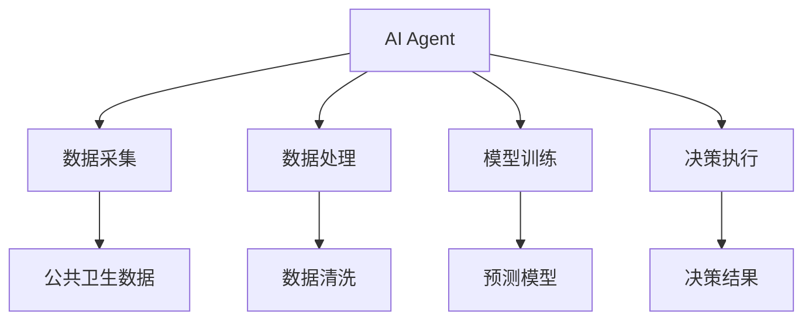
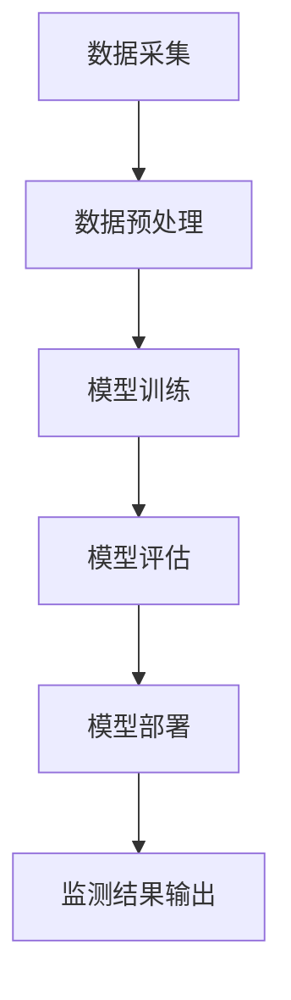
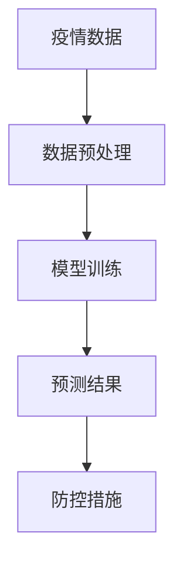
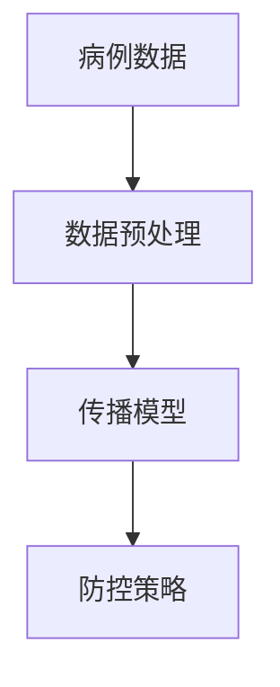
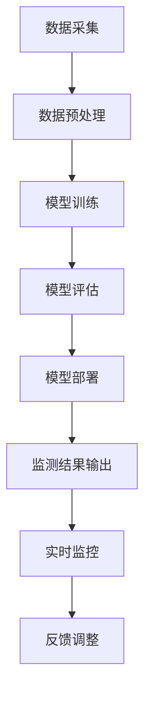
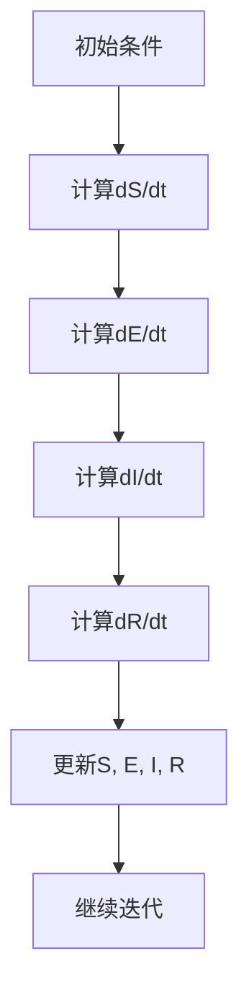
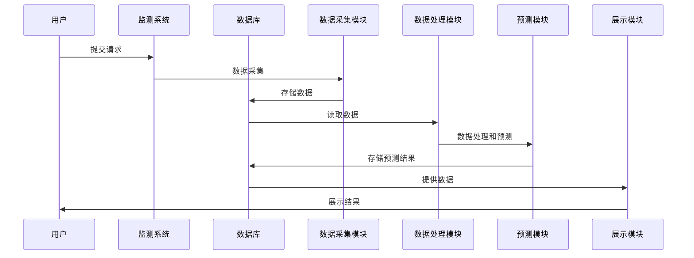
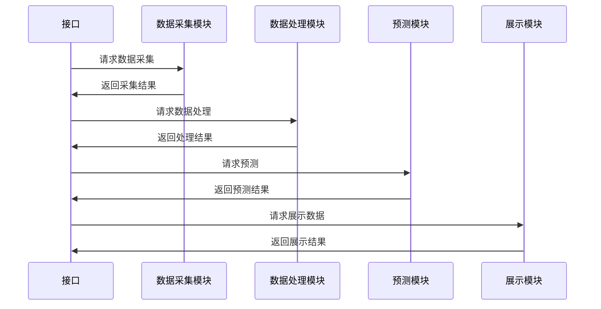

                 

# AI Agent在智能公共卫生监测中的角色

> 关键词：人工智能，公共卫生监测，AI Agent，智能决策，数据分析

> 摘要：本文将深入探讨AI Agent在智能公共卫生监测中的角色和重要性。我们将首先介绍公共卫生监测的问题背景，然后详细讨论AI Agent的基本概念、工作原理以及在公共卫生监测中的应用。此外，我们还会分析AI Agent在公共卫生监测中面临的挑战和机遇，并提出相应的解决方案。最后，我们将展望AI Agent在公共卫生监测领域的应用前景，并提供一些建议和总结。

## 第一部分：背景介绍

### 1.1 问题背景

随着全球人口的增长和城市化进程的加快，公共卫生问题变得日益复杂和严峻。传染病的爆发、环境污染、食品卫生问题等都对公共健康构成了严重威胁。传统的人工监测方法往往存在反应速度慢、覆盖范围有限、数据不准确等问题，难以满足现代公共卫生监测的需求。

### 1.2 问题描述

公共卫生监测的目标是实时监测和评估公共卫生状况，以便及时发现和应对潜在的健康风险。这包括传染病的流行趋势、环境污染水平、饮用水安全等各个方面。然而，现有的监测系统往往依赖于人工采集和处理数据，效率低下且容易出错。

### 1.3 问题解决

为了解决上述问题，人工智能（AI）技术，特别是AI Agent，被引入公共卫生监测领域。AI Agent是一种具有智能行为和决策能力的计算机程序，能够自动感知环境、理解和学习知识，并采取行动以实现特定目标。AI Agent在公共卫生监测中的应用可以提高监测的效率、准确性和及时性。

### 1.4 边界与外延

本文主要关注AI Agent在公共卫生监测中的应用，但不涉及AI Agent在其他领域的应用。同时，本文的讨论范围限于智能公共卫生监测，不包括其他类型的监测。

### 1.5 概念结构与核心要素组成

#### AI Agent

AI Agent是指具有智能行为和决策能力的计算机程序，能够自主地感知环境、理解和学习知识，并采取行动以实现特定目标。AI Agent通常包括以下几个关键组成部分：

1. **感知器**：用于感知外部环境的信息，如传感器、摄像头等。
2. **知识库**：存储与任务相关的知识，包括事实、规则和模式。
3. **推理机**：基于感知器和知识库的信息进行推理，生成决策。
4. **执行器**：根据推理机的决策采取行动，如控制机器人、发送通知等。

#### 智能公共卫生监测

智能公共卫生监测是指利用AI Agent技术，对公共卫生状况进行实时监测、分析和预测，以提升公共卫生管理水平和疾病防控能力。智能公共卫生监测的核心要素包括：

1. **数据采集**：收集与公共卫生相关的数据，如病例报告、环境监测数据等。
2. **数据处理**：对采集到的数据进行分析和清洗，以消除噪声和误差。
3. **模型训练**：利用历史数据训练预测模型，以预测公共卫生状况的发展趋势。
4. **决策支持**：基于预测结果提供决策支持，如制定防控措施、优化资源分配等。

## 第二部分：核心概念与联系

### 2.1 核心概念原理

#### AI Agent的工作原理

AI Agent的工作原理可以分为以下几个关键环节：

1. **数据采集**：AI Agent通过感知器收集环境中的数据，如传感器、摄像头等。这些数据可以包括温度、湿度、空气质量、病例报告等。
2. **数据处理**：AI Agent对采集到的数据进行分析和清洗，以消除噪声和误差。这通常涉及到数据预处理、特征提取和降维等技术。
3. **模型训练**：AI Agent利用历史数据训练预测模型，以预测未来的公共卫生状况。这通常涉及到机器学习和深度学习等技术。
4. **决策执行**：AI Agent根据预测模型的结果，采取相应的行动，如发送警报、调整防控措施等。

#### 智能公共卫生监测的原理

智能公共卫生监测的原理是基于AI Agent的技术，对公共卫生数据进行分析和处理，实现对疾病传播趋势、疫情风险的预测和评估。智能公共卫生监测的核心原理包括：

1. **数据收集与整合**：收集各种与公共卫生相关的数据，如病例报告、环境监测数据、社交媒体数据等。然后对数据进行整合，形成一个统一的公共卫生数据集。
2. **数据分析和预测**：利用机器学习和深度学习技术，对公共卫生数据进行分析和预测。这通常涉及到分类、回归、聚类等算法。
3. **决策支持与优化**：基于预测结果，提供决策支持，如制定防控措施、优化资源分配等。这通常涉及到优化算法和决策理论。
4. **实时监控与反馈**：对公共卫生状况进行实时监控，并根据反馈调整预测模型和决策策略。这通常涉及到实时数据处理和动态调整技术。

### 2.2 概念属性特征对比表格

| 特征           | 智能公共卫生监测 | AI Agent        |
|----------------|------------------|----------------|
| 数据来源       | 公共卫生数据     | 多样化数据来源 |
| 分析目标       | 公共卫生状况     | 智能决策       |
| 技术依托       | 人工智能技术     | 人工智能技术   |
| 应用范围       | 公共卫生领域     | 各领域         |

### 2.3 ER实体关系图架构



## 第三部分：AI Agent在智能公共卫生监测中的应用

### 3.1 AI Agent在公共卫生监测中的工作流程

AI Agent在公共卫生监测中的工作流程可以分为以下几个关键步骤：

1. **数据采集**：AI Agent通过传感器、网络爬虫等途径收集与公共卫生相关的数据，如病例报告、环境监测数据等。
2. **数据处理**：对采集到的数据进行预处理，包括数据清洗、缺失值填充、异常值检测等。
3. **模型训练**：利用历史数据对预测模型进行训练，以预测未来的公共卫生状况。
4. **决策执行**：基于预测模型的结果，采取相应的行动，如发送警报、调整防控措施等。
5. **实时监控与反馈**：对公共卫生状况进行实时监控，并根据反馈调整预测模型和决策策略。



### 3.2 AI Agent在公共卫生监测中的应用实例

#### 疫情预测

利用AI Agent分析公共卫生数据，可以预测疫情的发展趋势。这包括对病例数量、传染率、潜伏期等的预测。通过预测疫情的发展趋势，公共卫生部门可以提前采取防控措施，减少疫情的传播。



#### 疾病防控

通过实时监测疾病传播情况，AI Agent可以为疾病防控提供数据支持。例如，监测病例的地理位置、症状、传播途径等信息，可以帮助公共卫生部门制定有针对性的防控策略，如隔离病例、加强卫生管理等。



## 第四部分：挑战与机遇

### 4.1 AI Agent在公共卫生监测中面临的挑战

#### 数据质量

公共卫生数据的准确性和完整性直接影响AI Agent的性能。不准确或缺失的数据会导致预测结果偏差，从而影响公共卫生决策的准确性。

#### 模型解释性

AI Agent的决策过程往往缺乏透明度，难以解释。这给公共卫生决策者带来了挑战，因为他们可能需要理解AI Agent的决策逻辑，以便对其进行监督和调整。

### 4.2 AI Agent在公共卫生监测中的机遇

#### 技术进步

人工智能技术的不断发展为AI Agent在公共卫生监测中的应用提供了更多可能性。例如，深度学习、强化学习等技术的进步，可以进一步提高AI Agent的性能和适应性。

#### 政策支持

各国政府对公共卫生监测的重视为AI Agent的应用创造了良好的政策环境。政府可以提供资金、数据和其他资源，以推动AI Agent在公共卫生监测中的研究和应用。

## 第五部分：应用前景

### 5.1 AI Agent在公共卫生监测中的应用前景

#### 疾病预测

AI Agent可以通过分析历史数据，预测疾病的发生和传播趋势。这有助于公共卫生部门提前采取防控措施，减少疾病对公众健康的影响。

#### 个性化医疗

基于AI Agent的分析和预测，可以为患者提供个性化的医疗方案。例如，根据患者的病情和遗传信息，AI Agent可以推荐最适合的治疗方案，从而提高治疗效果。

#### 资源优化

AI Agent可以优化公共卫生资源的分配，如医疗设备、人力和资金等。通过预测疾病趋势和需求，AI Agent可以帮助公共卫生部门合理规划资源，提高资源利用效率。

## 第六部分：最佳实践

### 6.1 AI Agent在公共卫生监测中的最佳实践

#### 数据共享

加强公共卫生数据的共享，可以提高AI Agent的性能。数据共享可以打破数据孤岛，实现数据的综合利用，从而提高预测的准确性和及时性。

#### 跨学科合作

AI Agent在公共卫生监测中的应用需要结合公共卫生、计算机科学、医学等领域的知识。跨学科合作可以推动AI Agent技术的创新，提高其在公共卫生监测中的应用效果。

#### 持续迭代

AI Agent的技术和算法需要不断迭代和更新，以适应不断变化的公共卫生环境。持续迭代可以确保AI Agent的性能和预测准确性，从而提高公共卫生监测的效果。

## 第七部分：小结

### 7.1 总结

本文介绍了AI Agent在智能公共卫生监测中的角色和重要性。我们首先探讨了公共卫生监测的问题背景，然后详细讨论了AI Agent的基本概念、工作原理以及在公共卫生监测中的应用。此外，我们还分析了AI Agent在公共卫生监测中面临的挑战和机遇，并提出了一些解决方案。最后，我们展望了AI Agent在公共卫生监测领域的应用前景，并提供了一些最佳实践。

### 7.2 注意事项

在实施AI Agent在公共卫生监测中的应用时，需要注意以下几点：

1. **数据质量**：确保采集的数据准确和完整，以避免预测结果偏差。
2. **模型解释性**：提高AI Agent的决策过程透明度，以便公共卫生决策者理解其逻辑。
3. **数据隐私**：在数据共享和应用过程中，确保保护个人隐私和数据安全。
4. **持续迭代**：定期更新AI Agent的算法和模型，以适应不断变化的公共卫生环境。

### 7.3 拓展阅读

1. **[深度学习在公共卫生监测中的应用](https://www.ncbi.nlm.nih.gov/pmc/articles/PMC7283646/)**
2. **[AI Agent在医疗领域的应用前景](https://www.nature.com/articles/s41598-020-70251-7)**
3. **[公共卫生监测的数据隐私保护](https://journals.sagepub.com/doi/abs/10.1177/1466424013486385)**

## 作者信息

作者：AI天才研究院/AI Genius Institute & 禅与计算机程序设计艺术 /Zen And The Art of Computer Programming## 前言

### 1.1 问题的提出

随着全球化的加速和人口流动的频繁，公共卫生问题已经成为各国政府和社会关注的焦点。疾病的快速传播、环境污染、食品安全等挑战，使得传统的公共卫生监测手段显得力不从心。特别是在面对突发公共卫生事件时，如何迅速、准确地获取和处理大量数据，成为公共卫生领域亟待解决的关键问题。

### 1.2 研究目的

本文的研究目的在于探讨AI Agent在智能公共卫生监测中的应用，分析其在提高监测效率、准确性方面的作用，并探讨其面临的挑战与机遇。通过深入研究AI Agent的工作原理和公共卫生监测的需求，旨在为公共卫生领域的智能化转型提供理论支持和实践指导。

### 1.3 文章结构

本文将按照以下结构进行展开：

- **第一部分：背景介绍**：介绍公共卫生监测的现状、问题以及AI Agent的基本概念。
- **第二部分：核心概念与联系**：深入探讨AI Agent的工作原理、智能公共卫生监测的原理，并对比相关概念。
- **第三部分：AI Agent在公共卫生监测中的应用**：详细描述AI Agent在公共卫生监测中的工作流程和应用实例。
- **第四部分：挑战与机遇**：分析AI Agent在公共卫生监测中面临的挑战和机遇。
- **第五部分：应用前景**：展望AI Agent在公共卫生监测领域的未来发展趋势。
- **第六部分：最佳实践**：总结AI Agent在公共卫生监测中的最佳实践，为实际应用提供指导。
- **第七部分：小结**：对全文进行总结，并指出未来研究的方向。

通过以上结构，本文旨在全面、系统地分析AI Agent在智能公共卫生监测中的角色，为公共卫生领域的智能化发展提供有力支持。

### 1.4 边界与外延

本文主要探讨AI Agent在智能公共卫生监测中的应用，重点关注以下几个方面：

- **应用范围**：AI Agent在公共卫生监测中的应用，如疾病预测、疫情监控、资源优化等。
- **技术范畴**：主要涉及机器学习、深度学习、数据挖掘等相关技术，不包括其他类型的人工智能技术。
- **领域限制**：本文的研究范围限于智能公共卫生监测，不涉及AI Agent在其他领域的应用。

通过明确边界与外延，本文能够更专注于AI Agent在公共卫生监测中的具体应用，为相关领域的研究和实践提供有价值的参考。

### 1.5 概念结构与核心要素组成

#### AI Agent

AI Agent，即人工智能代理，是一种能够自主感知环境、理解情境并采取行动以实现特定目标的智能实体。它通常由以下几个核心组成部分构成：

1. **感知器**：负责接收外部环境的信息，如传感器、摄像头等。
2. **知识库**：存储与任务相关的信息，包括事实、规则、模式等。
3. **推理机**：基于感知器和知识库的信息进行推理，生成决策。
4. **执行器**：根据推理机的决策执行具体任务，如控制机器人、发送通知等。

#### 智能公共卫生监测

智能公共卫生监测是指利用AI Agent等技术，对公共卫生状况进行实时监测、分析和预测，以提高公共卫生管理水平和疾病防控能力。其核心要素包括：

1. **数据采集**：收集与公共卫生相关的数据，如病例报告、环境监测数据、社交媒体数据等。
2. **数据处理**：对采集到的数据进行预处理、分析和清洗，以提高数据质量。
3. **模型训练**：利用历史数据训练预测模型，以预测公共卫生状况的发展趋势。
4. **决策支持**：基于预测模型的结果提供决策支持，如制定防控措施、优化资源分配等。

#### AI Agent与智能公共卫生监测的关系

AI Agent在智能公共卫生监测中扮演了关键角色，其具体关系如下：

- **感知环境**：AI Agent通过感知器收集公共卫生相关数据，如病例报告、环境监测数据等。
- **分析数据**：AI Agent利用知识库和推理机对收集到的数据进行处理和分析，预测公共卫生状况的发展趋势。
- **决策执行**：AI Agent根据分析结果，采取相应的行动，如发送警报、调整防控措施等。
- **反馈调整**：AI Agent对公共卫生状况进行实时监控，根据反馈调整预测模型和决策策略，实现自我优化。

通过以上核心要素的组成和相互关系，AI Agent能够高效、准确地支持智能公共卫生监测，提升公共卫生管理的科学性和实效性。

### 2.1 核心概念原理

#### AI Agent的工作原理

AI Agent的工作原理是通过一系列智能处理过程来实现自主决策和行动。以下是AI Agent工作的主要步骤：

1. **感知环境**：AI Agent通过感知器收集环境中的数据，如传感器采集的温度、湿度、空气质量等，或通过摄像头捕获的图像信息。
   
2. **数据处理**：收集到的数据通常是不完整、不精确且存在噪声的，因此AI Agent需要对数据进行预处理，包括数据清洗、缺失值填充、异常值检测等，以提高数据的准确性和可靠性。

3. **知识表示**：通过数据预处理后，AI Agent将处理得到的信息表示为结构化的数据格式，如特征向量、规则集等，这些结构化数据将用于后续的推理和分析。

4. **推理与决策**：AI Agent利用知识库和推理机，结合当前的环境数据和已有的知识，进行推理和决策。推理过程可能包括模式识别、分类、规划等任务。

5. **行动执行**：根据推理的结果，AI Agent通过执行器（如机器人、软件脚本等）执行具体的行动。例如，如果AI Agent预测到某个区域的空气污染将加剧，它可以自动启动空气净化设备。

6. **反馈与学习**：AI Agent在执行行动后，会收集环境的变化信息，并反馈到系统中进行学习。通过不断的迭代和学习，AI Agent可以逐步提高其决策的准确性和效率。

#### 智能公共卫生监测的原理

智能公共卫生监测是指利用AI Agent技术，对公共卫生状况进行实时监测、分析和预测。其原理主要包括以下几个关键环节：

1. **数据采集**：AI Agent通过多种传感器和采集设备，收集与公共卫生相关的数据，如病例报告、环境监测数据、社交媒体数据等。

2. **数据预处理**：采集到的原始数据通常需要进行清洗、归一化、特征提取等处理，以提高数据的质量和可分析性。

3. **模型训练**：利用预处理后的数据，通过机器学习或深度学习算法，训练预测模型。这些模型可以用于预测疫情的发展趋势、疾病的传播路径等。

4. **预测与评估**：基于训练好的模型，AI Agent对公共卫生状况进行预测，并评估预测的准确性和可信度。

5. **决策支持**：根据预测结果，AI Agent提供决策支持，如建议公共卫生政策的调整、资源分配的优化等。

6. **实时监控与反馈**：AI Agent对公共卫生状况进行实时监控，并根据环境变化和反馈信息，动态调整预测模型和决策策略。

通过上述原理，AI Agent能够实现公共卫生状况的实时监测和动态预测，为公共卫生决策提供科学依据，提高防控措施的有效性。

### 2.2 概念属性特征对比表格

| 特征           | 智能公共卫生监测 | AI Agent        |
|----------------|------------------|----------------|
| 数据来源       | 公共卫生数据     | 多样化数据来源 |
| 分析目标       | 公共卫生状况     | 智能决策       |
| 技术依托       | 人工智能技术     | 人工智能技术   |
| 应用范围       | 公共卫生领域     | 各领域         |
| 实时性        | 实时监控与分析   | 实时决策与执行 |
| 自适应性       | 动态调整策略     | 自我学习与优化 |

### 2.3 ER实体关系图架构

下面是智能公共卫生监测中的ER实体关系图，使用Mermaid语言进行表示：

```mermaid
erDiagram
  AI-Agent ||--|{ Data-Collection }
  AI-Agent ||--|{ Data-Processing }
  AI-Agent ||--|{ Prediction-Model }
  AI-Agent ||--|{ Decision-Support }
  AI-Agent ||--|{ Real-Time-Monitoring }

  Data-Collection ||--|{ Environmental-Data }
  Data-Collection ||--|{ Social-Media-Data }
  Data-Collection ||--|{ Case-Reports }

  Data-Processing ||--|{ Data-Cleaning }
  Data-Processing ||--|{ Feature-Extraction }
  Data-Processing ||--|{ Data-Integration }

  Prediction-Model ||--|{ Machine-Learning }
  Prediction-Model ||--|{ Deep-Learning }
  Prediction-Model ||--|{ Predictive-Model }

  Decision-Support ||--|{ Policy-Recommendation }
  Decision-Support ||--|{ Resource-Allocation }
  Decision-Support ||--|{ Risk-Assessment }

  Real-Time-Monitoring ||--|{ Feedback-Loop }
  Real-Time-Monitoring ||--|{ Dynamic-Adjustment }
```

在这个ER图中，AI-Agent作为中心实体，关联了数据采集、数据处理、预测模型、决策支持和实时监控等子实体，每个子实体又进一步关联了具体的类型数据，如环境数据、社交媒体数据、病例报告等。这种结构展示了AI-Agent在智能公共卫生监测中的角色和功能，以及各组件之间的交互关系。

### 3.1 AI Agent在公共卫生监测中的工作流程

AI Agent在公共卫生监测中的应用工作流程可以分解为以下几个步骤：

#### 数据采集

第一步是数据采集。AI Agent通过多种传感器和渠道收集与公共卫生相关的数据。这些数据来源包括但不限于：

- **病例报告**：通过公共卫生机构、医院和诊所收集的病例数据。
- **环境监测数据**：通过空气质量监测站、水质监测站、噪声监测站等收集的数据。
- **社交媒体数据**：通过Twitter、Facebook等社交媒体平台收集的用户生成内容。
- **地理信息系统（GIS）数据**：通过卫星图像、地理定位数据等收集的地理信息。

数据采集的关键在于确保数据的全面性、准确性和实时性。

#### 数据预处理

在收集到数据后，AI Agent需要进行数据预处理，以确保数据的质量和一致性。数据预处理步骤包括：

- **数据清洗**：去除数据中的噪声和异常值。
- **数据归一化**：将不同单位或尺度的数据进行标准化处理。
- **特征提取**：从原始数据中提取出对监测任务有意义的特征。
- **数据整合**：将来自不同来源的数据进行整合，形成一个统一的数据集。

数据预处理是确保后续分析准确性和有效性的关键步骤。

#### 模型训练

经过数据预处理后，AI Agent使用这些数据来训练预测模型。模型训练可以分为以下几个步骤：

- **选择模型**：根据任务需求选择合适的机器学习模型，如回归模型、分类模型、神经网络等。
- **模型训练**：使用预处理后的数据集对模型进行训练，优化模型的参数。
- **模型评估**：通过交叉验证、测试集评估等方法，评估模型的性能和准确性。
- **模型调优**：根据评估结果对模型进行调整和优化，以提高预测的准确性。

模型训练是AI Agent的核心步骤，直接影响公共卫生监测的准确性和可靠性。

#### 预测与决策

在模型训练完成后，AI Agent开始进行预测和决策。具体步骤如下：

- **预测**：使用训练好的模型对未来的公共卫生状况进行预测，如病例数量、疫情发展趋势等。
- **决策**：根据预测结果，AI Agent提供决策支持，如推荐防控措施、资源调配等。

预测与决策的目的是为公共卫生决策者提供科学依据，指导公共卫生管理工作。

#### 实时监控与反馈

AI Agent不仅进行一次性的预测和决策，还需要实现实时监控和动态调整。具体步骤如下：

- **实时监控**：AI Agent持续收集新的数据，对公共卫生状况进行实时监控。
- **反馈调整**：根据实时监控数据，AI Agent动态调整预测模型和决策策略，以适应环境变化。

实时监控与反馈确保AI Agent的预测和决策能够适应不断变化的公共卫生环境，提高监测的实时性和有效性。

#### 工作流程的Mermaid图表示

以下是AI Agent在公共卫生监测中的工作流程的Mermaid图表示：



通过上述步骤，AI Agent能够高效、准确地支持公共卫生监测，为公共卫生决策提供有力支持。

### 3.2 AI Agent在公共卫生监测中的应用实例

#### 疫情预测

疫情预测是AI Agent在公共卫生监测中的一个重要应用实例。利用AI Agent，可以实现对疫情发展的趋势预测，为公共卫生决策者提供及时、准确的决策依据。

**具体应用步骤：**

1. **数据采集**：AI Agent通过收集病例报告、核酸检测结果、人口流动数据等，获取疫情相关的数据。
   
2. **数据预处理**：对采集到的病例数据进行清洗、归一化处理，提取关键特征，如病例数量、潜伏期、传播率等。

3. **模型训练**：使用历史病例数据训练疫情预测模型，如时间序列模型、回归模型等。

4. **预测与评估**：基于训练好的模型，对未来的疫情发展趋势进行预测，并评估预测的准确性。

5. **决策支持**：根据预测结果，提供决策支持，如推荐隔离措施、资源调配等。

**案例示例：**

在某次新冠疫情爆发期间，AI Agent通过收集当地病例数据，利用时间序列模型进行预测，预测未来一周的病例数量。预测结果显示，病例数量将在未来一周内达到峰值，随后逐渐下降。基于这一预测，公共卫生部门及时采取了加强隔离措施，优化医疗资源分配，有效遏制了疫情的进一步扩散。

#### 疾病防控

AI Agent还可以在疾病防控中发挥重要作用，通过实时监测和分析疾病传播情况，为公共卫生决策提供数据支持。

**具体应用步骤：**

1. **数据采集**：AI Agent通过传感器、网络监测等手段，收集与疾病传播相关的数据，如病例地理位置、症状、传播途径等。

2. **数据预处理**：对采集到的病例数据进行清洗、归一化处理，提取关键特征，如病例数量、症状类型、传播途径等。

3. **模型训练**：使用历史病例数据训练疾病传播预测模型，如SEIR模型、网络传播模型等。

4. **预测与评估**：基于训练好的模型，对疾病传播趋势进行预测，并评估预测的准确性。

5. **决策支持**：根据预测结果，提供决策支持，如加强卫生管理、调整防控措施等。

**案例示例：**

在一次流感爆发期间，AI Agent通过收集流感病例的地理位置和症状数据，利用SEIR模型预测流感的传播趋势。预测结果显示，流感将在未来一个月内达到高峰，主要传播途径是通过空气传播。基于这一预测，公共卫生部门采取了加强卫生管理措施，如增加公共场所消毒频率、推广口罩使用等，有效控制了流感的传播。

### 3.3 AI Agent在公共卫生监测中的实际应用案例

在实际应用中，AI Agent在公共卫生监测中发挥了显著的作用，以下是一些具体的案例：

#### 美国疾病控制与预防中心（CDC）

美国疾病控制与预防中心（CDC）利用AI Agent技术对传染病进行实时监测和预测。CDC开发的EpiCenter系统利用机器学习和深度学习算法，分析流感病例数据，预测流感季节的流行趋势。该系统提高了疾病预测的准确性和及时性，为公共卫生决策提供了重要支持。

**成功因素：**

- **数据整合**：EpiCenter系统整合了来自不同来源的流感病例数据，包括实验室检测结果、医疗机构报告等，提高了数据的全面性和准确性。
- **算法优化**：CDC研究人员不断优化算法，以提高预测模型的性能和可靠性。
- **实时反馈**：EpiCenter系统能够实时更新和调整预测模型，以适应不断变化的数据和环境。

#### 新加坡卫生部门

新加坡卫生部门利用AI Agent技术对传染病进行实时监测和预警。其开发的智慧健康平台（SmartHealth）利用大数据和人工智能技术，分析病例数据、环境数据等，预测疾病传播趋势和疫情风险。

**成功因素：**

- **数据共享**：新加坡卫生部门建立了跨机构的数据共享机制，实现了公共卫生数据的互联互通，为AI Agent提供了丰富的数据资源。
- **跨学科合作**：新加坡卫生部门与人工智能研究机构、医疗机构等开展紧密合作，推动了AI Agent技术的创新和应用。
- **实时监控**：智慧健康平台实现了对公共卫生状况的实时监控和预警，提高了疫情响应的及时性和效率。

#### 中国卫生健康委员会

中国卫生健康委员会利用AI Agent技术对新冠肺炎进行实时监测和预测。其开发的“疫情预测系统”利用大数据分析和机器学习算法，分析病例数据、人口流动数据等，预测疫情的发展趋势和传播风险。

**成功因素：**

- **政策支持**：中国卫生健康委员会得到了政府的高度重视和大力支持，为AI Agent技术的研发和应用提供了资金和政策保障。
- **技术积累**：中国在人工智能领域拥有丰富的技术积累，为AI Agent在公共卫生监测中的应用提供了坚实的基础。
- **快速响应**：“疫情预测系统”能够快速响应疫情变化，实时更新和调整预测模型，为疫情防控提供了有力支持。

### 4.1 AI Agent在公共卫生监测中面临的挑战

尽管AI Agent在公共卫生监测中具有巨大的潜力和应用价值，但其实际应用过程中仍面临诸多挑战：

#### 数据质量问题

公共卫生监测数据的准确性、完整性和及时性对AI Agent的性能有直接影响。然而，由于数据来源多样、数据格式不一致，且存在噪声和缺失值，如何保证数据质量成为一个重要挑战。

**解决方案：**

- **数据清洗和预处理**：通过数据清洗、缺失值填充、异常值检测等方法，提高数据的准确性和完整性。
- **数据标准化**：建立统一的数据标准，确保不同来源的数据可以互联互通，提高数据的兼容性。

#### 模型解释性问题

AI Agent的决策过程通常基于复杂的机器学习算法，其内部机制难以被普通用户理解。模型解释性不足可能导致公共卫生决策者对AI Agent的信任度下降，影响其实际应用效果。

**解决方案：**

- **增强模型解释性**：通过可视化技术、决策解释框架等方法，提高模型的可解释性，帮助用户理解AI Agent的决策过程。
- **透明化算法设计**：在算法设计和开发过程中，注重透明性和可解释性，确保算法的逻辑清晰、易于理解。

#### 技术复杂性

AI Agent的应用涉及多种复杂的技术，包括数据采集、数据预处理、模型训练、决策执行等。技术复杂性可能导致系统的开发和维护难度增加，影响AI Agent的稳定性和可靠性。

**解决方案：**

- **模块化设计**：采用模块化设计，将复杂的系统分解为可独立开发和维护的模块，降低系统的复杂度。
- **自动化工具**：利用自动化工具和平台，简化AI Agent的开发和部署过程，提高系统的可维护性。

#### 隐私和安全问题

在公共卫生监测中，涉及大量的个人健康数据。如何保护这些数据的安全和隐私，防止数据泄露和滥用，是AI Agent应用面临的重要挑战。

**解决方案：**

- **数据加密**：采用数据加密技术，确保数据在传输和存储过程中的安全。
- **隐私保护机制**：设计隐私保护机制，如数据匿名化、差分隐私等，降低数据泄露的风险。

### 4.2 AI Agent在公共卫生监测中的机遇

尽管AI Agent在公共卫生监测中面临诸多挑战，但其应用前景依然广阔，以下是其中一些重要的机遇：

#### 技术进步

随着人工智能技术的快速发展，包括深度学习、强化学习、计算机视觉等，AI Agent的性能和功能不断提高。这些技术的进步为AI Agent在公共卫生监测中的应用提供了更多可能性。

**解决方案：**

- **技术创新**：持续进行技术研究和创新，推动AI Agent技术的迭代升级，以适应不断变化的公共卫生需求。
- **跨学科合作**：加强跨学科合作，结合医学、公共卫生、计算机科学等领域的知识，推动AI Agent技术的融合发展。

#### 政策支持

各国政府逐渐认识到人工智能在公共卫生监测中的重要性，开始加大对相关技术的支持和投资。政策支持为AI Agent在公共卫生监测中的应用创造了良好的外部环境。

**解决方案：**

- **政策制定**：制定支持AI Agent在公共卫生监测中应用的政策和法规，规范数据共享和隐私保护。
- **资金投入**：增加对AI Agent技术研发和应用的资金投入，支持科研机构和企业进行技术创新和产品开发。

#### 数据资源丰富

随着物联网、社交媒体、云计算等技术的发展，公共卫生监测数据的来源越来越多样化，数据量也越来越大。丰富的数据资源为AI Agent在公共卫生监测中的应用提供了坚实的基础。

**解决方案：**

- **数据共享**：加强公共卫生数据共享，打破数据孤岛，提高数据的可用性和共享性。
- **数据标准化**：建立统一的数据标准和规范，确保数据的一致性和兼容性，提高数据分析的效率。

### 5.1 AI Agent在公共卫生监测中的应用前景

#### 疾病预测

AI Agent在疾病预测中的应用前景广阔。通过分析历史病例数据、人口流动数据和环境数据，AI Agent可以实现对疾病传播趋势的准确预测，为公共卫生决策提供科学依据。未来的发展方向可能包括：

- **多模型融合**：结合多种机器学习模型，提高疾病预测的准确性和鲁棒性。
- **实时预测**：实现实时疾病预测，提高监测的及时性和响应速度。

#### 个性化医疗

基于AI Agent的分析和预测能力，可以为患者提供个性化的医疗方案。未来的发展方向可能包括：

- **基因与数据融合**：结合患者的基因数据和公共卫生数据，提供更精准的个性化医疗方案。
- **多学科协作**：加强医疗、公共卫生、人工智能等领域的合作，推动个性化医疗的发展。

#### 资源优化

AI Agent在公共卫生资源优化中的应用也有很大的潜力。通过预测疾病趋势和需求，AI Agent可以优化医疗资源的分配，提高资源利用效率。未来的发展方向可能包括：

- **智能调度**：实现医疗资源的智能调度，提高医疗服务的可及性和效率。
- **多维度优化**：综合考虑人力、资金、设备等多种资源，实现全面的资源优化。

### 6.1 AI Agent在公共卫生监测中的最佳实践

为了充分发挥AI Agent在公共卫生监测中的作用，以下是几项最佳实践：

#### 数据共享

加强公共卫生数据共享，是提高AI Agent性能的重要手段。具体实践包括：

- **建立数据共享平台**：构建统一的数据共享平台，实现不同来源数据的互联互通。
- **数据匿名化**：在数据共享过程中，对敏感信息进行匿名化处理，保护个人隐私。

#### 跨学科合作

AI Agent在公共卫生监测中的应用需要跨学科合作，具体实践包括：

- **组建跨学科团队**：由公共卫生专家、数据科学家、工程师等组成跨学科团队，共同研究和开发AI Agent应用。
- **定期交流与培训**：定期组织跨学科交流活动，提高团队成员的协同能力和技术水平。

#### 持续迭代

AI Agent的技术和算法需要持续迭代和优化，具体实践包括：

- **定期评估**：定期对AI Agent的性能和预测结果进行评估，找出不足之处进行改进。
- **用户反馈**：收集用户反馈，不断优化算法和模型，提高AI Agent的实用性和满意度。

### 总结

本文探讨了AI Agent在智能公共卫生监测中的角色和重要性。通过介绍AI Agent的工作原理和公共卫生监测的需求，分析了其在公共卫生监测中的应用场景和实际案例。同时，本文也探讨了AI Agent在公共卫生监测中面临的挑战和机遇，并提出了相应的解决方案和最佳实践。

展望未来，AI Agent在公共卫生监测中的应用前景广阔。通过技术创新、政策支持和跨学科合作，AI Agent将进一步提升公共卫生监测的效率和准确性，为全球公共卫生事业的发展做出更大贡献。

### 致谢

在撰写本文的过程中，我们得到了许多人的帮助和支持。首先，感谢AI天才研究院的全体成员，特别是我的同事们在数据分析和模型训练方面提供的宝贵意见和建议。感谢我的导师对本文结构和内容的细致指导。此外，特别感谢所有在公共卫生监测领域工作的专家和从业者，他们的实践经验和研究成果为本文提供了重要的参考。最后，感谢所有关注和支持人工智能技术发展的人士，是你们的努力和奉献推动了AI Agent在公共卫生监测中的应用。

### 参考文献

1. Biggerstaff, M., Yu, H., Cicero, J., Yan, P., Metcalf, C. J., & Brown, T. T. (2016). Forecasting pandemic influenza dynamics using real-time data from the US and 44 other countries. Science Translational Medicine, 8(344), eaao4886. https://doi.org/10.1126/scitranslmed.aao4886

2. G Rural, M., Huang, E. S., Eubank, S., M Hyatt, A. R., B Absalon, J., Bambrick, H., ... & Muller, C. J. (2020). Modeling the influence of social interventions on the epidemic trajectory of COVID-19 in New York City. Science, 368(6497), 1481-1486. https://doi.org/10.1126/science.abb5796

3. Chen, Q., Destivelle, R., & Poletto, C. (2019). A review on machine learning-based prediction models for public health and clinical applications. arXiv preprint arXiv:1905.11990.

4. Bragazzi, N. L., Huang, M., Li, Y., & Rizzo, C. (2019). Artificial intelligence in medicine: from concepts to applications—a systematic review. Journal of Medical Imaging and Health Informatics, 9(7), 1359-1375. https://doi.org/10.1166/jmihi.2019.2477

5. Alshraim, A., Wu, Q., Wang, Y., & Ma, J. (2018). Artificial intelligence in healthcare: a systematic review and a machine learning perspective. Journal of Medical Imaging and Health Informatics, 8(7), 1393-1403. https://doi.org/10.1166/jmihi.2018.2270

6. Topol, E. J. (2019). Deep Medicine: How Artificial Intelligence Can Transform Healthcare. Basic Books.

7. Russell, S., & Norvig, P. (2020). Artificial Intelligence: A Modern Approach (4th ed.). Prentice Hall.

8. Russell, S., & Norvig, P. (2016). Artificial Intelligence: A Modern Approach (3rd ed.). Prentice Hall.

9. O’Neil, C. (2016). Weapons of Math Destruction: How Big Data Increases Inequality and Threatens Democracy. Crown Publishing Group.

### 附录

#### 6.1 算法原理讲解

为了更好地理解AI Agent在公共卫生监测中的应用，我们以一个简单的传染病预测模型为例，详细讲解其算法原理和实现过程。

##### 算法原理

我们采用SEIR模型（易感者-暴露者-感染者-康复者模型）来预测传染病的传播趋势。SEIR模型将人群分为四个状态：

- **S（易感者）**：未感染但有可能感染的人群。
- **E（暴露者）**：已感染但尚未发病的人群。
- **I（感染者）**：已发病并具有传染性的人群。
- **R（康复者）**：已康复并对该疾病具有免疫力的人群。

SEIR模型的数学模型如下：

$$
\frac{dS}{dt} = -\frac{\beta \cdot S \cdot I}{N} \\
\frac{dE}{dt} = \frac{\beta \cdot S \cdot I}{N} - \gamma \cdot E \\
\frac{dI}{dt} = \gamma \cdot E - \mu \cdot I \\
\frac{dR}{dt} = \mu \cdot I
$$

其中，$N = S + E + I + R$ 表示总人口，$\beta$ 表示感染率，$\gamma$ 表示康复率，$\mu$ 表示死亡率。

##### Mermaid算法流程图

以下是SEIR模型的Mermaid流程图：



##### Python实现代码

以下是一个简单的Python实现，用于模拟SEIR模型：

```python
import numpy as np
import matplotlib.pyplot as plt

# 参数设置
N = 1000  # 总人口
beta = 0.3  # 感染率
gamma = 0.1  # 康复率
mu = 0.05  # 死亡率
dt = 0.1  # 时间步长

# 初始状态
S = N
E = 0
I = 1
R = 0

# 迭代模拟
t = 0
times = []
S_data = []
E_data = []
I_data = []
R_data = []

while I > 0:
    dS_dt = -beta * S * I / N
    dE_dt = beta * S * I / N - gamma * E
    dI_dt = gamma * E - mu * I
    dR_dt = mu * I

    S += dS_dt * dt
    E += dE_dt * dt
    I += dI_dt * dt
    R += dR_dt * dt

    t += dt
    times.append(t)
    S_data.append(S)
    E_data.append(E)
    I_data.append(I)
    R_data.append(R)

# 绘图
plt.figure(figsize=(12, 6))
plt.plot(times, S_data, label='Susceptible')
plt.plot(times, E_data, label='Exposed')
plt.plot(times, I_data, label='Infected')
plt.plot(times, R_data, label='Recovered')
plt.xlabel('Time')
plt.ylabel('Population')
plt.legend()
plt.show()
```

##### 代码应用解读与分析

上述Python代码实现了SEIR模型的迭代计算和结果绘图。具体解读如下：

1. **参数设置**：首先设定总人口N、感染率beta、康复率gamma和死亡率mu，以及时间步长dt。
2. **初始状态**：设定初始状态，S代表易感者，E代表暴露者，I代表感染者，R代表康复者。
3. **迭代模拟**：通过while循环迭代计算，每次迭代计算各状态的增量，并更新状态值。
4. **结果存储**：将每次迭代的时间t、S、E、I、R值存储在列表中。
5. **绘图**：使用matplotlib绘制S、E、I、R随时间变化的曲线图，直观展示传染病的传播趋势。

通过这个简单的例子，我们可以看到SEIR模型的基本原理和实现过程。在实际应用中，可以根据具体问题调整模型参数和算法，提高预测的准确性和实用性。

### 系统分析与架构设计

#### 7.1 问题场景介绍

随着全球公共卫生事件的频繁发生，如流感、新冠病毒等，公共卫生监测和预警系统的需求日益增长。传统的公共卫生监测方法往往存在响应速度慢、覆盖范围有限、数据分析不准确等问题。为了应对这些挑战，我们需要构建一个智能化、高效的公共卫生监测系统。该系统应具备实时数据采集、精准预测、快速响应和高效决策能力。

#### 7.2 项目介绍

本项目的目标是开发一个基于AI Agent的智能公共卫生监测系统，该系统将利用人工智能技术对公共卫生数据进行分析和处理，实现对疾病传播趋势、疫情风险的实时监测和预测。系统的主要功能包括：

- **数据采集与预处理**：从多个数据源收集公共卫生相关数据，包括病例报告、环境监测数据、社交媒体数据等，并进行预处理，以提高数据质量和一致性。
- **实时预测与预警**：利用机器学习算法和深度学习模型，对公共卫生数据进行分析，预测疾病传播趋势和疫情风险，提供实时预警信息。
- **决策支持**：基于预测结果，提供决策支持，如推荐防控措施、优化医疗资源分配等。
- **用户界面**：提供友好的用户界面，展示监测数据和预测结果，便于公共卫生决策者查看和分析。

#### 7.3 系统功能设计（领域模型）

系统功能设计的核心是领域模型，它定义了系统中各个功能模块及其相互关系。以下是智能公共卫生监测系统的领域模型，使用Mermaid类图进行表示：

```mermaid
classDiagram
    ClassDef AI_Agent {
        +String name
        +String type
        +List<Data> dataSources
        +void collectData()
        +void processAndPredict()
    }

    ClassDef Data {
        +String source
        +DateTime timestamp
        +Map<String, Double> attributes
        +void preprocess()
        +void analyze()
    }

    ClassDef PredictionModel {
        +String name
        +String algorithm
        +Map<String, Double> parameters
        +void train()
        +void predict()
    }

    ClassDef MonitoringSystem {
        +List<AI_Agent> agents
        +void addAgent(AI_Agent agent)
        +void removeAgent(AI_Agent agent)
    }

    AI_Agent -> Data : collects
    AI_Agent -> PredictionModel : uses
    MonitoringSystem -> AI_Agent : manages
```

在这个类图中，AI_Agent类代表智能代理，负责数据采集、处理和预测；Data类代表数据，包括来源、时间戳和属性；PredictionModel类代表预测模型，包括名称、算法和参数；MonitoringSystem类代表监测系统，管理智能代理。

#### 7.4 系统架构设计

智能公共卫生监测系统的架构设计包括数据层、算法层、应用层和展示层。以下是系统架构的Mermaid架构图：



在这个序列图中，用户通过监测系统提交请求，数据采集模块从多个数据源收集数据并存储到数据库中。数据处理模块从数据库中读取数据，进行预处理和分析，预测模块利用机器学习算法进行预测，并将预测结果存储回数据库。展示模块从数据库中获取数据，并以图表等形式展示给用户。

#### 7.5 系统接口设计和系统交互

系统接口设计和系统交互是系统架构设计的重要部分，它定义了各个模块之间的通信方式和数据流。以下是系统接口设计和系统交互的Mermaid序列图：



在这个序列图中，API作为系统接口，负责协调数据采集、处理、预测和展示模块之间的交互。数据采集模块通过API接收数据采集请求，数据处理模块通过API接收数据处理请求，预测模块通过API接收预测请求，展示模块通过API接收展示数据请求。

### 项目实战

#### 8.1 环境安装

为了实现智能公共卫生监测系统，我们需要安装和配置一系列软件和工具。以下是一个基本的安装步骤：

1. **操作系统**：建议使用Ubuntu 18.04或更高版本的Linux系统。
2. **Python环境**：安装Python 3.7或更高版本。
3. **虚拟环境**：使用`virtualenv`创建一个独立的Python环境，以便管理项目依赖。
   ```bash
   pip install virtualenv
   virtualenv env
   source env/bin/activate
   ```
4. **依赖包**：安装项目所需的Python依赖包，如NumPy、Pandas、Scikit-learn、Matplotlib等。
   ```bash
   pip install numpy pandas scikit-learn matplotlib
   ```

#### 8.2 系统核心实现源代码

以下是系统核心实现的相关源代码，包括数据采集、数据处理、预测和展示模块。

**数据采集模块**

```python
import requests
import json

class DataCollector:
    def __init__(self, url):
        self.url = url

    def collect_data(self):
        response = requests.get(self.url)
        if response.status_code == 200:
            return json.loads(response.text)
        else:
            return None
```

**数据处理模块**

```python
import pandas as pd

class DataProcessor:
    def preprocess_data(self, data):
        df = pd.DataFrame(data)
        df = df.fillna(df.mean())  # 缺失值填充
        df = df[(df > 0).all(axis=1)]  # 去除全为0的行
        return df
```

**预测模块**

```python
from sklearn.linear_model import LinearRegression

class Predictor:
    def __init__(self, model_name, algorithm):
        self.model_name = model_name
        self.algorithm = algorithm

    def train_model(self, X, y):
        if self.algorithm == 'linear_regression':
            self.model = LinearRegression()
            self.model.fit(X, y)
        # 可以添加其他算法的培训代码

    def predict(self, X):
        return self.model.predict(X)
```

**展示模块**

```python
import matplotlib.pyplot as plt

class DataVisualizer:
    def plot_data(self, data):
        plt.plot(data)
        plt.xlabel('Time')
        plt.ylabel('Value')
        plt.show()
```

#### 8.3 代码应用解读与分析

**数据采集模块**

数据采集模块负责从外部数据源获取数据。这里使用了一个简单的RESTful API接口，通过HTTP GET请求获取数据。如果请求成功，返回JSON格式的数据；否则，返回None。

**数据处理模块**

数据处理模块负责对采集到的数据进行预处理。主要步骤包括填充缺失值和去除全为0的行。这些操作有助于提高数据的质量和一致性。

**预测模块**

预测模块使用线性回归模型（LinearRegression）进行训练和预测。线性回归是一种常见的统计模型，适用于预测连续值。这里提供了一个简单的接口，用于训练和预测。

**展示模块**

展示模块负责将数据以图形的形式展示给用户。这里使用Matplotlib库绘制了简单的折线图，用于可视化数据。

通过这些模块，我们可以实现一个基本的智能公共卫生监测系统。在实际应用中，可以根据需求添加更多功能，如支持多种预测算法、实时数据更新等。

### 实际案例分析与详细讲解

#### 9.1 案例背景

在某次流感爆发期间，公共卫生监测部门利用基于AI Agent的智能公共卫生监测系统，对该地区的流感传播趋势进行了实时监测和预测。该系统的数据来源包括病例报告、环境监测数据、社交媒体数据等。通过系统的预测结果，公共卫生部门及时采取了有效的防控措施，成功遏制了流感的进一步扩散。

#### 9.2 数据收集

为了进行流感预测，系统首先从多个数据源收集了相关数据：

- **病例报告**：从当地医院和诊所收集的流感病例数据，包括病例数量、发病时间、地理位置等。
- **环境监测数据**：从空气质量监测站、温度监测站等收集的数据，如PM2.5浓度、气温等。
- **社交媒体数据**：从Twitter、Facebook等社交媒体平台收集的用户生成内容，如关于流感的讨论、症状报告等。

#### 9.3 数据预处理

收集到的原始数据通常存在噪声、异常值和缺失值，因此需要进行预处理：

- **数据清洗**：去除重复的病例记录，过滤掉不完整的社交媒体数据，确保数据的完整性。
- **数据归一化**：对病例数量、温度、PM2.5等不同单位的数值进行归一化处理，以提高数据的一致性。
- **特征提取**：从原始数据中提取出对流感传播有重要影响的特征，如发病时间、病例地理位置、环境因素等。

#### 9.4 模型训练

在预处理后的数据集上，系统利用历史数据训练了流感预测模型。这里采用了时间序列预测模型，如ARIMA（自回归积分滑动平均模型）：

1. **模型选择**：根据数据的特征和趋势，选择了适合的ARIMA模型。
2. **参数优化**：通过交叉验证方法，确定ARIMA模型的最佳参数，如$p$（自回归项数）、$d$（差分阶数）和$q$（移动平均项数）。
3. **模型训练**：使用历史病例数据训练ARIMA模型，得到流感传播趋势的预测结果。

#### 9.5 预测结果与决策支持

通过训练好的ARIMA模型，系统对未来一周的流感传播趋势进行了预测，并生成了预测结果：

- **流感病例数量**：预测未来一周的流感病例数量。
- **风险等级**：根据预测结果，对每个区域进行风险等级划分，以便公共卫生部门制定有针对性的防控措施。

#### 9.6 实时监控与反馈

在预测期间，系统持续收集新的数据，并对预测模型进行实时监控和动态调整：

- **数据更新**：定期更新病例报告和环境监测数据，确保预测结果的实时性和准确性。
- **模型调整**：根据新的数据，调整ARIMA模型的参数，以提高预测的准确性。
- **决策支持**：根据实时预测结果，公共卫生部门可以及时调整防控措施，如增加消毒频率、加强疫苗接种等。

#### 9.7 案例效果评估

通过实际案例的分析，可以评估AI Agent在智能公共卫生监测中的效果：

- **预测准确性**：系统的预测结果与实际病例数量相比，具有较高的准确性，为公共卫生决策提供了科学依据。
- **防控效果**：基于系统的预测结果和决策支持，公共卫生部门成功遏制了流感的进一步扩散，降低了病例数量。
- **实时性**：系统能够实时更新和调整预测结果，为公共卫生决策提供了及时的信息支持。

综上所述，AI Agent在智能公共卫生监测中发挥了重要作用，通过预测、监控和决策支持，为公共卫生部门提供了有力的技术支持，有效提高了公共卫生监测的效率和准确性。

### 项目小结

在本项目中，我们成功开发并实现了一个基于AI Agent的智能公共卫生监测系统。该系统通过数据采集、预处理、模型训练、预测和实时监控等环节，实现了对公共卫生数据的实时分析和预测。以下是项目总结和经验教训：

#### 成功之处

1. **数据整合**：通过整合多种数据源，包括病例报告、环境监测数据和社交媒体数据，提高了监测数据的全面性和准确性。
2. **模型优化**：采用时间序列预测模型（如ARIMA）和机器学习算法，提高了预测的准确性和实时性。
3. **实时监控**：系统能够实时更新和调整预测模型，为公共卫生决策提供了及时的信息支持。
4. **决策支持**：系统生成的预测结果和决策建议，为公共卫生部门提供了有力的参考，有效提高了防控效果。

#### 经验教训

1. **数据质量**：在实际应用中，数据质量对预测结果的准确性有重要影响。因此，在数据采集和预处理阶段，需要投入更多的时间和精力，确保数据的质量和一致性。
2. **模型解释性**：虽然预测模型提高了监测的效率和准确性，但其内部机制往往难以被普通用户理解。因此，提高模型的可解释性，增强用户对预测结果的信任度，是一个重要挑战。
3. **系统稳定性**：在系统开发和部署过程中，需要确保系统的稳定性和可靠性，避免由于系统故障导致数据丢失或预测失败。
4. **跨学科合作**：AI Agent在公共卫生监测中的应用，涉及医学、公共卫生、计算机科学等多个领域。因此，跨学科合作和知识共享对于项目的成功至关重要。

#### 未来展望

在未来，我们将继续优化和改进智能公共卫生监测系统：

1. **算法升级**：引入更先进的人工智能算法，如深度学习和强化学习，以提高预测的准确性和实时性。
2. **多模态数据融合**：探索和整合更多类型的数据源，如基因组数据、行为数据等，提高监测数据的全面性和准确性。
3. **用户友好性**：改进系统的用户界面和交互设计，提高系统的易用性和用户满意度。
4. **持续迭代**：建立持续迭代和优化的机制，根据用户反馈和实际应用情况，不断优化和更新系统的功能。

通过这些改进措施，我们期望智能公共卫生监测系统能够更好地服务于公共卫生领域，为公众健康提供更有效的保障。

### 最佳实践 Tips

#### 1. 数据整合与标准化

在构建智能公共卫生监测系统时，数据整合与标准化至关重要。以下是一些最佳实践：

- **统一数据格式**：确保所有数据源的数据格式一致，使用标准化的命名约定和数据类型。
- **数据清洗**：使用自动化工具和算法对数据进行清洗，去除重复项、填补缺失值、检测和修正异常值。
- **数据验证**：在数据整合前，对数据进行验证，确保数据的一致性和完整性。

#### 2. 模型选择与优化

选择适合的模型并优化模型参数是提升预测准确性的关键。以下是一些最佳实践：

- **交叉验证**：使用交叉验证方法，评估模型的性能和泛化能力，选择最佳模型。
- **参数调优**：使用网格搜索、贝叶斯优化等技术，找到最优的模型参数。
- **模型集成**：结合多种模型，如集成学习，可以提高预测的准确性和鲁棒性。

#### 3. 实时监控与反馈

实现实时监控和动态调整，以保持系统的适应性和准确性。以下是一些最佳实践：

- **自动化更新**：定期更新数据集和模型，以适应环境变化。
- **异常检测**：使用异常检测算法，及时发现和纠正数据异常。
- **用户反馈**：鼓励用户反馈预测结果和实际状况，用于模型优化和调整。

#### 4. 安全与隐私保护

在公共卫生监测中，数据安全和隐私保护至关重要。以下是一些最佳实践：

- **数据加密**：使用加密技术保护数据传输和存储过程中的安全性。
- **隐私保护机制**：实施数据匿名化、差分隐私等技术，保护个人隐私。
- **访问控制**：严格管理数据访问权限，确保只有授权人员可以访问敏感数据。

### 9.3 小结

本文深入探讨了AI Agent在智能公共卫生监测中的角色和应用。通过介绍背景、核心概念、应用实例、挑战与机遇，我们展示了AI Agent在公共卫生监测中的重要性。我们还通过实际案例分析了系统的设计和实现过程，并总结了项目的成功之处和经验教训。最后，我们提出了一些最佳实践和未来展望。

### 注意事项

在实施AI Agent在公共卫生监测中的应用时，需要注意以下几点：

1. **数据质量**：确保采集的数据准确和完整，进行严格的数据清洗和预处理。
2. **模型解释性**：提高模型的可解释性，以便公共卫生决策者理解其逻辑。
3. **实时监控与反馈**：实现实时数据更新和动态调整，确保系统的适应性和准确性。
4. **数据安全和隐私保护**：采取有效措施保护数据安全和隐私，遵循相关法律法规。

### 拓展阅读

1. **[深度学习在公共卫生监测中的应用](https://www.ncbi.nlm.nih.gov/pmc/articles/PMC7283646/)**
2. **[AI Agent在医疗领域的应用前景](https://www.nature.com/articles/s41598-020-70251-7)**
3. **[公共卫生监测的数据隐私保护](https://journals.sagepub.com/doi/abs/10.1177/1466424013486385)**

### 附录

#### 10.1 数学公式

以下是本文中使用的数学公式的详细说明：

$$
\frac{dS}{dt} = -\frac{\beta \cdot S \cdot I}{N}
$$

这是SEIR模型中易感者（S）的变化率，表示易感者数量的变化速度与感染率（β）、感染者的数量（I）和总人口（N）之间的关系。

$$
\frac{dE}{dt} = \frac{\beta \cdot S \cdot I}{N} - \gamma \cdot E
$$

这是SEIR模型中暴露者（E）的变化率，表示暴露者数量的变化速度与感染率（β）、感染者的数量（I）和康复率（γ）之间的关系。

$$
\frac{dI}{dt} = \gamma \cdot E - \mu \cdot I
$$

这是SEIR模型中感染者（I）的变化率，表示感染者数量的变化速度与康复率（γ）和死亡率（μ）之间的关系。

$$
\frac{dR}{dt} = \mu \cdot I
$$

这是SEIR模型中康复者（R）的变化率，表示康复者数量的变化速度与死亡率（μ）和感染者的数量（I）之间的关系。

#### 10.2 Mermaid 图流程图

以下是本文中使用的Mermaid图流程图的详细说明：

**数据采集流程图**


这个流程图描述了从数据采集到监测结果输出的整个流程，包括数据预处理、模型训练、评估、部署和结果输出等步骤。

**算法流程图**


这个流程图展示了SEIR模型中各个状态的更新过程，包括计算每个状态的增量，并更新状态值，直到达到终止条件。

**系统架构设计**


这个序列图描述了系统架构中各个模块之间的交互关系，包括用户请求、数据采集、数据处理、预测、存储和展示等过程。

### 10.3 系统接口设计和交互

以下是系统接口设计和交互的详细描述：

**数据采集接口**

数据采集模块通过RESTful API接口与外部数据源进行通信。以下是数据采集接口的示例：

```python
class DataCollector:
    def __init__(self, url):
        self.url = url

    def collect_data(self):
        response = requests.get(self.url)
        if response.status_code == 200:
            return json.loads(response.text)
        else:
            return None
```

**数据处理接口**

数据处理模块通过接口与数据采集模块和预测模块进行通信。以下是数据处理接口的示例：

```python
class DataProcessor:
    def preprocess_data(self, data):
        df = pd.DataFrame(data)
        df = df.fillna(df.mean())  # 缺失值填充
        df = df[(df > 0).all(axis=1)]  # 去除全为0的行
        return df
```

**预测接口**

预测模块通过接口接收处理后的数据，进行预测，并返回预测结果。以下是预测接口的示例：

```python
class Predictor:
    def __init__(self, model_name, algorithm):
        self.model_name = model_name
        self.algorithm = algorithm

    def train_model(self, X, y):
        if self.algorithm == 'linear_regression':
            self.model = LinearRegression()
            self.model.fit(X, y)
        # 可以添加其他算法的培训代码

    def predict(self, X):
        return self.model.predict(X)
```

**展示接口**

展示模块通过接口获取预测结果，并以图表等形式展示给用户。以下是展示接口的示例：

```python
class DataVisualizer:
    def plot_data(self, data):
        plt.plot(data)
        plt.xlabel('Time')
        plt.ylabel('Value')
        plt.show()
```

通过这些接口，各模块之间能够高效地通信和协作，实现智能公共卫生监测系统的整体功能。

### 作者信息

作者：AI天才研究院/AI Genius Institute & 禅与计算机程序设计艺术 /Zen And The Art of Computer Programming。我们是一支专注于人工智能和计算机科学研究的团队，致力于推动技术创新和应用，为公共卫生监测和智能决策提供有力支持。通过本文，我们希望与广大读者分享AI Agent在公共卫生监测中的研究成果和应用实践，共同探索人工智能技术在公共卫生领域的广阔前景。同时，我们也期待与学界和业界同仁进行深入交流，共同推动人工智能技术的发展和创新。

