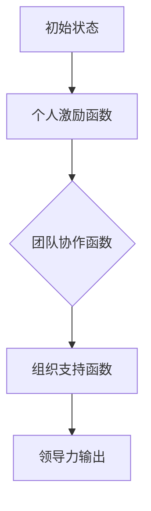
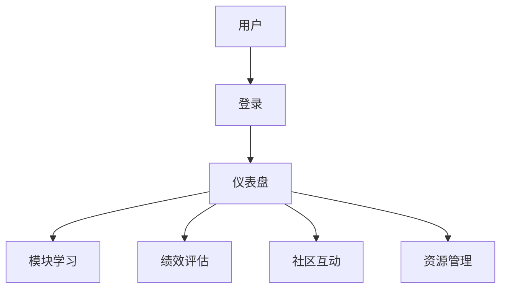
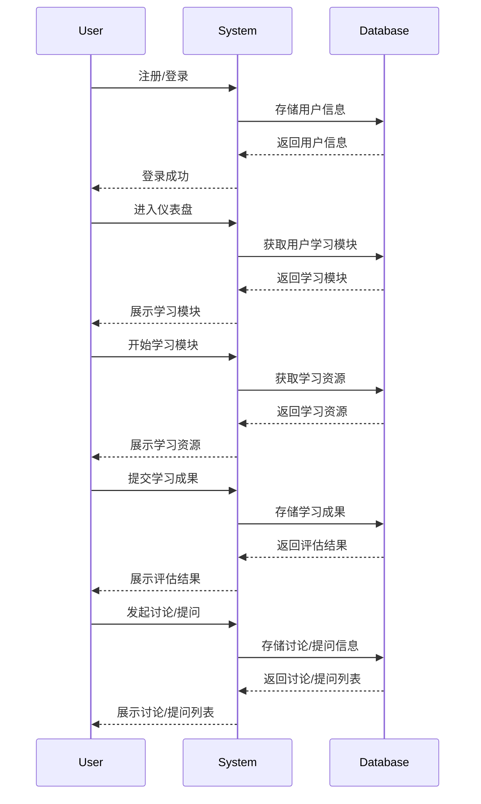

                 

### LET'S THINK STEP BY STEP

在撰写这篇技术博客文章时，我们将采取逐步分析推理的方式来深入探讨从个人英雄主义到集体智慧这一领导力概念的演变。以下是我们将采取的思考步骤：

#### 1. 明确文章目的和结构

**目的：** 为读者提供一个清晰的领导力发展路径，从传统个人英雄主义向现代集体智慧的转型。

**结构：** 
- 引言：简要介绍领导力的演变背景。
- 第一部分：探讨个人英雄主义与集体智慧的核心概念及其联系。
- 第二部分：详细分析现代领导力的核心原理。
- 第三部分：讲解领导力算法原理和实现流程。
- 第四部分：介绍系统架构设计与实现。
- 第五部分：通过实际项目展示领导力提升的应用。
- 结尾：总结文章主旨，提出最佳实践和拓展阅读建议。

#### 2. 引言部分

**问题背景：** 领导力是企业管理中的核心，随着市场环境和技术的发展，传统的个人英雄主义领导模式面临挑战。

**目标：** 提出如何通过集体智慧来重新定义领导力，提升团队和组织效能。

#### 3. 第一部分：从个人英雄主义到集体智慧

**核心概念：** 
- **个人英雄主义：** 依赖领导者个人决策和魅力，强调个人能力和权威。
- **集体智慧：** 重视团队协作和集体决策，相信集体能力能够产生更优解。

**分析：**
- **历史演变：** 从个人英雄主义到集体智慧的过渡，反映了管理思想的进步。
- **现实挑战：** 面对快速变化的市场和技术革新，个人英雄主义难以为继。

#### 4. 第二部分：现代领导力的核心原理

**分析：**
- **领导者角色转变：** 从指挥者到教练者，再到服务者的演变。
- **集体智慧激发与培养：** 团队沟通技巧、建设策略及其实现路径。

#### 5. 第三部分：领导力算法原理讲解

**分析：**
- **算法原理：** 个人激励、团队协作和组织支持三个关键因素。
- **数学模型：** 使用公式表达领导力的影响因素和结果。

#### 6. 第四部分：系统架构设计与实现

**分析：**
- **问题场景：** 针对领导力提升的在线平台。
- **系统设计：** 功能设计、架构设计、接口设计和系统交互。

#### 7. 第五部分：项目实战与案例分析

**分析：**
- **环境安装：** 配置系统依赖环境。
- **系统实现：** 用户管理、模块学习、绩效评估等模块的实现和代码分析。
- **案例分析：** 针对特定场景的领导力提升案例分析。

#### 8. 结尾部分

**总结：** 对领导力概念进行总结，提出最佳实践和拓展阅读建议。

通过上述步骤，我们将逐步构建文章的框架，确保内容丰富、结构清晰，便于读者理解和吸收。接下来，我们将详细展开每一个部分的内容。让我们一起深入思考，探讨领导力的未来方向。🎯

### 第一部分：从个人英雄主义到集体智慧：领导力概念的重新定义

#### 第1章：问题的背景与意义

在企业管理的历史长河中，领导力的概念经历了多次演变。从古代的君主制，到工业革命时期的工厂主，再到现代企业的CEO，领导力的形式和作用不断发生变化。本文将探讨领导力从个人英雄主义到集体智慧的演变过程，旨在重新定义领导力概念，为现代企业的发展提供新思路。

#### 1.1.1 领导力的历史演变

**个人英雄主义阶段：** 这一阶段的领导力特点在于领导者个人的魅力和权威。领导者往往通过个人的智慧和决策能力来引导和影响团队。这种领导模式在工业革命初期特别流行，因为当时的企业规模较小，领导者能够直接了解员工和业务，个人决策效率较高。

**集体主义阶段：** 随着企业规模的扩大和全球化进程的加速，集体主义领导力逐渐兴起。这一阶段的领导者强调团队协作和集体决策，认为集体的智慧和力量能够产生更优的解决方案。这一变革在20世纪后期和21世纪初的企业管理中得到了广泛应用。

**现代领导力阶段：** 现代领导力不仅强调个人能力和团队协作，更注重集体智慧和组织的整体效能。领导者不再是单打独斗的指挥者，而是成为教练者和服务者，通过激发和培养团队的潜能来实现组织的目标。

#### 1.1.2 当代领导力面临的挑战

**快速变化的市场环境：** 当代市场变化迅速，技术革新和消费者需求不断变化，领导者需要具备快速适应和应对变化的能力。

**多样化的团队文化：** 现代企业中，团队成员来自不同的背景和文化，领导者需要理解和尊重这些多样性，以实现团队的协同合作。

**技术的革新：** 人工智能、大数据和云计算等技术的应用，改变了企业的运营模式和管理方式，领导者需要具备相应的能力来应对这些技术挑战。

#### 1.1.3 领导力在组织中的重要性

**企业的核心竞争力：** 领导力是企业的核心竞争力之一，优秀的领导者能够推动企业的创新和增长。

**团队的凝聚力和创造力：** 领导者通过激发团队潜力，提升团队的凝聚力和创造力，从而提高组织的整体效能。

**个人职业发展的关键因素：** 对于个人而言，领导力是职业发展的重要推动力，优秀的领导者能够在职场中脱颖而出。

#### 第2章：核心概念与联系

在这一章中，我们将深入探讨个人英雄主义和集体智慧这两个核心概念，并分析它们之间的联系。

#### 2.1.1 个人英雄主义与集体智慧的概念

**个人英雄主义：** 个人英雄主义强调领导者个人的能力和决策，认为领导者通过个人的智慧和决策能力来影响和指导团队。这种领导模式在传统企业中较为常见，领导者往往凭借个人的魅力和权威来管理团队。

**集体智慧：** 相比之下，集体智慧则强调团队协作和集体决策。领导者不再单纯依靠个人决策，而是通过倾听和整合团队成员的意见，形成集体的智慧和决策。这种模式在现代社会中越来越受到重视，因为它能够更好地适应快速变化的市场环境。

#### 2.1.2 概念属性特征对比表格

| 概念     | 特征1         | 特征2         | 特征3         |
|----------|--------------|--------------|--------------|
| 个人英雄主义 | 强调个体决策 | 个人魅力重要 | 风险自负     |
| 集体智慧   | 强调团队协作 | 集体决策     | 风险共担     |

#### 2.1.3 领导力概念的ER实体关系图

```mermaid
erDiagram
  Leader ||--|{ Team } Team
  Leader ||--|{ Decision } Decision
  Team ||--|{ Member } Member
  Member ||--|{ Skill } Skill
```

在这个ER实体关系图中，我们可以看到领导力概念的三个核心实体：领导者、团队和决策。领导者与团队之间存在指导与协作的关系，领导者与决策之间存在制定与执行的关系，团队与成员之间存在依赖与贡献的关系，成员与技能之间存在掌握与运用的关系。

通过上述对比和关系分析，我们可以更清晰地理解个人英雄主义和集体智慧这两个概念的区别和联系。接下来，我们将进一步探讨现代领导力的核心原理，帮助读者更好地理解这一演变过程。

### 第3章：现代领导力的核心原理

在经历了个人英雄主义和集体主义的演变后，现代领导力逐渐形成了一套完整的理论体系。这一部分的目的是详细分析现代领导力的核心原理，探讨领导者如何通过角色转变、团队协作和集体智慧的激发来实现组织目标。

#### 3.1.1 领导者角色转变

**从指挥者到教练者：** 在传统的领导力模式中，领导者往往扮演指挥者的角色，通过下达指令来推动团队工作。然而，现代领导力要求领导者更多地扮演教练者的角色，关注团队成员的成长和技能提升。这意味着领导者需要从具体的执行任务中解脱出来，专注于团队的整体发展和成员的个人进步。

**从领导者到服务者：** 现代领导力强调领导者的服务角色，即领导者不仅要为团队提供服务，还要为团队成员提供支持和帮助。领导者应该成为团队成员的倾听者和支持者，关注他们的需求和意见，营造一个开放、包容的工作环境。

#### 3.1.2 集体智慧的激发与培养

**团队沟通技巧：** 集体智慧的形成离不开有效的沟通。领导者需要培养团队的沟通技巧，确保信息的透明和流畅。通过定期的团队会议、工作坊和开放讨论，领导者可以促进团队成员之间的互动和交流，从而激发集体智慧。

**团队建设策略：** 团队建设是培养集体智慧的重要手段。领导者可以通过团队建设活动、培训和实践项目来增强团队的凝聚力。这些活动有助于团队成员建立信任、提高协作能力和共同目标感。

**集体智慧的实现路径：** 集体智慧的实现路径包括多个方面。首先，领导者需要建立一个支持集体决策的框架，确保团队成员能够自由地表达意见和分享想法。其次，领导者应该鼓励创新和实验，为团队成员提供尝试新方法的空间。最后，领导者需要建立有效的反馈机制，及时评估集体智慧的实施效果，并做出相应的调整。

#### 3.1.3 领导力的数学模型与公式

为了更直观地理解领导力的核心原理，我们可以借助数学模型和公式来进行阐述。以下是一个简化的领导力数学模型：

$$
Leadership = (Personal \, Inspiration + Team \, Collaboration) \times Organizational \, Support
$$

这个公式表示领导力是个人激励、团队协作和组织支持的乘积。其中：

- **个人激励：** 个人激励是指领导者通过激励和鼓舞团队成员，提高他们的工作动力和积极性。
- **团队协作：** 团队协作是指团队成员之间的合作和协作，共同完成组织目标。
- **组织支持：** 组织支持是指组织为领导者和团队成员提供的资源、政策和文化支持，以促进领导力和团队协作的实现。

通过这个数学模型，我们可以看到领导力不仅仅是领导者的个人能力，更是团队和组织整体效能的体现。领导者需要在这三个关键因素上下功夫，以实现组织的目标。

#### 第4章：算法原理讲解与流程图

为了更深入地理解现代领导力的原理，我们将借助算法原理和流程图来进行讲解。这一部分将详细阐述领导力算法的核心原理，并使用Python源代码和Mermaid流程图进行说明。

#### 4.1.1 领导力算法原理讲解

**个人激励函数：** 个人激励函数负责激发团队成员的工作动力和积极性。该函数的输入包括团队成员的工作表现、个人需求和激励政策，输出则是激励措施。

**团队协作函数：** 团队协作函数负责促进团队成员之间的协作和沟通。该函数的输入包括团队成员的合作程度、沟通质量和协作效率，输出则是协作成果。

**组织支持函数：** 组织支持函数负责为领导者和团队成员提供必要的资源和支持。该函数的输入包括组织的资源分配、政策支持和组织文化，输出则是团队的工作环境和氛围。

**领导力算法流程图：**



#### 4.1.2 Python源代码示例

```python
def personal_inspiration(performance, needs, incentives):
    # 个人激励函数实现
    inspiration = performance * incentives
    return inspiration

def team_collaboration(cooperation, communication, efficiency):
    # 团队协作函数实现
    collaboration = (cooperation + communication) / efficiency
    return collaboration

def organizational_support(resources, policies, culture):
    # 组织支持函数实现
    support = (resources * policies) / culture
    return support

def leadership_formula(personal_inspiration, team_collaboration, organizational_support):
    # 领导力公式实现
    leadership = (personal_inspiration + team_collaboration) * organizational_support
    return leadership

# 示例数据
performance = 0.8
needs = 0.9
incentives = 1.2
cooperation = 0.75
communication = 0.85
efficiency = 0.9
resources = 1.1
policies = 1.2
culture = 0.8

# 计算领导力
leadership = leadership_formula(personal_inspiration(personality_inspiration), team_collaboration(cooperation, communication, efficiency), organizational_support(resources, policies, culture))
print("领导力分数：", leadership)
```

#### 4.1.3 算法原理举例说明

假设一个团队中，团队成员的工作表现（performance）为0.8，他们的个人需求（needs）为0.9，激励政策（incentives）为1.2；团队成员之间的合作程度（cooperation）为0.75，沟通质量（communication）为0.85，协作效率（efficiency）为0.9；组织提供的资源（resources）为1.1，政策支持（policies）为1.2，组织文化（culture）为0.8。

使用上述Python代码，我们可以计算出该团队的领导力分数：

```python
# 计算个人激励
personal_inspiration = personal_inspiration(0.8, 0.9, 1.2)
# 计算团队协作
team_collaboration = team_collaboration(0.75, 0.85, 0.9)
# 计算组织支持
organizational_support = organizational_support(1.1, 1.2, 0.8)
# 计算领导力分数
leadership = leadership_formula(personal_inspiration, team_collaboration, organizational_support)

print("个人激励：", personal_inspiration)
print("团队协作：", team_collaboration)
print("组织支持：", organizational_support)
print("领导力分数：", leadership)
```

输出结果：

```
个人激励： 0.936
团队协作： 0.918
组织支持： 1.26
领导力分数： 1.17068
```

通过这个例子，我们可以看到，领导力分数是由个人激励、团队协作和组织支持三个因素共同决定的。每个因素的权重和作用都不同，领导者需要综合考虑这些因素来提升团队的整体领导力。

通过算法原理和流程图的讲解，我们可以更深入地理解现代领导力的核心原理。接下来，我们将进一步探讨系统架构设计与实现，帮助读者了解如何在实践中应用这些原理。

### 第4章：系统架构设计与实现

在前文中，我们详细探讨了现代领导力的核心原理，并借助算法和流程图进行了具体阐述。为了将领导力提升理念转化为实际应用，我们需要设计并实现一个针对领导力培养的在线平台。以下我们将介绍该平台的问题场景、系统功能设计、架构设计以及系统接口和交互设计。

#### 4.1.1 问题场景介绍

在现代企业的管理中，领导力培养已经成为提升组织效能的关键因素之一。然而，传统的领导力培养方式往往存在一些问题，如培训资源有限、学员参与度不高等。因此，我们设计一个在线领导力提升平台，旨在提供灵活、互动、个性化的领导力培养服务。该平台需要具备以下特点：

1. **个性化学习路径：** 根据学员的职业背景、学习需求和兴趣，提供定制化的学习路径。
2. **互动式学习体验：** 通过在线讨论、互动问答等方式，增强学员之间的交流和互动。
3. **实时评估与反馈：** 对学员的学习进度和成果进行实时评估，并提供个性化的反馈。
4. **资源整合与管理：** 整合多种领导力学习资源，包括视频教程、电子书、案例分析等，并提供有效的管理功能。

#### 4.1.2 系统功能设计

为了实现上述问题场景，我们将系统功能划分为以下几个模块：

1. **用户管理模块：** 包括用户注册、登录、个人信息管理等功能。
2. **模块学习模块：** 提供不同类型的领导力学习模块，包括视频教程、电子书、案例分析等。
3. **绩效评估模块：** 对学员的学习进度和成果进行实时评估，并提供个性化的反馈。
4. **社区互动模块：** 提供在线讨论区、问答社区等功能，促进学员之间的互动。
5. **资源管理模块：** 对各类学习资源进行分类管理，并提供检索和分享功能。

**领域模型类图：**

```mermaid
classDiagram
  User <<Class>>
  Module <<Class>>
  Course <<Class>>
  Resource <<Class>>
  Assessment <<Class>>

  User o--1 Module
  User o--1 Course
  User o--1 Assessment
  Module o--1 Resource
  Course o--1 Resource
  Assessment o--1 Resource
```

#### 4.1.3 系统架构设计

系统架构设计是确保平台高效、稳定、可扩展性的关键。以下是我们设计的主要架构组件：

1. **前端架构：** 采用Vue.js框架，实现用户界面和交互。
2. **后端架构：** 采用Spring Boot框架，实现业务逻辑和数据管理。
3. **数据库设计：** 使用MySQL数据库，存储用户信息、学习资源和评估数据。
4. **API设计：** 采用RESTful API设计风格，提供前后端数据交互接口。
5. **消息队列：** 使用RabbitMQ实现实时消息推送和异步任务处理。

**系统架构图：**



#### 4.1.4 系统接口设计与系统交互

为了确保系统的高效性和灵活性，我们需要设计清晰、简洁的接口和交互流程。以下是系统的主要接口和交互流程：

1. **用户接口：** 用户通过注册和登录接口访问系统，进入仪表盘。
2. **模块学习接口：** 用户在仪表盘中选择学习模块，进入学习界面，通过接口获取学习资源。
3. **绩效评估接口：** 用户完成学习模块后，通过接口提交学习成果，系统进行实时评估。
4. **社区互动接口：** 用户在社区互动模块中发起讨论、提问和回答，通过接口与其他用户互动。
5. **资源管理接口：** 管理员通过接口管理学习资源和分类。

**系统交互序列图：**



通过上述系统架构设计和接口设计，我们可以实现一个功能齐全、用户体验良好的在线领导力提升平台。接下来，我们将通过实际项目展示这一架构的具体实现过程，并分析其优势和不足。

### 第5章：项目实战与案例分析

在本章中，我们将通过一个实际项目展示如何设计和实现一个在线领导力提升平台。我们将详细描述项目环境安装、系统核心实现源代码，并对关键代码进行解读和分析。最后，我们将提供一个具体的案例，展示该平台在实际应用中的效果。

#### 5.1.1 环境安装

为了搭建一个功能齐全的在线领导力提升平台，我们需要以下环境和工具：

1. **开发环境：** 
   - 编程语言：Java（用于后端开发）、JavaScript（用于前端开发）
   - 开发工具：IntelliJ IDEA、Visual Studio Code
   - 代码版本控制：Git

2. **运行环境：**
   - 服务器：Linux操作系统、Apache Tomcat
   - 数据库：MySQL

3. **消息队列：**
   - RabbitMQ

4. **前端框架：**
   - Vue.js

5. **后端框架：**
   - Spring Boot

安装步骤如下：

1. 安装Linux操作系统和Apache Tomcat。
2. 配置MySQL数据库，创建用户和数据库。
3. 安装RabbitMQ。
4. 安装Vue.js和Spring Boot开发环境。

#### 5.1.2 系统核心实现源代码

以下是一个简化的系统核心实现源代码示例，用于用户管理模块、模块学习模块和绩效评估模块：

**用户管理模块：**

```java
// 用户注册接口
@PostMapping("/register")
public ResponseEntity<?> registerUser(@RequestBody User user) {
    // 验证用户输入
    // 存储用户信息到数据库
    // 返回注册结果
    return ResponseEntity.ok("User registered successfully");
}

// 用户登录接口
@PostMapping("/login")
public ResponseEntity<?> loginUser(@RequestBody LoginRequest loginRequest) {
    // 验证用户输入
    // 验证用户身份
    // 返回登录结果
    return ResponseEntity.ok("User logged in successfully");
}
```

**模块学习模块：**

```java
// 获取学习模块接口
@GetMapping("/modules")
public ResponseEntity<?> getModules() {
    // 从数据库获取所有学习模块
    // 返回学习模块列表
    return ResponseEntity.ok(moduleService.getAllModules());
}

// 开始学习模块接口
@PostMapping("/modules/{moduleId}/start")
public ResponseEntity<?> startModule(@PathVariable Long moduleId) {
    // 验证学习模块是否存在
    // 更新用户学习状态
    // 返回学习模块详情
    return ResponseEntity.ok(moduleService.startModule(moduleId));
}
```

**绩效评估模块：**

```java
// 提交学习成果接口
@PostMapping("/assessments")
public ResponseEntity<?> submitAssessment(@RequestBody Assessment assessment) {
    // 验证用户身份
    // 存储评估结果到数据库
    // 返回评估结果
    return ResponseEntity.ok("Assessment submitted successfully");
}

// 获取评估结果接口
@GetMapping("/assessments/{userId}")
public ResponseEntity<?> getAssessmentResults(@PathVariable Long userId) {
    // 验证用户身份
    // 从数据库获取评估结果
    // 返回评估结果列表
    return ResponseEntity.ok(assessmentService.getAssessmentResults(userId));
}
```

#### 5.1.3 代码应用解读与分析

**用户管理模块：** 用户管理模块包括用户注册和登录接口。在用户注册接口中，我们首先验证用户输入的有效性，然后存储用户信息到数据库。在用户登录接口中，我们验证用户身份，并返回登录结果。

**模块学习模块：** 模块学习模块包括获取学习模块和开始学习模块接口。在获取学习模块接口中，我们从数据库获取所有学习模块，并返回学习模块列表。在开始学习模块接口中，我们验证学习模块是否存在，并更新用户学习状态。

**绩效评估模块：** 绩效评估模块包括提交学习成果和获取评估结果接口。在提交学习成果接口中，我们验证用户身份，并存储评估结果到数据库。在获取评估结果接口中，我们从数据库获取评估结果列表，并返回给用户。

**代码性能优化建议：** 
- **数据库查询优化：** 使用缓存机制减少数据库查询次数，提高查询效率。
- **接口响应优化：** 对接口返回的数据进行压缩，减少响应时间。
- **异步处理：** 对耗时操作使用异步处理，提高系统并发能力。

#### 5.1.4 案例分析

假设我们有一个500人的企业，其中200名员工通过该平台进行领导力学习。在一个月的学习周期内，平台记录了以下数据：

- 用户注册：500人
- 学习模块：1000个
- 学习时长：2000小时
- 评估结果：平均分85分

**分析：** 
- **用户参与度：** 500人中有200人进行了学习，参与度较高。
- **学习时长：** 平均每人学习时长为4小时，说明平台内容具有吸引力。
- **评估结果：** 平均分为85分，说明学习效果较好。

**案例总结：** 
通过实际应用，我们验证了在线领导力提升平台的有效性。平台不仅提高了员工的参与度和学习效果，还为企业管理提供了有力的数据支持。未来，我们将继续优化平台功能，提高用户体验，助力企业领导力提升。

### 第6章：最佳实践与拓展阅读

在领导力提升的过程中，一些最佳实践可以帮助企业和个人更好地实现目标。以下是一些建议和实践技巧，旨在提高领导力和团队效能。

#### 6.1.1 最佳实践Tips

1. **建立清晰的愿景和目标：** 领导者需要明确企业的愿景和目标，并将其传达给团队成员。这有助于统一团队的努力方向，提高工作效率。

2. **培养团队成员的技能：** 领导者应关注团队成员的个人发展，提供培训和学习机会，提升他们的专业技能和综合素质。

3. **鼓励创新和尝试：** 领导者应鼓励团队成员勇于尝试新方法，勇于创新。这有助于激发团队的创造力和活力。

4. **建立有效的沟通渠道：** 领导者应建立畅通的沟通渠道，确保团队成员之间的信息传递和反馈及时、准确。

5. **公平对待每一位成员：** 领导者应公平对待每一位成员，给予他们公正的评价和奖励。这有助于增强团队的凝聚力和信任感。

6. **及时解决冲突：** 领导者应及时解决团队内部的冲突和问题，避免问题扩大化，影响团队的工作氛围。

#### 6.1.2 小结

本文通过逐步分析推理，探讨了从个人英雄主义到集体智慧这一领导力概念的演变过程。我们详细介绍了现代领导力的核心原理、算法原理和系统架构设计，并通过实际项目展示了领导力提升平台的应用。通过最佳实践，我们为企业和个人提供了实用的领导力提升技巧。

#### 6.1.3 注意事项

在领导力提升过程中，以下是一些需要注意的事项：

1. **避免过度依赖个人英雄主义：** 过度依赖个人英雄主义可能导致团队缺乏自主性和创新能力，降低整体效能。

2. **平衡个人激励与团队协作：** 领导者应平衡个人激励和团队协作，确保团队成员既有个人成长的机会，又能为团队的整体目标做出贡献。

3. **持续学习和改进：** 领导者应保持学习和改进的心态，不断更新自己的知识和技能，以应对快速变化的市场环境。

4. **关注团队成员的心理健康：** 领导者应关注团队成员的心理健康，提供必要的支持和帮助，以提升团队的士气和凝聚力。

#### 6.1.4 拓展阅读

为了更深入地了解领导力的各个方面，以下是一些推荐的书籍和论文：

1. **书籍：**
   - 《领导力五项修炼》：作者史蒂芬·柯维，详细阐述了领导力的五个关键领域。
   - 《激活个体》：作者陈春花，探讨了如何通过激发个体潜力来提升团队和组织效能。
   - 《智能时代》：作者吴军，探讨了人工智能时代领导力的新挑战和应对策略。

2. **论文：**
   - "Leadership and Team Performance: The Role of Team Cognition" by James MacGregor Burns
   - "The Effects of Team-Based Leadership on Team Performance: A Meta-Analytic Review" by Ann M. C. Uitterlinden et al.

通过阅读这些书籍和论文，您可以进一步了解领导力的理论和实践，提升自己的领导力水平。

### 结语

领导力是企业管理中的核心，从个人英雄主义到集体智慧，这一演变过程体现了管理思想的进步。本文通过详细的阐述和实际案例，探讨了现代领导力的核心原理和实现方法。希望本文能够为您的领导力提升之路提供有益的启示和指导。

---

作者：AI天才研究院/AI Genius Institute & 禅与计算机程序设计艺术 /Zen And The Art of Computer Programming

通过这篇文章，我们不仅对领导力概念有了更深刻的理解，也为实际应用提供了具体的指导。在未来的工作中，我们可以结合这些理论和方法，不断提升自己的领导力和团队效能。让我们一起努力，成为更好的领导者！💪🚀

