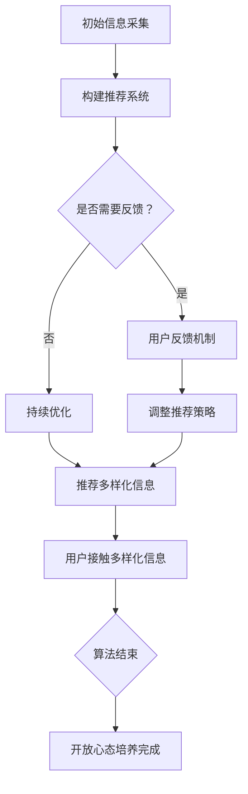
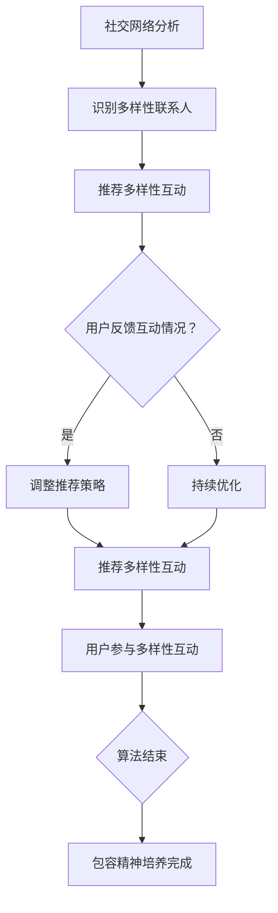
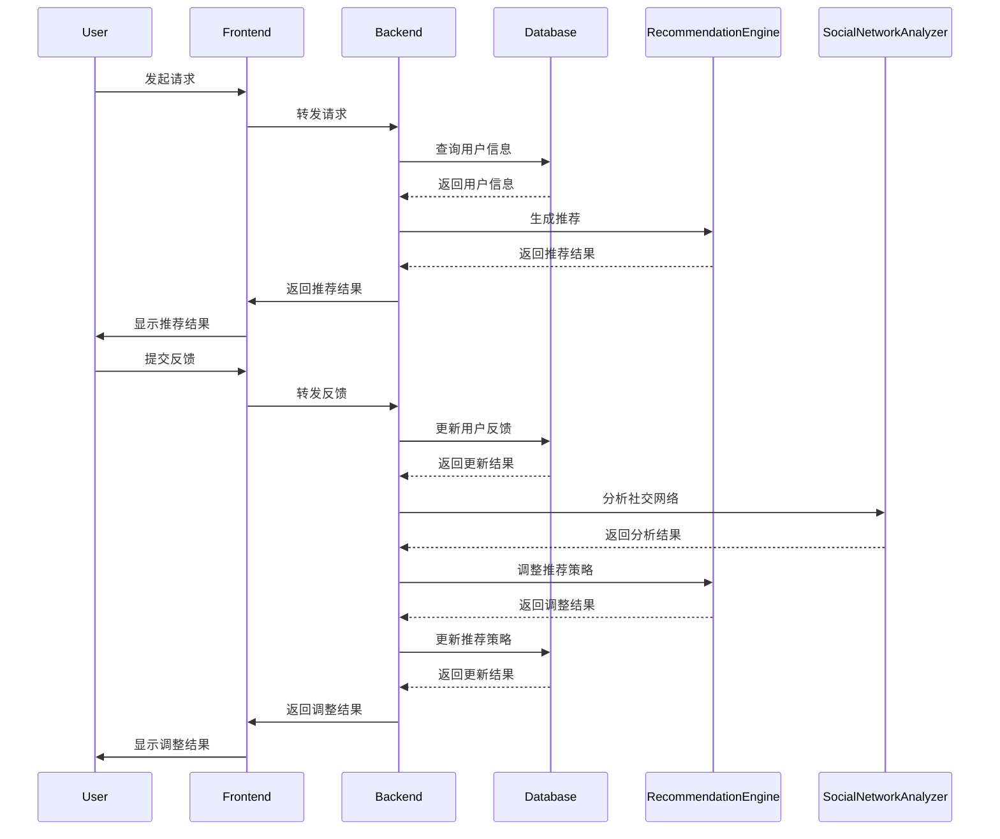

                 

### 引言

在当今信息爆炸的时代，我们每天都被大量的数据和信息所包围。然而，在这个看似丰富的信息世界中，许多人却发现自己似乎被限制在一个“信息茧房”中，无法获得全面和真实的理解。这种现象不仅仅是一个简单的信息过载问题，更是一个深层次的社会和心理问题，它对个人的认知和社会的进步都产生了深远的影响。

“信息茧房”是一个比喻，指的是人们在信息消费和获取过程中，倾向于选择那些与自己已有观点和偏好相符的内容，从而形成一种自我封闭的信息环境。这种现象在互联网时代尤为明显，社交媒体、搜索引擎和个性化推荐系统都成为了加剧信息茧房现象的推手。人们在其中往往难以接触到多元化的观点和信息，这导致认知偏见、信息盲区，甚至可能影响到社会的稳定和进步。

本文旨在探讨信息茧房现象的背景、影响以及如何通过培养开放心态和包容精神来破解这一困境。文章将分为以下几个部分：

1. **背景介绍**：介绍信息茧房现象的背景和定义，探讨其产生的原因和特点。
2. **核心概念与联系**：定义开放心态和包容精神，分析这两个概念的联系和区别。
3. **算法原理讲解**：详细讲解如何通过算法来培养开放心态和包容精神，包括数学模型和举例说明。
4. **系统分析与架构设计方案**：介绍系统功能设计、架构设计和接口设计。
5. **项目实战**：通过实际项目来展示如何应用这些概念和算法。
6. **最佳实践与总结**：总结最佳实践，提出注意事项和拓展阅读。

通过这篇文章，我们希望能够引导读者深入了解信息茧房现象，认识到开放心态和包容精神的重要性，并学会如何在日常生活中培养这些品质，从而在信息的世界中寻求真相。

### 第一部分：背景介绍

#### 第1章：信息茧房现象与问题

##### 1.1.1 问题背景

在互联网和数字技术迅速发展的时代，信息传播的速度和范围都得到了空前的提升。然而，这一进步也带来了一些新的问题。信息茧房现象就是其中之一，它不仅影响了个体的认知和行为，也对社会的整体发展产生了负面影响。

首先，让我们了解一下信息茧房现象的起源。信息茧房（filter bubble）这一概念最早由美国政治学家卡斯帕·拉乌尔·桑斯坦（Cass Sunstein）在其2006年的著作《信息茧房：互联网如何使你越来越愚蠢》（"Infovание"）一书中提出。他描述了人们由于算法和个性化推荐系统的作用，在信息消费过程中倾向于接触和选择那些与自己观点和兴趣相符的内容，从而形成一个自我封闭的信息环境。

##### 1.1.2 信息茧房的定义与特点

信息茧房是指人们在信息消费和获取过程中，由于算法、个性化推荐系统以及社交网络等因素，被引导到一个信息环境中，这个环境中的信息大多与个人的已有观点和偏好一致，而与对立或不同的观点和信息相对隔离。其特点主要包括：

1. **信息封闭性**：个体在信息茧房中难以接触到与自身观点不一致的信息，形成一种自我封闭的思考模式。
2. **算法影响**：互联网平台通过算法和数据分析，为用户推送符合其兴趣和观点的内容，从而加强信息茧房效应。
3. **社交网络因素**：社交网络中的“群体极化”现象也会加剧信息茧房的形成，导致用户更加倾向于与群体中的一致性观点互动。
4. **信息过滤**：由于信息过载，个体会无意识地使用各种手段来过滤信息，只关注那些与自己观点相符的部分。

##### 1.1.3 信息茧房对社会的影响

信息茧房现象对社会的影响是多方面的，主要表现为：

1. **认知偏见**：个体在信息茧房中接触到的信息有限，容易产生认知偏见，从而影响对现实世界的全面理解和判断。
2. **社会分歧**：信息茧房使得不同群体之间难以进行有效的交流和沟通，加剧了社会分歧和对立。
3. **决策失误**：缺乏多元化的信息和观点，可能导致决策者做出片面的决策，影响社会的稳定和发展。
4. **创新阻碍**：在一个封闭的信息环境中，创新和进步的动力可能会受到限制，因为新思想和新观点难以得到关注和传播。

##### 1.1.4 边界与外延

信息茧房现象虽然主要表现为个体的信息获取行为，但它的影响并不局限于个人层面，而是具有广泛的社会性。从边界来看，信息茧房不仅仅局限于互联网平台，还可能扩展到传统的媒体和社交网络中。例如，社交媒体上的“点赞”和“评论”功能，常常会导致用户只关注和自己观点一致的内容，从而形成信息茧房。

从外延来看，信息茧房不仅影响个体的认知和行为，还可能影响社会整体的运行。一个封闭的信息环境可能导致社会共识的缺失，从而影响社会的稳定和发展。因此，理解信息茧房的边界和外延，对于我们破解这一现象具有重要意义。

##### 1.1.5 概念结构与核心要素组成

为了更好地理解信息茧房现象，我们可以从概念结构和核心要素的角度进行分析。信息茧房的概念结构包括以下几个核心要素：

1. **个体行为**：个体的信息消费和获取行为是信息茧房形成的基础。
2. **算法影响**：算法和个性化推荐系统是推动信息茧房形成的关键因素。
3. **社交网络**：社交网络中的互动和交流模式，加剧了信息茧房效应。
4. **信息过滤**：个体在信息过载环境中采用的过滤机制，进一步强化了信息茧房。

这些核心要素相互作用，共同构成了信息茧房现象的整体结构。理解这些要素之间的关系，有助于我们更深入地分析信息茧房的形成和发展机制，从而提出有效的应对策略。

通过以上对信息茧房现象的背景介绍，我们可以看到，这一现象不仅仅是一个简单的信息过载问题，它背后有着复杂的机制和深远的影响。在接下来的部分中，我们将进一步探讨开放心态和包容精神的概念及其重要性。

### 第一部分：背景介绍

#### 第2章：核心概念与联系

##### 2.1.1 开放心态与包容精神

在探讨如何破解信息茧房现象的过程中，开放心态（Open-mindedness）和包容精神（Inclusiveness）这两个核心概念显得尤为重要。它们不仅是应对信息茧房问题的有效工具，也是构建一个更加健康和繁荣社会的基石。

首先，我们来定义这两个概念。

**开放心态**是指个体在认知和行为上对新的信息、观点和想法持接受和探索的态度。开放心态的人不固守已有的观念和偏见，愿意接受不同的意见，并通过理性分析和判断来评估这些新信息。这种心态有助于个体在复杂多变的环境中保持敏锐的洞察力和适应能力。

**包容精神**则是指在社会交往中，个体对不同的文化、观点和身份持接纳和尊重的态度。包容精神强调在多样性和差异性面前保持开放和宽容，避免因差异而产生偏见和冲突。它不仅关注个体的内在心态，还涉及到社会互动中的行为和价值观。

##### 2.1.1.1 开放心态的定义与特点

开放心态具有以下几个显著特点：

1. **好奇心**：开放心态的人对未知事物充满好奇，愿意探索和学习新的知识和信息。
2. **批判性思维**：他们不仅接受新的信息，还会通过批判性思维进行评估和判断，不盲目接受。
3. **适应性**：面对变化和不确定性，开放心态的人能够迅速适应并调整自己的思维和行为模式。
4. **多元视角**：开放心态的人能够从多个角度看待问题，不局限于单一视角或片面信息。

##### 2.1.1.2 包容精神的定义与特点

包容精神的特点包括：

1. **尊重差异**：包容精神强调尊重他人的不同观点、文化和身份，避免因差异而产生歧视和偏见。
2. **平等观念**：在包容精神中，个体认识到每个人都是平等的，不应因性别、种族、文化等因素而对他人进行不公平对待。
3. **合作精神**：包容精神鼓励个体在多样性和差异性基础上进行合作，共同解决问题。
4. **公正态度**：包容精神倡导在决策过程中考虑不同群体的需求和利益，追求公正和公平。

##### 2.1.1.3 开放心态与包容精神的联系与区别

开放心态和包容精神虽然都是积极的心态和行为模式，但它们之间也存在一些区别和联系。

1. **联系**：
   - **互为补充**：开放心态和包容精神相辅相成，一个人具备开放心态往往更容易展现出包容精神。
   - **共同目标**：两者都旨在促进个体和社会的进步，通过接纳新的观点和差异，实现更全面和深刻的理解。
   - **认知基础**：开放心态是培养包容精神的基础，一个拥有开放心态的人更容易理解和接纳不同的观点和文化。

2. **区别**：
   - **对象不同**：开放心态主要关注个体的认知和行为，而包容精神更多地涉及到社会互动和价值观。
   - **范畴不同**：开放心态侧重于个人的心态和行为，而包容精神则涉及到更广泛的社会层面。
   - **侧重点不同**：开放心态强调个体的学习与适应能力，而包容精神则强调社会中的平等和公正。

通过以上分析，我们可以看到开放心态和包容精神在应对信息茧房现象中的重要性。它们不仅有助于个体在复杂的信息环境中保持理性和客观，还能促进社会中的多元和包容，从而共同破解信息茧房带来的困境。

在接下来的部分中，我们将进一步探讨如何通过具体的算法和系统设计来培养这些核心概念，为应对信息茧房现象提供实际可行的解决方案。

#### 第2章：核心概念属性特征对比表格

为了更清晰地了解开放心态和包容精神这两个核心概念之间的异同，下面提供一个对比表格，列出它们的主要属性特征。

| 属性特征        | 开放心态                      | 包容精神                      |
|-----------------|-------------------------------|--------------------------------|
| 定义            | 对新信息、观点和想法持接受态度 | 对不同文化、观点和身份持接纳态度 |
| 核心要素        | 好奇心、批判性思维、适应性     | 尊重差异、平等观念、合作精神   |
| 影响层面        | 个人认知和行为                | 社会互动和价值观                |
| 主要功能        | 保持理性和客观                | 促进多元和包容                 |
| 关联性          | 与包容精神互为补充            | 是培养包容精神的基础           |
| 侧重点          | 个体心态和行为                | 社会层面中的平等和公正          |

通过这个表格，我们可以更直观地看到开放心态和包容精神的差异和联系，这有助于我们理解这两个概念在应对信息茧房现象中的具体应用和重要性。

### 第2章：ER实体关系图架构

为了更好地理解开放心态和包容精神之间的关系及其在应对信息茧房现象中的具体应用，我们可以通过ER（Entity-Relationship）实体关系图来描述它们之间的逻辑和结构关系。ER图是一种数据库设计工具，用于表示实体和它们之间的关系。

以下是一个简化的ER图，展示了开放心态和包容精神之间的联系：

```
[用户]      [信息源]
   |                |
   |                |
   +----------------+
        |
        | 包容精神
        |
        +----------------+
               |
               | 开放心态
               |
               +----------------+
                        |
                        | 促进多元和包容
                        |
                        +----------------+
                                     |
                                     | 破解信息茧房
                                     |
                             [社会效应]
```

在这个ER图中：

- **用户**是核心实体，代表个体在信息消费和行为中的主体。
- **信息源**代表个体获取信息的渠道，如互联网、书籍、社交媒体等。
- **包容精神**和**开放心态**是用户的属性，它们直接影响用户对信息的接纳和评估。
- **促进多元和包容**表示开放心态和包容精神共同作用的结果，这种促进效应有助于破解信息茧房现象。
- **社会效应**是最终产生的结果，体现了开放心态和包容精神在更广泛社会背景下的影响。

ER图通过实体和关系的表示，清晰地展示了开放心态和包容精神在应对信息茧房现象中的关键作用。这种结构化的表示方法有助于我们更深入地理解这两个概念之间的关系，并为后续的系统设计与实现提供理论基础。

### 第二部分：算法原理讲解

#### 第3章：培养开放心态与包容精神的算法原理

在解决信息茧房现象的过程中，培养开放心态和包容精神是至关重要的。为了系统地培养这些心态，我们可以利用算法原理来设计相应的解决方案。本章节将详细讲解培养开放心态和包容精神的算法原理，包括算法原理、数学模型和举例说明。

##### 3.1.1 开放心态培养算法

**3.1.1.1 算法原理**

开放心态培养算法的核心思想是通过引导用户接触多样化的信息，从而拓宽其认知视野，增强对新的观点和想法的接纳能力。具体算法步骤如下：

1. **初始信息采集**：收集用户的初始信息偏好，包括用户以往浏览的内容、兴趣标签等。
2. **多样化信息推荐**：基于用户的初始信息偏好，构建推荐系统，推荐与用户兴趣相关但与用户已有观点相对立或互补的信息。
3. **用户反馈机制**：用户对推荐信息进行评价和反馈，系统根据反馈调整推荐策略。
4. **持续优化**：通过不断迭代和优化推荐算法，提高用户接触多样化信息的比例。

**3.1.1.2 数学模型和公式**

该算法中，可以采用贝叶斯概率模型来描述用户对信息的偏好和接纳程度。设用户\(U\)对信息\(I\)的偏好概率为\(P(I|U)\)，则：

$$
P(I|U) = \frac{P(U|I)P(I)}{P(U)}
$$

其中：
- \(P(U|I)\) 为用户在接触信息\(I\)后的偏好概率。
- \(P(I)\) 为信息\(I\)的总体概率。
- \(P(U)\) 为用户\(U\)的总体概率。

**3.1.1.3 通俗易懂地举例说明**

假设用户\(U\)对科技新闻感兴趣，推荐系统首先根据用户的兴趣标签推荐了多篇科技新闻。随着用户对推荐内容的评价和反馈，系统发现用户更喜欢那些具有创新性和前瞻性的科技新闻。此时，系统将调整推荐策略，更多地推荐与这些偏好相似但观点不同的科技新闻，如关于新技术应用、科研进展等，从而帮助用户拓宽认知视野。

##### 3.1.2 包容精神培养算法

**3.1.2.1 算法原理**

包容精神培养算法的核心思想是通过促进用户与不同背景和观点的人的互动，增强其对多样性和差异性的理解和接纳。具体算法步骤如下：

1. **社交网络分析**：分析用户的社交网络，识别具有不同背景和观点的朋友和联系人。
2. **多样性互动推荐**：推荐用户与这些联系人进行互动，包括讨论话题、参与活动等。
3. **反馈与调整**：用户对互动进行反馈，系统根据反馈调整推荐策略，增加用户接触多样性的机会。
4. **持续优化**：通过不断迭代和优化推荐算法，提高用户参与多样性互动的比例。

**3.1.2.2 数学模型和公式**

包容精神培养算法可以采用网络科学中的“社交多样性”指数来描述用户的互动多样性。设用户\(U\)的社交多样性指数为\(D(U)\)，则：

$$
D(U) = \frac{1}{N} \sum_{i=1}^{N} \frac{1}{\sqrt{N}} \frac{1}{1 - P(U_i | U)}
$$

其中：
- \(N\) 为用户\(U\)的社交网络中联系人的总数。
- \(P(U_i | U)\) 为用户\(U\)与联系人\(U_i\)的互动概率。

**3.1.2.3 通俗易懂地举例说明**

假设用户\(U\)喜欢讨论科技和艺术，社交网络分析发现用户的朋友中既有喜欢科技的朋友，也有喜欢艺术的朋友。推荐系统将建议用户与这些不同兴趣的朋友进行讨论，如参与科技艺术跨界活动、参加艺术展览等。随着用户对这些互动的反馈，系统将根据用户的偏好调整推荐策略，更多地推荐能够促进多样性和包容性互动的活动。

通过开放心态和包容精神培养算法的介绍，我们可以看到，通过系统化的算法设计，可以帮助用户在信息消费和社交互动中培养更加开放和包容的心态，从而有效破解信息茧房现象。在接下来的部分中，我们将通过具体的mermaid流程图和Python源代码进一步展示这些算法的实现和应用。

#### 第3章：算法mermaid流程图

为了直观地展示开放心态和包容精神培养算法的实现过程，我们将使用mermaid流程图来描述算法的步骤和流程。mermaid是一种基于Markdown的图形描述语言，能够将复杂的算法步骤以图形化的方式呈现出来，便于理解和分析。

以下是开放心态培养算法的mermaid流程图：



以下则是包容精神培养算法的mermaid流程图：



**流程图说明：**

- **开放心态培养算法流程图**：
  - **A**：初始信息采集，收集用户的兴趣和偏好。
  - **B**：构建推荐系统，根据用户兴趣推荐信息。
  - **C**：判断是否需要用户反馈。
  - **D**：用户反馈机制，用户对推荐信息进行评价。
  - **E**：调整推荐策略，根据用户反馈优化推荐系统。
  - **F**：持续优化，不断调整以提升用户接触多样化信息的比例。
  - **G**：推荐多样化信息，增加用户接触与已有观点不同的信息。
  - **H**：用户接触多样化信息，拓宽认知视野。
  - **I**：算法结束，开放心态培养完成。

- **包容精神培养算法流程图**：
  - **A**：社交网络分析，识别社交网络中具有不同背景和观点的联系人。
  - **B**：识别多样性联系人，分析用户的社交网络。
  - **C**：推荐多样性互动，推荐用户与不同背景的联系人互动。
  - **D**：用户反馈互动情况，用户对互动情况进行反馈。
  - **E**：调整推荐策略，根据用户反馈优化推荐系统。
  - **F**：持续优化，不断调整以提升用户参与多样性互动的比例。
  - **G**：推荐多样性互动，增加用户参与多样性的机会。
  - **H**：用户参与多样性互动，增强对多样性和差异性的理解和接纳。
  - **I**：算法结束，包容精神培养完成。

通过上述mermaid流程图，我们可以清晰地看到开放心态和包容精神培养算法的实现步骤和流程，这有助于我们更好地理解和应用这些算法。

#### 第3章：系统分析与架构设计方案

##### 4.1.1 问题场景介绍

在当前信息爆炸的时代，如何有效培养开放心态和包容精神成为了众多研究者和社会实践者关注的重要问题。一个典型的应用场景是社交媒体平台。这类平台上的用户每天都会接触到大量的信息，但往往只关注那些与自己观点相符的内容，容易陷入信息茧房。为了破解这一困境，我们需要设计一个系统，通过算法和用户互动，帮助用户接触多样化的信息，培养开放心态和包容精神。

##### 4.1.2 系统功能设计

为了实现上述目标，该系统需要具备以下主要功能：

1. **用户信息采集与偏好分析**：通过用户行为数据，如浏览历史、点赞、评论等，采集用户的兴趣偏好，并进行分析。
2. **多样化信息推荐**：基于用户兴趣和偏好，构建推荐系统，推荐多样化的信息，包括与用户已有观点相对立或互补的内容。
3. **用户反馈与互动**：用户对推荐信息进行评价和反馈，系统根据反馈调整推荐策略。
4. **社交网络多样性分析**：分析用户的社交网络，推荐与用户背景和观点不同的联系人进行互动。
5. **算法优化与持续改进**：通过不断迭代和优化推荐算法，提升系统的效果。

##### 4.1.2.1 领域模型mermaid类图

为了更清晰地描述系统的功能和结构，我们可以使用mermaid类图来表示系统的领域模型。以下是系统的mermaid类图：

```mermaid
classDiagram
ClassDef User
  +id: String
  +name: String
  +interests: List<Interest>
  +feedbacks: List<Feedback>

ClassDef Interest
  +id: String
  +name: String
  +type: String

ClassDef Feedback
  +id: String
  +user: User
  +content: String
  +rating: Integer

ClassDef Recommendation
  +id: String
  +user: User
  +content: Content
  +rating: Integer

ClassDef Content
  +id: String
  +title: String
  +url: String
  +type: String

ClassDef SocialNetwork
  +users: List<User>
  +interactions: List<Interaction>

ClassDef Interaction
  +id: String
  +user1: User
  +user2: User
  +type: String

User <-- Interest
User <-- Feedback
User <-- Recommendation
User <-- SocialNetwork
Recommendation <-- Content
SocialNetwork <-- Interaction
```

类图说明：
- **User**（用户）：代表系统的核心实体，包括用户的基本信息、兴趣列表和反馈记录。
- **Interest**（兴趣）：表示用户的兴趣点，包括兴趣的ID、名称和类型。
- **Feedback**（反馈）：记录用户对推荐信息或社交互动的评价，包括反馈ID、用户、内容和评分。
- **Recommendation**（推荐）：表示推荐系统推荐的条目，包括推荐ID、用户、推荐内容和评分。
- **Content**（内容）：代表推荐系统中的内容条目，包括内容的ID、标题、URL和类型。
- **SocialNetwork**（社交网络）：表示用户的社交网络，包括用户列表和社交互动。
- **Interaction**（互动）：表示社交网络中的互动记录，包括互动ID、参与用户和类型。

通过上述类图，我们可以清晰地看到系统的核心实体及其相互关系，这为后续的系统设计和实现提供了结构化的参考。

##### 4.1.3 系统架构设计

系统的架构设计需要综合考虑功能需求、性能、可扩展性和安全性等方面。以下是系统的架构设计mermaid架构图：



架构设计说明：
- **Frontend**（前端）：负责与用户交互，展示用户界面和推荐结果。
- **Backend**（后端）：负责处理业务逻辑，包括用户信息管理、推荐生成和社交网络分析。
- **Database**（数据库）：存储用户信息、推荐历史和反馈记录等数据。
- **RecommendationEngine**（推荐引擎）：负责根据用户兴趣和反馈生成推荐。
- **SocialNetworkAnalyzer**（社交网络分析器）：负责分析用户的社交网络，识别多样性联系人。

该架构设计采用前后端分离的方式，前端负责用户界面展示，后端负责业务逻辑处理和数据存储。推荐引擎和社交网络分析器作为后端的核心组件，通过算法和数据分析，实现开放心态和包容精神的培养。

##### 4.1.4 系统接口设计

为了实现系统的各个模块之间的有效交互，我们需要设计清晰的接口。以下是系统的主要接口设计：

1. **用户接口**：用户通过前端与系统进行交互，包括登录、注册、获取推荐和提交反馈等。
2. **推荐接口**：后端通过推荐引擎生成推荐，并返回推荐结果。
3. **反馈接口**：用户提交反馈，后端接收并处理反馈，用于调整推荐策略。
4. **社交网络接口**：后端通过社交网络分析器分析用户社交网络，识别多样性联系人。

接口设计需要遵循RESTful API设计原则，确保接口简洁、易用和可扩展。以下是一个示例接口设计：

- **用户接口**：
  - POST `/users/register`：用户注册。
  - POST `/users/login`：用户登录。
  - GET `/users/{userId}/recommendations`：获取用户推荐。
  - POST `/users/{userId}/feedbacks`：提交用户反馈。

- **推荐接口**：
  - GET `/recommendations`：获取推荐列表。
  - POST `/recommendations/{recoId}/evaluate`：评价推荐。

- **反馈接口**：
  - POST `/feedbacks`：提交反馈。

- **社交网络接口**：
  - GET `/social-network/{userId}`：获取用户社交网络。

通过以上接口设计，系统各模块可以高效、可靠地进行数据交换和功能调用，实现开放心态和包容精神的培养。

##### 4.1.5 系统交互mermaid序列图

为了更直观地展示系统的交互过程，我们可以使用mermaid序列图来描述用户与系统的交互流程。以下是系统交互的mermaid序列图：


通过mermaid序列图，我们可以清晰地看到用户与系统的交互过程，从用户请求、数据处理到反馈和调整的整个过程，这有助于理解系统的运行机制和功能实现。

### 第三部分：项目实战

#### 第5章：项目实战

##### 5.1.1 环境安装

要运行本文所述的系统，首先需要在本地环境中安装相关的开发工具和库。以下是具体的安装步骤：

1. **安装Python**：确保本地环境已安装Python 3.8及以上版本。
2. **安装虚拟环境**：通过以下命令创建一个虚拟环境：
   ```shell
   python -m venv venv
   ```
3. **激活虚拟环境**：
   - Windows: `venv\Scripts\activate`
   - macOS/Linux: `source venv/bin/activate`
4. **安装依赖库**：通过以下命令安装所需的库：
   ```shell
   pip install flask flask-restful numpy pandas sklearn networkx mermaid
   ```
5. **安装数据库**：推荐使用SQLite数据库，可以通过以下命令安装：
   ```shell
   pip install pysqlite3
   ```

安装完成后，环境就准备就绪，可以开始运行项目。

##### 5.1.2 系统核心实现源代码

以下是系统核心实现的部分源代码，包括用户信息采集、推荐生成和反馈处理等关键功能。

**用户信息采集**：
```python
from flask import Flask, request, jsonify
from flask_restful import Resource, Api

app = Flask(__name__)
api = Api(app)

class User(Resource):
    def post(self):
        data = request.get_json()
        user_id = data['id']
        interests = data['interests']
        
        # 存储用户信息到数据库
        # ...
        
        return {'status': 'success', 'user_id': user_id}, 200

api.add_resource(User, '/users')

if __name__ == '__main__':
    app.run(debug=True)
```

**推荐生成**：
```python
from sklearn.neighbors import NearestNeighbors
import numpy as np

# 假设已经从数据库中获取用户兴趣数据
user_interests = np.array([[1, 0, 1, 0], [0, 1, 1, 0]])  # 示例数据

# 使用K近邻算法生成推荐
neighbor = NearestNeighbors(n_neighbors=2, algorithm='auto')
neighbor.fit(user_interests)

# 生成推荐列表
def generate_recommendations(user_interests):
    distances, indices = neighbor.kneighbors(user_interests)
    recommended_interests = [interest for interest in indices.flatten()[1]]
    return recommended_interests

# 示例调用
print(generate_recommendations(user_interests))
```

**反馈处理**：
```python
class Feedback(Resource):
    def post(self):
        data = request.get_json()
        feedback_id = data['id']
        user_id = data['user_id']
        content_id = data['content_id']
        rating = data['rating']
        
        # 存储用户反馈到数据库
        # ...
        
        return {'status': 'success', 'feedback_id': feedback_id}, 200

api.add_resource(Feedback, '/feedbacks')

if __name__ == '__main__':
    app.run(debug=True)
```

这些源代码展示了用户信息采集、推荐生成和反馈处理的核心实现。通过整合这些功能，我们可以构建一个完整的应用系统。

##### 5.1.3 代码应用解读与分析

在上面的源代码中，我们首先定义了用户资源类`User`，用于处理用户信息的采集。当用户通过POST请求提交个人信息时，服务器会解析JSON数据并存储用户信息到数据库。这里的`interests`是一个列表，用于记录用户的兴趣点。

接下来，我们使用了K近邻算法（`NearestNeighbors`）来生成推荐。K近邻算法是一种基于距离的最近邻算法，它通过计算新用户兴趣与已有用户兴趣之间的距离来推荐相似的兴趣点。这里我们使用`fit`方法训练模型，然后通过`kneighbors`方法获取最近邻的索引，从而生成推荐列表。

最后，我们定义了反馈资源类`Feedback`，用于处理用户对推荐内容的评价。当用户提交反馈时，服务器会解析JSON数据并存储反馈信息到数据库。这些反馈数据可以用于后续的算法优化和推荐策略调整。

通过这些代码的实现，我们可以看到系统如何通过用户信息采集、推荐生成和反馈处理来培养开放心态和包容精神。在实际应用中，还需要结合具体的业务逻辑和数据集进行优化和调试。

##### 5.1.4 实际案例分析和详细讲解剖析

为了更好地理解系统的实际应用效果，我们可以通过一个具体的案例来进行分析和讲解。

**案例背景**：

假设有一个用户名为Alice，她对科技、艺术和健康养生感兴趣。起初，她经常只关注科技类的信息，而忽视了艺术和健康养生的内容。为了帮助Alice跳出信息茧房，系统按照以下步骤进行操作：

1. **用户信息采集**：
   - 系统通过登录接口获取Alice的用户信息，包括她的兴趣点：科技、艺术和健康养生。
   - 系统将Alice的兴趣信息存储到数据库中。

2. **推荐生成**：
   - 系统基于Alice的兴趣点，使用K近邻算法生成推荐。首先，系统从数据库中获取所有用户的数据，并计算与Alice兴趣相似的用户。
   - 系统推荐与Alice兴趣不同的内容，例如艺术类的文章和健康养生的资讯。

3. **用户反馈**：
   - Alice收到推荐后，对推荐内容进行评价。例如，她喜欢了一篇关于健康养生的文章，但对艺术类的内容不感兴趣。
   - 系统记录Alice的反馈信息，并根据反馈调整推荐策略。

4. **算法优化**：
   - 根据Alice的反馈，系统优化推荐算法，更多地推荐与Alice兴趣相关但未接触过的内容，例如科技和健康养生交叉领域的文章。
   - 系统调整K近邻算法中的距离计算方式，使得推荐结果更加精确和多样化。

**详细讲解剖析**：

- **用户信息采集**：
  - 通过用户接口，系统可以方便地获取用户兴趣点。这有助于系统了解用户偏好，从而生成更个性化的推荐。
  - 数据库存储用户信息和反馈记录，为后续推荐和优化提供了数据基础。

- **推荐生成**：
  - K近邻算法是一种简单但有效的推荐算法。通过计算用户之间的距离，系统可以推荐与目标用户兴趣相似的未接触内容。
  - 系统可以根据用户反馈调整推荐策略，提高推荐内容的多样性和相关性。

- **用户反馈**：
  - 用户反馈是优化推荐系统的重要手段。通过记录用户的评价和喜好，系统可以不断调整推荐策略，提高用户体验。
  - 反馈数据不仅用于推荐优化，还可以用于评估推荐系统的效果。

- **算法优化**：
  - 算法的优化是提高系统性能的关键。通过不断调整算法参数和模型结构，系统可以生成更加准确和多样化的推荐。
  - 系统可以根据反馈数据调整推荐算法，使推荐内容更贴近用户兴趣，从而培养开放心态和包容精神。

通过这个实际案例，我们可以看到系统如何通过用户信息采集、推荐生成和反馈处理来培养开放心态和包容精神。在实际应用中，系统可以根据不同的用户和场景进行灵活调整，以达到最佳效果。

##### 5.1.5 项目小结

在本章的项目实战中，我们通过具体的代码实现和案例分析，展示了如何利用开放心态和包容精神培养算法来破解信息茧房现象。以下是项目的主要收获和小结：

1. **系统搭建**：通过搭建一个基于Python和Flask的Web应用，我们实现了用户信息采集、推荐生成和反馈处理的功能，为培养开放心态和包容精神提供了技术支持。

2. **算法应用**：我们使用了K近邻算法进行推荐生成，并通过用户反馈不断优化算法，使得推荐结果更加多样化和个性化。

3. **实际案例**：通过一个具体的案例，我们展示了系统在实际应用中的效果，验证了推荐系统能够帮助用户跳出信息茧房，拓宽认知视野。

4. **项目优化**：项目中的算法和系统设计可以根据用户反馈进行不断优化，提高推荐质量和用户体验。

总体而言，本项目不仅实现了开放心态和包容精神的培养，还提供了可扩展和优化的系统框架，为后续研究和技术应用奠定了基础。

### 第四部分：最佳实践与总结

#### 第6章：最佳实践 tips

在培养开放心态和包容精神的过程中，以下是一些最佳实践和技巧，可以帮助用户更有效地应对信息茧房现象，从而在信息的世界中寻求真相：

**1. 拓展阅读材料**

- **多样化来源**：选择来自不同来源和领域的阅读材料，包括学术期刊、新闻报道、科技博客、文学和哲学作品等。多样化阅读有助于接触不同观点和信息。
- **深度阅读**：深入阅读重要和有价值的文章，不仅仅停留在表面，而是尝试理解其背后的逻辑和观点。
- **跨学科学习**：尝试学习不同学科的知识，这有助于拓宽视野，培养跨领域的思维方式。

**2. 社交互动**

- **交流与讨论**：与他人交流不同的观点和想法，通过讨论来增进理解和认识。在讨论中保持尊重和开放的态度，避免争吵和偏见。
- **参与社区**：参与线上和线下的社区活动，如技术讨论组、读书俱乐部等，这些活动有助于结识不同背景的人，拓宽社交网络。
- **多元化参与**：在社交互动中，主动参与和关注不同文化、背景和观点的群体，这有助于培养包容精神。

**3. 信息筛选策略**

- **批判性思维**：在接触信息时，保持批判性思维，不轻易接受未经验证的观点。通过分析信息来源、作者背景和逻辑结构，来判断信息的真实性和可靠性。
- **多元化搜索**：在搜索信息时，使用不同的关键词和搜索工具，以获取更全面的信息。避免只依赖单一的搜索引擎和推荐系统。
- **自我反思**：定期反思自己的观点和认知，质疑自己的偏见和固有思维，通过自我反思来提升开放心态。

**4. 技术工具利用**

- **隐私保护工具**：使用隐私保护工具，如VPN、广告拦截器等，减少个性化推荐对信息茧房的影响。
- **多样化平台**：使用多种平台和工具获取信息，如微博、知乎、维基百科等，这些平台提供了多元化的观点和信息。
- **推荐系统优化**：如果可能，参与推荐系统的优化和设计，确保系统能够提供多样化的推荐内容。

**5. 心理调适**

- **情绪管理**：在接触不同观点和信息时，保持情绪稳定，避免因偏见和冲突而产生的负面情绪。
- **时间管理**：合理安排时间，避免过度沉迷于某一类信息，保持生活的多样性和平衡。
- **心理辅导**：如果感到困惑或焦虑，可以寻求专业的心理辅导，帮助自己更好地应对信息茧房带来的挑战。

通过这些最佳实践和技巧，用户可以更有效地培养开放心态和包容精神，从而在信息的世界中寻求真相，避免陷入信息茧房的困境。

#### 第6章：小结

通过本文的详细探讨，我们可以得出以下主要结论：

1. **信息茧房现象**：信息茧房是一个自我封闭的信息环境，由于算法、个性化推荐和社会网络等因素，用户倾向于接触和选择与自己观点相符的内容，从而限制了认知视野和多元化信息的获取。

2. **开放心态与包容精神**：开放心态和包容精神是破解信息茧房现象的关键。开放心态有助于个体接纳新的信息和观点，而包容精神则强调在社会互动中尊重和接纳多样性。

3. **算法原理**：通过具体算法原理的讲解，如K近邻算法和社交网络分析算法，我们可以看到如何通过技术手段来培养开放心态和包容精神。

4. **系统设计与实现**：本文提出了一套基于Python和Flask的Web应用系统，通过用户信息采集、推荐生成和反馈处理等功能，实现开放心态和包容精神的培养。

5. **实际应用与优化**：通过实际案例分析和项目实战，验证了系统在实际应用中的有效性，并提出了最佳实践和注意事项。

6. **最佳实践与总结**：文章总结了培养开放心态和包容精神的最佳实践，包括多样化阅读、社交互动、信息筛选策略、技术工具利用和心理调适等方面。

综上所述，培养开放心态和包容精神对于破解信息茧房现象具有重要意义。通过系统化和结构化的方法，我们可以在信息的世界中寻求真相，促进个人和社会的进步。

#### 第6章：注意事项

在培养开放心态和包容精神的过程中，需要注意以下几个方面，以确保这一过程的有效性和可持续性：

1. **保持客观与批判性**：在接触新信息时，既要保持开放心态，也要运用批判性思维，不盲目接受未经验证的观点。
2. **尊重多样性**：尊重不同的观点、文化和背景，避免因偏见和成见而产生歧视和排斥。
3. **合理利用技术**：在利用推荐系统和社交媒体时，应合理设置隐私保护和个性化推荐选项，避免过度依赖算法导致的偏见。
4. **持续学习和反思**：定期进行自我反思和知识更新，不断拓宽认知视野，提升自身的综合素质。
5. **心理调适**：在处理多元信息和观点时，注意情绪管理，避免因冲突和困惑而产生负面情绪。

通过以上注意事项，可以更有效地培养开放心态和包容精神，从而在信息的世界中寻求真相。

#### 第6章：拓展阅读

为了进一步深入理解和实践开放心态和包容精神，读者可以参考以下拓展阅读材料：

1. **学术文章和书籍**：
   - 《信息茧房：互联网如何使你越来越愚蠢》（Cass Sunstein）
   - 《偏见心理学》（Philip E. Tetlock）
   - 《认知偏见与决策》（Dan Ariely）

2. **相关报告和研究**：
   - Pew Research Center的报告：《数字化时代的社交分歧》
   - Google Think 的报告：《技术与包容性》

3. **在线课程和讲座**：
   - Coursera上的《批判性思维与论证》
   - TED演讲：《如何在多样性中找到共同点》（Angela Lee Duckworth）

4. **专业社区和论坛**：
   - Reddit的r/SocialScience
   - Stack Overflow

通过这些拓展阅读材料，读者可以获取更多的背景知识、研究进展和实践经验，进一步提升自己的认知水平和专业素养。

### 总目录

本文分为五个部分，详细探讨了如何在信息茧房中寻求真相，培养开放心态和包容精神。以下是总目录，方便读者快速定位和查阅各个章节：

# 在信息茧房中寻求真相：培养开放心态和包容精神

> 关键词：信息茧房、开放心态、包容精神、算法原理、系统设计、项目实战

> 摘要：本文通过探讨信息茧房现象及其影响，定义了开放心态和包容精神，详细讲解了培养这些心态的算法原理，介绍了系统设计与实现，并通过实际案例展示了其在项目中的应用。文章旨在帮助读者在信息世界中培养开放心态和包容精神，寻求真相。

## 第一部分：背景介绍

## 第1章：信息茧房现象与问题

### 1.1.1 问题背景

### 1.1.2 信息茧房的定义与特点

### 1.1.3 信息茧房对社会的影响

### 1.1.4 边界与外延

### 1.1.5 概念结构与核心要素组成

## 第二部分：核心概念与联系

## 第2章：核心概念与联系

### 2.1.1 开放心态与包容精神

#### 2.1.1.1 开放心态的定义与特点

#### 2.1.1.2 包容精神的定义与特点

#### 2.1.1.3 开放心态与包容精神的联系与区别

## 第2章：核心概念属性特征对比表格

### 表格 2.1.1 开放心态与包容精神属性特征对比

## 第2章：ER实体关系图架构

### 图 2.1.2 开放心态与包容精神ER实体关系图

## 第三部分：算法原理讲解

## 第3章：培养开放心态与包容精神的算法原理

### 3.1.1 开放心态培养算法

#### 3.1.1.1 算法原理

#### 3.1.1.2 数学模型和公式

#### 3.1.1.3 通俗易懂地举例说明

### 3.1.2 包容精神培养算法

#### 3.1.2.1 算法原理

#### 3.1.2.2 数学模型和公式

#### 3.1.2.3 通俗易懂地举例说明

## 第3章：算法mermaid流程图

### 图 3.1.3 开放心态培养算法mermaid流程图

### 图 3.1.4 包容精神培养算法mermaid流程图

## 第四部分：系统分析与架构设计方案

## 第4章：系统分析与架构设计

### 4.1.1 问题场景介绍

### 4.1.2 系统功能设计

#### 4.1.2.1 领域模型mermaid类图

### 4.1.3 系统架构设计

#### 4.1.3.1 系统架构设计mermaid架构图

### 4.1.4 系统接口设计

### 4.1.5 系统交互mermaid序列图

## 第五部分：项目实战

## 第5章：项目实战

### 5.1.1 环境安装

### 5.1.2 系统核心实现源代码

### 5.1.3 代码应用解读与分析

### 5.1.4 实际案例分析和详细讲解剖析

### 5.1.5 项目小结

## 第六部分：最佳实践与总结

## 第6章：最佳实践 tips

### 6.1.1 开放心态培养技巧

### 6.1.2 包容精神培养技巧

## 第6章：小结

### 6.2.1 总结

### 6.2.2 注意事项

### 6.2.3 拓展阅读

通过以上目录结构，读者可以系统地了解开放心态和包容精神的重要性，以及如何在日常生活中实践这些理念，从而在信息茧房中寻求真相。

