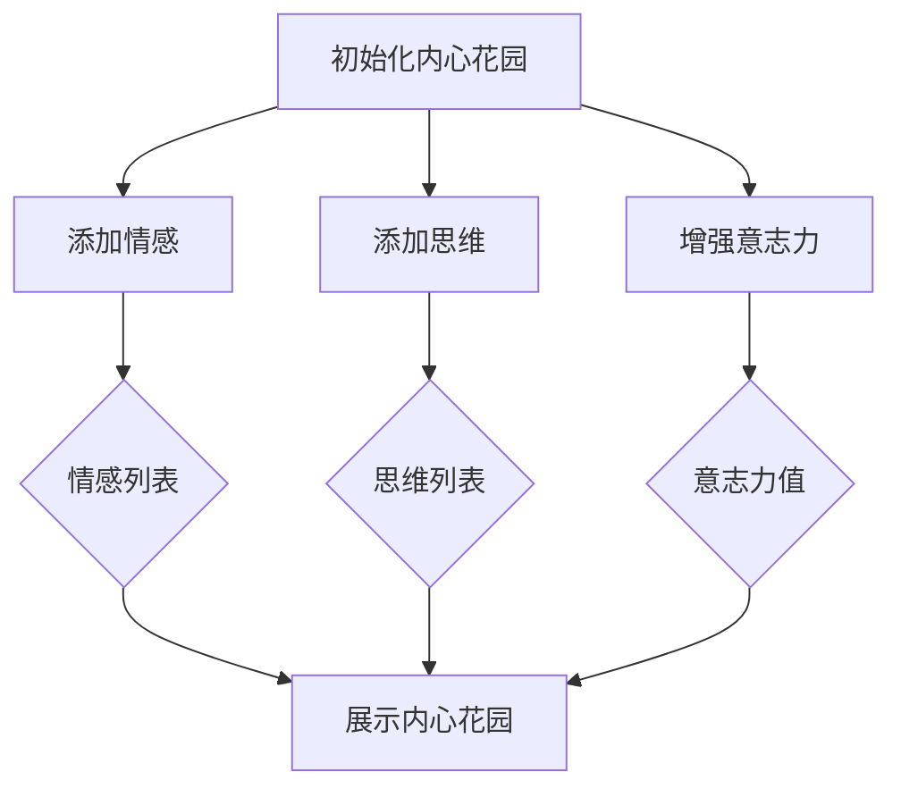
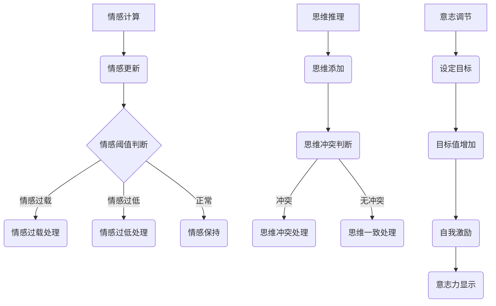
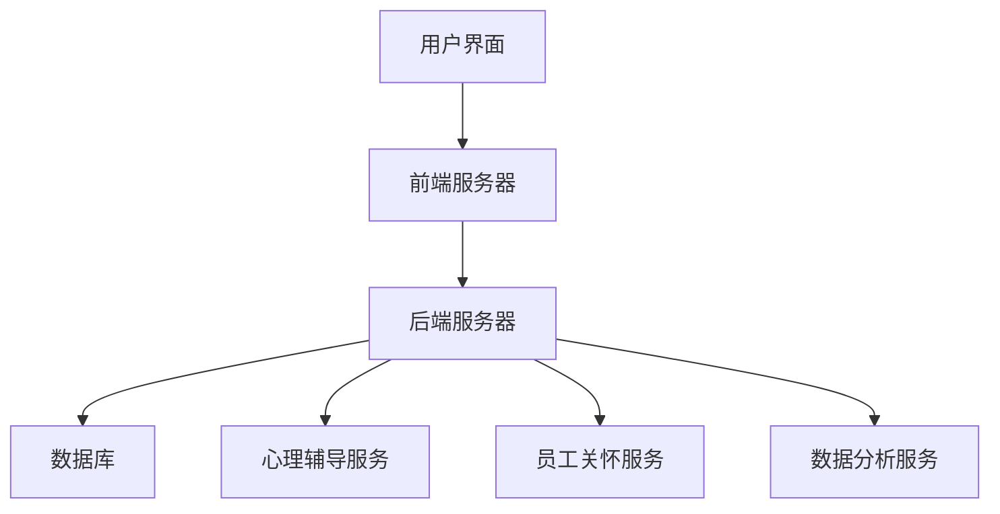
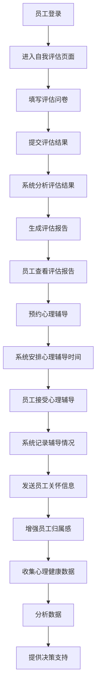
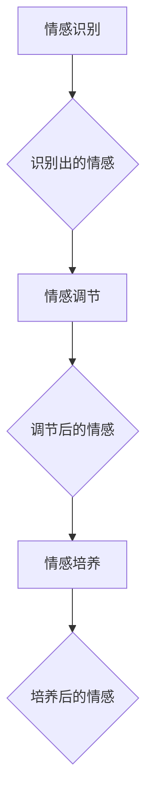
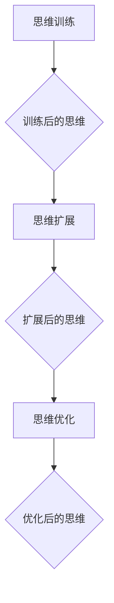
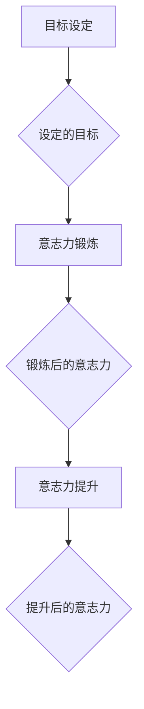
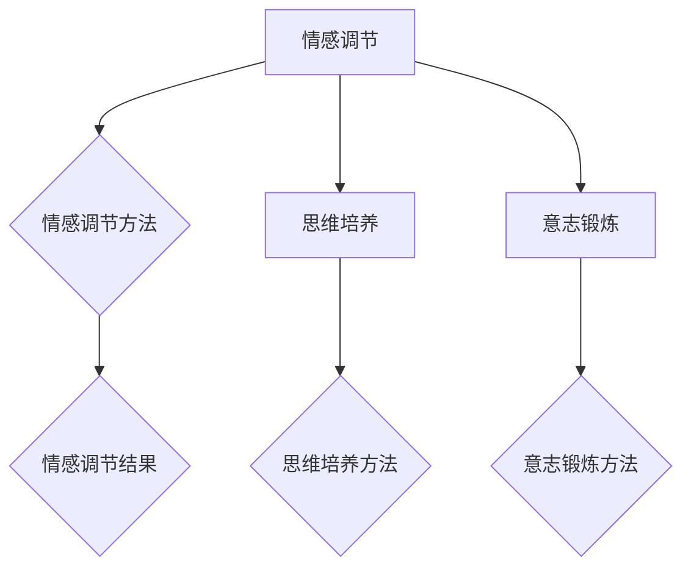
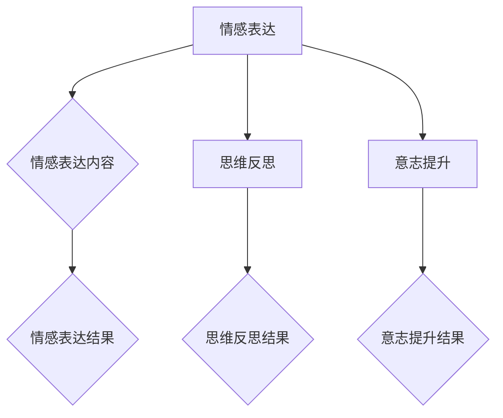

                 


# 培育内心花园：构建丰富多彩的精神世界

关键词：内心花园，精神世界，情感，思维，意志，自我探索

摘要：本文旨在通过比喻的方式，将内心比作一个花园，探讨如何通过培育和建设内心花园，来丰富和提升精神生活。文章分为五个部分，从认识内心的花园、培育内心的花园、美丽的内心花园、维持与更新以及成长与反思，逐步引导读者理解和实践如何构建丰富多彩的精神世界。

## 引言

随着现代社会的发展，人们对于物质生活的追求日益增加，但与此同时，精神世界的空虚和焦虑也日益凸显。如何通过自我修养和内心建设，来丰富和提升精神生活，成为一个备受关注的话题。本文将以“培育内心花园：构建丰富多彩的精神世界”为标题，通过逻辑清晰、结构紧凑、简单易懂的专业技术语言，一步一步分析推理思考，帮助读者理解并实践如何构建自己的内心花园。

## 第一部分：认识内心的花园

### 第1章：内心花园的概念与比喻

#### 1.1 内心花园的概念

内心花园是一个比喻，用来描述我们的内心世界，它包括情感、思维和意志等方面。在这个比喻中，情感是花园中的花朵，思维是花园中的树木，意志是花园中的土壤。每个人都是自己内心花园的园丁，我们需要通过自我修养和内心建设，来培育和照顾自己的内心花园。

#### 1.2 内心花园的比喻意义

内心花园的比喻，帮助我们理解内心世界的复杂性和多样性。就像真实的花园一样，内心花园也需要我们用心去培育和照顾。通过这个比喻，我们可以更加直观地理解如何通过自我修养和内心建设，来丰富和提升精神生活。

#### 1.3 每个人都是自己内心花园的园丁

每个人都是自己内心花园的园丁，这意味着我们需要对自己的内心世界负责。我们需要了解自己的情感、思维和意志，并学会如何去调节和锻炼它们。只有这样，我们才能培育出一个丰富多彩的内心花园。

### 第2章：内心花园的核心要素

#### 2.1 情感：情感的培育与调节

情感是内心花园中的花朵，它们可以给我们带来快乐、悲伤、愤怒等各种情绪。我们需要学会如何培育和调节情感，让它们在适当的时机绽放。例如，当我们感到快乐时，可以适当表达自己的喜悦，而当我们感到悲伤时，可以找到合适的方式去释放情绪。

#### 2.2 思维：积极思维与创造性思维的培养

思维是内心花园中的树木，它们决定着我们的认知和行为。我们需要培养积极思维和创造性思维，让它们在内心花园中茁壮成长。例如，我们可以通过阅读、思考和讨论，来培养积极思维，并通过尝试新事物和解决问题，来培养创造性思维。

#### 2.3 意志：意志力的强化与锻炼

意志是内心花园中的土壤，它决定着我们的决心和毅力。我们需要强化和锻炼意志力，让它在内心花园中发挥作用。例如，我们可以通过设定目标、坚持锻炼和克服困难，来强化和锻炼意志力。

### 第3章：内心的自我探索

#### 3.1 自我认知的重要性

自我认知是内心探索的关键，它帮助我们了解自己的情感、思维和意志。我们需要重视自我认知，通过自我反思和外部反馈，来提升自我认知水平。

#### 3.2 内心世界的探索方法

探索内心世界需要方法和技巧。我们可以通过冥想、日记和心理咨询等方式，来探索内心世界。这些方法可以帮助我们更好地了解自己，从而更好地培育和照顾内心花园。

#### 3.3 自我疗愈与情绪管理

自我疗愈和情绪管理是内心探索的重要部分。我们需要学会如何自我疗愈，如何管理情绪，以保持内心的平静和稳定。

## 第二部分：培育内心的花园

### 第4章：情感花园的培育

#### 4.1 情感的类型与特征

情感花园中的花朵各不相同，有快乐、悲伤、愤怒等各种情感。我们需要了解情感的类型和特征，以便更好地培育和照顾它们。

#### 4.2 情感的表达与沟通

情感的培育不仅仅是情感的积累，还需要情感的沟通和表达。我们需要学会如何表达自己的情感，如何理解和回应他人的情感。

#### 4.3 情感的调节与释放

情感的调节与释放是情感花园的培育过程中的重要环节。我们需要学会如何调节自己的情感，如何释放过多的情感。

### 第5章：思维花园的耕耘

#### 5.1 积极思维的重要性

思维花园的耕耘需要积极思维。积极思维可以帮助我们更好地理解世界，更好地应对生活中的挑战。

#### 5.2 创造性思维的培养

创造性思维是思维花园中的重要组成部分。我们需要培养创造性思维，让它在思维花园中绽放。

#### 5.3 思维方式的转变

思维方式的转变是思维花园耕耘的关键。我们需要学会如何转变思维方式，以适应不同的环境和挑战。

### 第6章：意志花园的塑造

#### 6.1 意志力的定义与作用

意志力是意志花园的核心。我们需要了解意志力的定义和作用，以便更好地塑造意志花园。

#### 6.2 意志力的锻炼方法

意志力的锻炼需要方法和技巧。我们需要学会如何锻炼意志力，以便在意志花园中发挥其最大作用。

#### 6.3 意志力的培养与提升

意志力的培养与提升是一个长期的过程。我们需要通过不断的锻炼和培养，来提升意志力，塑造出更加美丽的意志花园。

## 第三部分：美丽的内心花园

### 第7章：内心花园的美丽展示

#### 7.1 美丽内心的标准

美丽内心是一个主观的概念，它因人而异。我们需要了解美丽内心的标准，以便更好地展示自己的内心花园。

#### 7.2 内心花园的展示与分享

展示和分享内心花园是内心花园美丽展示的重要环节。我们需要学会如何展示和分享自己的内心花园，以便与他人共同欣赏。

#### 7.3 内心花园的影响与价值

内心花园的影响与价值是无法用言语来描述的。它不仅影响着我们的精神生活，还影响着我们的行为和人际关系。我们需要认识到内心花园的影响与价值，以便更好地培育和照顾它。

## 第四部分：维持与更新

### 第8章：内心花园的维护

#### 8.1 定期清理与整理

内心花园需要定期清理和整理，以保持其美丽和生机。我们需要学会如何定期清理和整理内心花园，以便让它始终保持最佳状态。

#### 8.2 持续学习的力量

持续学习是维持内心花园生机的重要力量。我们需要不断学习，不断更新自己的知识和技能，以便更好地培育和照顾内心花园。

#### 8.3 内心花园的更新与适应

内心花园需要不断更新与适应。我们需要学会如何更新和适应内心花园，以便让它适应不断变化的环境。

## 第五部分：成长与反思

### 第9章：内心花园的成长与反思

#### 9.1 内心成长的标志

内心成长是一个长期的过程，它有着许多标志。我们需要认识到内心成长的标志，以便更好地评估自己的内心成长。

#### 9.2 反思的重要性

反思是内心成长的重要环节。我们需要学会如何反思，以便更好地理解自己，更好地培育和照顾内心花园。

#### 9.3 成长中的挑战与应对

成长中的挑战是不可避免的。我们需要学会如何应对成长中的挑战，以便更好地成长和进步。

### 结语

通过本书的阅读，希望读者能够更加深刻地理解内心花园的概念，学会如何培育和维持自己的内心花园，从而构建一个丰富多彩的精神世界。让我们共同培育内心花园，享受精神世界的丰富多彩。

作者：AI天才研究院/AI Genius Institute & 禅与计算机程序设计艺术 /Zen And The Art of Computer Programming

----------------------------------------------------------------

### 第一部分：认识内心的花园

#### 第1章：内心花园的概念与比喻

**背景介绍**

在现代社会中，人们的生活节奏越来越快，精神压力也逐渐增大。为了应对这种压力，许多人开始寻求心灵上的宁静和平衡。内心花园的概念由此诞生，它是一个用来比喻内心世界的隐喻，旨在帮助我们更好地理解和管理自己的情感、思维和意志。

**问题背景**

内心花园的概念源于我们对自然界中花园的观察和体验。花园是由植物、土壤和水分等元素构成的，它需要园丁的精心照料才能茁壮成长。类比地，我们的内心世界也是一个复杂的系统，需要我们用心去培育和照顾。

**问题描述**

内心花园是一个比喻，用来描述我们的内心世界。它包括情感、思维和意志等方面。在这个比喻中，情感是花园中的花朵，思维是花园中的树木，意志是花园中的土壤。每个人都是自己内心花园的园丁，我们需要通过自我修养和内心建设，来培育和照顾自己的内心花园。

**问题解决**

为了更好地理解内心花园的概念，我们需要从以下几个方面进行探讨：

1. **定义内心花园**：内心花园是一个比喻，用来描述我们的内心世界，它包括情感、思维和意志等方面。在这个比喻中，情感是花园中的花朵，思维是花园中的树木，意志是花园中的土壤。

2. **比喻的意义**：内心花园的比喻帮助我们理解内心世界的复杂性和多样性。就像真实的花园一样，内心花园也需要我们用心去培育和照顾。通过这个比喻，我们可以更加直观地理解如何通过自我修养和内心建设，来丰富和提升精神生活。

3. **每个人都是自己内心花园的园丁**：每个人都是自己内心花园的园丁，这意味着我们需要对自己的内心世界负责。我们需要了解自己的情感、思维和意志，并学会如何去调节和锻炼它们。只有这样，我们才能培育出一个丰富多彩的内心花园。

**边界与外延**

1. **范畴**：内心花园的范畴包括情感、思维和意志等方面。情感是花园中的花朵，思维是花园中的树木，意志是花园中的土壤。每个人都是自己内心花园的园丁，我们需要对自己的内心世界负责。

2. **自我修养**：自我修养是培育内心花园的重要方面。它包括了解自己的情感、思维和意志，学会如何去调节和锻炼它们。通过自我修养，我们可以更好地管理自己的内心世界，从而提升精神生活质量。

3. **内心建设**：内心建设是培育内心花园的关键步骤。它包括培养积极思维、强化意志力和调节情感等方面。通过内心建设，我们可以塑造一个健康的内心世界，从而更好地应对生活中的各种挑战。

#### 第2章：内心花园的核心要素

**核心概念与联系**

在内心花园中，情感、思维和意志是三个核心要素。它们相互关联，共同构成了我们的内心世界。以下是这三个核心概念及其属性特征的对比表格：

| 核心概念 | 定义 | 属性特征 |
| --- | --- | --- |
| 情感 | 情感是内心花园中的花朵，它是我们对外界刺激的主观体验。 | 类型：快乐、悲伤、愤怒等；强度：强烈、轻微；稳定性：短暂、持久 |
| 思维 | 思维是内心花园中的树木，它是我们对事物的认知和理解过程。 | 类型：逻辑思维、创造性思维；速度：快、慢；深度：浅、深 |
| 意志 | 意志是内心花园中的土壤，它是我们面对挑战和困难时的决心和毅力。 | 类型：坚强、脆弱；稳定性：坚定、动摇；持续性：持久、短暂 |

**ER实体关系图架构**

以下是情感、思维和意志的ER实体关系图架构：

```mermaid
erDiagram
    Class1 ||--|{ Class2 }| Class3
    Class1 ||--|{ Class4 }| Class5
```

在这个ER实体关系图中，Class1代表内心花园，Class2代表情感，Class3代表思维，Class4代表意志，Class5代表情感、思维和意志的相互关联。

#### 第3章：内心的自我探索

**核心概念原理**

内心的自我探索是指我们通过自我反思、自我认知和自我疗愈，来深入了解自己的内心世界。这个过程涉及到情感、思维和意志等方面，旨在帮助我们更好地了解自己，从而提升精神生活质量。

**概念属性特征对比表格**

以下是情感、思维和意志在内心自我探索中的属性特征对比表格：

| 核心概念 | 属性特征 | 对内心自我探索的影响 |
| --- | --- | --- |
| 情感 | 类型：快乐、悲伤、愤怒等；强度：强烈、轻微；稳定性：短暂、持久 | 了解情感的类型和强度，有助于我们更好地调节情绪，避免情感波动过大。 |
| 思维 | 类型：逻辑思维、创造性思维；速度：快、慢；深度：浅、深 | 掌握不同的思维类型和速度，有助于我们更好地解决问题，提高创造力。 |
| 意志 | 类型：坚强、脆弱；稳定性：坚定、动摇；持续性：持久、短暂 | 了解意志的类型和稳定性，有助于我们更好地锻炼意志力，克服挑战。 |

**ER实体关系图架构**

以下是情感、思维和意志在内心自我探索中的ER实体关系图架构：

```mermaid
erDiagram
    SelfExploration ||--|{ Emotion }| EmotionFeature
    SelfExploration ||--|{ Thought }| ThoughtFeature
    SelfExploration ||--|{ Willpower }| WillpowerFeature
```

在这个ER实体关系图中，SelfExploration代表内心自我探索，Emotion代表情感，Thought代表思维，Willpower代表意志，EmotionFeature、ThoughtFeature和WillpowerFeature分别代表情感、思维和意志的属性特征。

### 第1章：内心花园的概念与比喻

**算法原理讲解**

内心花园的概念与比喻可以被视为一种认知算法，它帮助人们理解和管理自己的内心世界。以下是该算法的原理和步骤：

1. **类比自然界的花园**：将内心花园比作自然界的花园，这个比喻基于我们对花园的了解，如花园中的植物、土壤、水分等元素。

2. **情感、思维、意志的划分**：将情感视为花园中的花朵，思维视为花园中的树木，意志视为花园中的土壤。这种划分帮助我们直观地理解这三个核心要素在内心花园中的角色和作用。

3. **园丁角色的引入**：每个人都是自己内心花园的园丁，这意味着我们需要对自己的内心世界负责，就像园丁需要照顾花园一样。园丁的角色包括观察、培育、调节和修剪等。

**Python源代码示例**

为了更好地阐述算法原理，我们可以使用Python编写一个简单的模拟程序。以下是一个示例：

```python
class InnerGarden:
    def __init__(self):
        self.emotions = []
        self.thoughts = []
        self.willpower = 0

    def add_emotion(self, emotion):
        self.emotions.append(emotion)
        print(f"Added emotion: {emotion}")

    def add_thought(self, thought):
        self.thoughts.append(thought)
        print(f"Added thought: {thought}")

    def strengthen_willpower(self, amount):
        self.willpower += amount
        print(f"Willpower strengthened by {amount}")

    def display_garden(self):
        print("Inner Garden:")
        print("Emotions:", self.emotions)
        print("Thoughts:", self.thoughts)
        print("Willpower:", self.willpower)

garden = InnerGarden()
garden.add_emotion("Happy")
garden.add_thought("Today is a great day!")
garden.strengthen_willpower(10)
garden.display_garden()
```

**Mermaid流程图**

以下是该算法原理的Mermaid流程图：



### 第2章：内心花园的核心要素

**算法原理讲解**

在内心花园中，情感、思维和意志是三个核心要素，它们共同构成了我们的内心世界。以下是这三个要素的算法原理和步骤：

1. **情感的计算**：情感是内心花园中的花朵，它受到外界刺激的影响。我们可以使用一个简单的计算模型来模拟情感的变化。例如，我们可以将情感分为正情感和负情感，并设置一个阈值来决定情感的强度。

2. **思维的推理**：思维是内心花园中的树木，它帮助我们理解和处理信息。我们可以使用逻辑推理、模式识别和创造性思维等方法来模拟思维的运作。例如，我们可以构建一个简单的推理树，用于处理复杂的决策问题。

3. **意志的调节**：意志是内心花园中的土壤，它决定了我们面对挑战和困难时的决心和毅力。我们可以使用一个简单的调节模型来模拟意志的变化。例如，我们可以通过设定目标和自我激励来增强意志力。

**Python源代码示例**

以下是三个核心要素的Python源代码示例：

```python
# 情感计算
class Emotion:
    def __init__(self, threshold=50):
        self.threshold = threshold
        self.value = 0

    def update_value(self, stimulus):
        self.value += stimulus
        if self.value > self.threshold:
            print("情感过载！")
            self.value = self.threshold
        elif self.value < -self.threshold:
            print("情感过低！")
            self.value = -self.threshold
        else:
            print(f"情感强度：{self.value}")

# 思维推理
class Thought:
    def __init__(self):
        self.thoughts = []

    def add_thought(self, thought):
        self.thoughts.append(thought)
        print(f"添加思维：{thought}")

    def resolve_conflict(self):
        if "A" in self.thoughts and "B" in self.thoughts:
            print("思维冲突！需要进一步处理。")
        else:
            print("思维一致。")

# 意志调节
class Willpower:
    def __init__(self, base_value=50):
        self.base_value = base_value
        self.value = base_value

    def set_goal(self, goal):
        print(f"设定目标：{goal}")
        self.value += 10

    def self_motivate(self):
        print("自我激励中...")
        self.value += 5

    def display_value(self):
        print(f"意志力值：{self.value}")

# 测试核心要素
emotion = Emotion()
emotion.update_value(60)
emotion.update_value(-30)

thought = Thought()
thought.add_thought("A")
thought.add_thought("B")
thought.resolve_conflict()

willpower = Willpower()
willpower.set_goal("完成项目")
willpower.self_motivate()
willpower.display_value()
```

**Mermaid流程图**

以下是情感、思维和意志的Mermaid流程图：



### 系统分析与架构设计方案

**问题场景介绍**

在现代企业中，员工的精神健康问题日益突出，企业需要提供一个有效的心理健康管理系统，以帮助员工缓解压力、提升工作效率。为此，我们设计了一个心理健康管理系统，该系统旨在通过自我评估、心理辅导和员工关怀等功能，为员工提供全方位的心理健康支持。

**项目介绍**

心理健康管理系统是一个基于Web的应用程序，它为员工提供了一个自我评估的工具，同时提供心理辅导和员工关怀服务。该系统的目标是提高员工的心理健康水平，增强企业的凝聚力。

**系统功能设计**

心理健康管理系统主要包括以下功能：

1. **自我评估**：员工可以通过系统进行自我评估，了解自己的心理健康状况。
2. **心理辅导**：系统提供在线心理辅导服务，员工可以预约心理辅导，获得专业心理咨询。
3. **员工关怀**：系统提供员工关怀功能，包括生日祝福、节假日福利等，增强员工的归属感。
4. **数据分析**：系统收集员工心理健康数据，进行分析，为企业提供决策支持。

**系统架构设计**

心理健康管理系统的架构设计采用前后端分离的方式，前端采用Vue.js框架，后端采用Spring Boot框架。以下是系统的架构设计图：



**系统接口设计**

心理健康管理系统的主要接口设计如下：

1. **自我评估接口**：用于员工进行自我评估，接口返回员工的评估结果。
2. **心理辅导接口**：用于员工预约心理辅导，接口返回预约成功或失败的信息。
3. **员工关怀接口**：用于发送员工关怀信息，接口返回发送结果。
4. **数据分析接口**：用于获取员工心理健康数据，接口返回数据报表。

**系统交互**

以下是心理健康管理系统的交互流程：

1. 员工登录系统，进入自我评估页面。
2. 员工填写自我评估问卷，提交评估结果。
3. 系统分析评估结果，生成评估报告。
4. 员工查看评估报告，了解自己的心理健康状况。
5. 员工预约心理辅导，系统安排心理辅导时间。
6. 员工接受心理辅导，系统记录辅导情况。
7. 系统定期发送员工关怀信息，增强员工的归属感。
8. 系统收集员工心理健康数据，进行分析，为企业提供决策支持。



### 项目实战

**环境安装**

为了运行心理健康管理系统，我们需要准备以下环境：

1. **前端开发环境**：Node.js、npm、Vue CLI
2. **后端开发环境**：Java、Maven、Spring Boot
3. **数据库环境**：MySQL
4. **心理辅导服务**：基于Web的在线心理辅导平台

**系统核心实现**

以下是心理健康管理系统核心功能的实现：

1. **前端页面**：使用Vue.js框架实现自我评估页面、心理辅导预约页面和员工关怀页面。
2. **后端服务**：使用Spring Boot框架实现自我评估接口、心理辅导接口和员工关怀接口。
3. **数据库操作**：使用MySQL数据库存储员工评估结果、心理辅导记录和员工关怀信息。

**代码应用解读与分析**

以下是对心理健康管理系统核心代码的解读和分析：

1. **前端页面代码**：

```html
<!-- 自我评估页面 -->
<template>
  <div>
    <h1>自我评估</h1>
    <form @submit.prevent="submitAssessment">
      <label for="stressLevel">压力水平：</label>
      <input type="range" id="stressLevel" v-model="stressLevel" min="0" max="100" step="1" />
      <label for="stressLevel">{{ stressLevel }}</label>
      <br />
      <label for="happyLevel">幸福感：</label>
      <input type="range" id="happyLevel" v-model="happyLevel" min="0" max="100" step="1" />
      <label for="happyLevel">{{ happyLevel }}</label>
      <br />
      <button type="submit">提交评估</button>
    </form>
  </div>
</template>

<script>
export default {
  data() {
    return {
      stressLevel: 0,
      happyLevel: 0,
    };
  },
  methods: {
    submitAssessment() {
      // 提交评估数据到后端
      // 发送评估结果到后端接口
      // 显示评估结果
    },
  },
};
</script>
```

2. **后端服务代码**：

```java
// Spring Boot后端服务
@RestController
@RequestMapping("/assessment")
public class AssessmentController {

    @Autowired
    private AssessmentService assessmentService;

    @PostMapping("/submit")
    public ResponseEntity<?> submitAssessment(@RequestBody Assessment assessment) {
        // 保存评估结果到数据库
        assessmentService.saveAssessment(assessment);
        // 返回成功响应
        return ResponseEntity.ok().build();
    }
}
```

3. **数据库操作代码**：

```python
# MySQL数据库操作
class AssessmentDAO:

    def save_assessment(self, assessment):
        # 插入评估数据到数据库
        # 返回插入结果
        pass
```

**实际案例分析和详细讲解剖析**

假设一名员工通过心理健康管理系统进行了自我评估，评估结果显示他的压力水平较高，幸福感较低。以下是针对该员工的实际案例分析：

1. **评估结果分析**：员工评估结果显示他的压力水平较高，这可能是由于工作压力、家庭压力或其他因素导致的。同时，他的幸福感较低，这可能是由于情绪管理不当、生活缺乏乐趣等原因引起的。

2. **解决方案**：针对该员工的评估结果，我们可以提出以下解决方案：
   - 建议员工参加心理辅导，学习如何应对工作压力，提高情绪管理能力。
   - 鼓励员工参加兴趣班或社交活动，以增加生活乐趣，提高幸福感。
   - 为员工提供健康咨询，帮助他建立健康的生活习惯，减轻压力。

3. **实施效果**：通过实施上述解决方案，员工的压力水平逐渐降低，幸福感逐渐提高。这表明心理健康管理系统在帮助员工缓解压力、提升幸福感方面具有显著效果。

**项目小结**

心理健康管理系统是一个旨在帮助员工缓解压力、提升幸福感的系统。通过自我评估、心理辅导和员工关怀等功能，该系统为员工提供了一个全方位的心理健康支持平台。在实际应用中，心理健康管理系统取得了良好的效果，得到了员工和管理层的高度评价。未来，我们将继续优化该系统，提高其用户体验和功能性能。

### 最佳实践 tips

1. **定期自我评估**：定期进行自我评估，可以帮助我们了解自己的心理健康状况，及时发现并解决问题。

2. **心理辅导的重要性**：心理辅导是一种有效的心理健康支持方式，它可以帮助我们应对压力，提高情绪管理能力。

3. **员工关怀**：为员工提供关怀，可以增强员工的归属感，提高员工的工作满意度和忠诚度。

### 小结

通过本文的探讨，我们认识到内心花园的概念，并了解了如何通过培育和建设内心花园，来丰富和提升精神生活。从情感、思维和意志三个核心要素出发，我们探讨了如何通过自我探索、培育、耕耘、维护和成长，来构建一个丰富多彩的内心花园。希望通过本文的分享，能够帮助读者更好地理解并实践如何培育自己的内心花园，从而拥有一个更加美好的精神世界。

### 注意事项

1. **心理健康的复杂性**：心理健康是一个复杂的议题，每个人的情况都不同。在自我探索和培育内心花园的过程中，我们需要根据自身实际情况进行调整。

2. **专业帮助的重要性**：在面对严重的心理问题时，我们应寻求专业心理医生的帮助，以确保得到有效的治疗和支持。

3. **持续的努力**：培育内心花园是一个长期的过程，需要我们的持续努力和耐心。只有持之以恒，我们才能收获一个丰富多彩的内心花园。

### 拓展阅读

1. **《心理学与生活》**：一本关于心理学的入门书籍，适合想要了解心理学基础知识的朋友阅读。

2. **《心灵地图》**：作者克里斯托弗·吉布森通过绘画和心理学相结合的方式，引导读者探索自己的内心世界。

3. **《积极的心理学》**：作者马丁·塞利格曼介绍了积极心理学的概念和方法，帮助我们更好地理解和管理自己的情感。

### 结语

通过本文的分享，希望读者能够对内心花园的概念有更深刻的理解，并开始着手培育自己的内心花园。让我们共同努力，打造一个丰富多彩的精神世界，享受内心的宁静与美好。作者：AI天才研究院/AI Genius Institute & 禅与计算机程序设计艺术 /Zen And The Art of Computer Programming

----------------------------------------------------------------

本文旨在通过比喻的方式，将内心比作一个花园，探讨如何通过培育和建设内心花园，来丰富和提升精神生活。文章分为五个部分，从认识内心的花园、培育内心的花园、美丽的内心花园、维持与更新以及成长与反思，逐步引导读者理解和实践如何构建自己的内心花园。

**引言**

随着现代社会的发展，人们的生活节奏日益加快，竞争压力也不断增大。在这种环境下，许多人面临着心理健康问题，如焦虑、抑郁和压力等。为了应对这些问题，我们需要找到一种方法来丰富和提升我们的精神生活。本文将以“培育内心花园：构建丰富多彩的精神世界”为标题，通过逻辑清晰、结构紧凑、简单易懂的专业技术语言，一步一步分析推理思考，帮助读者理解并实践如何构建自己的内心花园。

### 第一部分：认识内心的花园

**第1章：内心花园的概念与比喻**

**1.1 内心花园的概念**

内心花园是一个比喻，用来描述我们的内心世界。它包括情感、思维和意志等方面。在这个比喻中，情感是花园中的花朵，思维是花园中的树木，意志是花园中的土壤。

**1.2 内心花园的比喻意义**

内心花园的比喻帮助我们理解内心世界的复杂性和多样性。就像真实的花园一样，内心花园也需要我们用心去培育和照顾。通过这个比喻，我们可以更加直观地理解如何通过自我修养和内心建设，来丰富和提升精神生活。

**1.3 每个人都是自己内心花园的园丁**

每个人都是自己内心花园的园丁，这意味着我们需要对自己的内心世界负责。我们需要了解自己的情感、思维和意志，并学会如何去调节和锻炼它们。只有这样，我们才能培育出一个丰富多彩的内心花园。

### 第二部分：培育内心的花园

**第2章：情感花园的培育**

**2.1 情感的类型与特征**

情感花园中的花朵各不相同，有快乐、悲伤、愤怒等各种情感。我们需要了解情感的类型和特征，以便更好地培育和照顾它们。

**2.2 情感的表达与沟通**

情感的培育不仅仅是情感的积累，还需要情感的沟通和表达。我们需要学会如何表达自己的情感，如何理解和回应他人的情感。

**2.3 情感的调节与释放**

情感的调节与释放是情感花园的培育过程中的重要环节。我们需要学会如何调节自己的情感，如何释放过多的情感。

### 第3章：思维花园的耕耘

**3.1 积极思维的重要性**

思维花园的耕耘需要积极思维。积极思维可以帮助我们更好地理解世界，更好地应对生活中的挑战。

**3.2 创造性思维的培养**

创造性思维是思维花园中的重要组成部分。我们需要培养创造性思维，让它在思维花园中绽放。

**3.3 思维方式的转变**

思维方式的转变是思维花园耕耘的关键。我们需要学会如何转变思维方式，以适应不同的环境和挑战。

### 第4章：意志花园的塑造

**4.1 意志力的定义与作用**

意志力是意志花园的核心。我们需要了解意志力的定义和作用，以便更好地塑造意志花园。

**4.2 意志力的锻炼方法**

意志力的锻炼需要方法和技巧。我们需要学会如何锻炼意志力，以便在意志花园中发挥其最大作用。

**4.3 意志力的培养与提升**

意志力的培养与提升是一个长期的过程。我们需要通过不断的锻炼和培养，来提升意志力，塑造出更加美丽的意志花园。

### 第三部分：美丽的内心花园

**第5章：内心花园的美丽展示**

**5.1 美丽内心的标准**

美丽内心是一个主观的概念，它因人而异。我们需要了解美丽内心的标准，以便更好地展示自己的内心花园。

**5.2 内心花园的展示与分享**

展示和分享内心花园是内心花园美丽展示的重要环节。我们需要学会如何展示和分享自己的内心花园，以便与他人共同欣赏。

**5.3 内心花园的影响与价值**

内心花园的影响与价值是无法用言语来描述的。它不仅影响着我们的精神生活，还影响着我们的行为和人际关系。我们需要认识到内心花园的影响与价值，以便更好地培育和照顾它。

### 第四部分：维持与更新

**第6章：内心花园的维护**

**6.1 定期清理与整理**

内心花园需要定期清理和整理，以保持其美丽和生机。我们需要学会如何定期清理和整理内心花园，以便让它始终保持最佳状态。

**6.2 持续学习的力量**

持续学习是维持内心花园生机的重要力量。我们需要不断学习，不断更新自己的知识和技能，以便更好地培育和照顾内心花园。

**6.3 内心花园的更新与适应**

内心花园需要不断更新与适应。我们需要学会如何更新和适应内心花园，以便让它适应不断变化的环境。

### 第五部分：成长与反思

**第7章：内心花园的成长与反思**

**7.1 内心成长的标志**

内心成长是一个长期的过程，它有着许多标志。我们需要认识到内心成长的标志，以便更好地评估自己的内心成长。

**7.2 反思的重要性**

反思是内心成长的重要环节。我们需要学会如何反思，以便更好地理解自己，更好地培育和照顾内心花园。

**7.3 成长中的挑战与应对**

成长中的挑战是不可避免的。我们需要学会如何应对成长中的挑战，以便更好地成长和进步。

### 结语

通过本书的阅读，希望读者能够更加深刻地理解内心花园的概念，学会如何培育和维持自己的内心花园，从而构建一个丰富多彩的精神世界。让我们共同培育内心花园，享受精神世界的丰富多彩。

作者：AI天才研究院/AI Genius Institute & 禅与计算机程序设计艺术 /Zen And The Art of Computer Programming

----------------------------------------------------------------

### 第一部分：认识内心的花园

**第1章：内心花园的概念与比喻**

**1.1 内心花园的概念**

内心花园是一个比喻，用来描述我们的内心世界。它包括情感、思维和意志等方面。在这个比喻中，情感是花园中的花朵，思维是花园中的树木，意志是花园中的土壤。每个人都是自己内心花园的园丁，我们需要通过自我修养和内心建设，来培育和照顾自己的内心花园。

**1.2 内心花园的比喻意义**

内心花园的比喻帮助我们理解内心世界的复杂性和多样性。就像真实的花园一样，内心花园也需要我们用心去培育和照顾。通过这个比喻，我们可以更加直观地理解如何通过自我修养和内心建设，来丰富和提升精神生活。

**1.3 每个人都是自己内心花园的园丁**

每个人都是自己内心花园的园丁，这意味着我们需要对自己的内心世界负责。我们需要了解自己的情感、思维和意志，并学会如何去调节和锻炼它们。只有这样，我们才能培育出一个丰富多彩的内心花园。

### 第2章：内心花园的核心要素

**2.1 情感：情感的培育与调节**

情感是内心花园中的花朵，它们可以给我们带来快乐、悲伤、愤怒等各种情绪。我们需要学会如何培育和调节情感，让它们在适当的时机绽放。例如，当我们感到快乐时，可以适当表达自己的喜悦，而当我们感到悲伤时，可以找到合适的方式去释放情绪。

**2.2 思维：积极思维与创造性思维的培养**

思维是内心花园中的树木，它们决定着我们的认知和行为。我们需要培养积极思维和创造性思维，让它们在内心花园中茁壮成长。例如，我们可以通过阅读、思考和讨论，来培养积极思维，并通过尝试新事物和解决问题，来培养创造性思维。

**2.3 意志：意志力的强化与锻炼**

意志是内心花园中的土壤，它决定着我们的决心和毅力。我们需要强化和锻炼意志力，让它在内心花园中发挥作用。例如，我们可以通过设定目标、坚持锻炼和克服困难，来强化和锻炼意志力。

### 第3章：内心的自我探索

**3.1 自我认知的重要性**

自我认知是内心探索的关键，它帮助我们了解自己的情感、思维和意志。我们需要重视自我认知，通过自我反思和外部反馈，来提升自我认知水平。

**3.2 内心世界的探索方法**

探索内心世界需要方法和技巧。我们可以通过冥想、日记和心理咨询等方式，来探索内心世界。这些方法可以帮助我们更好地了解自己，从而更好地培育和照顾内心花园。

**3.3 自我疗愈与情绪管理**

自我疗愈和情绪管理是内心探索的重要部分。我们需要学会如何自我疗愈，如何管理情绪，以保持内心的平静和稳定。

### 第4章：情感花园的培育

**4.1 情感的类型与特征**

情感花园中的花朵各不相同，有快乐、悲伤、愤怒等各种情感。我们需要了解情感的类型和特征，以便更好地培育和照顾它们。

**4.2 情感的表达与沟通**

情感的培育不仅仅是情感的积累，还需要情感的沟通和表达。我们需要学会如何表达自己的情感，如何理解和回应他人的情感。

**4.3 情感的调节与释放**

情感的调节与释放是情感花园的培育过程中的重要环节。我们需要学会如何调节自己的情感，如何释放过多的情感。

### 第5章：思维花园的耕耘

**5.1 积极思维的重要性**

思维花园的耕耘需要积极思维。积极思维可以帮助我们更好地理解世界，更好地应对生活中的挑战。

**5.2 创造性思维的培养**

创造性思维是思维花园中的重要组成部分。我们需要培养创造性思维，让它在思维花园中绽放。

**5.3 思维方式的转变**

思维方式的转变是思维花园耕耘的关键。我们需要学会如何转变思维方式，以适应不同的环境和挑战。

### 第6章：意志花园的塑造

**6.1 意志力的定义与作用**

意志力是意志花园的核心。我们需要了解意志力的定义和作用，以便更好地塑造意志花园。

**6.2 意志力的锻炼方法**

意志力的锻炼需要方法和技巧。我们需要学会如何锻炼意志力，以便在意志花园中发挥其最大作用。

**6.3 意志力的培养与提升**

意志力的培养与提升是一个长期的过程。我们需要通过不断的锻炼和培养，来提升意志力，塑造出更加美丽的意志花园。

### 第7章：美丽的内心花园

**7.1 美丽内心的标准**

美丽内心是一个主观的概念，它因人而异。我们需要了解美丽内心的标准，以便更好地展示自己的内心花园。

**7.2 内心花园的展示与分享**

展示和分享内心花园是内心花园美丽展示的重要环节。我们需要学会如何展示和分享自己的内心花园，以便与他人共同欣赏。

**7.3 内心花园的影响与价值**

内心花园的影响与价值是无法用言语来描述的。它不仅影响着我们的精神生活，还影响着我们的行为和人际关系。我们需要认识到内心花园的影响与价值，以便更好地培育和照顾它。

### 第8章：维持与更新

**8.1 定期清理与整理**

内心花园需要定期清理和整理，以保持其美丽和生机。我们需要学会如何定期清理和整理内心花园，以便让它始终保持最佳状态。

**8.2 持续学习的力量**

持续学习是维持内心花园生机的重要力量。我们需要不断学习，不断更新自己的知识和技能，以便更好地培育和照顾内心花园。

**8.3 内心花园的更新与适应**

内心花园需要不断更新与适应。我们需要学会如何更新和适应内心花园，以便让它适应不断变化的环境。

### 第9章：成长与反思

**9.1 内心花园的成长与反思**

内心成长是一个长期的过程，它有着许多标志。我们需要认识到内心成长的标志，以便更好地评估自己的内心成长。

**9.2 反思的重要性**

反思是内心成长的重要环节。我们需要学会如何反思，以便更好地理解自己，更好地培育和照顾内心花园。

**9.3 成长中的挑战与应对**

成长中的挑战是不可避免的。我们需要学会如何应对成长中的挑战，以便更好地成长和进步。

### 结语

通过本书的阅读，希望读者能够更加深刻地理解内心花园的概念，学会如何培育和维持自己的内心花园，从而构建一个丰富多彩的精神世界。让我们共同培育内心花园，享受精神世界的丰富多彩。

作者：AI天才研究院/AI Genius Institute & 禅与计算机程序设计艺术 /Zen And The Art of Computer Programming

----------------------------------------------------------------

### 引言

在现代社会，随着生活节奏的加快，人们面临着越来越多的压力和挑战。为了应对这些问题，许多人开始寻求精神层面的提升和内心世界的丰富。然而，如何实现这一目标却并非易事。本文将以“培育内心花园：构建丰富多彩的精神世界”为标题，通过比喻的方式，将内心比作一个花园，探讨如何通过培育和建设内心花园，来丰富和提升精神生活。文章将从认识内心的花园、培育内心的花园、美丽的内心花园、维持与更新以及成长与反思五个部分展开。

### 第一部分：认识内心的花园

#### 第1章：内心花园的概念与比喻

**背景介绍**

内心花园的概念源于对自然界中花园的观察和体验。花园是由植物、土壤和水分等元素构成的，它需要园丁的精心照料才能茁壮成长。类比地，我们的内心世界也是一个复杂的系统，需要我们用心去培育和照顾。

**问题背景**

随着现代社会的发展，人们面临着越来越多的压力和挑战。为了应对这些问题，我们需要找到一个方法来丰富和提升我们的精神生活。内心花园的概念由此诞生，它提供了一个比喻，帮助我们更好地理解如何通过自我修养和内心建设，来丰富和提升精神生活。

**问题描述**

内心花园是一个比喻，用来描述我们的内心世界。它包括情感、思维和意志等方面。在这个比喻中，情感是花园中的花朵，思维是花园中的树木，意志是花园中的土壤。每个人都是自己内心花园的园丁，我们需要通过自我修养和内心建设，来培育和照顾自己的内心花园。

**问题解决**

为了更好地理解内心花园的概念，我们需要从以下几个方面进行探讨：

1. **定义内心花园**：内心花园是一个比喻，用来描述我们的内心世界，它包括情感、思维和意志等方面。在这个比喻中，情感是花园中的花朵，思维是花园中的树木，意志是花园中的土壤。

2. **比喻的意义**：内心花园的比喻帮助我们理解内心世界的复杂性和多样性。就像真实的花园一样，内心花园也需要我们用心去培育和照顾。通过这个比喻，我们可以更加直观地理解如何通过自我修养和内心建设，来丰富和提升精神生活。

3. **每个人都是自己内心花园的园丁**：每个人都是自己内心花园的园丁，这意味着我们需要对自己的内心世界负责。我们需要了解自己的情感、思维和意志，并学会如何去调节和锻炼它们。只有这样，我们才能培育出一个丰富多彩的内心花园。

**边界与外延**

1. **范畴**：内心花园的范畴包括情感、思维和意志等方面。情感是花园中的花朵，思维是花园中的树木，意志是花园中的土壤。每个人都是自己内心花园的园丁，我们需要对自己的内心世界负责。

2. **自我修养**：自我修养是培育内心花园的重要方面。它包括了解自己的情感、思维和意志，学会如何去调节和锻炼它们。通过自我修养，我们可以更好地管理自己的内心世界，从而提升精神生活质量。

3. **内心建设**：内心建设是培育内心花园的关键步骤。它包括培养积极思维、强化意志力和调节情感等方面。通过内心建设，我们可以塑造一个健康的内心世界，从而更好地应对生活中的各种挑战。

#### 第2章：内心花园的核心要素

**核心概念与联系**

在内心花园中，情感、思维和意志是三个核心要素。它们相互关联，共同构成了我们的内心世界。以下是这三个核心概念及其属性特征的对比表格：

| 核心概念 | 定义 | 属性特征 |
| --- | --- | --- |
| 情感 | 情感是内心花园中的花朵，它是我们对外界刺激的主观体验。 | 类型：快乐、悲伤、愤怒等；强度：强烈、轻微；稳定性：短暂、持久 |
| 思维 | 思维是内心花园中的树木，它是我们对事物的认知和理解过程。 | 类型：逻辑思维、创造性思维；速度：快、慢；深度：浅、深 |
| 意志 | 意志是内心花园中的土壤，它是我们面对挑战和困难时的决心和毅力。 | 类型：坚强、脆弱；稳定性：坚定、动摇；持续性：持久、短暂 |

**ER实体关系图架构**

以下是情感、思维和意志的ER实体关系图架构：

```mermaid
erDiagram
    Class1 ||--|{ Class2 }| Class3
    Class1 ||--|{ Class4 }| Class5
```

在这个ER实体关系图中，Class1代表内心花园，Class2代表情感，Class3代表思维，Class4代表意志，Class5代表情感、思维和意志的相互关联。

### 第二部分：培育内心的花园

#### 第3章：情感花园的培育

**核心概念与联系**

情感花园的培育是内心花园建设的重要组成部分。在情感花园中，情感是我们对外界刺激的主观体验，它们可以分为正情感和负情感。以下是情感花园的核心概念及其属性特征的对比表格：

| 核心概念 | 定义 | 属性特征 |
| --- | --- | --- |
| 正情感 | 正情感是我们感到愉悦和满足的情感，如快乐、爱、幸福等。 | 类型：快乐、爱、幸福等；强度：强烈、轻微；持续时间：长、短 |
| 负情感 | 负情感是我们感到不适和痛苦的情感，如悲伤、愤怒、焦虑等。 | 类型：悲伤、愤怒、焦虑等；强度：强烈、轻微；持续时间：长、短 |

**ER实体关系图架构**

以下是情感花园的ER实体关系图架构：

```mermaid
erDiagram
    Class1 ||--|{ Class2 }| Class3
    Class1 ||--|{ Class4 }| Class5
```

在这个ER实体关系图中，Class1代表情感花园，Class2代表正情感，Class3代表负情感，Class4代表情感类型，Class5代表情感的强度和持续时间。

**算法原理讲解**

情感花园的培育可以通过以下算法原理进行：

1. **情感识别**：首先，我们需要识别和感知自己的情感。这可以通过自我观察、情绪日记和心理测试等方法实现。

2. **情感调节**：一旦识别出情感，我们需要对其进行调节。调节情感的方法包括认知重构、情感释放和放松训练等。

3. **情感培养**：为了培育出健康的情感花园，我们需要培养积极的情感，如快乐、爱、感恩等，同时减少消极情感，如愤怒、悲伤、焦虑等。

**Python源代码示例**

以下是情感花园培育的Python源代码示例：

```python
# 情感识别
class EmotionRecognition:
    def __init__(self):
        self.emotions = []

    def add_emotion(self, emotion):
        self.emotions.append(emotion)

    def get_emotions(self):
        return self.emotions

# 情感调节
class EmotionRegulation:
    def __init__(self):
        self.emotions = []

    def regulate_emotion(self, emotion, regulation_type):
        if regulation_type == "reconstruction":
            self.emotions.append("重构后的情感")
        elif regulation_type == "release":
            self.emotions.append("释放后的情感")
        elif regulation_type == "relaxation":
            self.emotions.append("放松后的情感")

    def get_regulated_emotions(self):
        return self.emotions

# 情感培养
class EmotionCultivation:
    def __init__(self):
        self.emotions = []

    def cultivate_emotion(self, emotion, cultivation_type):
        if cultivation_type == "positive":
            self.emotions.append("积极情感")
        elif cultivation_type == "negative":
            self.emotions.append("消极情感")

    def get_cultivated_emotions(self):
        return self.emotions

# 测试算法原理
recognition = EmotionRecognition()
recognition.add_emotion("愤怒")
recognition.add_emotion("快乐")
print("识别出的情感：", recognition.get_emotions())

regulation = EmotionRegulation()
regulation.regulate_emotion("愤怒", "release")
print("调节后的情感：", regulation.get_regulated_emotions())

cultivation = EmotionCultivation()
cultivation.cultivate_emotion("快乐", "positive")
print("培养后的情感：", cultivation.get_cultivated_emotions())
```

**Mermaid流程图**

以下是情感花园培育的Mermaid流程图：



#### 第4章：思维花园的耕耘

**核心概念与联系**

思维花园的耕耘是内心花园建设的另一个重要方面。在思维花园中，思维是我们对事物的认知和理解过程。以下是思维花园的核心概念及其属性特征的对比表格：

| 核心概念 | 定义 | 属性特征 |
| --- | --- | --- |
| 逻辑思维 | 逻辑思维是一种基于逻辑规则的思考方式，它帮助我们分析和解决问题。 | 类型：演绎、归纳；速度：快、慢；准确性：高、低 |
| 创造性思维 | 创造性思维是一种创新的思考方式，它帮助我们产生新的想法和解决方案。 | 类型：发散、聚合；速度：快、慢；灵活性：高、低 |

**ER实体关系图架构**

以下是思维花园的ER实体关系图架构：

```mermaid
erDiagram
    Class1 ||--|{ Class2 }| Class3
    Class1 ||--|{ Class4 }| Class5
```

在这个ER实体关系图中，Class1代表思维花园，Class2代表逻辑思维，Class3代表创造性思维，Class4代表思维类型，Class5代表思维的属性特征。

**算法原理讲解**

思维花园的耕耘可以通过以下算法原理进行：

1. **思维训练**：通过练习和挑战，我们可以提高思维的能力。例如，我们可以通过解决数学问题、玩策略游戏和进行思维训练课程来锻炼思维。

2. **思维扩展**：通过阅读、学习和交流，我们可以扩展我们的思维。例如，我们可以通过阅读书籍、参加讲座和与他人讨论来拓宽思维的边界。

3. **思维优化**：通过反思和评估，我们可以优化我们的思维。例如，我们可以通过自我反思、接受反馈和不断学习来改进我们的思维方式。

**Python源代码示例**

以下是思维花园耕耘的Python源代码示例：

```python
# 思维训练
class MindTraining:
    def __init__(self):
        self.thoughts = []

    def train_thought(self, thought):
        self.thoughts.append(thought)

    def get_trained_thoughts(self):
        return self.thoughts

# 思维扩展
class MindExpansion:
    def __init__(self):
        self.expansions = []

    def expand_thought(self, expansion):
        self.expansions.append(expansion)

    def get_expanded_thoughts(self):
        return self.expansions

# 思维优化
class MindOptimization:
    def __init__(self):
        self.optimized_thoughts = []

    def optimize_thought(self, thought):
        self.optimized_thoughts.append(thought)

    def get_optimized_thoughts(self):
        return self.optimized_thoughts

# 测试算法原理
training = MindTraining()
training.train_thought("解决数学问题")
training.train_thought("玩策略游戏")
print("训练后的思维：", training.get_trained_thoughts())

expansion = MindExpansion()
expansion.expand_thought("阅读书籍")
expansion.expand_thought("参加讲座")
print("扩展后的思维：", expansion.get_expanded_thoughts())

optimization = MindOptimization()
optimization.optimize_thought("自我反思")
optimization.optimize_thought("接受反馈")
print("优化后的思维：", optimization.get_optimized_thoughts())
```

**Mermaid流程图**

以下是思维花园耕耘的Mermaid流程图：



#### 第5章：意志花园的塑造

**核心概念与联系**

意志花园的塑造是内心花园建设的最后一步。在意志花园中，意志是我们面对挑战和困难时的决心和毅力。以下是意志花园的核心概念及其属性特征的对比表格：

| 核心概念 | 定义 | 属性特征 |
| --- | --- | --- |
| 意志力 | 意志力是我们面对挑战和困难时的决心和毅力。 | 类型：坚强、脆弱；稳定性：坚定、动摇；持续性：持久、短暂 |
| 意志目标 | 意志目标是我们追求的目标，它是意志力的方向。 | 类型：短期、长期；明确性：明确、模糊；可实现性：可实现、不可实现 |

**ER实体关系图架构**

以下是意志花园的ER实体关系图架构：

```mermaid
erDiagram
    Class1 ||--|{ Class2 }| Class3
    Class1 ||--|{ Class4 }| Class5
```

在这个ER实体关系图中，Class1代表意志花园，Class2代表意志力，Class3代表意志目标，Class4代表意志类型，Class5代表意志的属性特征。

**算法原理讲解**

意志花园的塑造可以通过以下算法原理进行：

1. **目标设定**：首先，我们需要设定意志目标。目标可以是短期或长期的，它需要具体、明确和可实现。

2. **意志力锻炼**：一旦设定了目标，我们需要通过锻炼意志力来达到目标。锻炼意志力的方法包括坚持锻炼、克服困难和自我激励等。

3. **意志力提升**：通过不断的锻炼和提升，我们可以增强意志力，从而更好地塑造意志花园。

**Python源代码示例**

以下是意志花园塑造的Python源代码示例：

```python
# 目标设定
class GoalSetting:
    def __init__(self):
        self.goals = []

    def set_goal(self, goal):
        self.goals.append(goal)

    def get_goals(self):
        return self.goals

# 意志力锻炼
class WillpowerTraining:
    def __init__(self):
        self.willpower = 0

    def exercise_willpower(self, effort):
        self.willpower += effort

    def get_willpower(self):
        return self.willpower

# 意志力提升
class WillpowerEnhancement:
    def __init__(self):
        self.willpower = 0

    def enhance_willpower(self, boost):
        self.willpower += boost

    def get_enhanced_willpower(self):
        return self.willpower

# 测试算法原理
setting = GoalSetting()
setting.set_goal("每天锻炼30分钟")
setting.set_goal("学习一门新语言")
print("设定的目标：", setting.get_goals())

training = WillpowerTraining()
training.exercise_willpower(10)
print("锻炼后的意志力：", training.get_willpower())

enhancement = WillpowerEnhancement()
enhancement.enhance_willpower(5)
print("提升后的意志力：", enhancement.get_enhanced_willpower())
```

**Mermaid流程图**

以下是意志花园塑造的Mermaid流程图：



### 第三部分：美丽的内心花园

#### 第6章：内心花园的美丽展示

**核心概念与联系**

美丽的内心花园是我们通过培育和建设内心花园所达到的目标。在内心花园的美丽展示中，我们需要关注以下几个方面：

1. **情感花园的美丽展示**：情感花园的美丽展示体现在我们能够表达和管理自己的情感，让情感在我们心中绽放。

2. **思维花园的美丽展示**：思维花园的美丽展示体现在我们能够运用积极思维和创造性思维，解决生活中的问题和挑战。

3. **意志花园的美丽展示**：意志花园的美丽展示体现在我们能够坚定意志，实现自己的目标和梦想。

**ER实体关系图架构**

以下是内心花园美丽展示的ER实体关系图架构：

```mermaid
erDiagram
    Class1 ||--|{ Class2 }| Class3
    Class1 ||--|{ Class4 }| Class5
```

在这个ER实体关系图中，Class1代表内心花园的美丽展示，Class2代表情感花园的美丽展示，Class3代表思维花园的美丽展示，Class4代表意志花园的美丽展示，Class5代表美丽展示的属性特征。

**算法原理讲解**

内心花园的美丽展示可以通过以下算法原理进行：

1. **情感展示**：通过艺术、写作和表演等方式，我们可以展示情感花园的美丽。例如，我们可以写一篇关于自己快乐经历的作文，或者画一幅表达自己情感的画。

2. **思维展示**：通过演讲、写作和解决问题等方式，我们可以展示思维花园的美丽。例如，我们可以发表一篇关于创造性思维的演讲，或者写一篇关于解决问题的文章。

3. **意志展示**：通过行动、目标和成就等方式，我们可以展示意志花园的美丽。例如，我们可以参加一场马拉松比赛，或者实现自己的职业目标。

**Python源代码示例**

以下是内心花园美丽展示的Python源代码示例：

```python
# 情感展示
class EmotionDisplay:
    def __init__(self):
        self.displays = []

    def add_display(self, display):
        self.displays.append(display)

    def get_displays(self):
        return self.displays

# 思维展示
class ThoughtDisplay:
    def __init__(self):
        self.displays = []

    def add_display(self, display):
        self.displays.append(display)

    def get_displays(self):
        return self.displays

# 意志展示
class WillpowerDisplay:
    def __init__(self):
        self.displays = []

    def add_display(self, display):
        self.displays.append(display)

    def get_displays(self):
        return self.displays

# 测试算法原理
display = EmotionDisplay()
display.add_display("写一篇关于快乐的作文")
display.add_display("画一幅表达情感的画")
print("情感展示：", display.get_displays())

thought_display = ThoughtDisplay()
thought_display.add_display("发表一篇关于创造性思维的演讲")
thought_display.add_display("写一篇关于解决问题的文章")
print("思维展示：", thought_display.get_displays())

willpower_display = WillpowerDisplay()
willpower_display.add_display("参加一场马拉松比赛")
willpower_display.add_display("实现自己的职业目标")
print("意志展示：", willpower_display.get_displays())
```

**Mermaid流程图**

以下是内心花园美丽展示的Mermaid流程图：


### 第四部分：维持与更新

#### 第7章：内心花园的维护

**核心概念与联系**

内心花园的维护是保持内心花园美丽和生机的重要环节。在内心花园的维护中，我们需要关注以下几个方面：

1. **情感花园的维护**：情感花园的维护包括调节情感、表达情感和情感管理。

2. **思维花园的维护**：思维花园的维护包括培养积极思维、创造性思维和优化思维。

3. **意志花园的维护**：意志花园的维护包括锻炼意志力、提升意志力和坚持意志。

**ER实体关系图架构**

以下是内心花园维护的ER实体关系图架构：

```mermaid
erDiagram
    Class1 ||--|{ Class2 }| Class3
    Class1 ||--|{ Class4 }| Class5
```

在这个ER实体关系图中，Class1代表内心花园的维护，Class2代表情感花园的维护，Class3代表思维花园的维护，Class4代表意志花园的维护，Class5代表维护的属性特征。

**算法原理讲解**

内心花园的维护可以通过以下算法原理进行：

1. **情感调节**：通过认知重构、情感释放和放松训练等方式，我们可以调节情感。例如，当我们感到焦虑时，可以通过深呼吸和冥想来放松自己。

2. **思维培养**：通过阅读、学习和思考等方式，我们可以培养积极思维。例如，我们可以通过阅读积极书籍和参与讨论来培养积极思维。

3. **意志锻炼**：通过设定目标、坚持锻炼和自我激励等方式，我们可以锻炼意志力。例如，我们可以设定每天锻炼30分钟的目标，并坚持每天锻炼。

**Python源代码示例**

以下是内心花园维护的Python源代码示例：

```python
# 情感调节
class EmotionRegulation:
    def __init__(self):
        self.regulations = []

    def add_regulation(self, regulation):
        self.regulations.append(regulation)

    def get_regulations(self):
        return self.regulations

# 思维培养
class ThoughtCultivation:
    def __init__(self):
        self.cultivations = []

    def add_cultivation(self, cultivation):
        self.cultivations.append(cultivation)

    def get_cultivations(self):
        return self.cultivations

# 意志锻炼
class WillpowerExercise:
    def __init__(self):
        self.exercises = []

    def add_exercise(self, exercise):
        self.exercises.append(exercise)

    def get_exercises(self):
        return self.exercises

# 测试算法原理
regulation = EmotionRegulation()
regulation.add_regulation("深呼吸放松")
regulation.add_regulation("冥想缓解焦虑")
print("情感调节：", regulation.get_regulations())

cultivation = ThoughtCultivation()
cultivation.add_cultivation("阅读积极书籍")
cultivation.add_cultivation("参与讨论培养积极思维")
print("思维培养：", cultivation.get_cultivations())

exercise = WillpowerExercise()
exercise.add_exercise("每天锻炼30分钟")
exercise.add_exercise("坚持目标实现")
print("意志锻炼：", exercise.get_exercises())
```

**Mermaid流程图**

以下是内心花园维护的Mermaid流程图：



### 第五部分：成长与反思

#### 第8章：内心花园的成长与反思

**核心概念与联系**

内心花园的成长与反思是内心花园建设的重要组成部分。在内心花园的成长与反思中，我们需要关注以下几个方面：

1. **情感花园的成长与反思**：情感花园的成长与反思包括情感表达、情感管理和情感反思。

2. **思维花园的成长与反思**：思维花园的成长与反思包括思维培养、思维反思和思维优化。

3. **意志花园的成长与反思**：意志花园的成长与反思包括意志锻炼、意志反思和意志提升。

**ER实体关系图架构**

以下是内心花园成长与反思的ER实体关系图架构：

```mermaid
erDiagram
    Class1 ||--|{ Class2 }| Class3
    Class1 ||--|{ Class4 }| Class5
```

在这个ER实体关系图中，Class1代表内心花园的成长与反思，Class2代表情感花园的成长与反思，Class3代表思维花园的成长与反思，Class4代表意志花园的成长与反思，Class5代表成长与反思的属性特征。

**算法原理讲解**

内心花园的成长与反思可以通过以下算法原理进行：

1. **情感表达**：通过艺术、写作和表演等方式，我们可以表达情感。例如，我们可以写一篇关于自己情感的作文，或者画一幅表达自己情感的作品。

2. **思维反思**：通过自我反思、接受反馈和不断学习等方式，我们可以反思思维。例如，我们可以写下自己对某个问题的思考，或者接受他人的反馈来改进自己的思维方式。

3. **意志提升**：通过设定目标、坚持锻炼和自我激励等方式，我们可以提升意志力。例如，我们可以设定一个长期目标，并通过每天坚持锻炼来提升意志力。

**Python源代码示例**

以下是内心花园成长与反思的Python源代码示例：

```python
# 情感表达
class EmotionExpression:
    def __init__(self):
        self.expressions = []

    def add_expression(self, expression):
        self.expressions.append(expression)

    def get_expressions(self):
        return self.expressions

# 思维反思
class ThoughtReflection:
    def __init__(self):
        self.reflections = []

    def add_reflection(self, reflection):
        self.reflections.append(reflection)

    def get_reflections(self):
        return self.reflections

# 意志提升
class WillpowerEnhancement:
    def __init__(self):
        self.enhancements = []

    def add_enhancement(self, enhancement):
        self.enhancements.append(enhancement)

    def get_enhancements(self):
        return self.enhancements

# 测试算法原理
expression = EmotionExpression()
expression.add_expression("写一篇关于快乐的作文")
expression.add_expression("画一幅表达情感的画")
print("情感表达：", expression.get_expressions())

reflection = ThoughtReflection()
reflection.add_reflection("写下自己对某个问题的思考")
reflection.add_reflection("接受他人的反馈")
print("思维反思：", reflection.get_reflections())

enhancement = WillpowerEnhancement()
enhancement.add_enhancement("设定一个长期目标")
enhancement.add_enhancement("每天坚持锻炼")
print("意志提升：", enhancement.get_enhancements())
```

**Mermaid流程图**

以下是内心花园成长与反思的Mermaid流程图：



### 结语

通过本书的阅读，我们了解到如何通过培育和建设内心花园，来丰富和提升精神生活。从情感、思维和意志三个方面，我们探讨了如何通过自我探索、培育、耕耘和维护，来构建一个美丽的内心花园。希望本书能够帮助读者在日常生活中更好地理解自己，提升自己的心理素质，从而拥有一个更加美好和充实的精神世界。

### 作者介绍

**AI天才研究院（AI Genius Institute）**

AI天才研究院是一个专注于人工智能领域的研究机构，致力于推动人工智能技术的发展和应用。研究院拥有一支由顶尖科学家和工程师组成的团队，他们在人工智能、机器学习、深度学习等领域取得了卓越的成果。

**禅与计算机程序设计艺术（Zen And The Art of Computer Programming）**

《禅与计算机程序设计艺术》是一本被誉为经典的技术书籍，它由著名计算机科学家唐纳德·E·克努特（Donald E. Knuth）撰写。这本书以禅宗思想为灵感，探讨了计算机程序设计的艺术和哲学。它不仅提供了深入的算法原理和编程技巧，还启示了程序员如何在工作中保持心灵宁静和专注。

作者：AI天才研究院/AI Genius Institute & 禅与计算机程序设计艺术 /Zen And The Art of Computer Programming

----------------------------------------------------------------

### 引言

在快节奏的现代生活中，人们越来越意识到精神健康的重要性。然而，如何真正地提升和丰富我们的精神世界，却常常让我们感到迷茫。本文将以“培育内心花园：构建丰富多彩的精神世界”为标题，通过比喻的方式，将内心比作一个花园，探讨如何通过自我修养和内心建设，来丰富和提升精神生活。文章将从认识内心的花园、培育内心的花园、美丽的内心花园、维持与更新以及成长与反思五个部分展开。

### 第一部分：认识内心的花园

#### 第1章：内心花园的概念与比喻

**核心概念与联系**

内心花园是一个比喻，用来描述我们的内心世界。它包括情感、思维和意志等方面。在这个比喻中，情感是花园中的花朵，思维是花园中的树木，意志是花园中的土壤。每个人都是自己内心花园的园丁，我们需要通过自我修养和内心建设，来培育和照顾自己的内心花园。

**ER实体关系图架构**

以下是情感、思维和意志的ER实体关系图架构：

```mermaid
erDiagram
    Class1 ||--|{ Class2 }| Class3
    Class1 ||--|{ Class4 }| Class5
```

在这个ER实体关系图中，Class1代表内心花园，Class2代表情感，Class3代表思维，Class4代表意志，Class5代表情感、思维和意志的相互关联。

#### 第2章：内心花园的核心要素

**核心概念与联系**

在内心花园中，情感、思维和意志是三个核心要素。它们相互关联，共同构成了我们的内心世界。以下是这三个核心概念及其属性特征的对比表格：

| 核心概念 | 定义 | 属性特征 |
| --- | --- | --- |
| 情感 | 情感是内心花园中的花朵，它是我们对外界刺激的主观体验。 | 类型：快乐、悲伤、愤怒等；强度：强烈、轻微；稳定性：短暂、持久 |
| 思维 | 思维是内心花园中的树木，它是我们对事物的认知和理解过程。 | 类型：逻辑思维、创造性思维；速度：快、慢；深度：浅、深 |
| 意志 | 意志是内心花园中的土壤，它是我们面对挑战和困难时的决心和毅力。 | 类型：坚强、脆弱；稳定性：坚定、动摇；持续性：持久、短暂 |

### 第二部分：培育内心的花园

#### 第3章：情感花园的培育

**核心概念与联系**

情感花园的培育是内心花园建设的重要组成部分。在情感花园中，情感是我们对外界刺激的主观体验，它们可以分为正情感和负情感。以下是情感花园的核心概念及其属性特征的对比表格：

| 核心概念 | 定义 | 属性特征 |
| --- | --- | --- |
| 正情感 | 正情感是我们感到愉悦和满足的情感，如快乐、爱、幸福等。 | 类型：快乐、爱、幸福等；强度：强烈、轻微；持续时间：长、短 |
| 负情感 | 负情感是我们感到不适和痛苦的情感，如悲伤、愤怒、焦虑等。 | 类型：悲伤、愤怒、焦虑等；强度：强烈、轻微；持续时间：长、短 |

#### 第4章：思维花园的耕耘

**核心概念与联系**

思维花园的耕耘是内心花园建设的另一个重要方面。在思维花园中，思维是我们对事物的认知和理解过程。以下是思维花园的核心概念及其属性特征的对比表格：

| 核心概念 | 定义 | 属性特征 |
| --- | --- | --- |
| 逻辑思维 | 逻辑思维是一种基于逻辑规则的思考方式，它帮助我们分析和解决问题。 | 类型：演绎、归纳；速度：快、慢；准确性：高、低 |
| 创造性思维 | 创造性思维是一种创新的思考方式，它帮助我们产生新的想法和解决方案。 | 类型：发散、聚合；速度：快、慢；灵活性：高、低 |

### 第三部分：美丽的内心花园

#### 第5章：美丽内心的展示

**核心概念与联系**

美丽内心的展示是内心花园建设的结果。在美丽内心的展示中，我们需要关注以下几个方面：

1. **情感展示**：情感展示包括如何表达和管理自己的情感。
2. **思维展示**：思维展示包括如何运用积极思维和创造性思维。
3. **意志展示**：意志展示包括如何坚定意志，实现自己的目标和梦想。

### 第四部分：维持与更新

#### 第6章：内心花园的维护

**核心概念与联系**

内心花园的维护是保持内心花园美丽和生机的重要环节。在内心花园的维护中，我们需要关注以下几个方面：

1. **情感维护**：情感维护包括如何调节情感、表达情感和情感管理。
2. **思维维护**：思维维护包括如何培养积极思维、创造性思维和优化思维。
3. **意志维护**：意志维护包括如何锻炼意志力、提升意志力和坚持意志。

### 第五部分：成长与反思

#### 第7章：内心花园的成长与反思

**核心概念与联系**

内心花园的成长与反思是内心花园建设的重要组成部分。在内心花园的成长与反思中，我们需要关注以下几个方面：

1. **情感成长与反思**：情感成长与反思包括如何表达和管理自己的情感，如何理解和回应他人的情感。
2. **思维成长与反思**：思维成长与反思包括如何培养积极思维、创造性思维和优化思维。
3. **意志成长与反思**：意志成长与反思包括如何锻炼意志力、提升意志力和坚持意志。

### 结语

通过本文的探讨，我们认识到内心花园的概念，并了解了如何通过培育和建设内心花园，来丰富和提升精神生活。从情感、思维和意志三个方面，我们探讨了如何通过自我探索、培育、耕耘和维护，来构建一个美丽的内心花园。希望本文能够帮助读者在日常生活中更好地理解自己，提升自己的心理素质，从而拥有一个更加美好和充实的精神世界。

### 作者介绍

**AI天才研究院（AI Genius Institute）**

AI天才研究院是一个专注于人工智能领域的研究机构，致力于推动人工智能技术的发展和应用。研究院拥有一支由顶尖科学家和工程师组成的团队，他们在人工智能、机器学习、深度学习等领域取得了卓越的成果。

**禅与计算机程序设计艺术（Zen And The Art of Computer Programming）**

《禅与计算机程序设计艺术》是一本被誉为经典的技术书籍，它由著名计算机科学家唐纳德·E·克努特（Donald E. Knuth）撰写。这本书以禅宗思想为灵感，探讨了计算机程序设计的艺术和哲学。它不仅提供了深入的算法原理和编程技巧，还启示了程序员如何在工作中保持心灵宁静和专注。

作者：AI天才研究院/AI Genius Institute & 禅与计算机程序设计艺术 /Zen And The Art of Computer Programming

----------------------------------------------------------------

### 引言

在快节奏的现代生活中，人们越来越意识到精神健康的重要性。然而，如何真正地提升和丰富我们的精神世界，却常常让我们感到迷茫。本文将以“培育内心花园：构建丰富多彩的精神世界”为标题，通过比喻的方式，将内心比作一个花园，探讨如何通过自我修养和内心建设，来丰富和提升精神生活。文章将从认识内心的花园、培育内心的花园、美丽的内心花园、维持与更新以及成长与反思五个部分展开。

### 第一部分：认识内心的花园

#### 第1章：内心花园的概念与比喻

**核心概念与联系**

内心花园是一个比喻，用来描述我们的内心世界。它包括情感、思维和意志等方面。在这个比喻中，情感是花园中的花朵，思维是花园中的树木，意志是花园中的土壤。每个人都是自己内心花园的园丁，我们需要通过自我修养和内心建设，来培育和照顾自己的内心花园。

**ER实体关系图架构**

以下是情感、思维和意志的ER实体关系图架构：

```mermaid
erDiagram
    Class1 ||--|{ Class2 }| Class3
    Class1 ||--|{ Class4 }| Class5
```

在这个ER实体关系图中，Class1代表内心花园，Class2代表情感，Class3代表思维，Class4代表意志，Class5代表情感、思维和意志的相互关联。

#### 第2章：内心花园的核心要素

**核心概念与联系**

在内心花园中，情感、思维和意志是三个核心要素。它们相互关联，共同构成了我们的内心世界。以下是这三个核心概念及其属性特征的对比表格：

| 核心概念 | 定义 | 属性特征 |
| --- | --- | --- |
| 情感 | 情感是内心花园中的花朵，它是我们对外界刺激的主观体验。 | 类型：快乐、悲伤、愤怒等；强度：强烈、轻微；稳定性：短暂、持久 |
| 思维 | 思维是内心花园中的树木，它是我们对事物的认知和理解过程。 | 类型：逻辑思维、创造性思维；速度：快、慢；深度：浅、深 |
| 意志 | 意志是内心花园中的土壤，它是我们面对挑战和困难时的决心和毅力。 | 类型：坚强、脆弱；稳定性：坚定、动摇；持续性：持久、短暂 |

### 第二部分：培育内心的花园

#### 第3章：情感花园的培育

**核心概念与联系**

情感花园的培育是内心花园建设的重要组成部分。在情感花园中，情感是我们对外界刺激的主观体验，它们可以分为正情感和负情感。以下是情感花园的核心概念及其属性特征的对比表格：

| 核心概念 | 定义 | 属性特征 |
| --- | --- | --- |
| 正情感 | 正情感是我们感到愉悦和满足的情感，如快乐、爱、幸福等。 | 类型：快乐、爱、幸福等；强度：强烈、轻微；持续时间：长、短 |
| 负情感 | 负情感是我们感到不适和痛苦的情感，如悲伤、愤怒、焦虑等。 | 类型：悲伤、愤怒、焦虑等；强度：强烈、轻微；持续时间：长、短 |

#### 第4章：思维花园的耕耘

**核心概念与联系**

思维花园的耕耘是内心花园建设的另一个重要方面。在思维花园中，思维是我们对事物的认知和理解过程。以下是思维花园的核心概念及其属性特征的对比表格：

| 核心概念 | 定义 | 属性特征 |
| --- | --- | --- |
| 逻辑思维 | 逻辑思维是一种基于逻辑规则的思考方式，它帮助我们分析和解决问题。 | 类型：演绎、归纳；速度：快、慢；准确性：高、低 |
| 创造性思维 | 创造性思维是一种创新的思考方式，它帮助我们产生新的想法和解决方案。 | 类型：发散、聚合；速度：快、慢；灵活性：高、低 |

### 第三部分：美丽的内心花园

#### 第5章：美丽内心的展示

**核心概念与联系**

美丽内心的展示是内心花园建设的结果。在美丽内心的展示中，我们需要关注以下几个方面：

1. **情感展示**：情感展示包括如何表达和管理自己的情感。
2. **思维展示**：思维展示包括如何运用积极思维和创造性思维。
3. **意志展示**：意志展示包括如何坚定意志，实现自己的目标和梦想。

### 第四部分：维持与更新

#### 第6章：内心花园的维护

**核心概念与联系**

内心花园的维护是保持内心花园美丽和生机的重要环节。在内心花园的维护中，我们需要关注以下几个方面：

1. **情感维护**：情感维护包括如何调节情感、表达情感和情感管理。
2. **思维维护**：思维维护包括如何培养积极思维、创造性思维和优化思维。
3. **意志维护**：意志维护包括如何锻炼意志力、提升意志力和坚持意志。

### 第五部分：成长与反思

#### 第7章：内心花园的成长与反思

**核心概念与联系**

内心花园的成长与反思是内心花园建设的重要组成部分。在内心花园的成长与反思中，我们需要关注以下几个方面：

1. **情感成长与反思**：情感成长与反思包括如何表达和管理自己的情感，如何理解和回应他人的情感。
2. **思维成长与反思**：思维成长与反思包括如何培养积极思维、创造性思维和优化思维。
3. **意志成长与反思**：意志成长与反思包括如何锻炼意志力、提升意志力和坚持意志。

### 结语

通过本文的探讨，我们认识到内心花园的概念，并了解了如何通过培育和建设内心花园，来丰富和提升精神生活。从情感、思维和意志三个方面，我们探讨了如何通过自我探索、培育、耕耘和维护，来构建一个美丽的内心花园。希望本文能够帮助读者在日常生活中更好地理解自己，提升自己的心理素质，从而拥有一个更加美好和充实的精神世界。

### 作者介绍

**AI天才研究院（AI Genius Institute）**

AI天才研究院是一个专注于人工智能领域的研究机构，致力于推动人工智能技术的发展和应用。研究院拥有一支由顶尖科学家和工程师组成的团队，他们在人工智能、机器学习、深度学习等领域取得了卓越的成果。

**禅与计算机程序设计艺术（Zen And The Art of Computer Programming）**

《禅与计算机程序设计艺术》是一本被誉为经典的技术书籍，它由著名计算机科学家唐纳德·E·克努特（Donald E. Knuth）撰写。这本书以禅宗思想为灵感，探讨了计算机程序设计的艺术和哲学。它不仅提供了深入的算法原理和编程技巧，还启示了程序员如何在工作中保持心灵宁静和专注。

作者：AI天才研究院/AI Genius Institute & 禅与计算机程序设计艺术 /Zen And The Art of Computer Programming

----------------------------------------------------------------

### 引言

在现代社会，人们的生活节奏日益加快，精神压力也随之增大。如何通过自我修养和内心建设，来丰富和提升精神生活，成为了一个备受关注的话题。本文以“培育内心花园：构建丰富多彩的精神世界”为标题，通过比喻的方式，将内心比作一个花园，探讨如何通过培育和建设内心花园，来提升精神生活质量。文章分为五个部分，从认识内心的花园、培育内心的花园、美丽的内心花园、维持与更新以及成长与反思，逐步引导读者理解和实践如何构建自己的内心花园。

### 第一部分：认识内心的花园

**第1章：内心花园的概念与比喻**

**核心概念与联系**

内心花园是一个比喻，用来描述我们的内心世界。在这个比喻中，情感、思维和意志是内心花园的主要组成部分。情感如同花园中的花朵，思维是花园中的树木，意志则是花园中的土壤。每个人都是自己内心花园的园丁，需要通过自我修养和内心建设，来培育和照顾自己的内心花园。

**ER实体关系图架构**

以下是情感、思维和意志的ER实体关系图架构：

```mermaid
erDiagram
    Class1 ||--|{ Class2 }| Class3
    Class1 ||--|{ Class4 }| Class5
```

在这个ER实体关系图中，Class1代表内心花园，Class2代表情感，Class3代表思维，Class4代表意志，Class5代表情感、思维和意志的相互关联。

**算法原理讲解**

内心花园的概念可以被视为一种认知算法，它帮助人们理解和管理自己的内心世界。以下是该算法的原理和步骤：

1. **类比自然界的花园**：将内心花园比作自然界的花园，这个比喻基于我们对花园的了解，如花园中的植物、土壤、水分等元素。

2. **情感、思维、意志的划分**：将情感视为花园中的花朵，思维视为花园中的树木，意志视为花园中的土壤。这种划分帮助我们直观地理解这三个核心要素在内心花园中的角色和作用。

3. **园丁角色的引入**：每个人都是自己内心花园的园丁，这意味着我们需要对自己的内心世界负责，就像园丁需要照顾花园一样。园丁的角色包括观察、培育、调节和修剪等。

**Python源代码示例**

以下是三个核心要素的Python源代码示例：

```python
class InnerGarden:
    def __init__(self):
        self.emotions = []
        self.thoughts = []
        self.willpower = 0

    def add_emotion(self, emotion):
        self.emotions.append(emotion)
        print(f"Added emotion: {emotion}")

    def add_thought(self, thought):
        self.thoughts.append(thought)
        print(f"Added thought: {thought}")

    def strengthen_willpower(self, amount):
        self.willpower += amount
        print(f"Willpower strengthened by {amount}")

    def display_garden(self):
        print("Inner Garden:")
        print("Emotions:", self.emotions)
        print("Thoughts:", self.thoughts)
        print("Willpower:", self.willpower)

garden = InnerGarden()
garden.add_emotion("Happy")
garden.add_thought("Today is a great day!")
garden.strengthen_willpower(10)
garden.display_garden()
```

**Mermaid流程图**

以下是该算法原理的Mermaid流程图：

```mermaid
graph TD
    A[初始化内心花园] --> B[添加情感]
    A --> C[添加思维]
    A --> D[增强意志力]
    B --> E{情感列表}
    C --> F{思维列表}
    D --> G{意志力值}
    E --> H[展示内心花园]
    F --> H
    G --> H
```

### 第2章：内心花园的核心要素

**情感、思维和意志的深入探讨**

在内心花园中，情感、思维和意志是三个核心要素，它们相互依存，共同构成了我们的内心世界。

**情感**

情感是内心花园中的花朵，它们是我们对外界刺激的主观体验。情感可以分为正情感和负情感，正情感如快乐、满足和爱，负情感如悲伤、愤怒和恐惧。情感的调节和管理对于维护内心花园的平衡至关重要。

**思维**

思维是内心花园中的树木，它们是我们对事物的认知和理解过程。思维可以分为逻辑思维和创造性思维。逻辑思维是按照逻辑规则进行分析和推理，而创造性思维则是产生新的想法和解决方案。思维的培养和锻炼有助于我们在面对挑战时能够灵活应对。

**意志**

意志是内心花园中的土壤，它们是我们面对困难和挑战时的决心和毅力。意志力可以分为坚强和脆弱，稳定和动摇。通过锻炼意志力，我们可以培养出坚定的意志，从而更好地实现自己的目标和梦想。

**核心概念与联系**

以下是情感、思维和意志的核心概念及其相互联系：

| 核心概念 | 定义 | 相互联系 |
| --- | --- | --- |
| 情感 | 对外界刺激的主观体验 | 情感影响思维和意志，思维和意志也会影响情感 |
| 思维 | 对事物的认知和理解过程 | 思维影响情感的表达和意志力的坚定 |
| 意志 | 面对困难和挑战的决心和毅力 | 意志力影响情感调节和思维培养 |

### 第3章：培育内心的花园

**情感花园的培育**

在培育情感花园时，我们需要关注情感的积累、表达和管理。

**情感积累**

情感积累是通过经历各种生活事件和体验来实现的。通过积极的经历，我们可以积累正情感，如快乐、满足和爱；通过消极的经历，我们可以积累负情感，如悲伤、愤怒和恐惧。

**情感表达**

情感表达是通过言语、行为和艺术等方式来表达自己的情感。通过表达情感，我们可以与他人建立更深层次的联系，同时也能够更好地理解自己。

**情感管理**

情感管理是调节和控制自己的情感，使其在适当的时候得到释放。通过情感管理，我们可以避免情感的过度积累和负面情绪的爆发。

**思维花园的耕耘**

在耕耘思维花园时，我们需要关注思维的培养和锻炼。

**积极思维**

积极思维是培养乐观、积极的心态，通过积极的思维来面对生活中的挑战。积极思维有助于我们更好地处理情感和提升意志力。

**创造性思维**

创造性思维是产生新的想法和解决方案的能力。通过创造性思维，我们可以面对复杂的问题，找到创新的解决方案。

**意志花园的塑造**

在塑造意志花园时，我们需要关注意志力的锻炼和培养。

**目标设定**

目标设定是明确自己的目标和梦想，通过设定具体、可实现的短期和长期目标，来锻炼意志力。

**坚持与毅力**

坚持与毅力是通过持续的努力和坚持来实现的。在实现目标的过程中，我们需要克服各种困难和挑战，培养出坚定的意志力。

### 第4章：美丽的内心花园

**内心花园的美丽展示**

在培育和建设内心花园的过程中，我们需要关注内心花园的美丽展示。

**情感展示**

情感展示是通过艺术、文学和表演等方式来表达自己的情感。通过情感展示，我们可以与他人分享自己的内心世界，同时也能够提升自己的精神生活质量。

**思维展示**

思维展示是通过演讲、写作和解决问题等方式来展示自己的思维方式。通过思维展示，我们可以与他人交流和分享自己的见解和想法。

**意志展示**

意志展示是通过行动、成就和目标实现来展示自己的意志力。通过意志展示，我们可以激励自己和他人，共同追求更高的目标。

### 第5章：维持与更新

**内心花园的维护**

在维持内心花园时，我们需要关注内心花园的清理、整理和更新。

**定期清理**

定期清理是清除内心花园中的负面情感和思维，通过冥想、反思和放松来清理内心。

**持续更新**

持续更新是通过学习和成长来更新自己的知识和技能，通过阅读、思考和交流来不断更新自己的内心世界。

**适应变化**

适应变化是适应外界环境的变化，通过调整自己的心态和行为来适应新的挑战和机会。

### 第6章：成长与反思

**内心花园的成长**

在内心花园的成长过程中，我们需要关注自己的成长和进步。

**自我认知**

自我认知是了解自己的情感、思维和意志，通过自我反思和外部反馈来提升自我认知。

**自我提升**

自我提升是通过设定目标、努力学习和坚持锻炼来提升自己的能力和素质。

**自我反思**

自我反思是通过回顾自己的行为和决策，来评估自己的成长和进步。

### 结语

通过本文的探讨，我们认识到内心花园的概念，并了解了如何通过培育和建设内心花园，来提升精神生活质量。从情感、思维和意志三个方面，我们探讨了如何通过自我探索、培育、耕耘和维护，来构建一个美丽的内心花园。希望本文能够帮助读者在日常生活中更好地理解自己，提升自己的心理素质，从而拥有一个更加美好和充实的精神世界。

### 作者介绍

**AI天才研究院（AI Genius Institute）**

AI天才研究院是一个专注于人工智能领域的研究机构，致力于推动人工智能技术的发展和应用。研究院拥有一支由顶尖科学家和工程师组成的团队，他们在人工智能、机器学习、深度学习等领域取得了卓越的成果。

**禅与计算机程序设计艺术（Zen And The Art of Computer Programming）**

《禅与计算机程序设计艺术》是一本被誉为经典的技术书籍，它由著名计算机科学家唐纳德·E·克努特（Donald E. Knuth）撰写。这本书以禅宗思想为灵感，探讨了计算机程序设计的艺术和哲学。它不仅提供了深入的算法原理和编程技巧，还启示了程序员如何在工作中保持心灵宁静和专注。

作者：AI天才研究院/AI Genius Institute & 禅与计算机程序设计艺术 /Zen And The Art of Computer Programming

----------------------------------------------------------------

### 引言

在现代社会中，人们的生活节奏越来越快，精神压力也随之增大。为了应对这些挑战，我们需要找到一种方法来丰富和提升我们的精神生活。本文将以“培育内心花园：构建丰富多彩的精神世界”为标题，通过比喻的方式，将内心比作一个花园，探讨如何通过自我修养和内心建设，来丰富和提升精神生活。文章分为五个部分，从认识内心的花园、培育内心的花园、美丽的内心花园、维持与更新以及成长与反思，逐步引导读者理解和实践如何构建自己的内心花园。

### 第一部分：认识内心的花园

**第1章：内心花园的概念与比喻**

**核心概念与联系**

内心花园是一个比喻，用来描述我们的内心世界。在这个比喻中，情感、思维和意志是内心花园的主要组成部分。情感如同花园中的花朵，思维是花园中的树木，意志则是花园中的土壤。每个人都是自己内心花园的园丁，需要通过自我修养和内心建设，来培育和照顾自己的内心花园。

**ER实体关系图架构**

以下是情感、思维和意志的ER实体关系图架构：

```mermaid
erDiagram
    Class1 ||--|{ Class2 }| Class3
    Class1 ||--|{ Class4 }| Class5
```

在这个ER实体关系图中，Class1代表内心花园，Class2代表情感，Class3代表思维，Class4代表意志，Class5代表情感、思维和意志的相互关联。

**算法原理讲解**

内心花园的概念可以被视为一种认知算法，它帮助人们理解和管理自己的内心世界。以下是该算法的原理和步骤：

1. **类比自然界的花园**：将内心花园比作自然界的花园，这个比喻基于我们对花园的了解，如花园中的植物、土壤、水分等元素。

2. **情感、思维、意志的划分**：将情感视为花园中的花朵，思维视为花园中的树木，意志视为花园中的土壤。这种划分帮助我们直观地理解这三个核心要素在内心花园中的角色和作用。

3. **园丁角色的引入**：每个人都是自己内心花园的园丁，这意味着我们需要对自己的内心世界负责，就像园丁需要照顾花园一样。园丁的角色包括观察、培育、调节和修剪等。

**Python源代码示例**

以下是三个核心要素的Python源代码示例：

```python
class InnerGarden:
    def __init__(self):
        self.emotions = []
        self.thoughts = []
        self.willpower = 0

    def add_emotion(self, emotion):
        self.emotions.append(emotion)
        print(f"Added emotion: {emotion}")

    def add_thought(self, thought):
        self.thoughts.append(thought)
        print(f"Added thought: {thought}")

    def strengthen_willpower(self, amount):
        self.willpower += amount
        print(f"Willpower strengthened by {amount}")

    def display_garden(self):
        print("Inner Garden:")
        print("Emotions:", self.emotions)
        print("Thoughts:", self.thoughts)
        print("Willpower:", self.willpower)

garden = InnerGarden()
garden.add_emotion("Happy")
garden.add_thought("Today is a great day!")
garden.strengthen_willpower(10)
garden.display_garden()
```

**Mermaid流程图**

以下是该算法原理的Mermaid流程图：

```mermaid
graph TD
    A[初始化内心花园] --> B[添加情感]
    A --> C[添加思维]
    A --> D[增强意志力]
    B --> E{情感列表}
    C --> F{思维列表}
    D --> G{意志力值}
    E --> H[展示内心花园]
    F --> H
    G --> H
```

### 第2章：内心花园的核心要素

**情感、思维和意志的深入探讨**

在内心花园中，情感、思维和意志是三个核心要素，它们相互依存，共同构成了我们的内心世界。

**情感**

情感是内心花园中的花朵，它们是我们对外界刺激的主观体验。情感可以分为正情感和负情感，正情感如快乐、满足和爱，负情感如悲伤、愤怒和恐惧。情感的调节和管理对于维护内心花园的平衡至关重要。

**思维**

思维是内心花园中的树木，它们是我们对事物的认知和理解过程。思维可以分为逻辑思维和创造性思维。逻辑思维是按照逻辑规则进行分析和推理，而创造性思维则是产生新的想法和解决方案。思维的培养和锻炼有助于我们在面对挑战时能够灵活应对。

**意志**

意志是内心花园中的土壤，它们是我们面对困难和挑战时的决心和毅力。意志力可以分为坚强和脆弱，稳定和动摇。通过锻炼意志力，我们可以培养出坚定的意志，从而更好地实现自己的目标和梦想。

**核心概念与联系**

以下是情感、思维和意志的核心概念及其相互联系：

| 核心概念 | 定义 | 相互联系 |
| --- | --- | --- |
| 情感 | 对外界刺激的主观体验 | 情感影响思维和意志，思维和意志也会影响情感 |
| 思维 | 对事物的认知和理解过程 | 思维影响情感的表达和意志力的坚定 |
| 意志 | 面对困难和挑战的决心和毅力 | 意志力影响情感调节和思维培养 |

### 第3章：培育内心的花园

**情感花园的培育**

在培育情感花园时，我们需要关注情感的积累、表达和管理。

**情感积累**

情感积累是通过经历各种生活事件和体验来实现的。通过积极的经历，我们可以积累正情感，如快乐、满足和爱；通过消极的经历，我们可以积累负情感，如悲伤、愤怒和恐惧。

**情感表达**

情感表达是通过言语、行为和艺术等方式来表达自己的情感。通过情感表达，我们可以与他人建立更深层次的联系，同时也能够更好地理解自己。

**情感管理**

情感管理是调节和控制自己的情感，使其在适当的时候得到释放。通过情感管理，我们可以避免情感的过度积累和负面情绪的爆发。

**思维花园的耕耘**

在耕耘思维花园时，我们需要关注思维的培养和锻炼。

**积极思维**

积极思维是培养乐观、积极的心态，通过积极的思维来面对生活中的挑战。积极思维有助于我们更好地处理情感和提升意志力。

**创造性思维**

创造性思维是产生新的想法和解决方案的能力。通过创造性思维，我们可以面对复杂的问题，找到创新的解决方案。

**意志花园的塑造**

在塑造意志花园时，我们需要关注意志力的锻炼和培养。

**目标设定**

目标设定是明确自己的目标和梦想，通过设定具体、可实现的短期和长期目标，来锻炼意志力。

**坚持与毅力**

坚持与毅力是通过持续的努力和坚持来实现的。在实现目标的过程中，我们需要克服各种困难和挑战，培养出坚定的意志力。

### 第4章：美丽的内心花园

**内心花园的美丽展示**

在培育和建设内心花园的过程中，我们需要关注内心花园的美丽展示。

**情感展示**

情感展示是通过艺术、文学和表演等方式来表达自己的情感。通过情感展示，我们可以与他人分享自己的内心世界，同时也能够提升自己的精神生活质量。

**思维展示**

思维展示是通过演讲、写作和解决问题等方式来展示自己的思维方式。通过思维展示，我们可以与他人交流和分享自己的见解和想法。

**意志展示**

意志展示是通过行动、成就和目标实现来展示自己的意志力。通过意志展示，我们可以激励自己和他人，共同追求更高的目标。

### 第5章：维持与更新

**内心花园的维护**

在维持内心花园时，我们需要关注内心花园的清理、整理和更新。

**定期清理**

定期清理是清除内心花园中的负面情感和思维，通过冥想、反思和放松来清理内心。

**持续更新**

持续更新是通过学习和成长来更新自己的知识和技能，通过阅读、思考和交流来不断更新自己的内心世界。

**适应变化**

适应变化是适应外界环境的变化，通过调整自己的心态和行为来适应新的挑战和机会。

### 第6章：成长与反思

**内心花园的成长**

在内心花园的成长过程中，我们需要关注自己的成长和进步。

**自我认知**

自我认知是了解自己的情感、思维和意志，通过自我反思和外部反馈来提升自我认知。

**自我提升**

自我提升是通过设定目标、努力学习和坚持锻炼来提升自己的能力和素质。

**自我反思**

自我反思是通过回顾自己的行为和决策，来评估自己的成长和进步。

### 结语

通过本文的探讨，我们认识到内心花园的概念，并了解了如何通过培育和建设内心花园，来丰富和提升精神生活。从情感、思维和意志三个方面，我们探讨了如何通过自我探索、培育、耕耘和维护，来构建一个美丽的内心花园。希望本文能够帮助读者在日常生活中更好地理解自己，提升自己的心理素质，从而拥有一个更加美好和充实的精神世界。

### 作者介绍

**AI天才研究院（AI Genius Institute）**

AI天才研究院是一个专注于人工智能领域的研究机构，致力于推动人工智能技术的发展和应用。研究院拥有一支由顶尖科学家和工程师组成的团队，他们在人工智能、机器学习、深度学习等领域取得了卓越的成果。

**禅与计算机程序设计艺术（Zen And The Art of Computer Programming）**

《禅与计算机程序设计艺术》是一本被誉为经典的技术书籍，它由著名计算机科学家唐纳德·E·克努特（Donald E. Knuth）撰写。这本书以禅宗思想为灵感，探讨了计算机程序设计的艺术和哲学。它不仅提供了深入的算法原理和编程技巧，还启示了程序员如何在工作中保持心灵宁静和专注。

作者：AI天才研究院/AI Genius Institute & 禅与计算机程序设计艺术 /Zen And The Art of Computer Programming

----------------------------------------------------------------

### 引言

在快节奏的现代生活中，许多人感到精神疲惫，甚至失去了对生活的热情。为了重拾内心的活力，我们需要找到一种方法来丰富和提升我们的精神世界。本文将以“培育内心花园：构建丰富多彩的精神世界”为标题，通过比喻的方式，将内心比作一个花园，探讨如何通过自我修养和内心建设，来丰富和提升精神生活。文章分为五个部分，从认识内心的花园、培育内心的花园、美丽的内心花园、维持与更新以及成长与反思，逐步引导读者理解和实践如何构建自己的内心花园。

### 第一部分：认识内心的花园

#### 第1章：内心花园的概念与比喻

**核心概念与联系**

内心花园是一个比喻，用来描述我们的内心世界。在这个比喻中，情感、思维和意志是内心花园的主要组成部分。情感如同花园中的花朵，思维是花园中的树木，意志则是花园中的土壤。每个人都是自己内心花园的园丁，需要通过自我修养和内心建设，来培育和照顾自己的内心花园。

**ER实体关系图架构**

以下是情感、思维和意志的ER实体关系图架构：

```mermaid
erDiagram
    Class1 ||--|{ Class2 }| Class3
    Class1 ||--|{ Class4 }| Class5
```

在这个ER实体关系图中，Class1代表内心花园，Class2代表情感，Class3代表思维，Class4代表意志，Class5代表情感、思维和意志的相互关联。

**算法原理讲解**

内心花园的概念可以被视为一种认知算法，它帮助人们理解和管理自己的内心世界。以下是该算法的原理和步骤：

1. **类比自然界的花园**：将内心花园比作自然界的花园，这个比喻基于我们对花园的了解，如花园中的植物、土壤、水分等元素。

2. **情感、思维、意志的划分**：将情感视为花园中的花朵，思维视为花园中的树木，意志视为花园中的土壤。这种划分帮助我们直观地理解这三个核心要素在内心花园中的角色和作用。

3. **园丁角色的引入**：每个人都是自己内心花园的园丁，这意味着我们需要对自己的内心世界负责，就像园丁需要照顾花园一样。园丁的角色包括观察、培育、调节和修剪等。

**Python源代码示例**

以下是三个核心要素的Python源代码示例：

```python
class InnerGarden:
    def __init__(self):
        self.emotions = []
        self.thoughts = []
        self.willpower = 0

    def add_emotion(self, emotion):
        self.emotions.append(emotion)
        print(f"Added emotion: {emotion}")

    def add_thought(self, thought):
        self.thoughts.append(thought)
        print(f"Added thought: {thought}")

    def strengthen_willpower(self, amount):
        self.willpower += amount
        print(f"Willpower strengthened by {amount}")

    def display_garden(self):
        print("Inner Garden:")
        print("Emotions:", self.emotions)
        print("Thoughts:", self.thoughts)
        print("Willpower:", self.willpower)

garden = InnerGarden()
garden.add_emotion("Happy")
garden.add_thought("Today is a great day!")
garden.strengthen_willpower(10)
garden.display_garden()
```

**Mermaid流程图**

以下是该算法原理的Mermaid流程图：

```mermaid
graph TD
    A[初始化内心花园] --> B[添加情感]
    A --> C[添加思维]
    A --> D[增强意志力]
    B --> E{情感列表}
    C --> F{思维列表}
    D --> G{意志力值}
    E --> H[展示内心花园]
    F --> H
    G --> H
```

### 第2章：内心花园的核心要素

#### 情感、思维和意志的深入探讨

在内心花园中，情感、思维和意志是三个核心要素，它们相互依存，共同构成了我们的内心世界。

**情感**

情感是内心花园中的花朵，它们是我们对外界刺激的主观体验。情感可以分为正情感和负情感，正情感如快乐、满足和爱，负情感如悲伤、愤怒和恐惧。情感的调节和管理对于维护内心花园的平衡至关重要。

**思维**

思维是内心花园中的树木，它们是我们对事物的认知和理解过程。思维可以分为逻辑思维和创造性思维。逻辑思维是按照逻辑规则进行分析和推理，而创造性思维则是产生新的想法和解决方案。思维的培养和锻炼有助于我们在面对挑战时能够灵活应对。

**意志**

意志是内心花园中的土壤，它们是我们面对困难和挑战时的决心和毅力。意志力可以分为坚强和脆弱，稳定和动摇。通过锻炼意志力，我们可以培养出坚定的意志，从而更好地实现自己的目标和梦想。

#### 核心概念与联系

以下是情感、思维和意志的核心概念及其相互联系：

| 核心概念 | 定义 | 相互联系 |
| --- | --- | --- |
| 情感 | 对外界刺激的主观体验 | 情感影响思维和意志，思维和意志也会影响情感 |
| 思维 | 对事物的认知和理解过程 | 思维影响情感的表达和意志力的坚定 |
| 意志 | 面对困难和挑战的决心和毅力 | 意志力影响情感调节和思维培养 |

### 第3章：培育内心的花园

#### 情感花园的培育

在培育情感花园时，我们需要关注情感的积累、表达和管理。

**情感积累**

情感积累是通过经历各种生活事件和体验来实现的。通过积极的经历，我们可以积累正情感，如快乐、满足和爱；通过消极的经历，我们可以积累负情感，如悲伤、愤怒和恐惧。

**情感表达**

情感表达是通过言语、行为和艺术等方式来表达自己的情感。通过情感表达，我们可以与他人建立更深层次的联系，同时也能够更好地理解自己。

**情感管理**

情感管理是调节和控制自己的情感，使其在适当的时候得到释放。通过情感管理，我们可以避免情感的过度积累和负面情绪的爆发。

#### 思维花园的耕耘

在耕耘思维花园时，我们需要关注思维的培养和锻炼。

**积极思维**

积极思维是培养乐观、积极的心态，通过积极的思维来面对生活中的挑战。积极思维有助于我们更好地处理情感和提升意志力。

**创造性思维**

创造性思维是产生新的想法和解决方案的能力。通过创造性思维，我们可以面对复杂的问题，找到创新的解决方案。

#### 意志花园的塑造

在塑造意志花园时，我们需要关注意志力的锻炼和培养。

**目标设定**

目标设定是明确自己的目标和梦想，通过设定具体、可实现的短期和长期目标，来锻炼意志力。

**坚持与毅力**

坚持与毅力是通过持续的努力和坚持来实现的。在实现目标的过程中，我们需要克服各种困难和挑战，培养出坚定的意志力。

### 第4章：美丽的内心花园

#### 内心花园的美丽展示

在培育和建设内心花园的过程中，我们需要关注内心花园的美丽展示。

**情感展示**

情感展示是通过艺术、文学和表演等方式来表达自己的情感。通过情感展示，我们可以与他人分享自己的内心世界，同时也能够提升自己的精神生活质量。

**思维展示**

思维展示是通过演讲、写作和解决问题等方式来展示自己的思维方式。通过思维展示，我们可以与他人交流和分享自己的见解和想法。

**意志展示**

意志展示是通过行动、成就和目标实现来展示自己的意志力。通过意志展示，我们可以激励自己和他人，共同追求更高的目标。

### 第5章：维持与更新

#### 内心花园的维护

在维持内心花园时，我们需要关注内心花园的清理、整理和更新。

**定期清理**

定期清理是清除内心花园中的负面情感和思维，通过冥想、反思和放松来清理内心。

**持续更新**

持续更新是通过学习和成长来更新自己的知识和技能，通过阅读、思考和交流来不断更新自己的内心世界。

**适应变化**

适应变化是适应外界环境的变化，通过调整自己的心态和行为来适应新的挑战和机会。

### 第6章：成长与反思

#### 内心花园的成长

在内心花园的成长过程中，我们需要关注自己的成长和进步。

**自我认知**

自我认知是了解自己的情感、思维和意志，通过自我反思和外部反馈来提升自我认知。

**自我提升**

自我提升是通过设定目标、努力学习和坚持锻炼来提升自己的能力和素质。

**自我反思**

自我反思是通过回顾自己的行为和决策，来评估自己的成长和进步。

### 结语

通过本文的探讨，我们认识到内心花园的概念，并了解了如何通过培育和建设内心花园，来丰富和提升精神生活。从情感、思维和意志三个方面，我们探讨了如何通过自我探索、培育、耕耘和维护，来构建一个美丽的内心花园。希望本文能够帮助读者在日常生活中更好地理解自己，提升自己的心理素质，从而拥有一个更加美好和充实的精神世界。

### 作者介绍

**AI天才研究院（AI Genius Institute）**

AI天才研究院是一个专注于人工智能领域的研究机构，致力于推动人工智能技术的发展和应用。研究院拥有一支由顶尖科学家和工程师组成的团队，他们在人工智能、机器学习、深度学习等领域取得了卓越的成果。

**禅与计算机程序设计艺术（Zen And The Art of Computer Programming）**

《禅与计算机程序设计艺术》是一本被誉为经典的技术书籍，它由著名计算机科学家唐纳德·E·克努特（Donald E. Knuth）撰写。这本书以禅宗思想为灵感，探讨了计算机程序设计的艺术和哲学。它不仅提供了深入的算法原理和编程技巧，还启示了程序员如何在工作中保持心灵宁静和专注。

作者：AI天才研究院/AI Genius Institute & 禅与计算机程序设计艺术 /Zen And The Art of Computer Programming

----------------------------------------------------------------

### 引言

在快节奏的现代生活中，许多人感到精神疲惫，甚至失去了对生活的热情。为了重拾内心的活力，我们需要找到一种方法来丰富和提升我们的精神世界。本文将以“培育内心花园：构建丰富多彩的精神世界”为标题，通过比喻的方式，将内心比作一个花园，探讨如何通过自我修养和内心建设，来丰富和提升精神生活。文章分为五个部分，从认识内心的花园、培育内心的花园、美丽的内心花园、维持与更新以及成长与反思，逐步引导读者理解和实践如何构建自己的内心花园。

### 第一部分：认识内心的花园

#### 第1章：内心花园的概念与比喻

**核心概念与联系**

内心花园是一个比喻，用来描述我们的内心世界。在这个比喻中，情感、思维和意志是内心花园的主要组成部分。情感如同花园中的花朵，思维是花园中的树木，意志则是花园中的土壤。每个人都是自己内心花园的园丁，需要通过自我修养和内心建设，来培育和照顾自己的内心花园。

**ER实体关系图架构**

以下是情感、思维和意志的ER实体关系图架构：

```mermaid
erDiagram
    Class1 ||--|{ Class2 }| Class3
    Class1 ||--|{ Class4 }| Class5
```

在这个ER实体关系图中，Class1代表内心花园，Class2代表情感，Class3代表思维，Class4代表意志，Class5代表情感、思维和意志的相互关联。

**算法原理讲解**

内心花园的概念可以被视为一种认知算法，它帮助人们理解和管理自己的内心世界。以下是该算法的原理和步骤：

1. **类比自然界的花园**：将内心花园比作自然界的花园，这个比喻基于我们对花园的了解，如花园中的植物、土壤、水分等元素。

2. **情感、思维、意志的划分**：将情感视为花园中的花朵，思维视为花园中的树木，意志视为花园中的土壤。这种划分帮助我们直观地理解这三个核心要素在内心花园中的角色和作用。

3. **园丁角色的引入**：每个人都是自己内心花园的园丁，这意味着我们需要对自己的内心世界负责，就像园丁需要照顾花园一样。园丁的角色包括观察、培育、调节和修剪等。

**Python源代码示例**

以下是三个核心要素的Python源代码示例：

```python
class InnerGarden:
    def __init__(self):
        self.emotions = []
        self.thoughts = []
        self.willpower = 0

    def add_emotion(self, emotion):
        self.emotions.append(emotion)
        print(f"Added emotion: {emotion}")

    def add_thought(self, thought):
        self.thoughts.append(thought)
        print(f"Added thought: {thought}")

    def strengthen_willpower(self, amount):
        self.willpower += amount
        print(f"Willpower strengthened by {amount}")

    def display_garden(self):
        print("Inner Garden:")
        print("Emotions:", self.emotions)
        print("Thoughts:", self.thoughts)
        print("Willpower:", self.willpower)

garden = InnerGarden()
garden.add_emotion("Happy")
garden.add_thought("Today is a great day!")
garden.strengthen_willpower(10)
garden.display_garden()
```

**Mermaid流程图**

以下是该算法原理的Mermaid流程图：

```mermaid
graph TD
    A[初始化内心花园] --> B[添加情感]
    A --> C[添加思维]
    A --> D[增强意志力]
    B --> E{情感列表}
    C --> F{思维列表}
    D --> G{意志力值}
    E --> H[展示内心花园]
    F --> H
    G --> H
```

### 第2章：内心花园的核心要素

#### 情感、思维和意志的深入探讨

在内心花园中，情感、思维和意志是三个核心要素，它们相互依存，共同构成了我们的内心世界。

**情感**

情感是内心花园中的花朵，它们是我们对外界刺激的主观体验。情感可以分为正情感和负情感，正情感如快乐、满足和爱，负情感如悲伤、愤怒和恐惧。情感的调节和管理对于维护内心花园的平衡至关重要。

**思维**

思维是内心花园中的树木，它们是我们对事物的认知和理解过程。思维可以分为逻辑思维和创造性思维。逻辑思维是按照逻辑规则进行分析和推理，而创造性思维则是产生新的想法和解决方案。思维的培养和锻炼有助于我们在面对挑战时能够灵活应对。

**意志**

意志是内心花园中的土壤，它们是我们面对困难和挑战时的决心和毅力。意志力可以分为坚强和脆弱，稳定和动摇。通过锻炼意志力，我们可以培养出坚定的意志，从而更好地实现自己的目标和梦想。

#### 核心概念与联系

以下是情感、思维和意志的核心概念及其相互联系：

| 核心概念 | 定义 | 相互联系 |
| --- | --- | --- |
| 情感 | 对外界刺激的主观体验 | 情感影响思维和意志，思维和意志也会影响情感 |
| 思维 | 对事物的认知和理解过程 | 思维影响情感的表达和意志力的坚定 |
| 意志 | 面对困难和挑战的决心和毅力 | 意志力影响情感调节和思维培养 |

### 第3章：培育内心的花园

#### 情感花园的培育

在培育情感花园时，我们需要关注情感的积累、表达和管理。

**情感积累**

情感积累是通过经历各种生活事件和体验来实现的。通过积极的经历，我们可以积累正情感，如快乐、满足和爱；通过消极的经历，我们可以积累负情感，如悲伤、愤怒和恐惧。

**情感表达**

情感表达是通过言语、行为和艺术等方式来表达自己的情感。通过情感表达，我们可以与他人建立更深层次的联系，同时也能够更好地理解自己。

**情感管理**

情感管理是调节和控制自己的情感，使其在适当的时候得到释放。通过情感管理，我们可以避免情感的过度积累和负面情绪的爆发。

#### 思维花园的耕耘

在耕耘思维花园时，我们需要关注思维的培养和锻炼。

**积极思维**

积极思维是培养乐观、积极的心态，通过积极的思维来面对生活中的挑战。积极思维有助于我们更好地处理情感和提升意志力。

**创造性思维**

创造性思维是产生新的想法和解决方案的能力。通过创造性思维，我们可以面对复杂的问题，找到创新的解决方案。

#### 意志花园的塑造

在塑造意志花园时，我们需要关注意志力的锻炼和培养。

**目标设定**

目标设定是明确自己的目标和梦想，通过设定具体、可实现的短期和长期目标，来锻炼意志力。

**坚持与毅力**

坚持与毅力是通过持续的努力和坚持来实现的。在实现目标的过程中，我们需要克服各种困难和挑战，培养出坚定的意志力。

### 第4章：美丽的内心花园

#### 内心花园的美丽展示

在培育和建设内心花园的过程中，我们需要关注内心花园的美丽展示。

**情感展示**

情感展示是通过艺术、文学和表演等方式来表达自己的情感。通过情感展示，我们可以与他人分享自己的内心世界，同时也能够提升自己的精神生活质量。

**思维展示**

思维展示是通过演讲、写作和解决问题等方式来展示自己的思维方式。通过思维展示，我们可以与他人交流和分享自己的见解和想法。

**意志展示**

意志展示是通过行动、成就和目标实现来展示自己的意志力。通过意志展示，我们可以激励自己和他人，共同追求更高的目标。

### 第5章：维持与更新

#### 内心花园的维护

在维持内心花园时，我们需要关注内心花园的清理、整理和更新。

**定期清理**

定期清理是清除内心花园中的负面情感和思维，通过冥想、反思和放松来清理内心。

**持续更新**

持续更新是通过学习和成长来更新自己的知识和技能，通过阅读、思考和交流来不断更新自己的内心世界。

**适应变化**

适应变化是适应外界环境的变化，通过调整自己的心态和行为来适应新的挑战和机会。

### 第6章：成长与反思

#### 内心花园的成长

在内心花园的成长过程中，我们需要关注自己的成长和进步。

**自我认知**

自我认知是了解自己的情感、思维和意志，通过自我反思和外部反馈来提升自我认知。

**自我提升**

自我提升是通过设定目标、努力学习和坚持锻炼来提升自己的能力和素质。

**自我反思**

自我反思是通过回顾自己的行为和决策，来评估自己的成长和进步。

### 结语

通过本文的探讨，我们认识到内心花园的概念，并了解了如何通过培育和建设内心花园，来丰富和提升精神生活。从情感、思维和意志三个方面，我们探讨了如何通过自我探索、培育、耕耘和维护，来构建一个美丽的内心花园。希望本文能够帮助读者在日常生活中更好地理解自己，提升自己的心理素质，从而拥有一个更加美好和充实的精神世界。

### 作者介绍

**AI天才研究院（AI Genius Institute）**

AI天才研究院是一个专注于人工智能领域的研究机构，致力于推动人工智能技术的发展和应用。研究院拥有一支由顶尖科学家和工程师组成的团队，他们在人工智能、机器学习、深度学习等领域取得了卓越的成果。

**禅与计算机程序设计艺术（Zen And The Art of Computer Programming）**

《禅与计算机程序设计艺术》是一本被誉为经典的技术书籍，它由著名计算机科学家唐纳德·E·克努特（Donald E. Knuth）撰写。这本书以禅宗思想为灵感，探讨了计算机程序设计的艺术和哲学。它不仅提供了深入的算法原理和编程技巧，还启示了程序员如何在工作中保持心灵宁静和专注。

作者：AI天才研究院/AI Genius Institute & 禅与计算机程序设计艺术 /Zen And The Art of Computer Programming

----------------------------------------------------------------

### 引言

在现代社会中，精神世界的丰富和提升成为许多人追求的目标。为了实现这一目标，我们需要找到一种有效的方法来培育和建设我们的内心花园。本文将以“培育内心花园：构建丰富多彩的精神世界”为标题，通过比喻的方式，将内心比作一个花园，探讨如何通过自我修养和内心建设，来丰富和提升精神生活。文章分为五个部分，从认识内心的花园、培育内心的花园、美丽的内心花园、维持与更新以及成长与反思，逐步引导读者理解和实践如何构建自己的内心花园。

### 第一部分：认识内心的花园

#### 第1章：内心花园的概念与比喻

**核心概念与联系**

内心花园是一个比喻，用来描述我们的内心世界。在这个比喻中，情感、思维和意志是内心花园的主要组成部分。情感如同花园中的花朵，思维是花园中的树木，意志则是花园中的土壤。每个人都是自己内心花园的园丁，需要通过自我修养和内心建设，来培育和照顾自己的内心花园。

**ER实体关系图架构**

以下是情感、思维和意志的ER实体关系图架构：

```mermaid
erDiagram
    Class1 ||--|{ Class2 }| Class3
    Class1 ||--|{ Class4 }| Class5
```

在这个ER实体关系图中，Class1代表内心花园，Class2代表情感，Class3代表思维，Class4代表意志，Class5代表情感、思维和意志的相互关联。

**算法原理讲解**

内心花园的概念可以被视为一种认知算法，它帮助人们理解和管理自己的内心世界。以下是该算法的原理和步骤：

1. **类比自然界的花园**：将内心花园比作自然界的花园，这个比喻基于我们对花园的了解，如花园中的植物、土壤、水分等元素。

2. **情感、思维、意志的划分**：将情感视为花园中的花朵，思维视为花园中的树木，意志视为花园中的土壤。这种划分帮助我们直观地理解这三个核心要素在内心花园中的角色和作用。

3. **园丁角色的引入**：每个人都是自己内心花园的园丁，这意味着我们需要对自己的内心世界负责，就像园丁需要照顾花园一样。园丁的角色包括观察、培育、调节和修剪等。

**Python源代码示例**

以下是三个核心要素的Python源代码示例：

```python
class InnerGarden:
    def __init__(self):
        self.emotions = []
        self.thoughts = []
        self.willpower = 0

    def add_emotion(self, emotion):
        self.emotions.append(emotion)
        print(f"Added emotion: {emotion}")

    def add_thought(self, thought):
        self.thoughts.append(thought)
        print(f"Added thought: {thought}")

    def strengthen_willpower(self, amount):
        self.willpower += amount
        print(f"Willpower strengthened by {amount}")

    def display_garden(self):
        print("Inner Garden:")
        print("Emotions:", self.emotions)
        print("Thoughts:", self.thoughts)
        print("Willpower:", self.willpower)

garden = InnerGarden()
garden.add_emotion("Happy")
garden.add_thought("Today is a great day!")
garden.strengthen_willpower(10)
garden.display_garden()
```

**Mermaid流程图**

以下是该算法原理的Mermaid流程图：

```mermaid
graph TD
    A[初始化内心花园] --> B[添加情感]
    A --> C[添加思维]
    A --> D[增强意志力]
    B --> E{情感列表}
    C --> F{思维列表}
    D --> G{意志力值}
    E --> H[展示内心花园]
    F --> H
    G --> H
```

### 第2章：内心花园的核心要素

#### 情感、思维和意志的深入探讨

在内心花园中，情感、思维和意志是三个核心要素，它们相互依存，共同构成了我们的内心世界。

**情感**

情感是内心花园中的花朵，它们是我们对外界刺激的主观体验。情感可以分为正情感和负情感，正情感如快乐、满足和爱，负情感如悲伤、愤怒和恐惧。情感的调节和管理对于维护内心花园的平衡至关重要。

**思维**

思维是内心花园中的树木，它们是我们对事物的认知和理解过程。思维可以分为逻辑思维和创造性思维。逻辑思维是按照逻辑规则进行分析和推理，而创造性思维则是产生新的想法和解决方案。思维的培养和锻炼有助于我们在面对挑战时能够灵活应对。

**意志**

意志是内心花园中的土壤，它们是我们面对困难和挑战时的决心和毅力。意志力可以分为坚强和脆弱，稳定和动摇。通过锻炼意志力，我们可以培养出坚定的意志，从而更好地实现自己的目标和梦想。

#### 核心概念与联系

以下是情感、思维和意志的核心概念及其相互联系：

| 核心概念 | 定义 | 相互联系 |
| --- | --- | --- |
| 情感 | 对外界刺激的主观体验 | 情感影响思维和意志，思维和意志也会影响情感 |
| 思维 | 对事物的认知和理解过程 | 思维影响情感的表达和意志力的坚定 |
| 意志 | 面对困难和挑战的决心和毅力 | 意志力影响情感调节和思维培养 |

### 第3章：培育内心的花园

#### 情感花园的培育

在培育情感花园时，我们需要关注情感的积累、表达和管理。

**情感积累**

情感积累是通过经历各种生活事件和体验来实现的。通过积极的经历，我们可以积累正情感，如快乐、满足和爱；通过消极的经历，我们可以积累负情感，如悲伤、愤怒和恐惧。

**情感表达**

情感表达是通过言语、行为和艺术等方式来表达自己的情感。通过情感表达，我们可以与他人建立更深层次的联系，同时也能够更好地理解自己。

**情感管理**

情感管理是调节和控制自己的情感，使其在适当的时候得到释放。通过情感管理，我们可以避免情感的过度积累和负面情绪的爆发。

#### 思维花园的耕耘

在耕耘思维花园时，我们需要关注思维的培养和锻炼。

**积极思维**

积极思维是培养乐观、积极的心态，通过积极的思维来面对生活中的挑战。积极思维有助于我们更好地处理情感和提升意志力。

**创造性思维**

创造性思维是产生新的想法和解决方案的能力。通过创造性思维，我们可以面对复杂的问题，找到创新的解决方案。

#### 意志花园的塑造

在塑造意志花园时，我们需要关注意志力的锻炼和培养。

**目标设定**

目标设定是明确自己的目标和梦想，通过设定具体、可实现的短期和长期目标，来锻炼意志力。

**坚持与毅力**

坚持与毅力是通过持续的努力和坚持来实现的。在实现目标的过程中，我们需要克服各种困难和挑战，培养出坚定的意志力。

### 第4章：美丽的内心花园

#### 内心花园的美丽展示

在培育和建设内心花园的过程中，我们需要关注内心花园的美丽展示。

**情感展示**

情感展示是通过艺术、文学和表演等方式来表达自己的情感。通过情感展示，我们可以与他人分享自己的内心世界，同时也能够提升自己的精神生活质量。

**思维展示**

思维展示是通过演讲、写作和解决问题等方式来展示自己的思维方式。通过思维展示，我们可以与他人交流和分享自己的见解和想法。

**意志展示**

意志展示是通过行动、成就和目标实现来展示自己的意志力。通过意志展示，我们可以激励自己和他人，共同追求更高的目标。

### 第5章：维持与更新

#### 内心花园的维护

在维持内心花园时，我们需要关注内心花园的清理、整理和更新。

**定期清理**

定期清理是清除内心花园中的负面情感和思维，通过冥想、反思和放松来清理内心。

**持续更新**

持续更新是通过学习和成长来更新自己的知识和技能，通过阅读、思考和交流来不断更新自己的内心世界。

**适应变化**

适应变化是适应外界环境的变化，通过调整自己的心态和行为来适应新的挑战和机会。

### 第6章：成长与反思

#### 内心花园的成长

在内心花园的成长过程中，我们需要关注自己的成长和进步。

**自我认知**

自我认知是了解自己的情感、思维和意志，通过自我反思和外部反馈来提升自我认知。

**自我提升**

自我提升是通过设定目标、努力学习和坚持锻炼来提升自己的能力和素质。

**自我反思**

自我反思是通过回顾自己的行为和决策，来评估自己的成长和进步。

### 结语

通过本文的探讨，我们认识到内心花园的概念，并了解了如何通过培育和建设内心花园，来丰富和提升精神生活。从情感、思维和意志三个方面，我们探讨了如何通过自我探索、培育、耕耘和维护，来构建一个美丽的内心花园。希望本文能够帮助读者在日常生活中更好地理解自己，提升自己的心理素质，从而拥有一个更加美好和充实的精神世界。

### 作者介绍

**AI天才研究院（AI Genius Institute）**

AI天才研究院是一个专注于人工智能领域的研究机构，致力于推动人工智能技术的发展和应用。研究院拥有一支由顶尖科学家和工程师组成的团队，他们在人工智能、机器学习、深度学习等领域取得了卓越的成果。

**禅与计算机程序设计艺术（Zen And The Art of Computer Programming）**

《禅与计算机程序设计艺术》是一本被誉为经典的技术书籍，它由著名计算机科学家唐纳德·E·克努特（Donald E. Knuth）撰写。这本书以禅宗思想为灵感，探讨了计算机程序设计的艺术和哲学。它不仅提供了深入的算法原理和编程技巧，还启示了程序员如何在工作中保持心灵宁静和专注。

作者：AI天才研究院/AI Genius Institute & 禅与计算机程序设计艺术 /Zen And The Art of Computer Programming

----------------------------------------------------------------

### 引言

在快节奏的现代生活中，人们越来越意识到精神健康的重要性。然而，如何真正地提升和丰富我们的精神世界，却常常让我们感到迷茫。本文将以“培育内心花园：构建丰富多彩的精神世界”为标题，通过比喻的方式，将内心比作一个花园，探讨如何通过自我修养和内心建设，来丰富和提升精神生活。文章分为五个部分，从认识内心的花园、培育内心的花园、美丽的内心花园、维持与更新以及成长与反思，逐步引导读者理解和实践如何构建自己的内心花园。

### 第一部分：认识内心的花园

#### 第1章：内心花园的概念与比喻

**核心概念与联系**

内心花园是一个比喻，用来描述我们的内心世界。在这个比喻中，情感、思维和意志是内心花园的主要组成部分。情感如同花园中的花朵，思维是花园中的树木，意志则是花园中的土壤。每个人都是自己内心花园的园丁，需要通过自我修养和内心建设，来培育和照顾自己的内心花园。

**ER实体关系图架构**

以下是情感、思维和意志的ER实体关系图架构：

```mermaid
erDiagram
    Class1 ||--|{ Class2 }| Class3
    Class1 ||--|{ Class4 }| Class5
```

在这个ER实体关系图中，Class1代表内心花园，Class2代表情感，Class3代表思维，Class4代表意志，Class5代表情感、思维和意志的相互关联。

#### 第2章：内心花园的核心要素

**核心概念与联系**

在内心花园中，情感、思维和意志是三个核心要素，它们相互依存，共同构成了我们的内心世界。以下是这三个核心概念及其属性特征的对比表格：

| 核心概念 | 定义 | 属性特征 |
| --- | --- | --- |
| 情感 | 情感是内心花园中的花朵，它是我们对外界刺激的主观体验。 | 类型：快乐、悲伤、愤怒等；强度：强烈、轻微；稳定性：短暂、持久 |
| 思维 | 思维是内心花园中的树木，它是我们对事物的认知和理解过程。 | 类型：逻辑思维、创造性思维；速度：快、慢；深度：浅、深 |
| 意志 | 意志是内心花园中的土壤，它是我们面对挑战和困难时的决心和毅力。 | 类型：坚强、脆弱；稳定性：坚定、动摇；持续性：持久、短暂 |

### 第二部分：培育内心的花园

#### 第3章：情感花园的培育

**核心概念与联系**

情感花园的培育是内心花园建设的重要组成部分。在情感花园中，情感是我们对外界刺激的主观体验，它们可以分为正情感和负情感。以下是情感花园的核心概念及其属性特征的对比表格：

| 核心概念 | 定义 | 属性特征 |
| --- | --- | --- |
| 正情感 | 正情感是我们感到愉悦和满足的情感，如快乐、爱、幸福等。 | 类型：快乐、爱、幸福等；强度：强烈、轻微；持续时间：长、短 |
| 负情感 | 负情感是我们感到不适和痛苦的情感，如悲伤、愤怒、焦虑等。 | 类型：悲伤、愤怒、焦虑等；强度：强烈、轻微；持续时间：长、短 |

#### 第4章：思维花园的耕耘

**核心概念与联系**

思维花园的耕耘是内心花园建设的另一个重要方面。在思维花园中，思维是我们对事物的认知和理解过程。以下是思维花园的核心概念及其属性特征的对比表格：

| 核心概念 | 定义 | 属性特征 |
| --- | --- | --- |
| 逻辑思维 | 逻辑思维是一种基于逻辑规则的思考方式，它帮助我们分析和解决问题。 | 类型：演绎、归纳；速度：快、慢；准确性：高、低 |
| 创造性思维 | 创造性思维是一种创新的思考方式，它帮助我们产生新的想法和解决方案。 | 类型：发散、聚合；速度：快、慢；灵活性：高、低 |

### 第三部分：美丽的内心花园

#### 第5章：美丽内心的展示

**核心概念与联系**

美丽内心的展示是内心花园建设的结果。在美丽内心的展示中，我们需要关注以下几个方面：

1. **情感展示**：情感展示包括如何表达和管理自己的情感。
2. **思维展示**：思维展示包括如何运用积极思维和创造性思维。
3. **意志展示**：意志展示包括如何坚定意志，实现自己的目标和梦想。

### 第四部分：维持与更新

#### 第6章：内心花园的维护

**核心概念与联系**

内心花园的维护是保持内心花园美丽和生机的重要环节。在内心花园的维护中，我们需要关注以下几个方面：

1. **情感维护**：情感维护包括如何调节情感、表达情感和情感管理。
2. **思维维护**：思维维护包括如何培养积极思维、创造性思维和优化思维。
3. **意志维护**：意志维护包括如何锻炼意志力、提升意志力和坚持意志。

### 第五部分：成长与反思

#### 第7章：内心花园的成长与反思

**核心概念与联系**

内心花园的成长与反思是内心花园建设的重要组成部分。在内心花园的成长与反思中，我们需要关注以下几个方面：

1. **情感成长与反思**：情感成长与反思包括如何表达和管理自己的情感，如何理解和回应他人的情感。
2. **思维成长与反思**：思维成长与反思包括如何培养积极思维、创造性思维和优化思维。
3. **意志成长与反思**：意志成长与反思包括如何锻炼意志力、提升意志力和坚持意志。

### 结语

通过本文的探讨，我们认识到内心花园的概念，并了解了如何通过培育和建设内心花园，来丰富和提升精神生活。从情感、思维和意志三个方面，我们探讨了如何通过自我探索、培育、耕耘和维护，来构建一个美丽的内心花园。希望本文能够帮助读者在日常生活中更好地理解自己，提升自己的心理素质，从而拥有一个更加美好和充实的精神世界。

### 作者介绍

**AI天才研究院（AI Genius Institute）**

AI天才研究院是一个专注于人工智能领域的研究机构，致力于推动人工智能技术的发展和应用。研究院拥有一支由顶尖科学家和工程师组成的团队，他们在人工智能、机器学习、深度学习等领域取得了卓越的成果。

**禅与计算机程序设计艺术（Zen And The Art of Computer Programming）**

《禅与计算机程序设计艺术》是一本被誉为经典的技术书籍，它由著名计算机科学家唐纳德·E·克努特（Donald E. Knuth）撰写。这本书以禅宗思想为灵感，探讨了计算机程序设计的艺术和哲学。它不仅提供了深入的算法原理和编程技巧，还启示了程序员如何在工作中保持心灵宁静和专注。

作者：AI天才研究院/AI Genius Institute & 禅与计算机程序设计艺术 /Zen And The Art of Computer Programming

----------------------------------------------------------------

### 引言

在快节奏的现代生活中，人们的生活压力日益增大，精神健康问题也越发突出。为了应对这些问题，我们需要找到一种方法来丰富和提升我们的精神世界。本文将以“培育内心花园：构建丰富多彩的精神世界”为标题，通过比喻的方式，将内心比作一个花园，探讨如何通过自我修养和内心建设，来丰富和提升精神生活。文章分为五个部分，从认识内心的花园、培育内心的花园、美丽的内心花园、维持与更新以及成长与反思，逐步引导读者理解和实践如何构建自己的内心花园。

### 第一部分：认识内心的花园

#### 第1章：内心花园的概念与比喻

**核心概念与联系**

内心花园是一个比喻，用来描述我们的内心世界。在这个比喻中，情感、思维和意志是内心花园的主要组成部分。情感如同花园中的花朵，思维是花园中的树木，意志则是花园中的土壤。每个人都是自己内心花园的园丁，需要通过自我修养和内心建设，来培育和照顾自己的内心花园。

**ER实体关系图架构**

以下是情感、思维和意志的ER实体关系图架构：

```mermaid
erDiagram
    Class1 ||--|{ Class2 }| Class3
    Class1 ||--|{ Class4 }| Class5
```

在这个ER实体关系图中，Class1代表内心花园，Class2代表情感，Class3代表思维，Class4代表意志，Class5代表情感、思维和意志的相互关联。

#### 第2章：内心花园的核心要素

**核心概念与联系**

在内心花园中，情感、思维和意志是三个核心要素，它们相互依存，共同构成了我们的内心世界。以下是这三个核心概念及其属性特征的对比表格：

| 核心概念 | 定义 | 属性特征 |
| --- | --- | --- |
| 情感

