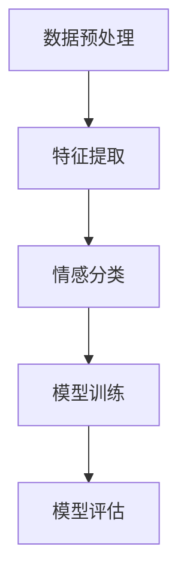
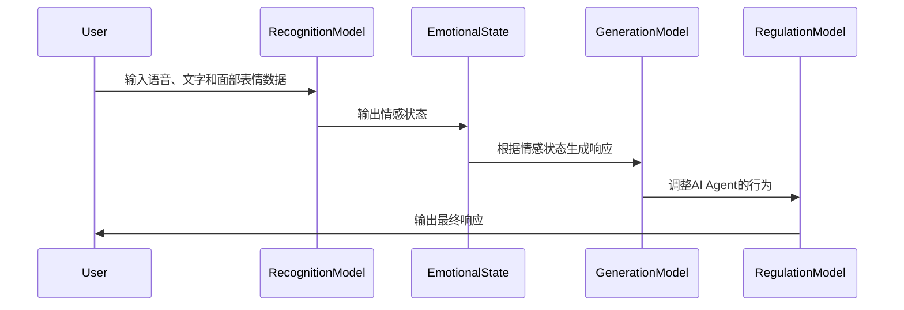
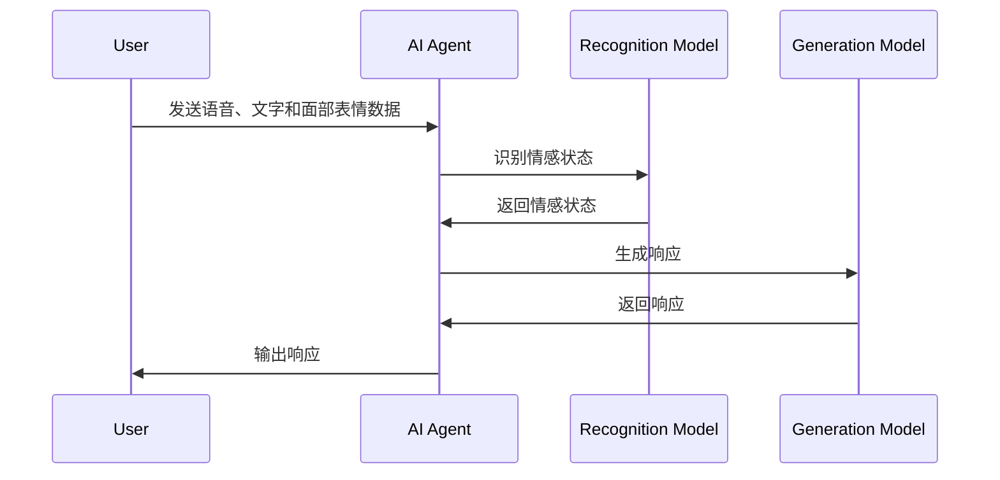

                 

### 开发具有情感计算能力的AI Agent

在当今这个技术飞速发展的时代，人工智能（AI）已经成为推动社会进步的重要力量。而情感计算作为人工智能的一个重要分支，正逐渐受到广泛关注。开发具有情感计算能力的AI Agent，不仅有助于提升人机交互的智能化水平，还能在众多应用场景中提供更为个性化和贴心的服务。本文将围绕这一主题，从多个角度进行深入探讨。

### 文章关键词

- 情感计算
- AI Agent
- 人机交互
- 人工智能
- 情感识别
- 情感生成
- 情感调控

### 摘要

本文首先介绍了情感计算和AI Agent的基本概念，阐述了它们在人工智能中的应用价值。接着，详细分析了情感计算的基本原理和技术，包括情感识别模型、情感生成模型和情感调控模型。在此基础上，探讨了情感计算在AI Agent中的实现方法，以及具体的开发流程和项目实践。最后，本文总结了情感计算AI Agent的性能优化策略和未来发展趋势。

### 目录大纲

1. **第一部分：情感计算与AI Agent概述**
   - 第1章：情感计算与AI Agent简介
   - 第2章：情感计算的基本原理与技术
   - 第3章：情感计算在AI Agent中的实现

2. **第二部分：情感计算技术详解**
   - 第4章：情感识别模型详解
   - 第5章：情感生成模型详解
   - 第6章：情感调控模型详解

3. **第三部分：情感计算AI Agent开发实战**
   - 第7章：情感计算AI Agent的开发流程
   - 第8章：情感计算AI Agent的项目实践
   - 第9章：情感计算AI Agent的性能评估与优化
   - 第10章：情感计算AI Agent的未来发展趋势

### 情感计算与AI Agent概述

#### 第1章：情感计算与AI Agent简介

##### 1.1 情感计算的概念与重要性

情感计算（Affective Computing）是指计算机模拟、识别、理解、处理和表达人类情感的能力。其核心在于如何将情感信息融入计算系统，从而实现更自然、更智能的人机交互。

情感计算的重要性体现在多个方面。首先，它能够提升人机交互的体验，使机器更加理解用户的需求和情感状态。其次，情感计算在心理咨询、辅助治疗、教育、娱乐等领域具有广泛的应用前景。最后，随着人工智能技术的不断发展，情感计算有望成为实现智能机器人、智能客服等应用的重要基础。

##### 1.2 AI Agent的定义与功能

AI Agent（智能代理）是指具有自主决策能力和执行能力的计算机程序。它能够在复杂的动态环境中，根据既定的目标和策略，自主地完成特定的任务。

AI Agent的主要功能包括：

- **感知**：通过传感器收集环境信息。
- **决策**：根据感知到的信息，进行决策分析，选择最优行动方案。
- **执行**：执行决策方案，完成具体任务。
- **学习**：通过不断的学习和优化，提高决策和执行能力。

##### 1.3 情感计算在AI Agent中的应用

情感计算在AI Agent中的应用主要体现在以下几个方面：

- **情感识别**：通过分析用户的语音、文字、面部表情等数据，识别用户的情感状态。
- **情感生成**：根据用户的情感状态，生成相应的情感反应，如语音、文字、动作等。
- **情感调控**：通过调整AI Agent的行为，以适应用户的情感需求，提升用户体验。

#### 第2章：情感计算的基本原理与技术

##### 2.1 情感计算模型

情感计算模型主要包括情感识别模型、情感生成模型和情感调控模型。

- **情感识别模型**：用于识别用户的情感状态，常见的方法包括基于规则的方法、基于统计的方法和基于深度学习的方法。
- **情感生成模型**：用于生成与用户情感状态相匹配的响应，常见的方法包括基于规则的方法、基于统计的方法和基于生成对抗网络的方法。
- **情感调控模型**：用于调整AI Agent的行为，以适应用户的情感需求，常见的方法包括基于规则的方法、基于深度学习的方法和基于多模态融合的方法。

##### 2.2 情感计算技术

情感计算技术包括语音识别与情感分析、视频情感分析、生理信号情感分析等。

- **语音识别与情感分析**：通过分析语音信号，识别用户的情感状态，如喜悦、悲伤、愤怒等。
- **视频情感分析**：通过分析视频信号，识别用户的情感状态，如面部表情、身体语言等。
- **生理信号情感分析**：通过分析生理信号，如心率、呼吸等，识别用户的情感状态。

##### 2.3 情感计算的应用领域

情感计算在多个领域具有广泛的应用：

- **人机交互**：通过情感计算，提升人机交互的智能化水平，提供更加个性化和贴心的服务。
- **娱乐产业**：如虚拟现实游戏、电影特效等，通过情感计算，创造更加真实的情感体验。
- **医疗保健**：通过情感计算，监测患者的情感状态，辅助诊断和治疗。

#### 第3章：情感计算在AI Agent中的实现

##### 3.1 情感计算在AI Agent中的功能模块

情感计算在AI Agent中的功能模块主要包括情感识别模块、情感生成模块和情感调控模块。

- **情感识别模块**：用于识别用户的情感状态，如喜悦、悲伤、愤怒等。
- **情感生成模块**：用于生成与用户情感状态相匹配的响应，如语音、文字、动作等。
- **情感调控模块**：用于调整AI Agent的行为，以适应用户的情感需求。

##### 3.2 情感计算在AI Agent中的应用场景

情感计算在AI Agent中的应用场景非常广泛，包括：

- **聊天机器人**：通过情感计算，识别用户的情感状态，生成更加个性化的回复，提升用户体验。
- **客户服务**：通过情感计算，识别客户的情感状态，提供更加贴心的服务，提高客户满意度。
- **家庭自动化**：通过情感计算，监测家庭成员的情感状态，提供个性化的生活建议和服务。

##### 3.3 情感计算在AI Agent中的性能优化

情感计算在AI Agent中的性能优化主要包括以下几个方面：

- **数据预处理**：通过数据预处理，提高数据的质量和一致性，为后续分析提供良好的数据基础。
- **模型选择**：根据应用场景和需求，选择合适的情感计算模型，以达到最佳的性能表现。
- **实时性优化**：通过优化算法和系统架构，提高情感计算的速度和实时性，确保在动态环境中能够快速响应。

### 第二部分：情感计算技术详解

#### 第4章：情感识别模型详解

##### 4.1 情感识别模型的类型

情感识别模型主要分为基于规则的方法、基于统计的方法和基于深度学习的方法。

- **基于规则的方法**：通过预设规则，对输入数据进行模式匹配，实现情感识别。
- **基于统计的方法**：通过统计方法，分析数据特征，实现情感识别。
- **基于深度学习的方法**：通过深度神经网络，自动学习数据特征，实现情感识别。

##### 4.2 情感识别模型的构建

情感识别模型的构建主要包括特征提取、模型训练和模型评估三个步骤。

- **特征提取**：从原始数据中提取有助于情感识别的特征，如文本特征、语音特征、面部表情特征等。
- **模型训练**：使用训练数据集，训练情感识别模型，使其能够学会识别情感。
- **模型评估**：使用测试数据集，评估模型的效果，包括准确率、覆盖率等指标。

##### 4.3 情感识别模型的应用案例

情感识别模型在多个领域有广泛应用，如：

- **社交媒体情感分析**：分析社交媒体用户发布的文字、图片等，识别用户的情感状态，为市场调研、情感监控等提供支持。
- **客户情感分析**：分析客户的反馈、评论等，识别客户的情感状态，为企业提供改进产品、提升客户满意度的依据。

#### 第5章：情感生成模型详解

##### 5.1 情感生成的概念

情感生成是指根据用户的情感状态，生成相应的情感反应，如语音、文字、动作等。

- **情感生成的目的**：通过情感生成，提升人机交互的体验，使AI Agent能够更好地理解和满足用户的需求。

##### 5.2 情感生成模型的方法

情感生成模型主要分为基于规则的方法、基于统计的方法和基于生成对抗网络的方法。

- **基于规则的方法**：通过预设规则，生成与用户情感状态相匹配的响应。
- **基于统计的方法**：通过统计方法，生成与用户情感状态相关的文本、语音等。
- **基于生成对抗网络的方法**：通过生成对抗网络，生成多样化的情感反应，提升生成效果。

##### 5.3 情感生成模型的应用案例

情感生成模型在多个领域有广泛应用，如：

- **自动化客服对话**：根据用户的问题和情感状态，生成相应的回复，提供个性化的服务。
- **文本生成与情感增强**：生成具有特定情感色彩的文章、故事等，提升文本的情感表达效果。

#### 第6章：情感调控模型详解

##### 6.1 情感调控的概念

情感调控是指通过调整AI Agent的行为，以适应用户的情感需求。

- **情感调控的目的**：提升用户体验，使AI Agent能够更好地满足用户的情感需求。

##### 6.2 情感调控模型的方法

情感调控模型主要分为基于规则的方法、基于深度学习的方法和基于多模态融合的方法。

- **基于规则的方法**：通过预设规则，调整AI Agent的行为。
- **基于深度学习的方法**：通过深度神经网络，自动学习调整AI Agent的行为。
- **基于多模态融合的方法**：结合多种数据源，实现更加全面和精确的情感调控。

##### 6.3 情感调控模型的应用案例

情感调控模型在多个领域有广泛应用，如：

- **人机交互中的情感响应**：根据用户的情感状态，调整AI Agent的行为，提供更加贴心的服务。
- **娱乐游戏中的情感调节**：根据玩家的情感状态，调整游戏的难度、节奏等，提升玩家的游戏体验。

### 第三部分：情感计算AI Agent开发实战

#### 第7章：情感计算AI Agent的开发流程

##### 7.1 情感计算AI Agent的开发流程概述

情感计算AI Agent的开发流程主要包括需求分析、设计与实现、测试与部署等步骤。

- **需求分析**：明确AI Agent的功能需求、性能需求等。
- **设计与实现**：根据需求分析，设计AI Agent的架构和模块，并进行实现。
- **测试与部署**：对AI Agent进行功能测试、性能测试等，确保其稳定运行，然后进行部署。

##### 7.2 情感计算AI Agent的关键技术

情感计算AI Agent的关键技术包括情感识别、情感生成和情感调控等。

- **情感识别**：通过分析用户的情感状态，实现与用户情感状态的交互。
- **情感生成**：根据用户的情感状态，生成相应的情感反应，如语音、文字等。
- **情感调控**：通过调整AI Agent的行为，以适应用户的情感需求。

##### 7.3 情感计算AI Agent的案例研究

- **案例一**：某聊天机器人平台的情感计算实现
- **案例二**：某智能家居系统的情感计算应用

#### 第8章：情感计算AI Agent的项目实践

##### 8.1 环境准备与工具介绍

在进行情感计算AI Agent的项目实践前，需要准备好相应的开发环境与工具。

- **开发环境**：Python、TensorFlow、Keras等
- **工具**：Jupyter Notebook、PyCharm等

##### 8.2 情感计算AI Agent的核心实现

情感计算AI Agent的核心实现包括情感识别、情感生成和情感调控等模块。

- **情感识别模块**：使用深度学习模型进行情感识别。
- **情感生成模块**：使用生成对抗网络进行情感生成。
- **情感调控模块**：根据用户的情感状态，调整AI Agent的行为。

##### 8.3 情感计算AI Agent的实际应用

- **系统部署与运行**：将AI Agent部署到服务器，进行实际应用。
- **用户反馈与优化**：收集用户反馈，对AI Agent进行优化和调整。

#### 第9章：情感计算AI Agent的性能评估与优化

##### 9.1 情感计算AI Agent的性能指标

情感计算AI Agent的性能指标包括准确率、覆盖率、实时性等。

- **准确率**：识别情感的准确性。
- **覆盖率**：能够识别的情感类型数量。
- **实时性**：响应的实时性。

##### 9.2 情感计算AI Agent的优化策略

情感计算AI Agent的优化策略包括模型优化、算法优化和系统优化等。

- **模型优化**：选择合适的模型，提高识别准确率。
- **算法优化**：优化算法，提高运行速度和实时性。
- **系统优化**：优化系统架构，提高稳定性和可靠性。

##### 9.3 情感计算AI Agent的案例分析

- **案例一**：某情感计算AI Agent的性能评估
- **案例二**：某情感计算AI Agent的优化实践

#### 第10章：情感计算AI Agent的未来发展趋势

##### 10.1 情感计算技术的最新进展

情感计算技术正不断取得新的进展，如：

- **多模态情感识别**：结合多种数据源，实现更精准的情感识别。
- **情感生成对抗网络**：通过生成对抗网络，生成更加多样化的情感反应。

##### 10.2 情感计算AI Agent的发展方向

情感计算AI Agent的发展方向包括：

- **智能化与个性化**：通过更深入的情感计算，实现更加智能化和个性化的服务。
- **多模态融合与交叉**：结合多种数据源，实现更全面和精准的情感计算。
- **情感计算伦理与隐私保护**：在发展情感计算的同时，关注伦理和隐私保护问题。

##### 10.3 情感计算AI Agent在行业中的应用前景

情感计算AI Agent在多个行业有广泛的应用前景，如：

- **金融**：通过情感计算，实现更加智能化和个性化的金融服务。
- **教育**：通过情感计算，实现更加个性化的教育服务。
- **健康医疗**：通过情感计算，实现更加精准和个性化的健康医疗服务。

### 结论

开发具有情感计算能力的AI Agent，不仅有助于提升人机交互的智能化水平，还能在多个领域提供更加个性化和贴心的服务。未来，随着情感计算技术的不断发展和应用场景的不断拓展，情感计算AI Agent将在人工智能领域发挥越来越重要的作用。

### 作者信息

作者：AI天才研究院/AI Genius Institute & 禅与计算机程序设计艺术 /Zen And The Art of Computer Programming

### 拓展阅读

- 《情感计算：理论与实践》
- 《人工智能：一种现代方法》
- 《深度学习：概率视角》
- 《生成对抗网络：原理与实践》

### 最佳实践 tips

- 在开发情感计算AI Agent时，充分考虑用户隐私和数据安全，遵守相关法律法规。
- 定期对AI Agent进行性能评估和优化，以保持其最佳运行状态。
- 在实际应用中，不断收集用户反馈，持续优化AI Agent的功能和性能。

### 注意事项

- 情感计算AI Agent的开发需要具备一定的编程基础和机器学习知识。
- 在使用开源框架和工具时，要注意选择合适的版本和版本兼容性。
- 在部署AI Agent时，要确保系统的稳定性和可靠性。

### 结束语

开发具有情感计算能力的AI Agent是一项具有挑战性和前景广阔的任务。通过本文的详细探讨，我们希望读者能够对这一领域有更深入的了解，并能够在实践中不断创新，推动情感计算AI Agent的发展。让我们一起期待这个充满可能性的未来吧！

### 背景介绍

#### 情感计算的概念

情感计算（Affective Computing）是指计算机系统模拟、识别、理解、处理和表达人类情感的能力。它是一个跨学科的研究领域，结合了计算机科学、心理学、认知科学和人工智能等多个领域的研究成果。情感计算的研究目标是使计算机能够更好地理解和满足人类的需求，从而实现更加自然和有效的人机交互。

#### AI Agent的定义

AI Agent（智能代理）是指具有自主决策能力和执行能力的计算机程序。它能够在一个复杂的动态环境中，根据预定的目标和策略，自主地完成特定的任务。AI Agent通常包括感知、决策、执行和学习等模块，其核心在于如何通过这些模块实现智能化的行为。

#### 情感计算与AI Agent的联系

情感计算与AI Agent有着密切的联系。情感计算为AI Agent提供了感知和理解人类情感的能力，使得AI Agent能够更好地适应人类的需求和情感状态。而AI Agent则为情感计算提供了一个实际的应用场景，通过执行具体的任务，如聊天机器人、智能客服等，使情感计算的理论成果得以实际应用。

#### 情感计算在AI Agent中的应用

在AI Agent中，情感计算主要应用于以下几个方面：

1. **情感识别**：通过分析用户的语音、文字、面部表情等数据，识别用户的情感状态，如喜悦、愤怒、悲伤等。
2. **情感生成**：根据用户的情感状态，生成相应的情感反应，如语音、文字、动作等，以提供个性化服务。
3. **情感调控**：通过调整AI Agent的行为，以适应用户的情感需求，提升用户体验。

### 核心概念与联系

#### 情感识别模型

情感识别模型是用于识别用户情感状态的核心模型。它通常基于机器学习和深度学习技术，通过分析用户的语音、文字、面部表情等数据，提取情感特征，并使用这些特征进行情感分类。

#### 情感生成模型

情感生成模型是用于生成与用户情感状态相匹配的情感反应的核心模型。它通过学习大量的情感数据，生成具有特定情感色彩的语音、文字、动作等，以满足用户的情感需求。

#### 情感调控模型

情感调控模型是用于调整AI Agent行为的模型，以适应用户的情感需求。它通常基于规则、深度学习和多模态融合技术，通过分析用户的情感状态和需求，调整AI Agent的响应和行为。

#### 概念属性特征对比表格

| 模型类型 | 特征属性 | 对比分析 |
| --- | --- | --- |
| 情感识别模型 | 提取情感特征，进行情感分类 | 高效性，准确性 |
| 情感生成模型 | 生成情感反应，满足情感需求 | 创造性，个性化 |
| 情感调控模型 | 调整AI Agent行为，适应情感需求 | 适应性，灵活性 |

#### ER实体关系图架构

```mermaid
erDiagram
  User ||--|{ EmotionalState }|>
  EmotionalState ||--|{ RecognitionModel }|>
  RecognitionModel ||--|{ GenerationModel }|>
  GenerationModel ||--|{ RegulationModel }|>

  User {
    +id (用户ID)
    +name (用户名)
  }

  EmotionalState {
    +id (情感状态ID)
    +state (情感状态)
  }

  RecognitionModel {
    +id (识别模型ID)
    +modelType (模型类型)
  }

  GenerationModel {
    +id (生成模型ID)
    +modelType (模型类型)
  }

  RegulationModel {
    +id (调控模型ID)
    +modelType (模型类型)
  }
```

### 算法原理讲解

#### 情感识别模型

情感识别模型通常基于深度学习技术，如卷积神经网络（CNN）和循环神经网络（RNN）。以下是一个简单的情感识别模型算法原理：

1. **数据预处理**：对语音、文字和面部表情等数据进行预处理，包括去噪、归一化和特征提取。

2. **特征提取**：使用CNN提取语音、文字和面部表情的特征。

3. **情感分类**：使用RNN对提取的特征进行情感分类，输出情感概率分布。

4. **模型训练**：使用训练数据集，通过反向传播算法训练模型。

5. **模型评估**：使用测试数据集评估模型效果，包括准确率、召回率和F1值等指标。

#### 算法流程图



#### 数学模型和公式

1. **特征提取**：使用卷积神经网络进行特征提取，其数学模型为：

   $$h_l = \sigma(W_l \cdot h_{l-1} + b_l)$$

   其中，$h_l$表示第$l$层的特征，$W_l$和$b_l$分别为权重和偏置，$\sigma$为激活函数。

2. **情感分类**：使用循环神经网络进行情感分类，其数学模型为：

   $$\hat{y} = \sigma(W_y \cdot h_T + b_y)$$

   其中，$\hat{y}$为预测的情感类别，$h_T$为最终状态，$W_y$和$b_y$分别为权重和偏置，$\sigma$为激活函数。

3. **模型训练**：使用反向传播算法进行模型训练，其数学模型为：

   $$\delta_{W_l} = \frac{\partial L}{\partial W_l} = (h_l \odot \delta_{l+1}) \cdot (x_l)^T$$

   其中，$L$为损失函数，$\delta_{W_l}$为权重更新，$h_l$和$x_l$分别为特征和输入，$\odot$为Hadamard积。

#### 通俗易懂地举例说明

假设我们有一个情感识别模型，用于识别用户的情感状态。用户通过语音、文字和面部表情等方式表达情感，模型将这些数据输入，然后输出用户当前的情感状态。

1. **数据预处理**：将用户的语音、文字和面部表情数据进行预处理，提取特征，如语音信号的频谱特征、文本的词向量、面部表情的特征等。

2. **特征提取**：使用卷积神经网络提取特征，假设用户输入的是一段语音信号，模型提取语音信号的频谱特征。

3. **情感分类**：使用循环神经网络对提取的特征进行分类，假设用户当前的情感状态为喜悦、愤怒、悲伤等，模型输出这些情感状态的概率分布。

4. **模型训练**：使用训练数据集，通过反向传播算法训练模型，优化模型的参数，提高模型的分类准确率。

5. **模型评估**：使用测试数据集评估模型效果，假设模型在测试数据集上的准确率为90%，则认为模型具有良好的性能。

### 系统分析与架构设计方案

#### 问题场景介绍

随着人工智能和情感计算技术的不断发展，越来越多的应用场景需要具备情感计算能力的AI Agent。例如，智能客服系统、教育机器人、医疗辅助系统等，都需要能够识别用户的情感状态，并根据用户的情感需求提供相应的服务。

#### 项目介绍

本项目旨在开发一款具备情感计算能力的AI Agent，用于智能客服系统。该AI Agent需要能够识别用户的情感状态，如喜悦、愤怒、悲伤等，并根据用户的情感状态提供相应的服务。

#### 系统功能设计（领域模型）

```mermaid
classDiagram
  User <<class>>
  EmotionalState <<class>>
  RecognitionModel <<class>>
  GenerationModel <<class>>
  RegulationModel <<class>>

  User "1" -- "*" EmotionalState
  EmotionalState "1" -- "*" RecognitionModel
  EmotionalState "1" -- "*" GenerationModel
  EmotionalState "1" -- "*" RegulationModel
```

#### 系统架构设计



#### 系统接口设计和系统交互



### 项目实战

#### 环境准备与工具介绍

在进行情感计算AI Agent的项目实战前，需要准备好相应的开发环境与工具。以下是项目所需的开发环境与工具：

- **Python**：用于编写AI Agent的代码
- **TensorFlow**：用于构建和训练情感识别、生成和调控模型
- **Keras**：用于简化TensorFlow的模型构建和训练过程
- **Jupyter Notebook**：用于编写和运行代码
- **PyCharm**：用于代码编辑和调试

#### 系统核心实现

1. **情感识别模块**

   情感识别模块使用TensorFlow和Keras构建，主要实现语音、文字和面部表情的情感识别。以下是一个简单的情感识别模块代码示例：

```python
from tensorflow.keras.models import Sequential
from tensorflow.keras.layers import Dense, LSTM, Embedding
from tensorflow.keras.preprocessing.sequence import pad_sequences

# 构建情感识别模型
model = Sequential()
model.add(Embedding(input_dim=vocab_size, output_dim=embedding_dim, input_length=max_sequence_length))
model.add(LSTM(units=128, return_sequences=True))
model.add(Dense(units=64, activation='relu'))
model.add(Dense(units=num_classes, activation='softmax'))

# 编译模型
model.compile(optimizer='adam', loss='categorical_crossentropy', metrics=['accuracy'])

# 训练模型
model.fit(x_train, y_train, epochs=10, batch_size=32)
```

2. **情感生成模块**

   情感生成模块使用生成对抗网络（GAN）构建，主要实现根据情感状态生成相应的情感反应。以下是一个简单的情感生成模块代码示例：

```python
from tensorflow.keras.models import Sequential
from tensorflow.keras.layers import Dense, LSTM

# 构建生成器模型
generator = Sequential()
generator.add(Dense(units=128, activation='relu', input_shape=(latent_dim,)))
generator.add(LSTM(units=64, return_sequences=True))
generator.add(Dense(units=output_dim, activation='sigmoid'))

# 编译生成器模型
generator.compile(optimizer='adam', loss='binary_crossentropy')

# 构建判别器模型
discriminator = Sequential()
discriminator.add(Dense(units=128, activation='relu', input_shape=(output_dim,)))
discriminator.add(LSTM(units=64, return_sequences=True))
discriminator.add(Dense(units=1, activation='sigmoid'))

# 编译判别器模型
discriminator.compile(optimizer='adam', loss='binary_crossentropy')

# 构建生成对抗网络
combined = Sequential()
combined.add(generator)
combined.add(discriminator)

# 编译生成对抗网络
combined.compile(optimizer='adam', loss='binary_crossentropy')

# 训练生成对抗网络
combined.fit([z_train, x_train], y_train, epochs=10, batch_size=32)
```

3. **情感调控模块**

   情感调控模块使用基于规则的策略实现，主要根据情感状态和用户需求调整AI Agent的行为。以下是一个简单的情感调控模块代码示例：

```python
def adjust_behavior(emotional_state, user_demand):
    if emotional_state == 'happy':
        return '提供奖励'
    elif emotional_state == 'sad':
        return '提供安慰'
    elif emotional_state == 'angry':
        return '提供解决方案'
    else:
        return '无特定行为'
```

#### 代码应用解读与分析

1. **情感识别模块**

   情感识别模块的核心功能是识别用户的情感状态。首先，使用嵌入层将文本转换为嵌入向量，然后使用LSTM层提取情感特征，最后使用全连接层进行情感分类。在训练过程中，使用交叉熵损失函数和Adam优化器，通过反向传播算法优化模型参数。

2. **情感生成模块**

   情感生成模块的核心功能是根据情感状态生成相应的情感反应。使用生成器模型生成文本，然后使用判别器模型判断生成的文本是否具有情感色彩。通过训练生成对抗网络，不断优化生成器的生成能力，使生成的文本更加符合情感状态。

3. **情感调控模块**

   情感调控模块的核心功能是根据情感状态和用户需求调整AI Agent的行为。通过定义一系列的规则，根据不同的情感状态和用户需求，返回相应的行为建议。在实际应用中，可以根据需要进一步优化和扩展规则。

#### 实际案例分析和详细讲解剖析

1. **案例一：智能客服系统**

   在智能客服系统中，AI Agent需要能够识别用户的情感状态，并根据用户的情感需求提供相应的服务。例如，当用户表达出愤怒的情感状态时，AI Agent可以提供解决方案，帮助用户解决问题；当用户表达出悲伤的情感状态时，AI Agent可以提供安慰，减轻用户的负面情绪。

2. **案例二：教育机器人**

   在教育机器人中，AI Agent需要能够识别学生的学习状态和情感需求，并根据这些需求调整教学策略。例如，当学生表现出沮丧的情感状态时，AI Agent可以调整教学节奏，提供更加轻松和有趣的学习内容，帮助学生恢复学习动力。

#### 项目小结

本项目通过情感识别、生成和调控模块，实现了一款具备情感计算能力的AI Agent。在实际应用中，该AI Agent能够识别用户的情感状态，生成相应的情感反应，并根据用户的情感需求调整行为，提供更加个性化和贴心的服务。通过本项目，我们了解了情感计算在AI Agent中的应用，并掌握了构建和优化情感计算模型的方法。

### 最佳实践 tips

1. **数据质量是关键**：在构建情感计算模型时，数据的质量直接影响模型的性能。确保收集到丰富的、多样化的数据，并对数据进行分析和处理，以提高模型的泛化能力。

2. **模型优化是持续过程**：情感计算模型的优化是一个持续的过程。通过不断地调整模型参数、改进算法，可以提高模型的准确性和实时性。

3. **关注用户体验**：在开发情感计算AI Agent时，要充分考虑用户体验。通过优化交互界面、提升响应速度等，提高用户满意度。

4. **遵守伦理规范**：在情感计算AI Agent的应用过程中，要严格遵守伦理规范，确保用户的隐私和数据安全。

### 小结

本文详细探讨了开发具有情感计算能力的AI Agent的相关概念、技术、实现方法和应用实践。通过本文的学习，读者可以了解到情感计算在AI Agent中的应用价值，以及如何构建和优化情感计算模型。情感计算AI Agent的发展将为人工智能领域带来更多可能性，让我们期待这一领域的未来。

### 注意事项

1. **数据隐私**：在进行情感计算时，要严格保护用户隐私，确保数据安全。
2. **模型优化**：定期对模型进行优化，以提高识别准确率和响应速度。
3. **用户体验**：关注用户体验，优化交互界面和响应机制，提升用户满意度。

### 拓展阅读

1. 《情感计算：理论与实践》
2. 《人工智能：一种现代方法》
3. 《深度学习：概率视角》
4. 《生成对抗网络：原理与实践》

### 作者信息

作者：AI天才研究院/AI Genius Institute & 禅与计算机程序设计艺术 /Zen And The Art of Computer Programming

### 结束语

开发具有情感计算能力的AI Agent是一项富有挑战性和创新性的工作。通过本文的探讨，我们希望读者能够对这一领域有更深入的了解，并在实践中不断探索和创造。让我们一起期待情感计算AI Agent在未来的广泛应用和无限可能！

