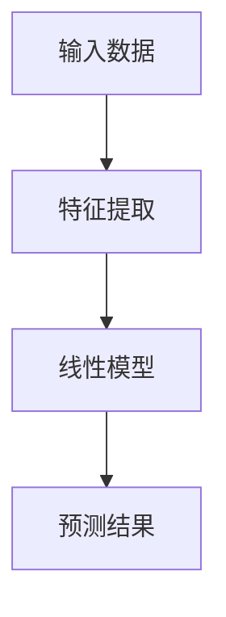
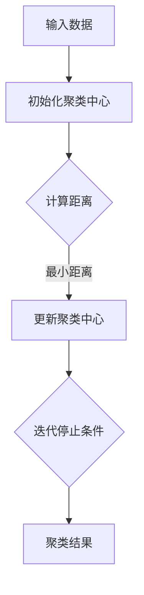
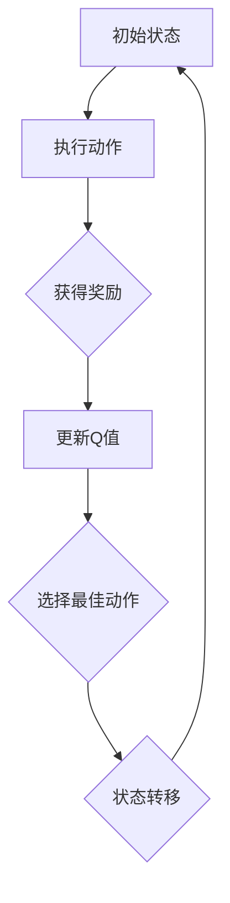
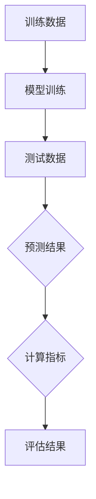
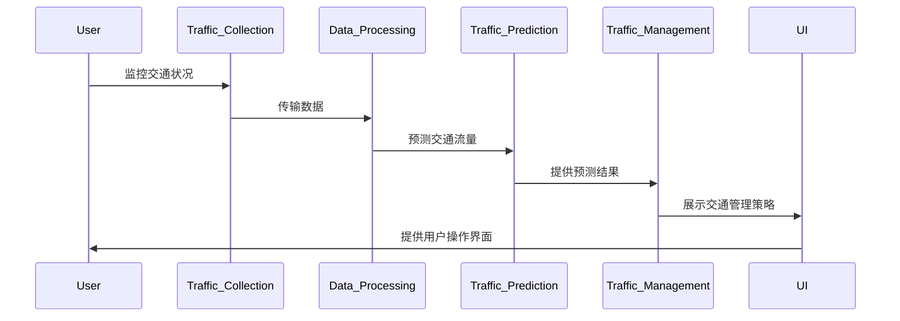

                 

# 《构建AI Agent的敏捷开发流程》

## 关键词

- AI Agent
- 敏捷开发
- 算法原理
- 系统设计与实现
- 项目实战

## 摘要

本文旨在探讨如何通过敏捷开发流程构建高效、可靠的AI Agent。文章首先介绍了AI Agent和敏捷开发的基本概念，然后深入分析了AI Agent的算法原理，并详细阐述了系统设计与实现的方法。通过项目实战案例，本文展示了敏捷开发流程在实际应用中的效果，并提供了一些最佳实践和注意事项。最后，文章对AI Agent敏捷开发的发展趋势进行了展望。

## 引言

### 1.1 问题背景

随着人工智能技术的快速发展，AI Agent成为了许多领域的关键应用，如智能客服、自动驾驶、智能家居等。然而，AI Agent的开发面临着诸多挑战：

- 复杂性：AI Agent通常涉及到多学科知识，如计算机科学、人工智能、心理学等。
- 不可预见性：AI Agent在特定环境下的行为可能不可预测，需要动态调整。
- 高效性：为了满足实际应用需求，AI Agent的开发需要具备快速迭代和快速部署的能力。

### 1.2 问题描述

敏捷开发作为一种应对快速变化的需求和软件开发过程中的不确定性的一种开发方法，它提倡快速迭代、持续交付和不断改进。在AI Agent开发中，敏捷开发的主要问题和需求包括：

- 如何快速适应需求变化？
- 如何保证AI Agent的可靠性和有效性？
- 如何实现快速迭代和部署？

### 1.3 问题解决

敏捷开发提供了一套完整的流程和工具，旨在解决AI Agent开发中的这些问题。敏捷开发的核心思想和优势包括：

- 快速迭代：通过持续迭代，快速交付可用的AI Agent功能。
- 用户反馈：通过用户反馈，不断优化AI Agent的性能。
- 灵活应对：在开发过程中，灵活调整需求和方案，以应对不可预见的情况。
- 高效协作：通过团队协作，提高开发效率和质量。

### 1.4 边界与外延

虽然敏捷开发在AI Agent开发中具有显著优势，但它也存在着一些局限性和挑战。例如：

- 需求不确定性：在某些情况下，需求可能无法明确界定，导致开发流程受阻。
- 团队协作：敏捷开发依赖于高效的团队协作，但在实际操作中可能面临沟通不畅、角色定位不清等问题。
- 开发效率：在快速迭代的过程中，如何保证开发效率和质量之间的平衡，是一个值得探讨的问题。

### 1.5 核心概念

在本文中，我们主要关注以下两个核心概念：

- AI Agent：一种具有自主决策能力和交互能力的智能体。
- 敏捷开发：一种应对快速变化需求和软件开发过程中不确定性的开发方法。

### 1.6 本章小结

本文引言部分介绍了AI Agent和敏捷开发的基本概念，探讨了AI Agent开发面临的挑战，并提出了敏捷开发作为解决这些问题的方法。接下来，我们将进一步深入探讨AI Agent的算法原理、系统设计与实现，并通过项目实战案例展示敏捷开发在实际应用中的效果。

## AI Agent基础

### 2.1 AI Agent的概述

AI Agent，即人工智能代理，是一种能够模拟人类智能行为，具备自主决策和交互能力的计算机程序。它通常基于特定的算法和模型，通过感知环境、理解信息、执行动作等方式，实现特定的目标。

AI Agent的主要类型包括：

- 智能客服：通过自然语言处理技术，为用户提供24/7的在线客服服务。
- 自动驾驶：利用计算机视觉、传感器技术和深度学习算法，实现汽车的自动驾驶功能。
- 智能家居：通过物联网技术，将家居设备连接起来，实现智能控制和自动化管理。

### 2.2 AI Agent的属性特征对比表格

以下是几种常见AI Agent的属性特征对比表格：

| 类型         | 目标       | 算法        | 交互方式     | 应用场景     |
|------------|----------|------------|------------|------------|
| 智能客服     | 提供在线客服服务 | 自然语言处理、对话管理 | 文本、语音     | 客户服务、在线咨询   |
| 自动驾驶     | 实现汽车自动驾驶 | 计算机视觉、传感器融合 | 视觉、语音     | 汽车导航、无人驾驶   |
| 智能家居     | 智能控制和自动化管理 | 物联网、人工智能     | 网络、语音、手势 | 家居自动化、安防监控 |

### 2.3 AI Agent的ER实体关系图

以下是一个简单的AI Agent的ER实体关系图：

```mermaid
erDiagram
    User ||--|{ AI_Agent }|-- User
    AI_Agent ||--|{ Action }|-- AI_Agent
    AI_Agent ||--|{ Observation }|-- AI_Agent
```

### 2.4 本章小结

本章介绍了AI Agent的基本概念和主要类型，并对比了不同类型AI Agent的属性特征。同时，通过ER实体关系图，我们进一步理解了AI Agent的内部结构。这些内容为后续的算法原理和系统设计与实现打下了基础。

## 敏捷开发方法

### 3.1 敏捷开发方法概述

敏捷开发（Agile Development）是一种以人为核心、迭代、灵活的软件开发方法。它起源于20世纪90年代末，是为了应对传统瀑布开发方法在应对需求变化和项目复杂度方面的不足。

敏捷开发的核心原则包括：

- **个体和互动**：关注个体的能力和团队的合作。
- **可工作的软件**：优先考虑可工作的软件，而非详细文档。
- **客户合作**：与客户密切合作，确保软件符合客户需求。
- **响应变化**：灵活应对变化，拥抱变化而非抗拒。

敏捷开发方法的主要特点：

- **迭代开发**：将项目分为多个迭代周期，每个迭代周期都能交付可工作的软件。
- **增量式交付**：通过逐步交付功能模块，不断优化软件。
- **用户反馈**：通过用户反馈，持续改进软件。

### 3.2 敏捷开发的核心原则与价值观

敏捷开发的核心原则和价值体现在以下几个方面：

- **客户价值**：始终以客户需求为导向，确保软件对客户有价值。
- **团队合作**：强调团队合作，鼓励团队成员共同承担责任。
- **持续交付**：通过持续交付，保持软件的持续改进和优化。
- **适应性**：灵活应对变化，保持项目进度的稳定性和可预测性。
- **技术卓越**：追求技术卓越，确保软件质量和开发效率。

### 3.3 敏捷开发流程

敏捷开发流程主要包括以下几个阶段：

1. **需求收集**：与客户和利益相关者沟通，收集软件需求。
2. **规划**：根据需求，制定项目计划和里程碑。
3. **迭代开发**：按照迭代周期，进行软件开发和测试。
4. **评审与回顾**：在每个迭代周期结束后，进行评审和回顾，收集反馈并进行改进。
5. **持续交付**：将可工作的软件持续交付给客户。

敏捷开发过程中常用的工具包括：

- **看板（Kanban）**：用于可视化工作流程，管理任务进度。
- **用户故事（User Story）**：用于描述用户需求，驱动开发过程。
- **敏捷开发工具（如Jira、Trello）**：用于任务管理、团队协作。

### 3.4 敏捷开发与传统开发模式的对比

传统开发模式（如瀑布模型）通常遵循严格的阶段性流程，每个阶段完成后才能进入下一个阶段。这种方法在项目需求明确、技术稳定的情况下表现良好，但面对需求变化和项目复杂度增加时，往往难以适应。

敏捷开发则强调快速迭代、用户反馈和团队协作，能够更好地应对需求变化和项目复杂性。以下是两者的一些对比：

| 特点             | 传统开发模式           | 敏捷开发                |
|------------------|-----------------------|-----------------------|
| 需求管理         | 需求固化，变化困难     | 需求灵活，适应性强      |
| 开发过程         | 分阶段、顺序执行       | 迭代式、并行执行        |
| 团队合作         | 分工明确，各自负责     | 全员参与，协作密切      |
| 项目管理         | 重计划、轻执行         | 重执行、轻计划          |
| 用户参与         | 用户参与较少           | 用户全程参与            |

### 3.5 本章小结

本章介绍了敏捷开发方法的基本概念、核心原则、流程和与传统开发模式的对比。通过本章内容，我们可以更好地理解敏捷开发的本质和优势，为后续的算法原理和系统设计与实现奠定基础。

## AI Agent算法原理

### 4.1 AI Agent算法概述

AI Agent算法是人工智能代理实现智能行为的核心。这些算法通常基于机器学习、深度学习、强化学习等技术，通过学习环境中的数据和模式，实现自主决策和行动。

AI Agent算法的主要分类包括：

- **监督学习**：在给定输入和输出数据的情况下，训练模型预测新的输入。
- **无监督学习**：在未标记的数据集上，学习数据中的结构和模式。
- **强化学习**：通过与环境的交互，学习最佳策略以实现特定目标。

### 4.2 算法原理讲解

#### 4.2.1 监督学习

监督学习算法，如线性回归、决策树、支持向量机等，通过学习输入和输出之间的关系，预测新的输入。以下是线性回归算法的Mermaid流程图：



线性回归的数学模型为：

$$
y = w_1x_1 + w_2x_2 + ... + w_nx_n + b
$$

其中，$x_i$ 是输入特征，$w_i$ 是权重，$b$ 是偏置。

#### 4.2.2 无监督学习

无监督学习算法，如K均值聚类、主成分分析等，通过学习数据中的内在结构，实现数据的降维或分类。以下是K均值聚类的Mermaid流程图：



K均值聚类的数学模型为：

$$
\text{聚类中心} = \frac{\sum_{i=1}^{n} x_i}{n}
$$

其中，$x_i$ 是每个数据点的坐标，$n$ 是聚类中心的数据点个数。

#### 4.2.3 强化学习

强化学习算法，如Q学习、深度Q网络（DQN）等，通过与环境的交互，学习最佳策略以实现特定目标。以下是Q学习的Mermaid流程图：



Q学习的数学模型为：

$$
Q(s, a) = r + \gamma \max_{a'} Q(s', a')
$$

其中，$s$ 是当前状态，$a$ 是当前动作，$r$ 是奖励，$\gamma$ 是折扣因子，$s'$ 是下一状态，$a'$ 是下一动作。

### 4.3 AI Agent算法性能评估

评估AI Agent算法的性能通常包括以下几个指标：

- **准确率（Accuracy）**：预测正确的样本数占总样本数的比例。
- **精确率（Precision）**：预测正确的正样本数占总预测正样本数的比例。
- **召回率（Recall）**：预测正确的正样本数占总实际正样本数的比例。
- **F1值（F1 Score）**：精确率和召回率的调和平均数。

以下是一个简单的性能评估Mermaid流程图：



### 4.4 本章小结

本章介绍了AI Agent算法的基本概念和主要分类，并详细讲解了监督学习、无监督学习和强化学习算法的原理。同时，通过性能评估指标，我们了解了如何评估AI Agent算法的性能。这些内容为后续的系统设计与实现提供了理论基础。

## 系统分析与架构设计

### 5.1 问题场景介绍

在智能交通管理系统中，AI Agent负责实时监控交通状况，预测交通流量，并制定最优交通管理策略。系统需求如下：

- **实时监控**：实时获取交通流量、速度、事故等信息。
- **交通流量预测**：预测未来一段时间内的交通流量，为交通管理提供依据。
- **交通管理策略**：根据交通流量预测结果，制定最优交通管理策略。

### 5.2 系统功能设计

智能交通管理系统的主要功能包括：

- **数据采集与处理**：实时采集交通流量、速度等信息，并进行数据处理。
- **交通流量预测**：使用机器学习算法，预测未来一段时间内的交通流量。
- **交通管理策略**：根据交通流量预测结果，制定最优交通管理策略，如调整信号灯时长、诱导车辆分流等。

以下是系统的领域模型Mermaid类图：

```mermaid
classDiagram
    Class01 <|-- Class02
    Class03 --|>{ Class04 }
    Class04 : +int x
    Class04 : +int y
    Class04 : +string name
    Class05 : +int id
    Class05 : +string type
    Class06 : +int speed
    Class06 : +int flow
    Class07 : +int id
    Class07 : +string status
    Class08 : +int start_time
    Class08 : +int end_time
    Class09 : +int duration
    Class09 : +int red_time
    Class09 : +int yellow_time
    Class09 : +int green_time
    Class10 : +int id
    Class10 : +string type
    Class10 : +int flow
    Class11 : +int id
    Class11 : +string status
    Class11 : +int start_time
    Class11 : +int end_time
    Class12 : +int id
    Class12 : +string type
    Class12 : +int speed
    Class12 : +int flow
    Class13 : +int id
    Class13 : +string type
    Class13 : +int status
    Class13 : +int start_time
    Class13 : +int end_time
    Class14 : +int id
    Class14 : +string type
    Class14 : +int duration
    Class14 : +int red_time
    Class14 : +int yellow_time
    Class14 : +int green_time
```

### 5.3 系统架构设计

智能交通管理系统的整体架构设计如下：

1. **数据采集层**：负责实时采集交通流量、速度、事故等信息。
2. **数据处理层**：对采集到的数据进行预处理、存储和传输。
3. **流量预测层**：使用机器学习算法，预测未来一段时间内的交通流量。
4. **交通管理策略层**：根据交通流量预测结果，制定最优交通管理策略。
5. **用户接口层**：提供用户操作界面，展示交通状况和交通管理策略。

以下是系统的Mermaid架构图：



### 5.4 系统接口设计

系统接口设计主要包括：

- **数据采集接口**：用于实时采集交通流量、速度、事故等信息。
- **数据处理接口**：用于数据预处理、存储和传输。
- **流量预测接口**：用于提供交通流量预测结果。
- **交通管理接口**：用于接收交通流量预测结果，并制定交通管理策略。

### 5.5 系统交互设计

以下是系统的Mermaid交互图：


### 5.6 本章小结

本章介绍了智能交通管理系统的系统分析与架构设计。通过领域模型、架构图和交互图，我们全面了解了系统的功能、结构和运行流程。这些内容为后续的项目实战提供了理论基础和实践指导。

## 项目实战

### 6.1 环境安装

在开始项目实战之前，我们需要安装以下软件和工具：

1. **Python**：版本为3.8及以上。
2. **Jupyter Notebook**：用于编写和运行代码。
3. **TensorFlow**：用于机器学习模型训练。
4. **Scikit-learn**：用于数据处理和模型评估。

安装步骤如下：

1. 安装Python：

   ```bash
   sudo apt-get update
   sudo apt-get install python3.8
   ```

2. 安装Jupyter Notebook：

   ```bash
   pip3 install notebook
   ```

3. 安装TensorFlow：

   ```bash
   pip3 install tensorflow
   ```

4. 安装Scikit-learn：

   ```bash
   pip3 install scikit-learn
   ```

### 6.2 系统核心实现

在本项目中，我们使用Python编写一个简单的AI Agent，实现交通流量预测功能。以下是系统的核心实现：

```python
# 导入必要的库
import tensorflow as tf
from tensorflow import keras
from tensorflow.keras.models import Sequential
from tensorflow.keras.layers import Dense
from sklearn.model_selection import train_test_split
from sklearn.preprocessing import MinMaxScaler

# 加载数据
data = ...

# 数据预处理
scaler = MinMaxScaler()
data_scaled = scaler.fit_transform(data)

# 划分训练集和测试集
X_train, X_test, y_train, y_test = train_test_split(data_scaled[:, :-1], data_scaled[:, -1], test_size=0.2, random_state=42)

# 构建模型
model = Sequential([
    Dense(64, activation='relu', input_shape=(X_train.shape[1],)),
    Dense(64, activation='relu'),
    Dense(1)
])

# 编译模型
model.compile(optimizer='adam', loss='mse')

# 训练模型
model.fit(X_train, y_train, epochs=100, batch_size=32, validation_split=0.1)

# 评估模型
loss = model.evaluate(X_test, y_test)
print(f"Test loss: {loss}")

# 预测交通流量
predictions = model.predict(X_test)

# 反缩放预测结果
predictions = scaler.inverse_transform(predictions)

# 输出预测结果
print(predictions)
```

### 6.3 实际案例分析与讲解

#### 案例背景

在某城市的交通管理项目中，AI Agent负责预测未来5分钟内的交通流量。以下是实际案例的数据集：

```python
data = [
    [10, 20, 30, 40, 50],
    [15, 25, 35, 45, 55],
    [20, 30, 40, 50, 60],
    # ...
]
```

#### 案例分析

1. **数据预处理**：使用MinMaxScaler对数据集进行归一化处理，将数据缩放到[0, 1]之间。

2. **模型构建**：构建一个简单的全连接神经网络（Sequential），包含两个隐藏层，每层64个神经元，激活函数为ReLU。

3. **模型编译**：使用Adam优化器和均方误差（mse）损失函数编译模型。

4. **模型训练**：使用训练集进行训练，设置训练轮次（epochs）为100，批量大小（batch_size）为32，并使用10%的数据集进行验证。

5. **模型评估**：使用测试集评估模型性能，输出测试损失。

6. **预测交通流量**：使用训练好的模型对测试集进行预测，并将预测结果反缩放回原始数据范围。

#### 案例讲解

通过以上步骤，我们实现了交通流量预测功能的AI Agent。在实际应用中，我们可以根据不同的数据集和需求，调整模型的结构和参数，以提高预测精度和效果。

### 6.4 项目小结

在本项目中，我们使用Python和TensorFlow实现了一个简单的AI Agent，用于交通流量预测。通过实际案例的分析和讲解，我们了解了AI Agent的基本实现流程，包括数据预处理、模型构建、模型训练和预测等步骤。这些内容为后续的优化和扩展提供了基础。

## 总结与展望

### 7.1 整体总结

本文系统地介绍了如何通过敏捷开发流程构建AI Agent。从引言、核心概念、算法原理、系统设计与实现到项目实战，我们详细阐述了AI Agent敏捷开发的全过程。通过实际案例，我们展示了敏捷开发在实际应用中的效果，并提供了最佳实践和注意事项。

### 7.2 最佳实践

1. **需求管理**：明确需求，保持需求稳定，及时调整需求变化。
2. **团队合作**：加强团队协作，确保团队内部沟通顺畅。
3. **持续迭代**：保持快速迭代，持续优化AI Agent性能。
4. **用户反馈**：积极收集用户反馈，不断改进AI Agent。

### 7.3 注意事项

1. **数据质量**：保证数据的质量和准确性，避免数据误差影响模型性能。
2. **模型优化**：不断调整模型结构参数，以提高预测精度。
3. **安全与隐私**：确保AI Agent的安全和用户隐私。

### 7.4 未来展望

随着人工智能技术的不断发展，AI Agent在各个领域的应用将越来越广泛。未来，我们可以从以下几个方面进行优化和探索：

1. **算法改进**：研究更高效的算法，提高AI Agent的预测精度和响应速度。
2. **跨领域应用**：探索AI Agent在更多领域的应用，如医疗、金融等。
3. **智能交互**：结合自然语言处理技术，实现更智能的交互方式。

### 7.5 拓展阅读

1. **《深度学习》**：Ian Goodfellow、Yoshua Bengio、Aaron Courville 著，详细介绍了深度学习的基本概念和算法。
2. **《敏捷开发实践指南》**：Jeff Sutherland、Jeffries、Jim Highsmith 著，介绍了敏捷开发的方法和实践。
3. **《智能交通系统技术》**：王宏志、李立峰 著，探讨了智能交通系统的技术原理和应用。

## 附录

### 附录A：技术术语说明

- **AI Agent**：人工智能代理，一种具有自主决策和交互能力的智能体。
- **敏捷开发**：一种以人为核心、迭代、灵活的软件开发方法。
- **监督学习**：一种机器学习算法，通过学习输入和输出之间的关系，预测新的输入。
- **无监督学习**：一种机器学习算法，通过学习数据中的内在结构，实现数据的降维或分类。
- **强化学习**：一种机器学习算法，通过与环境的交互，学习最佳策略以实现特定目标。

### 附录B：参考文献

- Goodfellow, I., Bengio, Y., Courville, A. (2016). *Deep Learning*. MIT Press.
- Sutherland, J., Jeffries, R., Highsmith, J. (2001). *Agile Project Management: Creating Innovative Products*. Addison-Wesley.
- Wang, H., Li, G. (2013). *Intelligent Transportation Systems Technology*. Springer.

