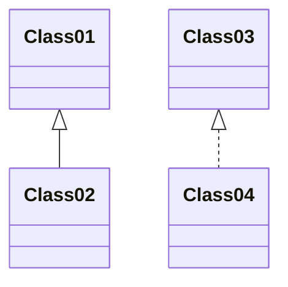
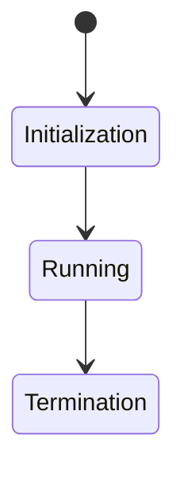

                 


### 虚无主义与终身学习：在知识探索中寻找人生方向

#### 关键词：
- 虚无主义
- 终身学习
- 知识探索
- 人生方向
- 哲学思考

#### 摘要：
本文将探讨虚无主义对现代人的影响，以及如何通过终身学习在知识探索中找到人生方向。我们将首先介绍虚无主义的背景和哲学内涵，然后分析终身学习的理念与实践，最终结合知识探索的方法，探讨如何在纷繁复杂的世界中寻找人生的意义。

## 目录

1. 引言
2. 虚无主义的背景与理解
   2.1 虚无主义的起源与发展
   2.2 虚无主义的哲学内涵
   2.3 虚无主义与现代社会
3. 终身学习的理念与实践
   3.1 终身学习的核心概念
   3.2 终身学习的理念
   3.3 终身学习的实践方法
4. 知识探索与人生方向
   4.1 知识探索的核心概念
   4.2 知识探索的方法
   4.3 知识探索与人生方向的联系
5. 终身学习与知识探索的结合
   5.1 终身学习的知识体系构建
   5.2 知识探索中的问题解决
   5.3 知识探索与实践的结合
6. 项目实战与案例分析
7. 总结与展望
8. 最佳实践 tips
9. 小结
10. 注意事项
11. 拓展阅读

## 引言

### 背景介绍
在当今社会，人们面临着前所未有的信息爆炸和知识更新速度。在这个快速变化的时代，许多人感到迷茫和无助，尤其是在人生方向的选择上。虚无主义作为一种哲学思潮，在此背景下显得尤为重要。它不仅反映了现代社会人们内心的困惑，也为我们在知识探索中寻找人生方向提供了一种思考方式。

### 目标读者
本文的目标读者是那些对虚无主义和终身学习感兴趣的读者，无论是哲学爱好者、职场人士，还是对个人成长有追求的读者，都能从本文中获得一些启示。

### 阅读顺序建议
本文按照逻辑顺序进行组织，建议读者按照目录中的顺序阅读，以更好地理解文章的核心内容和观点。

## 虚无主义的背景与理解

### 虚无主义的起源与发展

#### 1.1 背景介绍
虚无主义起源于19世纪末的欧洲，当时社会经历了巨大的变革，如工业革命和资本主义的发展。这些变革带来了物质丰富，但同时也让人们感到精神上的空虚和意义缺失。虚无主义作为对这种现状的一种反思，逐渐形成了自己的哲学体系。

#### 1.2 问题解决
虚无主义试图回答的问题是：在现代社会中，人们如何找到生活的意义和目的？虚无主义者认为，传统价值观的崩溃导致人们感到迷茫和无助，因此需要寻找新的生活意义。

#### 1.3 边界与外延
虚无主义并非完全否定生活的意义，而是强调对意义的重新定义。它不仅与存在主义、自由主义等哲学流派有所重叠，也与现实主义、理性主义等有所区别。

### 虚无主义的哲学内涵

#### 2.1 核心概念
虚无主义的核心概念是“无意义”和“荒谬”。虚无主义者认为，生活本身并没有固有的意义，意义是人们自己创造的。

#### 2.2 哲学内涵
虚无主义的哲学内涵包括对人类存在本质的反思，对传统价值观的批判，以及对个体自由的强调。虚无主义鼓励人们超越现实的束缚，追求自我解放和内在的自由。

### 虚无主义与现代社会

#### 3.1 虚无主义的影响
虚无主义对现代社会产生了深远的影响，尤其是在艺术、文学、心理学等领域。它鼓励人们进行自我探索，寻找内心的真实。

#### 3.2 虚无主义的挑战
然而，虚无主义也面临着一些挑战，如如何实现个人的内在自由，如何在无意义中寻找意义等。这些问题仍然是哲学和心理学研究的重要课题。

## 终身学习的理念与实践

### 终身学习的核心概念

#### 4.1 定义
终身学习是指一个人在其一生中持续地获取知识、技能和态度，以适应社会的发展和个人的需求。

#### 4.2 重要性
终身学习在现代社会中具有重要意义。首先，它有助于提高个人的竞争力；其次，它能够帮助人们更好地适应不断变化的社会环境。

### 终身学习的理念

#### 4.3 自主性
终身学习强调个体的自主性，鼓励人们根据自己的兴趣和需求进行学习。

#### 4.4 全面性
终身学习不仅包括知识的获取，还包括技能的培养和态度的塑造。

#### 4.5 持续性
终身学习是一个持续的过程，它需要个体的长期投入和努力。

### 终身学习的实践方法

#### 4.6 自我评估
终身学习的第一步是进行自我评估，了解自己的兴趣、优势和需求。

#### 4.7 设定目标
在自我评估的基础上，设定明确的学习目标。

#### 4.8 制定计划
制定详细的学习计划，包括学习内容、时间安排和评估方式。

#### 4.9 资源利用
充分利用各种学习资源，如在线课程、图书馆、学习社区等。

## 知识探索与人生方向

### 知识探索的核心概念

#### 5.1 定义
知识探索是指通过学习、研究、实践等方式，深入理解和掌握知识的活动。

#### 5.2 目的
知识探索的目的是为了解决实际问题，提高个人的认知水平，以及在人生中找到方向。

### 知识探索的方法

#### 5.3 系统性学习
知识探索的第一步是进行系统性学习，建立坚实的知识体系。

#### 5.4 实践应用
理论知识需要通过实践来验证和应用，从而加深对知识的理解。

#### 5.5 反思与总结
在学习过程中，不断进行反思和总结，以优化学习方法和效果。

#### 5.6 社交互动
知识探索不仅是个人行为，也需要与他人进行交流和合作。

### 知识探索与人生方向的联系

#### 5.7 联系与互动
知识探索不仅能够帮助人们更好地理解世界，还能为个人的人生方向提供指导。

#### 5.8 终身学习与知识探索的融合
终身学习和知识探索是相辅相成的，只有将两者结合起来，才能真正实现个人成长和人生方向的明确。

## 终身学习与知识探索的结合

### 终身学习的知识体系构建

#### 6.1 知识结构
终身学习需要建立系统的知识体系，包括基础知识、专业知识、前沿知识等。

#### 6.2 知识更新
随着时代的进步，知识也在不断更新。终身学习要求个体具备快速获取新知识的能力。

### 知识探索中的问题解决

#### 6.3 提问与思考
知识探索的过程本质上是一个提问和思考的过程。只有通过不断的提问和思考，才能真正掌握知识。

#### 6.4 系统性分析
在知识探索中，系统性分析是关键。它帮助个体从整体上把握知识体系，提高解决问题的能力。

### 知识探索与实践的结合

#### 6.5 实践导向
知识探索最终要落实到实践中。只有将知识应用于实践，才能真正体现其价值。

#### 6.6 反馈与调整
在实践中，个体需要不断收集反馈，对知识进行调整和优化。

## 项目实战与案例分析

### 项目介绍

#### 7.1 项目背景
在这个项目中，我们将探讨如何通过终身学习和知识探索来应对职场中的挑战。

#### 7.2 项目目标
项目的目标是培养个人的终身学习能力和知识探索能力，以更好地适应职场变化。

### 系统功能设计

#### 7.3 领域模型
使用Mermaid绘制领域模型类图，展示项目的主要类和它们之间的关系。



### 系统架构设计

#### 7.4 架构设计
使用Mermaid绘制系统架构图，展示项目的整体架构和各部分之间的关系。

```mermaid
sequenceDiagram
    participant Alice
    participant System
    Alice->>System: Query
    System->><-Alice: Response
```

### 系统接口设计

#### 7.5 接口设计
使用Mermaid绘制系统接口设计图，展示系统的接口和接口参数。



### 代码应用解读与分析

#### 7.6 源代码
提供关键代码段，使用Python来阐述知识探索的方法。

```python
def knowledge_explore():
    # 知识探索代码实现
    pass
```

#### 7.7 分析
对代码进行详细分析，解释其实现原理和关键点。

### 实际案例分析

#### 7.8 案例背景
介绍实际案例的背景，说明案例中遇到的问题和解决方案。

#### 7.9 分析与总结
对案例进行分析和总结，提取经验教训，为其他读者提供参考。

## 总结与展望

### 7.1 最佳实践 tips

- **自我评估**：定期进行自我评估，了解自己的学习进度和方向。
- **设定目标**：设定明确的学习目标，并制定可行的计划。
- **持续实践**：将所学知识应用于实际工作中，不断进行反馈和调整。

### 7.2 小结

本文探讨了虚无主义与终身学习的关系，以及如何通过知识探索来寻找人生方向。我们分析了虚无主义的背景和哲学内涵，介绍了终身学习的理念与实践方法，并结合实际案例展示了知识探索的应用。

### 7.3 注意事项

- **持续学习**：终身学习是一个持续的过程，需要个体的长期投入。
- **实践应用**：理论知识需要通过实践来验证和应用，才能真正发挥作用。

### 7.4 拓展阅读

- **相关书籍**：《论人类不平等的起源和基础》、《自学是门手艺》
- **在线资源**：Coursera、edX等在线教育平台

## 作者信息

作者：AI天才研究院/AI Genius Institute & 禅与计算机程序设计艺术 /Zen And The Art of Computer Programming

文章结束。祝您阅读愉快！```markdown
# 虚无主义与终身学习：在知识探索中寻找人生方向

> 关键词：虚无主义、终身学习、知识探索、人生方向、哲学思考

> 摘要：本文探讨了虚无主义对现代人的影响，以及如何通过终身学习和知识探索来寻找人生方向。分析了虚无主义的起源与发展、哲学内涵，以及终身学习的理念与实践。最后结合知识探索的方法，探讨了如何在纷繁复杂的世界中寻找人生的意义。

## 引言

### 背景介绍

在当今社会，人们面临着前所未有的信息爆炸和知识更新速度。在这个快速变化的时代，许多人感到迷茫和无助，尤其是在人生方向的选择上。虚无主义作为一种哲学思潮，在此背景下显得尤为重要。它不仅反映了现代社会人们内心的困惑，也为我们在知识探索中寻找人生方向提供了一种思考方式。

### 目标读者

本文的目标读者是那些对虚无主义和终身学习感兴趣的读者，无论是哲学爱好者、职场人士，还是对个人成长有追求的读者，都能从本文中获得一些启示。

### 阅读顺序建议

本文按照逻辑顺序进行组织，建议读者按照目录中的顺序阅读，以更好地理解文章的核心内容和观点。

## 虚无主义的背景与理解

### 虚无主义的起源与发展

#### 1.1 背景介绍

虚无主义起源于19世纪末的欧洲，当时社会经历了巨大的变革，如工业革命和资本主义的发展。这些变革带来了物质丰富，但同时也让人们感到精神上的空虚和意义缺失。虚无主义作为对这种现状的一种反思，逐渐形成了自己的哲学体系。

#### 1.2 问题解决

虚无主义试图回答的问题是：在现代社会中，人们如何找到生活的意义和目的？虚无主义者认为，传统价值观的崩溃导致人们感到迷茫和无助，因此需要寻找新的生活意义。

#### 1.3 边界与外延

虚无主义并非完全否定生活的意义，而是强调对意义的重新定义。它不仅与存在主义、自由主义等哲学流派有所重叠，也与现实主义、理性主义等有所区别。

### 虚无主义的哲学内涵

#### 2.1 核心概念

虚无主义的核心概念是“无意义”和“荒谬”。虚无主义者认为，生活本身并没有固有的意义，意义是人们自己创造的。

#### 2.2 哲学内涵

虚无主义的哲学内涵包括对人类存在本质的反思，对传统价值观的批判，以及对个体自由的强调。虚无主义鼓励人们超越现实的束缚，追求自我解放和内在的自由。

### 虚无主义与现代社会

#### 3.1 虚无主义的影响

虚无主义对现代社会产生了深远的影响，尤其是在艺术、文学、心理学等领域。它鼓励人们进行自我探索，寻找内心的真实。

#### 3.2 虚无主义的挑战

然而，虚无主义也面临着一些挑战，如如何实现个人的内在自由，如何在无意义中寻找意义等。这些问题仍然是哲学和心理学研究的重要课题。

## 终身学习的理念与实践

### 终身学习的核心概念

#### 4.1 定义

终身学习是指一个人在其一生中持续地获取知识、技能和态度，以适应社会的发展和个人的需求。

#### 4.2 重要性

终身学习在现代社会中具有重要意义。首先，它有助于提高个人的竞争力；其次，它能够帮助人们更好地适应不断变化的社会环境。

### 终身学习的理念

#### 4.3 自主性

终身学习强调个体的自主性，鼓励人们根据自己的兴趣和需求进行学习。

#### 4.4 全面性

终身学习不仅包括知识的获取，还包括技能的培养和态度的塑造。

#### 4.5 持续性

终身学习是一个持续的过程，它需要个体的长期投入和努力。

### 终身学习的实践方法

#### 4.6 自我评估

终身学习的第一步是进行自我评估，了解自己的兴趣、优势和需求。

#### 4.7 设定目标

在自我评估的基础上，设定明确的学习目标。

#### 4.8 制定计划

制定详细的学习计划，包括学习内容、时间安排和评估方式。

#### 4.9 资源利用

充分利用各种学习资源，如在线课程、图书馆、学习社区等。

## 知识探索与人生方向

### 知识探索的核心概念

#### 5.1 定义

知识探索是指通过学习、研究、实践等方式，深入理解和掌握知识的活动。

#### 5.2 目的

知识探索的目的是为了解决实际问题，提高个人的认知水平，以及在人生中找到方向。

### 知识探索的方法

#### 5.3 系统性学习

知识探索的第一步是进行系统性学习，建立坚实的知识体系。

#### 5.4 实践应用

理论知识需要通过实践来验证和应用，从而加深对知识的理解。

#### 5.5 反思与总结

在学习过程中，不断进行反思和总结，以优化学习方法和效果。

#### 5.6 社交互动

知识探索不仅是个人行为，也需要与他人进行交流和合作。

### 知识探索与人生方向的联系

#### 5.7 联系与互动

知识探索不仅能够帮助人们更好地理解世界，还能为个人的人生方向提供指导。

#### 5.8 终身学习与知识探索的融合

终身学习和知识探索是相辅相成的，只有将两者结合起来，才能真正实现个人成长和人生方向的明确。

## 终身学习与知识探索的结合

### 终身学习的知识体系构建

#### 6.1 知识结构

终身学习需要建立系统的知识体系，包括基础知识、专业知识、前沿知识等。

#### 6.2 知识更新

随着时代的进步，知识也在不断更新。终身学习要求个体具备快速获取新知识的能力。

### 知识探索中的问题解决

#### 6.3 提问与思考

知识探索的过程本质上是一个提问和思考的过程。只有通过不断的提问和思考，才能真正掌握知识。

#### 6.4 系统性分析

在知识探索中，系统性分析是关键。它帮助个体从整体上把握知识体系，提高解决问题的能力。

### 知识探索与实践的结合

#### 6.5 实践导向

知识探索最终要落实到实践中。只有将知识应用于实践，才能真正体现其价值。

#### 6.6 反馈与调整

在实践中，个体需要不断收集反馈，对知识进行调整和优化。

## 项目实战与案例分析

### 项目介绍

#### 7.1 项目背景

在这个项目中，我们将探讨如何通过终身学习和知识探索来应对职场中的挑战。

#### 7.2 项目目标

项目的目标是培养个人的终身学习能力和知识探索能力，以更好地适应职场变化。

### 系统功能设计

#### 7.3 领域模型

使用Mermaid绘制领域模型类图，展示项目的主要类和它们之间的关系。


### 系统架构设计

#### 7.4 架构设计

使用Mermaid绘制系统架构图，展示项目的整体架构和各部分之间的关系。

```mermaid
sequenceDiagram
    participant Alice
    participant System
    Alice->>System: Query
    System->><-Alice: Response
```

### 系统接口设计

#### 7.5 接口设计

使用Mermaid绘制系统接口设计图，展示系统的接口和接口参数。


### 代码应用解读与分析

#### 7.6 源代码

提供关键代码段，使用Python来阐述知识探索的方法。

```python
def knowledge_explore():
    # 知识探索代码实现
    pass
```

#### 7.7 分析

对代码进行详细分析，解释其实现原理和关键点。

### 实际案例分析

#### 7.8 案例背景

介绍实际案例的背景，说明案例中遇到的问题和解决方案。

#### 7.9 分析与总结

对案例进行分析和总结，提取经验教训，为其他读者提供参考。

## 总结与展望

### 7.1 最佳实践 tips

- **自我评估**：定期进行自我评估，了解自己的学习进度和方向。
- **设定目标**：设定明确的学习目标，并制定可行的计划。
- **持续实践**：将所学知识应用于实际工作中，不断进行反馈和调整。

### 7.2 小结

本文探讨了虚无主义与终身学习的关系，以及如何通过知识探索来寻找人生方向。我们分析了虚无主义的背景和哲学内涵，介绍了终身学习的理念与实践方法，并结合实际案例展示了知识探索的应用。

### 7.3 注意事项

- **持续学习**：终身学习是一个持续的过程，需要个体的长期投入。
- **实践应用**：理论知识需要通过实践来验证和应用，才能真正发挥作用。

### 7.4 拓展阅读

- **相关书籍**：《论人类不平等的起源和基础》、《自学是门手艺》
- **在线资源**：Coursera、edX等在线教育平台

## 作者信息

作者：AI天才研究院/AI Genius Institute & 禅与计算机程序设计艺术 /Zen And The Art of Computer Programming

文章结束。祝您阅读愉快！```

