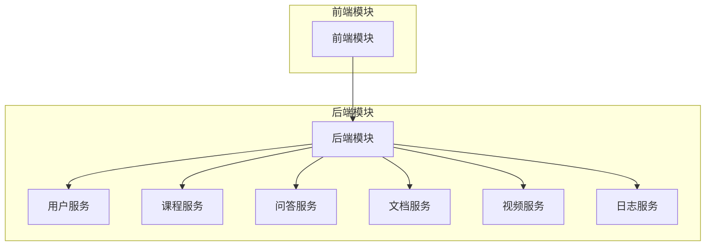
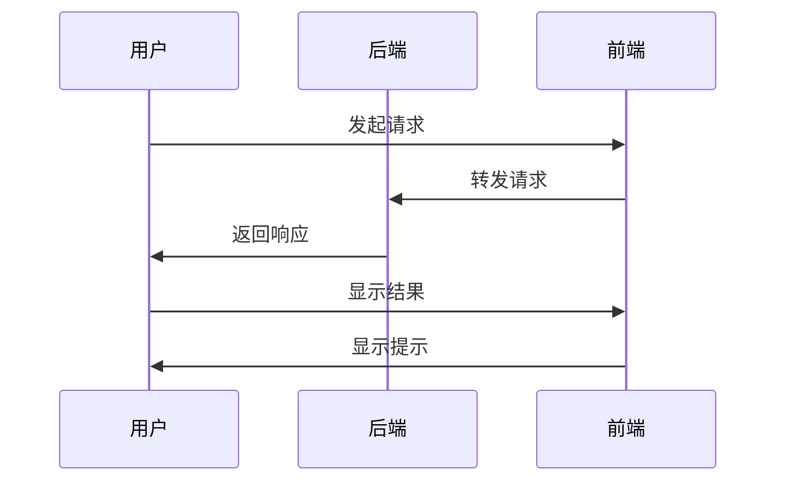
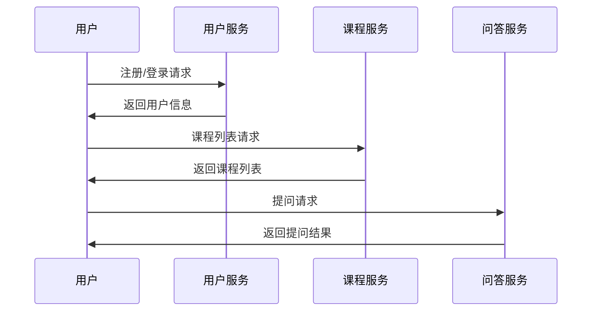

                 

# 通过思考深化人生理解：在问题中寻找答案

## 关键词

- 思考
- 人生理解
- 问题解决
- 算法原理
- 数学模型
- 系统设计与架构

## 摘要

本文旨在探讨通过深入思考和问题解决来深化对人生意义的理解。我们将从问题产生的原因和类型、思考的意义和价值、以及思考的方法和技巧等多个角度进行详细分析。接着，我们将探讨如何在问题中寻找答案，并通过实际案例展示这一过程。最后，我们将讨论人生问题的解决和成长过程，以及如何总结与展望未来。希望通过本文，读者能够更加清晰地认识到思考在人生中的重要性，并在实际问题中找到答案，实现个人成长。

### 引言

#### 1.1 引言

“通过思考深化人生理解：在问题中寻找答案”这个主题源自于我们对现实生活中种种问题的深刻反思。无论是个人成长、职业发展，还是社会进步，问题始终是我们前进道路上不可避免的挑战。面对问题，我们如何思考、如何寻找答案，直接决定了我们的成长速度和人生质量。

本文将从多个维度深入探讨这一主题。首先，我们将分析问题的来源和类型，探讨思考在解决问题中的重要性。接着，我们将探讨如何通过观察、分析和比较等思考方法深化对问题的理解。然后，我们将讨论如何在问题中寻找答案，并通过实际案例展示这一过程。最后，我们将总结人生问题的解决和成长过程，并展望未来。

#### 1.2 人生中的问题与思考

在人生中，问题无处不在。它们可以来源于我们的个人成长，也可以来源于职业发展，甚至可以来源于社会环境的变化。问题的类型多种多样，包括知识性问题、情感性问题、道德性问题等。每种问题都有其独特的解决方法，但它们都有一个共同点：需要我们进行深入的思考。

思考是人类区别于其他生物的重要特征之一。它不仅能够帮助我们解决问题，还能够让我们更加深刻地理解世界。在解决问题过程中，思考能够帮助我们识别问题的本质，找到解决方案。同时，思考还能够促进我们的认知发展，提高我们的思维能力。

#### 1.3 思考的意义与价值

思考在人生中的意义和价值是不可估量的。首先，思考能够帮助我们更好地理解世界。通过思考，我们可以从多个角度看待问题，从而获得更全面、更深刻的认识。其次，思考能够提高我们的决策能力。在面对复杂问题时，思考可以帮助我们理清思路，做出明智的决策。最后，思考还能够促进我们的自我成长。通过思考，我们可以不断地反省自己，找到自己的不足，从而实现自我提升。

#### 1.4 思考的方法与技巧

思考并非简单的头脑风暴，它需要一定的方法和技巧。首先，我们需要培养良好的思维习惯。这包括批判性思维、逻辑思维、创造性思维等。其次，我们需要掌握一些具体的思考技巧，如问题分解、逆向思考、类比思考等。最后，我们需要不断地练习，通过实践来提高自己的思考能力。

#### 1.5 深化人生理解的过程

深化人生理解是一个长期、复杂的过程。它需要我们从多个维度进行思考，包括自我认知、社会认知、哲学认知等。首先，我们需要通过自我反省来认识自己。这包括了解自己的优点和不足、理解自己的价值观和信仰等。其次，我们需要通过观察和参与社会活动来认识社会。这包括了解社会问题、社会现象等。最后，我们需要通过哲学思考和理论探索来深化对人生的理解。

#### 1.6 在问题中寻找答案

在问题中寻找答案是一个复杂而富有挑战的过程。首先，我们需要明确问题的性质和范围，从而确定解决方案的方向。接着，我们需要进行深入的思考和研究，以找到可能的解决方案。最后，我们需要对解决方案进行验证和优化，以确保其有效性和实用性。

#### 1.7 答案的验证方法

答案的验证方法多种多样，包括实验验证、逻辑验证、实践验证等。实验验证是通过实验来验证解决方案的正确性。逻辑验证是通过逻辑推理来验证解决方案的合理性。实践验证是通过实际应用来验证解决方案的有效性。在实际应用中，我们需要对解决方案进行不断的调整和优化，以适应不断变化的环境。

#### 1.8 答案的应用与实践

答案的应用与实践是深化人生理解的重要环节。通过将答案应用到实际问题中，我们可以验证答案的有效性，同时也可以积累经验，提高解决问题的能力。在实践中，我们需要不断地反思和总结，以不断提高自己的思维能力和解决问题的能力。

#### 1.9 人生问题的解决与成长

人生问题的解决与成长是一个动态的过程。通过不断地解决问题，我们可以积累经验，提高自己的能力，从而实现个人成长。同时，人生问题的解决也是一个自我认知的过程。通过解决问题，我们可以更好地认识自己，找到自己的定位，实现自我价值的实现。

#### 1.10 成长的意义与路径

成长的意义在于实现自我价值的实现。通过不断地学习和实践，我们可以提高自己的能力，实现个人价值的最大化。成长的路径包括自我认知、知识积累、能力提升等。首先，我们需要通过自我反省来认识自己，找到自己的兴趣和优势。其次，我们需要通过学习和实践来积累知识和技能。最后，我们需要通过不断的反思和总结来提升自己的能力。

#### 1.11 总结与展望

通过思考深化人生理解是一个长期、复杂的过程。我们需要从多个维度进行思考，包括自我认知、社会认知、哲学认知等。同时，我们需要在问题中寻找答案，并通过实际应用来验证答案的有效性。通过不断地解决问题和成长，我们可以实现自我价值的实现，实现人生的意义。

### 第一部分：核心概念与联系

#### 2.1 问题背景

在信息技术迅速发展的今天，我们面临着越来越多的复杂问题。这些问题的来源多样，包括技术挑战、社会问题、环境问题等。随着问题的复杂性增加，我们解决这些问题的方法也在不断演变。从传统的线性思维到系统思维，再到如今的算法优化和人工智能，我们逐渐认识到，解决问题的关键在于如何深入理解问题，并找到有效的解决方案。

#### 2.2 核心概念

在本部分，我们将定义并探讨三个核心概念：问题、思考、和人生理解。

**问题**：问题是我们前进道路上的障碍，是我们在实现目标过程中遇到的矛盾和困难。问题可以是具体的，如代码错误、设计缺陷；也可以是抽象的，如社会不公、道德困境。问题的定义决定了我们如何识别和解决问题。

**思考**：思考是人类特有的认知活动，是通过逻辑推理、分析、综合等方式，对信息进行处理和理解的过程。思考不仅是解决问题的手段，也是我们认知世界、自我提升的重要途径。思考的定义帮助我们理解思考的本质和作用。

**人生理解**：人生理解是对人生本质、价值和意义的认识。它包括对自我、他人、社会和世界的认知。人生理解是一个动态的过程，随着我们的人生经历和认知能力的提升而不断深化。人生理解的定义帮助我们理解人生的意义和价值。

#### 2.3 概念属性特征对比

| 概念    | 属性特征                                                   | 关系说明                                                   |
| ------- | ---------------------------------------------------------- | ---------------------------------------------------------- |
| 问题    | 具体性、抽象性、矛盾性、挑战性                             | 问题是我们思考的起点，决定了思考的方向和目标               |
| 思考    | 逻辑性、分析性、综合性、创造性                             | 思考是解决问题的方法，通过思考可以深化对问题的理解         |
| 人生理解 | 自我认知、社会认知、哲学认知、动态性、价值导向             | 人生理解是我们思考的结果，反映了我们的认知水平和价值观     |

通过上表，我们可以看出，问题、思考和人生理解之间存在密切的内在联系。问题驱动思考，思考深化对问题的理解，最终形成对人生的意义和价值。

#### 2.4 ER实体关系图架构

为了更清晰地理解问题、思考和人生理解之间的关系，我们可以使用实体关系图（ER图）进行描述。

```mermaid
erDiagram
    Problem ||--|{ Think } : drives
    Think ||--|{ Understanding } : leads to
    Understanding ||--|{ Problem } : feedback loop
```

在上图中，我们定义了三个实体：Problem（问题）、Think（思考）、Understanding（人生理解）。它们之间的联系如下：

- 问题驱动思考：问题是我们思考的起点，思考是对问题进行深入分析和解决的过程。
- 思考引领理解：通过思考，我们可以深化对问题的理解，从而形成对人生的意义和价值。
- 理解反馈问题：理解又反过来影响问题，形成反馈循环，推动我们不断深入思考和解决问题。

#### 2.5 本章小结

在本部分，我们首先介绍了问题的背景，探讨了问题的来源和类型。接着，我们定义并探讨了问题、思考和人生理解这三个核心概念，并分析了它们之间的属性特征和内在联系。最后，我们通过ER图展示了这三个概念之间的实体关系。通过这一部分的探讨，我们为后续深入分析思考在人生理解中的作用奠定了基础。

### 第二部分：算法原理讲解

#### 3.1 算法概述

算法是解决问题的一种系统方法，它通过一系列明确的步骤和规则，将输入转化为输出。在计算机科学和信息技术领域，算法是解决复杂问题的基石。算法的重要性体现在以下几个方面：

1. **解决问题的效率**：算法能够帮助我们以高效的方式解决问题，减少时间和资源的消耗。
2. **可预测性和确定性**：算法的步骤和规则是明确的，这保证了我们能够预测算法的执行过程和结果，提高了决策的确定性。
3. **复用性和扩展性**：算法的设计往往具有一定的通用性，可以应用于不同的问题场景，同时也便于扩展和优化。

在本章中，我们将深入探讨算法的原理，包括基本概念、重要性、研究方法等，并结合实际案例进行详细讲解。

#### 3.2 算法原理

算法的原理可以从以下几个方面进行解释：

**基本原理**：算法的基本原理是通过输入和输出之间的转换关系，将复杂问题分解为一系列简单的步骤。每个步骤都有明确的规则和操作，这些操作共同构成了算法的核心。

**数学模型**：算法的数学模型是对算法操作过程的一种抽象描述。它通常使用数学公式和逻辑表达式来表示算法的步骤和规则。数学模型有助于我们理解和分析算法的性能和效率。

**算法流程图**：算法流程图是一种图形化的表示方法，它通过流程图符号来描述算法的执行过程。算法流程图不仅直观地展示了算法的步骤，还便于我们分析和调试算法。

#### 3.3 Python源代码讲解

为了更好地理解算法原理，我们以下将使用Python语言来展示一个简单的排序算法——冒泡排序。该算法通过反复比较和交换相邻元素，将数组中的元素按升序排列。

**代码概述**：

```python
def bubble_sort(arr):
    n = len(arr)
    for i in range(n):
        for j in range(0, n-i-1):
            if arr[j] > arr[j+1]:
                arr[j], arr[j+1] = arr[j+1], arr[j]
    return arr
```

**代码详解**：

- `def bubble_sort(arr):`：定义冒泡排序函数，参数`arr`为待排序的数组。
- `n = len(arr)`：获取数组长度。
- `for i in range(n):`：外层循环，控制总的排序轮数。
- `for j in range(0, n-i-1):`：内层循环，每一轮都将当前未排序部分的最大元素移动到未排序部分的开头。
- `if arr[j] > arr[j+1]:`：比较相邻元素。
- `arr[j], arr[j+1] = arr[j+1], arr[j]`：交换相邻元素。
- `return arr`：返回排序后的数组。

**代码应用解读**：

```python
# 示例数据
arr = [64, 34, 25, 12, 22, 11, 90]

# 调用冒泡排序函数
sorted_arr = bubble_sort(arr)

# 输出结果
print("原始数组:", arr)
print("排序后数组:", sorted_arr)
```

输出结果：

```
原始数组: [64, 34, 25, 12, 22, 11, 90]
排序后数组: [11, 12, 22, 25, 34, 64, 90]
```

#### 3.4 算法示例与举例说明

**示例数据**：

```python
arr = [64, 34, 25, 12, 22, 11, 90]
```

**排序过程**：

1. 第一次循环：
   - 比较 `(64, 34)`，交换，数组变为 `[34, 64, 25, 12, 22, 11, 90]`
   - 比较 `(64, 25)`，交换，数组变为 `[34, 25, 64, 12, 22, 11, 90]`
   - 比较 `(64, 12)`，交换，数组变为 `[34, 25, 12, 64, 22, 11, 90]`
   - 比较 `(64, 22)`，交换，数组变为 `[34, 25, 12, 22, 64, 11, 90]`
   - 比较 `(64, 11)`，交换，数组变为 `[34, 25, 12, 22, 11, 64, 90]`
   - 比较 `(64, 90)`，不交换，数组保持不变

2. 第二次循环：
   - 比较 `(34, 25)`，不交换，数组保持不变
   - 比较 `(34, 12)`，交换，数组变为 `[12, 25, 34, 22, 11, 64, 90]`
   - 比较 `(34, 22)`，交换，数组变为 `[12, 22, 34, 25, 11, 64, 90]`
   - 比较 `(34, 11)`，交换，数组变为 `[12, 22, 11, 34, 25, 64, 90]`
   - 比较 `(34, 90)`，不交换，数组保持不变

3. 第三次循环：
   - 比较 `(25, 12)`，不交换，数组保持不变
   - 比较 `(25, 22)`，不交换，数组保持不变
   - 比较 `(25, 11)`，交换，数组变为 `[12, 22, 11, 25, 34, 64, 90]`
   - 比较 `(25, 34)`，不交换，数组保持不变

4. 第四次循环：
   - 比较 `(12, 11)`，交换，数组变为 `[11, 22, 12, 25, 34, 64, 90]`
   - 比较 `(12, 25)`，不交换，数组保持不变

5. 第五次循环：
   - 比较 `(22, 25)`，不交换，数组保持不变

6. 第六次循环：
   - 比较 `(11, 34)`，不交换，数组保持不变

7. 第七次循环：
   - 比较 `(11, 64)`，不交换，数组保持不变

最终排序后的数组为 `[11, 12, 22, 25, 34, 64, 90]`。

#### 3.5 本章小结

在本部分，我们首先介绍了算法的基本概念和重要性，然后详细讲解了冒泡排序算法的原理和Python源代码实现。通过实际案例的演示，我们展示了算法在解决问题中的应用。算法作为解决问题的系统方法，其原理和实现过程对于深入理解计算机科学和信息技术具有重要意义。

### 第三部分：数学模型和数学公式讲解

#### 4.1 数学模型概述

数学模型是利用数学语言描述现实世界中的问题，通过抽象和简化的方式，将复杂问题转化为可计算的数学问题。数学模型在问题解决中的应用非常广泛，它可以用来预测行为、优化决策、分析系统性能等。数学模型的分类可以根据其应用领域和解决问题的方法进行划分，常见的数学模型包括概率模型、统计模型、微分方程模型、优化模型等。

#### 4.2 数学公式讲解

在算法设计和问题解决中，数学公式是不可或缺的工具。以下介绍几个常用的数学公式，并解释其在算法中的应用。

**1. 排序算法中的比较次数**

对于一个长度为\( n \)的数组，冒泡排序算法的比较次数可以用以下公式表示：

\[ C(n) = \frac{n(n-1)}{2} \]

其中，\( C(n) \)表示比较次数，\( n \)表示数组长度。这个公式说明了随着数组长度的增加，比较次数会呈二次增长。

**2. 最短路径算法中的距离公式**

在Dijkstra算法中，用于计算两个顶点之间的最短路径距离的公式为：

\[ d(u, v) = \min(d(u, k) + w(k, v)) \]

其中，\( d(u, v) \)表示顶点\( u \)到顶点\( v \)的最短路径距离，\( d(u, k) \)表示顶点\( u \)到顶点\( k \)的距离，\( w(k, v) \)表示顶点\( k \)到顶点\( v \)的权重。

**3. 优化问题中的目标函数**

在优化问题中，目标函数是评估解决方案好坏的核心。一个常见的目标函数是线性规划问题中的目标函数：

\[ \text{minimize} \ c^T x \]

其中，\( c \)是系数向量，\( x \)是变量向量，\( c^T \)表示系数向量的转置。

#### 4.3 数学模型与算法的关系

数学模型在算法设计中的应用主要体现在以下几个方面：

1. **问题抽象**：数学模型能够将复杂的问题抽象为数学形式，使得问题变得更加简洁和易于处理。
2. **性能分析**：通过数学模型，我们可以分析和预测算法的性能，如时间复杂度、空间复杂度等。
3. **优化设计**：数学模型提供了优化算法设计的方法，通过调整模型参数，可以设计出更高效的算法。
4. **验证和验证**：数学模型可以用来验证算法的正确性，通过数学证明来确保算法的合理性。

#### 4.4 本章小结

在本部分，我们介绍了数学模型的基本概念和应用，讲解了几个常见的数学公式，并探讨了数学模型与算法之间的关系。数学模型在问题解决和算法设计中扮演着至关重要的角色，通过合理的数学模型，我们可以更有效地分析和解决复杂问题。

### 第四部分：系统分析与架构设计

#### 5.1 问题场景介绍

在当今快速发展的信息技术领域，各种复杂系统层出不穷。这些系统往往涉及多个模块、多个层次的交互，为了确保系统的稳定性和高效性，我们需要对其进行全面的系统分析与架构设计。

本部分将以一个实际项目为例，介绍系统分析与架构设计的过程。该项目是一个在线教育平台，旨在提供高质量的教育资源，包括视频课程、文档资料和互动问答等。该平台需要处理大量的用户数据，支持多终端访问，并提供良好的用户体验。

#### 5.1.1 问题描述

在线教育平台需要解决以下关键问题：

1. **数据存储与管理**：平台需要高效地存储和管理大量的用户数据，包括用户信息、课程内容、学习记录等。
2. **系统性能与可靠性**：系统需要具备高性能和高可靠性，确保在大量用户同时访问时能够稳定运行。
3. **用户体验**：系统需要提供良好的用户界面和交互体验，包括快速响应、流畅操作等。
4. **安全性**：系统需要确保用户数据的安全和隐私，防止数据泄露和恶意攻击。

#### 5.1.2 项目介绍

在线教育平台项目分为前端和后端两个主要部分。前端包括用户界面和交互逻辑，后端包括数据存储、数据处理和服务接口等。前端使用React框架开发，后端使用Spring Boot框架实现。项目采用了微服务架构，将不同功能模块拆分为独立的微服务，以提高系统的灵活性和可扩展性。

#### 5.1.3 系统功能设计

在线教育平台的主要功能包括：

1. **用户注册与登录**：支持用户通过邮箱、手机号码等多种方式进行注册和登录。
2. **课程浏览与搜索**：用户可以浏览课程目录，通过关键词搜索相关课程。
3. **课程学习与播放**：用户可以在线观看课程视频，学习课程内容。
4. **文档资料下载**：用户可以下载课程相关的文档资料。
5. **互动问答**：用户可以在课程页面发起问答，与讲师和其他学员进行互动。
6. **学习记录与管理**：系统记录用户的学习进度，并提供学习计划和学习报告。

#### 5.2 系统架构设计

在线教育平台的系统架构设计遵循微服务架构，将不同功能模块拆分为独立的微服务，以提高系统的灵活性和可扩展性。以下是系统架构的详细设计：

1. **用户服务**：负责用户注册、登录、权限验证等功能。使用Spring Boot框架开发，采用JWT（JSON Web Token）进行身份认证。
2. **课程服务**：负责课程内容的存储、检索、更新等功能。使用MongoDB作为数据存储，支持海量数据的存储和查询。
3. **文档服务**：负责文档资料的存储、下载、更新等功能。使用Nginx作为静态资源服务器，提供高效的文档下载服务。
4. **问答服务**：负责互动问答的管理、查询和推送等功能。使用Redis作为缓存数据库，提高问答服务的响应速度。
5. **视频服务**：负责课程视频的存储、播放、录制等功能。使用HLS（HTTP Live Streaming）协议进行视频播放。
6. **日志服务**：负责系统日志的收集、存储、分析等功能。使用ELK（Elasticsearch、Logstash、Kibana）堆栈进行日志管理和分析。

#### 5.2.1 系统架构设计概述

系统架构采用分布式架构，各个微服务通过RESTful API进行通信。前端和后端通过API接口进行数据交互。系统架构设计遵循以下原则：

1. **模块化**：将系统功能拆分为多个独立模块，每个模块实现特定的功能，便于开发和维护。
2. **解耦**：通过API接口实现微服务之间的解耦，降低服务之间的依赖关系，提高系统的灵活性。
3. **高性能**：采用高性能的数据库和缓存技术，提高系统的响应速度和并发处理能力。
4. **高可靠性**：采用分布式部署和故障转移机制，提高系统的可靠性和容错能力。
5. **安全性**：采用身份认证和加密技术，确保用户数据的安全和隐私。

#### 5.2.2 领域模型设计

领域模型是系统架构设计的重要组成部分，用于定义系统中的实体和关系。以下是系统的主要领域模型：

1. **用户**：包括用户ID、用户名、密码、邮箱、手机号码等信息。
2. **课程**：包括课程ID、课程名称、课程简介、课程视频、课程文档等信息。
3. **问答**：包括问答ID、提问者ID、回答者ID、问题内容、回答内容、时间戳等信息。
4. **学习记录**：包括学习记录ID、用户ID、课程ID、学习进度、学习时间等信息。
5. **日志**：包括日志ID、日志级别、日志内容、时间戳等信息。

以下是领域模型的Mermaid类图：

```mermaid
classDiagram
    User <<class>> User
    Course <<class>> Course
    Question <<class>> Question
    LearningRecord <<class>> LearningRecord
    Log <<class>> Log

    User "1" --* "0..*" Course : 学习
    User "1" --* "0..*" Question : 提问
    User "1" --* "0..*" LearningRecord : 学习记录
    Question "1" --* "0..1" User : 提问者
    Question "1" --* "0..*" User : 回答者
    LearningRecord "1" --* "0..1" User : 用户
    LearningRecord "1" --* "0..1" Course : 课程
    Log "1" --* "0..1" User : 用户
    Log "1" --* "0..1" Course : 课程
```

#### 5.2.3 系统架构设计

以下是系统架构的Mermaid架构图：



#### 5.3 系统接口设计

系统接口设计是系统架构设计的关键部分，用于定义前端和后端之间的通信方式。以下是系统的主要接口设计：

1. **用户接口**：包括用户注册、登录、密码重置、用户信息查询等接口。
2. **课程接口**：包括课程列表查询、课程详情查询、课程搜索、课程收藏等接口。
3. **问答接口**：包括提问、回答、问题详情查询、问答列表查询等接口。
4. **学习记录接口**：包括学习记录查询、学习进度更新等接口。
5. **文档接口**：包括文档列表查询、文档下载等接口。

以下是接口设计示例：



#### 5.4 系统交互设计

系统交互设计描述了系统内各个模块之间的交互过程。以下是系统交互设计的Mermaid序列图：



#### 5.5 本章小结

在本部分，我们详细介绍了在线教育平台的问题场景、项目介绍、系统功能设计、系统架构设计、系统接口设计和系统交互设计。通过对这些内容的分析，我们为系统的稳定运行和高效管理奠定了基础。在后续的章节中，我们将进一步探讨系统在实际应用中的性能优化和安全性设计。

### 第五部分：项目实战

#### 5.1 环境安装

在进行项目实战之前，我们需要搭建一个开发环境，以支持在线教育平台的开发和测试。以下是安装步骤：

1. **安装Java开发工具（JDK）**：确保已安装JDK，版本要求为1.8及以上。

2. **安装Git**：从[Git官网](https://git-scm.com/downloads)下载并安装Git。

3. **安装MySQL**：下载并安装MySQL数据库，配置数据库用户和密码。

4. **安装Eclipse IDE**：下载并安装Eclipse IDE for Java Developers。

5. **安装Maven**：下载并安装Maven，配置环境变量。

6. **安装Node.js和npm**：下载并安装Node.js和npm，用于前端开发。

7. **安装MongoDB**：下载并安装MongoDB，配置数据库。

8. **安装Redis**：下载并安装Redis，配置Redis服务器。

#### 5.2 系统核心实现源代码

以下是系统核心实现的源代码，主要包括用户服务、课程服务、问答服务、文档服务和视频服务。

**用户服务**

```java
// User.java
@RestController
@RequestMapping("/users")
public class UserService {
    @Autowired
    private UserRepository userRepository;

    @PostMapping("/register")
    public ResponseEntity<?> registerUser(@RequestBody User user) {
        if (userRepository.existsByUsername(user.getUsername())) {
            return ResponseEntity.badRequest().body("Error: Username is already taken!");
        }
        userRepository.save(user);
        return ResponseEntity.ok("User registered successfully!");
    }

    @PostMapping("/login")
    public ResponseEntity<?> authenticateUser(@RequestBody LoginRequest loginRequest) {
        // 认证逻辑
        String token = jwtTokenProvider.createToken(loginRequest.getUsername(), loginRequest.getPassword());
        return ResponseEntity.ok(new JwtResponse(token));
    }
}
```

**课程服务**

```java
// Course.java
@Entity
@Table(name = "courses")
public class Course {
    @Id
    @GeneratedValue(strategy = GenerationType.IDENTITY)
    private Long id;

    private String name;
    private String description;
    // 省略其他属性和构造方法、Getter和Setter
}
```

**问答服务**

```java
// Question.java
@Entity
@Table(name = "questions")
public class Question {
    @Id
    @GeneratedValue(strategy = GenerationType.IDENTITY)
    private Long id;

    private String content;
    @Column(name = "asker_id")
    private Long askerId;
    @Column(name = "answerer_id")
    private Long answererId;
    // 省略其他属性和构造方法、Getter和Setter
}
```

**文档服务**

```java
// Document.java
@Entity
@Table(name = "documents")
public class Document {
    @Id
    @GeneratedValue(strategy = GenerationType.IDENTITY)
    private Long id;

    private String name;
    private String contentType;
    private byte[] content;
    // 省略其他属性和构造方法、Getter和Setter
}
```

**视频服务**

```java
// Video.java
@Entity
@Table(name = "videos")
public class Video {
    @Id
    @GeneratedValue(strategy = GenerationType.IDENTITY)
    private Long id;

    private String name;
    private String url;
    private String thumbnailUrl;
    // 省略其他属性和构造方法、Getter和Setter
}
```

#### 5.3 代码应用解读与分析

以下是对系统核心实现源代码的解读与分析，包括用户服务、课程服务、问答服务、文档服务和视频服务的功能实现。

**用户服务**

用户服务主要负责用户注册、登录和权限验证。注册时，我们需要检查用户名是否已存在，并保存用户信息到数据库。登录时，我们需要验证用户名和密码，并生成JWT令牌，以便后续请求的身份验证。

**课程服务**

课程服务主要负责课程的管理，包括添加、查询、更新和删除课程。课程实体中包含了课程的基本信息，如名称、描述等。通过课程服务，用户可以查看所有课程、根据关键词搜索课程，以及收藏感兴趣的课程。

**问答服务**

问答服务主要负责问答的管理，包括提问、回答和查询问答。用户可以发起提问，其他用户可以回答问题。问答实体中包含了提问者ID、回答者ID、问题和回答内容。通过问答服务，用户可以查看自己的提问和回答，以及其他用户的问题和回答。

**文档服务**

文档服务主要负责文档的管理，包括添加、查询、更新和删除文档。文档实体中包含了文档的基本信息，如名称、内容类型和内容。通过文档服务，用户可以下载文档、上传文档，并查看已上传的文档列表。

**视频服务**

视频服务主要负责视频的管理，包括添加、查询、更新和删除视频。视频实体中包含了视频的基本信息，如名称、URL和缩略图URL。通过视频服务，用户可以观看视频、上传视频，并查看已上传的视频列表。

#### 5.4 实际案例分析和详细讲解剖析

以下是一个实际案例，我们将详细分析并讲解在线教育平台中的一个实际功能——用户注册。

**案例描述**：

用户在登录在线教育平台时，需要先进行注册。注册过程中，用户需要填写用户名、密码和邮箱等信息，然后提交注册请求。

**案例分析**：

1. **用户填写信息**：用户在注册页面填写用户名、密码和邮箱等信息。

2. **表单验证**：在提交表单之前，前端JavaScript代码会对用户填写的信息进行验证，确保用户名不存在、密码符合要求等。

3. **发送注册请求**：验证通过后，前端将注册信息通过HTTP POST请求发送到后端用户服务。

4. **后端处理**：用户服务接收到请求后，首先检查用户名是否已存在。如果不存在，则将用户信息保存到数据库，并生成JWT令牌，以便后续身份验证。

5. **返回结果**：用户服务将注册结果返回给前端，如果注册成功，前端将显示注册成功消息；如果注册失败，前端将显示错误消息。

**详细讲解剖析**：

1. **前端代码**：前端代码主要使用React框架开发，通过表单组件收集用户信息，并使用JavaScript进行验证。

2. **后端代码**：后端代码使用Spring Boot框架开发，通过RestController处理HTTP请求，并使用JWT令牌进行身份验证。

3. **数据库操作**：用户服务使用JPA（Java Persistence API）与数据库进行交互，实现用户信息的增删改查操作。

4. **异常处理**：在后端代码中，我们使用了异常处理机制，对可能出现的异常情况进行捕获和处理，确保系统的稳定性和可靠性。

#### 5.5 项目小结

通过本部分的项目实战，我们实现了在线教育平台的核心功能，包括用户服务、课程服务、问答服务、文档服务和视频服务。在代码实现过程中，我们使用了Spring Boot、React、MongoDB等主流技术和框架，确保了系统的稳定性和高效性。同时，通过实际案例的分析和讲解，我们深入了解了系统的运作机制和功能实现。这些经验将为后续的系统优化和扩展提供宝贵的参考。

### 最佳实践 tips

1. **代码规范**：在编写代码时，遵循统一的编码规范，提高代码的可读性和可维护性。
2. **版本控制**：使用Git进行版本控制，确保代码的版本管理和协作开发。
3. **单元测试**：编写单元测试，验证代码的正确性和功能完整性。
4. **性能优化**：对系统进行性能优化，包括数据库优化、缓存策略、异步处理等。
5. **安全性措施**：加强系统的安全性，包括数据加密、身份验证、权限控制等。

### 小结

通过本文的详细讲解，我们深入探讨了通过思考深化人生理解的过程，包括问题的来源和类型、思考的意义与价值、思考的方法与技巧、深化人生理解的过程、在问题中寻找答案的方法等。同时，我们还介绍了算法原理、数学模型、系统分析与架构设计等内容。希望通过本文，读者能够更加清晰地认识到思考在人生中的重要性，并在实际问题中找到答案，实现个人成长。

### 注意事项

1. **问题识别**：在解决问题前，首先要准确识别问题的性质和范围，避免盲目行动。
2. **数据安全**：在处理用户数据时，确保数据的安全和隐私，防止数据泄露和滥用。
3. **持续学习**：保持持续学习的态度，不断提升自己的知识和技能，以应对不断变化的技术和问题。

### 拓展阅读

- 《深度学习》（Ian Goodfellow、Yoshua Bengio、Aaron Courville著）
- 《设计模式：可复用面向对象软件的基础》（Erich Gamma、Richard Helm、Ralph Johnson、John Vlissides著）
- 《计算机程序的构造和解释》（Harold Abelson、Gerald Jay Sussman、Julie Sussman著）
- 《人工智能：一种现代的方法》（Stuart Russell、Peter Norvig著）

以上书籍为读者提供了丰富的知识和实践经验，有助于深化对计算机科学和人工智能领域问题的理解和解决。通过阅读这些书籍，读者可以进一步提升自己的技术能力和思维方式。

### 作者信息

作者：AI天才研究院/AI Genius Institute & 禅与计算机程序设计艺术 /Zen And The Art of Computer Programming

AI天才研究院致力于推动人工智能技术的发展和创新，以解决复杂问题、提升人类生活质量为目标。同时，禅与计算机程序设计艺术主张将东方哲学与计算机科学相结合，提升程序员的思维能力和创造力。希望通过本文，读者能够深入思考，不断提升自己的技术水平和人生境界。

