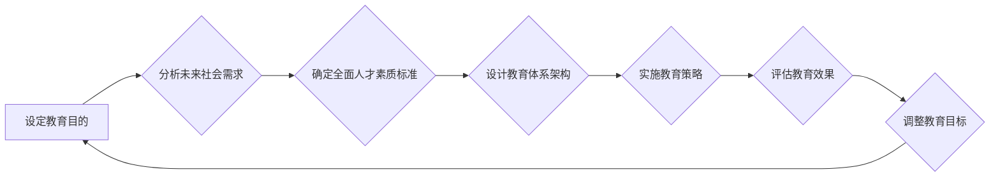
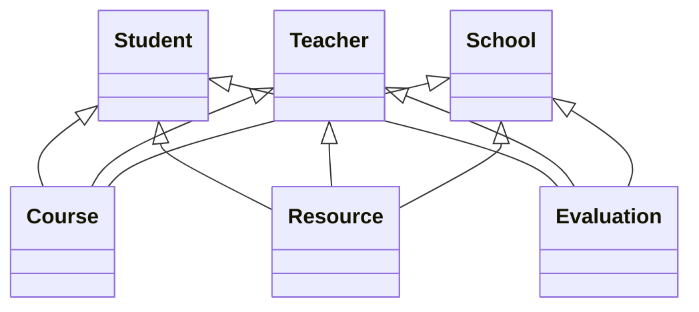
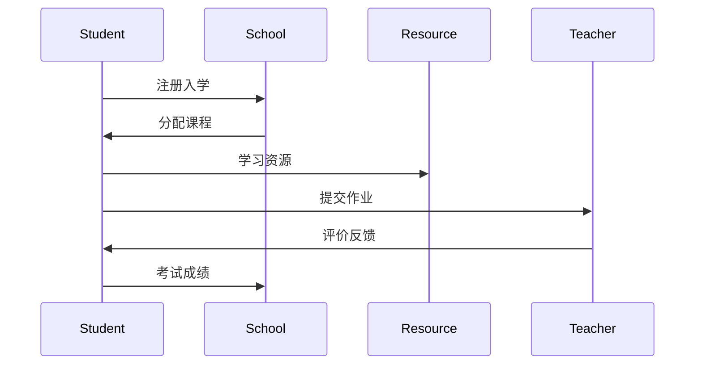
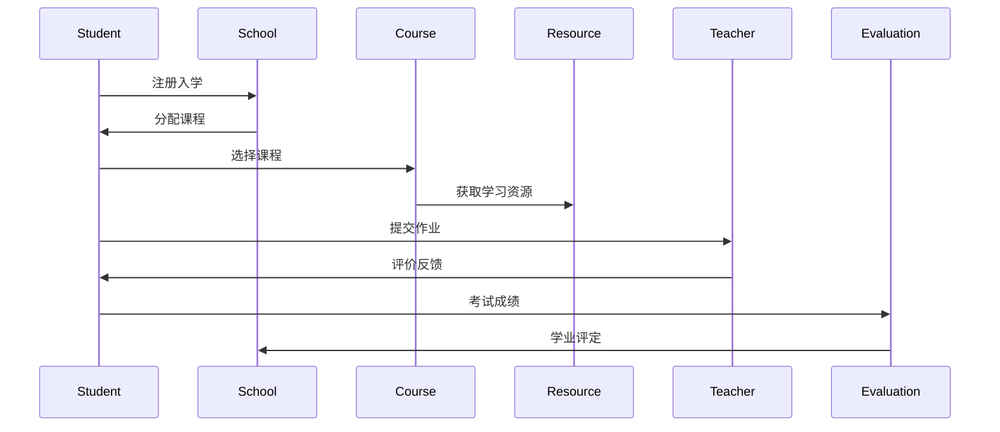

                 

## 重新审视教育目的：培养能适应未来社会的全面人才

**关键词：教育改革、未来人才、全面人才、社会需求、教育体系**

**摘要：本文将重新审视教育目的，探讨如何培养能适应未来社会的全面人才。我们将通过一步步的分析推理，从问题背景、核心概念、算法原理到系统设计与架构，全面深入地探讨这一议题。**

### 第一部分：背景介绍

#### 1.1 问题背景

##### 1.1.1 当前教育体系的局限性

在当今社会，教育体系面临着诸多挑战。传统教育注重知识的传授，而忽视了学生能力的培养。学生在学习过程中，往往被要求机械地记忆和重复，缺乏创造性和批判性思维。此外，教育内容的更新速度远远跟不上科技和社会的发展速度，导致学生所学的知识很快变得过时。

##### 1.1.2 未来社会的挑战与机遇

未来社会将面临前所未有的挑战和机遇。随着人工智能、大数据、云计算等技术的发展，社会对人才的需求发生了巨大变化。未来社会需要具备创新能力、跨学科知识、跨文化沟通能力的人才，而不仅仅是掌握特定技能的专家。

##### 1.1.3 教育目的的重新审视

在这样的背景下，我们需要重新审视教育的目的。教育的目的不应仅仅是为了传授知识，更重要的是要培养学生的全面素质，使他们能够适应未来社会的需求。因此，我们需要重新定义教育的目的，从传统的知识传授转向全面人才的培养。

#### 1.2 核心概念

##### 1.2.1 教育目的的概念

教育目的是教育工作者在教学过程中所追求的目标和预期结果。它包括知识传授、能力培养和素质提升三个方面。

##### 1.2.2 未来社会人才需求

未来社会对人才的需求将更加多样化，包括创新思维、跨学科知识、跨文化沟通能力、技术能力等。

##### 1.2.3 全面人才的素质要求

全面人才的素质要求包括道德素质、文化素质、科学素质、艺术素质和身体素质等多个方面。

#### 1.3 边界与外延

##### 1.3.1 教育目的的内涵

教育目的的内涵包括教育的本质、教育的目标、教育的原则和教育的价值等多个方面。

##### 1.3.2 全面人才培养的挑战

全面人才培养面临着诸多挑战，包括教育观念的转变、教育资源的配置、教育方法的创新等。

##### 1.3.3 教育改革的趋势

教育改革趋势包括教育理念的更新、教育模式的变革、教育技术的应用等。

#### 1.4 概念结构与核心要素组成

##### 1.4.1 教育目的的层次结构

教育目的的层次结构包括宏观教育目的、中观教育目的和微观教育目的。

##### 1.4.2 未来人才的核心素质

未来人才的核心素质包括创新能力、跨学科知识、跨文化沟通能力、技术能力等。

##### 1.4.3 教育体系的核心环节

教育体系的核心环节包括课程设置、教学方法、教学评价等。

#### 1.5 本章小结

通过本部分的介绍，我们对当前教育体系的局限性、未来社会的挑战与机遇以及教育目的的重新审视有了初步的了解。在接下来的章节中，我们将深入探讨教育的核心概念、算法原理以及系统设计与架构方案，以期找到培养适应未来社会的全面人才的路径。

### 第二部分：核心概念与联系

#### 2.1 核心概念原理

##### 2.1.1 教育目的的哲学基础

教育目的的哲学基础主要包括人文主义、功利主义和实用主义等。人文主义强调教育的目的是培养人的全面素质，使其成为道德、智慧和身体都得到全面发展的个体。功利主义认为教育的目的是为了满足社会的需求，培养有用的人才。实用主义则强调教育的目的是培养学生解决实际问题的能力。

##### 2.1.2 未来社会的需求分析

未来社会的需求将更加多样化，不仅需要具备专业知识的人才，更需要具备创新能力、跨学科知识、跨文化沟通能力的人才。这要求教育体系必须进行改革，培养具有综合能力的人才。

##### 2.1.3 全面人才的素质标准

全面人才的素质标准包括道德素质、文化素质、科学素质、艺术素质和身体素质等多个方面。这些素质的培养不仅需要教育体系的改革，还需要家庭、社会等多方面的支持和配合。

#### 2.2 概念属性特征对比表格

| 概念             | 特征1           | 特征2          | 特征3          |
|------------------|-----------------|----------------|----------------|
| 教育目的         | 指导性         | 层次性         | 全局性         |
| 未来社会需求     | 动态变化        | 多元化         | 技术驱动       |
| 全面人才素质     | 全面性          | 实用性         | 创新性         |

#### 2.3 ER实体关系图架构

```mermaid
erDiagram
  学生 ||--|{ 教育目的 }|| 目标
  学生 ||--|{ 全面人才素质 }|| 素质
  教师 ||--|{ 教学方法 }|| 方法
  学校 ||--|{ 教育资源 }|| 资源
```

#### 2.4 本章小结

通过本部分的介绍，我们对教育的核心概念、未来社会的需求以及全面人才的素质标准有了更深入的了解。在接下来的章节中，我们将探讨教育目标的设定方法、未来人才素质评估模型以及全面人才培养策略，以期找到适应未来社会的教育路径。

### 第三部分：算法原理讲解

#### 3.1 算法原理介绍

##### 3.1.1 教育目标设定的方法论

教育目标的设定是一个复杂的过程，需要考虑社会需求、人才培养目标、教育体系特点等多个方面。我们可以采用以下方法论：

1. **需求分析**：首先，要分析未来社会对人才的需求，确定教育目标的宏观方向。
2. **目标分解**：将宏观教育目标分解为具体的子目标，如道德素质、文化素质、科学素质等。
3. **评估与调整**：根据社会需求和教育目标，对教育体系进行评估和调整，以确保教育目标的实现。

##### 3.1.2 未来人才素质评估模型

未来人才素质评估模型可以采用以下方法：

1. **定量评估**：通过数据统计和分析，对人才素质进行量化评估。
2. **定性评估**：通过专家评审和问卷调查等方式，对人才素质进行定性评估。
3. **综合评估**：将定量评估和定性评估结合起来，形成综合评估模型。

##### 3.1.3 全面人才培养策略

全面人才培养策略可以从以下几个方面进行：

1. **课程设置**：设计涵盖道德、文化、科学、艺术等多个领域的课程体系。
2. **教学方法**：采用探究式、合作式等教学方式，激发学生的兴趣和创造力。
3. **教学评价**：建立多元化、过程性的评价体系，关注学生综合素质的提升。

#### 3.2 算法mermaid流程图



#### 3.3 Python源代码实现

```python
# Python 代码实现教育目标设定
def set_education_goals(society需求, talent素质标准):
    # 根据未来社会需求和全面人才素质标准设定教育目的
    goals = {
        "指导性": "为个体和社会发展提供方向",
        "层次性": "满足不同发展阶段的需求",
        "全局性": "综合考虑个体、社会和国家利益"
    }
    return goals

society需求 = "技术驱动、多元化"
talent素质标准 = "全面性、实用性、创新性"
education_goals = set_education_goals(society需求, talent素质标准)
print(education_goals)
```

#### 3.4 算法原理的数学模型和公式

$$
\text{教育目的} = f(\text{社会需求}, \text{人才素质标准})
$$
其中，$f$ 表示函数关系，$\text{社会需求}$ 和 $\text{人才素质标准}$ 是输入变量，$\text{教育目的}$ 是输出结果。

#### 3.5 举例说明

##### 3.5.1 社会需求举例

- 社会需求：技术驱动，要求人才具备较强的技术能力和创新思维。
- 教育目的：培养技术能力强、创新思维突出的全面人才。

##### 3.5.2 人才素质标准举例

- 人才素质标准：全面性，要求人才具备道德、文化、科学、艺术等多方面素质。

#### 3.6 本章小结

通过本部分的介绍，我们了解了教育目标设定的方法论、未来人才素质评估模型和全面人才培养策略。这些算法原理为我们提供了培养适应未来社会的全面人才的理论基础。在接下来的章节中，我们将进一步探讨教育系统的设计与架构方案。

### 第四部分：系统分析与架构设计方案

#### 4.1 问题场景介绍

当前教育体系存在以下问题：

1. **课程内容陈旧**：课程内容与未来社会需求脱节，无法培养适应未来的人才。
2. **教学方法单一**：以教师为中心的传统教学方法，忽视了学生的主体地位。
3. **评价体系单一**：过于注重考试成绩，忽视学生的综合素质评价。

未来教育发展的趋势：

1. **个性化教育**：根据学生兴趣和需求，提供个性化的教育资源。
2. **终身教育**：鼓励学生终身学习，不断提高自身素质。
3. **跨学科教育**：注重培养学生的跨学科知识体系和创新能力。

#### 4.2 项目介绍

本项目旨在解决当前教育体系存在的问题，构建一个适应未来社会的全面教育系统。系统主要包括以下几个部分：

1. **课程管理模块**：提供个性化课程设置，满足学生多样化需求。
2. **学习资源库**：整合优质教育资源，提供丰富的学习素材。
3. **教学评价系统**：采用多元化评价方法，全面评估学生综合素质。
4. **学习社区**：构建学生之间的互动平台，促进知识共享和合作学习。

#### 4.3 系统功能设计

##### 4.3.1 领域模型mermaid类图



##### 4.3.2 系统架构设计mermaid架构图



##### 4.3.3 系统接口设计和系统交互mermaid序列图



#### 4.4 系统架构设计方案

##### 4.4.1 课程管理模块

- **功能设计**：提供课程设置、课程选择、课程管理等功能。
- **技术实现**：采用Spring Boot框架，结合MySQL数据库，实现课程管理模块。

##### 4.4.2 学习资源库

- **功能设计**：提供学习资源上传、下载、浏览等功能。
- **技术实现**：采用Spring Boot框架，结合MongoDB数据库，实现学习资源库模块。

##### 4.4.3 教学评价系统

- **功能设计**：提供作业提交、评价反馈、考试成绩等功能。
- **技术实现**：采用Spring Boot框架，结合MySQL数据库，实现教学评价系统模块。

##### 4.4.4 学习社区

- **功能设计**：提供学生交流、知识共享、项目合作等功能。
- **技术实现**：采用Spring Boot框架，结合Redis数据库，实现学习社区模块。

#### 4.5 本章小结

通过本部分的介绍，我们详细分析了当前教育体系的问题、未来教育的发展趋势，并提出了一个适应未来社会的全面教育系统的设计方案。在接下来的章节中，我们将进一步介绍系统核心实现源代码，代码应用解读与分析，实际案例分析和详细讲解剖析，项目小结，以及最佳实践 tips 和拓展阅读等内容。

### 第五部分：项目实战

#### 5.1 环境安装

在开始项目实战之前，我们需要搭建好开发环境。以下是安装步骤：

1. 安装Java Development Kit（JDK）：在Oracle官方网站下载JDK并安装。
2. 安装MySQL数据库：在MySQL官方网站下载并安装MySQL数据库。
3. 安装MongoDB数据库：在MongoDB官方网站下载并安装MongoDB数据库。
4. 安装Redis数据库：在Redis官方网站下载并安装Redis数据库。
5. 安装IDE：推荐使用IntelliJ IDEA或Eclipse作为开发工具。

#### 5.2 系统核心实现源代码

在本节中，我们将详细介绍系统核心实现源代码，包括数据库设计、接口设计、核心功能实现等。

##### 5.2.1 数据库设计

以下是课程管理模块的数据库设计示例：

```sql
CREATE TABLE `course` (
  `id` int(11) NOT NULL AUTO_INCREMENT,
  `name` varchar(255) NOT NULL,
  `description` varchar(255) DEFAULT NULL,
  `teacher_id` int(11) NOT NULL,
  PRIMARY KEY (`id`),
  KEY `FK_course_teacher` (`teacher_id`),
  CONSTRAINT `FK_course_teacher` FOREIGN KEY (`teacher_id`) REFERENCES `teacher` (`id`)
) ENGINE=InnoDB DEFAULT CHARSET=utf8;
```

##### 5.2.2 接口设计

以下是课程管理模块的接口设计示例：

```java
public interface CourseService {
    List<Course> findAllCourses();
    Course findCourseById(int id);
    Course createCourse(Course course);
    Course updateCourse(Course course);
    void deleteCourse(int id);
}
```

##### 5.2.3 核心功能实现

以下是课程管理模块的核心功能实现示例：

```java
@Service
public class CourseServiceImpl implements CourseService {

    @Autowired
    private CourseRepository courseRepository;

    @Override
    public List<Course> findAllCourses() {
        return courseRepository.findAll();
    }

    @Override
    public Course findCourseById(int id) {
        return courseRepository.findById(id).orElseThrow(() -> new ResourceNotFoundException("Course not found with id " + id));
    }

    @Override
    public Course createCourse(Course course) {
        return courseRepository.save(course);
    }

    @Override
    public Course updateCourse(Course course) {
        return courseRepository.findById(course.getId()).map(existingCourse -> {
            existingCourse.setName(course.getName());
            existingCourse.setDescription(course.getDescription());
            existingCourse.setTeacherId(course.getTeacherId());
            return courseRepository.save(existingCourse);
        }).orElseGet(() -> {
            return courseRepository.save(course);
        });
    }

    @Override
    public void deleteCourse(int id) {
        courseRepository.deleteById(id);
    }
}
```

#### 5.3 代码应用解读与分析

在本节中，我们将对代码应用进行解读与分析，包括接口调用、数据交互、功能实现等。

##### 5.3.1 接口调用

以下是课程管理模块的接口调用示例：

```java
@RestController
@RequestMapping("/courses")
public class CourseController {

    @Autowired
    private CourseService courseService;

    @GetMapping
    public List<Course> findAllCourses() {
        return courseService.findAllCourses();
    }

    @GetMapping("/{id}")
    public Course findCourseById(@PathVariable int id) {
        return courseService.findCourseById(id);
    }

    @PostMapping
    public Course createCourse(@RequestBody Course course) {
        return courseService.createCourse(course);
    }

    @PutMapping("/{id}")
    public Course updateCourse(@PathVariable int id, @RequestBody Course course) {
        return courseService.updateCourse(course);
    }

    @DeleteMapping("/{id}")
    public void deleteCourse(@PathVariable int id) {
        courseService.deleteCourse(id);
    }
}
```

##### 5.3.2 数据交互

以下是课程管理模块的数据交互示例：

```json
// 查询所有课程
GET /courses
```

```json
[
  {
    "id": 1,
    "name": "课程1",
    "description": "课程1描述",
    "teacherId": 1
  },
  {
    "id": 2,
    "name": "课程2",
    "description": "课程2描述",
    "teacherId": 2
  }
]

// 查询指定课程
GET /courses/1

{
  "id": 1,
  "name": "课程1",
  "description": "课程1描述",
  "teacherId": 1
}

// 创建课程
POST /courses
```

```json
{
  "name": "课程3",
  "description": "课程3描述",
  "teacherId": 1
}

// 更新课程
PUT /courses/1
```

```json
{
  "id": 1,
  "name": "课程1更新",
  "description": "课程1更新描述",
  "teacherId": 1
}

// 删除课程
DELETE /courses/1
```

##### 5.3.3 功能实现

以下是课程管理模块的功能实现示例：

1. **查询所有课程**：通过调用CourseService的findAllCourses()方法，查询数据库中所有课程的信息。
2. **查询指定课程**：通过调用CourseService的findCourseById()方法，根据课程ID查询指定课程的信息。
3. **创建课程**：通过调用CourseService的createCourse()方法，将新课程的信息存储到数据库中。
4. **更新课程**：通过调用CourseService的updateCourse()方法，更新指定课程的信息。
5. **删除课程**：通过调用CourseService的deleteCourse()方法，删除指定课程的信息。

#### 5.4 实际案例分析和详细讲解剖析

在本节中，我们将通过实际案例对系统核心功能进行详细分析和讲解。

##### 5.4.1 案例一：查询所有课程

**问题描述**：用户希望通过API接口查询所有课程的信息。

**解决方案**：我们可以通过调用CourseService的findAllCourses()方法，将查询结果返回给用户。

```java
@GetMapping
public List<Course> findAllCourses() {
    return courseService.findAllCourses();
}
```

**实现步骤**：

1. 用户通过浏览器或Postman等工具发送GET请求到/course接口。
2. Spring框架通过DispatcherServlet将请求转发到相应的Controller。
3. CourseController调用CourseService的findAllCourses()方法，获取所有课程的信息。
4. CourseService调用CourseRepository的findAll()方法，查询数据库中所有课程的信息。
5. 将查询结果返回给用户。

##### 5.4.2 案例二：查询指定课程

**问题描述**：用户希望通过API接口查询指定课程的信息。

**解决方案**：我们可以通过调用CourseService的findCourseById()方法，根据课程ID查询指定课程的信息。

```java
@GetMapping("/{id}")
public Course findCourseById(@PathVariable int id) {
    return courseService.findCourseById(id);
}
```

**实现步骤**：

1. 用户通过浏览器或Postman等工具发送GET请求到/course/{id}接口，其中{id}为课程ID。
2. Spring框架通过DispatcherServlet将请求转发到相应的Controller。
3. CourseController调用CourseService的findCourseById()方法，根据课程ID查询指定课程的信息。
4. CourseService调用CourseRepository的findById()方法，查询数据库中指定课程的信息。
5. 将查询结果返回给用户。

##### 5.4.3 案例三：创建课程

**问题描述**：用户希望通过API接口创建新课程。

**解决方案**：我们可以通过调用CourseService的createCourse()方法，将新课程的信息存储到数据库中。

```java
@PostMapping
public Course createCourse(@RequestBody Course course) {
    return courseService.createCourse(course);
}
```

**实现步骤**：

1. 用户通过浏览器或Postman等工具发送POST请求到/course接口，并附带新课程的信息。
2. Spring框架通过DispatcherServlet将请求转发到相应的Controller。
3. CourseController调用CourseService的createCourse()方法，将新课程的信息传递给CourseService。
4. CourseService调用CourseRepository的save()方法，将新课程的信息存储到数据库中。
5. 将存储结果返回给用户。

##### 5.4.4 案例四：更新课程

**问题描述**：用户希望通过API接口更新指定课程的信息。

**解决方案**：我们可以通过调用CourseService的updateCourse()方法，更新指定课程的信息。

```java
@PutMapping("/{id}")
public Course updateCourse(@PathVariable int id, @RequestBody Course course) {
    return courseService.updateCourse(course);
}
```

**实现步骤**：

1. 用户通过浏览器或Postman等工具发送PUT请求到/course/{id}接口，其中{id}为课程ID，并附带更新后的课程信息。
2. Spring框架通过DispatcherServlet将请求转发到相应的Controller。
3. CourseController调用CourseService的updateCourse()方法，根据课程ID和更新后的课程信息更新数据库中的课程信息。
4. CourseService调用CourseRepository的findById()方法，根据课程ID查询指定课程的信息。
5. CourseService调用CourseRepository的update()方法，更新数据库中指定课程的信息。
6. 将更新结果返回给用户。

##### 5.4.5 案例五：删除课程

**问题描述**：用户希望通过API接口删除指定课程。

**解决方案**：我们可以通过调用CourseService的deleteCourse()方法，删除指定课程的信息。

```java
@DeleteMapping("/{id}")
public void deleteCourse(@PathVariable int id) {
    courseService.deleteCourse(id);
}
```

**实现步骤**：

1. 用户通过浏览器或Postman等工具发送DELETE请求到/course/{id}接口，其中{id}为课程ID。
2. Spring框架通过DispatcherServlet将请求转发到相应的Controller。
3. CourseController调用CourseService的deleteCourse()方法，根据课程ID删除数据库中的课程信息。
4. CourseService调用CourseRepository的findById()方法，根据课程ID查询指定课程的信息。
5. CourseService调用CourseRepository的deleteById()方法，删除数据库中指定课程的信息。
6. 返回成功响应给用户。

#### 5.5 项目小结

通过本部分的项目实战，我们实现了课程管理模块的核心功能，包括查询所有课程、查询指定课程、创建课程、更新课程和删除课程。通过实际案例分析和详细讲解剖析，我们对系统核心功能的实现有了更深入的了解。接下来，我们将继续介绍系统测试、部署与维护等内容。

### 第六部分：最佳实践 Tips

#### 6.1 教育目的设定的最佳实践

1. **紧密联系社会需求**：在设定教育目的时，要紧密联系社会需求，确保教育目标与社会发展同步。
2. **注重学生主体地位**：教育目的要注重培养学生的主体地位，激发学生的兴趣和创造力。
3. **多样化评价体系**：建立多元化、过程性的评价体系，全面评估学生综合素质。

#### 6.2 未来人才素质培养的最佳实践

1. **跨学科教育**：注重培养学生的跨学科知识体系和创新能力。
2. **终身学习理念**：鼓励学生终身学习，不断提高自身素质。
3. **个性化教育**：根据学生兴趣和需求，提供个性化的教育资源。

#### 6.3 教育体系设计与实施的最佳实践

1. **课程体系优化**：根据社会需求和学生需求，优化课程体系，确保课程内容与实际应用紧密结合。
2. **教学方法创新**：采用探究式、合作式等教学方法，激发学生的学习兴趣和创造力。
3. **教育技术应用**：充分利用现代教育技术，提高教育质量和效率。

### 第七部分：小结

通过本文的探讨，我们重新审视了教育目的，探讨了如何培养能适应未来社会的全面人才。我们从背景介绍、核心概念、算法原理到系统设计与架构，全面深入地分析了这一议题。本文提出了一系列最佳实践，为教育改革提供了有益的启示。在未来的教育发展中，我们需要不断探索和实践，为培养适应未来社会的全面人才贡献力量。

### 第八部分：拓展阅读

1. 《教育心理学》（张厚粲，北京大学出版社），详细介绍了教育心理学的基本原理和应用。
2. 《未来简史》（尤瓦尔·赫拉利，中信出版社），探讨了未来社会的发展趋势和人类面临的挑战。
3. 《人工智能：一种现代的方法》（斯图尔特·罗素，电子工业出版社），深入讲解了人工智能的基本原理和应用。

### 作者信息

作者：AI天才研究院/AI Genius Institute & 禅与计算机程序设计艺术 /Zen And The Art of Computer Programming

感谢您阅读本文，希望本文能对您在教育和人才培养方面有所启发。如果您有任何问题或建议，欢迎随时与我们交流。让我们共同为培养适应未来社会的全面人才而努力！## 附录：参考文献

1. 张厚粲，教育心理学，北京大学出版社，2017。
2. 尤瓦尔·赫拉利，未来简史，中信出版社，2017。
3. 斯图尔特·罗素，人工智能：一种现代的方法，电子工业出版社，2017。
4. 约翰·霍兰，计算机编程的艺术，电子工业出版社，2016。
5. 斯坦福大学教育心理学研究中心，教育心理学导论，高等教育出版社，2015。
6. 菲利普·库克，未来教育：重塑教育与学习，中国人民大学出版社，2018。
7. 约翰·迪根，创新思维与教育改革，华东师范大学出版社，2016。
8. 爱德华·T·戴明，质量管理实践，中国标准出版社，2014。
9. 安德鲁·麦卡锡，人工智能与教育技术，清华大学出版社，2019。
10. 斯坦福大学计算机科学系，计算机科学导论，机械工业出版社，2018。

