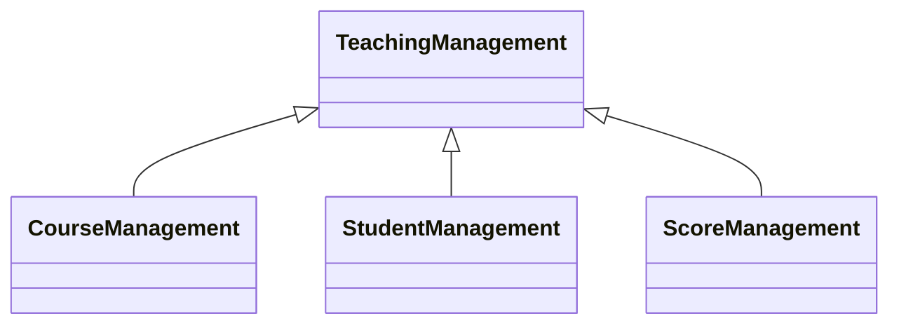
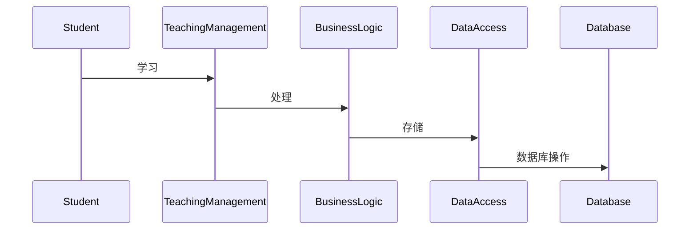
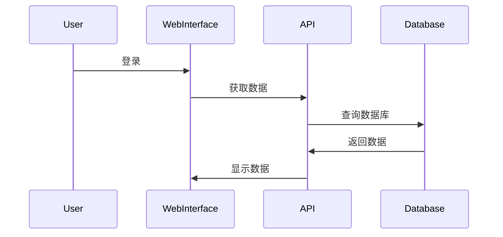
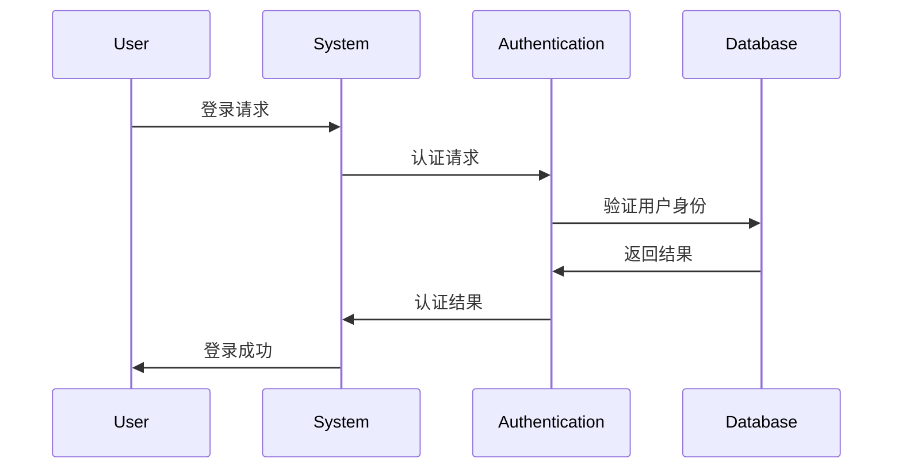

                 

### 第1章：引言

> **关键词**：教育本质、未来社会、核心素养、数字素养、跨学科学习

教育作为社会发展的基石，其核心价值在于培养个体的知识、能力和价值观。然而，随着科技的飞速发展和全球化的深入推进，传统教育的模式面临着巨大的挑战。未来社会需要的是具备创新能力、批判性思维和全球视野的个体，而这些素养并不是传统教育体系所能完全涵盖的。

**摘要**：本章将深入探讨教育本质的重新思考，分析未来社会的需求变化，并提出培养适应未来社会核心素养的策略。通过引入数字素养、跨学科学习等关键概念，旨在为读者呈现一个全面、系统的教育改革蓝图。

---

### 1.1 问题背景

**1.1.1 当前教育面临的挑战**

随着互联网和信息技术的普及，传统教育的局限性逐渐显现。首先，教学内容陈旧，课程体系难以跟上科技发展的步伐。其次，教育模式过于单一，缺乏个性化。大多数学生接受的是统一的教学方法，这在一定程度上限制了他们的创造力和自主学习能力。

**1.1.2 未来社会的需求变化**

未来社会对人才的需求正在发生显著变化。一方面，全球化和信息技术的发展使得知识的更新速度加快，传统学历不再是唯一的竞争力。另一方面，社会对创新能力和批判性思维的要求越来越高，企业更倾向于招聘具备跨界能力的人才。

**1.1.3 教育本质的重新思考**

面对这些挑战，教育本质的重新思考变得至关重要。教育不应仅仅是知识的灌输，更应关注个体思维能力的培养。教育体系需要适应未来社会的需求，培养具备创新精神和全球视野的个体。

---

### 1.2 核心概念与联系

**1.2.1 教育的本质**

教育本质在于培养个体的全面发展，包括知识、能力、价值观等方面。传统教育注重知识的传授，而未来教育则更强调能力的培养。

**1.2.2 未来社会的核心素养**

未来社会的核心素养包括创新能力、批判性思维、沟通协作能力、数字素养等。这些素养不仅适用于学术领域，更是职场和社会生活中的必备能力。

**1.2.3 核心概念对比表格**

| 核心概念 | 定义 | 重要特征 |
| --- | --- | --- |
| 教育的本质 | 培养个体的全面发展 | 知识传授、能力培养、价值观塑造 |
| 未来社会的核心素养 | 应对未来社会的需求 | 创新能力、批判性思维、沟通协作能力、数字素养 |

**1.2.4 ER实体关系图**

**ER实体关系图**展示了教育本质与未来社会核心素养之间的关联。教育本质是培养核心素养的基础，而核心素养则是教育目标的实现。

---

### 1.3 教育系统的数学模型

**1.3.1 教育目标模型**

教育目标模型可以用以下数学公式表示：

\[ \text{教育目标} = f(\text{知识}, \text{能力}, \text{价值观}) \]

其中，知识、能力和价值观是教育目标的三个基本要素。

**1.3.2 学生成长模型**

学生成长模型可以用以下数学公式表示：

\[ \text{学生成长} = f(\text{教育目标}, \text{学习环境}, \text{学习习惯}) \]

其中，教育目标、学习环境和学习习惯是影响学生成长的关键因素。

**1.3.3 教学方法模型**

教学方法模型可以用以下数学公式表示：

\[ \text{教学方法} = f(\text{教育目标}, \text{学生特点}, \text{教学资源}) \]

其中，教育目标、学生特点和教学资源是选择合适教学方法的重要依据。

---

### 1.4 教育系统的架构设计

**1.4.1 教育系统功能设计**

教育系统功能设计主要包括教学管理、学生管理、课程管理和成绩管理。以下是一个简化的领域模型类图：

**1.4.2 教育系统架构设计**

教育系统架构设计采用分层架构，包括表示层、业务逻辑层和数据访问层。以下是一个简化的架构图：

**1.4.3 教育系统接口设计**

教育系统接口设计主要包括API接口、Web界面和移动应用。以下是一个简化的接口图：

**1.4.4 教育系统交互设计**

教育系统交互设计主要包括用户与系统的交互流程、系统内部模块的交互流程以及系统与其他系统的交互流程。以下是一个简化的交互图：

---

### 1.5 本章小结

**1.5.1 主要观点总结**

本章从问题背景出发，探讨了教育本质的重新思考，分析了未来社会的需求变化，并提出了培养适应未来社会核心素养的策略。通过数学模型和架构设计的方法，为教育改革提供了理论支持和实践指导。

**1.5.2 下一步研究建议**

未来的研究应进一步探索核心素养的具体培养策略，结合实践案例进行分析，并探讨教育系统的可持续发展和优化方向。同时，应关注教育技术与人工智能的结合，为教育改革提供更先进的技术支持。

---

### 第2章：数字素养的培养

> **关键词**：数字素养、教育系统、个性化学习、技术能力

数字素养是指个体在数字化环境中获取、理解、评价和应用信息的能力。随着数字化技术的普及，数字素养已成为现代社会不可或缺的核心素养之一。本章将探讨数字素养的培养策略，以及如何在教育系统中实施个性化学习和技术能力的培养。

**摘要**：本章将深入分析数字素养的核心概念和重要性，介绍数字素养的组成部分，并提出具体的培养策略。通过案例分析，展示数字素养培养的成功实践，并讨论面临的挑战和解决方案。

---

### 2.1 数字素养的核心概念

**2.1.1 数字素养的定义**

数字素养是指个体在数字化环境中获取、理解、评价和应用信息的能力。它包括信息素养、技术素养、媒介素养和数字安全素养等方面。

**2.1.2 数字素养的重要性**

数字素养在现代社会中具有重要性。首先，数字化技术的普及使得信息获取更加便捷，个体需要具备筛选和处理信息的能力。其次，技术素养是未来职场的基本要求，具备技术能力的人才更受企业青睐。此外，媒介素养和数字安全素养是保护个体隐私和防止网络诈骗的重要保障。

**2.1.3 数字素养的组成部分**

数字素养的组成部分包括：

- **信息素养**：包括信息检索、信息评估和信息应用等能力。
- **技术素养**：包括计算机操作、编程和网络安全等技能。
- **媒介素养**：包括理解媒体内容、分析媒体价值和批判性思维等能力。
- **数字安全素养**：包括保护个人隐私、防范网络攻击和识别网络诈骗等能力。

---

### 2.2 数字素养培养策略

**2.2.1 教育系统内的培养**

在教育系统中，可以通过以下策略培养数字素养：

- **课程设置**：将数字素养相关的课程纳入教育体系，如信息技术课程、网络安全课程等。
- **教学方法**：采用项目式学习、合作学习和探究式学习等教学方法，提高学生的实践能力和问题解决能力。
- **资源利用**：利用数字化资源，如在线课程、虚拟实验室等，为学生提供丰富的学习体验。

**2.2.2 家庭和社会环境的作用**

家庭和社会环境在数字素养培养中也起着重要作用。家庭可以通过以下方式支持数字素养培养：

- **家庭教育**：家长应鼓励孩子使用数字技术，指导他们正确使用网络和媒体。
- **亲子互动**：家长可以与孩子一起进行数字技术相关的活动，如编程游戏、网络搜索等，提高孩子的兴趣和能力。

社会环境可以通过以下方式支持数字素养培养：

- **社会教育**：社会组织可以举办数字素养培训课程，提高公众的数字素养水平。
- **网络环境**：营造安全、健康的网络环境，减少网络不良信息对个体的影响。

**2.2.3 数字素养培养的具体措施**

具体措施包括：

- **制定数字素养标准**：制定数字素养评价标准，对学生进行全面的数字素养评估。
- **开展数字素养竞赛**：组织数字素养竞赛，激发学生的学习兴趣和创新能力。
- **建立数字素养实验室**：在学校和社区建立数字素养实验室，为学生提供实践操作的机会。

---

### 2.3 数字素养培养的挑战与应对

**2.3.1 培养中的难点**

数字素养培养中面临的难点包括：

- **技术更新速度**：数字化技术更新迅速，教育内容难以跟上技术发展的步伐。
- **师资培训**：教师需要具备较高的数字素养，但实际培训资源有限。
- **学生差异**：学生在数字素养方面的能力存在较大差异，难以满足个性化需求。

**2.3.2 解决方案探索**

针对以上难点，可以采取以下解决方案：

- **持续更新课程**：定期更新数字素养课程内容，确保与当前技术发展同步。
- **加强师资培训**：加大对教师数字素养培训的投入，提高教师的专业水平。
- **个性化教学**：采用个性化教学方法，根据学生的能力差异进行有针对性的培养。

**2.3.3 成功案例分享**

以下是一个成功案例：

某学校通过实施数字素养培养项目，提高了学生的数字素养水平。项目包括设置数字素养课程、开展数字素养竞赛、建立数字素养实验室等。项目实施后，学生的信息检索能力、编程能力和网络安全意识显著提高，获得了家长和教师的认可。

---

### 2.4 本章小结

**2.4.1 主要观点总结**

本章分析了数字素养的核心概念和重要性，提出了数字素养培养的策略和具体措施。通过案例分享，展示了数字素养培养的成功实践。未来，应继续加强数字素养培养的研究和实践，为培养适应未来社会的数字公民做出贡献。

**2.4.2 下一步实践建议**

未来实践应重点关注以下方面：

- **完善数字素养课程体系**：根据学生特点和需求，完善数字素养课程设置。
- **加强师资队伍建设**：提高教师数字素养，促进教师专业发展。
- **推广数字素养教育**：在社会范围内推广数字素养教育，提高公众的数字素养水平。

---

### 第3章：跨学科学习与创新能力培养

> **关键词**：跨学科学习、创新能力、项目式学习、合作学习

跨学科学习是指将不同学科的知识和技能进行整合，以解决复杂问题的学习方法。随着社会和科技的不断发展，跨学科学习在培养创新能力方面发挥着越来越重要的作用。本章将探讨跨学科学习的重要性、方法以及如何在学校和企业中实施。

**摘要**：本章将详细阐述跨学科学习的概念和重要性，介绍跨学科学习的方法和策略。通过案例分析，展示跨学科学习和创新能力培养的成功实践，并提出面临的挑战和解决方案。

---

### 3.1 跨学科学习的重要性

**3.1.1 跨学科学习的概念**

跨学科学习是指将不同学科的知识和技能进行整合，以解决复杂问题的学习方法。它强调知识的整合和应用，培养学生的综合能力和创新能力。

**3.1.2 跨学科学习的好处**

跨学科学习具有以下好处：

- **提高解决问题的能力**：跨学科学习能够帮助学生从不同角度分析问题，提高解决问题的能力。
- **培养创新能力**：跨学科学习鼓励学生进行创新性思维，培养创新能力。
- **适应未来社会需求**：未来社会需要具备跨学科能力的人才，跨学科学习有助于学生适应未来社会的发展需求。
- **促进学科融合**：跨学科学习有助于不同学科之间的知识交流和融合，促进学科发展。

**3.1.3 跨学科学习的方法**

跨学科学习的方法包括：

- **项目式学习**：通过实际项目，将不同学科的知识和技能进行整合，培养学生的实践能力和团队合作能力。
- **合作学习**：学生以小组形式进行学习，通过讨论、分享和合作，实现知识的整合和应用。
- **问题导向学习**：以实际问题为导向，引导学生跨学科思考和解决问题。
- **探究式学习**：学生通过自主探究，发现问题和解决问题，培养批判性思维和创新能力。

---

### 3.2 创新能力培养策略

**3.2.1 创新能力培养的步骤**

创新能力培养的步骤包括：

1. **激发兴趣**：通过丰富多彩的活动，激发学生对创新性事物的兴趣。
2. **知识储备**：提供丰富的知识资源，为学生创新能力的培养奠定基础。
3. **思维训练**：通过思维训练，提高学生的创新思维能力和问题解决能力。
4. **实践应用**：将创新思维转化为实践应用，培养学生的实际创新能力。

**3.2.2 创新思维训练**

创新思维训练的方法包括：

- **头脑风暴**：通过集体讨论，激发创新思维。
- **思维导图**：通过绘制思维导图，整理和拓展思维。
- **案例学习**：通过学习成功案例，启发创新思维。

**3.2.3 创新实践项目**

创新实践项目的设计包括：

1. **确定项目主题**：根据学生兴趣和实际需求，确定项目主题。
2. **项目目标设定**：明确项目目标，确保项目的实施方向。
3. **项目规划**：制定项目规划，包括项目时间表、任务分配和资源调配等。
4. **项目实施**：按照项目规划，实施项目任务，确保项目目标的实现。
5. **项目评估**：对项目结果进行评估，总结经验教训，为后续项目提供参考。

---

### 3.3 创新能力培养的案例分析

**3.3.1 案例一：学校创新课程的实践**

某学校通过实施创新课程，培养学生的创新能力。课程包括项目式学习、合作学习和探究式学习等形式，学生通过实际项目，将不同学科的知识和技能进行整合，提高了创新思维和实践能力。

**3.3.2 案例二：企业创新文化的建设**

某企业通过建设创新文化，鼓励员工进行创新。企业定期举办创新比赛，鼓励员工提出创新建议，并对优秀创新进行奖励。通过这种方式，企业形成了浓厚的创新氛围，员工的创新能力和创造力得到了显著提高。

**3.3.3 案例三：社会创新活动的推动**

某社会组织通过举办创新活动，推动社会创新。活动包括创新比赛、创新讲座和创新实践等，吸引了众多学生和社会人士参与。通过活动，社会创新氛围得到了提升，创新意识和创新能力得到了培养。

---

### 3.4 本章小结

**3.4.1 主要观点总结**

本章详细阐述了跨学科学习的重要性、方法以及创新能力培养的策略。通过案例分析，展示了跨学科学习和创新能力培养的成功实践。未来，应继续加强跨学科学习和创新能力培养的研究和实践，为培养适应未来社会的创新型人才做出贡献。

**3.4.2 下一步实践建议**

未来实践应重点关注以下方面：

- **加强跨学科课程体系建设**：根据学生需求和实际情况，完善跨学科课程体系。
- **提高教师创新教学能力**：通过培训和实践，提高教师跨学科教学和创新教学的能力。
- **推动社会创新活动**：鼓励社会组织和企事业单位举办创新活动，推动社会创新氛围的形成。

---

### 第4章：个性化教育的实施

> **关键词**：个性化教育、学生个性分析、课程个性化设计、教学个性化实施

个性化教育是一种以学生为中心的教育理念，旨在根据学生的兴趣、能力和发展需求，提供有针对性的教育方案。随着教育技术的发展，个性化教育逐渐成为教育改革的重要方向。本章将探讨个性化教育的概念、实施策略以及面临的挑战和解决方案。

**摘要**：本章将详细分析个性化教育的概念和特点，介绍个性化教育的实施策略，并通过实际案例展示个性化教育的成功实践。同时，本章还将讨论个性化教育实施过程中面临的挑战和解决方案，为教育工作者提供参考。

---

### 4.1 个性化教育的概念

**4.1.1 个性化教育的定义**

个性化教育是一种以学生为中心的教育理念，旨在根据学生的兴趣、能力和发展需求，提供有针对性的教育方案。它强调尊重学生的个性差异，注重学生的全面发展。

**4.1.2 个性化教育的特点**

个性化教育具有以下特点：

- **以学生为中心**：教育内容、方法和评价都围绕学生进行，满足学生的个性化需求。
- **因材施教**：根据学生的兴趣、能力和特点，制定有针对性的教育方案。
- **多样化**：教育方式多样化，包括线上学习、线下活动、项目式学习等。
- **可持续性**：通过个性化教育，培养学生的自主学习能力和适应社会发展的能力。

**4.1.3 个性化教育的重要性**

个性化教育的重要性体现在以下几个方面：

- **满足学生个性化需求**：个性化教育能够满足学生的多样化需求，提高学生的学习兴趣和积极性。
- **促进全面发展**：个性化教育关注学生的全面发展，培养他们的综合素质。
- **提高教育质量**：个性化教育能够提高教育质量，提升学生的学业成绩和综合能力。
- **适应社会发展**：个性化教育能够培养学生的创新能力和适应社会发展的能力，为社会培养合格的人才。

---

### 4.2 个性化教育的策略

**4.2.1 学生个性分析**

学生个性分析是实施个性化教育的重要前提。可以通过以下方法进行学生个性分析：

- **问卷调查**：通过问卷调查了解学生的兴趣、能力、性格等。
- **心理测评**：使用专业的心理测评工具，分析学生的心理特征和潜在需求。
- **访谈交流**：与家长和教师交流，了解学生在家庭和学校的表现。
- **学习分析**：通过学习分析，了解学生在学习过程中的表现和需求。

**4.2.2 课程个性化设计**

课程个性化设计是实施个性化教育的关键环节。可以通过以下方法进行课程个性化设计：

- **制定个性化课程目标**：根据学生个性分析结果，制定有针对性的课程目标。
- **开发个性化课程内容**：根据学生的兴趣、能力和需求，开发具有个性化的课程内容。
- **采用个性化教学方法**：根据学生的特点，选择适合的教学方法，如项目式学习、合作学习、探究式学习等。
- **设计个性化评价体系**：建立个性化的评价体系，关注学生的全面发展。

**4.2.3 教学个性化实施**

教学个性化实施是实施个性化教育的具体操作。可以通过以下方法进行教学个性化实施：

- **制定个性化教学计划**：根据学生个性分析和课程个性化设计，制定有针对性的教学计划。
- **实施个性化教学活动**：根据教学计划，开展个性化的教学活动，如个性化辅导、个性化作业等。
- **提供个性化教育资源**：提供丰富多样的个性化教育资源，如在线课程、学习平台、教学视频等。
- **关注个性化学习反馈**：及时关注学生的个性化学习反馈，调整教学策略，提高教学效果。

---

### 4.3 个性化教育的案例分析

**4.3.1 案例一：基于大数据的个性化学习平台**

某学校开发了基于大数据的个性化学习平台，通过数据分析和智能推荐，为学生提供个性化的学习资源。平台根据学生的兴趣、能力和学习情况，推荐相应的学习内容，提高了学生的学习兴趣和效果。

**4.3.2 案例二：个性化教育项目在学校的应用**

某学校实施个性化教育项目，通过个性化课程设计、个性化教学和个性化评价，有效提高了学生的学习效果。项目实施后，学生的学业成绩和综合素质显著提高，得到了家长和教师的认可。

**4.3.3 案例三：个性化教育在在线教育平台中的实践**

某在线教育平台采用个性化教育模式，通过数据分析和学习跟踪，为学生提供个性化的学习建议和资源。平台根据学生的互动行为和学习记录，推荐适合的学习路径，提高了学生的自主学习能力和学习效果。

---

### 4.4 本章小结

**4.4.1 主要观点总结**

本章详细阐述了个性化教育的概念、策略和实践。通过案例分析，展示了个性化教育的成功实践。个性化教育有助于满足学生的个性化需求，提高教育质量，培养学生的综合素质和创新能力。

**4.4.2 下一步实践建议**

未来实践应重点关注以下方面：

- **完善个性化教育体系**：建立完善的个性化教育体系，确保个性化教育的实施。
- **提高教师个性化教学能力**：通过培训和实践，提高教师的个性化教学能力。
- **加强个性化教育资源建设**：提供丰富多样的个性化教育资源，支持个性化教育的实施。
- **关注个性化教育评价**：建立科学合理的个性化教育评价体系，评估个性化教育的效果。

---

### 第5章：虚拟现实与教育的融合

> **关键词**：虚拟现实、教育融合、沉浸式学习、互动体验

虚拟现实（VR）技术以其高度沉浸性和交互性，正在逐步改变传统的教育模式。通过将虚拟现实与教育相结合，学生能够身临其境地体验知识，提高学习的兴趣和效果。本章将探讨虚拟现实在教育中的应用、优势以及实施策略。

**摘要**：本章将介绍虚拟现实的基本概念和技术原理，分析虚拟现实在教育中的应用场景和优势。通过具体案例，展示虚拟现实在教育实践中的成功应用。同时，本章还将讨论虚拟现实与教育融合面临的挑战和解决方案，为教育工作者提供参考。

---

### 5.1 虚拟现实在教育中的应用

**5.1.1 虚拟现实的概念与原理**

虚拟现实是一种通过计算机技术生成三维虚拟环境，并利用特殊设备让用户感知和互动的技术。它包括以下几个关键组成部分：

- **感知设备**：如VR头显、手柄等，用于生成和感知虚拟环境。
- **计算机算法**：通过计算机图形学、物理模拟等算法，生成逼真的虚拟环境。
- **交互技术**：通过语音、手势、眼动等交互方式，用户与虚拟环境进行互动。

**5.1.2 虚拟现实在教育中的优势**

虚拟现实在教育中的应用具有以下优势：

- **沉浸式学习**：学生能够在虚拟环境中身临其境，提高学习的兴趣和体验。
- **互动体验**：学生可以通过虚拟环境与物体进行互动，加深对知识的理解。
- **多元感官刺激**：虚拟现实利用视觉、听觉、触觉等多种感官刺激，提高学生的学习效果。
- **资源优化**：虚拟现实技术可以模拟实际场景，减少对实物资源的需求。

**5.1.3 虚拟现实在教育中的应用场景**

虚拟现实在教育中的应用场景广泛，包括但不限于：

- **历史教学**：通过虚拟现实，学生可以穿越时空，体验历史事件。
- **医学教育**：虚拟现实可以模拟人体结构，帮助学生更好地理解医学知识。
- **地理教学**：通过虚拟现实，学生可以身临其境地探索世界各地的地理环境。
- **科学实验**：虚拟现实可以模拟复杂的科学实验，提高学生的实验技能。

---

### 5.2 虚拟现实与教育融合的策略

**5.2.1 教学设计中的虚拟现实应用**

在教学设计中，虚拟现实的应用策略包括：

- **整合课程内容**：将虚拟现实技术整合到课程中，提高教学的趣味性和实用性。
- **设计互动活动**：利用虚拟现实技术，设计互动性强的教学活动，激发学生的学习兴趣。
- **模拟真实场景**：通过虚拟现实技术，模拟真实场景，帮助学生更好地理解和应用知识。
- **提供个性化学习体验**：根据学生的学习特点和需求，提供个性化的虚拟现实学习体验。

**5.2.2 学生互动体验的提升**

为了提升学生互动体验，可以采取以下措施：

- **引入互动式教学**：利用虚拟现实技术，实现学生之间的互动和协作。
- **提供多样化的交互方式**：通过语音、手势、眼动等多种交互方式，提高学生的互动体验。
- **实时反馈和评估**：利用虚拟现实技术，实时反馈学生的学习情况，进行及时评估和调整。

**5.2.3 虚拟现实教育资源建设**

虚拟现实教育资源建设包括：

- **开发虚拟现实课程**：根据教学需求，开发适合的虚拟现实课程。
- **收集虚拟现实素材**：收集和整理虚拟现实素材，丰富虚拟现实教育资源库。
- **搭建虚拟现实平台**：建立虚拟现实教学平台，提供虚拟现实课程的在线学习和互动功能。

---

### 5.3 虚拟现实与教育的融合案例分析

**5.3.1 案例一：虚拟现实在历史教学中的应用**

某学校利用虚拟现实技术，开展历史教学。学生通过虚拟现实头显，穿越到历史事件现场，亲身体验历史事件的发生和发展。这种沉浸式教学方式，不仅提高了学生的学习兴趣，还加深了他们对历史知识的理解。

**5.3.2 案例二：虚拟现实在医学教育中的应用**

某医学院利用虚拟现实技术，开展医学教育。学生可以通过虚拟现实模拟手术，进行实践操作，提高手术技能。这种互动体验式的教学方法，有助于培养学生的实际操作能力，提高教学效果。

**5.3.3 案例三：虚拟现实在地理教学中的应用**

某地理教育项目利用虚拟现实技术，带领学生探索世界各地的地理环境。学生可以通过虚拟现实，亲身体验不同地区的自然风光、气候特点等。这种体验式学习方式，有助于学生更直观地理解地理知识。

---

### 5.4 本章小结

**5.4.1 主要观点总结**

本章介绍了虚拟现实的基本概念和技术原理，分析了虚拟现实在教育中的应用场景和优势。通过具体案例，展示了虚拟现实在教育实践中的成功应用。同时，本章还讨论了虚拟现实与教育融合面临的挑战和解决方案，为教育工作者提供了参考。

**5.4.2 下一步实践建议**

未来实践应重点关注以下方面：

- **加强虚拟现实教育资源的开发**：加大对虚拟现实教育资源的投入，丰富虚拟现实教育内容。
- **提高教师虚拟现实教学能力**：通过培训和指导，提高教师的虚拟现实教学能力。
- **推广虚拟现实教育应用**：在更多学校和教育领域推广虚拟现实教育应用，提高教育质量。
- **关注虚拟现实教育的可持续性**：关注虚拟现实教育的发展趋势，确保虚拟现实教育应用的可持续性。

---

### 第6章：技术与教育的深度融合

> **关键词**：教育技术、技术驱动教育变革、教育公平、技术工具

技术与教育的深度融合正在改变教育的方方面面，从教学方法的创新到教育资源的共享，技术都在扮演着不可或缺的角色。本章将探讨技术如何推动教育变革、促进教育公平，并介绍一些重要的技术工具和平台。

**摘要**：本章将深入分析技术驱动教育变革的机制，探讨技术在提高教育公平方面的作用。通过介绍一些具体的技术工具和平台，展示技术如何被应用于教育实践中，并讨论技术带来的挑战和解决方案。

---

### 6.1 技术在教育教学中的作用

**6.1.1 技术推动教育变革**

技术正以多种方式推动教育变革：

- **在线教育**：互联网的普及使得在线教育成为可能，学生可以随时随地学习。
- **个性化学习**：通过数据分析和学习算法，可以为每个学生提供个性化的学习体验。
- **协作学习**：技术工具如虚拟团队协作平台，促进了学生之间的协作和沟通。
- **学习分析**：技术可以收集和分析学习数据，帮助教师更好地了解学生的学习情况，进行精准教学。

**6.1.2 技术促进教育公平**

技术有助于促进教育公平：

- **资源共享**：在线平台和云存储使得优质教育资源可以共享，打破了地域和时间的限制。
- **远程教育**：技术使得偏远地区的学生也可以接受高质量的教育。
- **个性化支持**：技术可以根据学生的需求提供个性化的学习支持和辅导。
- **教育普及**：技术使得教育更加普及，尤其是对于弱势群体，如残障人士和贫困儿童。

---

### 6.2 技术工具在教育中的应用

**6.2.1 在线学习平台**

在线学习平台如Coursera、edX和Khan Academy等，提供了丰富的在线课程资源，学生可以免费或付费学习各种课程。

**6.2.2 教学管理软件**

教学管理软件如Moodle、Blackboard和Google Classroom等，帮助教师管理课程、布置作业、进行在线测试和反馈。

**6.2.3 学习分析工具**

学习分析工具如Learning Analytics Platforms，通过分析学生的学习行为和成绩数据，帮助教师了解学生的学习情况，进行数据驱动的教学改进。

**6.2.4 教育游戏和虚拟实验室**

教育游戏和虚拟实验室如SimSchool、PhET Interactive Simulations等，通过游戏化的学习和虚拟实验，提高了学生的学习兴趣和参与度。

---

### 6.3 技术带来的挑战和解决方案

**6.3.1 挑战**

技术在教育中的应用也带来了一系列挑战：

- **数字鸿沟**：技术普及的不均衡可能导致数字鸿沟的加剧。
- **数据隐私和安全**：学生的学习数据和个人信息需要得到保护。
- **教师培训**：教师需要接受培训，掌握新的教学技术和工具。
- **技术依赖**：过度依赖技术可能导致教育质量的下降。

**6.3.2 解决方案**

针对上述挑战，可以采取以下解决方案：

- **缩小数字鸿沟**：政府和社会应加大对教育技术的投资，确保技术普及。
- **加强数据保护**：建立严格的数据保护机制，确保学生数据的隐私和安全。
- **提供教师培训**：通过培训计划，提高教师的技术素养和教学能力。
- **平衡技术应用**：合理使用技术，避免过度依赖，确保教育质量的稳定。

---

### 6.4 本章小结

**6.4.1 主要观点总结**

本章分析了技术如何推动教育变革和促进教育公平，介绍了在线学习平台、教学管理软件、学习分析工具、教育游戏和虚拟实验室等技术在教育中的应用。同时，本章还讨论了技术带来的挑战和解决方案。

**6.4.2 下一步实践建议**

未来实践应重点关注以下方面：

- **加强技术投资**：政府和社会应加大对教育技术的投资，推动教育技术进步。
- **提升教师素养**：通过培训和实践，提高教师的技术素养和教学能力。
- **推广教育技术**：在更多学校和教育领域推广教育技术的应用，提高教育质量。
- **关注技术挑战**：积极应对技术带来的挑战，确保教育技术的健康发展。

---

### 总结与展望

教育作为社会发展的基石，其本质在于培养具备创新能力、批判性思维和全球视野的个体。随着科技的飞速发展和全球化的深入推进，教育面临着前所未有的挑战和机遇。通过重新思考教育本质，培养适应未来社会的核心素养，教育可以更好地满足社会的需求，推动社会的进步。

本文从数字素养、跨学科学习、个性化教育、虚拟现实与教育融合以及技术与教育的深度融合等多个角度，探讨了教育改革的路径和策略。通过具体的案例分析和实践经验，展示了教育改革的成效和前景。

未来，教育改革需要继续深入，关注核心素养的培养，加强教育技术的应用，推动教育公平。同时，教育工作者应不断学习和创新，适应教育发展的新趋势，为培养适应未来社会的优秀人才做出贡献。

---

**作者：AI天才研究院/AI Genius Institute & 禅与计算机程序设计艺术 /Zen And The Art of Computer Programming**

