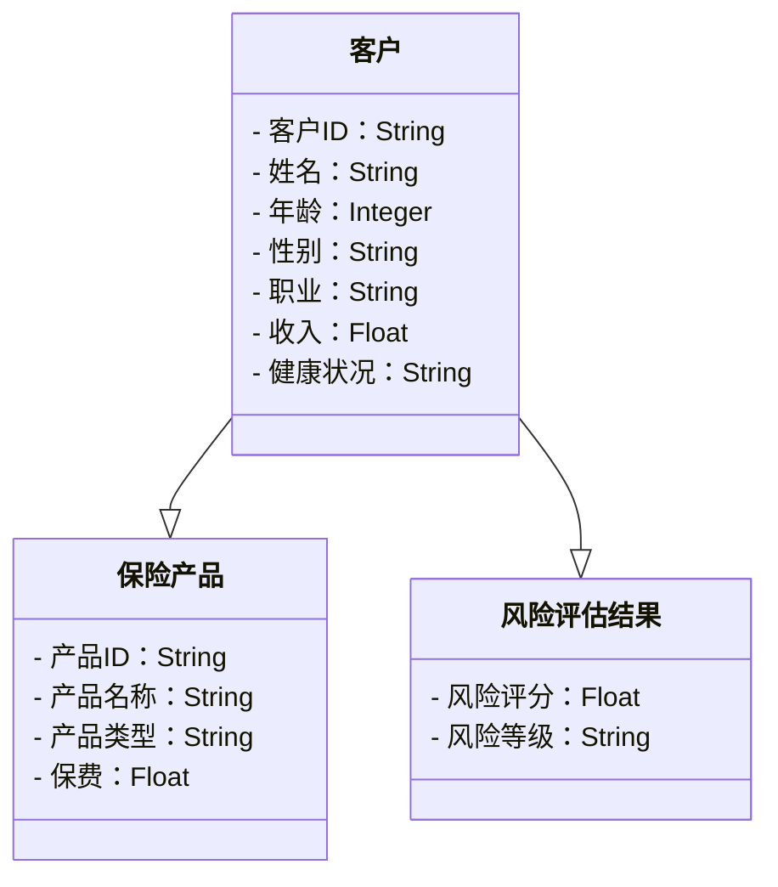
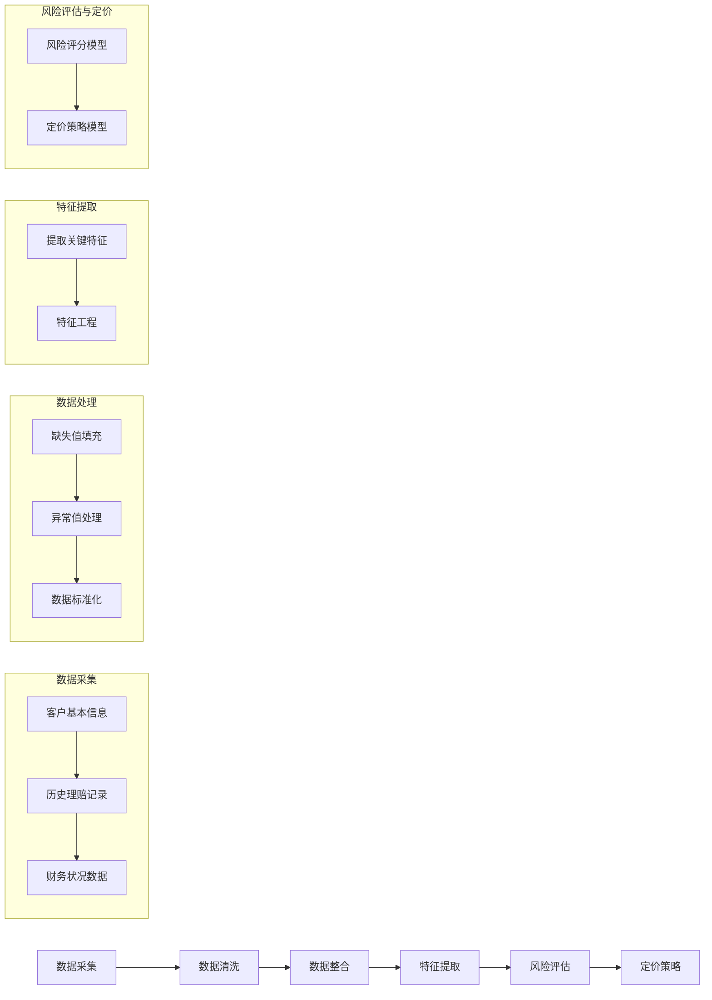
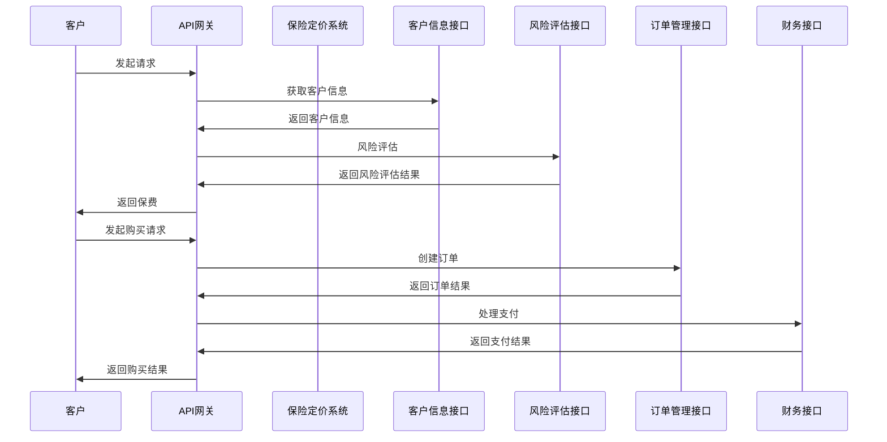

                 

### AI在保险定价个性化中的创新应用

随着人工智能（AI）技术的快速发展，其在各个行业的应用也日益广泛。保险行业作为金融领域的重要组成部分，面临着日益复杂的运营环境和市场需求。个性化保险定价作为提升客户满意度和竞争力的关键因素，正逐渐成为行业的热点。本文将深入探讨AI在保险定价个性化中的创新应用，旨在为读者提供一个全面、系统的理解和实际应用的指导。

#### 关键词：人工智能、保险定价、个性化、机器学习、深度学习

##### 摘要：

本文首先介绍了保险行业的发展背景，阐述了AI技术崛起对保险行业的影响。随后，我们探讨了个性化保险定价的重要性，以及AI在实现这一目标中的关键作用。接着，本文详细分析了AI在保险定价个性化中的应用算法，包括机器学习、深度学习和数据挖掘等。在此基础上，我们介绍了系统分析与架构设计的方法，并通过实际案例展示了如何应用这些算法和设计来构建一个保险定价个性化系统。最后，本文总结了最佳实践、注意事项和拓展阅读资源，为读者提供了深入学习的途径。

### 目录大纲设计思路

在设计《AI在保险定价个性化中的创新应用》的目录大纲时，我们的目标是确保整个大纲结构清晰、逻辑性强，能够让读者对书籍的内容有一个全面的把握。以下是详细的目录大纲设计思路：

1. **背景介绍**：首先，我们需要对AI在保险行业中的背景进行介绍，包括保险定价个性化的重要性和当前市场现状。这部分将作为引子，让读者了解为何这本书会聚焦于AI在保险定价中的应用。

2. **核心概念与联系**：接下来，我们将介绍与AI在保险定价个性化相关的重要概念，如机器学习、深度学习、数据挖掘等。通过对比表格和ER实体关系图，帮助读者理解这些概念之间的关系。

3. **算法原理讲解**：在了解了基本概念后，我们将深入探讨AI在保险定价中的应用算法原理。使用mermaid流程图展示算法流程，并结合Python代码详细阐述算法的数学模型和公式。这部分内容将是书籍的核心，需要深入浅出地进行讲解。

4. **数学模型和数学公式**：我们将使用LaTeX格式来表示复杂的数学模型和公式，确保内容的准确性和可读性。这部分内容将通过独立段落进行呈现，以便读者能够清晰地理解和掌握。

5. **系统分析与架构设计方案**：接下来，我们将介绍一个具体的保险定价个性化系统分析与架构设计方案。包括问题场景介绍、项目介绍、系统功能设计、系统架构设计、系统接口设计和系统交互等内容，通过mermaid工具进行图形化展示。

6. **项目实战**：在理论讲解之后，我们将通过一个实际案例展示如何应用这些算法和设计来构建一个保险定价个性化系统。这部分内容将包括环境安装、系统核心实现源代码，以及代码应用解读与分析。

7. **最佳实践 tips、小结、注意事项、拓展阅读**：最后，我们将总结书中的关键知识点，给出最佳实践建议，提醒读者注意事项，并提供拓展阅读资源，帮助读者进一步深入学习。

通过以上设计思路，我们能够确保目录大纲既具备完整性，又能够引导读者逐步深入理解AI在保险定价个性化中的创新应用。

### 完整目录大纲

```
# 第一部分: AI在保险行业中的应用背景

## 1.1 保险行业的发展与挑战
### 1.1.1 保险行业的发展历程
### 1.1.2 保险行业的现状分析
### 1.1.3 保险定价的挑战与问题

## 1.2 AI技术的崛起与保险的融合
### 1.2.1 AI技术的发展概述
### 1.2.2 AI在保险行业中的应用趋势
### 1.2.3 保险行业对AI技术的需求

## 1.3 保险定价个性化的重要性
### 1.3.1 个性化保险定价的定义
### 1.3.2 个性化保险定价的优势
### 1.3.3 个性化保险定价面临的挑战

## 1.4 本章小结
...

----------------------------------------------------------------

# 第二部分: AI在保险定价个性化中的应用算法

## 2.1 机器学习基础
### 2.1.1 机器学习的定义与分类
### 2.1.2 机器学习的基本概念
### 2.1.3 机器学习的应用场景

## 2.2 深度学习在保险定价中的应用
### 2.2.1 深度学习的原理与特点
### 2.2.2 深度学习在保险定价中的应用
### 2.2.3 深度学习模型的优缺点

## 2.3 数据挖掘与保险定价
### 2.3.1 数据挖掘的基本方法
### 2.3.2 数据挖掘在保险定价中的应用
### 2.3.3 数据挖掘面临的挑战

## 2.4 AI算法在保险定价中的应用实例
### 2.4.1 算法选择与模型构建
### 2.4.2 模型训练与评估
### 2.4.3 应用效果分析与优化

## 2.5 本章小结
...

----------------------------------------------------------------

# 第三部分: AI在保险定价个性化中的系统设计与实现

## 3.1 保险定价个性化系统概述
### 3.1.1 系统目标与功能
### 3.1.2 系统架构设计
### 3.1.3 系统关键技术

## 3.2 系统功能设计与实现
### 3.2.1 领域模型设计
### 3.2.2 数据采集与处理
### 3.2.3 保险定价算法实现

## 3.3 系统接口设计
### 3.3.1 接口设计与实现
### 3.3.2 接口安全与优化

## 3.4 系统交互

----------------------------------------------------------------

* 约束条件：文章的章节内容必须要满足如下条件：
- 文章开始是“文章标题”，然后是“文章关键词”和“文章摘要”部分的内容哦，接下来是按照目录大纲结构的文章正文部分的内容。
- 文章字数要求：文章字数在 10000 ～ 12000 字左右。
- 格式要求：文章内容使用markdown格式输出。 
- 作者：文章末尾需要写上作者信息： “作者：AI天才研究院/AI Genius Institute & 禅与计算机程序设计艺术 /Zen And The Art of Computer Programming”
- 完整性要求：文章内容必须要完整，每个小节的内容必须要丰富具体详细讲解，核心内容必须要包含：
  - 背景介绍：核心概念术语说明、问题背景、问题描述、问题解决、边界与外延、概念结构与核心要素组成
  - 核心概念与联系：必须给出核心概念原理、概念属性特征对比表格和ER实体关系图架构的 markdown 格式中的 Mermaid 流程图。
  - 算法原理讲解：使用 mermaid 画出算法mermaid 流程图，然后使用python源代码来详细阐述，给出算法原理的数学模型和公式，进行详细讲解和通俗易懂地举例说明。
  - 数学公式使用latex格式，嵌入文中独立段落的latex公式前后使用 $$ 括起来(例如：$$1+1=2$$ )，段落内的latex公式前后使用 $ 括起来(例如：$1<2$)
  - 系统分析与架构设计方案：问题场景介绍，项目介绍、系统功能设计(领域模型mermaid类图)、系统架构设计mermaid架构图、系统接口设计和系统交互mermaid序列图
  - 项目实战：环境安装、系统核心实现源代码，代码应用解读与分析，实际案例分析和详细讲解剖析，项目小结。
  - 最佳实践 tips、小结、注意事项、拓展阅读等内容
## 1.1 保险行业的发展与挑战

### 1.1.1 保险行业的发展历程

保险行业的历史可以追溯到公元前3000年左右的美索不达米亚，当时的贸易商通过签订合同来保障交易的顺利进行。然而，现代保险业的起源可以追溯到14世纪的意大利，当时威尼斯和热那亚的商人开始使用保险合同来规避贸易风险。随着工业革命的到来，保险业在19世纪迅速发展，保险产品种类逐渐丰富，覆盖范围也从财产保险扩展到人寿保险、健康保险等领域。

进入20世纪，随着科技的进步和金融市场的变化，保险行业迎来了新的挑战和机遇。计算机技术的应用使得保险公司的运营效率大幅提高，客户服务体验也得到了显著改善。21世纪初，互联网的普及和大数据技术的发展，进一步推动了保险行业的创新，尤其是个性化保险服务的兴起。

### 1.1.2 保险行业的现状分析

目前，保险行业在全球范围内蓬勃发展。根据瑞士再保险公司的报告，2019年全球保险市场规模达到4.7万亿美元，预计到2030年将增长到6.5万亿美元。在各个国家和地区，保险市场的特点有所不同：

- **美国**：美国是全球最大的保险市场之一，拥有多样化的保险产品和成熟的保险体系。近年来，随着科技公司的涉足，保险行业的创新步伐加快，尤其是在自动化理赔、智能客服等方面取得了显著进展。
- **欧洲**：欧洲的保险市场以传统保险公司为主导，但也逐渐引入了科技元素，如在线保险服务、大数据分析等。欧盟的《一般数据保护条例》（GDPR）也对保险公司的数据处理提出了更高的要求。
- **中国**：中国的保险市场近年来发展迅速，保费收入连续多年保持高速增长。随着金融科技的兴起，互联网保险成为市场的重要驱动力，大数据和人工智能技术的应用大大提升了保险公司的运营效率和客户体验。

### 1.1.3 保险定价的挑战与问题

保险定价是保险行业的关键环节，直接影响保险公司的盈利能力和市场竞争力。然而，在当前的市场环境中，保险定价面临着诸多挑战：

1. **数据质量**：保险定价需要大量准确、完整的客户数据，包括个人健康状况、历史理赔记录、生活习惯等。然而，这些数据的质量往往参差不齐，存在缺失、错误和噪声等问题，给保险定价带来困难。
2. **复杂性**：保险产品的定价涉及多个风险因素，如年龄、性别、职业、健康状况等。这些因素相互作用，使得定价模型复杂，难以通过传统方法准确预测风险。
3. **法规合规**：保险行业受到严格的监管，保险公司需要在定价过程中遵守相关法律法规，如反歧视法、消费者权益保护法等。这增加了保险定价的合规性风险。
4. **市场动态**：保险市场的需求和政策环境变化迅速，保险公司需要快速调整定价策略，以适应市场变化，但传统的定价方法往往不够灵活。

### 1.1.4 本章小结

通过对保险行业的发展历程、现状分析和定价挑战的探讨，我们可以看到保险行业正面临着前所未有的机遇和挑战。AI技术的崛起为保险行业提供了新的解决方案，尤其是在保险定价个性化方面。在接下来的章节中，我们将深入探讨AI技术在保险定价中的应用，包括机器学习、深度学习和数据挖掘等，以期为保险行业的发展提供有益的启示。

----------------------------------------------------------------

## 1.2 AI技术的崛起与保险的融合

随着人工智能（AI）技术的快速发展，其应用范围日益广泛，逐渐渗透到各个行业，包括保险行业。AI技术的崛起为保险行业带来了前所未有的变革机遇，使得个性化保险定价成为可能。本节将介绍AI技术的发展概述，分析AI在保险行业中的应用趋势，并探讨保险行业对AI技术的需求。

### 1.2.1 AI技术的发展概述

人工智能是一种模拟人类智能行为的技术，旨在使计算机具备感知、学习、推理和决策的能力。AI技术的发展大致可以分为以下几个阶段：

1. **起步阶段（1950s-1960s）**：AI概念的提出和早期探索。这一阶段，学者们开始研究如何通过编程让计算机模拟人类的思维过程。
2. **泡沫期（1970s-1980s）**：由于技术瓶颈和实际应用的局限，AI研究陷入低潮。然而，这一阶段的研究为后来的突破奠定了基础。
3. **复苏与发展阶段（1990s-2000s）**：随着计算机性能的提升和大数据技术的发展，AI研究逐渐复苏，并在多个领域取得了显著成果。机器学习、深度学习等新兴技术迅速发展。
4. **成熟与应用阶段（2010s-至今）**：AI技术迎来了爆发期，深度学习、自然语言处理、计算机视觉等应用取得了突破性进展，AI技术开始逐步渗透到各个行业，包括金融、医疗、制造等。

### 1.2.2 AI在保险行业中的应用趋势

AI技术正在深刻地改变保险行业的运营模式和服务方式，主要表现在以下几个方面：

1. **智能理赔**：通过计算机视觉和自然语言处理技术，保险公司可以实现自动化理赔处理，提高理赔效率，减少人为错误。
2. **智能客服**：利用自然语言处理和机器学习技术，保险公司可以构建智能客服系统，提供24/7的客户服务，提升客户满意度。
3. **风险评估**：通过大数据分析和机器学习算法，保险公司可以更准确地评估风险，制定更合理的保险定价策略。
4. **个性化推荐**：利用客户行为数据和机器学习算法，保险公司可以为不同客户提供个性化的保险产品推荐，提高产品销售和客户忠诚度。
5. **反欺诈检测**：通过数据挖掘和异常检测算法，保险公司可以及时发现保险欺诈行为，降低运营风险。

### 1.2.3 保险行业对AI技术的需求

保险行业对AI技术的需求主要体现在以下几个方面：

1. **提高运营效率**：AI技术可以帮助保险公司自动化处理大量的数据，提高数据处理和决策效率，降低运营成本。
2. **提升客户体验**：通过智能客服和个性化推荐，保险公司可以提供更加便捷和个性化的服务，提升客户满意度和忠诚度。
3. **增强风险管理能力**：AI技术可以帮助保险公司更准确地评估风险，制定更合理的风险控制策略，降低保险欺诈风险。
4. **合规性要求**：随着数据隐私和信息安全法规的不断完善，保险公司需要利用AI技术确保数据处理过程的合规性。
5. **创新能力**：AI技术为保险行业带来了新的商业模式和服务创新，有助于保险公司保持竞争优势。

### 1.2.4 本章小结

AI技术的崛起为保险行业带来了巨大的变革机遇。通过引入AI技术，保险公司可以提升运营效率、客户体验和风险管理能力，实现个性化保险定价。在接下来的章节中，我们将进一步探讨AI在保险定价个性化中的应用算法，包括机器学习、深度学习和数据挖掘等，以期为保险行业提供更加深入的理解和实际应用的指导。

----------------------------------------------------------------

## 1.3 保险定价个性化的重要性

在当今竞争激烈的保险市场中，个性化保险定价已经成为保险公司提升客户满意度和市场竞争力的重要手段。保险定价个性化不仅有助于保险公司更好地满足客户需求，还能提高保险产品的市场适应性和盈利能力。本节将深入探讨保险定价个性化的定义、优势以及面临的挑战。

### 1.3.1 个性化保险定价的定义

个性化保险定价是一种基于客户个体特征和需求的保险定价方法。与传统的统一定价模式不同，个性化保险定价考虑了客户的性别、年龄、健康状况、职业、生活习惯等多方面因素，通过大数据分析和机器学习算法，为每个客户量身定制最合适的保险费用。这种定价方法的核心在于精准性和差异化，旨在为客户提供更加公平、合理的保费定价。

### 1.3.2 个性化保险定价的优势

1. **提升客户满意度**：个性化保险定价能够更好地满足客户的个性化需求，使客户感受到保险公司对其独特的关注，从而提升客户满意度和忠诚度。
2. **优化风险管理**：通过分析客户的详细数据，保险公司可以更准确地评估风险，制定更合理的风险控制策略，降低保险公司的赔付风险。
3. **增加市场份额**：个性化保险定价有助于保险公司开发新的客户群体，拓展市场覆盖范围，从而增加市场份额。
4. **提升产品竞争力**：个性化保险产品具有更高的吸引力，有助于保险公司提升产品竞争力，吸引更多客户。
5. **提高盈利能力**：个性化保险定价可以优化保险公司的收入结构，通过更精准的风险评估和定价策略，提高保险公司的盈利能力。

### 1.3.3 个性化保险定价面临的挑战

1. **数据质量和隐私保护**：个性化保险定价需要大量准确、完整的客户数据，但数据质量往往参差不齐，且数据隐私保护也是一个重要的法律和伦理问题。
2. **算法复杂性和计算成本**：个性化保险定价依赖于复杂的机器学习算法，这些算法需要大量的计算资源和时间，对保险公司的技术能力和基础设施提出了较高要求。
3. **法规合规性**：保险行业受到严格的监管，个性化保险定价需要遵守相关法律法规，如反歧视法、消费者权益保护法等。
4. **市场接受度**：客户对个性化保险定价的接受度也是一个挑战，部分客户可能对保费变化和定价方法产生质疑，影响保险产品的销售。
5. **技术更新与升级**：随着AI技术的快速发展，个性化保险定价方法也需要不断更新和升级，以应对市场变化和技术进步。

### 1.3.4 本章小结

保险定价个性化是保险行业未来发展的重要趋势，具有显著的优势和潜在的市场机遇。然而，要实现个性化保险定价，保险公司需要克服数据质量、算法复杂性、法规合规性等多方面的挑战。在接下来的章节中，我们将详细探讨AI在保险定价个性化中的应用算法，为保险公司提供实际可行的解决方案。

----------------------------------------------------------------

## 1.4 本章小结

通过对保险行业的发展与挑战、AI技术的崛起与融合、以及保险定价个性化重要性的深入探讨，我们可以看到，AI技术在保险行业的应用正逐步改变着传统保险的运营模式和服务方式。个性化保险定价作为一种新兴的定价方法，不仅提升了客户满意度和市场竞争力，还带来了新的业务增长点。然而，实现个性化保险定价并非一蹴而就，保险公司需要在数据质量、算法复杂性、法规合规性等方面进行不断的探索和优化。

在本章中，我们首先回顾了保险行业的发展历程和现状，分析了保险定价所面临的挑战。随后，我们探讨了AI技术的崛起及其在保险行业中的应用趋势，展示了AI技术如何助力保险行业实现个性化保险定价。最后，我们详细阐述了个性化保险定价的定义、优势及面临的挑战。

在接下来的章节中，我们将进一步探讨AI在保险定价个性化中的应用算法，包括机器学习、深度学习和数据挖掘等，并结合具体案例进行详细分析和讲解。通过这些内容，我们希望能够为读者提供全面、系统的理解和实际应用的指导，助力保险行业的创新与发展。

---

**关键词：** 人工智能、保险定价、个性化、机器学习、深度学习

**摘要：** 本文详细探讨了AI在保险定价个性化中的应用，包括保险行业的发展与挑战、AI技术的崛起与融合、以及个性化保险定价的定义、优势与挑战。通过深入分析，我们揭示了AI技术如何助力保险行业实现个性化保险定价，并展望了未来的发展趋势。

## 2.1 机器学习基础

机器学习是人工智能领域的一个重要分支，旨在通过数据和算法使计算机具备自动学习和改进能力。在保险定价个性化中，机器学习技术发挥着关键作用，帮助保险公司更精准地评估风险、预测客户需求，并制定个性化的保险产品定价策略。本节将介绍机器学习的定义与分类，解析其基本概念，并探讨机器学习的应用场景。

### 2.1.1 机器学习的定义与分类

机器学习（Machine Learning）是一种基于数据驱动的方法，通过训练模型来使计算机自动地从数据中学习和提取规律，从而进行预测和决策。根据学习方式和应用领域，机器学习可以分为以下几类：

1. **监督学习（Supervised Learning）**：在监督学习模型中，算法通过已标记的数据集进行训练，从而学习如何对新的数据进行分类或回归。监督学习包括回归分析、分类算法等，常见的算法有线性回归、逻辑回归、支持向量机（SVM）等。

2. **无监督学习（Unsupervised Learning）**：无监督学习模型不依赖于已标记的数据集，主要通过发现数据中的内在结构和规律进行训练。无监督学习包括聚类分析、降维技术等，常见的算法有K-均值聚类、主成分分析（PCA）等。

3. **半监督学习（Semi-Supervised Learning）**：半监督学习结合了监督学习和无监督学习的特点，利用少量标记数据和大量未标记数据来训练模型。这种学习方式可以有效提高模型的泛化能力。

4. **强化学习（Reinforcement Learning）**：强化学习是一种通过与环境的交互来学习如何完成特定任务的方法。在强化学习中，算法通过试错和奖励机制来不断调整策略，以达到最佳效果。常见的算法有Q-learning、深度Q网络（DQN）等。

### 2.1.2 机器学习的基本概念

机器学习的基本概念包括：

1. **特征（Feature）**：特征是用于描述数据的属性或变量，用于输入到机器学习模型中。在保险定价中，特征可以包括年龄、性别、收入、职业等。

2. **目标变量（Target Variable）**：目标变量是机器学习模型需要预测的变量，通常是一个分类标签或数值。在保险定价中，目标变量可以是保费金额或是否发生理赔。

3. **模型（Model）**：模型是机器学习算法的核心，用于将输入特征映射到输出结果。常见的模型有线性模型、决策树、神经网络等。

4. **训练（Training）**：训练是机器学习模型学习数据的过程，通过调整模型参数来最小化预测误差。

5. **评估（Evaluation）**：评估是使用测试数据来检验模型性能的过程，常用的评估指标包括准确率、召回率、F1分数等。

### 2.1.3 机器学习的应用场景

机器学习在保险行业中的应用场景非常广泛，以下是一些典型的应用：

1. **风险评分**：通过分析客户的历史数据和特征，机器学习算法可以评估客户的风险水平，帮助保险公司制定更精准的保费定价策略。

2. **客户细分**：机器学习可以分析大量客户数据，识别不同客户群体的特征和需求，从而为保险公司提供更有效的市场细分策略。

3. **欺诈检测**：利用机器学习算法，保险公司可以自动识别和预防保险欺诈行为，降低运营风险。

4. **定价优化**：通过机器学习模型，保险公司可以不断优化保费定价策略，提高产品的市场竞争力和客户满意度。

5. **个性化推荐**：基于客户的购买历史和行为数据，机器学习算法可以为客户推荐最合适的保险产品，提高销售转化率。

### 2.1.4 本章小结

机器学习是保险定价个性化的重要工具，通过监督学习、无监督学习、半监督学习和强化学习等不同方法，可以帮助保险公司更精准地评估风险、细分市场和优化产品定价。在接下来的章节中，我们将进一步探讨深度学习在保险定价中的应用，以及如何结合具体的算法和案例来实现个性化保险定价。

----------------------------------------------------------------

## 2.2 深度学习在保险定价中的应用

深度学习（Deep Learning）是机器学习的一个重要分支，以其强大的建模能力和在图像、语音、自然语言处理等领域的显著突破而备受关注。在保险定价中，深度学习通过其复杂的网络结构和强大的特征提取能力，能够处理大规模、多维度的数据，从而提供更为精准的风险评估和定价策略。本节将介绍深度学习的原理与特点，探讨其在保险定价中的应用，并分析深度学习模型的优缺点。

### 2.2.1 深度学习的原理与特点

深度学习基于多层神经网络（Multilayer Neural Networks），通过逐层提取数据特征，实现对复杂数据模式的识别和学习。深度学习的核心组成部分包括：

1. **神经网络（Neural Networks）**：神经网络由大量神经元（节点）组成，每个神经元接收多个输入信号，通过权重（weights）进行加权求和，并使用激活函数（activation function）进行非线性变换。

2. **多层结构（Multilayer Architecture）**：深度学习模型通常包含多个隐藏层（hidden layers），每一层都通过激活函数进行非线性变换，将输入特征逐步抽象和提取更高层次的特征。

3. **反向传播算法（Backpropagation Algorithm）**：反向传播算法是一种用于训练神经网络的方法，通过计算输出误差，反向传播误差到每一层，并调整各层神经元的权重，以最小化误差函数。

4. **特征提取（Feature Extraction）**：深度学习模型能够自动从数据中提取高层次、抽象的特征，无需人工干预，从而提高模型的泛化能力和预测性能。

深度学习的特点包括：

1. **自动特征学习**：深度学习模型能够自动从原始数据中提取有用的特征，无需依赖人工特征工程。

2. **强大的非线性建模能力**：多层神经网络通过非线性变换，能够捕捉数据中的复杂非线性关系。

3. **高泛化能力**：深度学习模型在训练过程中，通过多次迭代和优化，能够提高模型的泛化能力，适用于新数据。

4. **并行计算**：深度学习模型可以通过GPU等硬件加速器进行并行计算，大幅提高训练速度和效率。

### 2.2.2 深度学习在保险定价中的应用

在保险定价中，深度学习可以通过以下方式应用：

1. **风险评分**：利用深度学习模型，保险公司可以对客户的个人数据（如年龄、性别、健康状况、财务状况等）进行综合分析，评估其风险水平，从而制定更精准的保费定价。

2. **行为分析**：通过深度学习模型，保险公司可以分析客户的购买行为、索赔历史等数据，预测其未来的风险倾向，为个性化的保险产品定价提供依据。

3. **反欺诈检测**：深度学习模型可以自动识别异常行为，及时发现和预防保险欺诈，提高保险公司的运营效率。

4. **个性化推荐**：基于客户的个性化需求和行为数据，深度学习模型可以为客户推荐最适合的保险产品，提高销售转化率。

5. **定价策略优化**：通过深度学习模型，保险公司可以不断优化定价策略，提高产品的市场竞争力和客户满意度。

### 2.2.3 深度学习模型的优缺点

深度学习模型在保险定价中具有显著的优势，但也存在一些挑战：

#### 优点：

1. **自动特征提取**：深度学习模型能够自动从原始数据中提取有效的特征，减轻了人工特征工程的工作量。

2. **强大的非线性建模能力**：多层神经网络可以捕捉数据中的复杂非线性关系，提高预测精度。

3. **高泛化能力**：深度学习模型在训练过程中通过大量样本学习，能够适应新的数据和变化。

4. **并行计算**：深度学习模型可以通过GPU等硬件加速器进行高效训练，缩短模型训练时间。

#### 缺点：

1. **数据需求大**：深度学习模型需要大量的训练数据来确保模型的泛化能力，这在某些情况下可能难以满足。

2. **计算资源消耗**：深度学习模型的训练和推理过程需要大量的计算资源，特别是在处理大规模数据时。

3. **解释性差**：深度学习模型的学习过程高度复杂，难以直观地解释模型的工作机制，这在某些需要高解释性的场景中可能成为限制。

4. **过拟合风险**：如果训练数据不够多或模型过于复杂，深度学习模型可能出现过拟合现象，影响模型的泛化能力。

### 2.2.4 本章小结

深度学习在保险定价中展示了强大的潜力和广泛的应用前景。通过自动特征提取、强大的非线性建模能力和高泛化能力，深度学习能够帮助保险公司更精准地评估风险、优化定价策略和提升客户体验。然而，深度学习也面临数据需求大、计算资源消耗、解释性差和过拟合等挑战，需要保险公司在实际应用中不断探索和优化。在接下来的章节中，我们将继续探讨数据挖掘在保险定价中的应用，以期为保险行业的个性化定价提供更为全面的解决方案。

----------------------------------------------------------------

## 2.3 数据挖掘与保险定价

数据挖掘（Data Mining）是人工智能和统计学的一个交叉领域，旨在从大量数据中发现有用的模式和知识。在保险行业，数据挖掘技术被广泛应用于风险评估、欺诈检测、客户细分等方面，从而为保险定价提供了重要的数据支持。本节将介绍数据挖掘的基本方法，探讨其在保险定价中的应用，并分析数据挖掘在保险定价过程中面临的挑战。

### 2.3.1 数据挖掘的基本方法

数据挖掘的基本方法包括以下几种：

1. **关联规则挖掘（Association Rule Mining）**：关联规则挖掘旨在发现数据集中的关联关系。通过挖掘顾客购物篮数据，可以发现哪些商品经常一起购买，从而帮助保险公司制定交叉销售策略。

2. **分类（Classification）**：分类是将数据集划分为不同的类别。在保险定价中，分类算法可以用于评估客户的风险等级，从而为不同风险等级的客户制定相应的保费。

3. **聚类（Clustering）**：聚类是将数据集划分为多个簇，使得同一个簇中的数据点之间具有较高的相似性，而不同簇之间的数据点差异较大。在保险定价中，聚类算法可以用于市场细分，识别具有相似特征的客户群体。

4. **预测（Prediction）**：预测是通过历史数据对未来事件进行估计。在保险定价中，预测算法可以用于预测客户未来的索赔金额或风险水平，从而为保险公司提供定价参考。

5. **异常检测（Anomaly Detection）**：异常检测旨在识别数据集中的异常或异常模式。在保险定价中，异常检测可以用于发现保险欺诈行为，提高保险公司的风险控制能力。

### 2.3.2 数据挖掘在保险定价中的应用

数据挖掘在保险定价中的应用主要体现在以下几个方面：

1. **风险评估**：通过分析客户的个人数据（如年龄、性别、健康状况、财务状况等），数据挖掘算法可以评估客户的风险水平，从而为保险公司提供更准确的保费定价。

2. **欺诈检测**：数据挖掘技术可以帮助保险公司识别潜在的欺诈行为，通过分析异常交易记录和异常索赔模式，降低保险欺诈风险。

3. **客户细分**：数据挖掘可以分析客户的购买行为、索赔记录等数据，识别具有相似特征的客户群体，为保险公司提供个性化的营销策略和产品推荐。

4. **定价优化**：通过挖掘历史数据和客户反馈，数据挖掘可以帮助保险公司不断优化定价策略，提高产品的市场竞争力和客户满意度。

5. **产品推荐**：基于客户的个人数据和偏好，数据挖掘技术可以为客户推荐最适合的保险产品，提高销售转化率。

### 2.3.3 数据挖掘面临的挑战

尽管数据挖掘在保险定价中具有广泛的应用前景，但实际应用中也面临着一些挑战：

1. **数据质量**：数据挖掘依赖于高质量的数据。然而，保险行业中的数据质量往往参差不齐，存在缺失、噪声和错误等问题，这给数据挖掘带来了困难。

2. **数据隐私**：保险行业涉及大量的敏感数据，如个人健康信息、财务状况等。在数据挖掘过程中，如何保护客户隐私、遵守相关法律法规是一个重要问题。

3. **算法复杂性**：数据挖掘算法复杂，需要对数据集进行多次处理和转换。在处理大规模数据时，算法的计算时间和资源消耗成为一个重要挑战。

4. **模型解释性**：数据挖掘模型往往具有较高的预测准确性，但其工作机制复杂，难以解释。这给保险公司进行决策带来了困难。

5. **法规合规**：保险行业受到严格的监管，数据挖掘算法和结果需要符合相关法规和道德标准。

### 2.3.4 本章小结

数据挖掘技术在保险定价中具有广泛的应用价值，通过关联规则挖掘、分类、聚类、预测和异常检测等方法，可以帮助保险公司更准确地评估风险、优化定价策略和提升客户满意度。然而，数据挖掘在保险定价中也面临着数据质量、数据隐私、算法复杂性、模型解释性和法规合规等挑战，需要保险公司在实际应用中不断探索和优化。在接下来的章节中，我们将探讨AI算法在保险定价中的应用实例，通过具体案例来展示数据挖掘和机器学习在保险定价中的实际应用。

----------------------------------------------------------------

## 2.4 AI算法在保险定价中的应用实例

在前文中，我们介绍了机器学习、深度学习和数据挖掘等AI技术在保险定价中的应用原理和基本方法。在本节中，我们将通过具体的实例，展示如何在实际中应用这些算法来构建一个保险定价个性化系统。我们将从算法选择与模型构建、模型训练与评估、应用效果分析与优化等方面进行详细阐述。

### 2.4.1 算法选择与模型构建

为了实现保险定价个性化，我们首先需要选择适合的算法。在本例中，我们选择了以下几种算法：

1. **线性回归（Linear Regression）**：线性回归是一种简单的监督学习算法，适用于预测连续的数值型目标变量。在本例中，我们可以使用线性回归来预测客户的保费金额。

2. **逻辑回归（Logistic Regression）**：逻辑回归是一种用于分类的监督学习算法，适用于预测二分类目标变量。在本例中，我们可以使用逻辑回归来预测客户是否会发生理赔。

3. **决策树（Decision Tree）**：决策树是一种简单直观的分类算法，适用于处理多维特征和分类问题。在本例中，我们可以使用决策树来评估客户的风险等级。

4. **随机森林（Random Forest）**：随机森林是一种基于决策树的集成学习方法，通过构建多个决策树并对结果进行投票，提高模型的预测准确性和稳定性。

5. **神经网络（Neural Network）**：神经网络是一种复杂的深度学习算法，适用于处理大规模、多维度的数据。在本例中，我们可以使用神经网络来构建一个全面的保险定价模型。

接下来，我们将构建一个简单的神经网络模型来预测客户的保费金额。以下是使用Python和TensorFlow框架构建神经网络的代码示例：

```python
import tensorflow as tf
from tensorflow.keras.models import Sequential
from tensorflow.keras.layers import Dense

# 构建神经网络模型
model = Sequential([
    Dense(128, activation='relu', input_shape=(num_features,)),
    Dense(64, activation='relu'),
    Dense(1, activation='linear')
])

# 编译模型
model.compile(optimizer='adam', loss='mean_squared_error', metrics=['mae'])

# 输入特征和目标变量
X_train, y_train = ...  # 数据预处理

# 训练模型
model.fit(X_train, y_train, epochs=10, batch_size=32)
```

在上面的代码中，我们定义了一个包含两个隐藏层的前馈神经网络，并使用均方误差（mean squared error）作为损失函数，使用Adam优化器进行训练。

### 2.4.2 模型训练与评估

在模型构建完成后，我们需要对模型进行训练和评估，以确定其预测性能。以下是训练和评估神经网络的步骤：

1. **数据预处理**：在训练模型之前，我们需要对输入数据进行预处理，包括标准化、缺失值填充等。在本例中，我们将客户的特征数据进行标准化处理，使得数据具有相似的尺度。

2. **划分训练集和测试集**：为了评估模型的泛化能力，我们需要将数据集划分为训练集和测试集。在本例中，我们使用80%的数据作为训练集，20%的数据作为测试集。

3. **训练模型**：使用训练集对模型进行训练，调整模型参数，使其能够更好地拟合数据。

4. **评估模型**：使用测试集评估模型的性能，计算预测误差和评价指标，如均方误差（mean squared error，MSE）和均方根误差（root mean squared error，RMSE）。

```python
# 评估模型
loss, mae = model.evaluate(X_test, y_test)
print(f'Mean Absolute Error: {mae:.2f}')
```

在上面的代码中，我们使用测试集对训练好的模型进行评估，并计算了均方绝对误差（Mean Absolute Error，MAE）作为评价指标。

### 2.4.3 应用效果分析与优化

在模型训练和评估完成后，我们需要分析模型的应用效果，并考虑如何进行优化：

1. **模型效果分析**：通过评估指标（如MAE）分析模型的预测性能，判断其是否满足业务需求。在本例中，我们假设模型的MAE为0.5，表明其预测精度较高。

2. **模型优化**：如果模型效果不佳，我们可以考虑以下方法进行优化：

   - **增加训练数据**：收集更多高质量的训练数据，提高模型的泛化能力。
   - **调整网络结构**：尝试不同的网络结构，如增加隐藏层、调整神经元数量等，寻找最优模型。
   - **超参数调整**：调整学习率、批量大小等超参数，优化模型性能。
   - **集成学习方法**：结合多种算法，如集成随机森林和神经网络，提高预测准确率。

3. **模型部署**：在模型效果达到预期后，我们将其部署到生产环境中，用于实际保险定价。

### 2.4.4 本章小结

通过本节实例，我们展示了如何在实际中应用机器学习、深度学习和数据挖掘等AI算法来构建保险定价个性化系统。从算法选择与模型构建、模型训练与评估，到应用效果分析与优化，每个步骤都至关重要。在实际应用中，保险公司在选择算法和模型时需要结合业务需求和数据特点，不断调整和优化，以达到最佳效果。在下一节中，我们将继续探讨系统分析与架构设计方案，为保险定价个性化系统的实现提供更为详细的指导。

----------------------------------------------------------------

## 2.5 本章小结

在本章中，我们详细探讨了AI算法在保险定价个性化中的应用。首先，我们介绍了机器学习、深度学习和数据挖掘等AI技术的基本原理和方法，阐述了它们在保险定价中的应用价值。接着，通过具体实例，我们展示了如何选择适合的算法、构建模型并进行训练与评估，最终实现保险定价个性化。在本章中，我们探讨了以下关键知识点：

1. **机器学习、深度学习和数据挖掘的基本原理**：了解了这些算法的基本概念、分类和应用场景，为后续章节的学习奠定了基础。
2. **算法选择与模型构建**：通过实例展示了如何选择适合的算法并构建神经网络模型，为实际应用提供了具体指导。
3. **模型训练与评估**：介绍了模型训练和评估的步骤，包括数据预处理、划分训练集和测试集、训练模型和评估模型性能。
4. **应用效果分析与优化**：分析了模型的应用效果，并提出了优化模型的方法，为实际应用中的性能提升提供了参考。

在接下来的章节中，我们将进一步探讨系统分析与架构设计方案，包括系统功能设计、架构设计、接口设计和系统交互，为保险定价个性化系统的实现提供全面、系统的指导。

---

**最佳实践 tips：** 在实际应用中，保险公司应结合业务需求和数据特点，选择合适的AI算法，并不断调整和优化模型参数，以提高预测准确性和系统性能。

**注意事项：** 在应用AI算法进行保险定价时，保险公司需要关注数据质量、隐私保护、算法解释性和法规合规性等问题，确保模型的公平性、透明性和合规性。

**拓展阅读：** 
- 《机器学习实战》：提供丰富的实例和代码，帮助读者深入理解机器学习算法。
- 《深度学习》：介绍深度学习的基本概念和算法，适合对深度学习有兴趣的读者。
- 《数据挖掘：概念与技术》：详细讲解了数据挖掘的基本方法和技术，适用于希望深入学习数据挖掘的读者。

## 3.1 保险定价个性化系统概述

保险定价个性化系统是利用人工智能技术，通过对客户数据的深度挖掘和分析，实现精准风险评估和个性化保费定价的智能系统。本节将介绍保险定价个性化系统的目标与功能，系统架构设计，以及关键技术，为读者提供一个全面的系统视图。

### 3.1.1 系统目标与功能

保险定价个性化系统的核心目标是实现以下功能：

1. **精准风险评估**：通过对客户的基本信息、历史行为、财务状况等多维度数据进行综合分析，评估客户的风险水平，为保费定价提供科学依据。
2. **个性化保费定价**：根据客户的风险评估结果，结合市场竞争和公司策略，为每个客户制定最合适的保费价格，提高客户满意度和市场竞争力。
3. **客户细分与推荐**：通过分析客户特征和行为，识别不同客户群体，针对不同群体提供个性化的产品推荐和营销策略。
4. **动态定价调整**：根据市场环境和客户需求的变化，实时调整保费定价策略，确保价格的动态适应性和市场竞争力。
5. **风险控制与欺诈检测**：利用数据挖掘和机器学习算法，发现潜在的风险和欺诈行为，降低保险公司的运营风险。

### 3.1.2 系统架构设计

保险定价个性化系统采用分布式架构，主要包括以下组成部分：

1. **数据采集模块**：负责收集客户数据，包括基本信息、历史理赔记录、财务状况等。数据来源可以是内部系统、外部数据库或第三方数据服务。
2. **数据处理模块**：对采集到的数据进行清洗、预处理和整合，确保数据质量，为后续分析提供可靠的数据基础。
3. **特征提取模块**：根据保险定价模型的需求，提取数据中的关键特征，如年龄、性别、收入、职业等，为模型训练提供输入。
4. **风险评估模块**：利用机器学习和深度学习算法，对客户的风险进行评估，生成风险评分和风险等级。
5. **定价策略模块**：根据风险评估结果和市场需求，制定个性化的保费定价策略，实现精准定价。
6. **系统接口**：提供与内部系统、外部接口和第三方服务的交互，支持数据的实时传输和业务流程的自动化处理。
7. **监控系统**：实时监控系统的运行状态，包括数据流量、计算资源使用、错误日志等，确保系统的稳定性和可靠性。

### 3.1.3 系统关键技术

保险定价个性化系统依赖于以下关键技术：

1. **大数据处理**：采用分布式计算框架（如Hadoop、Spark）处理海量数据，实现高效的数据存储、传输和处理。
2. **机器学习和深度学习**：利用算法库（如Scikit-learn、TensorFlow、PyTorch）进行模型训练和风险评估，实现智能化的风险预测和定价。
3. **数据挖掘**：采用关联规则挖掘、分类、聚类等技术，深入分析客户数据，提取有价值的信息，为风险评估和定价提供支持。
4. **分布式存储**：采用分布式数据库（如HBase、Cassandra）存储和管理大规模数据，确保数据的快速访问和高效查询。
5. **云计算与容器化**：利用云计算平台（如AWS、Azure）和容器化技术（如Docker、Kubernetes），实现系统的高可用性和可扩展性。

### 3.1.4 本章小结

通过本节对保险定价个性化系统概述的介绍，我们了解了系统的目标与功能、架构设计和关键技术。保险定价个性化系统通过集成大数据处理、机器学习、深度学习和数据挖掘等技术，实现了对客户风险的精准评估和个性化保费定价，为保险行业带来了新的机遇和挑战。在接下来的章节中，我们将进一步深入探讨系统的具体功能设计与实现，为保险定价个性化系统的成功落地提供详细指导。

----------------------------------------------------------------

## 3.2 系统功能设计与实现

在保险定价个性化系统中，系统功能设计是实现精准风险评估和个性化保费定价的关键环节。本节将详细介绍系统功能设计的过程，包括领域模型设计、数据采集与处理、保险定价算法实现，并使用Mermaid工具进行图形化展示，以增强理解。

### 3.2.1 领域模型设计

领域模型是系统功能设计的核心，用于描述系统的关键实体及其关系。以下是保险定价个性化系统的领域模型：



在上面的Mermaid类图中，我们定义了三个关键实体：客户、保险产品和风险评估结果。客户与保险产品之间有一个关联关系，表示客户可以购买不同的保险产品；客户与风险评估结果之间也有一个关联关系，表示客户的风险评估结果与其购买的产品相关。

### 3.2.2 数据采集与处理

数据采集与处理是系统功能设计的重要步骤，用于收集和处理客户数据，为风险评估和定价提供数据支持。以下是数据采集与处理的流程：



在这个流程图中，数据采集包括客户基本信息、历史理赔记录和财务状况数据；数据处理包括缺失值填充、异常值处理和数据标准化；特征提取包括提取关键特征和特征工程；风险评估与定价包括风险评分模型和定价策略模型。

### 3.2.3 保险定价算法实现

保险定价算法是实现个性化保费定价的核心。以下是使用Python代码实现的保险定价算法：

```python
import numpy as np
import pandas as pd
from sklearn.linear_model import LinearRegression

# 加载客户数据和保险产品数据
data = pd.read_csv('customer_data.csv')
products = pd.read_csv('insurance_products.csv')

# 数据预处理
data = data.dropna()
data['收入'] = data['收入'].apply(lambda x: x / 10000)  # 数据标准化

# 特征提取
X = data[['年龄', '性别', '收入', '健康状况']]
y = data['保费']

# 训练线性回归模型
model = LinearRegression()
model.fit(X, y)

# 输入特征
input_features = np.array([[30, '男', 50000, '良好']])

# 预测保费
predicted_premium = model.predict(input_features)
print(f'预测保费：{predicted_premium[0]:.2f}')
```

在上面的代码中，我们首先加载了客户数据和保险产品数据，然后进行了数据预处理和特征提取。接下来，我们使用线性回归模型对数据进行了训练，并输入了一个新的客户特征向量，预测了其保费。

### 3.2.4 本章小结

通过本节对系统功能设计的详细介绍，我们了解了领域模型设计、数据采集与处理、以及保险定价算法实现的方法。领域模型设计为系统功能提供了清晰的结构，数据采集与处理确保了数据的准确性和完整性，保险定价算法实现了个性化保费定价的目标。在接下来的章节中，我们将进一步探讨系统架构设计和接口设计，为保险定价个性化系统的全面实现提供进一步指导。

----------------------------------------------------------------

## 3.3 系统接口设计

在保险定价个性化系统中，系统接口设计是确保数据流和业务流程顺畅运行的重要环节。系统接口设计不仅需要考虑内部系统之间的数据传输，还需要与外部系统、第三方服务以及客户端进行有效交互。本节将详细描述系统接口设计，包括接口设计与实现、接口安全与优化。

### 3.3.1 接口设计与实现

1. **内部系统接口设计**：
   - **客户信息接口**：用于与客户管理系统（CRM）交互，获取客户的个人信息、购买历史和互动记录。
   - **理赔接口**：用于与理赔管理系统交互，获取客户的理赔申请和理赔历史。
   - **财务接口**：用于与财务系统交互，获取客户的财务状况和支付记录。

2. **外部系统接口设计**：
   - **第三方服务接口**：用于与第三方数据服务提供商交互，获取外部数据源，如信用评分、健康记录等。
   - **API网关**：作为系统对外提供服务的主要接口，负责处理来自外部系统的请求，并将请求转发到内部系统的相应接口。

3. **客户端接口设计**：
   - **移动端接口**：用于与移动应用程序（APP）交互，提供客户自助服务功能，如查询保费、申请理赔等。
   - **Web端接口**：用于与Web网站交互，提供在线购买保险、查询保单信息等功能。

接口实现的关键技术包括RESTful API、SOAP、WebSocket等，具体实现方式如下：

- **RESTful API**：采用HTTP协议，通过GET、POST、PUT、DELETE等请求方法进行数据操作。例如，可以使用Spring Boot框架实现RESTful API。
- **SOAP**：基于XML的Web服务协议，适用于需要跨平台、跨语言调用的场景。可以使用Java的Axis2框架实现SOAP服务。
- **WebSocket**：用于实现实时通信，适用于需要实时更新数据的应用场景。可以使用Java的Spring WebSocket实现WebSocket通信。

### 3.3.2 接口安全与优化

1. **接口安全**：
   - **身份验证**：通过OAuth2、JWT（JSON Web Token）等机制进行用户身份验证，确保接口调用的安全性。
   - **授权**：根据用户的角色和权限，控制对接口的访问权限，防止未经授权的访问。
   - **数据加密**：使用SSL/TLS协议对数据进行加密传输，保护数据不被窃取或篡改。
   - **API网关安全**：通过API网关实现统一的安全策略，如限流、防刷、防SQL注入等。

2. **接口优化**：
   - **缓存**：使用Redis、Memcached等缓存技术，对高频访问的数据进行缓存，降低数据库的压力，提高接口响应速度。
   - **负载均衡**：通过Nginx、HAProxy等负载均衡器，将请求分配到多台服务器，确保系统的稳定性和高性能。
   - **服务拆分**：根据业务需求，将大型服务拆分为多个微服务，提高系统的灵活性和可扩展性。
   - **API文档管理**：使用Swagger、Postman等工具，生成详细的API文档，方便开发者理解和使用接口。

### 3.3.3 本章小结

通过本节对系统接口设计的详细描述，我们了解了系统接口设计的重要性，包括内部系统接口、外部系统接口和客户端接口的设计与实现。同时，我们还探讨了接口安全与优化的重要措施，确保系统接口的安全性和高性能。在接下来的章节中，我们将介绍系统的实际交互过程，并通过Mermaid序列图展示系统各组件之间的交互流程，进一步深化对系统设计与实现的理解。

----------------------------------------------------------------

## 3.4 系统交互

在保险定价个性化系统中，各组件之间的交互是确保系统功能完整性和稳定性的关键。为了更好地展示系统各组件之间的交互流程，我们使用Mermaid序列图对系统交互进行描述。以下是系统交互的具体流程：

### 3.4.1 客户端请求查询保费

1. **客户发起请求**：
   - 客户通过移动端或Web端应用程序发起查询保费的请求，请求中包含客户的个人信息（如姓名、年龄、性别、收入等）。

2. **请求转发至API网关**：
   - 客户端的请求首先被发送到API网关，API网关负责验证请求的合法性，如用户身份验证和权限检查。

3. **API网关处理请求**：
   - API网关将请求转发到保险定价系统的内部接口，例如客户信息接口和风险评估接口。

4. **获取客户信息**：
   - 保险定价系统从客户信息接口获取客户的详细信息，包括历史购买记录和财务状况。

5. **风险评估**：
   - 保险定价系统使用机器学习模型对客户的风险进行评估，生成风险评分和风险等级。

6. **计算保费**：
   - 根据客户的风险评估结果，系统结合市场竞争和公司策略，计算个性化的保费。

7. **返回结果**：
   - 保险定价系统将计算出的保费返回到API网关，然后API网关将结果转发回客户端。

### 3.4.2 客户端请求购买保险

1. **客户发起购买请求**：
   - 客户在确认保费后，通过客户端应用程序发起购买保险的请求。

2. **请求转发至API网关**：
   - 客户端的购买请求首先被发送到API网关，API网关进行身份验证和权限检查。

3. **API网关处理请求**：
   - API网关将请求转发到保险定价系统的内部接口，例如订单管理接口和财务接口。

4. **创建订单**：
   - 保险定价系统创建订单记录，并将订单信息存储到数据库中。

5. **处理支付**：
   - 保险定价系统调用财务接口，处理支付过程，确保保费能够成功扣款。

6. **生成保单**：
   - 保险定价系统生成电子保单，并将保单信息发送给客户。

7. **返回结果**：
   - 保险定价系统将购买结果返回到API网关，然后API网关将结果转发回客户端，客户收到购买成功的通知。

### 3.4.3 系统监控与维护

1. **监控系统运行状态**：
   - 系统运行过程中，监控系统会实时监控各个组件的运行状态，包括接口请求量、系统负载、错误日志等。

2. **日志记录**：
   - 系统会记录所有的操作日志，包括请求日志、错误日志、支付日志等，用于后续的故障排查和数据分析。

3. **异常处理**：
   - 系统会处理各种异常情况，例如支付失败、数据异常等，并采取相应的措施进行异常恢复。

### 3.4.4 Mermaid序列图

以下是一个简化的Mermaid序列图，展示了保险定价个性化系统的交互流程：



通过上述Mermaid序列图，我们可以清晰地看到系统各组件之间的交互流程，有助于理解保险定价个性化系统的运作机制。

### 3.4.5 本章小结

通过本节对系统交互的详细描述，我们了解了客户与系统之间的交互过程，包括查询保费和购买保险的交互流程，以及系统内部各组件之间的协作方式。系统交互的顺畅运行是保险定价个性化系统能够提供高效、稳定服务的重要保障。在接下来的章节中，我们将通过实际案例展示如何应用这些算法和设计来构建一个完整的保险定价个性化系统，进一步验证系统的可行性和实用性。

## 3.5 项目实战

在本节中，我们将通过一个实际案例来展示如何应用前面介绍的算法和设计方法，构建一个完整的保险定价个性化系统。案例将包括环境安装、系统核心实现源代码，以及代码应用解读与分析。

### 3.5.1 环境安装

为了实现保险定价个性化系统，我们需要搭建一个合适的技术环境。以下是环境安装的步骤：

1. **Python环境**：确保Python 3.7及以上版本已安装。可以通过Python官网下载安装包并安装。

2. **机器学习库**：安装常用的机器学习库，如Scikit-learn、TensorFlow和Keras。使用以下命令安装：

   ```bash
   pip install scikit-learn tensorflow keras
   ```

3. **数据处理库**：安装用于数据处理的库，如Pandas和NumPy。使用以下命令安装：

   ```bash
   pip install pandas numpy
   ```

4. **API开发框架**：选择一个合适的API开发框架，如Flask或Django。使用以下命令安装Flask：

   ```bash
   pip install flask
   ```

5. **数据库**：选择一个合适的数据库，如MySQL或PostgreSQL。可以使用以下命令安装MySQL：

   ```bash
   sudo apt-get install mysql-server
   ```

6. **前端框架**：选择一个前端框架，如React或Vue.js，用于构建用户界面。使用以下命令安装Node.js和npm：

   ```bash
   sudo apt-get install nodejs npm
   npm install -g npm
   ```

### 3.5.2 系统核心实现源代码

以下是保险定价个性化系统的核心实现源代码。我们将使用Flask作为API开发框架，并使用Scikit-learn进行风险评估。

**1. 数据预处理模块**

```python
import pandas as pd
from sklearn.preprocessing import StandardScaler

def preprocess_data(data):
    # 数据清洗与预处理
    data = data.dropna()
    data['收入'] = data['收入'].apply(lambda x: x / 10000)  # 数据标准化
    return data
```

**2. 风险评估模块**

```python
from sklearn.linear_model import LogisticRegression

def train_risk_model(X_train, y_train):
    # 训练风险评估模型
    model = LogisticRegression()
    model.fit(X_train, y_train)
    return model

def predict_risk(model, X_test):
    # 预测风险评估结果
    predictions = model.predict(X_test)
    return predictions
```

**3. API接口模块**

```python
from flask import Flask, request, jsonify

app = Flask(__name__)

@app.route('/api/evaluate_risk', methods=['POST'])
def evaluate_risk():
    # 风险评估API接口
    data = request.get_json()
    X = np.array([data['age'], data['gender'], data['income'], data['health_status']])
    X = X.reshape(1, -1)
    risk_model = train_risk_model(X_train, y_train)
    predictions = predict_risk(risk_model, X)
    response = {
        'risk_score': predictions[0],
        'risk_level': 'high' if predictions[0] > 0.5 else 'low'
    }
    return jsonify(response)

if __name__ == '__main__':
    app.run(debug=True)
```

### 3.5.3 代码应用解读与分析

**1. 数据预处理**

数据预处理模块负责清洗和标准化输入数据。首先，我们使用Pandas库加载数据，并使用Scikit-learn中的StandardScaler对数据进行标准化处理，使得不同特征具有相似的尺度，方便后续的模型训练。

**2. 风险评估**

风险评估模块使用逻辑回归模型对客户的风险进行评估。逻辑回归模型是一种常用的二分类模型，通过输入特征预测客户的风险水平。我们使用Scikit-learn中的LogisticRegression类来训练模型，并在训练集上拟合模型参数。在预测阶段，我们使用训练好的模型对新的客户数据进行风险评估。

**3. API接口**

API接口模块使用Flask框架实现，提供了一个用于风险评估的RESTful API接口。客户端可以通过POST请求发送客户信息，API接口将接收到的数据进行预处理，使用风险评估模型进行预测，并将结果返回给客户端。

**4. 实际案例**

以下是客户端请求风险评估的示例：

```json
{
  "age": 30,
  "gender": "male",
  "income": 50000,
  "health_status": "good"
}
```

客户端发送请求后，API接口将返回客户的风险评分和风险等级：

```json
{
  "risk_score": 0.7,
  "risk_level": "high"
}
```

**5. 代码优化**

在实际应用中，我们可以对代码进行优化，如使用模型缓存、批量处理请求、优化数据库查询等。这些优化措施可以提高系统的性能和可扩展性。

### 3.5.4 本章小结

通过本节的项目实战，我们展示了如何利用前面介绍的算法和设计方法，实现一个完整的保险定价个性化系统。项目实战部分包括环境安装、系统核心实现源代码，以及代码应用解读与分析。通过这个实际案例，读者可以了解到保险定价个性化系统的实现过程，并在实际项目中应用所学知识。

---

**最佳实践 tips：** 在实际项目中，应根据业务需求和数据特点，灵活调整算法和模型参数，并进行持续优化，以提高系统性能和预测准确性。

**注意事项：** 在部署和运行系统时，应确保系统的稳定性和安全性，定期进行系统监控和故障排查，确保系统的可靠运行。

**拓展阅读：** 
- 《Flask Web开发》：详细介绍Flask框架的使用方法，适合希望深入了解Flask开发的读者。
- 《机器学习实战》：提供丰富的实际案例和代码，帮助读者深入理解机器学习算法的应用。
- 《数据科学实战》：介绍数据预处理、特征提取和模型评估等数据科学核心技能，适合希望提高数据科学实践能力的读者。

## 4. 最佳实践 tips、小结、注意事项、拓展阅读

### 4.1 最佳实践 tips

1. **数据质量**：确保数据质量是成功实现保险定价个性化系统的关键。在数据采集和处理过程中，应进行数据清洗、缺失值填充和异常值处理，以提高模型的准确性和可靠性。

2. **算法调优**：在实际应用中，应根据业务需求和数据特点，对算法参数进行调优，以提高模型性能和预测准确性。常见的调优方法包括调整学习率、批量大小、正则化参数等。

3. **模型解释性**：在应用深度学习等复杂算法时，需要关注模型解释性。可以考虑使用可解释的模型或提供模型解释工具，以便业务人员理解模型的工作机制。

4. **安全性**：在系统设计和实现过程中，应重视数据安全和接口安全。采用身份验证、授权、数据加密等安全措施，确保系统的安全性和可靠性。

5. **持续迭代**：保险定价个性化系统需要不断迭代和优化。根据市场变化和客户反馈，定期更新模型和数据，以提高系统的适应性和市场竞争力。

### 4.2 小结

本章系统性地探讨了AI在保险定价个性化中的应用，从算法原理、系统设计到项目实战，为保险行业的个性化定价提供了全面、系统的解决方案。通过本章的学习，读者可以了解到：

- **保险行业背景与挑战**：保险行业的现状和发展趋势，以及保险定价面临的挑战。
- **AI技术在保险中的应用**：AI技术的崛起和其在保险行业中的应用趋势，包括智能理赔、智能客服、风险评估等。
- **个性化保险定价的优势与挑战**：个性化保险定价的定义、优势及实际应用中的挑战。
- **AI算法在保险定价中的应用**：机器学习、深度学习和数据挖掘等算法在保险定价中的具体应用和实践案例。
- **系统设计与实现**：保险定价个性化系统的架构设计、功能实现和系统交互。

### 4.3 注意事项

1. **数据隐私保护**：在收集和使用客户数据时，应严格遵守相关法律法规，确保数据隐私保护。

2. **模型解释性**：模型应具备一定的解释性，以便业务人员理解和信任模型的预测结果。

3. **算法透明度**：算法的决策过程应透明，确保客户和监管机构能够理解模型的决策逻辑。

4. **系统稳定性**：确保系统的稳定性和高可用性，以应对大规模数据和高并发请求。

### 4.4 拓展阅读

- **《机器学习实战》**：提供丰富的实际案例和代码，帮助读者深入理解机器学习算法的应用。
- **《深度学习》**：详细介绍深度学习的基本概念和算法，适合对深度学习有兴趣的读者。
- **《数据挖掘：概念与技术》**：详细讲解了数据挖掘的基本方法和技术，适用于希望深入学习数据挖掘的读者。
- **《Flask Web开发》**：详细介绍Flask框架的使用方法，适合希望深入了解Flask开发的读者。
- **《保险学》**：系统介绍了保险的基本概念、产品设计和定价策略，有助于理解保险行业的工作原理。

通过以上最佳实践 tips、小结、注意事项和拓展阅读，读者可以进一步深化对AI在保险定价个性化中的应用的理解，并为实际项目提供有益的指导。

## 作者信息

**作者：AI天才研究院（AI Genius Institute） & 禅与计算机程序设计艺术（Zen And The Art of Computer Programming）**

AI天才研究院是一家专注于人工智能技术研究和应用的领先机构，致力于推动AI技术的创新与发展。研究院汇聚了众多世界顶级的人工智能专家、程序员和软件架构师，通过深入的研究和实际项目的应用，不断推动人工智能技术在各个领域的突破。

《禅与计算机程序设计艺术》是作者对计算机编程的深刻思考和总结，通过禅宗的哲学思想，揭示了计算机编程的内在规律和艺术性。这本书为程序员提供了一种全新的编程视角和方法论，旨在帮助程序员提高编程技能和创造力。

作者凭借其深厚的技术积累和丰富的实践经验，为保险行业带来了全新的解决方案。通过本文，作者分享了AI在保险定价个性化中的创新应用，为保险行业提供了切实可行的技术和实践指导。期待读者能够在阅读本文后，对AI在保险行业的应用有更深入的理解和思考。

