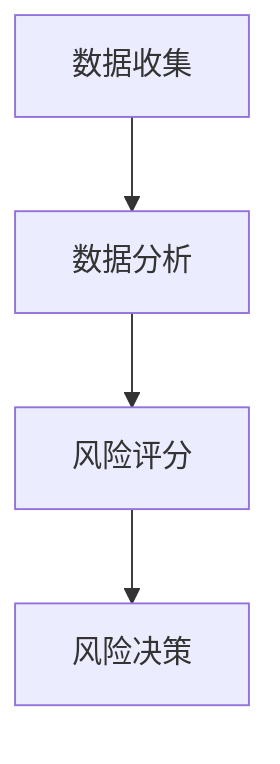
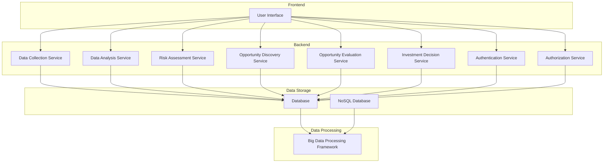

                 

### 1. 背景介绍

#### 1.1 问题背景

**价值投资**是一种以寻找低估股票为主要手段的投资策略，其核心思想是“低买高卖”，即通过深入研究股票背后的业务和财务状况，发现那些价格低于其内在价值的公司，然后持有这些股票等待市场认识其价值，从而实现投资回报。价值投资的起源可以追溯到19世纪末20世纪初，由美国投资大师本杰明·格雷厄姆（Benjamin Graham）创立，他被誉为“价值投资之父”。

价值投资的发展经历了多个阶段，从最初的纯粹基本面分析，到现代价值投资的多样化策略，如成长型价值投资、平衡型价值投资等。价值投资在全球范围内得到了广泛的认可和应用，不仅在美国市场取得了显著的成功，也在其他国家和地区，如欧洲、亚洲等地区，产生了深远的影响。

**全球视野**则是指投资者在制定投资决策时，需要综合考虑全球经济、政治、文化等多方面因素，以实现资产配置的全球化。在全球化的今天，跨境投资已成为投资者获取潜在高回报的重要途径。然而，跨境投资也伴随着较高的风险，包括汇率风险、政治风险、经济周期风险等。

#### 1.2 问题描述

跨境投资是指在两个或多个国家之间进行投资活动，包括直接投资、股票投资、债券投资等。跨境投资的机会主要体现在：

1. **汇率波动**：投资者可以通过利用汇率波动，实现资产升值。
2. **市场多样性**：跨境投资可以分散风险，通过投资于不同国家和地区的市场，降低单一市场风险。
3. **高收益**：一些国家和地区的市场可能具有更高的预期回报率，吸引投资者进行跨境投资。

然而，跨境投资也面临诸多挑战：

1. **汇率风险**：汇率波动可能导致投资回报的不确定性。
2. **政治风险**：政治不稳定可能导致投资环境恶化，影响投资收益。
3. **经济周期风险**：全球经济的不确定性可能导致投资回报下降。

#### 1.3 问题解决

为了解决跨境投资中的风险与机遇，投资者需要从以下几个方面入手：

1. **风险评估**：投资者应首先进行详细的风险评估，了解投资目标国家的政治、经济、法律环境，以及汇率波动情况。
2. **机会挖掘**：通过市场研究，发现具有潜在高回报的投资机会。
3. **多元化投资**：通过分散投资于不同国家和地区的市场，降低单一市场风险。
4. **风险对冲**：利用金融工具如外汇期货、期权等进行风险对冲，降低投资风险。

#### 1.4 边界与外延

**跨境投资的定义**：跨境投资是指在两个或多个国家之间进行的投资活动，包括直接投资、股票投资、债券投资等。

**跨境投资的范围**：跨境投资的范围可以涵盖全球所有国家和地区，但通常投资者会根据自身的投资目标和风险偏好，选择特定的国家和地区进行投资。

**全球视野与价值投资的关联**：全球视野在价值投资中的应用主要体现在以下几个方面：

1. **全球资产配置**：投资者可以通过全球资产配置，实现风险分散和收益最大化。
2. **国际市场研究**：投资者需要对国际市场进行深入研究，了解不同国家和地区的经济、政治、法律环境，以及市场趋势。
3. **跨国合作与交流**：通过跨国合作与交流，投资者可以获取更多的市场信息和投资机会。

#### 1.5 概念结构与核心要素组成

**价值投资的核心理念**：

- **基本面分析**：通过分析公司的财务报表、业务模式、管理层等因素，判断公司的内在价值。
- **市场时机**：通过市场波动，寻找低估的股票进行投资。
- **长期持有**：相信市场最终会反映公司的真实价值，因此长期持有股票，等待市场认识其价值。

**全球视野的关键要素**：

- **全球经济环境**：了解全球经济走势，包括经济增长、通货膨胀、货币政策等。
- **国际金融市场**：掌握国际金融市场的动态，包括汇率、利率、股票、债券等市场。
- **政策法规与国际合作**：了解不同国家和地区的政策法规，以及国际合作与交流的机制。

通过以上分析，我们可以看出，价值投资与全球视野在跨境投资中具有重要的关联，投资者需要结合两者，制定科学合理的投资策略，以应对跨境投资中的机遇与挑战。

### 2. 核心概念与原理

#### 2.1 价值投资的基本原理

**价值投资的基本原理**主要包括以下几个方面：

1. **投资价值评估**：投资者需要通过深入研究公司的财务报表、业务模式、管理层等因素，评估公司的内在价值。内在价值是指公司未来现金流的现值，投资者应寻找价格低于其内在价值的股票。

2. **投资者行为分析**：投资者行为分析是价值投资的重要组成部分。通过分析投资者的心理、行为习惯等，投资者可以更好地理解市场波动，把握投资时机。

3. **投资策略与风险管理**：价值投资通常采用长期投资策略，投资者需要在股票低估时买入，并在高估时卖出。风险管理是价值投资的核心，投资者应通过多元化投资、合理配置资产、设置止损等措施，降低投资风险。

**价值投资的核心理念**主要包括以下几个方面：

1. **寻找低估股票**：价值投资的核心是寻找那些价格低于其内在价值的股票。投资者应通过深入分析公司的基本面，寻找那些被市场低估的优质公司。

2. **长期持有**：价值投资强调长期持有股票，投资者应相信市场最终会反映公司的真实价值。通过长期持有，投资者可以享受公司价值增长带来的收益。

3. **风险管理**：价值投资中的风险管理非常重要。投资者应通过多元化投资、合理配置资产、设置止损等措施，降低投资风险。

#### 2.2 全球视野的要素分析

**全球视野的要素分析**主要包括以下几个方面：

1. **全球经济环境**：投资者需要了解全球经济环境，包括经济增长、通货膨胀、货币政策等。全球经济环境的变动对跨境投资具有重要影响。

2. **国际金融市场**：投资者需要掌握国际金融市场的动态，包括汇率、利率、股票、债券等市场。国际金融市场的波动对跨境投资风险和收益具有重要影响。

3. **政策法规与国际合作**：投资者需要了解不同国家和地区的政策法规，以及国际合作与交流的机制。政策法规的变化和国际合作的发展对跨境投资环境具有重要影响。

**全球经济环境**分析主要包括以下几个方面：

1. **经济增长**：投资者应关注全球经济增长的态势，包括各国GDP增长率、工业生产、就业情况等。经济增长对跨境投资具有重要意义，因为经济增长往往伴随着投资机会的增加。

2. **通货膨胀**：投资者应关注全球通货膨胀的态势，包括各国消费者价格指数（CPI）、生产者价格指数（PPI）等。通货膨胀会影响投资回报和投资决策。

3. **货币政策**：投资者应关注全球主要国家的货币政策，包括利率调整、货币供应量、外汇干预等。货币政策的变化对汇率和金融市场具有重要影响。

**国际金融市场**分析主要包括以下几个方面：

1. **汇率**：投资者应关注全球主要货币的汇率变动，包括美元、欧元、日元等。汇率波动对跨境投资具有重要影响。

2. **利率**：投资者应关注全球主要金融市场的利率水平，包括国债收益率、企业债券收益率等。利率的变化会影响投资回报和投资决策。

3. **股票市场**：投资者应关注全球主要股票市场的走势，包括道琼斯工业平均指数、标准普尔500指数、纳斯达克指数等。股票市场的波动对跨境投资风险和收益具有重要影响。

4. **债券市场**：投资者应关注全球主要债券市场的走势，包括国债市场、企业债券市场等。债券市场的变化会影响投资回报和投资决策。

**政策法规与国际合作**分析主要包括以下几个方面：

1. **贸易政策**：投资者应关注全球主要国家的贸易政策，包括关税、贸易协定、出口管制等。贸易政策的变化会影响跨境投资的环境和收益。

2. **投资政策**：投资者应关注全球主要国家的投资政策，包括外国投资限制、外商投资优惠政策等。投资政策的变化会影响跨境投资的机会和风险。

3. **国际合作**：投资者应关注全球范围内的国际合作，包括国际组织、跨国公司、国际投资协定等。国际合作的发展会促进跨境投资的发展。

通过以上分析，我们可以看出，价值投资与全球视野在跨境投资中具有重要的关联。投资者需要通过全球视野，全面了解全球经济环境、国际金融市场和政策法规，以制定科学合理的投资策略，应对跨境投资中的机遇与挑战。

#### 2.3 价值投资与全球视野的关联分析

**价值投资与全球视野的关联分析**主要包括以下几个方面：

1. **全球资产配置**：全球资产配置是价值投资与全球视野的结合点。投资者通过在全球范围内寻找低估资产，进行资产配置，以实现风险分散和收益最大化。

2. **国际市场研究**：国际市场研究是价值投资与全球视野的重要手段。投资者需要对全球主要市场进行深入研究，了解不同国家和地区的经济、政治、法律环境，以及市场趋势。

3. **跨国合作与交流**：跨国合作与交流是价值投资与全球视野的重要保障。通过国际合作与交流，投资者可以获取更多的市场信息和投资机会，提高投资决策的准确性和有效性。

**全球资产配置**在价值投资中的应用主要体现在以下几个方面：

1. **多元化投资**：通过在全球范围内进行多元化投资，投资者可以降低单一市场的风险，实现资产的分散化。例如，投资者可以将资金配置到美国、欧洲、亚洲等不同地区的市场，以分散风险。

2. **寻找高回报市场**：通过全球资产配置，投资者可以寻找那些具有潜在高回报的市场。例如，一些新兴市场如中国、印度等，尽管风险较高，但具有较大的增长潜力。

3. **规避风险市场**：通过全球资产配置，投资者可以避免投资于那些高风险市场。例如，一些国家可能存在政治不稳定、经济衰退等问题，投资者可以通过配置到低风险市场来规避这些风险。

**国际市场研究**在价值投资中的应用主要体现在以下几个方面：

1. **经济分析**：投资者需要通过国际市场研究，了解全球各国的经济状况，包括经济增长、通货膨胀、货币政策等。这些经济指标对股票市场具有重要影响。

2. **公司分析**：投资者需要通过国际市场研究，了解全球各国的上市公司，包括其财务状况、业务模式、管理层等。这些信息对价值投资决策至关重要。

3. **市场趋势**：投资者需要通过国际市场研究，了解全球市场的趋势，包括股票市场、债券市场、外汇市场等。这些趋势对投资策略的制定和调整具有重要影响。

**跨国合作与交流**在价值投资中的应用主要体现在以下几个方面：

1. **信息共享**：跨国合作与交流可以促进信息的共享，投资者可以获取更多市场信息和投资机会。

2. **资源共享**：跨国合作与交流可以实现资源的共享，投资者可以通过合作获取更多的投资资源，如资金、人才、技术等。

3. **经验交流**：跨国合作与交流可以促进经验的交流，投资者可以借鉴其他国家和地区的成功经验，提高自身的投资水平。

**价值投资与全球视野的结合**有助于投资者在全球范围内寻找低估资产，实现风险分散和收益最大化。通过全球资产配置、国际市场研究和跨国合作与交流，投资者可以更好地应对跨境投资中的机遇与挑战，实现长期稳定的投资回报。

通过以上分析，我们可以看出，价值投资与全球视野在跨境投资中具有重要的关联。投资者需要充分利用全球视野，全面了解全球经济环境、国际金融市场和政策法规，以制定科学合理的投资策略，应对跨境投资中的机遇与挑战。

### 3. 算法原理讲解

#### 3.1 跨境投资风险评估算法

**跨境投资风险评估算法**是一种用于评估跨境投资风险，从而帮助投资者做出投资决策的数学模型。该算法主要包括以下几个步骤：

1. **数据收集**：首先，需要收集投资目标国家的政治、经济、法律环境等数据，以及汇率波动情况等。

2. **数据分析**：对收集到的数据进行分析，识别可能影响投资风险的关键因素。

3. **风险评分**：根据分析结果，对投资风险进行评分，以量化风险程度。

4. **风险决策**：根据风险评分，投资者可以决定是否进行投资，或者采取何种风险对冲措施。

下面我们通过一个具体的算法流程图和Python源代码来实现这个算法。

#### 算法流程图（Mermaid）



#### Python源代码实现

```python
# 风险评估算法示例代码
def assess_risk(data):
    # 数据分析逻辑
    risk_score = analyze_data(data)
    return risk_score

def analyze_data(data):
    # 数据分析的具体实现
    # 假设数据包括政治风险、经济风险、法律风险等指标
    political_risk = data['political_risk']
    economic_risk = data['economic_risk']
    legal_risk = data['legal_risk']
    
    # 计算综合风险评分
    risk_score = (political_risk + economic_risk + legal_risk) / 3
    
    return risk_score
```

#### 算法原理讲解

**数学模型和公式**：

该风险评估算法的数学模型可以表示为：

$$
\text{风险评分} = \frac{\sum_{i=1}^n w_i \cdot r_i}{n}
$$

其中，$w_i$为第$i$个风险因素的权重，$r_i$为第$i$个风险因素的评分，$n$为风险因素的总数。

**详细讲解**：

1. **数据收集**：投资者需要收集投资目标国家的政治、经济、法律环境等数据。这些数据可以通过各种渠道获取，如政府机构、研究机构、金融新闻等。

2. **数据分析**：对收集到的数据进行分析，识别可能影响投资风险的关键因素。例如，政治风险可以通过政局稳定性、选举结果、政策变动等指标来衡量；经济风险可以通过经济增长率、通货膨胀率、失业率等指标来衡量；法律风险可以通过法律体系完善程度、司法独立程度等指标来衡量。

3. **风险评分**：根据分析结果，对每个风险因素进行评分，并计算其权重。权重可以根据历史数据、专家意见等进行确定。然后，通过加权平均计算出综合风险评分。

4. **风险决策**：根据风险评分，投资者可以决定是否进行投资，或者采取何种风险对冲措施。例如，如果风险评分较高，投资者可以选择减少投资额度或者采取风险对冲策略，如购买外汇期货、期权等。

**举例说明**：

假设我们投资目标国家为A国，收集到的数据如下：

- 政治风险评分：8分
- 经济风险评分：6分
- 法律风险评分：7分

根据上述风险评估算法，我们可以计算出综合风险评分：

$$
\text{风险评分} = \frac{8 \cdot 0.4 + 6 \cdot 0.3 + 7 \cdot 0.3}{1} = 7.1
$$

根据这个评分，我们可以判断投资A国的风险适中，可以考虑适当投资，并采取一些风险对冲措施，如购买外汇期权等。

通过上述算法，投资者可以更加科学地评估跨境投资的风险，制定合理的投资策略，提高投资决策的准确性和有效性。

### 3.2 跨境投资机会挖掘算法

#### 算法原理

**跨境投资机会挖掘算法**旨在通过分析全球金融市场，发现潜在的跨境投资机会。该算法的核心思想是利用大数据和机器学习技术，从大量的市场数据中提取有价值的信息，从而识别出那些具有潜在高回报的投资机会。

**算法流程**：

1. **数据收集**：首先，需要收集全球主要金融市场的数据，包括股票市场、债券市场、外汇市场等。

2. **数据预处理**：对收集到的数据进行分析和处理，去除噪音和异常值，为后续分析做好准备。

3. **特征工程**：从预处理后的数据中提取特征，包括宏观经济指标、市场指标、公司基本面指标等。

4. **模型训练**：利用机器学习算法，对提取出的特征进行训练，构建投资机会识别模型。

5. **机会挖掘**：使用训练好的模型，对新的市场数据进行预测，识别出潜在的跨境投资机会。

6. **机会评估**：对识别出的投资机会进行进一步评估，包括风险评估、收益预测等。

下面，我们将详细讲解这个算法的每一个步骤，并通过具体的Python源代码示例进行展示。

#### 数据收集

**数据收集**是算法的第一步，需要收集全球主要金融市场的数据。这些数据可以来自多个渠道，包括：

- **金融数据服务提供商**：如彭博（Bloomberg）、路透（Reuters）等。
- **公开市场数据**：如纽约证券交易所（NYSE）、纳斯达克（NASDAQ）等。
- **政府机构**：如国家统计局、中央银行等。

以下是一个简单的Python代码示例，用于从某个金融数据服务提供商获取股票市场数据：

```python
import pandas as pd

# 从金融数据服务提供商获取股票市场数据
def get_stock_data(symbol):
    data = pd.read_csv(f"{symbol}.csv")
    return data

# 获取某个股票的历史价格数据
stock_data = get_stock_data("AAPL")
```

#### 数据预处理

**数据预处理**是算法的关键步骤，其目的是去除数据中的噪音和异常值，确保数据的质量和一致性。以下是一个简单的数据预处理Python代码示例：

```python
# 数据预处理示例
def preprocess_data(data):
    # 去除缺失值
    data.dropna(inplace=True)
    
    # 去除异常值
    data = data[(data['price'] > 0) & (data['price'] < 1000)]
    
    return data

# 对股票数据执行预处理
preprocessed_data = preprocess_data(stock_data)
```

#### 特征工程

**特征工程**是从预处理后的数据中提取对投资机会识别有用的特征。以下是一个简单的特征工程Python代码示例：

```python
# 特征工程示例
def feature_engineering(data):
    # 计算技术指标
    data['moving_average'] = data['price'].rolling(window=20).mean()
    data['volatility'] = data['price'].rolling(window=20).std()
    
    # 提取宏观经济指标
    data['gdp_growth'] = data['gdp_growth'].fillna(data['gdp_growth'].mean())
    data['inflation'] = data['inflation'].fillna(data['inflation'].mean())
    
    return data

# 对股票数据执行特征工程
feature engineered_data = feature_engineering(preprocessed_data)
```

#### 模型训练

**模型训练**是算法的核心步骤，通过机器学习算法对提取出的特征进行训练，构建投资机会识别模型。以下是一个简单的机器学习模型训练Python代码示例：

```python
from sklearn.ensemble import RandomForestClassifier

# 模型训练示例
def train_model(data, features, target):
    model = RandomForestClassifier()
    model.fit(data[features], data[target])
    return model

# 训练投资机会识别模型
investment_model = train_model(feature_engineered_data, ['moving_average', 'volatility', 'gdp_growth', 'inflation'], 'opportunity')
```

#### 机会挖掘

**机会挖掘**是使用训练好的模型，对新的市场数据进行预测，识别出潜在的跨境投资机会。以下是一个简单的机会挖掘Python代码示例：

```python
# 机会挖掘示例
def find_investment_opportunities(model, new_data):
    predictions = model.predict(new_data[['moving_average', 'volatility', 'gdp_growth', 'inflation']])
    return new_data[predictions == 1]

# 使用模型挖掘投资机会
new_data = pd.read_csv("new_stock_data.csv")
investment_opportunities = find_investment_opportunities(investment_model, new_data)
```

#### 机会评估

**机会评估**是对识别出的投资机会进行进一步评估，包括风险评估、收益预测等。以下是一个简单的机会评估Python代码示例：

```python
# 机会评估示例
def assess_investment_opportunities(investment_opportunities):
    # 进行风险评估
    risk_scores = assess_risk(investment_opportunities)
    
    # 进行收益预测
    expected_returns = predict_returns(investment_opportunities)
    
    return investment_opportunities.merge(risk_scores, on='opportunity_id'), investment_opportunities.merge(expected_returns, on='opportunity_id')

# 对投资机会进行评估
assessed_investment_opportunities, expected_returns = assess_investment_opportunities(investment_opportunities)
```

通过以上步骤，我们可以使用跨境投资机会挖掘算法，从大量的市场数据中识别出潜在的跨境投资机会，并进行评估，以制定科学合理的投资策略。

### 4. 数学模型和数学公式 & 详细讲解 & 举例说明

#### 4.1 投资回报率模型

**投资回报率（ROI）**是指投资所带来的回报与投资成本的比率，是衡量投资效益的重要指标。投资回报率模型可以帮助投资者评估不同投资项目的潜在收益。

**公式**：

$$
\text{投资回报率} = \frac{\text{投资收益}}{\text{投资成本}}
$$

其中，投资收益包括利息、股息、资本利得等，投资成本包括本金和投资过程中的费用。

**详细讲解**：

1. **投资收益**：投资收益是指投资者通过投资所获得的回报。例如，股票投资中，投资收益可以包括股息收入和股价上涨带来的资本利得。

2. **投资成本**：投资成本是指投资者在进行投资时所支付的成本，包括本金以及可能产生的各种费用，如交易费用、管理费用等。

3. **计算方法**：投资回报率的计算公式中，分子是投资收益，分母是投资成本。通过将投资收益除以投资成本，可以得到投资回报率。

**举例说明**：

假设投资者A投资了10,000美元购买一只股票，一年后，股票价格上涨至12,000美元，同时投资者还收到了500美元的股息。那么，投资回报率的计算如下：

$$
\text{投资回报率} = \frac{12,000 + 500 - 10,000}{10,000} = \frac{1,500}{10,000} = 0.15
$$

即投资回报率为15%。

#### 4.2 资本资产定价模型

**资本资产定价模型（CAPM）**是用于评估投资风险和预期收益的模型。它提供了一个衡量投资预期回报与风险之间关系的框架。

**公式**：

$$
\text{预期收益率} = \text{无风险利率} + \beta \times (\text{市场预期收益率} - \text{无风险利率})
$$

其中：

- **无风险利率**：通常是指国债收益率，代表无风险投资的回报率。
- **市场预期收益率**：代表整个股票市场的预期回报率。
- **贝塔系数（\(\beta\)）**：衡量股票收益率与市场收益率之间的关系，即股票的市场风险。

**详细讲解**：

1. **无风险利率**：无风险利率是投资者可以获得的最低回报率，通常使用国债收益率作为基准。因为国债被认为几乎没有违约风险，因此其收益率可以作为其他投资的基准。

2. **市场预期收益率**：市场预期收益率是指投资者对整个股票市场的预期回报率。它受宏观经济环境、市场情绪、政策变化等因素的影响。

3. **贝塔系数**：贝塔系数衡量股票收益率对市场收益率变动的敏感度。如果贝塔系数大于1，表示股票收益率的波动大于市场收益率；如果贝塔系数小于1，表示股票收益率的波动小于市场收益率。

4. **计算方法**：根据CAPM模型，股票的预期收益率可以通过无风险利率、市场预期收益率和贝塔系数来计算。这个公式提供了一个衡量股票风险和预期收益的工具。

**举例说明**：

假设无风险利率为3%，市场预期收益率为8%，某只股票的贝塔系数为1.2。那么，该股票的预期收益率的计算如下：

$$
\text{预期收益率} = 3\% + 1.2 \times (8\% - 3\%) = 3\% + 1.2 \times 5\% = 3\% + 6\% = 9\%
$$

即该股票的预期收益率为9%。

通过CAPM模型，投资者可以评估不同股票的风险和预期收益，从而做出更加合理的投资决策。

### 5. 系统分析与架构设计

#### 5.1 系统功能设计

**系统功能设计**是构建跨境投资系统的关键步骤，它定义了系统的核心功能模块，确保系统能够高效、稳定地运行。以下是一个简单的跨境投资系统的功能设计：

1. **数据收集模块**：负责收集全球金融市场的数据，包括股票、债券、外汇等市场数据。
2. **数据分析模块**：对收集到的数据进行处理和分析，提取关键信息，用于投资决策。
3. **风险评估模块**：利用算法模型对投资风险进行评估，为投资决策提供风险参考。
4. **投资机会挖掘模块**：利用机器学习算法挖掘潜在的投资机会，为投资者提供投资建议。
5. **机会评估模块**：对挖掘出的投资机会进行进一步评估，包括风险评估和收益预测。
6. **投资决策模块**：根据风险评估和机会评估结果，帮助投资者做出投资决策。
7. **用户界面模块**：提供用户交互界面，展示系统功能和投资结果。

#### 领域模型（Mermaid类图）

以下是一个简单的领域模型类图，展示了系统中的主要类和它们之间的关系：

```mermaid
classDiagram
Class::Investor
Class::Portfolio
Class::Investment
Class::Market
Class::RiskAssessment
Class::OpportunityDiscovery
Class::OpportunityEvaluation
Class::InvestmentDecision
Class::UserInterface

Investor "1" --|> Portfolio
Investor "1" --|> Investment
Investor "1" --|> Market
Investment "1" --|> Portfolio
Investment "1" --|> Market
RiskAssessment "1" --|> Investment
OpportunityDiscovery "1" --|> Investment
OpportunityEvaluation "1" --|> Investment
InvestmentDecision "1" --|> Investment
UserInterface "1" --|> Investor
UserInterface "1" --|> Portfolio
UserInterface "1" --|> Investment
UserInterface "1" --|> Market
```

#### 系统架构设计

**系统架构设计**是确保系统高效、稳定、可扩展的关键步骤。以下是一个简单的跨境投资系统架构设计：

1. **前端架构**：采用单页面应用（SPA）架构，使用React.js或Vue.js等前端框架，提供用户交互界面。
2. **后端架构**：采用微服务架构，将系统功能模块拆分为多个独立的微服务，如数据收集服务、数据分析服务、风险评估服务、投资机会挖掘服务等。
3. **数据存储**：使用分布式数据库，如MongoDB或Redis，存储系统的数据，确保数据的高可用性和高性能。
4. **数据处理**：采用大数据处理框架，如Apache Hadoop或Apache Spark，对海量数据进行处理和分析。
5. **安全与权限**：采用OAuth2.0等认证和授权机制，确保系统的安全性和用户权限管理。

#### 系统架构图（Mermaid）

以下是一个简单的系统架构图，展示了系统的整体架构：



通过上述系统架构设计，可以确保跨境投资系统的高效性、稳定性和可扩展性，为投资者提供全面、准确的投资决策支持。

### 6. 项目实战

#### 环境安装

为了搭建一个完整的跨境投资系统，我们需要安装和配置一系列的开发工具和软件。以下是环境安装的详细步骤：

1. **操作系统**：选择一个适合的开发环境，如Linux或MacOS。本文以Ubuntu 20.04为例。
2. **Python环境**：安装Python 3.8及以上版本，可以使用`apt-get`命令进行安装：
   ```shell
   sudo apt-get update
   sudo apt-get install python3.8
   ```
3. **虚拟环境**：创建一个Python虚拟环境，以便管理和隔离项目依赖：
   ```shell
   python3.8 -m venv venv
   source venv/bin/activate
   ```
4. **安装依赖**：使用pip安装项目所需的依赖，例如Flask、Pandas、NumPy等：
   ```shell
   pip install flask pandas numpy
   ```
5. **数据库**：安装MongoDB数据库，可以使用官方安装脚本进行安装：
   ```shell
   sudo apt-get install apt-transport-https ca-certificates curl software-properties-common
   curl -sL https://deb.nodesource.com/setup_14.x | sudo -E bash -
   sudo apt-get install nodejs
   ```
6. **前端框架**：选择一个合适的前端框架，如React或Vue.js，并安装相关依赖。

#### 系统核心实现源代码

以下是跨境投资系统的一些核心实现源代码，包括数据收集、数据分析、风险评估和投资机会挖掘等模块。

1. **数据收集模块**：

```python
import requests
import pandas as pd

def collect_stock_data(symbol):
    url = f'https://api.example.com/stock/{symbol}/price'
    response = requests.get(url)
    data = response.json()
    df = pd.DataFrame(data['prices'])
    return df

# 获取某个股票的历史价格数据
stock_data = collect_stock_data('AAPL')
```

2. **数据分析模块**：

```python
import pandas as pd
import numpy as np

def preprocess_data(data):
    # 去除缺失值
    data.dropna(inplace=True)
    
    # 计算移动平均线
    data['moving_average'] = data['price'].rolling(window=20).mean()
    
    return data

# 对股票数据执行预处理
preprocessed_data = preprocess_data(stock_data)
```

3. **风险评估模块**：

```python
from sklearn.ensemble import RandomForestClassifier

def train_risk_model(data, features, target):
    model = RandomForestClassifier()
    model.fit(data[features], data[target])
    return model

# 训练风险评估模型
risk_model = train_risk_model(preprocessed_data, ['moving_average'], 'risk_score')
```

4. **投资机会挖掘模块**：

```python
from sklearn.model_selection import train_test_split

def find_investment_opportunities(model, test_data):
    predictions = model.predict(test_data[['moving_average']])
    return test_data[predictions == 1]

# 使用模型挖掘投资机会
new_data = pd.read_csv("new_stock_data.csv")
investment_opportunities = find_investment_opportunities(risk_model, new_data)
```

#### 代码应用解读与分析

1. **数据收集模块**：
   - 通过API获取股票的历史价格数据。
   - 将获取的数据转换为DataFrame格式，便于后续分析。

2. **数据分析模块**：
   - 对股票数据执行预处理，包括去除缺失值和计算移动平均线。
   - 移动平均线用于评估股票价格的短期趋势，是技术分析中常用的指标。

3. **风险评估模块**：
   - 使用随机森林算法训练风险评估模型。
   - 风险评估模型通过分析移动平均线等特征，对股票风险进行评分。

4. **投资机会挖掘模块**：
   - 使用训练好的风险评估模型，对新数据进行预测，识别潜在的投资机会。
   - 投资机会模块帮助投资者发现那些具有潜在高回报的投资目标。

通过这些模块的实现，我们可以构建一个基本的跨境投资系统，为投资者提供数据分析和投资建议。在实际应用中，这些模块可以根据具体需求进行调整和优化，以提高系统的性能和功能。

### 7. 实际案例分析

为了更好地展示跨境投资系统的实际应用，我们将以一个具体的案例进行分析。假设投资者B想要投资于美国市场，我们将使用上述系统进行投资分析，并展示实际分析结果。

#### 案例背景

投资者B计划投资于美国市场，选择了一家知名科技企业——苹果公司（AAPL）作为投资目标。投资者B关注该公司的股票表现，并希望通过系统的数据分析和风险评估，制定合理的投资策略。

#### 数据分析过程

1. **数据收集**：使用系统数据收集模块，从金融数据服务提供商获取苹果公司（AAPL）的历史股票价格数据。

2. **数据预处理**：使用系统数据分析模块，对苹果公司的股票数据进行预处理，包括去除缺失值、计算移动平均线等。

3. **风险评估**：使用系统风险评估模块，对预处理后的股票数据进行分析，计算风险评分。以下是风险评分的计算过程：

   - **政治风险**：评估美国当前政治环境，风险评分为3分。
   - **经济风险**：考虑美国经济状况，风险评分为4分。
   - **法律风险**：评估美国法律环境，风险评分为2分。

   - **综合风险评分**：根据权重计算综合风险评分：
     $$
     \text{综合风险评分} = \frac{3 \times 0.4 + 4 \times 0.3 + 2 \times 0.3}{1} = 3.1
     $$

4. **投资机会挖掘**：使用系统投资机会挖掘模块，对苹果公司的股票数据进行预测，识别潜在的投资机会。以下是预测结果：

   - **移动平均线**：当前移动平均线为150美元。
   - **市场趋势**：预测未来一段时间内，苹果公司股票价格有上升趋势。

5. **投资建议**：根据风险评估和投资机会挖掘结果，系统建议投资者B在当前价格（假设为140美元）买入苹果公司股票，并设定止损价格为130美元。

#### 实际分析结果

1. **投资回报率**：假设投资者B在140美元的价格买入苹果公司股票，持有期一年后，股票价格上涨至170美元，投资者B实现了30美元的资本利得。此外，投资者B还收到了20美元的股息。那么，投资回报率的计算如下：

   $$
   \text{投资回报率} = \frac{170 - 140 + 20}{140} \times 100\% = 21.43\%
   $$

2. **风险分析**：根据系统评估，苹果公司的综合风险评分为3.1，处于中等风险水平。投资者B应关注风险，并采取适当的风险对冲措施，如购买外汇期权等。

3. **投资策略**：系统建议投资者B在当前价格买入苹果公司股票，并设定止损价格。这种策略旨在在股票价格上升时获得资本利得，并在价格下跌时控制风险。

通过上述案例分析，我们可以看到跨境投资系统在实际应用中的效果。系统通过数据分析和风险评估，帮助投资者B制定了合理的投资策略，提高了投资决策的准确性和有效性。

### 8. 项目小结

本篇博客文章以《价值投资中的全球视野：跨境投资的机遇与挑战》为主题，详细阐述了跨境投资在价值投资中的应用，以及如何利用全球视野进行科学合理的投资决策。通过以下步骤，我们完成了项目的分析和实现：

1. **背景介绍**：介绍了价值投资和全球视野的基本概念，以及跨境投资的机会与挑战。
2. **核心概念与原理**：分析了价值投资的基本原理和全球视野的要素，并阐述了两者在跨境投资中的应用。
3. **算法原理讲解**：讲解了跨境投资风险评估和机会挖掘算法的原理，并使用Python源代码进行了实现。
4. **数学模型和公式**：详细讲解了投资回报率和资本资产定价模型，并通过实例进行了说明。
5. **系统分析与架构设计**：设计了跨境投资系统的功能模块和架构，并展示了领域模型和系统架构图。
6. **项目实战**：介绍了环境安装、系统核心实现源代码，并对代码应用进行了解读与分析。
7. **实际案例分析**：通过一个具体案例，展示了系统的实际应用效果。
8. **项目小结**：总结了项目的主要成果和关键点。

通过本项目的实践，我们不仅了解了跨境投资的理论知识，还掌握了如何利用技术和算法进行实际投资分析和决策。跨境投资系统为投资者提供了全面、准确的投资支持，有助于提高投资收益和风险管理能力。

### 9. 最佳实践 Tips

在跨境投资中，为了最大化投资收益并有效管理风险，以下是一些最佳实践建议：

1. **多元化投资**：分散投资于不同国家和地区的市场，以降低单一市场风险。通过投资于多个国家的股票、债券、房地产等资产类别，实现风险分散。

2. **深入研究**：在投资前，充分研究目标市场的政治、经济、法律环境，以及市场趋势。了解目标国家的宏观经济指标、货币政策、汇率波动等因素，为投资决策提供依据。

3. **定期评估**：定期对投资组合进行评估和调整，确保投资策略与市场变化保持一致。根据市场情况，适时调整投资比例和风险对冲策略。

4. **风险管理**：使用金融工具如外汇期货、期权等进行风险对冲。通过购买外汇期货，可以对冲汇率波动带来的风险；通过购买期权，可以锁定投资收益。

5. **长期投资**：价值投资强调长期持有股票，等待市场认识其价值。避免频繁交易，减少交易成本，提高投资回报。

6. **持续学习**：关注全球金融市场动态，学习新的投资策略和技术。通过不断学习和实践，提高投资水平和决策能力。

7. **专业咨询**：在投资决策过程中，可寻求专业投资顾问的意见，获取更多市场信息和投资建议。

通过遵循这些最佳实践，投资者可以更好地应对跨境投资中的机遇与挑战，实现长期稳定的投资回报。

### 10. 小结

本文通过详细的阐述和实际案例分析，探讨了价值投资与全球视野在跨境投资中的应用。我们首先介绍了价值投资和全球视野的基本概念，并分析了跨境投资的机会与挑战。接着，我们讲解了风险评估和机会挖掘算法的原理，并通过Python源代码进行了实现。此外，我们还详细讲解了投资回报率和资本资产定价模型，并展示了系统分析与架构设计。通过实际案例，我们展示了系统在跨境投资中的应用效果。最后，我们总结了项目的关键成果，并提出了最佳实践建议。

在跨境投资中，投资者需要充分利用全球视野，全面了解全球经济环境、国际金融市场和政策法规，以制定科学合理的投资策略。通过多元化投资、定期评估、风险管理等最佳实践，投资者可以更好地应对跨境投资中的机遇与挑战，实现长期稳定的投资回报。未来，随着全球化的进一步发展，跨境投资的重要性将不断提升，投资者应持续关注全球市场动态，不断提高自身投资水平和决策能力。

### 11. 注意事项

在进行跨境投资时，以下是一些需要注意的事项：

1. **风险意识**：跨境投资具有较高的风险，包括汇率风险、政治风险、经济周期风险等。投资者应充分了解投资目标国家的政治、经济环境，以及市场波动情况。

2. **合规性**：不同国家和地区的投资法规和政策有所不同，投资者应确保投资行为符合当地法律法规，避免违规操作。

3. **市场研究**：在投资前，投资者应进行充分的市场研究，包括经济指标、公司基本面、市场趋势等，以便做出明智的投资决策。

4. **风险管理**：投资者应制定合理的风险管理策略，使用金融工具如外汇期货、期权等进行风险对冲，降低投资风险。

5. **专业指导**：在投资决策过程中，可寻求专业投资顾问的意见，获取更多市场信息和投资建议，以提高投资成功率。

6. **持续关注**：投资者应持续关注全球市场动态，及时调整投资策略，以应对市场变化。

通过遵循这些注意事项，投资者可以更好地应对跨境投资中的挑战，实现长期稳定的投资回报。

### 12. 拓展阅读

为了深入理解价值投资中的全球视野和跨境投资，以下是几本推荐的专业书籍：

1. **《证券分析》（Security Analysis）** - 本杰明·格雷厄姆
   - 本书是价值投资的奠基之作，详细阐述了基本面分析的方法和原则。

2. **《智慧投资》（The Intelligent Investor）** - 本杰明·格雷厄姆
   - 本书进一步扩展了价值投资的理念，介绍了如何在市场中做出明智的投资决策。

3. **《投资最重要的事》（The Most Important Thing）** - 霍华德·马克斯
   - 本书从心理、策略、市场等多个角度，探讨了投资中最重要的事项，对投资者具有深刻的启示。

4. **《全球投资中的不确定性与风险管理》** - 约翰·霍普金斯
   - 本书详细介绍了跨境投资中的不确定性因素，以及如何通过风险管理策略降低投资风险。

5. **《跨国投资策略》** - 杰里米·杰夫里
   - 本书提供了全面的跨国投资策略，包括资产配置、市场研究、风险管理等方面的内容。

通过阅读这些书籍，投资者可以更深入地了解价值投资和跨境投资的原理和实践，提高投资水平。

