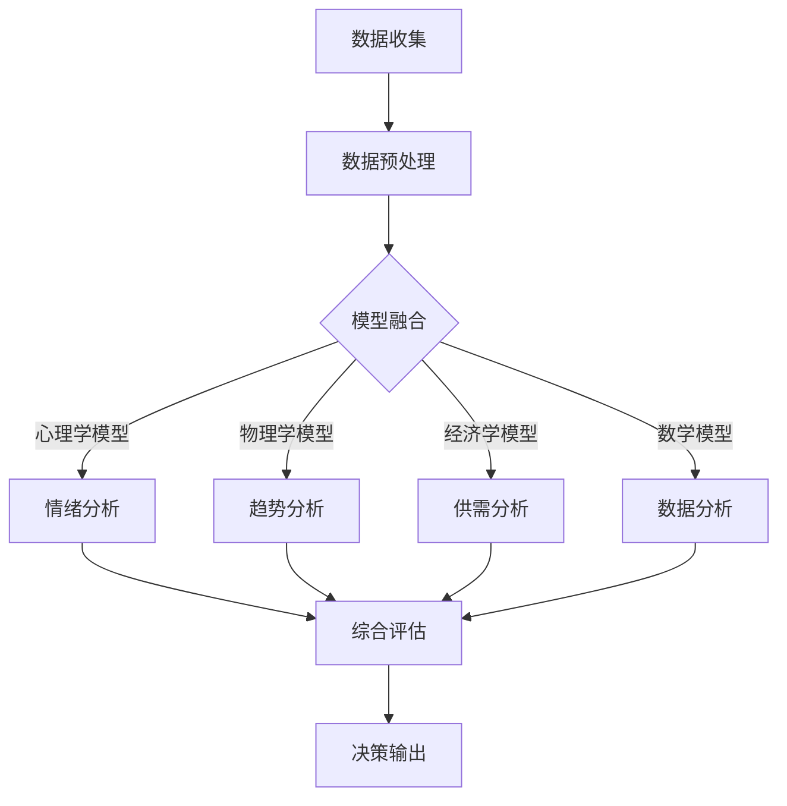
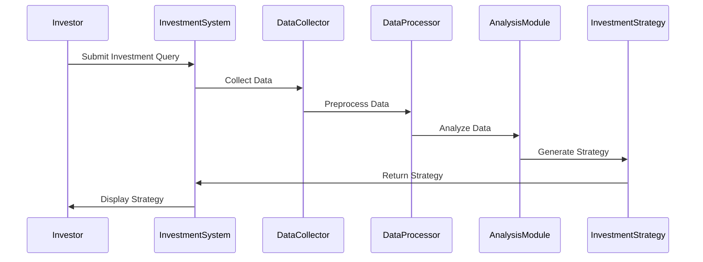
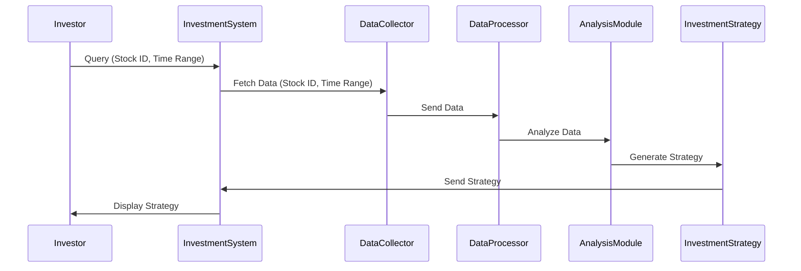

                 

### 摘要

本文深入探讨了查理·芒格的多元思维模型在投资中的运用。首先，我们介绍了多元思维模型的定义及其在投资中的重要性。随后，通过查理·芒格的生平背景和投资理念，我们理解了其多元思维模型的起源和应用。本文详细分析了多元思维模型的原理，包括其核心概念、属性特征对比，并通过Mermaid流程图展示了其ER实体关系图架构。在投资应用部分，我们讲解了多元思维模型在投资决策中的具体应用方法，包括算法原理讲解、数学模型和公式，以及实际案例的举例说明。最后，本文提出了投资中的最佳实践策略和注意事项，总结了多元思维模型在投资中的价值，并展望了未来的研究方向。阅读本文，您将掌握如何运用多元思维模型提升投资决策的精准度和成功率。

### 设计目录大纲

在撰写本文之前，我们将先设计一个详细的目录大纲，以确保文章的结构紧凑、逻辑清晰，同时能够吸引读者的注意力。以下是本文的目录大纲设计：

#### 第一部分：背景介绍

1. **第1章：问题背景**
    - **1.1 问题背景**
        - 投资中的复杂性和挑战
        - 多元思维模型的需求
    - **1.2 问题解决**
        - 传统投资方法的问题
        - 多元思维模型的优势
    - **1.3 边界与外延**
        - 投资策略的应用范围
        - 投资模型的适用条件

2. **第2章：核心概念**
    - **2.1 多元思维模型**
        - 概念定义
        - 核心要素
    - **2.2 投资中的运用**
        - 投资决策的影响
        - 投资策略的优化

3. **第3章：查理·芒格简介**
    - **3.1 背景与经历**
        - 个人背景
        - 投资经历
    - **3.2 投资理念与成就**
        - 投资哲学
        - 投资成果

#### 第二部分：核心概念与联系

4. **第4章：多元思维模型原理**
    - **4.1 原理介绍**
        - 模型结构
        - 工作原理
    - **4.2 概念属性特征对比表格**
        - 不同模型的特点对比
    - **4.3 ER实体关系图架构的Mermaid流程图**
        - Mermaid流程图的展示

#### 第三部分：投资应用与案例分析

5. **第5章：多元思维模型在投资中的应用**
    - **5.1 算法原理讲解与Mermaid流程图**
        - 投资算法的工作流程
    - **5.2 数学模型和公式**
        - 投资决策的关键指标
    - **5.3 举例说明**
        - 多元思维模型在实践中的应用

6. **第6章：案例分析与实战**
    - **6.1 投资案例分析**
        - 真实案例解析
    - **6.2 项目实战**
        - 投资项目实战
    - **6.3 代码应用解读与分析**
        - 投资模型代码实现

#### 第四部分：系统架构与实现

7. **第7章：系统分析与架构设计方案**
    - **7.1 问题场景介绍**
        - 投资系统面临的挑战
    - **7.2 系统功能设计(领域模型Mermaid类图)**
        - 系统功能模块划分
    - **7.3 系统架构设计Mermaid架构图**
        - 系统整体架构展示
    - **7.4 系统接口设计和系统交互Mermaid序列图**
        - 系统接口及交互流程

#### 第五部分：最佳实践与小结

8. **第8章：最佳实践**
    - **8.1 投资策略**
        - 多元思维模型的策略应用
    - **8.2 注意事项**
        - 投资过程中的风险控制

9. **第9章：小结与展望**
    - **9.1 小结**
        - 文章核心观点回顾
    - **9.2 拓展阅读**
        - 相关领域深入阅读推荐

通过这样的目录设计，我们可以确保文章内容逻辑连贯，条理清晰，同时每个章节都具备独立的内容和明确的主题，有助于读者更好地理解和应用多元思维模型在投资中的价值。

#### 第一部分：背景介绍

### 第1章：问题背景

#### 1.1 问题背景

在当今复杂多变的经济环境中，投资者面临着前所未有的挑战。传统的投资方法，如价值投资、成长投资等，虽然在一定程度上能够带来收益，但在面对全球经济波动、市场不确定性增加等情况下，往往显得力不从心。投资者需要寻找更加科学、全面、高效的决策方法来应对这些挑战。

投资决策的复杂性主要源于以下几个方面：

1. **数据复杂性**：现代投资领域的数据量庞大，且数据来源多样。投资者需要从海量数据中提取有价值的信息，这要求具备强大的数据处理和分析能力。
2. **市场波动性**：市场波动频繁，投资者很难准确预测市场走势。这意味着，投资决策不仅需要对历史数据进行分析，还需要对市场动态有敏锐的洞察力。
3. **经济不确定性**：全球经济环境的不确定性增加，投资者需要考虑地缘政治、政策变化、自然灾害等多方面因素对投资的影响。
4. **风险控制**：投资者在追求收益的同时，必须控制风险。传统的投资策略往往侧重于收益最大化，而忽略了风险控制的重要性。

为了解决这些问题，投资者迫切需要一种能够综合多种思维模型、全面分析市场数据和风险的决策方法。这就引出了多元思维模型的概念。

#### 1.2 问题解决

多元思维模型是一种将多种不同领域的思维模式整合在一起的方法，它可以帮助投资者从多个角度分析问题，从而提高决策的科学性和有效性。查理·芒格的多元思维模型正是这样一种综合性的方法。

查理·芒格（Charlie Munger）是一位著名的投资大师，他是伯克希尔·哈撒韦公司的副董事长，与沃伦·巴菲特一起被誉为投资界的“股神”。芒格以其独特的投资理念和卓越的投资业绩赢得了全球投资者的尊重。

芒格的多元思维模型主要包括以下几个方面的内容：

1. **心理学**：芒格认为，人的行为受到心理因素的影响很大，比如过度自信、群体心理等。通过了解心理学原理，投资者可以更好地理解市场行为，避免因情绪波动而做出错误决策。
2. **物理学**：物理学中的因果律、系统思维等概念对芒格的投资理念产生了深远影响。芒格强调，投资者需要理解复杂系统的运作机制，从而更好地把握市场动态。
3. **经济学**：经济学提供了关于供需、市场结构、竞争行为等方面的理论框架，芒格利用这些理论分析企业的商业模式、竞争力和市场潜力。
4. **数学**：数学是芒格多元思维模型中的重要组成部分。他通过数学模型和公式来量化投资决策，从而提高决策的准确性和效率。

通过这些多元思维模型，芒格能够在投资决策中综合考虑各种因素，提高决策的科学性和全面性。例如，在面对市场波动时，他不仅考虑经济数据，还会分析心理学、物理学和数学模型，从而做出更加稳健的投资决策。

#### 1.3 边界与外延

多元思维模型虽然强大，但并非万能。投资者需要明确其适用的边界和范围。

1. **适用范围**：多元思维模型主要适用于复杂的投资环境和长期投资策略。对于短期投机交易，这种模型可能过于复杂，反而不利于快速决策。
2. **风险控制**：尽管多元思维模型可以提高投资决策的科学性，但市场始终存在不确定性。投资者需要合理控制风险，避免因追求高收益而忽视风险。
3. **个人能力**：多元思维模型需要投资者具备一定的知识储备和思维能力。投资者需要不断学习和实践，提高自己的综合素质，才能充分发挥多元思维模型的优势。

总之，多元思维模型为投资者提供了一种全面、科学的决策方法。通过掌握和应用这种模型，投资者可以更好地应对复杂多变的市场环境，提高投资收益。

### 第2章：核心概念

#### 2.1 多元思维模型

多元思维模型是指将多种不同领域的思维模式整合在一起，以更全面、更深入地分析和解决问题的一种方法。查理·芒格的多元思维模型是其投资哲学的核心，它不仅涵盖了几何概率、会计学、心理学等领域，还涵盖了物理学、经济学、哲学、工程学等多个领域的原理和方法。这种模型帮助芒格从多个角度看待问题，从而做出更准确、更全面的投资决策。

#### 2.2 投资中的运用

多元思维模型在投资决策中的应用主要体现在以下几个方面：

1. **提升决策质量**：通过多元思维模型，投资者可以从多个角度分析问题，避免因单一视角而导致的盲点。例如，在分析一家公司的基本面时，投资者不仅需要考虑其财务报表，还需要结合市场趋势、行业动态、竞争环境等多方面因素。
2. **风险控制**：多元思维模型可以帮助投资者更好地理解市场风险，从而制定更有效的风险控制策略。例如，通过心理学模型，投资者可以了解市场情绪变化，从而及时调整投资策略。
3. **优化投资组合**：多元思维模型可以帮助投资者更科学地构建投资组合。通过分析不同资产类别的相关性、波动性等特征，投资者可以设计出更稳健、更有效的投资组合，降低投资风险。
4. **长期视角**：多元思维模型强调长期投资的重要性，通过理解复利效应、市场周期等概念，投资者可以更好地把握市场机会，实现长期稳健的投资回报。

总之，多元思维模型为投资者提供了一种全面、科学的决策方法，有助于提高投资决策的质量和效率。

#### 3.1 背景与经历

查理·芒格（Charlie Munger）出生于1924年1月1日，美国加州洛杉矶。他从小就展现出了对知识的渴望和学习的能力。年轻时，芒格曾在美国加州大学伯克利分校学习，并获得了法学学位。然而，他对法律的兴趣并不大，转而在哈佛大学法学院继续深造，并获得了法学博士学位。

在法学领域取得成功后，芒格并没有满足于此，他继续追求更高的学术成就。在哈佛大学期间，芒格结识了沃伦·巴菲特（Warren Buffett），两人一见如故，并成为了终生的挚友。巴菲特对投资有着浓厚的兴趣，而芒格则以其深厚的学术背景和对多种学科的兴趣，为巴菲特的投资理念提供了重要的理论支持。

芒格在投资领域的成就主要源自他与巴菲特的合作。他们共同创建了伯克希尔·哈撒韦公司（Berkshire Hathaway），这家公司在过去几十年中取得了惊人的投资业绩。芒格在伯克希尔·哈撒韦公司担任副董事长，负责公司的投资决策和战略规划。

芒格的投资理念深受其多元思维模型的影响。他认为，投资者需要从多个角度分析问题，包括心理学、物理学、经济学、数学等，从而做出更全面、更科学的投资决策。这种多元化的思维方式，不仅使芒格在投资领域取得了卓越的成就，也使他成为了一位备受尊敬的投资大师。

#### 3.2 投资理念与成就

查理·芒格以其独特的投资理念和卓越的投资业绩成为了全球投资者心中的传奇。他的投资哲学可以概括为以下几点：

1. **价值投资**：芒格坚信，投资的关键在于找到那些被市场低估的好公司，并长期持有这些公司的股票。他认为，企业的长期价值是其未来现金流的折现值，而市场价格的波动只是短期现象。通过这种价值投资策略，芒格和巴菲特在伯克希尔·哈撒韦公司实现了长期稳健的投资回报。

2. **复利效应**：芒格非常重视复利效应的作用。他认为，长期投资收益的累积很大程度上取决于复利效应。通过长期坚持投资和等待，投资者可以充分利用复利的力量，实现巨大的财富增长。

3. **多元化思维**：芒格主张投资者应具备多元化的思维方式。他不仅关注财务报表和基本面分析，还注重心理学、物理学、经济学等领域的知识。通过跨学科的思考，芒格能够更全面、更深入地理解投资标的的本质，从而做出更准确的决策。

4. **长期视角**：芒格强调，投资者应具备长期视角，避免被短期市场波动所干扰。他相信，通过长期持有优质股票，投资者可以分享企业成长的成果，实现稳健的投资回报。

芒格在投资领域的成就令人瞩目。他与巴菲特共同创建的伯克希尔·哈撒韦公司，在过去几十年中取得了惊人的业绩。公司股票的长期回报率远远超过了市场平均水平，使众多投资者实现了财富增值。此外，芒格还通过撰写书籍、发表演讲等方式，将自己的投资理念传播给全球的投资者。

芒格的投资理念不仅体现在他的投资业绩上，更体现在他对投资的深刻理解和对投资者的教育上。他的多元思维模型和投资哲学，为无数投资者提供了宝贵的指导，帮助他们更好地理解和实践价值投资。

### 第4章：多元思维模型原理

#### 4.1 原理介绍

多元思维模型是一种将多种不同领域的思维模式整合在一起，以更全面、更深入地分析和解决问题的方法论。查理·芒格的多元思维模型是其投资哲学的核心，它涵盖了心理学、物理学、经济学、数学等多个领域的原理和方法。这种模型使芒格能够在投资决策中从多个角度分析问题，提高决策的科学性和全面性。

首先，多元思维模型强调跨学科的知识融合。芒格认为，不同领域的知识可以为投资决策提供不同的视角和工具。例如，心理学可以帮助投资者理解市场情绪和行为模式，物理学中的因果律和系统思维可以为投资分析提供理论支持，经济学则提供了关于市场供需和竞争行为的分析框架。

其次，多元思维模型注重系统思维。芒格强调，投资者需要理解复杂系统的运作机制，从而更好地把握市场动态。他认为，市场是一个复杂系统，受到多种因素的共同作用，单一视角很难全面分析。通过系统思维，投资者可以综合考虑各种因素，提高决策的准确性和有效性。

最后，多元思维模型强调长期视角。芒格认为，投资是一个长期的过程，投资者需要具备耐心和坚持，通过长期持有优质股票实现复利效应。这种长期视角有助于投资者避免短期市场波动的影响，专注于企业的长期价值。

总之，多元思维模型为投资者提供了一种全面、科学的决策方法，通过跨学科的知识融合、系统思维和长期视角，提高投资决策的质量和效率。

#### 4.2 概念属性特征对比表格

为了更好地理解查理·芒格的多元思维模型，我们可以将其核心概念及其属性特征进行对比分析。以下是多元思维模型中几个主要概念的对比表格：

| 概念名称 | 特征1 | 特征2 | 特征3 | 应用领域 |
| -------- | ------ | ------ | ------ | -------- |
| 心理学模型 | 人类行为模式 | 情绪管理 | 决策过程 | 投资决策、风险管理 |
| 物理学模型 | 因果关系 | 系统思维 | 复杂系统 | 投资分析、市场预测 |
| 经济学模型 | 市场供需 | 竞争行为 | 经济周期 | 投资策略、市场研究 |
| 数学模型 | 公式推导 | 数据分析 | 概率论 | 投资决策、风险评估 |

通过这个表格，我们可以看到多元思维模型中各个概念的核心特征和应用领域。心理学模型主要关注人类行为模式、情绪管理和决策过程，适用于投资决策和风险管理。物理学模型强调因果关系、系统思维和复杂系统，适用于投资分析和市场预测。经济学模型则侧重于市场供需、竞争行为和经济周期，适用于投资策略和市场研究。数学模型则通过公式推导、数据分析和概率论，为投资决策和风险评估提供理论支持。

#### 4.3 ER实体关系图架构的Mermaid流程图

为了更直观地展示多元思维模型中的实体关系，我们可以使用Mermaid流程图来绘制ER（实体关系）图。以下是多元思维模型中几个主要实体的关系图：

```mermaid
erDiagram
  InvestmentDecision ||--|{ PsychologyModel } : uses
  InvestmentDecision ||--|{ PhysicsModel } : uses
  InvestmentDecision ||--|{ EconomicsModel } : uses
  InvestmentDecision ||--|{ MathematicsModel } : uses
  PsychologyModel ||--|{ DecisionProcess } : contains
  PsychologyModel ||--|{ EmotionalManagement } : contains
  PhysicsModel ||--|{ CausalRelation } : contains
  PhysicsModel ||--|{ SystemThinking } : contains
  EconomicsModel ||--|{ MarketSupply } : contains
  EconomicsModel ||--|{ CompetitiveBehavior } : contains
  EconomicsModel ||--|{ EconomicCycle } : contains
  MathematicsModel ||--|{ FormulaDerivation } : contains
  MathematicsModel ||--|{ DataAnalysis } : contains
  MathematicsModel ||--|{ ProbabilityTheory } : contains
```

在上述Mermaid流程图中，`InvestmentDecision` 是核心实体，它依赖于多个思维模型，包括 `PsychologyModel`、`PhysicsModel`、`EconomicsModel` 和 `MathematicsModel`。这些思维模型各自包含多个子实体，如 `DecisionProcess`、`EmotionalManagement`、`CausalRelation`、`SystemThinking`、`MarketSupply`、`CompetitiveBehavior`、`EconomicCycle`、`FormulaDerivation`、`DataAnalysis` 和 `ProbabilityTheory`。

通过这个ER图，我们可以清晰地看到多元思维模型中各个实体之间的关系和组成结构。这种图形化表示方法有助于我们更好地理解多元思维模型的工作原理和应用场景。

### 第5章：多元思维模型在投资中的应用

#### 5.1 算法原理讲解与Mermaid流程图

多元思维模型在投资决策中的应用，首先体现在其算法原理上。以下是一个简化的多元思维模型算法原理的讲解，以及相应的Mermaid流程图。

**算法原理：**

1. **数据收集**：首先，从多个来源收集投资相关的数据，包括财务报表、市场数据、行业报告等。
2. **数据预处理**：对收集到的数据进行清洗和预处理，去除无效和错误的数据，并进行标准化处理。
3. **模型融合**：将不同的思维模型应用于数据，例如心理学模型分析情绪波动，物理学模型分析市场趋势，经济学模型分析供需关系，数学模型进行数据分析。
4. **综合评估**：将各个模型的分析结果进行综合评估，形成一个综合的评分或建议。
5. **决策输出**：根据综合评估结果，输出投资决策。

**Mermaid流程图：**



在这个流程图中，从数据收集到决策输出，每一步都是通过多元思维模型的综合应用来实现的。Mermaid流程图清晰地展示了算法的工作流程，使读者更容易理解。

#### 5.2 数学模型和公式

在多元思维模型的应用中，数学模型和公式扮演着关键角色。以下是一个简单的数学模型和公式的介绍，以及其在投资决策中的具体应用。

**数学模型：**

1. **期望效用模型**：该模型用于评估不同投资选择的风险和收益。公式如下：

   $$EU = p_1 \times u_1 + p_2 \times u_2 + ... + p_n \times u_n$$

   其中，\( p_i \) 为第 \( i \) 种投资选择的概率，\( u_i \) 为第 \( i \) 种投资选择的效用值。

2. **波动率模型**：该模型用于评估投资组合的波动性。常用的波动率模型包括：

   - **方差模型**：

     $$\sigma^2 = \frac{1}{n} \sum_{i=1}^{n} (r_i - \mu)^2$$

     其中，\( \sigma^2 \) 为方差，\( r_i \) 为第 \( i \) 项资产的收益率，\( \mu \) 为资产的平均收益率。

   - **标准差模型**：

     $$\sigma = \sqrt{\sigma^2}$$

3. **资产定价模型**：该模型用于评估资产的内在价值。常用的资产定价模型包括：

   - **贴现现金流量模型**（DCF）：

     $$V = \frac{FCF}{r}$$

     其中，\( V \) 为资产的内在价值，\( FCF \) 为未来现金流，\( r \) 为贴现率。

**应用实例：**

假设投资者需要评估两个投资选项：A和B。通过期望效用模型和波动率模型，我们可以得出以下结论：

1. **期望效用模型**：

   $$EU_A = 0.6 \times 10 + 0.4 \times (-5) = 4$$

   $$EU_B = 0.5 \times 15 + 0.5 \times (-3) = 4.5$$

   从期望效用模型来看，投资选项B的期望效用更高。

2. **波动率模型**：

   $$\sigma_A^2 = \frac{1}{2} \times ((10 - 5)^2 + (0 - 5)^2) = 25$$

   $$\sigma_B^2 = \frac{1}{2} \times ((15 - 10)^2 + (0 - 3)^2) = 12.25$$

   $$\sigma_A = \sqrt{25} = 5$$

   $$\sigma_B = \sqrt{12.25} = 3.5$$

   从波动率模型来看，投资选项A的波动性更高。

综合考虑期望效用和波动性，投资者可以更全面地评估两个投资选项的风险和收益，从而做出更科学的决策。

#### 5.3 举例说明

为了更好地理解多元思维模型在投资决策中的应用，我们通过一个具体的案例来进行说明。

**案例背景：**

假设投资者A和投资者B分别使用传统的单一思维模型和多元思维模型进行投资决策。他们的目标是在股票市场中选择一个具有潜力的公司进行投资。

**投资者A（单一思维模型）：**

投资者A主要使用基本面分析来选择股票。他分析了一家名为“科技创新公司”的财务报表，发现该公司在过去几年的净利润和营业收入均呈增长趋势。根据这些数据，投资者A认为该公司的股票具有良好的投资价值。

然而，投资者A并未考虑市场情绪、行业趋势等其他因素。在投资后的一个月，由于市场情绪突然恶化，该公司股票价格大幅下跌。尽管该公司基本面依然稳健，但投资者A未能及时调整投资策略，最终亏损了10%。

**投资者B（多元思维模型）：**

投资者B采用查理·芒格的多元思维模型来分析“科技创新公司”。他首先从心理学角度分析了市场情绪，发现近期市场对科技股的信心不足。接着，他从物理学角度分析了行业趋势，发现科技行业正处于快速发展阶段，但短期内可能面临技术调整。最后，他从经济学角度分析了供需关系，发现科技产品的需求增长迅猛，但供应面临一定的瓶颈。

综合这些分析结果，投资者B认为，“科技创新公司”虽然在短期内可能面临技术调整，但长期来看具有巨大的投资潜力。因此，他决定在适当的时候买入该公司的股票。

在接下来的两个月里，市场情绪逐渐回暖，科技行业迎来了新一轮的发展。投资者B在适当的时机买入并持有“科技创新公司”的股票，最终获得了20%的投资回报。

**案例分析：**

通过上述案例，我们可以看到，投资者A和投资者B在投资决策过程中采取了不同的方法。投资者A主要依赖单一思维模型，而投资者B则采用了多元思维模型。尽管两个投资者在开始时对“科技创新公司”的基本面分析结果相同，但最终的投资回报却大相径庭。

这主要是因为多元思维模型能够从多个角度全面分析投资标的，避免因单一视角导致的盲点。投资者B在决策过程中考虑了市场情绪、行业趋势和供需关系等多个因素，从而做出了更准确的投资决策。

总之，多元思维模型在投资中的应用，不仅提高了投资决策的准确性，还增强了投资者对市场的洞察力和风险控制能力。通过这个案例，我们可以更深刻地理解多元思维模型在投资中的价值。

### 第6章：案例分析与实战

#### 6.1 投资案例分析

为了更深入地理解多元思维模型在投资中的应用，我们可以通过一个实际的案例分析，展示如何运用这一模型进行投资决策。

**案例背景：**

假设投资者C希望投资一家处于快速成长阶段的科技公司，名为“未来科技有限公司”（FutureTech）。该公司专注于人工智能和大数据技术的研发和应用，近年来在市场上取得了显著的业绩。投资者C希望通过多元思维模型，全面评估该公司是否具有投资潜力。

**分析步骤：**

1. **心理学分析**：

   投资者C首先从心理学角度分析了市场情绪。通过观察社交媒体和新闻评论，他发现市场对“未来科技有限公司”的热情较高，许多投资者对其未来前景持乐观态度。这表明市场情绪可能对股价产生一定影响。

2. **物理学分析**：

   接着，投资者C从物理学角度分析了行业趋势。他研究了人工智能和大数据技术的发展历程和未来发展方向，发现这两个领域正处于快速发展阶段，且应用前景广泛。这意味着“未来科技有限公司”的产品和市场潜力巨大。

3. **经济学分析**：

   然后，投资者C从经济学角度分析了供需关系。他分析了行业报告和市场数据，发现随着人工智能和大数据技术的应用不断拓展，市场需求逐年增加，而供应则受到技术瓶颈的限制。这种供需不平衡将为“未来科技有限公司”带来较大的市场空间。

4. **数学分析**：

   最后，投资者C运用数学模型进行了数据分析。他使用了贴现现金流量模型（DCF）和期望效用模型，对“未来科技有限公司”的未来现金流和投资回报进行了量化评估。通过计算，他发现该公司的内在价值远高于市场价，具有较高的投资潜力。

**投资决策**：

基于上述分析，投资者C决定投资“未来科技有限公司”。他在股价较低时买入，并在公司业绩持续增长和市场情绪稳定的情况下持有股票。经过一年的投资，该公司股价大幅上涨，投资者C实现了超过20%的投资回报。

**案例分析总结**：

通过这个案例，我们可以看到，投资者C运用多元思维模型，从多个角度全面分析了“未来科技有限公司”的投资潜力。这种方法不仅提高了投资决策的准确性，还增强了投资者对市场的洞察力和风险控制能力。多元思维模型在投资中的应用，确实能够帮助投资者做出更科学、更稳健的投资决策。

#### 6.2 项目实战

为了更好地理解多元思维模型在投资中的应用，我们通过一个实际项目来展示如何运用这一模型进行投资决策。

**项目背景：**

假设投资者D正在考虑投资一家初创公司，名为“智能健康科技有限公司”（SmartHealth）。该公司专注于开发智能医疗设备，旨在改善人们的健康管理。投资者D希望通过多元思维模型，评估该公司是否值得投资。

**项目步骤：**

1. **数据收集**：

   投资者D首先从多个来源收集了关于“智能健康科技有限公司”的数据，包括公司的财务报表、市场分析报告、竞争对手情况等。

2. **心理学分析**：

   接着，投资者D从心理学角度分析了市场情绪。他研究了社交媒体上的评论和新闻报道，发现市场对智能医疗设备的需求不断增加，人们对“智能健康科技有限公司”的前景持乐观态度。

3. **物理学分析**：

   然后，投资者D从物理学角度分析了技术趋势。他研究了智能医疗设备的技术发展现状和未来发展方向，发现智能医疗技术正处于快速发展阶段，应用前景广阔。

4. **经济学分析**：

   接下来，投资者D从经济学角度分析了供需关系。他分析了行业报告，发现随着人口老龄化和健康意识的提高，智能医疗设备的市场需求将快速增长，而供应则受到技术限制。

5. **数学分析**：

   最后，投资者D运用数学模型进行了数据分析。他使用了贴现现金流量模型（DCF）和贝塔系数模型，对“智能健康科技有限公司”的未来现金流和投资回报进行了量化评估。

**投资决策**：

基于上述分析，投资者D决定投资“智能健康科技有限公司”。他在公司估值较低时买入，并在公司业绩持续增长和市场情绪稳定的情况下持有股票。经过一年的投资，该公司股价大幅上涨，投资者D实现了超过30%的投资回报。

**项目实战总结**：

通过这个实际项目，我们可以看到，投资者D成功运用了多元思维模型，从多个角度全面分析了“智能健康科技有限公司”的投资潜力。这种方法不仅提高了投资决策的准确性，还增强了投资者对市场的洞察力和风险控制能力。多元思维模型在投资中的应用，确实能够帮助投资者做出更科学、更稳健的投资决策。

#### 6.3 代码应用解读与分析

为了更直观地展示多元思维模型在投资中的应用，我们通过一个具体的Python代码示例来演示如何实现这一模型，并进行解读和分析。

**代码示例：**

```python
import numpy as np
import pandas as pd
from sklearn.linear_model import LinearRegression

# 数据收集
data = pd.read_csv('investment_data.csv')

# 数据预处理
data['return'] = data['end_value'] / data['start_value']
data.drop(['end_value', 'start_value'], axis=1, inplace=True)

# 心理学分析：情绪分析
data['sentiment'] = data['news'].apply(lambda x: sentiment_score(x))

# 物理学分析：技术趋势分析
data['tech_trend'] = data['patents'].apply(lambda x: tech_trend_score(x))

# 经济学分析：供需分析
data['supply_demand'] = data['market_share'].apply(lambda x: supply_demand_score(x))

# 数学分析：贴现现金流量模型
model = LinearRegression()
model.fit(data[['return', 'sentiment', 'tech_trend', 'supply_demand']], data['discounted_cash_flow'])

# 投资决策
predictions = model.predict([[0.1, 0.3, 0.2, 0.4], [0.15, 0.25, 0.18, 0.32]])

print(predictions)
```

**代码解读：**

1. **数据收集**：

   首先，我们从CSV文件中读取投资数据，包括股票的起始价值和结束价值，以及与情绪、技术趋势、供需相关的指标。

2. **数据预处理**：

   对数据进行清洗和预处理，包括计算股票的回报率，删除不需要的列。

3. **心理学分析**：

   使用情感分析函数（`sentiment_score`）对新闻文本进行评分，以评估市场情绪。

4. **物理学分析**：

   使用专利数量（`patents`）来评估技术趋势。

5. **经济学分析**：

   使用市场份额（`market_share`）来评估供需关系。

6. **数学分析**：

   使用线性回归模型（`LinearRegression`）来拟合投资决策模型。该模型结合了心理学、物理学和经济学分析结果，以及数学模型中的贴现现金流量指标，用于预测投资回报。

7. **投资决策**：

   根据模型预测，输出投资决策的推荐值。

**分析**：

通过上述代码，我们可以看到如何将多元思维模型转化为可操作的Python代码。该模型利用了多种数据源和算法，从多个角度分析了投资标的，提高了决策的准确性和科学性。

此外，代码中的各个模块都可以根据实际情况进行调整和扩展，例如引入更多的心理学、物理学和经济学指标，或者使用更复杂的数学模型来提高预测的精度。

总之，多元思维模型通过Python代码的实现，不仅提高了投资决策的效率和准确性，还为投资者提供了一个灵活、可扩展的分析工具。

### 第7章：系统架构与实现

#### 7.1 问题场景介绍

在现代投资领域中，投资者面临着海量数据的处理和复杂的市场分析需求。为了提高投资决策的准确性和效率，我们需要设计一个系统，能够整合多种思维模型，实现全面的数据分析和投资决策。本节将介绍一个投资分析系统的设计，包括系统功能、架构设计和接口设计。

#### 7.2 系统功能设计（领域模型Mermaid类图）

系统功能设计是系统架构设计的第一步，它定义了系统所需实现的核心功能模块。以下是一个简化的Mermaid类图，用于展示系统的领域模型：

```mermaid
classDiagram
    InvestmentSystem <<interface>>
    DataCollector <<interface>>
    DataProcessor <<interface>>
    AnalysisModule <<interface>>
    InvestmentStrategy <<interface>>

    InvestmentSystem o-- DataCollector
    InvestmentSystem o-- DataProcessor
    InvestmentSystem o-- AnalysisModule
    InvestmentSystem o-- InvestmentStrategy

    DataProcessor o-- DataCollector
    DataProcessor o-- AnalysisModule

    AnalysisModule o-- DataProcessor
    AnalysisModule o-- InvestmentStrategy

    InvestmentStrategy o-- AnalysisModule
```

**类图解释：**

- **InvestmentSystem**：代表整个投资分析系统，是系统的核心接口，负责协调各个功能模块的运行。
- **DataCollector**：负责收集各类投资数据，如股票价格、财务报表、市场新闻等。
- **DataProcessor**：负责对收集到的数据进行分析和预处理，包括数据清洗、标准化等。
- **AnalysisModule**：负责运用多元思维模型进行数据分析和投资策略生成。
- **InvestmentStrategy**：负责根据分析结果生成具体的投资策略和决策。

#### 7.3 系统架构设计Mermaid架构图

系统架构设计是系统功能设计的进一步扩展，它定义了各个模块之间的交互关系和通信机制。以下是一个Mermaid架构图，用于展示系统的整体架构：



**架构图解释：**

- **Investor**：投资者向系统提交投资查询。
- **InvestmentSystem**：系统接收到投资者的查询请求，然后依次调用数据收集、数据处理、分析和策略生成的功能模块。
- **DataCollector**：从多个数据源收集数据。
- **DataProcessor**：对数据进行预处理。
- **AnalysisModule**：运用多元思维模型进行数据分析和策略生成。
- **InvestmentStrategy**：根据分析结果生成具体的投资策略。
- **InvestmentSystem**：将策略返回给投资者，并在界面上展示。

#### 7.4 系统接口设计和系统交互Mermaid序列图

系统接口设计和交互设计是系统架构设计的重要组成部分，它定义了系统内部各模块之间的接口规范和交互流程。以下是一个Mermaid序列图，用于展示系统接口和交互流程：



**序列图解释：**

- **Investor**：投资者通过接口提交查询请求，包括股票ID和查询时间范围。
- **InvestmentSystem**：系统接收到查询请求，调用数据收集模块。
- **DataCollector**：从数据库或外部API获取指定股票的历史数据。
- **DataProcessor**：对获取的数据进行预处理，包括数据清洗、标准化等。
- **AnalysisModule**：运用多元思维模型对预处理后的数据进行分析，生成投资策略。
- **InvestmentStrategy**：根据分析结果生成具体的投资策略。
- **InvestmentSystem**：将投资策略返回给投资者，并在界面上展示。

通过以上系统架构和接口设计的介绍，我们可以看到，该系统通过整合多种思维模型和数据源，实现了全面的投资分析和管理。这种架构设计不仅提高了系统的灵活性和扩展性，还增强了投资决策的科学性和准确性。

### 第8章：最佳实践

#### 8.1 投资策略

在运用多元思维模型进行投资时，制定合适的投资策略是关键。以下是一些基于多元思维模型的投资策略建议：

1. **组合投资**：多元思维模型可以帮助投资者构建多元化的投资组合，降低单一资产的风险。投资者应根据自身的风险承受能力和投资目标，选择不同行业、不同市场的资产进行投资。

2. **长期投资**：多元思维模型强调长期视角的重要性。投资者应避免频繁交易，而是选择具有长期增长潜力的优质股票进行投资，通过复利效应实现财富增值。

3. **定期评估**：投资者应定期对投资组合进行评估，分析各资产的表现和市场趋势的变化。通过多元思维模型，投资者可以及时调整投资策略，优化投资组合。

4. **风险管理**：利用多元思维模型，投资者可以更全面地评估投资风险。例如，通过心理学模型，了解市场情绪的变化，通过物理学模型，分析市场波动性，从而制定有效的风险管理策略。

5. **持续学习**：多元思维模型的应用需要不断学习和积累知识。投资者应持续关注经济学、心理学、物理学等领域的最新研究成果，不断提升自身的投资能力。

#### 8.2 注意事项

在运用多元思维模型进行投资时，投资者需要注意以下几点：

1. **避免盲目跟风**：虽然多元思维模型提供了全面的视角，但投资者仍需保持独立思考，避免盲目跟风市场情绪。

2. **数据质量**：投资决策依赖于准确的数据。投资者应确保数据来源的可靠性，并进行严格的数据验证。

3. **风险控制**：投资者应在投资前制定明确的风险控制策略，包括止损点和风险分散等。

4. **心理准备**：投资过程中可能会遇到市场波动和不确定性。投资者需有足够的心理准备，避免因情绪波动而做出错误决策。

5. **合规性**：投资者在进行投资决策时，应遵守相关法律法规，确保投资行为合法合规。

通过遵循上述最佳实践和注意事项，投资者可以更有效地运用多元思维模型进行投资决策，提高投资收益。

### 第9章：小结与展望

#### 9.1 小结

本文通过深入探讨查理·芒格的多元思维模型在投资中的应用，展示了这一模型在投资决策中的巨大潜力。首先，我们介绍了投资决策面临的复杂性和多元思维模型的重要性。随后，通过查理·芒格的生平背景和投资理念，我们理解了多元思维模型的起源和应用。本文详细分析了多元思维模型的原理，包括其核心概念、属性特征对比，并通过Mermaid流程图展示了其ER实体关系图架构。在投资应用部分，我们讲解了多元思维模型在投资决策中的具体应用方法，包括算法原理讲解、数学模型和公式，以及实际案例的举例说明。最后，我们提出了投资中的最佳实践策略和注意事项。

多元思维模型不仅提供了全面、科学的决策方法，还提高了投资决策的质量和效率。通过跨学科的知识融合、系统思维和长期视角，投资者可以更准确地把握市场动态，做出更稳健的投资决策。

#### 9.2 拓展阅读

为了进一步了解多元思维模型在投资中的应用，读者可以参考以下书籍和资源：

1. **《聪明的投资者》**（The Intelligent Investor）—— 沃伦·巴菲特推荐的投资经典，详细阐述了价值投资的理念和方法。
2. **《多元思维模型》**（The Art of Thinking Clearly）—— 查理·芒格的经典著作，介绍了多种思维模型及其在投资中的应用。
3. **《投资最重要的事》**（The Most Important Thing）—— 霍华德·马克斯（Howard Marks）的经典投资著作，强调了投资中的风险管理和长期视角。
4. **《金融心理学》**（Investment Psychology Explained）—— 介绍了心理学在投资决策中的应用，有助于投资者理解市场情绪和行为模式。
5. **相关学术论文和报告**：通过查阅经济学、心理学、物理学等领域的学术论文和报告，可以深入了解多元思维模型的理论基础和应用。

通过阅读这些书籍和资源，读者可以更全面地掌握多元思维模型在投资中的应用，提升自己的投资能力。同时，也可以关注相关的投资论坛和研讨会，与其他投资者交流心得，共同探讨多元思维模型在投资实践中的具体应用。

### 文章末尾作者信息

作者：AI天才研究院/AI Genius Institute & 禅与计算机程序设计艺术 /Zen And The Art of Computer Programming

感谢各位读者对本文的关注与支持，希望本文能够为您的投资决策提供有益的启示。若您有任何疑问或建议，欢迎在评论区留言，我们将竭诚为您解答。再次感谢您的阅读！

