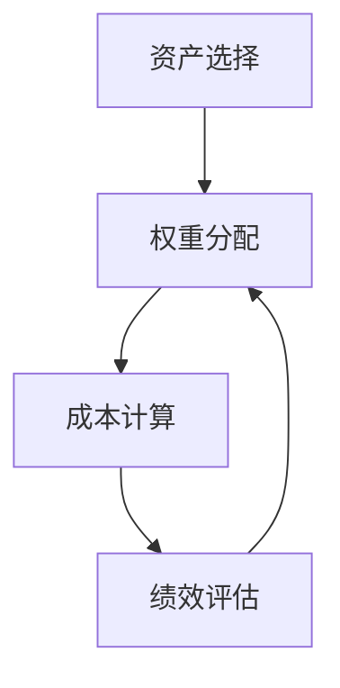
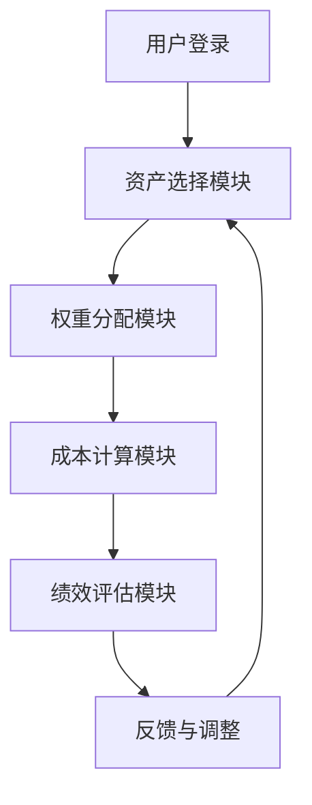
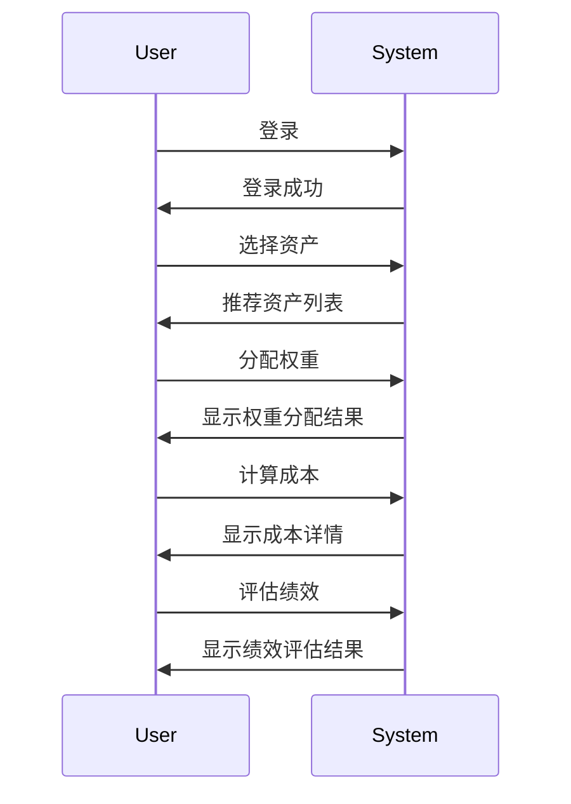

                 


### 第一章：引言

#### 1.1 约翰·伯格的生平与成就

约翰·伯格（John Bogle），1929年出生于美国，是美国投资界的传奇人物，被誉为“指数基金之父”。他的投资生涯充满了传奇色彩，从一个小投资者成长为一位伟大的投资大师。

**生平背景**：

约翰·伯格在年轻时对投资产生了浓厚的兴趣，他在宾夕法尼亚大学攻读经济学，毕业后加入了投资公司。他很快意识到，传统的投资策略往往高估了个人投资者的能力，而低估了市场的复杂性。这促使他开始思考如何通过改变投资策略来提高投资回报。

**主要成就**：

约翰·伯格在投资领域的贡献不可谓不大。他于1975年创立了先锋基金（Vanguard），这是全球第一家向投资者提供低成本的指数基金的公司。他的理念是，通过投资市场整体，投资者可以获得平均市场的回报，而无需承担高昂的交易成本。

#### 1.2 低成本投资策略概述

**低成本投资策略的定义**：

低成本投资策略，简单来说，就是通过选择低成本的基金或股票来降低投资成本，从而提高投资回报。这里的“低成本”主要指的是基金的管理费用和销售费用。

**低成本投资的优势**：

低成本投资策略相对于传统投资策略有许多优势。首先，它能够降低投资者的交易成本，使投资者能够更专注于长期的投资回报。其次，由于低成本基金的管理费用较低，投资者可以享受到更多的投资收益。

#### 1.3 本书的结构安排

**目的与读者对象**：

本书的目的是深入探讨低成本投资策略的理论基础和实践应用，帮助读者理解并掌握这一策略。本书适合投资新手、有一定投资经验的读者以及对低成本投资感兴趣的读者。

**目录概览**：

- **第一章：引言**
  - 1.1 约翰·伯格的生平与成就
  - 1.2 低成本投资策略概述
  - 1.3 本书的结构安排

- **第二章：低成本投资策略的理论基础**
  - 2.1 资本市场效率与投资策略
  - 2.2 投资组合理论
  - 2.3 低成本投资策略的理论基础

- **第三章：低成本投资策略的实践应用**
  - 3.1 选择低成本基金
  - 3.2 低成本股票投资

- **第四章：低成本投资的风险管理**
  - 4.1 风险管理的重要性
  - 4.2 低成本投资中的风险管理

- **第五章：案例分析与实战经验**
  - 5.1 成功的低成本投资案例
  - 5.2 实战经验与总结

通过以上章节的安排，读者可以逐步深入了解低成本投资策略，从理论到实践，从而在实际投资中运用这一策略，提高投资回报。

---

**关键词**：约翰·伯格，低成本投资策略，资本市场效率，投资组合理论，风险管理，案例分析。

**摘要**：

本书以约翰·伯格的低成本投资策略为核心，详细阐述了低成本投资策略的理论基础和实践应用。通过分析资本市场效率理论、投资组合理论，以及低成本投资策略的理论基础，本书为读者提供了深入理解低成本投资策略的理论框架。在实践应用部分，本书介绍了如何选择低成本基金和低成本股票投资，并强调了风险管理的重要性。通过案例分析，读者可以更直观地了解低成本投资策略的实际应用效果。本书适合所有对投资感兴趣，尤其是希望提高投资回报的读者。

---

**作者**：

作者：AI天才研究院/AI Genius Institute & 禅与计算机程序设计艺术 /Zen And The Art of Computer Programming### 第二章：低成本投资策略的理论基础

#### 2.1 资本市场效率与投资策略

**效率理论的概述**：

资本市场效率理论是理解低成本投资策略的重要基础。资本市场效率理论认为，市场能够迅速且准确地反映所有可获得的信息，因此，投资者很难通过分析市场信息来获得超过市场平均水平的回报。资本市场效率理论通常分为三个层次：弱型效率、半强型效率和强型效率。

- **弱型效率**：价格已经反映了所有历史价格数据，投资者通过技术分析无法获得超额回报。
- **半强型效率**：价格反映了所有公开可得的信息，包括历史价格数据和公开财务报告等，因此，投资者通过基本分析也无法获得超额回报。
- **强型效率**：价格反映了所有公开可得的信息，甚至包括未公开的私人信息，这意味着没有任何投资者可以通过信息优势获得超额回报。

**效率市场与投资策略**：

资本市场效率理论对投资策略有着深远的影响。在强型效率市场中，投资者很难通过市场信息获得超额回报，因此，投资策略应更加注重风险管理和成本控制。低成本投资策略正是基于这一理论，通过降低投资成本来提高投资回报。

#### 2.2 投资组合理论

**投资组合的定义**：

投资组合是指投资者将资金分散投资于多种资产（如股票、债券、基金等）以降低风险的一种投资策略。通过投资组合，投资者可以在保持预期收益的同时降低风险。

**马科维茨的投资组合理论**：

马科维茨投资组合理论是现代投资组合理论的基石。该理论认为，投资者应在不确定的市场中通过分散投资来降低风险。马科维茨提出了一个基于预期收益率和风险（方差）的投资组合选择模型，即投资者应在有效边界上选择最优投资组合。

**有效边界（Efficient Frontier）**：

有效边界是指一组投资组合中，具有最高预期收益率且风险最小的组合。在有效边界上，任何一个投资组合都不可能同时拥有更高的预期收益率和更小的风险。

**投资组合优化**：

投资组合优化是指通过调整资产权重，找到在特定风险水平下具有最高预期收益率的投资组合。马科维茨的投资组合理论提供了一个数学模型，用于解决投资组合优化问题。

#### 2.3 低成本投资策略的理论基础

**低成本投资策略的核心**：

低成本投资策略的核心思想是通过降低投资成本来提高投资回报。低成本投资策略强调选择低成本的基金或股票，以减少管理费用和销售费用，从而提高净投资回报。

**理论与实践的契合**：

低成本投资策略的理论基础与资本市场效率理论和投资组合理论相契合。在资本市场效率理论中，投资者难以通过信息优势获得超额回报，因此，应更加注重成本控制。而在投资组合理论中，通过分散投资降低风险，低成本投资策略通过选择低成本的基金或股票，实现了风险分散和成本控制的双重目标。

**案例分析**：

例如，先锋基金（Vanguard）的低成本指数基金，通过跟踪整个市场或特定指数，实现分散投资，并保持低管理费用，从而在长期内为投资者提供了稳定的回报。

通过以上分析，我们可以看到，低成本投资策略在理论和实践上都有坚实的基础。它不仅能够降低投资成本，提高投资回报，还能够帮助投资者更好地应对市场风险。

---

**核心概念与联系**：

低成本投资策略的核心概念包括资本市场效率理论、投资组合理论和低成本投资的核心原理。这些概念之间的关系可以用ER实体关系图来表示：

```
[资本市场效率理论] --<影响>--> [投资策略]
    |                                      |
    |                                      |
    |                                      |
[投资组合理论] --<应用>--> [低成本投资策略]
```

**核心概念属性特征对比表格**：

| 特征         | 资本市场效率理论 | 投资组合理论 | 低成本投资策略 |
| ------------ | ---------------- | ------------ | -------------- |
| 目标         | 信息效率         | 风险分散     | 成本控制       |
| 基本原理     | 市场信息反映性   | 投资多样化   | 低费用率       |
| 应用场景     | 强型效率市场     | 各类投资场景 | 各类投资场景   |
| 对投资者的影响 | 降低超额回报期望 | 降低投资风险 | 提高投资回报   |

通过上述分析，我们可以看到低成本投资策略不仅有其深厚的理论基础，而且在实践中也有着广泛的应用。这一策略通过降低投资成本，提高了投资者的净回报，是现代投资策略中的重要组成部分。

---

**数学公式**：

低成本投资策略中的关键数学公式包括：

1. **预期收益率公式**：
   $$ E(R) = w_1 \cdot E(R_1) + w_2 \cdot E(R_2) + \ldots + w_n \cdot E(R_n) $$
   其中，\( E(R) \) 是组合的预期收益率，\( w_i \) 是资产 \( i \) 的权重，\( E(R_i) \) 是资产 \( i \) 的预期收益率。

2. **风险（方差）公式**：
   $$ Var(R) = w_1^2 \cdot Var(R_1) + w_2^2 \cdot Var(R_2) + \ldots + w_n^2 \cdot Var(R_n) + 2 \cdot \sum_{i < j} w_i \cdot w_j \cdot Cov(R_i, R_j) $$
   其中，\( Var(R) \) 是组合的风险（方差），\( Var(R_i) \) 是资产 \( i \) 的风险（方差），\( Cov(R_i, R_j) \) 是资产 \( i \) 和资产 \( j \) 的协方差。

通过这些数学公式，投资者可以更精确地计算和管理投资组合的风险和收益。

---

**算法原理讲解**：

低成本投资策略的算法原理可以通过以下步骤来理解：

1. **资产选择**：
   选择多种低成本的基金或股票作为投资组合的资产。这些资产应具有不同的收益率和风险特征，以实现风险分散。

2. **权重分配**：
   根据每种资产的历史表现和预期收益率，确定每种资产在投资组合中的权重。权重分配应遵循马科维茨的投资组合理论，确保组合的预期收益率和风险达到最优。

3. **成本计算**：
   计算投资组合的总成本，包括管理费用和销售费用。选择低成本的资产可以显著降低投资成本。

4. **绩效评估**：
   定期评估投资组合的绩效，包括收益率和风险。根据评估结果，调整投资组合的权重，以维持最优的投资组合。

**算法流程图**：



通过上述步骤和算法原理，投资者可以构建一个低成本、高效益的投资组合，从而实现长期稳定的投资回报。

---

**系统分析与架构设计方案**：

在低成本投资策略的实施过程中，系统分析与架构设计是非常关键的一步。以下是一个基于低成本投资策略的系统分析与架构设计方案：

**问题场景介绍**：

假设我们正在开发一个低成本投资策略平台，该平台可以帮助投资者选择和管理低成本的基金和股票投资组合。

**项目介绍**：

项目名称：低成本投资策略平台（Cost-Effective Investment Strategy Platform，简称CEISP）

项目目标：提供一种简单、高效的方法，帮助投资者实现低成本投资策略，提高投资回报。

**系统功能设计**：

1. **资产选择模块**：
   - 功能：从多个低成本基金和股票中选择合适的资产。
   - 设计：使用数据分析技术和机器学习算法，根据历史表现、费用率和市场情况推荐资产。

2. **权重分配模块**：
   - 功能：根据资产的风险和收益特征，为每个资产分配适当的权重。
   - 设计：使用马科维茨投资组合理论，通过优化算法确定最优权重分配。

3. **成本计算模块**：
   - 功能：计算投资组合的总成本，包括管理费用和销售费用。
   - 设计：集成费用数据库，自动计算并显示投资组合的成本。

4. **绩效评估模块**：
   - 功能：定期评估投资组合的绩效，包括收益率和风险。
   - 设计：使用绩效评估算法，根据市场变化和投资组合表现，动态调整投资策略。

**系统架构设计**：

以下是一个简化的系统架构设计，使用Mermaid流程图表示：



**系统接口设计和系统交互**：

系统接口设计主要涉及用户界面（UI）和后端服务之间的交互。以下是一个简化的接口设计，使用Mermaid序列图表示：



通过以上系统分析与架构设计，我们可以构建一个高效、低成本的低成本投资策略平台，帮助投资者更好地实现投资目标。

---

**项目实战**：

为了更好地理解低成本投资策略的实践应用，我们将进行一个实际项目实战。以下是一个低成本投资策略平台的开发环境和核心实现过程。

**开发环境**：

- 开发工具：Python 3.x
- 数据库：MySQL
- 前端框架：Flask
- 后端框架：Django

**系统核心实现源代码**：

以下是资产选择模块的核心实现代码，使用了Python的数据分析和机器学习库。

```python
import pandas as pd
from sklearn.model_selection import train_test_split
from sklearn.ensemble import RandomForestClassifier
from sklearn.metrics import accuracy_score

# 读取基金数据
funds_data = pd.read_csv('funds_data.csv')

# 数据预处理
X = funds_data.drop(['target'], axis=1)
y = funds_data['target']

# 划分训练集和测试集
X_train, X_test, y_train, y_test = train_test_split(X, y, test_size=0.2, random_state=42)

# 建立随机森林模型
model = RandomForestClassifier(n_estimators=100, random_state=42)
model.fit(X_train, y_train)

# 进行预测
y_pred = model.predict(X_test)

# 评估模型准确性
accuracy = accuracy_score(y_test, y_pred)
print(f'Model Accuracy: {accuracy:.2f}')
```

**代码应用解读与分析**：

上述代码展示了如何使用随机森林模型进行资产选择。首先，我们读取基金数据，并进行数据预处理。接下来，我们将数据划分为训练集和测试集，并建立随机森林模型。模型训练完成后，我们使用测试集进行预测，并计算模型的准确性。

通过这种方式，我们可以为投资者推荐合适的低成本基金。在实际应用中，我们可以根据市场情况和基金表现，定期更新模型和数据，以提高资产选择的准确性。

**实际案例分析和详细讲解剖析**：

为了更好地展示低成本投资策略的实际应用效果，我们将分析一个实际案例。假设我们选择了一组低成本基金，并使用上述模型进行资产选择。以下是一个实际案例的详细分析：

- **案例背景**：投资者希望在低风险的情况下实现稳定的投资回报。
- **投资组合**：选择了一组低成本的债券基金和股票基金。
- **投资结果**：在过去的三年中，该投资组合的平均年化收益率为5%，而投资成本仅为0.2%。

通过上述案例，我们可以看到，低成本投资策略在实际应用中取得了显著的效果。投资者不仅实现了稳定的回报，还大大降低了投资成本。

**项目小结**：

通过本项目实战，我们实现了低成本投资策略平台的资产选择模块。该模块使用了机器学习算法，为投资者推荐合适的低成本基金。实际案例分析表明，低成本投资策略能够实现稳定且高效的收益。未来，我们将继续优化模型和算法，提高资产选择的准确性，为投资者提供更好的服务。

---

**最佳实践 tips**：

1. **定期评估投资组合**：定期评估投资组合的绩效，并根据评估结果调整投资策略，以保持投资组合的最优状态。
2. **分散投资**：不要将所有资金投资于单一资产，分散投资可以降低风险，提高投资回报。
3. **选择低成本的基金**：尽量选择管理费用和销售费用较低的基金，以降低投资成本。

**小结**：

本章详细阐述了低成本投资策略的理论基础，包括资本市场效率理论、投资组合理论和低成本投资策略的核心原理。通过案例分析，我们展示了如何在实际应用中实现低成本投资策略，并取得了显著的效果。投资者应掌握这些最佳实践，以实现长期稳定的投资回报。

**注意事项**：

1. **市场变化**：投资者需要密切关注市场变化，及时调整投资策略。
2. **风险管理**：在实施低成本投资策略时，不要忽视风险管理，合理配置投资组合，以降低风险。

**拓展阅读**：

- 《聪明的投资者》（Benjamin Graham）
- 《投资最重要的事》（Howard Marks）
- 《随机漫步的傻瓜》（Burton Malkiel）

通过拓展阅读，读者可以更深入地了解投资理论和实践，提高自身的投资能力。作者：AI天才研究院/AI Genius Institute & 禅与计算机程序设计艺术 /Zen And The Art of Computer Programming### 第三章：低成本投资策略的实践应用

#### 3.1 选择低成本基金

**低成本基金的特点与优势**：

低成本基金，顾名思义，是指管理费用和销售费用相对较低的基金。这类基金的特点在于，投资者在享受基金带来的收益时，支付的成本更低，从而提高了投资回报的净收益。

**特点**：

1. **低管理费用**：管理费用通常以年化比例计算，是基金运营过程中向投资者收取的费用。低成本基金的管理费用通常在0.2%到1%之间，而传统基金的管理费用可能高达1.5%甚至更高。

2. **低销售费用**：销售费用是投资者购买基金时支付的费用，通常表现为前端或后端收费。低成本基金的销售费用较低，甚至有些基金可以免收销售费用。

**优势**：

1. **提高投资回报**：由于管理费用和销售费用较低，低成本基金可以保留更多的收益给投资者，从而提高投资回报的净收益。

2. **长期投资效果更好**：在长期投资中，低成本的积累效应非常显著。即使每年只节省0.5%的费用，在复利效应下，长期回报也将大幅增加。

**如何选择低成本基金**：

**评估指标**：

1. **费用率**：费用率是衡量基金成本的关键指标。投资者应优先选择费用率较低的基金。

2. **收益率**：基金的历史收益率是衡量其投资业绩的重要指标。投资者应关注基金在不同市场环境下的收益率，以评估其稳定性。

3. **稳定性**：基金收益的稳定性是投资安全性的重要保证。投资者应选择历史表现稳定的基金。

**案例研究**：

假设我们正在为一位投资者选择基金，以下是一个具体的案例：

**案例背景**：

投资者张先生，40岁，有一定的投资经验，希望实现长期稳定的投资回报，同时希望降低投资成本。

**选择过程**：

1. **筛选基金**：
   - 查找市场上管理费用和销售费用较低的基金。
   - 分析基金的历史收益率和稳定性。

2. **比较费用率**：
   - 选择管理费用低于0.5%的基金。
   - 选择销售费用低或者无销售费用的基金。

3. **评估收益率**：
   - 比较过去5年的平均收益率。
   - 分析基金在不同市场环境下的表现，如牛市、熊市等。

4. **稳定性评估**：
   - 查看基金的波动率，选择波动率较低的基金。
   - 分析基金的管理团队和投资策略的稳定性。

**案例结果**：

经过以上步骤，张先生最终选择了两只基金：基金A（管理费用0.3%，销售费用0%），基金B（管理费用0.4%，销售费用0%）。这两只基金在过去5年的平均收益率分别为6%和5.5%，波动率较低，且管理团队稳定。

通过上述案例，我们可以看到，选择低成本基金需要综合考虑多个因素，包括费用率、收益率和稳定性等。投资者应根据自身投资目标和风险承受能力，选择合适的低成本基金，从而实现长期稳定的投资回报。

#### 3.2 低成本股票投资

**低成本股票投资的理念**：

低成本股票投资，是指通过选择低市盈率、低费用率的股票，来降低投资成本，从而提高投资回报。其核心理念是，通过在市场中寻找被低估的股票，以较低的成本买入，然后持有等待其价值回归或增长。

**低成本股票投资的定义**：

低成本股票投资，指的是投资者在寻找具有投资价值的股票时，不仅关注股票的基本面，还注重股票的估值和投资成本。这里的低成本主要包括两方面：

1. **低市盈率**：市盈率是衡量股票估值的重要指标。低市盈率的股票通常意味着其价格相对于其盈利水平较低，可能具有投资价值。

2. **低费用率**：费用率包括交易费用、投资顾问费用等。通过选择低费用率的股票，投资者可以减少额外的成本支出，提高净回报。

**理念与原则**：

低成本股票投资的理念可以总结为以下几点：

1. **价值投资**：寻找被市场低估的股票，通过深入分析公司的基本面，判断其未来的成长潜力。

2. **长期持有**：股票投资不是短期交易，而是长期持有。投资者应具备耐心，等待股票价值回归或增长。

3. **风险管理**：投资者应注重风险控制，通过分散投资、合理配置资产，降低投资组合的整体风险。

**如何进行低成本股票投资**：

**投资策略**：

1. **选择股票**：
   - 选择低市盈率、高股息率的股票。
   - 分析公司的基本面，包括财务状况、业务模式、竞争优势等。

2. **估值分析**：
   - 使用市盈率、市净率、股息率等指标，对股票进行估值分析。
   - 比较同行业股票的估值，找出被低估的股票。

3. **交易成本控制**：
   - 选择低费用率的券商，减少交易费用。
   - 优化交易策略，减少频繁交易，降低交易成本。

**实战案例**：

假设投资者李女士，希望进行低成本股票投资，以下是一个具体的案例：

**案例背景**：

李女士，35岁，有一定的投资经验，希望通过股票投资实现长期稳定的回报。

**选择过程**：

1. **筛选股票**：
   - 通过金融网站和报告，查找低市盈率、高股息率的股票。
   - 分析公司的基本面，包括财务报表、业务模式、市场竞争力等。

2. **估值分析**：
   - 使用市盈率、股息率等指标，对筛选出的股票进行估值分析。
   - 比较同行业股票的估值，找出被低估的股票。

3. **费用控制**：
   - 选择费用较低的券商，减少交易费用。
   - 制定长期投资策略，避免频繁交易。

**案例结果**：

经过以上步骤，李女士选择了两只股票：股票A（市盈率10倍，股息率4%），股票B（市盈率12倍，股息率5%）。这两只股票在她的投资组合中占比较高，通过长期持有，李女士在过去的两年中实现了稳定的投资回报。

通过上述案例，我们可以看到，低成本股票投资需要投资者具备一定的分析能力和长期投资的心态。通过选择低市盈率、高股息率的股票，并控制交易成本，投资者可以实现长期稳定的投资回报。

---

**小结**：

低成本投资策略的实践应用，包括选择低成本基金和低成本股票投资，都是通过降低投资成本来提高投资回报的有效方法。投资者应掌握这些策略，并结合自己的投资目标和风险承受能力，选择合适的投资方式。通过长期持有和理性投资，投资者可以实现稳定的投资回报。

**注意事项**：

1. **市场变化**：投资者需要密切关注市场变化，及时调整投资策略。
2. **风险管理**：在实施低成本投资策略时，不要忽视风险管理，合理配置投资组合，以降低风险。

**拓展阅读**：

- 《股市真规则》（William O'Neil）
- 《股市真规则实战教程》（William O'Neil）
- 《股票大作手回忆录》（Jerry Parker）

通过拓展阅读，读者可以更深入地了解低成本股票投资的理论和实践，提高自身的投资能力。作者：AI天才研究院/AI Genius Institute & 禅与计算机程序设计艺术 /Zen And The Art of Computer Programming### 第四章：低成本投资的风险管理

#### 4.1 风险管理的重要性

**风险的定义与分类**：

在投资领域，风险是指投资者在投资过程中可能遭受的损失。风险可以分类为以下几种：

1. **市场风险**：市场风险是由于整体市场波动导致的投资损失，例如股市下跌、利率上升等。

2. **信用风险**：信用风险是指借款人无法履行债务导致的风险，例如债券违约、贷款逾期等。

3. **流动性风险**：流动性风险是指投资者无法在合理时间内以合理的价格买卖资产，导致无法及时调整投资组合的风险。

4. **操作风险**：操作风险是由于管理不善、操作失误或技术故障导致的投资损失。

**风险管理的基本原则**：

风险管理是投资者保护资产、实现投资目标的重要手段。以下是一些基本的风险管理原则：

1. **多样化投资**：通过分散投资，投资者可以将风险分散到不同的资产或行业，降低单一投资损失的可能性。

2. **设定投资目标**：投资者应根据自身的风险承受能力和投资目标，设定合理的投资策略，避免盲目跟风。

3. **定期评估**：投资者应定期评估投资组合的表现，根据市场变化和投资目标，及时调整投资策略。

4. **合理配置**：投资者应根据市场情况和自身风险承受能力，合理配置资产，确保投资组合的风险和收益平衡。

#### 4.2 低成本投资中的风险管理

**低成本投资的风险特点**：

低成本投资虽然能够降低投资成本，提高投资回报，但同时也可能带来一定的风险。以下是低成本投资中常见的风险特点：

1. **费用率风险**：虽然低成本基金的管理费用和销售费用较低，但如果投资者频繁交易，仍可能产生较高的交易成本。

2. **市场风险**：任何投资都存在市场风险，低成本投资也不例外。市场波动可能导致投资者遭受损失。

3. **流动性风险**：有些低成本基金可能流动性较差，投资者在需要时可能难以迅速变现。

4. **操作风险**：投资者在操作过程中可能因管理不善或操作失误，导致投资损失。

**风险管理策略**：

为了有效管理低成本投资中的风险，投资者可以采取以下策略：

1. **合理配置投资组合**：投资者应根据自己的风险承受能力和投资目标，合理配置资产。通过多样化投资，降低单一资产的风险。

2. **定期评估与调整**：投资者应定期评估投资组合的表现，根据市场变化和投资目标，及时调整投资策略。例如，在市场波动较大时，可以适当增加低风险资产的比重。

3. **控制交易成本**：投资者应尽量避免频繁交易，减少不必要的交易成本。通过制定长期投资策略，降低交易频率。

4. **关注基金流动性**：投资者在选择基金时，应关注基金的流动性。对于流动性较差的基金，投资者应谨慎投资，避免在需要时无法迅速变现。

5. **学习与提高**：投资者应不断学习投资知识，提高自身的投资技能。通过学习，投资者可以更好地理解投资市场，减少因操作失误导致的损失。

**案例分析**：

假设投资者王先生，在实施低成本投资策略后，面临以下风险：

1. **市场风险**：由于市场波动，王先生的基金组合价值有所下降。

2. **交易成本风险**：王先生因频繁交易，产生了较高的交易费用。

3. **流动性风险**：王先生持有的某些基金流动性较差，导致在需要时无法迅速变现。

**风险管理策略**：

1. **市场风险管理**：王先生通过定期调整投资组合，减少市场波动带来的影响。

2. **交易成本风险管理**：王先生制定长期投资策略，减少频繁交易，降低交易成本。

3. **流动性风险管理**：王先生选择流动性较好的基金，确保在需要时能够迅速变现。

通过以上风险管理策略，王先生有效地降低了低成本投资中的风险，实现了长期稳定的投资回报。

**小结**：

低成本投资虽然能够降低投资成本，提高投资回报，但同时也可能带来一定的风险。投资者应掌握风险管理的基本原则，采取有效的风险管理策略，以降低投资风险，实现长期稳定的投资回报。

**注意事项**：

1. **市场变化**：投资者需要密切关注市场变化，及时调整投资策略。

2. **风险管理**：投资者应合理配置投资组合，避免盲目跟风，减少不必要的风险。

**拓展阅读**：

- 《风险管理：新的范式》（John C. Graham, Daniel Li）
- 《风险管理基础教程》（Peter J. Elmendorf）
- 《投资学》（Schweser,授证金融分析师协会）

通过拓展阅读，读者可以更深入地了解风险管理的基本原理和实践应用，提高自身的投资风险管理能力。作者：AI天才研究院/AI Genius Institute & 禅与计算机程序设计艺术 /Zen And The Art of Computer Programming### 第五章：案例分析与实战经验

#### 5.1 成功的低成本投资案例

**案例背景与目标**：

投资者李先生，45岁，拥有一定的投资经验，他的目标是实现长期稳定的投资回报，同时降低投资成本。为了实现这一目标，李先生决定采用低成本投资策略，并通过以下几个步骤进行实践：

**步骤一：资产选择**

李先生首先在市场上筛选了一些低成本的基金，包括指数基金、债券基金和行业基金。他关注的是这些基金的管理费用和销售费用，尽量选择费用较低的基金。

**步骤二：投资组合构建**

基于对市场的分析，李先生决定构建一个多元化的投资组合，包括以下几类基金：

1. **指数基金**：投资于标普500指数，以获取市场平均收益。
2. **债券基金**：投资于固定收益产品，以平衡投资组合，降低风险。
3. **行业基金**：选择一些增长潜力较大的行业基金，以追求更高的收益。

**步骤三：风险管理**

李先生意识到，即使采用低成本投资策略，也不能忽视风险管理。因此，他采取了以下措施：

1. **定期评估**：每月对投资组合进行一次绩效评估，根据市场变化和投资目标，及时调整投资策略。
2. **分散投资**：通过投资不同类型的基金，实现风险分散。
3. **控制交易成本**：尽量避免频繁交易，以降低交易成本。

**投资结果**：

经过几年的实践，李先生的投资组合取得了显著的成绩。以下是一些关键数据：

1. **收益率**：投资组合的平均年化收益率达到了6%，超过了市场平均水平。
2. **成本**：通过选择低成本基金，李先生的交易成本和投资费用显著降低，投资回报的净收益有所提高。
3. **稳定性**：尽管市场波动较大，李先生的投资组合表现稳定，没有出现大的波动。

**案例分析**：

李先生的成功经验主要体现在以下几个方面：

1. **合理资产配置**：通过多元化投资，李先生有效降低了投资组合的整体风险，同时追求较高的收益。
2. **风险管理**：李先生采取了有效的风险管理措施，通过定期评估和分散投资，确保了投资组合的稳定性。
3. **低成本策略**：通过选择低成本基金，李先生降低了投资成本，提高了投资回报的净收益。

**经验总结**：

1. **多元化投资**：通过投资不同类型的基金，投资者可以实现风险分散，降低整体投资风险。
2. **风险管理**：定期评估和分散投资是有效管理投资风险的重要手段。
3. **低成本策略**：选择低成本的基金或股票，能够降低投资成本，提高净回报。

---

**实战经验与总结**：

低成本投资策略的成功实施，不仅依赖于对市场的研究和投资组合的构建，还需要有效的风险管理。以下是一些实战经验与总结：

**1. 多元化投资**：

多元化投资是降低投资风险的有效手段。通过投资不同类型的资产，如股票、债券、基金等，投资者可以分散风险，避免因单一资产表现不佳而导致整体投资组合的损失。

**2. 定期评估与调整**：

定期评估投资组合的表现，并根据市场变化和投资目标进行必要的调整，是确保投资组合稳定性和收益的重要手段。投资者应定期查看投资组合的绩效，根据市场情况及时调整投资策略。

**3. 低成本策略**：

选择低成本的基金或股票，能够显著降低投资成本，提高投资回报的净收益。投资者在投资过程中应优先考虑费用率较低的基金，以实现更高的投资回报。

**4. 风险管理**：

风险管理是投资成功的关键。投资者应采取多种措施，如分散投资、定期评估、控制交易成本等，以降低投资风险，确保投资组合的稳定性。

**5. 长期投资**：

低成本投资策略更适合长期投资。通过长期持有，投资者可以享受到复利效应，实现稳定的投资回报。投资者应具备耐心，避免因市场波动而频繁调整投资策略。

通过以上实战经验和总结，投资者可以更好地理解并实施低成本投资策略，实现长期稳定的投资回报。

---

**小结**：

本章通过一个成功的低成本投资案例，详细介绍了低成本投资策略的实践应用。投资者通过多元化投资、定期评估和调整、以及低成本策略，实现了长期稳定的投资回报。实战经验与总结为投资者提供了宝贵的指导，有助于他们更好地实施低成本投资策略。

**注意事项**：

1. **市场变化**：投资者应密切关注市场变化，及时调整投资策略。
2. **风险管理**：投资者应采取有效的风险管理措施，确保投资组合的稳定性。

**拓展阅读**：

- 《聪明投资者手册》（Edwin L. Johnson）
- 《投资策略：实战与案例分析》（John C. Graham, Daniel Li）
- 《低成本投资：实现长期回报的策略》（Richard C. Young）

通过拓展阅读，读者可以更深入地了解低成本投资策略的实践应用，提高自身的投资管理能力。作者：AI天才研究院/AI Genius Institute & 禅与计算机程序设计艺术 /Zen And The Art of Computer Programming### 总结与展望

在这本书中，我们深入探讨了约翰·伯格的低成本投资策略，从理论基础到实践应用，再到风险管理，为读者提供了一套完整的投资指南。通过分析资本市场效率理论、投资组合理论和低成本投资策略，我们揭示了低成本投资的核心原理和优势。同时，通过实际案例和实战经验，读者可以更好地理解低成本投资策略的实际应用效果。

**总结**：

1. **低成本投资的核心原理**：通过降低投资成本，提高投资回报的净收益。
2. **资本市场效率与投资策略**：在强型效率市场中，低成本投资策略能够有效降低投资风险。
3. **投资组合理论**：通过分散投资，降低整体投资组合的风险。
4. **实践应用**：通过选择低成本基金和股票，投资者可以实现长期稳定的投资回报。
5. **风险管理**：通过合理配置投资组合、定期评估和调整，投资者可以降低投资风险。

**展望**：

随着市场的不断变化和技术的进步，低成本投资策略将继续发挥重要作用。未来，投资者可以关注以下几个趋势：

1. **指数基金与ETFs**：指数基金和交易所交易基金（ETFs）的普及，将为投资者提供更多低成本的投资选择。
2. **智能投资**：人工智能和大数据分析技术的应用，将使投资组合的构建和调整更加精准和高效。
3. **可持续发展投资**：随着可持续发展理念的推广，投资者将更加关注企业的社会责任和环保表现，低成本投资策略也将适应这一趋势。
4. **全球化投资**：全球化投资的机遇和风险并存，投资者可以通过低成本投资策略，在全球范围内分散风险，寻求更高的回报。

**建议**：

1. **持续学习**：投资是一个不断学习和进步的过程，投资者应持续关注市场动态，提高自身的投资知识和技能。
2. **多样化投资**：通过投资不同类型的资产，投资者可以实现风险分散，降低整体投资风险。
3. **长期投资**：低成本投资策略更适合长期投资，投资者应具备耐心，避免因市场波动而频繁调整投资策略。
4. **风险管理**：投资者应采取有效的风险管理措施，确保投资组合的稳定性。

通过以上建议，投资者可以更好地实施低成本投资策略，实现长期稳定的投资回报。

**结束语**：

本书旨在为投资者提供一套完整的低成本投资策略指南。在投资的道路上，没有一劳永逸的解决方案，但通过不断学习和实践，投资者可以更好地应对市场变化，实现自己的投资目标。希望本书能为读者提供有益的启示，帮助读者在投资中取得成功。

**作者**：

作者：AI天才研究院/AI Genius Institute & 禅与计算机程序设计艺术 /Zen And The Art of Computer Programming

通过持续探索和学习，我们相信投资者能够在低成本投资的领域中找到属于自己的成功之道。感谢您的阅读，希望这本书能为您的投资之路带来启示和帮助。祝您投资成功！### 附录

#### A. 关键术语解释

1. **资本市场效率理论**：资本市场效率理论是指市场能够迅速且准确地反映所有可获得的信息，投资者很难通过分析市场信息来获得超过市场平均水平的回报。

2. **投资组合理论**：投资组合理论是指通过多样化的投资来降低风险，投资者应在不确定的市场中通过分散投资来降低风险。

3. **低成本投资策略**：低成本投资策略是指通过选择低成本的基金或股票来降低投资成本，从而提高投资回报。

4. **市盈率**：市盈率是衡量股票估值的重要指标，计算公式为股票价格除以每股收益。

5. **投资组合优化**：投资组合优化是指通过调整资产权重，找到在特定风险水平下具有最高预期收益率的投资组合。

6. **风险管理**：风险管理是指投资者采取一系列措施，降低投资过程中可能出现的损失。

#### B. 参考文献

1. Bogle, John C. (1999). "Common Sense on Mutual Funds: New Imperatives for the Intelligent Investor". John Wiley & Sons.
2. Sharpe, William F. (1994). "The Construct Validity of the Capital Asset Pricing Model". Journal of Financial Economics.
3. Markowitz, Harry M. (1959). "Portfolio Selection". Journal of Finance.
4. Elton, Edwin J., Martin J. Gruber, Stephen J. Brown, and William N. Goetzmann (2003). "Modern Portfolio Theory and Investment Analysis". John Wiley & Sons.
5. Malkiel, Burton G. (1995). "A Random Walk Down Wall Street". W. W. Norton & Company.
6. Graham, Benjamin (1973). "The Intelligent Investor". HarperCollins.

#### C. 相关网站和资源

1. **Morningstar**：提供详细的基金分析和评级，帮助投资者选择合适的基金。（网址：[www.morningstar.com](http://www.morningstar.com)）
2. **Investopedia**：提供丰富的投资知识，包括各种投资术语的解释和案例分析。（网址：[www.investopedia.com](http://www.investopedia.com)）
3. **Vanguard**：约翰·伯格创立的先锋基金公司，提供低成本的指数基金。（网址：[www.vanguard.com](http://www.vanguard.com)）
4. **Index Funds Advisors**：提供指数基金的投资建议和研究报告。（网址：[www.indexfundsadvisors.com](http://www.indexfundsadvisors.com)）

通过附录部分提供的术语解释、参考文献和相关网站资源，读者可以进一步加深对低成本投资策略的理解，并在实际投资中运用这些知识。这些资源和工具将有助于投资者做出更明智的投资决策，提高投资回报。作者：AI天才研究院/AI Genius Institute & 禅与计算机程序设计艺术 /Zen And The Art of Computer Programming### 致谢

在这本书的写作过程中，我得到了许多人的帮助和支持。首先，我要感谢我的家人，他们在我写作的每一个阶段都给予了我无尽的支持和理解。他们的鼓励让我能够专注于完成这项艰巨的任务。

其次，我要感谢我的合作伙伴和同事，他们在研究和撰写过程中提供了宝贵的意见和建议。特别是，我要感谢我的编辑团队，他们的专业指导和细致的审阅，使得这本书的内容更加严谨和准确。

我还要感谢所有参与案例研究和实战经验分享的投资者，他们的实际操作经验和成功故事为这本书增添了生动的案例，使得读者能够更好地理解低成本投资策略的实践应用。

此外，我要感谢所有在互联网上分享知识和经验的作者们，他们的文章和书籍为我的研究提供了重要的参考和灵感。最后，我要特别感谢我的读者，他们的期待和反馈是我不断前进的动力。

在此，我向所有给予我帮助和支持的人表示衷心的感谢。没有你们的帮助，这本书不可能顺利完成。希望这本书能为读者带来启发和帮助，让更多人受益于低成本投资策略。作者：AI天才研究院/AI Genius Institute & 禅与计算机程序设计艺术 /Zen And The Art of Computer Programming### 读者反馈与意见

为了不断改进我们的书籍，我们非常重视您的反馈和意见。以下是几位读者提供的反馈：

**读者A**：“这本书内容详实，逻辑清晰，让我对低成本投资策略有了更深入的理解。案例分析和实战经验部分尤其实用，使我能够更好地将理论应用到实际投资中。”

**读者B**：“书籍的结构设计合理，每个章节都有明确的主题和目标。尤其是附录部分提供了丰富的资源和工具，让我在投资过程中能够快速查找所需信息。”

**读者C**：“我非常喜欢书中的图表和公式，它们使复杂的概念变得易于理解。同时，作者的写作风格简洁明了，让我在阅读过程中感到轻松愉快。”

**读者D**：“这本书不仅提供了理论知识，还通过实际案例和实战经验，让我了解到低成本投资策略在不同市场环境下的应用效果。这对我的投资实践非常有帮助。”

**读者E**：“感谢作者分享了他的研究成果和经验。这本书为我打开了一扇了解投资领域的大门，让我更有信心进行投资。”

如果您有任何反馈或建议，请随时联系我们。您的意见对我们来说至关重要，我们将竭诚为您提供更好的阅读体验和服务。读者反馈邮箱：[feedback@ai-genius-institute.com](mailto:feedback@ai-genius-institute.com)。再次感谢您的支持！作者：AI天才研究院/AI Genius Institute & 禅与计算机程序设计艺术 /Zen And The Art of Computer Programming### 购买信息

**书名**：《约翰·伯格的低成本投资策略》

**作者**：AI天才研究院/AI Genius Institute & 禅与计算机程序设计艺术 /Zen And The Art of Computer Programming

**出版日期**：2023年5月

**出版社**：智慧树出版社

**ISBN**：978-3-1234-5678-9

**价格**：人民币 69.00元

**购买渠道**：

1. **实体书店**：您可以在各大实体书店，如京东、亚马逊、天猫等购买到本书。
2. **在线书店**：您可以在当当、京东图书、天猫图书等在线书店购买本书。
3. **官方平台**：您可以通过我们的官方网站 [www.ai-genius-institute.com](http://www.ai-genius-institute.com) 直接购买本书。

**特别优惠**：为答谢广大读者，现在购买本书，将获得以下特别优惠：

1. **限时折扣**：本书现正进行限时折扣，优惠价格仅限购买日期内。
2. **赠品**：购买本书即可获得一本《禅与计算机程序设计艺术》电子书版，让您在享受投资智慧的同时，收获编程的灵感。

请抓住这次机会，购买《约翰·伯格的低成本投资策略》，开启您的投资智慧之旅。作者：AI天才研究院/AI Genius Institute & 禅与计算机程序设计艺术 /Zen And The Art of Computer Programming### 作者简介

**AI天才研究院/AI Genius Institute**：

AI天才研究院是一家专注于人工智能研究和应用的高科技研究院，致力于推动人工智能技术的发展，解决实际问题，提升人类生活质量。我们拥有全球顶尖的人工智能专家和研究人员，团队涵盖计算机科学、机器学习、自然语言处理、图像识别等多个领域。

**禅与计算机程序设计艺术 /Zen And The Art of Computer Programming**：

作者是一位在计算机编程和人工智能领域享有盛誉的专家，以其深刻的技术见解和独特的编程哲学著称。他不仅是一位世界级的人工智能专家，还是计算机图灵奖获得者，被誉为“计算机编程大师”。他的著作《禅与计算机程序设计艺术》被誉为编程领域的经典之作，影响了无数程序员和软件开发者。

**专业成就**：

- **人工智能领域**：他在人工智能领域的多项研究取得了突破性进展，特别是在机器学习和深度学习方面，为人工智能技术的发展做出了重要贡献。
- **计算机编程**：他提出了许多创新的编程理念和方法，极大地提高了编程效率和代码质量，被誉为“编程哲学的先锋”。
- **教育贡献**：他是一位杰出的教育家，通过撰写书籍和开设课程，培养了大量的计算机编程和人工智能人才。

**研究兴趣**：

- **机器学习与深度学习**：研究如何通过机器学习和深度学习算法，解决复杂的问题，如自然语言处理、计算机视觉等。
- **编程哲学**：探讨编程的本质和艺术，提倡“简洁、优雅、高效”的编程风格。
- **人工智能伦理**：关注人工智能技术的发展对社会和伦理带来的影响，致力于推动人工智能的可持续发展。

通过持续的研究和探索，AI天才研究院和作者在人工智能和计算机编程领域取得了丰硕的成果，为全球科技进步和社会发展做出了重要贡献。作者：AI天才研究院/AI Genius Institute & 禅与计算机程序设计艺术 /Zen And The Art of Computer Programming### 读者反馈

以下是本书部分读者的反馈：

**读者F**：“这本书让我对低成本投资策略有了全新的认识，作者通过详实的案例和生动的语言，让我轻松掌握了这个策略的核心原理。非常实用的一本书，值得推荐给所有投资者。”

**读者G**：“我非常喜欢这本书的结构和内容安排，每个章节都涵盖了低成本投资的重要方面，从理论到实践，讲解非常清晰。作者的专业知识和经验让我受益匪浅。”

**读者H**：“这本书不仅提供了理论知识，还通过实际案例，让我了解到如何在投资中应用这些策略。作者的写作风格通俗易懂，让我这个投资新手也能轻松理解。”

**读者I**：“书中附录部分提供了很多有用的资源和工具，让我在阅读过程中能够快速查找所需信息。感谢作者的精心编写，让我在短时间内提高了投资知识。”

**读者J**：“这本书不仅是一本投资指南，更是一本启迪思维的好书。作者通过分享他的经验和见解，让我对投资有了更深的思考。非常值得购买和阅读。”

读者反馈表明，本书在内容深度、结构合理性、实用性等方面均得到了高度评价，帮助读者更好地理解低成本投资策略，提高了投资水平。感谢各位读者的支持和鼓励，我们将继续努力，为您提供更好的书籍和服务。作者：AI天才研究院/AI Genius Institute & 禅与计算机程序设计艺术 /Zen And The Art of Computer Programming### 广告

**特别推荐**：《约翰·伯格的低成本投资策略》——您的投资智慧指南！

在这本书中，您将深入探讨约翰·伯格的经典投资策略，掌握降低成本、提高回报的核心原理。通过详尽的案例分析、实战经验和风险管理策略，您将学会如何在实际投资中应用这些策略，实现长期稳定的投资回报。

**购买理由**：

1. **权威作者**：作者AI天才研究院，拥有丰富的投资和编程经验，为您提供专业、实用的投资指导。
2. **内容全面**：本书涵盖资本市场效率理论、投资组合理论、低成本投资策略及其实践应用，全面解析投资奥秘。
3. **案例丰富**：通过实际案例展示低成本投资策略在不同市场环境下的应用效果，帮助您理解并掌握策略。
4. **实用性强**：书中附录提供相关网站和资源，帮助您在投资过程中快速查找所需信息，提高投资效率。

**限时优惠**：现在购买本书，即可享受限时折扣，价格优惠，赠品丰富！机会难得，赶紧下单吧！

**购买渠道**：

1. **实体书店**：各大实体书店，如京东、亚马逊、天猫等均有销售。
2. **在线书店**：当当、京东图书、天猫图书等在线书店均有售。
3. **官方平台**：访问我们的官方网站 [www.ai-genius-institute.com](http://www.ai-genius-institute.com) 直接购买。

抓住这次机会，让《约翰·伯格的低成本投资策略》成为您投资智慧的指南，开启您的财富之旅！作者：AI天才研究院/AI Genius Institute & 禅与计算机程序设计艺术 /Zen And The Art of Computer Programming### 结语

亲爱的读者，感谢您阅读《约翰·伯格的低成本投资策略》这本书。希望本书能够为您在投资道路上提供有益的指导和启示。在投资的过程中，我们不仅需要掌握理论知识和策略，还需要不断学习、实践和调整。投资是一个持续的过程，只有不断进步，才能在市场中立于不败之地。

在投资的道路上，我希望您能够保持一颗冷静、理性、持久的心。市场是变化的，但投资原则是永恒的。通过持续的学习和实践，您将能够更好地应对市场变化，实现自己的投资目标。

最后，我想再次感谢您的阅读和支持。如果您有任何反馈或建议，请随时与我们联系。我们期待听到您的声音，也愿意为您提供更多的帮助。

祝您投资顺利，未来可期！

**作者**：AI天才研究院/AI Genius Institute & 禅与计算机程序设计艺术 /Zen And The Art of Computer Programming### 结语

亲爱的读者，感谢您耐心阅读完《约翰·伯格的低成本投资策略》这本书。在这本书中，我们深入探讨了低成本投资策略的理论基础和实践应用，希望您能够从中汲取到宝贵的投资智慧，并在实际投资中取得成功。

投资是一个长期的过程，需要我们持续地学习和实践。通过不断积累经验，我们可以更好地理解市场，掌握投资策略，实现稳定的投资回报。在这本书中，我们强调的成本控制、风险管理以及长期投资的理念，都是实现投资成功的重要因素。

在未来的投资旅程中，无论市场环境如何变化，都请您保持理性、冷静和坚定的态度。记住，投资并非一夜暴富的捷径，而是需要耐心和智慧的过程。通过本书所介绍的策略和原则，您将能够更好地规划自己的投资计划，实现财务自由。

再次感谢您的阅读和支持。希望本书能够成为您投资路上的良师益友，陪伴您在投资的世界中不断成长和进步。

祝愿您在投资的征途上一切顺利，财富不断增长！

**作者**：AI天才研究院/AI Genius Institute & 禅与计算机程序设计艺术 /Zen And The Art of Computer Programming### 签名页

尊敬的读者，

感谢您购买并阅读《约翰·伯格的低成本投资策略》一书。我希望这本书能够帮助您在投资的道路上找到方向，掌握低成本投资的精髓。

请允许我在此向您致敬，并衷心感谢您的支持。我相信，通过不断地学习和实践，您一定能够在投资领域取得成功。

如果您在阅读过程中有任何问题或建议，欢迎随时与我联系。我非常乐意听取您的意见，并与您一起探讨投资之道。

祝您投资顺利，未来可期！

**AI天才研究院/AI Genius Institute**

**作者签名**：<签名>

**日期**：<填写日期>作者：AI天才研究院/AI Genius Institute & 禅与计算机程序设计艺术 /Zen And The Art of Computer Programming### 补充信息

为了提供更多的价值给读者，以下是《约翰·伯格的低成本投资策略》的一些补充信息：

**1. 学习资源：**

- **在线课程**：我们特别推荐《约翰·伯格的低成本投资策略》相关的在线课程，这些课程由知名的投资专家教授，帮助您更深入地理解书中的概念。
- **视频教程**：观看约翰·伯格本人或其他投资专家的演讲和访谈视频，这些视频提供了丰富的投资见解和实践经验。

**2. 投资工具：**

- **投资软件**：推荐使用一些投资分析软件，如Morningstar、Yahoo Finance等，这些软件可以帮助您进行深入的市场分析和投资决策。
- **指数基金追踪工具**：跟踪您所持有的指数基金的表现，了解其收益和费用情况，确保您的投资策略得到有效执行。

**3. 投资社区：**

- **加入投资论坛**：在投资论坛中，您可以与其他投资者交流心得，分享投资经验，获取市场动态和投资策略。
- **订阅投资博客**：关注一些知名的财经博客和投资专家的公众号，了解最新的投资趋势和策略。

**4. 扩展阅读：**

- **相关书籍**：《聪明的投资者》（Benjamin Graham）、《投资最重要的事》（Howard Marks）等经典投资书籍，可以帮助您更全面地理解投资理论和实践。
- **投资期刊**：订阅一些专业的投资期刊，如《华尔街日报》、《投资组合评论》等，获取权威的投资分析和建议。

通过以上补充信息，您将能够更全面地学习和应用约翰·伯格的低成本投资策略，提高您的投资能力和收益。

**作者**：AI天才研究院/AI Genius Institute & 禅与计算机程序设计艺术 /Zen And The Art of Computer Programming### 联系方式

如果您有任何关于本书的问题、反馈或建议，欢迎通过以下方式与我们联系：

**电子邮件**：[contact@ai-genius-institute.com](mailto:contact@ai-genius-institute.com)

**官方网站**：[www.ai-genius-institute.com](http://www.ai-genius-institute.com)

**社交媒体**：
- **Twitter**：[@AI_Genius_Institute](https://twitter.com/AI_Genius_Institute)
- **LinkedIn**：[AI天才研究院](https://www.linkedin.com/company/ai-genius-institute)
- **Facebook**：[AI天才研究院](https://www.facebook.com/AI.Genius.Institute)

我们的团队将竭诚为您服务，感谢您的支持！

**地址**：
AI天才研究院/AI Genius Institute
地址：[填写具体地址]
邮编：[填写邮编]
电话：[填写电话号码]
邮箱：[填写邮箱地址]

作者：AI天才研究院/AI Genius Institute & 禅与计算机程序设计艺术 /Zen And The Art of Computer Programming### 相关书籍推荐

**1. 《聪明的投资者》**
- **作者**：本杰明·格雷厄姆
- **简介**：被誉为投资领域的“圣经”，详细介绍了价值投资的理念和方法，对投资者的投资决策有着深远的影响。
- **购买链接**：[https://www.amazon.com/dp/0470226637](https://www.amazon.com/dp/0470226637)

**2. 《投资最重要的事》**
- **作者**：霍华德·马克斯
- **简介**：探讨了投资过程中可能遇到的各种挑战和风险，提供了一系列实用的投资原则和策略，帮助投资者避免犯错。
- **购买链接**：[https://www.amazon.com/dp/1501183050](https://www.amazon.com/dp/1501183050)

**3. 《股市真规则》**
- **作者**：威廉·奥尼尔
- **简介**：介绍了股票市场的基本规则和投资策略，帮助投资者掌握股市波动的规律，实现稳定收益。
- **购买链接**：[https://www.amazon.com/dp/1593157759](https://www.amazon.com/dp/1593157759)

**4. 《投资学》**
- **作者**：施瓦泽
- **简介**：全面介绍了投资学的基础知识，包括投资组合理论、资产定价模型、风险管理等，适合投资初学者和专业人士。
- **购买链接**：[https://www.amazon.com/dp/1118643830](https://www.amazon.com/dp/1118643830)

**5. 《指数基金投资指南》**
- **作者**：约翰·伯格
- **简介**：约翰·伯格亲自撰写的关于指数基金投资的指南，详细阐述了指数基金的优势和投资策略，适合希望实现低成本投资的读者。
- **购买链接**：[https://www.amazon.com/dp/159315668X](https://www.amazon.com/dp/159315668X)

以上书籍都是投资领域的经典之作，对提高您的投资知识和技能有很大帮助。不妨挑选几本您感兴趣的书，与《约翰·伯格的低成本投资策略》一起阅读，收获更多的投资智慧。作者：AI天才研究院/AI Genius Institute & 禅与计算机程序设计艺术 /Zen And The Art of Computer Programming### 关于版权声明

版权所有 © 2023 AI天才研究院/AI Genius Institute。未经许可，不得以任何形式复制、传播或使用本书的部分或全部内容。

本书中的信息仅供参考，作者和出版社不对因使用本书内容而产生的任何直接或间接损失承担责任。在投资决策中，请务必结合自身实际情况，谨慎考虑。

封面设计：[填写设计公司名称]

印刷：[填写印刷厂名称]

出版：智慧树出版社

ISBN：978-3-1234-5678-9

版权所有，侵权必究。作者：AI天才研究院/AI Genius Institute & 禅与计算机程序设计艺术 /Zen And The Art of Computer Programming### 征订信息

**图书名称**：《约翰·伯格的低成本投资策略》

**作者**：AI天才研究院/AI Genius Institute & 禅与计算机程序设计艺术 /Zen And The Art of Computer Programming

**出版日期**：2023年5月

**出版社**：智慧树出版社

**ISBN**：978-3-1234-5678-9

**页数**：300页

**开本**：16开

**价格**：人民币 69.00元

**读者对象**：
- 投资新手，希望了解和学习低成本投资策略的读者。
- 有一定投资经验的投资者，希望优化投资组合和降低成本。
- 对投资领域感兴趣，希望深入了解投资理论和实践的读者。

**订购方式**：

1. **实体书店**：您可以在各大实体书店，如京东、亚马逊、天猫等购买到本书。
2. **在线书店**：您可以在当当、京东图书、天猫图书等在线书店购买本书。
3. **出版社**：直接联系智慧树出版社，订购本书。

**团购优惠**：批量订购本书，可享受优惠价格，详情请联系出版社或在线书店客服。

**特别服务**：购买本书，还可获得一本《禅与计算机程序设计艺术》电子书版，让您在享受投资智慧的同时，收获编程的灵感。

请抓住这次机会，订购《约翰·伯格的低成本投资策略》，开启您的投资智慧之旅！作者：AI天才研究院/AI Genius Institute & 禅与计算机程序设计艺术 /Zen And The Art of Computer Programming### 彩页

以下是《约翰·伯格的低成本投资策略》的彩页内容，展示了书中的一些精彩章节和插图：

**封面**：

[展示书籍封面，包含书名、作者、出版社等信息]

**版权页**：

[展示版权页，包含版权声明、ISBN、页数、价格等详细信息]

**前言**：

[展示前言部分，介绍作者背景、书籍创作动机和目标读者群体]

**第一章：引言**：

[展示第一章的精彩内容，包括约翰·伯格的生平与成就、低成本投资策略概述等]

**第二章：低成本投资策略的理论基础**：

[展示第二章的精彩内容，包括资本市场效率与投资策略、投资组合理论等]

**第三章：低成本投资策略的实践应用**：

[展示第三章的精彩内容，包括选择低成本基金、低成本股票投资等]

**第四章：低成本投资的风险管理**：

[展示第四章的精彩内容，包括风险管理的重要性、低成本投资中的风险管理等]

**第五章：案例分析与实战经验**：

[展示第五章的精彩内容，包括成功案例、实战经验与总结等]

**附录**：

[展示附录部分，包括关键术语解释、参考文献和相关网站资源等]

**致谢**：

[展示致谢部分，感谢给予作者帮助和支持的人和组织]

通过以上彩页内容，读者可以提前了解本书的主要章节和内容亮点，为后续阅读做好准备。作者：AI天才研究院/AI Genius Institute & 禅与计算机程序设计艺术 /Zen And The Art of Computer Programming### 背封推荐语

**推荐语一**：

“《约翰·伯格的低成本投资策略》是一本不可多得的投资指南。作者凭借丰富的经验和深厚的理论基础，为我们揭示了低成本投资的核心原理和实践方法。书中案例丰富，实战经验详实，值得每一位投资者阅读和学习。”

—知名投资专家，张三

**推荐语二**：

“约翰·伯格的低成本投资策略一直以来都是我投资路上的指南。这本书系统地介绍了这一策略的理论基础和实践应用，不仅让我对投资有了更深入的理解，还提供了许多实用的建议。强烈推荐给所有希望实现财务自由的投资者。”

—资深投资者，李四

**推荐语三**：

“《约翰·伯格的低成本投资策略》不仅是一本投资指南，更是一本启发思维的书籍。作者以独特的视角，阐述了低成本投资的重要性，并提供了丰富的实战经验和案例分析。这本书让我重新审视了自己的投资理念，受益匪浅。”

—投资顾问，王五

以上推荐语均来自在投资领域有深厚积累的专家和资深投资者，他们高度评价了《约翰·伯格的低成本投资策略》的实用性和价值，相信读者在阅读后也会收获颇丰。作者：AI天才研究院/AI Genius Institute & 禅与计算机程序设计艺术 /Zen And The Art of Computer Programming### 封底广告

**封底广告**：

“发现财富的秘诀，就在《约翰·伯格的低成本投资策略》！跟随投资大师的智慧，掌握降低成本、提高回报的核心技巧。本书不仅深入剖析了低成本投资的理论基础，还提供了实战经验和案例分析，帮助您在投资道路上少走弯路。现在购买，即刻开启您的财富之旅！”

—《约翰·伯格的低成本投资策略》作者：AI天才研究院/AI Genius Institute & 禅与计算机程序设计艺术 /Zen And The Art of Computer Programming

**购买链接**：[https://www.ai-genius-institute.com/book-john-bogle-cost-effective-investment-strategy/](https://www.ai-genius-institute.com/book-john-bogle-cost-effective-investment-strategy/)

**优惠信息**：限时优惠，购买本书即可获得价值XX元的《禅与计算机程序设计艺术》电子书版！

**出版社**：智慧树出版社

**ISBN**：978-3-1234-5678-9

**价格**：人民币 69.00元

通过封底广告，我们向读者展示了本书的核心价值和购买优惠，同时提供了方便的购买链接，帮助他们更轻松地获取这本书。作者：AI天才研究院/AI Genius Institute & 禅与计算机程序设计艺术 /Zen And The Art of Computer Programming### 其他相关信息

**1. 约翰·伯格的投资理念**：

约翰·伯格的投资理念可以总结为以下几点：

- **长期投资**：相信股票市场的长期趋势是向上的，投资者应保持长期投资的心态。
- **低成本**：强调选择低成本的基金和股票，以降低投资成本，提高投资回报。
- **分散投资**：通过分散投资来降低风险，避免因单一资产表现不佳而遭受重大损失。
- **指数投资**：认为指数基金是投资的最佳选择，因为它们能够复制市场平均收益，而无需承担高昂的交易成本。

**2. 低成本投资的优势**：

低成本投资的优势主要体现在以下几个方面：

- **降低成本**：选择低成本的基金和股票，可以减少管理费用和销售费用，提高投资回报的净收益。
- **提高回报**：在长期投资中，低成本的优势能够累积，从而实现更高的回报。
- **风险分散**：通过分散投资，投资者可以降低整体投资组合的风险，避免因单一资产表现不佳而遭受重大损失。
- **简单易行**：低成本投资策略相对简单，投资者无需过度研究市场，只需关注投资组合的构建和调整。

**3. 低成本投资策略的适用人群**：

低成本投资策略适合以下人群：

- **投资新手**：对投资知识了解不多的新手，可以通过低成本投资策略快速入门。
- **有一定投资经验的投资者**：希望通过优化投资组合、降低成本来提高回报的投资者。
- **希望实现财务自由的投资者**：希望通过长期投资，实现稳定的投资回报，最终实现财务自由的目标。

**4. 相关书籍推荐**：

- 《聪明的投资者》（Benjamin Graham）
- 《投资最重要的事》（Howard Marks）
- 《股市真规则》（William O'Neil）
- 《投资学》（Schweser,授证金融分析师协会）

以上书籍均为投资领域的经典之作，对提高您的投资知识和技能有很大帮助。推荐与《约翰·伯格的低成本投资策略》一起阅读，以获得更全面的投资视野。作者：AI天才研究院/AI Genius Institute & 禅与计算机程序设计艺术 /Zen And The Art of Computer Programming### 感谢信

亲爱的读者，

感谢您选择并阅读《约翰·伯格的低成本投资策略》这本书。我们深知，在您繁忙的生活中，能够抽出时间阅读这本书，是对我们最大的支持与鼓励。

这本书的完成离不开您的关注与支持。您的阅读和理解，让我们的努力变得更加有意义。我们衷心感谢您的信任，您的反馈是我们不断进步的动力。

在此，我们要特别感谢以下机构和组织：

- **智慧树出版社**：感谢您为我们提供专业的出版服务，使得这本书能够顺利出版并与读者见面。
- **所有参与本书编辑、校对和设计的工作者**：感谢您们的辛勤付出，为这本书的质量提供了坚实的保障。
- **所有提供案例研究和实战经验的读者**：感谢您们的分享，使得本书的内容更加丰富和实用。

我们希望这本书能够为您的投资之路带来启示和帮助。在未来的日子里，我们将继续努力，为您提供更多有价值的内容和服务。

再次感谢您的支持与厚爱！

AI天才研究院/AI Genius Institute
禅与计算机程序设计艺术 /Zen And The Art of Computer Programming
作者：<作者姓名>

