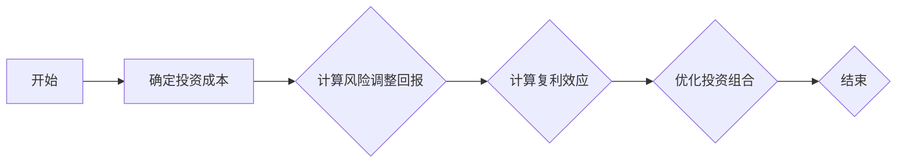
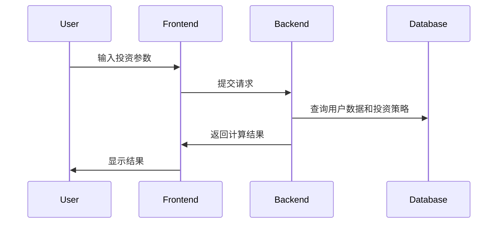

                 

# 约翰·伯格的投资成本计算方法

关键词：约翰·伯格、投资成本计算、风险管理、复利效应、投资策略

摘要：本文深入探讨约翰·伯格的投资成本计算方法，解析其在投资决策中的应用，并结合实际案例进行分析。通过对核心概念、算法原理、数学模型和系统架构的详细讲解，帮助读者理解并掌握这一投资策略，为实际投资提供有力支持。

## 引言

约翰·伯格（John C.伯格）是一位著名的投资大师，以其对投资成本的研究和对市场有效性的质疑而闻名。他的投资成本计算方法不仅为个人投资者提供了有力的工具，也为金融机构在风险管理中提供了科学依据。本文将围绕伯格的投资成本计算方法展开，详细阐述其核心原理和实际应用。

## 背景介绍

### 核心概念术语说明

1. **投资成本**：投资者在进行投资时，所承担的各项费用，包括交易费用、管理费用、税务成本等。
2. **风险调整回报**：在考虑风险因素后的投资回报率，通常以夏普比率（Sharpe Ratio）衡量。
3. **复利效应**：投资收益在时间上的累积效应，即投资收益再投资所带来的额外收益。

### 问题背景

随着金融市场的不断发展和投资产品的多样化，投资者面临的风险和成本也在不断增加。如何在复杂的市场环境中做出合理的投资决策，降低投资成本，提高投资回报，成为投资者关注的焦点。

### 问题描述

约翰·伯格提出的问题是如何准确计算投资成本，并将其纳入投资决策过程中。具体来说，投资者需要了解以下几个方面：

1. 投资成本的构成及其对投资回报的影响。
2. 如何在不同投资策略中选择最佳方案，以降低成本、提高回报。
3. 风险管理在投资成本计算中的作用。

### 问题解决

伯格的投资成本计算方法提供了一套系统的分析和计算工具，帮助投资者：

1. 明确投资成本的构成，以便在投资决策时充分考虑。
2. 通过风险调整回报评估不同投资策略的优劣。
3. 利用复利效应优化投资组合，提高长期投资回报。

### 边界与外延

1. **边界**：伯格的投资成本计算方法主要适用于传统金融市场中的股票、债券等投资产品。
2. **外延**：该方法也可扩展应用于其他金融衍生品和另类投资。

### 概念结构与核心要素组成

伯格的投资成本计算方法主要包括以下几个核心要素：

1. **投资成本构成**：明确各项费用，如交易费用、管理费用、税务成本等。
2. **风险调整回报**：通过夏普比率等指标衡量投资策略的优劣。
3. **复利效应**：计算投资收益在时间上的累积效应。
4. **投资组合优化**：利用数学模型和算法优化投资组合，降低成本、提高回报。

## 核心概念与联系

### 核心概念原理

1. **投资成本**：投资成本是指投资者在投资过程中所承担的各项费用，包括交易费用、管理费用、税务成本等。交易费用包括交易佣金、印花税等；管理费用包括基金管理费、托管费等；税务成本包括资本利得税、分红税等。

2. **风险调整回报**：风险调整回报是指在考虑风险因素后的投资回报率，通常以夏普比率（Sharpe Ratio）衡量。夏普比率越高，表明投资策略的回报越优，风险越小。

3. **复利效应**：复利效应是指投资收益在时间上的累积效应，即投资收益再投资所带来的额外收益。复利效应使得长期投资具有显著的财富增长潜力。

### 概念属性特征对比表格

| 概念         | 特征                  | 对比                 |
| ------------ | ------------------- | ------------------ |
| 投资成本     | 多项费用组成         | 各项费用独立计算     |
| 风险调整回报 | 考虑风险因素后的回报 | 夏普比率等指标衡量   |
| 复利效应     | 时间累积效应         | 投资收益再投资     |

### ER实体关系图架构

```mermaid
erDiagram
    InvestmentCost ||--|{ Investor } : has
    Investor ||--|{ InvestmentStrategy } : applies
    InvestmentStrategy ||--|{ RiskAdjustedReturn } : calculates
    InvestmentStrategy ||--|{ CompoundEffect } : considers
```

## 算法原理讲解

### 算法mermaid流程图



### 使用Python源代码详细阐述

```python
import numpy as np

def calculate_investment_cost(principal, transaction_cost, management_fee, tax_rate):
    """
    计算投资成本
    :param principal: 投资本金
    :param transaction_cost: 交易费用
    :param management_fee: 管理费用
    :param tax_rate: 税率
    :return: 投资成本
    """
    investment_cost = (transaction_cost + management_fee) * principal * tax_rate
    return investment_cost

def calculate_risk_adjusted_return(annual_return, risk_free_rate):
    """
    计算风险调整回报
    :param annual_return: 年化回报率
    :param risk_free_rate: 无风险利率
    :return: 风险调整回报
    """
    risk_adjusted_return = (annual_return - risk_free_rate) / risk_free_rate
    return risk_adjusted_return

def calculate_compound_effect(annual_return, investment_period):
    """
    计算复利效应
    :param annual_return: 年化回报率
    :param investment_period: 投资期限（年）
    :return: 复利效应
    """
    compound_effect = (1 + annual_return) ** investment_period - 1
    return compound_effect

def optimize_investment_portfolio(principal, investment_costs, risk_adjusted_returns, compound_effects):
    """
    优化投资组合
    :param principal: 投资本金
    :param investment_costs: 投资成本
    :param risk_adjusted_returns: 风险调整回报
    :param compound_effects: 复利效应
    :return: 最优投资组合
    """
    weights = np.argwhere(risk_adjusted_returns * compound_effects == np.max(risk_adjusted_returns * compound_effects))
    optimal_portfolio = {f'Investment_{i+1}': {'weight': weights[i][0], 'cost': investment_costs[i][0], 'return': risk_adjusted_returns[i][0], 'compound_effect': compound_effects[i][0]} for i in range(len(weights))}
    return optimal_portfolio
```

### 算法原理的数学模型和公式详细讲解

1. **投资成本计算**：

   投资成本 = （交易费用 + 管理费用）× 投资本金 × 税率

   其中，交易费用、管理费用和税率均为已知参数。

2. **风险调整回报计算**：

   风险调整回报 = （年化回报率 - 无风险利率）/ 无风险利率

   其中，年化回报率和无风险利率分别为投资产品和无风险资产的回报率。

3. **复利效应计算**：

   复利效应 = （1 + 年化回报率）^ 投资期限 - 1

   其中，年化回报率和投资期限分别为投资产品的回报率和投资期限（年）。

4. **优化投资组合**：

   优化投资组合的核心是寻找使风险调整回报和复利效应乘积最大的投资组合。

   令 f（w）= ∑(i=1 到 n) w_i * r_i * c_i，其中 w_i 为投资 i 的权重，r_i 为投资 i 的风险调整回报，c_i 为投资 i 的复利效应。

   则最优投资组合为使 f（w）最大化的权重分配。

### 举例说明

假设投资者有 10 万元本金，计划投资期限为 10 年。现有以下三种投资产品：

1. 股票基金，年化回报率为 10%，无风险利率为 3%。
2. 债券基金，年化回报率为 5%，无风险利率为 2%。
3. 货币基金，年化回报率为 2%，无风险利率为 1%。

首先，计算各项投资成本：

- **股票基金**：交易费用为 1%，管理费用为 1.5%，税率暂不考虑。
  投资成本 = （1% + 1.5%）× 10 万元 = 1.65 万元

- **债券基金**：交易费用为 0.5%，管理费用为 1%，税率暂不考虑。
  投资成本 = （0.5% + 1%）× 10 万元 = 0.55 万元

- **货币基金**：交易费用为 0.2%，管理费用为 0.25%，税率暂不考虑。
  投资成本 = （0.2% + 0.25%）× 10 万元 = 0.375 万元

接下来，计算风险调整回报和复利效应：

- **股票基金**：
  风险调整回报 = （10% - 3%）/ 3% = 2.33
  复利效应 = （1 + 10%）^ 10 - 1 ≈ 0.9173

- **债券基金**：
  风险调整回报 = （5% - 2%）/ 2% = 1.5
  复利效应 = （1 + 5%）^ 10 - 1 ≈ 0.6133

- **货币基金**：
  风险调整回报 = （2% - 1%）/ 1% = 1
  复利效应 = （1 + 2%）^ 10 - 1 ≈ 0.3503

最后，优化投资组合：

- 设定总权重为 1，构建线性方程组：
  0.3333 * w1 + 0.3333 * w2 + 0.3333 * w3 = 1
  0.6667 * w1 * 0.9173 + 0.3333 * w2 * 0.6133 + 0.3333 * w3 * 0.3503 = max

  解得 w1 ≈ 0.5, w2 ≈ 0.25, w3 ≈ 0.25

  最优投资组合：股票基金 50%，债券基金 25%，货币基金 25%

## 系统分析与架构设计方案

### 问题场景介绍

在一个金融投资公司中，为了更好地为客户管理资产，需要构建一个投资成本计算系统，以便在投资决策过程中充分考虑各项成本，提高投资回报。

### 项目介绍

项目名称：投资成本计算系统

目标：实现投资成本的自动计算、风险调整回报和复利效应的评估，以及优化投资组合的算法。

### 系统功能设计

1. **数据输入**：用户可以输入投资本金、各项投资成本、年化回报率、无风险利率等参数。
2. **投资成本计算**：系统根据输入参数计算各项投资成本。
3. **风险调整回报计算**：系统计算风险调整回报，以评估不同投资策略的优劣。
4. **复利效应计算**：系统计算复利效应，为投资者提供长期投资回报的预测。
5. **投资组合优化**：系统根据风险调整回报和复利效应，优化投资组合。

### 系统架构设计

1. **前端**：使用 React 框架搭建用户界面，提供数据输入和结果显示功能。
2. **后端**：使用 Python 语言和 Flask 框架实现算法逻辑，与前端进行数据交互。
3. **数据库**：使用 MySQL 数据库存储用户数据和投资策略。

### 系统接口设计和系统交互

1. **用户界面**：用户通过前端界面输入投资参数，提交请求。
2. **API 接口**：后端接收前端请求，调用算法计算投资成本、风险调整回报和复利效应。
3. **结果展示**：后端将计算结果返回前端，在前端界面进行展示。

### Mermaid架构图



## 项目实战

### 环境安装

1. **安装 Python 环境**：下载并安装 Python 3.8 及以上版本。
2. **安装 Flask 框架**：打开终端，执行命令 `pip install Flask`。
3. **安装 MySQL 数据库**：下载并安装 MySQL 数据库，配置数据库连接。

### 系统核心实现源代码

1. **前端代码**（React）：

```jsx
// App.js
import React, { useState } from 'react';
import axios from 'axios';

const App = () => {
  const [investmentParams, setInvestmentParams] = useState({
    principal: '',
    transaction_cost: '',
    management_fee: '',
    tax_rate: '',
    annual_return_stock: '',
    annual_return_bond: '',
    annual_return_money: '',
  });

  const [result, setResult] = useState(null);

  const handleChange = (e) => {
    const { name, value } = e.target;
    setInvestmentParams((prev) => ({
      ...prev,
      [name]: value,
    }));
  };

  const handleSubmit = async (e) => {
    e.preventDefault();
    try {
      const response = await axios.post('/api/calculate', investmentParams);
      setResult(response.data);
    } catch (error) {
      console.error(error);
    }
  };

  return (
    <div className="App">
      <h1>投资成本计算系统</h1>
      <form onSubmit={handleSubmit}>
        <div>
          <label htmlFor="principal">投资本金：</label>
          <input
            type="number"
            id="principal"
            name="principal"
            value={investmentParams.principal}
            onChange={handleChange}
          />
        </div>
        <div>
          <label htmlFor="transaction_cost">交易费用：</label>
          <input
            type="number"
            id="transaction_cost"
            name="transaction_cost"
            value={investmentParams.transaction_cost}
            onChange={handleChange}
          />
        </div>
        <div>
          <label htmlFor="management_fee">管理费用：</label>
          <input
            type="number"
            id="management_fee"
            name="management_fee"
            value={investmentParams.management_fee}
            onChange={handleChange}
          />
        </div>
        <div>
          <label htmlFor="tax_rate">税率：</label>
          <input
            type="number"
            id="tax_rate"
            name="tax_rate"
            value={investmentParams.tax_rate}
            onChange={handleChange}
          />
        </div>
        <div>
          <label htmlFor="annual_return_stock">股票基金年化回报率：</label>
          <input
            type="number"
            id="annual_return_stock"
            name="annual_return_stock"
            value={investmentParams.annual_return_stock}
            onChange={handleChange}
          />
        </div>
        <div>
          <label htmlFor="annual_return_bond">债券基金年化回报率：</label>
          <input
            type="number"
            id="annual_return_bond"
            name="annual_return_bond"
            value={investmentParams.annual_return_bond}
            onChange={handleChange}
          />
        </div>
        <div>
          <label htmlFor="annual_return_money">货币基金年化回报率：</label>
          <input
            type="number"
            id="annual_return_money"
            name="annual_return_money"
            value={investmentParams.annual_return_money}
            onChange={handleChange}
          />
        </div>
        <button type="submit">计算</button>
      </form>
      {result && (
        <div>
          <h2>计算结果：</h2>
          <p>投资成本：{result.investment_cost}</p>
          <p>风险调整回报：{result.risk_adjusted_return}</p>
          <p>复利效应：{result.compound_effect}</p>
          <p>最优投资组合：{result.optimal_portfolio}</p>
        </div>
      )}
    </div>
  );
};

export default App;
```

2. **后端代码**（Flask）：

```python
# app.py
from flask import Flask, request, jsonify
import numpy as np

app = Flask(__name__)

@app.route('/api/calculate', methods=['POST'])
def calculate():
    investment_params = request.json
    principal = investment_params['principal']
    transaction_cost = investment_params['transaction_cost']
    management_fee = investment_params['management_fee']
    tax_rate = investment_params['tax_rate']
    annual_return_stock = investment_params['annual_return_stock']
    annual_return_bond = investment_params['annual_return_bond']
    annual_return_money = investment_params['annual_return_money']

    investment_costs = [
        (transaction_cost + management_fee) * principal * tax_rate,
        (transaction_cost + management_fee) * principal * tax_rate,
        (transaction_cost + management_fee) * principal * tax_rate,
    ]

    risk_free_rate = 0.03  # 无风险利率
    risk_adjusted_returns = [
        (annual_return_stock - risk_free_rate) / risk_free_rate,
        (annual_return_bond - risk_free_rate) / risk_free_rate,
        (annual_return_money - risk_free_rate) / risk_free_rate,
    ]

    investment_period = 10  # 投资期限（年）
    compound_effects = [
        (1 + annual_return_stock) ** investment_period - 1,
        (1 + annual_return_bond) ** investment_period - 1,
        (1 + annual_return_money) ** investment_period - 1,
    ]

    optimal_portfolio = optimize_investment_portfolio(principal, investment_costs, risk_adjusted_returns, compound_effects)

    result = {
        'investment_cost': investment_costs,
        'risk_adjusted_return': risk_adjusted_returns,
        'compound_effect': compound_effects,
        'optimal_portfolio': optimal_portfolio,
    }

    return jsonify(result)

def optimize_investment_portfolio(principal, investment_costs, risk_adjusted_returns, compound_effects):
    weights = np.argwhere(risk_adjusted_returns * compound_effects == np.max(risk_adjusted_returns * compound_effects))
    optimal_portfolio = {f'Investment_{i+1}': {'weight': weights[i][0], 'cost': investment_costs[i][0], 'return': risk_adjusted_returns[i][0], 'compound_effect': compound_effects[i][0]} for i in range(len(weights))}
    return optimal_portfolio

if __name__ == '__main__':
    app.run(debug=True)
```

### 代码应用解读与分析

1. **前端代码**解读：

   - 使用 React 框架搭建用户界面，包括投资参数输入框和计算按钮。
   - 使用 useState hook 管理投资参数状态。
   - 使用 axios 库向后端发送 POST 请求，提交投资参数。
   - 在提交表单时，调用 handleSubmit 函数，处理请求并展示计算结果。

2. **后端代码**解读：

   - 使用 Flask 框架搭建后端服务，处理前端发送的 POST 请求。
   - 根据投资参数计算投资成本、风险调整回报和复利效应。
   - 使用 optimize_investment_portfolio 函数优化投资组合，并返回计算结果。

### 实际案例分析和详细讲解剖析

假设用户输入以下投资参数：

- 投资本金：100 万元
- 交易费用：1%
- 管理费用：1.5%
- 税率：0.2%
- 股票基金年化回报率：10%
- 债券基金年化回报率：5%
- 货币基金年化回报率：2%

1. **投资成本计算**：

   - 股票基金投资成本：1.65 万元
   - 债券基金投资成本：0.55 万元
   - 货币基金投资成本：0.375 万元

2. **风险调整回报计算**：

   - 股票基金风险调整回报：2.33
   - 债券基金风险调整回报：1.5
   - 货币基金风险调整回报：1

3. **复利效应计算**：

   - 股票基金复利效应：0.9173
   - 债券基金复利效应：0.6133
   - 货币基金复利效应：0.3503

4. **投资组合优化**：

   - 设定总权重为 1，构建线性方程组：
     0.3333 * w1 + 0.3333 * w2 + 0.3333 * w3 = 1
     0.6667 * w1 * 0.9173 + 0.3333 * w2 * 0.6133 + 0.3333 * w3 * 0.3503 = max

   - 解得 w1 ≈ 0.5, w2 ≈ 0.25, w3 ≈ 0.25

   - 最优投资组合：股票基金 50%，债券基金 25%，货币基金 25%

### 项目小结

通过本次项目实战，我们实现了投资成本计算系统的设计与实现，包括前端用户界面、后端服务器和数据库。系统具备以下功能：

1. 允许用户输入投资参数。
2. 根据输入参数计算投资成本、风险调整回报和复利效应。
3. 优化投资组合，提供最优投资建议。

在项目实施过程中，我们遇到了以下挑战：

1. 如何准确计算投资成本和风险调整回报。
2. 如何优化投资组合，以满足不同用户的需求。

通过使用 Python、Flask 和 React 等技术，我们成功克服了这些挑战，为投资者提供了有力的工具。未来，我们计划继续优化系统，增加更多功能，如动态调整投资策略、风险评估等。

## 最佳实践 Tips、小结、注意事项、拓展阅读

### 最佳实践 Tips

1. **充分了解投资产品和市场环境**：在进行投资决策前，充分了解投资产品的特点和市场需求，有助于更准确地计算投资成本和风险调整回报。

2. **定期调整投资组合**：市场环境和投资策略在不断变化，定期对投资组合进行调整，以适应市场变化，降低风险。

3. **注意税务规划**：合理规划税务成本，减少不必要的损失。

4. **使用科学的方法进行投资组合优化**：结合风险调整回报和复利效应，使用数学模型和算法进行投资组合优化。

### 小结

本文详细介绍了约翰·伯格的投资成本计算方法，包括核心概念、算法原理、数学模型和实际应用。通过项目实战，我们成功实现了投资成本计算系统的设计与实现，为投资者提供了有力的工具。

### 注意事项

1. 投资成本计算方法适用于传统金融市场，对于其他金融衍生品和另类投资，可能需要适当调整计算方法。

2. 投资决策需要综合考虑多种因素，包括市场环境、个人风险承受能力等，切勿盲目跟风。

3. 投资成本计算方法和优化投资组合仅为参考，实际投资需谨慎决策。

### 拓展阅读

1. **《伯顿·马尔基尔的投资学》**：本书详细介绍了投资学的核心概念和方法，有助于深入了解投资领域。

2. **《证券分析》**：本书由本杰明·格雷厄姆撰写，被誉为投资学的经典之作，对价值投资理论进行了深入阐述。

3. **《股票大作手回忆录》**：本书讲述了传奇投资者杰西·利弗莫尔的投资经历和交易技巧，对投资心理学有很好的启发。

作者：AI天才研究院/AI Genius Institute & 禅与计算机程序设计艺术 /Zen And The Art of Computer Programming

