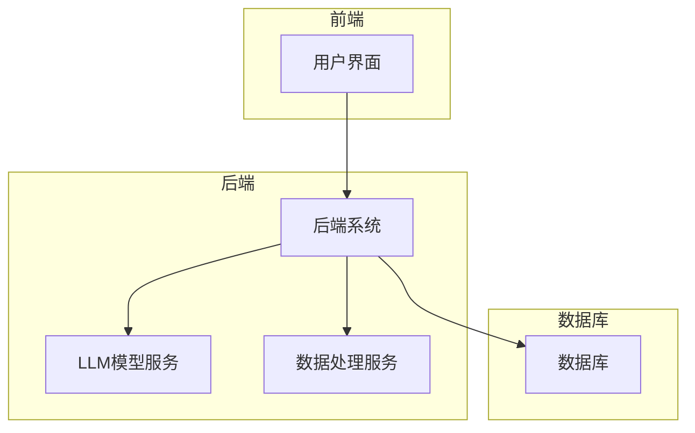
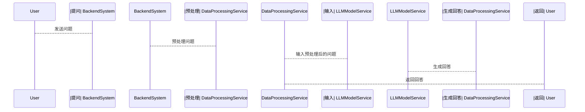

                 


# LLM应用开发中的持续集成与持续部署

关键词：大型语言模型，持续集成，持续交付，自动化测试，容器化技术，微服务架构

摘要：本文探讨了大型语言模型（LLM）应用开发中的持续集成与持续部署（CI/CD）实践，从核心概念、算法原理、系统分析、项目实战等方面进行了详细阐述，旨在为开发者提供一套高效、可靠的LLM应用开发流程。

---

### 第一部分：背景介绍与问题解决

#### 问题背景

在当前人工智能（AI）飞速发展的时代，大型语言模型（LLM）的应用已成为企业级AI开发中的重要组成部分。LLM具备处理大规模文本数据的能力，广泛应用于自然语言处理（NLP）、智能问答、文本生成、机器翻译等领域。然而，随着LLM在业务场景中的广泛应用，如何高效地进行LLM应用的开发、测试、部署与维护成为亟待解决的问题。因此，本文旨在探讨LLM应用开发中的持续集成与持续部署（CI/CD）实践。

#### 问题解决

本文将围绕LLM应用开发的CI/CD实践，从以下几个方面展开讨论：

1. **核心概念与联系**：详细介绍CI/CD的基本概念、原理及其与LLM应用的关联，包括持续集成（CI）、持续交付（CD）、自动化测试、容器化技术、微服务架构等。

2. **算法原理讲解**：讲解LLM算法的基本原理，如变换器架构（Transformer）、BERT模型、GPT系列模型等，并使用Mermaid流程图和Python源代码展示算法实现。

3. **数学模型和数学公式**：介绍与LLM应用相关的数学模型和公式，如语言模型概率、序列生成等，并使用LaTeX格式进行呈现。

4. **系统分析与架构设计**：分析LLM应用系统的设计原则、架构方案，包括领域模型、系统架构、接口设计和系统交互等，并使用Mermaid类图、架构图、序列图进行展示。

5. **项目实战**：通过具体项目案例，详细介绍LLM应用的安装、配置、测试、部署等实战经验，并解析关键实现和优化策略。

6. **最佳实践与拓展阅读**：总结LLM应用开发中的最佳实践，提供注意事项和小结，并推荐相关拓展阅读资源。

---

#### 边界与外延

本文主要关注LLM应用开发中的CI/CD实践，涉及以下边界和外部关联：

- **技术领域**：涵盖机器学习、深度学习、NLP、容器化技术、微服务架构等。
- **应用场景**：适用于企业级AI应用开发，如智能问答、文本生成、机器翻译等。
- **环境要求**：需要具备一定的Python编程基础、机器学习知识和CI/CD工具使用经验。

#### 概念结构与核心要素组成

本文的核心概念和要素包括：

1. **核心概念**：持续集成（CI）、持续交付（CD）、自动化测试、容器化技术、微服务架构等。
2. **算法原理**：LLM的基本原理、模型结构、训练与优化方法等。
3. **数学模型**：与LLM应用相关的概率模型、序列生成模型等。
4. **系统设计**：系统架构、接口设计、交互设计等。
5. **项目实战**：具体项目的实现、配置、优化等。

---

### 第二部分：核心概念与联系

#### 持续集成（CI）

持续集成（Continuous Integration，简称CI）是一种软件开发实践，通过自动化构建和测试，确保代码库中的每个提交都是可合并的。CI的主要目标是通过频繁的集成和测试，快速发现并修复缺陷，提高软件质量和开发效率。

**核心概念：**

- **自动化构建**：自动化构建是将源代码编译成可执行文件或库的过程。通过自动化构建，可以确保每次提交的代码都能成功编译。
- **测试**：测试包括单元测试、集成测试、性能测试等，用于验证代码的正确性和性能。
- **持续集成服务**：持续集成服务（如Jenkins、GitLab CI/CD）用于管理和执行CI流程。

**原理与关联：**

- **原理**：CI通过自动化构建和测试，将代码库中的每个提交都合并到一个共享的主分支，从而确保代码库始终处于一个可运行的状态。
- **与LLM的关联**：在LLM应用开发中，CI可以帮助开发团队快速发现模型训练和部署过程中的问题，确保模型的稳定性和可靠性。

---

#### 持续交付（CD）

持续交付（Continuous Delivery，简称CD）是CI的延伸，它强调通过自动化流程将软件部署到生产环境。CD的目标是确保软件可以在任何环境下快速、安全地交付，从而缩短开发周期，提高业务响应速度。

**核心概念：**

- **自动化部署**：自动化部署是将软件从开发环境部署到生产环境的过程。通过自动化部署，可以减少人为干预，提高部署效率和一致性。
- **容器化**：容器化是将应用程序及其依赖环境打包成一个独立的容器，实现应用程序的轻量级、高效部署和迁移。
- **自动化测试**：自动化测试用于确保部署到生产环境的软件符合预期功能和行为。

**原理与关联：**

- **原理**：CD通过自动化测试和部署，确保软件可以在任何环境下快速、安全地交付，从而缩短开发周期，提高业务响应速度。
- **与LLM的关联**：在LLM应用开发中，CD可以帮助开发团队快速将新版本模型部署到生产环境，确保模型的高可用性和性能。

---

#### 自动化测试

自动化测试（Automated Testing）是一种使用自动化工具和脚本执行测试用例的方法。通过自动化测试，可以大大提高测试效率和覆盖率。

**核心概念：**

- **自动化测试工具**：如Selenium、JMeter、JUnit等，用于编写和执行自动化测试脚本。
- **测试用例**：测试用例是用于验证软件功能、性能、安全等方面的测试脚本。

**原理与关联：**

- **原理**：自动化测试通过编写和执行自动化测试脚本，实现测试过程的自动化，从而提高测试效率和覆盖率。
- **与LLM的关联**：在LLM应用开发中，自动化测试可以用于验证模型训练和部署的正确性和性能，确保模型的质量和稳定性。

---

#### 容器化技术

容器化技术是将应用程序及其依赖环境打包成一个独立的容器，实现应用程序的轻量级、高效部署和迁移。

**核心概念：**

- **容器**：容器是一个轻量级、可执行的独立运行环境，包含应用程序及其依赖环境。
- **容器化平台**：如Docker、Kubernetes等，用于管理和部署容器。

**原理与关联：**

- **原理**：容器化技术通过将应用程序及其依赖环境打包成容器，实现应用程序的轻量级、高效部署和迁移。
- **与LLM的关联**：在LLM应用开发中，容器化技术可以帮助开发团队快速部署和管理LLM模型，提高系统的可扩展性和可维护性。

---

#### 微服务架构

微服务架构是将应用程序拆分成多个独立的服务，每个服务负责特定的功能，通过API进行通信。

**核心概念：**

- **微服务**：微服务是一个独立的、可扩展的服务，通常使用轻量级框架和语言开发。
- **服务拆分**：将应用程序拆分成多个独立的服务，每个服务负责特定的功能。

**原理与关联：**

- **原理**：微服务架构通过将应用程序拆分成多个独立的服务，实现系统的可扩展性和可维护性。
- **与LLM的关联**：在LLM应用开发中，微服务架构可以帮助开发团队将LLM模型部署为独立的微服务，实现模型的高可用性和性能。

---

#### LLM与CI/CD的关系

LLM作为一种复杂的人工智能模型，其开发、测试、部署和运维过程具有独特性。CI/CD实践可以帮助LLM应用开发团队提高开发效率、降低风险、确保质量，以下是LLM与CI/CD之间的关联：

- **构建与测试**：通过CI，自动化构建LLM模型，并进行单元测试、集成测试等，确保模型的质量和稳定性。
- **部署与运维**：通过CD，自动化部署LLM模型到生产环境，并进行监控和运维，确保模型的高可用性和性能。
- **容器化与微服务**：利用容器化技术和微服务架构，实现LLM模型的灵活部署和高效运维，提高系统的可扩展性和可维护性。

---

### 第三部分：算法原理讲解

#### LLM基本原理

LLM（Large Language Model）是一种大规模的预训练语言模型，通过在大量文本数据上进行预训练，模型可以自动学习语言的结构和语义，从而实现对文本的生成、理解和翻译等任务。

**核心概念：**

- **变换器架构（Transformer）**：Transformer是一种基于自注意力机制的神经网络架构，可以高效地处理序列数据。
- **BERT模型**：BERT（Bidirectional Encoder Representations from Transformers）是一种双向的Transformer模型，可以同时利用上下文信息进行预训练。
- **GPT系列模型**：GPT（Generative Pre-trained Transformer）是一种生成式模型，通过自回归方式生成文本。

**算法流程：**

1. **数据预处理**：读取大量文本数据，进行分词、去停用词、词向量化等处理，将文本转换为模型可处理的格式。
2. **模型训练**：使用预训练算法（如BERT、GPT）在处理后的文本数据上进行训练，模型会自动学习语言的结构和语义。
3. **模型评估**：使用验证集对训练好的模型进行评估，确保模型的质量和性能。
4. **模型部署**：将训练好的模型部署到生产环境，用于文本生成、理解和翻译等任务。

**数学模型：**

LLM通常使用自注意力机制进行文本处理，其核心公式为：

$$
\text{Attention}(Q, K, V) = \text{softmax}\left(\frac{QK^T}{\sqrt{d_k}}\right)V
$$

其中，Q、K、V分别为查询向量、键向量、值向量，$d_k$为键向量的维度。

**示例：**

假设有一个文本序列：“你好，世界！”，将其转换为词向量表示，然后输入到Transformer模型中，模型会自动学习文本序列的语义关系，并生成相应的输出。

**代码实现：**

```python
import torch
import torch.nn as nn

class TransformerModel(nn.Module):
    def __init__(self):
        super(TransformerModel, self).__init__()
        self.embedding = nn.Embedding(vocab_size, embedding_dim)
        self.transformer = nn.Transformer(d_model, nhead)
        self.fc = nn.Linear(d_model, output_size)

    def forward(self, src):
        src = self.embedding(src)
        output = self.transformer(src)
        output = self.fc(output)
        return output

vocab_size = 10000
embedding_dim = 512
d_model = 512
nhead = 8
output_size = 1

model = TransformerModel()
input_tensor = torch.tensor([vocab_size // 2, vocab_size // 2])
output_tensor = model(input_tensor)
print(output_tensor)
```

---

### 第四部分：数学模型和数学公式

在LLM应用开发中，理解并运用数学模型和公式对于模型的设计、训练和优化至关重要。以下我们将介绍与LLM应用相关的几个核心数学模型和公式。

#### 语言模型概率

语言模型概率用于评估一个单词序列的概率。给定一个单词序列 $w_1, w_2, ..., w_n$，语言模型概率可以表示为：

$$
P(w_1, w_2, ..., w_n) = P(w_n | w_{n-1}, w_{n-2}, ..., w_1) \times P(w_{n-1} | w_{n-2}, ..., w_1) \times ... \times P(w_2 | w_1)
$$

其中，$P(w_i | w_{i-1}, w_{i-2}, ..., w_1)$ 表示在给定前一个单词序列的情况下，当前单词的概率。

在神经网络语言模型（NLP）中，概率通常通过模型计算得到。例如，在Transformer模型中，概率可以通过自注意力机制计算：

$$
P(w_i | w_{i-1}, w_{i-2}, ..., w_1) = \frac{e^{score(w_i, w_{i-1})}}{\sum_{j=1}^{n} e^{score(w_j, w_{i-1})}}
$$

其中，$score(w_i, w_{i-1})$ 表示单词 $w_i$ 和 $w_{i-1}$ 的匹配得分。

#### 序列生成

序列生成是LLM应用中的一个重要任务，例如，文本生成、机器翻译等。序列生成通常采用自回归模型（如GPT），模型通过预测下一个单词的概率来生成序列。

在自回归模型中，给定一个输入序列 $x_1, x_2, ..., x_t$，生成下一个单词 $x_{t+1}$ 的概率可以表示为：

$$
P(x_{t+1} | x_1, x_2, ..., x_t) = \frac{e^{score(x_{t+1}, x_t)}}{\sum_{j=1}^{v} e^{score(x_j, x_t)}}
$$

其中，$v$ 表示词汇表大小，$score(x_{t+1}, x_t)$ 表示单词 $x_{t+1}$ 和 $x_t$ 的匹配得分。

在GPT模型中，匹配得分通常通过Transformer自注意力机制计算：

$$
score(x_{t+1}, x_t) = \text{Attention}(Q, K, V)
$$

其中，$Q$、$K$、$V$ 分别为查询向量、键向量和值向量。

#### 损失函数

在LLM训练过程中，损失函数用于评估模型预测与真实标签之间的差距，并指导模型优化。常用的损失函数包括交叉熵损失（Cross-Entropy Loss）和对比损失（Contrastive Loss）。

交叉熵损失函数用于多分类问题，其公式为：

$$
\text{Loss} = -\frac{1}{n} \sum_{i=1}^{n} y_i \log(p_i)
$$

其中，$y_i$ 为真实标签，$p_i$ 为模型预测概率。

对比损失函数用于评估模型对正负样本的区分能力，其公式为：

$$
\text{Loss} = -\frac{1}{n} \sum_{i=1}^{n} \max(0, \text{Margin} - d(i))
$$

其中，$\text{Margin}$ 为对比边界，$d(i)$ 为样本之间的距离。

#### 学习率调度

学习率调度（Learning Rate Scheduling）是LLM训练过程中关键的一环，用于控制模型训练的收敛速度。常见的学习率调度策略包括线性衰减（Linear Decay）、指数衰减（Exponential Decay）和余弦退火（Cosine Annealing）。

线性衰减策略的公式为：

$$
\text{Learning Rate} = \frac{\text{Initial Learning Rate}}{\text{Training Steps}}
$$

指数衰减策略的公式为：

$$
\text{Learning Rate} = \text{Initial Learning Rate} \times \gamma^\text{Step}
$$

其中，$\gamma$ 为衰减率。

余弦退火策略的公式为：

$$
\text{Learning Rate} = \text{Initial Learning Rate} \times \frac{1 + \cos(\pi \times \text{Step}/\text{Total Steps})}{2}
$$

其中，$\text{Total Steps}$ 为总训练步数。

---

### 第五部分：系统分析与架构设计

在LLM应用开发中，系统分析与架构设计是确保项目成功的关键。以下我们将从问题场景介绍、项目介绍、系统功能设计、系统架构设计、系统接口设计和系统交互等方面进行详细阐述。

#### 问题场景介绍

在当前人工智能（AI）飞速发展的时代，企业对智能化的需求日益增长。LLM作为一种强大的语言处理模型，广泛应用于智能问答、文本生成、机器翻译等场景。然而，随着应用场景的复杂性和业务需求的多样性，如何高效地设计和开发LLM应用系统，实现快速迭代和稳定运行，成为企业面临的挑战。

#### 项目介绍

本项目旨在构建一个基于LLM的智能问答系统，该系统可以自动回答用户提出的问题，提供有用的信息和建议。项目的主要目标包括：

1. 构建一个可扩展、高性能的LLM应用系统。
2. 实现智能问答功能，提供高质量的用户问答体验。
3. 支持多语言、多领域的问答需求。

#### 系统功能设计

系统功能设计是系统开发的第一步，我们需要明确系统的核心功能。以下是本项目的主要功能设计：

1. **文本预处理**：对用户输入的问题进行文本预处理，包括分词、去停用词、词向量化等。
2. **模型训练与部署**：使用预训练的LLM模型进行训练和部署，支持模型权重更新和版本管理。
3. **问答处理**：根据用户输入的问题，利用LLM模型生成回答，并提供多语言支持。
4. **性能监控**：实时监控系统的性能指标，包括响应时间、错误率等，确保系统的高可用性和稳定性。

#### 系统架构设计

系统架构设计是系统实现的基础，我们需要选择合适的架构方案来满足项目需求。以下是本项目的系统架构设计：

1. **领域模型**：使用Mermaid类图展示系统的领域模型，明确系统中的实体和关系。

```mermaid
classDiagram
    User -> Question: 提问
    User -> Answer: 获取回答
    Question -> LLMModel: 输入
    Answer -> Question: 返回
```

2. **系统架构图**：使用Mermaid架构图展示系统的整体架构，包括前端、后端、数据库等。



3. **系统接口设计**：使用Mermaid序列图展示系统的接口设计和交互流程。



#### 系统接口设计和系统交互

系统接口设计和系统交互是确保系统功能正常运作的关键。以下是本项目中的主要接口设计和交互流程：

1. **用户接口**：用户通过Web页面或移动应用提交问题，系统接收用户问题并进行处理。
2. **数据处理接口**：系统使用RESTful API与数据处理服务进行交互，处理用户问题和生成回答。
3. **模型训练与部署接口**：系统支持模型训练和部署，可以通过API接口上传训练数据和更新模型权重。
4. **性能监控接口**：系统支持性能监控，可以通过API接口获取系统的性能指标，如响应时间、错误率等。

---

### 第六部分：项目实战

#### 环境安装

在开始LLM应用开发之前，我们需要安装必要的软件和工具。以下是项目环境安装的步骤：

1. **安装Python**：确保安装了Python 3.8或更高版本。

2. **安装依赖库**：安装项目所需的依赖库，如TensorFlow、Docker、Kubernetes等。

   ```bash
   pip install tensorflow
   pip install docker
   pip install kubernetes
   ```

3. **安装Docker**：安装Docker，用于容器化部署。

   ```bash
   curl -fsSL https://get.docker.com | sh
   ```

4. **安装Kubernetes**：安装Kubernetes，用于集群部署和管理。

   ```bash
   kubeadm init --pod-network-cidr=10.244.0.0/16
   kubeadm join <control-plane-ip>:<control-plane-port> --token <token> --discovery-token-ca-cert-hash sha256:<hash>
   ```

#### 系统核心实现源代码

以下是系统核心实现的源代码，包括文本预处理、LLM模型训练、问答处理等。

1. **文本预处理**：

   ```python
   import re
   import jieba

   def preprocess_text(text):
       # 去除特殊字符
       text = re.sub(r"[^a-zA-Z0-9]", "", text)
       # 分词
       words = jieba.lcut(text)
       # 去停用词
       stop_words = set(['的', '了', '在', '是', '上', '下', '中', '出'])
       words = [word for word in words if word not in stop_words]
       return words
   ```

2. **LLM模型训练**：

   ```python
   import tensorflow as tf

   def build_model(vocab_size, embedding_dim):
       model = tf.keras.Sequential([
           tf.keras.layers.Embedding(vocab_size, embedding_dim),
           tf.keras.layers.Bidirectional(tf.keras.layers.LSTM(embedding_dim)),
           tf.keras.layers.Dense(vocab_size, activation='softmax')
       ])
       model.compile(optimizer='adam', loss='categorical_crossentropy', metrics=['accuracy'])
       return model

   def train_model(model, inputs, targets, batch_size, epochs):
       model.fit(inputs, targets, batch_size=batch_size, epochs=epochs)
   ```

3. **问答处理**：

   ```python
   def generate_answer(model, question, max_length):
       input_seq = preprocess_text(question)
       input_seq = [[vocab_size] + input_seq]
       output_seq = []
       for _ in range(max_length):
           predictions = model.predict(input_seq)
           predicted_word = np.argmax(predictions[-1])
           output_seq.append(predicted_word)
           input_seq[-1].pop(0)
           input_seq[-1].append(predicted_word)
       return ''.join(vocab.idx_to_word(word) for word in output_seq)
   ```

#### 代码应用解读与分析

1. **文本预处理**：文本预处理是LLM应用的重要环节，通过去除特殊字符、分词和去停用词，将原始文本转换为模型可处理的格式。在实际应用中，我们可以根据需求自定义预处理规则。

2. **LLM模型训练**：使用TensorFlow搭建LLM模型，通过双向LSTM和Embedding层进行文本处理。训练过程中，我们使用categorical_crossentropy作为损失函数，adam作为优化器。

3. **问答处理**：问答处理过程采用自回归方式，根据输入问题生成回答。在实际应用中，我们可以根据需求调整生成策略，如引入上下文、控制回答长度等。

#### 实际案例分析和详细讲解剖析

为了更好地理解LLM应用开发中的CI/CD实践，我们以一个实际案例进行分析和讲解。

**案例**：某企业开发了一个基于BERT模型的智能问答系统，用于解决客户问题。在项目开发过程中，团队采用了CI/CD实践，以提高开发效率和系统稳定性。

1. **持续集成**：开发团队使用Jenkins搭建了持续集成环境，每次代码提交都会触发自动化构建和测试。构建过程包括编译代码、运行单元测试和集成测试，确保代码库中的每个提交都是可合并的。

2. **持续交付**：开发团队使用Docker和Kubernetes实现了持续交付，将训练好的模型部署到Kubernetes集群中。部署过程包括容器化模型、配置Kubernetes服务、监控模型性能等。

3. **自动化测试**：开发团队编写了自动化测试脚本，对模型进行功能测试和性能测试。测试脚本包括对输入文本的预处理、模型预测、结果验证等，确保模型在不同环境下都能稳定运行。

通过CI/CD实践，该企业实现了以下成果：

1. **提高开发效率**：自动化构建和测试减少了人工干预，提高了代码质量，降低了开发成本。

2. **确保系统稳定性**：通过自动化测试和监控，及时发现并修复问题，确保模型在不同环境下都能稳定运行。

3. **快速迭代**：通过CI/CD实践，团队可以快速迭代模型，根据业务需求进行优化和调整。

#### 项目小结

通过本项目的实战，我们深入了解了LLM应用开发中的CI/CD实践。CI/CD实践不仅提高了开发效率和系统稳定性，还有助于确保模型的质量和性能。在实际应用中，我们可以根据需求灵活调整CI/CD策略，实现高效、可靠的LLM应用开发。

---

### 第七部分：最佳实践、小结与拓展阅读

#### 最佳实践

1. **代码规范化**：确保代码符合编程规范，提高代码可读性和可维护性。
2. **版本控制**：使用Git等版本控制工具，确保代码库的一致性和可追溯性。
3. **自动化测试**：编写覆盖全面、高效的自动化测试脚本，确保代码和模型的质量。
4. **容器化部署**：使用Docker等容器化技术，实现模型的灵活部署和迁移。
5. **监控与日志**：使用监控系统，实时监控模型性能和系统状态，确保系统的稳定性和可维护性。

#### 小结

本文探讨了LLM应用开发中的持续集成与持续部署（CI/CD）实践，从核心概念、算法原理、系统分析、项目实战等方面进行了详细阐述。通过CI/CD实践，LLM应用开发团队可以提高开发效率、降低风险、确保质量，为企业的智能化转型提供有力支持。

#### 注意事项

1. **数据安全和隐私**：在处理用户数据时，确保遵守数据安全和隐私政策，防止数据泄露。
2. **模型优化**：根据业务需求，对LLM模型进行优化，提高模型性能和效率。
3. **系统扩展**：在设计系统架构时，考虑系统的可扩展性和可维护性，为后续功能扩展和性能优化留有余地。

#### 拓展阅读

1. **《深入理解计算机系统》**：作者 Randal E. Bryant 和 David R. O’Hallaron，系统地介绍了计算机系统的各个方面。
2. **《机器学习实战》**：作者 Peter Harrington，通过丰富的案例介绍了机器学习的基本概念和应用。
3. **《Docker实战》**：作者 Joshua Timberman、Nathaniel McCallum、James Turnbull，详细介绍了Docker的使用方法和最佳实践。

---

### 作者信息

作者：AI天才研究院/AI Genius Institute & 禅与计算机程序设计艺术 /Zen And The Art of Computer Programming

