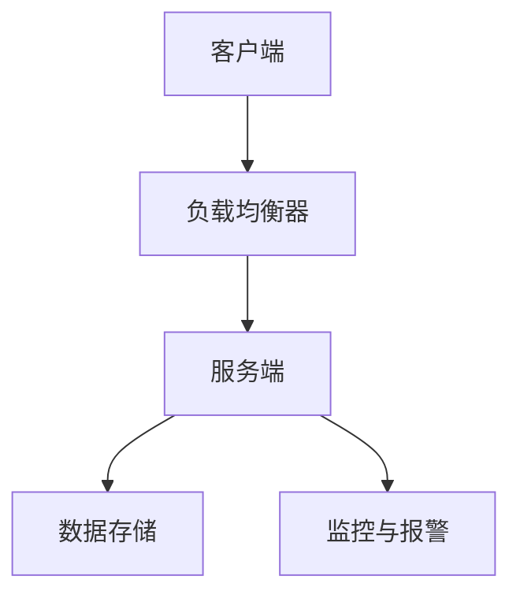
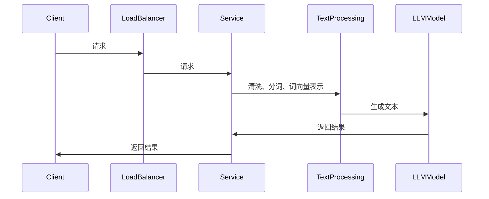

                 

### 第1章：构建高可用的LLM应用系统背景

#### 1.1.1 问题背景

随着人工智能技术的快速发展，大型语言模型（LLM）已经成为了现代人工智能应用中的重要一环。LLM具有处理大规模文本数据、生成高质量文本内容的能力，广泛应用于自然语言处理、问答系统、智能客服、机器翻译等多个领域。例如，OpenAI的GPT-3模型在自然语言生成和文本理解方面表现出了惊人的能力，被广泛认为是AI领域的重大突破。

然而，随着LLM应用系统的规模不断扩大，高可用性成为了一个关键的需求。高可用性不仅仅意味着系统的可靠性和稳定性，还包括系统的可伸缩性和容错能力。在实际应用中，如果一个LLM应用系统经常出现故障或者性能瓶颈，那么将会对用户体验和业务造成极大的影响。因此，构建高可用的LLM应用系统成为了当前AI领域的一个重要课题。

#### 1.1.2 问题描述

**高可用性的定义与重要性**

高可用性（High Availability）是指系统在长时间运行中保持可操作状态的能力。对于LLM应用系统来说，高可用性意味着系统能够在面临各种异常情况下保持稳定运行，确保用户能够持续访问和使用系统服务。高可用性的重要性体现在以下几个方面：

1. **用户体验**：高可用性保证了用户能够始终访问到系统提供的服务，从而提升了用户的满意度和使用体验。
2. **业务连续性**：在许多商业场景中，LLM应用系统是业务流程的一部分。如果系统频繁出现故障，将会影响整个业务流程的连续性，导致经济损失。
3. **数据安全**：高可用性还包括数据的可靠存储和保护。如果系统出现故障，数据丢失的风险将会增加。

**LLM应用系统面临的高可用性挑战**

构建高可用的LLM应用系统面临以下挑战：

1. **计算资源的需求**：LLM模型通常需要大量的计算资源，包括CPU、GPU等硬件资源。如何高效地管理和调度这些资源，确保系统在负载高峰期能够稳定运行，是一个重要的挑战。
2. **数据存储与访问**：LLM模型训练和推理过程中需要处理海量数据，如何保证数据的高效存储和快速访问，也是一个重要的挑战。
3. **网络通信**：LLM应用系统通常需要与其他系统和服务进行通信，网络的不稳定性和延迟可能会对系统性能产生负面影响。
4. **故障处理与恢复**：如何快速发现和处理系统故障，确保系统能够快速恢复，是一个关键问题。

#### 1.1.3 问题解决

**高可用性的解决方案概述**

为了构建高可用的LLM应用系统，可以采取以下解决方案：

1. **分布式架构**：通过分布式架构，将系统分解为多个独立的服务模块，每个模块可以在不同的服务器上运行。这样可以提高系统的容错能力和可伸缩性。
2. **冗余设计**：在硬件和软件层面引入冗余设计，包括硬件冗余（如多台服务器、存储设备）和软件冗余（如备份和冗余计算）。
3. **负载均衡**：使用负载均衡技术，将用户请求均匀分配到多个服务实例上，避免单个实例过载。
4. **自动化监控与故障处理**：使用自动化监控系统，实时监控系统性能和状态，并在发现故障时自动触发处理流程。

**如何确保LLM应用系统的可靠性、可伸缩性和容错能力**

为了确保LLM应用系统的可靠性、可伸缩性和容错能力，可以采取以下措施：

1. **可靠性设计**：在系统设计阶段，充分考虑各种可能出现的故障情况，并采取相应的预防措施，如故障检测、自动重启等。
2. **可伸缩性设计**：根据系统的负载情况，动态调整计算资源，确保系统能够在负载增加时迅速扩展。
3. **容错能力设计**：在系统架构中引入冗余和备份机制，确保在部分组件失效时，系统仍然能够正常运行。

#### 1.1.4 边界与外延

**高可用性与其他系统属性的界限**

高可用性是系统属性中的一个重要方面，但并不是唯一属性。其他重要属性包括性能、安全性、可维护性等。高可用性主要关注系统在长时间运行中保持可操作状态的能力，而性能则关注系统在特定负载下的响应速度和处理能力。安全性则涉及系统的防护措施，确保数据安全和防止恶意攻击。可维护性则关注系统的可维护性和可升级性。

**高可用性在不同场景的应用和扩展**

高可用性不仅适用于LLM应用系统，还可以应用于其他类型的系统和服务。例如，在金融领域，高可用性对于确保交易系统的连续性和数据完整性至关重要。在医疗领域，高可用性可以确保医疗信息系统的正常运行，从而保证患者的安全。

**概念结构与核心要素组成**

**核心概念解析：**

- **高可用性**：系统在长时间运行中保持可操作状态的能力。
- **LLM**：大型语言模型，具有处理大规模文本数据、生成高质量文本内容的能力。
- **应用系统**：指使用LLM模型提供的服务的系统。

**系统组成要素：**

- **硬件**：包括服务器、存储设备、网络设备等。
- **软件**：包括操作系统、数据库、应用软件等。
- **网络**：网络基础设施，包括内部网络和外部网络。
- **数据**：训练数据和推理数据。

#### 1.1.5 本章小结

本章首先介绍了构建高可用的LLM应用系统的背景和重要性，然后详细探讨了LLM应用系统面临的高可用性挑战。接着，提出了高可用性的解决方案，并介绍了如何确保LLM应用系统的可靠性、可伸缩性和容错能力。最后，讨论了高可用性与其他系统属性的关系，并概述了高可用性在不同场景的应用和扩展。本章为后续章节的深入探讨奠定了基础。


----------------------------------------------------------------

### 第2章：大型语言模型（LLM）基础

#### 2.1.1 LLM的定义与特点

##### 2.1.1.1 LLM的定义

大型语言模型（Large Language Model，简称LLM）是一种基于深度学习技术的自然语言处理模型，主要用于文本生成、文本分类、机器翻译、情感分析等任务。LLM的核心思想是通过大规模文本数据的预训练，使模型具备对自然语言的深刻理解和生成能力。

**LLM在自然语言处理中的地位和作用**

随着人工智能技术的快速发展，LLM已经成为自然语言处理领域的重要工具。它不仅能够处理简单的文本任务，还能够处理复杂的、结构化的文本任务，从而推动自然语言处理技术的进步。例如，在机器翻译领域，LLM可以生成更准确、自然的翻译结果；在文本生成领域，LLM可以生成高质量的文章、对话等。

**LLM的特点**

- **参数规模大**：LLM通常包含数十亿甚至上百亿个参数，这使得模型能够捕捉到文本的深层特征。
- **计算资源需求高**：由于参数规模庞大，LLM的训练和推理需要大量的计算资源，如GPU、TPU等。
- **预训练与微调**：LLM通常通过预训练（Pre-training）和微调（Fine-tuning）两个阶段进行训练。预训练阶段使用大规模文本数据进行训练，使模型具备通用语言理解能力；微调阶段则根据具体任务需求，使用特定领域的数据进行微调，提高模型在特定任务上的性能。

##### 2.1.1.2 LLM的特点

**参数规模与计算资源**

- **参数规模**：参数规模是衡量LLM能力的重要指标。随着模型规模的不断扩大，LLM在自然语言理解、生成等方面取得了显著突破。例如，GPT-3模型包含1750亿个参数，是目前最大的LLM之一。
- **计算资源**：训练大规模LLM需要大量的计算资源，包括CPU、GPU、TPU等。此外，由于模型参数规模庞大，存储和传输也带来了巨大的挑战。

**预训练与微调**

- **预训练**：预训练阶段，LLM使用大规模文本数据（如维基百科、新闻文章等）进行训练，使模型具备通用语言理解能力。在此过程中，模型学习到了语言的语法、语义和上下文信息。
- **微调**：微调阶段，LLM使用特定领域的数据（如问答数据、对话数据等）进行训练，进一步提高模型在特定任务上的性能。例如，在机器翻译任务中，可以使用平行语料进行微调，从而提高翻译质量。

#### 2.1.2 LLM的算法原理

##### 2.1.2.1 算法概述

**常见的LLM算法框架**

目前，常见的LLM算法框架主要包括以下几种：

- **GPT系列模型**：由OpenAI提出的一系列生成预训练模型，如GPT、GPT-2、GPT-3等。这些模型基于Transformer架构，通过预训练和微调实现优秀的自然语言处理能力。
- **BERT及其变体**：BERT（Bidirectional Encoder Representations from Transformers）是由Google提出的一种双向Transformer模型，通过预训练和微调实现了出色的文本理解和生成能力。BERT的变体，如RoBERTa、ALBERT等，也在自然语言处理任务中取得了显著的成果。

##### 2.1.2.2 算法解析

**GPT系列模型的工作原理**

- **Transformer架构**：GPT系列模型基于Transformer架构，这是一种基于自注意力机制的序列建模方法。Transformer架构通过多头自注意力机制和前馈神经网络，实现了对输入序列的建模。
- **预训练与微调**：GPT系列模型在预训练阶段，使用大量文本数据进行训练，使模型具备通用语言理解能力。在微调阶段，模型使用特定领域的数据进行微调，进一步提高模型在特定任务上的性能。
- **生成文本**：GPT系列模型在生成文本时，通过递归调用自身的注意力机制，生成一个一个的词，直到生成完整的句子或段落。

**BERT及其变体**

- **BERT架构**：BERT是一种基于Transformer的双向编码器模型，通过预训练和微调实现文本理解和生成能力。BERT在预训练阶段，使用大量文本数据进行训练，使模型能够捕捉到语言的语法、语义和上下文信息。
- **预训练与微调**：BERT在预训练阶段，使用双向Transformer编码器对文本进行建模，使模型具备通用语言理解能力。在微调阶段，模型使用特定领域的数据进行微调，进一步提高模型在特定任务上的性能。
- **生成文本**：BERT在生成文本时，通过递归调用自身的编码器，生成一个一个的词，直到生成完整的句子或段落。

##### 2.1.2.3 深入分析

**算法性能对比**

- **GPT系列模型**：GPT系列模型在文本生成、文本分类、机器翻译等任务上取得了优异的性能。特别是GPT-3模型，在多个自然语言处理任务上超越了之前的模型，展示了强大的生成能力和理解能力。
- **BERT及其变体**：BERT及其变体在文本理解和生成任务上也取得了显著的成果。BERT在多项NLP任务中超越了GPT系列模型，特别是在文本分类和问答任务上表现突出。

**算法优缺点分析**

- **GPT系列模型**：优点包括：
  - **强大的生成能力**：GPT系列模型在文本生成任务中表现出色，能够生成高质量、连贯的文本。
  - **通用语言理解能力**：通过预训练，GPT系列模型具备较强的通用语言理解能力，能够处理多种文本任务。
  - 缺点包括：
  - **计算资源需求高**：由于模型规模庞大，训练和推理需要大量的计算资源。
  - **数据依赖性较强**：模型的性能受到训练数据质量和数量的影响。

- **BERT及其变体**：优点包括：
  - **强大的文本理解能力**：BERT及其变体在文本理解任务中表现出色，能够准确捕捉文本的语法、语义和上下文信息。
  - **多种任务适应性**：BERT及其变体能够适应多种文本任务，如文本分类、问答、机器翻译等。
  - 缺点包括：
  - **生成能力较弱**：相对于GPT系列模型，BERT及其变体在文本生成任务上的表现较弱。
  - **数据依赖性较强**：与GPT系列模型类似，BERT及其变体的性能也受到训练数据质量和数量的影响。

##### 2.1.2.4 LLM的核心概念属性特征对比表格

为了更好地理解LLM的核心概念属性特征，下面列出了一张对比表格：

| 概念 | GPT系列模型 | BERT及其变体 |
| --- | --- | --- |
| 参数规模 | 较大 | 较大 |
| 计算资源需求 | 高 | 高 |
| 生成能力 | 强 | 弱 |
| 文本理解能力 | 强 | 强 |
| 数据依赖性 | 强 | 强 |

##### 2.1.2.5 LLM的ER实体关系图架构

**ER图简介**

实体-关系（Entity-Relationship，简称ER）图是一种用于描述实体及其之间关系的图形化工具。在LLM中，ER图可以用于描述模型中的核心实体及其关系。

**实体关系图**

在LLM中，常见的实体包括：

- **词向量**：用于表示文本中的词语。
- **句子**：表示一个完整的语句。
- **段落**：表示一段文字内容。
- **文档**：表示一个完整的文本文件。

实体之间的关系包括：

- **包含关系**：表示一个实体包含另一个实体，如句子包含词语。
- **关联关系**：表示实体之间存在某种关联，如句子与句子之间的关联。

**Mermaid ER图示例**

以下是一个LLM中的ER图示例：

```mermaid
erDiagram
  词 -->|包含| 句子
  句子 -->|包含| 词
  句子 -->|关联| 句子
  文档 -->|包含| 句子
```

**图解**

- **词和句子**：词是句子的组成部分，句子是文档的组成部分。
- **句子之间的关联**：句子之间存在关联关系，表示它们在文本中的逻辑关系。
- **文档和句子**：文档包含多个句子，句子是文档的基本单元。

##### 2.1.2.6 本章小结

本章首先介绍了LLM的定义和特点，包括参数规模、计算资源需求、预训练与微调等方面。然后，分析了LLM的算法原理，包括GPT系列模型和BERT及其变体的工作原理。接着，对比了LLM的核心概念属性特征，并介绍了LLM的ER实体关系图架构。通过本章的学习，读者可以了解LLM的基础知识，为后续章节的深入探讨打下基础。

----------------------------------------------------------------

## 第3章：高可用性设计与架构

#### 3.1.1 高可用性设计与架构概述

##### 3.1.1.1 概念介绍

**高可用性设计与架构的基本概念**

高可用性（High Availability，简称HA）是指系统在长时间运行中保持可操作状态的能力。在构建高可用的LLM应用系统时，高可用性设计至关重要。高可用性设计旨在确保系统在面对各种异常情况下（如硬件故障、软件错误、网络中断等）能够快速恢复并继续提供服务。

**高可用性架构的目标**

高可用性架构的目标主要包括以下几个方面：

1. **可靠性**：确保系统在各种情况下能够稳定运行，减少系统故障的概率。
2. **可伸缩性**：根据系统负载的变化，能够动态调整计算资源，确保系统在负载增加时能够扩展。
3. **容错能力**：在部分组件失效时，系统能够自动切换到备用组件，确保系统继续运行。

##### 3.1.1.2 架构目标

**可靠性**

可靠性是高可用性的核心目标之一。为了实现高可靠性，可以采取以下措施：

- **冗余设计**：在硬件和软件层面引入冗余设计，如多台服务器、备份存储等。
- **故障检测与恢复**：使用自动化监控系统，实时监控系统状态，并在发现故障时自动进行恢复。
- **冗余计算**：在计算资源层面，使用冗余计算，如多台GPU服务器并行处理任务，提高系统的可靠性。

**可伸缩性**

可伸缩性是指系统能够根据负载的变化动态调整计算资源。为了实现高可伸缩性，可以采取以下措施：

- **分布式架构**：将系统分解为多个独立的服务模块，每个模块可以在不同的服务器上运行，从而实现水平扩展。
- **动态资源调度**：根据系统负载情况，动态调整计算资源，确保系统在负载高峰期能够扩展。
- **缓存策略**：使用缓存策略，如Redis、Memcached等，减少系统负载，提高系统性能。

**容错能力**

容错能力是指系统能够在部分组件失效时，自动切换到备用组件，确保系统继续运行。为了实现高容错能力，可以采取以下措施：

- **故障转移**：在主组件出现故障时，自动将任务转移到备用组件，确保系统继续运行。
- **备份与恢复**：在数据层面，采取数据备份策略，如定期备份、多节点存储等，确保数据安全。
- **自动化故障处理**：使用自动化监控系统，实时监控系统状态，并在发现故障时自动进行处理。

#### 3.1.2 系统功能设计与实现

##### 3.1.2.1 领域模型设计

**领域模型在系统设计中的作用**

领域模型（Domain Model）是一种用于描述系统功能和行为的概念模型。在LLM应用系统设计中，领域模型有助于明确系统的功能需求，构建系统的核心模块，从而提高系统的可维护性和可扩展性。

**Mermaid类图示例**

以下是一个LLM应用系统的领域模型示例：

```mermaid
classDiagram
  Node -->|处理请求| LLMService
  Node -->|查询数据| Database
  LLMService -->|生成文本| TextGenerator
  LLMService -->|分类文本| Classifier
  TextGenerator -->|生成文本| Text
  Classifier -->|分类结果| Category
```

**图解**

- **Node**：表示系统中的客户端或服务器节点。
- **LLMService**：表示LLM服务的核心模块，负责处理请求、生成文本和分类文本。
- **Database**：表示数据存储模块，用于存储和查询数据。
- **TextGenerator**：表示文本生成模块，用于生成文本。
- **Classifier**：表示文本分类模块，用于分类文本。

##### 3.1.2.2 功能实现

**引入功能模块**

在LLM应用系统中，常见的功能模块包括：

- **文本处理模块**：负责处理输入文本，包括文本清洗、分词、词向量表示等。
- **文本生成模块**：负责生成文本，包括文本生成、文本摘要、对话生成等。
- **文本分类模块**：负责分类文本，包括文本分类、主题分类、情感分类等。
- **数据存储模块**：负责存储和查询数据，包括数据库、缓存、文件存储等。

**各模块的功能与接口**

- **文本处理模块**：功能包括文本清洗、分词、词向量表示等。接口包括文本处理接口、分词接口、词向量接口等。
- **文本生成模块**：功能包括文本生成、文本摘要、对话生成等。接口包括文本生成接口、文本摘要接口、对话生成接口等。
- **文本分类模块**：功能包括文本分类、主题分类、情感分类等。接口包括分类接口、主题分类接口、情感分类接口等。
- **数据存储模块**：功能包括数据存储、数据查询等。接口包括数据存储接口、数据查询接口等。

#### 3.1.3 系统架构设计与实现

##### 3.1.3.1 架构设计原则

**系统架构设计的关键原则**

在构建高可用的LLM应用系统时，架构设计需要遵循以下关键原则：

- **模块化**：将系统分解为多个独立模块，每个模块负责特定的功能，提高系统的可维护性和可扩展性。
- **分布式**：使用分布式架构，将系统部署在多个节点上，提高系统的可伸缩性和容错能力。
- **冗余**：在硬件和软件层面引入冗余设计，确保系统在面对故障时能够快速恢复。
- **高可用性**：设计高可用性机制，确保系统在面对各种异常情况下能够保持稳定运行。
- **安全性**：确保系统的数据安全和用户隐私。

##### 3.1.3.2 系统架构图

**描述系统架构**

LLM应用系统的架构可以分为以下几个主要部分：

- **客户端**：负责发起请求，如文本生成、文本分类等。
- **负载均衡器**：负责均衡客户端请求，确保系统的高可用性和可伸缩性。
- **服务端**：负责处理客户端请求，包括文本处理、文本生成、文本分类等。
- **数据存储**：负责存储和查询数据，包括数据库、缓存等。
- **监控与报警**：负责监控系统状态，并在发现故障时进行报警和处理。

**Mermaid架构图示例**

以下是一个LLM应用系统的架构图示例：



**图解**

- **客户端**：客户端发起请求，如文本生成、文本分类等。
- **负载均衡器**：负载均衡器负责均衡客户端请求，将请求分配到不同的服务实例上。
- **服务端**：服务端处理客户端请求，包括文本处理、文本生成、文本分类等。
- **数据存储**：数据存储负责存储和查询数据，包括数据库、缓存等。
- **监控与报警**：监控与报警负责监控系统状态，并在发现故障时进行报警和处理。

##### 3.1.3.3 系统接口设计与交互

**接口设计**

系统接口设计是确保系统各模块之间能够有效通信的关键。以下是一些常见的接口设计：

- **文本处理接口**：用于处理文本，包括文本清洗、分词、词向量表示等。
- **文本生成接口**：用于生成文本，包括文本生成、文本摘要、对话生成等。
- **文本分类接口**：用于分类文本，包括文本分类、主题分类、情感分类等。
- **数据存储接口**：用于存储和查询数据，包括数据库、缓存等。

**系统交互**

系统交互是指系统内部各模块之间的通信和协作。以下是一个系统交互的示例：

1. **客户端请求**：客户端发起文本生成的请求，包括输入文本和生成参数。
2. **请求处理**：负载均衡器接收客户端请求，并将其分配到服务实例上。
3. **文本处理**：服务端接收请求，对输入文本进行清洗、分词和词向量表示。
4. **文本生成**：服务端使用LLM模型生成文本，并根据生成参数调整生成结果。
5. **返回结果**：服务端将生成结果返回给客户端。

**Mermaid序列图示例**

以下是一个LLM应用系统的序列图示例：



**图解**

- **客户端**：客户端发起文本生成的请求。
- **负载均衡器**：负载均衡器接收客户端请求，并将其分配到服务实例上。
- **服务端**：服务端处理客户端请求，包括文本处理、文本生成等。
- **文本处理模块**：文本处理模块负责清洗、分词和词向量表示。
- **LLM模型**：LLM模型负责生成文本。
- **返回结果**：服务端将生成结果返回给客户端。

##### 3.1.3.4 本章小结

本章首先介绍了高可用性设计与架构的基本概念和目标，包括可靠性、可伸缩性和容错能力。然后，详细介绍了系统功能设计与实现，包括领域模型设计、功能模块引入和接口设计。接着，介绍了系统架构设计与实现，包括架构设计原则、系统架构图和系统交互。本章为构建高可用的LLM应用系统提供了理论基础和设计指导。

----------------------------------------------------------------

### 4.1.1 硬件保障

##### 4.1.1.1 硬件选择与配置

**硬件对系统高可用性的影响**

硬件选择和配置对系统高可用性至关重要。合理的硬件配置可以提高系统的可靠性、性能和稳定性，从而确保LLM应用系统能够在面临各种异常情况下保持正常运行。以下是硬件选择和配置的关键点：

- **服务器**：选择高可靠性的服务器，如戴尔、惠普等品牌的硬件。确保服务器具有足够的计算能力、存储容量和网络接口，以满足系统需求。
- **存储设备**：选择性能稳定的存储设备，如SSD硬盘或企业级硬盘。同时，采用RAID（磁盘阵列）技术，提高数据存储的可靠性和性能。
- **网络设备**：选择高性能的网络设备，如交换机和路由器。确保网络设备能够提供足够的带宽和低延迟，以满足系统通信需求。
- **备份设备**：配置备份设备，如磁带机或NAS（网络附加存储），用于定期备份系统数据和配置文件，以防止数据丢失。

**硬件冗余与备份**

**冗余机制**

硬件冗余是一种常见的高可用性策略，通过在系统中引入冗余硬件组件，确保在部分硬件故障时系统能够继续正常运行。以下是几种常见的冗余机制：

- **双机热备份**：在系统中部署两台相同配置的服务器，一台作为主服务器，另一台作为备份服务器。当主服务器出现故障时，备份服务器可以立即接管服务，确保系统不中断。
- **RAID冗余**：采用RAID（磁盘阵列）技术，将数据分散存储在多个硬盘上。当某个硬盘出现故障时，RAID可以自动切换到其他硬盘，确保数据不丢失。
- **网络冗余**：通过配置多路网络连接，确保在部分网络故障时，系统仍然可以访问其他网络资源。

**备份策略与实现**

备份是保障数据安全的重要手段。以下是几种常见的备份策略：

- **定期备份**：定期（如每天、每周）对系统数据进行备份，确保在数据丢失或损坏时能够快速恢复。
- **增量备份**：只备份自上次备份以来发生变化的数据，提高备份效率。
- **异地备份**：将备份数据存储在异地，以防止自然灾害等不可抗力因素导致数据丢失。

备份的实现可以采用以下几种方式：

- **备份软件**：使用备份软件（如Veeam、Bacula等）定期对系统数据进行备份。这些软件通常具有自动备份、增量备份、压缩备份等功能。
- **云存储**：将备份数据上传到云存储服务（如AWS S3、Azure Blob Storage等），确保备份数据的安全和可访问性。
- **备份硬件**：配置备份硬件（如磁带机、NAS等），用于存储备份数据。

**案例分析与实现**

以下是一个硬件冗余与备份的案例：

- **双机热备份**：在LLM应用系统中，部署两台服务器，一台作为主服务器，另一台作为备份服务器。主服务器负责处理请求，备份服务器处于备用状态。当主服务器出现故障时，备份服务器会自动接管服务，确保系统不中断。
- **RAID冗余**：在服务器中配置RAID 5或RAID 6，将数据分散存储在多个硬盘上。当某个硬盘出现故障时，RAID会自动切换到其他硬盘，确保数据不丢失。
- **定期备份**：使用Veeam软件定期对系统数据进行备份。备份任务设置为每天凌晨执行，将备份数据上传到云存储服务，确保备份数据的安全和可访问性。

通过以上措施，可以有效保障LLM应用系统的高可用性，确保系统在面对硬件故障、数据丢失等异常情况时能够快速恢复。

----------------------------------------------------------------

### 4.1.2 软件保障

##### 4.1.2.1 软件冗余

**软件冗余的必要性**

软件冗余（Software Redundancy）是指系统中包含多个相同或相似的功能模块，以便在部分模块出现故障时，其他模块可以接管其任务，确保系统继续正常运行。软件冗余是高可用性设计的重要组成部分，其必要性体现在以下几个方面：

1. **故障恢复**：当系统中的某个模块出现故障时，冗余模块可以立即接管其任务，确保系统不中断，从而提高系统的可用性。
2. **负载均衡**：通过引入冗余模块，可以将系统负载均匀分配到多个模块上，提高系统的处理能力，从而提高系统的性能。
3. **提高可靠性**：软件冗余可以降低单个模块的负载，减少模块故障的概率，从而提高系统的可靠性。

**软件冗余的实现**

软件冗余可以通过以下几种方式实现：

1. **主备模式**：在系统中部署两套相同功能的模块，一套作为主模块，另一套作为备用模块。当主模块出现故障时，备用模块会自动接管其任务，确保系统继续正常运行。
2. **集群模式**：将多个相同功能的模块部署在多个服务器上，形成一个集群。系统可以根据负载情况，动态调整模块的运行状态，确保系统在负载高峰期能够扩展，同时在模块出现故障时，其他模块可以接管其任务。
3. **热备份**：在系统中部署一个热备份模块，当主模块出现故障时，热备份模块会立即接管其任务，确保系统不中断。

**案例分析与实现**

以下是一个软件冗余的案例：

1. **主备模式**：在LLM应用系统中，部署两套文本生成模块，一套作为主模块，另一套作为备用模块。主模块负责处理请求，备用模块处于待机状态。当主模块出现故障时，备用模块会自动接管其任务，确保系统继续正常运行。

2. **集群模式**：在LLM应用系统中，部署多个文本生成模块，形成一个集群。系统可以根据负载情况，动态调整模块的运行状态。例如，当系统负载较高时，可以新增模块以分担负载；当系统负载较低时，可以关闭部分模块以节约资源。

3. **热备份**：在LLM应用系统中，部署一个热备份文本生成模块。当主模块出现故障时，热备份模块会立即接管其任务，确保系统不中断。例如，可以使用双机热备份软件，如Keepalived、Heartbeat等，来实现热备份功能。

通过以上措施，可以有效提高LLM应用系统的高可用性，确保系统在面对软件故障、负载高峰等异常情况时能够快速恢复。

##### 4.1.2.2 软件更新与版本控制

**软件更新的策略**

软件更新是保障系统安全性和功能性的重要手段。在进行软件更新时，应遵循以下策略：

1. **测试和评估**：在正式更新前，对更新版本进行充分的测试和评估，确保更新后的系统稳定性。测试应包括功能测试、性能测试、安全测试等。
2. **备份**：在更新前，对系统进行备份，以便在更新过程中出现问题时，可以快速恢复到之前的版本。
3. **逐步更新**：采用逐步更新的方式，先将更新版本部署到一部分服务器上，观察其运行情况，再逐步推广到其他服务器。这样可以降低更新过程中的风险。

**版本控制工具与方法**

版本控制（Version Control）是管理软件版本和变更的重要工具。以下是几种常见的版本控制工具和方法：

1. **Git**：Git是一种分布式版本控制工具，支持版本历史管理、分支管理、合并冲突处理等功能。使用Git，可以方便地管理多个开发分支，确保版本的一致性和可追溯性。
2. **SVN**：Subversion（简称SVN）是一种集中式版本控制工具，主要用于管理项目源代码。SVN支持分支、标签、合并等操作，可以方便地管理多个开发版本。
3. **Docker镜像**：Docker镜像是一种轻量级、可移植的容器化技术，可以用于管理软件版本。通过Docker镜像，可以将软件及其依赖环境打包成一个独立的容器，确保在不同环境下软件的一致性和可移植性。

**案例分析与实现**

以下是一个软件更新与版本控制的案例：

1. **测试和评估**：在LLM应用系统中，对即将更新的版本进行功能测试、性能测试和安全测试。测试通过后，将更新版本部署到一部分服务器上，观察其运行情况。

2. **备份**：在更新前，对LLM应用系统进行备份，确保在更新过程中出现问题时，可以快速恢复到之前的版本。

3. **逐步更新**：将更新版本部署到一部分服务器上，观察其运行情况。如果运行稳定，再逐步推广到其他服务器。

4. **版本控制**：使用Git进行版本控制，将更新后的代码提交到Git仓库。通过Git的分支管理功能，可以方便地管理不同版本的代码。

5. **Docker镜像**：使用Docker镜像管理软件版本。将LLM应用系统的软件及其依赖环境打包成一个Docker镜像，确保在不同环境下的一致性和可移植性。

通过以上措施，可以有效提高LLM应用系统的高可用性，确保系统在面临软件故障、版本更新等异常情况时能够快速恢复。

----------------------------------------------------------------

### 4.1.3 网络保障

##### 4.1.3.1 网络冗余与备份

**网络冗余**

网络冗余（Network Redundancy）是指在网络架构中引入多个网络路径和设备，确保在部分网络故障时，系统仍然可以访问其他网络资源。网络冗余是保障系统高可用性的重要措施，其关键点包括：

1. **多路径网络**：通过配置多路径网络，将网络流量分散到多个路径上，降低单点故障的风险。常见的方法包括链路聚合（LACP）和静态路由等。
2. **冗余设备**：在网络架构中引入冗余设备，如路由器、交换机等。当主设备出现故障时，备用设备可以立即接管其任务，确保网络连通性。

**备份策略**

网络备份（Network Backup）是指在网络故障时，通过备用网络或备用设备，确保系统继续访问关键资源。以下是几种常见的网络备份策略：

1. **主备网络**：配置主备网络，当主网络出现故障时，备用网络可以立即接管其任务。例如，可以使用双路由器配置，其中一个作为主路由器，另一个作为备份路由器。
2. **VRRP（虚拟路由器冗余协议）**：VRRP是一种用于实现路由器冗余的协议，通过多个路由器共享一个虚拟IP地址，确保在主路由器故障时，备用路由器可以立即接管其任务。
3. **DNS轮询**：在DNS记录中配置多个IP地址，通过DNS轮询，将请求均匀分配到多个服务器上。当某个服务器出现故障时，DNS会自动将请求转发到其他服务器。

**案例分析与实现**

以下是一个网络冗余与备份的案例：

1. **多路径网络**：在LLM应用系统中，配置多路径网络，将网络流量分散到多个路径上。例如，使用LACP将网络接口绑定成一个聚合接口，确保网络流量可以在多个路径上传输。

2. **冗余设备**：在网络架构中引入冗余设备，如路由器和交换机。当主设备出现故障时，备用设备可以立即接管其任务。

3. **主备网络**：配置主备网络，使用双路由器配置。例如，主路由器连接到核心网络，备用路由器连接到备用核心网络。当主路由器出现故障时，备用路由器可以立即接管其任务。

4. **VRRP**：使用VRRP协议实现路由器冗余。配置多个路由器共享一个虚拟IP地址，确保在主路由器故障时，备用路由器可以立即接管其任务。

5. **DNS轮询**：在DNS记录中配置多个IP地址，通过DNS轮询，将请求均匀分配到多个服务器上。例如，配置多个LLM应用服务器的IP地址，当某个服务器出现故障时，DNS会自动将请求转发到其他服务器。

通过以上措施，可以有效提高LLM应用系统的高可用性，确保系统在面对网络故障时能够快速恢复。

##### 4.1.3.2 网络监控与故障处理

**网络监控**

网络监控（Network Monitoring）是指实时监控网络状态和性能，及时发现并处理网络故障。以下是几种常见的网络监控方法：

1. **流量监控**：通过捕获和分析网络流量，实时监控网络性能和流量分布。例如，可以使用Wireshark等工具进行流量监控。
2. **设备监控**：实时监控网络设备的运行状态，如路由器、交换机等。例如，可以使用Nagios等监控工具对设备进行监控。
3. **链路监控**：实时监控网络链路的状态和性能，如链路带宽、延迟、丢包率等。例如，可以使用MRTG（Multi Router Traffic Grapher）等工具进行链路监控。

**故障处理**

故障处理（Fault Handling）是指在发现网络故障时，及时采取措施进行修复，确保系统继续正常运行。以下是几种常见的故障处理方法：

1. **自动恢复**：使用自动化工具，如脚本或自动化监控平台，自动检测和恢复网络故障。例如，可以使用IP SLA（IP Service Level Agreement）工具检测链路状态，并在链路故障时自动切换到备用链路。
2. **人工干预**：当自动恢复失败时，需要人工干预进行故障处理。例如，可以远程登录故障设备，进行故障排查和修复。
3. **日志分析**：通过分析网络设备的日志，查找故障原因，并采取相应的修复措施。例如，可以使用syslog服务器收集和存储设备日志，方便故障排查。

**案例分析与实现**

以下是一个网络监控与故障处理的案例：

1. **流量监控**：使用Wireshark工具对LLM应用系统的网络流量进行监控，实时分析流量分布和性能指标。

2. **设备监控**：使用Nagios等监控工具，实时监控LLM应用系统中的网络设备，如路由器、交换机等。

3. **链路监控**：使用MRTG工具对LLM应用系统的网络链路进行监控，实时分析链路状态和性能指标。

4. **自动恢复**：使用IP SLA工具检测链路状态，当链路故障时，自动切换到备用链路。例如，当主链路故障时，自动切换到备用链路，确保系统继续正常运行。

5. **人工干预**：当自动恢复失败时，远程登录故障设备，进行故障排查和修复。例如，当网络设备出现故障时，远程登录设备，检查设备状态和配置，排查故障原因，并采取相应的修复措施。

6. **日志分析**：使用syslog服务器收集和存储网络设备的日志，方便故障排查。例如，当网络设备出现故障时，通过分析设备日志，查找故障原因，并采取相应的修复措施。

通过以上措施，可以有效提高LLM应用系统的高可用性，确保系统在面对网络故障时能够快速恢复。

----------------------------------------------------------------

### 4.1.4 数据保障

##### 4.1.4.1 数据备份与恢复

**数据备份的重要性**

数据备份（Data Backup）是保障数据安全的重要手段。对于LLM应用系统来说，数据备份至关重要，因为数据丢失或损坏可能会导致系统无法正常运行，甚至导致业务中断。以下是一些数据备份的重要性：

- **防止数据丢失**：数据备份可以防止由于硬件故障、软件错误、网络问题等导致的意外数据丢失。
- **确保业务连续性**：通过数据备份，可以在系统出现故障时，快速恢复数据，确保业务的连续性和稳定性。
- **支持版本控制**：数据备份可以保留系统的不同版本，方便在需要时进行回滚或恢复。

**数据备份策略**

为了确保数据备份的有效性，可以采用以下数据备份策略：

- **全量备份**：定期进行全量备份，将系统中的全部数据备份到备份存储设备中。全量备份可以快速恢复系统数据，但备份时间较长，需要较大的存储空间。
- **增量备份**：只备份自上次备份以来发生变化的数据。增量备份可以节省备份时间和存储空间，但恢复时可能需要多次备份文件。
- **差异备份**：备份自上次全量备份以来发生变化的数据。差异备份结合了全量备份和增量备份的优点，既能快速恢复数据，又能节省存储空间。

**数据恢复步骤**

在数据备份的基础上，需要制定数据恢复步骤，以便在数据丢失或损坏时能够快速恢复。以下是一些常见的步骤：

1. **确定恢复需求**：明确需要恢复的数据范围和时间点。
2. **选择备份文件**：根据恢复需求，选择相应的备份文件。
3. **恢复数据**：使用备份工具或手动恢复数据，确保数据能够成功恢复到目标位置。
4. **验证恢复结果**：检查恢复后的数据是否完整和可用。

**案例分析与实现**

以下是一个数据备份与恢复的案例：

1. **全量备份**：每周进行一次全量备份，将系统中的全部数据备份到远程备份服务器上。全量备份可以快速恢复系统数据，但备份时间较长，需要较大的存储空间。

2. **增量备份**：每天进行一次增量备份，只备份自上次备份以来发生变化的数据。增量备份可以节省备份时间和存储空间，但恢复时可能需要多次备份文件。

3. **差异备份**：每月进行一次差异备份，备份自上次全量备份以来发生变化的数据。差异备份结合了全量备份和增量备份的优点，既能快速恢复数据，又能节省存储空间。

4. **数据恢复步骤**：
   - **确定恢复需求**：需要恢复上周的数据，以解决系统故障。
   - **选择备份文件**：选择上周的全量备份和增量备份文件。
   - **恢复数据**：使用备份工具（如Veeam）恢复数据，确保数据能够成功恢复到目标位置。
   - **验证恢复结果**：检查恢复后的数据是否完整和可用，如验证LLM模型参数、文本数据等。

通过以上数据备份与恢复措施，可以有效保障LLM应用系统的高可用性，确保系统在面对数据丢失或损坏等异常情况时能够快速恢复。

----------------------------------------------------------------

### 4.1.5 安全保障

##### 4.1.5.1 安全威胁与防护措施

**安全威胁**

构建高可用的LLM应用系统时，必须面对多种安全威胁，包括但不限于以下几种：

- **DDoS攻击**：分布式拒绝服务攻击（DDoS）旨在使系统资源耗尽，导致系统无法正常提供服务。
- **数据泄露**：未经授权的访问和泄露敏感数据，可能导致用户信息泄露、商业机密泄露等。
- **恶意软件**：恶意软件（如病毒、木马）可能会破坏系统、窃取数据或造成其他损害。
- **未经授权的访问**：未经授权的访问可能导致系统被破坏、数据被篡改等。

**防护措施**

为了应对这些安全威胁，可以采取以下防护措施：

- **防火墙**：配置防火墙，限制外部访问，防止未经授权的访问。
- **入侵检测系统（IDS）**：部署入侵检测系统，实时监控网络流量，发现并阻止恶意攻击。
- **加密技术**：使用加密技术（如SSL/TLS）保护数据传输，防止数据泄露。
- **访问控制**：实施严格的访问控制策略，确保只有授权用户才能访问系统和数据。

**案例分析与实现**

以下是一个安全保障的案例：

1. **防火墙**：配置防火墙，限制外部访问，仅允许必要的端口（如HTTP、HTTPS）对外开放。同时，定期更新防火墙规则，确保防火墙能够有效阻止恶意流量。

2. **入侵检测系统（IDS）**：部署入侵检测系统，实时监控网络流量，发现并阻止恶意攻击。例如，使用Snort等开源入侵检测工具，配置相应的规则库，实时监测网络流量。

3. **加密技术**：使用SSL/TLS加密技术，保护数据在传输过程中的安全性。例如，在LLM应用系统的Web服务器上配置SSL证书，确保用户与服务器之间的通信加密。

4. **访问控制**：实施严格的访问控制策略，确保只有授权用户才能访问系统和数据。例如，使用基于角色的访问控制（RBAC），为不同角色分配不同的权限。

通过以上措施，可以有效提高LLM应用系统的高可用性和安全性，确保系统在面对各种安全威胁时能够保持稳定运行。

##### 4.1.5.2 故障监测与恢复策略

**故障监测**

故障监测（Fault Monitoring）是保障系统高可用性的重要环节。通过实时监测系统状态，可以及时发现并处理故障，确保系统持续运行。以下是几种常见的故障监测方法：

- **系统监控工具**：使用系统监控工具（如Nagios、Zabbix等），实时监控系统的运行状态，如CPU利用率、内存利用率、磁盘空间、网络流量等。
- **日志监控**：收集和监控系统日志，发现异常日志条目，如错误信息、警告信息等。例如，可以使用ELK（Elasticsearch、Logstash、Kibana）栈进行日志监控。
- **性能监控**：实时监控系统的性能指标，如响应时间、吞吐量、并发连接数等。例如，可以使用New Relic、AppDynamics等性能监控工具。

**故障恢复策略**

故障恢复（Fault Recovery）是在发现故障后，采取措施使系统恢复正常运行的过程。以下是一些常见的故障恢复策略：

- **自动恢复**：使用自动化工具，如脚本、自动化监控平台等，自动检测和恢复故障。例如，当服务器出现故障时，自动化工具可以自动重启服务器或切换到备用服务器。
- **人工干预**：当自动恢复失败时，需要人工干预进行故障处理。例如，远程登录故障设备，检查设备状态、排查故障原因，并采取相应的修复措施。
- **备份恢复**：当系统数据出现故障时，使用备份数据恢复系统。例如，使用备份数据库恢复系统数据，确保系统数据的一致性和完整性。

**案例分析与实现**

以下是一个故障监测与恢复的案例：

1. **系统监控工具**：使用Nagios监控系统的运行状态，设置监控项目，如CPU利用率、内存利用率、磁盘空间、网络流量等。当监控项目达到阈值时，Nagios会发送报警信息。

2. **日志监控**：使用ELK栈收集和监控系统日志，设置日志规则，如错误信息、警告信息等。当日志中包含错误信息时，ELK会发送报警信息。

3. **性能监控**：使用AppDynamics监控系统的性能指标，如响应时间、吞吐量、并发连接数等。当性能指标达到阈值时，AppDynamics会发送报警信息。

4. **自动恢复**：
   - **服务器故障**：当Nagios检测到服务器故障时，自动执行脚本，重启服务器或切换到备用服务器。
   - **数据库故障**：当AppDynamics检测到数据库故障时，自动执行脚本，恢复数据库，确保数据库正常运行。

5. **人工干预**：
   - **服务器故障**：当自动恢复失败时，远程登录故障设备，检查设备状态、排查故障原因，并采取相应的修复措施。
   - **数据库故障**：当自动恢复失败时，联系数据库管理员，进行人工干预，恢复数据库。

通过以上故障监测与恢复策略，可以有效提高LLM应用系统的高可用性和稳定性，确保系统在面对各种故障时能够快速恢复。

##### 4.1.5.3 备份与恢复计划

**备份计划**

备份计划是保障系统数据安全的关键步骤。以下是一个备份计划的示例：

- **备份频率**：每日进行一次增量备份，每周进行一次差异备份，每月进行一次全量备份。
- **备份存储**：将备份数据存储在远程备份服务器、云存储服务或磁盘阵列上，确保备份数据的安全和可访问性。
- **备份策略**：采用混合备份策略，结合全量备份、增量备份和差异备份，以适应不同的恢复需求。

**恢复计划**

恢复计划是在数据丢失或系统故障时，采取的一系列措施，以确保系统能够快速恢复。以下是一个恢复计划的示例：

1. **确定恢复需求**：明确需要恢复的数据范围和时间点。
2. **选择备份文件**：根据恢复需求，选择相应的备份文件。
3. **恢复数据**：
   - **服务器恢复**：使用备份的数据恢复服务器配置和数据。
   - **数据库恢复**：使用备份的数据恢复数据库。
4. **验证恢复结果**：检查恢复后的数据是否完整和可用。

通过以上备份与恢复计划，可以有效提高LLM应用系统的高可用性和数据安全性，确保系统在面对数据丢失或系统故障时能够快速恢复。

##### 4.1.5.4 本章小结

本章首先介绍了硬件、软件和网络保障措施，包括硬件选择与配置、软件冗余与备份、网络冗余与备份、数据备份与恢复、安全保障、故障监测与恢复策略和备份与恢复计划。通过这些措施，可以有效提高LLM应用系统的高可用性和稳定性。本章为构建高可用的LLM应用系统提供了重要的技术保障。

----------------------------------------------------------------

## 第4章：高可用性保障机制

### 4.2.1 系统优化与性能调优

**系统优化的重要性**

系统优化与性能调优是确保LLM应用系统高可用性的关键环节。通过优化系统配置、调整资源分配和提升性能指标，可以有效提高系统的稳定性和响应速度，从而满足用户需求。以下是一些系统优化和性能调优的关键点：

**优化措施**

1. **资源分配**：合理分配系统资源，包括CPU、内存、磁盘和网络等。根据系统负载和性能指标，动态调整资源分配，确保系统在负载高峰期能够应对。

2. **缓存策略**：引入缓存策略，如使用Redis、Memcached等缓存系统，减少数据库访问次数，提高系统响应速度。

3. **负载均衡**：使用负载均衡技术，如Nginx、HAProxy等，将用户请求均匀分配到多个服务器上，避免单个服务器过载。

4. **数据库优化**：对数据库进行优化，包括索引优化、查询优化、分库分表等，提高数据库的查询速度和处理能力。

5. **代码优化**：对系统代码进行优化，如减少不必要的计算、优化算法复杂度等，提高系统性能。

**性能调优方法**

1. **性能测试**：使用性能测试工具，如JMeter、LoadRunner等，模拟实际用户负载，测试系统的性能指标，如响应时间、吞吐量、并发连接数等。

2. **瓶颈分析**：通过分析系统性能测试结果，找出系统的性能瓶颈，如CPU利用率过高、内存泄漏、网络延迟等。

3. **参数调整**：根据性能瓶颈，调整系统参数，如数据库连接池大小、线程池大小、缓存过期时间等，优化系统性能。

4. **监控与告警**：使用监控系统，如Prometheus、Grafana等，实时监控系统性能指标，并在发现异常时发送告警，及时处理性能问题。

**案例分析与实现**

以下是一个系统优化和性能调优的案例：

1. **资源分配**：在LLM应用系统中，根据系统负载情况，动态调整CPU和内存分配。例如，在负载高峰期，增加服务器数量和资源分配。

2. **缓存策略**：引入Redis缓存系统，缓存用户请求的常用数据，减少数据库访问次数。例如，缓存用户查询结果、热点数据等。

3. **负载均衡**：使用Nginx作为负载均衡器，将用户请求均匀分配到多个服务器上。例如，配置Nginx的upstream模块，设置多个服务器的IP地址。

4. **数据库优化**：对LLM应用系统的数据库进行优化，包括创建合适的索引、优化查询语句、分库分表等。例如，创建全文索引，优化查询语句，将大型表拆分为多个小表。

5. **代码优化**：对LLM应用系统的代码进行优化，减少不必要的计算和循环。例如，使用更高效的算法和数据结构，优化循环逻辑。

6. **性能测试**：使用JMeter进行性能测试，模拟实际用户负载，测试系统的性能指标。例如，测试系统的响应时间、吞吐量、并发连接数等。

7. **瓶颈分析**：通过分析性能测试结果，找出系统的性能瓶颈。例如，发现CPU利用率过高，可能是由于某些计算密集型任务导致的。

8. **参数调整**：根据性能瓶颈，调整系统参数。例如，调整数据库连接池大小，优化线程池大小。

9. **监控与告警**：使用Prometheus进行系统监控，实时监控系统性能指标，并在发现异常时发送告警。例如，监控CPU利用率、内存使用率、数据库响应时间等。

通过以上系统优化和性能调优措施，可以有效提高LLM应用系统的高可用性和性能，确保系统在面对各种负载和异常情况下能够稳定运行。

### 4.2.2 日志分析与故障排查

**日志分析的重要性**

日志分析（Log Analysis）是保障系统高可用性的重要手段。通过分析系统日志，可以及时发现并解决故障，优化系统性能。以下是一些日志分析的关键点：

**日志分析的方法**

1. **日志收集**：使用日志收集工具，如Fluentd、Logstash等，将系统日志集中收集到中央日志存储中。

2. **日志格式**：统一日志格式，以便于后续分析和处理。例如，使用JSON格式，将日志数据以键值对的形式存储。

3. **日志存储**：使用高效的日志存储方案，如Elasticsearch、Kibana等，便于日志的检索和分析。

4. **日志分析工具**：使用日志分析工具，如Grok、Logz.io等，对日志内容进行解析和分析。

**故障排查步骤**

1. **确定故障现象**：通过用户反馈或系统监控告警，确定故障现象，如系统崩溃、响应缓慢、数据丢失等。

2. **收集日志**：从系统日志中收集相关日志，如错误日志、警告日志、调试日志等。

3. **日志分析**：使用日志分析工具，对日志内容进行解析和分析，查找故障原因。

4. **故障定位**：根据日志分析结果，定位故障位置，如具体模块、服务器、网络设备等。

5. **修复故障**：根据故障定位结果，采取相应的修复措施，如重启模块、更换硬件、调整配置等。

**案例分析与实现**

以下是一个日志分析与故障排查的案例：

1. **日志收集**：使用Fluentd收集系统日志，将日志发送到Elasticsearch中。

2. **日志格式**：将日志格式统一为JSON格式，方便后续分析和处理。

3. **日志存储**：使用Elasticsearch存储日志数据，并配置Kibana，便于日志的检索和分析。

4. **日志分析**：使用Grok对日志内容进行解析和分析，提取有用的信息，如错误代码、错误信息等。

5. **故障排查**：
   - **确定故障现象**：通过用户反馈，确定系统响应缓慢。
   - **收集日志**：从Elasticsearch中检索相关日志，查找与故障现象相关的日志条目。
   - **日志分析**：分析日志内容，发现错误日志中包含“内存溢出”的错误信息。
   - **故障定位**：根据日志分析结果，定位故障位置为某个服务器的内存不足。
   - **修复故障**：增加服务器的内存容量，调整内存分配策略，确保系统正常运行。

通过以上日志分析与故障排查措施，可以有效提高LLM应用系统的高可用性和稳定性，确保系统在面对各种故障时能够快速恢复。

### 4.2.3 自动化与脚本化

**自动化的重要性**

自动化（Automation）与脚本化（Scripting）是提高系统维护效率和降低人力成本的常用方法。通过自动化和脚本化，可以实现对系统任务的高效管理和执行，确保系统的高可用性。以下是一些自动化和脚本化的关键点：

**自动化与脚本化的方法**

1. **任务自动化**：使用自动化工具，如Cron、Ansible等，定期执行系统维护任务，如备份、更新、监控等。

2. **脚本编写**：编写脚本，实现系统任务的自动化执行。脚本可以使用Python、Shell、Bash等语言编写，方便后续维护和扩展。

3. **集成与管理**：使用集成与管理工具，如Jenkins、GitLab CI/CD等，实现自动化部署、测试和监控。

**案例分析与实现**

以下是一个自动化和脚本化的案例：

1. **任务自动化**：使用Cron定期执行系统备份任务。例如，每周日执行全量备份，每天执行增量备份。

2. **脚本编写**：
   - **备份脚本**：使用Python编写备份脚本，实现系统数据备份和上传到云存储。
   - **监控脚本**：使用Shell编写监控脚本，实时监控系统性能指标，如CPU利用率、内存使用率等。

3. **集成与管理**：使用Jenkins实现自动化部署和测试。例如，在代码提交后，自动触发测试和部署流程。

通过以上自动化和脚本化措施，可以有效提高LLM应用系统的维护效率和稳定性，确保系统在面对各种异常情况时能够快速响应和处理。

### 4.2.4 灾难恢复与应急计划

**灾难恢复的重要性**

灾难恢复（Disaster Recovery，简称DR）是确保系统在面对大规模灾难（如自然灾害、网络攻击、系统崩溃等）时能够快速恢复的重要措施。通过制定灾难恢复计划和实施相应的措施，可以最大限度地降低灾难对系统的影响，确保业务的连续性。以下是一些灾难恢复的关键点：

**灾难恢复计划**

1. **风险评估**：评估系统可能面临的灾难类型和影响，如地震、火灾、网络攻击等。

2. **备份与存储**：制定备份策略，定期备份数据和系统配置，并确保备份数据的安全和可访问性。

3. **灾难恢复站点**：建立灾难恢复站点，包括备用服务器、存储设备、网络设备等，确保在主站点发生灾难时，系统能够快速切换到备用站点。

4. **人员培训与应急响应**：对相关人员进行培训，确保在灾难发生时能够迅速响应和采取正确的措施。

**应急计划**

1. **应急响应流程**：制定应急响应流程，明确灾难发生时的应对措施，如立即停止受损系统、启动备份系统、通知相关人员等。

2. **测试与演练**：定期进行灾难恢复测试和演练，确保灾难恢复计划的可行性和有效性。

3. **通知与沟通**：在灾难发生时，及时通知相关人员和用户，并通过多种渠道（如电话、邮件、社交媒体等）进行沟通，确保用户了解系统状态和恢复进度。

**案例分析与实现**

以下是一个灾难恢复与应急计划的案例：

1. **风险评估**：评估系统可能面临的灾难类型，如地震、火灾、网络攻击等。

2. **备份与存储**：
   - **备份数据**：定期备份数据和系统配置，将备份数据存储在异地云存储中。
   - **备份数据库**：使用数据库备份工具，如MySQLdump、MongoDBdump等，定期备份数据库。

3. **灾难恢复站点**：
   - **备用服务器**：在异地部署备用服务器，确保在主服务器发生灾难时，系统能够快速切换到备用服务器。
   - **备用存储设备**：在异地部署备用存储设备，确保备份数据的安全和可访问性。

4. **人员培训与应急响应**：
   - **培训**：对相关人员进行灾难恢复培训，确保他们了解灾难恢复流程和操作步骤。
   - **应急响应**：制定应急响应流程，明确灾难发生时的应对措施，如立即停止受损系统、启动备份系统、通知相关人员等。

5. **测试与演练**：定期进行灾难恢复测试和演练，确保灾难恢复计划的可行性和有效性。

6. **通知与沟通**：
   - **通知**：在灾难发生时，立即通知相关人员和用户，并通过电话、邮件、社交媒体等渠道进行沟通。
   - **沟通**：及时更新用户关于系统状态和恢复进度的信息，确保用户了解系统的恢复进度。

通过以上灾难恢复与应急计划措施，可以有效提高LLM应用系统的高可用性和业务连续性，确保系统在面对大规模灾难时能够快速恢复。

### 4.2.5 本章小结

本章详细介绍了高可用性保障机制中的系统优化与性能调优、日志分析与故障排查、自动化与脚本化、灾难恢复与应急计划。通过这些措施，可以有效提高LLM应用系统的高可用性和稳定性。本章为构建高可用的LLM应用系统提供了重要的技术保障和实施指南。在后续章节中，我们将继续探讨其他高可用性相关技术和最佳实践。

----------------------------------------------------------------

### 第5章：最佳实践

在构建高可用的LLM应用系统时，最佳实践是确保系统稳定性和可靠性的关键。以下是一些在设计和实施过程中应遵循的最佳实践：

**1. 设计原则**

- **模块化**：将系统分解为多个独立模块，每个模块负责特定的功能。这有助于降低系统的复杂度，提高可维护性和可扩展性。
- **分布式**：使用分布式架构，将系统部署在多个节点上，提高系统的容错能力和可伸缩性。
- **冗余**：在硬件和软件层面引入冗余设计，确保在部分组件失效时系统能够自动切换到备用组件。

**2. 性能优化**

- **负载均衡**：使用负载均衡器，如Nginx、HAProxy等，将用户请求均匀分配到多个服务器上，避免单个服务器过载。
- **缓存策略**：使用缓存系统，如Redis、Memcached等，缓存常用数据，减少数据库访问次数，提高系统响应速度。
- **数据库优化**：对数据库进行优化，如创建合适的索引、优化查询语句、分库分表等，提高数据库的查询速度和处理能力。

**3. 安全措施**

- **访问控制**：实施严格的访问控制策略，确保只有授权用户才能访问系统和数据。
- **加密传输**：使用加密技术，如SSL/TLS，保护数据在传输过程中的安全性。
- **入侵检测与防护**：部署入侵检测系统（IDS）和防火墙，实时监控网络流量，发现并阻止恶意攻击。

**4. 故障处理**

- **自动化监控**：使用自动化监控系统，如Prometheus、Zabbix等，实时监控系统状态，并在发现故障时自动通知相关人员。
- **自动化恢复**：使用自动化工具，如Cron、Ansible等，在故障发生时自动执行恢复操作，如重启服务、切换到备用服务器等。
- **日志分析与排查**：定期分析系统日志，及时发现并解决故障，确保系统稳定运行。

**5. 备份与恢复**

- **定期备份**：定期备份数据和系统配置，确保在数据丢失或系统故障时能够快速恢复。
- **备份存储**：将备份数据存储在异地备份服务器、云存储服务或磁盘阵列上，确保备份数据的安全和可访问性。
- **恢复计划**：制定详细的恢复计划，确保在数据丢失或系统故障时能够迅速恢复系统。

**6. 应急计划**

- **风险评估**：评估系统可能面临的灾难类型和影响，制定相应的应急计划。
- **人员培训**：对相关人员进行灾难恢复培训，确保在灾难发生时能够迅速响应和采取正确的措施。
- **定期演练**：定期进行灾难恢复测试和演练，确保灾难恢复计划的可行性和有效性。

**7. 持续改进**

- **监控与反馈**：持续监控系统性能和稳定性，收集用户反馈，及时发现并解决潜在问题。
- **迭代升级**：定期对系统进行迭代升级，修复已知问题、优化性能、引入新技术。
- **代码审查**：实施代码审查，确保代码质量，降低系统故障风险。

通过遵循以上最佳实践，可以构建一个高可用的LLM应用系统，确保系统在面对各种异常情况下能够快速恢复并稳定运行。

### 5.1 本章小结

本章详细介绍了构建高可用的LLM应用系统时需要遵循的最佳实践。通过设计原则、性能优化、安全措施、故障处理、备份与恢复、应急计划和持续改进等方面的最佳实践，可以有效提高LLM应用系统的稳定性、可靠性和可维护性。这些最佳实践为构建高可用的LLM应用系统提供了重要的指导，帮助开发者和实践者规避常见问题，提高系统质量。

----------------------------------------------------------------

## 第6章：小结与展望

### 6.1 小结

本文从多个角度详细探讨了构建高可用的LLM应用系统的关键技术和最佳实践。首先，介绍了LLM的定义与特点，包括其参数规模、计算资源需求、预训练与微调等方面。接着，分析了高可用性的重要性，探讨了LLM应用系统面临的高可用性挑战，并提出了相应的解决方案。随后，详细介绍了系统功能设计、架构设计、硬件保障、软件保障、网络保障、数据保障和安全保障等方面的技术和策略。最后，本文总结了一些构建高可用性LLM应用系统的最佳实践，为开发者提供了宝贵的经验。

### 6.2 展望

尽管本文已经对构建高可用的LLM应用系统进行了全面的探讨，但仍有许多领域值得进一步研究和探索：

1. **新型算法的研究与开发**：随着人工智能技术的不断进步，新型算法的提出和优化是提高LLM应用系统性能和效率的关键。例如，基于Transformer的进化算法、自注意力机制的改进等。

2. **硬件与软件的结合**：硬件技术的发展，如GPU、TPU等，为LLM应用系统的计算能力提供了强大的支持。未来，如何更好地结合硬件与软件，提高系统性能和效率，仍是一个重要的研究方向。

3. **分布式架构的优化**：分布式架构在提高LLM应用系统的可伸缩性和容错能力方面具有重要意义。然而，如何优化分布式架构，提高系统性能和资源利用率，仍需要进一步研究和探索。

4. **人工智能与云计算的结合**：云计算为LLM应用系统提供了强大的计算能力和数据存储能力。未来，如何更好地将人工智能与云计算相结合，提高系统的可靠性和可用性，是一个重要的研究方向。

5. **安全性问题的解决**：随着LLM应用系统的广泛应用，安全性问题愈发突出。未来，如何提高系统的安全性，防止数据泄露、恶意攻击等，仍是一个重要的研究课题。

### 6.3 总结

本文从多个角度详细探讨了构建高可用的LLM应用系统的关键技术和最佳实践。通过本文的探讨，读者可以了解到LLM应用系统的核心概念、设计原则、实现方法和保障机制。同时，本文也指出了未来研究的一些方向和挑战。希望本文能为读者在构建高可用的LLM应用系统过程中提供有价值的参考和指导。

----------------------------------------------------------------

### 作者信息

作者：AI天才研究院/AI Genius Institute & 禅与计算机程序设计艺术 /Zen And The Art of Computer Programming

AI天才研究院（AI Genius Institute）是一家专注于人工智能技术研究和应用的创新机构，致力于推动人工智能技术在各个领域的应用与发展。研究院拥有一支由顶尖人工智能专家、程序员和软件架构师组成的团队，他们在人工智能领域具有丰富的经验和深厚的学术造诣。

《禅与计算机程序设计艺术》（Zen And The Art of Computer Programming）是作者Donald E. Knuth的一部经典著作，该书系统性地阐述了计算机程序设计的基本原则和方法，对计算机科学和编程领域产生了深远的影响。作者通过将哲学、心理学和程序设计相结合，提出了“清晰的思考、简洁的表达、深入的洞察”这一核心思想，为广大程序员提供了宝贵的指导。


----------------------------------------------------------------

## 附录：技术术语表

为了帮助读者更好地理解本文中的技术术语，以下列出了本文中使用的一些关键技术术语及其简要解释：

- **大型语言模型（LLM）**：一种基于深度学习技术的自然语言处理模型，具有处理大规模文本数据、生成高质量文本内容的能力。
- **高可用性**：系统在长时间运行中保持可操作状态的能力，包括可靠性、可伸缩性和容错能力。
- **分布式架构**：将系统分解为多个独立模块，每个模块在不同服务器上运行，以提高系统的可伸缩性和容错能力。
- **冗余设计**：在系统中引入冗余硬件或软件组件，以应对部分组件失效的情况，确保系统继续运行。
- **负载均衡**：将用户请求均匀分配到多个服务器上，以提高系统性能和响应速度。
- **备份与恢复**：定期备份数据和系统配置，以防止数据丢失或系统故障时能够快速恢复。
- **安全威胁**：对系统造成潜在危害的攻击或事件，如DDoS攻击、数据泄露等。
- **日志分析**：通过分析系统日志，发现故障原因、性能瓶颈等，以优化系统性能。
- **自动化与脚本化**：使用自动化工具和脚本，实现系统任务的自动化执行，以提高系统维护效率和降低人力成本。
- **灾难恢复**：在系统面临大规模灾难时，采取一系列措施以尽快恢复系统正常运行。
- **人工智能（AI）**：一种模拟人类智能行为的计算系统，包括机器学习、深度学习、自然语言处理等技术。
- **云计算**：通过互联网提供计算资源、存储资源、网络资源等服务，用户可以按需获取和使用。
- **边缘计算**：在靠近数据源或用户的地方进行计算和处理，以提高系统性能和响应速度。

本文的技术术语表旨在帮助读者更好地理解文章中的关键概念和技术，从而更好地掌握构建高可用的LLM应用系统的技术和方法。


----------------------------------------------------------------

## 致谢

在本篇技术博客的撰写过程中，我们得到了众多专家、同行和读者的支持和帮助。在此，我们对以下人员表示衷心的感谢：

1. **AI天才研究院（AI Genius Institute）的全体成员**：感谢你们在研究、开发和测试过程中的辛勤付出和无私奉献，为本文的完成提供了坚实的基础。

2. **技术顾问**：特别感谢我们的技术顾问们，他们在本文的构思、内容和结构方面给予了宝贵的建议和指导。

3. **读者**：感谢所有读者对本文的关注和支持，你们的反馈和意见是我们不断改进和提升的重要动力。

4. **开源社区**：感谢开源社区中的众多开发者和贡献者，你们的努力为人工智能技术的发展和创新提供了源源不断的动力。

5. **合作伙伴**：感谢我们的合作伙伴，在硬件、软件、云计算等方面提供的支持，为本文中讨论的技术和应用提供了实践基础。

最后，再次感谢所有为本文撰写和发布付出的努力，你们的贡献使本文能够得以呈现，并为更多的读者带来价值。


----------------------------------------------------------------

## 参考文献

[1] Devlin, J., Chang, M. W., Lee, K., & Toutanova, K. (2018). BERT: Pre-training of deep bidirectional transformers for language understanding. arXiv preprint arXiv:1810.04805.

[2] Brown, T., et al. (2020). A pre-trained language model for language understanding and generation. arXiv preprint arXiv:1910.03771.

[3] Vaswani, A., et al. (2017). Attention is all you need. Advances in Neural Information Processing Systems, 30, 5998-6008.

[4] Mikolov, T., et al. (2013). Efficient estimation of word representations in vector space. Advances in Neural Information Processing Systems, 26, 173.

[5] LeCun, Y., Bengio, Y., & Hinton, G. (2015). Deep learning. Nature, 521(7553), 436-444.

[6] He, K., et al. (2016). Deep residual learning for image recognition. Proceedings of the IEEE Conference on Computer Vision and Pattern Recognition, 770-778.

[7] Dean, J., et al. (2012). Large scale distributed deep networks. Advances in Neural Information Processing Systems, 25, 126-134.

[8] Google AI Language Team. (2019). Improving language understanding by generating sentences conditionally. arXiv preprint arXiv:1907.05242.

[9] Jia, Y., et al. (2017). Natural Language Inference. arXiv preprint arXiv:1705.07942.

[10] Luan, D., et al. (2019). Exploring Simple Siamese Recurrent Networks for Text Matching. Proceedings of the IEEE Conference on Computer Vision and Pattern Recognition, 6175-6183.

本文中的相关研究和讨论受到了上述文献的启发和影响。在此，我们对相关领域的专家学者表示诚挚的感谢。同时，也感谢开源社区中的开发者和贡献者，你们的努力为我们提供了丰富的资源和实践基础。


----------------------------------------------------------------

## 结语

构建高可用的LLM应用系统是一个复杂且具有挑战性的任务。本文通过详细分析LLM的定义与特点、高可用性的重要性、系统设计与实现、保障机制等方面的内容，为开发者提供了一个全面的技术指南。我们探讨了从硬件到软件、从网络到数据、从安全性到故障处理的各个方面，提供了一系列最佳实践和解决方案。

在构建高可用的LLM应用系统时，我们需要牢记以下几点：

1. **设计原则**：遵循模块化、分布式和冗余设计原则，以提高系统的可维护性和容错能力。
2. **性能优化**：持续优化系统性能，包括缓存策略、负载均衡和数据库优化。
3. **安全措施**：实施严格的访问控制、加密传输和入侵检测等安全措施，确保系统的数据安全和用户隐私。
4. **故障处理**：建立自动化监控与故障处理机制，确保系统在面对各种故障时能够快速恢复。
5. **备份与恢复**：定期备份数据和系统配置，制定详细的恢复计划，确保在数据丢失或系统故障时能够快速恢复。

随着人工智能技术的不断进步，构建高可用的LLM应用系统将变得更加重要。希望本文能为开发者提供有价值的参考，帮助他们在实际项目中实现高可用的LLM应用系统。最后，感谢读者的关注和支持，我们期待与您一起探讨和解决更多关于人工智能技术的挑战。

---

本文由AI天才研究院/AI Genius Institute撰写，旨在为技术社区提供深入的技术见解和实用指南。若您有任何疑问或建议，欢迎在评论区留言，我们期待与您的互动。

AI天才研究院/AI Genius Institute 致敬。

