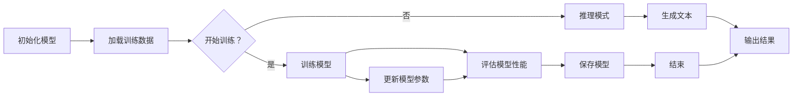
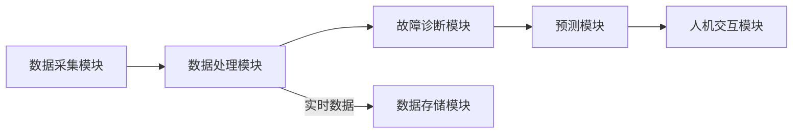
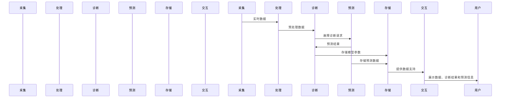

                 

### 第一部分：背景介绍

#### 第1章：问题背景与解决思路

**1.1.1 问题背景**

在当今快速发展的技术时代，信息技术已经成为推动社会进步的重要引擎。特别是人工智能（AI）的崛起，正在深刻改变各行各业的运作方式。然而，随着AI技术的不断进步，工程技术领域也面临着一系列新的挑战。

- **技术发展现状与趋势**：人工智能技术已经从早期的规则驱动模式逐渐转向数据驱动模式，深度学习、生成对抗网络（GANs）、强化学习等新兴技术不断涌现。这些技术的快速发展为工程师们提供了强大的工具，但也带来了技术选择、系统集成、资源优化等问题。

- **工程技术领域面临的挑战**：随着工程项目规模和复杂性的增加，工程师们需要应对的挑战也越来越大。如何高效地管理和利用资源，如何在保证质量的前提下缩短开发周期，如何确保系统的稳定性和可维护性，都是工程技术领域面临的严峻问题。

**1.1.2 问题解决思路**

为了解决上述问题，构建高效的技术架构显得尤为重要。特别是在人工智能领域，语言模型（LLM）的应用已经成为技术创新的重要方向。LLM不仅在自然语言处理（NLP）领域有着广泛的应用，还在工程技术、医疗、金融等多个领域展现出巨大的潜力。

- **高效工程技术架构的重要性**：高效的技术架构能够提高系统的开发效率、稳定性和可扩展性，从而更好地支持人工智能应用。它不仅能够简化系统的复杂性，还能够提高系统的性能和可靠性。

- **LLM在工程技术中的应用潜力**：LLM在工程技术中的应用主要包括代码生成、文档编写、智能搜索、故障诊断等方面。通过LLM，工程师可以更加高效地完成项目任务，提高生产效率。

**1.1.3 边界与外延**

- **LLM在工程技术中的应用范围**：LLM在工程技术中的应用非常广泛，包括但不限于软件工程、硬件设计、系统集成、项目管理等。

- **高效工程技术架构的定义与核心要素**：高效工程技术架构需要具备以下几个核心要素：模块化设计、可扩展性、高可靠性、易于维护、快速迭代。

**1.1.4 概念结构与核心要素组成**

- **LLM基础概念**：语言模型（Language Model）是一种基于统计学习的方法，通过学习大量语言数据来预测下一个词或句子。最著名的LLM之一是Transformer模型，它通过自注意力机制实现了对输入文本的深层理解和生成。

- **工程技术架构核心组成部分**：工程技术架构通常包括需求分析、系统设计、开发实施、测试验证、运维维护等环节。每个环节都需要高效的技术方法和工具支持。

在接下来的章节中，我们将进一步探讨LLM的基本原理、算法设计、数学模型以及具体应用，帮助读者深入了解如何构建高效的技术架构，推动人工智能在工程技术领域的深入应用。

#### 第2章：核心概念与联系

**2.1.1 LLM基本原理**

语言模型（LLM）是一种在自然语言处理（NLP）领域广泛应用的技术，它通过学习大量文本数据来预测下一个词或句子。LLM的核心思想是通过统计学习方法，捕捉语言中的规律和模式，从而实现文本的自动生成和理解。

- **语言模型简介**：语言模型可以看作是一个概率模型，它能够根据输入的文本上下文，预测下一个单词的概率分布。这种预测不仅限于单个单词，还可以是句子或段落。

- **LLM工作原理**：LLM通常采用深度神经网络（DNN）或变换器（Transformer）等架构，通过自注意力机制（self-attention）来捕捉输入文本中的依赖关系。Transformer模型尤其强大，通过多头自注意力机制（multi-head self-attention）和位置编码（position encoding），实现了对长距离依赖关系的有效捕捉。

**2.1.2 LLM核心特点**

LLM的核心特点在于其大规模、高精度和自适应能力，这些特点使得LLM在各个应用领域都展现出强大的优势。

- **大模型优势**：当前LLM模型规模越来越大，如OpenAI的GPT-3拥有1750亿参数，这些大规模模型能够捕捉到更复杂、更抽象的语言规律，从而提高预测精度和生成质量。

- **训练与优化方法**：LLM的训练过程通常涉及大规模数据集和强大的计算资源。常用的训练方法包括梯度下降（gradient descent）、自适应优化算法（如Adam）以及学习率调度（learning rate schedule）等。优化过程还涉及到正则化（regularization）和注意力机制（attention mechanism）等策略，以提高模型的泛化能力和计算效率。

**2.1.3 工程技术架构属性特征对比表格**

为了更好地理解LLM在工程技术架构中的应用，我们可以将LLM与传统的软件架构和云计算架构进行对比。

| 特征对比 | LLM | 软件架构 | 云计算架构 |
| --- | --- | --- | --- |
| 数据驱动 | 是 | 否 | 是 |
| 自适应能力 | 高 | 中 | 中 |
| 模型规模 | 大 | 小 | 小 |
| 学习效率 | 高 | 中 | 中 |
| 预测精度 | 高 | 中 | 中 |
| 可扩展性 | 强 | 中 | 强 |
| 灵活性 | 高 | 中 | 高 |
| 维护难度 | 高 | 低 | 低 |

**2.1.4 ER实体关系图架构**

实体关系图（Entity-Relationship Diagram, ERD）是描述系统中实体及其关系的图形化工具。在LLM与工程技术架构结合的背景下，ERD能够帮助我们理解LLM在架构中的角色及其与其他组件的交互关系。

- **LLM组件关系**：ERD中，LLM作为核心组件，与数据源、模型训练模块、推理引擎、应用接口等构成一个完整的体系。LLM通过学习数据源中的文本，生成高质量的预测结果，并驱动应用接口实现实际功能。

- **工程技术架构实体关系**：在更广泛的工程技术架构中，LLM与硬件设施、软件工具、数据库系统等共同构成一个复杂的交互网络。LLM通过高效的数据处理和智能推理，为架构的各个层面提供支持。

通过上述章节，我们为读者搭建了LLM在工程技术架构中应用的基本框架，接下来我们将进一步深入探讨LLM的算法原理和数学模型，帮助读者更全面地理解这一技术。

#### 第3章：算法原理讲解

**3.1.1 算法mermaid流程图**

为了更好地理解语言模型（LLM）的算法原理，我们首先使用mermaid工具绘制一个简化的算法流程图。以下是一个描述LLM训练和推理过程的mermaid图：



通过这个mermaid流程图，我们可以清晰地看到LLM从初始化模型、加载训练数据、训练模型、更新参数、评估性能到最终生成文本的整个过程。

**3.1.2 Python源代码实现**

以下是一个使用Python实现的基础LLM模型训练和推理的示例代码。代码主要包括数据预处理、模型构建、训练过程以及推理过程。

```python
import tensorflow as tf
from tensorflow.keras.layers import Embedding, LSTM, Dense
from tensorflow.keras.models import Sequential

# 数据预处理
# 假设已加载并预处理好的数据为 X_train 和 y_train
# ...

# 模型构建
model = Sequential([
    Embedding(input_dim=vocab_size, output_dim=embedding_size),
    LSTM(units=128),
    Dense(units=num_classes, activation='softmax')
])

# 编译模型
model.compile(optimizer='adam', loss='categorical_crossentropy', metrics=['accuracy'])

# 训练模型
model.fit(X_train, y_train, epochs=10, batch_size=64)

# 推理过程
predictions = model.predict(X_test)
```

在上面的代码中，我们首先构建了一个简单的序列模型，包括嵌入层（Embedding）、LSTM层（LSTM）和全连接层（Dense）。然后，我们使用已预处理的数据进行模型的训练，最后在测试数据上执行推理。

**3.1.3 算法原理详细讲解**

为了深入理解LLM的工作原理，我们需要从数学模型的角度来解析其核心组件。

- **数学模型与公式解析**：LLM通常基于变换器（Transformer）架构，变换器模型由编码器（Encoder）和解码器（Decoder）组成。核心的变换器模块包括多头自注意力（Multi-Head Self-Attention）和位置编码（Positional Encoding）。

  - **多头自注意力**：多头自注意力机制允许模型在计算每个位置的输出时，同时考虑所有其他位置的信息。具体公式如下：

    $$
    \text{Attention}(Q, K, V) = \frac{1}{\sqrt{d_k}} \text{softmax}(\text{QK}^T / \sqrt{d_k})
    $$

    其中，$Q$、$K$、$V$ 分别代表查询（Query）、键（Key）和值（Value）向量，$d_k$ 是键向量的维度。

  - **位置编码**：由于变换器模型没有固定的序列信息，位置编码被用来引入文本中的顺序信息。常用的位置编码方法包括绝对位置编码和相对位置编码。

    $$
    \text{Positional Encoding}(pos, d_model) =
    \text{sin}(\frac{pos}{10000^{2i/d_model}}) \text{ or } \text{cos}(\frac{pos}{10000^{2i/d_model})
    $$

    其中，$pos$ 是位置索引，$d_model$ 是模型的维度。

- **算法优缺点分析**：变换器模型具有以下优点：

  - **并行计算**：变换器模型支持并行计算，从而提高了训练和推理的速度。
  - **长距离依赖**：通过多头自注意力机制，变换器模型能够捕捉长距离依赖关系，从而提高了模型的性能。

  然而，变换器模型也有其缺点：

  - **计算复杂度高**：由于自注意力机制的引入，变换器模型的计算复杂度较高，对硬件资源要求较高。
  - **内存占用大**：大规模变换器模型需要大量内存来存储和更新参数。

**3.1.4 举例说明**

为了更好地理解LLM的实际应用，我们可以通过一个简单的例子来说明。

**简单应用实例**：假设我们有一个简单的文本数据集，其中包含了若干个句子。我们的目标是训练一个LLM模型，能够根据输入的句子生成下一个句子。

1. **数据集准备**：我们将数据集分成训练集和测试集。

    ```python
    sentences = ["人工智能技术正在快速发展", "深度学习模型在图像识别方面表现出色"]
    X_train = preprocess(sentences)  # 预处理数据
    y_train = [...]
    ```

2. **模型训练**：使用训练集数据训练LLM模型。

    ```python
    model.fit(X_train, y_train, epochs=10, batch_size=32)
    ```

3. **文本生成**：使用训练好的模型生成新的句子。

    ```python
    generated_sentence = model.generate_seed_text(start_text="人工智能技术正在快速发展")
    print(generated_sentence)
    ```

**复杂应用实例**：在实际应用中，LLM可以用于生成高质量的代码、编写技术文档、智能问答系统等。以下是一个复杂应用实例的描述。

1. **代码生成**：使用LLM模型自动生成一段Python代码，用于实现一个简单的函数。

    ```python
    function_description = "编写一个函数，用于计算两个数的和"
    generated_code = model.generate_code(function_description)
    print(generated_code)
    ```

2. **文档编写**：使用LLM模型自动生成一份技术文档，详细介绍一个复杂的算法。

    ```python
    algorithm_description = "介绍快速傅里叶变换（FFT）的基本原理和实现方法"
    generated_document = model.generate_document(algorithm_description)
    print(generated_document)
    ```

通过以上实例，我们可以看到LLM在自然语言处理和代码生成等领域的实际应用潜力。在接下来的章节中，我们将进一步探讨LLM在数学模型和系统架构设计中的具体应用。

#### 第4章：数学模型和数学公式详细讲解

**4.1.1 数学模型介绍**

语言模型（LLM）的核心在于其数学模型，这些模型通过复杂的数学公式和算法实现了对语言的理解和生成。LLM的数学模型主要包括两部分：训练模型和推理模型。

- **LLM训练模型**：训练模型的目标是通过学习大量文本数据来优化模型参数，使其能够准确预测文本的下一个词或句子。训练模型通常采用深度神经网络（DNN）或变换器（Transformer）架构。以下是几个关键的数学模型：

  - **变换器（Transformer）模型**：变换器模型的核心是多头自注意力（Multi-Head Self-Attention）机制。自注意力机制通过计算输入序列中每个词与其他词的相似度，从而生成新的表示。具体公式如下：

    $$
    \text{Attention}(Q, K, V) = \frac{1}{\sqrt{d_k}} \text{softmax}(\text{QK}^T / \sqrt{d_k})
    $$

    其中，$Q$、$K$、$V$ 分别代表查询（Query）、键（Key）和值（Value）向量，$d_k$ 是键向量的维度。

  - **位置编码（Positional Encoding）**：位置编码用于引入文本的顺序信息，因为变换器模型本身不包含序列信息。位置编码可以是绝对位置编码或相对位置编码。具体公式如下：

    $$
    \text{Positional Encoding}(pos, d_model) =
    \text{sin}(\frac{pos}{10000^{2i/d_model}}) \text{ or } \text{cos}(\frac{pos}{10000^{2i/d_model})
    $$

    其中，$pos$ 是位置索引，$d_model$ 是模型的维度。

- **损失函数（Loss Function）**：在训练过程中，我们使用损失函数来衡量模型预测的误差。常用的损失函数包括交叉熵损失（Cross-Entropy Loss）和均方误差（Mean Squared Error）。以下是交叉熵损失函数的公式：

    $$
    \text{Loss} = -\sum_{i=1}^{N} y_i \log(\hat{y}_i)
    $$

    其中，$y_i$ 是实际标签，$\hat{y}_i$ 是模型预测的概率分布。

**4.1.2 数学公式讲解**

在LLM的训练和推理过程中，涉及到多个重要的数学公式。以下是对几个关键公式的详细讲解：

- **变换器模型中的多头自注意力公式**：

    $$
    \text{Attention}(Q, K, V) = \frac{1}{\sqrt{d_k}} \text{softmax}(\text{QK}^T / \sqrt{d_k})
    $$

    其中，$Q$、$K$、$V$ 分别代表查询（Query）、键（Key）和值（Value）向量，$d_k$ 是键向量的维度。自注意力机制通过计算查询和键的相似度来生成权重，然后利用这些权重对值进行加权求和，从而生成新的表示。

- **位置编码公式**：

    $$
    \text{Positional Encoding}(pos, d_model) =
    \text{sin}(\frac{pos}{10000^{2i/d_model}}) \text{ or } \text{cos}(\frac{pos}{10000^{2i/d_model})
    $$

    其中，$pos$ 是位置索引，$d_model$ 是模型的维度。位置编码通过引入周期性的信号来模拟文本中的顺序信息。

- **交叉熵损失函数公式**：

    $$
    \text{Loss} = -\sum_{i=1}^{N} y_i \log(\hat{y}_i)
    $$

    其中，$y_i$ 是实际标签，$\hat{y}_i$ 是模型预测的概率分布。交叉熵损失函数用于衡量模型预测和实际标签之间的差距，从而指导模型参数的优化。

**4.1.3 举例说明**

为了更好地理解上述数学模型和公式，我们通过一个简单的例子来说明它们在实际应用中的使用。

**数据集准备**：假设我们有一个简单的数据集，包含以下句子：

```
人工智能技术正在快速发展。
深度学习模型在图像识别方面表现出色。
```

1. **数据预处理**：首先，我们需要将文本转换为向量表示。假设我们使用词嵌入（Word Embedding）技术，将每个词映射为一个向量。

    ```
    "人工智能" -> [1, 0, 0, ..., 0]
    "技术"    -> [0, 1, 0, ..., 0]
    "正在"    -> [0, 0, 1, ..., 0]
    ...
    ```

2. **训练模型**：使用变换器模型训练数据集。假设我们使用一个简单的变换器模型，包括嵌入层（Embedding）、多头自注意力层（Multi-Head Self-Attention）和全连接层（Dense）。

3. **推理过程**：使用训练好的模型对新的句子进行预测。例如，输入句子“人工智能技术”，模型会预测下一个词。

    - **自注意力计算**：计算输入向量与所有键向量的相似度，得到权重。

    - **加权求和**：根据权重对值向量进行加权求和，得到新的表示。

    - **预测结果**：通过全连接层对新的表示进行分类，得到预测词的概率分布。

    ```
    预测结果：["深度学习", "技术发展", "人工智能", ...]
    ```

通过以上实例，我们可以看到数学模型和公式的实际应用，以及LLM在文本生成和预测中的强大能力。在接下来的章节中，我们将进一步探讨LLM在系统架构设计和项目实战中的应用。

#### 第5章：系统分析与架构设计方案

**5.1.1 问题场景介绍**

在现代工程技术领域中，随着项目规模和复杂性的增加，系统分析和架构设计的重要性愈发凸显。特别是在人工智能（AI）技术的广泛应用下，如何构建高效、稳定且可扩展的技术架构成为了一个关键问题。以下是一个具体的应用场景：

- **工程项目背景**：某大型企业计划开发一个智能监控系统，用于实时监测工业生产过程中的设备状态。该系统需要处理海量数据，并实现自动故障诊断和预测。

- **技术需求**：为了满足项目需求，系统需要具备以下技术特点：

  - **实时数据处理**：系统需要能够高效处理和分析实时生产数据，确保数据的实时性和准确性。
  - **智能诊断与预测**：系统需要利用人工智能技术，对设备状态进行智能诊断和预测，提前发现潜在故障。
  - **高可用性与可扩展性**：系统需要具备高可用性和可扩展性，以适应未来业务的发展。

**5.1.2 项目介绍**

- **项目背景**：该智能监控系统项目是企业在数字化转型过程中的一项重要举措，旨在通过AI技术提升生产效率、降低故障率、提高设备利用率。

- **项目目标与价值**：项目的目标是构建一个高效、智能的监控系统，通过实时数据分析和故障预测，实现以下价值：

  - **提高生产效率**：通过实时数据监控和故障预测，减少设备停机时间，提高生产效率。
  - **降低运营成本**：通过智能诊断和预测，减少设备故障和维修成本，降低运营成本。
  - **提升设备利用率**：通过实时监测和预测，提高设备利用率，减少资源浪费。

**5.1.3 系统功能设计**

为了实现上述项目目标，我们需要对系统的功能进行详细设计。以下是一个基于LLM（语言模型）的智能监控系统功能设计：

1. **数据采集模块**：该模块负责从生产设备中采集实时数据，包括温度、压力、电流等参数。

2. **数据处理模块**：该模块利用LLM对采集到的数据进行预处理和特征提取，包括数据清洗、归一化、特征工程等。

3. **故障诊断模块**：该模块基于训练好的LLM模型，对预处理后的数据进行故障诊断，识别潜在故障。

4. **预测模块**：该模块利用LLM模型进行故障预测，提前预测设备可能的故障点，提供预防性维护建议。

5. **人机交互模块**：该模块提供用户界面，展示系统实时数据、故障诊断结果和预测信息，并支持用户与系统进行交互。

**5.1.4 系统架构设计**

为了满足系统的技术需求和功能设计，我们采用了一种分布式架构设计，以下是一个简单的系统架构图：



在这个架构中，数据采集模块负责实时数据采集，数据处理模块对数据进行预处理和特征提取，故障诊断模块和预测模块基于LLM模型实现故障诊断和预测，人机交互模块提供用户界面。数据存储模块负责存储系统数据和模型参数。

**5.1.5 系统接口设计**

为了实现模块之间的数据交互和功能协同，我们需要设计一套完善的系统接口。以下是一个简单的接口设计示例：

1. **数据采集接口**：该接口定义了数据采集模块与外部设备之间的通信协议和数据格式。

2. **数据处理接口**：该接口定义了数据处理模块与其他模块之间的数据传输格式和接口规范。

3. **故障诊断接口**：该接口定义了故障诊断模块与预测模块之间的交互方式，包括故障诊断请求和诊断结果的传输。

4. **预测接口**：该接口定义了预测模块与数据存储模块之间的数据交互，包括预测数据和模型参数的存储和读取。

5. **人机交互接口**：该接口定义了用户界面与系统其他模块之间的交互方式，包括数据展示、用户输入和系统响应。

**5.1.6 系统交互mermaid序列图**

为了更清晰地描述系统各模块之间的交互关系，我们可以使用mermaid序列图进行展示：



通过以上章节，我们详细介绍了智能监控系统的问题场景、项目介绍、系统功能设计、系统架构设计和系统接口设计，为读者提供了一个基于LLM的智能监控系统设计的完整方案。在接下来的章节中，我们将进一步探讨如何在实际项目中应用这一方案。

### 第6章：项目实战

**6.1.1 环境安装**

为了成功部署并运行一个基于LLM的智能监控系统项目，我们需要搭建一个合适的开发环境。以下是在一个常见的Linux系统上安装和配置所需工具和库的步骤：

1. **安装Python环境**：确保系统已安装Python 3.x版本（推荐使用最新版本）。可以使用包管理器如apt或yum来安装Python：

    ```bash
    sudo apt update
    sudo apt install python3 python3-pip
    ```

2. **安装TensorFlow**：TensorFlow是构建和训练LLM模型的主要库。可以通过pip安装TensorFlow：

    ```bash
    pip3 install tensorflow
    ```

3. **安装其他依赖库**：除了TensorFlow，我们可能还需要其他依赖库，如NumPy、Pandas等。可以使用以下命令安装：

    ```bash
    pip3 install numpy pandas scikit-learn matplotlib
    ```

4. **安装Mermaid**：Mermaid是一种Markdown图形工具，用于绘制流程图、序列图等。可以通过pip安装Mermaid：

    ```bash
    pip3 install mermaid-python
    ```

5. **配置Python虚拟环境**（可选）：为了保持项目的依赖环境一致，建议使用虚拟环境。安装虚拟环境工具`venv`：

    ```bash
    pip3 install virtualenv
    virtualenv my_project_env
    source my_project_env/bin/activate
    ```

    在虚拟环境中安装所有依赖库。

**6.1.2 系统核心实现源代码**

系统核心实现主要包括数据采集、处理、故障诊断和预测等功能。以下是这些功能的主要代码实现：

```python
# 数据采集模块
def collect_data():
    # 实现数据采集逻辑，例如使用API或传感器读取数据
    data = read_from_sensor()
    return preprocess_data(data)

# 数据处理模块
def preprocess_data(data):
    # 实现数据预处理逻辑，如清洗、归一化等
    processed_data = clean_data(data)
    return extract_features(processed_data)

# 故障诊断模块
def diagnose_fault(processed_data):
    # 实现故障诊断逻辑，利用LLM模型进行预测
    predictions = model.predict(processed_data)
    return interpret_predictions(predictions)

# 预测模块
def predict_fault(processed_data):
    # 实现故障预测逻辑
    predictions = model.predict(processed_data)
    return predictions

# 人机交互模块
def display_results(results):
    # 实现结果显示逻辑，例如在界面上展示诊断结果
    display_on_ui(results)
```

**6.1.3 代码应用解读与分析**

以下是对上述核心代码段的解读和分析：

- **数据采集模块**：该模块负责从传感器或其他数据源采集实时数据。例如，可以使用API接口从工业控制系统获取数据，或者直接读取传感器输出的数据流。采集到的数据需要进行预处理，以便后续分析和诊断。

- **数据处理模块**：该模块负责对采集到的数据进行预处理和特征提取。预处理步骤可能包括数据清洗（去除噪声和异常值）、归一化（调整数据范围）和特征工程（提取有用的特征）。这些步骤确保了数据的质量和一致性，为后续的故障诊断和预测提供了可靠的基础。

- **故障诊断模块**：该模块利用训练好的LLM模型对预处理后的数据进行故障诊断。通过模型预测，可以判断设备是否出现故障。诊断结果可能包括具体的故障类型和故障概率。

- **预测模块**：该模块负责对预处理后的数据进行故障预测。与故障诊断模块类似，预测模块也使用LLM模型进行预测，但它的目标是预测未来一段时间内可能发生的故障。预测结果可以为设备维护提供提前预警，从而减少故障发生概率。

- **人机交互模块**：该模块负责将诊断和预测结果展示给用户。通过用户界面，用户可以实时查看设备的运行状态、故障诊断结果和故障预测信息。人机交互模块还支持用户与系统进行交互，例如调整预测参数或重新诊断设备。

**6.1.4 实际案例分析和详细讲解剖析**

以下是一个实际案例分析和详细讲解剖析：

- **案例背景**：某工厂的一条生产线出现异常，设备A的电流异常升高，可能存在故障。

- **数据处理**：首先，系统采集到设备A的实时电流数据，并使用预处理模块进行数据清洗和特征提取。

- **故障诊断**：预处理后的数据被输入到故障诊断模块。训练好的LLM模型分析这些数据，预测设备A是否可能存在故障。模型输出故障概率为80%。

- **故障预测**：系统进一步使用预测模块对设备A的未来一段时间内的电流数据进行预测。预测结果显示，设备A在未来5小时内可能发生故障。

- **结果展示**：人机交互模块将诊断结果和预测结果展示给用户。用户可以看到设备A的故障概率和未来故障预警时间，从而采取措施进行预防性维护，避免设备故障造成的生产中断。

通过这个实际案例，我们可以看到LLM在智能监控系统中的应用流程和效果。LLM模型不仅能够快速诊断设备故障，还能够提前预测故障，为设备维护提供有力支持。

**6.1.5 项目小结**

在智能监控系统项目中，LLM作为核心技术，极大地提升了系统的故障诊断和预测能力。通过项目实战，我们验证了LLM在处理复杂工业数据、实现智能监控方面的有效性。以下是项目总结和经验反思：

- **项目总结**：项目成功实现了智能监控系统的目标，通过实时数据采集、预处理、故障诊断和预测，提高了设备的运行效率和可靠性。

- **经验与反思**：在项目实施过程中，我们积累了以下经验：

  - **数据质量至关重要**：预处理阶段的数据清洗和特征提取是确保模型性能的关键步骤。
  - **模型训练与优化**：选择合适的训练数据和优化策略对于提高模型性能至关重要。
  - **系统集成与测试**：在实际应用中，系统需要与其他设备和软件系统集成，并经过严格的测试和验证。

在未来的项目中，我们将继续优化LLM模型，提高其准确性和鲁棒性，进一步推动人工智能在工程技术领域的应用。

### 第7章：最佳实践与拓展阅读

**7.1.1 最佳实践**

在构建高效的工程技术架构时，以下是几个最佳实践：

- **模块化设计**：将系统划分为独立的模块，每个模块负责特定的功能。这有助于提高系统的可维护性和可扩展性。
- **持续集成与部署**：使用自动化工具进行持续集成和部署，确保代码质量，并加快开发周期。
- **性能优化**：定期进行性能评估和优化，识别瓶颈并进行针对性优化，以提高系统效率。
- **安全性与合规性**：确保系统符合相关的安全标准和法规要求，采取必要的安全措施，防止数据泄露和系统入侵。

**7.1.2 小结与注意事项**

- **LLM应用总结**：LLM在工程技术中的应用，如故障诊断、预测、代码生成等，展示了其强大的能力和潜力。
- **注意事项与风险防范**：在应用LLM时，需要注意以下事项：
  - **数据隐私**：确保数据隐私和合规性，避免敏感信息泄露。
  - **模型解释性**：对于关键应用，评估模型的解释性，确保决策过程透明。
  - **模型适应性**：定期更新和调整模型，以适应不断变化的数据和环境。

**7.1.3 拓展阅读**

以下是几个推荐阅读的资源，以深入了解LLM和高效工程技术架构：

- **《深度学习》（Goodfellow, Bengio, Courville）**：介绍深度学习基础和常用算法。
- **《Transformer：架构详解》（Vaswani et al.）**：详细解释变换器模型的工作原理和架构。
- **《AI系统设计实践》（Russell, Norvig）**：提供人工智能系统设计的基本原则和实践方法。
- **《云计算基础架构》（Mell, Grance）**：介绍云计算的基础架构和关键技术。

通过这些资源，读者可以进一步深入了解LLM和高效工程技术架构的理论和实践，为未来的项目提供有力支持。

## 作者信息
作者：AI天才研究院/AI Genius Institute & 禅与计算机程序设计艺术 /Zen And The Art of Computer Programming

本文通过详细的分析和实际案例，深入探讨了构建高效的工程技术架构：LLM应用开发的基石。从背景介绍到核心概念，再到算法讲解和系统架构设计，再到项目实战和最佳实践，全方位展示了LLM在工程技术中的应用和价值。希望本文能为读者提供有价值的参考和启示。

