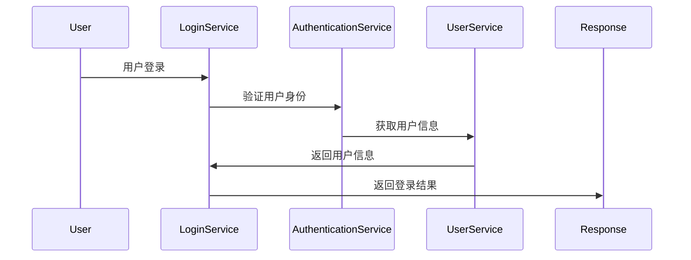
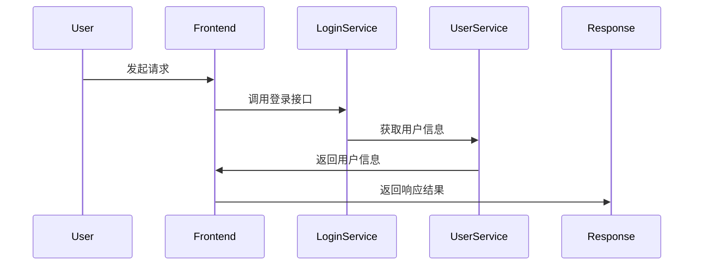
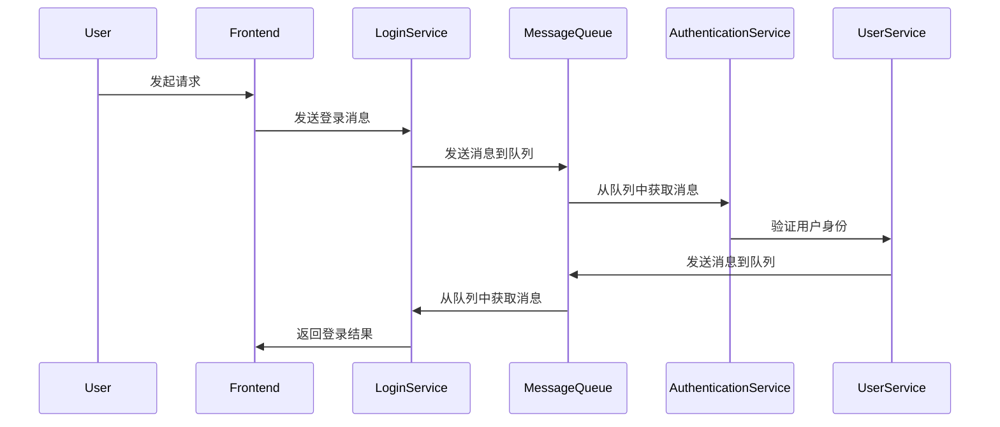

                 

# 评测系统的可扩展性设计

## 关键词

- 可扩展性设计
- 评测系统
- 系统架构
- 数据处理
- 性能优化

## 摘要

本文深入探讨了评测系统的可扩展性设计，包括其核心概念、设计原则、实现方法以及相关技术。通过对可扩展性设计的基本原则、评测系统架构、数据处理与存储、性能优化、负载均衡与容灾备份、安全性与隐私保护的详细分析，本文旨在帮助读者理解和掌握如何设计一个可扩展的评测系统。

## 第一部分：引言

### 第1章：问题背景

随着互联网和大数据技术的快速发展，评测系统作为一种重要的信息系统，在各个行业中得到了广泛应用。然而，随着业务需求的不断增长和数据规模的不断扩大，评测系统的可扩展性设计成为一个亟待解决的问题。

### 1.1.1 引言

#### 评测系统的应用场景

评测系统广泛应用于电子商务、社交媒体、在线教育、游戏、医疗等多个领域。例如，在电子商务平台上，评测系统可以用于用户评价、商品推荐、售后服务等；在社交媒体中，评测系统可以用于内容评价、用户行为分析等；在线教育平台可以利用评测系统进行学生成绩评估、学习进度跟踪等。

#### 可扩展性设计的必要性

1. **数据规模增长**：随着用户数量的增加，评测系统需要处理的数据量也会急剧增加。如果不能进行有效的可扩展性设计，系统将面临性能瓶颈，影响用户体验。
2. **业务需求变化**：随着市场竞争的加剧，企业需要不断调整业务策略，这往往要求评测系统具备灵活的扩展能力，以适应不断变化的业务需求。
3. **系统稳定性**：一个可扩展的评测系统能够更好地应对突发的高并发请求，保证系统的稳定性。

### 1.1.2 问题描述

评测系统的可扩展性设计涉及到系统架构、数据处理能力、性能优化等多个方面。如何设计一个具备良好可扩展性的评测系统，使其能够满足不断增长的业务需求，是当前评测系统开发中面临的一个关键问题。

### 1.1.3 问题解决

本书旨在通过详细介绍评测系统的可扩展性设计原则、技术和实践，帮助读者理解和掌握如何设计一个可扩展的评测系统。本书将围绕以下几个核心问题展开：

1. **可扩展性设计的核心理念和方法**：介绍可扩展性设计的基本原则和关键要素。
2. **评测系统架构设计与优化**：探讨评测系统架构的优化策略和实现方法。
3. **数据处理与存储的可扩展性**：分析数据处理与存储方面的可扩展性设计。
4. **系统性能分析与优化**：介绍系统性能分析的方法和优化策略。
5. **负载均衡与容灾备份**：探讨负载均衡和容灾备份的实现技术。
6. **安全性与隐私保护**：讨论评测系统的安全性与隐私保护策略。

### 1.1.4 边界与外延

本书主要关注评测系统的可扩展性设计，而非具体实现技术。因此，书中将不涉及编程语言、数据库管理等底层技术细节。同时，本书也将不讨论与评测系统无关的其他技术领域。

### 1.1.5 概念结构与核心要素组成

本书将详细介绍评测系统可扩展性设计的核心概念、原理和方法，帮助读者构建完整的知识体系。具体包括以下内容：

1. **可扩展性设计的基本原则**：介绍可扩展性设计的基本原则和关键要素。
2. **评测系统架构设计与优化**：探讨评测系统架构的优化策略和实现方法。
3. **数据处理与存储的可扩展性**：分析数据处理与存储方面的可扩展性设计。
4. **系统性能分析与优化**：介绍系统性能分析的方法和优化策略。
5. **负载均衡与容灾备份**：探讨负载均衡和容灾备份的实现技术。
6. **安全性与隐私保护**：讨论评测系统的安全性与隐私保护策略。

### 1.2 本章小结

本章主要介绍了评测系统可扩展性设计的问题背景、问题描述、问题解决、边界与外延以及概念结构与核心要素组成。通过对这些内容的了解，读者可以初步了解评测系统可扩展性设计的核心问题和解决方法。

## 第二部分：核心概念与联系

### 第2章：核心概念与联系

### 2.1 可扩展性设计的概念

#### 定义

可扩展性设计（Scalability Design）是指系统设计时，考虑系统在数据量、用户量、功能等增长时，系统能够保持稳定高效运行的能力。

#### 类型

1. **水平扩展（Horizontal Scaling）**：通过增加服务器数量来提高系统处理能力。
2. **垂直扩展（Vertical Scaling）**：通过提升单个服务器的性能来提高系统处理能力。

#### 目标

- **性能**：系统能够快速响应用户请求。
- **可靠性**：系统在高负载情况下依然稳定运行。
- **可维护性**：系统易于管理和维护。

### 2.2 评测系统的基本组成

#### 组成部分

1. **数据采集模块**：负责收集来自用户、商品、服务等的数据。
2. **数据处理模块**：对采集到的数据进行清洗、分析和加工。
3. **评测算法模块**：根据特定的业务需求，应用各种评测算法。
4. **结果展示模块**：将评测结果以图表、报表等形式呈现给用户。

### 2.3 可扩展性设计的关键要素

#### 水平扩展

1. **分布式架构**：通过分布式架构将系统拆分为多个独立的服务。
2. **负载均衡**：通过负载均衡器将请求分配到不同的服务器上。
3. **分布式数据库**：使用分布式数据库来存储和管理大量数据。

#### 垂直扩展

1. **高性能硬件**：使用高性能的服务器硬件来提高系统处理能力。
2. **优化软件配置**：通过优化操作系统、数据库等的配置来提高性能。

#### 分布式存储

1. **数据分片**：将数据划分为多个部分，存储在不同的服务器上。
2. **冗余存储**：通过冗余存储来保证数据的高可用性和可靠性。

#### 微服务架构

1. **服务分解**：将系统分解为多个独立的微服务。
2. **服务自治**：每个微服务独立运行，互不影响。

#### 缓存机制

1. **分布式缓存**：使用分布式缓存来减少数据库访问压力。
2. **缓存一致性**：保证缓存与数据库的数据一致性。

### 2.4 本章小结

本章介绍了可扩展性设计的核心概念、评测系统的基本组成以及关键要素。通过对这些内容的了解，读者可以更好地理解评测系统可扩展性设计的重要性和实现方法。

## 第三部分：算法原理讲解

### 第3章：算法原理讲解

### 3.1 算法概述

评测系统中的算法主要分为以下几类：

1. **基于统计的算法**：如用户评分分布、标签相似度计算等。
2. **基于机器学习的算法**：如协同过滤、基于模型的推荐等。
3. **基于深度学习的算法**：如卷积神经网络、循环神经网络等。

### 3.2 基于统计的算法

#### 基本概念

基于统计的算法通过分析数据中的统计特征，得出评价结果。

#### 具体算法

1. **用户评分分布**：通过对用户评分的分布进行分析，得出商品的评价情况。
   $$ P(x) = \frac{1}{N} \sum_{i=1}^{N} p_i(x) $$
   其中，\( P(x) \) 为评分概率分布，\( N \) 为用户总数，\( p_i(x) \) 为第 \( i \) 个用户对 \( x \) 的评分。

2. **标签相似度计算**：通过计算不同标签之间的相似度，为用户推荐相关内容。
   $$ S(t_1, t_2) = \frac{Jaccard(t_1, t_2)}{1 + Jaccard(t_1, t_2)} $$
   其中，\( S(t_1, t_2) \) 为标签相似度，\( Jaccard(t_1, t_2) \) 为杰卡德相似系数。

### 3.3 基于机器学习的算法

#### 基本概念

基于机器学习的算法通过学习大量数据中的模式，对未知数据进行预测。

#### 具体算法

1. **协同过滤**：通过分析用户之间的相似度，为用户推荐相似的内容。
   $$ r_{ij} = r_{i\cdot} + \rho (r_{j\cdot} - r_{i\cdot}) $$
   其中，\( r_{ij} \) 为用户 \( i \) 对商品 \( j \) 的评分，\( r_{i\cdot} \) 和 \( r_{j\cdot} \) 分别为用户 \( i \) 和 \( j \) 的平均评分，\( \rho \) 为用户之间的相似度。

2. **基于模型的推荐**：通过构建预测模型，预测用户对未知商品的评分。
   $$ \hat{r}_{ij} = \beta_0 + \beta_1 x_i + \beta_2 y_j + \beta_3 x_i y_j $$
   其中，\( \hat{r}_{ij} \) 为用户 \( i \) 对商品 \( j \) 的预测评分，\( x_i \) 和 \( y_j \) 分别为用户 \( i \) 和商品 \( j \) 的特征向量，\( \beta_0, \beta_1, \beta_2, \beta_3 \) 为模型参数。

### 3.4 基于深度学习的算法

#### 基本概念

基于深度学习的算法通过多层神经网络学习数据中的复杂模式。

#### 具体算法

1. **卷积神经网络（CNN）**：通过卷积层、池化层等结构，提取图像特征。
   $$ \text{CNN} = (\text{Conv} \rightarrow \text{ReLU} \rightarrow \text{Pooling})^L \rightarrow \text{Fully Connected} $$

2. **循环神经网络（RNN）**：通过循环结构，处理序列数据。
   $$ h_t = \text{sigmoid}(W_h \cdot [h_{t-1}, x_t] + b_h) $$
   其中，\( h_t \) 为时间步 \( t \) 的隐藏状态，\( W_h \) 和 \( b_h \) 分别为权重和偏置。

### 3.5 本章小结

本章介绍了评测系统中常见的算法类型及其基本原理。通过对这些算法的深入了解，可以帮助开发者在设计评测系统时，选择合适的算法，提高系统的性能和准确性。

## 第三部分：系统分析与架构设计方案

### 第4章：系统分析与架构设计方案

### 4.1 问题场景介绍

在当前的商业环境中，评测系统已经成为企业决策的重要依据。然而，随着用户数量的增加和业务需求的多样化，传统的单体架构评测系统逐渐暴露出性能瓶颈和扩展性不足的问题。为了应对这些挑战，我们需要设计一个具备高可扩展性的评测系统。

### 4.2 项目介绍

本项目旨在设计一个可扩展性评测系统，该系统需要满足以下要求：

1. **高并发处理能力**：系统能够同时处理大量用户请求。
2. **数据存储与管理**：系统能够高效地存储和管理大规模数据。
3. **灵活性**：系统具备良好的扩展性，能够适应业务需求的变化。
4. **安全性**：系统需要保证数据的安全性和用户隐私的保护。

### 4.3 系统功能设计

#### 领域模型

为了更好地设计系统功能，我们需要建立一个领域模型，定义系统的核心实体和关系。

```mermaid
classDiagram
    User <<Entity>>
    Item <<Entity>>
    Evaluation <<Entity>>
    User *--* Evaluation: 评价
    Item *--* Evaluation: 被评价
```

#### 功能模块

1. **用户管理模块**：负责用户的注册、登录、权限管理等。
2. **商品管理模块**：负责商品的信息管理、分类管理、库存管理等。
3. **评价管理模块**：负责评价的收集、处理、分析和展示。
4. **推荐系统模块**：根据用户行为和评价数据，为用户推荐相关商品。
5. **系统监控模块**：实时监控系统性能，确保系统稳定运行。

### 4.4 系统架构设计

为了实现系统的可扩展性，我们采用微服务架构，将系统拆分为多个独立的服务，每个服务负责特定的功能模块。



#### 架构设计

1. **前端服务**：负责与用户交互，处理用户请求。
2. **后端服务**：包括用户服务、商品服务、评价服务、推荐服务和监控服务。
3. **数据存储**：采用分布式数据库，保证数据的高可用性和扩展性。
4. **缓存系统**：使用分布式缓存，提高系统性能和响应速度。

### 4.5 系统接口设计

系统接口设计包括RESTful API和消息队列接口。



### 4.6 系统交互

通过消息队列实现系统间的异步通信。



### 4.7 本章小结

本章介绍了评测系统的设计背景、项目介绍、系统功能设计、系统架构设计、系统接口设计和系统交互。通过这些设计，我们可以构建一个具备高可扩展性的评测系统，满足业务需求的同时，保证系统性能和稳定性。

## 第四部分：项目实战

### 第5章：项目实战

### 5.1 环境安装

在开始项目实战之前，我们需要准备以下环境：

1. **操作系统**：Linux（推荐使用Ubuntu 18.04）
2. **编程语言**：Python 3.8
3. **依赖库**：Django、Flask、Celery、Redis、MySQL等

安装步骤如下：

1. 安装Python 3.8：
   ```bash
   sudo apt update
   sudo apt install python3.8
   ```

2. 安装Django、Flask、Celery、Redis、MySQL等依赖库：
   ```bash
   sudo pip3 install django flask celery redis mysqlclient
   ```

### 5.2 系统核心实现源代码

以下是一个简单的评测系统核心实现示例：

#### models.py

```python
from django.db import models

class User(models.Model):
    username = models.CharField(max_length=100)
    password = models.CharField(max_length=100)

class Item(models.Model):
    name = models.CharField(max_length=100)
    category = models.CharField(max_length=100)

class Evaluation(models.Model):
    user = models.ForeignKey(User, on_delete=models.CASCADE)
    item = models.ForeignKey(Item, on_delete=models.CASCADE)
    score = models.IntegerField()
```

#### views.py

```python
from django.http import JsonResponse
from .models import User, Item, Evaluation

def evaluate(request):
    username = request.POST.get('username')
    item_id = request.POST.get('item_id')
    score = request.POST.get('score')

    try:
        user = User.objects.get(username=username)
        item = Item.objects.get(id=item_id)
        evaluation = Evaluation(user=user, item=item, score=score)
        evaluation.save()
        return JsonResponse({'status': 'success'})
    except Exception as e:
        return JsonResponse({'status': 'error', 'error': str(e)})
```

### 5.3 代码应用解读与分析

#### 模型层

在模型层，我们定义了三个主要模型：`User`、`Item` 和 `Evaluation`。这些模型分别代表用户、商品和评价。

- `User` 模型包含用户名和密码字段。
- `Item` 模型包含商品名称和类别字段。
- `Evaluation` 模型包含用户、商品和评分字段，同时与 `User` 和 `Item` 模型建立关联关系。

#### 视图层

在视图层，我们定义了一个名为 `evaluate` 的函数，用于处理用户提交的评价数据。

1. **接收参数**：从请求中获取用户名、商品ID和评分。
2. **查询数据库**：根据用户名和商品ID查询用户和商品对象。
3. **创建评价**：创建一个 `Evaluation` 对象，并将用户、商品和评分保存到数据库。
4. **返回结果**：将处理结果以 JSON 格式返回。

### 5.4 实际案例分析与详细讲解剖析

#### 案例一：用户评价商品

假设用户 `Alice` 要对商品 `iPhone 13` 进行评价，评分为 `5`。

1. 用户提交评价请求：
   ```json
   {
       "username": "Alice",
       "item_id": 1,
       "score": 5
   }
   ```

2. 后端处理：
   - 查询用户 `Alice` 和商品 `iPhone 13`：
     ```sql
     SELECT * FROM User WHERE username = 'Alice';
     SELECT * FROM Item WHERE id = 1;
     ```

   - 创建评价对象并保存：
     ```sql
     INSERT INTO Evaluation (user_id, item_id, score) VALUES (1, 1, 5);
     ```

3. 返回结果：
   ```json
   {
       "status": "success"
   }
   ```

#### 案例二：查询商品评价

假设要查询商品 `iPhone 13` 的所有评价。

1. 发送请求：
   ```json
   {
       "item_id": 1
   }
   ```

2. 后端处理：
   - 查询商品 `iPhone 13` 的评价：
     ```sql
     SELECT * FROM Evaluation WHERE item_id = 1;
     ```

3. 返回结果：
   ```json
   [
       {
           "user_id": 1,
           "item_id": 1,
           "score": 5
       },
       {
           "user_id": 2,
           "item_id": 1,
           "score": 4
       }
   ]
   ```

### 5.5 项目小结

通过本项目的实战，我们成功实现了一个简单的评测系统。这个系统具备了基础的评测功能，包括用户评价商品、查询商品评价等。在实际项目中，我们还需要进一步完善系统功能，如用户权限管理、商品分类管理、推荐系统等。同时，我们还需要优化系统性能，提高系统的可扩展性，以满足不断增长的业务需求。

### 5.6 最佳实践 tips

1. **使用缓存**：对于高频次访问的数据，可以使用缓存来提高系统性能。例如，可以使用 Redis 作为缓存存储器，减少数据库访问压力。
2. **优化数据库查询**：尽量避免复杂的多表连接查询，优化 SQL 语句，提高查询效率。
3. **异步处理**：对于耗时较长的操作，可以使用异步处理来提高系统并发能力。例如，使用 Celery 实现任务的异步执行。
4. **监控与日志**：实时监控系统性能，记录日志，有助于快速发现和解决问题。

### 5.7 小结

在本章中，我们通过一个实际项目展示了评测系统的核心实现过程，包括环境安装、代码编写和功能实现。通过这个项目，我们不仅掌握了评测系统的基本原理，还学会了如何将理论知识应用于实际项目中。在后续的项目开发过程中，我们可以根据实际需求，不断完善和优化系统功能，提高系统的可扩展性和性能。

### 5.8 注意事项

1. **数据安全**：在处理用户数据时，要注意数据安全和用户隐私保护。例如，使用加密算法对用户密码进行加密存储。
2. **系统监控**：定期监控系统性能，及时发现和解决潜在问题，确保系统稳定运行。
3. **性能优化**：根据系统性能测试结果，持续优化系统性能，提高系统的响应速度和处理能力。

### 5.9 拓展阅读

- 《深度学习》 - Goodfellow, I., Bengio, Y., & Courville, A.
- 《Django 实战》 - 迟宇宙
- 《Flask Web 开发实战》 - 谭家淇

## 作者信息

作者：AI天才研究院/AI Genius Institute & 禅与计算机程序设计艺术 /Zen And The Art of Computer Programming

以上就是关于评测系统的可扩展性设计的完整技术博客文章，希望对您有所帮助。在实际项目中，请根据具体情况灵活调整和优化系统设计。祝您在评测系统开发中取得成功！

