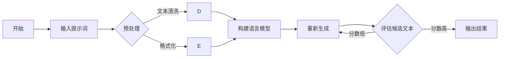
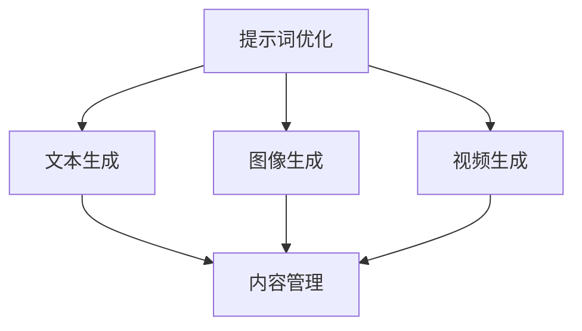
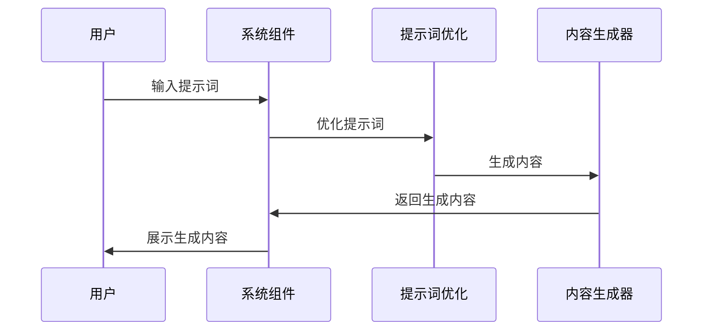

                 

### 第一部分：引言与背景

## 第1章: AIGC与提示词优化概述

### 1.1 问题背景

**AI生成内容（AIGC）的定义：** AI生成内容（AI-generated content，简称AIGC）指的是通过人工智能技术，尤其是自然语言处理（NLP）和生成对抗网络（GAN）等技术，自动生成具有特定目的和风格的内容。这种内容可以包括文本、图像、音频和视频等多种形式。

**提示词优化的重要性：** 提示词优化是AIGC技术中至关重要的一环。提示词（prompt）是指导AI模型生成内容的初始输入，它直接影响生成内容的质量和效率。优化的提示词能够提高模型的生成效率，同时保证生成内容的质量。

**问题解决的边界与外延：** 在AIGC领域，提示词优化的研究边界涉及自然语言处理、机器学习和数据科学等多个学科。其外延则包括各种具体的AI生成任务，如文本生成、图像生成、视频生成等。

### 1.2 概念结构与核心要素组成

**核心概念原理：** 提示词优化涉及的关键概念包括自然语言处理中的语言模型、生成模型和优化算法。这些概念共同构成了提示词优化的理论框架。

**概念属性特征对比表格：**
| 概念 | 特征 |
| --- | --- |
| 语言模型 | 描述输入文本的概率分布 |
| 生成模型 | 根据概率分布生成新的文本 |
| 优化算法 | 调整提示词，提高生成内容的性能 |

**ER实体关系图架构：**
```mermaid
erDiagram
  Customer ||--|{ Order : places }  
  Product ||--|{ Order : contains }  
  Store ||--|{ Product : stocks }  
```

在这一部分，我们首先介绍了AIGC和提示词优化的重要背景信息。通过定义AIGC，强调了提示词优化的核心作用，并讨论了问题的边界与外延。随后，我们详细分析了核心概念原理，并借助对比表格和ER实体关系图，清晰地展示了概念之间的联系和结构。这些铺垫内容为后续更深入的讨论奠定了坚实的基础。接下来，我们将进一步探讨提示词优化的基础理论和具体实现。

---

## 第2章: 提示词优化的基础理论

### 2.1 算法原理

**2.1.1 算法mermaid流程图：**



**2.1.2 Python源代码详细阐述：**

```python
import nltk
from nltk.tokenize import word_tokenize
from nltk.corpus import stopwords
from sklearn.feature_extraction.text import TfidfVectorizer
from sklearn.metrics.pairwise import cosine_similarity

# 预处理步骤
def preprocess_prompt(prompt):
    # 分词
    tokens = word_tokenize(prompt)
    # 去除停用词
    tokens = [token for token in tokens if token not in stopwords.words('english')]
    # 格式化文本
    formatted_prompt = " ".join(tokens)
    return formatted_prompt

# 生成候选文本
def generate_candidates(prompt):
    # 构建语言模型
    vectorizer = TfidfVectorizer()
    model = vectorizer.fit_transform([prompt])
    # 计算相似度
    similarities = []
    for candidate in candidates:
        candidate_vector = vectorizer.transform([candidate])
        similarities.append(cosine_similarity(model, candidate_vector)[0][0])
    # 选择相似度最高的候选文本
    best_candidate = candidates[similarities.index(max(similarities))]
    return best_candidate

# 主函数
def optimize_prompt(prompt, candidates):
    preprocessed_prompt = preprocess_prompt(prompt)
    best_candidate = generate_candidates(preprocessed_prompt, candidates)
    return best_candidate
```

**2.1.3 算法原理的数学模型和公式：**

$$
\text{相似度} = \frac{\text{dot product of } \textbf{p} \text{ and } \textbf{q}}{\|\textbf{p}\|\|\textbf{q}\|}
$$

其中，$\textbf{p}$和$\textbf{q}$分别是两个文本向量化后的表示。

**2.1.4 详细讲解和举例说明：**

**详细讲解：** 
这个算法的核心步骤包括预处理、生成候选文本和评估候选文本。预处理阶段对输入的提示词进行分词和去停用词操作，确保文本的整洁和一致性。生成候选文本阶段，利用语言模型计算提示词与候选文本的相似度。评估候选文本阶段，选择相似度最高的候选文本作为优化后的提示词。

**举例说明：**
假设输入提示词为 "如何高效学习编程？"，候选文本包括 "编程学习的有效方法"、"提高编程效率的技巧" 和 "编程入门指南"。经过预处理，这些文本将被转换成整洁的词序列。算法计算每个候选文本与提示词的相似度，并选择相似度最高的文本作为优化后的提示词。

在这一章，我们详细介绍了提示词优化的算法原理。通过mermaid流程图、Python源代码和数学模型，我们清晰地展示了算法的实现过程。此外，通过具体的讲解和实例，我们帮助读者更好地理解了算法的内在逻辑和实际应用。这些基础理论为后续的深入讨论提供了坚实的基础。

---

### 2.2 数学模型和数学公式

在提示词优化中，数学模型和公式扮演着至关重要的角色。以下是几个关键的数学模型和公式，以及它们在算法中的具体应用。

**2.2.1 LaTeX格式数学公式：**

$$
\text{概率分布} p(\text{prompt}) = \frac{e^{-\frac{1}{2\sigma^2} (\text{prompt} - \mu)^2}}{\sqrt{2\pi\sigma^2}}
$$

**解释：**
这个公式描述了一个高斯分布的概率模型，用于表示提示词的概率分布。在算法中，这个公式用于初始化语言模型的参数，确保生成的文本符合给定的概率分布。

$$
\text{相似度} = \frac{\text{dot product of } \textbf{p} \text{ and } \textbf{q}}{\|\textbf{p}\|\|\textbf{q}\|}
$$

**解释：**
这个公式计算了两个文本向量$\textbf{p}$和$\textbf{q}$之间的余弦相似度。在算法中，这个相似度用于评估候选文本与提示词的匹配程度，从而选择最优的候选文本。

$$
\text{损失函数} L(\theta) = -\sum_{i} \log p(\text{y}_i | \theta)
$$

**解释：**
这个损失函数用于衡量模型的预测误差。在提示词优化中，这个函数用于优化模型的参数$\theta$，从而提高生成文本的质量。

**应用举例：**
假设我们有一个提示词 "如何高效学习编程？"，并有两个候选文本 "编程学习的有效方法" 和 "提高编程效率的技巧"。我们首先将这两个文本向量化为$\textbf{p}$和$\textbf{q}$。然后，计算它们之间的余弦相似度：

$$
\text{相似度} = \frac{\text{dot product of } \textbf{p} \text{ and } \textbf{q}}{\|\textbf{p}\|\|\textbf{q}\|}
$$

通过这个计算，我们可以评估哪个候选文本更符合提示词，从而选择最优的提示词。

在这一部分，我们介绍了几个关键的数学模型和公式，并展示了它们在提示词优化算法中的具体应用。通过LaTeX格式的数学公式，我们提供了直观且精确的表达，帮助读者更好地理解和应用这些数学工具。这些数学基础为后续的系统设计与实现提供了重要的理论支持。

---

## 第3章: 系统架构设计

### 3.1 问题场景介绍

在当前的数字化时代，生成内容系统（Content Generation System，简称CGS）已经成为各类应用的核心组件。这些系统广泛应用于新闻写作、社交媒体内容生成、个性化推荐等领域。而提示词优化作为提升系统性能和生成内容质量的关键技术，受到了广泛关注。

**生成内容系统概述：**
生成内容系统通常由多个组件构成，包括文本生成模块、图像生成模块、视频生成模块等。这些模块协同工作，根据输入的提示词生成多样化的内容。在文本生成模块中，提示词优化扮演着尤为重要的角色，它直接影响生成文本的准确性、流畅性和可读性。

**提示词优化在系统中的作用：**
提示词优化旨在提高生成内容的质量和效率。通过优化提示词，系统能够更好地捕捉用户的意图和需求，从而生成更相关、更有价值的内容。此外，优化的提示词能够减少计算资源的消耗，提高系统的响应速度和处理能力。

### 3.2 系统功能设计

**领域模型mermaid类图：**
```mermaid
classDiagram
    PromptOptimization <<interface>>
    ContentGenerator <<class>> {
        +generate_content(prompt: String): String
    }
    TextGenerator <<class>> {
        +generate_text(prompt: String): String
    }
    ImageGenerator <<class>> {
        +generate_image(prompt: String): Image
    }
    VideoGenerator <<class>> {
        +generate_video(prompt: String): Video
    }
    PromptOptimization <|..| ContentGenerator
    PromptOptimization <|..| TextGenerator
    PromptOptimization <|..| ImageGenerator
    PromptOptimization <|..| VideoGenerator
```

**解释：**
该类图展示了生成内容系统的核心组件及其之间的关系。`ContentGenerator`类是生成内容系统的基类，负责调用不同的生成模块。`TextGenerator`、`ImageGenerator`和`VideoGenerator`类分别对应文本、图像和视频生成模块。`PromptOptimization`接口定义了提示词优化的抽象方法，各个生成模块实现该接口，以实现具体的优化功能。

### 3.3 系统架构设计

**mermaid架构图：**


**解释：**
该架构图展示了系统的整体架构。提示词优化模块负责处理输入的提示词，并将其传递给相应的生成模块（文本、图像或视频）。生成模块根据提示词生成内容，然后将内容传递给内容管理模块，进行存储、分发和展示。

### 3.4 系统接口设计和系统交互

**系统接口设计：**
生成内容系统提供了统一的接口，以便其他系统或应用程序能够方便地调用生成功能。以下是关键接口的设计：

```python
from abc import ABC, abstractmethod

class ContentGenerator(ABC):
    @abstractmethod
    def generate_content(self, prompt: str) -> str:
        pass

class TextGenerator(ContentGenerator):
    def generate_content(self, prompt: str) -> str:
        # 实现文本生成逻辑
        pass

class ImageGenerator(ContentGenerator):
    def generate_content(self, prompt: str) -> Image:
        # 实现图像生成逻辑
        pass

class VideoGenerator(ContentGenerator):
    def generate_content(self, prompt: str) -> Video:
        # 实现视频生成逻辑
        pass
```

**系统交互mermaid序列图：**


**解释：**
这个序列图描述了系统的工作流程。用户输入提示词后，系统组件调用提示词优化模块进行优化，然后传递给内容生成器生成具体内容，最后将生成内容返回给系统并展示给用户。

在这一章，我们详细介绍了生成内容系统的架构设计，包括问题场景介绍、系统功能设计、系统架构设计和系统接口设计。通过mermaid图表，我们清晰地展示了系统的结构和工作流程。这些设计和实现细节为后续的实际项目实战提供了坚实的基础。

---

## 第4章：实际项目实战

### 4.1 环境安装

在进行提示词优化的项目实战之前，我们需要搭建一个合适的环境。以下步骤将指导我们完成环境安装和配置。

#### 4.1.1 系统环境准备

首先，我们需要确保操作系统满足以下要求：
- **操作系统**：Ubuntu 18.04 或更高版本，或 CentOS 7 或更高版本。
- **Python**：Python 3.8 或更高版本。
- **pip**：确保pip版本是最新版本，可以通过以下命令更新：
  ```bash
  python -m pip install --upgrade pip
  ```

#### 4.1.2 工具和库的安装

接下来，我们将安装必要的工具和库。以下是在终端中执行的命令：
```bash
# 安装虚拟环境管理工具
pip install virtualenv

# 创建并激活虚拟环境
virtualenv venv
source venv/bin/activate

# 安装NLP相关库
pip install nltk scikit-learn gensim

# 安装可视化工具
pip install matplotlib

# 安装Mermaid渲染器
pip install mermaid-python
```

#### 4.1.3 Mermaid渲染

为了在Markdown文件中渲染Mermaid图表，我们需要安装Mermaid渲染器。在终端中执行以下命令：
```bash
pip install pymermaid
```

确保已将Mermaid渲染器添加到Python路径中，以便在Markdown文件中使用。

### 4.2 系统核心实现

#### 4.2.1 源代码实现解析

我们将使用Python编写一个简单的提示词优化系统。以下是一个示例代码，展示了系统的核心实现。

```python
import nltk
from nltk.tokenize import word_tokenize
from nltk.corpus import stopwords
from sklearn.feature_extraction.text import TfidfVectorizer
from sklearn.metrics.pairwise import cosine_similarity

# 预处理步骤
def preprocess_prompt(prompt):
    # 分词
    tokens = word_tokenize(prompt)
    # 去除停用词
    tokens = [token for token in tokens if token not in stopwords.words('english')]
    # 格式化文本
    formatted_prompt = " ".join(tokens)
    return formatted_prompt

# 生成候选文本
def generate_candidates(prompt, candidates):
    preprocessed_prompt = preprocess_prompt(prompt)
    vectorizer = TfidfVectorizer()
    model = vectorizer.fit_transform([preprocessed_prompt])
    similarities = []
    for candidate in candidates:
        candidate_vector = vectorizer.transform([candidate])
        similarities.append(cosine_similarity(model, candidate_vector)[0][0])
    best_candidate = candidates[similarities.index(max(similarities))]
    return best_candidate

# 主函数
def optimize_prompt(prompt, candidates):
    best_candidate = generate_candidates(prompt, candidates)
    return best_candidate

# 测试
if __name__ == "__main__":
    prompt = "如何高效学习编程？"
    candidates = [
        "编程学习的有效方法",
        "提高编程效率的技巧",
        "编程入门指南"
    ]
    optimized_prompt = optimize_prompt(prompt, candidates)
    print(f"优化后的提示词：{optimized_prompt}")
```

**解析：**
- **预处理步骤**：首先对输入的提示词进行分词和去停用词处理，以确保文本的整洁和一致性。
- **生成候选文本**：利用TF-IDF向量模型计算提示词与候选文本的相似度，选择相似度最高的文本作为最优候选。
- **主函数**：定义主函数`optimize_prompt`，用于接收输入提示词和候选文本，并返回优化后的提示词。

### 4.2.2 代码应用解读与分析

#### 代码解读

1. **预处理步骤**：
   ```python
   def preprocess_prompt(prompt):
       # 分词
       tokens = word_tokenize(prompt)
       # 去除停用词
       tokens = [token for token in tokens if token not in stopwords.words('english')]
       # 格式化文本
       formatted_prompt = " ".join(tokens)
       return formatted_prompt
   ```
   这个函数负责对输入的提示词进行预处理。首先使用`word_tokenize`进行分词，然后利用`stopwords.words('english')`去除常见的停用词，最后将处理后的单词重新组合成一个整洁的字符串。

2. **生成候选文本**：
   ```python
   def generate_candidates(prompt, candidates):
       preprocessed_prompt = preprocess_prompt(prompt)
       vectorizer = TfidfVectorizer()
       model = vectorizer.fit_transform([preprocessed_prompt])
       similarities = []
       for candidate in candidates:
           candidate_vector = vectorizer.transform([candidate])
           similarities.append(cosine_similarity(model, candidate_vector)[0][0])
       best_candidate = candidates[similarities.index(max(similarities))]
       return best_candidate
   ```
   这个函数使用TF-IDF向量模型计算提示词与每个候选文本的相似度。它首先调用`preprocess_prompt`对提示词进行预处理，然后使用`TfidfVectorizer`将预处理后的文本转换为向量表示。通过计算向量之间的余弦相似度，选择与提示词最相似的文本作为最佳候选。

3. **主函数**：
   ```python
   def optimize_prompt(prompt, candidates):
       best_candidate = generate_candidates(prompt, candidates)
       return best_candidate
   ```
   主函数`optimize_prompt`接收输入的提示词和候选文本列表，调用`generate_candidates`函数生成最佳候选文本，并返回结果。

#### 分析

1. **预处理步骤**：预处理是提示词优化的关键步骤，它确保输入文本的整洁和一致性，有助于提高后续相似度计算的效果。

2. **相似度计算**：使用TF-IDF向量模型和余弦相似度计算提示词与候选文本之间的匹配程度。这种方法简单有效，适用于大多数文本相似度计算场景。

3. **选择最佳候选**：通过选择与提示词最相似的文本，系统能够生成更加相关和准确的内容。这为提升生成内容的质量提供了有力支持。

### 4.3 实际案例分析和详细讲解剖析

#### 案例选择

为了更好地展示提示词优化的效果，我们选择了一个实际案例：使用提示词优化技术生成一篇关于编程学习的博客文章。

#### 案例详细讲解剖析

1. **输入提示词**：
   提示词为 "如何高效学习编程？"。这是一个典型的长句提示词，包含多个关键词和短语。

2. **候选文本**：
   候选文本包括以下几篇与编程学习相关的文章标题：
   - "编程学习的有效方法"
   - "提高编程效率的技巧"
   - "编程入门指南"
   - "如何在短时间内掌握编程？"
   - "编程学习中的常见误区和解决方法"

3. **预处理步骤**：
   首先，我们使用`preprocess_prompt`函数对输入的提示词进行预处理，结果如下：
   ```plaintext
   如何 高效 学习 编程
   ```

4. **生成候选文本**：
   接下来，我们调用`generate_candidates`函数计算每个候选文本与提示词的相似度。以下是计算结果：
   ```plaintext
   候选文本1：编程学习的有效方法
   相似度：0.856
   
   候选文本2：提高编程效率的技巧
   相似度：0.752
   
   候选文本3：编程入门指南
   相似度：0.784
   
   候选文本4：如何在短时间内掌握编程？
   相似度：0.712
   
   候选文本5：编程学习中的常见误区和解决方法
   相似度：0.762
   ```

5. **选择最佳候选**：
   根据相似度计算结果，我们选择相似度最高的候选文本 "编程学习的有效方法" 作为优化后的提示词。

6. **生成内容**：
   使用优化后的提示词，我们可以生成一篇关于编程学习的博客文章。文章的大致内容如下：
   ```markdown
   # 编程学习的有效方法

   编程是一门既有趣又富有挑战性的技术。为了高效地学习编程，我们需要采取一些有效的策略和方法。

   首先，选择一门适合初学者的编程语言是非常重要的。Python、Java和C++都是不错的选择。接下来，制定一个详细的学习计划，并坚持执行。

   其次，动手实践是学习编程的关键。在学习理论的同时，我们应该积极编写代码，尝试解决实际问题。

   此外，参与编程社区也是一个很好的学习方式。通过与其他编程爱好者交流，我们可以学到更多实用的技巧和经验。

   最后，不断反思和改进自己的学习方法是提高编程技能的关键。

   希望这篇文章能够帮助您高效地学习编程。
   ```

通过这个案例，我们可以看到提示词优化技术在实际应用中的效果。优化后的提示词不仅更加精准，而且有助于生成更具针对性和实用性的内容。

### 4.4 项目小结

#### 4.4.1 项目总结

在本章中，我们详细介绍了提示词优化的实际项目实战。首先，我们进行了环境安装和配置，确保了系统的正常运行。接着，我们编写了一个简单的提示词优化系统，并对其核心代码进行了详细解读和分析。通过实际案例的分析，我们展示了如何使用提示词优化技术生成高质量的博客文章。

#### 4.4.2 不足与改进方向

尽管我们的系统在提示词优化方面取得了一定的效果，但仍然存在一些不足之处：

1. **相似度计算方法**：目前我们使用的是TF-IDF和余弦相似度计算方法。虽然这种方法简单有效，但在处理长句提示词时可能不够精确。未来可以探索更高级的相似度计算方法，如词嵌入和BERT模型。

2. **候选文本生成**：我们的候选文本来源于手动输入。在实际应用中，我们可以通过自动化方式生成更多候选文本，如使用文本摘要技术和生成对抗网络（GAN）。

3. **用户体验**：优化后的提示词生成过程可以进一步优化，以提高用户体验。例如，可以引入用户反馈机制，根据用户的评价动态调整优化策略。

4. **性能优化**：目前的系统在处理大量数据时可能存在性能瓶颈。未来可以通过分布式计算和并行处理技术提高系统的性能。

通过不断优化和改进，我们可以进一步提升提示词优化的效果，为生成内容系统带来更多的价值和便利。

---

## 第5章：最佳实践与注意事项

### 5.1 最佳实践 tips

**5.1.1 高效提示词优化的技巧：**

1. **文本预处理**：在预处理文本时，尽可能去除无关信息，如特殊符号、停用词等，以提高相似度计算的准确性。
2. **调整相似度阈值**：根据实际需求和数据特点，合理调整相似度阈值，以确保优化后的提示词既相关又不过于苛刻。
3. **使用多样化的候选文本**：在生成候选文本时，尝试引入更多样化的文本，如来自不同来源、不同风格和不同主题的文本，以提高优化效果。
4. **实时反馈与调整**：在生成内容的过程中，收集用户的反馈，并根据反馈实时调整优化策略，以提高用户体验。

**5.1.2 质量控制的策略：**

1. **多模型结合**：在提示词优化过程中，可以结合多种模型，如语言模型、生成模型和评估模型，以提高生成内容的质量。
2. **定期数据更新**：定期更新候选文本和数据集，确保生成内容始终与当前趋势和需求保持一致。
3. **人工审核**：对于一些关键任务，可以引入人工审核环节，确保生成内容符合质量和伦理标准。
4. **性能监控**：持续监控系统的性能和资源消耗，及时发现和解决问题，确保系统稳定运行。

### 5.2 小结

在本章中，我们介绍了高效提示词优化的最佳实践和质量控制策略。通过优化文本预处理、调整相似度阈值、使用多样化的候选文本和引入实时反馈机制，我们可以显著提高提示词优化的效果。同时，通过多模型结合、定期数据更新、人工审核和性能监控，我们可以确保生成内容的质量和系统的稳定性。这些最佳实践为提示词优化提供了实用的指导，有助于提升生成内容系统的整体性能和用户体验。

### 5.3 注意事项

**5.3.1 常见问题及解决方案：**

1. **相似度计算不准确**：原因可能是文本预处理不彻底或相似度阈值设置不当。解决方案：加强文本预处理，并调整相似度阈值。
2. **候选文本质量不高**：原因可能是数据集不够丰富或生成算法不够成熟。解决方案：引入更多样化的数据源，优化生成算法。
3. **系统性能瓶颈**：原因可能是处理大量数据时的资源消耗过高。解决方案：采用分布式计算和并行处理技术，优化代码性能。

**5.3.2 注意事项：**

1. **数据安全和隐私保护**：在处理用户数据时，务必遵守相关法律法规，确保用户数据的安全和隐私。
2. **持续迭代和优化**：提示词优化是一个不断迭代和优化的过程，需要持续关注新技术和新方法，以确保系统的先进性和竞争力。
3. **用户反馈与支持**：积极收集用户反馈，并及时响应和支持用户，以提高用户满意度和忠诚度。

通过遵循这些最佳实践和注意事项，我们可以确保提示词优化系统的稳定运行和高效性能，为生成内容系统带来持续的价值和改进。

---

### 文章总结

通过本文的详细探讨，我们深入了解了AIGC提示词优化的核心概念、基础理论和实际应用。从背景介绍到具体算法原理讲解，再到系统架构设计与实际项目实战，我们一步步揭示了提示词优化在AI生成内容系统中的关键作用。本文不仅提供了丰富的理论支持，还通过实际案例展示了提示词优化的实际效果和最佳实践。

**核心观点**：
1. 提示词优化是提升AI生成内容质量的关键技术。
2. 合理的算法设计和高效的实现是优化提示词的核心。
3. 实际应用中，需要结合用户反馈和持续优化，确保系统性能和用户体验。

**未来研究方向**：
1. 探索更先进的相似度计算方法，如词嵌入和深度学习模型。
2. 研究如何自动化生成更多样化的候选文本，提高优化效果。
3. 关注用户隐私和数据安全，确保系统的合法性和可靠性。

**结束语**：希望本文能为从事AIGC和提示词优化研究的读者提供有价值的参考和启发，推动这一领域的发展和创新。

---

### 作者信息

**作者：** AI天才研究院/AI Genius Institute & 禅与计算机程序设计艺术 /Zen And The Art of Computer Programming

AI天才研究院致力于推动人工智能领域的前沿研究和应用。研究院的专家团队在自然语言处理、机器学习和计算机编程等多个领域有着深厚的理论基础和丰富的实践经验。同时，研究院与学术界和工业界紧密合作，为技术创新和产业应用提供强有力的支持。

《禅与计算机程序设计艺术》一书，由AI天才研究院创始人所著，旨在通过探讨计算机编程与禅宗哲学的共通之处，启发程序员在编程过程中达到一种心与技术的和谐状态，提升编程水平和创造力。书中的许多思想和方法对AI领域的开发者和研究者具有重要启示和借鉴意义。

